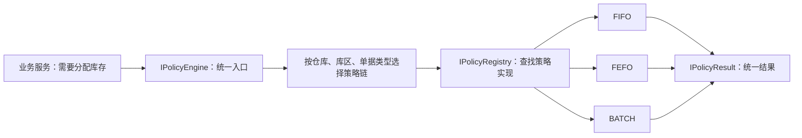
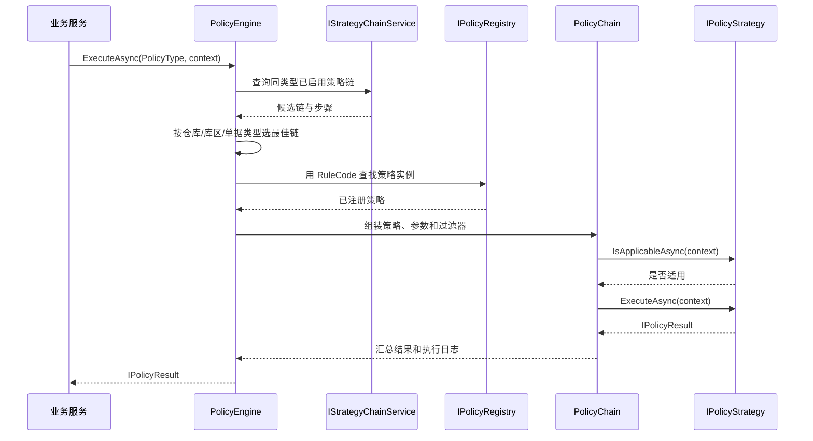

# KH.WMS.Algorithms API

`KH.WMS.Algorithms` 提供 WMS 策略引擎、策略链、内置库存/货位算法、策略配置服务和三组 HTTP 控制器。程序集目标框架为 `.NET 8.0`，版本为 `0.1.0.0`。

## 0. 先理解这个模块在解决什么问题

WMS 中有一类需求经常变化，但变化的是“怎么选”，而不是“要不要做”。例如：

- 出库时到底按 FIFO、FEFO，还是指定批次分配库存？
- 入库时应该优先放到 ABC 库区、同品类库区，还是双深位？
- 同一套系统部署到不同仓库后，能否使用不同规则？
- 一条规则找不到结果时，是立即失败，还是继续尝试下一条规则？

如果把这些判断全部写进一个业务 Service，代码很快会变成大量 `if/else`，并且每次调整仓库规则都要修改、测试和发布业务代码。`KH.WMS.Algorithms` 使用“策略模式 + 策略链”把这些可变规则从业务流程中拆出来。



这套设计的核心价值：

| 设计 | 原理 | 好处 |
| --- | --- | --- |
| 业务代码依赖 `IPolicyEngine` | 调用方只依赖稳定接口，不依赖具体算法类 | 新增算法时业务 Service 通常不需要修改 |
| 每条算法实现 `IPolicyStrategy` | 用统一协议描述编码、适用范围、优先级和执行方法 | 算法可以独立开发、测试和注册 |
| `PolicyContext` 传递输入 | 把通用筛选字段和扩展参数放入同一个上下文 | 策略之间可以共享数据，不必不断修改方法签名 |
| `PolicyResult` 统一输出 | 区分成功、跳过、失败，并保留执行日志 | 调用方能正确处理“无适用策略”和“算法异常” |
| 策略链由配置组装 | 数据库决定哪些规则参与、如何排序 | 不同仓库可使用不同组合，减少硬编码 |

### 0.1 两种 API 不要混淆

本文同时介绍两类入口：

1. **.NET API**：业务模块在同一个后端进程中通过依赖注入调用，例如 `IPolicyEngine.ExecuteAsync`。这是执行算法的主要方式。
2. **HTTP API**：前端或外部系统通过 `/api/strategy-config`、`/api/strategy-chain` 管理配置、查看运行时注册信息。当前没有“通过 HTTP 直接执行任意策略”的控制器。

### 0.2 推荐阅读顺序

如果你是第一次接触该模块，建议依次阅读：

1. [策略执行 API](#3-策略执行-api)，先会调用。
2. [一个完整业务场景](#10-完整场景从出库需求到-fifo-分配结果)，理解数据如何流动。
3. [策略链内部原理](#11-策略链内部原理)，理解为什么会选择某条规则。
4. [自定义策略教程](#12-自定义策略教程)，学习如何扩展。
5. [HTTP 配置联调](#13-http-配置联调示例)，最后再看管理端接口。

## 1. 模块入口

| 场景 | 推荐入口 |
| --- | --- |
| 按策略类型执行并应用数据库策略链 | `IPolicyEngine.ExecuteAsync(PolicyType, context, cancellationToken)` |
| 直接执行已注册策略 | `IPolicyEngine.ExecuteAsync(policyCode, context, cancellationToken)` |
| 执行内存注册的指定策略链 | `IPolicyEngine.ExecuteChainAsync(chainCode, context, cancellationToken)` |
| 查询运行时已注册策略 | `IStrategyQueryService` 或 `/api/strategy/query/*` |
| 管理策略配置 | `IStrategyConfigService` 或 `/api/strategy-config/*` |
| 管理策略链及步骤 | `IStrategyChainService` 或 `/api/strategy-chain/*` |
| 自定义策略 | 实现 `IPolicyStrategy`，通常继承 `PolicyStrategyBase` 或对应领域基类 |

## 2. 注册与启动

模块服务使用 `RegisteredServiceAttribute`，由 Core 的 `ServiceExtensions` 扫描注册；策略实现由 `StrategyAutofacModule` 扫描后以单例注册到 `IPolicyRegistry`。

```csharp
using Autofac;
using Autofac.Extensions.DependencyInjection;
using KH.WMS.Algorithms.Strategy.Services;
using KH.WMS.Core.DependencyInjection;
using KH.WMS.Core.Setup;

var builder = WebApplication.CreateBuilder(args);

builder.Host
    .UseServiceProviderFactory(new AutofacServiceProviderFactory())
    .ConfigureContainer<ContainerBuilder>(container =>
    {
        container.RegisterModule(new ServiceExtensions());
        container.RegisterModule(new StrategyAutofacModule());
    });

builder.Services.AddInfrastructure(builder.Configuration, builder.Environment);
builder.Services.AddControllers();
```

运行策略前还需要 Core 提供的 `ILoggerService`、SqlSugar 仓储/工作单元，以及三个算法查询服务所需的数据表。

## 3. 策略执行 API

### 3.1 `IPolicyEngine`

```csharp
Task<IPolicyResult> ExecuteAsync(
    PolicyType policyType,
    IPolicyContext context,
    CancellationToken cancellationToken = default);

Task<IPolicyResult> ExecuteAsync(
    string policyCode,
    IPolicyContext context,
    CancellationToken cancellationToken = default);

Task<IPolicyResult> ExecuteChainAsync(
    string chainCode,
    IPolicyContext context,
    CancellationToken cancellationToken = default);
```

三种调用方式的差异：

| 方法 | 行为 |
| --- | --- |
| 按 `PolicyType` | 从数据库选择已启用的最佳策略链；找不到时回退到该类型全部已注册策略 |
| 按 `policyCode` | 从 `IPolicyRegistry` 取单个策略，检查启用状态和适用性后执行 |
| 按 `chainCode` | 只执行已经注册到内存注册表的链；不存在时返回失败结果 |

按类型选择数据库策略链时，实际匹配条件是 `WarehouseId`、`ZoneId` 和 `DocType`；匹配分数相同则按 `Priority` 降序，仍未命中时使用 `IsDefault=1` 的链。

### 3.2 `PolicyContext`

| 属性 | 类型 | 用途 |
| --- | --- | --- |
| `WarehouseId` / `WarehouseCode` | `long?` / `string?` | 仓库范围 |
| `ZoneId` | `long?` | 库区范围 |
| `MaterialId` / `MaterialCategoryId` | `long?` | 物料适用性匹配 |
| `DocType` / `OrderType` | `string?` | 单据和订单类型 |
| `BusinessCode` | `string?` | 日志中的业务单号 |
| `InputParameters` | `object?` | 调用方自定义整体输入 |
| `ContextData` | `IDictionary<string, object?>` | 策略间共享数据 |
| `SetData<T>` / `GetData<T>` | 方法 | 按约定键写入、读取策略参数 |

优先使用 `StrategyParams` 中定义的键，不要在调用方重复硬编码字符串。

### 3.3 `IPolicyResult`

| 属性 | 说明 |
| --- | --- |
| `IsSuccess` | 执行是否成功 |
| `IsHandled` | 策略是否真正处理了当前上下文；跳过结果为 `false` |
| `Output` | 具体结果对象，按策略类型转换 |
| `ErrorMessage` | 失败、跳过或部分失败说明 |
| `Duration` | 总耗时，毫秒 |
| `ExecutionLogs` | 策略链逐步骤执行日志 |

`PolicyResult.Success(output)`、`Failure(message)`、`Skipped(reason)` 可用于自定义策略返回结果。

### 3.4 FIFO 调用示例

```csharp
using KH.WMS.Algorithms.Strategy;
using KH.WMS.Algorithms.Strategy.Constants;
using KH.WMS.Algorithms.Strategy.Interfaces;
using KH.WMS.Algorithms.Strategy.Strategies;

public static async Task<InventoryAllocationResult> AllocateAsync(
    IPolicyEngine engine,
    CancellationToken cancellationToken)
{
    var context = new PolicyContext
    {
        WarehouseCode = "WH01",
        BusinessCode = "SO202607100001"
    };

    context.SetData(
        StrategyParams.InventoryAllocationInput.WAREHOUSE_CODE,
        "WH01");
    context.SetData(
        StrategyParams.InventoryAllocationInput.MATERIAL_CODE,
        "MAT-001");
    context.SetData(
        StrategyParams.InventoryAllocationInput.REQUIRED_QTY,
        12.5m);

    var result = await engine.ExecuteAsync("FIFO", context, cancellationToken);
    if (!result.IsSuccess || result.Output is not InventoryAllocationResult allocation)
        throw new InvalidOperationException(result.ErrorMessage ?? "库存分配失败");

    return allocation;
}
```

库存不足不等同于调用失败：检查 `InventoryAllocationResult.IsFullySatisfied`、`TotalAllocatedQty` 和 `ShortageQty`。

## 4. 策略扩展 API

### 4.1 `IPolicyStrategy`

```csharp
Task<bool> IsApplicableAsync(
    IPolicyContext context,
    CancellationToken cancellationToken = default);

Task<IPolicyResult> ExecuteAsync(
    IPolicyContext context,
    CancellationToken cancellationToken = default);
```

公开元数据包括 `Code`、`Name`、`Description`、`Author`、`PolicyType`、`Priority`、`IsEnabled`，以及适用仓库、库区、物料、物料分类和单据类型集合。

可继承的基类：

| 基类 | 用途 | 标准输出 |
| --- | --- | --- |
| `PolicyStrategyBase` | 通用异步策略 | `IPolicyResult` |
| `SyncPolicyStrategyBase` | 同步实现适配 | `IPolicyResult` |
| `PutawayStrategyBase` | 入库上架决策 | `PutawayResult` |
| `LocationAllocationStrategyBase` | 货位推荐与排序 | `LocationAllocationResult` |
| `InventoryAllocationStrategyBase` | 库存分配 | `InventoryAllocationResult` |
| `PickingStrategyBase` | 下架/搬运决策 | `PickingResult` |

自定义策略只要是程序集内非抽象 `IPolicyStrategy` 实现，就会被 `StrategyAutofacModule` 扫描。`Code` 必须全局唯一，否则注册时抛出异常。

### 4.2 `IPolicyFilter`

```csharp
Task<IPolicyContext> OnBeforeExecutionAsync(...);
Task<IPolicyResult> OnAfterExecutionAsync(...);
```

过滤器按 `Order` 升序执行，用于策略链前后置校验、上下文补充和结果修饰。

### 4.3 `IPolicyRegistry` 与 `IPolicyChain`

`IPolicyRegistry` 提供策略、过滤器和链的注册/查询：

- `RegisterStrategy`、`GetStrategy`、`GetStrategies`
- `RegisterFilter`、`GetFilter`、`GetFilters`
- `CreateChain`、`RegisterChain`、`GetChain`

`IPolicyChain` 提供：

- `AddStrategy(strategy)`
- `AddStrategy(strategy, stepParams, strategyParams)`
- `AddFilter(filter)`
- `ExecuteAsync(context, cancellationToken)`

非流水线模式在第一个成功且已处理的策略后停止；`PipelineMode=true` 时继续执行后续策略，并保留部分失败信息。数据库构建的 `LocationAllocation` 链默认使用流水线模式。

## 5. 内置策略

| 策略编码 | 类型 | 中文说明 | 输出 |
| --- | --- | --- | --- |
| `DEFAULT_PUTAWAY` | `Putaway` | 默认上架决策 | `PutawayResult` |
| `ABC_CLASS` | `LocationAllocation` | ABC 分类货位分配 | `LocationAllocationResult` |
| `CATEGORY_ZONE` | `LocationAllocation` | 品类分区货位分配 | `LocationAllocationResult` |
| `CENTRALIZED` | `LocationAllocation` | 集中存储货位分配 | `LocationAllocationResult` |
| `DOUBLE_DEEP` | `LocationAllocation` | 双深位分配 | `LocationAllocationResult` |
| `FIFO` | `InventoryAllocation` | 先进先出 | `InventoryAllocationResult` |
| `FEFO` | `InventoryAllocation` | 先过期先出 | `InventoryAllocationResult` |
| `BATCH` | `InventoryAllocation` | 指定批次优先 | `InventoryAllocationResult` |
| `UTILIZATION_PRIORITY` | `InventoryAllocation` | 库位利用率优先 | `InventoryAllocationResult` |
| `DEFAULT_PICKING` | `Picking` | 默认下架决策 | `PickingResult` |

`PolicyType` 还定义 `Wave=6`，但当前程序集没有对应内置策略。`OutboundAllocation=7` 已标记废弃，仅为兼容历史数据；新流程应使用 `InventoryAllocation`。

路径优化器：

```csharp
List<PickingTaskItem> CranePathOptimizer.Optimize(
    List<PickingTaskItem> tasks,
    string pathMode);
```

`pathMode` 支持 `S_SHAPE`、`Z_SHAPE`、`U_SHAPE`。

## 6. 查询服务

| 接口 | 主要方法 |
| --- | --- |
| `IInventoryQueryService` | `GetByFIFOAsync`、`GetByFEFOAsync`、`GetByBatchAsync`、`GetByMaterialAsync`、`GetByAreaAsync`、`GetByLocationAsync` |
| `ILocationQueryService` | `GetEmptyLocationsAsync`、`GetLocationsByZoneAsync`、`GetLocationsNearAsync`、`GetPairLocationAsync`、`GetFrontLocationStatusAsync`、`GetLocationCodesWithInventoryAsync` |
| `IWarehouseQueryService` | 仓库/库区/巷道/站台/中转点查询，以及巷道负载和物料周转分类查询 |

这些服务直接面向算法 DTO，不返回 `ApiResponse`。数据库查询异常会向上抛出，由策略基类或引擎转换为失败结果。

## 7. 配置服务

### 7.1 `IStrategyConfigService`

除继承 `ICrudService<CfgStrategyConfig>` 外，提供：

- `GetByCodeAsync(strategyCode)`
- `GetByTypeAsync(strategyType, warehouseId)`
- `GetPagedListAsync(pageIndex, pageSize, strategyType, keyword, warehouseId, status)`
- `IsCodeUniqueAsync(strategyCode, excludeId)`
- `ValidateParams(paramsJson, out errorMessage)`

`CfgStrategyConfig.RuleCode` 必须对应运行时注册策略的 `IPolicyStrategy.Code`。

### 7.2 `IStrategyChainService`

- `GetChainDetailAsync(chainId)`
- `GetByCodeAsync(chainCode)`
- `GetByTypeAsync(chainType, warehouseId)`
- `GetStepsByChainIdAsync(chainId)`
- `CreateAsync(StrategyChainCreateRequest)`
- `UpdateAsync(StrategyChainUpdateRequest)`
- `IsCodeUniqueAsync(chainCode, excludeId)`
- `ValidateChainCompositionAsync(chainType, requiredStrategyTypes)`

`StrategyChainCreateRequest` 和 `StrategyChainUpdateRequest` 均由 `chain` 与 `steps` 两部分组成。

## 8. HTTP API

以下端点在 `KH.WMS.Server` 默认宿主中需要 Bearer Token。通用 CRUD 路由见 [文档首页](./README.md#通用-crud-路由)。

### 8.1 策略配置 `/api/strategy-config`

该资源继承全部通用 CRUD 端点，并增加：

| 方法 | 路由 | 参数/请求体 | 响应 |
| --- | --- | --- | --- |
| `GET` | `/api/strategy-config/code/{strategyCode}` | 策略编码 | `{ success, data }`；不存在返回 404 |
| `GET` | `/api/strategy-config/type/{strategyType}` | 查询参数 `warehouseId?` | `{ success, data }` |
| `POST` | `/api/strategy-config/validate-params` | JSON **字符串** | `{ success, valid, message }` |

验证请求体示例：

```json
"{\"maxRecommendCount\":10,\"enableDoubleDeep\":true}"
```

注意：此端点接收字符串，而不是直接接收 JSON 对象。

### 8.2 策略链 `/api/strategy-chain`

该资源继承通用 CRUD，并增加面向“链 + 步骤”的组合端点：

| 方法 | 路由 | 说明 |
| --- | --- | --- |
| `GET` | `/api/strategy-chain/{id}/detail` | 获取链及步骤 |
| `GET` | `/api/strategy-chain/code/{chainCode}` | 按编码查询 |
| `GET` | `/api/strategy-chain/type/{chainType}?warehouseId=` | 按类型查询已启用链 |
| `GET` | `/api/strategy-chain/{chainId}/steps` | 查询步骤 |
| `POST` | `/api/strategy-chain` | 创建链及步骤 |
| `PUT` | `/api/strategy-chain/{id}` | 全量替换链及步骤；路径 ID 必须等于 `body.chain.id` |

组合创建示例：

```json
{
  "chain": {
    "chainCode": "OUTBOUND_FIFO",
    "chainName": "出库 FIFO 链",
    "chainType": "InventoryAllocation",
    "priority": 100,
    "isDefault": 1,
    "status": 1
  },
  "steps": [
    {
      "stepNo": 1,
      "stepName": "FIFO",
      "strategyConfigId": 12,
      "ruleCode": "FIFO",
      "isEnabled": 1
    }
  ]
}
```

应优先使用 `POST /api/strategy-chain` 和 `PUT /api/strategy-chain/{id}` 管理步骤；继承的 `/create`、`/update` 只遵循通用实体 CRUD 契约。

### 8.3 运行时查询 `/api/strategy/query`

| 方法 | 路由 | 响应 `data` |
| --- | --- | --- |
| `GET` | `/api/strategy/query/strategies?strategyType=` | `StrategyRuntimeInfo[]` |
| `GET` | `/api/strategy/query/chains` | `StrategyChainRuntimeInfo[]` |
| `GET` | `/api/strategy/query/types` | `StrategyTypeInfo[]` |
| `GET` | `/api/strategy/query/options` | `StrategyOptionsResult` |

这四个端点返回标准 `ApiResponse`。

## 9. 兼容与边界

- `CfgStrategyConfig` 和 `CfgStrategyChainConfig` 虽然包含 `Status`，但未实现 Core 的 `IEnableDisableEntity`；通用 `/status/{id}` 会返回“不支持启用禁用操作”。使用普通更新端点维护状态。
- `ExecuteAsync(PolicyType, ...)` 在数据库读取或构链异常时会记录日志并回退到已注册策略；如果业务要求“配置缺失必须阻断”，调用方需额外检查配置或封装策略。
- `ExecuteChainAsync(chainCode, ...)` 不会临时从数据库加载链，只查询 `IPolicyRegistry`。
- 库存分配应检查是否足额，不能只判断 `IPolicyResult.IsSuccess`。
- 更完整的输入键、结果字段和扩展示例见 [Algorithms 外部调用与扩展手册](../backend/KH.WMS.Algorithms外部调用与扩展手册.md)。

## 10. 完整场景：从出库需求到 FIFO 分配结果

下面以“销售出库单需要从 WH01 分配 12.5 个 MAT-001”为例。推荐调用 `PolicyType.InventoryAllocation`，而不是在业务 Service 中直接 `new FifoStrategy(...)`。

```csharp
using KH.WMS.Algorithms.Strategy;
using KH.WMS.Algorithms.Strategy.Constants;
using KH.WMS.Algorithms.Strategy.Enums;
using KH.WMS.Algorithms.Strategy.Interfaces;
using KH.WMS.Algorithms.Strategy.Strategies;

public sealed class OutboundAllocationService(IPolicyEngine policyEngine)
{
    public async Task<InventoryAllocationResult> AllocateAsync(
        long warehouseId,
        string warehouseCode,
        long materialId,
        string materialCode,
        decimal requiredQty,
        string outboundOrderNo,
        CancellationToken cancellationToken = default)
    {
        var context = new PolicyContext
        {
            WarehouseId = warehouseId,
            WarehouseCode = warehouseCode,
            MaterialId = materialId,
            DocType = "SALES_OUT",
            BusinessCode = outboundOrderNo
        };

        context.SetData(
            StrategyParams.InventoryAllocationInput.WAREHOUSE_CODE,
            warehouseCode);
        context.SetData(
            StrategyParams.InventoryAllocationInput.MATERIAL_CODE,
            materialCode);
        context.SetData(
            StrategyParams.InventoryAllocationInput.REQUIRED_QTY,
            requiredQty);

        var policyResult = await policyEngine.ExecuteAsync(
            PolicyType.InventoryAllocation,
            context,
            cancellationToken);

        if (!policyResult.IsSuccess)
            throw new InvalidOperationException(
                policyResult.ErrorMessage ?? "库存分配策略执行失败");

        if (!policyResult.IsHandled)
            throw new InvalidOperationException(
                policyResult.ErrorMessage ?? "没有适用的库存分配策略");

        if (policyResult.Output is not InventoryAllocationResult allocation)
            throw new InvalidOperationException("策略返回了非预期的结果类型");

        if (!allocation.IsFullySatisfied)
        {
            throw new InvalidOperationException(
                $"库存不足：需求 {allocation.RequiredQty}，" +
                $"已分配 {allocation.TotalAllocatedQty}，" +
                $"缺口 {allocation.ShortageQty}");
        }

        return allocation;
    }
}
```

### 10.1 为什么既写普通属性，又写 `ContextData`

`WarehouseId`、`MaterialId`、`DocType` 等属性用于引擎和策略基类做通用适用性判断；`ContextData` 用于某一类算法的专属输入，例如物料编码、需求数量和目标批次。

如果把所有参数都不断加到 `ExecuteAsync` 方法签名中，新算法每增加一个参数就会迫使所有实现一起修改。上下文对象把“稳定的公共信息”和“可扩展的算法参数”分开，使接口保持稳定。

`PolicyContext.GetData<T>` 在值不存在时返回 `default`，类型不完全一致时会尝试 `Convert.ChangeType`。这能减少 `int`/`long` 等常见转换错误，但也意味着必填参数不能只依赖默认值；策略必须主动校验，例如 FIFO 会检查仓库编码、物料编码和需求数量。

### 10.2 为什么要检查三层结果

| 检查 | 含义 | 不检查的风险 |
| --- | --- | --- |
| `IsSuccess` | 引擎和策略执行过程没有失败 | 把算法异常当成正常结果 |
| `IsHandled` | 确实有适用策略处理了上下文 | 把“全部跳过”误判为成功 |
| `IsFullySatisfied` | 库存数量足额 | 部分分配后继续创建完整出库任务 |

`Skipped` 的设计是有意的：某条策略不适用不一定是错误，策略链可以继续尝试下一条。但对最终业务调用方来说，如果所有策略都跳过，通常需要阻断业务或进入人工处理。

## 11. 策略链内部原理

按 `PolicyType` 执行时，源码中的主流程如下：



### 11.1 数据库配置如何连接到代码实现

配置链路中最容易混淆的三个编码：

| 字段 | 属于 | 作用 |
| --- | --- | --- |
| `CfgStrategyConfig.StrategyCode` | 配置记录 | 配置自身的业务编码 |
| `CfgStrategyConfig.RuleCode` | 配置记录 | 对应 `IPolicyStrategy.Code`，用于找到代码实现 |
| `CfgStrategyChainStep.StrategyConfigId` | 链步骤 | 指向一条策略配置 |

运行时不是用 `StrategyCode` 反射类名，而是沿着 `StrategyConfigId → CfgStrategyConfig.RuleCode → IPolicyRegistry.GetStrategy` 找到实例。这样数据库无需保存 .NET 类型全名，代码重命名命名空间时配置不必跟着改。

好处是配置与实现解耦；代价是 `RuleCode` 写错时直到运行期才会发现。因此新增配置后应调用 `/api/strategy/query/strategies` 核对已注册编码，并为策略链做一次真实执行测试。

### 11.2 匹配与回退

引擎会先排除仓库、库区或单据类型不匹配的链，再选择匹配分数最高、`Priority` 最大的链。如果没有精确匹配，则查找 `IsDefault=1` 的链；仍找不到或构链异常时，回退到该 `PolicyType` 下全部已注册策略。

回退机制提高了系统可用性：配置表短暂缺失时仍有机会执行默认算法。但它也可能掩盖配置错误。对于监管严格或结果不可降级的场景，建议在业务入口先检查目标链是否存在，或在调用结果中记录并监控实际使用的链。

### 11.3 步骤顺序与优先级

数据库步骤先按 `StepNo` 读取并加入链；`PolicyChain.ExecuteAsync` 实际执行前还会按策略实现的 `Priority` 降序排序。因此：

- `StepNo` 表达配置展示和组装顺序。
- `IPolicyStrategy.Priority` 决定当前实现中的最终执行优先级。

如果业务必须严格按 `StepNo` 执行，不要只调整数据库步骤号，应同步检查策略 `Priority`，并为顺序写集成测试。

### 11.4 参数覆盖规则

每个链步骤可配置 `StepParams`，策略配置可提供默认 `StrategyParams`。执行前，链把两者写入上下文；策略基类按以下顺序读取：

```text
StepParams > StrategyParams > 策略代码默认值
```

这样做的好处是同一个策略可以有一套默认参数，同时允许某条链的某一步局部覆盖。步骤执行前会清空前一步注入的参数，避免“上一步参数污染下一步”。

## 12. 自定义策略教程

假设客户要求：大额出库单优先使用指定批次规则。可以新增一个策略，而不是修改现有 FIFO。

```csharp
using KH.WMS.Algorithms.Strategy;
using KH.WMS.Algorithms.Strategy.Enums;
using KH.WMS.Algorithms.Strategy.Interfaces;
using KH.WMS.Algorithms.Strategy.Strategies;

public sealed class LargeOrderBatchStrategy : PolicyStrategyBase
{
    public override string Name => "大额订单批次优先";
    public override string Code => "LARGE_ORDER_BATCH";
    public override string Author => "WMS Team";
    public override string Description =>
        "需求数量达到阈值时，把目标批次交给后续库存分配步骤";
    public override PolicyType PolicyType => PolicyType.InventoryAllocation;
    public override int Priority => 200;

    public override Task<bool> IsApplicableAsync(
        IPolicyContext context,
        CancellationToken cancellationToken = default)
    {
        var requiredQty = context.GetData<decimal>("RequiredQty");
        var targetBatch = context.GetData<string>("TargetBatchNo");

        return Task.FromResult(
            requiredQty >= 100m && !string.IsNullOrWhiteSpace(targetBatch));
    }

    public override Task<IPolicyResult> ExecuteAsync(
        IPolicyContext context,
        CancellationToken cancellationToken = default)
    {
        var targetBatch = context.GetData<string>("TargetBatchNo");

        // 示例只演示策略协议；实际项目中应返回约定的领域结果，
        // 或把参数写入 context 供后续步骤消费。
        IPolicyResult result = PolicyResult.Success(new
        {
            allocationMode = "BATCH",
            targetBatch
        });

        return Task.FromResult(result);
    }
}
```

示例为了突出结构使用了直写键；正式代码应把键放进 `StrategyParams` 或模块常量中，避免调用方和策略拼写不一致。

### 12.1 如何注册

`StrategyAutofacModule` 自动扫描的是 `KH.WMS.Algorithms` 自身程序集。如果自定义策略放在该项目内，无需额外注册；如果放在其他业务程序集，需要显式注册为 `IPolicyStrategy`：

```csharp
builder.Host.ConfigureContainer<ContainerBuilder>(container =>
{
    container.RegisterModule(new ServiceExtensions());

    container.RegisterType<LargeOrderBatchStrategy>()
        .As<IPolicyStrategy>()
        .SingleInstance();

    container.RegisterModule(new StrategyAutofacModule());
});
```

为什么这里使用单例？内置策略被设计为无状态对象，请求数据全部来自 `PolicyContext`，共享实例能减少重复创建。但如果自定义策略持有请求级可变状态，单例会产生并发串数据；正确做法是保持策略无状态，把状态放入上下文或数据库服务。

### 12.2 扩展检查清单

1. `Code` 是否全局唯一且稳定？
2. `PolicyType` 是否正确？
3. 必填 `ContextData` 是否在执行前明确校验？
4. “不适用”是否返回/表现为跳过，而不是失败？
5. 输出类型是否与调用方约定一致？
6. 是否支持 `CancellationToken`？
7. 是否有并发安全问题？
8. 是否能在 `/api/strategy/query/strategies` 中查到？
9. 是否测试成功、跳过、失败和库存不足四条路径？

## 13. HTTP 配置联调示例

以下示例省略主机地址，并假设已准备 `TOKEN`。

### 13.1 查看运行时真正注册的策略

```bash
curl -H "Authorization: Bearer $TOKEN" \
  "/api/strategy/query/strategies?strategyType=InventoryAllocation"
```

先查运行时注册表再创建数据库配置，可以避免 `RuleCode` 指向不存在的实现。

### 13.2 验证参数 JSON

该端点的请求体是 JSON 字符串，因此对象本身需要转义：

```bash
curl -X POST \
  -H "Authorization: Bearer $TOKEN" \
  -H "Content-Type: application/json" \
  -d '"{\"maxRecommendCount\":10}"' \
  /api/strategy-config/validate-params
```

如果直接发送 `{ "maxRecommendCount": 10 }`，模型绑定目标与 `string paramsJson` 不一致。

### 13.3 查询某仓库的策略链

```bash
curl -H "Authorization: Bearer $TOKEN" \
  "/api/strategy-chain/type/InventoryAllocation?warehouseId=1"
```

联调时建议按以下顺序：运行时策略列表 → 策略配置 → 策略链 → 链详情/步骤 → 业务执行。这样出现问题时，可以快速判断是“实现未注册”“RuleCode 错误”“链未匹配”还是“算法输入缺失”。

## 14. 什么时候用哪种调用方式

| 需求 | 选择 | 原因 |
| --- | --- | --- |
| 正常业务流程，希望按仓库配置自动选规则 | `ExecuteAsync(PolicyType, context)` | 能使用数据库策略链和默认回退 |
| 明确要求执行某个算法，例如诊断或专用流程 | `ExecuteAsync(policyCode, context)` | 跳过链选择，行为更直接 |
| 已在代码中创建并注册固定链 | `ExecuteChainAsync(chainCode, context)` | 直接复用内存链 |
| 管理策略元数据、链和步骤 | HTTP API | 适合前端配置页面和外部管理工具 |
| 查询库存、货位、仓库原始数据 | `IInventoryQueryService` 等 | 它们是算法数据适配层，不负责规则编排 |

不要让 Controller 或业务 Service 直接依赖 `FifoStrategy`、`FefoStrategy` 等具体类，除非调用场景明确不需要配置和替换能力。依赖抽象的好处是可测试、可替换；代价是多了一层注册和运行时排查，因此必须保留清晰日志和配置校验。

## 15. 常见问题与排查

| 现象 | 常见原因 | 排查方式 |
| --- | --- | --- |
| 返回“策略未注册” | `RuleCode` 错误或 Autofac 未注册 | 查 `/api/strategy/query/strategies` |
| 返回“没有适用的策略” | 仓库、库区、物料或单据类型不匹配 | 检查 `PolicyContext` 与策略适用范围 |
| 找不到数据库链却仍执行成功 | 引擎触发了注册策略回退 | 查日志中的“使用数据库配置/回退”信息 |
| FIFO 返回失败 | 缺少查询服务、仓库编码或物料编码 | 检查 DI 和 `StrategyParams` 输入 |
| 结果成功但数量不足 | 允许了部分库存分配 | 检查 `IsFullySatisfied` 和 `ShortageQty` |
| 调整 `StepNo` 后顺序没变化 | 策略 `Priority` 仍决定最终执行顺序 | 检查策略实现的 `Priority` |
| 自定义策略没有被发现 | 策略位于外部程序集 | 显式注册为 `IPolicyStrategy` |
| 流水线有输出但 `ErrorMessage` 非空 | 某些步骤失败，保留了部分成功 | 检查 `ExecutionLogs`，决定接受还是回滚 |

## 继续阅读

- [API 参考首页](/api/README)
- [公开类型索引](/api/PUBLIC-TYPE-INDEX)
- [跨模块 Contract](/backend/KH.WMS后端Contract与模块协作指引)
