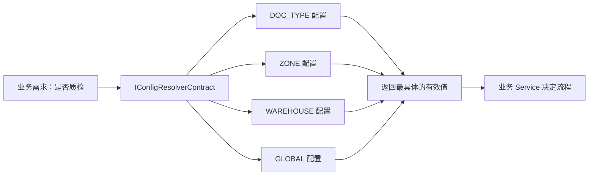
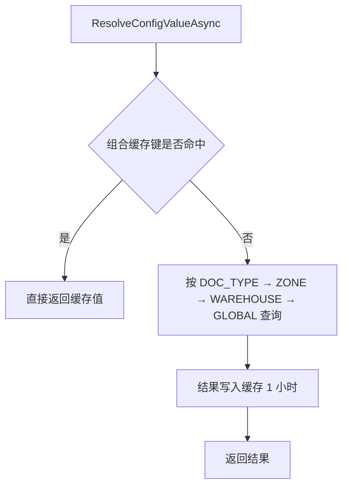

# KH.WMS.Config API

`KH.WMS.Config` 是 WMS 业务配置实现层，提供配置实体、CRUD 服务、分层配置解析、单据状态校验、扩展字段转换和 HTTP 管理端点。程序集目标框架为 `.NET 8.0`，版本为 `1.0.0.0`。

## 0. 先理解“配置”与“业务代码”的边界

配置模块要解决的不是“把所有逻辑都放到数据库”，而是把**经常因客户、仓库、库区或单据类型变化的参数和规则**从固定代码中分离出来。

例如“入库是否需要质检”：

- 如果写成 `if (warehouseId == 1) return true;`，新增仓库或改变规则必须修改代码并重新发布。
- 如果写成配置 `INBOUND:QC_ENABLED`，实施人员可以针对仓库、库区或单据类型维护不同值，业务 Service 只读取解析后的结果。



### 0.1 为什么不让业务模块直接查询配置表

如果每个业务 Service 都自己查询 `cfg_global_config`，很容易出现：

- 不同模块使用不同的作用域优先级。
- 有的地方过滤 `Status=1`，有的地方忘记过滤。
- 每次请求都访问数据库，性能不可控。
- 配置修改后，各模块清理缓存的方式不一致。

因此业务模块依赖 `IConfigResolverContract`，配置模块负责查询、优先级、缓存和作用域转换。这个做法叫“通过契约隔离模块”：调用方只知道稳定接口，不需要知道表结构。

### 0.2 三类能力的区别

| 能力 | 解决的问题 | 示例 |
| --- | --- | --- |
| 全局/分层配置 | 某个值在不同范围下取什么 | `QC_ENABLED`、超时秒数、自动建任务开关 |
| 状态配置 | 当前状态允许做什么、下一步能到哪里 | 已收货能否编辑、能否转为已上架 |
| 扩展字段 | 不改主表结构也能增加低频客户字段 | 客户批次备注、包装等级、自定义标签 |

### 0.3 什么时候不要配置化

下列内容通常仍应保留在代码中：

- 数据一致性和安全约束，例如“已出库数量不能为负”。
- 数据库事务边界和权限校验。
- 高频查询需要索引的核心字段。
- 算法本身，例如 FIFO 如何排序；算法组合和参数可以配置，算法实现放 `KH.WMS.Algorithms`。

配置化的好处是灵活，但代价是错误从编译期推迟到运行期。因此配置必须有默认值、校验、日志、缓存失效和验收测试。

### 0.4 推荐阅读顺序

1. [分层配置解析](#5-分层配置解析)。
2. [完整场景：配置化质检开关](#12-完整场景配置化质检开关)。
3. [缓存原理与一致性](#13-缓存原理与一致性)。
4. [状态机完整示例](#14-状态机完整示例)。
5. [扩展字段完整示例](#15-扩展字段完整示例)。

## 1. 能力地图

| 能力 | .NET 入口 | HTTP 入口 |
| --- | --- | --- |
| 配置资源 CRUD | `ICfg*Service` | 各资源 `/api/*` |
| 分层配置解析 | `IConfigResolverContract` | `/api/global-config/resolve/{group}/{key}` |
| 全局配置分组/批量维护 | `ICfgGlobalConfigService` | `/api/global-config/*` |
| 单据状态校验 | `IDocumentStatusValidatorContract` | 无直接控制器 |
| 库位状态转换查询 | `ICfgLocationStatusService` | `/api/location-status/*` |
| 通用实体扩展字段 | `ICfgExtFieldContract` | 配置资源 CRUD |
| 单据扩展字段 | `ICfgDocumentFieldExtContract` | 配置资源 CRUD |

## 2. 注册方式

Config 的服务和契约实现都使用 Core 的 `[RegisteredService]` 标记。默认宿主通过 Autofac `ServiceExtensions` 扫描程序集，因此业务代码通常只需注入接口：

```csharp
public sealed class ReceivingService(
    IConfigResolverContract configResolver,
    IDocumentStatusValidatorContract statusValidator)
{
    // ...
}
```

前置条件：已注册 `IRepository<TEntity,long>`、`IUnitOfWork`、`IDetailSaveService`、`ICacheService` 和 `ISqlSugarClient`。`KH.WMS.Server` 的标准启动流程会通过 `AddInfrastructure` 和 `ServiceExtensions` 提供这些依赖。

## 3. 通用配置资源 HTTP API

下表中的控制器均继承 `CrudController<TEntity>`，因此具有 [通用 CRUD 路由](./README.md#通用-crud-路由)。

| 基础路由 | 实体 | 支持 `/status/{id}` | 备注 |
| --- | --- | :---: | --- |
| `/api/code-rule` | `CfgCodeRule` | 是 | 编码规则 |
| `/api/code-sequence` | `CfgCodeSequence` | 否 | 编码流水状态 |
| `/api/document-type-port` | `CfgDocTypePort` | 是 | 单据类型与站台/库区映射 |
| `/api/document-field` | `CfgDocumentField` | 否 | 单据扩展字段 |
| `/api/document-status` | `CfgDocumentStatus` | 是 | 单据状态 |
| `/api/document-type` | `CfgDocumentType` | 是 | 单据类型 |
| `/api/cfg-document-type-process` | `CfgDocumentTypeProcess` | 否 | 单据流程开关 |
| `/api/cfg-document-type-rule` | `CfgDocumentTypeRule` | 否 | 单据行为规则 |
| `/api/ext-field` | `CfgExtField` | 否 | 通用实体扩展字段 |
| `/api/ext-field-type` | `CfgExtFieldType` | 是 | 扩展字段实体类型 |
| `/api/global-config` | `CfgGlobalConfig` | 是 | 另有专用端点；禁止新增和删除 |
| `/api/location-status` | `CfgLocationStatus` | 是 | 另有状态转换查询 |
| `/api/location-type` | `CfgLocationType` | 是 | 库位类型 |
| `/api/port-type` | `CfgPortType` | 是 | 口位类型 |
| `/api/transfer-point-type` | `CfgTransferPointType` | 是 | 中转点类型 |
| `/api/warehouse-type` | `CfgWarehouseType` | 是 | 仓库类型 |
| `/api/warehouse-zone-type` | `CfgWarehouseZoneType` | 是 | 库区类型 |

“支持状态”由实体是否实现 `IEnableDisableEntity` 决定。对不支持的实体调用状态端点，会得到 `code=400` 和“该实体不支持启用禁用操作”。

示例：分页查询启用的仓库类型。

```http
POST /api/warehouse-type/pagelist
Authorization: Bearer <token>
Content-Type: application/json

{
  "pageIndex": 1,
  "pageSize": 20,
  "filters": [
    { "field": "status", "operator": "equals", "value": 1 }
  ],
  "sortConditions": [
    { "field": "sortNo", "direction": "asc" }
  ]
}
```

## 4. 全局配置 API

基础路由：`/api/global-config`。

### 4.1 专用 HTTP 端点

| 方法 | 路由 | 参数/请求体 | 响应类型 |
| --- | --- | --- | --- |
| `GET` | `/groups` | 无 | `ConfigGroupDto[]` |
| `GET` | `/group/{groupCode}` | 分组编码 | `ConfigItemDto[]` |
| `GET` | `/value/{group}/{key}` | 分组、键 | `string`，只查 GLOBAL |
| `GET` | `/scoped/{groupCode}/{scopeLevel}` | 查询参数 `scopeId?` | `ConfigItemDto[]` |
| `GET` | `/resolve/{group}/{key}` | `warehouseId?`、`zoneId?`、`docTypeCode?` | `string` |
| `PUT` | `/batch` | `BatchUpdateConfigRequest` | 空响应 |
| `POST` | `/reset/{groupCode}` | 分组编码 | 空响应 |

批量更新请求：

```json
{
  "items": [
    {
      "id": 101,
      "configKey": "QC_ENABLED",
      "configValue": "true"
    },
    {
      "id": 102,
      "configKey": "QC_TIMING",
      "configValue": "AFTER_RECEIVE"
    }
  ]
}
```

`PUT /batch` 在单个事务内更新所有配置值，并清除受影响的解析缓存。

### 4.2 写入限制

`CfgGlobalConfigController` 明确覆盖以下通用端点：

- `POST /api/global-config/create`：返回 400 业务响应，配置项只能由系统初始化脚本创建。
- `DELETE /api/global-config/delete/{id}`：返回 400 业务响应。
- `DELETE /api/global-config/batch`：返回 400 业务响应。

配置值修改优先使用 `/batch`；整组恢复默认值使用 `/reset/{groupCode}`。当前继承的通用 `/update` 不会自动清理分层解析缓存，因此不建议用它修改 `ConfigValue`；若必须使用，应在服务层显式调用 `ClearConfigCache`。

## 5. 分层配置解析

### 5.1 `IConfigResolverContract`

```csharp
Task<string> ResolveConfigValueAsync(
    string group,
    string key,
    ConfigScopeContext? scope = null);

Task<bool> ResolveConfigBoolAsync(
    string group,
    string key,
    ConfigScopeContext? scope = null);

Task WarmUpAsync();
```

解析优先级固定为：

```text
DOC_TYPE → ZONE → WAREHOUSE → GLOBAL
```

同一作用域存在多条启用配置时，`Priority` 数值更大的记录优先。空字符串会继续向下级作用域回退；最终找不到则返回空字符串。布尔解析只把忽略大小写的 `true` 或字符串 `1` 视为真。

### 5.2 `ConfigScopeContext`

```csharp
var warehouseScope = ConfigScopeContext.ForWarehouse(1);
var zoneScope = ConfigScopeContext.ForZone(1, 1001);
var docTypeScope = ConfigScopeContext.ForDocType("PURCHASE_IN");

var fullScope = new ConfigScopeContext
{
    WarehouseId = 1,
    ZoneId = 1001,
    DocTypeCode = "PURCHASE_IN"
};
```

`DocTypeCode` 由默认 `IConfigScopeResolver` 查询 `CfgDocumentType` 转换为 ID；仓库和库区 ID 由调用方直接提供。

### 5.3 业务调用示例

```csharp
public async Task<bool> IsQualityCheckEnabledAsync(
    IConfigResolverContract resolver,
    long warehouseId,
    long zoneId,
    string docTypeCode)
{
    var scope = new ConfigScopeContext
    {
        WarehouseId = warehouseId,
        ZoneId = zoneId,
        DocTypeCode = docTypeCode
    };

    return await resolver.ResolveConfigBoolAsync(
        "INBOUND",
        "QC_ENABLED",
        scope);
}
```

解析结果缓存 1 小时。宿主在启动后调用 `WarmUpAsync()` 预热 GLOBAL 配置；修改配置值应使用 `BatchUpdateAsync`，恢复默认值使用 `ResetToDefaultAsync`，这两条路径会清理受影响的解析缓存。

## 6. 单据状态校验

`IDocumentStatusValidatorContract` 面向业务模块提供配置驱动的状态机校验：

| 方法 | 说明 |
| --- | --- |
| `GetStatusConfigAsync(docTypeCode, status)` | 查询启用的状态配置 |
| `GetInitialStatusAsync(docTypeCode)` | 获取 `IsInitial=1` 的状态编码 |
| `GetAllowedTransitionsAsync(docTypeCode, fromStatus)` | 解析 `NextStatuses` JSON |
| `CanTransitionAsync(docTypeCode, fromStatus, toStatus)` | 返回布尔值，不向外抛出校验错误 |
| `ValidateTransitionAsync(...)` | 非法时抛 `InvalidOperationException` |
| `ValidateAllowEditAsync(...)` | 校验当前状态是否允许编辑 |
| `ValidateAllowDeleteAsync(...)` | 校验当前状态是否允许删除 |

```csharp
await statusValidator.ValidateTransitionAsync(
    "PURCHASE_IN",
    "RECEIVED",
    "PUTAWAY");
```

相同状态到相同状态会直接通过。状态不存在、目标不在 `NextStatuses`、禁止编辑或禁止删除时会抛出带业务上下文的异常。

## 7. 库位状态 HTTP API

基础路由：`/api/location-status`。除通用 CRUD 外，还提供：

| 方法 | 路由 | 响应 |
| --- | --- | --- |
| `GET` | `/can-transition?fromStatus=EMPTY&toStatus=OCCUPIED` | `boolean` |
| `GET` | `/available-transitions?fromStatus=EMPTY` | `string[]` |

这两个端点直接返回值，不使用 `ApiResponse` 包装。

## 8. 扩展字段契约

### 8.1 通用实体 `ICfgExtFieldContract`

数据源为 `CfgExtFieldType` 和 `CfgExtField`：

- `GetFieldsAsync(entityCode, fieldLevel="HEADER")`
- `BuildFormColumns(fields)`
- `SerializeExtData(allData, fields)`
- `DeserializeExtData(extDataJson)`
- `DeserializeProcessableExtDataAsync(entityCode, extDataJson, fieldLevel)`
- `ClearCache(entityCode)`

### 8.2 单据 `ICfgDocumentFieldExtContract`

数据源为 `CfgDocumentType` 和 `CfgDocumentField`，方法与通用实体契约对应，只是查询主键改为 `docTypeCode`。

`BuildFormColumns` 返回前端表单列定义；`SerializeExtData` 只提取配置字段；`DeserializeProcessableExtDataAsync` 只返回 `IsProcessable=1` 的字段。配置修改后应清除对应实体或单据类型缓存。

## 9. 服务接口

17 个 `ICfg*Service` 都继承 `ICrudService<TEntity>`，因此具有查询、分页、新增、更新、删除、状态、导入和导出能力。额外方法如下：

### `ICfgGlobalConfigService`

- `GetByGroupAsync()`
- `GetByGroupCodeAsync(groupCode)`
- `GetByGroupAndScopeAsync(groupCode, scopeLevel, scopeId)`
- `GetConfigValueAsync(group, key[, defaultValue])`
- `BatchUpdateAsync(request)`
- `ResetToDefaultAsync(groupCode)`
- `ClearConfigCache(changedItems)`

### `ICfgLocationStatusService`

- `CanTransitionAsync(fromStatus, toStatus)`
- `GetAvailableTransitionsAsync(fromStatus)`

其余服务没有新增接口成员，直接使用 Core 的 `ICrudService<TEntity>` 契约。

## 10. 实体速查

所有实体继承 `BaseEntity<long>`，因此还具有 `Id`、创建/修改审计字段等继承属性。下表只列领域字段。

| 实体 | 关键字段 |
| --- | --- |
| `CfgGlobalConfig` | `ConfigGroup`、`ConfigKey`、`ConfigValue`、`DefaultValue`、`ValueType`、`ScopeLevel`、`ScopeId`、`Priority`、`Status` |
| `CfgDocumentType` | `TypeCode`、`TypeName`、`TypeCategory`、`NumberRuleId`、`IsActive` |
| `CfgDocumentStatus` | `DocTypeId`、`StatusCode`、`NextStatuses`、`IsInitial`、`IsFinal`、`AllowEdit`、`AllowDelete` |
| `CfgDocumentTypeProcess` | `DocTypeId`、`InitialStatus`、`RequireReceiving`、`RequireApproval`、自动上架/分配/拣货/打印开关 |
| `CfgDocumentTypeRule` | `DocTypeId`、`AllowModify`、`AllowCancel`、`AllowPartialExecute`、`AllowMultipleWarehouse` |
| `CfgDocumentField` | `DocTypeId`、`FieldKey`、`FieldType`、`FieldLevel`、`IsRequired`、`IsProcessable` |
| `CfgExtFieldType` | `EntityCode`、`EntityName`、`EntityCategory`、`HasLineLevel`、`IsActive` |
| `CfgExtField` | `EntityTypeId`、`FieldKey`、`FieldType`、`FieldLevel`、`IsRequired`、`IsProcessable` |
| `CfgCodeRule` | `RuleCode`、`RuleType`、`Prefix`、`DateFormat`、`SequenceLength`、`SequenceType`、有效期 |
| `CfgCodeSequence` | `RuleId`、`SequenceKey`、`CurrentValue`、周期、生成次数 |
| `CfgDocTypePort` | `DocTypeId`、`Direction`、`PortId`、`ZoneId`、`Priority`、`IsActive` |
| `CfgLocationStatus` | `StatusCode`、`AllowedFromStatuses`、允许上架/拣货/移库开关、`Status` |
| `CfgLocationType` | `TypeCode`、`TypeName`、`Status` |
| `CfgPortType` | `TypeCode`、允许入库/出库/拣货开关、`Status` |
| `CfgTransferPointType` | `TypeCode`、允许入库/出库开关、`Status` |
| `CfgWarehouseType` | `TypeCode`、`TypeName`、`Status` |
| `CfgWarehouseZoneType` | `TypeCode`、`TypeName`、`Status` |

`CfgJobDefinition`、`CfgJobTrigger`、`LogJobExecution` 和 `LogCodeRecord` 也是公开模型，但当前 Config 程序集中没有对应控制器或 `ICfg*Service`。

## 11. 使用边界

- 配置作用域字符串应使用 `ConfigScopeLevels` 常量，避免大小写或拼写不一致。
- `/value/{group}/{key}` 只查询 GLOBAL；需要覆盖规则时使用 `/resolve/{group}/{key}` 或 `IConfigResolverContract`。
- `BatchUpdateConfigRequest.ConfigKey` 供请求表达语义，当前更新实现以 `Id` 定位记录。
- 专用 Config 端点的响应格式不完全统一：全局配置返回原始 DTO/字符串/空响应，库位状态端点返回原始布尔值/列表。
- 通用导出和模板接口把文件内容作为 Base64 放入 `ApiResponse.data`，不是直接的文件流。

## 12. 完整场景：配置化质检开关

需求：默认入库不质检；仓库 1 默认质检；仓库 1 的库区 1001 不质检；但采购入库 `PURCHASE_IN` 无论在哪个库区都必须质检。

可以维护以下四条 `CfgGlobalConfig`：

| ConfigGroup | ConfigKey | ScopeLevel | ScopeId | ConfigValue | Priority |
| --- | --- | --- | ---: | --- | ---: |
| `INBOUND` | `QC_ENABLED` | `GLOBAL` | `null` | `false` | 0 |
| `INBOUND` | `QC_ENABLED` | `WAREHOUSE` | 1 | `true` | 10 |
| `INBOUND` | `QC_ENABLED` | `ZONE` | 1001 | `false` | 20 |
| `INBOUND` | `QC_ENABLED` | `DOC_TYPE` | 采购入库类型 ID | `true` | 30 |

调用代码：

```csharp
using KH.WMS.Config.Abstractions;

public sealed class InboundQualityPolicy(
    IConfigResolverContract configResolver)
{
    public Task<bool> IsQualityCheckEnabledAsync(
        long warehouseId,
        long zoneId,
        string docTypeCode)
    {
        var scope = new ConfigScopeContext
        {
            WarehouseId = warehouseId,
            ZoneId = zoneId,
            DocTypeCode = docTypeCode
        };

        return configResolver.ResolveConfigBoolAsync(
            "INBOUND",
            "QC_ENABLED",
            scope);
    }
}
```

不同输入的结果：

| 调用范围 | 命中配置 | 结果 |
| --- | --- | --- |
| 仓库 2，普通入库 | GLOBAL | `false` |
| 仓库 1，普通入库 | WAREHOUSE | `true` |
| 仓库 1 / 库区 1001，普通入库 | ZONE | `false` |
| 仓库 1 / 库区 1001，`PURCHASE_IN` | DOC_TYPE | `true` |

### 12.1 为什么优先级是“最具体范围优先”

越具体的作用域越接近当前业务事实。单据类型规则通常比库区规则更有针对性，库区规则比整个仓库更具体，仓库规则再覆盖全局默认值。调用方只提供已知上下文，不需要自己写四次查询和回退逻辑。

同一作用域如果有多条启用记录，才使用 `Priority` 决定先后。也就是说：

```text
先比较 ScopeLevel，再比较同层 Priority
```

不要用一个很大的 GLOBAL `Priority` 期待覆盖 DOC_TYPE；当前解析器不会跨作用域比较数值。

### 12.2 为什么返回空字符串而不是自动抛错

解析器是通用基础契约，不知道某个键是“可选配置”还是“业务必填”。因此找不到时返回空字符串，让调用方决定：

```csharp
var value = await resolver.ResolveConfigValueAsync(
    "INBOUND", "RECEIVE_TIMEOUT_SECONDS", scope);

if (!int.TryParse(value, out var timeoutSeconds) || timeoutSeconds <= 0)
{
    // 该配置对当前业务是必填，所以在业务边界给出明确错误。
    throw new InvalidOperationException(
        "缺少有效配置 INBOUND:RECEIVE_TIMEOUT_SECONDS");
}
```

好处是同一个解析器既能支持“缺失时使用默认行为”的开关，也能支持“缺失必须阻断”的安全配置；代价是调用方必须明确自己的缺失策略。

## 13. 缓存原理与一致性

配置读取频率通常远高于配置修改频率。若每张入库单、每个任务都查询配置表，会给数据库带来大量重复查询。因此 `ConfigResolverContract` 把解析结果缓存 1 小时。

缓存键包含：

```text
App:Config:{group}:{key}:w{warehouseId}:z{zoneId}:d{docTypeCode}
```

同一个配置键在不同上下文下可能命中不同结果，所以不能只用 `group:key` 作为完整缓存键。

### 13.1 读取流程



### 13.2 修改后为什么按前缀清理

修改 `INBOUND:QC_ENABLED` 的仓库级值，可能影响很多组合缓存：

```text
...:w1:z:d
...:w1:z1001:d
...:w1:z1002:dPURCHASE_IN
```

系统无法只删除一个完整键，因此 `ClearConfigCache` 按 `App:Config:{group}:{key}:` 前缀删除所有组合，再由后续请求重新计算。

当前会自动失效缓存的写路径：

- `ICfgGlobalConfigService.BatchUpdateAsync`
- `ICfgGlobalConfigService.ResetToDefaultAsync`

继承自通用 CRUD 的 `UpdateAsync` 当前没有覆盖缓存清理钩子。管理页面和业务代码应优先走批量更新接口；否则数据库已经更新，调用方仍可能在一小时内读到旧值。

### 13.3 多实例部署注意

Core 当前把 `ICacheService` 注册为进程内 `MemoryCacheService`。如果同时运行两个 WMS Server 实例，实例 A 修改并清理缓存，不会自动删除实例 B 的内存缓存。

单实例部署的好处是简单、延迟低；多实例部署则需要额外方案，例如：

- 改用共享分布式缓存；或
- 配置变更后发送失效事件给所有实例；或
- 缩短缓存时间并接受短暂最终一致。

这是缓存的基本权衡：更少的数据库查询，换来更复杂的一致性管理。

## 14. 状态机完整示例

假设采购入库单有以下状态：

```text
CREATED → RECEIVING → RECEIVED → PUTAWAY → COMPLETED
```

每个 `CfgDocumentStatus` 通过 `NextStatuses` 保存允许的下一状态，例如 `RECEIVED`：

```json
{
  "docTypeId": 10,
  "statusCode": "RECEIVED",
  "statusName": "已收货",
  "nextStatuses": "[\"PUTAWAY\"]",
  "allowEdit": 0,
  "allowDelete": 0,
  "isActive": 1
}
```

业务 Service 中这样使用：

```csharp
public sealed class InboundOrderWorkflow(
    IDocumentStatusValidatorContract statusValidator,
    IRepository<InboundOrder, long> orderRepository,
    IUnitOfWork unitOfWork)
{
    public async Task StartPutawayAsync(long orderId)
    {
        var order = await orderRepository.GetByIdAsync(orderId)
            ?? throw new InvalidOperationException("入库单不存在");

        await statusValidator.ValidateTransitionAsync(
            order.DocTypeCode,
            order.Status,
            "PUTAWAY");

        await unitOfWork.BeginTransactionAsync();
        try
        {
            order.Status = "PUTAWAY";
            await orderRepository.UpdateAsync(order);
            await unitOfWork.CommitAsync();
        }
        catch
        {
            await unitOfWork.RollbackAsync();
            throw;
        }
    }
}
```

> `InboundOrder` 只是业务调用示意，实际实体和字段名应以 InboundModule 为准。

### 14.1 为什么“校验”和“更新”要分开

`IDocumentStatusValidatorContract` 只回答“允许不允许”，不直接修改业务单据。原因是配置模块不应该依赖入库单、出库单等具体实体，否则模块边界会反转。

业务模块仍负责：

1. 读取自己的单据。
2. 调用配置契约校验。
3. 在自己的事务中更新状态和相关明细。
4. 记录业务日志或创建任务。

这样配置模块可以被所有单据模块复用，而业务事务仍由真正拥有数据的模块控制。

### 14.2 `CanTransitionAsync` 与 `ValidateTransitionAsync` 怎么选

| 场景 | 方法 | 原因 |
| --- | --- | --- |
| 前端决定按钮是否可见 | `CanTransitionAsync` | 返回布尔值，方便展示 |
| 真正提交状态变更 | `ValidateTransitionAsync` | 非法时抛出明确错误，阻止绕过前端 |

前端隐藏按钮不是安全校验。即使页面已经调用过 `CanTransitionAsync`，后端执行状态变更时仍必须再次验证，因为配置或单据状态可能已经变化。

### 14.3 两套状态 API 的区别

- `IDocumentStatusValidatorContract`：按 `docTypeCode` 处理单据状态，数据源是 `CfgDocumentType + CfgDocumentStatus`。
- `ICfgLocationStatusService`：处理库位状态之间的转换，HTTP 入口是 `/api/location-status/*`。

它们的领域对象不同，不要用库位状态 API 校验入库单或出库单。

## 15. 扩展字段完整示例

需求：客户 A 希望物料增加“包装等级”和“是否防潮”，但其他客户不需要，且这两个字段不参与高频查询。

### 15.1 配置阶段

先创建 `CfgExtFieldType`：

```json
{
  "entityCode": "MATERIAL",
  "entityName": "物料",
  "entityCategory": "BASE_DATA",
  "hasLineLevel": 0,
  "isActive": 1
}
```

再为该类型创建字段：

```json
[
  {
    "fieldKey": "packageLevel",
    "fieldName": "包装等级",
    "fieldType": "STRING",
    "fieldLevel": "HEADER",
    "isRequired": 1,
    "isProcessable": 1,
    "sortOrder": 10
  },
  {
    "fieldKey": "moistureProof",
    "fieldName": "是否防潮",
    "fieldType": "BOOLEAN",
    "fieldLevel": "HEADER",
    "isRequired": 0,
    "isProcessable": 1,
    "sortOrder": 20
  }
]
```

### 15.2 生成前端列定义

```csharp
var fields = await extFieldContract.GetFieldsAsync("MATERIAL");
var columns = extFieldContract.BuildFormColumns(fields);
```

返回结构类似：

```json
[
  {
    "prop": "packageLevel",
    "label": "包装等级",
    "type": "input",
    "isExt": true,
    "required": true
  },
  {
    "prop": "moistureProof",
    "label": "是否防潮",
    "type": "switch",
    "isExt": true
  }
]
```

字段类型映射原理：`STRING → input`、`INT/DECIMAL → number`、`DATETIME → date`、`BOOLEAN → switch`。配置模块输出统一前端语义，避免每个页面自己解释字段类型。

### 15.3 保存扩展数据

```csharp
var formData = new Dictionary<string, object?>
{
    ["materialCode"] = "MAT-001",
    ["materialName"] = "测试物料",
    ["packageLevel"] = "A",
    ["moistureProof"] = true
};

var extDataJson = extFieldContract.SerializeExtData(formData, fields);
// 结果：{"packageLevel":"A","moistureProof":true}
```

如果对应控制器继承 `ExtDataCrudController<TEntity>`，HTTP 请求使用 `extDataRaw` 传入这个 JSON 字符串：

```json
{
  "materialCode": "MAT-001",
  "materialName": "测试物料",
  "extDataRaw": "{\"packageLevel\":\"A\",\"moistureProof\":true}"
}
```

### 15.4 为什么不用真实数据库列

扩展字段适合低频、展示型、客户差异字段。它避免为每个客户修改表结构和实体，升级更容易。

但以下字段不适合放 `ExtData`：

- 需要数据库索引或高频筛选。
- 参与库存、计费、分配等核心计算。
- 有严格外键关系。
- 需要数据库级唯一约束。

JSON 扩展换来了结构灵活性，但牺牲了查询性能、类型约束和数据库可见性。核心业务字段应升级为正式列。

## 16. HTTP 联调示例

### 16.1 查看配置分组

```bash
curl -H "Authorization: Bearer $TOKEN" \
  /api/global-config/groups
```

### 16.2 修改配置并让缓存失效

```bash
curl -X PUT \
  -H "Authorization: Bearer $TOKEN" \
  -H "Content-Type: application/json" \
  -d '{"items":[{"id":101,"configKey":"QC_ENABLED","configValue":"true"}]}' \
  /api/global-config/batch
```

### 16.3 验证最终解析结果

```bash
curl -H "Authorization: Bearer $TOKEN" \
  "/api/global-config/resolve/INBOUND/QC_ENABLED?warehouseId=1&zoneId=1001&docTypeCode=PURCHASE_IN"
```

推荐联调顺序是：先查 `/group/{groupCode}` 确认记录，再用 `/batch` 修改，最后用 `/resolve` 验证真实生效结果。只看数据库某一行不足以判断最终值，因为更高作用域可能覆盖它。

## 17. 该用哪种配置能力

| 需求 | 推荐能力 | 不推荐做法 |
| --- | --- | --- |
| 系统开关或业务阈值 | `IConfigResolverContract` | 在 Service 中写常量或仓库 ID 判断 |
| 单据能否流转 | `IDocumentStatusValidatorContract` | 在每个业务模块复制状态 `if/else` |
| 库位状态展示和允许操作 | `CfgLocationStatus` | 复用单据状态表 |
| 客户低频自定义字段 | 扩展字段契约 | 为每个客户立刻新增表列 |
| 高频检索/计算字段 | 正式实体字段和索引 | 放进 `ExtData` 后全表解析 JSON |
| FIFO/FEFO 等计算规则 | `KH.WMS.Algorithms` | 把算法步骤写进 Config Service |
| 用户、权限、通用系统参数 | SystemModule | 全部塞进 ConfigModule |

## 18. 常见问题与排查

| 现象 | 常见原因 | 排查方式 |
| --- | --- | --- |
| 修改后仍返回旧值 | 使用了通用 `/update`，未清缓存 | 改走 `/batch` 或显式 `ClearConfigCache` |
| DOC_TYPE 配置不生效 | `DocTypeCode` 找不到启用的 `CfgDocumentType` | 查单据类型编码和 `IsActive` |
| 高优先级 GLOBAL 没覆盖仓库值 | 作用域优先于数值 Priority | 检查作用域层级设计 |
| 布尔配置解析为 false | 值不是 `true` 或 `1` | 统一维护值格式 |
| 状态跳转总是失败 | `NextStatuses` 不是合法 JSON 数组 | 校验类似 `["PUTAWAY"]` 的格式 |
| 前端可点但后端拒绝 | 状态或配置在两次请求间变化 | 以后端最终校验为准 |
| 扩展字段不显示 | 实体编码、字段层级不一致或缓存未清 | 检查 `EntityCode`、`FieldLevel`，调用 `ClearCache` |
| 多实例中只有一台生效 | 当前缓存是进程内 MemoryCache | 增加分布式缓存或失效广播 |
