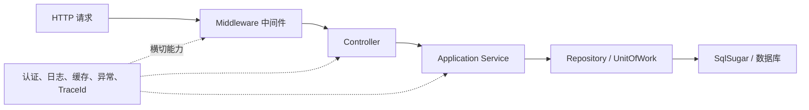
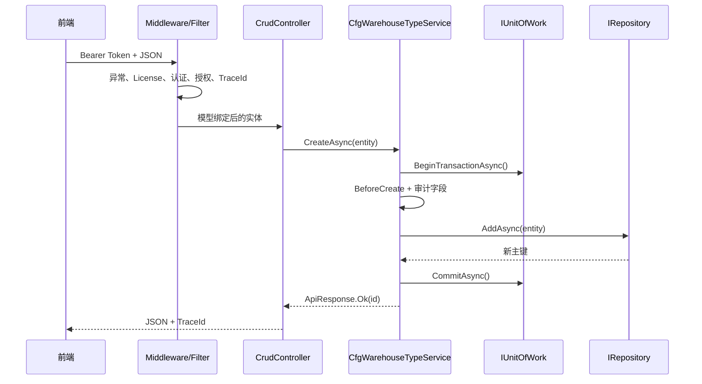
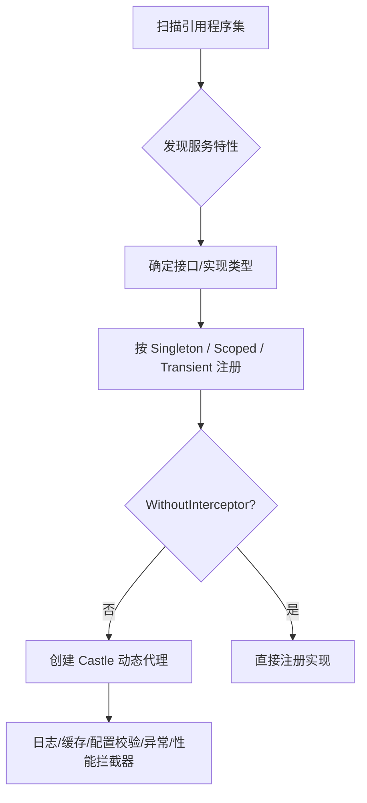
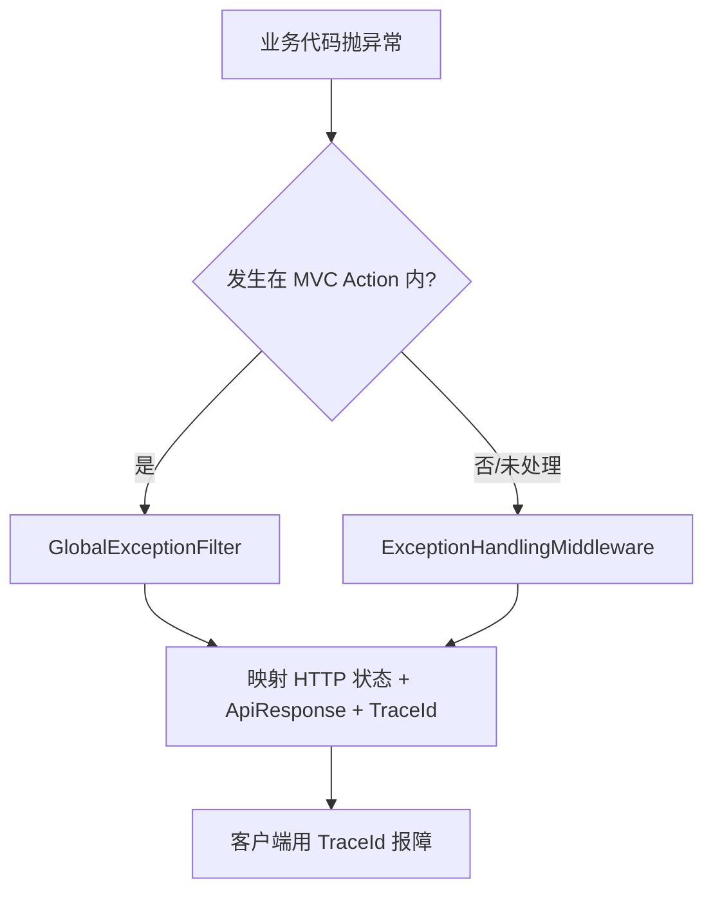
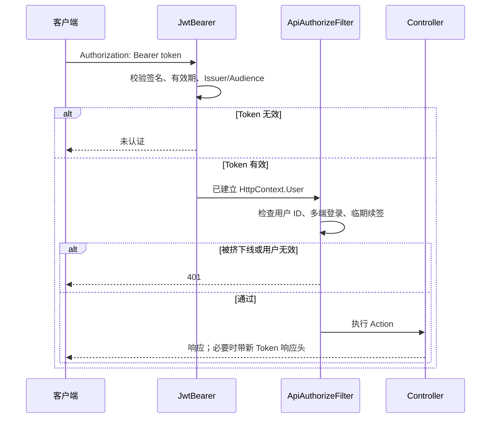

# KH.WMS.Core API

`KH.WMS.Core` 是三个模块的基础设施层，提供统一响应、通用 CRUD、数据访问、事务、缓存、认证、日志、安全、模块化、依赖注入和 ASP.NET Core 宿主扩展。程序集目标框架为 `.NET 8.0`，版本为 `0.1.0.0`。

## 0. Core 在整个系统中的位置

可以把 `KH.WMS.Core` 理解成后端的“基础设施工具箱和统一规则”。它不负责“入库怎么收货”或“出库怎么分配”，而是负责所有业务模块都会遇到的问题：

- Controller 如何统一返回结果？
- Service、Repository 如何通过依赖注入获得？
- 创建、修改、删除如何保证事务一致？
- JWT 在哪里验证？
- 异常、日志、TraceId 在哪里统一处理？
- 相同的 CRUD、分页、导入导出如何避免每个模块重复写？



### 0.1 为什么要有 Core，而不是让每个模块自己实现

| 没有统一 Core 时 | Core 的做法 | 好处 |
| --- | --- | --- |
| 每个 Controller 定义不同响应格式 | `ApiResponse` | 前端可以统一处理成功、错误和 TraceId |
| 每个模块手写 CRUD 和分页 | `CrudService` + `CrudController` | 减少重复代码，行为更一致 |
| 到处手动创建数据库对象 | Repository + DI | 便于测试、替换和管理生命周期 |
| 每个方法自己 `try/catch` | 异常中间件/过滤器 | 异常处理集中，业务代码更聚焦 |
| 多表更新各自提交 | `IUnitOfWork` | 保证要么全部成功，要么全部回滚 |
| 每个接口自己解析 JWT | 认证中间件 + 授权过滤器 | 安全边界一致，减少漏校验 |

抽象层不是越多越好。Core 适合放稳定、可复用、跨模块的技术能力；具体业务规则应留在业务模块。把业务逻辑塞进 Core 会让所有模块被迫耦合。

### 0.2 一次请求经过哪些层

以 `POST /api/warehouse-type/create` 为例：



理解这条链路后，排错就不再只盯 Controller：401 看认证，业务校验看 Service，SQL 看 Repository/SqlSugar，部分写入看事务，500 则用 TraceId 查日志。

### 0.3 本文怎么读

1. 先读 [完整 CRUD 扩展示例](#13-完整示例新增一个标准-crud-资源)。
2. 再读 [依赖注入原理](#14-依赖注入与-aop-原理)。
3. 涉及多表写入时读 [事务原理与示例](#15-事务原理与示例)。
4. 接口返回异常时读 [响应码与异常链路](#16-响应码与异常链路)。
5. 启动或 401 问题读 [中间件和认证执行顺序](#18-中间件和认证执行顺序)。

## 1. 最小宿主集成

仓库当前宿主使用 Autofac 和 Core 的统一注册入口：

```csharp
using Autofac;
using Autofac.Extensions.DependencyInjection;
using KH.WMS.Core.DependencyInjection;
using KH.WMS.Core.Setup;

var builder = WebApplication.CreateBuilder(args);

builder.Host.AddSerilog();
builder.Host
    .UseServiceProviderFactory(new AutofacServiceProviderFactory())
    .ConfigureContainer<ContainerBuilder>(container =>
    {
        container.RegisterModule(new ServiceExtensions());
    });

builder.Services.AddHttpContextAccessor();
builder.Services.AddInfrastructure(builder.Configuration, builder.Environment);
builder.Services.AddControllers();
builder.Services.AddRazorPages();

var app = builder.Build();
app.UseCustomMiddleware(app.Environment);
app.Run();
```

`AddInfrastructure` 注册数据库、缓存、JWT、日志、MiniProfiler、Swagger、CORS、限流服务、HTTP 客户端和 MVC 过滤器。`UseCustomMiddleware` 按 Core 约定装配异常、License、静态文件、CORS、请求日志、路由、MiniProfiler、认证、授权和控制器端点。

## 2. 统一响应

### 2.1 `ApiResponse`

| 属性 | 类型 | 说明 |
| --- | --- | --- |
| `Code` | `int` | 业务/响应码，默认 200 |
| `Message` | `string` | 中文消息 |
| `Timestamp` | `long` | UTC Unix 毫秒时间戳 |
| `Data` | `object?` | 返回数据 |
| `TraceId` | `string?` | 请求跟踪 ID，由过滤器补充 |

工厂方法：

```csharp
ApiResponse.Ok(data, "操作成功");
ApiResponse.Fail(ResponseCode.BAD_REQUEST, "参数错误");
ApiResponse.NotFound();
ApiResponse.ValidationError("校验失败", errors);
ApiResponse.Unauthorized();
ApiResponse.Error();
```

`ApiResponse<T>` 提供强类型 `Data`。如果需要把 `Code` 映射为真实 HTTP 状态，调用 `response.ToActionResult()`；控制器直接返回 `ApiResponse` 对象时，ASP.NET Core 通常仍以 HTTP 200 传输，调用方应同时检查响应体 `code`。

### 2.2 `ResponseCode`

常用常量：`SUCCESS=200`、`BAD_REQUEST=400`、`UNAUTHORIZED=401`、`LICENSE_REQUIRED=402`、`FORBIDDEN=403`、`NOT_FOUND=404`、`CONFLICT=409`、`VALIDATION_ERROR=422`、`RATE_LIMIT_EXCEEDED=429`、`INTERNAL_SERVER_ERROR=500`。

`ResponseCode.GetMessage(code)` 返回默认中文消息，`GetHttpStatusCode(code)` 返回传输层状态码。

### 2.3 分页

```csharp
var request = Pagination.Create(pageIndex: 1, pageSize: 20);
var result = PagedResult<MyDto>.Create(items, total, 1, 20);
var response = PagedResponse<MyDto>.Ok(items, total, 1, 20);
```

`Pagination.PageIndex` 小于 1 时归一化为 1；`PageSize` 小于 1 时归一化为 20。`PagedResult<T>` 还提供 `PageCount`、`HasPrevious`、`HasNext`。

## 3. 通用 CRUD

### 3.1 `ICrudService<TEntity>`

```csharp
Task<ApiResponse> GetByIdAsync(long id);
Task<ApiResponse> GetPagedListAsync(AdvancedQueryRequestDto query);
Task<ApiResponse> GetListAsync();
Task<ApiResponse> CreateAsync(TEntity entity);
Task<ApiResponse> UpdateAsync(TEntity entity);
Task<ApiResponse> DeleteAsync(long id);
Task<ApiResponse> BatchDeleteAsync(List<long> ids);
Task<ApiResponse> SetStatusAsync(long id, byte status);
Task<ApiResponse> ExportAsync(
    AdvancedQueryRequestDto query,
    List<ExportColumnDto>? columns = null,
    bool exportAll = true);
Task<ApiResponse> ImportAsync(Stream fileStream, string fileName);
Task<ApiResponse> DownloadTemplateAsync();
```

`CrudService<TEntity>` 是默认实现，提供查询过滤、排序、状态变更、导入导出和多个 `Before*`/`After*` 扩展钩子。

### 3.2 `CrudController<TEntity>`

控制器基类把 `ICrudService<TEntity>` 映射为 11 个标准端点。完整路由矩阵和请求示例见 [文档首页](./README.md#通用-crud-路由)。

重要行为：

- `SetStatusAsync` 仅接受实现 `IEnableDisableEntity` 的实体。
- 状态字段优先使用 `[StatusFieldName]` 指定属性，其次查找 `Status`，再查找 `IsActive`。
- 导出和模板把 Excel 字节转为 Base64 放入 `ApiResponse.data`。
- 导入端点使用 `multipart/form-data`，文件字段名为 `file`。

### 3.3 `ExtDataCrudController<TEntity>`

用于具有 `string? ExtData` 属性的实体：

- Create/Update 从原始请求体的 `extDataRaw` 读取 JSON 字符串并写入 `ExtData`。
- GetById 把 `ExtData` 中不存在冲突的属性展开到顶层 JSON。
- 宿主必须在模型绑定前调用 `Request.EnableBuffering()`，否则无法重读请求体。
- 分页结果不会在控制器中展开，当前约定由前端处理。

## 4. 查询 DTO

### `AdvancedQueryRequestDto`

| 属性 | 说明 |
| --- | --- |
| `PageIndex` / `PageSize` | 分页参数 |
| `Keyword` | 关键字；具体匹配字段由服务决定 |
| `SortConditions` | 多字段排序 |
| `Filters` | 动态过滤 |

`SortCondition` 使用 `Field`、`Direction`；`FilterCondition` 使用 `Field`、`Operator`、`Value`。支持的过滤操作符见 [首页示例](./README.md#通用-crud-路由)。

### `ExportRequestDto`

继承高级查询，并增加：

- `Columns`：`ExportColumnDto[]`，每列包含 `prop`、`label` 和可选 `dictMap`。
- `ExportAll`：`true` 导出全部符合条件的数据，`false` 仅导出当前页。

## 5. 数据访问

### 5.1 `IRepository<T,TKey>`

| 类别 | 方法 |
| --- | --- |
| 查询 | `AsQueryable`、`GetByIdAsync`、`GetAllAsync`、`GetListAsync`、`GetFirstOrDefaultAsync`、`ExistsAsync`、`CountAsync`、`GetPagedListAsync` |
| 新增 | `AddAsync`、`AddReturnEntityAsync`，均有单条/批量形式 |
| 更新 | `UpdateAsync(entity)`、`UpdateAsync(entities)` |
| 删除 | `DeleteAsync(id)`、`DeleteAsync(ids)`、`DeleteAsync(expression)` |
| 导航属性 | `Get*WithNavAsync`、`AddWithNavAsync`、`UpdateWithNavAsync`、`DeleteWithNavAsync` |
| 明细筛选 | `GetFirstOrDefaultByDetailAsync`、`GetListByDetailAsync` |

`RepositoryBase<T,TKey>` 是 SqlSugar 实现。复杂查询可从 `AsQueryable()` 继续组合，但应让事务仍由 `IUnitOfWork` 管理。

### 5.2 `IDbContext`

- `Db`：`ISqlSugarClient`
- `GetRepository<T,TKey>()`
- `BeginTransactionAsync(isolationLevel)`
- `CommitTransactionAsync()`
- `RollbackTransactionAsync()`
- `HasActiveTransaction`、`TransactionDepth`、`CurrentIsolationLevel`

### 5.3 `IUnitOfWork`

```csharp
await unitOfWork.ExecuteInTransactionAsync(logger, async () =>
{
    await headerRepository.AddAsync(header);
    await detailRepository.AddAsync(details);
});
```

也可调用 `BeginTransactionScopeAsync` 获得 `ITransactionScope`，然后显式 `CommitAsync` 或 `RollbackAsync`。嵌套事务状态通过 `TransactionDepth` 暴露。

## 6. 缓存

### `ICacheService`

- 基础操作：`Get<T>`、`Set<T>`、`Remove`、`Exists`、`Refresh`
- 条件操作：`TryGet<T>`、`TrySet<T>`、`SetOrCreate<T>`
- 工厂操作：`GetOrCreate<T>`、`GetOrCreateAsync<T>`
- 批量失效：`RemoveMultiple`、`RemoveByPrefix`

### `IMemoryCacheService`

在通用接口上增加滑动过期、混合过期和淘汰回调：

- `SetWithSlidingExpiration`
- `SetWithHybridExpiration`
- `RegisterPostEvictionCallback`

## 7. 认证与用户上下文

### 7.1 `IJwtTokenService`

| 类别 | 方法 |
| --- | --- |
| 生成 | `GenerateAccessToken`、`GenerateRefreshToken` |
| 验证 | `ValidateToken`、`IsTokenExpired`、`ShouldRefreshToken` |
| 读取 | `GetUserIdFromToken`、`GetUsernameFromToken`、`GetRolesFromToken`、`GetTokenRemainingSeconds` |
| 刷新 | `RefreshToken(accessToken, refreshToken)` |

`JwtTokenOptions` 配置 `Secret`、`Issuer`、`Audience`、访问/刷新 Token 有效期、时钟偏移和三个验证开关。

### 7.2 `IUserContext`

公开当前请求的 `UserId`、`UserName`、`RoleId`、`Permissions`、`IsAuthenticated`、`IsSuperAdmin`、`MenuType`、`Token`、`HttpContext`，并提供 `GetToken()` 和 `GetClaims()`。

默认 `ApiAuthorizeFilter` 对未标记 `[AllowAnonymous]` 的端点执行 JWT 身份检查、多端登录校验和临近过期续签。新 Token 通过 `X-Access-Token`、`X-Refresh-Token` 响应头返回。

## 8. 日志、序列化、映射与安全

| 接口/类型 | 主要能力 |
| --- | --- |
| `ILoggerService` | Debug/Info/Warning/Error/Fatal/Verbose、业务、操作、性能日志，以及按文件记录 |
| `IJsonSerializer` | 字符串/流的泛型与运行时类型序列化、反序列化 |
| `IMappingService` | 对象和集合映射，支持映射到已有目标对象 |
| `IHashService` | `Hash`、`HashBytes`、`Verify`、`Hmac` |
| `IEncryptionService` | 字符串和字节的加密/解密 |
| `IRsaCryptoService` | 公钥读取和私钥解密 |
| `IRateLimitService` | 判断配额、查询当前次数/剩余额度、重置 |
| `ExcelHelper` | 导出数据、生成模板、从流导入 |

实现类型包括 `LoggerService`、`PasswordHasher`、`AesEncryptionService`、`RsaEncryptionService`、`RsaCryptoService`、`MemoryCacheService` 和 `MappingService`。

不要把密码、JWT Secret、RSA 私钥或 License 私钥写入源码或日志。

## 9. 依赖注入与模块化

### 9.1 服务标记

| 特性 | 用途 |
| --- | --- |
| `[RegisteredService]` | 按接口注册，可指定 `ServiceType`、`Lifetime`、`WithoutInterceptor` |
| `[SelfRegisteredService]` | 以实现类型自身注册 |
| `[Transaction]` | 为控制器动作创建事务过滤器 |
| `[Cache]` | 控制资源/方法缓存行为 |
| `[LogInterceptor]` | 配置 AOP 调用日志 |
| `[ConfigValidation]` | 绑定配置校验器编码 |
| `[RateLimit]` | 声明端点限流策略 |
| `[StatusFieldName]` | 指定实体状态属性 |
| `[ConfigDb]` | 标记配置数据库实体 |

### 9.2 模块接口

`IModule` 定义 `InitializeAsync`、`StartAsync`、`StopAsync`、`ShutdownAsync`，以及名称、版本、依赖和描述元数据。`IModuleContext` 提供配置、服务集合、服务提供器、日志工厂和快捷注册方法。

`ContainerBuilder.RegisterModules(services)` 扫描并注册模块；`InitializeModulesAsync(serviceProvider)` 执行初始化。

## 10. ASP.NET Core Setup API

| 扩展方法 | 作用 |
| --- | --- |
| `AddInfrastructure` | 注册 Core 基础设施总入口 |
| `UseCustomMiddleware` | 装配标准中间件总入口 |
| `AddSqlSugarSetup` / `AddSqlSugar` | 注册 SqlSugar |
| `AddCacheSetup` | 注册缓存 |
| `AddAuthenticationSetup` | 注册 JWT 认证 |
| `AddAuthorizationPolicies` | 注册授权策略 |
| `AddLoggingSetup` / `AddSerilog` | 注册日志 |
| `AddMonitoringSetup` / `UseMiniProfiler` | MiniProfiler |
| `AddApiDocumentationSetup` / `UseSwaggerDocumentation` | Swagger/OpenAPI |
| `AddCustomCors` / `UseCustomCors` | CORS |
| `AddRateLimiting` / `UseRateLimiting` | 自定义限流 |
| `UseExceptionHandling` | 全局异常中间件 |
| `UseRequestLogging` | 请求日志 |
| `UseCustomStaticFiles` | 静态文件 |
| `AddJsonConfiguration` | JSON 配置和转换器 |
| `AddAutoMapper` / `AddAutoMapperProfiles` | AutoMapper |

中间件顺序会改变认证、异常和路由行为；优先使用 `UseCustomMiddleware`，只有在明确理解顺序后再拆分调用。

当前 `UseCustomMiddleware` 中限流中间件调用被注释，因此仅注册限流服务不会自动对请求生效。若启用，需要显式调用 `UseRateLimiting` 并验证与端点特性的组合行为。

## 11. License API

基础路由：`/api/license`。在默认宿主中，全局授权过滤器仍会作用于未标记 `[AllowAnonymous]` 的端点。

| 方法 | 路由 | 请求 | 成功响应 |
| --- | --- | --- | --- |
| `GET` | `/machine-code` | 无 | `{ "machineCode": "..." }` |
| `GET` | `/info` | 无 | `LicenseInfoDto`；无效时 `{ isValid:false, message }` |
| `POST` | `/generate` | `GenerateLicenseRequest` | `{ licenseContent, fileName }` |
| `POST` | `/import` | `ImportLicenseRequest` | `{ message }` |
| `POST` | `/upload` | multipart 字段 `file`，最大 10 KB | `{ message }` |

生成请求：

```json
{
  "machineCode": "SERVER-MACHINE-CODE",
  "validDays": 365,
  "licenseType": "Standard"
}
```

导入请求：

```json
{
  "licenseContent": "<license file content>"
}
```

`/generate`、`/import`、`/upload` 另外显式标记 `[Authorize]`。上传为空、验证失败或生成失败时返回 HTTP 400 和 `{ error }`。

## 12. 例外与注意事项

- `AddInfrastructure` 内部调用 `AddMvc` 并注册 `ApiAuthorizeFilter` 与 `TraceIdResultFilter`；宿主再次调用 `AddControllers` 时应检查是否重复添加同类全局过滤器。
- `UseCustomMiddleware` 会调用 `UseEndpoints` 映射控制器和 Razor Pages；定制宿主时不要无意中重复映射或改变认证/授权顺序。
- `CrudController` 的错误 `ApiResponse.Code` 与 HTTP 状态码并不必然一致；外部客户端必须读取响应体。
- `ExcelHelper.ExportAsync` 和通用导出返回字节/Base64，文件名和下载行为由调用方决定。
- License 中间件会在首次启动时调用 `EnsureDefaultLicense()`；生产授权策略需结合部署流程评审。
- 完整公开类型列表见 [公开类型索引](./PUBLIC-TYPE-INDEX.md)，更细的历史说明见 [Core API 参考文档](../backend/KH.WMS.Core-API-参考文档.md)。

## 13. 完整示例：新增一个标准 CRUD 资源

下面用“演示配置项”说明如何复用 Core。示例展示架构写法，表名和业务字段请按实际模块调整。

### 13.1 定义实体

```csharp
using KH.WMS.Core.Models.Entities;
using SqlSugar;

[SugarTable("demo_item")]
public sealed class DemoItem : BaseEntity<long>, IEnableDisableEntity
{
    [SugarColumn(Length = 50, IsNullable = false)]
    public string Code { get; set; } = string.Empty;

    [SugarColumn(Length = 100, IsNullable = false)]
    public string Name { get; set; } = string.Empty;

    public byte Status { get; set; } = 1;
}
```

为什么继承 `BaseEntity<long>`：

- `CrudService<TEntity>` 的泛型约束要求它。
- 统一主键类型和创建/修改审计字段。
- 通用 Repository、Controller 和导入导出可以复用。

为什么实现 `IEnableDisableEntity`：它是标记接口，告诉 `CrudService.SetStatusAsync` 这个实体允许启用/禁用。仅仅有 `Status` 字段但不实现接口，状态端点仍会拒绝操作，这是为了避免对不该改状态的实体进行反射写入。

### 13.2 定义接口和 Service

```csharp
using KH.WMS.Core.Api.Responses;
using KH.WMS.Core.Database.Repositories;
using KH.WMS.Core.Database.UnitOfWorks;
using KH.WMS.Core.DependencyInjection.ServiceLifetimes;
using KH.WMS.Core.Services;

public interface IDemoItemService : ICrudService<DemoItem>
{
}

[RegisteredService(ServiceType = typeof(IDemoItemService))]
public sealed class DemoItemService :
    CrudService<DemoItem>,
    IDemoItemService
{
    private readonly IRepository<DemoItem, long> _repository;

    public DemoItemService(
        IRepository<DemoItem, long> repository,
        IUnitOfWork unitOfWork,
        IDetailSaveService detailSaveService)
        : base(repository, unitOfWork, detailSaveService)
    {
        _repository = repository;
    }

    protected override async Task BeforeCreateAsync(DemoItem entity)
    {
        if (string.IsNullOrWhiteSpace(entity.Code))
            throw new ArgumentException("编码不能为空", nameof(entity.Code));

        if (await _repository.ExistsAsync(x => x.Code == entity.Code))
            throw new InvalidOperationException($"编码 {entity.Code} 已存在");
    }
}
```

为什么保留业务接口 `IDemoItemService`，而不是直接注入 `ICrudService<DemoItem>`：

- 后续可以增加 `GetByCodeAsync` 等领域方法，不改变调用方注册方式。
- Autofac 通过接口创建代理，日志、缓存、异常和性能拦截器才能作用于外部调用。
- 测试时更容易替换为专门的 Fake/Mock。

为什么重写 `BeforeCreateAsync`，而不是复制整个 `CreateAsync`：基类已经正确处理事务、审计字段、主从表保存和回滚。钩子只加入业务差异，未来 Core 修复事务或审计逻辑时，子类自动受益。

### 13.3 定义 Controller

```csharp
using KH.WMS.Core.Controllers;
using Microsoft.AspNetCore.Mvc;

[ApiController]
[Route("api/demo-items")]
public sealed class DemoItemsController(IDemoItemService service)
    : CrudController<DemoItem>(service)
{
}
```

没有写任何 Action，但会得到完整标准端点：

```text
GET    /api/demo-items/{id}
POST   /api/demo-items/pagelist
GET    /api/demo-items/all
POST   /api/demo-items/create
POST   /api/demo-items/update
DELETE /api/demo-items/delete/{id}
DELETE /api/demo-items/batch
PUT    /api/demo-items/status/{id}
POST   /api/demo-items/export
POST   /api/demo-items/import
GET    /api/demo-items/template
```

如果 Controller 位于外部类库，该程序集还必须被 MVC 加入 `ApplicationPart`。当前 `KH.WMS.Server` 会显式加入名称包含 `.Modules.` 的程序集和 `KH.WMS.Config`；新程序集不符合命名约定时要在 `ConfigureApplicationPartManager` 中添加。

### 13.4 调用和执行结果

```bash
curl -X POST \
  -H "Authorization: Bearer $TOKEN" \
  -H "Content-Type: application/json" \
  -d '{"code":"DEMO-01","name":"演示配置","status":1}' \
  /api/demo-items/create
```

成功响应：

```json
{
  "code": 200,
  "message": "新增成功",
  "data": 123,
  "timestamp": 1783651200000,
  "traceId": "..."
}
```

`data` 是新主键。内部已经经历“开始事务 → BeforeCreate → 填审计字段 → 写主表/明细 → AfterCreate → 提交”。任一步抛异常都会回滚。

## 14. 依赖注入与 AOP 原理

### 14.1 自动注册发生了什么

启动时 `ServiceExtensions` 调用 `AssemblyService.GetReferencedAssemblies()`，`ServiceRegistrar` 扫描带有 `[RegisteredService]` 或 `[SelfRegisteredService]` 的类，然后按生命周期注册到 Autofac。



### 14.2 生命周期怎么选

| 生命周期 | 创建频率 | 适合 | 风险 |
| --- | --- | --- | --- |
| Singleton | 应用启动后一个实例 | 无状态共享注册表、纯线程安全基础服务 | 持有请求状态会串数据；不能直接依赖 Scoped |
| Scoped | 每个请求/生命周期范围一个实例 | Repository、UnitOfWork、业务 Service | 在后台任务中必须自己创建 Scope |
| Transient | 每次解析都新建 | 很轻量且无状态的对象 | 频繁创建；同一操作可能拿到不同实例 |

`RegisteredServiceAttribute` 默认是 Scoped，这与数据库工作单元的请求边界一致。Singleton 服务如果构造函数依赖 Scoped Repository，会产生“长生命周期对象持有短生命周期对象”的问题；应改为 Scoped，或在需要时通过 `IServiceScopeFactory` 创建范围。

### 14.3 AOP 为什么必须通过 DI 接口调用

Autofac/Castle 在接口与实现之间放置代理：

```text
调用方 → 代理 → LoggingInterceptor → CachingInterceptor → 真实 Service
```

因此下面两种写法效果不同：

```csharp
// 推荐：拿到的是容器创建的代理，拦截器可工作。
public DemoController(IDemoItemService service) { }

// 不推荐：绕过容器，拦截器、生命周期和依赖解析都失效。
var service = new DemoItemService(...);
```

同一个类内部用 `this.SomeMethod()` 调用另一个方法，通常也不会重新经过接口代理。需要拦截行为时，应把职责拆到另一个注入服务，或让外部调用通过接口进入。

`WithoutInterceptor=true` 适合日志器、工作单元等基础设施，避免递归拦截或额外开销。

## 15. 事务原理与示例

事务保证一组数据库写入的原子性：要么全部提交，要么全部回滚。例如创建出库单头成功、写明细失败时，不能留下没有明细的孤立单据。

### 15.1 `CrudService` 已经自动处理的事务

- `CreateAsync`
- `UpdateAsync`
- `DeleteAsync`
- `BatchDeleteAsync`

这些方法内部已经调用 `BeginTransactionAsync`、`CommitAsync` 和 `RollbackAsync`。子类的 `Before*`/`After*` 钩子也在同一事务内执行，所以钩子里写相关数据可以与主操作保持一致。

### 15.2 自定义多仓储事务

```csharp
public sealed class TransferService(
    IRepository<TransferHeader, long> headerRepository,
    IRepository<TransferDetail, long> detailRepository,
    IUnitOfWork unitOfWork,
    ILogger<TransferService> logger)
{
    public Task<long> CreateAsync(
        TransferHeader header,
        List<TransferDetail> details)
    {
        return unitOfWork.ExecuteInTransactionAsync(logger, async () =>
        {
            var headerId = await headerRepository.AddAsync(header);

            foreach (var detail in details)
                detail.HeaderId = headerId;

            await detailRepository.AddAsync(details);
            return headerId;
        });
    }
}
```

> `TransferHeader`/`TransferDetail` 是事务示意类型，实际类型以业务模块为准。

使用扩展方法的好处是异常时统一回滚，调用代码不容易漏写 `catch`。需要更细控制时可显式使用 `BeginTransactionScopeAsync`。

### 15.3 `[Transaction]` 特性

控制器或 Action 可以标记：

```csharp
[Transaction(IsolationLevel = IsolationLevel.Serializable)]
[HttpPost("confirm")]
public async Task<ApiResponse> ConfirmAsync(ConfirmRequest request)
{
    return await service.ConfirmAsync(request);
}
```

该特性通过 MVC `IFilterFactory` 创建 `TransactionActionFilter`。它适合把一个 Action 内的多个服务调用包在同一请求事务中。

选择原则：

- 单个 Service 自身拥有完整业务原子操作：优先在 Service/UnitOfWork 中管理事务。
- 一个 Controller Action 需要协调多个已有服务且它们共享同一工作单元：可使用 `[Transaction]`。
- 不要在不了解嵌套事务语义时同时多层开启独立事务；检查 `TransactionDepth` 和实际数据库连接是否共享。

## 16. 响应码与异常链路

Core 中有两种失败表达方式：

### 16.1 返回失败 `ApiResponse`

```csharp
return ApiResponse.Fail(ResponseCode.BAD_REQUEST, "请选择数据");
```

适合预期内、当前方法可以直接决定的失败。注意 Controller 直接返回这个对象时，HTTP 状态可能仍为 200，真实业务码在响应体 `code`。

如果希望 HTTP 状态同步映射：

```csharp
return ApiResponse
    .Fail(ResponseCode.BAD_REQUEST, "参数错误")
    .ToActionResult();
```

### 16.2 抛出异常

```csharp
throw new NotFoundException("出库单不存在");
throw new ValidationException(errors);
throw new BusinessException("库存不足");
```

Controller 内的异常优先由 `GlobalExceptionFilter` 转为 `ApiResponse`；Controller 之外或过滤器未处理的异常还会被最外层 `ExceptionHandlingMiddleware` 捕获。生产环境不会把未知异常堆栈返回给客户端，详细信息写入日志。



### 16.3 为什么推荐领域异常而不是到处 `catch`

业务 Service 如果只是为了改响应格式而捕获异常，会丢失堆栈或重复记录日志。让异常上浮到统一边界，可以集中做状态码、脱敏、开发/生产差异和 TraceId。

只有在以下情况才在本地捕获：

- 能真正恢复或降级。
- 需要补偿操作。
- 需要转换为更有业务含义的异常，并保留原异常作为 InnerException。

## 17. 缓存的正确用法

典型的 Cache-Aside（旁路缓存）写法：

```csharp
public sealed class MaterialQueryService(
    ICacheService cache,
    IRepository<Material, long> repository)
{
    public Task<Material?> GetByIdAsync(long id)
    {
        return cache.GetOrCreateAsync(
            $"Material:{id}",
            () => repository.GetByIdAsync(id),
            TimeSpan.FromMinutes(10));
    }

    public async Task UpdateAsync(Material material)
    {
        await repository.UpdateAsync(material);
        cache.Remove($"Material:{material.Id}");
    }
}
```

> `Material` 是使用模式示意；实际命名空间以 BaseDataModule 为准。

原理：读时先查缓存，未命中才查数据库并写缓存；写时先更新权威数据源，再删除缓存，让下一次读取重建。

为什么通常“删除”而不是“直接改缓存”：删除操作更简单，避免缓存对象形状和数据库实体更新逻辑不同步。但高并发下仍要考虑更新与重建竞争。

当前默认实现是单机内存缓存，适合单实例和可重建数据。不要缓存无法从数据库恢复的唯一状态，也不要把请求级用户状态放在全局固定键中。

## 18. 中间件和认证执行顺序

`UseCustomMiddleware` 当前顺序：

```text
1. ExceptionHandling
2. LicenseValidation
3. HTTPS 重定向（非开发环境）
4. 静态文件
5. CORS
6. RequestLogging
7. Routing
8. MiniProfiler
9. Authentication
10. Authorization
11. MapControllers / MapRazorPages
```

### 18.1 为什么顺序不能随意换

- 异常处理放最外层，才能捕获后续中间件异常。
- 路由先确定端点元数据，授权才能知道 `[AllowAnonymous]`、`[Authorize]` 等要求。
- `UseAuthentication` 必须先建立 `HttpContext.User`，`UseAuthorization` 才能判断权限。
- 端点映射放最后，确保请求先经过日志、认证和授权。

### 18.2 JWT 请求是怎样被接受或拒绝的



认证回答“你是谁”，授权回答“你能做什么”。CORS 只决定浏览器是否允许跨源读取响应，不能代替认证或授权。

### 18.3 当前限流状态

`AddInfrastructure` 注册了限流服务，但 `UseCustomMiddleware` 中 `UseRateLimiting` 目前被注释。因此配置 `RequestLimit` 不代表请求已经被限制。需要启用时应：

1. 明确把 `UseRateLimiting` 放入合适的管道位置。
2. 验证键的粒度是 IP、用户还是端点。
3. 测试 429 响应和反向代理真实客户端 IP。
4. 多实例部署时评估单机计数是否满足要求。

## 19. 如何选择扩展方式

| 目标 | 推荐扩展点 | 为什么 |
| --- | --- | --- |
| 新增普通资源 | `CrudService` + `CrudController` | 直接得到标准行为 |
| 新增业务校验 | `BeforeCreate/BeforeUpdate/BeforeDelete` | 不复制事务和审计代码 |
| 调整分页查询 | `BuildQueryExpression`、`ApplyAdditionalQuery` | 保留过滤、排序和分页框架 |
| 保存后触发同事务动作 | `AfterCreate/AfterUpdate` | 与主操作共同提交/回滚 |
| 跨多个仓储写入 | `IUnitOfWork` | 明确原子边界 |
| 所有请求都要执行 | Middleware | 覆盖 MVC 之外的请求 |
| 只作用于 MVC Action | Filter/Attribute | 可读取 Action 元数据和模型 |
| 所有 Service 调用都要执行 | AOP Interceptor | 与 HTTP 层解耦，可复用到后台任务 |
| 简单重复读取 | `ICacheService` | 统一缓存访问和失效方式 |

## 20. 常见问题与排查

| 现象 | 常见原因 | 排查方式 |
| --- | --- | --- |
| 注入接口失败 | 实现未加注册特性，或程序集未被扫描 | 查启动注册日志和 `IInterceptorQueryService` |
| Service 能调用但 AOP 不生效 | 手动 `new`、内部自调用或 `WithoutInterceptor=true` | 确认通过 DI 接口进入 |
| Controller 路由 404 | 外部程序集未加入 MVC ApplicationPart | 检查 `ConfigureApplicationPartManager` |
| 返回体 code=400 但 HTTP=200 | 直接返回了失败 `ApiResponse` | 客户端检查 body，或使用 `ToActionResult` |
| 数据写了一半 | 操作没有共享同一 UnitOfWork/连接 | 检查事务边界和 Repository 来源 |
| 401 | Token 缺失、签名/有效期错误、被挤下线 | 查认证日志、缓存 Token 和响应消息 |
| 403 | 已认证但无权限 | 查角色、权限、授权策略 |
| 修改后读到旧数据 | 写入后未清缓存 | 检查 Cache-Aside 失效逻辑 |
| 限流配置不生效 | 中间件未启用 | 检查 `UseRateLimiting` |
| 线上 500 看不到堆栈 | 生产环境主动隐藏内部信息 | 用 `traceId` 查询结构化日志 |

## 继续阅读

- [API 参考首页](/api/README)
- [公开类型索引](/api/PUBLIC-TYPE-INDEX)
- [跨模块 Contract](/backend/KH.WMS后端Contract与模块协作指引)
