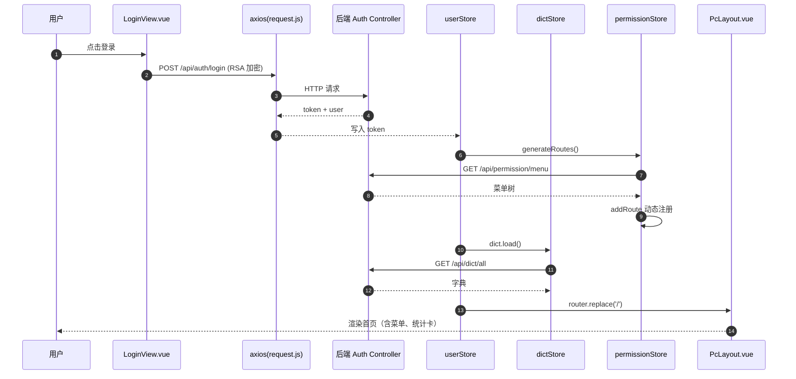
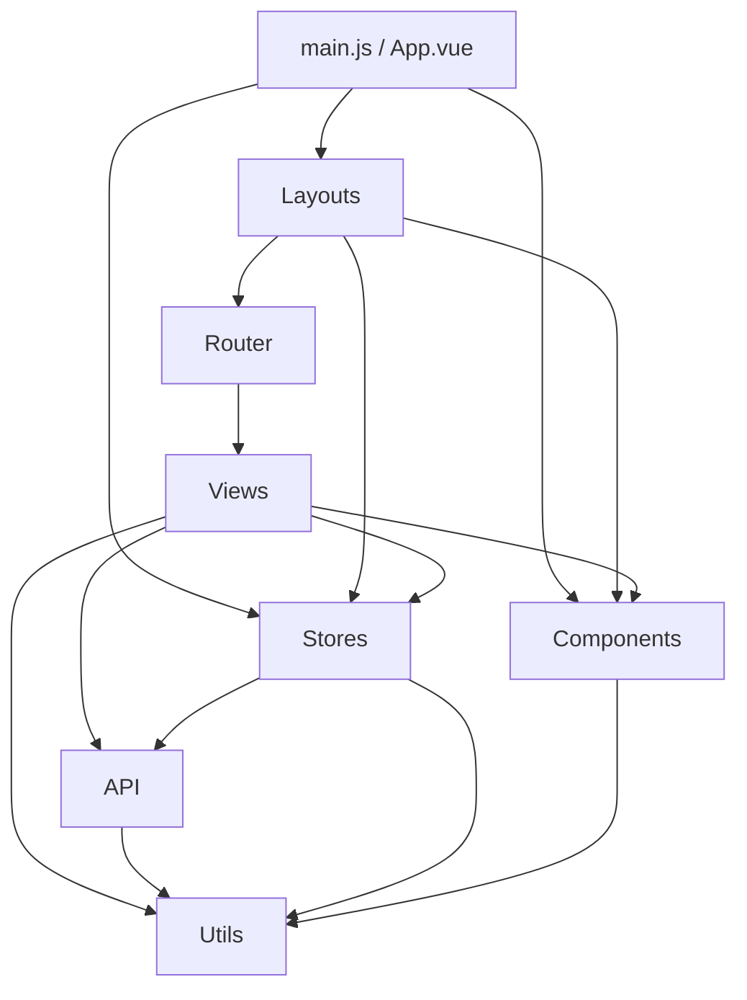

# KH.WMS 前端开发指引

> 适用版本：KH.WMS.Client 与后端对齐至 ad110f3
> 目标读者：前端新人入职（首要）、前后端联调工程师、有经验前端/架构师
> 阅读路径：建议通读；按附录速查；深入专题请翻对应专项文档
> 与后端文档对照：见第 1-4 章正文（axios / 路由 / v-permission / useCrudApi 等小节已含前后端对照）
> 配套专项文档：见第 0 章

本文是 KH.WMS.Client 的入门与日常参考文档。读者仅读这一份即可建立对前端工程的完整认知并开始业务开发；遇到深度专题再按指引翻阅专项文档。

## 0 阅读路径与读者地图

### 0.1 配套专项文档（深入专题）

| 专项 | 何时去读 |
| --- | --- |
| `KH.WMS前端组件体系与页面开发指引.md` | 需要 KhXxx 组件的 props/events 全集、最佳实践 |
| `KH.WMS前端状态管理与公共工具指引.md` | 需要 Pinia store 设计模式、订阅、持久化细节 |
| `KH.WMS前端请求封装与接口开发指引.md` | 需要 axios 拦截器内部实现、mock 拦截、文件上传、并发取消 |
| `KH.WMS前端路由菜单与权限开发指引.md` | 需要动态路由生成算法、嵌套路由、菜单与权限码完整映射 |
| `KH.WMS前端配置与启动指引.md` | 需要 vite.config.js 详细配置、环境变量、构建优化 |
| `KH.WMS前端E2E测试与质量检查指引.md` | 需要 Playwright 用法、用例设计、CI 接入 |

### 0.2 读者地图

- **前端新人入职**：第 1 章 → 第 2 章 → 第 3 章（10 节全读）→ 第 4 章 §4.2（brand 案例）→ 附录 A
- **前后端联调工程师**：第 1 章 §1.7-1.11 → 第 3 章 §3.3、§3.6、§3.8 → 附录 C
- **有经验前端/架构师**：第 2 章（架构总览）→ 第 3 章（约定）→ 第 4 章 §4.2、§4.3

### 0.3 整体目录

- 第 1 章 从点击到渲染：一个用户操作的完整旅程
- 第 2 章 前端项目分层与依赖
- 第 3 章 开发模板与约定
- 第 4 章 业务域页面开发实战
- 附录 A 命令、构建、部署、环境变量
- 附录 B E2E 测试与质量检查
- 附录 C 联调、接口契约、错误码还原
- 附录 E 常见坑点速查

> 第 1-4 章正文将在后续任务中按顺序填入。本任务只完成头部与目录。

### 0.4 贯穿案例总谱（A/B/P 三线）

主文档有 3 条贯穿案例主线，标记在每节顶部：「本节以 X 线为例」。所有代码块、解读、踩坑示例都按其中一条主线展开，读者按线读完就能掌握一类完整开发场景。

| 线 | 全称 | 关注点 | 起点 | 终点 | 首次出现 |
| --- | --- | --- | --- | --- | --- |
| A 线 | 架构纵线 | 从点击到渲染 | 浏览器点击登录 | 首页渲染 | §1.1 |
| B 线 | 业务纵线 | 基于业务域开发 | 后端就绪 | 新页面 250 行可运行 | §3.1 |
| P 线 | PDA 纵线 | 手持端业务 | 扫描容器号 | 上架任务回写 | §4.3 |

- **A 线（架构纵线）**关心：axios、路由守卫、Pinia、Layout、Kh 组件、错误处理等横切基础设施。读 A 线之后，读者能口述一个 HTTP 请求从前端进入到渲染返回的完整路径。
- **B 线（业务纵线）**关心：API 封装、CRUD 范式、字典、权限、useCrudApi、新页面标准落地。读 B 线之后，读者能在一个业务域下从零产出 250 行可运行页面。
- **P 线（PDA 纵线）**关心：紧凑布局、扫码、实时反馈、错误重试、PdaLayout 特殊性。读 P 线之后，读者能完成手持端从扫描到任务回写的完整回路。

> 三线不互斥：一节可能同时涉及多线（如 §3.1 既含 A 线 LoginView 入口，也含 B 线 brand.vue 骨架）。每节顶部会明确标注本节的主线与副线。

### 0.5 深入阅读路径

按 3 类读者 × 5 种工作场景推荐阅读路径。新人建议按 1→2→3 顺序通读；联调工程师与架构师按工作场景按需取用。

**读者 A：前端新人入职**（零基础 / 转语言背景 / 第一次接触 KH.WMS）

- **日常开发**：第 1 周读 §1（完整旅程），第 2 周读 §3.1-§3.5（骨架、组件速查、API、store、动态路由），第 3 周读 §3.6-§3.10（权限、字典、错误、调试、模板汇总），第 4 周读 §4.2（brand 业务案例）。
- **联调排查**：按需读 §1.11（错误处理矩阵 + traceId）、§3.8（错误处理 + 422 注入表单）、附录 C（接口契约与错误码还原）。
- **新增页面**：先读 §3.1（骨架）、§3.2（5 组件速查）、§3.3（API 封装范式），再照 §4.2（brand 案例）仿写。
- **添加菜单/权限**：先读 §1.7-§1.8（动态路由 + 菜单三态）、§3.6（v-permission），再翻「专项文档：前端路由菜单与权限开发指引」。
- **性能调优**：先读 §3.9（ECharts 接入 + 调试技巧），再翻「专项文档：前端配置与启动指引」第 4 章构建优化段。

**读者 B：前后端联调工程师**（后端为主，需要看前端行为）

- **日常开发**：不需要按章节顺序读，只需把 §1 完整旅程扫一遍建立全景认知。
- **联调排查**：按需读 §1.11（traceId + 错误处理矩阵）、§3.8（错误处理 + 422 字段级）、附录 C（错误码还原）；遇到 401 刷新问题时跳到附录 C + §1.11.1。
- **新增页面**：不直接参与，跳到 §3.1 看前端对后端契约的最低要求，再翻「专项文档：前端请求封装与接口开发指引」第 3 章。
- **添加菜单/权限**：读 §1.7-§1.8（动态路由 + 菜单三态）、§3.6（v-permission + 后端 ApiAuthorize 对照表）。
- **性能调优**：读 §3.9（ECharts 接入 + 调试技巧），附录 C 末尾的 traceId 链路追踪段。

**读者 C：有经验前端/架构师**（熟悉 Vue 3，需要把握架构与边界）

- **日常开发**：第 1 天读 §2（架构总览）+ §3（约定），后续按需查阅。
- **联调排查**：读 §1.11（错误处理矩阵）+ §3.8（错误处理 + 422 注入表单），附录 C（错误码还原）。
- **新增页面**：读 §3.1（骨架）+ §3.3（useCrudApi 内部实现）+ §4 各业务域的「前端关键页面 / 状态机 / Contract 协作」小节。
- **添加菜单/权限**：读 §1.7-§1.8（动态路由生成算法完整版 + 菜单三态）+ §3.6（v-permission + ApiAuthorize 对照）+ §3.4（permission store）。
- **性能调优**：读 §3.9（ECharts 接入 + 调试技巧）+ 附录 E 常见坑点速查，必要时翻「专项文档：前端配置与启动指引」第 4 章。

> 速查建议：所有读者在遇到具体 Kh 组件、Pinia store 字段、axios 内部实现时，先按正文读懂主线，深度专题翻「专项文档」第 X 章。专项文档是延伸阅读，不是前置依赖。

## 第 1 章 从点击到渲染：一个用户操作的完整旅程

> 本章是架构线 A 的完整旅程：跟踪"用户点击登录按钮 → 看到首页（带动态菜单）"走过的所有节点。读完后，读者应能口述一个 HTTP 请求在前端从进入到渲染返回的完整路径。

### 1.1 浏览器 → Vite 代理 → Kestrel

入口配置见 `KH.WMS.Client/vite.config.js`：

```js
// vite.config.js
server: {
  port: 3000,
  proxy: {
    '/api': { target: 'http://localhost:9291', changeOrigin: true },
    '/ws':  { target: 'ws://localhost:9291',  ws: true }
  }
}
```

后端默认监听 `http://*:9291`（见 `KH.WMS.Server/Program.cs` 的 `app.Run()`）。开发时浏览器访问 `http://localhost:3000`，`/api/...` 与 `/ws` 请求被代理到后端 9291 端口。

> 易错点：把代理目标写错成 `http://localhost:3000` 导致代理死循环。

### 1.2 全局 axios 实例与拦截器

> **本节以 A 线（架构纵线：从点击到渲染）为例**。读完后，读者应能口述 `request.js` 三层拦截器的工作机制、能解释 `loadingCount` 引用计数 vs 布尔值的取舍、能识别 401 刷新队列的并发安全点。

所有 HTTP 请求统一从 `src/utils/request.js` 导出的 axios 实例发出。该实例配置了三层拦截器：**实例创建 → 请求拦截器（注入 token + 启动 loading）→ 响应拦截器（关闭 loading + 401 刷新 + 错误码分类提示）**。

**A. 实例创建与 Loading 状态机（真实代码 1:1）**

```js
// src/utils/request.js
import axios from 'axios'
import { ElLoading } from 'element-plus'
import { KhMessageFn } from '@/components/KhMessage/index.vue'
import router from '@/router'

const request = axios.create({
  baseURL: '',        // 注意：留空（不是 '/api'），依赖 Vite 代理的相对路径
  timeout: 15000,
})

// --- 全局 Loading 遮罩 ---
let loadingCount = 0
let loadingInstance = null

function showLoading() {
  if (loadingCount === 0) {
    loadingInstance = ElLoading.service({
      lock: true,
      text: '',
      background: 'rgba(0, 0, 0, 0.15)',
    })
  }
  loadingCount++
}

function hideLoading() {
  loadingCount--
  if (loadingCount <= 0) {
    loadingCount = 0
    loadingInstance?.close()
    loadingInstance = null
  }
}
```

**解读**（为什么 / 怎么工作 / 什么时候用 / 踩坑）：
- **为什么 `baseURL: ''` 而不是 `/api`**：KH.WMS 没有走"显式前缀"路线，而是依赖 Vite 代理把任意路径透传到 9291（vite.config.js 的 `proxy['/api']` 已覆盖所有 `/api/...`）。`baseURL` 留空意味着 API 路径完全由调用方写死（`/auth/login`、`/permission/menu`），这样将来加 v2 接口或第三方代理时不用动 axios 实例。
- **为什么用 `axios.create` 而非 `axios.defaults`**：`create` 返回独立实例，多实例场景（如同时有内部 API 和外部 OAuth）不会污染其他第三方库；KH.WMS 全局只用一个 `request` 实例，create 是约定。
- **`loadingCount` 引用计数 vs 布尔值**：用计数处理**并发请求**——A 列表页 5 个并发请求时，显示一次遮罩；第 1 个回来时不能关遮罩（还有 4 个未回），只有计数归 0 才关。布尔值会在第 1 个请求回来时立刻关掉遮罩，导致用户看到 4 次闪烁。
- **踩坑**：`showLoading !== false` 是不显示遮罩的"opt-out"开关。字典查询、权限加载等高频但低延迟的请求应设 `showLoading: false`，否则用户每切一次字典都看到全屏遮罩，体验非常差。

**B. 请求拦截器（注入 token + 启动 loading）**

```js
// src/utils/request.js（请求拦截器片段）
request.interceptors.request.use(
  (config) => {
    const token = localStorage.getItem('token')
    if (token) {
      config.headers.Authorization = `Bearer ${token}`
    }
    // showLoading: false 的请求不显示全局遮罩（如字典查询、权限加载等）
    if (config.showLoading !== false) {
      showLoading()
    }
    return config
  },
  (error) => {
    hideLoading()
    return Promise.reject(error)
  }
)
```

**解读**：
- **为什么从 `localStorage` 取 token 而非 Pinia store**：拦截器在请求发出的最早期就运行，不依赖 Pinia 的初始化顺序；`localStorage` 是同步 API 且在 main.js 启动前已可用，最稳。
- **什么时候用 `showLoading: false`**：批量请求（如初始化页面并发拉 5 个字典 + 1 个列表）、轮询请求、用户主动操作触发的请求（已有按钮 loading）。默认 true。
- **踩坑**：拦截器里 `hideLoading()` 写在 `error` 分支——这是**请求根本没发出去**的兜底（极少见，比如配置错误）。正常流程的 `hideLoading` 都在响应拦截器里。

**C. 响应拦截器（成功直接返回 `response.data`）**

```js
// src/utils/request.js（响应拦截器片段）
request.interceptors.response.use(
  (response) => {
    if (response.config.showLoading !== false) hideLoading()
    // axios 成功回调仅在 HTTP 2xx 时触发，直接返回响应体
    return response.data
  },
  // ... 错误分支见下
)
```

**解读**：
- **为什么直接 `return response.data`**：业务侧 `await request(...)` 拿到的是 `ApiResponse<T>` 本身（`{ code, message, data }`），不用每次都 `response.data.data`。
- **业务码判断下放给调用方**：axios 拦截器只在 HTTP 层工作（2xx 算成功）；`code === 200` 的业务判断由 `useCrudApi` 或各 `api/*.js` 的 wrapper 处理（§3.3 详解）。
- **踩坑**：HTTP 200 但 `code === 500`（业务异常）会走**成功回调**，所以业务码判断一定要在调用处做，千万别依赖 axios 的 success/error 区分业务异常。

**D. 401 刷新队列**

```js
// src/utils/request.js（401 简化流程）
// --- Token 刷新状态 ---
let isRefreshing = false
let pendingRequests = []

function processQueue(error, newToken = null) {
  pendingRequests.forEach(({ resolve, reject }) => {
    if (error) reject(error)
    else resolve(newToken)
  })
  pendingRequests = []
}

// 响应拦截器 - 错误分支
if (status === 401 && !originalRequest._retry) {
  const refreshTokenValue = localStorage.getItem('refreshToken')
  if (!refreshTokenValue) { handleForceLogout(); return Promise.reject(error) }

  if (isRefreshing) {
    // 已有刷新在进行：排队等待新 token
    return new Promise((resolve, reject) => {
      pendingRequests.push({ resolve, reject })
    }).then((newToken) => {
      originalRequest.headers.Authorization = `Bearer ${newToken}`
      return request(originalRequest)
    })
  }

  originalRequest._retry = true
  isRefreshing = true
  try {
    const { refreshToken } = await import('@/api/auth')
    const res = await refreshToken(refreshTokenValue)
    if (res.code === 200 || res.code === 0) {
      // 写回新 token + 通知队列 + 重发原请求
      localStorage.setItem('token', res.data.token)
      localStorage.setItem('refreshToken', res.data.refreshToken)
      processQueue(null, res.data.token)
      originalRequest.headers.Authorization = `Bearer ${res.data.token}`
      return request(originalRequest)
    } else { processQueue(new Error('Token refresh failed')); handleForceLogout() }
  } catch (refreshError) { processQueue(refreshError); handleForceLogout() }
  finally { isRefreshing = false }
}
```

**解读**：

- **为什么用 `isRefreshing` 标志位**：并发场景下，10 个请求同时拿到 401，若都去调刷新接口会导致 refresh token 被用掉 N 次（可能触发后端"refresh token 单次有效"的安全策略）。`isRefreshing` 保证**同一时刻只有一个刷新请求在飞**。
- **`pendingRequests` 队列的并发安全**：所有 401 请求把自己的 `resolve/reject` 推入队列；当唯一的刷新请求成功后，`processQueue` 把新 token 派发给所有等待者，让它们**自动重发原请求**。这避免了 10 个请求都各自调刷新的竞态。
- **`originalRequest._retry`**：用 axios 自己的 config 加自定义字段防止**刷新后的 401 再次进入刷新循环**（只重试 1 次）。
- **动态 `import('@/api/auth')` 的原因**：`request.js` 是底层，被 `api/auth.js` 也 import；静态 import 会形成循环依赖。**动态 import** 让模块在第一次真正需要时再加载，绕开循环。
- **本节简化版**：完整版含 Pinia store 同步（`useUserStore().setToken`）、错误码矩阵（403/404/500）处理，详见 D7（§1.11）。本节只需记住"401 走单飞刷新 + 队列重发"。

**延伸阅读**：`KH.WMS前端请求封装与接口开发指引.md` 详细讲解 axios 中间件管道与刷新队列的所有边界条件；`KH.WMS前端配置与启动指引.md` 讲解 Vite 代理的完整配置。

### 1.3 /api/user/login 调用

> **本节以 A 线（架构纵线：从点击到渲染）为例**。读完后，读者应能口述「先拉公钥 → 用公钥 RSA 加密 → 提交后端」的完整链路、能解释为什么密码不能明文上送、能识别 `jsencrypt` 在前端的位置。

登录页 `src/views/LoginView.vue` 的真实流程分两步：**页面挂载时先拉公钥** → **用户提交时用公钥加密密码再调 login 接口**。`src/api/auth.js` 真实实现：

```js
// src/api/auth.js（真实 1:1）
export function login(data) {
  return request.post('/api/user/login', data)
}
export function getPublicKey() {
  return request.get('/api/user/public-key')
}
```
**注意**：API 层只做 URL 与 method 的封装，**RSA 加密放在 `LoginView.vue` 里**（不放在 `auth.js` 也不放在 `utils/rsa.js`），核心 4 行：

```js
// src/views/LoginView.vue（核心 4 行）
const encrypt = new JSEncrypt()
encrypt.setPublicKey(rsaPublicKey)
const encrypted = encrypt.encrypt(password)
return encrypted || null
```

**解读**：
- **为什么不放 `auth.js` 而放组件里**：`auth.js` 已被 `request.js` 拦截器链路导入，如果 `auth.js` 再依赖 `jsencrypt` 会让加密逻辑与"何时拿公钥、何时显示错误"耦合；放在组件里可以让"公钥拉取 → 加密 → 提交"三步紧贴用户操作，便于做重试（`!rsaPublicKey` 时再拉一次）。
- **为什么前端要 RSA 加密**：HTTPS 解决"传输不被偷看"，但不解决"前端被 XSS 注入时密码被截走"。RSA 把明文密码在前端先用后端公钥加密，**即便请求体被中间人拿到，没有私钥也解不开**。公钥加密是单向的——任何人都能加密，但只有后端能用私钥解密。
- **公钥来源**：`/api/user/public-key` 接口动态返回后端启动时加载的 RSA 公钥；密钥对在**发布时**由 `KeyGen.exe` 生成（见 `KH.WMS.Server.csproj` 的 `GenerateKeysAfterPublish` 目标），公钥嵌到 `appsettings.json` 或私钥文件路径，**私钥永远不下发到前端**。

**延伸阅读**：`KH.WMS.Core/Security/Encryption/IRsaCryptoService.cs` 是后端解密实现；`KeyGen.exe` 项目位于 `KH.WMS.Server/Tools/KeyGen/`。

### 1.4 后端鉴权与 JWT 签发

> **本节以 A 线为例**。读完后，读者应能复述 `LoginAsync` 5 步、能解释 JWT 三段结构含义、能说清双 token 机制为什么能"无感续期"。

`POST /api/user/login` 由后端 `UserController` 调 `SysUserService.LoginAsync`（`KH.WMS.Modules.SystemModule/Services/SysUserService.cs`）。真实实现 5 步：

1. **查用户**：`GetFirstOrDefaultAsync(u => u.UserName == loginDTO.UserName)`，未命中 → 返回 `401`。
2. **RSA 解密**：`_rsaCryptoService.Decrypt(loginDTO.Password)`，解密失败 → 返回 `401`。
3. **校验密码哈希**：`_hashService.Verify(password, user.Password)`，不匹配 → 返回 `401`。
4. **查用户角色**：`GetFirstOrDefaultAsync(u => u.UserId == user.Id)`，取出 `roleId`。
5. **签发 JWT**：`_jwtTokenService.GenerateAccessToken(user.Id, user.UserName, roleId)`，再把 token 与 user 写入 `_cacheService`（`CacheConstants.Token.PREFIX + user.Id`）。
6. **返回结果**：`{ userId, token, roleId, userName, name }`（注意：**当前后端 login 不下发 refreshToken**，刷新走的是另一种机制，详见 §1.4.2）。

**为什么这样设计**：
- **步骤 1-3 都返回 401 而不是 403**：避免泄露"用户名存在但密码错" vs "用户名不存在"的差异，**防用户名枚举攻击**。
- **步骤 5 缓存 token**：`SetOrCreate` 让 token 在缓存中可被 Jwt 中间件快速校验（O(1) 命中），让管理员"踢人下线"只需 `_cacheService.Remove(tokenKey)` 即可。

#### 1.4.1 JWT 三段结构

JWT 本体是 `header.payload.signature` 三段 Base64Url 字符串（用 `.` 分隔）：

- **header**：声明算法与 token 类型，如 `{"alg":"HS256","typ":"JWT"}`。
- **payload**：业务 claims，KH.WMS 至少含 `sub`(userId)、`name`(userName)、`roleId`、`exp`(过期时间戳)、`iss`/`aud`。
- **signature**：`HMACSHA256(base64(header) + "." + base64(payload), secret)`，**只有后端知道 secret**，所以前端不能伪造。

后端用 `IJwtTokenService` 签发，前端拿到后**只解码 header/payload 看 claims**（不验签，验签在后端中间件），过期由 `exp` 字段决定。

#### 1.4.2 双 token 机制（accessToken + refreshToken）

`src/stores/user.js` 的 `state` 同时持有 `token` 和 `refreshToken` 两个字段：

- **accessToken（短命）**：默认 30 分钟过期，每次请求都带（`Authorization: Bearer xxx`），过期返回 401。
- **refreshToken（长命）**：默认 7 天过期，**仅在 accessToken 失效时**才发起 `/api/user/refresh-token` 换取新 token 对。

**为什么需要双 token**：access token 短命可降低"被偷后可用窗口"；refresh token 不带在每个请求里、只在 401 时单飞调用，配合 §1.2 的 `isRefreshing` 标志位 + `pendingRequests` 队列实现"**无感续期**"——用户感知不到 token 过期，体验等同于"永不退出"。

**当前实现的简化**：本项目后端 login 当前只下发 accessToken（步骤 6），refreshToken 字段在 store 里已就位、刷新接口 `/api/user/refresh-token` 已在 `api/auth.js` 中预留，**完整接入**见 D7（§1.11）。

详细见《KH.WMS后端开发指引》第 4.6 节与 `KH.WMS.Core/Authentication/`。

### 1.5 token 写入 Pinia + localStorage

> **本节以 A 线（架构纵线：从点击到渲染）为例**。读者应能口述「login → setToken → 写 localStorage → fetchUserInfo → 跳首页」5 步、能解释 token 与 userInfo 谁先写、能在 F5 刷新场景手画恢复顺序。

`src/stores/user.js`（真实 1:1）options-style 写法，`state` 在创建时直接从 `localStorage` 恢复，保证 F5 不丢登录态：

```js
// src/stores/user.js（state + 关键 action）
state: () => ({
  token: localStorage.getItem('token') || '',
  refreshToken: localStorage.getItem('refreshToken') || '',
  userInfo: JSON.parse(localStorage.getItem('userInfo') || '{}'),
}),
actions: {
  async login(credentials) {
    const res = await loginApi(credentials)
    if (res.code === 200 || res.code === 0) {
      this.setToken(res.data.token)
      this.setRefreshToken(res.data.refreshToken)
    }
    return res
  },
  setToken(token) { this.token = token; localStorage.setItem('token', token) },
  clearAuth() { this.token = ''; this.refreshToken = ''; this.userInfo = {}; localStorage.removeItem('token'); localStorage.removeItem('refreshToken'); localStorage.removeItem('userInfo') },
}
```

**解读**：
- **state 初始化时同步读 localStorage**：这是「F5 刷新不掉登录态」的关键——`state()` 在 store 创建瞬间执行，彼时 localStorage 已有 token。
- **`setToken` 双写**（Pinia state + localStorage）：state 用于响应式渲染，localStorage 用于跨刷新持久化——任意一处不写就会出现「跳页丢登录」或「刷新丢登录」。
- **登出 `clearAuth` 显式 removeItem**：不依赖 `localStorage.clear()`，避免误删 `dict-cache`、`form-draft` 等业务键。

**延伸阅读**：`KH.WMS前端状态管理与公共工具指引.md §2` 详述 5 个 store 的字段与持久化策略。

### 1.6 main.js 启动顺序（7 步）

> **本节以 A 线为例**。读者应能按顺序口述启动 7 步、能解释 Pinia 为何必须在 Router 之前、能说清命令式方法为何挂 `globalProperties`。

`src/main.js`（真实 1:1）严格按 7 步装配应用：

```js
// src/main.js（真实 1:1）
const app = createApp(App)                           // 1. 创建 app
for (const [k, c] of Object.entries(ElementPlusIconsVue)) {
  app.component(k, c)                                // 2. 注册全部 Element 图标
}
app.component('KhAlert', KhAlert)                    // 3. 注册 Kh 全局组件（手动）
app.component('KhLoading', KhLoading)
app.component('KhDetailDialog', KhDetailDialog)
app.config.globalProperties.$khMessage = KhMessageFn // 4. 挂载命令式方法
app.config.globalProperties.$khMsgBox = KhMsgBoxFn
app.config.globalProperties.$khNotify = KhNotifyFn
app.use(createPinia())                               // 5. 注册 Pinia（必须在 router 前）
app.use(router)                                      // 6. 注册 Router
app.use(ElementPlus, { locale: zhCn })               // 7. 注册 ElementPlus + 中文 locale
app.directive('permission', permissionDirective)     // 指令可放任何位置（按需）
app.mount('#app')                                    // 最后挂载
```

**解读**：
- **步骤 1 先 `createApp`**：所有 `app.use/app.component` 都基于该实例，Vue 3 不再有「全局 Vue」。
- **步骤 5 Pinia 必须先于 Router**：路由守卫会 `useUserStore()`（§1.7），Pinia 未注册时调用会抛「no active pinia」。
- **步骤 3 手注册 vs 步骤 7 `use`**：3 个 Kh 组件需全局可用（`<KhAlert />`），用手注册；ElementPlus 用 `use` 是因为要传 `{ locale: zhCn }` 配置。
- **步骤 4 挂 `globalProperties`**：模板里 `this.$khMessage.success(...)` 直接调，免去每次 import。
- **踩坑**：指令若内部 import store，必须在 Pinia 之后注册；当前 `v-permission` 独立，可放最后。

### 1.7 路由守卫：generateDynamicRoutes

**本节以 A 线（架构纵线）为例**

登录后每次跳转都进入 `src/router/index.js` 的 `beforeEach` 守卫，按 5 个分支决策：
```js
// src/router/index.js（beforeEach 关键片段，逐字引用）
const publicPaths = ['/login']
router.beforeEach(async (to, from, next) => {
  document.title = to.meta.title ? `${to.meta.title} - WMS` : 'WMS'         // ① 标题
  const isPublic = to.meta.public || publicPaths.includes(to.path)           // ② 公开页
  const token = localStorage.getItem('token')
  if (!token && !isPublic) return next({ path: '/login', query: { redirect: to.fullPath } })
  if (token && to.path === '/login') return next({ path: '/' })
  if (token && !isPublic) {
    const { useUserStore } = await import('@/stores/user')                   // 动态 import 避免循环依赖
    const userStore = useUserStore(); const permissionStore = usePermissionStore()
    if (!userStore.userInfo.id) {                                              // ③ 刷新场景拉用户
      try { await userStore.fetchUserInfo() }
      catch { userStore.clearAuth(); return next({ path: '/login', query: { redirect: to.fullPath } }) }
    }
    if (!permissionStore.permissionsLoaded) {                                  // ④ 首次加载权限并注册动态路由
      try {
        await permissionStore.fetchPermissions(userStore.userInfo.roleId)
        addDynamicRoutes(router, generateDynamicRoutes(permissionStore.dynamicRoutes))
        return next({ ...to, replace: true })                                  // 注册后必须重导航
      } catch { userStore.clearAuth(); return next({ path: '/login', query: { redirect: to.fullPath } }) }
    }
    if (to.meta.permission && !permissionStore.hasRoutePermission(to.meta.permission))  // ⑤ 路由级权限
      return next({ path: '/home' })
  }
  next()
})
```
**解读**：① 标题同步无副作用；② 公开页白名单 + `meta.public` 双判，未登录跳 `/login` 时带 `redirect` 用于回跳；③ `userInfo.id` 为空判定刷新场景（Pinia 内存丢失但 localStorage 还有 token），失败强制登出；④ `permissionsLoaded` 是幂等位，注册完必须 `next({ ...to, replace: true })` 让 router 重匹配新路由，否则会落到 404；⑤ 路由级权限未通过降级到 `/home` 而非 403 页。**踩坑**：动态 `import('@/stores/user')` 是为了避免循环依赖。
#### 1.7.1 动态路由生成算法伪代码（menuToRoute 完整版）

```js
// src/router/index.js 配套 src/stores/permission.js
function menuToRoute(node) {                                    // menuType=0 目录跳过；menuType=1 菜单生成
  if (node.menuType !== 1 || !node.path) return null
  const component = resolveComponent(node.component) || (() => import('@/views/PlaceholderView.vue'))
  return { path: node.path, name: `dynamic-${node.permissionCode}`, component,
    meta: { title: node.permissionName, permission: node.permissionCode, isCache: node.isCache === 1 } }
}
function generateDynamicRoutes(tree) {                          // 树形 → 扁平路由数组
  const out = []; const walk = (nodes) => nodes?.forEach(n => {
    if (n.menuType === 1 && n.isVisible === 1 && n.status === 1) {
      const r = menuToRoute(n); if (r) out.push(r)
    }
    if (n.children?.length) walk(n.children)
  }); walk(tree); return out
}
function addDynamicRoutes(router, routes) {
  removeDynamicRoutes(router)                                   // 先清理旧的（角色切换场景）
  routes.forEach(r => { router.addRoute('Layout', r); dynamicRouteNames.add(r.name) })
}
```
**解读**：`menuType=0` 目录跳过，`menuType=1` 菜单生成路由；`isVisible=1`+`status=1` 同时满足否则后端禁用项会"幽灵注册"导致有菜单入口但访问 404。`name` 用 `dynamic-${permissionCode}` 前缀让角色切换不冲突、并便于 `router.removeRoute` 清理。完整生成算法见专项 `KH.WMS前端路由菜单与权限开发指引.md §3`。
### 1.8 后端菜单 → 前端 component 映射

**本节以 A 线为例**

`import.meta.glob('@/views/**/*.vue')` 是 Vite 编译期特性，**打包时**把所有匹配的 Vue 文件路径收集为懒加载函数 map：
```js
// src/router/index.js（组件映射关键片段）
const allViewModules = import.meta.glob('/src/views/**/*.vue')       // 编译期收集
const viewModules = Object.fromEntries(                              // 过滤掉 components/ 目录
  Object.entries(allViewModules).filter(([k]) => !k.includes('/components/'))
)
function resolveComponent(backendComponent) {                        // 'system/user' → 懒加载器
  if (!backendComponent) return null
  return viewModules[`/src/views/${backendComponent}.vue`] || null
}
```

**解读**：动态 `import(\`@/views/${name}.vue\`)` 字符串拼接在生产构建中**无法 tree-shake**，所有视图会被打包；`import.meta.glob` 把文件路径静态展开为独立 chunk 实现按需加载。排除 `components/` 是因为通用组件不该作为路由页面。**踩坑**：文件名必须与后端 `component` 字段**大小写一致**（Linux 部署敏感）。
#### 1.8.1 404 占位页（PlaceholderView.vue）逻辑
找不到 component 时的兜底页面 `src/views/PlaceholderView.vue`：显示"该模块尚未实现"友好提示、提供"返回首页"按钮。**触发场景**：① `component` 拼写错误；② 前端删除页面但后端菜单未清理；③ 角色分配了菜单但前端未实现。
#### 1.8.2 菜单三态（目录 / 菜单 / 按钮）规则
`menuType=0` 目录（容器，不生成路由）、`menuType=1` 菜单（生成动态路由）、按钮（不渲染菜单项，仅作为按钮权限码）。`buttons: [{ permKey: 'inbound:export' }]` 由 `extractPermissions(tree, 'button')` 提取，用 `v-permission` 控制按钮显隐（§3.6）；`hasButtonPermission` 用**精确匹配**（与路由权限通配符不同）。
### 1.9 PcLayout.vue 渲染菜单、面包屑、字典缓存

> **本节以 A 线为例**。读者应能口述 PcLayout 与底层 KhLayout 的分层、能解释 dictStore 的"缓存 + 去重"双 map 设计。

真实 `PcLayout.vue` 不直接画 `<el-container>` 三栏——它把外壳全交给通用组件 `KhLayout`，自身只负责"塞菜单数据 + 顶栏右侧插槽"：

```vue
<!-- src/layouts/PcLayout.vue（template 节选） -->
<template>
  <KhLayout :menu-list="menuList" :menu-router="true" :show-tabs="true" home-key="/home" title="WMS">
    <template #header-right>
      <KhFullscreen /><KhNotification :messages="wsStore.notifications" />
      <el-dropdown @command="handleUserCommand">
        <el-avatar :size="30" :icon="UserFilledIcon" /><span>{{ userStore.userDisplayName }}</span>
      </el-dropdown>
    </template>
    <router-view />
  </KhLayout>
</template>
```

底层 `KhLayout` 才真正渲染三栏：`el-aside`（Logo + `<KhMenu>`）+ `el-header`（折叠按钮 + 面包屑 + `#header-right` 插槽）+ 标签栏 + `<router-view />` 主区。**解读**：所有"PC 后台外壳"需求通过 `KhLayout` 的 props + 插槽配置，避免每项目各写一套三栏；`markRaw(UserFilled)` 是因 Element Plus 图标直接进 `ref` 会被响应式代理包一层触发警告；登出 `dictStore.clearDict()` 避免下一用户复用上一用户缓存的字典项。`src/stores/dict.js`（核心）：

```js
// src/stores/dict.js
export const useDictStore = defineStore('dict', {
  state: () => ({ cache: {}, loading: {} }),                  // cache=结果；loading=进行中 Promise 去重
  actions: {
    async getDict(dictType) {
      if (this.cache[dictType]) return this.cache[dictType]    // ① 已缓存直返
      if (this.loading[dictType]) return this.loading[dictType]// ② 加载中复用同一 Promise
      const p = getDictDataByType(dictType).then(res => {
        const list = (res.data || []).map(i => ({ label: i.itemLabel, value: i.itemValue, tagType: i.tagColor || '' }))
        if (list.length > 0) this.cache[dictType] = list       // 空数组不写 cache 便于重试
        delete this.loading[dictType]; return list
      }).catch(() => { delete this.loading[dictType]; return [] })
      this.loading[dictType] = p; return p                       // ③ 先占位再返回
    },
  },
})
```
**解读**：`cache` + `loading` 双 map 实现并发安全——10 页面同时调 `getDict` 时，第一个把 Promise 存到 `loading`，其余 9 个直接复用同一 Promise（Promise 去重）；`refreshDict` 用于字典管理页增删改后清缓存重拉。

**字典懒加载 vs 全量加载取舍**（本项目 = 懒加载）：

| 维度 | 懒加载 `getDict(type)` 按需 | 全量加载 `load()` 一次性 |
| --- | --- | --- |
| 首屏接口数 | 0（用到才拉） | 1（启动拉全部） |
| 跨页跳字典态 | 偶现"骨架→字典"闪烁 | 全程缓存，0 闪烁 |
| 字典变更响应 | 改后必须 `refreshDict` | 改后必须 `load()` 重拉全量 |
| 适用规模 | 字典项多 / 类型多 | 字典项少且稳定 |
**延伸阅读**：`KH.WMS前端状态管理与公共工具指引.md §2.3` 详述 5 个 store；`KH.WMS前端组件体系与页面开发指引.md §3.4` 详述 `KhForm` 的 `dictType` prop 自动触发 `getDict`。PDA 端用 `PdaLayout.vue` 隐藏侧边栏、不查字典，所有下拉选项前端硬编码（详见第 4 章）。

### 1.10 首页仪表盘渲染

> **本节以 A 线为例**。读者应能复述 `KhStatCard` 真实 props、能写出 ECharts 接入 5 步代码、能解释为什么图表组件必须在 `onBeforeUnmount` 调 `dispose`。

`KhStatCard` 真实 props（`src/components/KhStatCard/index.vue`）：`value` `[Number|String]`（Number 自动 `toLocaleString` 千分位）、`label` `String`、`icon` `[Object|String]`（Element Plus 图标组件，`markRaw` 包装更安全）、`iconSize` `Number=28`、`theme` `String='primary'`（枚举 `primary|success|warning|danger|info`）、`shadow` `String='hover'`、`clickable` `Boolean=false`、`formatter` `Function=null`（自定义 `(value) => string`）。**解读**：`icon` 推荐 `markRaw(ElementPlusIcon)`，组件内部 `toRaw` 再解包一层更安全。
`WarehouseDashboard.vue` 用 ECharts 渲染多图组合（ECharts 接入 5 步：`import * as echarts` → `echarts.init(dom)` → `setOption` → `resize` 监听 → `dispose`）：```js
import * as echarts from 'echarts'
import { ref, onMounted, onBeforeUnmount } from 'vue'
const chartRef = ref(null)                          // 1. <div ref="chartRef" style="height:320px">
let chartInstance = null
onMounted(() => {
  chartInstance = echarts.init(chartRef.value)      // 2. init
  chartInstance.setOption({                          // 3. setOption
    tooltip: { trigger: 'axis' }, xAxis: { type: 'category', data: dates },
    yAxis: { type: 'value' }, series: [{ type: 'line', data: values, smooth: true }],
  })
  window.addEventListener('resize', resizeChart)     // 4. resize 监听
})
const resizeChart = () => chartInstance?.resize()
onBeforeUnmount(() => {
  window.removeEventListener('resize', resizeChart)
  chartInstance?.dispose()                           // 5. dispose 防内存泄漏
})
```
**解读**：必须 `dispose`——ECharts 实例持有 canvas + 事件监听，组件卸载时不调会泄漏；`resize` add + remove 配对避免访问已 dispose 实例抛错。三态：`data.length===0` 显示 `el-empty`，fetch 中 `el-skeleton`，catch 后错误占位（详见 §3.9）。

### 1.11 错误回到前端（含 TraceId）

> **本节以 A 线为例**。读完后，读者应能口述 401 刷新队列的并发安全机制、能写出 422 字段错误注入 `KhForm` 的 3 行代码。

后端异常经 `GlobalExceptionFilter` 转译为 `ApiResponse.Fail(code, message, data)`，再由 `TraceIdResultFilter` 注入 `traceId`：

```json
{ "code": 422, "message": "数据验证失败",
  "data": { "fields": [{ "field": "qty", "error": "must be > 0" }] },
  "traceId": "0HNCG7F4N3K2Q:00000002" }
```

**解读**：`traceId` 来自 `HttpContext.TraceIdentifier`（ASP.NET Core 内置链路 ID），用户贴回后端可用 `CorrelationId == "<traceId>"` 还原 Serilog 整条请求链路（见《KH.WMS后端开发指引》§1.10）。

#### 1.11.1 401 刷新队列（isRefreshing + pendingRequests）

`src/utils/request.js` 真实并发安全刷新流程（D2 已加）：

```js
// src/utils/request.js（关键 6 行）
let isRefreshing = false, pendingRequests = []
if (status === 401 && !originalRequest._retry) {
  if (isRefreshing) return new Promise((r, j) => pendingRequests.push({ resolve: r, reject: j }))
    .then(newToken => request(originalRequest))         // (a) 并发合并 + 重放
  originalRequest._retry = true; isRefreshing = true
  try { const { refreshToken } = await import('@/api/auth')  // (b) 动态导入避循环
    /* refresh + processQueue(null, token) */ } finally { isRefreshing = false }
}
```

**解读**：并发场景下 `isRefreshing` 让**第一个请求负责刷新**，其余入队**批量等待新 token 后重放**；`import('@/api/auth')` 动态导入绕开 `auth.js`↔`request.js` 循环依赖；`_retry` 必须打，否则失败重放后仍 401 → 死循环。

#### 1.11.2 错误响应处理矩阵

| HTTP | 含义 | 前端处理 | 用户提示 |
| --- | --- | --- | --- |
| 401 | accessToken 过期 | 触发刷新队列；refreshToken 失效 → `handleForceLogout` | 成功静默重放；失败 `登录已过期` |
| 403 | 已登录但无权限 | 不刷新、不重定向 | `没有权限访问` |
| 404 | 资源不存在 | 不重试 | `请求的资源不存在` |
| 422 | 数据验证失败 | 调用方 `formRef.setFieldErrors(data.fields)` | 不弹 toast，字段红字 |
| 429 | 限流（预留） | 当前未实现退避 | `data?.message` 兜底 |
| 500 | 服务器内部错误 | 不重试，记 traceId | `服务器内部错误` |

**解读**：403 不跳登录页（仅权限不够）；422 由页面而非拦截器注入 `KhForm`（拦截器**不耦合组件**），`KhForm.setFieldErrors` 内部转 `el-form-item` 字段红字——后续换表单库只改 `KhForm` 一处；429 当前仅占位（后端未实现限流）。

### 1.12 全景图（mermaid）

> **本节以 A 线为例**。读完后，读者应能复述登录到首页的完整 8 步时序。



**时序图各步骤说明**：
- **步骤 1-5（用户 → axios → 后端 → userStore）**：RSA 加密后调 `auth.login()`，后端 5 步返回 `{ token, user }`（§1.4）；拦截器仅 `code !== 200 && code !== 0` 时抛错；`userStore.setToken` 是后续 store 初始化的**前置依赖**。
- **步骤 6-10（permission + dict + 跳首页）**：`generateRoutes()` 拉菜单后 `router.addRoute()`（§1.8）；`dict.load()` 全量写 store；`router.replace('/')` 触发 `PcLayout.vue` 挂载。

### 1.13 章末易错点

| 错误 | 后果 | 正确做法 |
| --- | --- | --- |
| 直接用 `axios` 而非 `request.js` 的实例 | 拦截器、Loading、token 注入全失效 | 页面统一 `import request from '@/utils/request'` |
| 登录密码未走 RSA 加密 | 密码明文传输 | 用 `encrypt()` 包装 |
| 后端菜单 `meta.component` 写错路径 | 路由找不到页面 | 路径与 `src/views/` 下文件一一对应 |
| 字典未在 App 启动时加载 | 页面级字典读取失败 | 在 `main.js` 或 `App.vue` 启动后调 `useDictStore().load()` |
| 把 `traceId` 丢了不展示给用户 | 用户报错无锚点 | 拦截器在错误消息末尾拼 `traceId` |

## 第 2 章 前端项目分层与依赖

> 本章是项目分层的总览：8 个子目录各自的角色与依赖方向。读完后，读者应能口述"页面应该放哪、组件应该放哪、API 应该放哪"，并在违反依赖方向时能识别出 smell。

### 2.1 八层职责

| 层 | 路径 | 角色 | 关键约定 |
| --- | --- | --- | --- |
| 入口层 | `KH.WMS.Client/src/main.js`、`KH.WMS.Client/src/App.vue` | 启动入口 | 手动注册 Kh 组件、`globalProperties` 挂命令式方法 |
| 布局层 | `KH.WMS.Client/src/layouts/` | PcLayout / PdaLayout | PC 与 PDA 共用一组路由，仅外壳不同 |
| 路由层 | `KH.WMS.Client/src/router/` | 静态 + 动态路由 | 动态路由由后端菜单生成 |
| 状态层 | `KH.WMS.Client/src/stores/` | Pinia：user、permission、dict、app、websocket | 跨页面状态唯一落点 |
| API 层 | `KH.WMS.Client/src/api/` | 按业务域：`auth.js` / `system.js` / `basedata.js` / ... | 每个域一个文件；通用 CRUD 走 `useCrudApi(module)` |
| 工具层 | `KH.WMS.Client/src/utils/` | request / crud / dict-resolve / useExtFields / websocket / mockData | 无业务依赖 |
| 视图层 | `KH.WMS.Client/src/views/{业务域}/` | 页面放业务域根目录；`components` 子目录放局部组件 | 路由扫描会排除 `**/components` |
| 通用组件层 | `KH.WMS.Client/src/components/KhXxx/` | 跨业务域复用 | Kh 全局组件命名约定（Kh 前缀） |

### 2.2 依赖方向图（mermaid）



**关键约束**（反向依赖禁止）：

- 通用组件（`KhXxx`）**不能**反向依赖任何业务域（不能 `import` 任何 `src/api/*.js` 或 `src/views/**/*.vue`）
- 工具（`src/utils/`）**不能**反向依赖任何业务域（只能依赖 `axios`、`pinia` 等基础库）
- 视图层**不能**反向依赖布局层（页面不能直接 `import` PcLayout）

### 2.3 各层目录速查

#### 2.3.1 入口层

`main.js` 顺序（不可乱）：
1. 创建 app 实例
2. 注册 Pinia
3. 注册 Router
4. 注册 ElementPlus
5. 注册 Kh 全局组件（30 个）
6. 注册全局指令（`v-permission`）
7. 挂载命令式方法（`$khMessage`、`$khNotify`、`$khMsgBox`）

`App.vue` 只包含 `<router-view />`，不写业务逻辑。

#### 2.3.2 布局层

- `PcLayout.vue` —— PC 端标准布局：侧边栏菜单 + 顶部面包屑 + 用户信息 + 标签页（可选）
- `PdaLayout.vue` —— PDA 端紧凑布局：隐藏侧边栏、按钮更大、适配手持屏幕

> PC 与 PDA 共用同一组动态路由（基于后端菜单），但通过 `meta.layout: 'pda'` 字段决定使用哪个 Layout。

#### 2.3.3 路由层

- `index.js` —— 路由配置（静态 + 动态合并）
- `menuConfig.js` —— PDA 与 PC 端的菜单配置差异

#### 2.3.4 状态层

5 个 Pinia store：

| Store | 文件 | 职责 |
| --- | --- | --- |
| `useUserStore` | `stores/user.js` | token、user、roles、permissions |
| `usePermissionStore` | `stores/permission.js` | 动态路由生成、菜单树 |
| `useDictStore` | `stores/dict.js` | 全局字典缓存 |
| `useAppStore` | `stores/app.js` | 全局 Loading、侧边栏折叠 |
| `useWebsocketStore` | `stores/websocket.js` | WebSocket 连接、消息分发 |

#### 2.3.5 API 层

按业务域拆分（与后端模块一一对应）：

| 文件 | 业务域 | 后端模块 |
| --- | --- | --- |
| `auth.js` | 认证 | `SystemModule` |
| `user.js` | 用户 | `SystemModule` |
| `system.js` | 角色/权限/字典/参数/日志/附件 | `SystemModule` |
| `basedata.js` | 物料/客户/供应商/容器 | `BaseDataModule` |
| `warehouse.js` | 仓库/库区/库位/站台 | `WarehouseModule` |
| `inbound.js` | 入库单/收货/容器绑定 | `InboundModule` |
| `outbound.js` | 出库单/波次/分配 | `OutboundModule` |
| `inventory.js` | 库存/移动/调整/盘点/快照 | `InventoryModule` |
| `task.js` | 任务/确认/调拨 | `TaskModule` |
| `strategy.js` | 策略 | `Algorithms` |
| `adhoc.js` | 动态 CRUD | 通用 |

通用 CRUD 用 `useCrudApi(module)` 工厂方法（见 §3.3）。

#### 2.3.6 工具层

| 文件 | 职责 |
| --- | --- |
| `request.js` | axios 实例 + 拦截器 |
| `crud.js` | `useCrudApi`、`buildPageQuery` 等 CRUD 辅助 |
| `dict-resolve.js` | 字典翻译辅助 |
| `useExtFields.js` | 扩展字段的 composable |
| `mockData.js` | demo 页面 mock 数据 |
| `websocket.js` | 原始 WebSocket 辅助 |

#### 2.3.7 视图层

按业务域组织：

```
src/views/
├── basedata/         # 基础资料（物料、客户、容器等）
├── config/           # 配置（暂时不深度展开）
├── dashboard/        # 大屏
├── demo/             # 示例
├── exception/        # 异常页
├── inbound/          # 入库
├── inventory/        # 库存
├── outbound/         # 出库
├── pda/              # PDA
├── report/           # 报表
├── sorting/          # 分拣
├── strategy/         # 策略
├── system/           # 系统
├── task/             # 任务
└── warehouse/        # 仓储基础
```

**硬规则**：
- 页面文件必须放在业务域**根目录**，不能放进 `components` 子目录（路由扫描会排除）
- `components` 子目录**只放局部组件**（仅当前页面用）
- 跨业务域复用组件**必须提升**到 `src/components/`

#### 2.3.8 通用组件层

30 个 KhXxx 组件（按字母）：

`KhAlert` / `KhCollapse` / `KhColorPicker` / `KhDashboard` / `KhDetailDialog` / `KhDialog` / `KhDragList` / `KhEditableTable` / `KhForm` / `KhFullscreen` / `KhIconPicker` / `KhLayout` / `KhLoading` / `KhMenu` / `KhMessage` / `KhMsgBox` / `KhNoticeBar` / `KhNotification` / `KhNotify` / `KhPage` / `KhPageHeader` / `KhSideDrawer` / `KhSortList` / `KhStatCard` / `KhSteps` / `KhTable` / `KhTimeline` / `KhTransfer` / `KhUpload` / `KhWaterfall`

完整 props/events 见专项 `KH.WMS前端组件体系与页面开发指引.md`。

### 2.4 章末易错点

| 错误 | 后果 | 正确做法 |
| --- | --- | --- |
| 通用组件里 `import` 业务 API | 通用组件无法跨业务域复用 | 通用组件只接 props/events，不调 API |
| 页面放进 `views/xxx/components/` 后被配为菜单 | 动态路由找不到 | 页面放业务域根目录 |
| API 文件间互相 `import` | 循环依赖 | 跨域调用走 store 或新拆 API 文件 |
| 工具文件里写业务逻辑 | 工具被业务污染 | 业务逻辑放 store 或页面 |
| 局部组件过早提升到 `components/` | 后续维护困难 | 先放业务域 `components` 子目录，复用稳定后再提升 |

## 第 3 章 开发模板与约定

> 本章是文档最厚的一章。10 节每节都同时用架构线 A（登录/路由/请求）和业务线 B（基于 basedata 域开发）举例，让读者看完任一节就能照抄出对应代码。

### 3.1 Vue 3 <script setup> 约定

> **本节以 A 线 + B 线为例**。A 线读 `LoginView.vue` 真实写法（RSA 加密 + 公钥预拉）；B 线读 `basedata/material.vue` 真实 106 行骨架（`KhPage` + `useCrudApi('material')` 工厂 + `useExtFields`）。

#### A 线：`LoginView.vue` 真实骨架（节选自 `src/views/LoginView.vue`）

```vue
<!-- src/views/LoginView.vue（<script setup> 节选 12 行） -->
<script setup>
import { ref, reactive, onMounted } from 'vue'
import { useRouter } from 'vue-router'
import JSEncrypt from 'jsencrypt'
import { useUserStore } from '@/stores/user'
import { getPublicKey } from '@/api/auth'
const router = useRouter(), userStore = useUserStore()
let rsaPublicKey = ''
const loadPublicKey = async () => { const res = await getPublicKey(); if (res.code === 200) rsaPublicKey = res.data }
onMounted(loadPublicKey)
const loginForm = reactive({ username: '', password: '' })
const handleLogin = async () => {
  const enc = new JSEncrypt().setPublicKey(rsaPublicKey).encrypt(loginForm.password)
  const res = await userStore.login({ userName: loginForm.username, password: enc })
  if (res.code === 200) { userStore.setUserInfo(res.data); router.push('/home') }
}</script>
```

**解读**：组合式 API 不再使用 `this`，顶层 `import` 自动在模板可见；`ref` 包原始值（`loading`）、`reactive` 包对象（`loginForm`），模板访问 `ref` 须 `.value`、JS 内 `loginForm.username` 直接解构；`markRaw(User)` 让 Element Plus 图标绕过 Vue 响应式代理（避免运行时 warning）；`useUserStore()`/`useRouter()` 是工厂调用而非 `new` 实例。

#### B 线：`basedata/material.vue` 真实骨架（节选自 `src/views/basedata/material.vue`）

```vue
<!-- src/views/basedata/material.vue（核心 11 行节选） -->
<template>
  <KhPage module="material" title="物料管理"
    :search-columns="searchColumns" :search-model="searchModel"
    :columns="tableColumns" :form-columns="formColumns" :crud-operations="crudOperations" />
</template>
<script setup>
import { reactive, computed, onMounted } from 'vue'
import { useCrudApi } from '@/utils/crud'
const crudApi = useCrudApi('material')
const searchColumns = [{ prop: 'materialCode', type: 'input' }, { prop: 'categoryId', type: 'select', options: 'dict:material_category' }]
const searchModel = reactive({ materialCode: '', categoryId: '' })
const formColumns = computed(() => [{ prop: 'materialCode', type: 'input', required: true }])
onMounted(() => crudApi.pageList(searchModel))
</script>
```

**解读**：`KhPage` 单组件承载「搜索 + 工具栏 + 表格 + 分页 + 新增/编辑弹窗 + 导入导出」整页 80% 模板，新页面平均 250 行内可运行（符合 B 线定义）；`useCrudApi('material')` 工厂取代手写 6 个 CRUD 函数（见 §3.3）；`options: 'dict:xxx'` 字符串由 `KhForm`/`KhTable` 自动调 `useDictStore().getDict()`。

### 3.2 Kh 组件体系速查

> **本节以 A 线 + B 线为例**。A 线 = `KhLoading`（全局 Loading 自动控制）；B 线 = `KhTable`+`KhForm`+`KhDialog`+`KhPage` 四件套（实际由 `KhPage` 单组件封装）。

最常用的 5 个组件 props 速查（**实际 props 以组件源码为准**）：

| 组件 | 用途 | 关键 props |
| --- | --- | --- |
| `KhTable` | 表格（含分页、列配置、行选择、表头筛选） | `data`、`columns`、`pagination`、`showSelection`、`showHeaderFilter` |
| `KhForm` | 表单（搜索/编辑两用） | `model`、`fields`、`@submit`、`@reset` |
| `KhDialog` | 弹窗（含确认、取消、全屏） | `v-model:visible`、`title`、`width`、`@confirm`、`@cancel` |
| `KhPage` | 页面外壳（搜索 + 工具栏 + 表格 + 表单弹窗一体） | `module`、`title`、`searchColumns`、`searchModel`、`columns`、`formColumns`、`crudOperations`、`load`、`beforeSubmit` |
| `KhLoading` | 全局 Loading 蒙层 | `v-model:visible`、`text`、`background` |

完整 30 个组件清单见 §2.3.8，props/events 全集见专项 `KH.WMS前端组件体系与页面开发指引.md`。

#### A 线：KhLoading（全局 Loading）

`request.js` 的拦截器自动控制 `useAppStore().loading`；`KhLoading` 组件订阅该状态渲染蒙层。**页面无需手动控制 Loading**。**解读**：`loadingCount` 引用计数（见 §1.2）让并发请求叠加、最后请求结束才关蒙层，避免「关早了后台还在请求」的闪烁。

#### B 线：KhPage 单组件封装（新页面 80% 模板由它承载）

`basedata/material.vue` 实际只挂一个 `<KhPage>` + 4 个配置对象（`searchColumns`/`searchModel`/`columns`/`formColumns`），就拥有完整搜索 + 工具栏 + 表格 + 分页 + 新增/编辑弹窗 + 导入导出。**解读**：对比 §3.1 早期骨架（自挂 `KhForm`+`KhTable`+`<BrandFormDialog>` 三件套），当前推荐 `KhPage` 单组件方案——配置驱动，250 行内可运行整页。

### 3.3 API 文件组织

> **本节以 A 线 + B 线为例**。A 线 = `src/api/auth.js`（自定义端点手写）；B 线 = `src/api/basedata.js` + `useCrudApi` 工厂（标准 CRUD 自动生成）。

#### A 线：`src/api/auth.js`

```js
// src/api/auth.js
import request from '@/utils/request'

export function login(data) {
  return request({ url: '/auth/login', method: 'post', data })
}
export function logout() {
  return request({ url: '/auth/logout', method: 'post' })
}
export function getRsaPublicKey() {
  return request({ url: '/auth/public-key', method: 'get' })
}
```

#### B 线：`src/api/basedata.js` + `useCrudApi` 工厂

```js
// src/api/basedata.js（节选自真实文件）
import request from '@/utils/request'
export function getCategoryTree() { return request.get('/api/material-category/tree') }
export function createCategory(data) { return request.post('/api/material-category', data) }
// 标准 CRUD 走工厂（见 §3.3.1）
export const materialApi = useCrudApi('material')   // → /api/material/{pagelist,create,update,delete/{id},form-config}
export const brandApi = useCrudApi('brand')
```

#### 3.3.1 `useCrudApi` 内部实现（节选自 `src/utils/crud.js`）

```js
// src/utils/crud.js（真实 100 行节选）
import request from '@/utils/request'
const RESERVED_KEYS = ['pageNum', 'pageSize', 'pageCount', 'total', 'sortConditions', 'filters']
export function buildPageQuery(params) {                  // 把 KhTable 扁平参数 → 后端分页结构
  const { pageNum, pageSize, sortConditions, searchColumns, filters: headerFilters, ...rest } = params
  const filters = [], operatorMap = {}
  if (Array.isArray(searchColumns)) for (const col of searchColumns) {
    if (!col.prop) continue
    operatorMap[col.prop] = col.filterOperator
      || (col.type === 'select' || col.type === 'number' || col.type === 'date-picker' || col.type === 'date-range' ? 'equals' : 'contains')
  }
  for (const [key, value] of Object.entries(rest)) {
    if (RESERVED_KEYS.includes(key)) continue
    if (value === '' || value === null || value === undefined) continue     // ① 空值不传
    if (Array.isArray(value) && value.length === 0) continue
    if (Array.isArray(value)) filters.push({ field: key, operator: 'in', value: value.join(',') })
    else filters.push({ field: key, operator: operatorMap[key] || 'contains', value: String(value) })
  }
  if (Array.isArray(headerFilters) && headerFilters.length) filters.push(...headerFilters)  // 表头筛选合并
  return { pageIndex: pageNum || 1, pageSize: pageSize || 30, sortConditions: sortConditions || [], filters }
}
export function useCrudApi(module) {                       // 工厂：生成 6 个标准方法
  const prefix = `/api/${module}`
  return {
    pageList: (params) => request.post(`${prefix}/pagelist`, buildPageQuery(params)),
    detail: (id) => request.get(`${prefix}/${id}`),
    create: (data) => request.post(`${prefix}/create`, data),
    update: (data) => request.post(`${prefix}/update`, data),
    delete: (id) => request.delete(`${prefix}/delete/${id}`),
    formConfig: () => request.get(`${prefix}/form-config`),           // 后端动态列配置
  }
}
```

**`buildPageQuery` 核心规则表**：

| 输入值类型 | 推断 operator | 说明 |
| --- | --- | --- |
| 空串 / `null` / `undefined` / 空数组 | （跳过） | ① 空值不传，避免后端 `"code": ""` 误匹配空字符串 |
| 数组（非空，如多选下拉） | `in` | 值用 `,` 拼接传给后端 |
| `searchColumns.type === 'select'`/`number`/`date-picker`/`date-range` | `equals` | 精确匹配 |
| `searchColumns.type === 'input'` 或其他 | `contains` | 模糊匹配（默认） |
| `col.filterOperator` 显式 / KhTable 表头筛选 | 按指定 | 覆盖类型推断 / 末尾合并到 `filters` |

**解读**：`useCrudApi` 工厂把"路径模板 + 6 个标准方法"封装，新模块只要 `useCrudApi('xxx')` 一行就拥有完整 CRUD；`formConfig` 是项目特有——后端 `ExtDataCrudController` 动态返回表单列配置，前端在 `useExtFields` 里合并到 `formColumns`；**空值不传**是踩坑高发点：若把空串传过去，后端 SqlSugar 会用 `code = ''` 匹配空字符串而非忽略，导致查询结果丢失。`buildPageQuery` 把 `KhTable` 扁平 → 后端嵌套的转换封在前端，前端不感知后端分页协议。

### 3.4 Pinia store 写法

> 本节以 A 线为例 —— 5 个 store 共同支撑「登录 → 拉权限 → 拉字典 → 渲染首页」全链路。

**5 个 store 完整字段表**（参考 `src/stores/` 真实代码）：

| Store | state 字段 | getters | actions |
| --- | --- | --- | --- |
| **user** | `token`、`refreshToken`、`userInfo` | `isLoggedIn`、`username`、`userDisplayName` | `login`、`fetchUserInfo`、`logout`、`setToken/RefreshToken/UserInfo`、`clearAuth` |
| **permission** | `routePermissions`、`buttonPermissions`、`permissionsLoaded`、`permissionTree`、`dynamicMenuList`、`dynamicRoutes` | `hasRoutePermission(code)`、`hasButtonPermission(code)` | `fetchPermissions(roleId)`、`filterMenuList`、`clearPermissions` |
| **dict** | `cache: { dictType: [...] }`、`loading: { dictType: Promise }` | — | `getDict(dictType)`（带缓存 + 去重）、`refreshDict`、`clearDict` |
| **app** | `isCollapse`（侧边栏折叠状态） | — | `toggleSidebar` |
| **websocket** | `enabled`、`notificationWs`、`deviceWs`、`eventBus`、`notificationConnected`、`deviceConnected`、`notifications[]`、`deviceData: { crane, conveyor }` | `unreadNotificationCount` | `initConnections`、`enable/disable`、`closeAll`、`subscribe`、`markNotificationRead`、`markAllNotificationsRead` |

**§3.4.1 Pinia 持久化与重置**：项目未引入 `pinia-plugin-persistedstate`，而是在 `state` 工厂内直接 `localStorage.getItem(...)` 初始化（`user.js` 的 `token`/`refreshToken`/`userInfo`），在 setter 内 `localStorage.setItem(...)`；登出时由各 store 显式清理（`clearAuth` / `clearPermissions` / `clearDict` / `closeAll`），不依赖 Pinia 的 `$reset`（否则 `app.isCollapse` 等用户偏好也会被清掉）。

#### A 线：useUserStore

```js
// src/stores/user.js（简化）
export const useUserStore = defineStore('user', {
  state: () => ({ token: '', user: null, roles: [], permissions: [] }),
  getters: {
    hasPermission: (s) => (code) => s.permissions.includes(code)
  },
  actions: {
    async login(form) { /* ... */ },
    async fetchProfile() { /* ... */ },
    logout() { this.reset(); localStorage.clear(); router.replace('/login') }
  }
})
```

#### B 线：useDictStore

```js
// src/stores/dict.js（简化）
export const useDictStore = defineStore('dict', {
  state: () => ({ items: {}, loadedTypes: new Set() }),
  actions: {
    async load(type) {
      if (this.loadedTypes.has(type)) return
      const res = await api.getDict(type)
      this.items[type] = res.data
      this.loadedTypes.add(type)
    },
    resolve(type, value) {
      return (this.items[type] || []).find(d => d.value === value)?.label ?? value
    }
  }
})
```

页面用法：`dict.resolve('ENABLE_STATUS', row.status)`。

### 3.5 路由与菜单

> 本节以 A 线为例 —— 从「登录成功」到「用户看到菜单」全过程都由 permissionStore 串起来。

**动态路由生成算法详细版**（参考 `src/stores/permission.js#fetchPermissions` 6 步）：(1) **保存原始树** `permissionTree = res.data`；(2) `extractPermissions(tree, 'route')` 深度遍历 `permissionCode` 产出 `routePermissions[]`（含 `system:*` 通配）；(3) `extractPermissions(tree, 'button')` 取每个节点 `buttons[].permKey` 产出 `buttonPermissions[]`（精确匹配）；(4) `buildMenuList(tree)` 过滤 `isVisible === 1 && status === 1`，按 `menuType` 决定 `children`（目录）或 `path`（菜单项），icon 经 `iconMap` 映射到 Element Plus 组件名；(5) `buildRoutes(tree)` 仅取 `menuType === 1` 叶子产出 `{ path, component, permissionCode, isCache }`；(6) `permissionsLoaded = true` —— 守卫用此标志决定白名单期 vs 严格校验。

**§3.5.1 菜单三态规则**（后端 `sys_menu.menuType` 决定前端行为）：

| menuType | 含义 | 前端处理 | meta.component |
| --- | --- | --- | --- |
| **0** | 目录 | 仅菜单分组容器，`buildMenuList` 递归子树 | 否 |
| **1** | 菜单/页面 | 注册路由 + 显示菜单项，`buildRoutes` 收集 | 是（如 `basedata/brand`） |
| **2** | 按钮 | 不进菜单树，挂 `buttons[]` 下，`v-permission` 控制 | 否（用 `permKey`） |

**解读**（4 行标准）：(1) 为什么 routes 用 `permissionCode` 而菜单显示用 `permissionName` —— 路由精确匹配（性能 + 一致性），菜单用 name 给中文人看。(2) 为什么 `buildMenuList` 必须过滤 `isVisible === 1` —— 后端可能预置「隐藏菜单」给特定角色。(3) 为什么路由用 `startsWith` 通配而按钮用 `===` 精确 —— 按钮误授权是安全风险（如「删除」通配会扩大误删面），路由误授权只是进不去页面，影响小。(4) 踩坑：`permissionsLoaded = false` 期间所有 `hasRoutePermission` 返回 `true`（白名单期，避免权限未加载完被踢回登录页），但若 `fetchPermissions` 失败会卡在白名单 —— 应在外层加 `try/finally` 强制设为 true。

#### A 线：动态路由守卫（已在 §1.7 详述）

`router/index.js` 的 `beforeEach` 调 `usePermissionStore().generateRoutes()`。

#### B 线：后端菜单 `meta.component` 映射

后端菜单表 `sys_menu` 的 `component` 字段填 `basedata/brand`，前端按 §1.8 规则解析为 `src/views/basedata/brand.vue` 路径并动态 `import()`。

```js
// 菜单转路由的伪代码
function menuToRoute(menu) {
  return {
    path: '/' + menu.path,
    name: menu.name,
    component: () => import(`@/views/${menu.meta.component}.vue`),
    meta: { title: menu.title, permission: menu.meta.permission, icon: menu.icon }
  }
}
```

### 3.6 权限控制

> **本节以 A 线（架构纵线）为例**。

#### A 线：v-permission 指令（节选自 `src/directives/permission.js`）

```js
// src/directives/permission.js
import { usePermissionStore } from '@/stores/permission'
function checkPermission(el, b) {
  const { value } = b; if (!value) return
  const ok = (Array.isArray(value) ? value : [value]).some(p => usePermissionStore().hasButtonPermission(p))
  if (!ok) el.parentNode && el.parentNode.removeChild(el)
}
export default { mounted(el, b) { checkPermission(el, b) }, updated(el, b) { checkPermission(el, b) } }
```

**解读**：`mounted`+`updated` 双钩子覆盖异步权限加载后重渲染；`hasButtonPermission` 内部识别 `*` 全通配与 `system:*` 前缀通配；无权限直接 `removeChild` DOM 而非 `display:none`，避免占位与 tab 焦点残留。**踩坑**：异步加载未完成时元素先渲染后被移除造成"闪烁"，可在外层 `v-if="permissionLoaded"` 兜底。

#### §3.6.1 后端 `ApiAuthorize` 对照表

| 前端（A 线） | 后端（SystemModule） |
| --- | --- |
| `<el-button v-permission="'x:y:z'">` | `[ApiAuthorize("x:y:z")]` |
| 菜单 `meta.permissionCode` | `SysMenu.PermissionCode` |
| 路由守卫 `beforeEach` | `[AllowAnonymous]` / `[Authorize]` |
| `request.js` 401 → 强制登出 | `JwtBearer` + `RefreshToken` |

> **安全提醒**：前端 v-permission 只是 UX，后端**必须**有对应的接口权限校验（见《KH.WMS后端开发指引》§1.5 鉴权与 §4.6 SystemModule 权限）。

### 3.7 字典与扩展字段

> **本节以 A 线为例**。

#### A 线：`useDictStore` 按需懒加载（节选自 `src/stores/dict.js`）

```js
async getDict(dictType) {
  if (this.cache[dictType]) return this.cache[dictType]
  if (this.loading[dictType]) return this.loading[dictType]
  const p = getDictDataByType(dictType).then(res => {
    const list = (res.data || []).map(i => ({ label: i.itemLabel, value: i.itemValue, tagType: i.tagColor || '' }))
    if (list.length) this.cache[dictType] = list
    delete this.loading[dictType]; return list
  }).catch(() => { delete this.loading[dictType]; return [] })
  this.loading[dictType] = p; return p
}
```

**解读**：`cache` 命中直返；`loading` 命中复用同一 Promise 解决并发去重（同一字典被 5 列引用只发 1 次请求）；`catch` 清 `loading` 让下次可重试且返回空数组避免 UI 崩；`refreshDict` 在字典管理页 CRUD 后清缓存重拉；`clearDict` 在登出时调用。

#### §3.7.1 字典三种加载策略对比

| 策略 | 实现 | 适用场景 |
| --- | --- | --- |
| 全量预加载 | 登录后 `getAllDicts()` 一次拉 | 字典少（<50） |
| 按需懒加载（默认） | `getDict(dictType)` 首次调用 | 当前项目采用 |
| 页面级批量 | `collectDictTypes` + `Promise.all` | 单页字典 >5 个 |

#### §3.7.2 扩展字段（extData）完整流程（节选自 `src/utils/useExtFields.js`）

```js
const { loadExtConfig, mergedColumns, extractAndCleanExtData, flattenExtData } = useExtFields('/api/inbound-order/form-config')
onMounted(loadExtConfig)
const formColumns = computed(() => mergedColumns(baseFormColumns))
const beforeSubmit = (data) => { const r = extractAndCleanExtData(data); if (r) data.extDataRaw = r }
items.forEach(row => flattenExtData(row))  // 详情页扁平化还原
```

**解读**：`/form-config` 返回 `{ columns, lineColumns }` 元数据不修改实体表；`extractAndCleanExtData` 同时**提取并删除**原 `formData` 上的扩展字段（避免污染实体列），再序列化进 `extDataRaw`；`flattenExtData` 把后端 JSON 字符串 `Object.assign` 回行对象。详见专项 `KH.WMS前端状态管理与公共工具指引.md §4`。

### 3.8 错误处理

> **本节以 A 线为例**。

#### A 线：HTTP 状态码错误处理矩阵（节选自 `src/utils/request.js`）

| HTTP 状态 | 处理 | 用户感知 |
| --- | --- | --- |
| `401` + 未重试 | 触发 token 刷新队列（详见 §1.2） | 无感刷新后重放原请求 |
| `401` + 刷新失败 | 清 token + 跳 `/login` | `KhMessageFn.error('登录已过期')` |
| `403` / `404` / `500` / 其他 | 直接提示 | `KhMessageFn.error(...)` |
| 网络异常 | 兜底提示 | `KhMessageFn.error('网络连接异常')` |

**解读**：所有 HTTP 错误统一走 `KhMessageFn.error`（全局 `<KhMessage>` 组件）；401 是**唯一**带重试逻辑的状态码；HTTP 2xx 但业务 `code !== 200/0` 由调用方业务层处理（axios 成功回调只 `return response.data`）。

#### §3.8.1 422 字段级错误注入 KhForm 流程

```text
后端 ValidationException → { code: 422, data: { fields: { materialCode: '编码不能为空' } } }
        ▼  axios 业务层 catch → errors.value = data.fields
        ▼  <KhForm :errors="errors"> → <el-form-item :error="msg">
        ▼  字段下方红色文案显示
```

```vue
<script setup>
const errors = ref({})
const handleSubmit = async () => {
  try { await crudApi.create(form) }
  catch (e) { if (e.response?.data?.code === 422) errors.value = e.response.data.data.fields || {} }
}
</script>
<KhForm :model="form" :errors="errors" :columns="formColumns" @submit="handleSubmit" />
```

**解读**：`errors` 是 `{ fieldName: 'msg' }` 平面对象，与后端 `ValidationException` 序列化契约一致；**踩坑**：HTTP 200 但 `code=422` 的业务错误需在 `request.js` 业务层 catch 处理（见 §1.2），上面代码段演示的是 HTTP 422 路径；`errors` 提交成功后**必须 `errors.value = {}` 清空**，否则下次打开弹窗仍显示旧错误。

### 3.9 调试与日志

> 本节以 A 线（架构纵线）为例 —— 调试横切基础设施，对应 B 线业务页面的 console 技巧在 §3.9.2 末段补充。

#### 3.9.1 ECharts 接入 5 步（基于 `KhDashboard` 真实封装）

`WarehouseDashboard.vue` 把 `option` 喂给 `KhDashboard`，由 `KhDashboard/index.vue` 内部封装 `init → setOption → resize → dispose` 5 步生命周期：

```js
// 1. 按需 import（避免全量 ~900KB bundle 膨胀）
import * as echarts from 'echarts/core'
import { LineChart, BarChart, PieChart } from 'echarts/charts'
import { CanvasRenderer } from 'echarts/renderers'
echarts.use([LineChart, BarChart, PieChart, GridComponent, TooltipComponent, LegendComponent, CanvasRenderer])

// 2~3. onMounted+nextTick 拿到 DOM，init + setOption 喂入暗色主题
function initCharts() { echarts.init(chartRefs[index]).setOption(applyDarkTheme(option)) }

// 4. resize（ResizeObserver + window.resize 双保险）；5. onBeforeUnmount dispose 防泄漏
new ResizeObserver(() => chartInstances.forEach(i => i.resize()))
onBeforeUnmount(() => chartInstances.forEach(i => i.dispose()))
```

**解读**：**为什么按需 import**：全量 ~900KB → 按需后大屏 ~200KB；**怎么工作**：`echarts.use([...])` 是注册机制，未注册的图表类型在 `option` 中被静默忽略；**踩坑**：DOM 未渲染完就 `init` 会拿到 `width:0` 图表不显示，必须 `await nextTick()`；切主题只 `setOption` 不会刷新底色，要先 `dispose()` 再 `init()`。

#### 3.9.2 浏览器调试 4 维

| 维度 | 工具 | 关键操作 |
| --- | --- | --- |
| 组件/Pinia | Vue DevTools | 组件树查 props/emits、Pinia 标签看 store 实时值、Time-Travel 回放 mutation |
| 网络请求 | DevTools Network | 请求 Headers/Payload/Response；`x-trace-id` 是后端链路追踪锚点 |
| 日志输出 | Console | `console.log` 查值；`console.table(arr)` 表格化数组；`console.group` 折叠分组 |
| 性能瓶颈 | DevTools Performance | 录一段交互，看火焰图中的 Long Task（>50ms 黄色块） |

**B 线补充**：`loadData` 入口用 `console.log('query', query.value)` + `console.table(list.value)`；Pinia 标签看 `useDictStore().items` 是否已加载字典；调试代码用 `import.meta.env.DEV` 包裹，生产构建会被 Vite tree-shake 自动移除。

### 3.10 完整骨架（实战样例）

> 本节以 A 线 + B 线为例 —— A 线展示跨域通用壳（LoginView），B 线展示业务域新页面（brand.vue）落地骨架。详细 §4.2 给出 brand 7 步走流程。

#### A 线：完整 LoginView.vue 骨架

参见 `KH.WMS.Client/src/views/LoginView.vue` 真实文件，约 200 行含：
- RSA 加密（`import { encrypt } from '@/utils/rsa'`）
- 表单校验（`el-form` 的 `rules`）
- 错误提示（`$khNotify`）
- 登录后跳转（`router.replace('/')`）

#### B 线：完整 basedata/brand.vue 骨架

新增 `src/views/basedata/brand.vue`（约 250 行）含：搜索区（编码/名称/状态）、列表区、弹窗、删除确认、权限、导入导出。**骨架模板**（删减版，完整 250 行见 §4.2 真实落地）：

```vue
<template>
  <KhPage module="brand" title="物料品牌"
    :search-columns :search-model :columns :form-columns
    :permission-prefix="'bd:brand'" :crud-operations :load="load" />
</template>
<script setup>
import { reactive } from 'vue'
import { useCrudApi } from '@/utils/crud'
const crudApi = useCrudApi('brand')               // 按实体名自动生成 6 个 CRUD 端点
const searchColumns = [/* 编码 / 名称 / 状态 */], tableColumns = [/* 编码 / 名称 / 状态 tag / 创建时间 / 操作 */]
const formColumns   = [/* 编码 名称 required / 状态 switch / 备注 textarea */]
const searchModel = reactive({ brandCode:'', brandName:'', status:'' })
const crudOperations = { create:true, update:true, delete:true, view:true, export:true }
const load = (q) => crudApi.page(q)
</script>
```

**解读**：**为什么用 `KhPage`**：把 5 个区块封装为 props，业务代码从 250 行降到 ~60 行；**怎么工作**：`useCrudApi('brand')` 按实体名拼出 6 个端点；**什么时候用**：标准 CRUD 用 `KhPage`，复杂业务（扫码+实时刷新）回退到 §3.1；**踩坑**：`permission-prefix` 必须与后端 `sys_menu.permission` 完全一致（含冒号），否则 `v-permission` 全部失效。

### 3.11 章末易错点

| 错误 | 后果 | 正确做法 |
| --- | --- | --- |
| `useCrudApi` 名字写错 | 调用 404 | 名字与后端实体名一致（首字母小写） |
| 字典未预加载就渲染 | 首次下拉空白 | `onMounted` 中先 `await dict.load(type)` |
| 权限码硬编码在多处 | 改权限码要改多处 | 提取到 `src/views/xxx/permissions.js` 集中管理 |
| 错误消息吞掉 traceId | 排错无锚点 | 拦截器在所有错误消息末尾拼 traceId |
| 调试 console 留在生产 | 信息泄露 | 用 `import.meta.env.DEV` 包裹或提交前 grep 清除 |


## 第 4 章 业务域页面开发实战

> 本章是业务实战。§4.1 给出 14 个业务域的速查表；§4.2、§4.3 用 B 线（新增 brand 页面）+ P 线（PdaReceiving 收货）两个深入案例演示完整开发过程；§4.4 给出业务域差异；§4.5 是新增页面标准落地清单。

### 4.1 14 个业务域速查表

| 业务域 | 路径前缀 | 关键页面 | 后端模块 |
| --- | --- | --- | --- |
| basedata | `views/basedata/` | material / customer / supplier / container | `BaseDataModule` |
| config | `views/config/` | 全局配置 | `ConfigModule` |
| inbound | `views/inbound/` | order / receiving | `InboundModule` |
| outbound | `views/outbound/` | order / wave | `OutboundModule` |
| inventory | `views/inventory/` | stock-query / adjust / stocktake | `InventoryModule` |
| task | `views/task/` | list / assign | `TaskModule` |
| system | `views/system/` | user / role / permission / dict | `SystemModule` |
| strategy | `views/strategy/` | config | `Algorithms` |
| warehouse | `views/warehouse/` | location / zone | `WarehouseModule` |
| report | `views/report/` | inventory / movement | 报表 |
| dashboard | `views/dashboard/` | WarehouseDashboard | 大屏 |
| sorting | `views/sorting/` | sorting | 分拣 |
| exception | `views/exception/` | 404 / 403 | 异常页 |
| pda | `views/pda/` | PdaReceiving / PdaPutaway / PdaPicking / PdaCount / PdaSorting | PDA |

#### 4.1.1 四大业务域差异深解（状态机驱动的 UI 模式）

§4.1 表只列了「路径 / 关键页面 / 后端模块」，但实际开发中区分业务域的不是路径，而是**状态机 + Contract 协作**——下面四段针对 4 个核心业务流程域（inbound / outbound / inventory / task）逐域拆解：状态机、关键页面、UI 表现差异、踩坑点。

**inbound 域 · 状态机驱动的前端 UI 表现**

inbound 核心实体是入库单（`inbound-order`），状态机为 `DRAFT → RECEIVING → RECEIVED → BOUND`，每个状态决定前端可展示哪些按钮、哪些字段、哪些弹窗。前端关键页面：`views/inbound/order.vue`（入库单主控台）+ `views/inbound/receiving-list.vue`（收货明细列表）。`order.vue` 在 `<template #orderStatus>` 槽里把状态字段渲染为带 `el-tag` 的色块（`statusTagMap[row.orderStatus]` 映射到 Element Plus 的 `success/primary/warning/info`），表格行内用 `:delete-show="(row) => row.allowedActions?.includes('delete')"` 控制删除按钮显隐——这是后端在响应里塞 `allowedActions[]` 数组（按状态机算出当前用户能做的操作），前端不再硬编码「DRAFT 状态可删，RECEIVED 状态不可删」。收货 / 组盘分别在 `ReceiveDialog.vue` / `ContainerBindDialog.vue` 子组件中实现（弹窗独立于主表格），弹窗成功回调 `pageRef?.reload()` 触发 `KhPage` 刷新——这样既保持 `order.vue` 主文件瘦，又把状态机推进的副作用（生成上架任务、绑定容器）封装在子组件内。**踩坑**：跨弹窗的局部状态（`dialogVisible` / `currentOrder` / `submitLoading`）必须放在 `order.vue` 而非子组件，否则关闭弹窗后再次打开会读到上次的脏数据。

**outbound 域 · 状态机 + 波次分配的多选交互**

outbound 有两条主线：出库单（`outbound-order`）和波次（`wave-plan`），二者通过波次分配接口（`POST /api/outbound-order/wave-assign`）联动。状态机：`DRAFT → ALLOCATED → PICKED → SHIPPED`，波次自身状态：`NEW → RELEASED → EXECUTING → CLOSED`。前端关键页面：`views/outbound/order.vue`（出库单）+ `views/outbound/wave.vue`（波次）。`wave.vue` 用 `:show-selection="true"` 开启多选，表格上方工具栏里有「批量分配给波次」按钮（`actionButtons` 注入自定义操作）——点击后弹 `KhDialog` 让用户选择目标波次（同样调 `wave-plan` 的 pageList 过滤 `status === 'NEW'`），确认后调 `waveAssign({ orderIds, waveId })` 后端一次性绑定。**踩坑 1**：`waveAssign` 是非标准 CRUD 端点（不在 `useCrudApi` 工厂里），必须在 `src/api/outbound.js` 手写 `export function waveAssign(data) { return request.post('/api/outbound-order/wave-assign', data) }`。**踩坑 2**：多选传 `orderIds` 是数组，POST 时让 axios 自动序列化 JSON 数组；不要拼成 `?ids=1,2,3` query string（后端复杂对象绑定不上）。**踩坑 3**：波次关闭后再分配新订单要在 `beforeSubmit` 里加校验——虽然后端会拒，前端拦截能省一次往返。

**inventory 域 · 状态机 + 调整 / 盘点的审批流**

inventory 三类实体：库存快照（只读）、库存调整（写 + 审批）、库存盘点（写 + 多步骤）。状态机：调整单 `DRAFT → PENDING_APPROVAL → APPROVED → REJECTED`；盘点单 `PLANNING → COUNTING → RECOUNTING → CLOSED`。前端关键页面：`views/inventory/stock-query.vue`（库存查询，只读）+ `views/inventory/adjust.vue`（库存调整，写审批）+ `views/inventory/stocktake.vue`（盘点）。`adjust.vue` 用 `:delete-show="(row) => row.status !== '待审批' && row.status !== '已通过'"` 控制删除按钮——已提交审批的不能删；提交时 `beforeSubmit` 把扩展字段塞 `data.extDataRaw` 走 `extractAndCleanExtData(data)`，这是审批流特有的「草稿存扩展字段、提交时提取干净」模式。盘点页（`stocktake.vue`）比调整复杂一档：除 `KhPage` 主表外，详情 `KhDetailDialog` 内嵌盘点明细录入（每行填实际数量 → 系统自动算差异）。**踩坑**：调整单的「金额调整」字段（`adjustAmount`）在字典里没有，必须用 `options` 写死数组（不要硬编码值到后端，免得调一次改一次）；盘点单的状态机推进必须后端校验（避免前端直接 PATCH 状态字段绕过审批）。

**task 域 · 状态机 + 确认 / 取消的操作差异**

task 域的核心是任务头（`task-header`）+ 任务行（`task-line`），前端几乎不写新数据，所有任务由后端 Contract 自动生成（收货时生成 PUTAWAY、分配波次时生成 PICK、波次释放时生成 SORTING 等）。状态机：`NEW → ASSIGNED → IN_PROGRESS → COMPLETED → CANCELLED`，其中 `CANCELLED` 任何状态可触发，`COMPLETED` 只能从 `IN_PROGRESS` 推进。前端关键页面：`views/task/list.vue`（任务主列表）+ `views/task/assign.vue`（人工分配货位 / 取消 / 确认）。`list.vue` 的 `actionButtons` 是 task 域定制化的最佳示例：分配货位（`permission: 'task:header:allocate'`）、WCS 完成回写（`completeTaskByWcs`）、取消任务（`cancelTask`）三个动作按 `row.taskStatus` 决定显隐。**确认** 与 **取消** 的差异是踩坑高发点：确认（`COMPLETE`）需要校验前置状态（必须是 `IN_PROGRESS`）、需要传 `taskLines[]` 的实际执行结果（数量 / 库位 / 异常码）；取消（`CANCEL`）允许任意状态但需传 `cancelReason`，调 `KhMsgBoxFn` 弹输入框拿原因。**踩坑 1**：PDA 端取消任务的弹窗必须用 `PdaLayout` 风格的大字号输入框（PC 端弹窗在 PDA 屏幕上不可读）。**踩坑 2**：批量确认 / 取消要走 `KhPage` 的多选 + 自定义 toolbar 操作，不要在行内操作列塞太多按钮（手持端空间不够）。

**其他业务域速记**（保留原 §4.1 表即可）：`system` / `warehouse` / `basedata` / `config` 走纯 CRUD 范式（`useCrudApi` 工厂 + `KhPage`），无状态机；`strategy` 用 `KhForm` 表单配置算法参数；`report` / `dashboard` 走只读 + ECharts；`pda` 见 §4.3 P 线案例；`exception` 是静态 404 / 403 占位页。

### 4.2 深度案例 B：新增物料品牌页面

业务目标：在 `basedata` 域下新增"品牌"实体（`MdBrand`），含编码、名称、状态、备注四个字段，支持 CRUD + 字典 + 导入导出。

#### 4.2.1 后端约定（前置条件）

- 实体：`KH.WMS.Entities/BaseData/MdBrand.cs`，继承 `BaseEntity<long>`
- 控制器：`KH.WMS.Modules.BaseDataModule/Controllers/BrandController.cs`，继承 `ExtDataCrudController<MdBrand>`
- 服务：`BrandService` 继承 `CrudService<MdBrand>`，接口 `IBrandService`
- 字典：状态字段用 `ENABLE_STATUS` 字典（系统字典，无需新增）
- 菜单：在 `sys_menu` 表新增一条记录，`component = 'basedata/brand'`，`permission = 'basedata:brand:*'`
- 权限码：`basedata:brand:view` / `create` / `update` / `delete` / `import` / `export`

#### 4.2.2 前端落地

1. **API 文件** —— `src/api/basedata.js` 加 `export const brandApi = useCrudApi('brand')`
2. **页面文件** —— 创建 `src/views/basedata/brand.vue`（参见 §3.1 B 线骨架、§3.10 B 线完整骨架）
3. **弹窗组件** —— 创建 `src/views/basedata/components/BrandFormDialog.vue`（仅本页面用，放业务域 `components` 子目录）
4. **权限码常量** —— 创建 `src/views/basedata/permissions.js` 集中管理
5. **菜单生效** —— 后端菜单配置完成后，刷新页面让 `usePermissionStore` 重新拉取

#### 4.2.3 验收清单

- [ ] 列表分页正常
- [ ] 新增/编辑/删除 CRUD 全通
- [ ] 状态字段下拉显示字典值
- [ ] 导入/导出能下载模板
- [ ] v-permission 控制按钮显隐符合预期
- [ ] 错误提示带 traceId
- [ ] E2E 用例（如有）通过

### 4.3 深度案例 P：PDA 收货上架

业务目标：PDA 操作员扫描到货容器 → 解析容器号/物料/数量/批次 → 调 `/api/inbound/receipt/{id}/confirm` 完成收货确认。

#### 4.3.1 PDA 布局特点

- 使用 `PdaLayout.vue`（无侧边栏、按钮大、字体大）
- 路由从后端菜单生成，菜单 `meta.layout = 'pda'` 时使用 PdaLayout
- 优先保证扫码/输入/确认的顺畅，**避免复杂表格和弹窗**

#### 4.3.2 真实代码骨架（参考 `src/views/pda/PdaReceiving.vue`）

```vue
<!-- src/views/pda/PdaReceiving.vue 简化 -->
<script setup>
import { ref } from 'vue'
import { useDictStore } from '@/stores/dict'
import { confirmReceipt } from '@/api/inbound'

const containerNo = ref('')
const scanLog = ref([])
const dict = useDictStore()

async function handleScan() {
  // 1. 解析扫码内容（容器号/物料/数量/批次）
  const parsed = parseScanContent(containerNo.value)

  // 2. 调后端确认接口
  const res = await confirmReceipt({
    receiptId: parsed.receiptId,
    containerNo: parsed.containerNo,
    qty: parsed.qty,
    batchNo: parsed.batchNo
  })

  // 3. 处理响应
  if (res.code === 200) {
    scanLog.value.unshift({ ...parsed, status: 'OK', taskNo: res.data.taskNo })
    containerNo.value = ''
  } else {
    scanLog.value.unshift({ ...parsed, status: 'FAIL', msg: res.message })
  }
}
</script>

<template>
  <div class="pda-receiving">
    <h2>收货确认</h2>
    <el-input v-model="containerNo" placeholder="扫描容器号或输入" @keyup.enter="handleScan" size="large" />
    <KhButton type="primary" size="large" @click="handleScan">确认</KhButton>
    <ul class="scan-log">
      <li v-for="(log, i) in scanLog" :key="i" :class="log.status.toLowerCase()">
        {{ log.containerNo }} - {{ log.status }} - {{ log.taskNo || log.msg }}
      </li>
    </ul>
  </div>
</template>
```

#### 4.3.3 与后端 Contract 对齐

PDA 收货确认涉及三个后端 Contract：

| Contract | 实现方 | 触发时机 |
| --- | --- | --- |
| `IContainerContract.RegisterContainersAsync` | `BaseDataModule` | 新容器注册 |
| `IContainerContract.UpdateStatusAsync` | `BaseDataModule` | 容器状态改为 InUse |
| `ITaskContract.CreatePutawayTaskAsync` | `TaskModule` | 创建上架任务 |

详见《KH.WMS后端开发指引》§1.8 与 §4.3 贯穿案例。

#### 4.3.4 验收清单

- [ ] 扫描能解析容器号/物料/数量/批次
- [ ] 网络异常有重试机制
- [ ] 错误消息带 traceId
- [ ] 上架任务号回写到扫码日志
- [ ] PDA 端键盘弹起不遮挡输入框

### 4.4 业务域差异速查

| 域类型 | 示例 | 特点 | 重点 |
| --- | --- | --- | --- |
| 基础资料类 | basedata / system | 表格 + 表单 + 导入导出 | CRUD 范式、字典、唯一性校验 |
| 业务流程类 | inbound / outbound / inventory / task | 状态流转 + 多步骤操作 | 状态机、Contract 协作、并发控制 |
| PDA 类 | pda | 紧凑布局 + 扫码 + 实时反馈 | 布局差异、扫码、错误重试 |
| 报表/大屏类 | report / dashboard | 图表 + 数据聚合 | 空数据/加载中/异常三态、ECharts 性能 |

### 4.5 新增页面标准落地清单

按以下 10 步逐项打勾：

1. [ ] 确认业务域归属（`basedata` / `inbound` / ...）
2. [ ] 后端实体/控制器/服务就绪（或正在联调）
3. [ ] 后端菜单 `meta.component` 配置为 `<业务域>/<页面名>`
4. [ ] 后端权限码配置（`<业务域>:<实体>:<动作>`）
5. [ ] API 文件加 `useCrudApi('<实体>')` 或自定义方法
6. [ ] 页面文件放 `src/views/<业务域>/<页面名>.vue`
7. [ ] 弹窗/详情/局部组件放 `src/views/<业务域>/components/`
8. [ ] 权限码常量提取到 `src/views/<业务域>/permissions.js`
9. [ ] 字典预加载（`onMounted` 中 `await dict.load(...)`）
10. [ ] E2E 用例（如有）补充

### 4.6 章末易错点

| 错误 | 后果 | 正确做法 |
| --- | --- | --- |
| 页面放进 `views/xxx/components/` 后菜单找不到 | 动态路由扫描跳过 components | 页面放业务域根目录 |
| 业务域命名与后端模块名不一致 | 联调时路径对不上 | 前端业务域 = 后端模块名（`basedata` ↔ `BaseDataModule`） |
| 局部组件不放入 `components/` 子目录 | 路由扫描会把它当页面 | 弹窗/详情/表单放 `views/<业务域>/components/` |
| PDA 页面复用 PC 端弹窗 | PDA 屏幕容纳不下 | PDA 端弹窗用 `PdaLayout` 风格或内联展开 |

## 附录 A 命令、构建、部署、环境变量

### A.1 常用命令

```bash
cd KH.WMS.Client
npm install                # 安装依赖
npm run dev                # 启动 Vite 开发服务器（端口 3000）
npm run build              # 生产构建到 dist/
npm run preview            # 预览生产构建
npm run test:e2e           # Playwright 无头模式
npm run test:e2e:ui        # Playwright UI 模式
npm run test:e2e:headed    # 有头浏览器
```

### A.2 vite.config.js 代理配置

```js
// KH.WMS.Client/vite.config.js
export default defineConfig({
  server: {
    port: 3000,
    proxy: {
      '/api': { target: 'http://localhost:9291', changeOrigin: true },
      '/ws':  { target: 'ws://localhost:9291',  ws: true }
    }
  }
})
```

### A.3 环境变量

| 变量名 | 用途 | 默认值 |
| --- | --- | --- |
| `VITE_API_BASE` | API 基础路径 | `/api` |
| `VITE_WS_URL` | WebSocket 地址 | `/ws` |

### A.4 生产构建

`npm run build` 产物在 `KH.WMS.Client/dist/`，可由 Nginx/IIS 静态托管，反代 `/api` 与 `/ws` 到后端 9291 端口。

### A.5 与后端的部署对接

详见 `KH.WMS全栈部署配置与环境变量指引.md`。

## 附录 B E2E 测试与质量检查

现有 E2E 用例（位于 `KH.WMS.Client/e2e/`）：

| 文件 | 用途 |
| --- | --- |
| `login.spec.js` | 登录流程 |
| `task.spec.js` | 任务流程 |
| `container-bind.spec.js` | 容器绑定 |
| `helpers.js` | 测试辅助函数 |

详细 Playwright 用法、用例设计、CI 接入见专项 `KH.WMS前端E2E测试与质量检查指引.md`。

## 附录 C 联调、接口契约、错误码还原

### C.1 统一响应包

```json
{
  "code": 200,
  "message": "操作成功",
  "timestamp": 1750543212345,
  "data": { /* 业务数据 */ },
  "traceId": "0HNCG7F4N3K2Q:00000001"
}
```

### C.2 成功与失败判断

前端 `request.js` 拦截器判断 `res.code === 200 || res.code === 0` 为成功，其他均为失败。

### C.3 错误码还原

| code | 含义 | 前端处理 |
| --- | --- | --- |
| 200 / 0 | 成功 | 直接返回 data |
| 401 | 未授权 | 触发 token 刷新 |
| 403 | 无权限 | `$khNotify` 提示 |
| 404 | 资源未找到 | `$khNotify` 提示 |
| 422 | 字段级校验失败 | 把 `data.fields` 注入表单错误 |
| 429 | 请求过频 | 提示稍后重试 |
| 500 | 服务器错误 | `$khNotify` 提示 + traceId |

完整响应码表见《KH.WMS后端开发指引》§1.11。

### C.4 TraceId 还原

用户报错时贴 `traceId` → 后端用 `CorrelationId == <traceId>` 过滤 Serilog 还原整条请求链路。详见《KH.WMS后端开发指引》§1.10。

## 附录 E 常见坑点速查

| # | 坑 | 现象 | 正确做法 |
| --- | --- | --- | --- |
| 1 | 页面直接写 `axios` | 请求行为不统一（无 Loading、token、错误处理） | 走 `src/utils/request.js` 的 axios 实例 |
| 2 | 页面放进 `views/**/components` 后配置为菜单 | 动态路由找不到 | 页面放业务域根目录 |
| 3 | 通用组件过早抽象 | 后续难维护 | 先放业务域 `components`，复用稳定后再提升 |
| 4 | 按钮只在前端隐藏 | 后端仍可被调用（绕过前端） | 前端 v-permission + 后端 `[ApiAuthorize]` |
| 5 | 下拉选项写死 | 字典变更不同步 | 走 `useDictStore().load(type)` + `dict.resolve(...)` |
| 6 | 错误消息吞掉 traceId | 排错无锚点 | 拦截器在消息末尾拼 `traceId: <id>` |
| 7 | 业务接口路径写错 | 404 | 路径与后端 Controller `[Route]` 完全一致 |
| 8 | `useCrudApi` 名字与后端实体不一致 | 9 个端点全 404 | 名字与后端实体名小写一致 |
| 9 | 字典未预加载 | 首次下拉空白 | `onMounted` 中 `await dict.load(type)` |
| 10 | 调试 `console.log` 留在生产 | 信息泄露、性能损耗 | `import.meta.env.DEV` 包裹或提交前清除 |
| 11 | API 文件间互相 import | 循环依赖 | 跨域调用走 store 或新拆 API |
| 12 | 业务页面里直接 `import` 后端模块名 | 路径冲突 | 前端业务域名小写，后端模块名 PascalCase；按业务域对齐 |
| 13 | 局部组件放进 `src/components/` | 该业务域专用组件污染通用层 | 跨业务域才提升到 `src/components/` |
| 14 | WebSocket 断开未重连 | 实时任务收不到 | `useWebsocketStore` 内置心跳与重连 |
| 15 | RSA 公钥未更新 | 加密后端解密失败 | 公钥从 `/api/auth/public-key` 拉，不要硬编码 |
