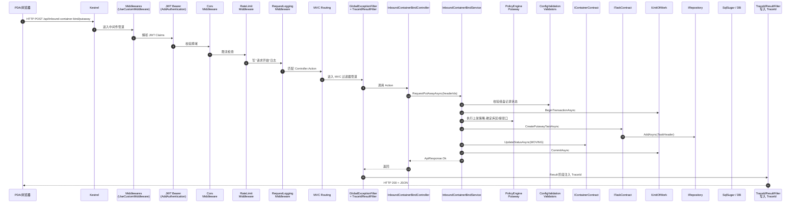
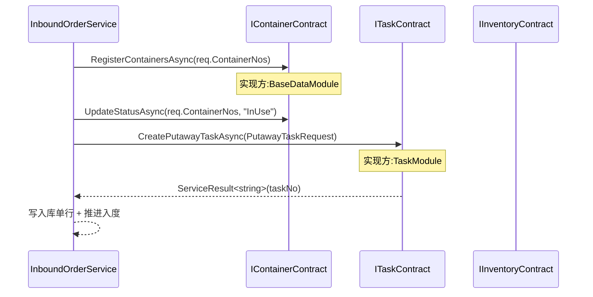
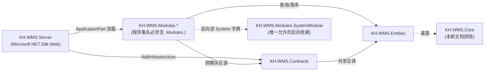

# KH.WMS 后端开发指引

> 本文档面向后端新人的深入专题,与根目录《`KH.WMS项目技术栈与目录指引.md`》(全栈概览)互补。

## 目录

- [范围内项目清单](#范围内项目清单)
- [第 1 章 一个请求的完整旅程](#第-1-章-一个请求的完整旅程)
  - [1.1 全景图](#11-全景图)
  - [1.2 入口:`Program.cs` 启动了哪些管道](#12-入口programcs-启动了哪些管道)
  - [1.3 中间件层(由 `UseCustomMiddleware` 串接)](#13-中间件层由-usecustommiddleware-串接)
  - [1.4 MVC 过滤器管道(进入 Controller 之前)](#14-mvc-过滤器管道进入-controller-之前)
  - [1.5 路由与控制器](#15-路由与控制器)
  - [1.6 服务层(以 `MaterialService` 为真实样例)](#16-服务层以-materialservice-为真实样例)
  - [1.7 AOP 拦截器(自动织入服务调用)](#17-aop-拦截器自动织入服务调用)
  - [1.8 跨模块调用:Contracts(贯穿案例续)](#18-跨模块调用contracts贯穿案例续)
  - [1.9 数据落库](#19-数据落库)
  - [1.10 错误如何被处理(含 TraceId)](#110-错误如何被处理含-traceid)
  - [1.11 API 统一响应格式与响应码](#111-api-统一响应格式与响应码)
- [第 2 章 后端的拆分与依赖](#第-2-章-后端的拆分与依赖)
  - [2.1 为什么拆这么多类库](#21-为什么拆这么多类库)
  - [2.2 每个类库的角色(一句话 + 真实路径)](#22-每个类库的角色一句话--真实路径)
  - [2.3 依赖方向图(含程序集名约束)](#23-依赖方向图含程序集名约束)
  - [2.4 模块之间怎么互调:Contracts](#24-模块之间怎么互调contracts)
  - [2.5 跨模块 Contract 引用矩阵(全 8 模块)](#25-跨模块-contract-引用矩阵全-8-模块)
  - [2.6 哪些东西不能放在哪里(常见错误)](#26-哪些东西不能放在哪里常见错误)
  - [2.7 贯穿案例涉及的 Contracts 速查("入库收货上架")](#27-贯穿案例涉及的-contracts-速查入库收货上架)
- [第 3 章 写代码的模板与约定](#第-3-章-写代码的模板与约定)
  - [3.1 服务自动注册:`[RegisteredService]` + 主构造函数](#31-服务自动注册registeredservice--主构造函数)
  - [3.2 控制器风格:`ExtDataCrudController<T>`](#32-控制器风格extdatacrudcontrollert)
  - [3.3 DTO 命名与放置](#33-dto-命名与放置)
  - [3.4 实体继承与表映射](#34-实体继承与表映射)
  - [3.5 AutoMapper Profile 放哪](#35-automapper-profile-放哪)
  - [3.6 事务:`[Transaction]` + `IUnitOfWork`](#36-事务transaction--iunitofwork)
  - [3.7 拦截器(AOP):日志 / 缓存 / 异常 / 性能 / 配置校验](#37-拦截器aop日志--缓存--异常--性能--配置校验)
  - [3.8 过滤器(进入 Controller / Result 之前)](#38-过滤器进入-controller--result-之前)
  - [3.9 贯穿案例:一个完整的"入库收货"服务骨架(代码示例)](#39-贯穿案例一个完整的入库收货服务骨架代码示例)
  - [3.10 新人易错点(快速对照)](#310-新人易错点快速对照)
- [第 4 章 模块逐讲](#第-4-章-模块逐讲)
  - [4.1 `BaseDataModule` 基础资料模块](#41-basedatamodule-基础资料模块)
  - [4.2 `ConfigModule` 配置模块](#42-configmodule-配置模块)
  - [4.3 `InboundModule` 入库模块](#43-inboundmodule-入库模块)
  - [4.4 `InventoryModule` 库存模块](#44-inventorymodule-库存模块)
  - [4.5 `OutboundModule` 出库模块](#45-outboundmodule-出库模块)
  - [4.6 `SystemModule` 系统管理模块](#46-systemmodule-系统管理模块)
  - [4.7 `TaskModule` 任务中心模块](#47-taskmodule-任务中心模块)
  - [4.8 `WarehouseModule` 仓储基础模块](#48-warehousemodule-仓储基础模块)
- [附录](#附录)
  - [A.1 边缘项目占位说明](#a1-边缘项目占位说明)
  - [A.2 常用命令与访问入口](#a2-常用命令与访问入口)
  - [A.3 调试与日志位置](#a3-调试与日志位置)
  - [A.4 常见坑点速查](#a4-常见坑点速查)

## 范围内项目清单

| 类别 | 项目 | 路径 |
| --- | --- | --- |
| 启动项目 | `KH.WMS.Server` | `KH.WMS/KH.WMS.Server/` |
| 实体 | `KH.WMS.Entities` | `KH.WMS/Entities/KH.WMS.Entities/` |
| 跨模块契约 | `KH.WMS.Contracts` | `KH.WMS/Contracts/KH.WMS.Contracts/` |
| 业务模块 | `KH.WMS.Modules.*` | `KH.WMS/Modules/{Module}/KH.WMS.Modules.{Module}/` |
| 边缘(占位说明) | `KH.WMS.Common` | `KH.WMS/Common/KH.WMS.Common/` |
| 边缘(占位说明) | `KH.WMS.QuartzJob` | `KH.WMS/KH.WMS.QuartzJob/` |
| 排除 | `KH.WMS.Algorithms` | — |
| 排除 | `KH.WMS.Core` | — |

> `KH.WMS.Algorithms` / `KH.WMS.Core` 作为技术底座存在,本文档引用其能力但不展开。


---

## 第 1 章 一个请求的完整旅程

### 1.1 全景图



### 1.2 入口:`Program.cs` 启动了哪些管道

`Program.cs` 按**严格顺序**组织启动,真实启动顺序如下(已逐行核对 `KH.WMS.Server/Program.cs`):

| 步骤 | 调用 | 作用 |
| --- | --- | --- |
| 1 | `AddMemoryCache` | 内存缓存(供 Caching/全局配置等使用) |
| 2 | `builder.Host.AddSerilog(...)` | 结构化日志,文件位于 `KH.WMS.Server/Logs/`,30 天保留,5MB 单文件 |
| 3 | `UseServiceProviderFactory(new AutofacServiceProviderFactory())` | **核心**:把 DI 容器换成 Autofac |
| 4 | `ConfigureContainer` 注册 `ServiceExtensions` Module | **带接口层的服务自动注入**(扫描所有 `[RegisteredService]`) |
| 5 | 注册 `StrategyAutofacModule` | 把算法策略注册到 PolicyRegistry |
| 6 | `AddHttpContextAccessor` | 在日志、Serilog 增强器、用户上下文中获取 `HttpContext` |
| 7 | `AddInfrastructure(config, env)` | 注册 CORS、认证、JWT、Swagger、SqlSugar、缓存、限流等基础设施 |
| 8 | `AddHostedService<DailySnapshotBackgroundService>` | 每日库存快照后台服务 |
| 9 | `AddControllers` + `GlobalExceptionFilter` + `TraceIdResultFilter` | MVC + 全局异常 + TraceId 注入 |
| 10 | `AddJsonOptions` | 驼峰命名、忽略 null、UnsafeRelaxedJsonEscaping、DateTime/NullableDateTime/Enum Converter |
| 11 | `ConfigureApplicationPartManager` | 扫描所有 `*.Modules.*` 程序集,把模块控制器加入 MVC |
| 12 | `AddRazorPages` | MiniProfiler UI 需要 |
| 13 | `AddEndpointsApiExplorer` | Swagger 元数据 |
| 14 | `app.Build()` | 构造 `WebApplication` |
| 15 | 数据库初始化(默认注释) + 预热 `IConfigResolverContract.WarmUpAsync` + 预热 `ISysParameterService.WarmUpAsync` | 避免首次请求慢 |
| 16 | `Request.EnableBuffering()` 内联中间件 | 请求体可重读(`ExtDataCrudController` 解析 `extDataRaw` 依赖) |
| 17 | `app.UseCustomMiddleware(env)` | 串接异常、License、HTTPS、静态文件、CORS、请求日志、Routing、MiniProfiler、认证授权和端点映射 |
| 18 | `app.UseStaticFiles(uploadsDir)` | 暴露上传目录,供附件下载 |
| 19 | `app.UseSwaggerDocumentation(config)` | Swagger UI |
| 20 | `app.Run()` | 监听端口(默认 `http://*:9291`) |


### 1.3 中间件层(由 `UseCustomMiddleware` 串接)

`UseCustomMiddleware` 内部按以下顺序串接(`KH.WMS.Core/Setup/MiddlewareSetup.cs`):

| 顺序 | 中间件 | 触发 | 作用 |
| --- | --- | --- | --- |
| 1 | `UseExceptionHandling()` | 最外层 | 兜底异常 → `ApiResponse.Error` |
| 2 | `UseLicenseValidation()` + `EnsureDefaultLicense()` | License 验证 | 首次启动自动初始化默认授权 |
| 3 | `UseHttpsRedirection()` | 非开发环境 | HTTPS 重定向 |
| 4 | `UseCustomStaticFiles(env)` | 静态文件 | 暴露 `wwwroot` 等静态资源 |
| 5 | `UseCustomCors()` | 跨域 | 使用默认 CORS 策略 |
| 6 | `UseRequestLogging()` | 请求日志 | 记录 Method / Path / TraceId / 用时 |
| 7 | `UseRateLimiting()` | 当前注释 | 限流能力已保留,但当前链路未启用 |
| 8 | `UseRouting()` | 路由 | 建立 Endpoint Routing |
| 9 | `UseMiniProfilerCustom()` | 性能监控 | MiniProfiler |
| 10 | `UseAuthentication()` | 认证 | 解析 JWT |
| 11 | `UseAuthorization()` | 授权 | 授权校验 |
| 12 | `UseEndpoints(...)` | 端点映射 | `MapControllers()` + `MapRazorPages()` |

> 注意:Swagger 和上传目录静态文件是在 `Program.cs` 中另外显式调用的;数据库、缓存、认证、Swagger 等服务注册由 `AddInfrastructure` 完成。

### 1.4 MVC 过滤器管道(进入 Controller 之前)

`Program.cs` 全局注册了两个过滤器:

| 过滤器 | 路径 | 作用 |
| --- | --- | --- |
| `GlobalExceptionFilter` | `KH.WMS.Core/Filters/Exception/GlobalExceptionFilter.cs` | 把异常翻译为 `ApiResponse.Fail(code, message)` 并附 `TraceId` |
| `TraceIdResultFilter` | `KH.WMS.Core/Filters/Result/TraceIdResultFilter.cs` | 在 Result 阶段把 `TraceId` 写入 `ApiResponse.TraceId` |

`Filters/` 下其他过滤器(按需使用):

| 子目录 | 过滤器 | 触发 |
| --- | --- | --- |
| `Action/` | `CustomActionFilter` | 按 `[ServiceFilter]` / `TypeFilter` 标记 |
| `Action/` | `TransactionActionFilter` | 由 `[Transaction]` 特性触发的 `IFilterFactory` |
| `Authorization/` | `ApiAuthorizeFilter` | JWT 校验 |
| `Authorization/` | `CustomAuthorizationFilter` | 自定义授权 |
| `Resource/` | `CustomResourceFilter` | 资源级拦截 |
| `Exception/` | `CustomExceptionFilter` | 局部异常处理 |

### 1.5 路由与控制器

**模块控制器发现机制**:`Program.cs` 12 步通过 `ConfigureApplicationPartManager` 扫描所有**程序集名包含 `.Modules.`** 的 dll,把它们的 Controller 加入 MVC。这意味着:
- 任何新模块类库**程序集名必须包含 `.Modules.`**,否则 Controller 不会注册
- 现有命名:`KH.WMS.Modules.BaseDataModule.dll` 符合

**控制器基类**(项目里有 2 个,绝大多数模块用 `ExtDataCrudController<T>`):

| 基类 | 路径 | 用途 |
| --- | --- | --- |
| `CrudController<TEntity>` | `KH.WMS.Core/Controllers/CrudController.cs` | 10 个标准 CRUD 端点 |
| `ExtDataCrudController<TEntity>` | `KH.WMS.Core/Controllers/ExtDataCrudController.cs` | **支持 ExtData 扩展字段**,业务模块的默认选择 |

**真实控制器样例**(`Modules/BaseDataModule/.../Controllers/MaterialController.cs`):

```csharp
[Route("api/material")]
public class MaterialController(IMaterialService materialService)
    : ExtDataCrudController<MdMaterial>(materialService)
{
    [HttpGet("form-config")]
    public async Task<IActionResult> GetFormConfig()
    {
        var extService = HttpContext.RequestServices
            .GetRequiredService<ICfgExtFieldContract>();
        var fields = await extService.GetFieldsAsync("MD_MATERIAL", "HEADER");
        var columns = extService.BuildFormColumns(fields);
        return Ok(new { success = true, data = new { columns } });
    }
}
```

要点:
- 主构造函数只注入 Service,业务扩展方法用 `HttpContext.RequestServices.GetRequiredService<...>()` 按需解析
- `[Route("api/material")]` 是类级路由,Action 内的 `HttpGet/Post` 是子路由
- 业务扩展方法返回 `IActionResult` 而非 `ApiResponse` 会被全局过滤器**绕过 TraceId 注入**,推荐用 `ApiResponse` 返回用 `ApiResponse.Ok(...)`

### 1.6 服务层(以 `MaterialService` 为真实样例)

**真实样例全文**(`MaterialService.cs`):

```csharp
[RegisteredService(ServiceType = typeof(IMaterialService))]
public class MaterialService(
    IMappingService mappingService,
    IRepository<MdMaterial, long> repository,
    ISqlSugarClient db,
    IImportExportService importExportService,
    IUnitOfWork unitOfWork,
    IDetailSaveService detailSaveService)
    : CrudService<MdMaterial>(mappingService, repository, db,
        importExportService, unitOfWork, detailSaveService),
      IMaterialService
{
}
```

**真实接口全文**(`IMaterialService.cs`):

```csharp
public interface IMaterialService : ICrudService<MdMaterial>
{
}
```

要点(新人最容易搞错的几点):
- **主构造函数参数顺序必须与基类 `CrudService<T>(...)` 完全一致**,Autofac 才能解析
- `IMaterialService` 目前**没有自己的方法**,完全靠 `ICrudService<MdMaterial>` 提供能力
- `[LogInterceptor]` 已经挂在 `CrudService<T>` 上,业务类不需要再挂
- 需要加新业务方法时:`public async Task<ApiResponse> DoXxxAsync(...)` 即可

### 1.7 AOP 拦截器(自动织入服务调用)

服务方法被调用时,会按以下顺序经过拦截器(`KH.WMS.Core/AOP/Interceptors/`):

| 拦截器 | 作用 |
| --- | --- |
| `ExceptionInterceptor` | 业务异常转译(配合 `GlobalExceptionFilter` 兜底) |
| `LoggingInterceptor` | 记录参数 + 返回值 + 用时 |
| `PerformanceInterceptor` | 慢调用检测 |
| `CachingInterceptor` | 由 `[Cache]` 触发 |
| `ConfigValidationInterceptor` | 由 `[ConfigValidation]` 触发 |

特性语法:`[LogInterceptor(LogParameters = true, LogReturnValue = true, LogLevel = LogLevel.Information)]`

### 1.8 跨模块调用:Contracts(贯穿案例续)

控制器 → 服务 → Contracts 的调用链(本案例涉及 3 个 Contract):



要点:
- `IContainerContract` 定义在 `KH.WMS.Contracts/Container/`,实现在 `BaseDataModule/Contracts/ContainerContract`(挂 `[RegisteredService(ServiceType = typeof(IContainerContract))]`)
- `ITaskContract` 定义在 `KH.WMS.Contracts/Task/`,命名空间为 `KH.WMS.Contracts.Tasks`,实现在 `TaskModule/Contracts/TaskContract`
- 业务模块**不**通过 `using` 对方 `Services/`,Autofac 按 `ServiceType` 注入实现
- 调用方控制 `IUnitOfWork`,被调 Contract 不开自己的事务

### 1.9 数据落库

- 简单 CRUD:`IRepository<T, TKey>`(`AddAsync` / `UpdateAsync` / `DeleteAsync` / `GetByIdAsync` / `GetFirstAsync`)
- 复杂查询:`ISqlSugarClient.Queryable<T>()` 链式 Lambda
- 事务边界:`IUnitOfWork.BeginTransactionAsync` / `CommitAsync` / `RollbackAsync`
- 主从表保存:`IDetailSaveService.SaveDetailsAsync` / `SaveOneToOneAsync`(`CrudService` 基类已自动调用)

### 1.10 错误如何被处理(含 TraceId)

**异常体系**(`KH.WMS.Core/Exceptions/`):
| 异常类 | Code | 用途 |
| --- | --- | --- |
| `BusinessException` | 自定义 | 业务规则失败 |
| `ValidationException` | 422 | 字段级校验失败,前端可解析 `Data.errors` |
| `NotFoundException` | 404 | 资源未找到 |

**TraceId 流转**:
1. 请求进入 → `RequestLoggingMiddleware` 读 `X-Correlation-ID` 头或 `HttpContext.TraceIdentifier`
2. `CorrelationIdEnricher`(Serilog)在每条日志注入属性 `CorrelationId`
3. `GlobalExceptionFilter` 把异常翻译为 `ApiResponse.Fail` 时,`TraceId` 暂存到 `HttpContext.Items`
4. `TraceIdResultFilter` 在 Result 阶段把 `TraceId` 写入 `ApiResponse.TraceId`
5. 前端报错时贴回 `TraceId`,后端按 `CorrelationId == <TraceId>` 过滤日志

**业务关联 ID**:请求头 `X-Business-ID` 也会被 `CorrelationIdEnricher` 写入日志属性 `BusinessId`,常用于按单据号聚合日志。

### 1.11 API 统一响应格式与响应码

**统一响应包结构**(`ApiResponse`):

| 字段 | 类型 | 来源 | 备注 |
| --- | --- | --- | --- |
| `Code` | int | 业务码 | 见响应码表 |
| `Message` | string | `ResponseCode.GetMessage(code)` 或自定义 | 默认中文 |
| `Timestamp` | long | `DateTimeOffset.UtcNow.ToUnixTimeMilliseconds()` | Unix 毫秒 |
| `Data` | object? | 业务数据 | 成功时承载返回体,失败时承载错误详情 |
| `TraceId` | string? | `TraceIdResultFilter` 注入 | 排错用 |

**响应码表**(对应 `ResponseCode` 静态常量):

| 范围 | 业务码 | 默认消息 | HTTP 状态 | 工厂方法 |
| --- | --- | --- | --- | --- |
| 2xx | 200 SUCCESS | 操作成功 | 200 | `ApiResponse.Ok(data)` |
| 2xx | 201 CREATED | 创建成功 | 200 | — |
| 2xx | 202 ACCEPTED | 请求已接受 | 200 | — |
| 2xx | 204 NO_CONTENT | 无内容返回 | 200 | — |
| 4xx | 400 BAD_REQUEST | 请求参数错误 | 400 | `ApiResponse.Fail(400, msg)` |
| 4xx | 401 UNAUTHORIZED | 未授权访问 | 401 | `ApiResponse.Unauthorized()` |
| 4xx | 403 FORBIDDEN | 无权限访问 | 403 | — |
| 4xx | 404 NOT_FOUND | 资源未找到 | 404 | `ApiResponse.NotFound()` |
| 4xx | 405 METHOD_NOT_ALLOWED | 请求方法不允许 | 405 | — |
| 4xx | 408 REQUEST_TIMEOUT | 请求超时 | 408 | — |
| 4xx | 409 CONFLICT | 数据冲突 | 409 | — |
| 4xx | 422 VALIDATION_ERROR | 数据验证失败 | 422 | `ApiResponse.ValidationError(msg, errors)` |
| 4xx | 429 RATE_LIMIT_EXCEEDED | 请求过于频繁 | 429 | — |
| 5xx | 500 INTERNAL_SERVER_ERROR | 服务器内部错误 | 500 | `ApiResponse.Error()` |
| 5xx | 501 NOT_IMPLEMENTED | 功能未实现 | 501 | — |
| 5xx | 502 BAD_GATEWAY | 网关错误 | 502 | — |
| 5xx | 503 SERVICE_UNAVAILABLE | 服务不可用 | 503 | — |
| 5xx | 504 GATEWAY_TIMEOUT | 网关超时 | 504 | — |

**两种响应示例**(贯穿案例的成功 / 失败):
```json
// 成功
{
  "code": 200,
  "message": "操作成功",
  "timestamp": 1750543212345,
  "data": { "receiptId": 123, "taskNo": "PT20260522-0001" },
  "traceId": "0HNCG7F4N3K2Q:00000001"
}

// 校验失败
{
  "code": 422,
  "message": "数据验证失败",
  "timestamp": 1750543212345,
  "data": { "fields": [ { "field": "qty", "error": "must be > 0" } ] },
  "traceId": "0HNCG7F4N3K2Q:00000002"
}
```

**前后端约定**:
- 前端拿到非 `200` 即视为失败
- 排错时贴 `traceId` 给后端,后端用 `CorrelationId == <traceId>` 过滤 Serilog 还原整条请求


---

## 第 2 章 后端的拆分与依赖

### 2.1 为什么拆这么多类库

- **单一职责 + 可替换**:每个类库一个清晰角色,改一处不污染其他角色
- **跨模块互调解耦**:模块 A 调用模块 B 时只引用 `KH.WMS.Contracts` 的接口
- **可测试性**:每个项目能独立 `dotnet build`、被单测工程独立引用
- **团队并行**:不同模块由不同人/小组改动,边界清晰,合并冲突小

### 2.2 每个类库的角色(一句话 + 真实路径)

| 项目 | 一句话角色 | 真实路径 |
| --- | --- | --- |
| `KH.WMS.Server` | 启动入口,组装管道、注册服务、加载模块控制器、托管后台服务 | `KH.WMS/KH.WMS.Server/` |
| `KH.WMS.Entities` | 数据库表对应的实体类,按业务域分目录 | `KH.WMS/Entities/KH.WMS.Entities/` |
| `KH.WMS.Contracts` | 跨模块接口、请求/响应模型、跨模块事件 | `KH.WMS/Contracts/KH.WMS.Contracts/` |
| `KH.WMS.Modules.*` | 真正的业务逻辑落点;每个模块独立类库,内部 Controllers/Services/Interfaces/DTOs/Contracts | `KH.WMS/Modules/{Module}/KH.WMS.Modules.{Module}/` |
| `KH.WMS.Common` | 极少量无业务依赖的纯公共代码,默认慎用 | `KH.WMS/Common/KH.WMS.Common/` |
| `KH.WMS.QuartzJob` | 预留的定时任务宿主,目前内容偏少 | `KH.WMS/KH.WMS.QuartzJob/` |

### 2.3 依赖方向图(含程序集名约束)



要点:
- `KH.WMS.Server` 不直接 `using Modules/.../Services/`,只通过 `ApplicationPart` 让 MVC 发现模块控制器
- `KH.WMS.Contracts` 只能依赖 `Entities`,不依赖 `Modules`
- `Modules` 之间不能互相 `using Services/`,只能引用 `Contracts`
- **唯一例外**:业务模块可以 `using KH.WMS.Modules.SystemModule.Interfaces` 调 `ISysDictService` / `ISysParameterService` 等(因为字典/参数是基础设施)

### 2.4 模块之间怎么互调:Contracts

**调用模板**(以 `InboundContainerBindService.RequestPutAwayAsync` 为例):

```csharp
public class InboundContainerBindService(
    /* ... 基类依赖 ... */
    IContainerContract containerContract,       // BaseDataModule/Contracts 实现
    ITaskContract taskContract,                 // TaskModule/Contracts 实现
    IInboundOrderContract inboundOrderContract, // InboundModule/Contracts 实现
    IDocumentStatusValidatorContract statusValidator)
    : CrudService<InboundContainerBindHeader>(/* ... */),
      IInboundContainerBindService
{
    public async Task<ServiceResult> RequestPutAwayAsync(List<long> headerIds)
    {
        await _unitOfWork.BeginTransactionAsync();
        try
        {
            var headers = new List<InboundContainerBindHeader>();
            foreach (var id in headerIds)
            {
                var header = await headerRepository.GetByIdWithNavAsync(id);
                if (header == null || header.BindStatus != BizConstants.BindStatus.BOUND)
                    return ServiceResult.Fail("请选择可上架的组盘记录");
                headers.Add(header);
            }

            foreach (var header in headers)
            {
                var taskRes = await taskContract.CreatePutawayTaskAsync(
                    new PutawayTaskRequest
                    {
                        WarehouseId = header.WarehouseId ?? 0,
                        DocId = header.Id,
                        DocNo = header.SourceDocNo,
                        ContainerNo = header.ContainerCode,
                        Lines = header.Details.Select(d => new PutawayTaskLineRequest
                        {
                            MaterialId = d.MaterialId,
                            MaterialCode = d.MaterialCode,
                            BatchNo = d.BatchNo,
                        }).ToList(),
                    });

                if (!taskRes.Success) return ServiceResult.Fail(taskRes.Message);
                await inboundOrderContract.MarkBindAsPuttingAwayAsync(header.Id);
            }

            await containerContract.UpdateStatusAsync(
                headers.Select(h => h.ContainerCode).Distinct().ToList(),
                BizConstants.ContainerStatus.MOVING);

            await _unitOfWork.CommitAsync();
            return ServiceResult.Ok("上架任务已创建");
        }
        catch
        {
            await _unitOfWork.RollbackAsync();
            throw;
        }
    }
}
```

要点:
- Contract 不抛业务异常,失败走 `ServiceResult.Fail` / `null` 等显式信号
- 跨模块事务协调:**调用方**控制 `IUnitOfWork`,被调 Contract **不**主动开事务
- Contract 接口命名约定:`I{业务}Contract`,实现类放在各模块 `Contracts/{业务}Contract.cs`,方法命名:`动词 + 业务对象 + Async`

### 2.5 跨模块 Contract 引用矩阵(全 8 模块)

| 模块 | 实现的 Contract | 引用的其他模块 Contract(按命名空间) |
| --- | --- | --- |
| `BaseDataModule` | `MaterialContract` / `ContainerContract` | `BaseData`(自) / `Config` / `Container`(自) |
| `ConfigModule` | `CfgExtFieldContract` / `CfgDocumentFieldExtContract` / `ConfigResolverContract` / `DocumentStatusValidatorContract` | `Config`(自) |
| `InboundModule` | `InboundOrderContract` | `BaseData` / `Config` / `Container` / `Inbound`(自) / `Tasks` / `Warehouse` |
| `InventoryModule` | `InventoryContract` | `Config` / `Inventory`(自) |
| `OutboundModule` | `OutboundContract` | `BaseData` / `Config` / `Inventory` / `Outbound`(自) / `Tasks` |
| `SystemModule` | (无) | (无) |
| `TaskModule` | `TaskContract` | `Config` / `Container` / `Inbound` / `Inventory` / `Outbound` / `Tasks`(自) / `Warehouse` |
| `WarehouseModule` | `LocationContract` | `Warehouse`(自) |

> 入库 / 出库 / 任务 三个模块是**协调者**,跨模块引用最多;系统 / 仓储 是**底座**,几乎不被依赖(系统被业务反向读字典,仓储通过 Contract 被算法/库存/任务调用)。

### 2.6 哪些东西不能放在哪里(常见错误)

| 想做的事 | ❌ 错误做法 | ✅ 正确做法 |
| --- | --- | --- |
| 新建一张表对应的实体 | 放到 `Modules/.../Models/` | 放到 `KH.WMS.Entities/{业务域}` |
| 模块 A 调模块 B 的服务 | `using Modules/BModule/Services` | `using KH.WMS.Contracts.B` + 注入 `IBContract` |
| 写一个跨模块事件 | 放到 `Modules/A/Events/` | 放到 `KH.WMS.Contracts/Events/` |
| 写一个通用工具类 | 放到 `KH.WMS.Modules.Xxx/Utils` | 视情况:`Core` 内的扩展;无业务依赖可放 `Common` |
| 写 AutoMapper Profile | 散落在模块里 | 集中到 `KH.WMS.Server/Profiles/`(3 个文件:`DtoProfile` / `EntityProfile` / `ViewModelProfile`) |
| 写后台服务 | 放进具体业务模块 | 放进 `KH.WMS.Server/BackgroundServices/` |
| 新模块类库但程序集名不含 `.Modules.` | 控制器不被 MVC 发现 | 程序集名遵循 `KH.WMS.Modules.XxxModule` |
| 业务模块引用 `KH.WMS.Core/Services/ICrudService` 实现 | 直接用即可,这是允许的 | 但**不要**继承或修改 Core 内部类 |

### 2.7 贯穿案例涉及的 Contracts 速查("入库收货上架")

| 业务动作 | 调用的 Contract | 谁实现 | 入参 | 出参 |
| --- | --- | --- | --- | --- |
| 注册/激活容器 | `IContainerContract.RegisterContainersAsync` | `BaseDataModule` | `List<string> containerNos` | `int newCount` |
| 容器状态变更 | `IContainerContract.UpdateStatusAsync` | `BaseDataModule` | `List<string>`, `string status` | `Task` |
| 创建上架任务 | `ITaskContract.CreatePutawayTaskAsync` | `TaskModule` | `PutawayTaskRequest` | `ServiceResult<string>`(任务号) |
| 上架完成后生成库存 | `IInventoryContract.GenerateInventoryFromPutawayAsync` | `InventoryModule` | `InventoryGenerationRequest` | `long inventoryHeadId` |
| 更新库位状态 | `ILocationContract.UpdateLocationStatusAsync` | `WarehouseModule` | `long locationId`, `string status` | `Task` |

新人排错口诀:看到 `IXxxContract` 不知道谁实现 → 看 `KH.WMS/Contracts/KH.WMS.Contracts/{业务域}/` 的接口 → 到对应 `Modules/{Module}/KH.WMS.Modules.{Module}/Contracts/{业务名}Contract.cs`。


---

## 第 3 章 写代码的模板与约定

> 范围说明:本章讲"在 KH.WMS 里写代码应该长什么样",引用的基类/特性位于 `KH.WMS.Core`,本章只描述**用法和约定**。

### 3.1 服务自动注册:`[RegisteredService]` + 主构造函数

**特性签名**(`KH.WMS.Core/DependencyInjection/ServiceLifetimes/RegisteredServiceAttribute.cs`):

```csharp
[AttributeUsage(AttributeTargets.Class, AllowMultiple = false)]
public class RegisteredServiceAttribute : Attribute
{
    public ServiceLifetime Lifetime { get; set; } = ServiceLifetime.Scoped; // 默认 Scoped
    public bool WithoutInterceptor { get; set; } = false;                    // 跳过 AOP
    public Type? ServiceType { get; set; } = null;                          // 显式注册到哪个接口
}
```

**真实注册清单**(以 `MaterialService` 为例):
```csharp
[RegisteredService(ServiceType = typeof(IMaterialService))]
public class MaterialService(/* 主构造函数参数 */)
    : CrudService<MdMaterial>(/* 透传给基类 */), IMaterialService
{
}
```

**主构造函数参数顺序硬规则**:
- 必须与 `CrudService<T>(IMappingService, IRepository<T, long>, ISqlSugarClient, IImportExportService, IUnitOfWork, IDetailSaveService?)` **完全一致**(前 6 个)
- Autofac 按类型解析,不按名字,所以顺序错了**不会**编译失败,只会运行时报"无法解析"
- 自定义依赖(Contract、其他 Service)放最后

**注册流程**:
1. `Program.cs` `ConfigureContainer` 注册 `ServiceExtensions` Module
2. `ServiceExtensions` Module 扫描所有加载的程序集
3. 找到带 `[RegisteredService]` 的类,按 `ServiceType` 注册到 Autofac
4. 找到带 `[RegisteredService(ServiceType = typeof(ICrudService<>))]` 的 `CrudService<T>` 注册为开放式泛型

### 3.2 控制器风格:`ExtDataCrudController<T>`

项目里有 2 个基类,**业务模块默认用 `ExtDataCrudController<T>`**(因为绝大多数实体有 `ExtData` 扩展字段):

| 基类 | 路径 | 适用场景 |
| --- | --- | --- |
| `CrudController<TEntity>` | `KH.WMS.Core/Controllers/CrudController.cs` | 没有 `ExtData` 字段的纯 CRUD |
| `ExtDataCrudController<TEntity>` | `KH.WMS.Core/Controllers/ExtDataCrudController.cs` | **业务模块默认**,支持 `extDataRaw` 扩展字段写入 + 读时扁平展开 |

**`ExtDataCrudController` 真实代码片段**(`ExtDataCrudController.cs` 96-110 行):
```csharp
[HttpPost("create")]
public override async Task<ApiResponse> Create([FromBody] TEntity entity)
{
    await ExtractExtDataFromRequest(entity);  // 从请求体提取 extDataRaw 写入 ExtData
    return await service.CreateAsync(entity);
}

[HttpPost("update")]
public override async Task<ApiResponse> Update([FromBody] TEntity entity)
{
    await ExtractExtDataFromRequest(entity);
    return await service.UpdateAsync(entity);
}
```

**`extDataRaw` 工作流**:
1. 前端 POST 实体 + 额外 `extDataRaw` 字段(JSON 字符串)
2. `ExtractExtDataFromRequest` 从请求体读 `extDataRaw` 写入 `entity.ExtData`
3. 依赖 `Program.cs` 第 17 步的 `EnableBuffering()` 才能重读 Body

**真实控制器样例**(`MaterialController.cs` 全文):
```csharp
[Route("api/material")]
public class MaterialController(IMaterialService materialService)
    : ExtDataCrudController<MdMaterial>(materialService)
{
    [HttpGet("form-config")]
    public async Task<IActionResult> GetFormConfig()
    {
        var extService = HttpContext.RequestServices
            .GetRequiredService<ICfgExtFieldContract>();
        var fields = await extService.GetFieldsAsync("MD_MATERIAL", "HEADER");
        var columns = extService.BuildFormColumns(fields);
        return Ok(new { success = true, data = new { columns } });
    }
}
```

**10 个标准端点**(已与 `CrudController` 源码核对):
| 动词 | 路由 | 方法 | 用途 |
| --- | --- | --- | --- |
| `GetById` | `GET {id}` | 查询 | 按主键获取详情(ExtData 基类会扁平展开) |
| `GetPagedList` | `POST pagelist` | 查询 | 高级过滤 + 多字段排序分页 |
| `GetAll` | `GET all` | 查询 | 全量列表(下拉选择) |
| `Create` | `POST create` | 写 | 新增(ExtData 基类会写 extDataRaw) |
| `Update` | `POST update` | 写 | 更新(ExtData 基类会写 extDataRaw) |
| `Delete` | `DELETE delete/{id}` | 写 | 删除单条 |
| `BatchDelete` | `DELETE batch` | 写 | 批量删除 |
| `Export` | `POST export` | 导出 | 通用导出(支持列配置、字典翻译) |
| `Import` | `POST import` | 导入 | MiniExcel 导入 |
| `DownloadTemplate` | `GET template` | 模板 | 下载导入模板 |

**控制器约束**:`TEntity : BaseEntity<long>, new()`,所以**实体必须继承 `BaseEntity<long>`**。

**端点上的 `[Cache(Enable = false)]`**:`CrudController` 已挂在每个端点,默认**关闭**缓存,避免列表/详情被缓存。

### 3.3 DTO 命名与放置

- DTO 只放**输入输出模型**,不放业务逻辑
- 命名建议:
  - `XxxDto` — 主数据展示/列表
  - `SaveXxxDto` / `XxxCreateDto` / `XxxUpdateDto` — 保存/创建/更新入参
  - `XxxDetailDto` — 详情(含主从表)
  - `XxxQueryDto` — 查询入参
- 放哪:
  - 模块专属 DTO → `Modules/{模块}/.../DTOs/`
  - 跨模块请求/响应 → `Contracts/KH.WMS.Contracts/{业务域}/`
- 注意:`InventoryModule` **没有** DTOs 子目录(其他模块都有),因为它直接用实体或由调用方定义

### 3.4 实体继承与表映射

- 所有实体继承 `BaseEntity<long>`,自带 `Id` / `CreatedTime` / `LastModifiedTime` 等审计字段
- `CrudService` 基类的 `FillAuditFields` 钩子在新增/更新时自动填充
- 命名建议:`Md` 前缀的基础资料实体(`MdMaterial` / `MdWarehouse`);业务单据实体按业务名(`InboundOrder` / `OutboundOrder`)
- 表名映射通过 SqlSugar 的 `SugarTable` / `AOP` 在实体上标注,具体约定需读 `KH.WMS.Server/Setup` 内的数据库初始化配置

### 3.5 AutoMapper Profile 放哪

`KH.WMS.Server/Profiles/` 下固定 3 个 Profile 文件:
| Profile | 用途 |
| --- | --- |
| `DtoProfile.cs` | DTO ↔ DTO / DTO ↔ Entity |
| `EntityProfile.cs` | Entity ↔ Entity(内部使用) |
| `ViewModelProfile.cs` | Entity ↔ 前端 ViewModel |

**约定**:
- 新增映射补到对应 `Profile` 文件
- Service 内用 `IMappingService`(由 `CrudService` 注入)做映射,不要直接 `Mapper.Map`
- 模块新增 DTO 与实体的映射,需要同时改 `Server/Profiles/{Xxx}Profile.cs`

### 3.6 事务:`[Transaction]` + `IUnitOfWork`

**特性签名**(`KH.WMS.Core/Attributes/TransactionAttribute.cs`):
```csharp
[AttributeUsage(AttributeTargets.Method | AttributeTargets.Class, AllowMultiple = false)]
public class TransactionAttribute : Attribute, IFilterFactory
{
    public System.Data.IsolationLevel IsolationLevel { get; set; } = IsolationLevel.ReadCommitted; // 默认
    public int Timeout { get; set; } = 30; // 默认 30 秒
}
```

**两种使用方式**:
1. **声明式**:在 Controller Action 上挂 `[Transaction]`,MVC 管道自动 `TransactionActionFilter` 接管
2. **命令式**:业务方法内 `_unitOfWork.BeginTransactionAsync() / CommitAsync() / RollbackAsync()`

**真实模式**(`CrudService.CreateAsync` 102-133 行 简化):
```csharp
public virtual async Task<ApiResponse> CreateAsync(TEntity entity)
{
    try
    {
        await _unitOfWork.BeginTransactionAsync();
        await BeforeCreateAsync(entity);
        FillAuditFields(entity, isCreate: true);
        var id = await _repository.AddAsync(entity);
        if (_detailSaveService != null)
        {
            await _detailSaveService.SaveDetailsAsync(entity, isCreate: true);
            await _detailSaveService.SaveOneToOneAsync(entity, isCreate: true);
        }
        await AfterCreateAsync(entity);
        await _unitOfWork.CommitAsync();
        return ApiResponse.Ok(id, "新增成功");
    }
    catch
    {
        await _unitOfWork.RollbackAsync();
        throw;
    }
}
```

### 3.7 拦截器(AOP):日志 / 缓存 / 异常 / 性能 / 配置校验

**真实清单**(`KH.WMS.Core/AOP/Interceptors/`):

| 拦截器 | 路径 | 触发特性 | 作用 |
| --- | --- | --- | --- |
| `LoggingInterceptor` | `AOP/Interceptors/LoggingInterceptor.cs` | `[LogInterceptor(LogParameters, LogReturnValue, LogLevel)]` | 记录参数 + 返回值 + 用时 |
| `CachingInterceptor` | `AOP/Interceptors/CachingInterceptor.cs` | `[Cache(Enable, Key, Expiration)]` | 缓存结果 |
| `ExceptionInterceptor` | `AOP/Interceptors/ExceptionInterceptor.cs` | 自动 | 业务异常转译 |
| `PerformanceInterceptor` | `AOP/Interceptors/PerformanceInterceptor.cs` | `[Performance(ThresholdMs)]` | 慢调用检测 |
| `ConfigValidationInterceptor` | `AOP/Interceptors/ConfigValidationInterceptor.cs` | `[ConfigValidation]` | 配置项校验 |

**`CrudService<T>` 已挂**:
```csharp
[RegisteredService(ServiceType = typeof(ICrudService<>)),
 LogInterceptor(LogParameters = true, LogReturnValue = true, LogLevel = LogLevel.Information)]
public class CrudService<TEntity> : ApplicationService, ICrudService<TEntity>
```

业务类**不需要**再挂 `[LogInterceptor]`,继承 `CrudService` 自动获得。

### 3.8 过滤器(进入 Controller / Result 之前)

**真实清单**(`KH.WMS.Core/Filters/`):

| 子目录 | 过滤器 | 触发方式 |
| --- | --- | --- |
| `Exception/` | `GlobalExceptionFilter` | `Program.cs` 全局注册 |
| `Exception/` | `CustomExceptionFilter` | `[ServiceFilter]` / `TypeFilter` |
| `Result/` | `TraceIdResultFilter` | `Program.cs` 全局注册,Result 阶段注入 TraceId |
| `Action/` | `CustomActionFilter` | 按需 |
| `Action/` | `TransactionActionFilter` | 由 `[Transaction]` 特性触发的 `IFilterFactory` |
| `Authorization/` | `ApiAuthorizeFilter` | `[ApiAuthorize]` |
| `Authorization/` | `CustomAuthorizationFilter` | 按需 |
| `Resource/` | `CustomResourceFilter` | 按需 |

### 3.9 贯穿案例:一个完整的"入库收货 + 组盘 + 上架请求"骨架(代码示例)

```csharp
// 1. 服务接口(在 Modules/InboundModule/.../Interfaces/)
public interface IInboundOrderService : ICrudService<InboundOrder>
{
    Task<ServiceResult> ReceiveAsync(long orderId, List<ReceiveLineDto> receiveLines);
    Task<ServiceResult> ReceiveAndBindAsync(ReceiveAndBindDto dto);
}

public interface IInboundContainerBindService : ICrudService<InboundContainerBindHeader>
{
    Task<ServiceResult> ContainerBindAsync(List<ContainerBindDto> binds);
    Task<ServiceResult> RequestPutAwayAsync(List<long> headerIds);
}

// 2. 收货服务:负责单据状态、明细收货数量、扩展字段反序列化
[RegisteredService(Lifetime = ServiceLifetime.Scoped, ServiceType = typeof(IInboundOrderService))]
public class InboundOrderService(
    IMappingService mappingService,
    IRepository<InboundOrder, long> repository,
    ISqlSugarClient db,
    IImportExportService importExportService,
    IRepository<InboundOrderLine, long> inboundOrderLineRepository,
    IMaterialContract materialContract,
    IDocumentStatusValidatorContract statusValidator,
    IUnitOfWork unitOfWork,
    IDetailSaveService detailSaveService,
    ICfgDocumentFieldExtContract extFieldService)
    : CrudService<InboundOrder>(mappingService, repository, db,
        importExportService, unitOfWork, detailSaveService),
      IInboundOrderService
{
    public async Task<ServiceResult> ReceiveAsync(long orderId, List<ReceiveLineDto> receiveLines)
    {
        var order = await repository.GetByIdAsync(orderId);
        if (order == null)
            return ServiceResult.Fail("入库单不存在");

        var (targetStatus, validateError) = await ValidateReceiveAsync(order, receiveLines);
        if (validateError != null)
            return ServiceResult.Fail(validateError);

        var lines = await inboundOrderLineRepository.GetListAsync(
            l => receiveLines.Select(r => r.LineId).Contains(l.Id));
        var processError = await ProcessReceiveLinesAsync(lines, receiveLines);
        if (processError != null)
            return ServiceResult.Fail(processError);

        await RefreshOrderStatusAfterReceiveAsync(orderId, order);
        return ServiceResult.Ok("收货成功");
    }
}

// 3. 组盘服务:负责容器注册、配置校验、上架任务创建
[RegisteredService(ServiceType = typeof(IInboundContainerBindService))]
public class InboundContainerBindService(
    IMappingService mappingService,
    IRepository<InboundContainerBindHeader, long> headerRepository,
    IRepository<InboundContainerBindDetail, long> detailRepository,
    IRepository<InboundOrder, long> orderRepository,
    IRepository<InboundOrderLine, long> orderLineRepository,
    ISqlSugarClient db,
    IImportExportService importExportService,
    IContainerContract containerContract,
    ITaskContract taskContract,
    IInboundOrderContract inboundOrderContract,
    IPolicyEngine policyEngine,
    ILocationQueryService locationQueryService,
    IWarehouseQueryService warehouseQueryService,
    IDocumentStatusValidatorContract statusValidator,
    IUnitOfWork unitOfWork,
    IDetailSaveService detailSaveService)
    : CrudService<InboundContainerBindHeader>(mappingService, headerRepository, db,
        importExportService, unitOfWork, detailSaveService),
      IInboundContainerBindService
{
    [ConfigValidation(ValidatorCodes.BIND_DATA_NOT_EMPTY)]
    [ConfigValidation(ValidatorCodes.BIND_QUANTITY)]
    [ConfigValidation(ValidatorCodes.BATCH_NO_REQUIRED)]
    [ConfigValidation(ValidatorCodes.EXPIRY_DATE_REQUIRED)]
    [ConfigValidation(ValidatorCodes.MIXED_MATERIAL)]
    [ConfigValidation(ValidatorCodes.MIXED_BATCH)]
    public async Task<ServiceResult> ContainerBindAsync(List<ContainerBindDto> binds)
    {
        await _unitOfWork.BeginTransactionAsync();
        try
        {
            var containerCodes = binds.Select(b => b.ContainerCode).Distinct().ToList();
            await containerContract.RegisterContainersAsync(containerCodes);

            // 校验容器无活跃组盘、无库存、无活跃任务后,按容器分组构建组盘头/明细
            var headers = binds
                .GroupBy(b => b.ContainerCode)
                .Select(group => new InboundContainerBindHeader
                {
                    ContainerCode = group.Key,
                    BindStatus = BizConstants.BindStatus.BOUND,
                    Details = group.Select(bind => new InboundContainerBindDetail
                    {
                        InboundOrderLineId = bind.InboundOrderLineId,
                        Qty = bind.Qty,
                        BatchNo = bind.BatchNo,
                    }).ToList(),
                })
                .ToList();
            foreach (var header in headers)
                await headerRepository.AddWithNavAsync(header);

            await containerContract.UpdateStatusAsync(containerCodes, BizConstants.ContainerStatus.IN_USE);

            await _unitOfWork.CommitAsync();
            return ServiceResult.Ok("组盘成功");
        }
        catch
        {
            await _unitOfWork.RollbackAsync();
            throw;
        }
    }

    public async Task<ServiceResult> RequestPutAwayAsync(List<long> headerIds)
    {
        await _unitOfWork.BeginTransactionAsync();
        try
        {
            var headers = new List<InboundContainerBindHeader>();
            foreach (var id in headerIds)
            {
                var header = await headerRepository.GetByIdWithNavAsync(id);
                if (header == null || header.BindStatus != BizConstants.BindStatus.BOUND)
                    return ServiceResult.Fail("请选择可上架的组盘记录");
                headers.Add(header);
            }
            foreach (var header in headers)
            {
                var taskResult = await CreatePutawayTaskFromBindAsync(header);
                if (!taskResult.Success)
                    return ServiceResult.Fail(taskResult.Message);

                await inboundOrderContract.MarkBindAsPuttingAwayAsync(header.Id);
            }

            await containerContract.UpdateStatusAsync(
                headers.Select(h => h.ContainerCode).Distinct().ToList(),
                BizConstants.ContainerStatus.MOVING);
            await _unitOfWork.CommitAsync();
            return ServiceResult.Ok("上架任务已创建");
        }
        catch
        {
            await _unitOfWork.RollbackAsync();
            throw;
        }
    }
}

// 4. 控制器:Controller 层把 ServiceResult 翻译为 ApiResponse
[Route("api/inbound-container-bind")]
public class InboundContainerBindController(
    IInboundContainerBindService bindService,
    IInboundOrderService inboundOrderService)
    : CrudController<InboundContainerBindHeader>(bindService)
{
    [HttpPost("bind")]
    public async Task<ApiResponse> ContainerBindAsync([FromBody] List<ContainerBindDto> binds)
    {
        var result = await bindService.ContainerBindAsync(binds);
        return result.Success ? ApiResponse.Ok() : ApiResponse.Error(message: result.Message);
    }

    [HttpPost("putaway")]
    public async Task<ApiResponse> RequestPutAway([FromBody] List<long> headerIds)
    {
        var result = await bindService.RequestPutAwayAsync(headerIds);
        return result.Success
            ? ApiResponse.Ok(message: result.Message)
            : ApiResponse.Fail(400, result.Message ?? "请求上架失败");
    }
}
```

### 3.10 新人易错点(快速对照)

| 错误写法 | 正确写法 |
| --- | --- |
| 有 `ExtData` 字段的实体却直接 `class : ControllerBase` | 继承 `ExtDataCrudController<T>`,让扩展字段读写走统一逻辑 |
| 自建 `class XxxService { ... }` 写新逻辑 | 继承 `CrudService<T>`,把新方法挂上去 |
| 在 Action 里 `try { ... } catch { ... }` | 抛业务异常,统一异常过滤器处理;事务边界用 `[Transaction]` |
| 跨模块直接 `using` 对方 `Services/` | `using KH.WMS.Contracts.XXX` + 注入 `IXxxContract` |
| 业务里写裸 SQL | 用 `ISqlSugarClient` + Lambda 表达式,无法表达时退化到 `ISqlSugarClient.Ado` |
| 自己 new 一个 `ApiResponse` | 用 `ApiResponse.Ok/Fail/NotFound/ValidationError/Unauthorized/Error` 工厂 |
| 在业务 Service 内手写 `try/catch + logger.LogError` | 挂 `[LogInterceptor]`,基类已挂,业务类不需重复 |
| 业务校验散在 Service 里 `if (...) throw` | 简单规则靠实体方法,配置驱动规则写 `IValidator` + `[ConfigValidation]` |
| 单据状态机 `if (status != "X") throw` | 走 `GetAllowedTransitionsAsync` / `ValidateTransitionAsync` |
| 扩展字段对应到数据库新加列 | 扩展字段是 JSON 存 `ExtData`,不改表 |
| 新模块程序集名不含 `.Modules.` | 控制器不被 MVC 发现,改名 `KH.WMS.Modules.Xxx` |
| 业务扩展方法返回 `IActionResult` | 推荐返回 `ApiResponse`,确保 TraceId 注入 |
| `MaterialService` 主构造函数参数顺序与基类不一致 | 严格对齐 `CrudService<T>(IMappingService, IRepository<T, long>, ISqlSugarClient, IImportExportService, IUnitOfWork, IDetailSaveService?)` |


---

## 第 4 章 模块逐讲

### 4.1 `BaseDataModule` 基础资料模块

**职责**:物料 / 物料分类 / 单位 / 客户 / 供应商 / 容器 / 容器类型 / 周转分类等基础主数据。**WMS 的"数据源头"模块**,几乎所有其他业务模块都会反向读取这里的实体或 Contract。

**真实子目录**:`Contracts / Controllers / DTOs / Docs / Interfaces / Services`

**关键 Controller**(全部 9 个):
| Controller | 实体前缀/对象 | 说明 |
| --- | --- | --- |
| `MaterialController` | `MdMaterial` | 物料主数据 |
| `MaterialCategoryController` | `MdMaterialCategory` | 物料分类 |
| `MaterialUnitController` | `MdMaterialUnit` | 物料单位 |
| `MaterialTurnoverController` | `MdMaterialTurnover` | 物料周转分类 |
| `CustomerController` | `MdCustomer` | 客户 |
| `SupplierController` | `MdSupplier` | 供应商 |
| `ContainerController` | `MdContainer` | 容器 |
| `ContainerTypeController` | `MdContainerType` | 容器类型 |
| `CfgTurnoverClassController` | `CfgTurnoverClass` | 周转分类 |

**关键 Service 与接口**(9 对,Controller 全部一一对应):
- `MaterialService : IMaterialService`
- `MaterialCategoryService : IMaterialCategoryService`
- `MaterialUnitService : IMaterialUnitService`
- `MaterialTurnoverService : IMaterialTurnoverService`
- `CustomerService : ICustomerService`
- `SupplierService : ISupplierService`
- `ContainerService : IContainerService`
- `ContainerTypeService : IContainerTypeService`
- `CfgTurnoverClassService : ICfgTurnoverClassService`

**本模块实现的 Contract**(`Contracts/`):
- `MaterialContract` — 物料主数据给其他模块用
- `ContainerContract` — `RegisterContainersAsync` / `UpdateStatusAsync`(贯穿案例里就是它)

**跨模块 Contract 引用**:
- `KH.WMS.Contracts.BaseData` — 自用(本模块类型常量)
- `KH.WMS.Contracts.Config` — 扩展字段/单据状态/全局配置(`ConfigModule` 实现)
- `KH.WMS.Contracts.Container` — 自用(本模块实现)

**典型流程(贯穿案例起点)**:
1. PDA 扫码收货 → 解析容器号
2. `InboundContainerBindService` 调 `IContainerContract.RegisterContainersAsync` 批量注册不存在的容器
3. `ContainerContract` 查询 `MdContainer`,缺失时按默认 `MdContainerType` 创建
4. 组盘成功后调 `IContainerContract.UpdateStatusAsync` 改为 `IN_USE`
5. 请求上架后再改为 `MOVING`,任务完成后由任务模块改回 `IN_USE`

**典型流程(物料新增)**:
1. 业务方在 `MaterialController.Create` 调用
2. `MaterialService.CreateAsync` 走 `CrudService` 基类
3. 默认事务 + 主从表保存(`IDetailSaveService` 处理单位换算子表)
4. 落库后,其他模块通过 `MaterialContract` 读到这条新物料

**关键代码骨架**(`MaterialContract` 简化,展示跨模块查询物料):
```csharp
[RegisteredService(Lifetime = ServiceLifetime.Scoped, ServiceType = typeof(IMaterialContract))]
public class MaterialContract(ISqlSugarClient db) : IMaterialContract
{
    public async Task<MaterialInfo?> GetByCodeAsync(string materialCode)
    {
        var material = await db.Queryable<MdMaterial>()
            .FirstAsync(m => m.MaterialCode == materialCode);
        if (material == null) return null;

        return new MaterialInfo
        {
            Id = material.Id,
            MaterialCode = material.MaterialCode,
            MaterialName = material.MaterialName,
            BaseUnitId = material.BaseUnitId,
        };
    }
}
```

**新手易错点**:
- ❌ 改 `MdMaterial` 字段名时,**不**同步更新 `MaterialContract` 的入参 → 改实体,改 Contract,改 Profile,改前端
- ❌ 新增实体时不挂 `BaseEntity<long>` 继承 → `CrudController` 编译失败
- ❌ 容器号注册逻辑在多个 Service 中重复声明 → 走 `IContainerContract.RegisterContainersAsync`,由 `ContainerContract` 统一判断缺失容器并创建
- ❌ 把"业务规则"塞进 `MaterialService`(比如"物料禁用后是否允许入库")→ 业务规则放业务模块,基础资料只负责 CRUD + 唯一性

**扩展点**:
- 可新增"物料品牌":按实体、Service 接口、Controller、跨模块 Contract 的常规组合新增一组对象(当前代码尚未实现)
- 新增"多语言名称":用 `ConfigModule` 的 `ICfgExtFieldContract` 扩展 `ExtData`,不新增实体
- 新增"物料与货主绑定关系":在 `MaterialService` 加 `BindOwnerAsync` 方法,实体 `MdMaterialOwner` 走主从表保存

### 4.2 `ConfigModule` 配置模块

**职责**:扩展字段、单据字段、单据类型与流程、单据状态机、全局参数、编码规则、库位/站台/仓库相关配置。**WMS 的"可配置中枢"**,几乎所有业务模块都依赖它读扩展字段和状态机。

**真实子目录**:`Contracts / Controllers / DTOs / Docs / Interfaces / Services`

**关键 Controller**(全部 17 个):

| Controller | 用途 |
| --- | --- |
| `CfgDocumentTypeController` | 单据类型(入库单/出库单/盘点单 等) |
| `CfgDocumentTypeProcessController` | 单据类型流程(状态机配置) |
| `CfgDocumentTypeRuleController` | 单据类型业务规则 |
| `CfgDocTypePortController` | 单据类型-站台绑定 |
| `CfgDocumentFieldController` | 单据字段定义 |
| `CfgDocumentStatusController` | 单据状态枚举 |
| `CfgExtFieldController` | 扩展字段 |
| `CfgExtFieldTypeController` | 扩展字段类型 |
| `CfgGlobalConfigController` | 全局配置 |
| `CfgCodeRuleController` | 编码规则 |
| `CfgCodeSequenceController` | 编码序列 |
| `CfgWarehouseTypeController` | 仓库类型 |
| `CfgWarehouseZoneTypeController` | 库区类型 |
| `CfgLocationTypeController` | 库位类型 |
| `CfgLocationStatusController` | 库位状态 |
| `CfgPortTypeController` | 站台类型 |
| `CfgTransferPointTypeController` | 接驳点类型 |

**关键 Service 与接口**(17 对,基本与 Controller 一一对应):
- `CfgDocumentTypeService : ICfgDocumentTypeService`
- `CfgDocumentTypeProcessService : ICfgDocumentTypeProcessService`
- `CfgDocumentTypeRuleService : ICfgDocumentTypeRuleService`
- `CfgDocTypePortService : ICfgDocTypePortService`
- `CfgDocumentFieldService : ICfgDocumentFieldService`
- `CfgExtFieldConfigService : ICfgExtFieldConfigService`
- `CfgExtFieldTypeConfigService : ICfgExtFieldTypeConfigService`
- `CfgDocumentStatusService : ICfgDocumentStatusService`
- `CfgGlobalConfigService : ICfgGlobalConfigService`
- `CfgCodeRuleService : ICfgCodeRuleService`
- `CfgCodeSequenceService : ICfgCodeSequenceService`
- `CfgWarehouseTypeService : ICfgWarehouseTypeService`
- `CfgWarehouseZoneTypeService : ICfgWarehouseZoneTypeService`
- `CfgLocationTypeService : ICfgLocationTypeService`
- `CfgLocationStatusService : ICfgLocationStatusService`
- `CfgPortTypeService : ICfgPortTypeService`
- `CfgTransferPointTypeService : ICfgTransferPointTypeService`

**本模块实现的 Contract**(`Contracts/`):
- `CfgExtFieldContract` — 扩展字段读写(给其他模块用)
- `CfgDocumentFieldExtContract` — 单据字段扩展(给其他模块用)
- `ConfigResolverContract` — **配置解析入口**(业务模块拿扩展字段/全局参数都走它)
- `DocumentStatusValidatorContract` — 单据状态机校验

**跨模块 Contract 引用**:
- `KH.WMS.Contracts.Config` — 自用

**典型流程(扩展字段驱动业务表单)**:
1. 用户在 `CfgExtFieldController` 配置"入库单.温度"扩展字段(类型 decimal,必填)
2. 业务方创建入库单 → `InboundOrderService.CreateWithLinesAsync` / `ReceiveInboundOrder` 落主从表
3. 拿到当前单据类型生效的扩展字段定义,做必填/类型校验
4. 把扩展字段 JSON 存到实体的 `ExtData` 字段
5. 前端读 `ICfgExtFieldContract` 拿到字段定义,动态渲染表单

**典型流程(单据状态机)**:
1. 配置 `CfgDocumentTypeProcessService` 定义"入库单:草稿 → 已收货 → 已上架 → 已关闭"
2. 业务方调 `InboundOrderService.ReceiveAsync` 执行收货
3. 先调 `GetAllowedTransitionsAsync(docTypeCode, currentStatus)` 决定候选目标状态
4. 再调 `ValidateTransitionAsync(docTypeCode, currentStatus, targetStatus)` 校验是否合法跳转;不合法会返回错误或抛出流程异常

**关键代码骨架**(`CfgGlobalConfigService` 简化):
```csharp
[RegisteredService(ServiceType = typeof(ICfgGlobalConfigService))]
public class CfgGlobalConfigService(
    IMappingService mappingService,
    IRepository<CfgGlobalConfig, long> repository,
    ISqlSugarClient db,
    IImportExportService importExportService,
    IUnitOfWork unitOfWork,
    IDetailSaveService detailSaveService,
    ICacheService cacheService)
    : CrudService<CfgGlobalConfig>(mappingService, repository, db,
        importExportService, unitOfWork, detailSaveService),
      ICfgGlobalConfigService
{
    public async Task<string> GetConfigValueAsync(string group, string key, string defaultValue)
    {
        var value = await GetConfigValueAsync(group, key);
        return string.IsNullOrEmpty(value) ? defaultValue : value;
    }

    public async Task BatchUpdateAsync(BatchUpdateConfigRequest request)
    {
        foreach (var item in request.Items)
        {
            await _db.Updateable<CfgGlobalConfig>()
                .SetColumns(c => c.ConfigValue == item.ConfigValue)
                .Where(c => c.Id == item.Id)
                .ExecuteCommandAsync();
        }
        ClearConfigCache();
    }
}
```

**新手易错点**:
- ❌ 业务模块里写 `if (config.IsCooled) ...` 这种硬编码判断 → 走 `IConfigResolverContract` 拿运行时配置
- ❌ 状态机校验放在业务 Service 的 `if (status != "X")` 中 → 走 `IDocumentStatusValidatorContract`
- ❌ 新增"扩展字段"对应到数据库新加列 → 扩展字段是 JSON,不改表结构
- ❌ 改 `CfgDocumentType` 流程后没同步刷缓存(若启用)→ 状态机缓存需配套失效
- ❌ 编码规则在多个 Service 里手写拼接 → 走 `CfgCodeRuleService` 统一生成

**扩展点**:
- 新增"业务规则引擎":在 `ConfigModule` 加 `CfgDocumentTypeRuleService`,规则 JSON 存到 `CfgDocumentTypeRule.Rules`
- 可新增"工作日历":新增一组配置 Controller + Service,业务模块再读 `IConfigResolverContract`(当前代码尚未实现)
- 新增"按仓库生效配置":把 `CfgGlobalConfig` 升级为多租户(增加 `WarehouseId` 字段)


### 4.3 `InboundModule` 入库模块

**职责**:采购到货 / ERP 入库 / 收货 / 容器绑定 / 上架请求。**新人入职最推荐的入口模块**,因为它**有 Validation(模块内)+ Contract(对外)+ Processors(复杂流程)三层都齐**。

**真实子目录**:`Contracts / Controllers / DTOs / Interfaces / Processors / Services / Validation`(本模块是 8 个模块中**唯一**有 `Processors` 和 `Validation` 子目录的)

**关键 Controller**(全部 3 个):
| Controller | 作用 |
| --- | --- |
| `InboundOrderController` | 入库单头 |
| `InboundOrderLineController` | 入库单行 |
| `InboundContainerBindController` | 容器绑定 |

**关键 Service 与接口**:
| Service | Interface | 作用 |
| --- | --- | --- |
| `InboundOrderService` | `IInboundOrderService` | 入库单生命周期(创建/收货确认/关闭) |
| `InboundOrderLineService` | `IInboundOrderLineService` | 入库单行 |
| `InboundContainerBindService` | `IInboundContainerBindService` | 容器-物料-批次绑定 |

**Processors**(`Processors/`,复杂流程编排):
- `InboundOrderFromErpProcessor` — ERP 推单到入库单的转换处理(典型"外部系统 → 内部单据"模式)

**Validation**(`Validation/`,模块内业务规则校验):

| Validator | 校验规则 |
| --- | --- |
| `BatchNoRequiredValidator` | 启用批次管理时批次号必填 |
| `MixedBatchValidator` | 同一容器不允许混批次 |
| `MixedMaterialValidator` | 同一容器不允许混物料 |
| `ExpiryDateRequiredValidator` | 启用效期管理时有效期必填 |
| `BindDataNotEmptyValidator` | 容器绑定时至少 1 条数据 |
| `BindQuantityValidator` | 绑定数量必须 > 0 |

**本模块实现的 Contract**(`Contracts/`):
- `InboundOrderContract` — 入库单对外入口(给其他模块查询/反查)

**跨模块 Contract 引用**(本模块 6 个域,**跨模块依赖最广的模块之一**):
- `KH.WMS.Contracts.BaseData` — 物料/客户/容器
- `KH.WMS.Contracts.Config` — 扩展字段、状态机、全局配置
- `KH.WMS.Contracts.Container` — `IContainerContract`(本模块是 Container 的**调用方**)
- `KH.WMS.Contracts.Inbound` — 自用
- `KH.WMS.Contracts.Tasks` — `ITaskContract`(本模块是 Task 的**调用方**)
- `KH.WMS.Contracts.Warehouse` — 库位/巷道

**典型流程(贯穿案例:扫码收货、组盘、请求上架)**:
1. PDA 收货 → `InboundOrderController.Receive` 调 `InboundOrderService.ReceiveAsync`
2. `InboundOrderService` 校验单据状态、明细行、收货数量,更新明细 `ReceivedQty` 和单据状态
3. PDA 组盘 → `InboundContainerBindController.ContainerBindAsync` 调 `InboundContainerBindService.ContainerBindAsync`
4. 组盘前由 `[ConfigValidation]` 顺序触发校验器:
   - `BindDataNotEmptyValidator` → `BindQuantityValidator` → `BatchNoRequiredValidator` → `ExpiryDateRequiredValidator` → `MixedMaterialValidator` → `MixedBatchValidator`
5. `IContainerContract.RegisterContainersAsync` 注册新容器,并校验容器没有活跃组盘、库存和任务
6. 写 `InboundContainerBindHeader/Detail`,再用 `IContainerContract.UpdateStatusAsync` 把容器置为 `IN_USE`
7. 请求上架 → `InboundContainerBindService.RequestPutAwayAsync` 执行上架策略,再调 `ITaskContract.CreatePutawayTaskAsync` 创建任务,容器置为 `MOVING`

**典型流程(ERP 推单)**:

1. ERP 调入库接收接口
2. `InboundOrderFromErpProcessor.ProcessAsync` 解析 ERP 单 → 映射为入库单 DTO
3. 走 `InboundOrderService.ReceiveInboundOrder` 或 `CreateWithLinesAsync` 落库(入库单主表 + 明细行)
4. 返回入库单号给 ERP

**收货关键代码骨架**(`InboundOrderService.ReceiveAsync` 简化):
```csharp
[RegisteredService(ServiceType = typeof(IInboundOrderService))]
public class InboundOrderService(
    IMappingService mappingService,
    IRepository<InboundOrder, long> repository,
    ISqlSugarClient db,
    IImportExportService importExportService,
    IRepository<InboundOrderLine, long> inboundOrderLineRepository,
    IMaterialContract materialContract,
    IDocumentStatusValidatorContract statusValidator,
    IUnitOfWork unitOfWork,
    IDetailSaveService detailSaveService,
    ICfgDocumentFieldExtContract extFieldService)
    : CrudService<InboundOrder>(mappingService, repository, db,
        importExportService, unitOfWork, detailSaveService),
      IInboundOrderService
{
    public async Task<ServiceResult> ReceiveAsync(long orderId, List<ReceiveLineDto> receiveLines)
    {
        if (receiveLines == null || receiveLines.Count == 0)
            return ServiceResult.Fail("收货数据不能为空");

        var order = await repository.GetByIdAsync(orderId);
        if (order == null)
            return ServiceResult.Fail("入库单不存在");

        var (targetStatus, validateError) = await ValidateReceiveAsync(order, receiveLines);
        if (validateError != null)
            return ServiceResult.Fail(validateError);

        if (order.OrderStatus != targetStatus)
        {
            order.SetStatus(targetStatus);
            await repository.UpdateAsync(order);
        }

        var lineIds = receiveLines.Select(r => r.LineId).Distinct().ToList();
        var lines = await inboundOrderLineRepository.GetListAsync(l => lineIds.Contains(l.Id));

        var processError = await ProcessReceiveLinesAsync(lines, receiveLines);
        if (processError != null)
            return ServiceResult.Fail(processError);

        await RefreshOrderStatusAfterReceiveAsync(orderId, order);
        return ServiceResult.Ok("收货成功");
    }
}
```

**组盘校验器示例**(`BatchNoRequiredValidator` 简化):
```csharp
[SelfRegisteredService]
public class BatchNoRequiredValidator : IValidator
{
    public string Code => ValidatorCodes.BATCH_NO_REQUIRED;

    public async Task<string?> ValidateAsync(object?[] args, Dictionary<string, object>? services = null)
    {
        var configService = services?["ConfigService"] as IConfigResolverContract;
        if (configService == null) return null;

        if (!await configService.ResolveConfigBoolAsync("CONTAINER", "BATCH_MANAGEMENT"))
            return null;

        var binds = args.OfType<List<ContainerBindDto>>().FirstOrDefault();
        if (binds == null) return null;

        foreach (var bind in binds)
        {
            if (string.IsNullOrWhiteSpace(bind.BatchNo))
                return "启用批次管理时批次号必填";
        }
        return null;
    }
}
```

**新手易错点**:
- ❌ 新增组盘校验规则时直接 `if (...) return Fail` 写在 Service 里 → 写 `IValidator`,用 `[ConfigValidation(ValidatorCodes.Xxx)]` 挂到入口方法
- ❌ ERP 解析逻辑写在 `InboundOrderService.CreateWithLinesAsync` → 放 `Processors/`,Service 只调 Processor
- ❌ 在 `InboundContainerBindService` 直接 `using Modules/TaskModule/Services/...` → 走 `ITaskContract`
- ❌ 校验器抛出 `BusinessException` → 用 `ValidationException`(错误码 422,前端能区分字段级错误)
- ❌ 创建上架任务忘了传 `WarehouseId` → 后续 Task 模块找不到目标库区

**扩展点**:
- 可新增"效期临近提醒":在 `Validation/` 加非阻断校验器(当前代码尚未实现)
- 新增"供应商预到货预报":在 `Processors/` 加 `InboundForecastProcessor`,从供应商 EDI 解析
- 可新增"条码规则校验":在 `Validation/` 加条码格式校验器,并配套配置表(当前代码尚未实现)

### 4.4 `InventoryModule` 库存模块

**职责**:库存查询 / 库存生成 / 库存扣减 / 库存移动 / 库存调整 / 库存冻结 / 库存快照 / 库存预警。**WMS 的"数据中枢"模块**,业务流转的最终落点。

**真实子目录**:`Contracts / Controllers / Interfaces / Services`(注意:**没有 DTOs**,直接用实体或由调用方定义)

**关键 Controller**(全部 10 个):
| Controller | 作用 |
| --- | --- |
| `InvInventoryHeaderController` | 库存头(主表) |
| `InvInventoryDetailController` | 库存明细 |
| `InvMovementController` | 库存移动 |
| `InvAdjustController` | 库存调整头 |
| `InvAdjustLineController` | 库存调整行 |
| `InvFreezeRecordController` | 库存冻结记录 |
| `InvStocktakeController` | 盘点单 |
| `InvSnapshotHeaderController` | 快照头(每日库存) |
| `InvAlertRecordController` | 预警记录 |
| `CfgInventoryAlertController` | 预警规则配置 |

**关键 Service 与接口**(11 对,比 Controller 多一个,因为 `InvSnapshotService` 是后台服务配套):
| Service | Interface | 作用 |
| --- | --- | --- |
| `InvInventoryHeaderService` | `IInvInventoryHeaderService` | 库存头 |
| `InvInventoryDetailService` | `IInvInventoryDetailService` | 库存明细 |
| `InvMovementService` | `IInvMovementService` | 库存移动 |
| `InvAdjustService` | `IInvAdjustService` | 调整头 |
| `InvAdjustLineService` | `IInvAdjustLineService` | 调整行 |
| `InvFreezeRecordService` | `IInvFreezeRecordService` | 冻结记录 |
| `InvStocktakeService` | `IInvStocktakeService` | 盘点单 |
| `InvSnapshotHeaderService` | `IInvSnapshotHeaderService` | 快照头 |
| `InvSnapshotService` | `IInvSnapshotService` | 快照生成(后台) |
| `InvAlertRecordService` | `IInvAlertRecordService` | 预警记录 |
| `CfgInventoryAlertService` | `ICfgInventoryAlertService` | 预警规则 |

**本模块实现的 Contract**(`Contracts/`,WMS 中**被引用次数最多的 Contract 之一**):
- `InventoryContract` — 7 个方法:
  - `ContainerHasInventoryAsync(containerCode)` — 容器是否已有库存
  - `GetContainerQtyAsync(containerCode)` — 容器当前库存数量
  - `IsLocationAvailableAsync(locationId)` — 货位是否可上架
  - `GenerateInventoryFromPutawayAsync(InventoryGenerationRequest)` — 上架完成生成库存
  - `DeductInventoryAsync(InventoryDeductRequest)` — 扣减(出库)
  - `LockInventoryAsync(inventoryDetailId, lockQty)` — 锁定
  - `MoveInventoryLocationAsync(InventoryMoveLocationRequest)` — 货位移动

**跨模块 Contract 引用**:
- `KH.WMS.Contracts.Config` — 拿库存相关的扩展字段/全局配置
- `KH.WMS.Contracts.Inventory` — 自用

**典型流程(入库上架完成 → 库存生成)**:
1. TaskModule 收到上架完成回调
2. 调 `IInventoryContract.GenerateInventoryFromPutawayAsync(InventoryGenerationRequest)`
3. `InventoryContract` 补查仓库编码,写 `InvInventoryHeader` + `InvInventoryDetail`
4. 任务模块再回写 `TaskLine.InventoryHeaderId`,建立任务与库存追溯链

**典型流程(出库扣减)**:
1. 出库分配时先调 `IInventoryContract.LockInventoryAsync` 增加 `LockedQty`
2. 出库确认或契约回调时调 `IInventoryContract.DeductInventoryAsync(InventoryDeductRequest)`
3. 内部走"扣 Qty + 扣 LockedQty + 写流水"原子操作
4. `DeductInventoryAsync` 失败返回 `null`;调用方必须在同一事务中短路并回滚

**关键代码骨架**(`InventoryContract.GenerateInventoryFromPutawayAsync` 简化):
```csharp
[RegisteredService(Lifetime = ServiceLifetime.Scoped, ServiceType = typeof(IInventoryContract))]
public class InventoryContract(IUnitOfWork unitOfWork) : IInventoryContract
{
    public async Task<long> GenerateInventoryFromPutawayAsync(
        InventoryGenerationRequest request)
    {
        var headerRepo = unitOfWork.GetRepository<InvInventoryHeader, long>();
        var detailRepo = unitOfWork.GetRepository<InvInventoryDetail, long>();

        var warehouseCode = request.WarehouseCode;
        if (string.IsNullOrWhiteSpace(warehouseCode) && request.WarehouseId > 0)
        {
            var warehouseRepo = unitOfWork.GetRepository<MdWarehouse, long>();
            var warehouse = await warehouseRepo.GetByIdAsync(request.WarehouseId);
            warehouseCode = warehouse?.WarehouseCode ?? string.Empty;
        }

        var header = new InvInventoryHeader
        {
            ContainerCode = request.ContainerCode,
            WarehouseId = request.WarehouseId,
            WarehouseCode = warehouseCode,
            LocationId = request.LocationId,
            LocationCode = request.LocationCode,
            InventoryStatus = BizConstants.InventoryStatus.AVAILABLE,
            DetailCount = request.Lines.Count,
            InboundTime = DateTime.Now,
        };

        var headerId = await headerRepo.AddAsync(header);

        var details = request.Lines.Select(line => new InvInventoryDetail
        {
            HeaderId = headerId,
            MaterialId = line.MaterialId,
            MaterialCode = line.MaterialCode,
            BatchNo = line.BatchNo,
            Qty = line.Qty,
            ProductionDate = line.ProductionDate,
            ExpiryDate = line.ExpiryDate,
            InboundDocNo = line.InboundDocNo,
            InboundTime = DateTime.Now,
        }).ToList();

        await detailRepo.AddAsync(details);
        return headerId;
    }
}
```

**新手易错点**:
- ❌ 在其他模块里直接 `update inv_inventory_detail set qty = ...` → 必须走 `IInventoryContract`
- ❌ 调 `DeductInventoryAsync` 失败后继续提交事务 → 判断返回值为 `null` 时立即返回失败并回滚
- ❌ 库存预警阈值硬编码在 Service 中 → 走 `CfgInventoryAlertService` / `CfgInventoryAlertController` 维护预警规则
- ❌ 库存调整"过账"忘了写流水 → 流水是审计依据,必须同步写
- ❌ 盘点单结案后没回写 `InvInventoryDetail` → 盘点差异通过 `InvAdjustService` 走调整过账
- ❌ `InvSnapshotService` 在请求链路里同步调用 → 快照应是后台任务,放 `KH.WMS.Server/BackgroundServices`

**扩展点**:
- 可新增"批次库存效期优先出库":在 `IInventoryContract` 增类似 `GetAvailableByExpiryAsync(...)` 的查询入口,FEFO 规则放库存服务里(当前代码尚未实现)
- 新增"货主隔离":库存头增加 `OwnerId`,`IInventoryContract` 增 `OwnerId` 过滤参数
- 可新增"安全库存预警"实时计算:新增实时库存检查服务,在出库时同步算可用量(当前代码尚未实现)


### 4.5 `OutboundModule` 出库模块

**职责**:出库单据 / 波次 / 拣选完成 / 库存分配协同。**整个 WMS 中跨模块 Contract 引用最多的"协调者"模块之一**(本模块 5 个 Contracts 命名空间跨域引用)。

**真实子目录**:`Contracts / Controllers / DTOs / Interfaces / Services`

**关键 Controller**(全部 5 个):
- `OutboundOrderController` — 出库单头
- `OutboundOrderLineController` — 出库单行
- `OutWaveController` — 波次头
- `OutWaveLineController` — 波次行
- `OutboundAllocationController` — 出库分配

**关键 Service 与接口**:
| Service | Interface | 作用 |
| --- | --- | --- |
| `OutboundOrderService` | `IOutboundOrderService` | 出库单生命周期 |
| `OutboundOrderLineService` | `IOutboundOrderLineService` | 出库单行 |
| `OutWaveService` | `IOutWaveService` | 波次基础维护(当前主要继承 `CrudService<OutWave>`) |
| `OutWaveLineService` | `IOutWaveLineService` | 波次行 |
| `OutboundAllocationService` | `IOutboundAllocationService` | 出库分配(协同) |

**本模块实现的 Contract**:
- `OutboundContract`(在 `Contracts/OutboundContract.cs`)— 给其他模块调用出库单/波次的入口

**跨模块 Contract 引用**(本模块用别家的):
- `KH.WMS.Contracts.BaseData` — 取物料/客户基础资料
- `KH.WMS.Contracts.Config` — 取配置/扩展字段/单据状态
- `KH.WMS.Contracts.Inventory` — `IInventoryContract`(库存查询、扣减、锁定、移库)
- `KH.WMS.Contracts.Outbound` — 自用
- `KH.WMS.Contracts.Tasks` — 创建拣选任务 `ITaskContract.CreatePickingTaskAsync`

**典型流程(完整出库)**:
1. ERP 推单 → `OutboundOrderService.CreateWithLinesAsync` 落出库单
2. 波次维护 → 当前 `OutWaveService` 主要走基础 CRUD;后续可在这里扩展按规则拆单
3. 出库分配 → `OutboundAllocationService.AllocateAsync`,调 `IInventoryContract.LockInventoryAsync` 锁库
4. 创建拣选任务 → `ITaskContract.CreatePickingTaskAsync`,由 TaskModule 实现
5. 分配完成后 → `OutboundAllocationService.GenerateTasksAsync` 创建拣选任务 → WCS 完成任务后由任务模块移动库存位置,出库 Contract 再按业务节点调用 `IInventoryContract.DeductInventoryAsync`
6. 发货确认 → 写流水

**关键代码骨架**(OutboundAllocationService 简化):
```csharp
[RegisteredService(ServiceType = typeof(IOutboundAllocationService))]
public class OutboundAllocationService(
    IMappingService mappingService,
    IRepository<OutboundAllocationHeader, long> headerRepository,
    IRepository<OutboundAllocationDetail, long> detailRepository,
    IRepository<OutboundOrder, long> orderRepository,
    IRepository<OutboundOrderLine, long> orderLineRepository,
    IRepository<MdWarehouse, long> warehouseRepository,
    ISqlSugarClient db,
    IImportExportService importExportService,
    IPolicyEngine policyEngine,
    IInventoryQueryService inventoryQueryService,
    IWarehouseQueryService warehouseQueryService,
    ITaskContract taskContract,
    IDocumentStatusValidatorContract statusValidator,
    IInventoryContract inventoryContract,
    IOutboundContract outboundContract,
    IUnitOfWork unitOfWork,
    IDetailSaveService detailSaveService)
    : CrudService<OutboundAllocationHeader>(mappingService, headerRepository, db,
        importExportService, unitOfWork, detailSaveService),
      IOutboundAllocationService
{
    public async Task<ServiceResult> AllocateAsync(long outboundOrderId)
    {
        var (order, validateError) = await ValidateOrderForAllocationAsync(outboundOrderId);
        if (order == null)
            return ServiceResult.Fail(validateError!);

        await _unitOfWork.BeginTransactionAsync();
        try
        {
            var lines = await orderLineRepository.GetListAsync(l => l.OrderId == outboundOrderId);
            var details = new List<OutboundAllocationDetail>();
            foreach (var line in lines)
            {
                var lineResult = await AllocateSingleLineAsync(line, order, order.WarehouseId ?? 0);
                if (!lineResult.Success)
                    return ServiceResult.Fail(lineResult.Message);
                details.AddRange(lineResult.Data?.Details ?? new());
            }

            await headerRepository.AddWithNavAsync(new OutboundAllocationHeader
            {
                OutboundOrderId = outboundOrderId,
                OutboundOrderNo = order.OrderNo,
                AllocStatus = BizConstants.AllocationStatus.ALLOCATED,
                WarehouseId = order.WarehouseId,
                TotalLines = details.Count,
                AllocTime = DateTime.Now,
                Details = details,
            });

            await outboundContract.UpdateOrderStatusAsync(
                outboundOrderId, BizConstants.OutboundOrderStatus.RELEASED);
            await _unitOfWork.CommitAsync();
            return ServiceResult.Ok($"分配成功,明细数:{details.Count}");
        }
        catch
        {
            await _unitOfWork.RollbackAsync();
            throw;
        }
    }
}
```

**新手易错点**:
- ❌ 在 `OutboundAllocationService` 里直接 `using Modules/InventoryModule/Services/...` → 走 Contract
- ❌ 出库分配完成后忘了调用 `IInventoryContract.DeductInventoryAsync` → 库存虚高
- ❌ 拣选任务确认后没回传 `OutboundOrderService` 推进单据状态 → 数据不一致
- ❌ 在 `OutWaveController` 中加业务方法 → 业务方法放 `OutboundOrderService`

**扩展点**:
- 新增"按客户优先级分配":在 `OutboundAllocationService.AllocateAsync` 之前注入 `IConfigResolverContract` 拿到客户分级
- 新增波次规则:在 `OutWaveService` 中新增类似 `GenerateAsync` 的拆分方法,当前代码尚未实现
- 新增出库分配策略:在 `KH.WMS.Algorithms`(本新文档范围外)做策略,Contract 层暴露入口

### 4.6 `SystemModule` 系统管理模块

**职责**:用户/角色/权限/字典/参数/操作日志/附件/文件。**纯系统能力模块,不依赖任何业务模块,也不对外暴露 Contract**。

**真实子目录**:`Controllers / DTOs / Interfaces / Services`(注意:**无 Contracts 子目录**,也**无任何跨模块 Contract 引用**,因为它是基础设施型)

**关键 Controller**(全部 8 个):
| Controller | 用途 |
| --- | --- |
| `UserController` | 用户管理 |
| `RoleController` | 角色管理 |
| `PermissionController` | 权限/菜单管理 |
| `DictController` | 字典 |
| `ParameterController` | 系统参数 |
| `OperateLogController` | 操作日志 |
| `AttachmentController` | 附件元数据 |
| `FileController` | 文件上传下载 |

**关键 Service 与接口**:
| Service | Interface |
| --- | --- |
| `SysUserService` | `ISysUserService` |
| `SysRoleService` | `ISysRoleService` |
| `SysPermissionService` | `ISysPermissionService` |
| `SysDictService` | `ISysDictService` |
| `SysParameterService` | `ISysParameterService` |
| `SysOperateLogService` | `ISysOperateLogService` |
| `SysAttachmentService` | `ISysAttachmentService` |

**本模块实现的 Contract**:**无**(系统模块设计为"反向依赖",业务模块不通过 Contract 调它;权限校验、字典读取通过 JWT/UserContext 走中间件层)

**跨模块 Contract 引用**:**无**(自洽)

**典型流程(权限与字典的两种使用方式)**:
1. **菜单/权限**:`UserController.LoginAsync` → 查 `SysUserService` → RSA 解密密码 → Hash 校验 → 生成 JWT → 写 token/user 缓存 → 后续请求由 JWT/用户上下文校验
2. **字典翻译**:业务模块读 `SysDictService` 的方式:
   - 后端读:直接 `using KH.WMS.Modules.SystemModule.Interfaces;` + 注入 `ISysDictService`(**这里反过来了:业务模块反向依赖 SystemModule 的接口**,这是项目里少数允许的"反向依赖"之一)
   - 前端读:前端通过通用 `dict.js` 拉字典缓存,后端字典由 SysDictService 维护

**关键代码骨架**(`SysUserService` 简化):
```csharp
[RegisteredService(ServiceType = typeof(ISysUserService))]
public class SysUserService(
    IMappingService mappingService,
    IRepository<SysUser, long> repository,
    ISqlSugarClient db,
    IImportExportService importExportService,
    ICacheService cacheService,
    IJwtTokenService jwtTokenService,
    IRepository<SysUserRole, long> userRoleRepository,
    IRepository<SysRole, long> roleRepository,
    ISysRoleService roleService,
    IUserContext userContext,
    IUnitOfWork unitOfWork,
    IDetailSaveService detailSaveService,
    IHashService hashService,
    IRsaCryptoService rsaCryptoService)
    : CrudService<SysUser>(mappingService, repository, db,
        importExportService, unitOfWork, detailSaveService),
      ISysUserService
{
    public async Task<ApiResponse> LoginAsync(LoginDTO loginDTO)
    {
        var user = await repository.GetFirstOrDefaultAsync(u => u.UserName == loginDTO.UserName);
        if (user == null)
            return ApiResponse.Fail(ResponseCode.UNAUTHORIZED, "用户名或密码错误");

        string password;
        try
        {
            password = rsaCryptoService.Decrypt(loginDTO.Password);
        }
        catch
        {
            return ApiResponse.Fail(ResponseCode.UNAUTHORIZED, "用户名或密码错误");
        }

        if (!hashService.Verify(password, user.Password))
            return ApiResponse.Fail(ResponseCode.UNAUTHORIZED, "用户名或密码错误");

        var userRole = await userRoleRepository.GetFirstOrDefaultAsync(u => u.UserId == user.Id);
        var roleId = userRole?.RoleId ?? 0;
        var token = jwtTokenService.GenerateAccessToken(user.Id, user.UserName, roleId);

        cacheService.SetOrCreate(CacheConstants.Token.PREFIX + user.Id, token);
        cacheService.SetOrCreate(CacheConstants.User.GetUserInfoKey(user.Id), user);

        return ApiResponse.Ok(new
        {
            userId = user.Id,
            token,
            roleId,
            userName = user.UserName,
            name = user.RealName
        }, "登录成功");
    }
}
```

**新手易错点**:
- ❌ 在 `SysUserService` 里 `using` 业务模块 → 严禁,本模块是底座
- ❌ 在权限里写"硬编码角色判断" → 走 `ISysPermissionService` 的数据驱动方式
- ❌ 登录时直接明文比对密码 → 前端密码先 RSA 加密,后端 `IRsaCryptoService.Decrypt` 后再用 `IHashService.Verify`
- ❌ 在 `SysDictService` 加业务字段 → 字典只放通用枚举/常量,业务专属配置去 `ConfigModule` 的扩展字段
- ❌ 字典条目变更后没刷前端缓存 → 前端 `dict.js` 的缓存 key 与后端 `UpdateTime` 绑定

**扩展点**:
- 新增"数据权限"(按仓库/货主过滤):扩展 `SysPermissionService`,在 `IUserProvide` 注入数据范围 Claims
- 新增"SSO 登录":在 `SysUserService` 增加 `SsoLoginAsync`,走 OIDC/短信验证流程
- 新增"按业务类型操作日志":在 `SysOperateLogService` 加 `BusinessType` 字段,业务模块在写日志时传入

### 4.7 `TaskModule` 任务中心模块

**职责**:入库上架任务 / 出库拣选任务 / 调拨计划 / 任务确认 / WCS 任务日志 / 临时任务。**入库/出库/盘点/补货的"执行调度中心"**,跨模块引用 7 个域(本模块是 8 个模块中**跨模块依赖最广的协调者**)。

**真实子目录**:`Contracts / Controllers / DTOs / Interfaces / Services`

**关键 Controller**(全部 7 个):
| Controller | 作用 |
| --- | --- |
| `TaskHeaderController` | 任务头 |
| `TaskLineController` | 任务行 |
| `TaskConfirmController` | 任务确认(入库上架/出库拣选完成) |
| `AdhocController` | 临时任务(手动创建) |
| `TransferPlanController` | 调拨计划头 |
| `TransferPlanLineController` | 调拨计划行 |
| `WcsTaskLogController` | WCS 任务日志(与仓储控制系统交互记录) |

**关键 Service 与接口**(7 对):
| Service | Interface | 作用 |
| --- | --- | --- |
| `TaskHeaderService` | `ITaskHeaderService` | 任务生命周期 |
| `TaskLineService` | `ITaskLineService` | 任务行 |
| `TaskConfirmService` | `ITaskConfirmService` | 任务确认记录的基础 CRUD;WCS 完成回调主流程在 `TaskHeaderService` |
| `AdhocService` | `IAdhocService` | 临时任务 |
| `TransferPlanService` | `ITransferPlanService` | 调拨计划头 |
| `TransferPlanLineService` | `ITransferPlanLineService` | 调拨计划行 |
| `WcsTaskLogService` | `IWcsTaskLogService` | WCS 日志 |

**本模块实现的 Contract**(`Contracts/`):
- `TaskContract` — 2 个方法:
  - `CreatePutawayTaskAsync(PutawayTaskRequest)` — 创建上架任务
  - `CreatePickingTaskAsync(PickingTaskRequest)` — 创建拣选任务

**跨模块 Contract 引用**(7 个域,8 个模块中**最多**):
- `KH.WMS.Contracts.Config` — 任务相关配置/状态机
- `KH.WMS.Contracts.Container` — `IContainerContract`(任务确认时容器状态变更)
- `KH.WMS.Contracts.Inbound` — 关联入库单
- `KH.WMS.Contracts.Inventory` — `IInventoryContract`(上架完成生成库存/拣选完成扣减)
- `KH.WMS.Contracts.Outbound` — 关联出库单/波次
- `KH.WMS.Contracts.Tasks` — 自用
- `KH.WMS.Contracts.Warehouse` — `ILocationContract`(目标库位/起点库位)

**典型流程(入库上架任务完成 → 库存生成)**:
1. WCS/PDA 上报任务完成 → `TaskHeaderController.CompleteByWcs` 调 `TaskHeaderService.CompleteTaskByWcsAsync`
2. 按 `TaskNo` 或 `WcsTaskNo` 找任务,校验任务必须是 `PENDING` / `IN_PROGRESS`,上架任务还必须已完成货位分配
3. 正常完成时写 `TaskConfirm`,并调用 `TaskHeader.MarkAsCompleted()`
4. 上架任务走 `GenerateInventoryViaContractAsync`:从 `IInboundOrderContract` 读取组盘明细,再调 `IInventoryContract.GenerateInventoryFromPutawayAsync`
5. 更新库位状态为 `OCCUPIED`,容器状态回到 `IN_USE`,组盘状态由 `PUTTING_AWAY` 变为 `PUT_AWAY`

**典型流程(下架/拣选任务完成 → 库存位置移动)**:
1. WCS/PDA 上报拣选任务完成 → `TaskHeaderService.CompleteTaskByWcsAsync`
2. 拣选任务通过 `IInventoryContract.MoveInventoryLocationAsync` 把库存从存储货位移动到拣货/暂存货位
3. 源库位置为 `EMPTY`,目标位置为 `OCCUPIED`;真正扣减库存发生在出库确认/分配链路中

**典型流程(调拨计划)**:
1. `TransferPlanService.CreateAsync` 创建调拨计划
2. 自动拆分为出库拣选任务 + 入库上架任务(两个 `TaskContract.CreateXxxTaskAsync`)
3. 拣选完成 → 调拨出库任务确认 → 上架完成 → 调拨入库任务确认 → 计划关闭

**关键代码骨架**(`TaskHeaderService.CompleteTaskByWcsAsync` 简化):
```csharp
[RegisteredService(ServiceType = typeof(ITaskHeaderService))]
public class TaskHeaderService(
    IMappingService mappingService,
    IRepository<TaskHeader, long> repository,
    ISqlSugarClient db,
    IImportExportService importExportService,
    IUnitOfWork unitOfWork,
    IDetailSaveService detailSaveService,
    IContainerContract containerContract,
    IInventoryContract inventoryContract,
    ILocationContract locationContract,
    IInboundOrderContract inboundOrderContract,
    IOutboundContract outboundContract,
    IPolicyEngine policyEngine,
    ILocationQueryService locationQueryService,
    IWarehouseQueryService warehouseQueryService,
    IConfigResolverContract configService)
    : CrudService<TaskHeader>(mappingService, repository, db,
        importExportService, unitOfWork, detailSaveService),
      ITaskHeaderService
{
    public async Task<ServiceResult> CompleteTaskByWcsAsync(WcsTaskCompleteDto dto)
    {
        await unitOfWork.BeginTransactionAsync();
        try
        {
            var task = await FindTaskByWcsDtoAsync(dto, unitOfWork.GetRepository<TaskHeader, long>());
            if (task.Error != null)
                return ServiceResult.Fail(task.Error);

            var result = dto.IsException
                ? await HandleExceptionTaskAsync(task.Task!, dto, unitOfWork)
                : await RecordNormalCompletionAsync(task.Task!, dto, unitOfWork);
            if (!result.Success)
                return result;

            result = await PostTaskCompletionAsync(task.Task!, unitOfWork);
            if (!result.Success)
                return result;

            await unitOfWork.CommitAsync();
            return result;
        }
        catch
        {
            await unitOfWork.RollbackAsync();
            throw;
        }
    }
}
```

**新手易错点**:
- ❌ 在 `TaskHeaderService` / `AdhocService` 直接 `using Modules/InventoryModule/Services/...` → 走 `IInventoryContract`
- ❌ 上架完成没回写入库单行 → 入库单状态永远卡在"已收货"
- ❌ WCS 日志写在 `try` 块外 → WCS 通信失败也会写日志(应分两层 try)
- ❌ 调拨计划"部分完成"后直接关单 → 必须确保出/入库两侧都完成
- ❌ 任务并发确认没加乐观锁 → `TaskHeader` 加 `RowVersion` 字段,基类 SqlSugar 配置乐观锁

**扩展点**:
- 可新增"AGV 任务下发":在 `TaskHeaderService` 增加类似 `DispatchToAgvAsync` 的方法,写 WCS 任务信息时标记设备(当前代码尚未实现)
- 可新增"任务优先级动态调整":基于 `TaskHeader.TaskPriority` 补类似 `TaskHeaderService.ReorderAsync` 的重排方法(当前代码尚未实现)
- 新增"任务合并拣选":在 `OutboundAllocationService.GenerateTasksAsync` 创建任务前加 `MergeTasksAsync`,把同容器/同目的地的任务合并

### 4.8 `WarehouseModule` 仓储基础模块

**职责**:仓库 / 库区 / 巷道 / 库位 / 逻辑区 / 站台 / 输送线 / 接驳点。**WMS 的"空间与设备底座"**,策略算法、库存、任务都依赖它提供的空间结构。

**真实子目录**:`Contracts / Controllers / DTOs / Interfaces / Services`

**关键 Controller**(全部 8 个):
| Controller | 实体 | 作用 |
| --- | --- | --- |
| `WarehouseController` | `MdWarehouse` | 仓库 |
| `WarehouseZoneController` | `MdWarehouseZone` | 库区 |
| `AisleController` | `MdAisle` | 巷道 |
| `LocationController` | `MdLocation` | 库位 |
| `LogicalZoneController` | `MdLogicalZone` | 逻辑区(策略分组) |
| `PortController` | `MdPort` | 站台 |
| `ConveyorLineController` | `MdConveyorLine` | 输送线 |
| `TransferPointController` | `MdTransferPoint` | 接驳点 |

**关键 Service 与接口**(8 对,与 Controller 一一对应):
- `WarehouseService : IWarehouseService`
- `WarehouseZoneService : IWarehouseZoneService`
- `AisleService : IAisleService`
- `LocationService : ILocationService`
- `LogicalZoneService : ILogicalZoneService`
- `PortService : IPortService`
- `ConveyorLineService : IConveyorLineService`
- `TransferPointService : ITransferPointService`

**本模块实现的 Contract**(`Contracts/`):
- `LocationContract` — 库位状态更新(被 Task 上架/下架完成、取消任务等流程调用)

**跨模块 Contract 引用**:
- `KH.WMS.Contracts.Warehouse` — 自用(无对外依赖)

**典型流程(库位分配 — 上架策略协同)**:
1. 入库请求上架阶段先执行 `PolicyType.Putaway`,确定目标库区/巷道/入库口或接驳口
2. WCS 到达接驳点后调用任务模块的 `AllocatePutawayLocationAsync`
3. `TaskHeaderService` 执行 `PolicyType.LocationAllocation`,通过 `ILocationQueryService` / `IWarehouseQueryService` 拉候选库位
4. 选中库位后调 `ILocationContract.UpdateLocationStatusAsync(locationId, RESERVED)` 预留
5. WCS 完成任务后再次调 `ILocationContract.UpdateLocationStatusAsync(locationId, OCCUPIED)` 落位

**典型流程(站台接驳)**:
1. WCS 上报"接驳点 P01 有料"
2. `InboundContainerBindService.RequestPutAwayByWcsAsync(containerCode, portCode)` 把入库口编码传入上架策略
3. 策略通过 `IWarehouseQueryService.GetInboundTransferPointAsync` 找到目标巷道对应接驳点
4. `ITaskContract.CreatePutawayTaskAsync` 创建从入库口到接驳点/目标库区的上架任务

**关键代码骨架**(`LocationService` 简化,展示"空间实体的查询"):
```csharp
[RegisteredService(ServiceType = typeof(ILocationService))]
public class LocationService(
    IMappingService mappingService,
    IRepository<MdLocation, long> locationRepository,
    ISqlSugarClient db,
    IImportExportService importExportService,
    IRepository<MdWarehouse, long> warehouseRepository,
    IRepository<MdWarehouseZone, long> warehouseZoneRepository,
    IUnitOfWork unitOfWork,
    IDetailSaveService detailSaveService)
    : CrudService<MdLocation>(mappingService, locationRepository, db,
        importExportService, unitOfWork, detailSaveService),
      ILocationService
{
    public override async Task<ApiResponse> CreateAsync(MdLocation entity)
    {
        var warehouse = await warehouseRepository.GetByIdAsync(entity.WarehouseId);
        var zone = await warehouseZoneRepository.GetByIdAsync(entity.ZoneId ?? 0);

        entity.WarehouseCode = warehouse?.WarehouseCode ?? "";
        entity.ZoneCode = zone?.ZoneCode ?? "";
        entity.GenerateLocationCode();
        return await base.CreateAsync(entity);
    }

    public async Task<ApiResponse> GetAvailableByZoneAsync(long warehouseId, string zoneCode)
    {
        var locations = await locationRepository.GetListAsync(l =>
            l.WarehouseId == warehouseId &&
            l.ZoneCode == zoneCode &&
            l.Status == BizConstants.LocationStatus.EMPTY &&
            l.IsLocked == 0 &&
            l.IsDisabled == 0);

        return ApiResponse.Ok(locations.Select(l => new
        {
            l.Id,
            l.LocationCode,
            l.AisleNo,
            l.RowNo,
            l.ColNo,
            l.LayerNo
        }));
    }
}
```

**`LocationContract` 关键代码骨架**(`Contracts/LocationContract.cs` 简化):
```csharp
public interface ILocationContract
{
    Task UpdateLocationStatusAsync(long locationId, string status);
}
```

**新手易错点**:
- ❌ 在策略模块里直接 `using Modules/WarehouseModule/Services/...` → 走 `ILocationContract`
- ❌ 库位状态变更不写流水 → 后续盘点/审计无据可查
- ❌ 把"巷道/库区/逻辑区"概念混淆 → 巷道是物理通道、库区是物理分区、逻辑区是策略分组(可跨物理区)
- ❌ 站台占用没排队机制 → 多 AGV 抢同一站台,需要 `MdPort` 加 `LockVersion` 字段
- ❌ 库位编码直接手写字符串 → 优先走实体的 `GenerateLocationCode()`,需要规则化时再接入编码规则模块

**扩展点**:
- 可新增"3D 仓库建模":在 `WarehouseModule` 加仓库布局服务,支持楼层/立库/平面库(当前代码尚未实现)
- 新增"温区管理":在 `MdLocation` 加 `TemperatureZone`,LocationContract 加温区过滤
- 新增"库位-货主绑定":在 `MdLocation` 加 `OwnerId`,`LocationContract` 增 `OwnerId` 过滤
- 新增"库位容量/承重":在 `MdLocation` 加 `MaxWeight` / `MaxVolume`,上架策略做约束


---

## 附录

### A.1 边缘项目占位说明

| 项目 | 现状 | 新人建议 |
| --- | --- | --- |
| `KH.WMS.Common` | 类库存在,公共能力目前集中在 `KH.WMS.Core`,本类库内容偏少 | 只放**无业务依赖、无 Web/数据库强耦合**的纯工具代码;不确定时优先放 `KH.WMS.Core` |
| `KH.WMS.QuartzJob` | `.csproj` 存在,源码内容偏少 | 后续真正接入 Quartz 时,把 Job/Trigger/Scheduler 配置放这里;目前的后台服务继续放 `KH.WMS.Server/BackgroundServices/` |

### A.2 常用命令与访问入口

| 场景 | 命令 / 地址 |
| --- | --- |
| 还原依赖 | `cd D:\Git\0.KH.WMS\KH.WMS` → `dotnet restore KH.WMS.sln` |
| 编译 | `dotnet build KH.WMS.sln` |
| 启动后端 | `dotnet run --project KH.WMS.Server\KH.WMS.Server.csproj`(默认 `http://*:9291`) |
| Swagger 文档 | `http://localhost:9291/swagger` |
| MiniProfiler | `http://localhost:9291/profiler` |
| WebSocket | `ws://localhost:9291/ws` |

### A.3 调试与日志位置

- **日志框架**:Serilog,结构化日志(已在 `KH.WMS.Server/Logs/`)
- **关联 ID**:`X-Correlation-ID` 请求头 / `HttpContext.TraceIdentifier`,由 `CorrelationIdEnricher` 注入日志
- **业务关联 ID**:`X-Business-ID` 请求头
- **排错口诀**:前端报 `ApiResponse.TraceId` → 后端日志 `grep CorrelationId=<traceId>` → 还原整条请求链路

### A.4 常见坑点速查

| 坑 | 现象 | 正确做法 |
| --- | --- | --- |
| 实体没继承 `BaseEntity<long>` | `CrudController<T>` 编译失败 | 所有业务实体继承 `BaseEntity<long>` |
| 跨模块直接 `using` 对方 `Services/` | 编译能过但**违反依赖原则**,后续改 InventoryService 一处可能编译失败一大片 | 走 `IXxxContract` |
| 业务 Service 不开事务写多表 | 数据不一致 | 用 `[Transaction]` 或 `_unitOfWork.BeginTransactionAsync` |
| 业务异常用 `BusinessException` 做字段级错误 | 前端拿不到字段错误信息 | 用 `ValidationException`(`Code = 422`) |
| 库存数量业务模块直接改表 | 库存虚高/虚低 | 走 `IInventoryContract` |
| 校验规则散在 Service 里 `if` | 加新规则要改多个地方 | 写 `IXxxValidator`,由 DI 注入 |
| 单据状态机硬编码跳转 | 改流程要改代码 | 走 `IDocumentStatusValidatorContract` |
| Profile 不全 | 前端拿到实体的 `ExtData` JSON 字符串 | 补 `Server/Profiles/` 下的映射 |
| `InvSnapshotService` 在请求链路里同步调 | 请求超时 | 放 `BackgroundServices/`,定时跑 |
| WCS 通信写在事务里 | WCS 故障导致回滚 | WCS 调用放事务外,失败写日志/重试队列 |
| 新模块程序集名不含 `.Modules.` | 控制器不被 MVC 发现 | 改名为 `KH.WMS.Modules.Xxx` |
| 业务扩展方法返回 `IActionResult` | 绕过 TraceId 注入 | 返回 `ApiResponse` |
| `MaterialService` 主构造函数参数顺序与基类不一致 | 运行时报"无法解析服务" | 严格对齐 `CrudService<T>` 6 个参数顺序 |
