# KH.WMS 后端开发指引
## 目录

- [第 0 章 这份文档怎么读](#第-0-章-这份文档怎么读)
- [第 1 章 KH.WMS 后端整体地图](#第-1-章-khwms-后端整体地图)
- [第 2 章 后端基础配置与启动机制](#第-2-章-后端基础配置与启动机制)
- [第 3 章 请求链路、事务、异常、TraceId、AOP](#第-3-章-请求链路事务异常traceidaop)
- [第 4 章 Controller / Service / Entity / DTO / Contract 的职责边界](#第-4-章-controller--service--entity--dto--contract-的职责边界)
- [第 5 章 服务自动注册: `[RegisteredService]`](#第-5-章-服务自动注册-registeredservice)
- [第 6 章 一个完整 CRUD 的底层执行链路](#第-6-章-一个完整-crud-的底层执行链路)
- [第 7 章 CRUD 基类能力详解](#第-7-章-crud-基类能力详解)
- [第 8 章 后端开发标准流程](#第-8-章-后端开发标准流程)
- [第 9 章 `CrudController<TEntity>` 与 `ExtDataCrudController<TEntity>` 怎么选](#第-9-章-crudcontrollertentity-与-extdatacrudcontrollertentity-怎么选)
- [第 10 章 跨模块 Contract 契约](#第-10-章-跨模块-contract-契约)
- [第 11 章 业务流程、事务和校验扩展](#第-11-章-业务流程事务和校验扩展)
- [附录 A 常用命令](#附录-a-常用命令)
- [附录 B 开发检查清单](#附录-b-开发检查清单)
- [附录 C 常见坑](#附录-c-常见坑)

---

## 第 0 章 这份文档怎么读

### 0.1 后端开发的中心思想

KH.WMS 后端开发的中心思想是:业务代码要落在正确的业务模块里,模块之间只通过稳定契约协作,通用技术能力交给底座。

一条需求从理解到落代码,按这个顺序走:

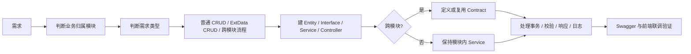

最容易犯的错误是先搜 Controller,看到相似代码就复制。这个项目更推荐先回答四个问题:

1. **这件事属于谁**  
   物料、客户、供应商、容器属于 `BaseDataModule`;入库单、组盘、上架请求属于 `InboundModule`;库存生成、锁定、扣减属于 `InventoryModule`;任务创建和完成属于 `TaskModule`。

2. **这件事是不是跨模块流程**  
   只在本模块内完成,写本模块 Service。  
   需要让别的模块调用本模块能力,由本模块提供 Contract。  
   本模块要调用别的模块能力,只注入对方 Contract,不要直接引用对方 `Services/`。

3. **它是普通表维护还是动态扩展字段维护**  
   普通表维护用 `CrudController<TEntity>`。  
   实体有 `ExtData`,并且前端需要保存/回显动态字段时,用 `ExtDataCrudController<TEntity>`。

4. **有没有多表写入、可配置校验、并发入口**  
   多表写入要有事务。  
   可组合的规则可以抽成 Validator。  
   WCS/PDA/批量动作要考虑重复提交、状态复核和锁。

核心原则可以浓缩成一句话:

```text
Controller 做入口,Service 做业务,Contract 做跨模块门面,Core/Config/Algorithms 做技术底座。
```

### 0.2 这份文档的培训顺序

本文按培训讲解顺序组织,不是按代码目录顺序堆材料。推荐从前往后读:

- **先认地图**:第 1 章认识启动项目、技术底座和业务模块。
- **再认底座**:第 2 到第 5 章讲启动配置、请求链路、职责边界和服务注册。
- **再看 CRUD**:第 6 到第 9 章讲一个完整 CRUD 怎么跑、基类有什么能力、标准开发步骤怎么落地。
- **最后讲协作和扩展**:第 10 到第 11 章讲跨模块 Contract、事务、校验和流程型接口。

如果你正在写一个新接口,优先看第 6、7、8 章和附录 B。  
如果你在排查“为什么 Swagger 看不到接口”“为什么 DI 注入失败”“为什么 ExtData 没保存”“为什么校验器没执行”,先看第 2、3、5、7 章。

阅读建议:

| 场景 | 先看哪里 | 目标 |
| --- | --- | --- |
| 新人第一次培训 | 第 1 章 -> 第 2 章 -> 第 3 章 | 建立后端整体地图和请求链路概念 |
| 新增普通维护页 | 第 6 章 + 第 7 章 + 第 8 章 + 附录 B.1 | 能写出 Entity、Service、Controller,并知道底层怎么执行 |
| 新增动态字段维护页 | 第 7.6 章 + 第 9 章 + 附录 B.2 | 能正确选择并使用 `ExtDataCrudController` |
| 新增跨模块流程 | 第 10 章 + 第 11 章 + 附录 B.3 | 能判断 Contract、事务和流程边界 |
| 新增可配置校验 | 第 11 章 + 附录 B.4 | 能从 0 写一个 `IValidator` 并让 AOP 正确执行 |
| DI 注入失败 | 第 5 章 + 第 2.3 章 + 附录 C | 能定位 `ServiceType`、接口代理和拦截器问题 |

### 0.3 本文不展开的技术底座

以下项目是技术底座,本文只讲业务开发时怎么使用,不作为业务模块逐讲:

| 项目 | 在业务开发中的定位 |
| --- | --- |
| `KH.WMS.Core` | Web、DI、AOP、过滤器、响应、异常、仓储、事务、CRUD 基类 |
| `KH.WMS.Config` | 配置层,提供扩展字段、单据状态机、全局配置、编码规则等能力 |
| `KH.WMS.Algorithms` | 策略/算法底座,如上架策略、拣选策略、货位分配策略 |
| `KH.WMS.Common` | 少量纯公共工具,默认慎用 |
| `KH.WMS.QuartzJob` | 预留定时任务宿主,当前不是主要开发入口 |

这里要特别注意 `KH.WMS.Config`:它有 Controller、Service、Contract,也会被启动项目扫描,但它不是业务模块教程模板。业务模块章节只展示 `BaseDataModule`、`InboundModule`、`InventoryModule`、`OutboundModule`、`SystemModule`、`TaskModule`、`WarehouseModule`、`DashboardModule`。

---

## 第 1 章 KH.WMS 后端整体地图

### 1.1 启动入口

后端启动项目是:

```text
KH.WMS/KH.WMS.Server/
```

核心入口是:

```text
KH.WMS/KH.WMS.Server/Program.cs
```

`Program.cs` 做几类事情:

- 使用 Autofac 作为 DI 容器。
- 通过 `ServiceExtensions` 和 `ServiceRegistrar` 注册带 `[RegisteredService]` / `[SelfRegisteredService]` 的服务。
- 注册策略模块 `StrategyAutofacModule`。
- 注册基础设施 `AddInfrastructure(...)`。
- 注册 MVC Controller、全局异常过滤器、TraceId 结果过滤器。
- 扫描业务模块 Controller。
- 托管前端 SPA 和 Swagger。
- 启动请求中间件管道。

Controller 发现规则很重要:

```csharp
var moduleAssemblies = AssemblyService.GetReferencedAssemblies()
    .Where(a => a.GetName().Name?.Contains(".Modules.") == true
        || a.GetName().Name == "KH.WMS.Config");
```

业务模块 Controller 必须在程序集名包含 `.Modules.` 的类库中。`KH.WMS.Config` 是配置底座例外,不要照它新建业务模块。

如果 Swagger 里看不到新 Controller,优先检查:

- Controller 类是否在 `KH.WMS.Modules.XxxModule` 程序集中。
- Controller 是否有 `[Route("api/xxx")]`。
- Controller 是否继承了 `ControllerBase` 或项目里的 CRUD 基类。
- 模块项目是否被启动项目引用或被程序集扫描到。

### 1.2 技术底座怎么服务业务开发

业务开发不要重复造底座。常用能力如下:

| 底座能力 | 业务开发怎么用 |
| --- | --- |
| `KH.WMS.Core.Controllers.CrudController<TEntity>` | 快速提供标准 CRUD 接口 |
| `KH.WMS.Core.Controllers.ExtDataCrudController<TEntity>` | 在 CRUD 基础上处理动态扩展字段 |
| `KH.WMS.Core.Services.CrudService<TEntity>` | 提供通用增删改查、分页、导入导出、钩子方法 |
| `KH.WMS.Core.DependencyInjection.ServiceLifetimes.RegisteredServiceAttribute` | 自动注册 Service / Contract / Validator |
| `KH.WMS.Core.Database.UnitOfWorks.IUnitOfWork` | 控制多表写入事务,并获取仓储 |
| `KH.WMS.Core.Database.Repositories.IRepository<TEntity, long>` | 统一仓储访问 |
| `KH.WMS.Core.Api.Responses.ApiResponse` | 统一返回给前端的数据结构 |
| `KH.WMS.Core.Models.ServiceResult` | 业务内部流程结果 |
| `KH.WMS.Core.Exceptions.ValidationException` | 字段级或参数级校验失败 |
| `KH.WMS.Contracts` | 跨业务模块调用的契约接口 |
| `KH.WMS.Config` | 扩展字段、状态机、全局配置、编码规则 |
| `KH.WMS.Algorithms` | 策略引擎和策略查询能力 |

开发时的取舍:

- 新增标准维护页,先用 `CrudService<TEntity>` + `CrudController<TEntity>`。
- 需要动态字段,再升级到 `ExtDataCrudController<TEntity>`。
- 需要跨模块调用,定义或复用 `KH.WMS.Contracts` 里的 Contract。
- 需要配置驱动规则,通过配置层抽象或 `ConfigValidation` 校验器使用,不要直接把配置表逻辑散落在业务模块里。
- 需要上架/拣选/货位分配策略,调用算法底座暴露的策略接口,不要在入库、出库 Service 里硬编码策略。

### 1.3 业务模块在哪里

业务模块都在:

```text
KH.WMS/Modules/
```

当前业务模块:

| 模块 | 职责 |
| --- | --- |
| `BaseDataModule` | 物料、客户、供应商、容器等基础资料 |
| `InboundModule` | 入库单、入库单行、容器绑定、收货、上架请求 |
| `InventoryModule` | 库存头、库存明细、库存移动、冻结、快照、预警 |
| `OutboundModule` | 出库单、出库单行、出库分配 |
| `SystemModule` | 用户、角色、权限、字典、参数、附件、日志 |
| `TaskModule` | 上架任务、拣选任务、任务确认、临时任务 |
| `WarehouseModule` | 仓库、库区、巷道、库位、站台、接驳点 |
| `DashboardModule` | 首页看板查询聚合 |

一个业务模块通常包含这些目录:

```text
Controllers/   对前端 API 入口
Interfaces/    模块内 Service 接口
Services/      模块内业务实现
Contracts/     本模块对其他模块暴露的 Contract 实现
DTOs/          本模块接口入参/出参模型
Validation/    可插拔校验器
```

不是每个模块都必须有全部目录。比如看板模块偏查询聚合,通常不会暴露 Contract;某些普通维护模块也可能没有 `Validation/`。

---

### 1.4 业务模块总览

下面这些模块是日常后端开发最常接触的业务边界。先知道每个模块管什么,后面判断需求归属才不会乱。

本章只讲业务模块。`KH.WMS.Config`、`KH.WMS.Core`、`KH.WMS.Algorithms` 是技术底座,不作为业务模块展开。

### 1.5 `BaseDataModule` 基础资料模块

职责:

- 物料。
- 物料分类。
- 物料单位。
- 客户。
- 供应商。
- 容器。
- 容器类型。
- 周转分类。

典型入口:

```text
Modules/BaseDataModule/KH.WMS.Modules.BaseDataModule/
  Controllers/
  Services/
  Interfaces/
  Contracts/
```

典型 Controller:

- `MaterialController`:继承 `ExtDataCrudController<MdMaterial>`,并提供 `form-config`。
- `CustomerController`:继承 `ExtDataCrudController<MdCustomer>`,并提供 `form-config`。
- `SupplierController`:继承 `ExtDataCrudController<MdSupplier>`,并提供 `form-config`。

对外能力:

- `IContainerContract`:注册容器、批量更新容器状态。
- `IMaterialContract`:给其他模块读取或使用物料主数据能力。

开发注意:

- 物料、客户、供应商这类常有动态字段,Controller 可用 `ExtDataCrudController`。
- 容器状态被入库、任务、库存流程使用,对外通过 `IContainerContract` 暴露。
- 物料主数据给其他模块使用时,通过 Contract 暴露,不要让其他模块直接查基础资料 Service。

### 1.6 `InboundModule` 入库模块

职责:

- 入库单。
- 入库单行。
- 收货。
- 容器绑定/组盘。
- 上架请求。
- 入库相关校验。

典型入口:

- `InboundOrderService`:入库单主流程。
- `InboundContainerBindService`:容器绑定、申请上架、WCS 上架请求。
- `Validation/`:组盘前置规则。

对外依赖:

- 创建上架任务走 `ITaskContract`。
- 容器注册和状态变更走 `IContainerContract`。
- 库位相关能力走 `ILocationContract`。
- 状态机和配置规则使用配置底座。
- 上架策略使用算法底座。

开发注意:

- 入库模块是流程编排者,但不拥有任务和库存的内部规则。
- `ContainerBindAsync` 先跑 `[ConfigValidation]`,再进入事务内校验和写入。
- 批次、效期、混料、绑定数量等规则适合放在 `Validation/`。
- 依赖容器锁、库存状态、活跃任务的校验留在 Service 内。

不要做:

- 不要在入库 Service 里直接插任务表。
- 不要在入库 Service 里直接改库存表。

### 1.7 `InventoryModule` 库存模块

职责:

- 库存头。
- 库存明细。
- 库存生成。
- 库存扣减。
- 库存锁定/解锁。
- 库存移动。
- 冻结记录。
- 快照和预警。

对外能力:

- `IInventoryContract.ContainerHasInventoryAsync`
- `IInventoryContract.GetContainerQtyAsync`
- `IInventoryContract.IsLocationAvailableAsync`
- `IInventoryContract.GenerateInventoryFromPutawayAsync`
- `IInventoryContract.DeductInventoryAsync`
- `IInventoryContract.LockInventoryAsync`
- `IInventoryContract.UnlockInventoryAsync`
- `IInventoryContract.MoveInventoryLocationAsync`

开发注意:

- 库存是数据中枢,其他模块不要直接改库存表。
- 对外能力通过 `IInventoryContract` 暴露。
- 扣减、锁定、移库必须写库存流水。
- 库存数量变化必须考虑并发和事务。
- 库存明细、移动、冻结记录如果有动态字段需求,可以使用 `ExtDataCrudController`。

### 1.8 `OutboundModule` 出库模块

职责:

- 出库单。
- 出库单行。
- 出库分配。
- 创建拣选任务。

对外依赖:

- 出库分配需要库存能力时,走 `IInventoryContract`。
- 创建拣选任务时,走 `ITaskContract.CreatePickingTaskAsync`。

开发注意:

- 不要绕过库存模块直接扣库存。
- 出库分配、锁定、取消分配要有清晰的状态回滚。
- 出库单状态流转不要硬编码散落在多个方法里。
- 需要创建任务时,只向任务模块提交创建任务所需的 Contract 请求模型。

### 1.9 `TaskModule` 任务中心模块

职责:

- 上架任务。
- 拣选任务。
- 任务行。
- 任务确认。
- 临时任务。
- WCS/PDA 完成回调处理。

对外能力:

- `ITaskContract.CreatePutawayTaskAsync`
- `ITaskContract.CreatePickingTaskAsync`

典型流程:

- 入库模块申请上架时,调用 `ITaskContract.CreatePutawayTaskAsync`。
- 出库模块需要拣选时,调用 `ITaskContract.CreatePickingTaskAsync`。
- WCS/PDA 完成任务后,任务模块根据任务类型调用库存、库位、容器、入库等 Contract 做后置处理。

开发注意:

- `TaskContract` 对外提供创建任务能力。
- `TaskHeaderService.CompleteTaskByWcsAsync` 是任务完成主流程。
- 完成回调要做状态复核和并发保护。
- 上架完成后调用库存、库位、容器、入库相关 Contract 做后置处理。

不要做:

- 不要让入库/出库模块直接创建任务表。
- 不要新增一个完成入口却绕开并发保护。

### 1.10 `WarehouseModule` 仓储基础模块

职责:

- 仓库。
- 库区。
- 巷道。
- 库位。
- 逻辑区。
- 站台。
- 输送线。
- 接驳点。

对外能力:

- `ILocationContract`:库位状态变更等库位能力。

开发注意:

- 仓储模块提供空间结构和库位状态。
- 任务、策略、库存都可能依赖仓储数据。
- 库位状态变更对外通过 `ILocationContract` 暴露。
- 巷道、库区、逻辑区概念不要混用。
- 策略查询服务可以读取仓储结构,但不要把策略规则写进仓储基础维护里。

### 1.11 `SystemModule` 系统管理模块

职责:

- 用户。
- 角色。
- 权限。
- 字典。
- 参数。
- 附件。
- 操作日志。
- 数据字典查询。

开发注意:

- 系统模块偏基础能力,业务模块不要随意反向侵入。
- 权限和用户能力不要写业务模块规则。
- 字典只放通用枚举/常量,业务专属配置走配置底座。
- 登录密码流程涉及 RSA 解密和 Hash 校验,不要明文比较。
- 日志、附件、权限这类能力要保持通用,不要夹带入库/库存等业务流程。

### 1.12 `DashboardModule` 首页看板模块

职责:

- 首页统计卡片。
- 近 N 日出入库趋势。
- 最近完成单据。
- 库存概览。
- 任务类型和库位状态概览。

开发注意:

- 看板是轻量聚合查询模块,不暴露 Contract。
- 通过 `IUnitOfWork` 查询多个业务实体并组装 DTO。
- 不要把看板查询塞进入库、出库、库存模块。
- 不要为了看板直接返回实体全集。
- 查询要控制数据量,避免首页接口变成全库扫描。

---

## 第 2 章 后端基础配置与启动机制

本章把后端基础配置画成一张“启动地图”。业务开发通常不需要天天改这些配置,但一旦遇到接口不显示、请求进不来、返回格式异常、事务不生效、跨域或权限问题,都要能快速定位入口。

先看总图:

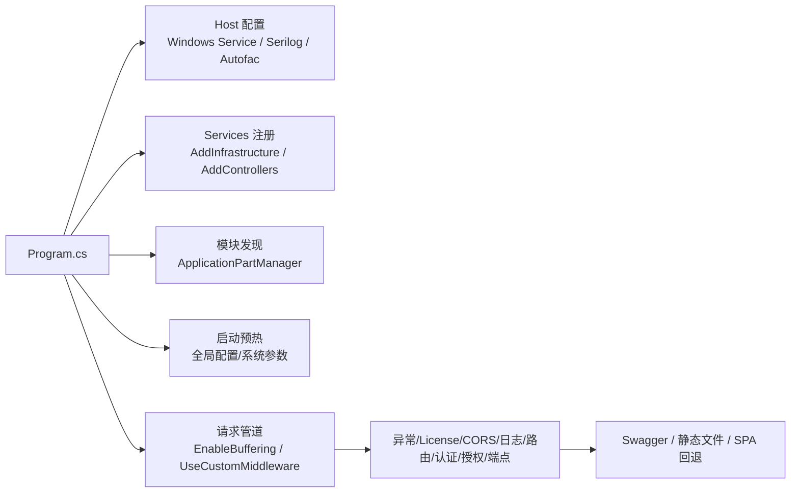

基础配置先按这张表建立全局印象:

| 配置块 | 主要入口 | 影响什么 | 常见排查场景 | 平时是否常改 |
| --- | --- | --- | --- | --- |
| Host 配置 | `Program.cs` | Windows Service、日志、Autofac 容器 | 服务启动方式不对、日志不输出、DI 容器异常 | 很少 |
| 基础设施注册 | `AddInfrastructure` | 数据库、缓存、认证、日志、Swagger、CORS、限流、HTTP Client | 数据库连不上、认证不生效、跨域问题 | 偶尔 |
| MVC / Controller | `AddControllers`、`ApplicationPartManager` | Controller 扫描、JSON 序列化、全局过滤器 | Swagger 看不到接口、返回格式不对 | 偶尔 |
| 模块自动注册 | `ServiceExtensions`、`ServiceRegistrar` | Service / Contract / Validator 自动注入 | 构造函数注入失败、AOP 不执行 | 经常排查 |
| 请求管道 | `UseCustomMiddleware` | 异常、License、CORS、日志、路由、认证授权、端点映射 | 请求进不来、401/403、跨域、异常格式 | 偶尔 |
| 数据访问 | `SqlSugarDbContext`、`RepositoryBase`、`UnitOfWork` | 连接、仓储、事务、配置库路由 | 数据没写入、事务没回滚、配置表读错库 | 经常排查 |
| 统一响应和日志 | `ApiResponse`、`GlobalExceptionFilter`、`TraceIdResultFilter` | 响应结构、TraceId、异常日志 | 前端报错无法定位、响应没有 TraceId | 经常排查 |
| 前端和静态资源 | `UseStaticFiles`、`MapFallbackToFile` | 上传文件访问、SPA 刷新回退 | 附件 404、刷新前端路由 404 | 偶尔 |

排查时不要从所有配置一起看,按现象走:

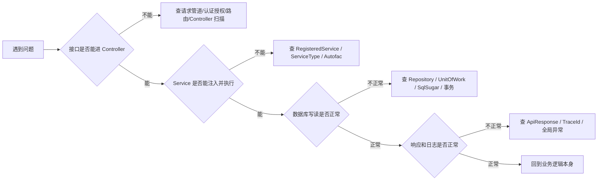

### 2.1 启动入口和基础设施注册

后端启动入口:

```text
KH.WMS/KH.WMS.Server/Program.cs
```

主要做这些事:

- 注册 Windows Service 名称。
- 使用 Autofac 作为 DI 容器。
- 注册 `ServiceExtensions` 和策略模块。
- 注册 `HttpContextAccessor`。
- 调用 `AddInfrastructure(builder.Configuration, builder.Environment)`。
- 注册 MVC Controller、JSON 配置、全局异常过滤器、TraceId 结果过滤器。
- 注册模块 Controller 程序集。
- 预热全局配置和系统参数。
- 启用请求体缓冲。
- 调用 `UseCustomMiddleware(app.Environment)`。
- 启用 Swagger、静态文件和 SPA 回退。

基础设施统一入口:

```text
KH.WMS/KH.WMS.Core/Setup/ServiceCollectionSetup.cs
```

中间件统一入口:

```text
KH.WMS/KH.WMS.Core/Setup/MiddlewareSetup.cs
```

启动阶段可以按三段记:

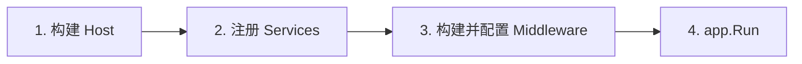

其中:

- Host 阶段决定日志、Autofac、Windows Service。
- Services 阶段决定 DI、数据库、认证、缓存、Swagger、Controller。
- Middleware 阶段决定请求进来后先过谁、后过谁。

`Program.cs` 里几段关键代码要知道它们分别管什么:

| 代码位置/调用 | 作用 | 出问题时表现 |
| --- | --- | --- |
| `UseWindowsService` | 允许后端作为 Windows 服务运行 | 本机调试一般不受影响,部署成服务时要看服务名和权限 |
| `AddSerilog` | 接入 Serilog 日志 | 日志文件不生成、日志级别不对时查这里和日志配置 |
| `UseServiceProviderFactory(new AutofacServiceProviderFactory())` | 使用 Autofac 替代默认 DI 容器 | Autofac 注册异常、AOP 代理异常时查这里 |
| `RegisterModule(new ServiceExtensions())` | 扫描注册带特性的服务 | `[RegisteredService]` 不生效、Service 注入失败时查这里 |
| `AddInfrastructure(...)` | 注册数据库、认证、缓存、Swagger、CORS 等基础设施 | 基础设施能力缺失时查这里 |
| `AddControllers(...)` | 注册 MVC、全局异常过滤器、TraceId 过滤器、JSON 配置 | Controller 行为、响应格式、JSON 字段名异常时查这里 |
| `ConfigureApplicationPartManager(...)` | 手动加入模块 Controller 程序集 | Swagger 看不到模块接口时查这里 |
| `EnableBuffering()` | 允许请求体重复读取 | ExtData 保存失败、异常日志没有请求体时查这里 |
| `UseCustomMiddleware(...)` | 装配主要请求管道 | 请求进不来、认证授权、跨域、异常处理时查这里 |
| `MapFallbackToFile("index.html")` | SPA 前端路由回退 | 刷新前端页面 404 时查这里 |

### 2.2 Controller 扫描配置

MVC 默认不一定能发现所有模块 Controller,所以 `Program.cs` 手动添加模块程序集:

```text
程序集名称包含 .Modules.
或程序集名称等于 KH.WMS.Config
```

这就是为什么业务模块项目命名要遵守:

```text
KH.WMS.Modules.{Name}Module
```

`KH.WMS.Config` 是技术底座特例,不要照着它新建业务模块。

扫描关系图:

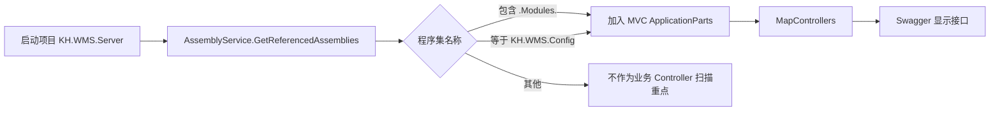

如果你新建了模块项目,但 Swagger 没看到 Controller,先检查项目名和引用,再检查路由。

### 2.3 DI 与 Autofac 配置

Autofac 注册入口:

```text
KH.WMS/KH.WMS.Core/DependencyInjection/ServiceRegistrar.cs
```

常用标记:

- `[RegisteredService]`:注册为接口服务。
- `[SelfRegisteredService]`:注册为自身类型。
- `ServiceType`:显式指定注册到哪个接口。
- `Lifetime`:指定生命周期,默认 Scoped。
- `WithoutInterceptor`:是否跳过 AOP 拦截器。

业务 Service 推荐模板:

```csharp
[RegisteredService(ServiceType = typeof(IXxxService))]
public class XxxService(...) : CrudService<XxxEntity>(...), IXxxService
{
}
```

Contract 实现推荐模板:

```csharp
[RegisteredService(ServiceType = typeof(IXxxContract))]
public class XxxContract(...) : IXxxContract
{
}
```

Validator 推荐模板:

```csharp
[RegisteredService(WithoutInterceptor = true, ServiceType = typeof(IValidator))]
public class XxxValidator : IValidator
{
}
```

注册过程可以这样理解:

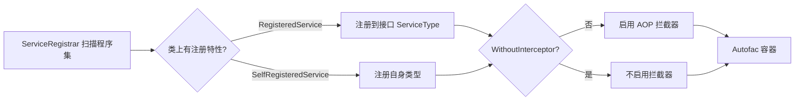

排查 DI 失败时,看异常里缺的是哪个接口,再反查有没有实现类注册到这个接口。

### 2.4 AOP 拦截器配置

当前注册的拦截器:

```text
LoggingInterceptor
CachingInterceptor
ConfigValidationInterceptor
ExceptionInterceptor
PerformanceInterceptor
```

拦截器只会作用在被 Autofac 代理的服务调用上。业务代码要按接口注入:

```csharp
public class XxxController(IXxxService service) : ControllerBase
{
}
```

不要在业务代码里手动 new Service。不要给普通业务 Service 设置 `WithoutInterceptor = true`。

拦截器大致职责:

| 拦截器 | 作用 | 业务开发注意 |
| --- | --- | --- |
| `LoggingInterceptor` | 记录方法调用、参数、返回值 | 敏感信息不要随意放入参数 |
| `CachingInterceptor` | 根据缓存特性处理缓存 | 写操作和频繁变化查询慎用缓存 |
| `ConfigValidationInterceptor` | 执行 `[ConfigValidation]` 对应校验器 | 目标 Service 不能关闭拦截器 |
| `ExceptionInterceptor` | 统一捕获服务层异常 | 不要吞异常后返回成功 |
| `PerformanceInterceptor` | 记录方法耗时 | 慢接口可结合日志和 MiniProfiler 查 |

如果校验器不执行,优先看:

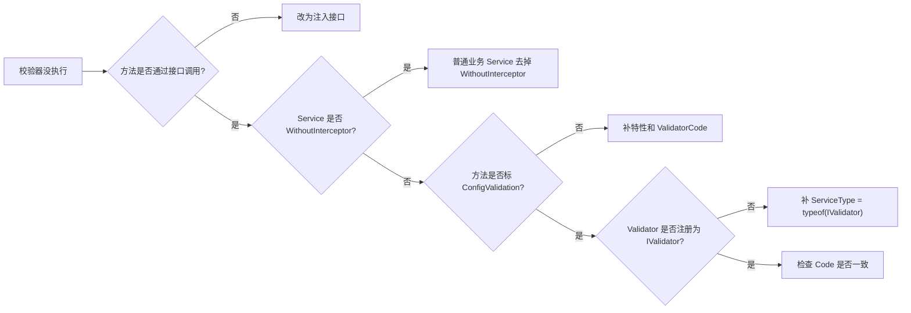

### 2.5 数据库与 SqlSugar 配置

数据库相关入口:

```text
KH.WMS/KH.WMS.Core/Database/SqlSugar/
KH.WMS/KH.WMS.Core/Database/Repositories/
KH.WMS/KH.WMS.Core/Database/UnitOfWorks/
```

核心类型:

- `SqlSugarDbContext`:数据库上下文,支持事务嵌套。
- `RepositoryBase<T,TKey>`:统一仓储。
- `IRepository<T,TKey>`:仓储接口。
- `UnitOfWork`:工作单元。
- `IUnitOfWork`:事务接口。
- `[ConfigDb]`:配置库路由标记。

配置表实体如果标了 `[ConfigDb]`,仓储会路由到配置库连接。业务表不要随便加这个标记。

数据访问分层图:

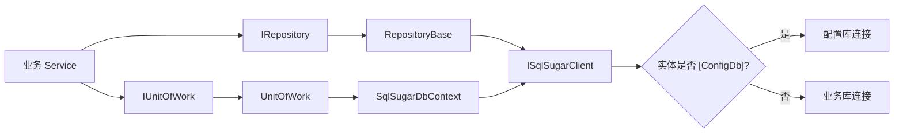

事务嵌套可以这样理解:

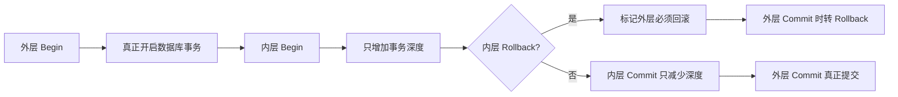

### 2.6 统一响应、异常和错误码

统一响应类型:

```text
KH.WMS/KH.WMS.Core/Api/Responses/ApiResponse.cs
```

异常处理入口:

```text
KH.WMS/KH.WMS.Core/Filters/Exception/GlobalExceptionFilter.cs
KH.WMS/KH.WMS.Core/Middlewares/ExceptionHandlingMiddleware.cs
```

常见异常:

- `BusinessException`:业务异常。
- `ValidationException`:数据校验失败。
- `NotFoundException`:资源不存在。
- `UnauthorizedAccessException`:未授权。

开发建议:

- Controller 不要到处写 `try/catch`。
- 可预期业务失败可以返回 `ApiResponse.Fail` 或 `ServiceResult.Fail`。
- 真正异常让全局异常处理兜底。
- 不要吞异常后返回成功。

异常响应链路:

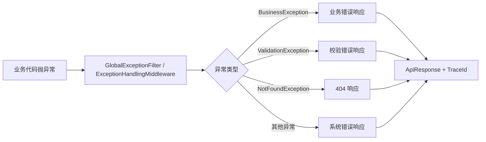

Controller 里少写 `try/catch` 的原因是:你自己 catch 了异常又没有正确转换,全局异常处理就拿不到完整上下文,日志和 TraceId 也可能断。

### 2.7 TraceId 与日志配置

TraceId 注入:

```text
KH.WMS/KH.WMS.Core/Filters/Result/TraceIdResultFilter.cs
```

日志底座:

```text
KH.WMS/KH.WMS.Core/Logging/
```

异常日志会记录:

- HTTP 方法。
- 请求路径。
- TraceId。
- 用户信息。
- QueryString。
- 脱敏后的 JSON 请求体。
- 异常类型和堆栈。
- `ErrorLogScope` 中的调用链。

排查线上问题时,先拿前端响应里的 `traceId`,再查对应时间段日志。

日志排查路径:


如果没有 TraceId,先确认接口是否返回 `ApiResponse`。文件下载、静态资源这类响应不一定有 TraceId,但业务 JSON 接口应尽量统一。

### 2.8 认证授权配置

认证授权在基础设施和中间件里启用:

```text
AddAuthenticationSetup
ApiAuthorizeFilter
UseAuthentication
UseAuthorization
```

排查接口 401 / 403 时按顺序看:

1. 前端是否带 Token。
2. Token 是否过期。
3. 路由是否需要权限。
4. 用户是否分配角色和权限。
5. `ApiAuthorizeFilter` 是否拦截。

登录、密码、Token 相关能力在系统模块和 Core 认证组件里,不要在业务模块里自行实现一套认证。

认证授权在请求管道里的位置:

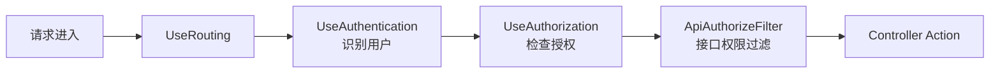

401 通常是“你是谁”没有识别,403 通常是“你有没有权限”不通过。

### 2.9 缓存配置

缓存入口:

```text
AddMemoryCache
AddCacheSetup
CachingInterceptor
[Cache]
```

`CrudController` 中很多写操作和分页查询都显式标记:

```csharp
[Cache(Enable = false)]
```

原因是维护页数据变化频繁,默认不应缓存新增、更新、删除、分页查询结果。只有稳定、读多写少的接口才考虑开启缓存。

缓存选择:

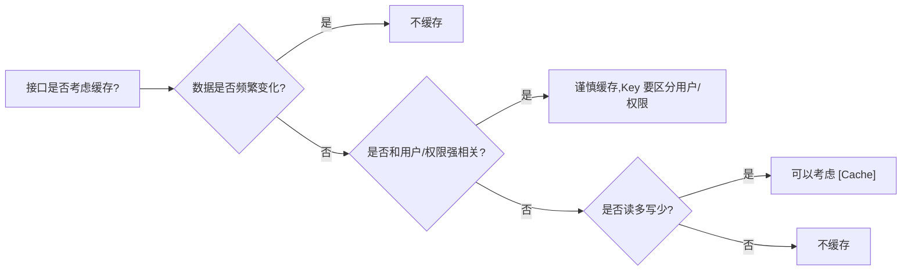

### 2.10 事务配置

项目里有三类事务入口:

| 场景 | 事务方式 |
| --- | --- |
| 标准 CRUD | `CrudService<TEntity>` 内部手动 `Begin/Commit/Rollback` |
| 标记事务的 Controller/Action | `[Transaction]` 创建 `TransactionActionFilter` |
| 跨模块流程 | 调用方 Service 控制事务,Contract 不随意另开独立事务 |

`TransactionActionFilter` 会先检查 `IUnitOfWork.HasActiveTransaction`。如果已经在事务中,它不会重复开启请求级事务。

事务边界选择:

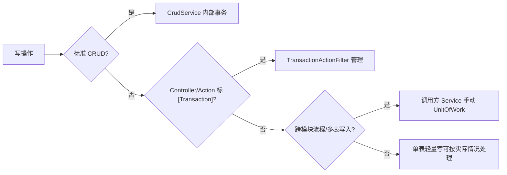

跨模块流程里,谁编排流程,谁控制事务。被调用的 Contract 不要随意另开独立事务,否则上游失败时无法整体回滚。

### 2.11 JSON 序列化配置

`Program.cs` 里统一配置 JSON:

- 属性名使用 camelCase。
- 空值忽略。
- 中文使用宽松编码,避免被转义成不易读的 Unicode。
- 自定义时间转换器。
- 枚举转换器。
- bool / nullable bool 转 int。

这会影响前后端字段命名。后端属性 `WarehouseCode`,前端通常看到 `warehouseCode`。

常见影响:

| 后端类型/属性 | 前端看到 | 注意 |
| --- | --- | --- |
| `WarehouseCode` | `warehouseCode` | 前端过滤字段按 camelCase 传 |
| `DateTime` | 统一时间格式 | 不要每个接口自行格式化 |
| `bool` | 0/1 | 前端控件要按数字兼容 |
| `enum` | 转换器处理 | 不要混用多种枚举格式 |
| null 属性 | 默认忽略 | 前端不要依赖所有字段都出现 |

### 2.12 请求体缓冲配置

`Program.cs` 里启用了:

```csharp
context.Request.EnableBuffering();
```

它主要服务两个场景:

- `ExtDataCrudController` 在模型绑定后重读原始 JSON,提取 `extDataRaw`。
- `GlobalExceptionFilter` 在异常时读取请求体并做脱敏日志。

如果以后移除或调整这段中间件,要同步验证 ExtData 保存和异常日志。

请求体为什么要缓冲:

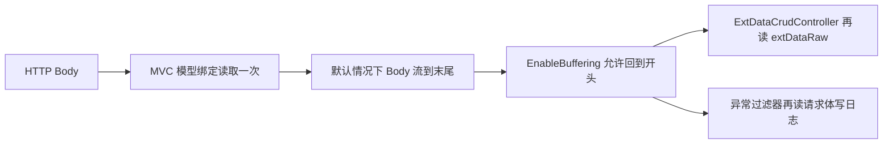

### 2.13 静态文件、上传目录和 SPA 托管

上传目录配置:

```text
FileStorage:UploadPath
```

后端会把上传目录挂为静态文件路径。前端 SPA 构建产物放到后端 `wwwroot` 后,也由后端托管。刷新前端路由时通过:

```csharp
app.MapFallbackToFile("index.html");
```

回退到 SPA 首页。

请求分流可以这样看:

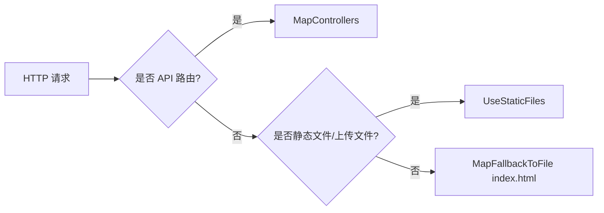

### 2.14 License、CORS、限流和 MiniProfiler

这些属于了解和排查入口:

- License 验证在 `UseLicenseValidation`。
- CORS 在 `AddCustomCors` / `UseCustomCors`。
- 限流有配置入口,当前中间件调用处预留。
- MiniProfiler 在 `AddMonitoringSetup` / `UseMiniProfilerCustom`。

业务开发一般不改这些。遇到启动失败、跨域失败、接口被拦截、性能排查时再进入对应底座。

排查入口:

| 现象 | 先看 |
| --- | --- |
| 启动后接口全部被拦截 | License 验证 |
| 前后端分离调接口跨域 | CORS 配置 |
| 某些接口突然大量 429 或被拒 | 限流配置和中间件是否启用 |
| 接口慢但不知道慢在哪里 | MiniProfiler、性能拦截器、SQL 日志 |

---

## 第 3 章 请求链路、事务、异常、TraceId、AOP

### 3.1 一个请求的大致旅程

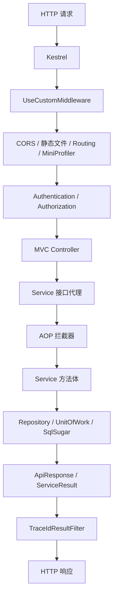

你写业务代码时最常接触的是:

- Controller
- Service
- Contract
- Repository
- UnitOfWork
- ApiResponse / ServiceResult

其他中间件和过滤器通常不需要改。

定位问题时按链路反推:

- Swagger 看不到:Controller 扫描、路由、程序集引用。
- 进入 Controller 失败:认证、授权、模型绑定。
- DI 注入失败:`[RegisteredService]`、`ServiceType`、接口注册。
- 业务结果不对:Service、Contract、事务、数据状态。
- 响应里没有 TraceId:是否返回统一 `ApiResponse`。

### 3.2 事务怎么处理

`CrudService<TEntity>` 的标准增删改已经有事务:

- `CreateAsync`
- `UpdateAsync`
- `DeleteAsync`
- `BatchDeleteAsync`

自定义业务方法如果写多张表,自己控制:

```csharp
await unitOfWork.BeginTransactionAsync();
try
{
    // 多表写入
    await unitOfWork.CommitAsync();
}
catch
{
    await unitOfWork.RollbackAsync();
    throw;
}
```

跨模块流程里,调用方控制事务。被调 Contract 不要随意开独立事务破坏整体一致性。

如果方法里返回 `ServiceResult.Fail(...)`,也要注意事务状态。当前一些流程在 catch 中统一 Rollback;如果在 try 内提前 return 失败,要确认是否需要先 Rollback。最稳妥的写法是失败前明确结束事务,或把可失败校验前置到开启事务之前。

并发入口建议:

- 同一容器、同一任务、同一库存记录,要考虑重复提交。
- 需要串行化时使用数据库锁或状态复核。
- 状态更新前先检查当前状态是否仍然允许。
- WCS/PDA 回调要尽量幂等。

### 3.3 响应怎么返回

Controller 面向前端优先返回:

```csharp
Task<ApiResponse>
```

业务内部流程可以用:

```csharp
ServiceResult
ServiceResult<T>
```

常见规则:

- 查询成功: `ApiResponse.Ok(data)`
- 业务失败: `ApiResponse.Fail(...)` 或 `ServiceResult.Fail(...)`
- 找不到数据: `ApiResponse.NotFound(...)`
- 参数校验失败: `ApiResponse.ValidationError(...)` 或抛 `ValidationException`
- 未授权: `ApiResponse.Unauthorized(...)`

不要返回匿名对象给 Controller 直接裸出。`TraceIdResultFilter` 主要服务统一响应,统一响应也能让前端错误处理更稳定。

Contract 更适合返回 `ServiceResult` 或明确业务类型,不要直接返回 `ApiResponse`,因为 Contract 不是 HTTP API。

### 3.4 异常怎么处理

全局异常由 `GlobalExceptionFilter` 和异常处理中间件兜底。

建议:

- 可预期业务失败,优先返回 `ServiceResult.Fail(...)`。
- 字段或参数校验失败,使用 `ValidationException`。
- 找不到关键资源,使用统一 NotFound 响应。
- 不要在 Controller 到处写 `try/catch`。
- 不要吞异常后返回成功。

Service 内的 `try/catch` 主要用于事务回滚和包装业务错误。写 catch 时不要只记录日志后继续成功返回,这会让前端和数据库状态不一致。

### 3.5 TraceId 有什么用

TraceId 用来把前端报错和后端日志关联起来。

排错时让前端提供:

- 接口路径。
- 请求时间。
- `ApiResponse.TraceId`。
- 可选 `X-Correlation-ID`。

后端再按 TraceId / CorrelationId / 时间窗口查日志。

开发接口时不要绕开统一响应,否则排错信息会断掉。尤其是流程型接口失败时,错误消息要让业务人员能看懂,TraceId 要让开发能定位。

### 3.6 AOP 拦截器做什么

服务自动注册默认启用接口拦截器。当前注册的拦截器包括:

- `LoggingInterceptor`
- `CachingInterceptor`
- `ConfigValidationInterceptor`
- `ExceptionInterceptor`
- `PerformanceInterceptor`

这意味着业务 Service 不需要每个方法都手写日志、性能计时、异常包装。

带 `[ConfigValidation]` 的业务方法执行顺序可以理解为:

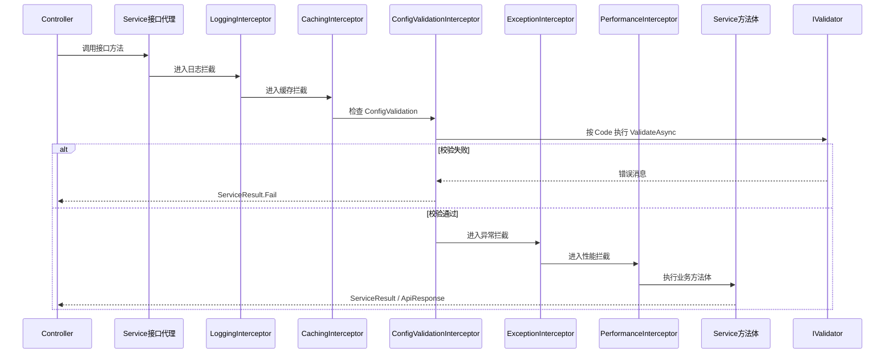

这张图解释了为什么目标 Service 不能设置 `WithoutInterceptor = true`:一旦跳过接口拦截器,`ConfigValidationInterceptor` 就没有机会执行。

注意:

- AOP 依赖接口代理,所以 Service 要按接口注入。
- `WithoutInterceptor = true` 会跳过这些拦截器。
- 基础设施服务为了避免循环依赖,经常会关闭拦截器。
- `[ConfigValidation]` 依赖 `ConfigValidationInterceptor`,目标 Service 不能关闭拦截器。

如果校验器没执行,按这个顺序查:

1. 目标方法是否在通过接口注入的 Service 上调用。
2. Service 是否没有设置 `WithoutInterceptor = true`。
3. 方法是否标了 `[ConfigValidation(ValidatorCodes.XXX)]`。
4. 校验器是否实现 `IValidator` 并注册。
5. `ValidatorCodes`、`IValidator.Code`、`ConfigValidation` 三处编码是否一致。
6. 方法返回类型是否适合 `ConfigValidationInterceptor`。

---

## 第 4 章 Controller / Service / Entity / DTO / Contract 的职责边界

### 4.1 Entity

Entity 对应数据库表,放在 `KH.WMS.Entities`。

Entity 负责:

- 表字段。
- 简单状态字段。
- 轻量实体内规则。
- 导航属性。

Entity 不负责:

- 调仓储。
- 调其他模块。
- 写复杂流程。
- 返回前端响应。

适合放在 Entity 的方法:

```text
根据自身字段判断状态是否合法
根据已传入的数量计算是否超量
把实体状态从 A 标记为 B
```

不适合放在 Entity 的方法:

```text
查询数据库判断是否有库存
调用 Contract 更新容器状态
创建任务或写流水
```

### 4.2 DTO

DTO 放在业务模块 `DTOs/`。

DTO 负责:

- 特定接口入参。
- 特定接口出参。
- 不适合直接暴露实体的页面模型。
- 批量动作或流程动作的请求模型。

如果接口只是标准 CRUD,可以先不新增 DTO,直接复用实体。  
如果涉及前端表单、复杂动作、WCS 回调、批量操作,建议定义 DTO。

示例:

```csharp
public class ContainerBindDto
{
    public string ContainerCode { get; set; } = string.Empty;
    public long InboundOrderLineId { get; set; }
    public decimal Qty { get; set; }
    public string? BatchNo { get; set; }
    public DateTime? ProductionDate { get; set; }
    public DateTime? ExpiryDate { get; set; }
}
```

DTO 不等于 Contract 模型。只有跨模块接口用到的请求/结果模型,才放到 `KH.WMS.Contracts`。

### 4.3 Service

Service 是业务逻辑主落点。

Service 负责:

- 业务校验。
- 事务边界。
- 调仓储。
- 调本模块内部服务。
- 调其他模块 Contract。
- 组装返回结果。

Service 不负责:

- 定义 HTTP 路由。
- 解析前端请求体原始 JSON。
- 直接控制 Swagger。
- 被其他模块直接引用。

写 Service 的经验:

- 标准 CRUD 保持薄。
- 流程型 Service 可以厚,但要把辅助方法拆清楚。
- 多表写入要围绕一个事务组织。
- 对外依赖看接口类型:本模块 `Interfaces/`,跨模块 `KH.WMS.Contracts`。

### 4.4 Controller

Controller 是 API 入口。

Controller 负责:

- 路由。
- 参数绑定。
- 调用 Service。
- 返回统一响应。

Controller 不负责:

- 写复杂业务。
- 直接写数据库。
- 开复杂事务。
- 调其他模块 Service。

Controller 里可以有很薄的“入口型”辅助接口,例如 `MaterialController.GetFormConfig` 读取配置层扩展字段定义并返回前端需要的列配置。但如果这个方法开始涉及多表业务状态、任务创建、库存扣减,就应该下沉到 Service 或 Contract。

### 4.5 Contract

Contract 是跨模块调用的稳定门面。

Contract 负责:

- 暴露一个模块愿意给其他模块使用的最小能力。
- 隔离模块内部 Service 的变化。
- 让调用方只依赖接口,不依赖实现模块细节。
- 承载跨模块请求/结果模型。

Contract 不负责:

- 给前端调用。前端调 Controller。
- 替代模块内 Service。
- 暴露整套 CRUD。
- 包装所有方法。只包装跨模块确实需要的能力。

一个简单判断:

```text
Controller -> Service 是前端到后端入口。
Service -> Contract 是模块到模块协作。
Service -> Service 只允许在本模块内部。
```

---

## 第 5 章 服务自动注册: `[RegisteredService]`

### 5.1 自动注册从哪里来

项目启动时使用 Autofac:

```csharp
builder.Host
    .UseServiceProviderFactory(new AutofacServiceProviderFactory())
    .ConfigureContainer<ContainerBuilder>(builder =>
    {
        builder.RegisterModule(new ServiceExtensions());
        builder.RegisterModule(new StrategyAutofacModule());
    });
```

`ServiceExtensions` 会调用 `AssemblyService.GetReferencedAssemblies()`,然后交给 `ServiceRegistrar` 扫描所有带以下特性的类:

- `[RegisteredService]`
- `[SelfRegisteredService]`

因此,业务 Service 不是手写到 `Program.cs` 的,而是靠特性自动注册。

`ServiceRegistrar` 还会注册这些拦截器:

- `LoggingInterceptor`
- `CachingInterceptor`
- `ConfigValidationInterceptor`
- `ExceptionInterceptor`
- `PerformanceInterceptor`

默认注册的业务 Service 会启用接口拦截器。

自动注册的大致流程如下:

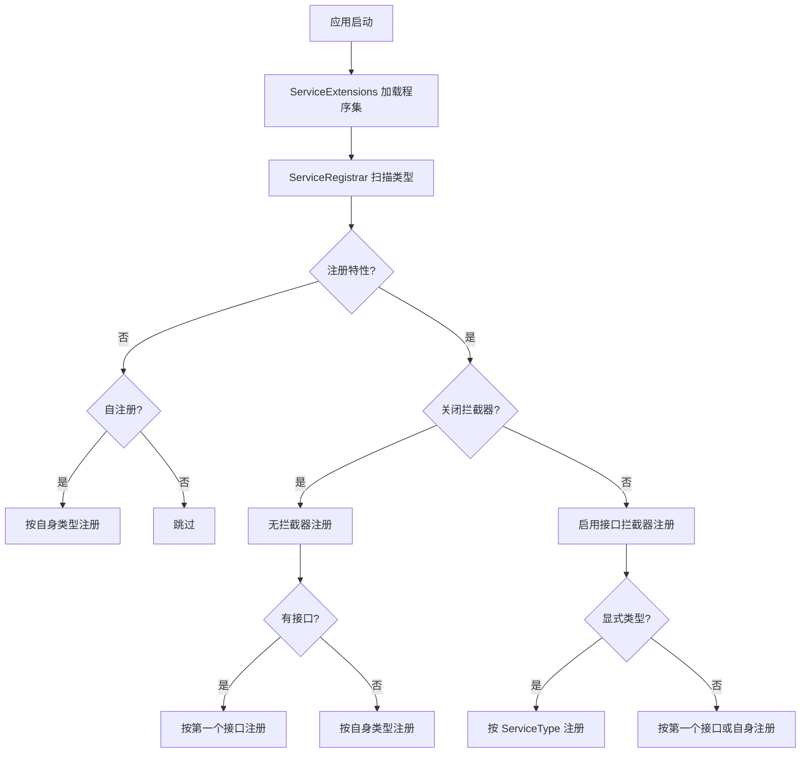

这张图里的关键点是:普通业务 Service 走带拦截器分支时,显式 `ServiceType` 最稳;关闭拦截器的规则对象要特别注意接口数量。

### 5.2 `[RegisteredService]` 默认行为

`RegisteredServiceAttribute` 默认值:

```csharp
public ServiceLifetime Lifetime { get; set; } = ServiceLifetime.Scoped;
public bool WithoutInterceptor { get; set; } = false;
public Type? ServiceType { get; set; } = null;
```

也就是说:

- 默认生命周期是 `Scoped`。
- 默认启用接口拦截器。
- 如果不写 `ServiceType`,注册器会尝试取实现类的第一个接口。

注册器核心逻辑:

```csharp
var interfaces = item.Type.GetInterfaces();
Type serviceType = interfaces.FirstOrDefault() ?? item.Type;

if (interfaces.Length > 0 && registeredAttr.ServiceType != null)
{
    serviceType = registeredAttr.ServiceType;
}
```

这就是为什么建议业务 Service 显式写 `ServiceType`。

### 5.3 写 `ServiceType` 会怎么样

推荐写法:

```csharp
[RegisteredService(ServiceType = typeof(IMaterialService))]
public class MaterialService(
    IRepository<MdMaterial, long> repository,
    IUnitOfWork unitOfWork,
    IDetailSaveService detailSaveService)
    : CrudService<MdMaterial>(repository, unitOfWork, detailSaveService),
      IMaterialService
{
}
```

这样容器明确注册:

```text
IMaterialService -> MaterialService
```

Controller 可以稳定注入:

```csharp
public class MaterialController(IMaterialService materialService)
    : ExtDataCrudController<MdMaterial>(materialService)
{
}
```

好处:

- 不怕接口顺序变化。
- 不怕继承接口干扰。
- 不怕多接口实现时注册错。
- 代码阅读者一眼知道这个类对外注册成什么。

普通业务 Service、Contract 实现、多个接口场景都应该显式写 `ServiceType`。

### 5.4 不写 `ServiceType` 会怎么样

如果只写:

```csharp
[RegisteredService]
public class MaterialService : CrudService<MdMaterial>, IMaterialService
{
}
```

注册器会取 `MaterialService.GetInterfaces().FirstOrDefault()`。

问题在于 `MaterialService` 继承了 `CrudService<MdMaterial>`,又实现了 `IMaterialService`;运行时拿到的第一个接口不一定是你希望的接口。它可能是:

```text
ICrudService<MdMaterial>
```

也可能是:

```text
IMaterialService
```

取决于反射返回顺序和类型结构。结果就是:

```csharp
public class MaterialController(IMaterialService materialService)
```

可能注入失败,因为容器没有按 `IMaterialService` 注册。

所以业务 Service 的规则是:

```text
只要有明确接口,就写 ServiceType。
```

### 5.5 多接口、Contract、Validator 必须更明确

Contract 示例:

```csharp
[RegisteredService(Lifetime = ServiceLifetime.Scoped, ServiceType = typeof(ITaskContract))]
public class TaskContract(...) : ITaskContract
{
}
```

Contract 是跨模块能力,注册错会导致别的模块注入失败,必须写 `ServiceType`。

Validator 示例:

```csharp
[RegisteredService(WithoutInterceptor = true, ServiceType = typeof(IValidator))]
public class BatchNoRequiredValidator : IValidator
{
}
```

多个 Validator 都按 `IValidator` 被校验拦截器统一解析,并通过 `Code` 匹配具体规则。

当前注册器的无拦截器分支会按实现类第一个接口注册,没有重新读取 `registeredAttr.ServiceType`。因此 Validator 最稳妥的写法是:

- 显式写 `ServiceType = typeof(IValidator)`,表达意图。
- 类只实现 `IValidator`,避免第一个接口不是 `IValidator`。
- 保持 `WithoutInterceptor = true`,避免 Validator 自己再触发 AOP 链。

### 5.6 `WithoutInterceptor = true` 什么时候用

默认注册会启用这些拦截器:

- `LoggingInterceptor`
- `CachingInterceptor`
- `ConfigValidationInterceptor`
- `ExceptionInterceptor`
- `PerformanceInterceptor`

普通业务 Service 通常保持默认。

适合 `WithoutInterceptor = true` 的场景:

- 日志服务本身。
- 数据库上下文、UnitOfWork 等底层基础设施。
- 映射服务等被拦截器依赖的服务。
- Validator 等细粒度规则对象。
- JWT、License 等避免循环依赖或不需要 AOP 的底层能力。

不要为了“少打日志”随便给业务 Service 加 `WithoutInterceptor = true`。一旦关闭拦截器,日志、性能、异常包装、配置校验等能力都可能绕开。

### 5.7 推荐模板

普通业务 Service:

```csharp
[RegisteredService(ServiceType = typeof(IXxxService))]
public class XxxService(
    IRepository<XxxEntity, long> repository,
    IUnitOfWork unitOfWork,
    IDetailSaveService detailSaveService)
    : CrudService<XxxEntity>(repository, unitOfWork, detailSaveService),
      IXxxService
{
}
```

跨模块 Contract:

```csharp
[RegisteredService(Lifetime = ServiceLifetime.Scoped, ServiceType = typeof(IXxxContract))]
public class XxxContract(...) : IXxxContract
{
}
```

基础设施或规则对象:

```csharp
[RegisteredService(WithoutInterceptor = true, ServiceType = typeof(IValidator))]
public class XxxValidator : IValidator
{
}
```

自注册类,即按自身类型注册而不是按接口注册时,使用 `[SelfRegisteredService]`。普通业务 Service 不建议这么写。

---

## 第 6 章 一个完整 CRUD 的底层执行链路

本章按“新增一个仓库维护 CRUD”为例,把代码文件、接口请求、底层执行、排查路径串起来。目标不是背框架,而是让你知道:

- 为什么只写一个很薄的 Controller,就能拥有分页、新增、更新、删除、导入导出。
- 为什么 Service 必须写接口和 `[RegisteredService(ServiceType = ...)]`。
- 一个请求进入后端后,到底经过 Controller、AOP、Service、Repository、UnitOfWork、SqlSugar 中的哪几层。
- 出问题时从哪一层开始查,不要靠猜。

本章贯穿例子是仓库维护:

| 层 | 文件 | 作用 |
| --- | --- | --- |
| Entity | `KH.WMS/Entities/KH.WMS.Entities/Warehouse/MdWarehouse.cs` | 描述 `md_warehouse` 表字段、索引、状态字段 |
| Interface | `KH.WMS/Modules/WarehouseModule/KH.WMS.Modules.WarehouseModule/Interfaces/IWarehouseService.cs` | 暴露仓库模块内 Service 能力 |
| Service | `KH.WMS/Modules/WarehouseModule/KH.WMS.Modules.WarehouseModule/Services/WarehouseService.cs` | 继承 CRUD 基类,补仓库特有逻辑 |
| Controller | `KH.WMS/Modules/WarehouseModule/KH.WMS.Modules.WarehouseModule/Controllers/WarehouseController.cs` | 暴露 HTTP 路由给前端 |

### 6.1 先看一眼完整链路

一个标准 CRUD 不是一个类完成的,而是多层协作。推荐先按横向链路理解:

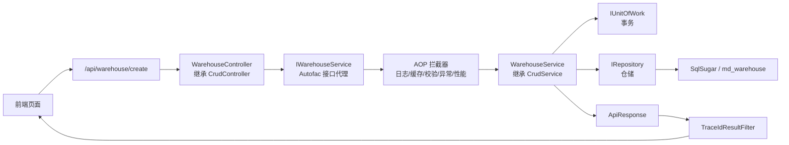

这张图里,业务开发主要写四个点:

```text
Entity + Interface + Service + Controller
```

其他部分是技术底座:

```text
MVC 路由 + Autofac DI + AOP + UnitOfWork + Repository + SqlSugar + ApiResponse + TraceId
```

你写 CRUD 时不要把底座能力重复造一遍。比如不要在 Controller 里手写事务,不要绕过 Repository 自己拿连接,不要在每个接口里手写统一响应。

### 6.2 从“写文件”到“接口能访问”的顺序

新增普通 CRUD 推荐按下面这个横向顺序走:

```mermaid
flowchart LR
    A["1. 建 Entity<br/>表字段/索引/状态"] --> B["2. 建 Interface<br/>继承 ICrudService"]
    B --> C["3. 建 Service<br/>继承 CrudService"]
    C --> D["4. 标 RegisteredService<br/>指定 ServiceType"]
    D --> E["5. 建 Controller<br/>继承 CrudController"]
    E --> F["6. 配 Route<br/>api/xxx"]
    F --> G["7. 启动 Swagger 验证"]
    G --> H["8. 前端联调 pagelist/create/update/delete"]
```

以仓库为例,每一步分别对应:

```csharp
// 1. Entity
[SugarTable("md_warehouse")]
public class MdWarehouse : BaseEntity<long>, IEnableDisableEntity
{
    public string WarehouseCode { get; set; }
    public string WarehouseName { get; set; }
    public byte Status { get; set; } = 1;
}

// 2. Interface
public interface IWarehouseService : ICrudService<MdWarehouse>
{
    Task<ApiResponse> GetZoneAndAisleAsync(long warehouseId);
}

// 3 + 4. Service
[RegisteredService(ServiceType = typeof(IWarehouseService))]
public class WarehouseService(...) 
    : CrudService<MdWarehouse>(repository, unitOfWork, detailSaveService), IWarehouseService
{
}

// 5 + 6. Controller
[Route("api/warehouse"), Cache(Duration = 60 * 30)]
public class WarehouseController(IWarehouseService warehouseService)
    : CrudController<MdWarehouse>(warehouseService)
{
}
```

这几段代码看起来薄,是因为基类和底座已经把标准能力接走了。薄不是偷懒,薄是职责清楚。

### 6.3 Controller 能被 Swagger 看到的条件

Controller 不是只要写出来就一定能被访问。启动项目在 `Program.cs` 里手动把模块程序集加入 MVC:

```csharp
var moduleAssemblies = AssemblyService.GetReferencedAssemblies()
    .Where(a => a.GetName().Name?.Contains(".Modules.") == true
        || a.GetName().Name == "KH.WMS.Config");

foreach (var assembly in moduleAssemblies)
{
    apm.ApplicationParts.Add(new AssemblyPart(assembly));
}
```

所以 Controller 能被 Swagger 看到,至少要满足:

| 条件 | 正确做法 | 常见错误 |
| --- | --- | --- |
| 程序集命名 | `KH.WMS.Modules.WarehouseModule` | 新建项目名不包含 `.Modules.` |
| 项目引用 | 启动项目能发现模块程序集 | 类库没被引用或没参与构建 |
| Controller 基类 | 继承 `CrudController<TEntity>` 或 `ControllerBase` | 普通 class,没有 MVC Controller 特征 |
| 路由 | `[Route("api/warehouse")]` | 缺路由或路由重复 |
| DI | 构造函数依赖能解析 | Service 没注册,Swagger 加载时报错 |

排查顺序建议:

```mermaid
flowchart LR
    A["Swagger 看不到接口"] --> B{"模块程序集是否被扫描"}
    B -- "否" --> B1["检查项目名是否包含 .Modules. 以及启动项目引用"]
    B -- "是" --> C{"Controller 路由是否正确"}
    C -- "否" --> C1["补 Route api/xxx"]
    C -- "是" --> D{"构造函数依赖是否可注入"}
    D -- "否" --> D1["检查 RegisteredService 和 ServiceType"]
    D -- "是" --> E{"Controller 基类是否正确"}
    E -- "否" --> E1["继承 CrudController 或 ControllerBase"]
    E -- "是" --> F["再看 Swagger 分组和启动日志"]
```

### 6.4 Service 注入不是“靠名字匹配”

`WarehouseController` 构造函数写的是:

```csharp
public class WarehouseController(IWarehouseService warehouseService)
    : CrudController<MdWarehouse>(warehouseService)
{
}
```

容器要能把 `IWarehouseService` 找到对应实现。项目靠 `[RegisteredService]` 自动注册:

```csharp
[RegisteredService(ServiceType = typeof(IWarehouseService))]
public class WarehouseService(...) : CrudService<MdWarehouse>(...), IWarehouseService
{
}
```

这里的关键是 `ServiceType`。它明确告诉容器:

```mermaid
flowchart LR
    A["Controller 需要 IWarehouseService"] --> B["Autofac 容器"]
    B --> C["ServiceRegistrar 扫描 RegisteredService"]
    C --> D["ServiceType = IWarehouseService"]
    D --> E["实例化 WarehouseService"]
    E --> A
```

不要把它理解成“类名差不多就能注入”。容器看的是类型注册关系,不是中文意思,也不是文件名。

常见错误:

- Service 实现了多个接口,但没有写 `ServiceType`。
- Service 标了 `[RegisteredService]`,但指定成了错误接口。
- Interface 没继承 `ICrudService<TEntity>`,导致 Controller 基类需要的方法对不上。
- Controller 注入的是 `IWarehouseService`,Service 却注册成了 `ICrudService<MdWarehouse>` 或其他接口。

### 6.5 AOP 为什么要求“通过接口调用”

Service 注册时会启用接口代理:

```text
EnableInterfaceInterceptors().InterceptedBy(interceptors)
```

可以理解为 Controller 拿到的不是一个裸 `WarehouseService`,而是一个带拦截能力的代理对象:

```mermaid
flowchart LR
    Controller["Controller"] --> Interface["IWarehouseService 代理"]
    Interface --> Log["LoggingInterceptor"]
    Log --> Cache["CachingInterceptor"]
    Cache --> Config["ConfigValidationInterceptor"]
    Config --> Ex["ExceptionInterceptor"]
    Ex --> Perf["PerformanceInterceptor"]
    Perf --> Real["WarehouseService 方法体"]
```

所以普通业务代码要遵守:

- Controller 注入接口,不要注入实现类。
- 其他 Service 调用也优先注入对方接口或 Contract。
- 不要手动 `new WarehouseService(...)`。
- 普通业务 Service 不要设置 `WithoutInterceptor = true`。

如果绕开接口代理,配置校验、日志、性能统计等拦截器就没有机会执行。

### 6.6 新增请求在 `CrudService` 里怎么落库

当前端调用:

```text
POST /api/warehouse/create
```

Controller 基类会进入:

```csharp
CrudController<MdWarehouse>.Create([FromBody] MdWarehouse entity)
```

然后调用:

```csharp
IWarehouseService.CreateAsync(entity)
```

因为 `IWarehouseService` 继承了 `ICrudService<MdWarehouse>`,而 `WarehouseService` 继承了 `CrudService<MdWarehouse>`,所以实际执行的是 `CrudService<TEntity>.CreateAsync`。

新增内部步骤建议这样记:

```mermaid
flowchart LR
    A["CreateAsync(entity)"] --> B["BeginTransaction"]
    B --> C["BeforeCreateAsync<br/>业务前置校验"]
    C --> D["FillAuditFields<br/>CreatedTime"]
    D --> E["Repository.AddAsync<br/>Insertable"]
    E --> F{"有 DetailSaveService?"}
    F -- "有" --> G["保存 OneToMany / OneToOne"]
    F -- "无" --> H["跳过明细"]
    G --> I["AfterCreateAsync<br/>新增后处理"]
    H --> I
    I --> J["Commit"]
    J --> K["ApiResponse.Ok(id)"]
```

这说明几个重点:

- 新增前校验不要写在 Controller,优先重写 `BeforeCreateAsync`。
- 创建时间由基类填,不要每个业务 Service 重复写。
- 主从表如果接入 `IDetailSaveService`,会跟主表在一个事务内保存。
- 任意步骤抛异常都会进入 catch,执行 Rollback 后继续抛给全局异常处理。

### 6.7 更新、删除和批量删除的底层差异

更新不是直接拿前端对象覆盖数据库。基类会先查旧数据:

```mermaid
flowchart LR
    A["UpdateAsync(entity)"] --> B["BeginTransaction"]
    B --> C["GetEntityOrThrowAsync(entity.Id)"]
    C --> D["BeforeUpdateAsync"]
    D --> E["CopyProperties<br/>跳过 Id 和导航属性"]
    E --> F["CopyDetailProperties<br/>复制级联明细"]
    F --> G["FillAuditFields<br/>LastModifiedTime"]
    G --> H["Repository.UpdateAsync(existing)"]
    H --> I["保存明细"]
    I --> J["AfterUpdateAsync"]
    J --> K["Commit"]
```

删除会先判断实体有没有需要级联处理的导航属性:

```mermaid
flowchart LR
    A["DeleteAsync(id)"] --> B{"实体有级联导航属性?"}
    B -- "有" --> C["GetByIdWithNavAsync"]
    B -- "无" --> D["GetByIdAsync"]
    C --> E["BeginTransaction"]
    D --> E
    E --> F["BeforeDeleteAsync"]
    F --> G{"级联删除?"}
    G -- "是" --> H["DeleteWithNavAsync"]
    G -- "否" --> I["DeleteAsync(id)"]
    H --> J["AfterDeleteAsync"]
    I --> J
    J --> K["Commit"]
```

批量删除没有逐个加载实体,所以如果你要检查“某些状态不能删”“被引用不能删”,要重写:

```csharp
BeforeBatchDeleteAsync(List<long> ids)
```

### 6.8 查询请求怎么处理过滤、排序和分页

分页接口:

```text
POST /api/warehouse/pagelist
```

底层不是简单查全表,而是按下面的顺序拼查询:

```mermaid
flowchart LR
    A["AdvancedQueryRequestDto"] --> B["BuildQueryExpression<br/>业务默认条件"]
    A --> C["ExpressionHelper.BuildFilter<br/>前端过滤条件"]
    B --> D["合并表达式 And"]
    C --> D
    D --> E["Repository.AsQueryable"]
    E --> F["ApplyAdditionalQuery<br/>联表/额外查询"]
    F --> G["ApplySorting<br/>多字段排序"]
    G --> H["ToPageListAsync"]
    H --> I["AfterQueryAsync<br/>结果后处理"]
    I --> J["ApiResponse.Ok({items,total})"]
```

如果分页结果不对,按这个顺序查:

1. 前端传的字段名是否是后端实体属性名的 camelCase。
2. `BuildQueryExpression` 是否加了业务过滤条件。
3. `ExpressionHelper.BuildFilter` 是否能识别该字段。
4. `ApplyAdditionalQuery` 是否追加了错误条件。
5. 排序字段是否存在,不存在会被过滤。
6. `AfterQueryAsync` 是否把结果改掉了。

### 6.9 响应和 TraceId 怎么回到前端

业务接口返回 `ApiResponse` 后,响应会经过结果过滤器:

```mermaid
flowchart LR
    A["Service 返回 ApiResponse"] --> B["MVC ObjectResult"]
    B --> C["TraceIdResultFilter"]
    C --> D["response.TraceId ??= HttpContext.TraceIdentifier"]
    D --> E["JSON 响应给前端"]
```

这就是为什么文档一直要求 Controller 返回统一响应。统一响应能让前端稳定处理:

```json
{
  "code": 200,
  "message": "新增成功",
  "timestamp": 1780000000000,
  "data": 123,
  "traceId": "0H..."
}
```

前端或测试人员报错时,不要只说“保存失败”。至少给:

- 接口路径。
- 请求时间。
- 响应 `message`。
- 响应 `traceId`。
- 业务主键、编码或请求体。

### 6.10 一张表总结:问题从哪一层查

| 现象 | 先查哪一层 | 典型原因 |
| --- | --- | --- |
| Swagger 没接口 | Controller 扫描 | 项目名不含 `.Modules.`、模块未引用、路由缺失 |
| 启动时报无法解析服务 | DI 注册 | `ServiceType` 错、接口没继承、实现类没标注册特性 |
| 接口进不去 | 中间件/认证授权 | Token 缺失、权限不足、License 拦截、路由不匹配 |
| 方法进了但校验器没跑 | AOP | 没通过接口调用、Service 设置了 `WithoutInterceptor = true` |
| 新增没有写库 | Service/Repository | 事务回滚、字段必填失败、数据库约束失败 |
| 更新丢字段 | `CopyProperties` | 前端没传字段、空值不会覆盖旧值、导航属性被跳过 |
| 删除不干净 | 导航属性/级联 | 实体导航没配置、业务不允许级联、BeforeDelete 未处理引用 |
| 分页没数据 | 查询表达式 | 默认条件、前端过滤字段、排序字段、联表条件 |
| 状态接口失败 | 启停约定 | 没实现 `IEnableDisableEntity`、状态字段名不符合约定 |
| 响应没 TraceId | 响应格式 | 返回了裸对象或文件流,没有走 `ApiResponse` |

---

## 第 7 章 CRUD 基类能力详解

本章把 CRUD 基类拆开讲。第 6 章讲请求怎么跑,本章讲“基类到底替你做了什么,你应该在哪个钩子里扩展”。

先看职责分工:

```mermaid
flowchart LR
    A["CrudController<TEntity><br/>HTTP 入口"] --> B["ICrudService<TEntity><br/>服务接口契约"]
    B --> C["CrudService<TEntity><br/>通用业务实现"]
    C --> D["IRepository<TEntity,long><br/>统一数据访问"]
    C --> E["IUnitOfWork<br/>事务边界"]
    C --> F["IDetailSaveService<br/>主从表保存"]
```

不要把基类当黑盒。你不需要重复写基类已有能力,但要知道什么时候重写哪个钩子。

### 7.1 `CrudController<TEntity>` 方法清单

`CrudController<TEntity>` 的源码位置:

```text
KH.WMS/KH.WMS.Core/Controllers/CrudController.cs
```

它是标准维护页的 HTTP 入口基类。子 Controller 只要继承它,并在类上配置 `[Route("api/xxx")]`,就会自动拥有标准 CRUD、启停、导入导出、模板下载等接口。

先看它的结构:

```mermaid
flowchart LR
    A["子 Controller<br/>Route api/xxx"] --> B["CrudController<TEntity>"]
    B --> C["ICrudService<TEntity>"]
    B --> D["标准查询接口"]
    B --> E["标准写入接口"]
    B --> F["状态/导入/导出接口"]
```

构造函数只有一个核心依赖:

```csharp
protected CrudController(ICrudService<TEntity> service)
{
    _service = service;
}
```

这也是为什么模块内 Service 接口要继承 `ICrudService<TEntity>`。例如 `IWarehouseService : ICrudService<MdWarehouse>`,否则 `WarehouseController` 继承 `CrudController<MdWarehouse>` 时,传入的 `warehouseService` 就无法满足基类需要。

#### 10.1.1 标准端点方法

| 方法 | HTTP 路由 | 调用的 Service 方法 | 缓存 | 说明 |
| --- | --- | --- | --- | --- |
| `GetById(long id)` | `GET {id}` | `_service.GetByIdAsync(id)` | `[Cache(Enable = false)]` | 根据主键获取详情,通常用于编辑回显和查看详情。 |
| `GetPagedList(AdvancedQueryRequestDto query)` | `POST pagelist` | `_service.GetPagedListAsync(query)` | `[Cache(Enable = false)]` | 分页查询,支持前端高级过滤和排序。 |
| `GetAll()` | `GET all` | `_service.GetListAsync()` | 未显式禁用 | 获取全部列表,适合下拉选择等小数据量场景。 |
| `Create(TEntity entity)` | `POST create` | `_service.CreateAsync(entity)` | `[Cache(Enable = false)]` | 新增实体,请求体直接绑定为实体。 |
| `Update(TEntity entity)` | `POST update` | `_service.UpdateAsync(entity)` | `[Cache(Enable = false)]` | 更新实体,请求体直接绑定为实体。 |
| `Delete(long id)` | `DELETE delete/{id}` | `_service.DeleteAsync(id)` | `[Cache(Enable = false)]` | 根据 ID 删除单条数据。 |
| `BatchDelete(List<long> ids)` | `DELETE batch` | `_service.BatchDeleteAsync(ids)` | `[Cache(Enable = false)]` | 批量删除,请求体传 ID 集合。 |
| `SetStatus(long id, SetStatusDto dto)` | `PUT status/{id}` | `_service.SetStatusAsync(id, dto.Status)` | `[Cache(Enable = false)]` | 启用/禁用,仅实体实现 `IEnableDisableEntity` 时可用。 |
| `Export(ExportRequestDto request)` | `POST export` | `_service.ExportAsync(request, request?.Columns, request?.ExportAll ?? true)` | `[Cache(Enable = false)]` | 导出数据,复用查询条件和列配置。 |
| `Import(IFormFile file)` | `POST import` | `_service.ImportAsync(stream, file.FileName)` | `[Cache(Enable = false)]` | 导入 Excel 文件;空文件直接返回失败响应。 |
| `DownloadTemplate()` | `GET template` | `_service.DownloadTemplateAsync()` | `[Cache(Enable = false)]` | 下载导入模板。 |

如果子 Controller 写:

```csharp
[Route("api/warehouse")]
public class WarehouseController(IWarehouseService warehouseService)
    : CrudController<MdWarehouse>(warehouseService)
{
}
```

最终会得到:

```text
GET    /api/warehouse/{id}
POST   /api/warehouse/pagelist
GET    /api/warehouse/all
POST   /api/warehouse/create
POST   /api/warehouse/update
DELETE /api/warehouse/delete/{id}
DELETE /api/warehouse/batch
PUT    /api/warehouse/status/{id}
POST   /api/warehouse/export
POST   /api/warehouse/import
GET    /api/warehouse/template
```

#### 10.1.2 方法参数说明

| 参数类型 | 出现在哪些方法 | 说明 |
| --- | --- | --- |
| `long id` | `GetById`、`Delete`、`SetStatus` | 从路由里取主键 ID。 |
| `AdvancedQueryRequestDto query` | `GetPagedList` | 前端分页、过滤、排序请求模型。 |
| `TEntity entity` | `Create`、`Update` | 从请求体绑定实体。普通 CRUD 直接传实体,复杂入参另写业务 Action。 |
| `List<long> ids` | `BatchDelete` | 从请求体绑定批量删除 ID 集合。 |
| `SetStatusDto dto` | `SetStatus` | 请求体里只需要状态值。 |
| `ExportRequestDto request` | `Export` | 继承/兼容高级查询请求,并携带导出列、是否导出全部等配置。 |
| `IFormFile file` | `Import` | 上传的导入文件。基类会判断空文件并打开文件流。 |

#### 10.1.3 缓存标记说明

大多数标准端点都有:

```csharp
[Cache(Enable = false)]
```

原因是维护页数据变化频繁,新增、更新、删除、分页、导入导出都不适合默认缓存。`GetAll()` 当前没有显式禁用缓存,但是否缓存仍取决于缓存拦截器和实际特性配置。业务开发不要为了“看起来快”随便给维护接口加缓存。

#### 10.1.4 子 Controller 应该补什么

子 Controller 只补当前业务特有的 HTTP 能力。比如 `WarehouseController` 额外提供仓库下库区和巷道:

```csharp
[HttpGet("zone-aisle/{warehouseId}")]
public async Task<ApiResponse> GetZoneAndAisleAsync(long warehouseId)
{
    return await _warehouseService.GetZoneAndAisleAsync(warehouseId);
}
```

判断是否要重写或新增 Controller 方法:

| 场景 | 推荐做法 |
| --- | --- |
| 只是新增前校验唯一性 | 不重写 Controller,重写 `BeforeCreateAsync`。 |
| 只是删除前检查引用 | 不重写 Controller,重写 `BeforeDeleteAsync`。 |
| 只是分页默认过滤 | 不重写 Controller,重写 `BuildQueryExpression`。 |
| 要额外提供一个下拉/树/辅助查询接口 | 在子 Controller 增加新 Action。 |
| `create/update` 的 HTTP 入参结构完全不是实体 | 单独写 Action 和 DTO,再调用 Service。 |
| 需要文件上传、批处理、异步任务 | 单独写 Action,不要硬塞进标准 CRUD。 |
| 需要改变所有维护页的共同规则 | 谨慎评估是否改 `CrudController<TEntity>` 基类。 |

普通维护页不要在子 Controller 里重复写 `create`、`update`、`delete`。重复写会绕开基类里的缓存标记、统一接口风格和后续底座增强。

### 7.2 `CrudService<TEntity>` 方法清单

`CrudService<TEntity>` 的源码位置:

```text
KH.WMS/KH.WMS.Core/Services/CrudService.cs
```

它不是只做“增删改查”四个方法,而是把查询、写入、状态、导入导出、主从表、排序、审计字段、钩子方法都放在一个通用服务基类里。业务 Service 继承它以后,默认就拥有这些能力。

方法可以按下面几类看:

```mermaid
flowchart LR
    A["CrudService<TEntity>"] --> B["公开 CRUD 接口"]
    A --> C["查询扩展钩子"]
    A --> D["写入扩展钩子"]
    A --> E["导入导出钩子"]
    A --> F["内部辅助方法"]
```

#### 10.2.1 公开 CRUD 接口

这些方法会被 `CrudController<TEntity>` 直接调用,一般不建议业务 Service 重写整个方法。需要定制时优先重写后面的钩子。

| 方法 | 作用 | 说明 |
| --- | --- | --- |
| `GetByIdAsync(long id)` | 根据主键查询详情 | 使用 `_repository.GetByIdWithNavAsync(id)`,会加载一层导航属性;找不到返回 `ApiResponse.NotFound`。 |
| `GetPagedListAsync(AdvancedQueryRequestDto query)` | 分页查询 | 组合默认查询条件、前端过滤、额外查询、排序和分页,返回 `{ items, total }`。 |
| `GetListAsync()` | 获取列表 | 使用 `BuildListExpression()` 构建默认条件,适合下拉、轻量列表。 |
| `CreateAsync(TEntity entity)` | 新增 | 内部开启事务,执行新增前钩子、填充创建时间、插入主表、保存明细、执行新增后钩子。 |
| `UpdateAsync(TEntity entity)` | 更新 | 内部开启事务,先查旧数据,再复制普通属性和明细属性,填充修改时间,更新主表和明细。 |
| `DeleteAsync(long id)` | 删除 | 判断是否有级联导航属性,必要时加载导航数据,事务内执行删除前/后钩子和仓储删除。 |
| `BatchDeleteAsync(List<long> ids)` | 批量删除 | 校验 ids 后事务内批量删除,适合普通维护页批量删除。复杂引用检查放到 `BeforeBatchDeleteAsync`。 |
| `SetStatusAsync(long id, byte status)` | 启用/禁用 | 仅支持实现 `IEnableDisableEntity` 的实体,状态字段按 `[StatusFieldName]`、`Status`、`IsActive` 的顺序解析。 |
| `ExportAsync(AdvancedQueryRequestDto query, List<ExportColumnDto>? columns = null, bool exportAll = true)` | 导出 | 复用查询条件、过滤、排序;有列配置时生成中文表头、展开 ExtData、翻译字典值。 |
| `ImportAsync(Stream fileStream, string fileName)` | 导入 | 使用 Excel 工具导入实体列表,逐行调用 `CreateAsync`,返回成功数、失败数和行级错误。 |
| `DownloadTemplateAsync()` | 下载导入模板 | 根据实体生成导入模板,返回 base64 内容。 |

使用建议:

- 普通业务不要直接重写 `CreateAsync`、`UpdateAsync`、`DeleteAsync`,否则容易漏事务、审计字段、主从表保存。
- 需要新增前校验,重写 `BeforeCreateAsync`。
- 需要删除前检查引用,重写 `BeforeDeleteAsync` 或 `BeforeBatchDeleteAsync`。
- 需要调整查询条件,重写查询钩子。

#### 10.2.2 查询扩展钩子

| 方法 | 作用 | 什么时候重写 |
| --- | --- | --- |
| `BuildQueryExpression(AdvancedQueryRequestDto query)` | 构建分页查询默认条件 | 例如默认只查启用数据、只查当前租户、只查当前仓库。 |
| `BuildQueryExpression<T>(AdvancedQueryRequestDto query)` | 泛型版本查询条件 | 子类内部处理非主实体查询时可用。 |
| `BuildListExpression()` | 构建 `GetListAsync()` 默认条件 | 下拉列表要默认过滤停用数据时使用。 |
| `BuildListExpression<T>()` | 泛型版本列表条件 | 子类内部查询其他实体列表时可用。 |
| `ApplyAdditionalQuery(ISugarQueryable<TEntity> queryable, AdvancedQueryRequestDto query)` | 对分页 Queryable 做额外处理 | 需要追加联表、Includes、复杂过滤或数据权限条件时使用。 |
| `ApplyAdditionalQuery<T>(ISugarQueryable<T> queryable, AdvancedQueryRequestDto query)` | 泛型版本额外查询处理 | 子类处理其他查询对象时使用。 |
| `AfterQueryAsync(AdvancedQueryRequestDto query, List<TEntity> items)` | 分页结果后处理 | 需要补显示字段、翻译字段、批量填充关联名称时使用。 |
| `ApplySorting(ISugarQueryable<TEntity> queryable, List<SortCondition>? sortConditions)` | 应用前端排序 | 通常不重写;会过滤无效字段,没有有效排序时走默认排序。 |
| `ApplySorting<T>(ISugarQueryable<T> queryable, List<SortCondition>? sortConditions)` | 泛型版本排序 | 子类内部泛型查询时使用。 |
| `ApplyDefaultSorting(ISugarQueryable<TEntity> queryable)` | 默认排序 | 不传排序或排序字段无效时使用,默认按 `CreatedTime` 升序。 |
| `ApplyDefaultSorting<T>(ISugarQueryable<T> queryable)` | 泛型版本默认排序 | 子类内部泛型查询时使用。 |

示例:只查启用仓库。

```csharp
protected override Expression<Func<MdWarehouse, bool>> BuildQueryExpression(AdvancedQueryRequestDto query)
{
    return x => x.Status == 1;
}
```

示例:查询后补充展示字段。

```csharp
protected override Task<List<MdWarehouse>> AfterQueryAsync(
    AdvancedQueryRequestDto query,
    List<MdWarehouse> items)
{
    // 这里适合批量补名称、翻译字段,不要做 N+1 查询
    return Task.FromResult(items);
}
```

#### 10.2.3 写入和状态钩子

这些钩子都在基类事务内执行。钩子里抛异常时,基类会回滚事务并把异常交给全局异常处理。

| 方法 | 作用 | 典型场景 |
| --- | --- | --- |
| `BeforeCreateAsync(TEntity entity)` | 新增前处理 | 编码唯一性校验、默认值补充、业务前置检查。 |
| `AfterCreateAsync(TEntity entity)` | 新增后处理 | 新增成功后同步冗余字段、写额外业务记录。 |
| `BeforeUpdateAsync(TEntity entity)` | 更新前处理 | 排除自身的唯一性校验、状态是否允许编辑。 |
| `AfterUpdateAsync(TEntity entity)` | 更新后处理 | 更新成功后同步关联信息。 |
| `BeforeDeleteAsync(long id, TEntity entity)` | 删除前处理 | 检查是否被引用、是否允许删除当前状态。 |
| `AfterDeleteAsync(long id, TEntity entity)` | 删除后处理 | 删除后清理附属关系或缓存。 |
| `BeforeBatchDeleteAsync(List<long> ids)` | 批量删除前处理 | 批量检查是否存在不可删除数据。 |
| `AfterBatchDeleteAsync(List<long> ids)` | 批量删除后处理 | 批量删除后清理附属数据。 |
| `BeforeSetStatusAsync(TEntity entity, byte status)` | 启停前处理 | 禁用前检查是否仍有子数据、库存、任务等引用。 |
| `AfterSetStatusAsync(TEntity entity, byte status)` | 启停后处理 | 状态变更后同步缓存或关联状态。 |

示例:新增和更新时校验仓库编码唯一。

```csharp
protected override async Task BeforeCreateAsync(MdWarehouse entity)
{
    var exists = await _repository.ExistsAsync(x => x.WarehouseCode == entity.WarehouseCode);
    if (exists)
        throw new BusinessException("仓库编码已存在");
}

protected override async Task BeforeUpdateAsync(MdWarehouse entity)
{
    var exists = await _repository.ExistsAsync(x =>
        x.WarehouseCode == entity.WarehouseCode && x.Id != entity.Id);
    if (exists)
        throw new BusinessException("仓库编码已存在");
}
```

#### 10.2.4 导入导出钩子

| 方法 | 作用 | 什么时候重写 |
| --- | --- | --- |
| `BeforeExportAsync(AdvancedQueryRequestDto query)` | 导出前处理 | 导出前校验权限、限制导出范围。 |
| `TransformExportData(List<TEntity> exportData)` | 无列配置时转换导出实体 | 简单调整导出数据。 |
| `TransformToExportRows(List<TEntity> items, List<ExportColumnDto> columns)` | 有列配置时转换导出行 | 默认支持中文表头、ExtData 展开、字典翻译;复杂导出时可重写。 |
| `BeforeImportAsync(List<TEntity> rows)` | 导入前处理 | 批量校验、补默认值、过滤空行。 |
| `AfterImportAsync(int successCount, List<string> errors)` | 导入后处理 | 记录导入日志、统计结果。 |
| `GetExportFileName()` | 获取导出文件/工作表名称 | 默认返回实体名;需要中文名称时重写。 |

#### 10.2.5 内部辅助方法

这些方法主要服务基类内部流程。一般不需要重写,但读懂它们有助于理解 CRUD 行为。

| 方法 | 作用 | 注意 |
| --- | --- | --- |
| `ResolveStatusProperty()` | 解析启停状态字段 | 优先 `[StatusFieldName]`,其次 `Status`,最后 `IsActive`。 |
| `GetCascadeNavigateProperties()` | 获取需要级联处理的导航属性 | 排除 ManyToOne,只处理 OneToMany / OneToOne。 |
| `HasCascadeNavigationProperties()` | 判断实体是否定义级联导航 | 删除时决定是否加载导航并走 `DeleteWithNavAsync`。 |
| `HasNavigationWithData(TEntity entity)` | 判断实体是否带有实际导航数据 | 当前作为内部判断能力保留。 |
| `FillAuditFields(TEntity entity, bool isCreate)` | 填充审计时间 | 新增填 `CreatedTime`,更新填 `LastModifiedTime`。 |
| `GetEntityOrThrowAsync(long id)` | 根据 ID 获取实体,不存在则抛异常 | 更新时使用,避免更新不存在的数据。 |
| `CopyProperties(TEntity source, TEntity target)` | 复制普通属性 | 跳过主键和级联导航属性;空值不会覆盖旧值。 |
| `CopyDetailProperties(TEntity source, TEntity target)` | 复制级联导航属性 | 用于主从表更新。 |

开发时最常改的是钩子,不是这些内部辅助方法。除非你非常确定要改变所有 CRUD 的默认行为,否则不要轻易动 `CrudService<TEntity>` 基类本身。

### 7.3 主从表保存怎么接入

`CrudService<TEntity>` 构造函数可以接收 `IDetailSaveService`:

```csharp
public class WarehouseService(
    IRepository<MdWarehouse, long> repository,
    IUnitOfWork unitOfWork,
    IDetailSaveService detailSaveService)
    : CrudService<MdWarehouse>(repository, unitOfWork, detailSaveService)
{
}
```

当实体包含 OneToMany 或 OneToOne 导航属性时,CRUD 基类会在主表插入或更新后调用:

```text
SaveDetailsAsync
SaveOneToOneAsync
```

主从表开发要注意:

- 主实体拥有的子表才适合放进级联保存。
- ManyToOne 只是引用外部实体,不要参与级联保存或删除。
- 子表保存和主表保存必须在同一事务里。
- 前端提交结构要和实体导航属性匹配。
- 删除主表前要确认业务是否允许级联删除子表。

主从表可以按下面的边界理解:

```mermaid
flowchart LR
    A["主表实体<br/>OrderHeader"] --> B["OneToMany<br/>OrderLines"]
    A --> C["OneToOne<br/>附加信息"]
    A -. "ManyToOne 只是引用" .-> D["外部实体<br/>Material/Warehouse"]
    B --> E["DetailSaveService 负责保存"]
    C --> E
    D --> F["不参与级联保存"]
```

如果主表和子表不是生命周期绑定关系,不要强行用级联保存。比如库存表引用物料,物料不是库存的子表,不能因为保存库存就级联保存物料。

### 7.4 启用禁用怎么工作

`SetStatusAsync` 只支持实现了 `IEnableDisableEntity` 的实体。

状态字段解析优先级:

1. 实体上的 `[StatusFieldName]` 特性。
2. `Status` 属性。
3. `IsActive` 属性。

实体示例:

```csharp
public class MdWarehouse : BaseEntity<long>, IEnableDisableEntity
{
    public byte Status { get; set; } = 1;
}
```

如果状态字段不是 `Status` 或 `IsActive`,要用 `[StatusFieldName]` 明确指定。否则启停接口会返回“未找到状态字段”。

启停接口的判断过程:

```mermaid
flowchart LR
    A["PUT status/{id}"] --> B{"实体实现<br/>IEnableDisableEntity?"}
    B -- "否" --> B1["返回: 不支持启用禁用"]
    B -- "是" --> C["加载实体"]
    C --> D["BeforeSetStatusAsync"]
    D --> E{"找状态字段"}
    E --> E1["StatusFieldName"]
    E --> E2["Status"]
    E --> E3["IsActive"]
    E1 --> F["更新状态"]
    E2 --> F
    E3 --> F
    F --> G["AfterSetStatusAsync"]
    G --> H["ApiResponse.Ok"]
```

如果禁用前要检查“仓库下还有启用库位不能禁用”,重写 `BeforeSetStatusAsync`。

### 7.5 导入导出怎么工作

导出入口:

```csharp
ExportAsync(AdvancedQueryRequestDto query, List<ExportColumnDto>? columns = null, bool exportAll = true)
```

导出会复用分页查询条件、过滤条件和排序条件。有列配置时会:

- 按 `ExportColumnDto.Label` 生成中文表头。
- 展开 `ExtData` 字段。
- 根据 `DictMap` 翻译字典值。

导入入口:

```csharp
ImportAsync(Stream fileStream, string fileName)
```

导入会把 Excel 行转换成实体,逐行调用 `CreateAsync`。这意味着新增钩子、审计字段、事务、唯一性校验都会生效。

常用定制点:

- `BeforeExportAsync`
- `TransformExportData`
- `TransformToExportRows`
- `BeforeImportAsync`
- `AfterImportAsync`
- `GetExportFileName`

导出链路:

```mermaid
flowchart LR
    A["ExportAsync"] --> B["BeforeExportAsync"]
    B --> C["复用查询条件"]
    C --> D["复用前端过滤"]
    D --> E["复用排序"]
    E --> F{"有 columns?"}
    F -- "有" --> G["TransformToExportRows<br/>中文表头/ExtData/字典"]
    F -- "无" --> H["TransformExportData"]
    G --> I["ExcelHelper.ExportAsync"]
    H --> I
    I --> J["Base64 返回给前端"]
```

导入链路:

```mermaid
flowchart LR
    A["ImportAsync"] --> B["ExcelHelper.ImportAsync<TEntity>"]
    B --> C["BeforeImportAsync"]
    C --> D["逐行 CreateAsync"]
    D --> E["成功计数"]
    D --> F["失败收集行号和错误"]
    E --> G["AfterImportAsync"]
    F --> G
    G --> H["返回 successCount/failCount/errors"]
```

注意:导入是逐行调用 `CreateAsync`,所以每一行都会走新增钩子和事务。数据量很大时要评估性能,不要把批量几十万行的场景直接塞进普通导入。

### 7.6 `ExtDataCrudController<TEntity>` 的底层机制

`ExtDataCrudController<TEntity>` 适用于实体有:

```csharp
public string? ExtData { get; set; }
```

新增和更新时,它会从原始请求体里读取 `extDataRaw`,再写入实体 `ExtData`:

```json
{
  "materialCode": "M001",
  "materialName": "测试物料",
  "extDataRaw": "{\"color\":\"red\",\"grade\":\"A\"}"
}
```

它依赖 `Program.cs` 里启用请求体缓冲:

```csharp
context.Request.EnableBuffering();
```

原因是模型绑定已经读取过一次 Body,`ExtDataCrudController` 需要在模型绑定后再次读取原始 JSON。如果没有 `EnableBuffering`,`extDataRaw` 可能读不到。

详情查询时,它会把 `ExtData` JSON 展开合并到响应对象里,便于前端编辑回显。分页查询的展开目前主要由前端 load 函数处理。

选择原则:

- 字段稳定、需要查询排序统计:建正式列。
- 字段由配置驱动、不同客户差异大:用 `ExtData`。
- 字段参与核心业务规则:优先建正式列,不要藏在 JSON 里。

ExtData 保存链路:

```mermaid
flowchart LR
    A["前端提交实体字段"] --> B["同时提交 extDataRaw"]
    B --> C["模型绑定生成 TEntity"]
    C --> D["ExtDataCrudController 重读 Body"]
    D --> E["提取 extDataRaw"]
    E --> F["写入 entity.ExtData"]
    F --> G["调用 CrudService.Create/Update"]
```

ExtData 回显链路:

```mermaid
flowchart LR
    A["GetById"] --> B["CrudService.GetByIdAsync"]
    B --> C["拿到 entity.ExtData JSON"]
    C --> D["SerializeToNode(entity)"]
    D --> E["FlattenExtData"]
    E --> F["普通字段 + 动态字段一起返回"]
```

ExtData 常见问题:

| 现象 | 检查点 |
| --- | --- |
| 保存后数据库 `ExtData` 为空 | 前端是否传 `extDataRaw`,Controller 是否继承 `ExtDataCrudController` |
| 报 Body 不可读或读不到 | `Program.cs` 是否启用 `EnableBuffering` |
| 详情能查到但表格不显示 | 分页展开通常在前端 load 中处理 |
| 导出没有动态字段 | 导出列配置是否包含 ExtData key |
| 需要按动态字段查询 | 优先评估是否应该建正式列 |

---

## 第 8 章 后端开发标准流程

### 8.1 第一步:判断需求类型

后端需求先分三类:

先用这张图做第一轮判断:

```mermaid
flowchart LR
    A["新需求"] --> B{"跨模块?"}
    B -- "是" --> C["跨模块业务流程"]
    C --> D["调用方注入对方 Contract"]
    C --> E["能力归属模块提供 Contract"]
    B -- "否" --> F{"动态字段?"}
    F -- "是" --> G["带扩展字段 CRUD"]
    G --> H["使用 ExtDataCrudController"]
    F -- "否" --> I["普通单模块 CRUD"]
    I --> J["使用 CrudController"]
```

这张图只解决“先走哪条路”,具体落代码再按后面的步骤细化。

| 类型 | 判断方式 | 典型做法 |
| --- | --- | --- |
| 普通单模块 CRUD | 只是维护一张业务表或主从表,不需要动态扩展字段 | Entity + Interface + Service + `CrudController<TEntity>` |
| 带扩展字段 CRUD | 表里有 `ExtData`,前端表单需要动态字段保存/回显 | Entity + Interface + Service + `ExtDataCrudController<TEntity>` |
| 跨模块业务流程 | 一个模块要调用另一个模块的业务能力,或写多模块拥有的数据 | 能力归属模块提供 Contract,调用方注入 Contract |

例子:

- 新增“物料分类”维护:普通 CRUD。
- 新增“供应商动态字段”:带扩展字段 CRUD。
- 入库组盘后申请上架任务:跨模块流程,入库模块调用任务模块 `ITaskContract`。
- 任务上架完成后生成库存:跨模块流程,任务模块调用库存模块 `IInventoryContract`。

不要把“页面在哪个菜单”当成唯一判断标准。页面可以挂在入库菜单下,但如果它改的是库存数量,规则仍属于 `InventoryModule`。

### 8.2 第二步:判断业务归属模块

判断归属模块看“谁拥有这条数据和规则”,不是看“哪个页面点击”。

| 需求 | 归属 |
| --- | --- |
| 物料、客户、供应商、容器 | `BaseDataModule` |
| 入库单、收货、组盘、上架请求 | `InboundModule` |
| 库存生成、扣减、锁定、移库 | `InventoryModule` |
| 出库单、出库分配 | `OutboundModule` |
| 任务创建、任务完成、任务确认 | `TaskModule` |
| 仓库、库区、库位、站台 | `WarehouseModule` |
| 用户、角色、权限、字典、参数 | `SystemModule` |
| 首页统计、趋势和概览 | `DashboardModule` |

判断技巧:

- 数据表的生命周期由哪个模块控制,就优先归哪个模块。
- 状态流转规则归哪个模块维护,就优先归哪个模块。
- 如果只是“流程里要用一下”,不要把对方模块的规则搬过来。

例如 `InboundContainerBindService.ContainerBindAsync` 在入库模块里编排组盘流程,但它注册容器、更新容器状态走 `IContainerContract`,创建任务走 `ITaskContract`,不会直接在入库模块里写容器和任务表的完整规则。

### 8.3 第三步:新增实体

确定需求类型和模块归属后,标准开发节奏如下:

```mermaid
flowchart TD
    A["确认模块归属"] --> B["新增或复用 Entity"]
    B --> C["新增模块内 Interface"]
    C --> D["新增 Service 实现"]
    D --> E["新增 Controller"]
    E --> F{"跨模块?"}
    F -- "是" --> G["在 KH.WMS.Contracts 定义接口"]
    G --> H["能力归属模块实现 Contract"]
    F -- "否" --> I["跳过 Contract"]
    H --> J{"多表写?"}
    I --> J
    J -- "是" --> K["明确事务边界"]
    J -- "否" --> L["复用 CRUD 默认事务"]
    K --> M{"前置校验?"}
    L --> M
    M -- "是" --> N["新增 IValidator 并挂 ConfigValidation"]
    M -- "否" --> O["进入联调验证"]
    N --> O
```

这张图可以当成开发顺序清单:先把基础骨架放对,再处理跨模块、事务和校验。

业务实体放在:

```text
KH.WMS/Entities/KH.WMS.Entities/{Domain}/
```

不要放进模块项目里。实体集中放在 `KH.WMS.Entities`,仓储、Contract、多个业务模块才能稳定复用。

实体基本要求:

- 继承 `BaseEntity<long>`。
- 表字段用实体属性表达。
- 业务状态值优先使用统一常量,不要散落魔法字符串。
- 如果需要扩展字段,实体必须有 `string? ExtData` 属性。
- 只放轻量实体内规则,不要在实体里查库或调用 Service。

普通实体示意:

```csharp
public class MdMaterialCategory : BaseEntity<long>
{
    public string CategoryCode { get; set; } = string.Empty;
    public string CategoryName { get; set; } = string.Empty;
}
```

带扩展字段实体示意:

```csharp
public class MdMaterial : BaseEntity<long>
{
    public string MaterialCode { get; set; } = string.Empty;
    public string MaterialName { get; set; } = string.Empty;
    public string? ExtData { get; set; }
}
```

如果一个字段会被查询、排序、统计、作为业务规则条件,优先建正式列。`ExtData` 更适合客户化扩展信息,不是逃避数据库设计的通用桶。

### 8.4 第四步:新增模块内 Service 接口

接口放在模块项目:

```text
KH.WMS/Modules/{Module}Module/KH.WMS.Modules.{Module}Module/Interfaces/
```

普通 CRUD 接口一般继承 `ICrudService<TEntity>`:

```csharp
public interface IMaterialService : ICrudService<MdMaterial>
{
}
```

如果有业务动作,把动作声明在接口里:

```csharp
public interface IInboundContainerBindService : ICrudService<InboundContainerBindHeader>
{
    Task<ServiceResult> ContainerBindAsync(List<ContainerBindDto> binds);
    Task<ServiceResult> RequestPutAwayAsync(List<long> headerIds);
}
```

接口的作用:

- Controller 通过接口注入 Service。
- AOP 拦截器基于接口代理工作。
- `[RegisteredService(ServiceType = typeof(IXxxService))]` 用它明确注册关系。
- 单元测试或替换实现时,接口是稳定边界。

模块内接口不是跨模块 Contract。别的模块不应该引用这里的 `Interfaces/`。

### 8.5 第五步:新增 Service 实现

Service 放在:

```text
KH.WMS/Modules/{Module}Module/KH.WMS.Modules.{Module}Module/Services/
```

标准写法:

```csharp
[RegisteredService(ServiceType = typeof(IMaterialService))]
public class MaterialService(
    IRepository<MdMaterial, long> repository,
    IUnitOfWork unitOfWork,
    IDetailSaveService detailSaveService)
    : CrudService<MdMaterial>(repository, unitOfWork, detailSaveService),
      IMaterialService
{
}
```

这类 Service 很薄是正常的。`MaterialService` 只是标准维护时,没有必要为了“显得有业务”重写 CRUD。

写 Service 时先问四个问题:

1. 是否只是继承通用 CRUD  
   是的话,保持 Service 很薄,让 `CrudService<TEntity>` 处理通用增删改查、导入导出、启停用等行为。

2. 是否写多表  
   写多表就要有事务边界,通常在 Service 方法内用 `IUnitOfWork`。

3. 是否调用别的模块  
   调别的模块只能注入对方 Contract,不要引用对方 Service。

4. 是否存在可配置、可组合的前置规则  
   像批次必填、效期必填、混料、混批、数量限制,可以考虑 `IValidator` + `[ConfigValidation]`。

反例:

```csharp
// 不推荐:入库 Service 直接 new 或注入 TaskHeaderService
public class InboundService(TaskHeaderService taskHeaderService)
{
}
```

正确方向:

```csharp
public class InboundService(ITaskContract taskContract)
{
}
```

### 8.6 第六步:新增 Controller

Controller 放在:

```text
KH.WMS/Modules/{Module}Module/KH.WMS.Modules.{Module}Module/Controllers/
```

普通 CRUD:

```csharp
[Route("api/material-category")]
public class MaterialCategoryController(IMaterialCategoryService service)
    : CrudController<MdMaterialCategory>(service)
{
}
```

带扩展字段 CRUD:

```csharp
[Route("api/material")]
public class MaterialController(IMaterialService materialService)
    : ExtDataCrudController<MdMaterial>(materialService)
{
}
```

`MaterialController`、`CustomerController`、`SupplierController` 当前都继承 `ExtDataCrudController<TEntity>`,并额外提供 `form-config` 接口读取配置层扩展字段定义:

```csharp
[HttpGet("form-config")]
public async Task<IActionResult> GetFormConfig()
{
    var extService = HttpContext.RequestServices.GetRequiredService<ICfgExtFieldContract>();
    var fields = await extService.GetFieldsAsync("MD_MATERIAL", "HEADER");
    var columns = extService.BuildFormColumns(fields);
    return Ok(new { success = true, data = new { columns } });
}
```

这类接口仍然只做入口和组装,真正的扩展字段定义能力由配置层提供。

Controller 只做:

- 定义路由。
- 接收参数。
- 调 Service 或底座抽象。
- 返回统一响应或简单配置结果。

Controller 不做:

- 多表事务。
- 复杂业务判断。
- 直接写数据库。
- 直接引用其他模块 Service。

### 8.7 第七步:判断是否需要 Contract

只有跨模块调用才需要 Contract。

不需要 Contract 的情况:

- Controller 调本模块 Service。
- 本模块 Service 调本模块另一个 Service。
- 只是前端调用后端接口。
- 只是本模块内部复用方法。

需要 Contract 的情况:

- 入库模块要让任务模块创建上架任务。
- 任务模块要让库存模块生成库存。
- 出库模块要让库存模块锁定或扣减库存。
- 多个模块都需要读取或更新同一类主数据能力。

Contract 是模块之间的门面,不是为了“多写一层”。判断是否需要 Contract 时只问一句:

```text
这个能力是否要被另一个业务模块调用?
```

答案是“是”,才考虑 Contract。答案是“否”,继续留在模块内 Service。

### 8.8 第八步:处理事务和校验

通用 CRUD 的 `CreateAsync`、`UpdateAsync`、`DeleteAsync`、`BatchDeleteAsync` 已经在 `CrudService<TEntity>` 内处理事务。

自己写业务方法时,只要涉及多表写入,就要明确事务:

```csharp
await unitOfWork.BeginTransactionAsync();
try
{
    // 写主表、明细、状态、流水
    await unitOfWork.CommitAsync();
    return ServiceResult.Ok();
}
catch
{
    await unitOfWork.RollbackAsync();
    throw;
}
```

`InboundContainerBindService.ContainerBindAsync` 是一个典型例子:

- 开启事务。
- 注册容器。
- 对容器行加 `UpdLock`,串行化同一容器的并发组盘。
- 校验容器是否可用。
- 校验入库单行是否存在。
- 构建组盘头和明细。
- 更新容器状态。
- 检查入库单是否全部组盘。
- 提交事务或回滚。

校验分层建议:

| 校验类型 | 放哪里 | 例子 |
| --- | --- | --- |
| 简单字段必填、格式 | Service 或 DTO 入口 | 参数为空、数量小于等于 0 |
| 可配置前置规则 | `IValidator` + `[ConfigValidation]` | 批次必填、效期必填、混料、混批 |
| 依赖锁和事务内状态 | Service 方法内部 | 容器是否已有库存、是否有活跃任务 |
| 实体自身规则 | Entity 方法 | 入库行可组盘数量计算 |
| 跨模块状态变更 | Contract 或能力归属模块 Service | 容器状态、库位状态、库存生成 |

不要把所有校验都塞进 Validator。Validator 适合“方法执行前就能判断”的规则;如果规则依赖事务内锁定后的状态,继续放 Service 方法内部。

### 8.9 第九步:新增可插拔校验器

`InboundContainerBindService.ContainerBindAsync` 是当前最典型的校验器用法:

```csharp
[ConfigValidation(ValidatorCodes.BIND_DATA_NOT_EMPTY)]
[ConfigValidation(ValidatorCodes.BIND_QUANTITY)]
[ConfigValidation(ValidatorCodes.BATCH_NO_REQUIRED)]
[ConfigValidation(ValidatorCodes.EXPIRY_DATE_REQUIRED)]
[ConfigValidation(ValidatorCodes.MIXED_MATERIAL)]
[ConfigValidation(ValidatorCodes.MIXED_BATCH)]
public async Task<ServiceResult> ContainerBindAsync(List<ContainerBindDto> binds)
{
    // 只有所有 ConfigValidation 校验通过,才会进入方法体
}
```

这段代码表达了两件事:

- 组盘方法本体不关心这些规则是否启用,只声明需要执行哪些校验。
- 每个校验器只关心自己那一条规则,例如数量、批次、效期、混料、混批。

#### 2.9.1 校验器执行机制

`ConfigValidationInterceptor` 会拦截带 `[ConfigValidation]` 的业务方法:

```mermaid
flowchart TD
    A["业务方法带 ConfigValidation"] --> B["ConfigValidationInterceptor 拦截"]
    B --> C["读取 ValidatorCodes"]
    C --> D["解析 IValidator 集合"]
    D --> E["按 Code 匹配校验器"]
    E --> F["构建 args 和 services"]
    F --> G["按特性顺序执行 ValidateAsync"]
    G --> H{"有错误?"}
    H -- "是" --> I["短路返回 ServiceResult.Fail"]
    H -- "否" --> J{"下一个?"}
    J -- "是" --> G
    J -- "否" --> K["执行原业务方法体"]
```

因此,校验器失败时不会进入 Service 方法体;只有所有校验器都返回 `null`,业务方法才真正执行。

1. 读取方法上的多个 `[ConfigValidation(ValidatorCodes.XXX)]`。
2. 从 DI 中解析 `IEnumerable<IValidator>`。
3. 按 `IValidator.Code` 建字典。
4. 构建服务字典,当前会尝试放入 `"ConfigService"`。
5. 按特性声明顺序执行校验器。
6. 任一校验器返回错误字符串,立即短路返回 `ServiceResult.Fail(errorMessage)`。
7. 全部返回 `null`,才执行原方法体。

当前校验拦截器按源码注释和项目用法主要面向:

```text
Task<ServiceResult>
Task<ServiceResult<T>>
```

不要把 `[ConfigValidation]` 挂在直接返回 `ApiResponse`、普通对象、`void` 的方法上。

#### 2.9.2 什么时候适合新建校验器

适合:

- 规则可以在方法执行前判断。
- 规则可以独立开关或组合。
- 规则可能被多个方法复用。
- 规则失败时只需要返回错误消息,不需要修改数据。

不适合:

- 必须依赖事务内加锁后的最新状态。
- 校验和写入必须保持强一致。
- 规则执行过程中会修改数据。
- 规则只服务某个方法内部一两行代码,抽出去反而降低可读性。

`ContainerBindAsync` 中的区分很清楚:

- `BATCH_NO_REQUIRED`、`EXPIRY_DATE_REQUIRED`、`MIXED_MATERIAL`、`MIXED_BATCH` 是前置规则,适合 Validator。
- 容器是否已有活跃组盘、是否已有库存、是否有活跃任务,依赖事务和锁,留在 Service 方法内部。

#### 2.9.3 新增校验器开发步骤

新增校验器可以按这条链路落代码:

```mermaid
flowchart LR
    A["新增 ValidatorCodes 常量"] --> B["新增 Validator 类"]
    B --> C["实现 IValidator.Code"]
    C --> D["实现 ValidateAsync"]
    D --> E["注册为 IValidator"]
    E --> F["在目标方法添加 ConfigValidation"]
    F --> G["Swagger / 前端触发验证"]
```

这条链路里最容易漏的是三处编码一致:常量、`Code` 属性、方法特性。

第一步,在 `ValidatorCodes` 新增唯一编码:

```csharp
public const string OWNER_REQUIRED = "OWNER_REQUIRED";
```

第二步,在业务模块新增校验器类。入库组盘相关校验放:

```text
KH.WMS/Modules/InboundModule/KH.WMS.Modules.InboundModule/Validation/
```

模板:

```csharp
using KH.WMS.Core.DependencyInjection.ServiceLifetimes;
using KH.WMS.Core.Validation;
using KH.WMS.Modules.InboundModule.DTOs;

namespace KH.WMS.Modules.InboundModule.Validation;

[RegisteredService(WithoutInterceptor = true, ServiceType = typeof(IValidator))]
public class OwnerRequiredValidator : IValidator
{
    public string Code => ValidatorCodes.OWNER_REQUIRED;

    public Task<string?> ValidateAsync(object?[] args, Dictionary<string, object>? services = null)
    {
        var binds = args.OfType<List<ContainerBindDto>>().FirstOrDefault();
        if (binds == null || binds.Count == 0)
            return Task.FromResult<string?>(null);

        foreach (var bind in binds)
        {
            // 示例:按真实 DTO 字段替换这里的判断
            // if (bind.OwnerId <= 0)
            //     return Task.FromResult<string?>("货主不能为空");
        }

        return Task.FromResult<string?>(null);
    }
}
```

第三步,如果需要查库,通过构造函数注入依赖。`BindQuantityValidator` 当前就是这样做的:

```csharp
[RegisteredService(WithoutInterceptor = true, ServiceType = typeof(IValidator))]
public class BindQuantityValidator : IValidator
{
    private readonly ISqlSugarClient _db;

    public BindQuantityValidator(ISqlSugarClient db)
    {
        _db = db;
    }

    public string Code => ValidatorCodes.BIND_QUANTITY;
}
```

第四步,如果需要读取配置,从 `services["ConfigService"]` 获取配置服务。`BatchNoRequiredValidator` 当前就是这样做的:

```csharp
private static IConfigResolverContract? GetConfigService(Dictionary<string, object>? services)
{
    if (services == null) return null;
    return services.TryGetValue("ConfigService", out var svc)
        ? svc as IConfigResolverContract
        : null;
}
```

第五步,把校验器挂到业务方法上:

```csharp
[ConfigValidation(ValidatorCodes.OWNER_REQUIRED)]
public async Task<ServiceResult> ContainerBindAsync(List<ContainerBindDto> binds)
{
}
```

第六步,联调时确认三处编码一致:

```text
ValidatorCodes.OWNER_REQUIRED
OwnerRequiredValidator.Code
[ConfigValidation(ValidatorCodes.OWNER_REQUIRED)]
```

#### 2.9.4 校验器写法注意点

- `ValidateAsync` 返回 `null` 表示通过。
- 返回非空字符串表示失败,这个字符串会成为 `ServiceResult.Fail(...)` 的消息。
- `args` 是被拦截方法的参数数组,要按真实参数类型取值。
- 多个校验器的执行顺序就是方法上多个 `[ConfigValidation]` 的声明顺序。
- 校验器一般写 `[RegisteredService(WithoutInterceptor = true, ServiceType = typeof(IValidator))]`,避免校验器本身再被 AOP 拦截。
- 当前无拦截器注册分支会按实现类的第一个接口注册,所以 Validator 类建议只实现 `IValidator`,不要再混杂实现其他接口。

### 8.10 第十步:联调验证

开发完至少检查:

- Controller 是否能在 Swagger 看到。
- Controller 路由是否符合前端约定。
- Service 是否能被 DI 注入。
- `[RegisteredService(ServiceType = typeof(...))]` 是否写对。
- 如果新增了校验器,`ValidatorCodes`、`IValidator.Code`、`[ConfigValidation(...)]` 三处编码是否一致。
- 如果是跨模块能力,Contract 接口和实现是否都存在。
- 写多表是否在同一事务内。
- 失败路径是否 Rollback。
- 返回是否是 `ApiResponse` 或 `ServiceResult` 再转换成 `ApiResponse`。
- ExtData 页面是否能保存 `extDataRaw` 并在详情回显。
- WCS/PDA/批量动作是否考虑重复提交。

联调顺序建议:

```text
Swagger 能看到接口
  -> DI 能创建 Controller
  -> 普通参数校验通过
  -> Service 主流程通过
  -> 数据库落库正确
  -> 前端页面保存/查询/回显正确
  -> 异常分支返回可读错误
```

---

## 第 9 章 `CrudController<TEntity>` 与 `ExtDataCrudController<TEntity>` 怎么选

### 9.1 `CrudController<TEntity>` 做什么

`CrudController<TEntity>` 是标准 CRUD 控制器基类。

它提供这些端点:

| 方法 | 路由 | 作用 |
| --- | --- | --- |
| `GET` | `{id}` | 根据 ID 获取详情 |
| `POST` | `pagelist` | 分页查询 |
| `GET` | `all` | 获取全部 |
| `POST` | `create` | 新增 |
| `POST` | `update` | 更新 |
| `DELETE` | `delete/{id}` | 删除 |
| `DELETE` | `batch` | 批量删除 |
| `PUT` | `status/{id}` | 启用/禁用 |
| `POST` | `export` | 导出 |
| `POST` | `import` | 导入 |
| `GET` | `template` | 下载导入模板 |

使用条件:

- 实体继承 `BaseEntity<long>`。
- Service 实现 `ICrudService<TEntity>`。
- 页面就是普通维护页面。
- 不需要从请求体提取 `extDataRaw`。

例子:

```csharp
[Route("api/location")]
public class LocationController(ILocationService locationService)
    : CrudController<MdLocation>(locationService)
{
}
```

仓库、库区、库位、任务头、任务行、字典类基础维护大多适合 `CrudController<TEntity>`。

什么时候需要重写基类方法:

- 标准新增前后要补充业务动作。
- 标准删除前要做引用检查。
- 某个列表查询需要特殊过滤。

即使重写,也优先调用 Service,不要在 Controller 里直接写数据库。

### 9.2 `ExtDataCrudController<TEntity>` 做什么

`ExtDataCrudController<TEntity>` 继承 `CrudController<TEntity>`,只额外处理 ExtData。

当前源码里它做三件事:

1. `Create` 时从请求体原始 JSON 读取 `extDataRaw`,写入实体的 `ExtData` 属性。
2. `Update` 时从请求体原始 JSON 读取 `extDataRaw`,写入实体的 `ExtData` 属性。
3. `GetById` 时把实体的 `ExtData` JSON 展开为扁平属性,方便前端编辑回显。

注意:源码注释里也说明分页查询的展平由前端 load 函数处理,后端 `ExtDataCrudController` 当前没有覆盖 `GetPagedList`。

关键前提:

- 实体必须有 `string? ExtData` 属性。
- `Program.cs` 已启用 `Request.EnableBuffering()`,允许读取请求体原始 JSON。
- 前端保存时要传 `extDataRaw`。

例子:

```csharp
[Route("api/material")]
public class MaterialController(IMaterialService materialService)
    : ExtDataCrudController<MdMaterial>(materialService)
{
}
```

当前真实使用场景包括:

- `MaterialController`
- `CustomerController`
- `SupplierController`
- `InvInventoryDetailController`
- `InvMovementController`
- `InvFreezeRecordController`

### 9.3 两者怎么选

Controller 基类先按这张决策树选:

```mermaid
flowchart LR
    A["新增 Controller"] --> B{"标准维护?"}
    B -- "否" --> C["自定义 Controller 方法"]
    B -- "是" --> D{"有 ExtData?"}
    D -- "否" --> E["使用 CrudController"]
    D -- "是" --> F{"保存/回显?"}
    F -- "是" --> G["使用 ExtDataCrudController"]
    F -- "否" --> E
    G --> H["Create / Update 读取 extDataRaw"]
    G --> I["GetById 展开 ExtData"]
    E --> J["使用标准 CRUD 端点"]
```

结论很简单:只有“实体有 `ExtData`”和“页面真的需要动态字段保存/回显”同时成立,才使用 `ExtDataCrudController`。

| 场景 | 选哪个 | 原因 |
| --- | --- | --- |
| 普通字典、仓库、库区、任务头、任务行 | `CrudController<TEntity>` | 不需要动态扩展字段处理 |
| 物料、客户、供应商 | `ExtDataCrudController<TEntity>` | 基础资料常需要扩展字段 |
| 库存明细、库存移动、冻结记录 | `ExtDataCrudController<TEntity>` | 库存业务可能带动态扩展字段 |
| 只是以后可能扩展 | 先用 `CrudController<TEntity>` | 不要为了猜测增加 ExtData 行为 |
| 实体没有 `ExtData` 属性 | `CrudController<TEntity>` | `ExtDataCrudController` 对它没有意义 |

选择前问三个问题:

```text
前端是否真的需要动态字段?
实体是否真的有 ExtData?
这个字段是否不适合建成正式列?
```

三个答案都明确,再用 `ExtDataCrudController`。

### 9.4 为什么不要滥用 `ExtDataCrudController`

`ExtDataCrudController` 会读取请求体原始 JSON,并在详情返回时做 JSON 展开。它是为动态字段服务的,不是“高级版 Controller”。

滥用会带来问题:

- 新人误以为所有实体都有 `ExtData`。
- 前端可能开始传不受控字段。
- 数据含义从表字段变成 JSON 字段,后续查询和统计更复杂。
- 业务规则容易绕过明确字段约束。
- `ExtData` 字段里的内容难以做数据库级约束。

正确使用方式:

- 先建清楚实体正式字段。
- 确认客户化扩展信息不适合固定列。
- 实体增加 `ExtData`。
- Controller 继承 `ExtDataCrudController<TEntity>`。
- 页面保存传 `extDataRaw`,详情依赖 `GetById` 展开回显。

---

## 第 10 章 跨模块 Contract 契约

### 10.1 为什么要有 Contract

如果 `InboundModule` 直接引用 `TaskModule.Services.TaskHeaderService`,会产生几个问题:

- 入库模块被任务模块内部实现绑死。
- 任务模块改 Service 构造函数,入库模块可能跟着编译失败。
- 模块之间引用会越来越乱,最后形成循环依赖。
- 业务边界不清楚:别人不知道任务模块到底允许外部调用哪些能力。

Contract 解决的是“模块之间怎么说话”的问题。

```mermaid
flowchart LR
    subgraph Caller["调用方模块"]
        A["InboundService"]
    end
    subgraph Contracts["KH.WMS.Contracts"]
        B["ITaskContract"]
    end
    subgraph Owner["能力归属模块 TaskModule"]
        C["TaskContract"]
        D["TaskHeader / TaskLine 数据"]
    end
    A --> B --> C --> D
    A -. "不要直接引用" .-> X["TaskHeaderService"]
```

调用方只知道 `ITaskContract`,不知道任务模块内部有多少 Service、多少表、多少流程。

当前真实例子:

- `ITaskContract`:供入库、出库等模块创建任务。
- `IInventoryContract`:供任务、出库等模块生成、锁定、扣减、移动库存。
- `IContainerContract`:供入库、任务、库存等模块注册容器和更新容器状态。
- `ILocationContract`:供任务、库存等模块更新库位状态。

### 10.2 Contract 放哪里

接口放公共契约项目:

```text
KH.WMS/Contracts/KH.WMS.Contracts/{Domain}/I{能力}Contract.cs
```

实现放能力归属模块:

```text
KH.WMS/Modules/{OwnerModule}/KH.WMS.Modules.{OwnerModule}/Contracts/{能力}Contract.cs
```

示例:

| 能力 | 接口 | 实现 |
| --- | --- | --- |
| 创建任务 | `KH.WMS.Contracts/Task/ITaskContract.cs` | `TaskModule/Contracts/TaskContract.cs` |
| 操作库存 | `KH.WMS.Contracts/Inventory/IInventoryContract.cs` | `InventoryModule/Contracts/InventoryContract.cs` |
| 容器状态 | `KH.WMS.Contracts/Container/IContainerContract.cs` | `BaseDataModule/Contracts/ContainerContract.cs` |
| 库位状态 | `KH.WMS.Contracts/Warehouse/ILocationContract.cs` | `WarehouseModule/Contracts/LocationContract.cs` |

`KH.WMS.Config` 是技术底座例外。配置层相关抽象在 `KH.WMS.Config.Abstractions`,业务开发知道怎么调用即可,不要把它当业务模块 Contract 模板。

### 10.3 Contract 应该暴露什么

Contract 只暴露“别人真的需要”的业务能力。

好的 Contract:

```csharp
public interface ITaskContract
{
    Task<ServiceResult<string>> CreatePutawayTaskAsync(PutawayTaskRequest request);
    Task<ServiceResult<string>> CreatePickingTaskAsync(PickingTaskRequest request);
}
```

它表达的是任务模块愿意对外提供的能力:创建上架任务、创建拣货任务。

不好的 Contract:

```csharp
public interface ITaskContract
{
    Task<ApiResponse> GetPagedList(...);
    Task<ApiResponse> Create(TaskHeader entity);
    Task<ApiResponse> Update(TaskHeader entity);
    Task<ApiResponse> Delete(long id);
}
```

这相当于把任务模块内部 CRUD 全部暴露给别人,模块边界会失控。

Contract 请求模型也要按能力设计,不要直接把调用方页面 DTO 传过去。比如创建上架任务用 `PutawayTaskRequest`,里面放任务模块真正需要的仓库、单据、容器、起点、终点、任务行。

### 10.4 Contract 调用方怎么写

调用方只注入接口:

```csharp
public class InboundContainerBindService(
    IContainerContract containerContract,
    ITaskContract taskContract,
    IInboundOrderContract inboundOrderContract)
{
}
```

不要引用实现类:

```csharp
// 不推荐
public class InboundContainerBindService(TaskContract taskContract)
{
}
```

也不要引用对方模块 `Services/`:

```csharp
// 不推荐
using KH.WMS.Modules.TaskModule.Services;
```

正确引用方向:

```csharp
using KH.WMS.Contracts.Tasks;
```

调用时把当前流程已经明确的数据转换成 Contract 请求:

```csharp
var taskRequest = new PutawayTaskRequest
{
    WarehouseId = header.WarehouseId ?? 0,
    DocId = header.Id,
    DocNo = header.SourceDocNo,
    ContainerNo = header.ContainerCode,
    Lines = header.Details.Select(d => new PutawayTaskLineRequest
    {
        MaterialId = d.MaterialId,
        MaterialCode = d.MaterialCode,
        MaterialName = d.MaterialName,
        BatchNo = d.BatchNo,
    }).ToList(),
};

return await _taskContract.CreatePutawayTaskAsync(taskRequest);
```

### 10.5 事务由谁控制

跨模块流程里,调用方控制事务。

例如入库申请上架任务:

```mermaid
flowchart TD
    A["InboundContainerBindService.RequestPutAwayAsync"] --> B["BeginTransaction"]
    B --> C["读取组盘头和明细"]
    C --> D["调用 ITaskContract.CreatePutawayTaskAsync"]
    D --> E["调用 IContainerContract.UpdateStatusAsync"]
    E --> F{"全部成功"}
    F -- "是" --> G["Commit"]
    F -- "否" --> H["Rollback"]
    D -. "不单独开启大事务" .-> I["TaskContract"]
    E -. "不单独开启大事务" .-> J["ContainerContract"]
```

这样任务创建、容器状态变更和入库组盘状态可以在同一条业务链路里处理。

被调 Contract 不应该随便开启一个独立大事务,否则调用方无法保证整条业务链路一致。当前 `TaskContract` 使用 `IUnitOfWork` 获取仓储并写任务头、任务行,但事务边界通常由外层流程控制。

例外是 Contract 内部非常独立的单点能力,但这种情况要谨慎,并在方法语义里说清楚。

### 10.6 什么时候不要写 Contract

不要为了“规范”机械加 Contract。

这些情况不需要:

- Controller 调本模块 Service。
- 本模块 Service 调本模块另一个 Service。
- 私有辅助方法。
- 只服务一个内部流程的函数。
- 还没有任何跨模块调用方。

真正需要时再写。Contract 越多,维护成本越高。

### 10.7 贯穿例子:入库上架到库存生成

一个典型链路:

```mermaid
sequenceDiagram
    participant Inbound as InboundContainerBindService
    participant Container as IContainerContract
    participant Task as ITaskContract
    participant TaskSvc as TaskHeaderService
    participant InboundContract as IInboundOrderContract
    participant Inventory as IInventoryContract
    participant Location as ILocationContract

    Inbound->>Container: RegisterContainersAsync
    Inbound->>Container: UpdateStatusAsync
    Inbound->>Task: CreatePutawayTaskAsync
    Task-->>Inbound: ServiceResult

    TaskSvc->>InboundContract: 读取组盘明细
    TaskSvc->>Inventory: GenerateInventoryFromPutawayAsync
    TaskSvc->>Location: UpdateLocationStatusAsync
    TaskSvc->>Container: UpdateStatusAsync
    TaskSvc-->>TaskSvc: 完成任务后置处理
```

这个链路里:

- 入库模块负责组盘和申请上架。
- 任务模块负责创建任务、完成任务。
- 库存模块通过 `IInventoryContract` 暴露“生成库存”能力。
- 仓储模块通过 `ILocationContract` 暴露“更新库位状态”能力。
- 基础资料模块通过 `IContainerContract` 暴露“注册/更新容器”能力。

各模块互相协作,但不直接钻进对方 `Services/`。

---

## 第 11 章 业务流程、事务和校验扩展

前面的章节解决“单模块 CRUD 怎么写”和“跨模块能力怎么暴露”。本章专门讲流程型接口:它通常不是维护一张表,而是一次请求里完成多步校验、多表写入、跨模块调用和状态流转。

典型场景:

- 入库组盘后申请上架任务。
- WCS/PDA 完成任务后生成库存、更新库位、更新容器状态。
- 出库分配时锁定库存并创建拣选任务。
- 批量操作时需要防重复提交和状态复核。

### 11.1 流程型接口和普通 CRUD 的区别

```mermaid
flowchart LR
    A["普通 CRUD"] --> B["围绕一张主表维护"]
    B --> C["优先复用 CrudController / CrudService"]
    D["流程型接口"] --> E["编排多个业务动作"]
    E --> F["Service 手动控制事务和状态流转"]
    E --> G["必要时调用 Contract"]
```

普通 CRUD 的重点是“表维护”。流程型接口的重点是“业务动作完成后系统状态一致”。所以流程型接口不要硬塞进 `create/update/delete`,而是单独定义业务方法和路由。

### 11.2 流程型接口推荐落地顺序

```mermaid
flowchart LR
    A["确认流程入口"] --> B["列出本模块写入"]
    B --> C["列出跨模块 Contract"]
    C --> D["前置校验"]
    D --> E["开启事务"]
    E --> F["状态复核和写入"]
    F --> G["调用 Contract"]
    G --> H["提交事务"]
    H --> I["返回 ApiResponse / ServiceResult"]
```

开发时按这个清单检查:

- 入口是 Controller Action、WCS 回调、PDA 操作,还是后台任务。
- 哪些表属于本模块,由本 Service 写。
- 哪些能力属于其他模块,必须通过 Contract 调用。
- 哪些校验可以前置,哪些校验必须放在事务内状态复核。
- 失败时是否能整体回滚。
- 重复请求是否会造成重复写入。

### 11.3 事务边界怎么定

事务边界原则:

```text
谁编排流程,谁控制事务。
```

| 场景 | 推荐做法 |
| --- | --- |
| 标准单表 CRUD | 使用 `CrudService<TEntity>` 默认事务 |
| 一个 Service 内多表写入 | 调用方 Service 注入 `IUnitOfWork`,手动 `Begin/Commit/Rollback` |
| 跨模块流程 | 流程编排方控制事务,被调用方通过 Contract 提供能力 |
| Contract 被多个流程复用 | Contract 内部不要随意开启独立事务,避免破坏上游整体一致性 |
| 事务内提前失败 | 失败前必须 Rollback,或把可失败校验放到开启事务之前 |

如果一个方法在事务内 `return ServiceResult.Fail(...)`,要特别小心:这不会自动抛异常,也不一定触发 rollback。最稳妥的做法是把可预期失败前置到事务外,或者失败分支明确回滚。

### 11.4 校验放在哪里

校验分三类:

| 校验类型 | 放哪里 | 例子 |
| --- | --- | --- |
| 字段格式和必填 | DTO / 前端 / Service 前置 | 编码不能为空、数量必须大于 0 |
| 可配置业务规则 | `IValidator` + `[ConfigValidation]` | 是否允许混批、是否允许超收 |
| 事务内状态复核 | Service 方法事务内 | 当前容器是否已绑定、任务是否已完成、库存是否仍可锁定 |

可插拔校验适合“规则可以组合、可以配置、可以在方法执行前短路”的场景。不适合依赖锁、依赖事务内最新状态的判断。

### 11.5 可插拔校验器执行链路

```mermaid
flowchart LR
    A["Controller 调用 Service 接口"] --> B["Autofac 接口代理"]
    B --> C["ConfigValidationInterceptor"]
    C --> D["按 ValidatorCode 找 IValidator"]
    D --> E{"校验通过"}
    E -- "否" --> F["返回失败 ServiceResult"]
    E -- "是" --> G["进入 Service 方法体"]
```

让校验器生效要同时满足:

- 目标 Service 通过接口代理调用。
- 目标 Service 没有设置 `WithoutInterceptor = true`。
- 目标方法标了 `[ConfigValidation(ValidatorCodes.XXX)]`。
- Validator 实现 `IValidator`。
- Validator 注册为 `[RegisteredService(WithoutInterceptor = true, ServiceType = typeof(IValidator))]`。
- `ValidatorCodes`、`IValidator.Code`、`ConfigValidation` 三处编码一致。

### 11.6 并发和幂等要点

流程型接口最容易出问题的不是代码跑不通,而是重复请求或并发请求导致状态错乱。

常见保护手段:

- 写入前检查当前状态是否允许执行。
- 写入时再次复核状态,不要只相信前端传入状态。
- 对容器、任务、库存这类关键资源加锁或使用数据库条件更新。
- WCS/PDA 回调按业务单号、任务号或容器号做幂等判断。
- 批量动作要能识别部分成功、部分失败,并给出清晰错误。

### 11.7 流程型接口联调检查

联调时不要只看接口返回成功,还要查状态结果:

- 主表状态是否正确流转。
- 子表数量和状态是否一致。
- 跨模块数据是否通过 Contract 写入。
- 失败场景是否整体回滚。
- 重复提交是否被拦住。
- 响应里是否有 `TraceId`。
- 日志能否根据 TraceId 还原调用链。

---

## 附录 A 常用命令

| 场景 | 命令 / 地址 |
| --- | --- |
| 进入后端目录 | `cd D:\Git\0.KH.WMS\KH.WMS` |
| 还原依赖 | `dotnet restore KH.WMS.sln` |
| 编译 | `dotnet build KH.WMS.sln` |
| 启动后端 | `dotnet run --project KH.WMS.Server\KH.WMS.Server.csproj` |
| Swagger | `http://localhost:9291/swagger` |
| MiniProfiler | `http://localhost:9291/profiler` |

排查命令:

| 场景 | 命令 |
| --- | --- |
| 查找注册特性 | `rg -n "RegisteredService|SelfRegisteredService" KH.WMS` |
| 查找 Contract | `rg -n "interface I.*Contract|class .*Contract" KH.WMS` |
| 查找校验器 | `rg -n "IValidator|ConfigValidation|ValidatorCodes" KH.WMS` |
| 查找 Controller 基类 | `rg -n "CrudController|ExtDataCrudController" KH.WMS/Modules` |

---

## 附录 B 开发检查清单

### B.1 新增普通 CRUD

- [ ] 判断业务归属模块。
- [ ] Entity 放到 `KH.WMS.Entities/{Domain}/`。
- [ ] Entity 继承 `BaseEntity<long>`。
- [ ] Entity 表名、字段类型、必填、索引和数据库约束确认清楚。
- [ ] Interface 放模块 `Interfaces/`,继承 `ICrudService<TEntity>`。
- [ ] Service 放模块 `Services/`,继承 `CrudService<TEntity>`。
- [ ] Service 标记 `[RegisteredService(ServiceType = typeof(IXxxService))]`。
- [ ] Service 通过接口注入,不要手动 new,确保 AOP 能执行。
- [ ] Controller 继承 `CrudController<TEntity>`。
- [ ] 路由使用 `api/xxx` 风格。
- [ ] Controller 所在项目程序集名称包含 `.Modules.`。
- [ ] 模块项目能被启动项目引用或扫描到。
- [ ] Swagger 能看到接口。
- [ ] Swagger 看不到时,先查 Controller 扫描、路由、模块引用和构造函数依赖。
- [ ] 分页查询确认前端字段名和后端实体属性名一致。
- [ ] 如需默认过滤、联表或查询后处理,优先重写 `CrudService` 查询钩子。
- [ ] 如需新增前校验、删除前引用检查,优先重写 `BeforeCreateAsync` / `BeforeDeleteAsync` 等钩子。
- [ ] 如果实体支持启停,实现 `IEnableDisableEntity`,并确认状态字段是 `Status` / `IsActive` 或配置 `[StatusFieldName]`。
- [ ] 多表写入确认是否通过 `IDetailSaveService` 或自定义事务处理。
- [ ] 前端能调通分页、新增、更新、删除。
- [ ] 新增、更新、删除失败时能从响应 `traceId` 查到后端日志。
- [ ] 返回值使用 `ApiResponse`,不要裸返回匿名对象。
- [ ] 不需要动态字段时,不要使用 `ExtDataCrudController`。

### B.2 新增带 ExtData 的 CRUD

- [ ] 确认动态字段不适合建正式列。
- [ ] 参与核心查询、排序、统计或关键业务规则的字段不要放进 `ExtData`。
- [ ] 实体有 `string? ExtData` 属性。
- [ ] Service 仍按普通 `ICrudService<TEntity>` / `CrudService<TEntity>` 注册。
- [ ] Controller 继承 `ExtDataCrudController<TEntity>`。
- [ ] 前端保存时传 `extDataRaw`。
- [ ] `extDataRaw` 内容是合法 JSON 字符串。
- [ ] 确认 `Program.cs` 中启用了 `context.Request.EnableBuffering()`。
- [ ] 详情接口能把 `ExtData` 展开回显。
- [ ] 分页展示如需展开,确认前端 load 函数处理。
- [ ] 如需表单配置,通过配置层扩展字段 Contract 获取字段定义。
- [ ] 导出如需包含动态字段,确认 `ExportColumnDto` 中列配置能对应 ExtData key。
- [ ] ExtData 保存失败时,按实体属性、Controller 基类、`extDataRaw`、请求体缓冲顺序排查。

### B.3 新增跨模块能力

```mermaid
flowchart LR
    A["判断能力归属"] --> B["定义 Contract 接口"]
    B --> C["定义请求/结果模型"]
    C --> D["归属模块实现 Contract"]
    D --> E["显式注册 ServiceType"]
    E --> F["调用方注入接口"]
    F --> G["调用方控制事务"]
```

- [ ] 判断能力归属模块。
- [ ] 在 `KH.WMS.Contracts/{Domain}/` 定义 `I{能力}Contract`。
- [ ] 请求/结果模型也放在 Contracts 中。
- [ ] 在能力归属模块 `Contracts/` 实现。
- [ ] 实现类标记 `[RegisteredService(ServiceType = typeof(I{能力}Contract))]`。
- [ ] 调用方只注入接口,不引用对方 Service。
- [ ] 调用方控制事务。
- [ ] Contract 方法只暴露必要能力,不暴露整套 CRUD。
- [ ] Contract 不直接面向前端,前端仍调用 Controller。

### B.4 新增可插拔校验器

```mermaid
flowchart LR
    A["确认适合前置校验"] --> B["新增 ValidatorCodes"]
    B --> C["实现 IValidator"]
    C --> D["注册为 IValidator"]
    D --> E["挂 ConfigValidation"]
    E --> F["验证失败短路 / 通过进入方法体"]
```

- [ ] 判断这条规则是否适合方法执行前校验;如果依赖事务内锁定后的状态,放回 Service 方法内部。
- [ ] 在 `KH.WMS.Core/Validation/ValidatorCodes.cs` 增加唯一编码。
- [ ] 在业务模块 `Validation/` 目录新增校验器类。
- [ ] 校验器实现 `IValidator`。
- [ ] `Code` 返回值和 `ValidatorCodes` 常量一致。
- [ ] 标记 `[RegisteredService(WithoutInterceptor = true, ServiceType = typeof(IValidator))]`。
- [ ] Validator 类只实现 `IValidator`,避免无拦截器注册时注册到其他接口。
- [ ] 从 `args` 中按真实方法参数类型取参数,例如 `args.OfType<List<ContainerBindDto>>().FirstOrDefault()`。
- [ ] 需要查库时通过构造函数注入 `ISqlSugarClient` 或必要服务。
- [ ] 需要读取配置时从 `services["ConfigService"]` 获取 `IConfigResolverContract`。
- [ ] 校验通过返回 `null`,校验失败返回错误消息字符串。
- [ ] 在目标方法上增加 `[ConfigValidation(ValidatorCodes.XXX)]`。
- [ ] 目标方法返回 `Task<ServiceResult>` 或 `Task<ServiceResult<T>>`。
- [ ] 目标 Service 不要设置 `WithoutInterceptor = true`。
- [ ] 确认多个 `[ConfigValidation]` 的顺序符合业务预期。

### B.5 修改业务流程

```mermaid
flowchart LR
    A["找到流程主 Service"] --> B["列出本模块写入"]
    B --> C["列出跨模块 Contract 调用"]
    C --> D["确认事务边界"]
    D --> E["补失败回滚"]
    E --> F["补并发与状态复核"]
    F --> G["联调 TraceId 与数据结果"]
```

- [ ] 找到流程主 Service。
- [ ] 画清楚本模块写哪些表。
- [ ] 画清楚调用哪些 Contract。
- [ ] 多表写入放同一事务。
- [ ] 失败路径要 Rollback。
- [ ] 并发入口要考虑重复提交。
- [ ] 状态流转要检查当前状态和目标状态是否合法。
- [ ] 返回统一响应。
- [ ] 用 TraceId 能定位问题。

### B.6 联调排查

- [ ] Swagger 看不到接口时,检查程序集扫描、Controller 路由、项目引用。
- [ ] DI 失败时,检查 `[RegisteredService]` 和 `ServiceType`。
- [ ] Contract 注入失败时,检查接口项目、实现模块、注册特性。
- [ ] Validator 没执行时,检查 AOP、返回类型、编码一致性。
- [ ] ExtData 没保存时,检查实体属性、Controller 基类、`extDataRaw`。
- [ ] 多表数据不一致时,检查事务和提前 return 分支。
- [ ] 前端报错时,要求提供接口、时间、TraceId。

---

## 附录 C 常见坑

| 坑 | 现象 | 正确做法 |
| --- | --- | --- |
| Service 没写 `ServiceType` | Controller 注入接口失败或注册到非预期接口 | 显式写 `[RegisteredService(ServiceType = typeof(IXxxService))]` |
| 跨模块直接引用对方 `Services/` | 依赖越来越乱,改一个模块影响一片 | 通过 `KH.WMS.Contracts` 的 Contract 调用 |
| 把 `KH.WMS.Config` 当业务模块模仿 | 新模块扫描、引用边界混乱 | 业务模块使用 `.Modules.` 命名,配置层只当技术底座 |
| 实体放到模块项目里 | 其他模块和仓储层难复用 | 实体放 `KH.WMS.Entities` |
| 没有 `ExtData` 却继承 `ExtDataCrudController` | 动态字段语义混乱 | 普通表用 `CrudController` |
| 有 `ExtData` 却继承 `CrudController` | `extDataRaw` 保存/回显不符合前端预期 | 动态字段表用 `ExtDataCrudController` |
| 以为 `ExtDataCrudController` 会展开分页 | 分页字段和详情字段表现不一致 | 当前后端只覆盖详情展开,分页由前端 load 处理 |
| Controller 写复杂业务 | 难测试、难复用、事务散乱 | Controller 只调 Service |
| Contract 暴露整套 CRUD | 模块边界失控 | 只暴露跨模块必要业务能力 |
| 被调 Contract 自己开大事务 | 调用方无法保证整条链路一致 | 跨模块流程由调用方控制事务 |
| Validator 规则依赖事务内锁状态 | 校验和写入之间仍可能竞态 | 这类规则放 Service 事务内部 |
| Validator 实现多个接口 | 无拦截器注册分支可能注册到非预期接口 | Validator 类只实现 `IValidator` |
| 目标 Service 关闭拦截器 | `[ConfigValidation]` 不执行 | 需要配置校验的业务 Service 保持 AOP 默认开启 |
| 业务失败返回匿名对象 | TraceId 和统一响应不稳定 | 返回 `ApiResponse` / `ServiceResult` |
| 库存数量被业务模块直接改表 | 库存虚高/虚低、流水缺失 | 走 `IInventoryContract` |
| WCS/PDA 完成入口不做并发保护 | 重复完成、重复扣减、重复生成库存 | 使用锁、状态复核或幂等机制 |
| 字典里塞业务专属配置 | 字典膨胀,规则难维护 | 业务配置走配置底座能力 |


## 继续阅读

- [学习路径](/learning-path)
- [培训资料下载](/training-materials)
- [架构总览](/backend/架构设计/KH.WMS架构总览)
