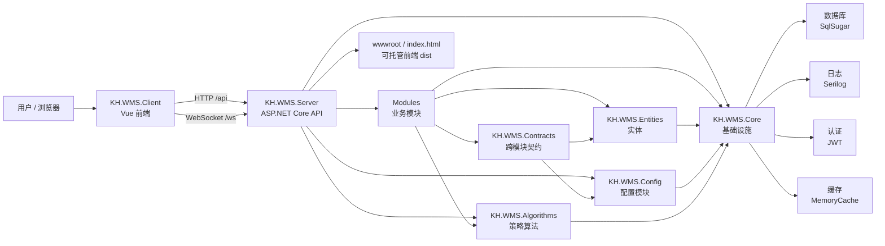
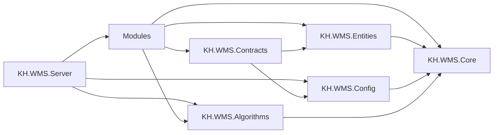

# KH.WMS 项目技术栈、类库与目录开发指引

本文档用于帮助开发人员快速理解 KH.WMS 的前后端组织方式、主要依赖、模块边界，以及新增文件时应该放在哪里。

说明：

- 当前项目包含后端 `.NET 8 / ASP.NET Core Web API` 和前端 `Vue 3 / Vite / Element Plus` 两部分。
- 后端解决方案位于 `KH.WMS/KH.WMS.sln`，前端工程位于 `KH.WMS.Client`。
- <span style="color:#d97706">配置能力当前以 <code>KH.WMS/Config/KH.WMS.Config</code> 为准，旧 <code>Modules/ConfigModule</code> 不再作为新开发落点。</span>
- <span style="color:#2563eb">新增后端 CRUD 优先沿用当前代码里的 <code>IRepository&lt;TEntity, long&gt;</code>、<code>IUnitOfWork</code>、<code>IDetailSaveService</code>、<code>CrudService&lt;TEntity&gt;</code> 写法。</span>

## 目录

- [1. 项目总览](#1-项目总览)
- [2. 技术栈梳理](#2-技术栈梳理)
- [3. 后端类库与模块](#3-后端类库与模块)
- [4. 前端工程结构](#4-前端工程结构)
- [5. 新增文件放置规则](#5-新增文件放置规则)
- [6. 模块依赖边界](#6-模块依赖边界)
- [7. 新增功能落地示例](#7-新增功能落地示例)
- [8. 开发判断口诀](#8-开发判断口诀)

## 1. 项目总览

### 1.1 调用关系概览



简单理解：

- `KH.WMS.Client` 是 Vue 前端，负责 PC、PDA、看板、报表等页面交互。
- `KH.WMS.Server` 是后端启动项目，对外提供 API，也可以托管前端 `dist` 产物。
- `Modules` 存放主要业务模块，例如基础资料、入库、库存、出库、系统、任务、仓储、看板。
- `KH.WMS.Config` 是当前配置能力的独立类库，包含配置实体、控制器、服务、契约解析等能力。
- `KH.WMS.Core` 提供数据库、认证、日志、缓存、AOP、Swagger、通用 CRUD、导入导出等基础设施。
- `KH.WMS.Entities` 存放业务实体，`KH.WMS.Contracts` 存放跨模块接口、请求对象和事件。
- `KH.WMS.Algorithms` 存放策略链、上架/拣选/分配等可替换算法。
- <span style="color:#7c3aed"><code>Algorithms/KH.WMS.Engines</code> 目录下存在 DataMap 源码和构建产物，但当前未作为独立 <code>.csproj</code> 加入解决方案；文档中涉及它时按“源码目录”理解。</span>

## 2. 技术栈梳理

### 2.1 后端技术栈

| 分类 | 技术 / 依赖 | 当前版本 | 说明 |
| --- | --- | --- | --- |
| 运行时 | .NET | 8.0 | 后端主要类库目标框架均为 `net8.0`。 |
| Web 框架 | ASP.NET Core Web API | 8.0 | `KH.WMS.Server` 使用 `Microsoft.NET.Sdk.Web`。 |
| DI | Autofac / Autofac.Extensions.DependencyInjection | 9.0.0 / 10.0.0 | <span style="color:#2563eb">服务自动注册、模块化依赖注入和 ASP.NET Core 宿主集成放在一起看。</span> |
| AOP | Autofac.Extras.DynamicProxy / Castle.Core.AsyncInterceptor | 7.1.0 / 2.1.0 | <span style="color:#7c3aed">动态代理和异步方法拦截配套使用。</span> |
| ORM | SqlSugarCore | 5.1.4.214 | 数据库访问。 |
| 认证 | Microsoft.AspNetCore.Authentication.JwtBearer | 8.0.11 | JWT Bearer 认证。 |
| 日志 | Serilog.AspNetCore / Serilog.Sinks.File / Serilog.Sinks.Map / Serilog.Sinks.Seq / Serilog.Enrichers.CorrelationId | 10.0.0 / 7.0.0 / 2.0.0 / 9.0.0 / 3.0.1 | <span style="color:#059669">结构化日志、文件输出、映射输出、Seq 输出和 CorrelationId 增强统一归到日志体系。</span> |
| API 文档 | Swashbuckle.AspNetCore | 10.1.7 | Swagger 文档。 |
| 性能分析 | MiniProfiler.AspNetCore.Mvc | 4.5.4 | 性能分析入口。 |
| 映射 | AutoMapper | 16.1.1 | 对象映射。 |
| Excel | MiniExcel | 1.34.2 | 导入导出。 |
| 系统信息 | System.Management | 10.0.5 | Windows 系统管理能力。 |
| Windows 服务 | Microsoft.Extensions.Hosting.WindowsServices | 8.0.1 | 支持作为 Windows Service 运行。 |

### 2.2 前端技术栈

| 分类 | 技术 / 依赖 | 当前版本 | 说明 |
| --- | --- | --- | --- |
| 框架 | Vue | ^3.4.21 | 前端主框架。 |
| 构建 | Vite | ^5.1.4 | 开发服务器和构建工具。 |
| Vue 插件 | @vitejs/plugin-vue | ^5.0.4 | Vite 的 Vue 单文件组件支持。 |
| UI | Element Plus | ^2.6.1 | UI 组件库。 |
| 图标 | @element-plus/icons-vue | ^2.3.1 | Element Plus 图标库。 |
| 路由 | vue-router | ^4.3.0 | 前端路由。 |
| 状态 | pinia | ^2.1.7 | 状态管理。 |
| HTTP | axios | ^1.6.7 | 请求后端 API。 |
| 图表 | echarts | ^6.0.0 | 数据可视化。 |
| 加密 | jsencrypt | ^3.5.4 | RSA 加密。 |
| 拖拽 | vue-draggable-plus | ^0.6.1 | 策略链、排序类交互。 |
| 自动导入 | unplugin-auto-import | ^0.17.5 | Vue、Router、Pinia、Element Plus API 自动导入。 |
| 组件导入 | unplugin-vue-components | ^0.26.0 | Element Plus 和 `src/components` 自动组件导入。 |
| E2E | @playwright/test | ^1.60.0 | 端到端测试。 |

### 2.3 快速启动与验证

后端默认从 `KH.WMS/KH.WMS.Server` 启动，监听端口来自配置文件中的 `urls`，当前常用地址为 `http://localhost:9291`。

```powershell
cd D:\Git\0.KH.WMS\KH.WMS
dotnet restore KH.WMS.sln
dotnet build KH.WMS.sln
dotnet run --project KH.WMS.Server\KH.WMS.Server.csproj
```

启动后常用访问地址：

| 地址 | 用途 |
| --- | --- |
| `http://localhost:9291/swagger/index.html` | Swagger API 文档。 |
| `http://localhost:9291/api/...` | 后端 API。 |
| `ws://localhost:9291/ws` | WebSocket 入口。 |

前端默认从 `KH.WMS.Client` 启动，Vite 开发端口为 `3000`，并通过代理访问后端。

```powershell
cd D:\Git\0.KH.WMS\KH.WMS.Client
npm install
npm run dev
```

前端代理配置位于 `KH.WMS.Client/vite.config.js`：

| 前端路径 | 代理目标 | 说明 |
| --- | --- | --- |
| `/api` | `http://localhost:9291` | 普通 HTTP API。 |
| `/ws` | `ws://localhost:9291` | WebSocket。 |

前端也可以构建后复制到后端运行目录的 `wwwroot`，由 `KH.WMS.Server` 通过 `UseDefaultFiles`、`UseStaticFiles` 和 `MapFallbackToFile("index.html")` 托管 SPA。

## 3. 后端类库与模块

### 3.1 解决方案类库清单

| 路径 | 类型 | 职责 |
| --- | --- | --- |
| `KH.WMS.Server` | 启动项目 | ASP.NET Core API 入口、DI、Swagger、中间件、后台服务、SPA 托管。 |
| `KH.WMS.Core` | 基础设施类库 | 通用 API、数据库、仓储、AOP、认证、缓存、日志、导入导出、License、模块加载等。 |
| `KH.WMS.Common` | 公共类库 | 当前保留的公共能力类库。 |
| `KH.WMS.Entities` | 实体类库 | 基础资料、仓储、入库、库存、出库、系统、任务等实体。 |
| `KH.WMS.Contracts` | 契约类库 | 跨模块接口、请求对象、事件；当前依赖 `Entities` 和 `KH.WMS.Config`。 |
| `KH.WMS.Config` | 配置类库 | 配置实体、控制器、DTO、服务、抽象契约和配置解析。 |
| `KH.WMS.Algorithms` | 策略算法类库 | 策略链、上架、拣选、库位分配、库存分配等可替换策略。 |
| `KH.WMS.QuartzJob` | 定时任务类库 | 定时任务相关保留类库。 |
| `Modules/*` | 业务模块类库 | 具体业务 API、服务、DTO、模块内契约和处理器。 |

### 3.2 `KH.WMS.Server` 启动项目

当前 `Program.cs` 的关键职责：

- 使用 `UseWindowsService`，支持 Windows Service 部署。
- 使用 Autofac，并注册 `ServiceExtensions` 和 `StrategyAutofacModule`。
- 调用 `AddInfrastructure` 注册数据库、认证、缓存、日志、Swagger、MiniProfiler 等基础设施。
- 注册 `DailySnapshotBackgroundService` 每日库存快照后台服务。
- 注册 MVC 控制器、全局异常过滤器、TraceId 结果过滤器和 JSON 转换器。
- 通过 `ApplicationPartManager` 自动加载名称包含 `.Modules.` 的程序集和 `KH.WMS.Config` 控制器。
- 启动时预热 `IConfigResolverContract` 和系统参数缓存。
- 启用请求体缓冲、项目自定义中间件、上传目录静态文件、SPA 静态文件和 Swagger。

目录说明：

| 目录/文件 | 用途 | 新增建议 |
| --- | --- | --- |
| `Program.cs` | 应用启动入口。 | 全局启动流程修改放这里，但保持简洁。 |
| `appsettings*.json` | 配置文件。 | 数据库、CORS、Swagger、日志、限流、上传路径等配置。 |
| `Controllers` | 宿主级控制器。 | 不属于具体业务模块的 API 才放这里。 |
| `Profiles` | AutoMapper Profile。 | 新增全局映射配置。 |
| `BackgroundServices` | 后台服务。 | `XxxBackgroundService.cs`。 |
| `Properties` | 启动与发布配置。 | `launchSettings.json`、发布配置。 |
| `Uploads` | 上传附件目录。 | 运行期文件目录，通常不放业务代码。 |
| `wwwroot` | SPA 静态资源。 | 前端构建产物托管目录。 |

### 3.3 `KH.WMS.Core` 基础设施类库

| 目录 | 用途 | 典型内容 |
| --- | --- | --- |
| `AOP` | 面向切面能力。 | 日志、性能、异常、缓存、配置校验等拦截器。 |
| `Api` | API 基础能力。 | 统一响应、分页模型、Swagger 辅助。 |
| `Attributes` | 特性标记。 | `[Transaction]`、`[Cache]`、`[RateLimit]` 等。 |
| `Authentication` | 认证能力。 | JWT Token 生成、校验、配置。 |
| `Caching` | 缓存能力。 | 缓存接口、内存缓存实现、缓存选项。 |
| `Configuration` | 配置读取能力。 | 配置 Provider。 |
| `Constants` | 常量。 | Header、缓存 Key、错误常量。 |
| `Controllers` | 控制器基类。 | `CrudController`、`ExtDataCrudController`。 |
| `Database` | 数据访问基础设施。 | SqlSugar 上下文、仓储、UnitOfWork、数据库初始化。 |
| `DependencyInjection` | DI 注册。 | 自动扫描程序集、服务生命周期特性、Autofac Module。 |
| `Exceptions` | 异常体系。 | 业务异常、校验异常、错误码。 |
| `Extensions` | 扩展方法。 | 框架或项目通用扩展。 |
| `Factories` | 工厂能力。 | 业务处理器工厂和基类。 |
| `Filters` | ASP.NET Core 过滤器。 | 授权、异常、Action、Result 过滤器。 |
| `Helpers` | 工具类。 | 表达式、类型转换等。 |
| `ImportExport` | 导入导出。 | Excel 导入导出服务。 |
| `Keys` | 密钥文件。 | RSA 公钥、私钥。 |
| `License` | 许可证能力。 | License 控制器、服务、中间件、签名验签。 |
| `Logging` | 日志体系。 | Serilog 配置、日志服务、清理、上下文。 |
| `Mapping` | 映射能力。 | AutoMapper 初始化、映射服务封装。 |
| `Middlewares` | 中间件。 | 异常、请求日志、限流、CORS、静态文件。 |
| `Models` | 通用模型。 | 基础实体、基础 DTO、服务结果。 |
| `Modularity` | 模块化能力。 | 模块加载、模块上下文、模块依赖。 |
| `Monitoring` | 监控能力。 | MiniProfiler 配置。 |
| `Security` | 安全能力。 | 哈希、AES/RSA 加解密、限流。 |
| `Serialization` | 序列化能力。 | JSON Converter。 |
| `Services` | 通用服务。 | `ICrudService`、`CrudService`、明细保存服务。 |
| `Setup` | 基础设施注册入口。 | 数据库、缓存、认证、日志、Swagger、中间件注册。 |
| `UserProvide` | 用户上下文。 | 当前用户信息。 |
| `Validation` | 校验能力。 | 校验接口、配置校验特性、校验码。 |

### 3.4 业务模块清单

| 模块 | 真实路径 | 职责 |
| --- | --- | --- |
| `BaseDataModule` | `KH.WMS/Modules/BaseDataModule/KH.WMS.Modules.BaseDataModule` | 物料、客户、供应商、容器等基础资料。 |
| `DashboardModule` | `KH.WMS/Modules/DashboardModule/KH.WMS.Modules.DashboardModule` | 首页统计、运营概览、近期单据等看板聚合接口。 |
| `InboundModule` | `KH.WMS/Modules/InboundModule/KH.WMS.Modules.InboundModule` | 入库单、收货、容器绑定、上架等入库流程。 |
| `InventoryModule` | `KH.WMS/Modules/InventoryModule/KH.WMS.Modules.InventoryModule` | 库存查询、库存快照、库存移动、冻结、盘点、预警。 |
| `OutboundModule` | `KH.WMS/Modules/OutboundModule/KH.WMS.Modules.OutboundModule` | 出库单、分配、拣选、发运、分拣复核等出库流程。 |
| `SystemModule` | `KH.WMS/Modules/SystemModule/KH.WMS.Modules.SystemModule` | 用户、角色、权限、菜单、参数、字典、附件、日志、数据字典。 |
| `TaskModule` | `KH.WMS/Modules/TaskModule/KH.WMS.Modules.TaskModule` | 任务头、任务行、任务确认、临时入库/出库任务。 |
| `WarehouseModule` | `KH.WMS/Modules/WarehouseModule/KH.WMS.Modules.WarehouseModule` | 仓库、库区、巷道、库位、站台、输送线、逻辑区等仓储基础。 |

业务模块常见目录：

| 目录 | 用途 | 新增建议 |
| --- | --- | --- |
| `Controllers` | 模块 API 控制器。 | 对外接口放这里。 |
| `Services` | 业务服务实现。 | 具体业务流程、校验和数据操作放这里。 |
| `Interfaces` | 服务接口。 | 与 `Services` 一一对应。 |
| `DTOs` | 模块 DTO。 | 页面、接口、导入导出请求和响应对象。 |
| `Contracts` | 模块内部或跨模块契约实现。 | 当前模块提供给其他模块调用的契约实现。 |
| `Processors` | 业务处理器。 | ERP/WCS 接入、单据处理等可插拔处理器。 |
| `Validation` | 模块校验器。 | 入库绑定、批次、效期、数量等业务校验。 |

### 3.5 `KH.WMS.Config` 配置类库

<span style="color:#dc2626"><code>KH.WMS.Config</code> 是当前配置模块的有效落点，不再把新配置代码放到旧的 <code>Modules/ConfigModule</code>。</span>

| 目录 | 用途 |
| --- | --- |
| `Abstractions` | 配置解析、扩展字段、单据字段、状态校验等跨模块抽象接口。 |
| `Contracts` | 配置契约实现，例如默认配置作用域解析、配置解析契约。 |
| `Controllers` | 配置相关 API 控制器。 |
| `DTOs` | 配置模块 DTO。 |
| `Entities` | 配置表实体，例如全局配置、扩展字段、单据类型、状态、编号规则、任务触发器等。 |
| `Interfaces` | 配置服务接口。 |
| `Services` | 配置服务实现。 |

典型配置能力包括：

- 全局配置、扩展字段类型、扩展字段配置。
- 单据类型、单据状态、单据字段、单据类型规则、单据流程、单据端口。
- 编码规则、编码序列。
- 仓库类型、库区类型、库位类型、库位状态、站台类型、接驳点类型。
- 任务定义、任务触发器、任务执行日志。

### 3.6 `KH.WMS.Algorithms` 与 DataMap 源码目录

| 位置 | 目录 | 职责 |
| --- | --- | --- |
| `KH.WMS.Algorithms` | `Strategy` | 策略配置、策略链、策略注册、策略执行、上架/拣选/库位分配/库存分配等策略实现。 |
| `Algorithms/KH.WMS.Engines` | `DataMap` | 数据映射配置、映射引擎、接口日志、同步日志、接口中间件、映射配置校验；当前按源码目录维护。 |

策略类新增建议：

- 策略抽象或通用执行能力放 `Algorithms/KH.WMS.Algorithms/Strategy/Strategies` 或 `Strategy/Services`。
- 具体策略实现放 `Algorithms/KH.WMS.Algorithms/Strategy/Implementations/{策略类型}`。
- DataMap 相关源码如果继续维护，落到 `Algorithms/KH.WMS.Engines/DataMap`，不要误以为它是独立解决方案项目。

## 4. 前端工程结构

### 4.1 根目录

| 目录/文件 | 用途 |
| --- | --- |
| `src` | 前端源码。 |
| `public` | 静态资源和运行时配置，例如 `config.js`。 |
| `e2e` | Playwright E2E 测试。 |
| `dist` | 构建产物。 |
| `vite.config.js` | Vite、代理、自动导入、组件自动注册配置。 |
| `package.json` | 依赖和脚本。 |
| `package-lock.json` | 当前 npm 锁文件。 |
| `eslint.config.js` | ESLint 配置。 |
| `playwright.config.js` | E2E 测试配置。 |

当前仓库只看到 `package-lock.json`，没有 `pnpm-lock.yaml`，因此新增依赖时优先按 npm 维护锁文件，除非团队另行统一包管理器。

### 4.2 `src` 目录

| 目录/文件 | 用途 | 新增建议 |
| --- | --- | --- |
| `api` | 后端接口请求封装。 | 按业务域新增或扩展 `{module}.js`。 |
| `components` | 全局通用组件。 | 多页面复用组件放这里，当前使用 `KhXxx/index.vue` 风格。 |
| `composables` | 组合式函数。 | 通用组合逻辑放这里，例如 `useApi.js`。 |
| `directives` | 自定义指令。 | 权限、DOM 行为增强等指令。 |
| `layouts` | 布局组件。 | `PcLayout.vue`、`PdaLayout.vue`。 |
| `router` | 路由配置。 | 静态路由、动态路由解析、菜单配置。 |
| `stores` | Pinia 状态。 | 用户、权限、字典、WebSocket、应用状态。 |
| `typings` | 类型声明。 | 全局 `*.d.ts`。 |
| `utils` | 工具函数。 | 请求封装、CRUD 辅助、字典解析、WebSocket 等。 |
| `views` | 页面视图。 | 按业务域新增页面。 |
| `App.vue` | 根组件。 | 应用外壳。 |
| `main.js` | 应用入口。 | Vue、Pinia、Router、Element Plus 初始化。 |

### 4.3 `src/api`

当前 API 文件包括：

| 文件 | 用途 |
| --- | --- |
| `auth.js` | 登录认证。 |
| `user.js` | 用户相关。 |
| `system.js` | 系统管理。 |
| `basedata.js` | 基础资料。 |
| `config.js` | 配置管理。 |
| `warehouse.js` | 仓储基础。 |
| `inbound.js` | 入库。 |
| `outbound.js` | 出库。 |
| `inventory.js` | 库存。 |
| `task.js` | 任务。 |
| `strategy.js` | 策略。 |
| `dashboard.js` | 看板。 |
| `adhoc.js` | 临时任务。 |
| `license.js` | License。 |
| `index.js` | API 聚合或入口。 |

页面不建议直接散写 `axios` 调用，应优先封装到 `src/api` 后再由页面调用。

### 4.4 `src/components`

当前通用组件按 `KhXxx/index.vue` 组织。<span style="color:#2563eb">只有跨多个页面复用的 UI 才提升到这里；页面专属弹窗、表单和局部展示组件仍放 <code>src/views/{业务域}/components</code>。</span>

| 组件 | 主要用途 | 典型使用场景 |
| --- | --- | --- |
| `KhAlert` | 统一提示条。 | 页面顶部警告、成功、错误、说明性提醒。 |
| `KhCollapse` | 折叠面板封装。 | 高级筛选、分组配置、可展开详情。 |
| `KhColorPicker` | 颜色选择输入。 | 菜单颜色、图标颜色、状态色配置。 |
| `KhDashboard` | 大屏/看板容器。 | 仓库看板、输送线监控、设备状态汇总。 |
| `KhDetailDialog` | 详情弹窗和描述列表。 | 单据详情、库存明细、任务详情查看。 |
| `KhDialog` | 项目统一弹窗外壳。 | 表单弹窗、确认弹窗、业务操作弹窗。 |
| `KhDragList` | 可拖拽排序列表。 | 策略链步骤调整、规则顺序调整。 |
| `KhEditableTable` | 可编辑表格。 | 单据明细行、配置明细、批量录入。 |
| `KhForm` | 配置化表单。 | 查询条件、编辑表单、动态字段表单。 |
| `KhFullscreen` | 全屏切换按钮。 | 看板、监控、表格全屏查看。 |
| `KhIconPicker` | 图标选择输入。 | 菜单图标、按钮图标、状态图标配置。 |
| `KhLayout` | PC 主布局容器。 | 侧边栏、顶部栏、主内容区。 |
| `KhLoading` | 加载态展示。 | 页面加载、局部区域等待。 |
| `KhMenu` | 菜单树/侧边菜单。 | PC 布局导航、权限菜单展示。 |
| `KhMessage` | 命令式消息提示封装。 | 操作成功、失败、警告提示。 |
| `KhMsgBox` | 命令式消息框封装。 | 删除确认、二次确认、输入确认。 |
| `KhNoticeBar` | 通知栏/公告条。 | 顶部公告、滚动提醒、系统提示。 |
| `KhNotification` | 通知下拉面板。 | 消息中心、未读提醒、系统通知。 |
| `KhNotify` | 命令式通知封装。 | 右上角通知、异步任务结果提醒。 |
| `KhPage` | 标准业务页面壳。 | 统计卡片、搜索区、工具栏、表格区组合页面。 |
| `KhPageHeader` | 页面头部。 | 标题、副标题、返回按钮、头部操作区。 |
| `KhSideDrawer` | 侧边抽屉。 | 详情侧栏、过滤条件、辅助配置面板。 |
| `KhSortList` | 排序列表展示。 | 波次、优先级、步骤顺序展示。 |
| `KhStatCard` | 统计指标卡片。 | 首页指标、库存数量、任务数量、看板统计。 |
| `KhSteps` | 步骤条封装。 | 入库、出库、任务流转、流程状态展示。 |
| `KhTable` | 标准表格组件。 | 列表页、选择表格、带工具栏和分页的业务表格。 |
| `KhTimeline` | 时间线。 | 操作日志、单据流转记录、任务执行历史。 |
| `KhTransfer` | 穿梭选择组件封装。 | 分配权限、分配用户、批量选择。 |
| `KhUpload` | 上传组件封装。 | 附件上传、图片上传、导入文件上传。 |
| `KhWaterfall` | 瀑布流布局。 | 卡片流、图片流、非等高内容展示。 |

新增建议：

- 页面专属组件放 `src/views/{业务域}/components`。
- 多个页面复用后再提升到 `src/components/KhXxx/index.vue`。
- `vite.config.js` 已配置 `Components({ dirs: ['src/components'], directoryAsNamespace: true })`，全局组件目录命名要保持稳定。

### 4.5 `src/router`

| 文件 | 用途 |
| --- | --- |
| `index.js` | 路由主配置、登录守卫、动态路由解析。 |
| `menuConfig.js` | 菜单配置。 |

动态路由要点：

- 后端菜单的 `component` 字段需要匹配 `/src/views/{component}.vue`。
- `src/views/**/components` 不作为页面路由组件。
- 新增页面时先确认菜单 `component` 和真实 Vue 文件路径一致。

### 4.6 `src/stores`

| 文件 | 用途 |
| --- | --- |
| `app.js` | 应用状态。 |
| `user.js` | 用户状态。 |
| `permission.js` | 权限和动态路由。 |
| `dict.js` | 字典。 |
| `websocket.js` | WebSocket 状态。 |

页面内部临时状态不需要放 Store；跨页面共享、登录态相关、权限相关、字典缓存、WebSocket 连接状态适合放 Store。

### 4.7 `src/views`

| 目录 | 用途 | 对应后端模块 |
| --- | --- | --- |
| `basedata` | 基础资料页面。 | `BaseDataModule` |
| `config` | 配置管理页面。 | `KH.WMS.Config` |
| `dashboard` | 看板、监控页面。 | `DashboardModule` / 聚合接口 |
| `example` | 示例页面。 | 无固定模块 |
| `inbound` | 入库业务页面。 | `InboundModule` |
| `inventory` | 库存页面。 | `InventoryModule` |
| `outbound` | 出库页面。 | `OutboundModule` |
| `pda` | PDA 移动作业页面。 | 多个业务模块 |
| `report` | 报表页面。 | 聚合多个模块 |
| `sorting` | 分拣页面。 | 出库 / 任务相关 |
| `strategy` | 策略配置页面。 | `KH.WMS.Algorithms` |
| `system` | 系统管理页面。 | `SystemModule` |
| `task` | 任务中心页面。 | `TaskModule` |
| `warehouse` | 仓储基础资料页面。 | `WarehouseModule` |

### 4.8 `src/utils`

| 文件 | 用途 |
| --- | --- |
| `request.js` | Axios 请求封装。 |
| `crud.js` | CRUD 辅助。 |
| `dict-resolve.js` | 字典解析。 |
| `websocket.js` | WebSocket 工具。 |
| `useExtFields.js` | 扩展字段相关组合能力。 |
| `mockData.js` | 模拟数据。 |
| `row-style-presets.js` | 行样式预设。 |

纯工具函数放这里；复杂业务流程不要塞进 `utils`，应留在页面、模块服务或专门组合函数中。

## 5. 新增文件放置规则

路径占位说明：

- `{模块}` 指带 `Module` 后缀的后端业务模块名，例如 `BaseDataModule`、`WarehouseModule`、`InventoryModule`。
- `{业务域}` 指实体、契约或前端页面的业务分类，例如 `BaseData`、`Warehouse`、`Inventory`；前端通常使用小写目录，例如 `basedata`、`warehouse`、`inventory`。

### 5.1 后端新增文件

| 新增内容 | 推荐位置 | 示例命名 |
| --- | --- | --- |
| 业务控制器 | `Modules/{模块}/KH.WMS.Modules.{模块}/Controllers` | `MaterialController.cs` |
| 业务服务接口 | `Modules/{模块}/KH.WMS.Modules.{模块}/Interfaces` | `IMaterialService.cs` |
| 业务服务实现 | `Modules/{模块}/KH.WMS.Modules.{模块}/Services` | `MaterialService.cs` |
| 模块 DTO | `Modules/{模块}/KH.WMS.Modules.{模块}/DTOs` | `MaterialDto.cs`、`SaveMaterialDto.cs` |
| 模块内部契约实现 | `Modules/{模块}/KH.WMS.Modules.{模块}/Contracts` | `MaterialContract.cs` |
| 实体 | `Entities/KH.WMS.Entities/{业务域}` | `MdMaterial.cs` |
| 跨模块接口 | `Contracts/KH.WMS.Contracts/{业务域}` | `IMaterialContract.cs` |
| 跨模块请求 | `Contracts/KH.WMS.Contracts/{业务域}` | `MaterialInfoRequest.cs` |
| 跨模块事件 | `Contracts/KH.WMS.Contracts/Events` | `InboundCompletedEvent.cs` |
| 模块校验器 | `Modules/{模块}/KH.WMS.Modules.{模块}/Validation` | `BindQuantityValidator.cs` |
| 处理器 | `Modules/{模块}/KH.WMS.Modules.{模块}/Processors` | `InboundOrderFromErpProcessor.cs` |

服务实现通常保持当前自动注册风格：

```csharp
[RegisteredService(ServiceType = typeof(IXxxService))]
public class XxxService(
    IRepository<XxxEntity, long> repository,
    IUnitOfWork unitOfWork,
    IDetailSaveService detailSaveService)
    : CrudService<XxxEntity>(repository, unitOfWork, detailSaveService), IXxxService
{
}
```

控制器通常保持模块 API 风格：

```csharp
[Route("api/xxx")]
public class XxxController(IXxxService xxxService) : CrudController<XxxEntity>(xxxService)
{
}
```

### 5.2 前端新增文件

| 新增内容 | 推荐位置 | 示例命名 |
| --- | --- | --- |
| 业务页面 | `src/views/{业务域}` | `material.vue`、`transfer-plan.vue` |
| 页面局部组件 | `src/views/{业务域}/components` | `MaterialFormDialog.vue` |
| 通用组件 | `src/components/KhXxx/index.vue` | `KhTable/index.vue` |
| API 请求 | `src/api` | `basedata.js`、`warehouse.js` |
| Store | `src/stores` | `user.js`、`permission.js` |
| 组合式函数 | `src/composables` | `useApi.js` |
| 工具函数 | `src/utils` | `request.js`、`dict-resolve.js` |
| 自定义指令 | `src/directives` | `permission.js` |
| 布局 | `src/layouts` | `PcLayout.vue`、`PdaLayout.vue` |
| 类型声明 | `src/typings` | `global.d.ts` |
| E2E 测试 | `e2e` | `login.spec.js` |

## 6. 模块依赖边界

### 6.1 后端依赖原则

| 场景 | 推荐做法 | 避免做法 |
| --- | --- | --- |
| 业务模块访问数据库表 | 通过 `KH.WMS.Entities` 中的实体和模块服务访问。 | 在多个模块重复定义同一张表实体。 |
| 模块间互相调用 | 把接口、请求对象、事件放到 `KH.WMS.Contracts`。 | 一个模块直接引用另一个模块的 `Services` 实现类。 |
| 配置解析和配置数据 | 放到 `KH.WMS.Config`，必要抽象放 `Abstractions`。 | 新代码继续放旧的 `Modules/ConfigModule`。 |
| 通用 CRUD、仓储、认证、日志、缓存 | 放到 `KH.WMS.Core`。 | 把具体业务规则放进 `Core`。 |
| 入库、出库、库存、任务等业务流程 | 放到对应 `Modules/{模块}`。 | 把业务流程散落到 `Server` 或 `Core`。 |
| 可配置、可替换的分配或路径逻辑 | 放到 `KH.WMS.Algorithms`。 | 在业务 `Service` 中硬编码策略。 |
| 接口映射、数据转换引擎 | 放到 `Algorithms/KH.WMS.Engines/DataMap` 源码目录。 | 散落在各业务模块重复实现，或误建到旧模块目录。 |

推荐依赖方向：



### 6.2 前端依赖原则

| 场景 | 推荐做法 | 避免做法 |
| --- | --- | --- |
| 页面调用后端 | 先在 `src/api/{module}.js` 封装，再由页面调用。 | 页面里直接散写 `axios`。 |
| 页面内部弹窗、表单 | 放 `src/views/{业务域}/components`。 | 一开始就放进全局 `src/components`。 |
| 多页面复用组件 | 提升到 `src/components/KhXxx/index.vue`。 | 多页面复制同一段组件代码。 |
| 登录态、权限、字典、WebSocket | 放 `src/stores`。 | 在各页面维护重复全局状态。 |
| 纯工具函数 | 放 `src/utils`。 | 把复杂业务流程塞进 `utils`。 |
| 复用组合逻辑 | 放 `src/composables`。 | 在多个页面复制 Composition API 逻辑。 |

## 7. 新增功能落地示例

以下以“新增物料品牌”为例，展示常规业务功能从后端到前端的文件落点。

### 7.1 后端落点

| 步骤 | 文件位置 | 示例 |
| --- | --- | --- |
| 1. 新增实体 | `KH.WMS/Entities/KH.WMS.Entities/BaseData` | `MdMaterialBrand.cs` |
| 2. 新增 DTO | `KH.WMS/Modules/BaseDataModule/KH.WMS.Modules.BaseDataModule/DTOs` | `MaterialBrandDto.cs`、`SaveMaterialBrandDto.cs` |
| 3. 新增服务接口 | `KH.WMS/Modules/BaseDataModule/KH.WMS.Modules.BaseDataModule/Interfaces` | `IMaterialBrandService.cs` |
| 4. 新增服务实现 | `KH.WMS/Modules/BaseDataModule/KH.WMS.Modules.BaseDataModule/Services` | `MaterialBrandService.cs` |
| 5. 新增控制器 | `KH.WMS/Modules/BaseDataModule/KH.WMS.Modules.BaseDataModule/Controllers` | `MaterialBrandController.cs` |
| 6. 新增映射 | `KH.WMS/KH.WMS.Server/Profiles` | 在对应 `Profile` 中补实体和 DTO 映射。 |
| 7. 跨模块复用 | `KH.WMS/Contracts/KH.WMS.Contracts/BaseData` | `IMaterialBrandContract.cs`、`MaterialBrandRequest.cs` |

服务实现参考当前主构造函数和通用依赖风格：

```csharp
[RegisteredService(ServiceType = typeof(IMaterialBrandService))]
public class MaterialBrandService(
    IRepository<MdMaterialBrand, long> repository,
    IUnitOfWork unitOfWork,
    IDetailSaveService detailSaveService)
    : CrudService<MdMaterialBrand>(repository, unitOfWork, detailSaveService), IMaterialBrandService
{
}
```

控制器参考当前模块 API 风格：

```csharp
[Route("api/material-brand")]
public class MaterialBrandController(IMaterialBrandService materialBrandService)
    : CrudController<MdMaterialBrand>(materialBrandService)
{
}
```

<span style="color:#d97706">如果实体需要扩展字段表单能力，参考当前 <code>MaterialController</code>、<code>CustomerController</code>、<code>SupplierController</code>，控制器可继承 <code>ExtDataCrudController&lt;TEntity&gt;</code>，并按业务表名调用 <code>ICfgExtFieldContract</code> 构建表单字段。</span>

### 7.2 前端落点

| 步骤 | 文件位置 | 示例 |
| --- | --- | --- |
| 1. 封装 API | `KH.WMS.Client/src/api/basedata.js` | 新增 `getMaterialBrandList`、`saveMaterialBrand` 等方法。 |
| 2. 新增页面 | `KH.WMS.Client/src/views/basedata` | `material-brand.vue` |
| 3. 新增页面局部组件 | `KH.WMS.Client/src/views/basedata/components` | `MaterialBrandFormDialog.vue` |
| 4. 配置菜单或路由 | 后端菜单数据 / `src/router/menuConfig.js` | `component` 填 `basedata/material-brand`。 |
| 5. 需要字典时 | `KH.WMS.Client/src/stores/dict.js` 或后端字典配置 | 只把跨页面共享字典放 Store。 |
| 6. 增加 E2E 测试 | `KH.WMS.Client/e2e` | `material-brand.spec.js` |

动态路由要点：

- 如果页面文件是 `src/views/basedata/material-brand.vue`，后端菜单 `component` 应配置为 `basedata/material-brand`。
- 如果表单弹窗是 `src/views/basedata/components/MaterialBrandFormDialog.vue`，它不会被动态路由匹配，这是符合预期的。

### 7.3 完成后建议验证

| 验证项 | 命令或方式 |
| --- | --- |
| 后端编译 | `cd D:\Git\0.KH.WMS\KH.WMS` 后执行 `dotnet build KH.WMS.sln` |
| 后端接口 | 启动 `KH.WMS.Server` 后访问 `http://localhost:9291/swagger` |
| 前端构建 | `cd D:\Git\0.KH.WMS\KH.WMS.Client` 后执行 `npm run build` |
| 前端页面 | `npm run dev` 后访问 `http://localhost:3000` |
| E2E 测试 | `npm run test:e2e` |

## 8. 开发判断口诀

- 和数据库表一一对应：放 `Entities`。
- 模块间要互相调用：放 `Contracts`。
- 配置实体、配置服务、配置解析：放 `KH.WMS.Config`。
- 具体业务逻辑：放对应 `Modules`。
- 全项目通用技术能力：放 `KH.WMS.Core`。
- 策略、分配、算法：放 `KH.WMS.Algorithms`。
- 数据映射、接口转换引擎：放 `Algorithms/KH.WMS.Engines` 源码目录。
- 前端页面：放 `src/views/{业务域}`。
- 前端页面内弹窗：放 `views/{业务域}/components`。
- 前端多页面复用组件：放 `src/components`。
- 前端请求后端：放 `src/api`。
