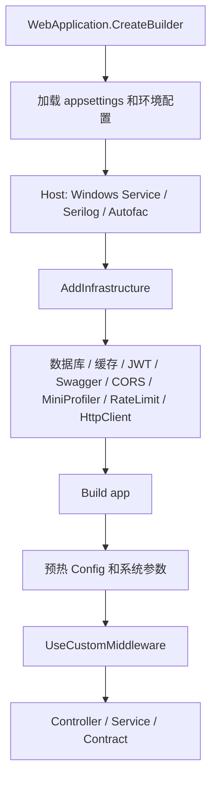

# 15 应用配置 Options 与运行时配置边界

## 这个概念解决什么问题

KH.WMS 后端有三类“配置”容易混在一起：

- 启动配置：`appsettings.json`、`appsettings.Development.json`、环境变量，决定服务怎么启动、数据库怎么连、JWT 怎么验、Swagger 和 MiniProfiler 是否开启。
- 配置库：Config SQLite 库中的业务配置，例如扩展字段、单据状态、编码规则、全局配置。
- 系统参数缓存：`sys_parameter` 这类运行期参数，启动时会预热到缓存，业务服务通过参数服务或配置服务读取。

应用配置 Options 解决的是“进程启动和基础设施装配”的问题。它决定的是 ASP.NET Core Host、数据库、认证、日志、CORS、Swagger、MiniProfiler、限流、HttpClient 等底座能力能不能正确接起来。

理解这一层后，排查问题时就不会把所有开关都归到 Config 配置库，也不会在业务表里找 `Jwt:Secret`、`Swagger:RoutePrefix` 或 `RateLimit:RequestLimit`。

## 什么时候需要看

- 后端启动失败，尤其是数据库、JWT、日志、Swagger、License、CORS、限流相关错误。
- 本地和部署环境行为不一致。
- 修改了 `appsettings.json` 或 `appsettings.Development.json` 但效果不符合预期。
- 想判断一个配置应该放到启动配置、配置库、系统参数，还是业务表。
- 新增底层能力，需要接入 `AddInfrastructure` 或请求管道。

## 业务开发应该怎么用

### 改启动行为时

先判断它是否属于“进程级基础设施”：

| 配置内容 | 放哪里 | 原因 |
| --- | --- | --- |
| 数据库连接、数据库类型 | `DbConnection` | 启动时注册 SqlSugar 客户端 |
| JWT 签名密钥、签发方、过期时间 | `Jwt` | 认证中间件启动时绑定 |
| Swagger 标题、版本、路径 | `Swagger` | API 文档中间件启动时绑定 |
| MiniProfiler 路径、生产开关 | `MiniProfiler` | 性能观测中间件启动时绑定 |
| 跨域来源 | `Cors` | 请求管道中的 CORS 中间件使用 |
| 限流窗口、请求数、key 前缀 | `RateLimit` | 限流服务和中间件读取 |
| 日志路径、级别、保留天数 | `Serilog` | Host 日志系统读取 |
| 业务规则开关 | Config 配置库或系统参数 | 业务运行期可能要调整 |
| 单据状态、编码规则、扩展字段 | Config 配置库 | 属于业务配置数据 |

### 改业务规则时

不要优先改 `appsettings.json`。例如：

- 是否允许某类单据跳过质检，更适合 Config 全局配置或业务配置表。
- 某个模块默认密码策略，当前系统用户服务会从系统参数读取默认密码。
- 单据编码规则、状态流转、扩展字段定义，应走 Config 配置库。

启动配置适合“服务起来之前就必须知道”的东西；业务配置适合“服务运行中由业务或实施调整”的东西。

### 改环境差异时

ASP.NET Core 默认会加载：

1. `appsettings.json`
2. `appsettings.{Environment}.json`
3. 环境变量
4. 命令行参数

当前仓库中 `appsettings.Development.json` 关闭了 License：

```json
{
  "License": {
    "Enabled": false
  }
}
```

所以本地开发环境和生产环境的 License 行为可能不同。排查时先确认实际 `ASPNETCORE_ENVIRONMENT`，再确认最终配置值。

## 底层逻辑和实现

### 启动主线

`Program.cs` 是入口：

```csharp
var builder = WebApplication.CreateBuilder(args);
builder.Host.UseWindowsService(...);
builder.Host.AddSerilog();
builder.Host.UseServiceProviderFactory(new AutofacServiceProviderFactory());
builder.Services.AddInfrastructure(builder.Configuration, builder.Environment);
```

`AddInfrastructure` 是基础设施注册总入口。它把多个 Setup 组合起来：

```csharp
services.AddSqlSugarSetup(configuration);
services.AddCacheSetup(configuration);
services.AddAuthenticationSetup(configuration);
services.AddLoggingSetup(configuration);
services.AddMonitoringSetup(configuration, environment);
services.AddApiDocumentationSetup(configuration);
services.AddCustomCors(configuration);
services.AddRateLimiting(configuration);
services.AddHttpClient();
```

这意味着：如果某个底层能力没有注册成功，优先看 `AddInfrastructure` 是否接入，而不是去业务模块里找。

### Options 绑定

仓库里常见的配置绑定方式有两种。

一种是注册到 Options：

```csharp
services.Configure<DatabaseOptions>(configuration.GetSection("DbConnection"));
services.Configure<RateLimitOptions>(configuration.GetSection("RateLimit"));
services.Configure<JwtTokenOptions>(configuration.GetSection("Jwt"));
```

另一种是在 Setup 中直接读取：

```csharp
var swaggerOptions = configuration.GetSection("Swagger").Get<SwaggerOptions>();
var miniProfilerSettings = configuration.GetSection("MiniProfiler").Get<MiniProfilerSettings>();
```

业务开发不需要手写这些绑定，除非新增基础设施能力。普通业务服务读取配置，应优先走已有 Config/Parameter 服务，而不是到处注入 `IConfiguration`。

### 启动配置和配置库的边界

`DbConnection` 里有两套数据库边界：

- `ConnectionString` 和 `DbType` 指向主业务库。
- `ConfigDbPath` 指向本地 SQLite 配置库文件。

SqlSugar 注册时会创建两个连接配置：

- `MainDb`：主业务库。
- `ConfigDb`：配置库。

后续 Config 模块通过配置库维护业务配置，但配置库的位置本身仍然来自启动配置。简单说：启动配置告诉服务“配置库在哪里”，配置库告诉业务“规则是什么”。

### 启动预热

应用构建后，`Program.cs` 会在一个作用域里预热：

```csharp
var configService = scope.ServiceProvider.GetRequiredService<IConfigResolverContract>();
await configService.WarmUpAsync();

var paramService = scope.ServiceProvider.GetRequiredService<ISysParameterService>();
await paramService.WarmUpAsync();
```

这一步把全局配置和系统参数提前加载到缓存，避免第一次业务请求才查库。排查“数据库改了但接口还是旧值”时，要考虑缓存、预热和清缓存。

### DataMap 当前不是主线启用能力

`appsettings.json` 中存在 `DataMap:InboundApiKey`，代码中也有 `UseInterfaceMiddleware` 扩展。但当前 `Program.cs` 里是注释状态：

```csharp
//app.UseInterfaceMiddleware(app.Services);
```

因此本专题目录暂不把 DataMap 作为主线底层概念展开。要启用外部接口引擎时，需要单独评估项目引用、服务注册、表结构、鉴权和中间件顺序。

## 真实执行链路



## 排查清单

1. 确认实际环境：Development、Production，还是 Windows Service 环境。
2. 确认配置是否在正确文件里：`appsettings.json` 还是环境覆盖文件。
3. 确认配置节名称是否和代码一致，例如 `DbConnection`、`Jwt`、`Swagger`、`MiniProfiler`、`RateLimit`。
4. 启动失败时先看 Host 和 `AddInfrastructure`，不要先查业务 Service。
5. 运行期业务规则不生效时，区分启动配置、Config 配置库、系统参数缓存。
6. 本地和部署不一致时，确认环境变量是否覆盖了 JSON 文件。
7. 修改 JWT Secret 后，所有旧 token 都会失效，这是预期行为。
8. 修改 Config 库数据后，如果接口仍旧值，先考虑缓存预热和清缓存。

## 常见坑

### 把业务开关放进 appsettings

`appsettings` 改完通常要重启才稳。业务运行期要调整的规则，优先放 Config 配置库或系统参数。

### 生产环境沿用开发 Secret

`Jwt:Secret` 是敏感配置。生产环境必须使用独立强密钥，不应把开发占位值当成生产密钥。

### 只注册 Options，不挂中间件

`AddRateLimiting(configuration)` 只是注册配置。当前请求管道中的 `app.UseRateLimiting()` 是注释状态，所以限流配置不会自动产生拦截效果。

### 忽略环境覆盖

开发环境关闭 License，不代表生产也关闭。排查 402 或 License 行为时要先确认最终配置。

### 用 `IConfiguration` 绕过业务底座

普通业务服务里到处读取裸配置 key，会让规则分散、测试困难、缓存失效不可控。已有 Config/Parameter/Contract 能力时优先使用它们。
