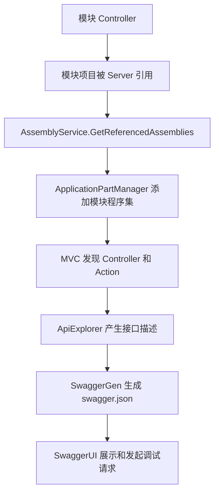

# 16 Swagger 与 OpenAPI 接口文档底座

## 这个概念解决什么问题

Swagger/OpenAPI 解决的是“后端接口能被发现、能被描述、能被联调”的问题。

在 KH.WMS 中，Swagger 不是单独扫描某个目录。它依赖 ASP.NET Core MVC 的 Controller 发现机制，也依赖启动项目把模块程序集加入 `ApplicationPartManager`。所以 Swagger 看不到接口时，不一定是 Swagger 配置错了，常见原因反而是：

- Controller 所在程序集没有被 Server 引用。
- 模块程序集名称不符合扫描约定。
- Controller 构造函数依赖注入失败。
- Controller 没有正确路由。
- Swagger 已经启动，但接口所在 MVC ApplicationPart 没有加入。

## 什么时候需要看

- 新增 Controller 后 Swagger 里没有接口。
- Swagger 页面能打开，但某些模块接口缺失。
- Swagger 授权按钮不能带 Bearer Token。
- 接口路由和前端实际请求路径对不上。
- 调整 Swagger 标题、路径、版本、模型显示行为。

## 业务开发应该怎么用

### 新增 Controller 时

普通业务 Controller 应放在模块项目中，例如：

```text
KH.WMS/Modules/WarehouseModule/KH.WMS.Modules.WarehouseModule/Controllers
```

最少要确认四件事：

1. Controller 是 public 类。
2. 继承 `ControllerBase` 或项目中的 `CrudController<TEntity>` / `ExtDataCrudController<TEntity>`。
3. 有明确路由，例如 `[Route("api/location")]`。
4. 所在模块项目被 `KH.WMS.Server` 引用，且程序集名称包含 `.Modules.`。

Config 模块是特例，`Program.cs` 会额外把 `KH.WMS.Config` 加入 ApplicationPart。

### Swagger 授权怎么用

`Swagger:EnableJwt=true` 时，Swagger 会注册 Bearer 安全定义。联调需要：

1. 调登录接口获取 token。
2. 点击 Swagger 页面上的 Authorize。
3. 输入 token，不需要手动加 `Bearer ` 前缀。
4. 再请求需要鉴权的接口。

如果接口仍然 401，先确认 token 是否有效，再确认请求是否经过 `UseAuthentication()` 和 `UseAuthorization()`。

### Swagger 不等于权限放行

Swagger 页面能看到接口，只说明接口被 OpenAPI 文档发现。真正请求接口时仍然会经过：

- License 中间件。
- CORS。
- 请求日志。
- 路由。
- MiniProfiler。
- JWT 认证。
- 自定义授权 Filter。

所以“Swagger 能看到但调用失败”和“Swagger 看不到接口”是两个不同问题。

## 底层逻辑和实现

### Swagger 服务注册

`AddInfrastructure` 中调用：

```csharp
services.AddApiDocumentationSetup(configuration);
```

它最终进入：

```csharp
SwaggerSetup.AddSwaggerDocumentation(services, configuration);
```

`SwaggerSetup` 从 `Swagger` 配置节读取：

- `Title`
- `Version`
- `Description`
- `RoutePrefix`
- `EnableJwt`
- Contact / License 元数据

如果 `EnableJwt=true`，会注册 Bearer SecurityDefinition 和 SecurityRequirement。

### Swagger 中间件启用

`Program.cs` 中启用：

```csharp
app.UseSwaggerDocumentation(builder.Configuration);
```

当前代码没有限制 Development 环境，也就是说只要应用运行，这段都会执行。生产是否公开 Swagger 要由部署策略、网关或后续代码策略再约束。

### Controller 发现机制

`Program.cs` 中配置了 MVC ApplicationPart：

```csharp
.ConfigureApplicationPartManager(apm =>
{
    var moduleAssemblies = AssemblyService.GetReferencedAssemblies()
        .Where(a => a.GetName().Name?.Contains(".Modules.") == true
            || a.GetName().Name == "KH.WMS.Config");

    foreach (var assembly in moduleAssemblies)
    {
        apm.ApplicationParts.Add(new AssemblyPart(assembly));
    }
});
```

这段解释了为什么模块命名和项目引用很重要：

- 程序集没有被加载，就没有机会被扫描。
- 程序集名不包含 `.Modules.` 且不是 `KH.WMS.Config`，不会被加入 ApplicationPart。
- Controller 被加入 ApplicationPart 后，Swagger 才能从 MVC ApiExplorer 里拿到接口。

### XML 注释

SwaggerSetup 会尝试读取入口程序集 XML 文件：

```csharp
var xmlFile = $"{Assembly.GetEntryAssembly()?.GetName().Name}.xml";
var xmlPath = Path.Combine(AppContext.BaseDirectory, xmlFile);
if (File.Exists(xmlPath))
{
    options.IncludeXmlComments(xmlPath);
}
```

这意味着 XML 注释不是所有模块都一定自动显示。要让注释更完整，需要确认项目是否生成 XML 文档文件，以及 Swagger 是否包含对应 XML。

## 真实执行链路



## 排查清单

### Swagger 页面打不开

1. 确认服务是否启动成功。
2. 确认端口，例如当前 `urls` 配置为 `http://*:9291`。
3. 确认 `Swagger:RoutePrefix`，默认是 `swagger`。
4. 看启动日志中是否有异常导致应用未进入 `app.Run()`。

### Swagger 页面打开但接口缺失

1. Controller 所在项目是否被 `KH.WMS.Server.csproj` 引用。
2. 项目程序集名称是否包含 `.Modules.`，或是否为 `KH.WMS.Config`。
3. Controller 是否 public。
4. Controller 是否有路由。
5. 构造函数依赖是否能解析。
6. 是否继承了正确 Controller 基类。
7. 是否因为编译失败导致新程序集没有进输出目录。

### Swagger 调接口 401

1. 是否调用登录接口拿到 token。
2. Swagger Authorize 是否输入 token。
3. Token 是否过期。
4. `Jwt:Secret` 是否和签发 token 时一致。
5. 目标接口是否允许匿名，或需要权限。

### Swagger 调接口 402

这不是 Swagger 问题，而是 License 拦截。转到 [19-License授权许可与运行时拦截.md](./19-License授权许可与运行时拦截.md)。

### Swagger 调接口 403

这通常是鉴权通过但授权失败。转到 [13-鉴权缓存用户上下文与运行期开关.md](./13-鉴权缓存用户上下文与运行期开关.md)。

## 常见坑

### 只新建 Controller，没有让 Server 引用模块

Swagger 只看运行时加载的程序集。项目文件存在不等于程序集被加载。

### 模块命名不符合扫描规则

业务模块建议保持 `KH.WMS.Modules.XxxModule` 命名。随意改名会让 ApplicationPart 扫描漏掉。

### 误把 Swagger 当成权限系统

Swagger 只生成文档和调试页面。是否能调用成功取决于请求管道、License、认证、授权和业务校验。

### 路由和前端约定不一致

Swagger 里显示的路径就是后端真实路由。前端请求 404 时，以 Swagger 的路径为准回查前端 API 封装。

### XML 注释缺失就改 Controller

接口能否显示和 XML 注释是否显示是两件事。注释缺失优先检查 XML 文档生成和 Swagger IncludeXmlComments。

## 继续阅读

- [底层机制索引](/backend/后端底层概念/README)
- [后端 V3 教程](/backend/后端开发指引V3教程/README)
- [后端排错与日志追踪](/backend/KH.WMS后端排错与日志追踪指引)
