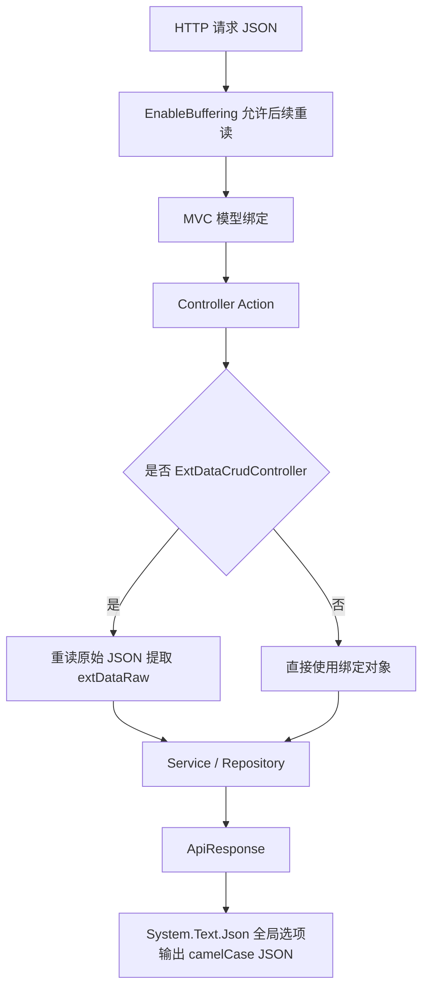

# 17 JSON 序列化与 HTTP 契约约定

## 这个概念解决什么问题

JSON 序列化决定后端对象如何变成 HTTP 响应，也决定前端请求体如何绑定成 DTO 或实体。

KH.WMS 的前后端契约约定主要包括：

- 响应字段使用 camelCase。
- null 字段默认不输出。
- 中文不转义。
- 日期、枚举、bool/int 有项目自定义转换器。
- 业务 JSON 接口尽量返回 `ApiResponse`。
- ExtData 动态字段需要读取原始请求体。

理解这一层后，排查“前端字段拿不到”“枚举值不对”“动态字段没保存”“TraceId 没有”“bool 状态前后端不一致”会快很多。

## 什么时候需要看

- 前端字段名和后端属性名对不上。
- 接口返回 null 字段丢失。
- 日期格式、枚举格式、状态字段格式不符合前端预期。
- `ExtDataCrudController` 保存时读不到 `extDataRaw`。
- 想新增自定义 JSON 转换规则。
- 中间件手写 JSON 响应，需要和全局响应格式保持一致。

## 业务开发应该怎么用

### DTO 和前端字段

后端 C# 属性通常是 PascalCase：

```csharp
public string UserName { get; set; }
public DateTime CreatedTime { get; set; }
```

HTTP JSON 中会变成 camelCase：

```json
{
  "userName": "admin",
  "createdTime": "2026-07-09 10:30:00"
}
```

前端写字段时要按 JSON 契约，不要按 C# 属性名。

### 返回值统一用 ApiResponse

业务接口优先返回：

```csharp
return ApiResponse.Ok(data);
return ApiResponse.Fail(code, message);
```

这样 TraceId、状态码、消息结构和前端拦截器更稳定。文件下载、静态资源、Swagger JSON、MiniProfiler 页面这类非业务 JSON 响应可以不走 `ApiResponse`。

### 不要把 ExtData 当普通 JSON 字段

`ExtData` 是数据库中的字符串列，里面存动态字段 JSON。标准动态字段接口要求前端提交 `extDataRaw`，后端再把它写入实体的 `ExtData`。

因此：

- 普通 CRUD 不会自动处理 `extDataRaw`。
- `ExtDataCrudController` 会在模型绑定后重读原始 Body。
- 主从 DTO 页面如果不走 `ExtDataCrudController`，需要自己显式序列化扩展字段。

## 底层逻辑和实现

### MVC JSON 配置

`Program.cs` 中直接配置 MVC JSON：

```csharp
.AddJsonOptions(options =>
{
    options.JsonSerializerOptions.PropertyNamingPolicy = JsonNamingPolicy.CamelCase;
    options.JsonSerializerOptions.DefaultIgnoreCondition = JsonIgnoreCondition.WhenWritingNull;
    options.JsonSerializerOptions.Encoder = JavaScriptEncoder.UnsafeRelaxedJsonEscaping;
    options.JsonSerializerOptions.Converters.Add(new DateTimeConverter());
    options.JsonSerializerOptions.Converters.Add(new NullableDateTimeConverter());
    options.JsonSerializerOptions.Converters.Add(new EnumConverter());
    options.JsonSerializerOptions.Converters.Add(new BoolToIntConverter());
    options.JsonSerializerOptions.Converters.Add(new NullableBoolToIntConverter());
})
```

这套配置影响 Controller 的 JSON 请求/响应。

### JsonSetup 是可复用底座

`KH.WMS.Core.Serialization.Json.JsonSetup` 里也有一套 `IJsonSerializer` 和默认 `JsonSerializerOptions`。它适合底层服务需要统一序列化时复用。

但当前主启动链里，MVC JSON 是在 `Program.cs` 的 `AddControllers().AddJsonOptions(...)` 里配置的。不要误以为改 `JsonSetup.GetDefaultOptions()` 一定会影响所有 Controller 响应。

### License 中间件手写 JSON

`LicenseValidationMiddleware` 在返回 402 时没有经过 Controller，而是自己序列化 `ApiResponse`。因此它内部也维护了 camelCase、忽略 null、中文不转义的 `JsonSerializerOptions`，保证前端仍然能按 `data.code`、`data.message` 解析。

### 请求体为什么能重读

ASP.NET Core 的请求 Body 默认只能读一次。模型绑定读完后，如果 Controller 还想读取原始 JSON，需要提前启用缓冲。

`Program.cs` 中有全局中间件：

```csharp
app.Use(async (context, next) =>
{
    context.Request.EnableBuffering();
    await next();
});
```

`ExtDataCrudController` 依赖这个能力，在模型绑定后把 Body position 重置，再读取原始 JSON，提取 `extDataRaw`。

## 真实执行链路



## 排查清单

### 前端拿不到字段

1. 确认后端响应 JSON 里字段是否存在。
2. 确认字段名是否是 camelCase。
3. 如果字段值为 null，确认是否因为全局忽略 null 没输出。
4. 如果是 ExtData 字段，确认详情接口是否展开，分页是否由前端处理。

### 日期格式不对

1. 确认接口是否走 Controller JSON。
2. 确认是否被自定义手写 JSON 绕过。
3. 检查对应 DateTime Converter。
4. 如果是字符串字段，不会自动按 DateTime 转换。

### bool 或状态值不对

1. 确认实体字段类型是 bool、int 还是枚举。
2. 确认是否经过 `BoolToIntConverter`。
3. 前端不要把所有状态都当布尔处理，单据状态通常是字符串或配置编码。

### ExtData 没保存

1. 实体是否有 `ExtData` 字段。
2. Controller 是否继承 `ExtDataCrudController`。
3. 请求体是否包含 `extDataRaw`。
4. `extDataRaw` 是否是合法 JSON 字符串。
5. `EnableBuffering` 是否仍在 `Program.cs` 中。

## 常见坑

### 前端用 PascalCase 字段

后端属性叫 `UserName`，JSON 字段是 `userName`。前端表单、表格和 API 封装都应使用 JSON 字段名。

### null 字段消失被误判为接口没返回

当前配置会忽略 null。字段没有出现在 JSON 中，不一定是后端没这个属性，也可能是值为 null。

### 以为修改 JsonSetup 就能改变 MVC 响应

当前 Controller JSON 由 `Program.cs` 配置。底层服务用的 `IJsonSerializer` 和 MVC 输出不是同一个入口。

### 中间件手写 JSON 忘记统一格式

中间件直接写响应时不会经过 Controller 过滤器。要保持前端兼容，至少要统一 `ApiResponse` 结构、camelCase 和 content-type。

### 把 ExtDataRaw 传成对象

标准 `ExtDataCrudController` 期望 `extDataRaw` 是 JSON 字符串。主从 DTO 自定义接口可以设计成对象，但必须在 Controller 或 Service 入口显式处理。

## 继续阅读

- [底层机制索引](/backend/后端底层概念/README)
- [后端 V3 教程](/backend/后端开发指引V3教程/README)
- [后端排错与日志追踪](/backend/KH.WMS后端排错与日志追踪指引)
