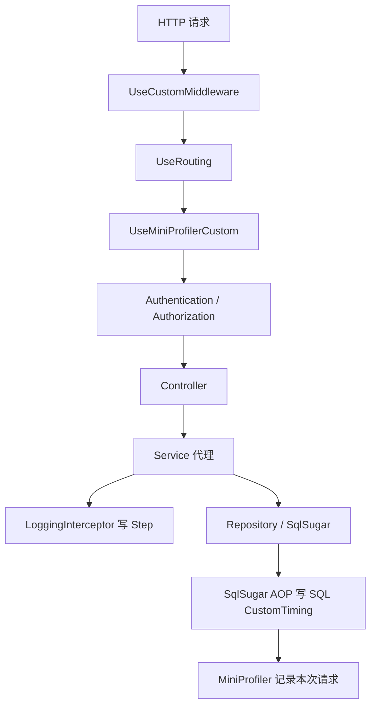

# 18 MiniProfiler 性能观测底座

## 这个概念解决什么问题

MiniProfiler 解决的是“接口慢在哪里”的问题。它把一次请求里的关键耗时记录下来，帮助区分：

- 请求总耗时慢。
- SQL 慢。
- 服务方法链路慢。
- 序列化、文件处理、锁等待或外部调用慢。

KH.WMS 已经把 MiniProfiler 接到请求管道、SqlSugar SQL 日志、AOP 日志步骤里。它是排查工具，不是业务逻辑依赖。

## 什么时候需要看

- 接口响应慢，但日志里只看到总耗时。
- 想确认慢在 SQL、Service 方法，还是请求管道。
- Swagger 或前端能调用成功，但偶发超时。
- 需要验证新增查询是否造成 N+1 或大 SQL。
- 本地能看到 profiler，部署环境看不到。

## 业务开发应该怎么用

### 排查慢接口

优先按这个顺序看：

1. 打开 MiniProfiler 页面或在页面注入条里看本次请求。
2. 看请求总耗时。
3. 展开 SQL timing，看 SQL 数量和单条耗时。
4. 看 AOP 日志步骤，确认 Service 方法进入和退出。
5. 如果 SQL 不慢但总耗时慢，再看文件处理、导入导出、序列化、锁等待、外部接口。

### 不要在业务代码里依赖 MiniProfiler

业务代码不应该写成：

```csharp
if (MiniProfiler.Current != null)
{
    // 改变业务流程
}
```

MiniProfiler 可能在生产环境关闭，也可能某些请求不采样。它只能用于观测，不应用来控制业务。

### 和日志、TraceId 一起用

MiniProfiler 适合看一次请求内部耗时；TraceId 和文件日志适合跨请求追踪、异常定位和上线后排查。

慢接口排查时，最好同时保存：

- 请求路径。
- 请求时间。
- TraceId。
- MiniProfiler 请求记录。
- 相关 SQL 或业务日志。

## 底层逻辑和实现

### 服务注册

`AddInfrastructure` 调用：

```csharp
services.AddMonitoringSetup(configuration, environment);
```

最终进入：

```csharp
MiniProfilerSetup.AddMiniProfilerCustom(services, configuration, environment);
```

配置来源是 `MiniProfiler` 节：

- `RouteBasePath`：默认 `/profiler`。
- `EnableInProduction`：生产环境是否启用。
- `TrackConnectionOpenClose`：是否跟踪连接打开关闭。
- `StackTraceLength`：堆栈跟踪长度配置。

当前存储使用 `MiniProfilerMemoryStorage`，也就是进程内内存存储。服务重启后历史 profiler 记录会丢失，多实例之间也不会共享。

### 中间件顺序

`UseCustomMiddleware` 中启用：

```csharp
app.UseRouting();
app.UseMiniProfilerCustom();
app.UseAuthentication();
app.UseAuthorization();
```

MiniProfiler 放在 Routing 之后、认证授权之前。它能观测后续进入 Controller 的请求，也能配合 SQL timing 和 AOP 步骤展示更细的调用链。

### HTML 注入

`UseMiniProfilerCustom` 会调用：

```csharp
app.UseMiniProfiler();
app.UseMiddleware<MiniProfilerInjectorMiddleware>();
```

`MiniProfilerInjectorMiddleware` 会在 HTML 响应中注入 profiler 脚本。它只处理 `text/html` 且状态码为 200 的响应。API JSON 响应不会被注入脚本，但请求数据仍可以在 profiler 存储中查看。

### SQL timing

SqlSugar AOP 中写入：

```csharp
MiniProfiler.Current.CustomTiming("SQL：", paramStr + "【SQL语句】：" + sql);
```

这意味着一次请求中的 SQL 会出现在 MiniProfiler timing 里。即使没有手动写业务 profiler step，也能看到 SQL 层耗时。

### AOP 方法步骤

`LoggingInterceptor` 会调用 `MiniProfiler.Current.Step(...)` 记录方法进入和退出。`PerformanceInterceptor` 负责统计代理方法耗时并记录性能警告日志。

要看到清晰方法链，业务 Service 必须走 DI 代理；如果服务 `WithoutInterceptor=true` 或被手动 `new` 出来，AOP 步骤不会出现。

## 真实执行链路



## 排查清单

### MiniProfiler 页面打不开

1. 确认 `MiniProfiler:RouteBasePath`，默认 `/profiler`。
2. 确认服务已启动，路由没有被反向代理拦截。
3. 确认生产环境是否允许启用：`EnableInProduction`。
4. 确认 License 是否拦截了 profiler 路径；当前 License 白名单包含 `/swagger`、`/health` 等，但不代表所有运维路径都自动放行。

### 看不到 SQL

1. 确认接口确实执行了数据库查询。
2. 确认查询走的是 SqlSugar 客户端。
3. 确认请求处在 MiniProfiler 采样范围内。
4. 确认不是后台服务或非 HTTP 场景；后台服务没有普通页面请求上下文。

### 看不到方法步骤

1. Service 是否通过接口注入。
2. Service 是否被 `[RegisteredService]` 注册。
3. Service 是否设置了 `WithoutInterceptor=true`。
4. 调用是否绕过 DI 手动 `new`。
5. 方法是否在代理对象内部自调用；内部自调用通常不会再次经过代理。

### 接口慢但 SQL 不慢

1. 看是否有大对象 JSON 序列化。
2. 看是否有文件导入导出。
3. 看是否等待锁或事务。
4. 看是否调用外部系统。
5. 看是否在循环中做多次缓存、Contract 或数据库调用。

## 常见坑

### 把 MiniProfiler 当日志系统

MiniProfiler 记录是短期观测数据，不适合当审计日志或业务日志。长期追踪仍然看 Serilog 日志和 TraceId。

### 生产环境忘记关闭或保护

MiniProfiler 会暴露请求和 SQL 细节。生产环境开启前要确认访问控制、数据脱敏和网络边界。

### 服务没走代理导致方法链缺失

如果只看到 SQL，看不到业务方法进入退出，通常是 AOP 没生效。回到 [03-依赖注入自动注册与AOP代理.md](./03-依赖注入自动注册与AOP代理.md) 和 [04-AOP拦截器与特性使用.md](./04-AOP拦截器与特性使用.md) 排查。

### 只盯单条 SQL，忽略 SQL 数量

慢接口不一定是某条 SQL 特别慢，也可能是几十次小查询累积。MiniProfiler 的 SQL 数量同样重要。

### 后台服务慢却去看请求 profiler

`BackgroundService` 不属于普通 HTTP 请求。后台任务性能要看日志、任务执行记录和显式埋点，不能完全依赖请求 MiniProfiler。
