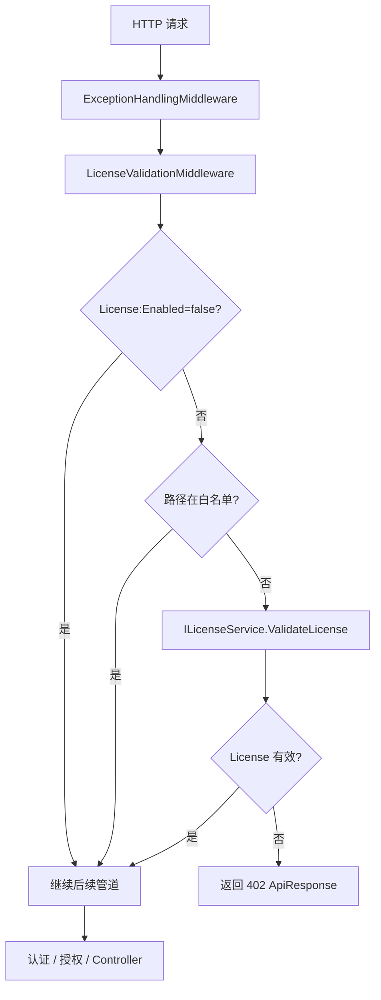

# 19 License 授权许可与运行时拦截

## 这个概念解决什么问题

License 底座解决的是“系统是否被授权运行”的问题。它和用户登录、角色权限不是一层东西：

- License 判断系统本身有没有授权。
- JWT 判断请求是谁发的。
- RBAC/权限判断这个用户能不能做某件事。

KH.WMS 把 License 做成请求管道中的中间件。License 无效时，请求在进入 Controller 前就会被拦截，并返回 HTTP 402。

这也是为什么某些接口“换用户、换角色、重新登录”仍然不通：如果响应是 402，问题不在用户权限，而在授权许可。

## 什么时候需要看

- 接口返回 402。
- 本地开发正常，部署后所有接口被拦截。
- 需要导入 License、查看机器码或恢复授权。
- 想区分 401、402、403 的含义。
- 想确认哪些路径不需要 License。
- 修改 `License:Enabled`、`License:DefaultValidDays`、`License:ValidateIntervalMinutes`。

## 业务开发应该怎么用

### 先区分三种状态码

| 状态码 | 含义 | 优先排查 |
| --- | --- | --- |
| 401 | 未认证或 token 无效 | 登录、JWT、token 过期 |
| 402 | 系统 License 无效 | License 文件、机器码、有效期、配置开关 |
| 403 | 已认证但无权限 | 角色、权限、菜单按钮、授权 Filter |

业务开发看到 402 时，不要先改权限表，也不要怀疑用户角色。

### 本地开发关闭 License

`appsettings.Development.json` 中可以关闭：

```json
{
  "License": {
    "Enabled": false
  }
}
```

这适合本地开发或测试排查。生产环境不建议关闭，否则授权许可形同虚设。

### License 白名单

License 中间件有白名单路径，常见包括：

- `/api/user/login`
- `/api/user/public-key`
- `/api/user/logout`
- `/api/license/machine-code`
- `/api/license/import`
- `/api/license/info`
- `/api/license/upload`
- `/swagger`
- `/health`
- `/healthchecks`

白名单只绕过 License，不代表绕过所有认证授权。不要把业务接口随意加进白名单。

### License 不是业务校验器

License 只判断系统授权，不负责判断订单状态、库存数量、用户权限、接口频率等业务条件。业务规则仍然应该在 Service、Contract、Validator 或权限体系里处理。

## 底层逻辑和实现

### 中间件位置

`UseCustomMiddleware` 中顺序是：

```csharp
app.UseExceptionHandling();
app.UseLicenseValidation();
...
app.UseAuthentication();
app.UseAuthorization();
app.UseEndpoints(...);
```

License 位于认证授权之前。也就是说，只要路径不在白名单并且 License 无效，请求不会进入认证授权，更不会进入 Controller。

### 默认 License 初始化

`UseCustomMiddleware` 调用 `UseLicenseValidation()` 后，会创建作用域并调用：

```csharp
licenseService.EnsureDefaultLicense();
```

`LicenseService.EnsureDefaultLicense()` 在 License 文件不存在时会：

1. 确保目录存在。
2. 如果密钥对不存在，生成 RSA 密钥对。
3. 读取机器码。
4. 使用私钥生成默认有效期 License。
5. 写入 License 文件。

默认有效天数来自 `License:DefaultValidDays`，没有配置时使用 180 天。

### License 文件和密钥文件

LicenseService 使用应用根目录下的文件：

- `System.Private.Core.dll`：License 文件。
- `System.Private.Security.dll`：公钥文件。
- `System.Private.Crypto.dll`：私钥文件。

文件名伪装成系统 DLL，是为了降低被随意翻改的概率。排查时要知道它们实际是 License 相关文件。

### 机器码

License 与机器码绑定。`GetMachineCode()` 会通过 `MachineCodeGenerator` 获取当前服务器机器码，并缓存结果。

导入 License 时，License 内容必须能被公钥验证，并且机器码与当前服务器一致。机器码不匹配时，ValidateLicense 会失败。

### 校验缓存

`ValidateLicense()` 成功后会缓存 LicenseData，缓存时间由 `License:ValidateIntervalMinutes` 控制，默认 5 分钟。

这意味着短时间内多次请求不会每次都读文件和验签。导入新 License 后，服务会更新缓存。

### 402 响应

License 无效时，中间件返回：

- HTTP StatusCode：`ResponseCode.LICENSE_REQUIRED`，即 402。
- Content-Type：`application/json; charset=utf-8`。
- Body：`ApiResponse.Fail(ResponseCode.LICENSE_REQUIRED, errorMessage)`。

前端可以根据 402 跳转授权恢复页，而不是跳登录页。

## 真实执行链路



## 排查清单

### 接口返回 402

1. 确认当前环境是否启用 License。
2. 确认请求路径是否应该在白名单里。
3. 确认 License 文件是否存在。
4. 确认公钥文件是否存在。
5. 确认当前机器码是否和 License 绑定机器码一致。
6. 确认 License 是否过期。
7. 查看日志中的 `GetValidationErrorMessage()` 对应错误。

### 本地正常，部署后 402

1. 本地是否是 Development 环境且 `License:Enabled=false`。
2. 部署环境 License 是否默认启用。
3. 部署目录中的 License 文件是否复制或重新生成。
4. 服务器机器码是否和生成 License 时一致。
5. Windows Service 运行账号是否有读写 License 文件权限。

### 导入 License 后仍失败

1. 导入接口是否命中白名单。
2. 导入的 License 内容是否完整，没有多余字符。
3. License 是否使用当前服务器机器码生成。
4. 公钥和私钥是否是一对。
5. 导入后是否查看日志确认缓存已更新。

## 常见坑

### 把 402 当成 403

402 是授权许可问题，403 是用户权限问题。两者排查方向完全不同。

### 本地关闭 License 后忘记生产环境

开发环境可以关，生产环境不应该关。上线前要确认环境配置没有把 `License:Enabled=false` 带过去。

### 随意把业务接口加入白名单

白名单路径应该只覆盖登录、公钥、License 恢复、健康检查、文档等必要入口。业务接口绕过 License 会破坏授权边界。

### 删除 License 文件后以为服务一定启动失败

当前实现会尝试生成默认 License。真正是否允许这样做，要结合部署策略和授权管理流程判断。

### 机器码变化

更换服务器、虚拟机硬件信息变化、容器环境变化，都可能导致机器码变化。License 绑定机器码时要把部署环境稳定性考虑进去。
