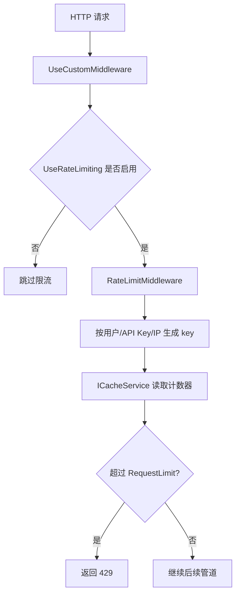

# 20 限流 RateLimit 底座

## 这个概念解决什么问题

限流解决的是“请求太频繁时保护系统”的问题。它可以防止某个用户、IP 或调用方在短时间内打爆接口、数据库或业务锁。

KH.WMS 当前有三层限流相关代码：

- `RateLimitAttribute`：声明式限流元数据。
- `RateLimitMiddleware`：请求管道级限流中间件。
- `IRateLimitService` 与滑动窗口/固定窗口/令牌桶实现：可复用的限流算法服务。

需要特别注意：当前 `AddInfrastructure` 已注册 `RateLimit` 配置，但 `UseCustomMiddleware` 中 `app.UseRateLimiting()` 是注释状态。所以默认情况下，配置不会真正拦截请求。

## 什么时候需要看

- 接口被频繁调用，需要保护。
- 前端或外部系统重复请求导致压力上升。
- 配了 `RateLimit` 但没有效果。
- 想给某些接口做不同限流策略。
- 想区分全局中间件限流和业务内限流。

## 业务开发应该怎么用

### 先确认限流是否启用

当前请求管道里是：

```csharp
//app.UseRateLimiting();
```

因此“配置了 RateLimit 但没触发 429”是符合当前代码状态的。要启用全局限流，必须先设计清楚中间件位置、配置读取方式和白名单，再打开中间件。

### 全局限流适合保护请求流量

`RateLimitMiddleware` 按客户端维度计数：

1. 优先用户 ID。
2. 其次 API Key。
3. 最后 IP。

它适合做粗粒度入口保护，例如防止匿名或外部调用方刷接口。

### 业务限流适合保护特定动作

例如登录失败次数、导入文件频率、外部回调重试、任务确认频率，往往需要结合业务 key 和状态。此时可以使用 `IRateLimitService` 或业务表记录，而不是只靠全局中间件。

### RateLimitAttribute 目前是元数据

`RateLimitAttribute` 可以标记类或方法：

```csharp
[RateLimit(10, 60, ByIp = true)]
```

但当前主请求管道没有看到读取该特性的 Filter 或 Middleware。也就是说，加了特性不代表一定生效。要让特性生效，需要有对应的拦截器、Filter 或中间件读取 EndpointMetadata。

## 底层逻辑和实现

### 配置注册

`AddInfrastructure` 调用：

```csharp
services.AddRateLimiting(configuration);
```

`AddRateLimiting` 绑定：

```csharp
services.Configure<RateLimitOptions>(configuration.GetSection("RateLimit"));
```

配置节示例：

```json
"RateLimit": {
  "RequestLimit": 100,
  "WindowSeconds": 60,
  "KeyPrefix": "ratelimit"
}
```

### 当前中间件未启用

`UseCustomMiddleware` 中保留了调用点：

```csharp
//app.UseRateLimiting();
```

所以当前不会因为 `RateLimit` 配置自动返回 429。

### 中间件计数逻辑

`RateLimitMiddleware` 会生成 key：

```csharp
var clientId = GetClientId(context);
var key = $"{_options.KeyPrefix}:{clientId}";
```

然后从 `ICacheService` 里取计数器，计数超过 `RequestLimit` 时返回 429。

当前实现里的计数器依赖缓存，但窗口过期逻辑在 `GetOrCreate` 中没有显式设置过期时间。启用前应确认缓存过期策略，否则计数可能不按窗口重置。

### 配置读取注意点

`AddRateLimiting` 注册的是 `IOptions<RateLimitOptions>`，但当前 `UseRateLimiting()` 扩展方法是：

```csharp
public static IApplicationBuilder UseRateLimiting(this IApplicationBuilder app, RateLimitOptions? options = null)
{
    options ??= new RateLimitOptions();
    return app.UseMiddleware<RateLimitMiddleware>(options);
}
```

也就是说，直接打开 `app.UseRateLimiting()` 时会传入新的默认配置，而不是自动使用 `appsettings.json` 中绑定的 Options。真正启用前，需要修正为从 `IOptions<RateLimitOptions>` 读取，或显式传入配置对象。

### 三种算法服务

`KH.WMS.Core.Security.RateLimiting` 提供：

- `SlidingWindowRateLimiter`：记录窗口内每次请求时间，精度高，内存占用更高。
- `FixedWindowRateLimiter`：按固定时间段计数，实现简单，窗口边界可能有突刺。
- `TokenBucketRateLimiter`：按速率补充令牌，适合平滑突发请求。

这套算法服务目前和中间件不是同一个实现路径。中间件使用的是简单计数器；算法服务适合后续做特性级或业务级限流时复用。

## 真实执行链路



## 排查清单

### 配了 RateLimit 没效果

1. 确认 `UseCustomMiddleware` 中 `app.UseRateLimiting()` 是否仍然注释。
2. 确认中间件是否读取了配置文件中的 Options。
3. 确认请求是否经过后端，而不是被前端、代理或静态资源直接处理。
4. 确认 key 维度是否符合预期：用户、API Key、IP。
5. 确认缓存计数是否会按窗口过期。

### 误触发 429

1. 确认是否多个用户共用同一个 IP。
2. 确认反向代理后 `RemoteIpAddress` 是否真实。
3. 确认用户 ID claim 是否存在。
4. 确认 `RequestLimit` 和 `WindowSeconds` 是否适合当前业务。
5. 确认是否把静态资源、Swagger、健康检查也纳入全局限流。

### 想给单个接口限流

1. 先不要只加 `RateLimitAttribute` 就认为生效。
2. 确认是否已有 Filter 或中间件读取该特性。
3. 如果没有，需要新增读取 EndpointMetadata 的执行链。
4. 对登录、导入、外部回调这类场景，优先设计业务 key 和错误提示。

## 常见坑

### 只注册服务，不挂中间件

`AddRateLimiting` 不会拦截请求。真正拦截要进入请求管道。

### 打开中间件但没读 appsettings

当前扩展方法默认创建 `new RateLimitOptions()`。启用前要确认配置绑定确实被中间件使用。

### 把全局限流当成业务幂等

限流只能减少频率，不能保证业务不重复。任务确认、库存扣减、外部回调仍然需要状态复核和幂等设计。

### 反向代理下按 IP 限流不准

如果部署在代理后，`RemoteIpAddress` 可能是代理地址。需要配合转发头策略，否则所有用户可能共享同一个限流 key。

### 加了 RateLimitAttribute 但没有效果

特性只是元数据。没有执行链读取它，它就不会产生行为。

## 继续阅读

- [底层机制索引](/backend/后端底层概念/README)
- [后端 V3 教程](/backend/后端开发指引V3教程/README)
- [后端排错与日志追踪](/backend/KH.WMS后端排错与日志追踪指引)
