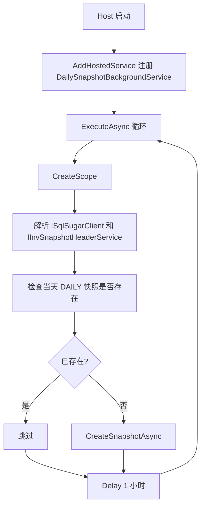

# 21 后台服务作业与无请求上下文

## 这个概念解决什么问题

后台服务解决的是“不由 HTTP 请求直接触发，但需要跟随应用进程运行”的任务，例如：

- 定时生成每日库存快照。
- 定期清理日志。
- 轮询外部系统。
- 后台补偿或重试。

KH.WMS 当前主线注册了 `DailySnapshotBackgroundService`。它每小时检查一次当天是否已有 DAILY 快照，如果没有就自动创建。

理解后台服务最重要的一点：它没有普通 HTTP 请求上下文。也就是说，后台服务里不能假设一定有当前用户、请求路径、TraceId、前端 token 或 Controller 生命周期。

## 什么时候需要看

- 新增定时任务或后台轮询。
- 排查每日库存快照没有生成。
- 在后台任务里注入 Service 或 DbContext 出错。
- 后台任务里拿不到当前用户。
- 服务启动后 CPU、数据库或日志异常增长。
- 想判断任务该放 Web 进程内，还是独立 worker/队列。

## 业务开发应该怎么用

### 后台服务适合轻量、可重复、可观察的任务

适合放在 Web Host 内的任务：

- 低频。
- 单实例运行。
- 失败可重试。
- 不要求严格分布式调度。
- 不需要长时间阻塞启动。

不适合直接放 Web Host 内的任务：

- 高并发消费队列。
- 多实例必须严格只执行一次。
- 耗时很长且不可中断。
- 失败会造成严重业务损失但没有补偿机制。

### 注入 Scoped 服务要创建作用域

`BackgroundService` 本身是单例生命周期。不能直接把请求级或 Scoped 服务长期保存在字段里。

正确做法是每次执行任务时创建 scope：

```csharp
using var scope = serviceProvider.CreateScope();
var db = scope.ServiceProvider.GetRequiredService<ISqlSugarClient>();
var snapshotService = scope.ServiceProvider.GetRequiredService<IInvSnapshotHeaderService>();
```

`DailySnapshotBackgroundService` 就是这样做的。

### 必须支持取消

后台任务要尊重 `CancellationToken`：

- while 循环判断 `stoppingToken.IsCancellationRequested`。
- `Task.Delay` 传入 `stoppingToken`。
- 数据库和业务服务调用能传 token 时尽量传。
- 捕获 `OperationCanceledException` 时正确退出。

### 后台服务中的用户上下文

后台任务没有登录用户。`IUserContext.UserId`、`UserName` 可能为空。写审计字段时要接受系统用户、空用户或明确的“系统自动生成”备注。

例如每日快照传入操作描述：

```csharp
"系统自动生成"
```

业务代码不要在后台任务中强依赖当前 HTTP 用户。

## 底层逻辑和实现

### 注册位置

`Program.cs` 中注册：

```csharp
builder.Services.AddHostedService<DailySnapshotBackgroundService>();
```

ASP.NET Core Host 启动后会调用后台服务的 `ExecuteAsync`。

### DailySnapshotBackgroundService 主循环

后台服务逻辑：

1. 启动后进入 while 循环。
2. 调用 `CheckAndCreateDailySnapshotAsync`。
3. 如果当天已有 DAILY 快照，跳过。
4. 如果不存在，调用 `IInvSnapshotHeaderService.CreateSnapshotAsync` 创建。
5. 等待一小时。
6. 重复检查，直到服务停止。

### 幂等边界

每日快照使用“当天是否已有 DAILY 快照”作为幂等检查：

```csharp
var exists = await db.Queryable<InvSnapshotHeader>()
    .Where(h => h.SnapshotType == "DAILY" && h.SnapshotDate == today)
    .AnyAsync();
```

这能避免同一进程内每小时重复生成。但如果未来部署多实例，还需要数据库唯一约束、分布式锁或独立调度器来保证多实例不重复执行。

### 异常处理

后台服务 catch 普通异常并写日志，然后继续下一轮。这样一次失败不会导致整个后台循环退出。

但也要注意：持续失败会每小时打一条错误日志，并且任务一直未完成。上线后应监控错误日志或补充任务执行记录。

### 和作业配置表的关系

仓库里有 `CfgJobDefinition`、`CfgJobTrigger`、`LogJobExecution` 等配置/日志实体，但当前 `DailySnapshotBackgroundService` 是直接注册的 HostedService，不是从这些作业表动态调度。

所以不要误以为在作业定义页面配了任务，`DailySnapshotBackgroundService` 就会自动读取。两者目前是不同机制。

## 真实执行链路



## 排查清单

### 每日快照没生成

1. 确认服务进程是否一直运行。
2. 确认 `DailySnapshotBackgroundService` 是否注册。
3. 查看启动日志中后台服务是否启动。
4. 查看错误日志中是否有快照检查失败。
5. 确认当天是否已有 `SnapshotType=DAILY` 的记录。
6. 确认 `CreateSnapshotAsync` 内部是否失败并返回错误。
7. 确认服务器时间和业务日期是否符合预期。

### 后台服务注入失败

1. 不要直接在构造函数注入 Scoped 服务并长期持有。
2. 使用 `IServiceProvider.CreateScope()`。
3. 确认目标 Service 已注册。
4. 确认目标 Service 没有依赖 HTTP-only 上下文。

### 后台服务重复执行

1. 是否部署了多个服务实例。
2. 是否缺少数据库唯一约束。
3. 幂等检查是否和实际业务唯一键一致。
4. 是否需要分布式锁或独立调度器。

### 停服务很慢

1. 循环中是否尊重 `stoppingToken`。
2. `Task.Delay` 是否传入取消令牌。
3. 是否有不可取消的长时间同步阻塞。
4. 是否在停止时等待外部系统无超时调用。

## 常见坑

### 在后台服务里假设有当前用户

后台任务通常没有 `HttpContext`。审计字段要允许系统自动操作语义。

### 把 Web Host 当完整任务调度平台

HostedService 适合轻量任务。复杂调度、分布式任务、任务补偿和可视化执行历史，应该单独设计调度底座。

### 没做幂等

后台任务可能因为重启、异常重试、多实例而重复执行。每个写入任务都要先想幂等键。

### 吞异常但没有监控

catch 后继续运行是对的，但不能只写 debug。关键任务失败要能从日志、告警或任务记录中看到。

### 作业配置表和 HostedService 混淆

有作业定义实体，不代表当前任务由作业引擎调度。看注册入口，才能判断真实执行方式。
