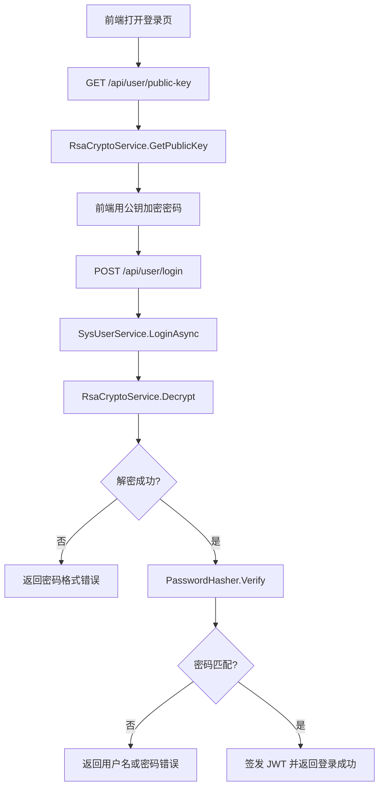

# 22 登录加密与密码哈希

## 这个概念解决什么问题

登录加密与密码哈希解决的是“密码在传输、存储、校验过程中不要明文暴露”的问题。

KH.WMS 当前登录链路大致是：

1. 前端请求 `/api/user/public-key` 获取 RSA 公钥。
2. 前端用公钥加密密码。
3. 后端 `IRsaCryptoService` 解密登录密码。
4. 后端用 `IHashService.Verify` 校验明文密码和数据库中的哈希。
5. 校验通过后签发 JWT。

这条链路里有两个不同概念：

- RSA 加密：保护传输中的登录密码。
- 密码哈希：保护数据库中保存的密码。

它们不能互相替代。

## 什么时候需要看

- 登录失败，提示密码格式错误或用户名密码错误。
- 前端加密后后端解密失败。
- 新增用户、重置密码、修改密码。
- 想确认数据库里为什么不是明文密码。
- 排查登录性能异常。
- 想区分 RSA、AES、PBKDF2、MD5、SHA256 的用途。

## 业务开发应该怎么用

### 前端每次按当前公钥加密

登录前先调用：

```http
GET /api/user/public-key
```

拿到公钥后再加密密码并提交：

```http
POST /api/user/login
```

当前 `RsaCryptoService` 是进程内单例，密钥对在服务启动时生成并保存在内存中。服务重启后公钥可能变化，因此前端不要长期缓存旧公钥。

### 后端不要明文保存密码

新增用户、修改密码、重置密码时，使用：

```csharp
_hashService.Hash(password)
```

登录校验时，使用：

```csharp
_hashService.Verify(password, user.Password)
```

不要直接比较明文，也不要把前端传来的 RSA 密文直接存库。

### 不要用 MD5 做密码

代码里有 `Md5Hasher` 和 `Sha256Hasher` 实现，但当前注册到 `IHashService` 的是 `PasswordHasher`。密码应使用带随机盐和迭代的 PBKDF2，而不是 MD5 或普通 SHA256。

### RSA 解密失败和密码错误要区分

`SysUserService.LoginAsync` 会先解密 RSA 密文。解密失败通常说明：

- 前端没有用当前公钥加密。
- 密文格式被截断或转义。
- 服务重启后前端仍用旧公钥。
- 加密 padding 不匹配。

解密成功但 `Verify` 失败，才是用户名或密码不匹配。

## 底层逻辑和实现

### 公钥接口

`UserController` 暴露：

```csharp
[HttpGet("public-key"), AllowAnonymous]
public ApiResponse GetPublicKey()
{
    return ApiResponse.Ok(_rsaCryptoService.GetPublicKey());
}
```

该接口允许匿名访问，并且在 License 白名单中，保证未登录用户可以先拿到公钥。

### RSA 解密服务

`RsaCryptoService`：

- 注册为 `IRsaCryptoService`。
- 生命周期是 Singleton。
- 构造函数里创建 2048 位 RSA。
- `GetPublicKey()` 返回 PKCS#1 PEM 公钥。
- `Decrypt()` 使用 `RSAEncryptionPadding.Pkcs1` 解密。

这套 RSA 是登录密码传输专用。它和 License 的 RSA 签名验签不是同一套服务。

### 密码哈希服务

`PasswordHasher` 注册为 `IHashService`。它使用：

- 随机盐：16 bytes。
- 哈希长度：32 bytes。
- 算法：PBKDF2 + SHA256。
- 迭代次数：10000。
- 输出：`Base64(Salt + Hash)`。

校验时会从数据库中的 Base64 字符串拆出盐，再用同样参数计算哈希并逐字节比较。

### 登录服务链路

`SysUserService.LoginAsync` 主要步骤：

1. 按用户名查用户。
2. 用 `_rsaCryptoService.Decrypt(loginDTO.Password)` 解密密码。
3. 解密失败时返回密码格式错误。
4. 用 `_hashService.Verify(password, user.Password)` 校验。
5. 校验失败返回用户名或密码错误。
6. 校验通过后更新登录信息并签发 token。

### 新增、修改、重置密码

同一个 Service 中：

- 新增用户时，如果没有传密码，读取默认密码，再 `_hashService.Hash(...)`。
- 修改用户时，如果传了新密码，重新 Hash。
- 重置密码时，把默认密码 Hash 后写回，并更新 `PasswordUpdateTime`。

## 真实执行链路



## 排查清单

### 登录提示密码格式错误

1. 前端是否先获取了当前公钥。
2. 是否使用当前公钥加密，而不是旧公钥。
3. 服务是否刚重启导致公钥变化。
4. 密文是否完整传到后端。
5. 前端加密 padding 是否和后端 `Pkcs1` 一致。
6. 请求体字段名是否是 `password`，而不是 `Password`。

### 登录提示用户名或密码错误

1. 用户名是否存在。
2. 用户状态是否允许登录。
3. 数据库中的密码是否是 `PasswordHasher.Hash` 生成的格式。
4. 最近是否重置过密码。
5. 默认密码配置是否符合预期。
6. 是否误把明文或 RSA 密文写入了 `SysUser.Password`。

### 登录很慢

1. 看 `PasswordHasher.Verify` 是否被性能日志标记。
2. 看用户查询是否慢。
3. 看是否有大量并发登录。
4. PBKDF2 本身是有意设计为相对耗时，不能简单改成 MD5。
5. 如果耗时异常高，先做性能测量，再评估迭代次数或服务器资源。

### 重置密码后仍无法登录

1. 重置接口是否成功返回默认密码。
2. 数据库是否写入新哈希。
3. 前端是否用公钥加密新密码。
4. 用户是否有其他状态限制。
5. JWT 旧 token 是否仍在前端缓存导致误判。

## 常见坑

### 把 RSA 密文存进数据库

RSA 密文每次可能不同，不能用来做密码存储。数据库只保存哈希。

### 把哈希当加密

哈希不能解密。忘记密码只能重置，不能从数据库还原原密码。

### 长期缓存登录公钥

当前登录 RSA 密钥是进程内单例生成。服务重启后旧公钥可能失效，前端应在登录前获取新公钥。

### 用 MD5 或 SHA256 替代 PasswordHasher

密码哈希需要随机盐和迭代。MD5/SHA256 这类普通摘要不适合保存用户密码。

### 混淆登录 RSA 和 License RSA

登录 RSA 用于传输密码，License RSA 用于授权文件签名验签。两套服务、文件和生命周期不同。
