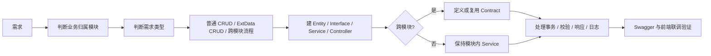

# 第 0 章 这份文档怎么读 教程

> 来源: KH.WMS后端开发指引 V3.0.md。本文把原章节单独抽出来，并补充“干什么、什么时候看、怎么执行”，用于新人培训和日常开发查阅。

## 这一章是干什么的

建立阅读顺序和后端开发的中心思想，先知道 KH.WMS 后端不是随便找相似代码复制，而是按模块、需求类型、Contract、事务和校验来落地。

## 什么时候需要看

新人第一次接触后端开发指引，或者接到需求但还不知道该从哪一章开始看时。

## 怎么执行

- 先看中心思想，记住 Controller、Service、Contract、Core/Config/Algorithms 各自负责什么。
- 按培训顺序选择后续章节，不需要一次读完所有技术细节。
- 根据自己当前任务，在阅读建议表里定位要看的章节组合。

## 执行后怎么验证

能说清楚“需求归属模块、需求类型、是否跨模块、是否需要事务或校验”这四个判断点。

## 下一步看哪里

写新接口看第 6、7、8 章；做跨模块流程看第 10、11 章。

---


### 0.1 后端开发的中心思想

KH.WMS 后端开发的中心思想是:业务代码要落在正确的业务模块里,模块之间只通过稳定契约协作,通用技术能力交给底座。

一条需求从理解到落代码,按这个顺序走:



最容易犯的错误是先搜 Controller,看到相似代码就复制。这个项目更推荐先回答四个问题:

1. **这件事属于谁**  
   物料、客户、供应商、容器属于 `BaseDataModule`;入库单、组盘、上架请求属于 `InboundModule`;库存生成、锁定、扣减属于 `InventoryModule`;任务创建和完成属于 `TaskModule`。

2. **这件事是不是跨模块流程**  
   只在本模块内完成,写本模块 Service。  
   需要让别的模块调用本模块能力,由本模块提供 Contract。  
   本模块要调用别的模块能力,只注入对方 Contract,不要直接引用对方 `Services/`。

3. **它是普通表维护还是动态扩展字段维护**  
   普通表维护用 `CrudController<TEntity>`。  
   实体有 `ExtData`,并且前端需要保存/回显动态字段时,用 `ExtDataCrudController<TEntity>`。

4. **有没有多表写入、可配置校验、并发入口**  
   多表写入要有事务。  
   可组合的规则可以抽成 Validator。  
   WCS/PDA/批量动作要考虑重复提交、状态复核和锁。

核心原则可以浓缩成一句话:

```text
Controller 做入口,Service 做业务,Contract 做跨模块门面,Core/Config/Algorithms 做技术底座。
```

### 0.2 这份文档的培训顺序

本文按培训讲解顺序组织,不是按代码目录顺序堆材料。推荐从前往后读:

- **先认地图**:第 1 章认识启动项目、技术底座和业务模块。
- **再认底座**:第 2 到第 5 章讲启动配置、请求链路、职责边界和服务注册。
- **再看 CRUD**:第 6 到第 9 章讲一个完整 CRUD 怎么跑、基类有什么能力、标准开发步骤怎么落地。
- **最后讲协作和扩展**:第 10 到第 11 章讲跨模块 Contract、事务、校验和流程型接口。

如果你正在写一个新接口,优先看第 6、7、8 章和附录 B。  
如果你在排查“为什么 Swagger 看不到接口”“为什么 DI 注入失败”“为什么 ExtData 没保存”“为什么校验器没执行”,先看第 2、3、5、7 章。

阅读建议:

| 场景 | 先看哪里 | 目标 |
| --- | --- | --- |
| 新人第一次培训 | 第 1 章 -> 第 2 章 -> 第 3 章 | 建立后端整体地图和请求链路概念 |
| 新增普通维护页 | 第 6 章 + 第 7 章 + 第 8 章 + 附录 B.1 | 能写出 Entity、Service、Controller,并知道底层怎么执行 |
| 新增动态字段维护页 | 第 7.6 章 + 第 9 章 + 附录 B.2 | 能正确选择并使用 `ExtDataCrudController` |
| 新增跨模块流程 | 第 10 章 + 第 11 章 + 附录 B.3 | 能判断 Contract、事务和流程边界 |
| 新增可配置校验 | 第 11 章 + 附录 B.4 | 能从 0 写一个 `IValidator` 并让 AOP 正确执行 |
| DI 注入失败 | 第 5 章 + 第 2.3 章 + 附录 C | 能定位 `ServiceType`、接口代理和拦截器问题 |

### 0.3 本文不展开的技术底座

以下项目是技术底座,本文只讲业务开发时怎么使用,不作为业务模块逐讲:

| 项目 | 在业务开发中的定位 |
| --- | --- |
| `KH.WMS.Core` | Web、DI、AOP、过滤器、响应、异常、仓储、事务、CRUD 基类 |
| `KH.WMS.Config` | 配置层,提供扩展字段、单据状态机、全局配置、编码规则等能力 |
| `KH.WMS.Algorithms` | 策略/算法底座,如上架策略、拣选策略、货位分配策略 |
| `KH.WMS.Common` | 少量纯公共工具,默认慎用 |
| `KH.WMS.QuartzJob` | 预留定时任务宿主,当前不是主要开发入口 |

这里要特别注意 `KH.WMS.Config`:它有 Controller、Service、Contract,也会被启动项目扫描,但它不是业务模块教程模板。业务模块章节只展示 `BaseDataModule`、`InboundModule`、`InventoryModule`、`OutboundModule`、`SystemModule`、`TaskModule`、`WarehouseModule`、`DashboardModule`。

---


## 继续阅读

- [后端 V3 教程目录](/backend/后端开发指引V3教程/README)
- [后端架构设计思路](/backend/架构设计/KH.WMS后端架构设计思路)
- [底层机制索引](/backend/后端底层概念/README)
