# 第 2 章 后端基础配置与启动机制 教程

> 来源: KH.WMS后端开发指引 V3.0.md。本文把原章节单独抽出来，并补充“干什么、什么时候看、怎么执行”，用于新人培训和日常开发查阅。

## 这一章是干什么的

说明后端服务如何启动，Controller、DI、AOP、数据库、响应、日志、认证、缓存、事务等基础能力在哪里注册。

## 什么时候需要看

服务启动失败、Swagger 看不到接口、DI 注入失败、数据库连不上、响应格式或 TraceId 不对时。

## 怎么执行

- 从 `Program.cs` 和启动配置开始看，确认基础设施注册顺序。
- 检查 Controller 扫描、Autofac 注册、AOP 拦截器和 SqlSugar 配置。
- 按问题类型定位到认证、缓存、事务、JSON、静态文件、CORS 或限流配置。

## 执行后怎么验证

能启动后端并访问 Swagger；新增 Controller 能被扫描；Service 能通过 DI 注入。

## 下一步看哪里

启动和注册机制看懂后，读第 3 章理解一次请求经过哪些环节。

---

## 原章节内容

# 第 2 章 后端基础配置与启动机制

本章把后端基础配置画成一张“启动地图”。业务开发通常不需要天天改这些配置,但一旦遇到接口不显示、请求进不来、返回格式异常、事务不生效、跨域或权限问题,都要能快速定位入口。

先看总图:

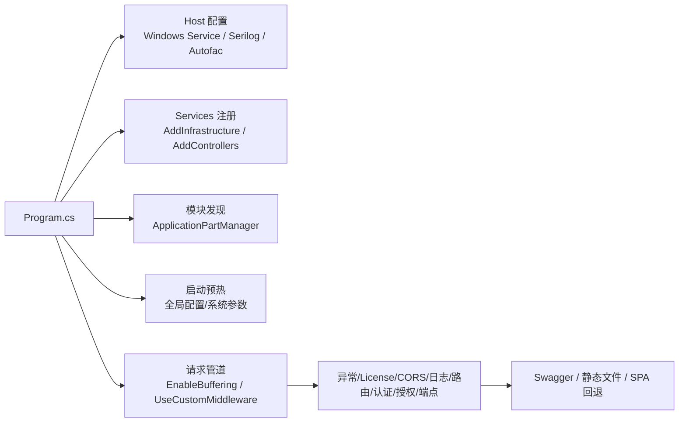

基础配置先按这张表建立全局印象:

| 配置块 | 主要入口 | 影响什么 | 常见排查场景 | 平时是否常改 |
| --- | --- | --- | --- | --- |
| Host 配置 | `Program.cs` | Windows Service、日志、Autofac 容器 | 服务启动方式不对、日志不输出、DI 容器异常 | 很少 |
| 基础设施注册 | `AddInfrastructure` | 数据库、缓存、认证、日志、Swagger、CORS、限流、HTTP Client | 数据库连不上、认证不生效、跨域问题 | 偶尔 |
| MVC / Controller | `AddControllers`、`ApplicationPartManager` | Controller 扫描、JSON 序列化、全局过滤器 | Swagger 看不到接口、返回格式不对 | 偶尔 |
| 模块自动注册 | `ServiceExtensions`、`ServiceRegistrar` | Service / Contract / Validator 自动注入 | 构造函数注入失败、AOP 不执行 | 经常排查 |
| 请求管道 | `UseCustomMiddleware` | 异常、License、CORS、日志、路由、认证授权、端点映射 | 请求进不来、401/403、跨域、异常格式 | 偶尔 |
| 数据访问 | `SqlSugarDbContext`、`RepositoryBase`、`UnitOfWork` | 连接、仓储、事务、配置库路由 | 数据没写入、事务没回滚、配置表读错库 | 经常排查 |
| 统一响应和日志 | `ApiResponse`、`GlobalExceptionFilter`、`TraceIdResultFilter` | 响应结构、TraceId、异常日志 | 前端报错无法定位、响应没有 TraceId | 经常排查 |
| 前端和静态资源 | `UseStaticFiles`、`MapFallbackToFile` | 上传文件访问、SPA 刷新回退 | 附件 404、刷新前端路由 404 | 偶尔 |

排查时不要从所有配置一起看,按现象走:

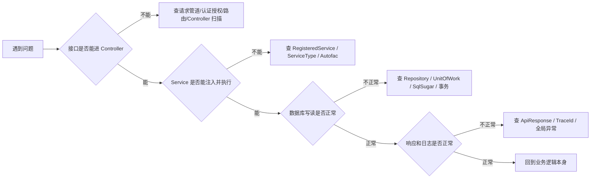

### 2.1 启动入口和基础设施注册

后端启动入口:

```text
KH.WMS/KH.WMS.Server/Program.cs
```

主要做这些事:

- 注册 Windows Service 名称。
- 使用 Autofac 作为 DI 容器。
- 注册 `ServiceExtensions` 和策略模块。
- 注册 `HttpContextAccessor`。
- 调用 `AddInfrastructure(builder.Configuration, builder.Environment)`。
- 注册 MVC Controller、JSON 配置、全局异常过滤器、TraceId 结果过滤器。
- 注册模块 Controller 程序集。
- 预热全局配置和系统参数。
- 启用请求体缓冲。
- 调用 `UseCustomMiddleware(app.Environment)`。
- 启用 Swagger、静态文件和 SPA 回退。

基础设施统一入口:

```text
KH.WMS/KH.WMS.Core/Setup/ServiceCollectionSetup.cs
```

中间件统一入口:

```text
KH.WMS/KH.WMS.Core/Setup/MiddlewareSetup.cs
```

启动阶段可以按三段记:

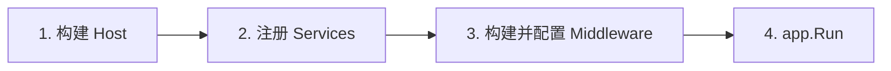

其中:

- Host 阶段决定日志、Autofac、Windows Service。
- Services 阶段决定 DI、数据库、认证、缓存、Swagger、Controller。
- Middleware 阶段决定请求进来后先过谁、后过谁。

`Program.cs` 里几段关键代码要知道它们分别管什么:

| 代码位置/调用 | 作用 | 出问题时表现 |
| --- | --- | --- |
| `UseWindowsService` | 允许后端作为 Windows 服务运行 | 本机调试一般不受影响,部署成服务时要看服务名和权限 |
| `AddSerilog` | 接入 Serilog 日志 | 日志文件不生成、日志级别不对时查这里和日志配置 |
| `UseServiceProviderFactory(new AutofacServiceProviderFactory())` | 使用 Autofac 替代默认 DI 容器 | Autofac 注册异常、AOP 代理异常时查这里 |
| `RegisterModule(new ServiceExtensions())` | 扫描注册带特性的服务 | `[RegisteredService]` 不生效、Service 注入失败时查这里 |
| `AddInfrastructure(...)` | 注册数据库、认证、缓存、Swagger、CORS 等基础设施 | 基础设施能力缺失时查这里 |
| `AddControllers(...)` | 注册 MVC、全局异常过滤器、TraceId 过滤器、JSON 配置 | Controller 行为、响应格式、JSON 字段名异常时查这里 |
| `ConfigureApplicationPartManager(...)` | 手动加入模块 Controller 程序集 | Swagger 看不到模块接口时查这里 |
| `EnableBuffering()` | 允许请求体重复读取 | ExtData 保存失败、异常日志没有请求体时查这里 |
| `UseCustomMiddleware(...)` | 装配主要请求管道 | 请求进不来、认证授权、跨域、异常处理时查这里 |
| `MapFallbackToFile("index.html")` | SPA 前端路由回退 | 刷新前端页面 404 时查这里 |

### 2.2 Controller 扫描配置

MVC 默认不一定能发现所有模块 Controller,所以 `Program.cs` 手动添加模块程序集:

```text
程序集名称包含 .Modules.
或程序集名称等于 KH.WMS.Config
```

这就是为什么业务模块项目命名要遵守:

```text
KH.WMS.Modules.{Name}Module
```

`KH.WMS.Config` 是技术底座特例,不要照着它新建业务模块。

扫描关系图:

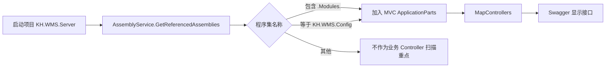

如果你新建了模块项目,但 Swagger 没看到 Controller,先检查项目名和引用,再检查路由。

### 2.3 DI 与 Autofac 配置

Autofac 注册入口:

```text
KH.WMS/KH.WMS.Core/DependencyInjection/ServiceRegistrar.cs
```

常用标记:

- `[RegisteredService]`:注册为接口服务。
- `[SelfRegisteredService]`:注册为自身类型。
- `ServiceType`:显式指定注册到哪个接口。
- `Lifetime`:指定生命周期,默认 Scoped。
- `WithoutInterceptor`:是否跳过 AOP 拦截器。

业务 Service 推荐模板:

```csharp
[RegisteredService(ServiceType = typeof(IXxxService))]
public class XxxService(...) : CrudService<XxxEntity>(...), IXxxService
{
}
```

Contract 实现推荐模板:

```csharp
[RegisteredService(ServiceType = typeof(IXxxContract))]
public class XxxContract(...) : IXxxContract
{
}
```

Validator 推荐模板:

```csharp
[RegisteredService(WithoutInterceptor = true, ServiceType = typeof(IValidator))]
public class XxxValidator : IValidator
{
}
```

注册过程可以这样理解:

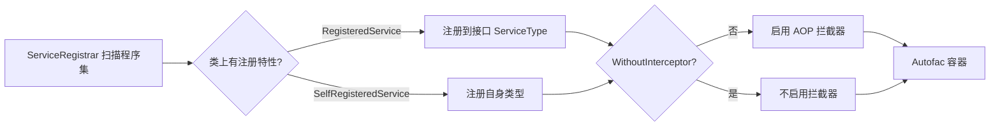

排查 DI 失败时,看异常里缺的是哪个接口,再反查有没有实现类注册到这个接口。

### 2.4 AOP 拦截器配置

当前注册的拦截器:

```text
LoggingInterceptor
CachingInterceptor
ConfigValidationInterceptor
ExceptionInterceptor
PerformanceInterceptor
```

拦截器只会作用在被 Autofac 代理的服务调用上。业务代码要按接口注入:

```csharp
public class XxxController(IXxxService service) : ControllerBase
{
}
```

不要在业务代码里手动 new Service。不要给普通业务 Service 设置 `WithoutInterceptor = true`。

拦截器大致职责:

| 拦截器 | 作用 | 业务开发注意 |
| --- | --- | --- |
| `LoggingInterceptor` | 记录方法调用、参数、返回值 | 敏感信息不要随意放入参数 |
| `CachingInterceptor` | 根据缓存特性处理缓存 | 写操作和频繁变化查询慎用缓存 |
| `ConfigValidationInterceptor` | 执行 `[ConfigValidation]` 对应校验器 | 目标 Service 不能关闭拦截器 |
| `ExceptionInterceptor` | 统一捕获服务层异常 | 不要吞异常后返回成功 |
| `PerformanceInterceptor` | 记录方法耗时 | 慢接口可结合日志和 MiniProfiler 查 |

如果校验器不执行,优先看:

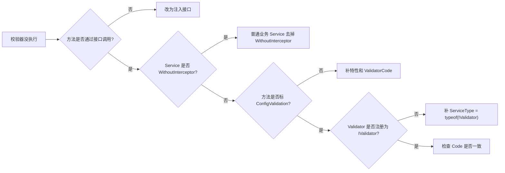

### 2.5 数据库与 SqlSugar 配置

数据库相关入口:

```text
KH.WMS/KH.WMS.Core/Database/SqlSugar/
KH.WMS/KH.WMS.Core/Database/Repositories/
KH.WMS/KH.WMS.Core/Database/UnitOfWorks/
```

核心类型:

- `SqlSugarDbContext`:数据库上下文,支持事务嵌套。
- `RepositoryBase<T,TKey>`:统一仓储。
- `IRepository<T,TKey>`:仓储接口。
- `UnitOfWork`:工作单元。
- `IUnitOfWork`:事务接口。
- `[ConfigDb]`:配置库路由标记。

配置表实体如果标了 `[ConfigDb]`,仓储会路由到配置库连接。业务表不要随便加这个标记。

数据访问分层图:

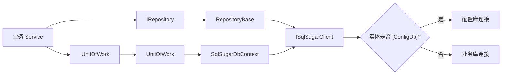

事务嵌套可以这样理解:

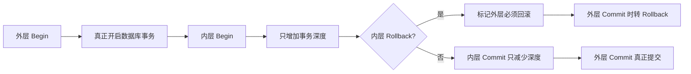

### 2.6 统一响应、异常和错误码

统一响应类型:

```text
KH.WMS/KH.WMS.Core/Api/Responses/ApiResponse.cs
```

异常处理入口:

```text
KH.WMS/KH.WMS.Core/Filters/Exception/GlobalExceptionFilter.cs
KH.WMS/KH.WMS.Core/Middlewares/ExceptionHandlingMiddleware.cs
```

常见异常:

- `BusinessException`:业务异常。
- `ValidationException`:数据校验失败。
- `NotFoundException`:资源不存在。
- `UnauthorizedAccessException`:未授权。

开发建议:

- Controller 不要到处写 `try/catch`。
- 可预期业务失败可以返回 `ApiResponse.Fail` 或 `ServiceResult.Fail`。
- 真正异常让全局异常处理兜底。
- 不要吞异常后返回成功。

异常响应链路:

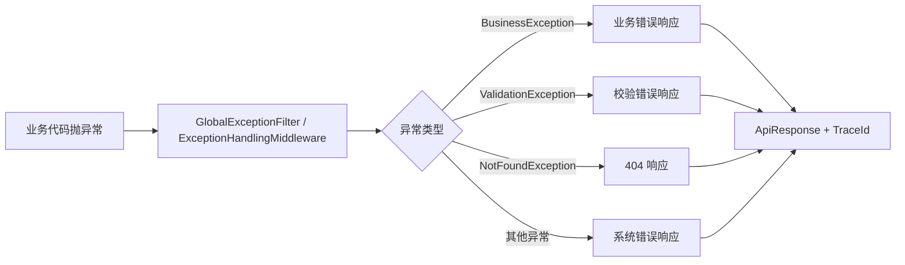

Controller 里少写 `try/catch` 的原因是:你自己 catch 了异常又没有正确转换,全局异常处理就拿不到完整上下文,日志和 TraceId 也可能断。

### 2.7 TraceId 与日志配置

TraceId 注入:

```text
KH.WMS/KH.WMS.Core/Filters/Result/TraceIdResultFilter.cs
```

日志底座:

```text
KH.WMS/KH.WMS.Core/Logging/
```

异常日志会记录:

- HTTP 方法。
- 请求路径。
- TraceId。
- 用户信息。
- QueryString。
- 脱敏后的 JSON 请求体。
- 异常类型和堆栈。
- `ErrorLogScope` 中的调用链。

排查线上问题时,先拿前端响应里的 `traceId`,再查对应时间段日志。

日志排查路径:

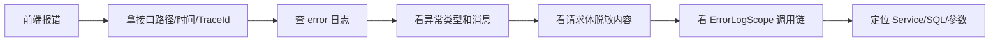

如果没有 TraceId,先确认接口是否返回 `ApiResponse`。文件下载、静态资源这类响应不一定有 TraceId,但业务 JSON 接口应尽量统一。

### 2.8 认证授权配置

认证授权在基础设施和中间件里启用:

```text
AddAuthenticationSetup
ApiAuthorizeFilter
UseAuthentication
UseAuthorization
```

排查接口 401 / 403 时按顺序看:

1. 前端是否带 Token。
2. Token 是否过期。
3. 路由是否需要权限。
4. 用户是否分配角色和权限。
5. `ApiAuthorizeFilter` 是否拦截。

登录、密码、Token 相关能力在系统模块和 Core 认证组件里,不要在业务模块里自行实现一套认证。

认证授权在请求管道里的位置:

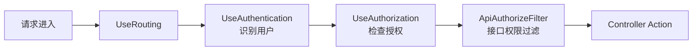

401 通常是“你是谁”没有识别,403 通常是“你有没有权限”不通过。

### 2.9 缓存配置

缓存入口:

```text
AddMemoryCache
AddCacheSetup
CachingInterceptor
[Cache]
```

`CrudController` 中很多写操作和分页查询都显式标记:

```csharp
[Cache(Enable = false)]
```

原因是维护页数据变化频繁,默认不应缓存新增、更新、删除、分页查询结果。只有稳定、读多写少的接口才考虑开启缓存。

缓存选择:

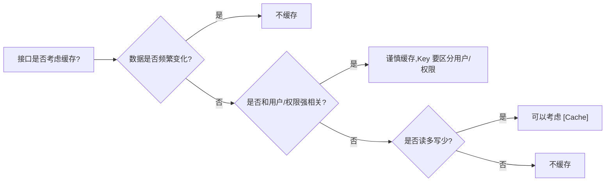

### 2.10 事务配置

项目里有三类事务入口:

| 场景 | 事务方式 |
| --- | --- |
| 标准 CRUD | `CrudService<TEntity>` 内部手动 `Begin/Commit/Rollback` |
| 标记事务的 Controller/Action | `[Transaction]` 创建 `TransactionActionFilter` |
| 跨模块流程 | 调用方 Service 控制事务,Contract 不随意另开独立事务 |

`TransactionActionFilter` 会先检查 `IUnitOfWork.HasActiveTransaction`。如果已经在事务中,它不会重复开启请求级事务。

事务边界选择:

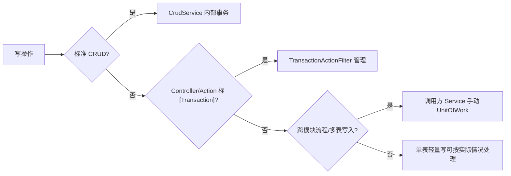

跨模块流程里,谁编排流程,谁控制事务。被调用的 Contract 不要随意另开独立事务,否则上游失败时无法整体回滚。

### 2.11 JSON 序列化配置

`Program.cs` 里统一配置 JSON:

- 属性名使用 camelCase。
- 空值忽略。
- 中文使用宽松编码,避免被转义成不易读的 Unicode。
- 自定义时间转换器。
- 枚举转换器。
- bool / nullable bool 转 int。

这会影响前后端字段命名。后端属性 `WarehouseCode`,前端通常看到 `warehouseCode`。

常见影响:

| 后端类型/属性 | 前端看到 | 注意 |
| --- | --- | --- |
| `WarehouseCode` | `warehouseCode` | 前端过滤字段按 camelCase 传 |
| `DateTime` | 统一时间格式 | 不要每个接口自行格式化 |
| `bool` | 0/1 | 前端控件要按数字兼容 |
| `enum` | 转换器处理 | 不要混用多种枚举格式 |
| null 属性 | 默认忽略 | 前端不要依赖所有字段都出现 |

### 2.12 请求体缓冲配置

`Program.cs` 里启用了:

```csharp
context.Request.EnableBuffering();
```

它主要服务两个场景:

- `ExtDataCrudController` 在模型绑定后重读原始 JSON,提取 `extDataRaw`。
- `GlobalExceptionFilter` 在异常时读取请求体并做脱敏日志。

如果以后移除或调整这段中间件,要同步验证 ExtData 保存和异常日志。

请求体为什么要缓冲:

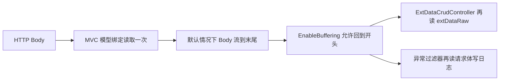

### 2.13 静态文件、上传目录和 SPA 托管

上传目录配置:

```text
FileStorage:UploadPath
```

后端会把上传目录挂为静态文件路径。前端 SPA 构建产物放到后端 `wwwroot` 后,也由后端托管。刷新前端路由时通过:

```csharp
app.MapFallbackToFile("index.html");
```

回退到 SPA 首页。

请求分流可以这样看:

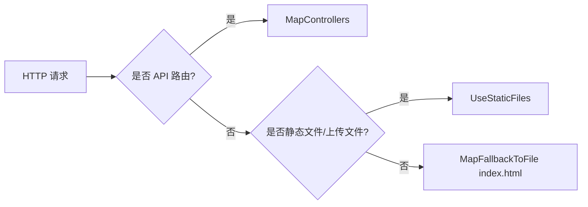

### 2.14 License、CORS、限流和 MiniProfiler

这些属于了解和排查入口:

- License 验证在 `UseLicenseValidation`。
- CORS 在 `AddCustomCors` / `UseCustomCors`。
- 限流有配置入口,当前中间件调用处预留。
- MiniProfiler 在 `AddMonitoringSetup` / `UseMiniProfilerCustom`。

业务开发一般不改这些。遇到启动失败、跨域失败、接口被拦截、性能排查时再进入对应底座。

排查入口:

| 现象 | 先看 |
| --- | --- |
| 启动后接口全部被拦截 | License 验证 |
| 前后端分离调接口跨域 | CORS 配置 |
| 某些接口突然大量 429 或被拒 | 限流配置和中间件是否启用 |
| 接口慢但不知道慢在哪里 | MiniProfiler、性能拦截器、SQL 日志 |

---
