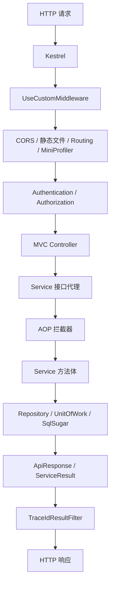
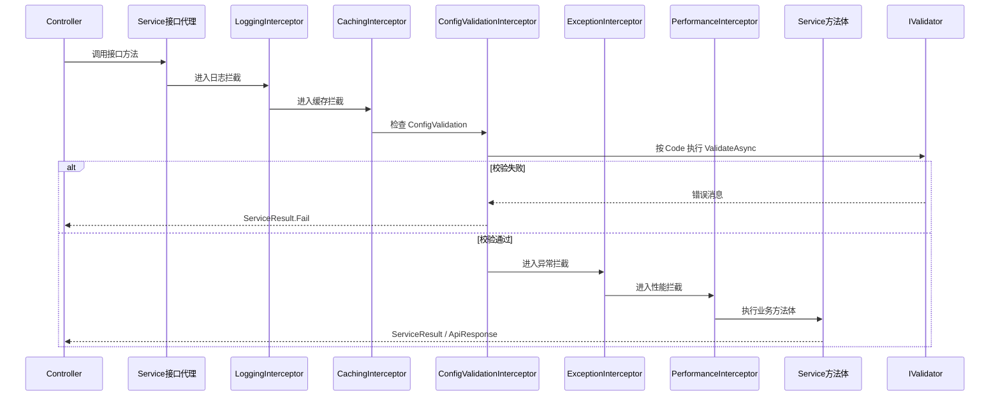

# 第 3 章 请求链路、事务、异常、TraceId、AOP 教程

> 来源: KH.WMS后端开发指引 V3.0.md。本文把原章节单独抽出来，并补充“干什么、什么时候看、怎么执行”，用于新人培训和日常开发查阅。

## 这一章是干什么的

把一次 API 请求从进入 Controller 到事务、异常、日志、TraceId、AOP 拦截的路径讲清楚。

## 什么时候需要看

接口返回异常、事务没生效、日志找不到、TraceId 需要排错、AOP 没有拦截时。

## 怎么执行

- 先按“请求旅程”理解 Controller、Service、仓储、响应包装的顺序。
- 检查事务是否通过正确的 Service 接口调用触发。
- 用 TraceId 串起前端响应、后端日志和异常信息。

## 执行后怎么验证

能拿一个失败接口的 TraceId 去日志里定位对应异常，并判断事务/AOP 是否进入。

## 下一步看哪里

如果是职责边界混乱，继续读第 4 章；如果是服务注册问题，读第 5 章。

---


### 3.1 一个请求的大致旅程



你写业务代码时最常接触的是:

- Controller
- Service
- Contract
- Repository
- UnitOfWork
- ApiResponse / ServiceResult

其他中间件和过滤器通常不需要改。

定位问题时按链路反推:

- Swagger 看不到:Controller 扫描、路由、程序集引用。
- 进入 Controller 失败:认证、授权、模型绑定。
- DI 注入失败:`[RegisteredService]`、`ServiceType`、接口注册。
- 业务结果不对:Service、Contract、事务、数据状态。
- 响应里没有 TraceId:是否返回统一 `ApiResponse`。

### 3.2 事务怎么处理

`CrudService<TEntity>` 的标准增删改已经有事务:

- `CreateAsync`
- `UpdateAsync`
- `DeleteAsync`
- `BatchDeleteAsync`

自定义业务方法如果写多张表,自己控制:

```csharp
await unitOfWork.BeginTransactionAsync();
try
{
    // 多表写入
    await unitOfWork.CommitAsync();
}
catch
{
    await unitOfWork.RollbackAsync();
    throw;
}
```

跨模块流程里,调用方控制事务。被调 Contract 不要随意开独立事务破坏整体一致性。

如果方法里返回 `ServiceResult.Fail(...)`,也要注意事务状态。当前一些流程在 catch 中统一 Rollback;如果在 try 内提前 return 失败,要确认是否需要先 Rollback。最稳妥的写法是失败前明确结束事务,或把可失败校验前置到开启事务之前。

并发入口建议:

- 同一容器、同一任务、同一库存记录,要考虑重复提交。
- 需要串行化时使用数据库锁或状态复核。
- 状态更新前先检查当前状态是否仍然允许。
- WCS/PDA 回调要尽量幂等。

### 3.3 响应怎么返回

Controller 面向前端优先返回:

```csharp
Task<ApiResponse>
```

业务内部流程可以用:

```csharp
ServiceResult
ServiceResult<T>
```

常见规则:

- 查询成功: `ApiResponse.Ok(data)`
- 业务失败: `ApiResponse.Fail(...)` 或 `ServiceResult.Fail(...)`
- 找不到数据: `ApiResponse.NotFound(...)`
- 参数校验失败: `ApiResponse.ValidationError(...)` 或抛 `ValidationException`
- 未授权: `ApiResponse.Unauthorized(...)`

不要返回匿名对象给 Controller 直接裸出。`TraceIdResultFilter` 主要服务统一响应,统一响应也能让前端错误处理更稳定。

Contract 更适合返回 `ServiceResult` 或明确业务类型,不要直接返回 `ApiResponse`,因为 Contract 不是 HTTP API。

### 3.4 异常怎么处理

全局异常由 `GlobalExceptionFilter` 和异常处理中间件兜底。

建议:

- 可预期业务失败,优先返回 `ServiceResult.Fail(...)`。
- 字段或参数校验失败,使用 `ValidationException`。
- 找不到关键资源,使用统一 NotFound 响应。
- 不要在 Controller 到处写 `try/catch`。
- 不要吞异常后返回成功。

Service 内的 `try/catch` 主要用于事务回滚和包装业务错误。写 catch 时不要只记录日志后继续成功返回,这会让前端和数据库状态不一致。

### 3.5 TraceId 有什么用

TraceId 用来把前端报错和后端日志关联起来。

排错时让前端提供:

- 接口路径。
- 请求时间。
- `ApiResponse.TraceId`。
- 可选 `X-Correlation-ID`。

后端再按 TraceId / CorrelationId / 时间窗口查日志。

开发接口时不要绕开统一响应,否则排错信息会断掉。尤其是流程型接口失败时,错误消息要让业务人员能看懂,TraceId 要让开发能定位。

### 3.6 AOP 拦截器做什么

服务自动注册默认启用接口拦截器。当前注册的拦截器包括:

- `LoggingInterceptor`
- `CachingInterceptor`
- `ConfigValidationInterceptor`
- `ExceptionInterceptor`
- `PerformanceInterceptor`

这意味着业务 Service 不需要每个方法都手写日志、性能计时、异常包装。

带 `[ConfigValidation]` 的业务方法执行顺序可以理解为:



这张图解释了为什么目标 Service 不能设置 `WithoutInterceptor = true`:一旦跳过接口拦截器,`ConfigValidationInterceptor` 就没有机会执行。

注意:

- AOP 依赖接口代理,所以 Service 要按接口注入。
- `WithoutInterceptor = true` 会跳过这些拦截器。
- 基础设施服务为了避免循环依赖,经常会关闭拦截器。
- `[ConfigValidation]` 依赖 `ConfigValidationInterceptor`,目标 Service 不能关闭拦截器。

如果校验器没执行,按这个顺序查:

1. 目标方法是否在通过接口注入的 Service 上调用。
2. Service 是否没有设置 `WithoutInterceptor = true`。
3. 方法是否标了 `[ConfigValidation(ValidatorCodes.XXX)]`。
4. 校验器是否实现 `IValidator` 并注册。
5. `ValidatorCodes`、`IValidator.Code`、`ConfigValidation` 三处编码是否一致。
6. 方法返回类型是否适合 `ConfigValidationInterceptor`。

---


## 继续阅读

- [后端 V3 教程目录](/backend/后端开发指引V3教程/README)
- [后端架构设计思路](/backend/架构设计/KH.WMS后端架构设计思路)
- [底层机制索引](/backend/后端底层概念/README)
