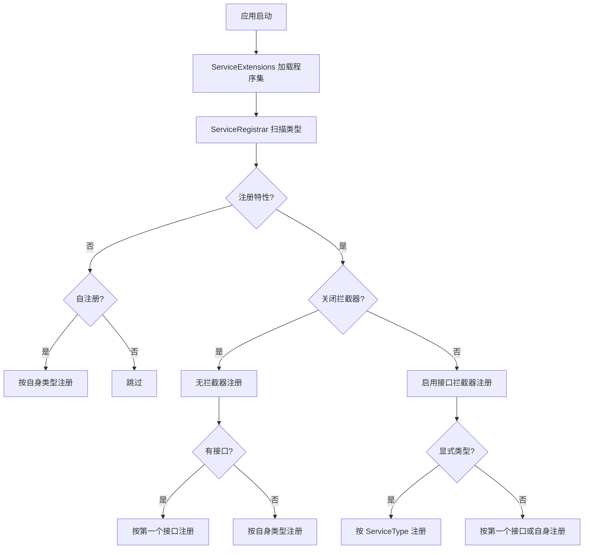

# 第 5 章 服务自动注册: `[RegisteredService]` 教程

> 来源: KH.WMS后端开发指引 V3.0.md。本文把原章节单独抽出来，并补充“干什么、什么时候看、怎么执行”，用于新人培训和日常开发查阅。

## 这一章是干什么的

说明 `[RegisteredService]` 如何让 Service 自动进入 DI 容器，以及 ServiceType、接口代理、拦截器该怎么配置。

## 什么时候需要看

出现 DI 注入失败、AOP 不生效、多接口注册混乱、Contract 或 Validator 注册不明确时。

## 怎么执行

- 检查 Service 实现类是否标记 `[RegisteredService]`。
- 确认 `ServiceType` 是否指向对外注入的接口。
- 需要跳过拦截器时再明确使用 `WithoutInterceptor = true`，默认不要随意关闭。

## 执行后怎么验证

接口能正常注入，且需要事务/AOP 的调用是通过接口代理进入。

## 下一步看哪里

注册没问题后，读第 6 章看完整 CRUD 从文件到接口的执行链路。

---


### 5.1 自动注册从哪里来

项目启动时使用 Autofac:

```csharp
builder.Host
    .UseServiceProviderFactory(new AutofacServiceProviderFactory())
    .ConfigureContainer<ContainerBuilder>(builder =>
    {
        builder.RegisterModule(new ServiceExtensions());
        builder.RegisterModule(new StrategyAutofacModule());
    });
```

`ServiceExtensions` 会调用 `AssemblyService.GetReferencedAssemblies()`,然后交给 `ServiceRegistrar` 扫描所有带以下特性的类:

- `[RegisteredService]`
- `[SelfRegisteredService]`

因此,业务 Service 不是手写到 `Program.cs` 的,而是靠特性自动注册。

`ServiceRegistrar` 还会注册这些拦截器:

- `LoggingInterceptor`
- `CachingInterceptor`
- `ConfigValidationInterceptor`
- `ExceptionInterceptor`
- `PerformanceInterceptor`

默认注册的业务 Service 会启用接口拦截器。

自动注册的大致流程如下:



这张图里的关键点是:普通业务 Service 走带拦截器分支时,显式 `ServiceType` 最稳;关闭拦截器的规则对象要特别注意接口数量。

### 5.2 `[RegisteredService]` 默认行为

`RegisteredServiceAttribute` 默认值:

```csharp
public ServiceLifetime Lifetime { get; set; } = ServiceLifetime.Scoped;
public bool WithoutInterceptor { get; set; } = false;
public Type? ServiceType { get; set; } = null;
```

也就是说:

- 默认生命周期是 `Scoped`。
- 默认启用接口拦截器。
- 如果不写 `ServiceType`,注册器会尝试取实现类的第一个接口。

注册器核心逻辑:

```csharp
var interfaces = item.Type.GetInterfaces();
Type serviceType = interfaces.FirstOrDefault() ?? item.Type;

if (interfaces.Length > 0 && registeredAttr.ServiceType != null)
{
    serviceType = registeredAttr.ServiceType;
}
```

这就是为什么建议业务 Service 显式写 `ServiceType`。

### 5.3 写 `ServiceType` 会怎么样

推荐写法:

```csharp
[RegisteredService(ServiceType = typeof(IMaterialService))]
public class MaterialService(
    IRepository<MdMaterial, long> repository,
    IUnitOfWork unitOfWork,
    IDetailSaveService detailSaveService)
    : CrudService<MdMaterial>(repository, unitOfWork, detailSaveService),
      IMaterialService
{
}
```

这样容器明确注册:

```text
IMaterialService -> MaterialService
```

Controller 可以稳定注入:

```csharp
public class MaterialController(IMaterialService materialService)
    : ExtDataCrudController<MdMaterial>(materialService)
{
}
```

好处:

- 不怕接口顺序变化。
- 不怕继承接口干扰。
- 不怕多接口实现时注册错。
- 代码阅读者一眼知道这个类对外注册成什么。

普通业务 Service、Contract 实现、多个接口场景都应该显式写 `ServiceType`。

### 5.4 不写 `ServiceType` 会怎么样

如果只写:

```csharp
[RegisteredService]
public class MaterialService : CrudService<MdMaterial>, IMaterialService
{
}
```

注册器会取 `MaterialService.GetInterfaces().FirstOrDefault()`。

问题在于 `MaterialService` 继承了 `CrudService<MdMaterial>`,又实现了 `IMaterialService`;运行时拿到的第一个接口不一定是你希望的接口。它可能是:

```text
ICrudService<MdMaterial>
```

也可能是:

```text
IMaterialService
```

取决于反射返回顺序和类型结构。结果就是:

```csharp
public class MaterialController(IMaterialService materialService)
```

可能注入失败,因为容器没有按 `IMaterialService` 注册。

所以业务 Service 的规则是:

```text
只要有明确接口,就写 ServiceType。
```

### 5.5 多接口、Contract、Validator 必须更明确

Contract 示例:

```csharp
[RegisteredService(Lifetime = ServiceLifetime.Scoped, ServiceType = typeof(ITaskContract))]
public class TaskContract(...) : ITaskContract
{
}
```

Contract 是跨模块能力,注册错会导致别的模块注入失败,必须写 `ServiceType`。

Validator 示例:

```csharp
[RegisteredService(WithoutInterceptor = true, ServiceType = typeof(IValidator))]
public class BatchNoRequiredValidator : IValidator
{
}
```

多个 Validator 都按 `IValidator` 被校验拦截器统一解析,并通过 `Code` 匹配具体规则。

当前注册器的无拦截器分支会按实现类第一个接口注册,没有重新读取 `registeredAttr.ServiceType`。因此 Validator 最稳妥的写法是:

- 显式写 `ServiceType = typeof(IValidator)`,表达意图。
- 类只实现 `IValidator`,避免第一个接口不是 `IValidator`。
- 保持 `WithoutInterceptor = true`,避免 Validator 自己再触发 AOP 链。

### 5.6 `WithoutInterceptor = true` 什么时候用

默认注册会启用这些拦截器:

- `LoggingInterceptor`
- `CachingInterceptor`
- `ConfigValidationInterceptor`
- `ExceptionInterceptor`
- `PerformanceInterceptor`

普通业务 Service 通常保持默认。

适合 `WithoutInterceptor = true` 的场景:

- 日志服务本身。
- 数据库上下文、UnitOfWork 等底层基础设施。
- 映射服务等被拦截器依赖的服务。
- Validator 等细粒度规则对象。
- JWT、License 等避免循环依赖或不需要 AOP 的底层能力。

不要为了“少打日志”随便给业务 Service 加 `WithoutInterceptor = true`。一旦关闭拦截器,日志、性能、异常包装、配置校验等能力都可能绕开。

### 5.7 推荐模板

普通业务 Service:

```csharp
[RegisteredService(ServiceType = typeof(IXxxService))]
public class XxxService(
    IRepository<XxxEntity, long> repository,
    IUnitOfWork unitOfWork,
    IDetailSaveService detailSaveService)
    : CrudService<XxxEntity>(repository, unitOfWork, detailSaveService),
      IXxxService
{
}
```

跨模块 Contract:

```csharp
[RegisteredService(Lifetime = ServiceLifetime.Scoped, ServiceType = typeof(IXxxContract))]
public class XxxContract(...) : IXxxContract
{
}
```

基础设施或规则对象:

```csharp
[RegisteredService(WithoutInterceptor = true, ServiceType = typeof(IValidator))]
public class XxxValidator : IValidator
{
}
```

自注册类,即按自身类型注册而不是按接口注册时,使用 `[SelfRegisteredService]`。普通业务 Service 不建议这么写。

---


## 继续阅读

- [后端 V3 教程目录](/backend/后端开发指引V3教程/README)
- [后端架构设计思路](/backend/架构设计/KH.WMS后端架构设计思路)
- [底层机制索引](/backend/后端底层概念/README)
