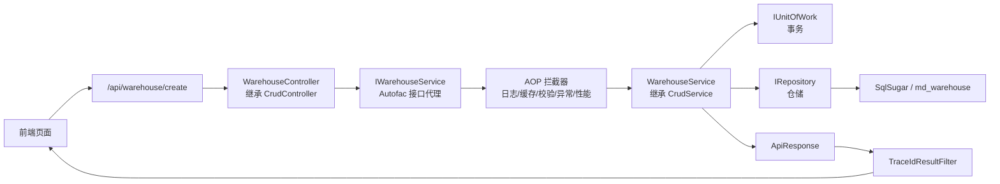
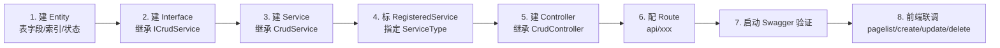
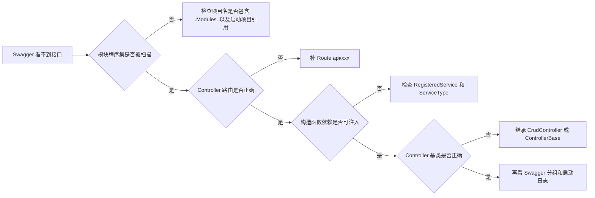
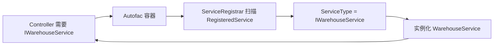
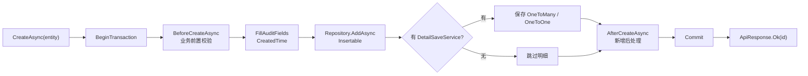
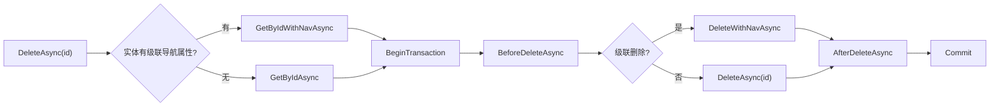
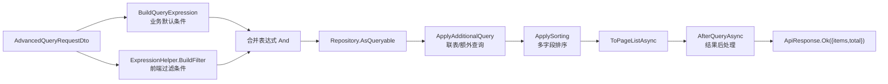
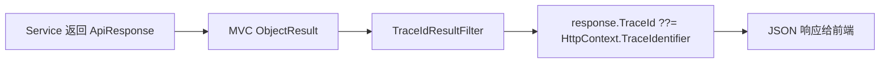

# 第 6 章 一个完整 CRUD 的底层执行链路 教程

> 来源: KH.WMS后端开发指引 V3.0.md。本文把原章节单独抽出来，并补充“干什么、什么时候看、怎么执行”，用于新人培训和日常开发查阅。

## 这一章是干什么的

用一条完整 CRUD 线索说明从建文件、Controller 暴露、Service 注入，到新增、更新、删除、查询、响应返回的底层过程。

## 什么时候需要看

准备新增一个普通维护接口，或者接口写完但 Swagger、DI、AOP、落库、分页任一环节不通时。

## 怎么执行

- 按“写文件到接口能访问”的顺序检查 Entity、Service 接口、Service 实现、Controller。
- 用 Swagger 验证 Controller 路由和请求体。
- 分别验证新增、更新、删除、分页查询是否进入 `CrudService` 对应流程。

## 执行后怎么验证

一个新增的 CRUD 能在 Swagger 中访问，并完成新增、查询、更新、删除主路径。

## 下一步看哪里

需要知道 CRUD 基类具体有哪些方法，继续读第 7 章；要按步骤开发，读第 8 章。

---

## 原章节内容

# 第 6 章 一个完整 CRUD 的底层执行链路

本章按“新增一个仓库维护 CRUD”为例,把代码文件、接口请求、底层执行、排查路径串起来。目标不是背框架,而是让你知道:

- 为什么只写一个很薄的 Controller,就能拥有分页、新增、更新、删除、导入导出。
- 为什么 Service 必须写接口和 `[RegisteredService(ServiceType = ...)]`。
- 一个请求进入后端后,到底经过 Controller、AOP、Service、Repository、UnitOfWork、SqlSugar 中的哪几层。
- 出问题时从哪一层开始查,不要靠猜。

本章贯穿例子是仓库维护:

| 层 | 文件 | 作用 |
| --- | --- | --- |
| Entity | `KH.WMS/Entities/KH.WMS.Entities/Warehouse/MdWarehouse.cs` | 描述 `md_warehouse` 表字段、索引、状态字段 |
| Interface | `KH.WMS/Modules/WarehouseModule/KH.WMS.Modules.WarehouseModule/Interfaces/IWarehouseService.cs` | 暴露仓库模块内 Service 能力 |
| Service | `KH.WMS/Modules/WarehouseModule/KH.WMS.Modules.WarehouseModule/Services/WarehouseService.cs` | 继承 CRUD 基类,补仓库特有逻辑 |
| Controller | `KH.WMS/Modules/WarehouseModule/KH.WMS.Modules.WarehouseModule/Controllers/WarehouseController.cs` | 暴露 HTTP 路由给前端 |

### 6.1 先看一眼完整链路

一个标准 CRUD 不是一个类完成的,而是多层协作。推荐先按横向链路理解:



这张图里,业务开发主要写四个点:

```text
Entity + Interface + Service + Controller
```

其他部分是技术底座:

```text
MVC 路由 + Autofac DI + AOP + UnitOfWork + Repository + SqlSugar + ApiResponse + TraceId
```

你写 CRUD 时不要把底座能力重复造一遍。比如不要在 Controller 里手写事务,不要绕过 Repository 自己拿连接,不要在每个接口里手写统一响应。

### 6.2 从“写文件”到“接口能访问”的顺序

新增普通 CRUD 推荐按下面这个横向顺序走:



以仓库为例,每一步分别对应:

```csharp
// 1. Entity
[SugarTable("md_warehouse")]
public class MdWarehouse : BaseEntity<long>, IEnableDisableEntity
{
    public string WarehouseCode { get; set; }
    public string WarehouseName { get; set; }
    public byte Status { get; set; } = 1;
}

// 2. Interface
public interface IWarehouseService : ICrudService<MdWarehouse>
{
    Task<ApiResponse> GetZoneAndAisleAsync(long warehouseId);
}

// 3 + 4. Service
[RegisteredService(ServiceType = typeof(IWarehouseService))]
public class WarehouseService(...) 
    : CrudService<MdWarehouse>(repository, unitOfWork, detailSaveService), IWarehouseService
{
}

// 5 + 6. Controller
[Route("api/warehouse"), Cache(Duration = 60 * 30)]
public class WarehouseController(IWarehouseService warehouseService)
    : CrudController<MdWarehouse>(warehouseService)
{
}
```

这几段代码看起来薄,是因为基类和底座已经把标准能力接走了。薄不是偷懒,薄是职责清楚。

### 6.3 Controller 能被 Swagger 看到的条件

Controller 不是只要写出来就一定能被访问。启动项目在 `Program.cs` 里手动把模块程序集加入 MVC:

```csharp
var moduleAssemblies = AssemblyService.GetReferencedAssemblies()
    .Where(a => a.GetName().Name?.Contains(".Modules.") == true
        || a.GetName().Name == "KH.WMS.Config");

foreach (var assembly in moduleAssemblies)
{
    apm.ApplicationParts.Add(new AssemblyPart(assembly));
}
```

所以 Controller 能被 Swagger 看到,至少要满足:

| 条件 | 正确做法 | 常见错误 |
| --- | --- | --- |
| 程序集命名 | `KH.WMS.Modules.WarehouseModule` | 新建项目名不包含 `.Modules.` |
| 项目引用 | 启动项目能发现模块程序集 | 类库没被引用或没参与构建 |
| Controller 基类 | 继承 `CrudController<TEntity>` 或 `ControllerBase` | 普通 class,没有 MVC Controller 特征 |
| 路由 | `[Route("api/warehouse")]` | 缺路由或路由重复 |
| DI | 构造函数依赖能解析 | Service 没注册,Swagger 加载时报错 |

排查顺序建议:



### 6.4 Service 注入不是“靠名字匹配”

`WarehouseController` 构造函数写的是:

```csharp
public class WarehouseController(IWarehouseService warehouseService)
    : CrudController<MdWarehouse>(warehouseService)
{
}
```

容器要能把 `IWarehouseService` 找到对应实现。项目靠 `[RegisteredService]` 自动注册:

```csharp
[RegisteredService(ServiceType = typeof(IWarehouseService))]
public class WarehouseService(...) : CrudService<MdWarehouse>(...), IWarehouseService
{
}
```

这里的关键是 `ServiceType`。它明确告诉容器:



不要把它理解成“类名差不多就能注入”。容器看的是类型注册关系,不是中文意思,也不是文件名。

常见错误:

- Service 实现了多个接口,但没有写 `ServiceType`。
- Service 标了 `[RegisteredService]`,但指定成了错误接口。
- Interface 没继承 `ICrudService<TEntity>`,导致 Controller 基类需要的方法对不上。
- Controller 注入的是 `IWarehouseService`,Service 却注册成了 `ICrudService<MdWarehouse>` 或其他接口。

### 6.5 AOP 为什么要求“通过接口调用”

Service 注册时会启用接口代理:

```text
EnableInterfaceInterceptors().InterceptedBy(interceptors)
```

可以理解为 Controller 拿到的不是一个裸 `WarehouseService`,而是一个带拦截能力的代理对象:

```mermaid
flowchart LR
    Controller["Controller"] --> Interface["IWarehouseService 代理"]
    Interface --> Log["LoggingInterceptor"]
    Log --> Cache["CachingInterceptor"]
    Cache --> Config["ConfigValidationInterceptor"]
    Config --> Ex["ExceptionInterceptor"]
    Ex --> Perf["PerformanceInterceptor"]
    Perf --> Real["WarehouseService 方法体"]
```



所以普通业务代码要遵守:

- Controller 注入接口,不要注入实现类。
- 其他 Service 调用也优先注入对方接口或 Contract。
- 不要手动 `new WarehouseService(...)`。
- 普通业务 Service 不要设置 `WithoutInterceptor = true`。

如果绕开接口代理,配置校验、日志、性能统计等拦截器就没有机会执行。

### 6.6 新增请求在 `CrudService` 里怎么落库

当前端调用:

```text
POST /api/warehouse/create
```

Controller 基类会进入:

```csharp
CrudController<MdWarehouse>.Create([FromBody] MdWarehouse entity)
```

然后调用:

```csharp
IWarehouseService.CreateAsync(entity)
```

因为 `IWarehouseService` 继承了 `ICrudService<MdWarehouse>`,而 `WarehouseService` 继承了 `CrudService<MdWarehouse>`,所以实际执行的是 `CrudService<TEntity>.CreateAsync`。

新增内部步骤建议这样记:



这说明几个重点:

- 新增前校验不要写在 Controller,优先重写 `BeforeCreateAsync`。
- 创建时间由基类填,不要每个业务 Service 重复写。
- 主从表如果接入 `IDetailSaveService`,会跟主表在一个事务内保存。
- 任意步骤抛异常都会进入 catch,执行 Rollback 后继续抛给全局异常处理。

### 6.7 更新、删除和批量删除的底层差异

更新不是直接拿前端对象覆盖数据库。基类会先查旧数据:

```mermaid
flowchart LR
    A["UpdateAsync(entity)"] --> B["BeginTransaction"]
    B --> C["GetEntityOrThrowAsync(entity.Id)"]
    C --> D["BeforeUpdateAsync"]
    D --> E["CopyProperties<br/>跳过 Id 和导航属性"]
    E --> F["CopyDetailProperties<br/>复制级联明细"]
    F --> G["FillAuditFields<br/>LastModifiedTime"]
    G --> H["Repository.UpdateAsync(existing)"]
    H --> I["保存明细"]
    I --> J["AfterUpdateAsync"]
    J --> K["Commit"]
```



删除会先判断实体有没有需要级联处理的导航属性:



批量删除没有逐个加载实体,所以如果你要检查“某些状态不能删”“被引用不能删”,要重写:

```csharp
BeforeBatchDeleteAsync(List<long> ids)
```

### 6.8 查询请求怎么处理过滤、排序和分页

分页接口:

```text
POST /api/warehouse/pagelist
```

底层不是简单查全表,而是按下面的顺序拼查询:



如果分页结果不对,按这个顺序查:

1. 前端传的字段名是否是后端实体属性名的 camelCase。
2. `BuildQueryExpression` 是否加了业务过滤条件。
3. `ExpressionHelper.BuildFilter` 是否能识别该字段。
4. `ApplyAdditionalQuery` 是否追加了错误条件。
5. 排序字段是否存在,不存在会被过滤。
6. `AfterQueryAsync` 是否把结果改掉了。

### 6.9 响应和 TraceId 怎么回到前端

业务接口返回 `ApiResponse` 后,响应会经过结果过滤器:



这就是为什么文档一直要求 Controller 返回统一响应。统一响应能让前端稳定处理:

```json
{
  "code": 200,
  "message": "新增成功",
  "timestamp": 1780000000000,
  "data": 123,
  "traceId": "0H..."
}
```

前端或测试人员报错时,不要只说“保存失败”。至少给:

- 接口路径。
- 请求时间。
- 响应 `message`。
- 响应 `traceId`。
- 业务主键、编码或请求体。

### 6.10 一张表总结:问题从哪一层查

| 现象 | 先查哪一层 | 典型原因 |
| --- | --- | --- |
| Swagger 没接口 | Controller 扫描 | 项目名不含 `.Modules.`、模块未引用、路由缺失 |
| 启动时报无法解析服务 | DI 注册 | `ServiceType` 错、接口没继承、实现类没标注册特性 |
| 接口进不去 | 中间件/认证授权 | Token 缺失、权限不足、License 拦截、路由不匹配 |
| 方法进了但校验器没跑 | AOP | 没通过接口调用、Service 设置了 `WithoutInterceptor = true` |
| 新增没有写库 | Service/Repository | 事务回滚、字段必填失败、数据库约束失败 |
| 更新丢字段 | `CopyProperties` | 前端没传字段、空值不会覆盖旧值、导航属性被跳过 |
| 删除不干净 | 导航属性/级联 | 实体导航没配置、业务不允许级联、BeforeDelete 未处理引用 |
| 分页没数据 | 查询表达式 | 默认条件、前端过滤字段、排序字段、联表条件 |
| 状态接口失败 | 启停约定 | 没实现 `IEnableDisableEntity`、状态字段名不符合约定 |
| 响应没 TraceId | 响应格式 | 返回了裸对象或文件流,没有走 `ApiResponse` |

---
