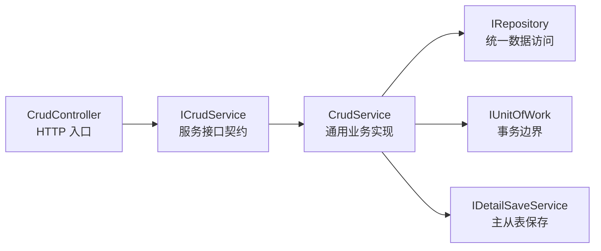
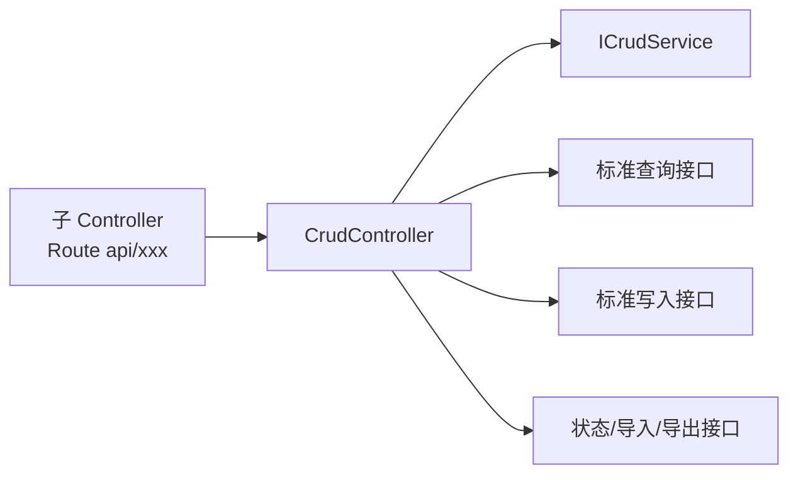
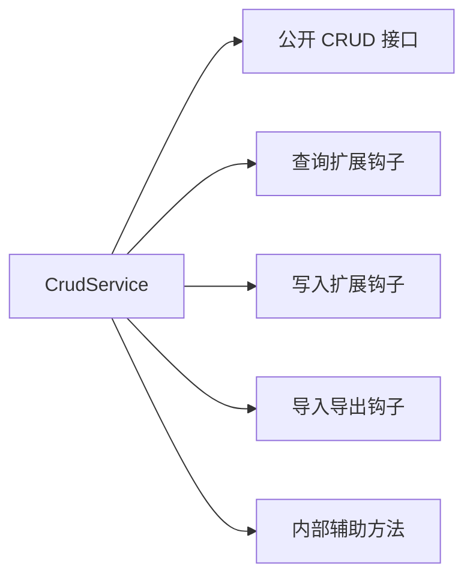
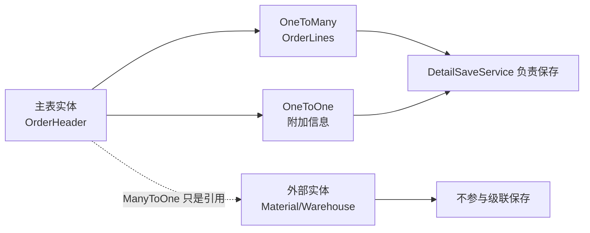
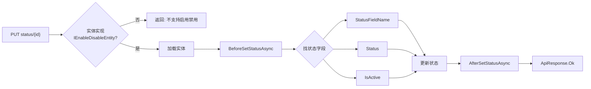
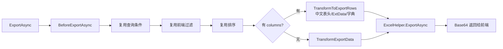
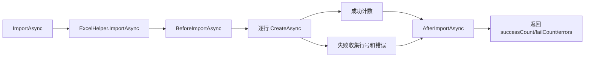
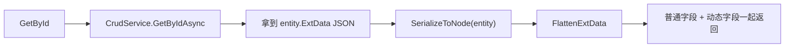

# 第 7 章 CRUD 基类能力详解 教程

> 来源: KH.WMS后端开发指引 V3.0.md。本文把原章节单独抽出来，并补充“干什么、什么时候看、怎么执行”，用于新人培训和日常开发查阅。

## 这一章是干什么的

集中说明 `CrudController<TEntity>`、`CrudService<TEntity>`、主从表、启用禁用、导入导出、ExtData CRUD 等基类能力。

## 什么时候需要看

需要复用基类端点、扩展查询过滤、保存主从表、做启用禁用、导入导出或动态字段 ExtData 时。

## 怎么执行

- 先看 Controller 基类已经提供哪些标准端点，避免重复造接口。
- 再看 Service 基类提供的查询、写入、状态、导入导出钩子。
- 涉及 ExtData 时检查实体和前端是否真的需要动态字段保存/回显。

## 执行后怎么验证

能判断某个需求是否直接用基类能力、覆盖钩子，还是需要新增流程型接口。

## 下一步看哪里

如果只是开发步骤不清楚，读第 8 章；如果纠结 ExtData Controller 选择，读第 9 章。

---

## 原章节内容

# 第 7 章 CRUD 基类能力详解

本章把 CRUD 基类拆开讲。第 6 章讲请求怎么跑,本章讲“基类到底替你做了什么,你应该在哪个钩子里扩展”。

先看职责分工:



不要把基类当黑盒。你不需要重复写基类已有能力,但要知道什么时候重写哪个钩子。

### 7.1 `CrudController<TEntity>` 方法清单

`CrudController<TEntity>` 的源码位置:

```text
KH.WMS/KH.WMS.Core/Controllers/CrudController.cs
```

它是标准维护页的 HTTP 入口基类。子 Controller 只要继承它,并在类上配置 `[Route("api/xxx")]`,就会自动拥有标准 CRUD、启停、导入导出、模板下载等接口。

先看它的结构:



构造函数只有一个核心依赖:

```csharp
protected CrudController(ICrudService<TEntity> service)
{
    _service = service;
}
```

这也是为什么模块内 Service 接口要继承 `ICrudService<TEntity>`。例如 `IWarehouseService : ICrudService<MdWarehouse>`,否则 `WarehouseController` 继承 `CrudController<MdWarehouse>` 时,传入的 `warehouseService` 就无法满足基类需要。

#### 10.1.1 标准端点方法

| 方法 | HTTP 路由 | 调用的 Service 方法 | 缓存 | 说明 |
| --- | --- | --- | --- | --- |
| `GetById(long id)` | `GET {id}` | `_service.GetByIdAsync(id)` | `[Cache(Enable = false)]` | 根据主键获取详情,通常用于编辑回显和查看详情。 |
| `GetPagedList(AdvancedQueryRequestDto query)` | `POST pagelist` | `_service.GetPagedListAsync(query)` | `[Cache(Enable = false)]` | 分页查询,支持前端高级过滤和排序。 |
| `GetAll()` | `GET all` | `_service.GetListAsync()` | 未显式禁用 | 获取全部列表,适合下拉选择等小数据量场景。 |
| `Create(TEntity entity)` | `POST create` | `_service.CreateAsync(entity)` | `[Cache(Enable = false)]` | 新增实体,请求体直接绑定为实体。 |
| `Update(TEntity entity)` | `POST update` | `_service.UpdateAsync(entity)` | `[Cache(Enable = false)]` | 更新实体,请求体直接绑定为实体。 |
| `Delete(long id)` | `DELETE delete/{id}` | `_service.DeleteAsync(id)` | `[Cache(Enable = false)]` | 根据 ID 删除单条数据。 |
| `BatchDelete(List<long> ids)` | `DELETE batch` | `_service.BatchDeleteAsync(ids)` | `[Cache(Enable = false)]` | 批量删除,请求体传 ID 集合。 |
| `SetStatus(long id, SetStatusDto dto)` | `PUT status/{id}` | `_service.SetStatusAsync(id, dto.Status)` | `[Cache(Enable = false)]` | 启用/禁用,仅实体实现 `IEnableDisableEntity` 时可用。 |
| `Export(ExportRequestDto request)` | `POST export` | `_service.ExportAsync(request, request?.Columns, request?.ExportAll ?? true)` | `[Cache(Enable = false)]` | 导出数据,复用查询条件和列配置。 |
| `Import(IFormFile file)` | `POST import` | `_service.ImportAsync(stream, file.FileName)` | `[Cache(Enable = false)]` | 导入 Excel 文件;空文件直接返回失败响应。 |
| `DownloadTemplate()` | `GET template` | `_service.DownloadTemplateAsync()` | `[Cache(Enable = false)]` | 下载导入模板。 |

如果子 Controller 写:

```csharp
[Route("api/warehouse")]
public class WarehouseController(IWarehouseService warehouseService)
    : CrudController<MdWarehouse>(warehouseService)
{
}
```

最终会得到:

```text
GET    /api/warehouse/{id}
POST   /api/warehouse/pagelist
GET    /api/warehouse/all
POST   /api/warehouse/create
POST   /api/warehouse/update
DELETE /api/warehouse/delete/{id}
DELETE /api/warehouse/batch
PUT    /api/warehouse/status/{id}
POST   /api/warehouse/export
POST   /api/warehouse/import
GET    /api/warehouse/template
```

#### 10.1.2 方法参数说明

| 参数类型 | 出现在哪些方法 | 说明 |
| --- | --- | --- |
| `long id` | `GetById`、`Delete`、`SetStatus` | 从路由里取主键 ID。 |
| `AdvancedQueryRequestDto query` | `GetPagedList` | 前端分页、过滤、排序请求模型。 |
| `TEntity entity` | `Create`、`Update` | 从请求体绑定实体。普通 CRUD 直接传实体,复杂入参另写业务 Action。 |
| `List<long> ids` | `BatchDelete` | 从请求体绑定批量删除 ID 集合。 |
| `SetStatusDto dto` | `SetStatus` | 请求体里只需要状态值。 |
| `ExportRequestDto request` | `Export` | 继承/兼容高级查询请求,并携带导出列、是否导出全部等配置。 |
| `IFormFile file` | `Import` | 上传的导入文件。基类会判断空文件并打开文件流。 |

#### 10.1.3 缓存标记说明

大多数标准端点都有:

```csharp
[Cache(Enable = false)]
```

原因是维护页数据变化频繁,新增、更新、删除、分页、导入导出都不适合默认缓存。`GetAll()` 当前没有显式禁用缓存,但是否缓存仍取决于缓存拦截器和实际特性配置。业务开发不要为了“看起来快”随便给维护接口加缓存。

#### 10.1.4 子 Controller 应该补什么

子 Controller 只补当前业务特有的 HTTP 能力。比如 `WarehouseController` 额外提供仓库下库区和巷道:

```csharp
[HttpGet("zone-aisle/{warehouseId}")]
public async Task<ApiResponse> GetZoneAndAisleAsync(long warehouseId)
{
    return await _warehouseService.GetZoneAndAisleAsync(warehouseId);
}
```

判断是否要重写或新增 Controller 方法:

| 场景 | 推荐做法 |
| --- | --- |
| 只是新增前校验唯一性 | 不重写 Controller,重写 `BeforeCreateAsync`。 |
| 只是删除前检查引用 | 不重写 Controller,重写 `BeforeDeleteAsync`。 |
| 只是分页默认过滤 | 不重写 Controller,重写 `BuildQueryExpression`。 |
| 要额外提供一个下拉/树/辅助查询接口 | 在子 Controller 增加新 Action。 |
| `create/update` 的 HTTP 入参结构完全不是实体 | 单独写 Action 和 DTO,再调用 Service。 |
| 需要文件上传、批处理、异步任务 | 单独写 Action,不要硬塞进标准 CRUD。 |
| 需要改变所有维护页的共同规则 | 谨慎评估是否改 `CrudController<TEntity>` 基类。 |

普通维护页不要在子 Controller 里重复写 `create`、`update`、`delete`。重复写会绕开基类里的缓存标记、统一接口风格和后续底座增强。

### 7.2 `CrudService<TEntity>` 方法清单

`CrudService<TEntity>` 的源码位置:

```text
KH.WMS/KH.WMS.Core/Services/CrudService.cs
```

它不是只做“增删改查”四个方法,而是把查询、写入、状态、导入导出、主从表、排序、审计字段、钩子方法都放在一个通用服务基类里。业务 Service 继承它以后,默认就拥有这些能力。

方法可以按下面几类看:



#### 10.2.1 公开 CRUD 接口

这些方法会被 `CrudController<TEntity>` 直接调用,一般不建议业务 Service 重写整个方法。需要定制时优先重写后面的钩子。

| 方法 | 作用 | 说明 |
| --- | --- | --- |
| `GetByIdAsync(long id)` | 根据主键查询详情 | 使用 `_repository.GetByIdWithNavAsync(id)`,会加载一层导航属性;找不到返回 `ApiResponse.NotFound`。 |
| `GetPagedListAsync(AdvancedQueryRequestDto query)` | 分页查询 | 组合默认查询条件、前端过滤、额外查询、排序和分页,返回 `{ items, total }`。 |
| `GetListAsync()` | 获取列表 | 使用 `BuildListExpression()` 构建默认条件,适合下拉、轻量列表。 |
| `CreateAsync(TEntity entity)` | 新增 | 内部开启事务,执行新增前钩子、填充创建时间、插入主表、保存明细、执行新增后钩子。 |
| `UpdateAsync(TEntity entity)` | 更新 | 内部开启事务,先查旧数据,再复制普通属性和明细属性,填充修改时间,更新主表和明细。 |
| `DeleteAsync(long id)` | 删除 | 判断是否有级联导航属性,必要时加载导航数据,事务内执行删除前/后钩子和仓储删除。 |
| `BatchDeleteAsync(List<long> ids)` | 批量删除 | 校验 ids 后事务内批量删除,适合普通维护页批量删除。复杂引用检查放到 `BeforeBatchDeleteAsync`。 |
| `SetStatusAsync(long id, byte status)` | 启用/禁用 | 仅支持实现 `IEnableDisableEntity` 的实体,状态字段按 `[StatusFieldName]`、`Status`、`IsActive` 的顺序解析。 |
| `ExportAsync(AdvancedQueryRequestDto query, List<ExportColumnDto>? columns = null, bool exportAll = true)` | 导出 | 复用查询条件、过滤、排序;有列配置时生成中文表头、展开 ExtData、翻译字典值。 |
| `ImportAsync(Stream fileStream, string fileName)` | 导入 | 使用 Excel 工具导入实体列表,逐行调用 `CreateAsync`,返回成功数、失败数和行级错误。 |
| `DownloadTemplateAsync()` | 下载导入模板 | 根据实体生成导入模板,返回 base64 内容。 |

使用建议:

- 普通业务不要直接重写 `CreateAsync`、`UpdateAsync`、`DeleteAsync`,否则容易漏事务、审计字段、主从表保存。
- 需要新增前校验,重写 `BeforeCreateAsync`。
- 需要删除前检查引用,重写 `BeforeDeleteAsync` 或 `BeforeBatchDeleteAsync`。
- 需要调整查询条件,重写查询钩子。

#### 10.2.2 查询扩展钩子

| 方法 | 作用 | 什么时候重写 |
| --- | --- | --- |
| `BuildQueryExpression(AdvancedQueryRequestDto query)` | 构建分页查询默认条件 | 例如默认只查启用数据、只查当前租户、只查当前仓库。 |
| `BuildQueryExpression<T>(AdvancedQueryRequestDto query)` | 泛型版本查询条件 | 子类内部处理非主实体查询时可用。 |
| `BuildListExpression()` | 构建 `GetListAsync()` 默认条件 | 下拉列表要默认过滤停用数据时使用。 |
| `BuildListExpression<T>()` | 泛型版本列表条件 | 子类内部查询其他实体列表时可用。 |
| `ApplyAdditionalQuery(ISugarQueryable<TEntity> queryable, AdvancedQueryRequestDto query)` | 对分页 Queryable 做额外处理 | 需要追加联表、Includes、复杂过滤或数据权限条件时使用。 |
| `ApplyAdditionalQuery<T>(ISugarQueryable<T> queryable, AdvancedQueryRequestDto query)` | 泛型版本额外查询处理 | 子类处理其他查询对象时使用。 |
| `AfterQueryAsync(AdvancedQueryRequestDto query, List<TEntity> items)` | 分页结果后处理 | 需要补显示字段、翻译字段、批量填充关联名称时使用。 |
| `ApplySorting(ISugarQueryable<TEntity> queryable, List<SortCondition>? sortConditions)` | 应用前端排序 | 通常不重写;会过滤无效字段,没有有效排序时走默认排序。 |
| `ApplySorting<T>(ISugarQueryable<T> queryable, List<SortCondition>? sortConditions)` | 泛型版本排序 | 子类内部泛型查询时使用。 |
| `ApplyDefaultSorting(ISugarQueryable<TEntity> queryable)` | 默认排序 | 不传排序或排序字段无效时使用,默认按 `CreatedTime` 升序。 |
| `ApplyDefaultSorting<T>(ISugarQueryable<T> queryable)` | 泛型版本默认排序 | 子类内部泛型查询时使用。 |

示例:只查启用仓库。

```csharp
protected override Expression<Func<MdWarehouse, bool>> BuildQueryExpression(AdvancedQueryRequestDto query)
{
    return x => x.Status == 1;
}
```

示例:查询后补充展示字段。

```csharp
protected override Task<List<MdWarehouse>> AfterQueryAsync(
    AdvancedQueryRequestDto query,
    List<MdWarehouse> items)
{
    // 这里适合批量补名称、翻译字段,不要做 N+1 查询
    return Task.FromResult(items);
}
```

#### 10.2.3 写入和状态钩子

这些钩子都在基类事务内执行。钩子里抛异常时,基类会回滚事务并把异常交给全局异常处理。

| 方法 | 作用 | 典型场景 |
| --- | --- | --- |
| `BeforeCreateAsync(TEntity entity)` | 新增前处理 | 编码唯一性校验、默认值补充、业务前置检查。 |
| `AfterCreateAsync(TEntity entity)` | 新增后处理 | 新增成功后同步冗余字段、写额外业务记录。 |
| `BeforeUpdateAsync(TEntity entity)` | 更新前处理 | 排除自身的唯一性校验、状态是否允许编辑。 |
| `AfterUpdateAsync(TEntity entity)` | 更新后处理 | 更新成功后同步关联信息。 |
| `BeforeDeleteAsync(long id, TEntity entity)` | 删除前处理 | 检查是否被引用、是否允许删除当前状态。 |
| `AfterDeleteAsync(long id, TEntity entity)` | 删除后处理 | 删除后清理附属关系或缓存。 |
| `BeforeBatchDeleteAsync(List<long> ids)` | 批量删除前处理 | 批量检查是否存在不可删除数据。 |
| `AfterBatchDeleteAsync(List<long> ids)` | 批量删除后处理 | 批量删除后清理附属数据。 |
| `BeforeSetStatusAsync(TEntity entity, byte status)` | 启停前处理 | 禁用前检查是否仍有子数据、库存、任务等引用。 |
| `AfterSetStatusAsync(TEntity entity, byte status)` | 启停后处理 | 状态变更后同步缓存或关联状态。 |

示例:新增和更新时校验仓库编码唯一。

```csharp
protected override async Task BeforeCreateAsync(MdWarehouse entity)
{
    var exists = await _repository.ExistsAsync(x => x.WarehouseCode == entity.WarehouseCode);
    if (exists)
        throw new BusinessException("仓库编码已存在");
}

protected override async Task BeforeUpdateAsync(MdWarehouse entity)
{
    var exists = await _repository.ExistsAsync(x =>
        x.WarehouseCode == entity.WarehouseCode && x.Id != entity.Id);
    if (exists)
        throw new BusinessException("仓库编码已存在");
}
```

#### 10.2.4 导入导出钩子

| 方法 | 作用 | 什么时候重写 |
| --- | --- | --- |
| `BeforeExportAsync(AdvancedQueryRequestDto query)` | 导出前处理 | 导出前校验权限、限制导出范围。 |
| `TransformExportData(List<TEntity> exportData)` | 无列配置时转换导出实体 | 简单调整导出数据。 |
| `TransformToExportRows(List<TEntity> items, List<ExportColumnDto> columns)` | 有列配置时转换导出行 | 默认支持中文表头、ExtData 展开、字典翻译;复杂导出时可重写。 |
| `BeforeImportAsync(List<TEntity> rows)` | 导入前处理 | 批量校验、补默认值、过滤空行。 |
| `AfterImportAsync(int successCount, List<string> errors)` | 导入后处理 | 记录导入日志、统计结果。 |
| `GetExportFileName()` | 获取导出文件/工作表名称 | 默认返回实体名;需要中文名称时重写。 |

#### 10.2.5 内部辅助方法

这些方法主要服务基类内部流程。一般不需要重写,但读懂它们有助于理解 CRUD 行为。

| 方法 | 作用 | 注意 |
| --- | --- | --- |
| `ResolveStatusProperty()` | 解析启停状态字段 | 优先 `[StatusFieldName]`,其次 `Status`,最后 `IsActive`。 |
| `GetCascadeNavigateProperties()` | 获取需要级联处理的导航属性 | 排除 ManyToOne,只处理 OneToMany / OneToOne。 |
| `HasCascadeNavigationProperties()` | 判断实体是否定义级联导航 | 删除时决定是否加载导航并走 `DeleteWithNavAsync`。 |
| `HasNavigationWithData(TEntity entity)` | 判断实体是否带有实际导航数据 | 当前作为内部判断能力保留。 |
| `FillAuditFields(TEntity entity, bool isCreate)` | 填充审计时间 | 新增填 `CreatedTime`,更新填 `LastModifiedTime`。 |
| `GetEntityOrThrowAsync(long id)` | 根据 ID 获取实体,不存在则抛异常 | 更新时使用,避免更新不存在的数据。 |
| `CopyProperties(TEntity source, TEntity target)` | 复制普通属性 | 跳过主键和级联导航属性;空值不会覆盖旧值。 |
| `CopyDetailProperties(TEntity source, TEntity target)` | 复制级联导航属性 | 用于主从表更新。 |

开发时最常改的是钩子,不是这些内部辅助方法。除非你非常确定要改变所有 CRUD 的默认行为,否则不要轻易动 `CrudService<TEntity>` 基类本身。

### 7.3 主从表保存怎么接入

`CrudService<TEntity>` 构造函数可以接收 `IDetailSaveService`:

```csharp
public class WarehouseService(
    IRepository<MdWarehouse, long> repository,
    IUnitOfWork unitOfWork,
    IDetailSaveService detailSaveService)
    : CrudService<MdWarehouse>(repository, unitOfWork, detailSaveService)
{
}
```

当实体包含 OneToMany 或 OneToOne 导航属性时,CRUD 基类会在主表插入或更新后调用:

```text
SaveDetailsAsync
SaveOneToOneAsync
```

主从表开发要注意:

- 主实体拥有的子表才适合放进级联保存。
- ManyToOne 只是引用外部实体,不要参与级联保存或删除。
- 子表保存和主表保存必须在同一事务里。
- 前端提交结构要和实体导航属性匹配。
- 删除主表前要确认业务是否允许级联删除子表。

主从表可以按下面的边界理解:



如果主表和子表不是生命周期绑定关系,不要强行用级联保存。比如库存表引用物料,物料不是库存的子表,不能因为保存库存就级联保存物料。

### 7.4 启用禁用怎么工作

`SetStatusAsync` 只支持实现了 `IEnableDisableEntity` 的实体。

状态字段解析优先级:

1. 实体上的 `[StatusFieldName]` 特性。
2. `Status` 属性。
3. `IsActive` 属性。

实体示例:

```csharp
public class MdWarehouse : BaseEntity<long>, IEnableDisableEntity
{
    public byte Status { get; set; } = 1;
}
```

如果状态字段不是 `Status` 或 `IsActive`,要用 `[StatusFieldName]` 明确指定。否则启停接口会返回“未找到状态字段”。

启停接口的判断过程:



如果禁用前要检查“仓库下还有启用库位不能禁用”,重写 `BeforeSetStatusAsync`。

### 7.5 导入导出怎么工作

导出入口:

```csharp
ExportAsync(AdvancedQueryRequestDto query, List<ExportColumnDto>? columns = null, bool exportAll = true)
```

导出会复用分页查询条件、过滤条件和排序条件。有列配置时会:

- 按 `ExportColumnDto.Label` 生成中文表头。
- 展开 `ExtData` 字段。
- 根据 `DictMap` 翻译字典值。

导入入口:

```csharp
ImportAsync(Stream fileStream, string fileName)
```

导入会把 Excel 行转换成实体,逐行调用 `CreateAsync`。这意味着新增钩子、审计字段、事务、唯一性校验都会生效。

常用定制点:

- `BeforeExportAsync`
- `TransformExportData`
- `TransformToExportRows`
- `BeforeImportAsync`
- `AfterImportAsync`
- `GetExportFileName`

导出链路:



导入链路:



注意:导入是逐行调用 `CreateAsync`,所以每一行都会走新增钩子和事务。数据量很大时要评估性能,不要把批量几十万行的场景直接塞进普通导入。

### 7.6 `ExtDataCrudController<TEntity>` 的底层机制

`ExtDataCrudController<TEntity>` 适用于实体有:

```csharp
public string? ExtData { get; set; }
```

新增和更新时,它会从原始请求体里读取 `extDataRaw`,再写入实体 `ExtData`:

```json
{
  "materialCode": "M001",
  "materialName": "测试物料",
  "extDataRaw": "{\"color\":\"red\",\"grade\":\"A\"}"
}
```

它依赖 `Program.cs` 里启用请求体缓冲:

```csharp
context.Request.EnableBuffering();
```

原因是模型绑定已经读取过一次 Body,`ExtDataCrudController` 需要在模型绑定后再次读取原始 JSON。如果没有 `EnableBuffering`,`extDataRaw` 可能读不到。

详情查询时,它会把 `ExtData` JSON 展开合并到响应对象里,便于前端编辑回显。分页查询的展开目前主要由前端 load 函数处理。

选择原则:

- 字段稳定、需要查询排序统计:建正式列。
- 字段由配置驱动、不同客户差异大:用 `ExtData`。
- 字段参与核心业务规则:优先建正式列,不要藏在 JSON 里。

ExtData 保存链路:


ExtData 回显链路:



ExtData 常见问题:

| 现象 | 检查点 |
| --- | --- |
| 保存后数据库 `ExtData` 为空 | 前端是否传 `extDataRaw`,Controller 是否继承 `ExtDataCrudController` |
| 报 Body 不可读或读不到 | `Program.cs` 是否启用 `EnableBuffering` |
| 详情能查到但表格不显示 | 分页展开通常在前端 load 中处理 |
| 导出没有动态字段 | 导出列配置是否包含 ExtData key |
| 需要按动态字段查询 | 优先评估是否应该建正式列 |

---
