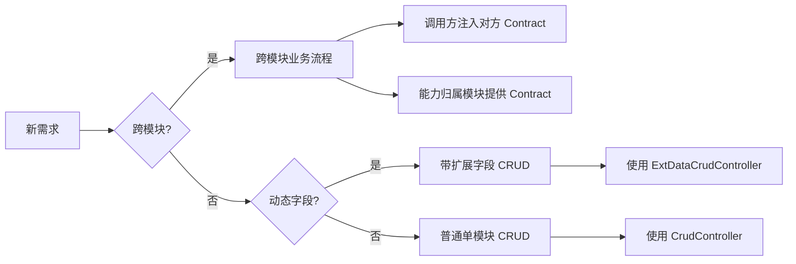
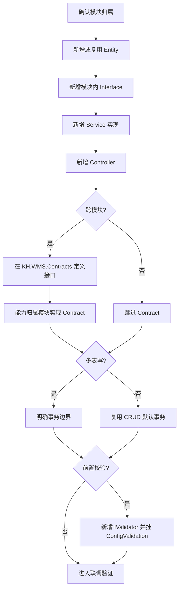
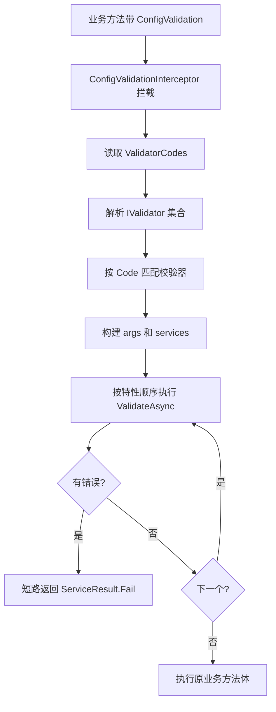

# 第 8 章 后端开发标准流程 教程

> 来源: KH.WMS后端开发指引 V3.0.md。本文把原章节单独抽出来，并补充“干什么、什么时候看、怎么执行”，用于新人培训和日常开发查阅。

## 这一章是干什么的

给出新增后端能力的标准执行顺序，从需求类型、模块归属、实体、接口、Service、Controller、Contract、事务、校验到联调。

## 什么时候需要看

真正开始写一个后端接口或业务能力时，把这一章当执行手册。

## 怎么执行

- 先判断需求类型和业务归属模块。
- 按顺序新增 Entity、模块内 Service 接口、Service 实现、Controller。
- 再判断是否需要 Contract、事务、可插拔校验器，最后做 Swagger 和前端联调。

## 执行后怎么验证

按章节步骤走完后，接口能构建通过、Swagger 可访问、主流程和异常流程可验证。

## 下一步看哪里

如果需要选择普通 CRUD 还是 ExtData CRUD，读第 9 章；如果跨模块，读第 10 章。

---


### 8.1 第一步:判断需求类型

后端需求先分三类:

先用这张图做第一轮判断:



这张图只解决“先走哪条路”,具体落代码再按后面的步骤细化。

| 类型 | 判断方式 | 典型做法 |
| --- | --- | --- |
| 普通单模块 CRUD | 只是维护一张业务表或主从表,不需要动态扩展字段 | Entity + Interface + Service + `CrudController<TEntity>` |
| 带扩展字段 CRUD | 表里有 `ExtData`,前端表单需要动态字段保存/回显 | Entity + Interface + Service + `ExtDataCrudController<TEntity>` |
| 跨模块业务流程 | 一个模块要调用另一个模块的业务能力,或写多模块拥有的数据 | 能力归属模块提供 Contract,调用方注入 Contract |

例子:

- 新增“物料分类”维护:普通 CRUD。
- 新增“供应商动态字段”:带扩展字段 CRUD。
- 入库组盘后申请上架任务:跨模块流程,入库模块调用任务模块 `ITaskContract`。
- 任务上架完成后生成库存:跨模块流程,任务模块调用库存模块 `IInventoryContract`。

不要把“页面在哪个菜单”当成唯一判断标准。页面可以挂在入库菜单下,但如果它改的是库存数量,规则仍属于 `InventoryModule`。

### 8.2 第二步:判断业务归属模块

判断归属模块看“谁拥有这条数据和规则”,不是看“哪个页面点击”。

| 需求 | 归属 |
| --- | --- |
| 物料、客户、供应商、容器 | `BaseDataModule` |
| 入库单、收货、组盘、上架请求 | `InboundModule` |
| 库存生成、扣减、锁定、移库 | `InventoryModule` |
| 出库单、出库分配 | `OutboundModule` |
| 任务创建、任务完成、任务确认 | `TaskModule` |
| 仓库、库区、库位、站台 | `WarehouseModule` |
| 用户、角色、权限、字典、参数 | `SystemModule` |
| 首页统计、趋势和概览 | `DashboardModule` |

判断技巧:

- 数据表的生命周期由哪个模块控制,就优先归哪个模块。
- 状态流转规则归哪个模块维护,就优先归哪个模块。
- 如果只是“流程里要用一下”,不要把对方模块的规则搬过来。

例如 `InboundContainerBindService.ContainerBindAsync` 在入库模块里编排组盘流程,但它注册容器、更新容器状态走 `IContainerContract`,创建任务走 `ITaskContract`,不会直接在入库模块里写容器和任务表的完整规则。

### 8.3 第三步:新增实体

确定需求类型和模块归属后,标准开发节奏如下:



这张图可以当成开发顺序清单:先把基础骨架放对,再处理跨模块、事务和校验。

业务实体放在:

```text
KH.WMS/Entities/KH.WMS.Entities/{Domain}/
```

不要放进模块项目里。实体集中放在 `KH.WMS.Entities`,仓储、Contract、多个业务模块才能稳定复用。

实体基本要求:

- 继承 `BaseEntity<long>`。
- 表字段用实体属性表达。
- 业务状态值优先使用统一常量,不要散落魔法字符串。
- 如果需要扩展字段,实体必须有 `string? ExtData` 属性。
- 只放轻量实体内规则,不要在实体里查库或调用 Service。

普通实体示意:

```csharp
public class MdMaterialCategory : BaseEntity<long>
{
    public string CategoryCode { get; set; } = string.Empty;
    public string CategoryName { get; set; } = string.Empty;
}
```

带扩展字段实体示意:

```csharp
public class MdMaterial : BaseEntity<long>
{
    public string MaterialCode { get; set; } = string.Empty;
    public string MaterialName { get; set; } = string.Empty;
    public string? ExtData { get; set; }
}
```

如果一个字段会被查询、排序、统计、作为业务规则条件,优先建正式列。`ExtData` 更适合客户化扩展信息,不是逃避数据库设计的通用桶。

### 8.4 第四步:新增模块内 Service 接口

接口放在模块项目:

```text
KH.WMS/Modules/{Module}Module/KH.WMS.Modules.{Module}Module/Interfaces/
```

普通 CRUD 接口一般继承 `ICrudService<TEntity>`:

```csharp
public interface IMaterialService : ICrudService<MdMaterial>
{
}
```

如果有业务动作,把动作声明在接口里:

```csharp
public interface IInboundContainerBindService : ICrudService<InboundContainerBindHeader>
{
    Task<ServiceResult> ContainerBindAsync(List<ContainerBindDto> binds);
    Task<ServiceResult> RequestPutAwayAsync(List<long> headerIds);
}
```

接口的作用:

- Controller 通过接口注入 Service。
- AOP 拦截器基于接口代理工作。
- `[RegisteredService(ServiceType = typeof(IXxxService))]` 用它明确注册关系。
- 单元测试或替换实现时,接口是稳定边界。

模块内接口不是跨模块 Contract。别的模块不应该引用这里的 `Interfaces/`。

### 8.5 第五步:新增 Service 实现

Service 放在:

```text
KH.WMS/Modules/{Module}Module/KH.WMS.Modules.{Module}Module/Services/
```

标准写法:

```csharp
[RegisteredService(ServiceType = typeof(IMaterialService))]
public class MaterialService(
    IRepository<MdMaterial, long> repository,
    IUnitOfWork unitOfWork,
    IDetailSaveService detailSaveService)
    : CrudService<MdMaterial>(repository, unitOfWork, detailSaveService),
      IMaterialService
{
}
```

这类 Service 很薄是正常的。`MaterialService` 只是标准维护时,没有必要为了“显得有业务”重写 CRUD。

写 Service 时先问四个问题:

1. 是否只是继承通用 CRUD  
   是的话,保持 Service 很薄,让 `CrudService<TEntity>` 处理通用增删改查、导入导出、启停用等行为。

2. 是否写多表  
   写多表就要有事务边界,通常在 Service 方法内用 `IUnitOfWork`。

3. 是否调用别的模块  
   调别的模块只能注入对方 Contract,不要引用对方 Service。

4. 是否存在可配置、可组合的前置规则  
   像批次必填、效期必填、混料、混批、数量限制,可以考虑 `IValidator` + `[ConfigValidation]`。

反例:

```csharp
// 不推荐:入库 Service 直接 new 或注入 TaskHeaderService
public class InboundService(TaskHeaderService taskHeaderService)
{
}
```

正确方向:

```csharp
public class InboundService(ITaskContract taskContract)
{
}
```

### 8.6 第六步:新增 Controller

Controller 放在:

```text
KH.WMS/Modules/{Module}Module/KH.WMS.Modules.{Module}Module/Controllers/
```

普通 CRUD:

```csharp
[Route("api/material-category")]
public class MaterialCategoryController(IMaterialCategoryService service)
    : CrudController<MdMaterialCategory>(service)
{
}
```

带扩展字段 CRUD:

```csharp
[Route("api/material")]
public class MaterialController(IMaterialService materialService)
    : ExtDataCrudController<MdMaterial>(materialService)
{
}
```

`MaterialController`、`CustomerController`、`SupplierController` 当前都继承 `ExtDataCrudController<TEntity>`,并额外提供 `form-config` 接口读取配置层扩展字段定义:

```csharp
[HttpGet("form-config")]
public async Task<IActionResult> GetFormConfig()
{
    var extService = HttpContext.RequestServices.GetRequiredService<ICfgExtFieldContract>();
    var fields = await extService.GetFieldsAsync("MD_MATERIAL", "HEADER");
    var columns = extService.BuildFormColumns(fields);
    return Ok(new { success = true, data = new { columns } });
}
```

这类接口仍然只做入口和组装,真正的扩展字段定义能力由配置层提供。

Controller 只做:

- 定义路由。
- 接收参数。
- 调 Service 或底座抽象。
- 返回统一响应或简单配置结果。

Controller 不做:

- 多表事务。
- 复杂业务判断。
- 直接写数据库。
- 直接引用其他模块 Service。

### 8.7 第七步:判断是否需要 Contract

只有跨模块调用才需要 Contract。

不需要 Contract 的情况:

- Controller 调本模块 Service。
- 本模块 Service 调本模块另一个 Service。
- 只是前端调用后端接口。
- 只是本模块内部复用方法。

需要 Contract 的情况:

- 入库模块要让任务模块创建上架任务。
- 任务模块要让库存模块生成库存。
- 出库模块要让库存模块锁定或扣减库存。
- 多个模块都需要读取或更新同一类主数据能力。

Contract 是模块之间的门面,不是为了“多写一层”。判断是否需要 Contract 时只问一句:

```text
这个能力是否要被另一个业务模块调用?
```

答案是“是”,才考虑 Contract。答案是“否”,继续留在模块内 Service。

### 8.8 第八步:处理事务和校验

通用 CRUD 的 `CreateAsync`、`UpdateAsync`、`DeleteAsync`、`BatchDeleteAsync` 已经在 `CrudService<TEntity>` 内处理事务。

自己写业务方法时,只要涉及多表写入,就要明确事务:

```csharp
await unitOfWork.BeginTransactionAsync();
try
{
    // 写主表、明细、状态、流水
    await unitOfWork.CommitAsync();
    return ServiceResult.Ok();
}
catch
{
    await unitOfWork.RollbackAsync();
    throw;
}
```

`InboundContainerBindService.ContainerBindAsync` 是一个典型例子:

- 开启事务。
- 注册容器。
- 对容器行加 `UpdLock`,串行化同一容器的并发组盘。
- 校验容器是否可用。
- 校验入库单行是否存在。
- 构建组盘头和明细。
- 更新容器状态。
- 检查入库单是否全部组盘。
- 提交事务或回滚。

校验分层建议:

| 校验类型 | 放哪里 | 例子 |
| --- | --- | --- |
| 简单字段必填、格式 | Service 或 DTO 入口 | 参数为空、数量小于等于 0 |
| 可配置前置规则 | `IValidator` + `[ConfigValidation]` | 批次必填、效期必填、混料、混批 |
| 依赖锁和事务内状态 | Service 方法内部 | 容器是否已有库存、是否有活跃任务 |
| 实体自身规则 | Entity 方法 | 入库行可组盘数量计算 |
| 跨模块状态变更 | Contract 或能力归属模块 Service | 容器状态、库位状态、库存生成 |

不要把所有校验都塞进 Validator。Validator 适合“方法执行前就能判断”的规则;如果规则依赖事务内锁定后的状态,继续放 Service 方法内部。

### 8.9 第九步:新增可插拔校验器

`InboundContainerBindService.ContainerBindAsync` 是当前最典型的校验器用法:

```csharp
[ConfigValidation(ValidatorCodes.BIND_DATA_NOT_EMPTY)]
[ConfigValidation(ValidatorCodes.BIND_QUANTITY)]
[ConfigValidation(ValidatorCodes.BATCH_NO_REQUIRED)]
[ConfigValidation(ValidatorCodes.EXPIRY_DATE_REQUIRED)]
[ConfigValidation(ValidatorCodes.MIXED_MATERIAL)]
[ConfigValidation(ValidatorCodes.MIXED_BATCH)]
public async Task<ServiceResult> ContainerBindAsync(List<ContainerBindDto> binds)
{
    // 只有所有 ConfigValidation 校验通过,才会进入方法体
}
```

这段代码表达了两件事:

- 组盘方法本体不关心这些规则是否启用,只声明需要执行哪些校验。
- 每个校验器只关心自己那一条规则,例如数量、批次、效期、混料、混批。

#### 2.9.1 校验器执行机制

`ConfigValidationInterceptor` 会拦截带 `[ConfigValidation]` 的业务方法:



因此,校验器失败时不会进入 Service 方法体;只有所有校验器都返回 `null`,业务方法才真正执行。

1. 读取方法上的多个 `[ConfigValidation(ValidatorCodes.XXX)]`。
2. 从 DI 中解析 `IEnumerable<IValidator>`。
3. 按 `IValidator.Code` 建字典。
4. 构建服务字典,当前会尝试放入 `"ConfigService"`。
5. 按特性声明顺序执行校验器。
6. 任一校验器返回错误字符串,立即短路返回 `ServiceResult.Fail(errorMessage)`。
7. 全部返回 `null`,才执行原方法体。

当前校验拦截器按源码注释和项目用法主要面向:

```text
Task<ServiceResult>
Task<ServiceResult<T>>
```

不要把 `[ConfigValidation]` 挂在直接返回 `ApiResponse`、普通对象、`void` 的方法上。

#### 2.9.2 什么时候适合新建校验器

适合:

- 规则可以在方法执行前判断。
- 规则可以独立开关或组合。
- 规则可能被多个方法复用。
- 规则失败时只需要返回错误消息,不需要修改数据。

不适合:

- 必须依赖事务内加锁后的最新状态。
- 校验和写入必须保持强一致。
- 规则执行过程中会修改数据。
- 规则只服务某个方法内部一两行代码,抽出去反而降低可读性。

`ContainerBindAsync` 中的区分很清楚:

- `BATCH_NO_REQUIRED`、`EXPIRY_DATE_REQUIRED`、`MIXED_MATERIAL`、`MIXED_BATCH` 是前置规则,适合 Validator。
- 容器是否已有活跃组盘、是否已有库存、是否有活跃任务,依赖事务和锁,留在 Service 方法内部。

#### 2.9.3 新增校验器开发步骤

新增校验器可以按这条链路落代码:


这条链路里最容易漏的是三处编码一致:常量、`Code` 属性、方法特性。

第一步,在 `ValidatorCodes` 新增唯一编码:

```csharp
public const string OWNER_REQUIRED = "OWNER_REQUIRED";
```

第二步,在业务模块新增校验器类。入库组盘相关校验放:

```text
KH.WMS/Modules/InboundModule/KH.WMS.Modules.InboundModule/Validation/
```

模板:

```csharp
using KH.WMS.Core.DependencyInjection.ServiceLifetimes;
using KH.WMS.Core.Validation;
using KH.WMS.Modules.InboundModule.DTOs;

namespace KH.WMS.Modules.InboundModule.Validation;

[RegisteredService(WithoutInterceptor = true, ServiceType = typeof(IValidator))]
public class OwnerRequiredValidator : IValidator
{
    public string Code => ValidatorCodes.OWNER_REQUIRED;

    public Task<string?> ValidateAsync(object?[] args, Dictionary<string, object>? services = null)
    {
        var binds = args.OfType<List<ContainerBindDto>>().FirstOrDefault();
        if (binds == null || binds.Count == 0)
            return Task.FromResult<string?>(null);

        foreach (var bind in binds)
        {
            // 示例:按真实 DTO 字段替换这里的判断
            // if (bind.OwnerId <= 0)
            //     return Task.FromResult<string?>("货主不能为空");
        }

        return Task.FromResult<string?>(null);
    }
}
```

第三步,如果需要查库,通过构造函数注入依赖。`BindQuantityValidator` 当前就是这样做的:

```csharp
[RegisteredService(WithoutInterceptor = true, ServiceType = typeof(IValidator))]
public class BindQuantityValidator : IValidator
{
    private readonly ISqlSugarClient _db;

    public BindQuantityValidator(ISqlSugarClient db)
    {
        _db = db;
    }

    public string Code => ValidatorCodes.BIND_QUANTITY;
}
```

第四步,如果需要读取配置,从 `services["ConfigService"]` 获取配置服务。`BatchNoRequiredValidator` 当前就是这样做的:

```csharp
private static IConfigResolverContract? GetConfigService(Dictionary<string, object>? services)
{
    if (services == null) return null;
    return services.TryGetValue("ConfigService", out var svc)
        ? svc as IConfigResolverContract
        : null;
}
```

第五步,把校验器挂到业务方法上:

```csharp
[ConfigValidation(ValidatorCodes.OWNER_REQUIRED)]
public async Task<ServiceResult> ContainerBindAsync(List<ContainerBindDto> binds)
{
}
```

第六步,联调时确认三处编码一致:

```text
ValidatorCodes.OWNER_REQUIRED
OwnerRequiredValidator.Code
[ConfigValidation(ValidatorCodes.OWNER_REQUIRED)]
```

#### 2.9.4 校验器写法注意点

- `ValidateAsync` 返回 `null` 表示通过。
- 返回非空字符串表示失败,这个字符串会成为 `ServiceResult.Fail(...)` 的消息。
- `args` 是被拦截方法的参数数组,要按真实参数类型取值。
- 多个校验器的执行顺序就是方法上多个 `[ConfigValidation]` 的声明顺序。
- 校验器一般写 `[RegisteredService(WithoutInterceptor = true, ServiceType = typeof(IValidator))]`,避免校验器本身再被 AOP 拦截。
- 当前无拦截器注册分支会按实现类的第一个接口注册,所以 Validator 类建议只实现 `IValidator`,不要再混杂实现其他接口。

### 8.10 第十步:联调验证

开发完至少检查:

- Controller 是否能在 Swagger 看到。
- Controller 路由是否符合前端约定。
- Service 是否能被 DI 注入。
- `[RegisteredService(ServiceType = typeof(...))]` 是否写对。
- 如果新增了校验器,`ValidatorCodes`、`IValidator.Code`、`[ConfigValidation(...)]` 三处编码是否一致。
- 如果是跨模块能力,Contract 接口和实现是否都存在。
- 写多表是否在同一事务内。
- 失败路径是否 Rollback。
- 返回是否是 `ApiResponse` 或 `ServiceResult` 再转换成 `ApiResponse`。
- ExtData 页面是否能保存 `extDataRaw` 并在详情回显。
- WCS/PDA/批量动作是否考虑重复提交。

联调顺序建议:

```text
Swagger 能看到接口
  -> DI 能创建 Controller
  -> 普通参数校验通过
  -> Service 主流程通过
  -> 数据库落库正确
  -> 前端页面保存/查询/回显正确
  -> 异常分支返回可读错误
```

---


## 继续阅读

- [后端 V3 教程目录](/backend/后端开发指引V3教程/README)
- [后端架构设计思路](/backend/架构设计/KH.WMS后端架构设计思路)
- [底层机制索引](/backend/后端底层概念/README)
