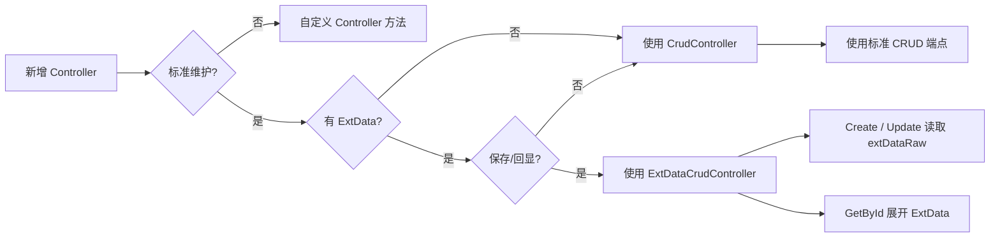

# 第 9 章 `CrudController<TEntity>` 与 `ExtDataCrudController<TEntity>` 怎么选 教程

> 来源: KH.WMS后端开发指引 V3.0.md。本文把原章节单独抽出来，并补充“干什么、什么时候看、怎么执行”，用于新人培训和日常开发查阅。

## 这一章是干什么的

专门解释普通 CRUD Controller 和 ExtData CRUD Controller 的职责差异，避免为了动态字段滥用复杂基类。

## 什么时候需要看

需求里出现扩展字段、动态表单、ExtData 保存回显，或者不知道 Controller 应继承哪个基类时。

## 怎么执行

- 先判断实体是否有 `ExtData`，以及前端是否需要动态字段。
- 普通表维护优先使用 `CrudController<TEntity>`。
- 只有需要动态扩展字段保存/回显时才使用 `ExtDataCrudController<TEntity>`。

## 执行后怎么验证

能给每个维护页明确选择普通 CRUD 或 ExtData CRUD，并说明选择原因。

## 下一步看哪里

如果 ExtData 之外还涉及跨模块能力，继续读第 10 章。

---

## 原章节内容

# 第 9 章 `CrudController<TEntity>` 与 `ExtDataCrudController<TEntity>` 怎么选

### 9.1 `CrudController<TEntity>` 做什么

`CrudController<TEntity>` 是标准 CRUD 控制器基类。

它提供这些端点:

| 方法 | 路由 | 作用 |
| --- | --- | --- |
| `GET` | `{id}` | 根据 ID 获取详情 |
| `POST` | `pagelist` | 分页查询 |
| `GET` | `all` | 获取全部 |
| `POST` | `create` | 新增 |
| `POST` | `update` | 更新 |
| `DELETE` | `delete/{id}` | 删除 |
| `DELETE` | `batch` | 批量删除 |
| `PUT` | `status/{id}` | 启用/禁用 |
| `POST` | `export` | 导出 |
| `POST` | `import` | 导入 |
| `GET` | `template` | 下载导入模板 |

使用条件:

- 实体继承 `BaseEntity<long>`。
- Service 实现 `ICrudService<TEntity>`。
- 页面就是普通维护页面。
- 不需要从请求体提取 `extDataRaw`。

例子:

```csharp
[Route("api/location")]
public class LocationController(ILocationService locationService)
    : CrudController<MdLocation>(locationService)
{
}
```

仓库、库区、库位、任务头、任务行、字典类基础维护大多适合 `CrudController<TEntity>`。

什么时候需要重写基类方法:

- 标准新增前后要补充业务动作。
- 标准删除前要做引用检查。
- 某个列表查询需要特殊过滤。

即使重写,也优先调用 Service,不要在 Controller 里直接写数据库。

### 9.2 `ExtDataCrudController<TEntity>` 做什么

`ExtDataCrudController<TEntity>` 继承 `CrudController<TEntity>`,只额外处理 ExtData。

当前源码里它做三件事:

1. `Create` 时从请求体原始 JSON 读取 `extDataRaw`,写入实体的 `ExtData` 属性。
2. `Update` 时从请求体原始 JSON 读取 `extDataRaw`,写入实体的 `ExtData` 属性。
3. `GetById` 时把实体的 `ExtData` JSON 展开为扁平属性,方便前端编辑回显。

注意:源码注释里也说明分页查询的展平由前端 load 函数处理,后端 `ExtDataCrudController` 当前没有覆盖 `GetPagedList`。

关键前提:

- 实体必须有 `string? ExtData` 属性。
- `Program.cs` 已启用 `Request.EnableBuffering()`,允许读取请求体原始 JSON。
- 前端保存时要传 `extDataRaw`。

例子:

```csharp
[Route("api/material")]
public class MaterialController(IMaterialService materialService)
    : ExtDataCrudController<MdMaterial>(materialService)
{
}
```

当前真实使用场景包括:

- `MaterialController`
- `CustomerController`
- `SupplierController`
- `InvInventoryDetailController`
- `InvMovementController`
- `InvFreezeRecordController`

### 9.3 两者怎么选

Controller 基类先按这张决策树选:



结论很简单:只有“实体有 `ExtData`”和“页面真的需要动态字段保存/回显”同时成立,才使用 `ExtDataCrudController`。

| 场景 | 选哪个 | 原因 |
| --- | --- | --- |
| 普通字典、仓库、库区、任务头、任务行 | `CrudController<TEntity>` | 不需要动态扩展字段处理 |
| 物料、客户、供应商 | `ExtDataCrudController<TEntity>` | 基础资料常需要扩展字段 |
| 库存明细、库存移动、冻结记录 | `ExtDataCrudController<TEntity>` | 库存业务可能带动态扩展字段 |
| 只是以后可能扩展 | 先用 `CrudController<TEntity>` | 不要为了猜测增加 ExtData 行为 |
| 实体没有 `ExtData` 属性 | `CrudController<TEntity>` | `ExtDataCrudController` 对它没有意义 |

选择前问三个问题:

```text
前端是否真的需要动态字段?
实体是否真的有 ExtData?
这个字段是否不适合建成正式列?
```

三个答案都明确,再用 `ExtDataCrudController`。

### 9.4 为什么不要滥用 `ExtDataCrudController`

`ExtDataCrudController` 会读取请求体原始 JSON,并在详情返回时做 JSON 展开。它是为动态字段服务的,不是“高级版 Controller”。

滥用会带来问题:

- 新人误以为所有实体都有 `ExtData`。
- 前端可能开始传不受控字段。
- 数据含义从表字段变成 JSON 字段,后续查询和统计更复杂。
- 业务规则容易绕过明确字段约束。
- `ExtData` 字段里的内容难以做数据库级约束。

正确使用方式:

- 先建清楚实体正式字段。
- 确认客户化扩展信息不适合固定列。
- 实体增加 `ExtData`。
- Controller 继承 `ExtDataCrudController<TEntity>`。
- 页面保存传 `extDataRaw`,详情依赖 `GetById` 展开回显。

---
