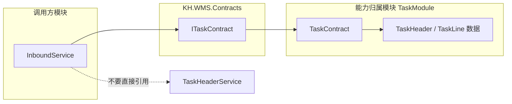
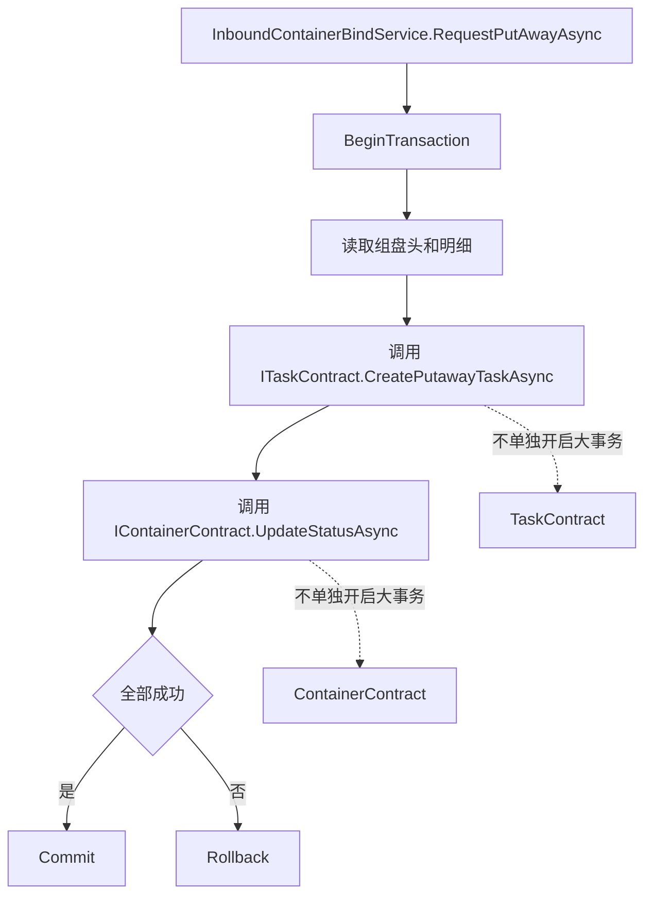
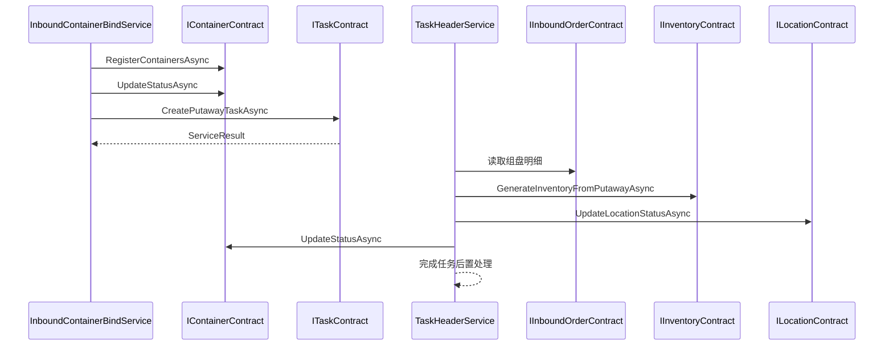

# 第 10 章 跨模块 Contract 契约 教程

> 来源: KH.WMS后端开发指引 V3.0.md。本文把原章节单独抽出来，并补充“干什么、什么时候看、怎么执行”，用于新人培训和日常开发查阅。

## 这一章是干什么的

说明模块之间如何通过 Contract 协作，Contract 放哪里、暴露什么、调用方怎么写、事务由谁控制。

## 什么时候需要看

一个模块需要调用另一个模块能力，例如入库流程生成库存、任务模块调用库存能力时。

## 怎么执行

- 先判断能力归属哪个模块，由拥有方定义 Contract。
- Contract 只暴露稳定业务能力，不暴露内部 Service 细节。
- 调用方注入 Contract，并确认事务边界由流程编排方还是能力提供方控制。

## 执行后怎么验证

跨模块调用不直接引用对方 `Services/`，而是通过明确的 Contract 接口完成。

## 下一步看哪里

Contract 用在流程型业务里时，继续读第 11 章看事务、校验和幂等。

---


### 10.1 为什么要有 Contract

如果 `InboundModule` 直接引用 `TaskModule.Services.TaskHeaderService`,会产生几个问题:

- 入库模块被任务模块内部实现绑死。
- 任务模块改 Service 构造函数,入库模块可能跟着编译失败。
- 模块之间引用会越来越乱,最后形成循环依赖。
- 业务边界不清楚:别人不知道任务模块到底允许外部调用哪些能力。

Contract 解决的是“模块之间怎么说话”的问题。



调用方只知道 `ITaskContract`,不知道任务模块内部有多少 Service、多少表、多少流程。

当前真实例子:

- `ITaskContract`:供入库、出库等模块创建任务。
- `IInventoryContract`:供任务、出库等模块生成、锁定、扣减、移动库存。
- `IContainerContract`:供入库、任务、库存等模块注册容器和更新容器状态。
- `ILocationContract`:供任务、库存等模块更新库位状态。

### 10.2 Contract 放哪里

接口放公共契约项目:

```text
KH.WMS/Contracts/KH.WMS.Contracts/{Domain}/I{能力}Contract.cs
```

实现放能力归属模块:

```text
KH.WMS/Modules/{OwnerModule}/KH.WMS.Modules.{OwnerModule}/Contracts/{能力}Contract.cs
```

示例:

| 能力 | 接口 | 实现 |
| --- | --- | --- |
| 创建任务 | `KH.WMS.Contracts/Task/ITaskContract.cs` | `TaskModule/Contracts/TaskContract.cs` |
| 操作库存 | `KH.WMS.Contracts/Inventory/IInventoryContract.cs` | `InventoryModule/Contracts/InventoryContract.cs` |
| 容器状态 | `KH.WMS.Contracts/Container/IContainerContract.cs` | `BaseDataModule/Contracts/ContainerContract.cs` |
| 库位状态 | `KH.WMS.Contracts/Warehouse/ILocationContract.cs` | `WarehouseModule/Contracts/LocationContract.cs` |

`KH.WMS.Config` 是技术底座例外。配置层相关抽象在 `KH.WMS.Config.Abstractions`,业务开发知道怎么调用即可,不要把它当业务模块 Contract 模板。

### 10.3 Contract 应该暴露什么

Contract 只暴露“别人真的需要”的业务能力。

好的 Contract:

```csharp
public interface ITaskContract
{
    Task<ServiceResult<string>> CreatePutawayTaskAsync(PutawayTaskRequest request);
    Task<ServiceResult<string>> CreatePickingTaskAsync(PickingTaskRequest request);
}
```

它表达的是任务模块愿意对外提供的能力:创建上架任务、创建拣货任务。

不好的 Contract:

```csharp
public interface ITaskContract
{
    Task<ApiResponse> GetPagedList(...);
    Task<ApiResponse> Create(TaskHeader entity);
    Task<ApiResponse> Update(TaskHeader entity);
    Task<ApiResponse> Delete(long id);
}
```

这相当于把任务模块内部 CRUD 全部暴露给别人,模块边界会失控。

Contract 请求模型也要按能力设计,不要直接把调用方页面 DTO 传过去。比如创建上架任务用 `PutawayTaskRequest`,里面放任务模块真正需要的仓库、单据、容器、起点、终点、任务行。

### 10.4 Contract 调用方怎么写

调用方只注入接口:

```csharp
public class InboundContainerBindService(
    IContainerContract containerContract,
    ITaskContract taskContract,
    IInboundOrderContract inboundOrderContract)
{
}
```

不要引用实现类:

```csharp
// 不推荐
public class InboundContainerBindService(TaskContract taskContract)
{
}
```

也不要引用对方模块 `Services/`:

```csharp
// 不推荐
using KH.WMS.Modules.TaskModule.Services;
```

正确引用方向:

```csharp
using KH.WMS.Contracts.Tasks;
```

调用时把当前流程已经明确的数据转换成 Contract 请求:

```csharp
var taskRequest = new PutawayTaskRequest
{
    WarehouseId = header.WarehouseId ?? 0,
    DocId = header.Id,
    DocNo = header.SourceDocNo,
    ContainerNo = header.ContainerCode,
    Lines = header.Details.Select(d => new PutawayTaskLineRequest
    {
        MaterialId = d.MaterialId,
        MaterialCode = d.MaterialCode,
        MaterialName = d.MaterialName,
        BatchNo = d.BatchNo,
    }).ToList(),
};

return await _taskContract.CreatePutawayTaskAsync(taskRequest);
```

### 10.5 事务由谁控制

跨模块流程里,调用方控制事务。

例如入库申请上架任务:



这样任务创建、容器状态变更和入库组盘状态可以在同一条业务链路里处理。

被调 Contract 不应该随便开启一个独立大事务,否则调用方无法保证整条业务链路一致。当前 `TaskContract` 使用 `IUnitOfWork` 获取仓储并写任务头、任务行,但事务边界通常由外层流程控制。

例外是 Contract 内部非常独立的单点能力,但这种情况要谨慎,并在方法语义里说清楚。

### 10.6 什么时候不要写 Contract

不要为了“规范”机械加 Contract。

这些情况不需要:

- Controller 调本模块 Service。
- 本模块 Service 调本模块另一个 Service。
- 私有辅助方法。
- 只服务一个内部流程的函数。
- 还没有任何跨模块调用方。

真正需要时再写。Contract 越多,维护成本越高。

### 10.7 贯穿例子:入库上架到库存生成

一个典型链路:



这个链路里:

- 入库模块负责组盘和申请上架。
- 任务模块负责创建任务、完成任务。
- 库存模块通过 `IInventoryContract` 暴露“生成库存”能力。
- 仓储模块通过 `ILocationContract` 暴露“更新库位状态”能力。
- 基础资料模块通过 `IContainerContract` 暴露“注册/更新容器”能力。

各模块互相协作,但不直接钻进对方 `Services/`。

---


## 继续阅读

- [后端 V3 教程目录](/backend/后端开发指引V3教程/README)
- [后端架构设计思路](/backend/架构设计/KH.WMS后端架构设计思路)
- [底层机制索引](/backend/后端底层概念/README)
