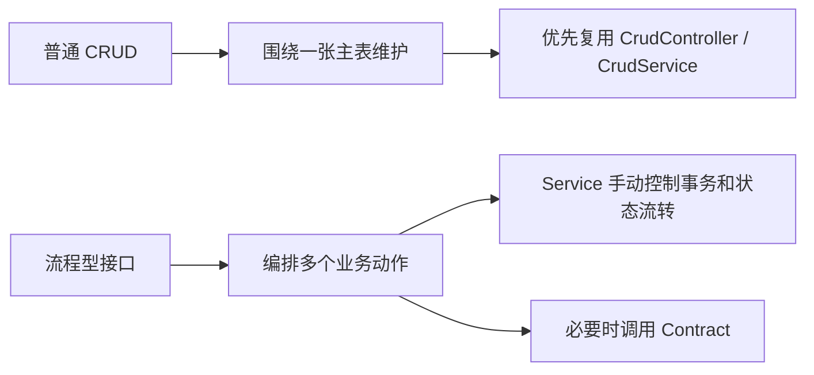
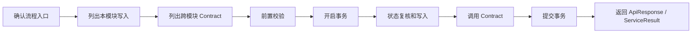
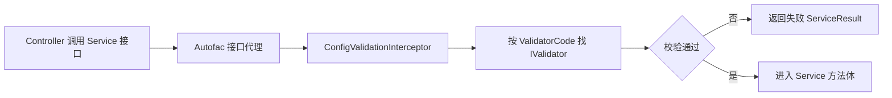

# 第 11 章 业务流程、事务和校验扩展 教程

> 来源: KH.WMS后端开发指引 V3.0.md。本文把原章节单独抽出来，并补充“干什么、什么时候看、怎么执行”，用于新人培训和日常开发查阅。

## 这一章是干什么的

说明流程型接口与普通 CRUD 的差异，以及事务边界、校验位置、可插拔校验器、并发和幂等怎么处理。

## 什么时候需要看

开发入库、上架、出库、任务完成、库存变更等多步骤业务流程时。

## 怎么执行

- 先识别这是流程型接口，不要强行塞进普通 CRUD。
- 确定流程编排 Service 和事务边界。
- 把固定校验放流程内，可配置/可组合规则抽成校验器，并补并发和幂等检查。

## 执行后怎么验证

流程接口能覆盖成功路径、失败回滚、重复提交、状态不允许等关键场景。

## 下一步看哪里

需要执行命令和检查清单时，看附录 A、B、C。

---

## 原章节内容

# 第 11 章 业务流程、事务和校验扩展

前面的章节解决“单模块 CRUD 怎么写”和“跨模块能力怎么暴露”。本章专门讲流程型接口:它通常不是维护一张表,而是一次请求里完成多步校验、多表写入、跨模块调用和状态流转。

典型场景:

- 入库组盘后申请上架任务。
- WCS/PDA 完成任务后生成库存、更新库位、更新容器状态。
- 出库分配时锁定库存并创建拣选任务。
- 批量操作时需要防重复提交和状态复核。

### 11.1 流程型接口和普通 CRUD 的区别



普通 CRUD 的重点是“表维护”。流程型接口的重点是“业务动作完成后系统状态一致”。所以流程型接口不要硬塞进 `create/update/delete`,而是单独定义业务方法和路由。

### 11.2 流程型接口推荐落地顺序



开发时按这个清单检查:

- 入口是 Controller Action、WCS 回调、PDA 操作,还是后台任务。
- 哪些表属于本模块,由本 Service 写。
- 哪些能力属于其他模块,必须通过 Contract 调用。
- 哪些校验可以前置,哪些校验必须放在事务内状态复核。
- 失败时是否能整体回滚。
- 重复请求是否会造成重复写入。

### 11.3 事务边界怎么定

事务边界原则:

```text
谁编排流程,谁控制事务。
```

| 场景 | 推荐做法 |
| --- | --- |
| 标准单表 CRUD | 使用 `CrudService<TEntity>` 默认事务 |
| 一个 Service 内多表写入 | 调用方 Service 注入 `IUnitOfWork`,手动 `Begin/Commit/Rollback` |
| 跨模块流程 | 流程编排方控制事务,被调用方通过 Contract 提供能力 |
| Contract 被多个流程复用 | Contract 内部不要随意开启独立事务,避免破坏上游整体一致性 |
| 事务内提前失败 | 失败前必须 Rollback,或把可失败校验放到开启事务之前 |

如果一个方法在事务内 `return ServiceResult.Fail(...)`,要特别小心:这不会自动抛异常,也不一定触发 rollback。最稳妥的做法是把可预期失败前置到事务外,或者失败分支明确回滚。

### 11.4 校验放在哪里

校验分三类:

| 校验类型 | 放哪里 | 例子 |
| --- | --- | --- |
| 字段格式和必填 | DTO / 前端 / Service 前置 | 编码不能为空、数量必须大于 0 |
| 可配置业务规则 | `IValidator` + `[ConfigValidation]` | 是否允许混批、是否允许超收 |
| 事务内状态复核 | Service 方法事务内 | 当前容器是否已绑定、任务是否已完成、库存是否仍可锁定 |

可插拔校验适合“规则可以组合、可以配置、可以在方法执行前短路”的场景。不适合依赖锁、依赖事务内最新状态的判断。

### 11.5 可插拔校验器执行链路



让校验器生效要同时满足:

- 目标 Service 通过接口代理调用。
- 目标 Service 没有设置 `WithoutInterceptor = true`。
- 目标方法标了 `[ConfigValidation(ValidatorCodes.XXX)]`。
- Validator 实现 `IValidator`。
- Validator 注册为 `[RegisteredService(WithoutInterceptor = true, ServiceType = typeof(IValidator))]`。
- `ValidatorCodes`、`IValidator.Code`、`ConfigValidation` 三处编码一致。

### 11.6 并发和幂等要点

流程型接口最容易出问题的不是代码跑不通,而是重复请求或并发请求导致状态错乱。

常见保护手段:

- 写入前检查当前状态是否允许执行。
- 写入时再次复核状态,不要只相信前端传入状态。
- 对容器、任务、库存这类关键资源加锁或使用数据库条件更新。
- WCS/PDA 回调按业务单号、任务号或容器号做幂等判断。
- 批量动作要能识别部分成功、部分失败,并给出清晰错误。

### 11.7 流程型接口联调检查

联调时不要只看接口返回成功,还要查状态结果:

- 主表状态是否正确流转。
- 子表数量和状态是否一致。
- 跨模块数据是否通过 Contract 写入。
- 失败场景是否整体回滚。
- 重复提交是否被拦住。
- 响应里是否有 `TraceId`。
- 日志能否根据 TraceId 还原调用链。

---
