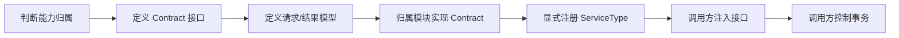
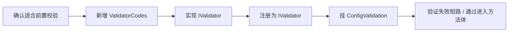
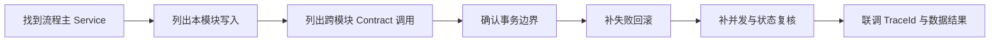

# 附录 B 开发检查清单 教程

> 来源: KH.WMS后端开发指引 V3.0.md。本文把原章节单独抽出来，并补充“干什么、什么时候看、怎么执行”，用于新人培训和日常开发查阅。

## 这一章是干什么的

把常见开发场景整理成勾选清单，确保新增 CRUD、ExtData、Contract、校验器、流程修改和联调不漏步骤。

## 什么时候需要看

开发完成准备自测、提测或交给前端联调前。

## 怎么执行

- 根据当前任务选择对应清单。
- 逐项检查文件、注册、Swagger、事务、校验、前端联调。
- 未通过的项目回到对应章节补齐。

## 执行后怎么验证

清单项全部完成，且构建、Swagger、主流程、异常流程都有证据。

## 下一步看哪里

如果清单发现问题，优先按附录 C 的常见坑定位。

---

### B.1 新增普通 CRUD

- [ ] 判断业务归属模块。
- [ ] Entity 放到 `KH.WMS.Entities/{Domain}/`。
- [ ] Entity 继承 `BaseEntity<long>`。
- [ ] Entity 表名、字段类型、必填、索引和数据库约束确认清楚。
- [ ] Interface 放模块 `Interfaces/`,继承 `ICrudService<TEntity>`。
- [ ] Service 放模块 `Services/`,继承 `CrudService<TEntity>`。
- [ ] Service 标记 `[RegisteredService(ServiceType = typeof(IXxxService))]`。
- [ ] Service 通过接口注入,不要手动 new,确保 AOP 能执行。
- [ ] Controller 继承 `CrudController<TEntity>`。
- [ ] 路由使用 `api/xxx` 风格。
- [ ] Controller 所在项目程序集名称包含 `.Modules.`。
- [ ] 模块项目能被启动项目引用或扫描到。
- [ ] Swagger 能看到接口。
- [ ] Swagger 看不到时,先查 Controller 扫描、路由、模块引用和构造函数依赖。
- [ ] 分页查询确认前端字段名和后端实体属性名一致。
- [ ] 如需默认过滤、联表或查询后处理,优先重写 `CrudService` 查询钩子。
- [ ] 如需新增前校验、删除前引用检查,优先重写 `BeforeCreateAsync` / `BeforeDeleteAsync` 等钩子。
- [ ] 如果实体支持启停,实现 `IEnableDisableEntity`,并确认状态字段是 `Status` / `IsActive` 或配置 `[StatusFieldName]`。
- [ ] 多表写入确认是否通过 `IDetailSaveService` 或自定义事务处理。
- [ ] 前端能调通分页、新增、更新、删除。
- [ ] 新增、更新、删除失败时能从响应 `traceId` 查到后端日志。
- [ ] 返回值使用 `ApiResponse`,不要裸返回匿名对象。
- [ ] 不需要动态字段时,不要使用 `ExtDataCrudController`。

### B.2 新增带 ExtData 的 CRUD

- [ ] 确认动态字段不适合建正式列。
- [ ] 参与核心查询、排序、统计或关键业务规则的字段不要放进 `ExtData`。
- [ ] 实体有 `string? ExtData` 属性。
- [ ] Service 仍按普通 `ICrudService<TEntity>` / `CrudService<TEntity>` 注册。
- [ ] Controller 继承 `ExtDataCrudController<TEntity>`。
- [ ] 前端保存时传 `extDataRaw`。
- [ ] `extDataRaw` 内容是合法 JSON 字符串。
- [ ] 确认 `Program.cs` 中启用了 `context.Request.EnableBuffering()`。
- [ ] 详情接口能把 `ExtData` 展开回显。
- [ ] 分页展示如需展开,确认前端 load 函数处理。
- [ ] 如需表单配置,通过配置层扩展字段 Contract 获取字段定义。
- [ ] 导出如需包含动态字段,确认 `ExportColumnDto` 中列配置能对应 ExtData key。
- [ ] ExtData 保存失败时,按实体属性、Controller 基类、`extDataRaw`、请求体缓冲顺序排查。

### B.3 新增跨模块能力

- [ ] 判断能力归属模块。
- [ ] 在 `KH.WMS.Contracts/{Domain}/` 定义 `I{能力}Contract`。
- [ ] 请求/结果模型也放在 Contracts 中。
- [ ] 在能力归属模块 `Contracts/` 实现。
- [ ] 实现类标记 `[RegisteredService(ServiceType = typeof(I{能力}Contract))]`。
- [ ] 调用方只注入接口,不引用对方 Service。
- [ ] 调用方控制事务。
- [ ] Contract 方法只暴露必要能力,不暴露整套 CRUD。
- [ ] Contract 不直接面向前端,前端仍调用 Controller。

### B.4 新增可插拔校验器

- [ ] 判断这条规则是否适合方法执行前校验;如果依赖事务内锁定后的状态,放回 Service 方法内部。
- [ ] 在 `KH.WMS.Core/Validation/ValidatorCodes.cs` 增加唯一编码。
- [ ] 在业务模块 `Validation/` 目录新增校验器类。
- [ ] 校验器实现 `IValidator`。
- [ ] `Code` 返回值和 `ValidatorCodes` 常量一致。
- [ ] 标记 `[RegisteredService(WithoutInterceptor = true, ServiceType = typeof(IValidator))]`。
- [ ] Validator 类只实现 `IValidator`,避免无拦截器注册时注册到其他接口。
- [ ] 从 `args` 中按真实方法参数类型取参数,例如 `args.OfType<List<ContainerBindDto>>().FirstOrDefault()`。
- [ ] 需要查库时通过构造函数注入 `ISqlSugarClient` 或必要服务。
- [ ] 需要读取配置时从 `services["ConfigService"]` 获取 `IConfigResolverContract`。
- [ ] 校验通过返回 `null`,校验失败返回错误消息字符串。
- [ ] 在目标方法上增加 `[ConfigValidation(ValidatorCodes.XXX)]`。
- [ ] 目标方法返回 `Task<ServiceResult>` 或 `Task<ServiceResult<T>>`。
- [ ] 目标 Service 不要设置 `WithoutInterceptor = true`。
- [ ] 确认多个 `[ConfigValidation]` 的顺序符合业务预期。

### B.5 修改业务流程

- [ ] 找到流程主 Service。
- [ ] 画清楚本模块写哪些表。
- [ ] 画清楚调用哪些 Contract。
- [ ] 多表写入放同一事务。
- [ ] 失败路径要 Rollback。
- [ ] 并发入口要考虑重复提交。
- [ ] 状态流转要检查当前状态和目标状态是否合法。
- [ ] 返回统一响应。
- [ ] 用 TraceId 能定位问题。

### B.6 联调排查

- [ ] Swagger 看不到接口时,检查程序集扫描、Controller 路由、项目引用。
- [ ] DI 失败时,检查 `[RegisteredService]` 和 `ServiceType`。
- [ ] Contract 注入失败时,检查接口项目、实现模块、注册特性。
- [ ] Validator 没执行时,检查 AOP、返回类型、编码一致性。
- [ ] ExtData 没保存时,检查实体属性、Controller 基类、`extDataRaw`。
- [ ] 多表数据不一致时,检查事务和提前 return 分支。
- [ ] 前端报错时,要求提供接口、时间、TraceId。

### B.7 运行时底座检查

- [ ] 改启动配置前,确认它应该放 `appsettings`、Config 配置库还是系统参数。
- [ ] Swagger 看不到接口时,同时检查 `ApplicationPartManager`、模块程序集命名、项目引用和构造函数依赖。
- [ ] JSON 字段异常时,确认 camelCase、null 忽略、日期/枚举/bool 转换和 `ApiResponse` 结构。
- [ ] 慢接口排查时,保留 TraceId、请求时间、MiniProfiler 记录和 SQL 日志。
- [ ] 生产环境开启 MiniProfiler 前,确认访问控制和敏感信息边界。
- [ ] 接口返回 402 时,按 License 文件、机器码、有效期和 `License:Enabled` 排查,不要先改用户权限。
- [ ] 配置了限流但没效果时,确认 `UseRateLimiting()` 是否真正挂到管道,以及中间件是否读取 appsettings。
- [ ] 新增后台服务时,通过 scope 解析 Scoped 服务,支持取消令牌,并设计幂等。
- [ ] 登录相关改动必须保持“前端 RSA 加密、后端解密、数据库保存哈希”的链路。

---

## 继续阅读

- [后端 V3 教程目录](/backend/后端开发指引V3教程/README)
- [后端架构设计思路](/backend/架构设计/KH.WMS后端架构设计思路)
- [底层机制索引](/backend/后端底层概念/README)
