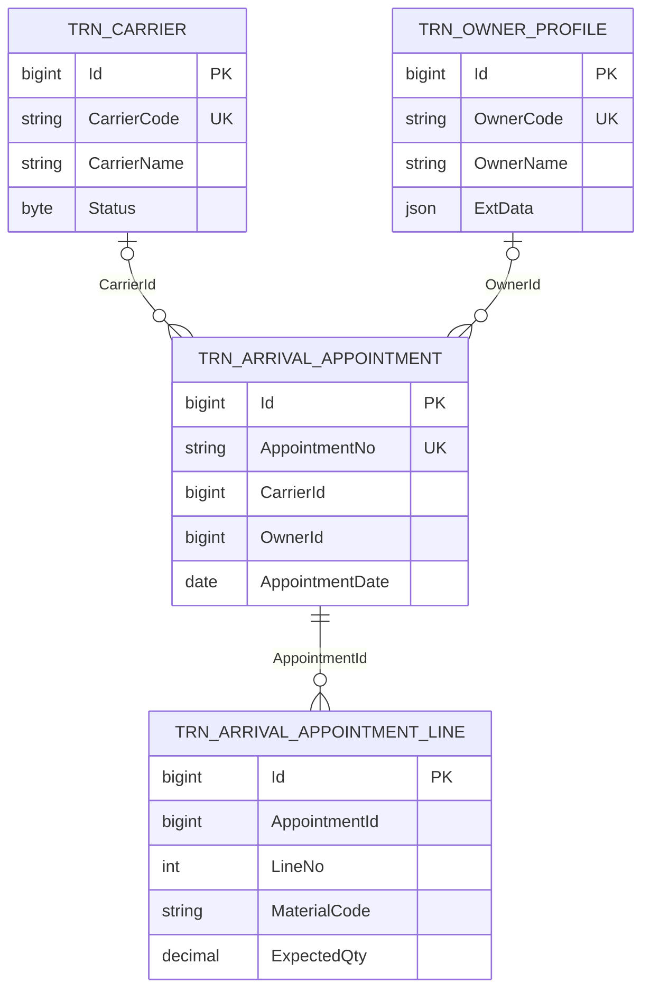

# KH.WMS 通用开发实战培训

## 1. 培训目标

本训练包使用 4 张与正式业务隔离的 `trn_` 表，覆盖项目中三条最典型的开发主线：

1. 普通单表 CRUD，包括查询、导入导出和启用/禁用。
2. 带 `ExtData` 的配置化扩展字段 CRUD。
3. 使用 `DetailSaveService` 的一对多主从表 CRUD。

这些表仅用于培训，不加入现有入库、库存或出库流程。

## 2. 交付文件和执行顺序

| 顺序 | 文件 | 用途 | 作用 |
| --- | --- | --- | --- |
| 1 | `01-training-tables.sql` | SQL Server 业务库 | 创建 4 张培训表、索引和样例数据 |
| 2 | `02-training-owner-form-config.json` | `form-config` 响应契约 | 定义货主档案的 4 个动态扩展字段 |
| 3 | `03-training-menu.sql` | SQL Server 业务库 | 创建实战培训目录和三个页面菜单 |
| 4 | `04-training-ext-fields.sql` | SQLite 配置库 | 幂等创建货主档案实体类型和四个动态扩展字段 |

建表脚本可重复执行：不重复建表、建索引或插入同编码数据。脚本末尾带自检查询。

> 实战二通过 `ICfgExtFieldContract` 从 SQLite 配置库动态读取字段元数据。首次运行前需要对应用实际使用的 `kh-wms-config.db` 执行 `04-training-ext-fields.sql`。

命令行执行示例（库名请按实际环境替换）：

```powershell
# SQL 脚本保存为 UTF-8，旧版 sqlcmd 需要显式指定代码页
sqlcmd -S "<server>" -d "<training-database>" -E -b -f 65001 -i "docs\backend\实战培训\01-training-tables.sql"

# SQLite 配置库路径按实际运行环境替换
sqlite3 "KH.WMS\KH.WMS.Server\bin\Debug\net8.0\Data\kh-wms-config.db" ".read 'docs\backend\实战培训\04-training-ext-fields.sql'"
```

## 3. 表关系



只有预约主从关系需要配置 SqlSugar `Navigate`。`CarrierId`和 `OwnerId` 是查询/下拉选择所需的引用字段，不应配置为级联保存对象。

## 4. 公共字段

4 张表都包含与 `BaseEntity<long>` / `RootEntity` 对应的字段：

| 字段 | SQL Server 类型 | 可空 | 说明 |
| --- | --- | --- | --- |
| `Id` | `bigint identity` | 否 | 主键，对应 `BaseEntity<long>.Id` |
| `CreatedBy` | `nvarchar(50)` | 是 | 创建人 ID |
| `CreatedByName` | `nvarchar(50)` | 是 | 创建人名称 |
| `CreatedTime` | `datetime2(3)` | 否 | 创建时间 |
| `LastModifiedBy` | `nvarchar(50)` | 是 | 最后修改人 ID |
| `LastModifiedByName` | `nvarchar(50)` | 是 | 最后修改人名称 |
| `LastModifiedTime` | `datetime2(3)` | 是 | 最后修改时间 |

实体必须继承 `BaseEntity<long>`，不要在子类再重复声明这些字段。

## 5. 字段字典

### 5.1 `trn_carrier`：普通 CRUD + 启停

| 字段 | 建议 C# 类型 | 可空 | 长度/精度 | 说明 |
| --- | --- | --- | --- | --- |
| `CarrierCode` | `string` | 否 | 30 | 承运商编码，唯一 |
| `CarrierName` | `string` | 否 | 100 | 承运商名称 |
| `ContactName` | `string?` | 是 | 50 | 联系人 |
| `ContactPhone` | `string?` | 是 | 20 | 联系电话 |
| `TransportMode` | `string?` | 是 | 20 | 运输方式，样例值为 `ROAD` / `COLD_CHAIN` / `MULTIMODAL` |
| `Status` | `byte` | 否 | - | `1` 启用，`0` 禁用 |
| `Remark` | `string?` | 是 | 500 | 备注 |

实体建议：

- 类名 `TrnCarrier`，表名 `[SugarTable("trn_carrier")]`。
- 实现 `IEnableDisableEntity`，属性名必须为 `Status`。
- 使用 `CrudController<TrnCarrier>`，不使用 `ExtDataCrudController`。
- 后端路由建议为 `/api/training-carrier`，前端 `module` 为 `training-carrier`。
- 启停调用 `PUT /api/training-carrier/status/{id}`，请求体为 `{ "status": 0 }` 或 `{ "status": 1 }`。

### 5.2 `trn_owner_profile`：ExtData CRUD

| 字段 | 建议 C# 类型 | 可空 | 长度/精度 | 说明 |
| --- | --- | --- | --- | --- |
| `OwnerCode` | `string` | 否 | 30 | 货主编码，唯一 |
| `OwnerName` | `string` | 否 | 100 | 货主名称 |
| `ContactName` | `string?` | 是 | 50 | 联系人 |
| `ContactPhone` | `string?` | 是 | 20 | 联系电话 |
| `Address` | `string?` | 是 | 500 | 地址 |
| `Remark` | `string?` | 是 | 500 | 备注 |
| `ExtData` | `string?` | 是 | JSON | 由 `CfgExtField` 驱动的扩展数据 |

实体和接口建议：

- 类名 `TrnOwnerProfile`，表名 `[SugarTable("trn_owner_profile")]`。
- `ExtData` 必须是公开可读写的 `string?` 属性，不实现 `IEnableDisableEntity`。
- Controller 使用 `ExtDataCrudController<TrnOwnerProfile>`。
- 后端路由建议为 `/api/training-owner-profile`，前端 `module` 为 `training-owner-profile`。
- 增加 `GET /api/training-owner-profile/form-config`，注入 `ICfgExtFieldContract`，按 `TRN_OWNER_PROFILE` / `HEADER` 从 SQLite 配置库动态读取字段并生成 `columns`。
- JSON 文件用于说明接口契约和培训期望；实际运行时以 `04-training-ext-fields.sql` 写入的配置记录为准，不在每次请求中读取 JSON 文件。

扩展字段定义：

| `FieldKey` | 显示名 | 类型 | 必填 | 默认值 | 前端控件 |
| --- | --- | --- | --- | --- | --- |
| `customerLevel` | 客户等级 | `STRING` | 是 | `NORMAL` | `input` |
| `creditLimit` | 信用额度 | `DECIMAL` | 否 | `0` | `number` |
| `requiresColdChain` | 是否要求冷链 | `BOOLEAN` | 否 | `false` | `switch` |
| `contractExpiry` | 合同到期日 | `DATETIME` | 否 | - | `date` |

创建/更新时，`extDataRaw` 是 JSON 字符串，不是对象：

```json
{
  "ownerCode": "TRN-OWN-010",
  "ownerName": "学员货主",
  "extDataRaw": "{\"customerLevel\":\"A\",\"creditLimit\":100000,\"requiresColdChain\":true,\"contractExpiry\":\"2027-12-31\"}"
}
```

前端必须使用 `useExtFields` 完成三件事：加载配置、展平列表/详情数据、提交前把扩展属性收集到 `extDataRaw`。

### 5.3 `trn_arrival_appointment`：到货预约主表

| 字段 | 建议 C# 类型 | 可空 | 长度/精度 | 说明 |
| --- | --- | --- | --- | --- |
| `AppointmentNo` | `string` | 否 | 50 | 预约单号，唯一 |
| `CarrierId` | `long?` | 是 | - | 培训承运商 ID |
| `OwnerId` | `long?` | 是 | - | 培训货主 ID |
| `WarehouseId` | `long?` | 是 | - | 正式仓库 ID，样例数据留空 |
| `AppointmentDate` | `DateOnly` | 否 | - | 预约日期 |
| `AppointmentTimeSlot` | `string?` | 是 | 20 | 预约时段 |
| `VehicleNo` | `string?` | 是 | 30 | 车牌号 |
| `DriverName` | `string?` | 是 | 50 | 司机姓名 |
| `DriverPhone` | `string?` | 是 | 20 | 司机电话 |
| `Remark` | `string?` | 是 | 500 | 备注 |

主实体建议：

- 类名 `TrnArrivalAppointment`，表名 `[SugarTable("trn_arrival_appointment")]`。
- 增加 `List<TrnArrivalAppointmentLine>? Items` 导航属性。
- 导航配置为 `[Navigate(NavigateType.OneToMany, nameof(TrnArrivalAppointmentLine.AppointmentId), nameof(Id))]`。
- 不增加 `Status` 或 `ExtData`，保持主从表练习的单一重点。
- 后端路由建议为 `/api/training-arrival-appointment`，前端 `module` 为 `training-arrival-appointment`。

### 5.4 `trn_arrival_appointment_line`：到货预约从表

| 字段 | 建议 C# 类型 | 可空 | 长度/精度 | 说明 |
| --- | --- | --- | --- | --- |
| `AppointmentId` | `long` | 否 | - | 主表 ID |
| `LineNo` | `int` | 否 | - | 行号，与主表 ID 组成唯一索引 |
| `MaterialId` | `long?` | 是 | - | 正式物料 ID，样例数据留空 |
| `MaterialCode` | `string` | 否 | 50 | 物料编码快照 |
| `MaterialName` | `string` | 否 | 200 | 物料名称快照 |
| `ExpectedQty` | `decimal` | 否 | `decimal(12,3)` | 预计到货数量，必须大于 0 |
| `UnitId` | `long?` | 是 | - | 计量单位 ID |
| `BatchNo` | `string?` | 是 | 50 | 批次号，样例同时覆盖有值和空值 |
| `Remark` | `string?` | 是 | 500 | 备注 |

从实体类名建议为 `TrnArrivalAppointmentLine`。从表不实现 `IEnableDisableEntity`，不建独立状态端点，也不单独开放前端维护页。

## 6. 建议的代码归属

为了与正式模块隔离，建议学员使用以下位置：

| 内容 | 建议位置 |
| --- | --- |
| 4 个实体 | `KH.WMS.Entities/Training` |
| Service、Interface、Controller | 新建 `KH.WMS.Modules.TrainingModule` |
| 前端页面 | `KH.WMS.Client/src/views/training` |
| 前端 API | 普通 CRUD 优先使用 `useCrudApi`；主从特殊请求放入 `src/api/training.js` |

如培训时不希望学员新建模块项目，可临时将 Service/Controller 放入 `BaseDataModule`，但实体表名和 API 路由仍保持 `trn_` / `training-` 前缀。

## 7. 实战一：承运商普通 CRUD

### 实现任务

1. 实现 `TrnCarrier` 实体、Service 接口、Service 和 Controller。
2. 列表支持按编码、名称和状态查询，并默认按创建时间排序。
3. 前端用 `KhPage` 完成查询、新增、编辑、查看、删除、导入和导出。
4. 增加启用/禁用行按钮，成功后刷新列表。
5. 在 Service 的创建/更新前置钩子中校验 `CarrierCode` 唯一性，不只依赖数据库报错。

### 验收要点

- 重复编码被拒绝，新增和编辑都覆盖。
- 禁用数据调用启用后变为 `Status = 1`，重复启用返回明确错误。
- 状态展示使用 tag，表格列不使用表单的 `select` 配置。
- 导出当前页和全部数据均可用。

## 8. 实战二：货主 ExtData CRUD

### 实现任务

1. 实现带 `ExtData` 的 `TrnOwnerProfile` 实体及 ExtData Controller。该案例使用普通实体 `ExtDataCrudController` 路径，不使用单据头/行级 `ICfgDocumentFieldExtContract` 路径。
2. 实现 `/form-config`，确认返回的 `data.columns` 包含 4 个 `isExt: true` 字段。
3. 前端通过 `useExtFields('/api/training-owner-profile/form-config')` 合并表单列和表格列。
4. 用 `withFlatExtLoad` 或等价逻辑展平列表数据。
5. 提交前使用 `extractAndCleanExtData`，把扩展字段放入 `extDataRaw`。当所有扩展值都被清空时，应显式提交 `extDataRaw: "{}"`。

### 验收要点

- `form-config` 依赖应用实际使用的 SQLite 配置库；修改配置记录后，前端在不改页面基础列的情况下动态跟随响应变化。
- 新建后业务库 `ExtData` 是有效 JSON，且不包含基础字段。
- 详情接口将 JSON 展平后，编辑页可正确回显。
- 清空全部扩展字段时显式提交 `"{}"`，确认不保留上一次的旧值。`extractAndCleanExtData` 在无值时返回 `null`，如果直接省略 `extDataRaw`，当前 `CrudService.CopyProperties` 会保留旧值。

## 9. 实战三：到货预约主从 CRUD

本实战使用 `TrnArrivalAppointment.Items`、`OneToMany Navigate` 和 `DetailSaveService` 完成主从事务保存；前端使用 `KhPage + KhDialog + KhForm + KhEditableTable` 手动组装主实体及 `items` 请求体。

关键规则：

- 创建请求的全部明细 `Id = 0`。
- 编辑先加载详情并保留已有明细 ID。
- 更新提交当前完整明细集合：遗漏的已有 ID 视为删除。
- 非零明细 ID 必须属于当前主表，禁止跨主表修改或迁移。
- `detailLines` 只负责只读详情，不参与新增、编辑和保存。
- 通用保存服务允许空数组删除全部明细；本案例因业务要求“至少一条明细”而拒绝空数组。

完整的 20 步实现、代码、执行方式、常见错误和验收方法见：[KH.WMS 主从表页面配置与开发实战指引](/backend/KH.WMS主从表页面配置与开发实战指引)。

## 10. 整体检查清单

- [ ] SQL Server 脚本首次执行后有 4 张表，样例数据至少为 3/3/3/5 条。
- [ ] SQL Server 脚本连续执行两次，表和样例数据数量不增加。
- [ ] `form-config` 响应与 `02-training-owner-form-config.json` 一致，包含 4 个 `isExt: true` 字段且 `lineColumns` 为空。
- [ ] 承运商的启停接口可用，从表不存在状态接口。
- [ ] 货主扩展字段能保存、展平、回显和导出。
- [ ] 到货预约能完成主从新增、详情、更新和删除。
- [ ] 实体、Controller `module`、前端 API 路由三者命名一致。

## 11. 参考源码与文档

- 普通 CRUD：`KH.WMS.Core/Controllers/CrudController.cs`、`KH.WMS.Core/Services/CrudService.cs`。
- 启停约定：`KH.WMS.Core/Models/Entities/IEnableDisableEntity.cs`。
- ExtData：`KH.WMS.Core/Controllers/ExtDataCrudController.cs`、`docs/backend/后端底层概念/08-ExtData动态字段.md`。
- 主从保存：`KH.WMS.Core/Services/DetailSaveService.cs`。
- 前端实现：`docs/backend/KH.WMS前端开发指引 V3.0.md` 的扩展字段和主从表章节。
