# WIDESEAWMS_TEST_New 关系图谱

> 这是从数据字典中拆出的图谱版，只保留分业务域关系图和 UML 类图，方便阅读和评审。字段、索引、主外键详情请看 WIDESEAWMS_TEST_New_数据字典.md。

## 5 数据库关系图（按业务域拆分）

> 全库 89 张表不再合并成一张图；下面按业务域拆分，每张图只保留表与外键关系，字段详情请看上方表结构明细。

### 5.1 核心业务链路

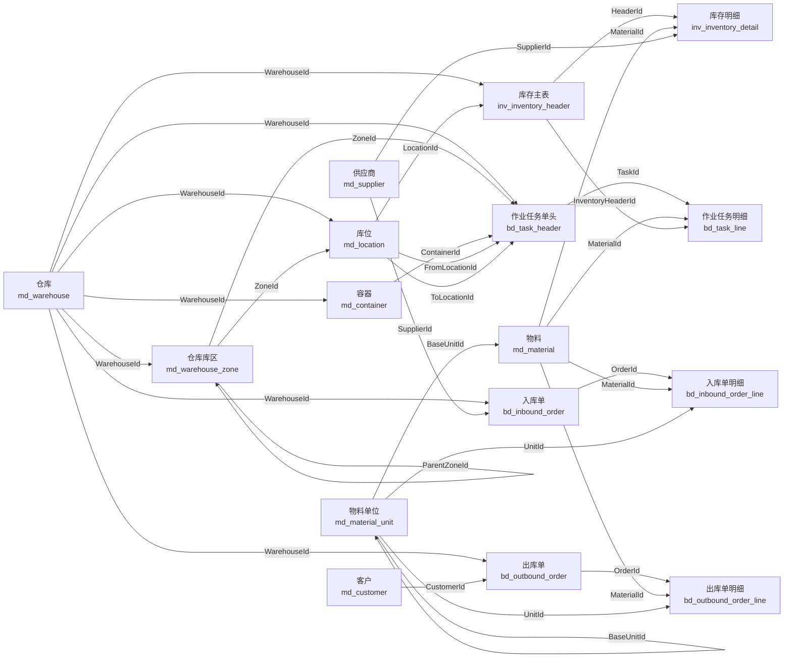

### 5.2 基础资料

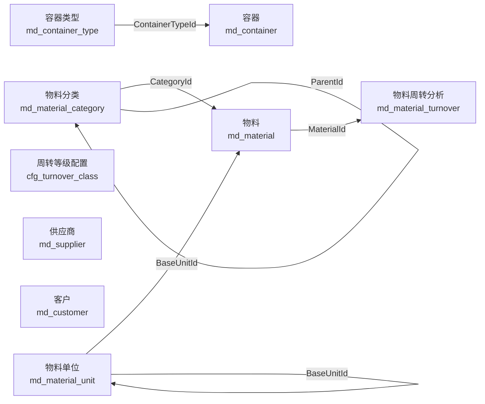

### 5.3 仓库建模

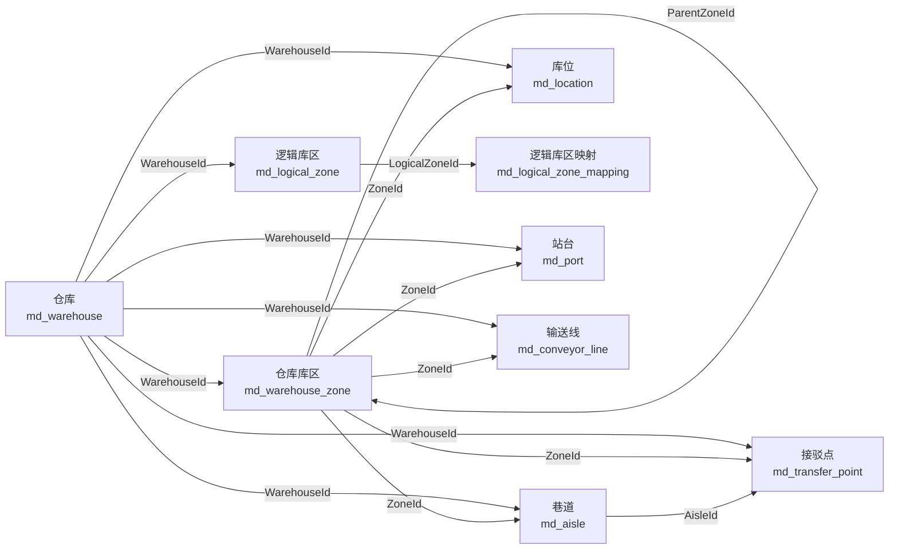

### 5.4 入库业务

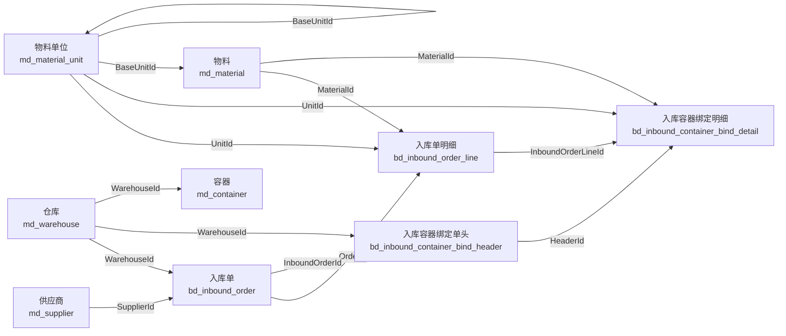

### 5.5 出库业务

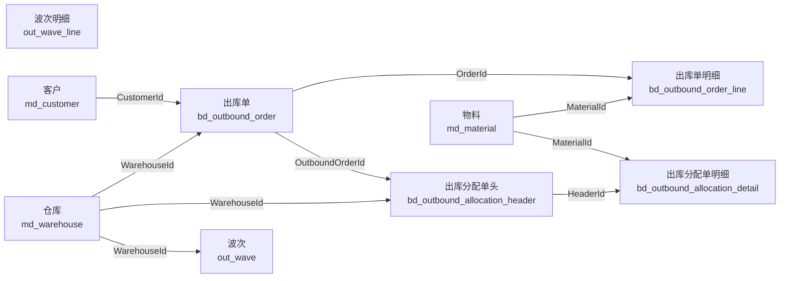

### 5.6 库存业务

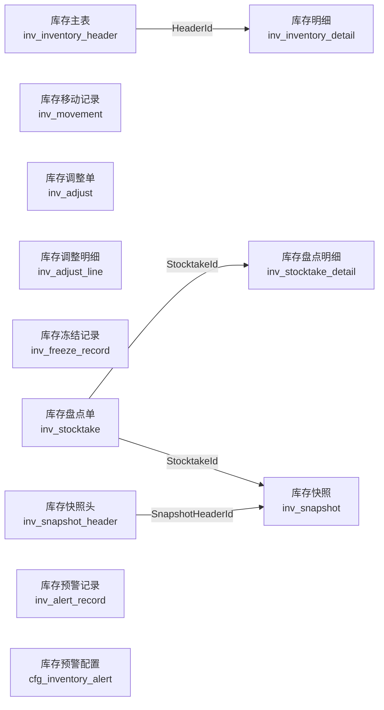

### 5.7 任务与搬运

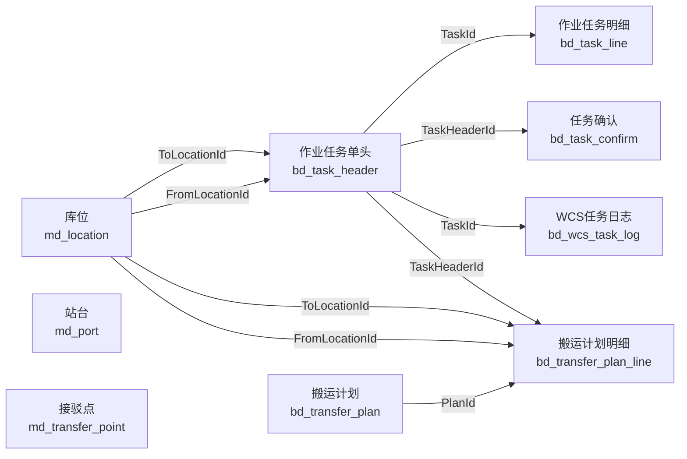

### 5.8 系统权限

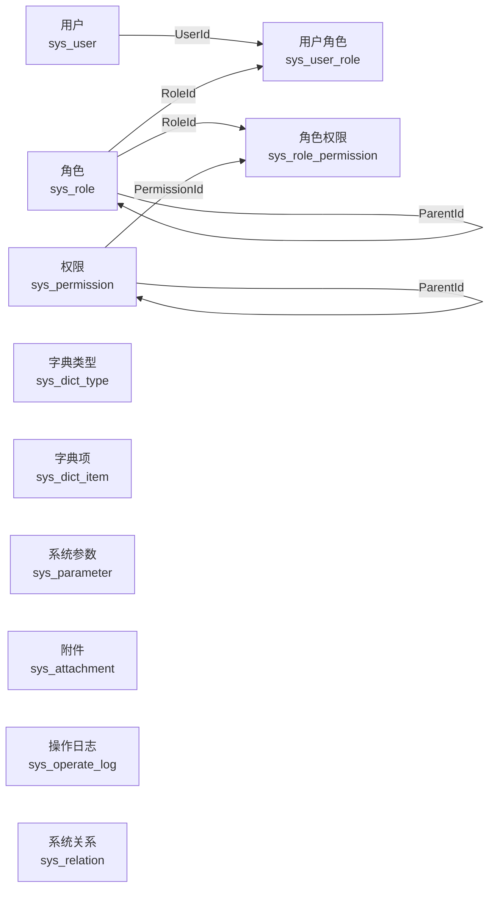

### 5.9 配置与策略

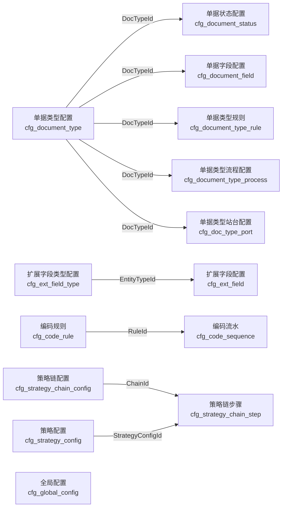

### 5.10 接口与日志

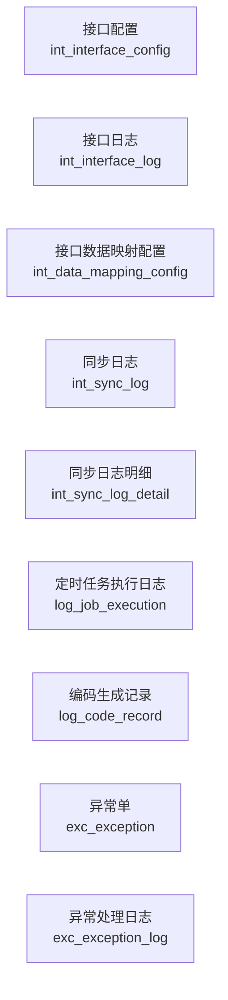

## 6 UML 类图（按业务域拆分）

> UML 图按业务域拆分，并只展示 Id 与外键字段，避免把普通业务字段全部画进图里导致缩放后不可读。

### 6.1 核心业务链路

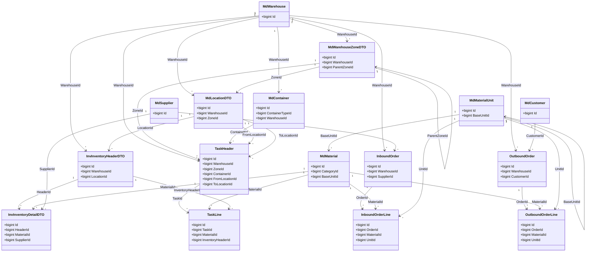

### 6.2 基础资料

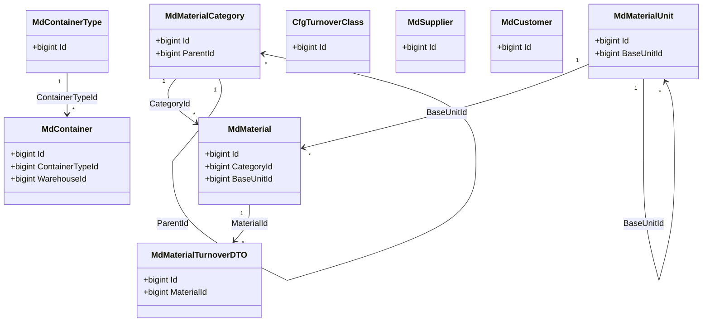

### 6.3 仓库建模

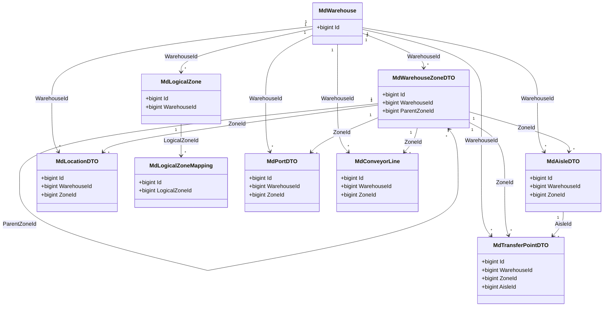

### 6.4 入库业务

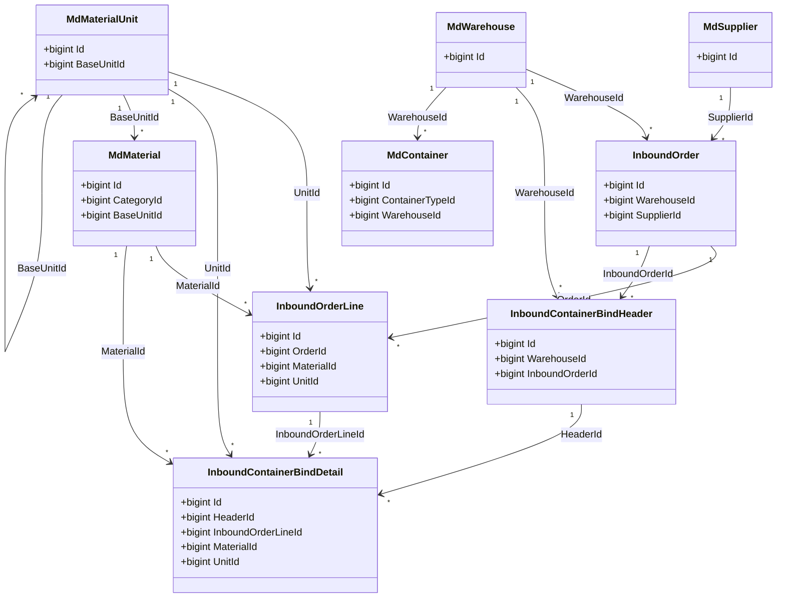

### 6.5 出库业务

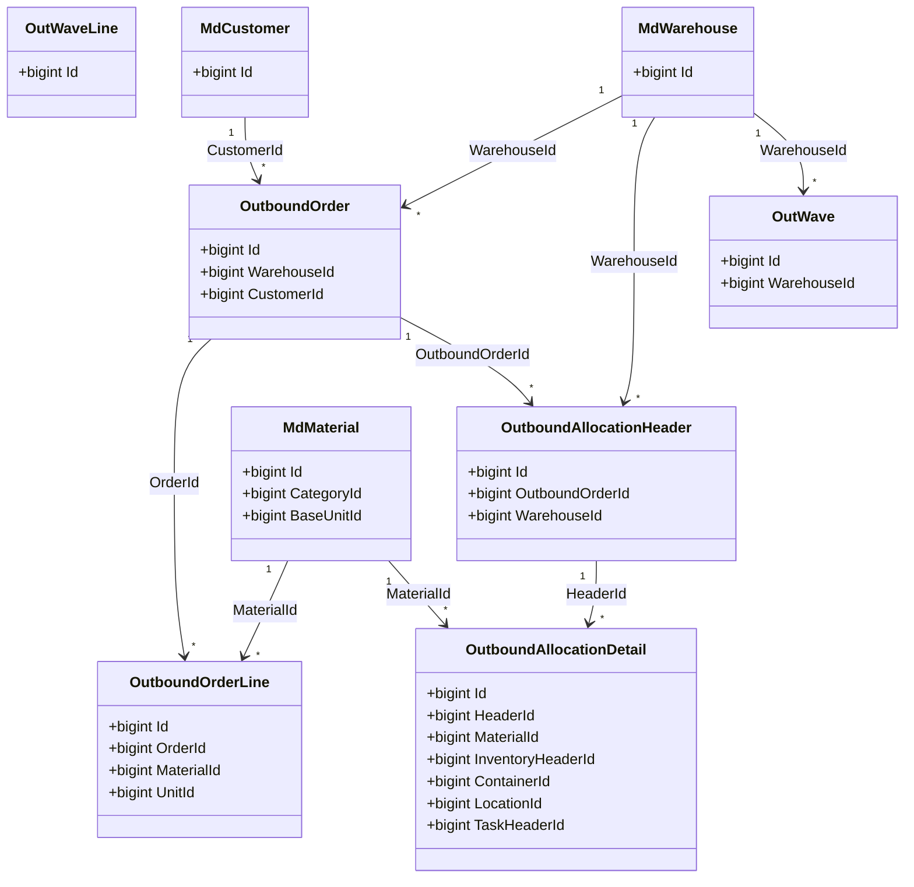

### 6.6 库存业务

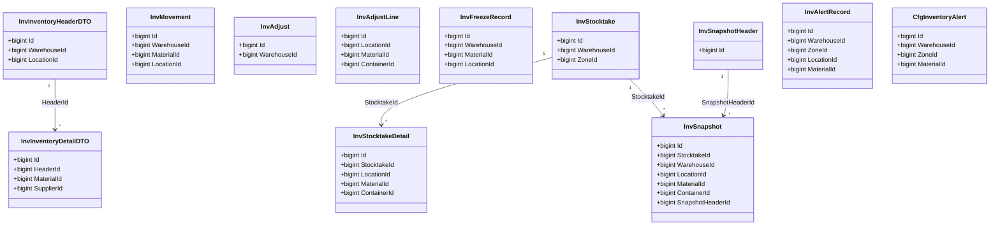

### 6.7 任务与搬运

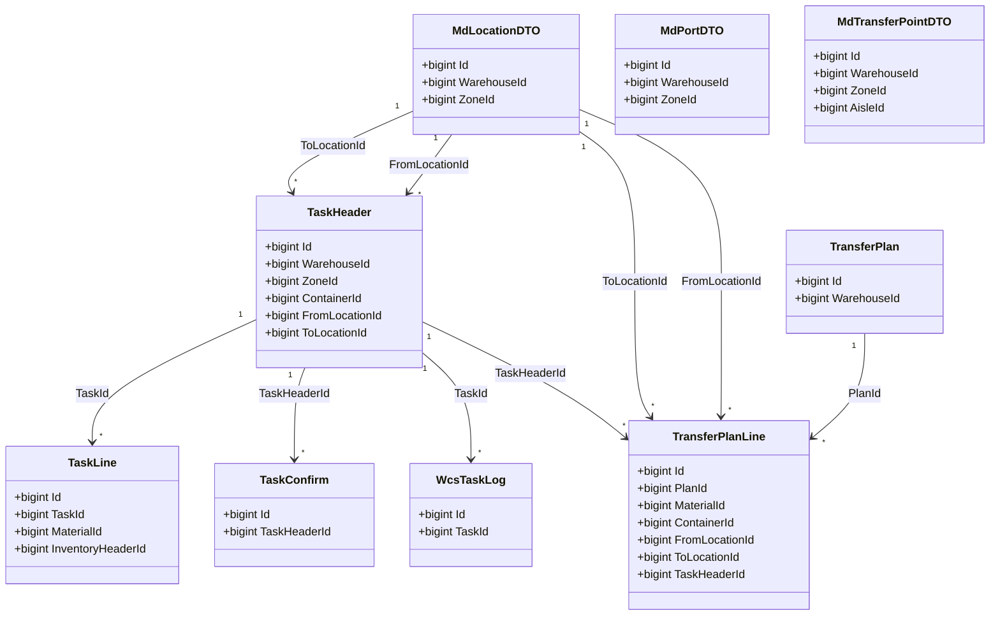

### 6.8 系统权限

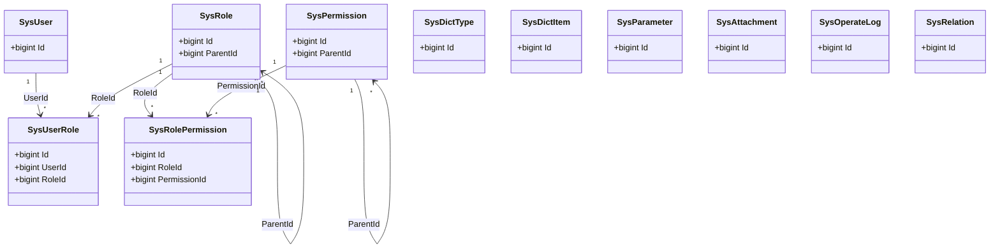

### 6.9 配置与策略

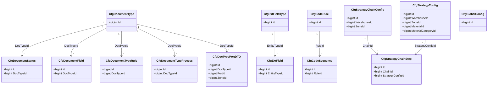

### 6.10 接口与日志

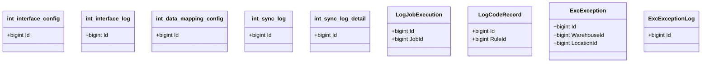
