# WIDESEAWMS_TEST_New 数据字典

> 生成时间：2026-06-29 15:58:49 +08:00。来源：SQL Server 系统目录 + 代码 SqlSugar 注解。外键会以中文说明引用的父表和字段。

## 1 目录

- [2 总览](#2-总览)
- [3 表清单](#3-表清单)
- [4 表结构明细（A-Z）](#4-表结构明细a-z)
  - [4.1 bd_inbound_container_bind_detail（入库容器绑定明细）](#41-bd_inbound_container_bind_detail入库容器绑定明细)
    - [4.1.1 字段](#411-字段)
    - [4.1.2 索引](#412-索引)
  - [4.2 bd_inbound_container_bind_header（入库容器绑定单头）](#42-bd_inbound_container_bind_header入库容器绑定单头)
    - [4.2.1 字段](#421-字段)
    - [4.2.2 索引](#422-索引)
  - [4.3 bd_inbound_order（入库单）](#43-bd_inbound_order入库单)
    - [4.3.1 字段](#431-字段)
    - [4.3.2 索引](#432-索引)
  - [4.4 bd_inbound_order_line（入库单明细）](#44-bd_inbound_order_line入库单明细)
    - [4.4.1 字段](#441-字段)
    - [4.4.2 索引](#442-索引)
  - [4.5 bd_order_status_log（单据状态日志）](#45-bd_order_status_log单据状态日志)
    - [4.5.1 字段](#451-字段)
    - [4.5.2 索引](#452-索引)
  - [4.6 bd_outbound_allocation_detail（出库分配单明细）](#46-bd_outbound_allocation_detail出库分配单明细)
    - [4.6.1 字段](#461-字段)
    - [4.6.2 索引](#462-索引)
  - [4.7 bd_outbound_allocation_header（出库分配单头）](#47-bd_outbound_allocation_header出库分配单头)
    - [4.7.1 字段](#471-字段)
    - [4.7.2 索引](#472-索引)
  - [4.8 bd_outbound_order（出库单）](#48-bd_outbound_order出库单)
    - [4.8.1 字段](#481-字段)
    - [4.8.2 索引](#482-索引)
  - [4.9 bd_outbound_order_line（出库单明细）](#49-bd_outbound_order_line出库单明细)
    - [4.9.1 字段](#491-字段)
    - [4.9.2 索引](#492-索引)
  - [4.10 bd_task_confirm（任务确认）](#410-bd_task_confirm任务确认)
    - [4.10.1 字段](#4101-字段)
    - [4.10.2 索引](#4102-索引)
  - [4.11 bd_task_header（作业任务单头）](#411-bd_task_header作业任务单头)
    - [4.11.1 字段](#4111-字段)
    - [4.11.2 索引](#4112-索引)
  - [4.12 bd_task_line（作业任务明细）](#412-bd_task_line作业任务明细)
    - [4.12.1 字段](#4121-字段)
    - [4.12.2 索引](#4122-索引)
  - [4.13 bd_transfer_plan（搬运计划）](#413-bd_transfer_plan搬运计划)
    - [4.13.1 字段](#4131-字段)
    - [4.13.2 索引](#4132-索引)
  - [4.14 bd_transfer_plan_line（搬运计划明细）](#414-bd_transfer_plan_line搬运计划明细)
    - [4.14.1 字段](#4141-字段)
    - [4.14.2 索引](#4142-索引)
  - [4.15 bd_wcs_task_log（WCS任务日志）](#415-bd_wcs_task_logwcs任务日志)
    - [4.15.1 字段](#4151-字段)
    - [4.15.2 索引](#4152-索引)
  - [4.16 cfg_code_rule（编码规则）](#416-cfg_code_rule编码规则)
    - [4.16.1 字段](#4161-字段)
    - [4.16.2 索引](#4162-索引)
  - [4.17 cfg_code_sequence（编码流水）](#417-cfg_code_sequence编码流水)
    - [4.17.1 字段](#4171-字段)
    - [4.17.2 索引](#4172-索引)
  - [4.18 cfg_doc_type_port（单据类型站台配置）](#418-cfg_doc_type_port单据类型站台配置)
    - [4.18.1 字段](#4181-字段)
    - [4.18.2 索引](#4182-索引)
  - [4.19 cfg_document_field（单据字段配置）](#419-cfg_document_field单据字段配置)
    - [4.19.1 字段](#4191-字段)
    - [4.19.2 索引](#4192-索引)
  - [4.20 cfg_document_status（单据状态配置）](#420-cfg_document_status单据状态配置)
    - [4.20.1 字段](#4201-字段)
    - [4.20.2 索引](#4202-索引)
  - [4.21 cfg_document_type（单据类型配置）](#421-cfg_document_type单据类型配置)
    - [4.21.1 字段](#4211-字段)
    - [4.21.2 索引](#4212-索引)
  - [4.22 cfg_document_type_process（单据类型流程配置）](#422-cfg_document_type_process单据类型流程配置)
    - [4.22.1 字段](#4221-字段)
    - [4.22.2 索引](#4222-索引)
  - [4.23 cfg_document_type_rule（单据类型规则）](#423-cfg_document_type_rule单据类型规则)
    - [4.23.1 字段](#4231-字段)
    - [4.23.2 索引](#4232-索引)
  - [4.24 cfg_ext_field（扩展字段配置）](#424-cfg_ext_field扩展字段配置)
    - [4.24.1 字段](#4241-字段)
    - [4.24.2 索引](#4242-索引)
  - [4.25 cfg_ext_field_type（扩展字段类型配置）](#425-cfg_ext_field_type扩展字段类型配置)
    - [4.25.1 字段](#4251-字段)
    - [4.25.2 索引](#4252-索引)
  - [4.26 cfg_global_config（全局配置）](#426-cfg_global_config全局配置)
    - [4.26.1 字段](#4261-字段)
    - [4.26.2 索引](#4262-索引)
  - [4.27 cfg_inventory_alert（库存预警配置）](#427-cfg_inventory_alert库存预警配置)
    - [4.27.1 字段](#4271-字段)
    - [4.27.2 索引](#4272-索引)
  - [4.28 cfg_job_definition（任务定义）](#428-cfg_job_definition任务定义)
    - [4.28.1 字段](#4281-字段)
    - [4.28.2 索引](#4282-索引)
  - [4.29 cfg_job_trigger（任务触发器）](#429-cfg_job_trigger任务触发器)
    - [4.29.1 字段](#4291-字段)
    - [4.29.2 索引](#4292-索引)
  - [4.30 cfg_location_status（库位状态配置）](#430-cfg_location_status库位状态配置)
    - [4.30.1 字段](#4301-字段)
    - [4.30.2 索引](#4302-索引)
  - [4.31 cfg_location_type（库位类型配置）](#431-cfg_location_type库位类型配置)
    - [4.31.1 字段](#4311-字段)
    - [4.31.2 索引](#4312-索引)
  - [4.32 cfg_port_type（站台类型配置）](#432-cfg_port_type站台类型配置)
    - [4.32.1 字段](#4321-字段)
    - [4.32.2 索引](#4322-索引)
  - [4.33 cfg_strategy_chain_config（策略链配置）](#433-cfg_strategy_chain_config策略链配置)
    - [4.33.1 字段](#4331-字段)
    - [4.33.2 索引](#4332-索引)
  - [4.34 cfg_strategy_chain_step（策略链步骤）](#434-cfg_strategy_chain_step策略链步骤)
    - [4.34.1 字段](#4341-字段)
    - [4.34.2 索引](#4342-索引)
  - [4.35 cfg_strategy_config（策略配置）](#435-cfg_strategy_config策略配置)
    - [4.35.1 字段](#4351-字段)
    - [4.35.2 索引](#4352-索引)
  - [4.36 cfg_transfer_point_type（接驳点类型配置）](#436-cfg_transfer_point_type接驳点类型配置)
    - [4.36.1 字段](#4361-字段)
    - [4.36.2 索引](#4362-索引)
  - [4.37 cfg_turnover_class（周转等级配置）](#437-cfg_turnover_class周转等级配置)
    - [4.37.1 字段](#4371-字段)
    - [4.37.2 索引](#4372-索引)
  - [4.38 cfg_warehouse_type（仓库类型配置）](#438-cfg_warehouse_type仓库类型配置)
    - [4.38.1 字段](#4381-字段)
    - [4.38.2 索引](#4382-索引)
  - [4.39 cfg_warehouse_zone_type（库区类型配置）](#439-cfg_warehouse_zone_type库区类型配置)
    - [4.39.1 字段](#4391-字段)
    - [4.39.2 索引](#4392-索引)
  - [4.40 exc_exception（异常单）](#440-exc_exception异常单)
    - [4.40.1 字段](#4401-字段)
    - [4.40.2 索引](#4402-索引)
  - [4.41 exc_exception_log（异常处理日志）](#441-exc_exception_log异常处理日志)
    - [4.41.1 字段](#4411-字段)
    - [4.41.2 索引](#4412-索引)
  - [4.42 int_data_mapping_config（接口数据映射配置）](#442-int_data_mapping_config接口数据映射配置)
    - [4.42.1 字段](#4421-字段)
    - [4.42.2 索引](#4422-索引)
  - [4.43 int_interface_config（接口配置）](#443-int_interface_config接口配置)
    - [4.43.1 字段](#4431-字段)
    - [4.43.2 索引](#4432-索引)
  - [4.44 int_interface_log（接口日志）](#444-int_interface_log接口日志)
    - [4.44.1 字段](#4441-字段)
    - [4.44.2 索引](#4442-索引)
  - [4.45 int_sync_log（同步日志）](#445-int_sync_log同步日志)
    - [4.45.1 字段](#4451-字段)
    - [4.45.2 索引](#4452-索引)
  - [4.46 int_sync_log_detail（同步日志明细）](#446-int_sync_log_detail同步日志明细)
    - [4.46.1 字段](#4461-字段)
    - [4.46.2 索引](#4462-索引)
  - [4.47 inv_adjust（库存调整单）](#447-inv_adjust库存调整单)
    - [4.47.1 字段](#4471-字段)
    - [4.47.2 索引](#4472-索引)
  - [4.48 inv_adjust_line（库存调整明细）](#448-inv_adjust_line库存调整明细)
    - [4.48.1 字段](#4481-字段)
    - [4.48.2 索引](#4482-索引)
  - [4.49 inv_alert_record（库存预警记录）](#449-inv_alert_record库存预警记录)
    - [4.49.1 字段](#4491-字段)
    - [4.49.2 索引](#4492-索引)
  - [4.50 inv_freeze_record（库存冻结记录）](#450-inv_freeze_record库存冻结记录)
    - [4.50.1 字段](#4501-字段)
    - [4.50.2 索引](#4502-索引)
  - [4.51 inv_inventory_detail（库存明细）](#451-inv_inventory_detail库存明细)
    - [4.51.1 字段](#4511-字段)
    - [4.51.2 索引](#4512-索引)
  - [4.52 inv_inventory_header（库存主表）](#452-inv_inventory_header库存主表)
    - [4.52.1 字段](#4521-字段)
    - [4.52.2 索引](#4522-索引)
  - [4.53 inv_movement（库存移动记录）](#453-inv_movement库存移动记录)
    - [4.53.1 字段](#4531-字段)
    - [4.53.2 索引](#4532-索引)
  - [4.54 inv_snapshot（库存快照）](#454-inv_snapshot库存快照)
    - [4.54.1 字段](#4541-字段)
    - [4.54.2 索引](#4542-索引)
  - [4.55 inv_snapshot_header（库存快照头）](#455-inv_snapshot_header库存快照头)
    - [4.55.1 字段](#4551-字段)
    - [4.55.2 索引](#4552-索引)
  - [4.56 inv_stocktake（库存盘点单）](#456-inv_stocktake库存盘点单)
    - [4.56.1 字段](#4561-字段)
    - [4.56.2 索引](#4562-索引)
  - [4.57 inv_stocktake_detail（库存盘点明细）](#457-inv_stocktake_detail库存盘点明细)
    - [4.57.1 字段](#4571-字段)
    - [4.57.2 索引](#4572-索引)
  - [4.58 log_code_record（编码生成记录）](#458-log_code_record编码生成记录)
    - [4.58.1 字段](#4581-字段)
    - [4.58.2 索引](#4582-索引)
  - [4.59 log_job_execution（定时任务执行日志）](#459-log_job_execution定时任务执行日志)
    - [4.59.1 字段](#4591-字段)
    - [4.59.2 索引](#4592-索引)
  - [4.60 md_aisle（巷道）](#460-md_aisle巷道)
    - [4.60.1 字段](#4601-字段)
    - [4.60.2 索引](#4602-索引)
  - [4.61 md_container（容器）](#461-md_container容器)
    - [4.61.1 字段](#4611-字段)
    - [4.61.2 索引](#4612-索引)
  - [4.62 md_container_type（容器类型）](#462-md_container_type容器类型)
    - [4.62.1 字段](#4621-字段)
    - [4.62.2 索引](#4622-索引)
  - [4.63 md_conveyor_line（输送线）](#463-md_conveyor_line输送线)
    - [4.63.1 字段](#4631-字段)
    - [4.63.2 索引](#4632-索引)
  - [4.64 md_customer（客户）](#464-md_customer客户)
    - [4.64.1 字段](#4641-字段)
    - [4.64.2 索引](#4642-索引)
  - [4.65 md_location（库位）](#465-md_location库位)
    - [4.65.1 字段](#4651-字段)
    - [4.65.2 索引](#4652-索引)
  - [4.66 md_logical_zone（逻辑库区）](#466-md_logical_zone逻辑库区)
    - [4.66.1 字段](#4661-字段)
    - [4.66.2 索引](#4662-索引)
  - [4.67 md_logical_zone_mapping（逻辑库区映射）](#467-md_logical_zone_mapping逻辑库区映射)
    - [4.67.1 字段](#4671-字段)
    - [4.67.2 索引](#4672-索引)
  - [4.68 md_material（物料）](#468-md_material物料)
    - [4.68.1 字段](#4681-字段)
    - [4.68.2 索引](#4682-索引)
  - [4.69 md_material_category（物料分类）](#469-md_material_category物料分类)
    - [4.69.1 字段](#4691-字段)
    - [4.69.2 索引](#4692-索引)
  - [4.70 md_material_turnover（物料周转分析）](#470-md_material_turnover物料周转分析)
    - [4.70.1 字段](#4701-字段)
    - [4.70.2 索引](#4702-索引)
  - [4.71 md_material_unit（物料单位）](#471-md_material_unit物料单位)
    - [4.71.1 字段](#4711-字段)
    - [4.71.2 索引](#4712-索引)
  - [4.72 md_port（站台）](#472-md_port站台)
    - [4.72.1 字段](#4721-字段)
    - [4.72.2 索引](#4722-索引)
  - [4.73 md_supplier（供应商）](#473-md_supplier供应商)
    - [4.73.1 字段](#4731-字段)
    - [4.73.2 索引](#4732-索引)
  - [4.74 md_transfer_point（接驳点）](#474-md_transfer_point接驳点)
    - [4.74.1 字段](#4741-字段)
    - [4.74.2 索引](#4742-索引)
  - [4.75 md_warehouse（仓库）](#475-md_warehouse仓库)
    - [4.75.1 字段](#4751-字段)
    - [4.75.2 索引](#4752-索引)
  - [4.76 md_warehouse_zone（仓库库区）](#476-md_warehouse_zone仓库库区)
    - [4.76.1 字段](#4761-字段)
    - [4.76.2 索引](#4762-索引)
  - [4.77 out_wave（波次）](#477-out_wave波次)
    - [4.77.1 字段](#4771-字段)
    - [4.77.2 索引](#4772-索引)
  - [4.78 out_wave_line（波次明细）](#478-out_wave_line波次明细)
    - [4.78.1 字段](#4781-字段)
    - [4.78.2 索引](#4782-索引)
  - [4.79 sys_attachment（附件）](#479-sys_attachment附件)
    - [4.79.1 字段](#4791-字段)
    - [4.79.2 索引](#4792-索引)
  - [4.80 sys_dict_item（字典项）](#480-sys_dict_item字典项)
    - [4.80.1 字段](#4801-字段)
    - [4.80.2 索引](#4802-索引)
  - [4.81 sys_dict_type（字典类型）](#481-sys_dict_type字典类型)
    - [4.81.1 字段](#4811-字段)
    - [4.81.2 索引](#4812-索引)
  - [4.82 sys_operate_log（操作日志）](#482-sys_operate_log操作日志)
    - [4.82.1 字段](#4821-字段)
    - [4.82.2 索引](#4822-索引)
  - [4.83 sys_parameter（系统参数）](#483-sys_parameter系统参数)
    - [4.83.1 字段](#4831-字段)
    - [4.83.2 索引](#4832-索引)
  - [4.84 sys_permission（权限）](#484-sys_permission权限)
    - [4.84.1 字段](#4841-字段)
    - [4.84.2 索引](#4842-索引)
  - [4.85 sys_relation（系统关系）](#485-sys_relation系统关系)
    - [4.85.1 字段](#4851-字段)
    - [4.85.2 索引](#4852-索引)
  - [4.86 sys_role（角色）](#486-sys_role角色)
    - [4.86.1 字段](#4861-字段)
    - [4.86.2 索引](#4862-索引)
  - [4.87 sys_role_permission（角色权限）](#487-sys_role_permission角色权限)
    - [4.87.1 字段](#4871-字段)
    - [4.87.2 索引](#4872-索引)
  - [4.88 sys_user（用户）](#488-sys_user用户)
    - [4.88.1 字段](#4881-字段)
    - [4.88.2 索引](#4882-索引)
  - [4.89 sys_user_role（用户角色）](#489-sys_user_role用户角色)
    - [4.89.1 字段](#4891-字段)
    - [4.89.2 索引](#4892-索引)
- [5 数据库关系图（按业务域拆分）](#5-数据库关系图按业务域拆分)
- [6 UML 类图（按业务域拆分）](#6-uml-类图按业务域拆分)

## 2 总览

<table style="border-collapse:collapse;width:100%;font-size:14px;">
  <thead>
    <tr style="background:#ffd9ad;">
      <th style="border:1px solid #ff9900;text-align:left;padding:8px;width:70%;">项目</th>
      <th style="border:1px solid #ff9900;text-align:left;padding:8px;width:30%;">数量</th>
    </tr>
  </thead>
  <tbody>
    <tr>
      <td style="border:1px solid #ff9900;padding:8px;vertical-align:top;">数据库业务表</td>
      <td style="border:1px solid #ff9900;padding:8px;vertical-align:top;">89</td>
    </tr>
    <tr>
      <td style="border:1px solid #ff9900;padding:8px;vertical-align:top;">代码 SugarTable 实体</td>
      <td style="border:1px solid #ff9900;padding:8px;vertical-align:top;">93</td>
    </tr>
    <tr>
      <td style="border:1px solid #ff9900;padding:8px;vertical-align:top;">数据库真实外键</td>
      <td style="border:1px solid #ff9900;padding:8px;vertical-align:top;">1</td>
    </tr>
    <tr>
      <td style="border:1px solid #ff9900;padding:8px;vertical-align:top;">代码导航关系</td>
      <td style="border:1px solid #ff9900;padding:8px;vertical-align:top;">9</td>
    </tr>
    <tr>
      <td style="border:1px solid #ff9900;padding:8px;vertical-align:top;">命名约定推断关系</td>
      <td style="border:1px solid #ff9900;padding:8px;vertical-align:top;">116</td>
    </tr>
  </tbody>
</table>

## 3 表清单

<table style="border-collapse:collapse;width:100%;font-size:14px;">
  <thead>
    <tr style="background:#ffd9ad;">
      <th style="border:1px solid #ff9900;text-align:left;padding:8px;width:18%;">表名</th>
      <th style="border:1px solid #ff9900;text-align:left;padding:8px;width:14%;">中文名</th>
      <th style="border:1px solid #ff9900;text-align:left;padding:8px;width:7%;">行数</th>
      <th style="border:1px solid #ff9900;text-align:left;padding:8px;width:16%;">实体类</th>
      <th style="border:1px solid #ff9900;text-align:left;padding:8px;width:8%;">主键</th>
      <th style="border:1px solid #ff9900;text-align:left;padding:8px;width:7%;">外键数</th>
      <th style="border:1px solid #ff9900;text-align:left;padding:8px;width:7%;">索引数</th>
      <th style="border:1px solid #ff9900;text-align:left;padding:8px;width:23%;">说明</th>
    </tr>
  </thead>
  <tbody>
    <tr>
      <td style="border:1px solid #ff9900;padding:8px;vertical-align:top;">bd_inbound_container_bind_detail</td>
      <td style="border:1px solid #ff9900;padding:8px;vertical-align:top;">入库容器绑定明细</td>
      <td style="border:1px solid #ff9900;padding:8px;vertical-align:top;">13</td>
      <td style="border:1px solid #ff9900;padding:8px;vertical-align:top;">InboundContainerBindDetail</td>
      <td style="border:1px solid #ff9900;padding:8px;vertical-align:top;">Id</td>
      <td style="border:1px solid #ff9900;padding:8px;vertical-align:top;">4</td>
      <td style="border:1px solid #ff9900;padding:8px;vertical-align:top;">6</td>
      <td style="border:1px solid #ff9900;padding:8px;vertical-align:top;"></td>
    </tr>
    <tr>
      <td style="border:1px solid #ff9900;padding:8px;vertical-align:top;">bd_inbound_container_bind_header</td>
      <td style="border:1px solid #ff9900;padding:8px;vertical-align:top;">入库容器绑定单头</td>
      <td style="border:1px solid #ff9900;padding:8px;vertical-align:top;">13</td>
      <td style="border:1px solid #ff9900;padding:8px;vertical-align:top;">InboundContainerBindHeader</td>
      <td style="border:1px solid #ff9900;padding:8px;vertical-align:top;">Id</td>
      <td style="border:1px solid #ff9900;padding:8px;vertical-align:top;">2</td>
      <td style="border:1px solid #ff9900;padding:8px;vertical-align:top;">6</td>
      <td style="border:1px solid #ff9900;padding:8px;vertical-align:top;"></td>
    </tr>
    <tr>
      <td style="border:1px solid #ff9900;padding:8px;vertical-align:top;">bd_inbound_order</td>
      <td style="border:1px solid #ff9900;padding:8px;vertical-align:top;">入库单</td>
      <td style="border:1px solid #ff9900;padding:8px;vertical-align:top;">10</td>
      <td style="border:1px solid #ff9900;padding:8px;vertical-align:top;">InboundOrder</td>
      <td style="border:1px solid #ff9900;padding:8px;vertical-align:top;">Id</td>
      <td style="border:1px solid #ff9900;padding:8px;vertical-align:top;">2</td>
      <td style="border:1px solid #ff9900;padding:8px;vertical-align:top;">7</td>
      <td style="border:1px solid #ff9900;padding:8px;vertical-align:top;"></td>
    </tr>
    <tr>
      <td style="border:1px solid #ff9900;padding:8px;vertical-align:top;">bd_inbound_order_line</td>
      <td style="border:1px solid #ff9900;padding:8px;vertical-align:top;">入库单明细</td>
      <td style="border:1px solid #ff9900;padding:8px;vertical-align:top;">16</td>
      <td style="border:1px solid #ff9900;padding:8px;vertical-align:top;">InboundOrderLine</td>
      <td style="border:1px solid #ff9900;padding:8px;vertical-align:top;">Id</td>
      <td style="border:1px solid #ff9900;padding:8px;vertical-align:top;">3</td>
      <td style="border:1px solid #ff9900;padding:8px;vertical-align:top;">5</td>
      <td style="border:1px solid #ff9900;padding:8px;vertical-align:top;"></td>
    </tr>
    <tr>
      <td style="border:1px solid #ff9900;padding:8px;vertical-align:top;">bd_order_status_log</td>
      <td style="border:1px solid #ff9900;padding:8px;vertical-align:top;">单据状态日志</td>
      <td style="border:1px solid #ff9900;padding:8px;vertical-align:top;">0</td>
      <td style="border:1px solid #ff9900;padding:8px;vertical-align:top;">OrderStatusLog</td>
      <td style="border:1px solid #ff9900;padding:8px;vertical-align:top;">Id</td>
      <td style="border:1px solid #ff9900;padding:8px;vertical-align:top;">0</td>
      <td style="border:1px solid #ff9900;padding:8px;vertical-align:top;">3</td>
      <td style="border:1px solid #ff9900;padding:8px;vertical-align:top;"></td>
    </tr>
    <tr>
      <td style="border:1px solid #ff9900;padding:8px;vertical-align:top;">bd_outbound_allocation_detail</td>
      <td style="border:1px solid #ff9900;padding:8px;vertical-align:top;">出库分配单明细</td>
      <td style="border:1px solid #ff9900;padding:8px;vertical-align:top;">1</td>
      <td style="border:1px solid #ff9900;padding:8px;vertical-align:top;">OutboundAllocationDetail</td>
      <td style="border:1px solid #ff9900;padding:8px;vertical-align:top;">Id</td>
      <td style="border:1px solid #ff9900;padding:8px;vertical-align:top;">6</td>
      <td style="border:1px solid #ff9900;padding:8px;vertical-align:top;">9</td>
      <td style="border:1px solid #ff9900;padding:8px;vertical-align:top;"></td>
    </tr>
    <tr>
      <td style="border:1px solid #ff9900;padding:8px;vertical-align:top;">bd_outbound_allocation_header</td>
      <td style="border:1px solid #ff9900;padding:8px;vertical-align:top;">出库分配单头</td>
      <td style="border:1px solid #ff9900;padding:8px;vertical-align:top;">1</td>
      <td style="border:1px solid #ff9900;padding:8px;vertical-align:top;">OutboundAllocationHeader</td>
      <td style="border:1px solid #ff9900;padding:8px;vertical-align:top;">Id</td>
      <td style="border:1px solid #ff9900;padding:8px;vertical-align:top;">2</td>
      <td style="border:1px solid #ff9900;padding:8px;vertical-align:top;">5</td>
      <td style="border:1px solid #ff9900;padding:8px;vertical-align:top;"></td>
    </tr>
    <tr>
      <td style="border:1px solid #ff9900;padding:8px;vertical-align:top;">bd_outbound_order</td>
      <td style="border:1px solid #ff9900;padding:8px;vertical-align:top;">出库单</td>
      <td style="border:1px solid #ff9900;padding:8px;vertical-align:top;">1</td>
      <td style="border:1px solid #ff9900;padding:8px;vertical-align:top;">OutboundOrder</td>
      <td style="border:1px solid #ff9900;padding:8px;vertical-align:top;">Id</td>
      <td style="border:1px solid #ff9900;padding:8px;vertical-align:top;">2</td>
      <td style="border:1px solid #ff9900;padding:8px;vertical-align:top;">7</td>
      <td style="border:1px solid #ff9900;padding:8px;vertical-align:top;"></td>
    </tr>
    <tr>
      <td style="border:1px solid #ff9900;padding:8px;vertical-align:top;">bd_outbound_order_line</td>
      <td style="border:1px solid #ff9900;padding:8px;vertical-align:top;">出库单明细</td>
      <td style="border:1px solid #ff9900;padding:8px;vertical-align:top;">1</td>
      <td style="border:1px solid #ff9900;padding:8px;vertical-align:top;">OutboundOrderLine</td>
      <td style="border:1px solid #ff9900;padding:8px;vertical-align:top;">Id</td>
      <td style="border:1px solid #ff9900;padding:8px;vertical-align:top;">3</td>
      <td style="border:1px solid #ff9900;padding:8px;vertical-align:top;">5</td>
      <td style="border:1px solid #ff9900;padding:8px;vertical-align:top;"></td>
    </tr>
    <tr>
      <td style="border:1px solid #ff9900;padding:8px;vertical-align:top;">bd_task_confirm</td>
      <td style="border:1px solid #ff9900;padding:8px;vertical-align:top;">任务确认</td>
      <td style="border:1px solid #ff9900;padding:8px;vertical-align:top;">10</td>
      <td style="border:1px solid #ff9900;padding:8px;vertical-align:top;">TaskConfirm</td>
      <td style="border:1px solid #ff9900;padding:8px;vertical-align:top;">Id</td>
      <td style="border:1px solid #ff9900;padding:8px;vertical-align:top;">1</td>
      <td style="border:1px solid #ff9900;padding:8px;vertical-align:top;">4</td>
      <td style="border:1px solid #ff9900;padding:8px;vertical-align:top;"></td>
    </tr>
    <tr>
      <td style="border:1px solid #ff9900;padding:8px;vertical-align:top;">bd_task_header</td>
      <td style="border:1px solid #ff9900;padding:8px;vertical-align:top;">作业任务单头</td>
      <td style="border:1px solid #ff9900;padding:8px;vertical-align:top;">13</td>
      <td style="border:1px solid #ff9900;padding:8px;vertical-align:top;">TaskHeader</td>
      <td style="border:1px solid #ff9900;padding:8px;vertical-align:top;">Id</td>
      <td style="border:1px solid #ff9900;padding:8px;vertical-align:top;">5</td>
      <td style="border:1px solid #ff9900;padding:8px;vertical-align:top;">8</td>
      <td style="border:1px solid #ff9900;padding:8px;vertical-align:top;"></td>
    </tr>
    <tr>
      <td style="border:1px solid #ff9900;padding:8px;vertical-align:top;">bd_task_line</td>
      <td style="border:1px solid #ff9900;padding:8px;vertical-align:top;">作业任务明细</td>
      <td style="border:1px solid #ff9900;padding:8px;vertical-align:top;">12</td>
      <td style="border:1px solid #ff9900;padding:8px;vertical-align:top;">TaskLine</td>
      <td style="border:1px solid #ff9900;padding:8px;vertical-align:top;">Id</td>
      <td style="border:1px solid #ff9900;padding:8px;vertical-align:top;">3</td>
      <td style="border:1px solid #ff9900;padding:8px;vertical-align:top;">4</td>
      <td style="border:1px solid #ff9900;padding:8px;vertical-align:top;"></td>
    </tr>
    <tr>
      <td style="border:1px solid #ff9900;padding:8px;vertical-align:top;">bd_transfer_plan</td>
      <td style="border:1px solid #ff9900;padding:8px;vertical-align:top;">搬运计划</td>
      <td style="border:1px solid #ff9900;padding:8px;vertical-align:top;">0</td>
      <td style="border:1px solid #ff9900;padding:8px;vertical-align:top;">TransferPlan</td>
      <td style="border:1px solid #ff9900;padding:8px;vertical-align:top;">Id</td>
      <td style="border:1px solid #ff9900;padding:8px;vertical-align:top;">1</td>
      <td style="border:1px solid #ff9900;padding:8px;vertical-align:top;">5</td>
      <td style="border:1px solid #ff9900;padding:8px;vertical-align:top;"></td>
    </tr>
    <tr>
      <td style="border:1px solid #ff9900;padding:8px;vertical-align:top;">bd_transfer_plan_line</td>
      <td style="border:1px solid #ff9900;padding:8px;vertical-align:top;">搬运计划明细</td>
      <td style="border:1px solid #ff9900;padding:8px;vertical-align:top;">0</td>
      <td style="border:1px solid #ff9900;padding:8px;vertical-align:top;">TransferPlanLine</td>
      <td style="border:1px solid #ff9900;padding:8px;vertical-align:top;">Id</td>
      <td style="border:1px solid #ff9900;padding:8px;vertical-align:top;">6</td>
      <td style="border:1px solid #ff9900;padding:8px;vertical-align:top;">7</td>
      <td style="border:1px solid #ff9900;padding:8px;vertical-align:top;"></td>
    </tr>
    <tr>
      <td style="border:1px solid #ff9900;padding:8px;vertical-align:top;">bd_wcs_task_log</td>
      <td style="border:1px solid #ff9900;padding:8px;vertical-align:top;">WCS任务日志</td>
      <td style="border:1px solid #ff9900;padding:8px;vertical-align:top;">0</td>
      <td style="border:1px solid #ff9900;padding:8px;vertical-align:top;">WcsTaskLog</td>
      <td style="border:1px solid #ff9900;padding:8px;vertical-align:top;">Id</td>
      <td style="border:1px solid #ff9900;padding:8px;vertical-align:top;">1</td>
      <td style="border:1px solid #ff9900;padding:8px;vertical-align:top;">6</td>
      <td style="border:1px solid #ff9900;padding:8px;vertical-align:top;"></td>
    </tr>
    <tr>
      <td style="border:1px solid #ff9900;padding:8px;vertical-align:top;">cfg_code_rule</td>
      <td style="border:1px solid #ff9900;padding:8px;vertical-align:top;">编码规则</td>
      <td style="border:1px solid #ff9900;padding:8px;vertical-align:top;">3</td>
      <td style="border:1px solid #ff9900;padding:8px;vertical-align:top;">CfgCodeRule</td>
      <td style="border:1px solid #ff9900;padding:8px;vertical-align:top;">Id</td>
      <td style="border:1px solid #ff9900;padding:8px;vertical-align:top;">0</td>
      <td style="border:1px solid #ff9900;padding:8px;vertical-align:top;">6</td>
      <td style="border:1px solid #ff9900;padding:8px;vertical-align:top;"></td>
    </tr>
    <tr>
      <td style="border:1px solid #ff9900;padding:8px;vertical-align:top;">cfg_code_sequence</td>
      <td style="border:1px solid #ff9900;padding:8px;vertical-align:top;">编码流水</td>
      <td style="border:1px solid #ff9900;padding:8px;vertical-align:top;">15</td>
      <td style="border:1px solid #ff9900;padding:8px;vertical-align:top;">CfgCodeSequence</td>
      <td style="border:1px solid #ff9900;padding:8px;vertical-align:top;">Id</td>
      <td style="border:1px solid #ff9900;padding:8px;vertical-align:top;">1</td>
      <td style="border:1px solid #ff9900;padding:8px;vertical-align:top;">4</td>
      <td style="border:1px solid #ff9900;padding:8px;vertical-align:top;"></td>
    </tr>
    <tr>
      <td style="border:1px solid #ff9900;padding:8px;vertical-align:top;">cfg_doc_type_port</td>
      <td style="border:1px solid #ff9900;padding:8px;vertical-align:top;">单据类型站台配置</td>
      <td style="border:1px solid #ff9900;padding:8px;vertical-align:top;">1</td>
      <td style="border:1px solid #ff9900;padding:8px;vertical-align:top;">CfgDocTypePortDTO</td>
      <td style="border:1px solid #ff9900;padding:8px;vertical-align:top;">Id</td>
      <td style="border:1px solid #ff9900;padding:8px;vertical-align:top;">3</td>
      <td style="border:1px solid #ff9900;padding:8px;vertical-align:top;">5</td>
      <td style="border:1px solid #ff9900;padding:8px;vertical-align:top;"></td>
    </tr>
    <tr>
      <td style="border:1px solid #ff9900;padding:8px;vertical-align:top;">cfg_document_field</td>
      <td style="border:1px solid #ff9900;padding:8px;vertical-align:top;">单据字段配置</td>
      <td style="border:1px solid #ff9900;padding:8px;vertical-align:top;">6</td>
      <td style="border:1px solid #ff9900;padding:8px;vertical-align:top;">CfgDocumentField</td>
      <td style="border:1px solid #ff9900;padding:8px;vertical-align:top;">Id</td>
      <td style="border:1px solid #ff9900;padding:8px;vertical-align:top;">1</td>
      <td style="border:1px solid #ff9900;padding:8px;vertical-align:top;">3</td>
      <td style="border:1px solid #ff9900;padding:8px;vertical-align:top;"></td>
    </tr>
    <tr>
      <td style="border:1px solid #ff9900;padding:8px;vertical-align:top;">cfg_document_status</td>
      <td style="border:1px solid #ff9900;padding:8px;vertical-align:top;">单据状态配置</td>
      <td style="border:1px solid #ff9900;padding:8px;vertical-align:top;">22</td>
      <td style="border:1px solid #ff9900;padding:8px;vertical-align:top;">CfgDocumentStatus</td>
      <td style="border:1px solid #ff9900;padding:8px;vertical-align:top;">Id</td>
      <td style="border:1px solid #ff9900;padding:8px;vertical-align:top;">1</td>
      <td style="border:1px solid #ff9900;padding:8px;vertical-align:top;">2</td>
      <td style="border:1px solid #ff9900;padding:8px;vertical-align:top;"></td>
    </tr>
    <tr>
      <td style="border:1px solid #ff9900;padding:8px;vertical-align:top;">cfg_document_type</td>
      <td style="border:1px solid #ff9900;padding:8px;vertical-align:top;">单据类型配置</td>
      <td style="border:1px solid #ff9900;padding:8px;vertical-align:top;">7</td>
      <td style="border:1px solid #ff9900;padding:8px;vertical-align:top;">CfgDocumentType</td>
      <td style="border:1px solid #ff9900;padding:8px;vertical-align:top;">Id</td>
      <td style="border:1px solid #ff9900;padding:8px;vertical-align:top;">0</td>
      <td style="border:1px solid #ff9900;padding:8px;vertical-align:top;">3</td>
      <td style="border:1px solid #ff9900;padding:8px;vertical-align:top;"></td>
    </tr>
    <tr>
      <td style="border:1px solid #ff9900;padding:8px;vertical-align:top;">cfg_document_type_process</td>
      <td style="border:1px solid #ff9900;padding:8px;vertical-align:top;">单据类型流程配置</td>
      <td style="border:1px solid #ff9900;padding:8px;vertical-align:top;">1</td>
      <td style="border:1px solid #ff9900;padding:8px;vertical-align:top;">CfgDocumentTypeProcess</td>
      <td style="border:1px solid #ff9900;padding:8px;vertical-align:top;">Id</td>
      <td style="border:1px solid #ff9900;padding:8px;vertical-align:top;">1</td>
      <td style="border:1px solid #ff9900;padding:8px;vertical-align:top;">2</td>
      <td style="border:1px solid #ff9900;padding:8px;vertical-align:top;"></td>
    </tr>
    <tr>
      <td style="border:1px solid #ff9900;padding:8px;vertical-align:top;">cfg_document_type_rule</td>
      <td style="border:1px solid #ff9900;padding:8px;vertical-align:top;">单据类型规则</td>
      <td style="border:1px solid #ff9900;padding:8px;vertical-align:top;">0</td>
      <td style="border:1px solid #ff9900;padding:8px;vertical-align:top;">CfgDocumentTypeRule</td>
      <td style="border:1px solid #ff9900;padding:8px;vertical-align:top;">Id</td>
      <td style="border:1px solid #ff9900;padding:8px;vertical-align:top;">1</td>
      <td style="border:1px solid #ff9900;padding:8px;vertical-align:top;">2</td>
      <td style="border:1px solid #ff9900;padding:8px;vertical-align:top;"></td>
    </tr>
    <tr>
      <td style="border:1px solid #ff9900;padding:8px;vertical-align:top;">cfg_ext_field</td>
      <td style="border:1px solid #ff9900;padding:8px;vertical-align:top;">扩展字段配置</td>
      <td style="border:1px solid #ff9900;padding:8px;vertical-align:top;">2</td>
      <td style="border:1px solid #ff9900;padding:8px;vertical-align:top;">CfgExtField</td>
      <td style="border:1px solid #ff9900;padding:8px;vertical-align:top;">Id</td>
      <td style="border:1px solid #ff9900;padding:8px;vertical-align:top;">1</td>
      <td style="border:1px solid #ff9900;padding:8px;vertical-align:top;">5</td>
      <td style="border:1px solid #ff9900;padding:8px;vertical-align:top;"></td>
    </tr>
    <tr>
      <td style="border:1px solid #ff9900;padding:8px;vertical-align:top;">cfg_ext_field_type</td>
      <td style="border:1px solid #ff9900;padding:8px;vertical-align:top;">扩展字段类型配置</td>
      <td style="border:1px solid #ff9900;padding:8px;vertical-align:top;">8</td>
      <td style="border:1px solid #ff9900;padding:8px;vertical-align:top;">CfgExtFieldType</td>
      <td style="border:1px solid #ff9900;padding:8px;vertical-align:top;">Id</td>
      <td style="border:1px solid #ff9900;padding:8px;vertical-align:top;">0</td>
      <td style="border:1px solid #ff9900;padding:8px;vertical-align:top;">4</td>
      <td style="border:1px solid #ff9900;padding:8px;vertical-align:top;"></td>
    </tr>
    <tr>
      <td style="border:1px solid #ff9900;padding:8px;vertical-align:top;">cfg_global_config</td>
      <td style="border:1px solid #ff9900;padding:8px;vertical-align:top;">全局配置</td>
      <td style="border:1px solid #ff9900;padding:8px;vertical-align:top;">6</td>
      <td style="border:1px solid #ff9900;padding:8px;vertical-align:top;">CfgGlobalConfig</td>
      <td style="border:1px solid #ff9900;padding:8px;vertical-align:top;">Id</td>
      <td style="border:1px solid #ff9900;padding:8px;vertical-align:top;">0</td>
      <td style="border:1px solid #ff9900;padding:8px;vertical-align:top;">5</td>
      <td style="border:1px solid #ff9900;padding:8px;vertical-align:top;"></td>
    </tr>
    <tr>
      <td style="border:1px solid #ff9900;padding:8px;vertical-align:top;">cfg_inventory_alert</td>
      <td style="border:1px solid #ff9900;padding:8px;vertical-align:top;">库存预警配置</td>
      <td style="border:1px solid #ff9900;padding:8px;vertical-align:top;">0</td>
      <td style="border:1px solid #ff9900;padding:8px;vertical-align:top;">CfgInventoryAlert</td>
      <td style="border:1px solid #ff9900;padding:8px;vertical-align:top;">Id</td>
      <td style="border:1px solid #ff9900;padding:8px;vertical-align:top;">3</td>
      <td style="border:1px solid #ff9900;padding:8px;vertical-align:top;">5</td>
      <td style="border:1px solid #ff9900;padding:8px;vertical-align:top;"></td>
    </tr>
    <tr>
      <td style="border:1px solid #ff9900;padding:8px;vertical-align:top;">cfg_job_definition</td>
      <td style="border:1px solid #ff9900;padding:8px;vertical-align:top;">任务定义</td>
      <td style="border:1px solid #ff9900;padding:8px;vertical-align:top;">0</td>
      <td style="border:1px solid #ff9900;padding:8px;vertical-align:top;">CfgJobDefinition</td>
      <td style="border:1px solid #ff9900;padding:8px;vertical-align:top;">Id</td>
      <td style="border:1px solid #ff9900;padding:8px;vertical-align:top;">0</td>
      <td style="border:1px solid #ff9900;padding:8px;vertical-align:top;">2</td>
      <td style="border:1px solid #ff9900;padding:8px;vertical-align:top;"></td>
    </tr>
    <tr>
      <td style="border:1px solid #ff9900;padding:8px;vertical-align:top;">cfg_job_trigger</td>
      <td style="border:1px solid #ff9900;padding:8px;vertical-align:top;">任务触发器</td>
      <td style="border:1px solid #ff9900;padding:8px;vertical-align:top;">0</td>
      <td style="border:1px solid #ff9900;padding:8px;vertical-align:top;">CfgJobTrigger</td>
      <td style="border:1px solid #ff9900;padding:8px;vertical-align:top;">Id</td>
      <td style="border:1px solid #ff9900;padding:8px;vertical-align:top;">1</td>
      <td style="border:1px solid #ff9900;padding:8px;vertical-align:top;">3</td>
      <td style="border:1px solid #ff9900;padding:8px;vertical-align:top;"></td>
    </tr>
    <tr>
      <td style="border:1px solid #ff9900;padding:8px;vertical-align:top;">cfg_location_status</td>
      <td style="border:1px solid #ff9900;padding:8px;vertical-align:top;">库位状态配置</td>
      <td style="border:1px solid #ff9900;padding:8px;vertical-align:top;">4</td>
      <td style="border:1px solid #ff9900;padding:8px;vertical-align:top;">CfgLocationStatus</td>
      <td style="border:1px solid #ff9900;padding:8px;vertical-align:top;">Id</td>
      <td style="border:1px solid #ff9900;padding:8px;vertical-align:top;">0</td>
      <td style="border:1px solid #ff9900;padding:8px;vertical-align:top;">2</td>
      <td style="border:1px solid #ff9900;padding:8px;vertical-align:top;"></td>
    </tr>
    <tr>
      <td style="border:1px solid #ff9900;padding:8px;vertical-align:top;">cfg_location_type</td>
      <td style="border:1px solid #ff9900;padding:8px;vertical-align:top;">库位类型配置</td>
      <td style="border:1px solid #ff9900;padding:8px;vertical-align:top;">5</td>
      <td style="border:1px solid #ff9900;padding:8px;vertical-align:top;">CfgLocationType</td>
      <td style="border:1px solid #ff9900;padding:8px;vertical-align:top;">Id</td>
      <td style="border:1px solid #ff9900;padding:8px;vertical-align:top;">0</td>
      <td style="border:1px solid #ff9900;padding:8px;vertical-align:top;">2</td>
      <td style="border:1px solid #ff9900;padding:8px;vertical-align:top;"></td>
    </tr>
    <tr>
      <td style="border:1px solid #ff9900;padding:8px;vertical-align:top;">cfg_port_type</td>
      <td style="border:1px solid #ff9900;padding:8px;vertical-align:top;">站台类型配置</td>
      <td style="border:1px solid #ff9900;padding:8px;vertical-align:top;">4</td>
      <td style="border:1px solid #ff9900;padding:8px;vertical-align:top;">CfgPortType</td>
      <td style="border:1px solid #ff9900;padding:8px;vertical-align:top;">Id</td>
      <td style="border:1px solid #ff9900;padding:8px;vertical-align:top;">0</td>
      <td style="border:1px solid #ff9900;padding:8px;vertical-align:top;">2</td>
      <td style="border:1px solid #ff9900;padding:8px;vertical-align:top;"></td>
    </tr>
    <tr>
      <td style="border:1px solid #ff9900;padding:8px;vertical-align:top;">cfg_strategy_chain_config</td>
      <td style="border:1px solid #ff9900;padding:8px;vertical-align:top;">策略链配置</td>
      <td style="border:1px solid #ff9900;padding:8px;vertical-align:top;">13</td>
      <td style="border:1px solid #ff9900;padding:8px;vertical-align:top;">CfgStrategyChainConfig</td>
      <td style="border:1px solid #ff9900;padding:8px;vertical-align:top;">Id</td>
      <td style="border:1px solid #ff9900;padding:8px;vertical-align:top;">2</td>
      <td style="border:1px solid #ff9900;padding:8px;vertical-align:top;">5</td>
      <td style="border:1px solid #ff9900;padding:8px;vertical-align:top;"></td>
    </tr>
    <tr>
      <td style="border:1px solid #ff9900;padding:8px;vertical-align:top;">cfg_strategy_chain_step</td>
      <td style="border:1px solid #ff9900;padding:8px;vertical-align:top;">策略链步骤</td>
      <td style="border:1px solid #ff9900;padding:8px;vertical-align:top;">24</td>
      <td style="border:1px solid #ff9900;padding:8px;vertical-align:top;">CfgStrategyChainStep</td>
      <td style="border:1px solid #ff9900;padding:8px;vertical-align:top;">Id</td>
      <td style="border:1px solid #ff9900;padding:8px;vertical-align:top;">2</td>
      <td style="border:1px solid #ff9900;padding:8px;vertical-align:top;">4</td>
      <td style="border:1px solid #ff9900;padding:8px;vertical-align:top;"></td>
    </tr>
    <tr>
      <td style="border:1px solid #ff9900;padding:8px;vertical-align:top;">cfg_strategy_config</td>
      <td style="border:1px solid #ff9900;padding:8px;vertical-align:top;">策略配置</td>
      <td style="border:1px solid #ff9900;padding:8px;vertical-align:top;">14</td>
      <td style="border:1px solid #ff9900;padding:8px;vertical-align:top;">CfgStrategyConfig</td>
      <td style="border:1px solid #ff9900;padding:8px;vertical-align:top;">Id</td>
      <td style="border:1px solid #ff9900;padding:8px;vertical-align:top;">4</td>
      <td style="border:1px solid #ff9900;padding:8px;vertical-align:top;">9</td>
      <td style="border:1px solid #ff9900;padding:8px;vertical-align:top;"></td>
    </tr>
    <tr>
      <td style="border:1px solid #ff9900;padding:8px;vertical-align:top;">cfg_transfer_point_type</td>
      <td style="border:1px solid #ff9900;padding:8px;vertical-align:top;">接驳点类型配置</td>
      <td style="border:1px solid #ff9900;padding:8px;vertical-align:top;">3</td>
      <td style="border:1px solid #ff9900;padding:8px;vertical-align:top;">CfgTransferPointType</td>
      <td style="border:1px solid #ff9900;padding:8px;vertical-align:top;">Id</td>
      <td style="border:1px solid #ff9900;padding:8px;vertical-align:top;">0</td>
      <td style="border:1px solid #ff9900;padding:8px;vertical-align:top;">2</td>
      <td style="border:1px solid #ff9900;padding:8px;vertical-align:top;"></td>
    </tr>
    <tr>
      <td style="border:1px solid #ff9900;padding:8px;vertical-align:top;">cfg_turnover_class</td>
      <td style="border:1px solid #ff9900;padding:8px;vertical-align:top;">周转等级配置</td>
      <td style="border:1px solid #ff9900;padding:8px;vertical-align:top;">3</td>
      <td style="border:1px solid #ff9900;padding:8px;vertical-align:top;">CfgTurnoverClass</td>
      <td style="border:1px solid #ff9900;padding:8px;vertical-align:top;">Id</td>
      <td style="border:1px solid #ff9900;padding:8px;vertical-align:top;">0</td>
      <td style="border:1px solid #ff9900;padding:8px;vertical-align:top;">2</td>
      <td style="border:1px solid #ff9900;padding:8px;vertical-align:top;"></td>
    </tr>
    <tr>
      <td style="border:1px solid #ff9900;padding:8px;vertical-align:top;">cfg_warehouse_type</td>
      <td style="border:1px solid #ff9900;padding:8px;vertical-align:top;">仓库类型配置</td>
      <td style="border:1px solid #ff9900;padding:8px;vertical-align:top;">5</td>
      <td style="border:1px solid #ff9900;padding:8px;vertical-align:top;">CfgWarehouseType</td>
      <td style="border:1px solid #ff9900;padding:8px;vertical-align:top;">Id</td>
      <td style="border:1px solid #ff9900;padding:8px;vertical-align:top;">0</td>
      <td style="border:1px solid #ff9900;padding:8px;vertical-align:top;">2</td>
      <td style="border:1px solid #ff9900;padding:8px;vertical-align:top;"></td>
    </tr>
    <tr>
      <td style="border:1px solid #ff9900;padding:8px;vertical-align:top;">cfg_warehouse_zone_type</td>
      <td style="border:1px solid #ff9900;padding:8px;vertical-align:top;">库区类型配置</td>
      <td style="border:1px solid #ff9900;padding:8px;vertical-align:top;">10</td>
      <td style="border:1px solid #ff9900;padding:8px;vertical-align:top;">CfgWarehouseZoneType</td>
      <td style="border:1px solid #ff9900;padding:8px;vertical-align:top;">Id</td>
      <td style="border:1px solid #ff9900;padding:8px;vertical-align:top;">0</td>
      <td style="border:1px solid #ff9900;padding:8px;vertical-align:top;">2</td>
      <td style="border:1px solid #ff9900;padding:8px;vertical-align:top;"></td>
    </tr>
    <tr>
      <td style="border:1px solid #ff9900;padding:8px;vertical-align:top;">exc_exception</td>
      <td style="border:1px solid #ff9900;padding:8px;vertical-align:top;">异常单</td>
      <td style="border:1px solid #ff9900;padding:8px;vertical-align:top;">0</td>
      <td style="border:1px solid #ff9900;padding:8px;vertical-align:top;">ExcException</td>
      <td style="border:1px solid #ff9900;padding:8px;vertical-align:top;">Id</td>
      <td style="border:1px solid #ff9900;padding:8px;vertical-align:top;">2</td>
      <td style="border:1px solid #ff9900;padding:8px;vertical-align:top;">6</td>
      <td style="border:1px solid #ff9900;padding:8px;vertical-align:top;"></td>
    </tr>
    <tr>
      <td style="border:1px solid #ff9900;padding:8px;vertical-align:top;">exc_exception_log</td>
      <td style="border:1px solid #ff9900;padding:8px;vertical-align:top;">异常处理日志</td>
      <td style="border:1px solid #ff9900;padding:8px;vertical-align:top;">0</td>
      <td style="border:1px solid #ff9900;padding:8px;vertical-align:top;">ExcExceptionLog</td>
      <td style="border:1px solid #ff9900;padding:8px;vertical-align:top;">Id</td>
      <td style="border:1px solid #ff9900;padding:8px;vertical-align:top;">0</td>
      <td style="border:1px solid #ff9900;padding:8px;vertical-align:top;">4</td>
      <td style="border:1px solid #ff9900;padding:8px;vertical-align:top;"></td>
    </tr>
    <tr>
      <td style="border:1px solid #ff9900;padding:8px;vertical-align:top;">int_data_mapping_config</td>
      <td style="border:1px solid #ff9900;padding:8px;vertical-align:top;">接口数据映射配置</td>
      <td style="border:1px solid #ff9900;padding:8px;vertical-align:top;">0</td>
      <td style="border:1px solid #ff9900;padding:8px;vertical-align:top;"></td>
      <td style="border:1px solid #ff9900;padding:8px;vertical-align:top;">Id</td>
      <td style="border:1px solid #ff9900;padding:8px;vertical-align:top;">0</td>
      <td style="border:1px solid #ff9900;padding:8px;vertical-align:top;">3</td>
      <td style="border:1px solid #ff9900;padding:8px;vertical-align:top;"></td>
    </tr>
    <tr>
      <td style="border:1px solid #ff9900;padding:8px;vertical-align:top;">int_interface_config</td>
      <td style="border:1px solid #ff9900;padding:8px;vertical-align:top;">接口配置</td>
      <td style="border:1px solid #ff9900;padding:8px;vertical-align:top;">0</td>
      <td style="border:1px solid #ff9900;padding:8px;vertical-align:top;"></td>
      <td style="border:1px solid #ff9900;padding:8px;vertical-align:top;">Id</td>
      <td style="border:1px solid #ff9900;padding:8px;vertical-align:top;">0</td>
      <td style="border:1px solid #ff9900;padding:8px;vertical-align:top;">3</td>
      <td style="border:1px solid #ff9900;padding:8px;vertical-align:top;"></td>
    </tr>
    <tr>
      <td style="border:1px solid #ff9900;padding:8px;vertical-align:top;">int_interface_log</td>
      <td style="border:1px solid #ff9900;padding:8px;vertical-align:top;">接口日志</td>
      <td style="border:1px solid #ff9900;padding:8px;vertical-align:top;">0</td>
      <td style="border:1px solid #ff9900;padding:8px;vertical-align:top;"></td>
      <td style="border:1px solid #ff9900;padding:8px;vertical-align:top;">Id</td>
      <td style="border:1px solid #ff9900;padding:8px;vertical-align:top;">0</td>
      <td style="border:1px solid #ff9900;padding:8px;vertical-align:top;">5</td>
      <td style="border:1px solid #ff9900;padding:8px;vertical-align:top;"></td>
    </tr>
    <tr>
      <td style="border:1px solid #ff9900;padding:8px;vertical-align:top;">int_sync_log</td>
      <td style="border:1px solid #ff9900;padding:8px;vertical-align:top;">同步日志</td>
      <td style="border:1px solid #ff9900;padding:8px;vertical-align:top;">0</td>
      <td style="border:1px solid #ff9900;padding:8px;vertical-align:top;"></td>
      <td style="border:1px solid #ff9900;padding:8px;vertical-align:top;">Id</td>
      <td style="border:1px solid #ff9900;padding:8px;vertical-align:top;">0</td>
      <td style="border:1px solid #ff9900;padding:8px;vertical-align:top;">2</td>
      <td style="border:1px solid #ff9900;padding:8px;vertical-align:top;"></td>
    </tr>
    <tr>
      <td style="border:1px solid #ff9900;padding:8px;vertical-align:top;">int_sync_log_detail</td>
      <td style="border:1px solid #ff9900;padding:8px;vertical-align:top;">同步日志明细</td>
      <td style="border:1px solid #ff9900;padding:8px;vertical-align:top;">0</td>
      <td style="border:1px solid #ff9900;padding:8px;vertical-align:top;"></td>
      <td style="border:1px solid #ff9900;padding:8px;vertical-align:top;">Id</td>
      <td style="border:1px solid #ff9900;padding:8px;vertical-align:top;">0</td>
      <td style="border:1px solid #ff9900;padding:8px;vertical-align:top;">3</td>
      <td style="border:1px solid #ff9900;padding:8px;vertical-align:top;"></td>
    </tr>
    <tr>
      <td style="border:1px solid #ff9900;padding:8px;vertical-align:top;">inv_adjust</td>
      <td style="border:1px solid #ff9900;padding:8px;vertical-align:top;">库存调整单</td>
      <td style="border:1px solid #ff9900;padding:8px;vertical-align:top;">0</td>
      <td style="border:1px solid #ff9900;padding:8px;vertical-align:top;">InvAdjust</td>
      <td style="border:1px solid #ff9900;padding:8px;vertical-align:top;">Id</td>
      <td style="border:1px solid #ff9900;padding:8px;vertical-align:top;">1</td>
      <td style="border:1px solid #ff9900;padding:8px;vertical-align:top;">5</td>
      <td style="border:1px solid #ff9900;padding:8px;vertical-align:top;"></td>
    </tr>
    <tr>
      <td style="border:1px solid #ff9900;padding:8px;vertical-align:top;">inv_adjust_line</td>
      <td style="border:1px solid #ff9900;padding:8px;vertical-align:top;">库存调整明细</td>
      <td style="border:1px solid #ff9900;padding:8px;vertical-align:top;">0</td>
      <td style="border:1px solid #ff9900;padding:8px;vertical-align:top;">InvAdjustLine</td>
      <td style="border:1px solid #ff9900;padding:8px;vertical-align:top;">Id</td>
      <td style="border:1px solid #ff9900;padding:8px;vertical-align:top;">3</td>
      <td style="border:1px solid #ff9900;padding:8px;vertical-align:top;">5</td>
      <td style="border:1px solid #ff9900;padding:8px;vertical-align:top;"></td>
    </tr>
    <tr>
      <td style="border:1px solid #ff9900;padding:8px;vertical-align:top;">inv_alert_record</td>
      <td style="border:1px solid #ff9900;padding:8px;vertical-align:top;">库存预警记录</td>
      <td style="border:1px solid #ff9900;padding:8px;vertical-align:top;">0</td>
      <td style="border:1px solid #ff9900;padding:8px;vertical-align:top;">InvAlertRecord</td>
      <td style="border:1px solid #ff9900;padding:8px;vertical-align:top;">Id</td>
      <td style="border:1px solid #ff9900;padding:8px;vertical-align:top;">4</td>
      <td style="border:1px solid #ff9900;padding:8px;vertical-align:top;">6</td>
      <td style="border:1px solid #ff9900;padding:8px;vertical-align:top;"></td>
    </tr>
    <tr>
      <td style="border:1px solid #ff9900;padding:8px;vertical-align:top;">inv_freeze_record</td>
      <td style="border:1px solid #ff9900;padding:8px;vertical-align:top;">库存冻结记录</td>
      <td style="border:1px solid #ff9900;padding:8px;vertical-align:top;">5</td>
      <td style="border:1px solid #ff9900;padding:8px;vertical-align:top;">InvFreezeRecord</td>
      <td style="border:1px solid #ff9900;padding:8px;vertical-align:top;">Id</td>
      <td style="border:1px solid #ff9900;padding:8px;vertical-align:top;">3</td>
      <td style="border:1px solid #ff9900;padding:8px;vertical-align:top;">5</td>
      <td style="border:1px solid #ff9900;padding:8px;vertical-align:top;"></td>
    </tr>
    <tr>
      <td style="border:1px solid #ff9900;padding:8px;vertical-align:top;">inv_inventory_detail</td>
      <td style="border:1px solid #ff9900;padding:8px;vertical-align:top;">库存明细</td>
      <td style="border:1px solid #ff9900;padding:8px;vertical-align:top;">6</td>
      <td style="border:1px solid #ff9900;padding:8px;vertical-align:top;">InvInventoryDetailDTO</td>
      <td style="border:1px solid #ff9900;padding:8px;vertical-align:top;">Id</td>
      <td style="border:1px solid #ff9900;padding:8px;vertical-align:top;">3</td>
      <td style="border:1px solid #ff9900;padding:8px;vertical-align:top;">9</td>
      <td style="border:1px solid #ff9900;padding:8px;vertical-align:top;"></td>
    </tr>
    <tr>
      <td style="border:1px solid #ff9900;padding:8px;vertical-align:top;">inv_inventory_header</td>
      <td style="border:1px solid #ff9900;padding:8px;vertical-align:top;">库存主表</td>
      <td style="border:1px solid #ff9900;padding:8px;vertical-align:top;">6</td>
      <td style="border:1px solid #ff9900;padding:8px;vertical-align:top;">InvInventoryHeaderDTO</td>
      <td style="border:1px solid #ff9900;padding:8px;vertical-align:top;">Id</td>
      <td style="border:1px solid #ff9900;padding:8px;vertical-align:top;">2</td>
      <td style="border:1px solid #ff9900;padding:8px;vertical-align:top;">5</td>
      <td style="border:1px solid #ff9900;padding:8px;vertical-align:top;"></td>
    </tr>
    <tr>
      <td style="border:1px solid #ff9900;padding:8px;vertical-align:top;">inv_movement</td>
      <td style="border:1px solid #ff9900;padding:8px;vertical-align:top;">库存移动记录</td>
      <td style="border:1px solid #ff9900;padding:8px;vertical-align:top;">5</td>
      <td style="border:1px solid #ff9900;padding:8px;vertical-align:top;">InvMovement</td>
      <td style="border:1px solid #ff9900;padding:8px;vertical-align:top;">Id</td>
      <td style="border:1px solid #ff9900;padding:8px;vertical-align:top;">3</td>
      <td style="border:1px solid #ff9900;padding:8px;vertical-align:top;">8</td>
      <td style="border:1px solid #ff9900;padding:8px;vertical-align:top;"></td>
    </tr>
    <tr>
      <td style="border:1px solid #ff9900;padding:8px;vertical-align:top;">inv_snapshot</td>
      <td style="border:1px solid #ff9900;padding:8px;vertical-align:top;">库存快照</td>
      <td style="border:1px solid #ff9900;padding:8px;vertical-align:top;">36</td>
      <td style="border:1px solid #ff9900;padding:8px;vertical-align:top;">InvSnapshot</td>
      <td style="border:1px solid #ff9900;padding:8px;vertical-align:top;">Id</td>
      <td style="border:1px solid #ff9900;padding:8px;vertical-align:top;">6</td>
      <td style="border:1px solid #ff9900;padding:8px;vertical-align:top;">10</td>
      <td style="border:1px solid #ff9900;padding:8px;vertical-align:top;"></td>
    </tr>
    <tr>
      <td style="border:1px solid #ff9900;padding:8px;vertical-align:top;">inv_snapshot_header</td>
      <td style="border:1px solid #ff9900;padding:8px;vertical-align:top;">库存快照头</td>
      <td style="border:1px solid #ff9900;padding:8px;vertical-align:top;">6</td>
      <td style="border:1px solid #ff9900;padding:8px;vertical-align:top;">InvSnapshotHeader</td>
      <td style="border:1px solid #ff9900;padding:8px;vertical-align:top;">Id</td>
      <td style="border:1px solid #ff9900;padding:8px;vertical-align:top;">0</td>
      <td style="border:1px solid #ff9900;padding:8px;vertical-align:top;">4</td>
      <td style="border:1px solid #ff9900;padding:8px;vertical-align:top;"></td>
    </tr>
    <tr>
      <td style="border:1px solid #ff9900;padding:8px;vertical-align:top;">inv_stocktake</td>
      <td style="border:1px solid #ff9900;padding:8px;vertical-align:top;">库存盘点单</td>
      <td style="border:1px solid #ff9900;padding:8px;vertical-align:top;">0</td>
      <td style="border:1px solid #ff9900;padding:8px;vertical-align:top;">InvStocktake</td>
      <td style="border:1px solid #ff9900;padding:8px;vertical-align:top;">Id</td>
      <td style="border:1px solid #ff9900;padding:8px;vertical-align:top;">2</td>
      <td style="border:1px solid #ff9900;padding:8px;vertical-align:top;">5</td>
      <td style="border:1px solid #ff9900;padding:8px;vertical-align:top;"></td>
    </tr>
    <tr>
      <td style="border:1px solid #ff9900;padding:8px;vertical-align:top;">inv_stocktake_detail</td>
      <td style="border:1px solid #ff9900;padding:8px;vertical-align:top;">库存盘点明细</td>
      <td style="border:1px solid #ff9900;padding:8px;vertical-align:top;">0</td>
      <td style="border:1px solid #ff9900;padding:8px;vertical-align:top;">InvStocktakeDetail</td>
      <td style="border:1px solid #ff9900;padding:8px;vertical-align:top;">Id</td>
      <td style="border:1px solid #ff9900;padding:8px;vertical-align:top;">4</td>
      <td style="border:1px solid #ff9900;padding:8px;vertical-align:top;">5</td>
      <td style="border:1px solid #ff9900;padding:8px;vertical-align:top;"></td>
    </tr>
    <tr>
      <td style="border:1px solid #ff9900;padding:8px;vertical-align:top;">log_code_record</td>
      <td style="border:1px solid #ff9900;padding:8px;vertical-align:top;">编码生成记录</td>
      <td style="border:1px solid #ff9900;padding:8px;vertical-align:top;">0</td>
      <td style="border:1px solid #ff9900;padding:8px;vertical-align:top;">LogCodeRecord</td>
      <td style="border:1px solid #ff9900;padding:8px;vertical-align:top;">Id</td>
      <td style="border:1px solid #ff9900;padding:8px;vertical-align:top;">1</td>
      <td style="border:1px solid #ff9900;padding:8px;vertical-align:top;">6</td>
      <td style="border:1px solid #ff9900;padding:8px;vertical-align:top;"></td>
    </tr>
    <tr>
      <td style="border:1px solid #ff9900;padding:8px;vertical-align:top;">log_job_execution</td>
      <td style="border:1px solid #ff9900;padding:8px;vertical-align:top;">定时任务执行日志</td>
      <td style="border:1px solid #ff9900;padding:8px;vertical-align:top;">0</td>
      <td style="border:1px solid #ff9900;padding:8px;vertical-align:top;">LogJobExecution</td>
      <td style="border:1px solid #ff9900;padding:8px;vertical-align:top;">Id</td>
      <td style="border:1px solid #ff9900;padding:8px;vertical-align:top;">1</td>
      <td style="border:1px solid #ff9900;padding:8px;vertical-align:top;">4</td>
      <td style="border:1px solid #ff9900;padding:8px;vertical-align:top;"></td>
    </tr>
    <tr>
      <td style="border:1px solid #ff9900;padding:8px;vertical-align:top;">md_aisle</td>
      <td style="border:1px solid #ff9900;padding:8px;vertical-align:top;">巷道</td>
      <td style="border:1px solid #ff9900;padding:8px;vertical-align:top;">4</td>
      <td style="border:1px solid #ff9900;padding:8px;vertical-align:top;">MdAisleDTO</td>
      <td style="border:1px solid #ff9900;padding:8px;vertical-align:top;">Id</td>
      <td style="border:1px solid #ff9900;padding:8px;vertical-align:top;">2</td>
      <td style="border:1px solid #ff9900;padding:8px;vertical-align:top;">5</td>
      <td style="border:1px solid #ff9900;padding:8px;vertical-align:top;"></td>
    </tr>
    <tr>
      <td style="border:1px solid #ff9900;padding:8px;vertical-align:top;">md_container</td>
      <td style="border:1px solid #ff9900;padding:8px;vertical-align:top;">容器</td>
      <td style="border:1px solid #ff9900;padding:8px;vertical-align:top;">154</td>
      <td style="border:1px solid #ff9900;padding:8px;vertical-align:top;">MdContainer</td>
      <td style="border:1px solid #ff9900;padding:8px;vertical-align:top;">Id</td>
      <td style="border:1px solid #ff9900;padding:8px;vertical-align:top;">2</td>
      <td style="border:1px solid #ff9900;padding:8px;vertical-align:top;">5</td>
      <td style="border:1px solid #ff9900;padding:8px;vertical-align:top;"></td>
    </tr>
    <tr>
      <td style="border:1px solid #ff9900;padding:8px;vertical-align:top;">md_container_type</td>
      <td style="border:1px solid #ff9900;padding:8px;vertical-align:top;">容器类型</td>
      <td style="border:1px solid #ff9900;padding:8px;vertical-align:top;">6</td>
      <td style="border:1px solid #ff9900;padding:8px;vertical-align:top;">MdContainerType</td>
      <td style="border:1px solid #ff9900;padding:8px;vertical-align:top;">Id</td>
      <td style="border:1px solid #ff9900;padding:8px;vertical-align:top;">0</td>
      <td style="border:1px solid #ff9900;padding:8px;vertical-align:top;">2</td>
      <td style="border:1px solid #ff9900;padding:8px;vertical-align:top;"></td>
    </tr>
    <tr>
      <td style="border:1px solid #ff9900;padding:8px;vertical-align:top;">md_conveyor_line</td>
      <td style="border:1px solid #ff9900;padding:8px;vertical-align:top;">输送线</td>
      <td style="border:1px solid #ff9900;padding:8px;vertical-align:top;">2</td>
      <td style="border:1px solid #ff9900;padding:8px;vertical-align:top;">MdConveyorLine</td>
      <td style="border:1px solid #ff9900;padding:8px;vertical-align:top;">Id</td>
      <td style="border:1px solid #ff9900;padding:8px;vertical-align:top;">2</td>
      <td style="border:1px solid #ff9900;padding:8px;vertical-align:top;">3</td>
      <td style="border:1px solid #ff9900;padding:8px;vertical-align:top;"></td>
    </tr>
    <tr>
      <td style="border:1px solid #ff9900;padding:8px;vertical-align:top;">md_customer</td>
      <td style="border:1px solid #ff9900;padding:8px;vertical-align:top;">客户</td>
      <td style="border:1px solid #ff9900;padding:8px;vertical-align:top;">10</td>
      <td style="border:1px solid #ff9900;padding:8px;vertical-align:top;">MdCustomer</td>
      <td style="border:1px solid #ff9900;padding:8px;vertical-align:top;">Id</td>
      <td style="border:1px solid #ff9900;padding:8px;vertical-align:top;">0</td>
      <td style="border:1px solid #ff9900;padding:8px;vertical-align:top;">2</td>
      <td style="border:1px solid #ff9900;padding:8px;vertical-align:top;"></td>
    </tr>
    <tr>
      <td style="border:1px solid #ff9900;padding:8px;vertical-align:top;">md_location</td>
      <td style="border:1px solid #ff9900;padding:8px;vertical-align:top;">库位</td>
      <td style="border:1px solid #ff9900;padding:8px;vertical-align:top;">497</td>
      <td style="border:1px solid #ff9900;padding:8px;vertical-align:top;">MdLocationDTO</td>
      <td style="border:1px solid #ff9900;padding:8px;vertical-align:top;">Id</td>
      <td style="border:1px solid #ff9900;padding:8px;vertical-align:top;">2</td>
      <td style="border:1px solid #ff9900;padding:8px;vertical-align:top;">8</td>
      <td style="border:1px solid #ff9900;padding:8px;vertical-align:top;"></td>
    </tr>
    <tr>
      <td style="border:1px solid #ff9900;padding:8px;vertical-align:top;">md_logical_zone</td>
      <td style="border:1px solid #ff9900;padding:8px;vertical-align:top;">逻辑库区</td>
      <td style="border:1px solid #ff9900;padding:8px;vertical-align:top;">4</td>
      <td style="border:1px solid #ff9900;padding:8px;vertical-align:top;">MdLogicalZone</td>
      <td style="border:1px solid #ff9900;padding:8px;vertical-align:top;">Id</td>
      <td style="border:1px solid #ff9900;padding:8px;vertical-align:top;">1</td>
      <td style="border:1px solid #ff9900;padding:8px;vertical-align:top;">3</td>
      <td style="border:1px solid #ff9900;padding:8px;vertical-align:top;"></td>
    </tr>
    <tr>
      <td style="border:1px solid #ff9900;padding:8px;vertical-align:top;">md_logical_zone_mapping</td>
      <td style="border:1px solid #ff9900;padding:8px;vertical-align:top;">逻辑库区映射</td>
      <td style="border:1px solid #ff9900;padding:8px;vertical-align:top;">4</td>
      <td style="border:1px solid #ff9900;padding:8px;vertical-align:top;">MdLogicalZoneMapping</td>
      <td style="border:1px solid #ff9900;padding:8px;vertical-align:top;">Id</td>
      <td style="border:1px solid #ff9900;padding:8px;vertical-align:top;">1</td>
      <td style="border:1px solid #ff9900;padding:8px;vertical-align:top;">3</td>
      <td style="border:1px solid #ff9900;padding:8px;vertical-align:top;"></td>
    </tr>
    <tr>
      <td style="border:1px solid #ff9900;padding:8px;vertical-align:top;">md_material</td>
      <td style="border:1px solid #ff9900;padding:8px;vertical-align:top;">物料</td>
      <td style="border:1px solid #ff9900;padding:8px;vertical-align:top;">53</td>
      <td style="border:1px solid #ff9900;padding:8px;vertical-align:top;">MdMaterial</td>
      <td style="border:1px solid #ff9900;padding:8px;vertical-align:top;">Id</td>
      <td style="border:1px solid #ff9900;padding:8px;vertical-align:top;">2</td>
      <td style="border:1px solid #ff9900;padding:8px;vertical-align:top;">4</td>
      <td style="border:1px solid #ff9900;padding:8px;vertical-align:top;"></td>
    </tr>
    <tr>
      <td style="border:1px solid #ff9900;padding:8px;vertical-align:top;">md_material_category</td>
      <td style="border:1px solid #ff9900;padding:8px;vertical-align:top;">物料分类</td>
      <td style="border:1px solid #ff9900;padding:8px;vertical-align:top;">19</td>
      <td style="border:1px solid #ff9900;padding:8px;vertical-align:top;">MdMaterialCategory</td>
      <td style="border:1px solid #ff9900;padding:8px;vertical-align:top;">Id</td>
      <td style="border:1px solid #ff9900;padding:8px;vertical-align:top;">1</td>
      <td style="border:1px solid #ff9900;padding:8px;vertical-align:top;">4</td>
      <td style="border:1px solid #ff9900;padding:8px;vertical-align:top;"></td>
    </tr>
    <tr>
      <td style="border:1px solid #ff9900;padding:8px;vertical-align:top;">md_material_turnover</td>
      <td style="border:1px solid #ff9900;padding:8px;vertical-align:top;">物料周转分析</td>
      <td style="border:1px solid #ff9900;padding:8px;vertical-align:top;">3</td>
      <td style="border:1px solid #ff9900;padding:8px;vertical-align:top;">MdMaterialTurnoverDTO</td>
      <td style="border:1px solid #ff9900;padding:8px;vertical-align:top;">Id</td>
      <td style="border:1px solid #ff9900;padding:8px;vertical-align:top;">1</td>
      <td style="border:1px solid #ff9900;padding:8px;vertical-align:top;">3</td>
      <td style="border:1px solid #ff9900;padding:8px;vertical-align:top;"></td>
    </tr>
    <tr>
      <td style="border:1px solid #ff9900;padding:8px;vertical-align:top;">md_material_unit</td>
      <td style="border:1px solid #ff9900;padding:8px;vertical-align:top;">物料单位</td>
      <td style="border:1px solid #ff9900;padding:8px;vertical-align:top;">10</td>
      <td style="border:1px solid #ff9900;padding:8px;vertical-align:top;">MdMaterialUnit</td>
      <td style="border:1px solid #ff9900;padding:8px;vertical-align:top;">Id</td>
      <td style="border:1px solid #ff9900;padding:8px;vertical-align:top;">1</td>
      <td style="border:1px solid #ff9900;padding:8px;vertical-align:top;">2</td>
      <td style="border:1px solid #ff9900;padding:8px;vertical-align:top;"></td>
    </tr>
    <tr>
      <td style="border:1px solid #ff9900;padding:8px;vertical-align:top;">md_port</td>
      <td style="border:1px solid #ff9900;padding:8px;vertical-align:top;">站台</td>
      <td style="border:1px solid #ff9900;padding:8px;vertical-align:top;">5</td>
      <td style="border:1px solid #ff9900;padding:8px;vertical-align:top;">MdPortDTO</td>
      <td style="border:1px solid #ff9900;padding:8px;vertical-align:top;">Id</td>
      <td style="border:1px solid #ff9900;padding:8px;vertical-align:top;">2</td>
      <td style="border:1px solid #ff9900;padding:8px;vertical-align:top;">5</td>
      <td style="border:1px solid #ff9900;padding:8px;vertical-align:top;"></td>
    </tr>
    <tr>
      <td style="border:1px solid #ff9900;padding:8px;vertical-align:top;">md_supplier</td>
      <td style="border:1px solid #ff9900;padding:8px;vertical-align:top;">供应商</td>
      <td style="border:1px solid #ff9900;padding:8px;vertical-align:top;">10</td>
      <td style="border:1px solid #ff9900;padding:8px;vertical-align:top;">MdSupplier</td>
      <td style="border:1px solid #ff9900;padding:8px;vertical-align:top;">Id</td>
      <td style="border:1px solid #ff9900;padding:8px;vertical-align:top;">0</td>
      <td style="border:1px solid #ff9900;padding:8px;vertical-align:top;">2</td>
      <td style="border:1px solid #ff9900;padding:8px;vertical-align:top;"></td>
    </tr>
    <tr>
      <td style="border:1px solid #ff9900;padding:8px;vertical-align:top;">md_transfer_point</td>
      <td style="border:1px solid #ff9900;padding:8px;vertical-align:top;">接驳点</td>
      <td style="border:1px solid #ff9900;padding:8px;vertical-align:top;">8</td>
      <td style="border:1px solid #ff9900;padding:8px;vertical-align:top;">MdTransferPointDTO</td>
      <td style="border:1px solid #ff9900;padding:8px;vertical-align:top;">Id</td>
      <td style="border:1px solid #ff9900;padding:8px;vertical-align:top;">3</td>
      <td style="border:1px solid #ff9900;padding:8px;vertical-align:top;">5</td>
      <td style="border:1px solid #ff9900;padding:8px;vertical-align:top;"></td>
    </tr>
    <tr>
      <td style="border:1px solid #ff9900;padding:8px;vertical-align:top;">md_warehouse</td>
      <td style="border:1px solid #ff9900;padding:8px;vertical-align:top;">仓库</td>
      <td style="border:1px solid #ff9900;padding:8px;vertical-align:top;">3</td>
      <td style="border:1px solid #ff9900;padding:8px;vertical-align:top;">MdWarehouse</td>
      <td style="border:1px solid #ff9900;padding:8px;vertical-align:top;">Id</td>
      <td style="border:1px solid #ff9900;padding:8px;vertical-align:top;">0</td>
      <td style="border:1px solid #ff9900;padding:8px;vertical-align:top;">2</td>
      <td style="border:1px solid #ff9900;padding:8px;vertical-align:top;"></td>
    </tr>
    <tr>
      <td style="border:1px solid #ff9900;padding:8px;vertical-align:top;">md_warehouse_zone</td>
      <td style="border:1px solid #ff9900;padding:8px;vertical-align:top;">仓库库区</td>
      <td style="border:1px solid #ff9900;padding:8px;vertical-align:top;">9</td>
      <td style="border:1px solid #ff9900;padding:8px;vertical-align:top;">MdWarehouseZoneDTO</td>
      <td style="border:1px solid #ff9900;padding:8px;vertical-align:top;">Id</td>
      <td style="border:1px solid #ff9900;padding:8px;vertical-align:top;">2</td>
      <td style="border:1px solid #ff9900;padding:8px;vertical-align:top;">4</td>
      <td style="border:1px solid #ff9900;padding:8px;vertical-align:top;"></td>
    </tr>
    <tr>
      <td style="border:1px solid #ff9900;padding:8px;vertical-align:top;">out_wave</td>
      <td style="border:1px solid #ff9900;padding:8px;vertical-align:top;">波次</td>
      <td style="border:1px solid #ff9900;padding:8px;vertical-align:top;">0</td>
      <td style="border:1px solid #ff9900;padding:8px;vertical-align:top;">OutWave</td>
      <td style="border:1px solid #ff9900;padding:8px;vertical-align:top;">Id</td>
      <td style="border:1px solid #ff9900;padding:8px;vertical-align:top;">1</td>
      <td style="border:1px solid #ff9900;padding:8px;vertical-align:top;">4</td>
      <td style="border:1px solid #ff9900;padding:8px;vertical-align:top;"></td>
    </tr>
    <tr>
      <td style="border:1px solid #ff9900;padding:8px;vertical-align:top;">out_wave_line</td>
      <td style="border:1px solid #ff9900;padding:8px;vertical-align:top;">波次明细</td>
      <td style="border:1px solid #ff9900;padding:8px;vertical-align:top;">0</td>
      <td style="border:1px solid #ff9900;padding:8px;vertical-align:top;">OutWaveLine</td>
      <td style="border:1px solid #ff9900;padding:8px;vertical-align:top;">Id</td>
      <td style="border:1px solid #ff9900;padding:8px;vertical-align:top;">0</td>
      <td style="border:1px solid #ff9900;padding:8px;vertical-align:top;">3</td>
      <td style="border:1px solid #ff9900;padding:8px;vertical-align:top;"></td>
    </tr>
    <tr>
      <td style="border:1px solid #ff9900;padding:8px;vertical-align:top;">sys_attachment</td>
      <td style="border:1px solid #ff9900;padding:8px;vertical-align:top;">附件</td>
      <td style="border:1px solid #ff9900;padding:8px;vertical-align:top;">0</td>
      <td style="border:1px solid #ff9900;padding:8px;vertical-align:top;">SysAttachment</td>
      <td style="border:1px solid #ff9900;padding:8px;vertical-align:top;">Id</td>
      <td style="border:1px solid #ff9900;padding:8px;vertical-align:top;">0</td>
      <td style="border:1px solid #ff9900;padding:8px;vertical-align:top;">3</td>
      <td style="border:1px solid #ff9900;padding:8px;vertical-align:top;"></td>
    </tr>
    <tr>
      <td style="border:1px solid #ff9900;padding:8px;vertical-align:top;">sys_dict_item</td>
      <td style="border:1px solid #ff9900;padding:8px;vertical-align:top;">字典项</td>
      <td style="border:1px solid #ff9900;padding:8px;vertical-align:top;">209</td>
      <td style="border:1px solid #ff9900;padding:8px;vertical-align:top;">SysDictItem</td>
      <td style="border:1px solid #ff9900;padding:8px;vertical-align:top;">Id</td>
      <td style="border:1px solid #ff9900;padding:8px;vertical-align:top;">0</td>
      <td style="border:1px solid #ff9900;padding:8px;vertical-align:top;">3</td>
      <td style="border:1px solid #ff9900;padding:8px;vertical-align:top;"></td>
    </tr>
    <tr>
      <td style="border:1px solid #ff9900;padding:8px;vertical-align:top;">sys_dict_type</td>
      <td style="border:1px solid #ff9900;padding:8px;vertical-align:top;">字典类型</td>
      <td style="border:1px solid #ff9900;padding:8px;vertical-align:top;">72</td>
      <td style="border:1px solid #ff9900;padding:8px;vertical-align:top;">SysDictType</td>
      <td style="border:1px solid #ff9900;padding:8px;vertical-align:top;">Id</td>
      <td style="border:1px solid #ff9900;padding:8px;vertical-align:top;">0</td>
      <td style="border:1px solid #ff9900;padding:8px;vertical-align:top;">2</td>
      <td style="border:1px solid #ff9900;padding:8px;vertical-align:top;"></td>
    </tr>
    <tr>
      <td style="border:1px solid #ff9900;padding:8px;vertical-align:top;">sys_operate_log</td>
      <td style="border:1px solid #ff9900;padding:8px;vertical-align:top;">操作日志</td>
      <td style="border:1px solid #ff9900;padding:8px;vertical-align:top;">0</td>
      <td style="border:1px solid #ff9900;padding:8px;vertical-align:top;">SysOperateLog</td>
      <td style="border:1px solid #ff9900;padding:8px;vertical-align:top;">Id</td>
      <td style="border:1px solid #ff9900;padding:8px;vertical-align:top;">0</td>
      <td style="border:1px solid #ff9900;padding:8px;vertical-align:top;">5</td>
      <td style="border:1px solid #ff9900;padding:8px;vertical-align:top;"></td>
    </tr>
    <tr>
      <td style="border:1px solid #ff9900;padding:8px;vertical-align:top;">sys_parameter</td>
      <td style="border:1px solid #ff9900;padding:8px;vertical-align:top;">系统参数</td>
      <td style="border:1px solid #ff9900;padding:8px;vertical-align:top;">5</td>
      <td style="border:1px solid #ff9900;padding:8px;vertical-align:top;">SysParameter</td>
      <td style="border:1px solid #ff9900;padding:8px;vertical-align:top;">Id</td>
      <td style="border:1px solid #ff9900;padding:8px;vertical-align:top;">0</td>
      <td style="border:1px solid #ff9900;padding:8px;vertical-align:top;">3</td>
      <td style="border:1px solid #ff9900;padding:8px;vertical-align:top;"></td>
    </tr>
    <tr>
      <td style="border:1px solid #ff9900;padding:8px;vertical-align:top;">sys_permission</td>
      <td style="border:1px solid #ff9900;padding:8px;vertical-align:top;">权限</td>
      <td style="border:1px solid #ff9900;padding:8px;vertical-align:top;">84</td>
      <td style="border:1px solid #ff9900;padding:8px;vertical-align:top;">SysPermission</td>
      <td style="border:1px solid #ff9900;padding:8px;vertical-align:top;">Id</td>
      <td style="border:1px solid #ff9900;padding:8px;vertical-align:top;">1</td>
      <td style="border:1px solid #ff9900;padding:8px;vertical-align:top;">4</td>
      <td style="border:1px solid #ff9900;padding:8px;vertical-align:top;"></td>
    </tr>
    <tr>
      <td style="border:1px solid #ff9900;padding:8px;vertical-align:top;">sys_relation</td>
      <td style="border:1px solid #ff9900;padding:8px;vertical-align:top;">系统关系</td>
      <td style="border:1px solid #ff9900;padding:8px;vertical-align:top;">0</td>
      <td style="border:1px solid #ff9900;padding:8px;vertical-align:top;">SysRelation</td>
      <td style="border:1px solid #ff9900;padding:8px;vertical-align:top;">Id</td>
      <td style="border:1px solid #ff9900;padding:8px;vertical-align:top;">0</td>
      <td style="border:1px solid #ff9900;padding:8px;vertical-align:top;">3</td>
      <td style="border:1px solid #ff9900;padding:8px;vertical-align:top;"></td>
    </tr>
    <tr>
      <td style="border:1px solid #ff9900;padding:8px;vertical-align:top;">sys_role</td>
      <td style="border:1px solid #ff9900;padding:8px;vertical-align:top;">角色</td>
      <td style="border:1px solid #ff9900;padding:8px;vertical-align:top;">4</td>
      <td style="border:1px solid #ff9900;padding:8px;vertical-align:top;">SysRole</td>
      <td style="border:1px solid #ff9900;padding:8px;vertical-align:top;">Id</td>
      <td style="border:1px solid #ff9900;padding:8px;vertical-align:top;">1</td>
      <td style="border:1px solid #ff9900;padding:8px;vertical-align:top;">2</td>
      <td style="border:1px solid #ff9900;padding:8px;vertical-align:top;"></td>
    </tr>
    <tr>
      <td style="border:1px solid #ff9900;padding:8px;vertical-align:top;">sys_role_permission</td>
      <td style="border:1px solid #ff9900;padding:8px;vertical-align:top;">角色权限</td>
      <td style="border:1px solid #ff9900;padding:8px;vertical-align:top;">161</td>
      <td style="border:1px solid #ff9900;padding:8px;vertical-align:top;">SysRolePermission</td>
      <td style="border:1px solid #ff9900;padding:8px;vertical-align:top;">Id</td>
      <td style="border:1px solid #ff9900;padding:8px;vertical-align:top;">2</td>
      <td style="border:1px solid #ff9900;padding:8px;vertical-align:top;">3</td>
      <td style="border:1px solid #ff9900;padding:8px;vertical-align:top;"></td>
    </tr>
    <tr>
      <td style="border:1px solid #ff9900;padding:8px;vertical-align:top;">sys_user</td>
      <td style="border:1px solid #ff9900;padding:8px;vertical-align:top;">用户</td>
      <td style="border:1px solid #ff9900;padding:8px;vertical-align:top;">4</td>
      <td style="border:1px solid #ff9900;padding:8px;vertical-align:top;">SysUser</td>
      <td style="border:1px solid #ff9900;padding:8px;vertical-align:top;">Id</td>
      <td style="border:1px solid #ff9900;padding:8px;vertical-align:top;">0</td>
      <td style="border:1px solid #ff9900;padding:8px;vertical-align:top;">2</td>
      <td style="border:1px solid #ff9900;padding:8px;vertical-align:top;"></td>
    </tr>
    <tr>
      <td style="border:1px solid #ff9900;padding:8px;vertical-align:top;">sys_user_role</td>
      <td style="border:1px solid #ff9900;padding:8px;vertical-align:top;">用户角色</td>
      <td style="border:1px solid #ff9900;padding:8px;vertical-align:top;">4</td>
      <td style="border:1px solid #ff9900;padding:8px;vertical-align:top;">SysUserRole</td>
      <td style="border:1px solid #ff9900;padding:8px;vertical-align:top;">Id</td>
      <td style="border:1px solid #ff9900;padding:8px;vertical-align:top;">2</td>
      <td style="border:1px solid #ff9900;padding:8px;vertical-align:top;">3</td>
      <td style="border:1px solid #ff9900;padding:8px;vertical-align:top;"></td>
    </tr>
  </tbody>
</table>

## 4 表结构明细（A-Z）

> 以下按英文表名 A-Z 升序排列。表格样式参考截图：字段名称与中文说明上下排列，不是 Null 使用勾选标识，主键、自增、默认值和外键统一放在 其它 列。

### 4.1 bd_inbound_container_bind_detail（入库容器绑定明细）

- 实体类：InboundContainerBindDetail，文件：KH.WMS\Entities\KH.WMS.Entities\Inbound\InboundContainerBindDetail.cs
- 主键：Id
- 外键：
  - 字段 HeaderId 引用 入库容器绑定单头（bd_inbound_container_bind_header）的 Id 字段
  - 字段 InboundOrderLineId 引用 入库单明细（bd_inbound_order_line）的 Id 字段
  - 字段 MaterialId 引用 物料（md_material）的 Id 字段
  - 字段 UnitId 引用 物料单位（md_material_unit）的 Id 字段

#### 4.1.1 字段

<table style="border-collapse:collapse;width:100%;font-size:14px;">
  <thead>
    <tr style="background:#ffd9ad;">
      <th style="border:1px solid #ff9900;text-align:left;padding:8px;width:70px;">位置</th>
      <th style="border:1px solid #ff9900;text-align:left;padding:8px;width:260px;">名称</th>
      <th style="border:1px solid #ff9900;text-align:left;padding:8px;width:150px;">类型</th>
      <th style="border:1px solid #ff9900;text-align:center;padding:8px;width:90px;">不是 Null</th>
      <th style="border:1px solid #ff9900;text-align:left;padding:8px;">其它</th>
    </tr>
  </thead>
  <tbody>
    <tr>
      <td style="border:1px solid #ff9900;padding:8px;vertical-align:top;">1</td>
      <td style="border:1px solid #ff9900;padding:8px;vertical-align:top;">
<strong>Id</strong>

主键ID
</td>
      <td style="border:1px solid #ff9900;padding:8px;vertical-align:top;">bigint</td>
      <td style="border:1px solid #ff9900;padding:8px;text-align:center;vertical-align:top;">√</td>
      <td style="border:1px solid #ff9900;padding:8px;vertical-align:top;">
主键

自动递增
</td>
    </tr>
    <tr>
      <td style="border:1px solid #ff9900;padding:8px;vertical-align:top;">2</td>
      <td style="border:1px solid #ff9900;padding:8px;vertical-align:top;">
<strong>HeaderId</strong>

组盘头ID
</td>
      <td style="border:1px solid #ff9900;padding:8px;vertical-align:top;">bigint</td>
      <td style="border:1px solid #ff9900;padding:8px;text-align:center;vertical-align:top;">√</td>
      <td style="border:1px solid #ff9900;padding:8px;vertical-align:top;">
外键：引用 入库容器绑定单头（bd_inbound_container_bind_header）.Id
</td>
    </tr>
    <tr>
      <td style="border:1px solid #ff9900;padding:8px;vertical-align:top;">3</td>
      <td style="border:1px solid #ff9900;padding:8px;vertical-align:top;">
<strong>InboundOrderLineId</strong>

入库单明细ID
</td>
      <td style="border:1px solid #ff9900;padding:8px;vertical-align:top;">bigint</td>
      <td style="border:1px solid #ff9900;padding:8px;text-align:center;vertical-align:top;"></td>
      <td style="border:1px solid #ff9900;padding:8px;vertical-align:top;">
外键：引用 入库单明细（bd_inbound_order_line）.Id
</td>
    </tr>
    <tr>
      <td style="border:1px solid #ff9900;padding:8px;vertical-align:top;">4</td>
      <td style="border:1px solid #ff9900;padding:8px;vertical-align:top;">
<strong>MaterialId</strong>

物料ID
</td>
      <td style="border:1px solid #ff9900;padding:8px;vertical-align:top;">bigint</td>
      <td style="border:1px solid #ff9900;padding:8px;text-align:center;vertical-align:top;">√</td>
      <td style="border:1px solid #ff9900;padding:8px;vertical-align:top;">
外键：引用 物料（md_material）.Id
</td>
    </tr>
    <tr>
      <td style="border:1px solid #ff9900;padding:8px;vertical-align:top;">5</td>
      <td style="border:1px solid #ff9900;padding:8px;vertical-align:top;">
<strong>MaterialCode</strong>

物料编码
</td>
      <td style="border:1px solid #ff9900;padding:8px;vertical-align:top;">varchar(50)</td>
      <td style="border:1px solid #ff9900;padding:8px;text-align:center;vertical-align:top;"></td>
      <td style="border:1px solid #ff9900;padding:8px;vertical-align:top;"></td>
    </tr>
    <tr>
      <td style="border:1px solid #ff9900;padding:8px;vertical-align:top;">6</td>
      <td style="border:1px solid #ff9900;padding:8px;vertical-align:top;">
<strong>MaterialName</strong>

物料名称
</td>
      <td style="border:1px solid #ff9900;padding:8px;vertical-align:top;">varchar(200)</td>
      <td style="border:1px solid #ff9900;padding:8px;text-align:center;vertical-align:top;"></td>
      <td style="border:1px solid #ff9900;padding:8px;vertical-align:top;"></td>
    </tr>
    <tr>
      <td style="border:1px solid #ff9900;padding:8px;vertical-align:top;">7</td>
      <td style="border:1px solid #ff9900;padding:8px;vertical-align:top;">
<strong>Qty</strong>

组盘数量
</td>
      <td style="border:1px solid #ff9900;padding:8px;vertical-align:top;">decimal(12,3)</td>
      <td style="border:1px solid #ff9900;padding:8px;text-align:center;vertical-align:top;">√</td>
      <td style="border:1px solid #ff9900;padding:8px;vertical-align:top;">
默认：&#39;0&#39;
</td>
    </tr>
    <tr>
      <td style="border:1px solid #ff9900;padding:8px;vertical-align:top;">8</td>
      <td style="border:1px solid #ff9900;padding:8px;vertical-align:top;">
<strong>UnitId</strong>

单位ID
</td>
      <td style="border:1px solid #ff9900;padding:8px;vertical-align:top;">bigint</td>
      <td style="border:1px solid #ff9900;padding:8px;text-align:center;vertical-align:top;"></td>
      <td style="border:1px solid #ff9900;padding:8px;vertical-align:top;">
外键：引用 物料单位（md_material_unit）.Id
</td>
    </tr>
    <tr>
      <td style="border:1px solid #ff9900;padding:8px;vertical-align:top;">9</td>
      <td style="border:1px solid #ff9900;padding:8px;vertical-align:top;">
<strong>BatchNo</strong>

批次号
</td>
      <td style="border:1px solid #ff9900;padding:8px;vertical-align:top;">varchar(50)</td>
      <td style="border:1px solid #ff9900;padding:8px;text-align:center;vertical-align:top;"></td>
      <td style="border:1px solid #ff9900;padding:8px;vertical-align:top;"></td>
    </tr>
    <tr>
      <td style="border:1px solid #ff9900;padding:8px;vertical-align:top;">10</td>
      <td style="border:1px solid #ff9900;padding:8px;vertical-align:top;">
<strong>ProductionDate</strong>

生产日期
</td>
      <td style="border:1px solid #ff9900;padding:8px;vertical-align:top;">date</td>
      <td style="border:1px solid #ff9900;padding:8px;text-align:center;vertical-align:top;"></td>
      <td style="border:1px solid #ff9900;padding:8px;vertical-align:top;"></td>
    </tr>
    <tr>
      <td style="border:1px solid #ff9900;padding:8px;vertical-align:top;">11</td>
      <td style="border:1px solid #ff9900;padding:8px;vertical-align:top;">
<strong>ExpiryDate</strong>

有效期
</td>
      <td style="border:1px solid #ff9900;padding:8px;vertical-align:top;">date</td>
      <td style="border:1px solid #ff9900;padding:8px;text-align:center;vertical-align:top;"></td>
      <td style="border:1px solid #ff9900;padding:8px;vertical-align:top;"></td>
    </tr>
    <tr>
      <td style="border:1px solid #ff9900;padding:8px;vertical-align:top;">12</td>
      <td style="border:1px solid #ff9900;padding:8px;vertical-align:top;">
<strong>Remark</strong>

备注
</td>
      <td style="border:1px solid #ff9900;padding:8px;vertical-align:top;">varchar(500)</td>
      <td style="border:1px solid #ff9900;padding:8px;text-align:center;vertical-align:top;"></td>
      <td style="border:1px solid #ff9900;padding:8px;vertical-align:top;"></td>
    </tr>
    <tr>
      <td style="border:1px solid #ff9900;padding:8px;vertical-align:top;">13</td>
      <td style="border:1px solid #ff9900;padding:8px;vertical-align:top;">
<strong>CreatedBy</strong>

创建人
</td>
      <td style="border:1px solid #ff9900;padding:8px;vertical-align:top;">varchar(50)</td>
      <td style="border:1px solid #ff9900;padding:8px;text-align:center;vertical-align:top;"></td>
      <td style="border:1px solid #ff9900;padding:8px;vertical-align:top;"></td>
    </tr>
    <tr>
      <td style="border:1px solid #ff9900;padding:8px;vertical-align:top;">14</td>
      <td style="border:1px solid #ff9900;padding:8px;vertical-align:top;">
<strong>CreatedByName</strong>

创建人名称
</td>
      <td style="border:1px solid #ff9900;padding:8px;vertical-align:top;">varchar(50)</td>
      <td style="border:1px solid #ff9900;padding:8px;text-align:center;vertical-align:top;"></td>
      <td style="border:1px solid #ff9900;padding:8px;vertical-align:top;"></td>
    </tr>
    <tr>
      <td style="border:1px solid #ff9900;padding:8px;vertical-align:top;">15</td>
      <td style="border:1px solid #ff9900;padding:8px;vertical-align:top;">
<strong>CreatedTime</strong>

创建时间
</td>
      <td style="border:1px solid #ff9900;padding:8px;vertical-align:top;">datetime</td>
      <td style="border:1px solid #ff9900;padding:8px;text-align:center;vertical-align:top;">√</td>
      <td style="border:1px solid #ff9900;padding:8px;vertical-align:top;"></td>
    </tr>
    <tr>
      <td style="border:1px solid #ff9900;padding:8px;vertical-align:top;">16</td>
      <td style="border:1px solid #ff9900;padding:8px;vertical-align:top;">
<strong>LastModifiedBy</strong>

最后修改人
</td>
      <td style="border:1px solid #ff9900;padding:8px;vertical-align:top;">varchar(50)</td>
      <td style="border:1px solid #ff9900;padding:8px;text-align:center;vertical-align:top;"></td>
      <td style="border:1px solid #ff9900;padding:8px;vertical-align:top;"></td>
    </tr>
    <tr>
      <td style="border:1px solid #ff9900;padding:8px;vertical-align:top;">17</td>
      <td style="border:1px solid #ff9900;padding:8px;vertical-align:top;">
<strong>LastModifiedByName</strong>

最后修改人名称
</td>
      <td style="border:1px solid #ff9900;padding:8px;vertical-align:top;">varchar(50)</td>
      <td style="border:1px solid #ff9900;padding:8px;text-align:center;vertical-align:top;"></td>
      <td style="border:1px solid #ff9900;padding:8px;vertical-align:top;"></td>
    </tr>
    <tr>
      <td style="border:1px solid #ff9900;padding:8px;vertical-align:top;">18</td>
      <td style="border:1px solid #ff9900;padding:8px;vertical-align:top;">
<strong>LastModifiedTime</strong>

最后修改时间
</td>
      <td style="border:1px solid #ff9900;padding:8px;vertical-align:top;">datetime</td>
      <td style="border:1px solid #ff9900;padding:8px;text-align:center;vertical-align:top;"></td>
      <td style="border:1px solid #ff9900;padding:8px;vertical-align:top;"></td>
    </tr>
  </tbody>
</table>

#### 4.1.2 索引

<table style="border-collapse:collapse;width:100%;font-size:14px;">
  <thead>
    <tr style="background:#ffd9ad;">
      <th style="border:1px solid #ff9900;text-align:left;padding:8px;width:26%;">索引名</th>
      <th style="border:1px solid #ff9900;text-align:left;padding:8px;width:14%;">类型</th>
      <th style="border:1px solid #ff9900;text-align:left;padding:8px;width:8%;">唯一</th>
      <th style="border:1px solid #ff9900;text-align:left;padding:8px;width:8%;">主键</th>
      <th style="border:1px solid #ff9900;text-align:left;padding:8px;width:30%;">字段</th>
      <th style="border:1px solid #ff9900;text-align:left;padding:8px;width:14%;">来源</th>
    </tr>
  </thead>
  <tbody>
    <tr>
      <td style="border:1px solid #ff9900;padding:8px;vertical-align:top;">idx_material</td>
      <td style="border:1px solid #ff9900;padding:8px;vertical-align:top;">CODE_ATTRIBUTE</td>
      <td style="border:1px solid #ff9900;padding:8px;vertical-align:top;">False</td>
      <td style="border:1px solid #ff9900;padding:8px;vertical-align:top;">False</td>
      <td style="border:1px solid #ff9900;padding:8px;vertical-align:top;">MaterialId ASC</td>
      <td style="border:1px solid #ff9900;padding:8px;vertical-align:top;">code SugarIndex</td>
    </tr>
    <tr>
      <td style="border:1px solid #ff9900;padding:8px;vertical-align:top;">idx_batch</td>
      <td style="border:1px solid #ff9900;padding:8px;vertical-align:top;">CODE_ATTRIBUTE</td>
      <td style="border:1px solid #ff9900;padding:8px;vertical-align:top;">False</td>
      <td style="border:1px solid #ff9900;padding:8px;vertical-align:top;">False</td>
      <td style="border:1px solid #ff9900;padding:8px;vertical-align:top;">BatchNo ASC</td>
      <td style="border:1px solid #ff9900;padding:8px;vertical-align:top;">code SugarIndex</td>
    </tr>
    <tr>
      <td style="border:1px solid #ff9900;padding:8px;vertical-align:top;">idx_header_material</td>
      <td style="border:1px solid #ff9900;padding:8px;vertical-align:top;">CODE_ATTRIBUTE</td>
      <td style="border:1px solid #ff9900;padding:8px;vertical-align:top;">False</td>
      <td style="border:1px solid #ff9900;padding:8px;vertical-align:top;">False</td>
      <td style="border:1px solid #ff9900;padding:8px;vertical-align:top;">HeaderId ASC, MaterialId ASC</td>
      <td style="border:1px solid #ff9900;padding:8px;vertical-align:top;">code SugarIndex</td>
    </tr>
    <tr>
      <td style="border:1px solid #ff9900;padding:8px;vertical-align:top;">PK_bd_inbound_container_bind_detail_Id</td>
      <td style="border:1px solid #ff9900;padding:8px;vertical-align:top;">CLUSTERED</td>
      <td style="border:1px solid #ff9900;padding:8px;vertical-align:top;">True</td>
      <td style="border:1px solid #ff9900;padding:8px;vertical-align:top;">True</td>
      <td style="border:1px solid #ff9900;padding:8px;vertical-align:top;">Id ASC</td>
      <td style="border:1px solid #ff9900;padding:8px;vertical-align:top;">database</td>
    </tr>
    <tr>
      <td style="border:1px solid #ff9900;padding:8px;vertical-align:top;">idx_order_line</td>
      <td style="border:1px solid #ff9900;padding:8px;vertical-align:top;">NONCLUSTERED</td>
      <td style="border:1px solid #ff9900;padding:8px;vertical-align:top;">False</td>
      <td style="border:1px solid #ff9900;padding:8px;vertical-align:top;">False</td>
      <td style="border:1px solid #ff9900;padding:8px;vertical-align:top;">InboundOrderLineId ASC</td>
      <td style="border:1px solid #ff9900;padding:8px;vertical-align:top;">database</td>
    </tr>
    <tr>
      <td style="border:1px solid #ff9900;padding:8px;vertical-align:top;">idx_header</td>
      <td style="border:1px solid #ff9900;padding:8px;vertical-align:top;">CODE_ATTRIBUTE</td>
      <td style="border:1px solid #ff9900;padding:8px;vertical-align:top;">False</td>
      <td style="border:1px solid #ff9900;padding:8px;vertical-align:top;">False</td>
      <td style="border:1px solid #ff9900;padding:8px;vertical-align:top;">HeaderId ASC</td>
      <td style="border:1px solid #ff9900;padding:8px;vertical-align:top;">code SugarIndex</td>
    </tr>
  </tbody>
</table>

### 4.2 bd_inbound_container_bind_header（入库容器绑定单头）

- 实体类：InboundContainerBindHeader，文件：KH.WMS\Entities\KH.WMS.Entities\Inbound\InboundContainerBindHeader.cs
- 主键：Id
- 外键：
  - 字段 WarehouseId 引用 仓库（md_warehouse）的 Id 字段
  - 字段 InboundOrderId 引用 入库单（bd_inbound_order）的 Id 字段

#### 4.2.1 字段

<table style="border-collapse:collapse;width:100%;font-size:14px;">
  <thead>
    <tr style="background:#ffd9ad;">
      <th style="border:1px solid #ff9900;text-align:left;padding:8px;width:70px;">位置</th>
      <th style="border:1px solid #ff9900;text-align:left;padding:8px;width:260px;">名称</th>
      <th style="border:1px solid #ff9900;text-align:left;padding:8px;width:150px;">类型</th>
      <th style="border:1px solid #ff9900;text-align:center;padding:8px;width:90px;">不是 Null</th>
      <th style="border:1px solid #ff9900;text-align:left;padding:8px;">其它</th>
    </tr>
  </thead>
  <tbody>
    <tr>
      <td style="border:1px solid #ff9900;padding:8px;vertical-align:top;">1</td>
      <td style="border:1px solid #ff9900;padding:8px;vertical-align:top;">
<strong>Id</strong>

主键ID
</td>
      <td style="border:1px solid #ff9900;padding:8px;vertical-align:top;">bigint</td>
      <td style="border:1px solid #ff9900;padding:8px;text-align:center;vertical-align:top;">√</td>
      <td style="border:1px solid #ff9900;padding:8px;vertical-align:top;">
主键

自动递增
</td>
    </tr>
    <tr>
      <td style="border:1px solid #ff9900;padding:8px;vertical-align:top;">2</td>
      <td style="border:1px solid #ff9900;padding:8px;vertical-align:top;">
<strong>ContainerCode</strong>

容器编号
</td>
      <td style="border:1px solid #ff9900;padding:8px;vertical-align:top;">varchar(50)</td>
      <td style="border:1px solid #ff9900;padding:8px;text-align:center;vertical-align:top;">√</td>
      <td style="border:1px solid #ff9900;padding:8px;vertical-align:top;"></td>
    </tr>
    <tr>
      <td style="border:1px solid #ff9900;padding:8px;vertical-align:top;">3</td>
      <td style="border:1px solid #ff9900;padding:8px;vertical-align:top;">
<strong>BindStatus</strong>

组盘状态
</td>
      <td style="border:1px solid #ff9900;padding:8px;vertical-align:top;">varchar(20)</td>
      <td style="border:1px solid #ff9900;padding:8px;text-align:center;vertical-align:top;">√</td>
      <td style="border:1px solid #ff9900;padding:8px;vertical-align:top;">
默认：&#39;BOUND&#39;
</td>
    </tr>
    <tr>
      <td style="border:1px solid #ff9900;padding:8px;vertical-align:top;">4</td>
      <td style="border:1px solid #ff9900;padding:8px;vertical-align:top;">
<strong>WarehouseId</strong>

仓库ID
</td>
      <td style="border:1px solid #ff9900;padding:8px;vertical-align:top;">bigint</td>
      <td style="border:1px solid #ff9900;padding:8px;text-align:center;vertical-align:top;"></td>
      <td style="border:1px solid #ff9900;padding:8px;vertical-align:top;">
外键：引用 仓库（md_warehouse）.Id
</td>
    </tr>
    <tr>
      <td style="border:1px solid #ff9900;padding:8px;vertical-align:top;">5</td>
      <td style="border:1px solid #ff9900;padding:8px;vertical-align:top;">
<strong>WarehouseCode</strong>

仓库编码
</td>
      <td style="border:1px solid #ff9900;padding:8px;vertical-align:top;">varchar(50)</td>
      <td style="border:1px solid #ff9900;padding:8px;text-align:center;vertical-align:top;"></td>
      <td style="border:1px solid #ff9900;padding:8px;vertical-align:top;"></td>
    </tr>
    <tr>
      <td style="border:1px solid #ff9900;padding:8px;vertical-align:top;">6</td>
      <td style="border:1px solid #ff9900;padding:8px;vertical-align:top;">
<strong>DetailCount</strong>

明细数量
</td>
      <td style="border:1px solid #ff9900;padding:8px;vertical-align:top;">int</td>
      <td style="border:1px solid #ff9900;padding:8px;text-align:center;vertical-align:top;">√</td>
      <td style="border:1px solid #ff9900;padding:8px;vertical-align:top;">
默认：&#39;0&#39;
</td>
    </tr>
    <tr>
      <td style="border:1px solid #ff9900;padding:8px;vertical-align:top;">7</td>
      <td style="border:1px solid #ff9900;padding:8px;vertical-align:top;">
<strong>SourceType</strong>

来源类型
</td>
      <td style="border:1px solid #ff9900;padding:8px;vertical-align:top;">varchar(20)</td>
      <td style="border:1px solid #ff9900;padding:8px;text-align:center;vertical-align:top;">√</td>
      <td style="border:1px solid #ff9900;padding:8px;vertical-align:top;">
默认：&#39;INBOUND&#39;
</td>
    </tr>
    <tr>
      <td style="border:1px solid #ff9900;padding:8px;vertical-align:top;">8</td>
      <td style="border:1px solid #ff9900;padding:8px;vertical-align:top;">
<strong>SourceDocNo</strong>

来源单据号
</td>
      <td style="border:1px solid #ff9900;padding:8px;vertical-align:top;">varchar(50)</td>
      <td style="border:1px solid #ff9900;padding:8px;text-align:center;vertical-align:top;"></td>
      <td style="border:1px solid #ff9900;padding:8px;vertical-align:top;"></td>
    </tr>
    <tr>
      <td style="border:1px solid #ff9900;padding:8px;vertical-align:top;">9</td>
      <td style="border:1px solid #ff9900;padding:8px;vertical-align:top;">
<strong>InboundOrderId</strong>

入库单ID
</td>
      <td style="border:1px solid #ff9900;padding:8px;vertical-align:top;">bigint</td>
      <td style="border:1px solid #ff9900;padding:8px;text-align:center;vertical-align:top;"></td>
      <td style="border:1px solid #ff9900;padding:8px;vertical-align:top;">
外键：引用 入库单（bd_inbound_order）.Id
</td>
    </tr>
    <tr>
      <td style="border:1px solid #ff9900;padding:8px;vertical-align:top;">10</td>
      <td style="border:1px solid #ff9900;padding:8px;vertical-align:top;">
<strong>QualityStatus</strong>

质量状态
</td>
      <td style="border:1px solid #ff9900;padding:8px;vertical-align:top;">varchar(20)</td>
      <td style="border:1px solid #ff9900;padding:8px;text-align:center;vertical-align:top;">√</td>
      <td style="border:1px solid #ff9900;padding:8px;vertical-align:top;">
默认：&#39;PENDING&#39;
</td>
    </tr>
    <tr>
      <td style="border:1px solid #ff9900;padding:8px;vertical-align:top;">11</td>
      <td style="border:1px solid #ff9900;padding:8px;vertical-align:top;">
<strong>BindTime</strong>

组盘时间
</td>
      <td style="border:1px solid #ff9900;padding:8px;vertical-align:top;">datetime</td>
      <td style="border:1px solid #ff9900;padding:8px;text-align:center;vertical-align:top;">√</td>
      <td style="border:1px solid #ff9900;padding:8px;vertical-align:top;"></td>
    </tr>
    <tr>
      <td style="border:1px solid #ff9900;padding:8px;vertical-align:top;">12</td>
      <td style="border:1px solid #ff9900;padding:8px;vertical-align:top;">
<strong>Remark</strong>

备注
</td>
      <td style="border:1px solid #ff9900;padding:8px;vertical-align:top;">varchar(500)</td>
      <td style="border:1px solid #ff9900;padding:8px;text-align:center;vertical-align:top;"></td>
      <td style="border:1px solid #ff9900;padding:8px;vertical-align:top;"></td>
    </tr>
    <tr>
      <td style="border:1px solid #ff9900;padding:8px;vertical-align:top;">13</td>
      <td style="border:1px solid #ff9900;padding:8px;vertical-align:top;">
<strong>CreatedBy</strong>

创建人
</td>
      <td style="border:1px solid #ff9900;padding:8px;vertical-align:top;">varchar(50)</td>
      <td style="border:1px solid #ff9900;padding:8px;text-align:center;vertical-align:top;"></td>
      <td style="border:1px solid #ff9900;padding:8px;vertical-align:top;"></td>
    </tr>
    <tr>
      <td style="border:1px solid #ff9900;padding:8px;vertical-align:top;">14</td>
      <td style="border:1px solid #ff9900;padding:8px;vertical-align:top;">
<strong>CreatedByName</strong>

创建人名称
</td>
      <td style="border:1px solid #ff9900;padding:8px;vertical-align:top;">varchar(50)</td>
      <td style="border:1px solid #ff9900;padding:8px;text-align:center;vertical-align:top;"></td>
      <td style="border:1px solid #ff9900;padding:8px;vertical-align:top;"></td>
    </tr>
    <tr>
      <td style="border:1px solid #ff9900;padding:8px;vertical-align:top;">15</td>
      <td style="border:1px solid #ff9900;padding:8px;vertical-align:top;">
<strong>CreatedTime</strong>

创建时间
</td>
      <td style="border:1px solid #ff9900;padding:8px;vertical-align:top;">datetime</td>
      <td style="border:1px solid #ff9900;padding:8px;text-align:center;vertical-align:top;">√</td>
      <td style="border:1px solid #ff9900;padding:8px;vertical-align:top;"></td>
    </tr>
    <tr>
      <td style="border:1px solid #ff9900;padding:8px;vertical-align:top;">16</td>
      <td style="border:1px solid #ff9900;padding:8px;vertical-align:top;">
<strong>LastModifiedBy</strong>

最后修改人
</td>
      <td style="border:1px solid #ff9900;padding:8px;vertical-align:top;">varchar(50)</td>
      <td style="border:1px solid #ff9900;padding:8px;text-align:center;vertical-align:top;"></td>
      <td style="border:1px solid #ff9900;padding:8px;vertical-align:top;"></td>
    </tr>
    <tr>
      <td style="border:1px solid #ff9900;padding:8px;vertical-align:top;">17</td>
      <td style="border:1px solid #ff9900;padding:8px;vertical-align:top;">
<strong>LastModifiedByName</strong>

最后修改人名称
</td>
      <td style="border:1px solid #ff9900;padding:8px;vertical-align:top;">varchar(50)</td>
      <td style="border:1px solid #ff9900;padding:8px;text-align:center;vertical-align:top;"></td>
      <td style="border:1px solid #ff9900;padding:8px;vertical-align:top;"></td>
    </tr>
    <tr>
      <td style="border:1px solid #ff9900;padding:8px;vertical-align:top;">18</td>
      <td style="border:1px solid #ff9900;padding:8px;vertical-align:top;">
<strong>LastModifiedTime</strong>

最后修改时间
</td>
      <td style="border:1px solid #ff9900;padding:8px;vertical-align:top;">datetime</td>
      <td style="border:1px solid #ff9900;padding:8px;text-align:center;vertical-align:top;"></td>
      <td style="border:1px solid #ff9900;padding:8px;vertical-align:top;"></td>
    </tr>
  </tbody>
</table>

#### 4.2.2 索引

<table style="border-collapse:collapse;width:100%;font-size:14px;">
  <thead>
    <tr style="background:#ffd9ad;">
      <th style="border:1px solid #ff9900;text-align:left;padding:8px;width:26%;">索引名</th>
      <th style="border:1px solid #ff9900;text-align:left;padding:8px;width:14%;">类型</th>
      <th style="border:1px solid #ff9900;text-align:left;padding:8px;width:8%;">唯一</th>
      <th style="border:1px solid #ff9900;text-align:left;padding:8px;width:8%;">主键</th>
      <th style="border:1px solid #ff9900;text-align:left;padding:8px;width:30%;">字段</th>
      <th style="border:1px solid #ff9900;text-align:left;padding:8px;width:14%;">来源</th>
    </tr>
  </thead>
  <tbody>
    <tr>
      <td style="border:1px solid #ff9900;padding:8px;vertical-align:top;">idx_order</td>
      <td style="border:1px solid #ff9900;padding:8px;vertical-align:top;">CODE_ATTRIBUTE</td>
      <td style="border:1px solid #ff9900;padding:8px;vertical-align:top;">False</td>
      <td style="border:1px solid #ff9900;padding:8px;vertical-align:top;">False</td>
      <td style="border:1px solid #ff9900;padding:8px;vertical-align:top;">InboundOrderId ASC</td>
      <td style="border:1px solid #ff9900;padding:8px;vertical-align:top;">code SugarIndex</td>
    </tr>
    <tr>
      <td style="border:1px solid #ff9900;padding:8px;vertical-align:top;">idx_source</td>
      <td style="border:1px solid #ff9900;padding:8px;vertical-align:top;">CODE_ATTRIBUTE</td>
      <td style="border:1px solid #ff9900;padding:8px;vertical-align:top;">False</td>
      <td style="border:1px solid #ff9900;padding:8px;vertical-align:top;">False</td>
      <td style="border:1px solid #ff9900;padding:8px;vertical-align:top;">SourceType ASC, SourceDocNo ASC</td>
      <td style="border:1px solid #ff9900;padding:8px;vertical-align:top;">code SugarIndex</td>
    </tr>
    <tr>
      <td style="border:1px solid #ff9900;padding:8px;vertical-align:top;">idx_warehouse</td>
      <td style="border:1px solid #ff9900;padding:8px;vertical-align:top;">CODE_ATTRIBUTE</td>
      <td style="border:1px solid #ff9900;padding:8px;vertical-align:top;">False</td>
      <td style="border:1px solid #ff9900;padding:8px;vertical-align:top;">False</td>
      <td style="border:1px solid #ff9900;padding:8px;vertical-align:top;">WarehouseId ASC</td>
      <td style="border:1px solid #ff9900;padding:8px;vertical-align:top;">code SugarIndex</td>
    </tr>
    <tr>
      <td style="border:1px solid #ff9900;padding:8px;vertical-align:top;">PK_bd_inbound_container_bind_header_Id</td>
      <td style="border:1px solid #ff9900;padding:8px;vertical-align:top;">CLUSTERED</td>
      <td style="border:1px solid #ff9900;padding:8px;vertical-align:top;">True</td>
      <td style="border:1px solid #ff9900;padding:8px;vertical-align:top;">True</td>
      <td style="border:1px solid #ff9900;padding:8px;vertical-align:top;">Id ASC</td>
      <td style="border:1px solid #ff9900;padding:8px;vertical-align:top;">database</td>
    </tr>
    <tr>
      <td style="border:1px solid #ff9900;padding:8px;vertical-align:top;">idx_container</td>
      <td style="border:1px solid #ff9900;padding:8px;vertical-align:top;">CODE_ATTRIBUTE</td>
      <td style="border:1px solid #ff9900;padding:8px;vertical-align:top;">False</td>
      <td style="border:1px solid #ff9900;padding:8px;vertical-align:top;">False</td>
      <td style="border:1px solid #ff9900;padding:8px;vertical-align:top;">ContainerCode ASC</td>
      <td style="border:1px solid #ff9900;padding:8px;vertical-align:top;">code SugarIndex</td>
    </tr>
    <tr>
      <td style="border:1px solid #ff9900;padding:8px;vertical-align:top;">idx_status</td>
      <td style="border:1px solid #ff9900;padding:8px;vertical-align:top;">CODE_ATTRIBUTE</td>
      <td style="border:1px solid #ff9900;padding:8px;vertical-align:top;">False</td>
      <td style="border:1px solid #ff9900;padding:8px;vertical-align:top;">False</td>
      <td style="border:1px solid #ff9900;padding:8px;vertical-align:top;">BindStatus ASC</td>
      <td style="border:1px solid #ff9900;padding:8px;vertical-align:top;">code SugarIndex</td>
    </tr>
  </tbody>
</table>

### 4.3 bd_inbound_order（入库单）

- 实体类：InboundOrder，文件：KH.WMS\Entities\KH.WMS.Entities\Inbound\InboundOrder.cs
- 主键：Id
- 外键：
  - 字段 WarehouseId 引用 仓库（md_warehouse）的 Id 字段
  - 字段 SupplierId 引用 供应商（md_supplier）的 Id 字段

#### 4.3.1 字段

<table style="border-collapse:collapse;width:100%;font-size:14px;">
  <thead>
    <tr style="background:#ffd9ad;">
      <th style="border:1px solid #ff9900;text-align:left;padding:8px;width:70px;">位置</th>
      <th style="border:1px solid #ff9900;text-align:left;padding:8px;width:260px;">名称</th>
      <th style="border:1px solid #ff9900;text-align:left;padding:8px;width:150px;">类型</th>
      <th style="border:1px solid #ff9900;text-align:center;padding:8px;width:90px;">不是 Null</th>
      <th style="border:1px solid #ff9900;text-align:left;padding:8px;">其它</th>
    </tr>
  </thead>
  <tbody>
    <tr>
      <td style="border:1px solid #ff9900;padding:8px;vertical-align:top;">1</td>
      <td style="border:1px solid #ff9900;padding:8px;vertical-align:top;">
<strong>Id</strong>

主键ID
</td>
      <td style="border:1px solid #ff9900;padding:8px;vertical-align:top;">bigint</td>
      <td style="border:1px solid #ff9900;padding:8px;text-align:center;vertical-align:top;">√</td>
      <td style="border:1px solid #ff9900;padding:8px;vertical-align:top;">
主键

自动递增
</td>
    </tr>
    <tr>
      <td style="border:1px solid #ff9900;padding:8px;vertical-align:top;">2</td>
      <td style="border:1px solid #ff9900;padding:8px;vertical-align:top;">
<strong>OrderNo</strong>

入库单号
</td>
      <td style="border:1px solid #ff9900;padding:8px;vertical-align:top;">varchar(50)</td>
      <td style="border:1px solid #ff9900;padding:8px;text-align:center;vertical-align:top;">√</td>
      <td style="border:1px solid #ff9900;padding:8px;vertical-align:top;"></td>
    </tr>
    <tr>
      <td style="border:1px solid #ff9900;padding:8px;vertical-align:top;">3</td>
      <td style="border:1px solid #ff9900;padding:8px;vertical-align:top;">
<strong>OrderType</strong>

入库类型
</td>
      <td style="border:1px solid #ff9900;padding:8px;vertical-align:top;">varchar(30)</td>
      <td style="border:1px solid #ff9900;padding:8px;text-align:center;vertical-align:top;">√</td>
      <td style="border:1px solid #ff9900;padding:8px;vertical-align:top;"></td>
    </tr>
    <tr>
      <td style="border:1px solid #ff9900;padding:8px;vertical-align:top;">4</td>
      <td style="border:1px solid #ff9900;padding:8px;vertical-align:top;">
<strong>OrderStatus</strong>

单据状态
</td>
      <td style="border:1px solid #ff9900;padding:8px;vertical-align:top;">varchar(20)</td>
      <td style="border:1px solid #ff9900;padding:8px;text-align:center;vertical-align:top;">√</td>
      <td style="border:1px solid #ff9900;padding:8px;vertical-align:top;">
默认：&#39;DRAFT&#39;
</td>
    </tr>
    <tr>
      <td style="border:1px solid #ff9900;padding:8px;vertical-align:top;">5</td>
      <td style="border:1px solid #ff9900;padding:8px;vertical-align:top;">
<strong>SourceSystem</strong>

来源系统
</td>
      <td style="border:1px solid #ff9900;padding:8px;vertical-align:top;">varchar(20)</td>
      <td style="border:1px solid #ff9900;padding:8px;text-align:center;vertical-align:top;"></td>
      <td style="border:1px solid #ff9900;padding:8px;vertical-align:top;"></td>
    </tr>
    <tr>
      <td style="border:1px solid #ff9900;padding:8px;vertical-align:top;">6</td>
      <td style="border:1px solid #ff9900;padding:8px;vertical-align:top;">
<strong>SourceDocNo</strong>

来源单据编号
</td>
      <td style="border:1px solid #ff9900;padding:8px;vertical-align:top;">varchar(50)</td>
      <td style="border:1px solid #ff9900;padding:8px;text-align:center;vertical-align:top;"></td>
      <td style="border:1px solid #ff9900;padding:8px;vertical-align:top;"></td>
    </tr>
    <tr>
      <td style="border:1px solid #ff9900;padding:8px;vertical-align:top;">7</td>
      <td style="border:1px solid #ff9900;padding:8px;vertical-align:top;">
<strong>SourceDocType</strong>

来源单据类型
</td>
      <td style="border:1px solid #ff9900;padding:8px;vertical-align:top;">varchar(30)</td>
      <td style="border:1px solid #ff9900;padding:8px;text-align:center;vertical-align:top;"></td>
      <td style="border:1px solid #ff9900;padding:8px;vertical-align:top;"></td>
    </tr>
    <tr>
      <td style="border:1px solid #ff9900;padding:8px;vertical-align:top;">8</td>
      <td style="border:1px solid #ff9900;padding:8px;vertical-align:top;">
<strong>WarehouseId</strong>

仓库ID
</td>
      <td style="border:1px solid #ff9900;padding:8px;vertical-align:top;">bigint</td>
      <td style="border:1px solid #ff9900;padding:8px;text-align:center;vertical-align:top;"></td>
      <td style="border:1px solid #ff9900;padding:8px;vertical-align:top;">
外键：引用 仓库（md_warehouse）.Id
</td>
    </tr>
    <tr>
      <td style="border:1px solid #ff9900;padding:8px;vertical-align:top;">9</td>
      <td style="border:1px solid #ff9900;padding:8px;vertical-align:top;">
<strong>SupplierId</strong>

供应商ID
</td>
      <td style="border:1px solid #ff9900;padding:8px;vertical-align:top;">bigint</td>
      <td style="border:1px solid #ff9900;padding:8px;text-align:center;vertical-align:top;"></td>
      <td style="border:1px solid #ff9900;padding:8px;vertical-align:top;">
外键：引用 供应商（md_supplier）.Id
</td>
    </tr>
    <tr>
      <td style="border:1px solid #ff9900;padding:8px;vertical-align:top;">10</td>
      <td style="border:1px solid #ff9900;padding:8px;vertical-align:top;">
<strong>OrderDate</strong>

单据日期
</td>
      <td style="border:1px solid #ff9900;padding:8px;vertical-align:top;">date</td>
      <td style="border:1px solid #ff9900;padding:8px;text-align:center;vertical-align:top;"></td>
      <td style="border:1px solid #ff9900;padding:8px;vertical-align:top;"></td>
    </tr>
    <tr>
      <td style="border:1px solid #ff9900;padding:8px;vertical-align:top;">11</td>
      <td style="border:1px solid #ff9900;padding:8px;vertical-align:top;">
<strong>TotalLines</strong>

总行数
</td>
      <td style="border:1px solid #ff9900;padding:8px;vertical-align:top;">int</td>
      <td style="border:1px solid #ff9900;padding:8px;text-align:center;vertical-align:top;">√</td>
      <td style="border:1px solid #ff9900;padding:8px;vertical-align:top;">
默认：&#39;0&#39;
</td>
    </tr>
    <tr>
      <td style="border:1px solid #ff9900;padding:8px;vertical-align:top;">12</td>
      <td style="border:1px solid #ff9900;padding:8px;vertical-align:top;">
<strong>ExtData</strong>

扩展数据
</td>
      <td style="border:1px solid #ff9900;padding:8px;vertical-align:top;">text</td>
      <td style="border:1px solid #ff9900;padding:8px;text-align:center;vertical-align:top;"></td>
      <td style="border:1px solid #ff9900;padding:8px;vertical-align:top;"></td>
    </tr>
    <tr>
      <td style="border:1px solid #ff9900;padding:8px;vertical-align:top;">13</td>
      <td style="border:1px solid #ff9900;padding:8px;vertical-align:top;">
<strong>Remark</strong>

备注
</td>
      <td style="border:1px solid #ff9900;padding:8px;vertical-align:top;">varchar(500)</td>
      <td style="border:1px solid #ff9900;padding:8px;text-align:center;vertical-align:top;"></td>
      <td style="border:1px solid #ff9900;padding:8px;vertical-align:top;"></td>
    </tr>
    <tr>
      <td style="border:1px solid #ff9900;padding:8px;vertical-align:top;">14</td>
      <td style="border:1px solid #ff9900;padding:8px;vertical-align:top;">
<strong>CreatedBy</strong>

创建人
</td>
      <td style="border:1px solid #ff9900;padding:8px;vertical-align:top;">varchar(50)</td>
      <td style="border:1px solid #ff9900;padding:8px;text-align:center;vertical-align:top;"></td>
      <td style="border:1px solid #ff9900;padding:8px;vertical-align:top;"></td>
    </tr>
    <tr>
      <td style="border:1px solid #ff9900;padding:8px;vertical-align:top;">15</td>
      <td style="border:1px solid #ff9900;padding:8px;vertical-align:top;">
<strong>CreatedByName</strong>

创建人名称
</td>
      <td style="border:1px solid #ff9900;padding:8px;vertical-align:top;">varchar(50)</td>
      <td style="border:1px solid #ff9900;padding:8px;text-align:center;vertical-align:top;"></td>
      <td style="border:1px solid #ff9900;padding:8px;vertical-align:top;"></td>
    </tr>
    <tr>
      <td style="border:1px solid #ff9900;padding:8px;vertical-align:top;">16</td>
      <td style="border:1px solid #ff9900;padding:8px;vertical-align:top;">
<strong>CreatedTime</strong>

创建时间
</td>
      <td style="border:1px solid #ff9900;padding:8px;vertical-align:top;">datetime</td>
      <td style="border:1px solid #ff9900;padding:8px;text-align:center;vertical-align:top;">√</td>
      <td style="border:1px solid #ff9900;padding:8px;vertical-align:top;"></td>
    </tr>
    <tr>
      <td style="border:1px solid #ff9900;padding:8px;vertical-align:top;">17</td>
      <td style="border:1px solid #ff9900;padding:8px;vertical-align:top;">
<strong>LastModifiedBy</strong>

最后修改人
</td>
      <td style="border:1px solid #ff9900;padding:8px;vertical-align:top;">varchar(50)</td>
      <td style="border:1px solid #ff9900;padding:8px;text-align:center;vertical-align:top;"></td>
      <td style="border:1px solid #ff9900;padding:8px;vertical-align:top;"></td>
    </tr>
    <tr>
      <td style="border:1px solid #ff9900;padding:8px;vertical-align:top;">18</td>
      <td style="border:1px solid #ff9900;padding:8px;vertical-align:top;">
<strong>LastModifiedByName</strong>

最后修改人名称
</td>
      <td style="border:1px solid #ff9900;padding:8px;vertical-align:top;">varchar(50)</td>
      <td style="border:1px solid #ff9900;padding:8px;text-align:center;vertical-align:top;"></td>
      <td style="border:1px solid #ff9900;padding:8px;vertical-align:top;"></td>
    </tr>
    <tr>
      <td style="border:1px solid #ff9900;padding:8px;vertical-align:top;">19</td>
      <td style="border:1px solid #ff9900;padding:8px;vertical-align:top;">
<strong>LastModifiedTime</strong>

最后修改时间
</td>
      <td style="border:1px solid #ff9900;padding:8px;vertical-align:top;">datetime</td>
      <td style="border:1px solid #ff9900;padding:8px;text-align:center;vertical-align:top;"></td>
      <td style="border:1px solid #ff9900;padding:8px;vertical-align:top;"></td>
    </tr>
  </tbody>
</table>

#### 4.3.2 索引

<table style="border-collapse:collapse;width:100%;font-size:14px;">
  <thead>
    <tr style="background:#ffd9ad;">
      <th style="border:1px solid #ff9900;text-align:left;padding:8px;width:26%;">索引名</th>
      <th style="border:1px solid #ff9900;text-align:left;padding:8px;width:14%;">类型</th>
      <th style="border:1px solid #ff9900;text-align:left;padding:8px;width:8%;">唯一</th>
      <th style="border:1px solid #ff9900;text-align:left;padding:8px;width:8%;">主键</th>
      <th style="border:1px solid #ff9900;text-align:left;padding:8px;width:30%;">字段</th>
      <th style="border:1px solid #ff9900;text-align:left;padding:8px;width:14%;">来源</th>
    </tr>
  </thead>
  <tbody>
    <tr>
      <td style="border:1px solid #ff9900;padding:8px;vertical-align:top;">idx_warehouse</td>
      <td style="border:1px solid #ff9900;padding:8px;vertical-align:top;">CODE_ATTRIBUTE</td>
      <td style="border:1px solid #ff9900;padding:8px;vertical-align:top;">False</td>
      <td style="border:1px solid #ff9900;padding:8px;vertical-align:top;">False</td>
      <td style="border:1px solid #ff9900;padding:8px;vertical-align:top;">WarehouseId ASC</td>
      <td style="border:1px solid #ff9900;padding:8px;vertical-align:top;">code SugarIndex</td>
    </tr>
    <tr>
      <td style="border:1px solid #ff9900;padding:8px;vertical-align:top;">idx_supplier</td>
      <td style="border:1px solid #ff9900;padding:8px;vertical-align:top;">CODE_ATTRIBUTE</td>
      <td style="border:1px solid #ff9900;padding:8px;vertical-align:top;">False</td>
      <td style="border:1px solid #ff9900;padding:8px;vertical-align:top;">False</td>
      <td style="border:1px solid #ff9900;padding:8px;vertical-align:top;">SupplierId ASC</td>
      <td style="border:1px solid #ff9900;padding:8px;vertical-align:top;">code SugarIndex</td>
    </tr>
    <tr>
      <td style="border:1px solid #ff9900;padding:8px;vertical-align:top;">idx_query</td>
      <td style="border:1px solid #ff9900;padding:8px;vertical-align:top;">CODE_ATTRIBUTE</td>
      <td style="border:1px solid #ff9900;padding:8px;vertical-align:top;">False</td>
      <td style="border:1px solid #ff9900;padding:8px;vertical-align:top;">False</td>
      <td style="border:1px solid #ff9900;padding:8px;vertical-align:top;">OrderStatus ASC, OrderDate ASC</td>
      <td style="border:1px solid #ff9900;padding:8px;vertical-align:top;">code SugarIndex</td>
    </tr>
    <tr>
      <td style="border:1px solid #ff9900;padding:8px;vertical-align:top;">idx_source</td>
      <td style="border:1px solid #ff9900;padding:8px;vertical-align:top;">CODE_ATTRIBUTE</td>
      <td style="border:1px solid #ff9900;padding:8px;vertical-align:top;">False</td>
      <td style="border:1px solid #ff9900;padding:8px;vertical-align:top;">False</td>
      <td style="border:1px solid #ff9900;padding:8px;vertical-align:top;">SourceSystem ASC, SourceDocNo ASC</td>
      <td style="border:1px solid #ff9900;padding:8px;vertical-align:top;">code SugarIndex</td>
    </tr>
    <tr>
      <td style="border:1px solid #ff9900;padding:8px;vertical-align:top;">PK_bd_inbound_order_Id</td>
      <td style="border:1px solid #ff9900;padding:8px;vertical-align:top;">CLUSTERED</td>
      <td style="border:1px solid #ff9900;padding:8px;vertical-align:top;">True</td>
      <td style="border:1px solid #ff9900;padding:8px;vertical-align:top;">True</td>
      <td style="border:1px solid #ff9900;padding:8px;vertical-align:top;">Id ASC</td>
      <td style="border:1px solid #ff9900;padding:8px;vertical-align:top;">database</td>
    </tr>
    <tr>
      <td style="border:1px solid #ff9900;padding:8px;vertical-align:top;">uk_order_no</td>
      <td style="border:1px solid #ff9900;padding:8px;vertical-align:top;">CODE_ATTRIBUTE</td>
      <td style="border:1px solid #ff9900;padding:8px;vertical-align:top;">False</td>
      <td style="border:1px solid #ff9900;padding:8px;vertical-align:top;">False</td>
      <td style="border:1px solid #ff9900;padding:8px;vertical-align:top;">OrderNo ASC</td>
      <td style="border:1px solid #ff9900;padding:8px;vertical-align:top;">code SugarIndex</td>
    </tr>
    <tr>
      <td style="border:1px solid #ff9900;padding:8px;vertical-align:top;">idx_status</td>
      <td style="border:1px solid #ff9900;padding:8px;vertical-align:top;">CODE_ATTRIBUTE</td>
      <td style="border:1px solid #ff9900;padding:8px;vertical-align:top;">False</td>
      <td style="border:1px solid #ff9900;padding:8px;vertical-align:top;">False</td>
      <td style="border:1px solid #ff9900;padding:8px;vertical-align:top;">OrderStatus ASC</td>
      <td style="border:1px solid #ff9900;padding:8px;vertical-align:top;">code SugarIndex</td>
    </tr>
  </tbody>
</table>

### 4.4 bd_inbound_order_line（入库单明细）

- 实体类：InboundOrderLine，文件：KH.WMS\Entities\KH.WMS.Entities\Inbound\InboundOrderLine.cs
- 主键：Id
- 外键：
  - 字段 OrderId 引用 入库单（bd_inbound_order）的 Id 字段
  - 字段 MaterialId 引用 物料（md_material）的 Id 字段
  - 字段 UnitId 引用 物料单位（md_material_unit）的 Id 字段

#### 4.4.1 字段

<table style="border-collapse:collapse;width:100%;font-size:14px;">
  <thead>
    <tr style="background:#ffd9ad;">
      <th style="border:1px solid #ff9900;text-align:left;padding:8px;width:70px;">位置</th>
      <th style="border:1px solid #ff9900;text-align:left;padding:8px;width:260px;">名称</th>
      <th style="border:1px solid #ff9900;text-align:left;padding:8px;width:150px;">类型</th>
      <th style="border:1px solid #ff9900;text-align:center;padding:8px;width:90px;">不是 Null</th>
      <th style="border:1px solid #ff9900;text-align:left;padding:8px;">其它</th>
    </tr>
  </thead>
  <tbody>
    <tr>
      <td style="border:1px solid #ff9900;padding:8px;vertical-align:top;">1</td>
      <td style="border:1px solid #ff9900;padding:8px;vertical-align:top;">
<strong>Id</strong>

主键ID
</td>
      <td style="border:1px solid #ff9900;padding:8px;vertical-align:top;">bigint</td>
      <td style="border:1px solid #ff9900;padding:8px;text-align:center;vertical-align:top;">√</td>
      <td style="border:1px solid #ff9900;padding:8px;vertical-align:top;">
主键

自动递增
</td>
    </tr>
    <tr>
      <td style="border:1px solid #ff9900;padding:8px;vertical-align:top;">2</td>
      <td style="border:1px solid #ff9900;padding:8px;vertical-align:top;">
<strong>OrderId</strong>

入库单ID
</td>
      <td style="border:1px solid #ff9900;padding:8px;vertical-align:top;">bigint</td>
      <td style="border:1px solid #ff9900;padding:8px;text-align:center;vertical-align:top;">√</td>
      <td style="border:1px solid #ff9900;padding:8px;vertical-align:top;">
外键：引用 入库单（bd_inbound_order）.Id
</td>
    </tr>
    <tr>
      <td style="border:1px solid #ff9900;padding:8px;vertical-align:top;">3</td>
      <td style="border:1px solid #ff9900;padding:8px;vertical-align:top;">
<strong>LineNo</strong>

行号
</td>
      <td style="border:1px solid #ff9900;padding:8px;vertical-align:top;">int</td>
      <td style="border:1px solid #ff9900;padding:8px;text-align:center;vertical-align:top;">√</td>
      <td style="border:1px solid #ff9900;padding:8px;vertical-align:top;"></td>
    </tr>
    <tr>
      <td style="border:1px solid #ff9900;padding:8px;vertical-align:top;">4</td>
      <td style="border:1px solid #ff9900;padding:8px;vertical-align:top;">
<strong>MaterialId</strong>

物料ID
</td>
      <td style="border:1px solid #ff9900;padding:8px;vertical-align:top;">bigint</td>
      <td style="border:1px solid #ff9900;padding:8px;text-align:center;vertical-align:top;">√</td>
      <td style="border:1px solid #ff9900;padding:8px;vertical-align:top;">
外键：引用 物料（md_material）.Id
</td>
    </tr>
    <tr>
      <td style="border:1px solid #ff9900;padding:8px;vertical-align:top;">5</td>
      <td style="border:1px solid #ff9900;padding:8px;vertical-align:top;">
<strong>MaterialCode</strong>

物料编码
</td>
      <td style="border:1px solid #ff9900;padding:8px;vertical-align:top;">varchar(50)</td>
      <td style="border:1px solid #ff9900;padding:8px;text-align:center;vertical-align:top;"></td>
      <td style="border:1px solid #ff9900;padding:8px;vertical-align:top;"></td>
    </tr>
    <tr>
      <td style="border:1px solid #ff9900;padding:8px;vertical-align:top;">6</td>
      <td style="border:1px solid #ff9900;padding:8px;vertical-align:top;">
<strong>MaterialName</strong>

物料名称
</td>
      <td style="border:1px solid #ff9900;padding:8px;vertical-align:top;">varchar(200)</td>
      <td style="border:1px solid #ff9900;padding:8px;text-align:center;vertical-align:top;"></td>
      <td style="border:1px solid #ff9900;padding:8px;vertical-align:top;"></td>
    </tr>
    <tr>
      <td style="border:1px solid #ff9900;padding:8px;vertical-align:top;">7</td>
      <td style="border:1px solid #ff9900;padding:8px;vertical-align:top;">
<strong>OrderedQty</strong>

订单数量
</td>
      <td style="border:1px solid #ff9900;padding:8px;vertical-align:top;">decimal(12,3)</td>
      <td style="border:1px solid #ff9900;padding:8px;text-align:center;vertical-align:top;"></td>
      <td style="border:1px solid #ff9900;padding:8px;vertical-align:top;"></td>
    </tr>
    <tr>
      <td style="border:1px solid #ff9900;padding:8px;vertical-align:top;">8</td>
      <td style="border:1px solid #ff9900;padding:8px;vertical-align:top;">
<strong>ReceivedQty</strong>

收货数量
</td>
      <td style="border:1px solid #ff9900;padding:8px;vertical-align:top;">decimal(12,3)</td>
      <td style="border:1px solid #ff9900;padding:8px;text-align:center;vertical-align:top;">√</td>
      <td style="border:1px solid #ff9900;padding:8px;vertical-align:top;">
默认：&#39;0&#39;
</td>
    </tr>
    <tr>
      <td style="border:1px solid #ff9900;padding:8px;vertical-align:top;">9</td>
      <td style="border:1px solid #ff9900;padding:8px;vertical-align:top;">
<strong>UnitId</strong>

计量单位ID
</td>
      <td style="border:1px solid #ff9900;padding:8px;vertical-align:top;">bigint</td>
      <td style="border:1px solid #ff9900;padding:8px;text-align:center;vertical-align:top;"></td>
      <td style="border:1px solid #ff9900;padding:8px;vertical-align:top;">
外键：引用 物料单位（md_material_unit）.Id
</td>
    </tr>
    <tr>
      <td style="border:1px solid #ff9900;padding:8px;vertical-align:top;">10</td>
      <td style="border:1px solid #ff9900;padding:8px;vertical-align:top;">
<strong>BatchNo</strong>

批次号
</td>
      <td style="border:1px solid #ff9900;padding:8px;vertical-align:top;">varchar(50)</td>
      <td style="border:1px solid #ff9900;padding:8px;text-align:center;vertical-align:top;"></td>
      <td style="border:1px solid #ff9900;padding:8px;vertical-align:top;"></td>
    </tr>
    <tr>
      <td style="border:1px solid #ff9900;padding:8px;vertical-align:top;">11</td>
      <td style="border:1px solid #ff9900;padding:8px;vertical-align:top;">
<strong>ManufactureDate</strong>

生产日期
</td>
      <td style="border:1px solid #ff9900;padding:8px;vertical-align:top;">date</td>
      <td style="border:1px solid #ff9900;padding:8px;text-align:center;vertical-align:top;"></td>
      <td style="border:1px solid #ff9900;padding:8px;vertical-align:top;"></td>
    </tr>
    <tr>
      <td style="border:1px solid #ff9900;padding:8px;vertical-align:top;">12</td>
      <td style="border:1px solid #ff9900;padding:8px;vertical-align:top;">
<strong>ExpiryDate</strong>

有效期
</td>
      <td style="border:1px solid #ff9900;padding:8px;vertical-align:top;">date</td>
      <td style="border:1px solid #ff9900;padding:8px;text-align:center;vertical-align:top;"></td>
      <td style="border:1px solid #ff9900;padding:8px;vertical-align:top;"></td>
    </tr>
    <tr>
      <td style="border:1px solid #ff9900;padding:8px;vertical-align:top;">13</td>
      <td style="border:1px solid #ff9900;padding:8px;vertical-align:top;">
<strong>QualityStatus</strong>

质量状态
</td>
      <td style="border:1px solid #ff9900;padding:8px;vertical-align:top;">varchar(20)</td>
      <td style="border:1px solid #ff9900;padding:8px;text-align:center;vertical-align:top;">√</td>
      <td style="border:1px solid #ff9900;padding:8px;vertical-align:top;">
默认：&#39;PENDING&#39;
</td>
    </tr>
    <tr>
      <td style="border:1px solid #ff9900;padding:8px;vertical-align:top;">14</td>
      <td style="border:1px solid #ff9900;padding:8px;vertical-align:top;">
<strong>LineStatus</strong>

行状态
</td>
      <td style="border:1px solid #ff9900;padding:8px;vertical-align:top;">varchar(20)</td>
      <td style="border:1px solid #ff9900;padding:8px;text-align:center;vertical-align:top;">√</td>
      <td style="border:1px solid #ff9900;padding:8px;vertical-align:top;">
默认：&#39;OPEN&#39;
</td>
    </tr>
    <tr>
      <td style="border:1px solid #ff9900;padding:8px;vertical-align:top;">15</td>
      <td style="border:1px solid #ff9900;padding:8px;vertical-align:top;">
<strong>ExtData</strong>

扩展数据
</td>
      <td style="border:1px solid #ff9900;padding:8px;vertical-align:top;">text</td>
      <td style="border:1px solid #ff9900;padding:8px;text-align:center;vertical-align:top;"></td>
      <td style="border:1px solid #ff9900;padding:8px;vertical-align:top;"></td>
    </tr>
    <tr>
      <td style="border:1px solid #ff9900;padding:8px;vertical-align:top;">16</td>
      <td style="border:1px solid #ff9900;padding:8px;vertical-align:top;">
<strong>Remark</strong>

备注
</td>
      <td style="border:1px solid #ff9900;padding:8px;vertical-align:top;">varchar(500)</td>
      <td style="border:1px solid #ff9900;padding:8px;text-align:center;vertical-align:top;"></td>
      <td style="border:1px solid #ff9900;padding:8px;vertical-align:top;"></td>
    </tr>
    <tr>
      <td style="border:1px solid #ff9900;padding:8px;vertical-align:top;">17</td>
      <td style="border:1px solid #ff9900;padding:8px;vertical-align:top;">
<strong>CreatedBy</strong>

创建人
</td>
      <td style="border:1px solid #ff9900;padding:8px;vertical-align:top;">varchar(50)</td>
      <td style="border:1px solid #ff9900;padding:8px;text-align:center;vertical-align:top;"></td>
      <td style="border:1px solid #ff9900;padding:8px;vertical-align:top;"></td>
    </tr>
    <tr>
      <td style="border:1px solid #ff9900;padding:8px;vertical-align:top;">18</td>
      <td style="border:1px solid #ff9900;padding:8px;vertical-align:top;">
<strong>CreatedByName</strong>

创建人名称
</td>
      <td style="border:1px solid #ff9900;padding:8px;vertical-align:top;">varchar(50)</td>
      <td style="border:1px solid #ff9900;padding:8px;text-align:center;vertical-align:top;"></td>
      <td style="border:1px solid #ff9900;padding:8px;vertical-align:top;"></td>
    </tr>
    <tr>
      <td style="border:1px solid #ff9900;padding:8px;vertical-align:top;">19</td>
      <td style="border:1px solid #ff9900;padding:8px;vertical-align:top;">
<strong>CreatedTime</strong>

创建时间
</td>
      <td style="border:1px solid #ff9900;padding:8px;vertical-align:top;">datetime</td>
      <td style="border:1px solid #ff9900;padding:8px;text-align:center;vertical-align:top;">√</td>
      <td style="border:1px solid #ff9900;padding:8px;vertical-align:top;"></td>
    </tr>
    <tr>
      <td style="border:1px solid #ff9900;padding:8px;vertical-align:top;">20</td>
      <td style="border:1px solid #ff9900;padding:8px;vertical-align:top;">
<strong>LastModifiedBy</strong>

最后修改人
</td>
      <td style="border:1px solid #ff9900;padding:8px;vertical-align:top;">varchar(50)</td>
      <td style="border:1px solid #ff9900;padding:8px;text-align:center;vertical-align:top;"></td>
      <td style="border:1px solid #ff9900;padding:8px;vertical-align:top;"></td>
    </tr>
    <tr>
      <td style="border:1px solid #ff9900;padding:8px;vertical-align:top;">21</td>
      <td style="border:1px solid #ff9900;padding:8px;vertical-align:top;">
<strong>LastModifiedByName</strong>

最后修改人名称
</td>
      <td style="border:1px solid #ff9900;padding:8px;vertical-align:top;">varchar(50)</td>
      <td style="border:1px solid #ff9900;padding:8px;text-align:center;vertical-align:top;"></td>
      <td style="border:1px solid #ff9900;padding:8px;vertical-align:top;"></td>
    </tr>
    <tr>
      <td style="border:1px solid #ff9900;padding:8px;vertical-align:top;">22</td>
      <td style="border:1px solid #ff9900;padding:8px;vertical-align:top;">
<strong>LastModifiedTime</strong>

最后修改时间
</td>
      <td style="border:1px solid #ff9900;padding:8px;vertical-align:top;">datetime</td>
      <td style="border:1px solid #ff9900;padding:8px;text-align:center;vertical-align:top;"></td>
      <td style="border:1px solid #ff9900;padding:8px;vertical-align:top;"></td>
    </tr>
  </tbody>
</table>

#### 4.4.2 索引

<table style="border-collapse:collapse;width:100%;font-size:14px;">
  <thead>
    <tr style="background:#ffd9ad;">
      <th style="border:1px solid #ff9900;text-align:left;padding:8px;width:26%;">索引名</th>
      <th style="border:1px solid #ff9900;text-align:left;padding:8px;width:14%;">类型</th>
      <th style="border:1px solid #ff9900;text-align:left;padding:8px;width:8%;">唯一</th>
      <th style="border:1px solid #ff9900;text-align:left;padding:8px;width:8%;">主键</th>
      <th style="border:1px solid #ff9900;text-align:left;padding:8px;width:30%;">字段</th>
      <th style="border:1px solid #ff9900;text-align:left;padding:8px;width:14%;">来源</th>
    </tr>
  </thead>
  <tbody>
    <tr>
      <td style="border:1px solid #ff9900;padding:8px;vertical-align:top;">idx_material</td>
      <td style="border:1px solid #ff9900;padding:8px;vertical-align:top;">CODE_ATTRIBUTE</td>
      <td style="border:1px solid #ff9900;padding:8px;vertical-align:top;">False</td>
      <td style="border:1px solid #ff9900;padding:8px;vertical-align:top;">False</td>
      <td style="border:1px solid #ff9900;padding:8px;vertical-align:top;">MaterialId ASC</td>
      <td style="border:1px solid #ff9900;padding:8px;vertical-align:top;">code SugarIndex</td>
    </tr>
    <tr>
      <td style="border:1px solid #ff9900;padding:8px;vertical-align:top;">idx_order_material</td>
      <td style="border:1px solid #ff9900;padding:8px;vertical-align:top;">CODE_ATTRIBUTE</td>
      <td style="border:1px solid #ff9900;padding:8px;vertical-align:top;">False</td>
      <td style="border:1px solid #ff9900;padding:8px;vertical-align:top;">False</td>
      <td style="border:1px solid #ff9900;padding:8px;vertical-align:top;">OrderId ASC, MaterialId ASC</td>
      <td style="border:1px solid #ff9900;padding:8px;vertical-align:top;">code SugarIndex</td>
    </tr>
    <tr>
      <td style="border:1px solid #ff9900;padding:8px;vertical-align:top;">idx_order_id</td>
      <td style="border:1px solid #ff9900;padding:8px;vertical-align:top;">CODE_ATTRIBUTE</td>
      <td style="border:1px solid #ff9900;padding:8px;vertical-align:top;">False</td>
      <td style="border:1px solid #ff9900;padding:8px;vertical-align:top;">False</td>
      <td style="border:1px solid #ff9900;padding:8px;vertical-align:top;">OrderId ASC</td>
      <td style="border:1px solid #ff9900;padding:8px;vertical-align:top;">code SugarIndex</td>
    </tr>
    <tr>
      <td style="border:1px solid #ff9900;padding:8px;vertical-align:top;">PK_bd_inbound_order_line_Id</td>
      <td style="border:1px solid #ff9900;padding:8px;vertical-align:top;">CLUSTERED</td>
      <td style="border:1px solid #ff9900;padding:8px;vertical-align:top;">True</td>
      <td style="border:1px solid #ff9900;padding:8px;vertical-align:top;">True</td>
      <td style="border:1px solid #ff9900;padding:8px;vertical-align:top;">Id ASC</td>
      <td style="border:1px solid #ff9900;padding:8px;vertical-align:top;">database</td>
    </tr>
    <tr>
      <td style="border:1px solid #ff9900;padding:8px;vertical-align:top;">uk_order_line</td>
      <td style="border:1px solid #ff9900;padding:8px;vertical-align:top;">CODE_ATTRIBUTE</td>
      <td style="border:1px solid #ff9900;padding:8px;vertical-align:top;">False</td>
      <td style="border:1px solid #ff9900;padding:8px;vertical-align:top;">False</td>
      <td style="border:1px solid #ff9900;padding:8px;vertical-align:top;">OrderId ASC, LineNo ASC</td>
      <td style="border:1px solid #ff9900;padding:8px;vertical-align:top;">code SugarIndex</td>
    </tr>
  </tbody>
</table>

### 4.5 bd_order_status_log（单据状态日志）

- 实体类：OrderStatusLog，文件：KH.WMS\Entities\KH.WMS.Entities\System\OrderStatusLog.cs
- 主键：Id
- 外键：无

#### 4.5.1 字段

<table style="border-collapse:collapse;width:100%;font-size:14px;">
  <thead>
    <tr style="background:#ffd9ad;">
      <th style="border:1px solid #ff9900;text-align:left;padding:8px;width:70px;">位置</th>
      <th style="border:1px solid #ff9900;text-align:left;padding:8px;width:260px;">名称</th>
      <th style="border:1px solid #ff9900;text-align:left;padding:8px;width:150px;">类型</th>
      <th style="border:1px solid #ff9900;text-align:center;padding:8px;width:90px;">不是 Null</th>
      <th style="border:1px solid #ff9900;text-align:left;padding:8px;">其它</th>
    </tr>
  </thead>
  <tbody>
    <tr>
      <td style="border:1px solid #ff9900;padding:8px;vertical-align:top;">1</td>
      <td style="border:1px solid #ff9900;padding:8px;vertical-align:top;">
<strong>Id</strong>

主键ID
</td>
      <td style="border:1px solid #ff9900;padding:8px;vertical-align:top;">bigint</td>
      <td style="border:1px solid #ff9900;padding:8px;text-align:center;vertical-align:top;">√</td>
      <td style="border:1px solid #ff9900;padding:8px;vertical-align:top;">
主键

自动递增
</td>
    </tr>
    <tr>
      <td style="border:1px solid #ff9900;padding:8px;vertical-align:top;">2</td>
      <td style="border:1px solid #ff9900;padding:8px;vertical-align:top;">
<strong>OrderType</strong>

单据类型
</td>
      <td style="border:1px solid #ff9900;padding:8px;vertical-align:top;">varchar(20)</td>
      <td style="border:1px solid #ff9900;padding:8px;text-align:center;vertical-align:top;">√</td>
      <td style="border:1px solid #ff9900;padding:8px;vertical-align:top;"></td>
    </tr>
    <tr>
      <td style="border:1px solid #ff9900;padding:8px;vertical-align:top;">3</td>
      <td style="border:1px solid #ff9900;padding:8px;vertical-align:top;">
<strong>OrderId</strong>

单据ID
</td>
      <td style="border:1px solid #ff9900;padding:8px;vertical-align:top;">bigint</td>
      <td style="border:1px solid #ff9900;padding:8px;text-align:center;vertical-align:top;">√</td>
      <td style="border:1px solid #ff9900;padding:8px;vertical-align:top;"></td>
    </tr>
    <tr>
      <td style="border:1px solid #ff9900;padding:8px;vertical-align:top;">4</td>
      <td style="border:1px solid #ff9900;padding:8px;vertical-align:top;">
<strong>OrderNo</strong>

单据编号
</td>
      <td style="border:1px solid #ff9900;padding:8px;vertical-align:top;">varchar(50)</td>
      <td style="border:1px solid #ff9900;padding:8px;text-align:center;vertical-align:top;"></td>
      <td style="border:1px solid #ff9900;padding:8px;vertical-align:top;"></td>
    </tr>
    <tr>
      <td style="border:1px solid #ff9900;padding:8px;vertical-align:top;">5</td>
      <td style="border:1px solid #ff9900;padding:8px;vertical-align:top;">
<strong>OldStatus</strong>

原状态
</td>
      <td style="border:1px solid #ff9900;padding:8px;vertical-align:top;">varchar(20)</td>
      <td style="border:1px solid #ff9900;padding:8px;text-align:center;vertical-align:top;"></td>
      <td style="border:1px solid #ff9900;padding:8px;vertical-align:top;"></td>
    </tr>
    <tr>
      <td style="border:1px solid #ff9900;padding:8px;vertical-align:top;">6</td>
      <td style="border:1px solid #ff9900;padding:8px;vertical-align:top;">
<strong>NewStatus</strong>

新状态
</td>
      <td style="border:1px solid #ff9900;padding:8px;vertical-align:top;">varchar(20)</td>
      <td style="border:1px solid #ff9900;padding:8px;text-align:center;vertical-align:top;"></td>
      <td style="border:1px solid #ff9900;padding:8px;vertical-align:top;"></td>
    </tr>
    <tr>
      <td style="border:1px solid #ff9900;padding:8px;vertical-align:top;">7</td>
      <td style="border:1px solid #ff9900;padding:8px;vertical-align:top;">
<strong>Operation</strong>

操作
</td>
      <td style="border:1px solid #ff9900;padding:8px;vertical-align:top;">varchar(50)</td>
      <td style="border:1px solid #ff9900;padding:8px;text-align:center;vertical-align:top;"></td>
      <td style="border:1px solid #ff9900;padding:8px;vertical-align:top;"></td>
    </tr>
    <tr>
      <td style="border:1px solid #ff9900;padding:8px;vertical-align:top;">8</td>
      <td style="border:1px solid #ff9900;padding:8px;vertical-align:top;">
<strong>OperatorId</strong>

操作人ID
</td>
      <td style="border:1px solid #ff9900;padding:8px;vertical-align:top;">bigint</td>
      <td style="border:1px solid #ff9900;padding:8px;text-align:center;vertical-align:top;"></td>
      <td style="border:1px solid #ff9900;padding:8px;vertical-align:top;"></td>
    </tr>
    <tr>
      <td style="border:1px solid #ff9900;padding:8px;vertical-align:top;">9</td>
      <td style="border:1px solid #ff9900;padding:8px;vertical-align:top;">
<strong>OperatorName</strong>

操作人姓名
</td>
      <td style="border:1px solid #ff9900;padding:8px;vertical-align:top;">varchar(50)</td>
      <td style="border:1px solid #ff9900;padding:8px;text-align:center;vertical-align:top;"></td>
      <td style="border:1px solid #ff9900;padding:8px;vertical-align:top;"></td>
    </tr>
    <tr>
      <td style="border:1px solid #ff9900;padding:8px;vertical-align:top;">10</td>
      <td style="border:1px solid #ff9900;padding:8px;vertical-align:top;">
<strong>OperationTime</strong>

操作时间
</td>
      <td style="border:1px solid #ff9900;padding:8px;vertical-align:top;">datetime</td>
      <td style="border:1px solid #ff9900;padding:8px;text-align:center;vertical-align:top;">√</td>
      <td style="border:1px solid #ff9900;padding:8px;vertical-align:top;">
默认：&#39;CURRENT_TIMESTAMP&#39;
</td>
    </tr>
    <tr>
      <td style="border:1px solid #ff9900;padding:8px;vertical-align:top;">11</td>
      <td style="border:1px solid #ff9900;padding:8px;vertical-align:top;">
<strong>Remark</strong>

备注
</td>
      <td style="border:1px solid #ff9900;padding:8px;vertical-align:top;">varchar(500)</td>
      <td style="border:1px solid #ff9900;padding:8px;text-align:center;vertical-align:top;"></td>
      <td style="border:1px solid #ff9900;padding:8px;vertical-align:top;"></td>
    </tr>
    <tr>
      <td style="border:1px solid #ff9900;padding:8px;vertical-align:top;">12</td>
      <td style="border:1px solid #ff9900;padding:8px;vertical-align:top;">
<strong>CreatedBy</strong>

创建人
</td>
      <td style="border:1px solid #ff9900;padding:8px;vertical-align:top;">varchar(50)</td>
      <td style="border:1px solid #ff9900;padding:8px;text-align:center;vertical-align:top;"></td>
      <td style="border:1px solid #ff9900;padding:8px;vertical-align:top;"></td>
    </tr>
    <tr>
      <td style="border:1px solid #ff9900;padding:8px;vertical-align:top;">13</td>
      <td style="border:1px solid #ff9900;padding:8px;vertical-align:top;">
<strong>CreatedByName</strong>

创建人名称
</td>
      <td style="border:1px solid #ff9900;padding:8px;vertical-align:top;">varchar(50)</td>
      <td style="border:1px solid #ff9900;padding:8px;text-align:center;vertical-align:top;"></td>
      <td style="border:1px solid #ff9900;padding:8px;vertical-align:top;"></td>
    </tr>
    <tr>
      <td style="border:1px solid #ff9900;padding:8px;vertical-align:top;">14</td>
      <td style="border:1px solid #ff9900;padding:8px;vertical-align:top;">
<strong>CreatedTime</strong>

创建时间
</td>
      <td style="border:1px solid #ff9900;padding:8px;vertical-align:top;">datetime</td>
      <td style="border:1px solid #ff9900;padding:8px;text-align:center;vertical-align:top;">√</td>
      <td style="border:1px solid #ff9900;padding:8px;vertical-align:top;"></td>
    </tr>
    <tr>
      <td style="border:1px solid #ff9900;padding:8px;vertical-align:top;">15</td>
      <td style="border:1px solid #ff9900;padding:8px;vertical-align:top;">
<strong>LastModifiedBy</strong>

最后修改人
</td>
      <td style="border:1px solid #ff9900;padding:8px;vertical-align:top;">varchar(50)</td>
      <td style="border:1px solid #ff9900;padding:8px;text-align:center;vertical-align:top;"></td>
      <td style="border:1px solid #ff9900;padding:8px;vertical-align:top;"></td>
    </tr>
    <tr>
      <td style="border:1px solid #ff9900;padding:8px;vertical-align:top;">16</td>
      <td style="border:1px solid #ff9900;padding:8px;vertical-align:top;">
<strong>LastModifiedByName</strong>

最后修改人名称
</td>
      <td style="border:1px solid #ff9900;padding:8px;vertical-align:top;">varchar(50)</td>
      <td style="border:1px solid #ff9900;padding:8px;text-align:center;vertical-align:top;"></td>
      <td style="border:1px solid #ff9900;padding:8px;vertical-align:top;"></td>
    </tr>
    <tr>
      <td style="border:1px solid #ff9900;padding:8px;vertical-align:top;">17</td>
      <td style="border:1px solid #ff9900;padding:8px;vertical-align:top;">
<strong>LastModifiedTime</strong>

最后修改时间
</td>
      <td style="border:1px solid #ff9900;padding:8px;vertical-align:top;">datetime</td>
      <td style="border:1px solid #ff9900;padding:8px;text-align:center;vertical-align:top;"></td>
      <td style="border:1px solid #ff9900;padding:8px;vertical-align:top;"></td>
    </tr>
  </tbody>
</table>

#### 4.5.2 索引

<table style="border-collapse:collapse;width:100%;font-size:14px;">
  <thead>
    <tr style="background:#ffd9ad;">
      <th style="border:1px solid #ff9900;text-align:left;padding:8px;width:26%;">索引名</th>
      <th style="border:1px solid #ff9900;text-align:left;padding:8px;width:14%;">类型</th>
      <th style="border:1px solid #ff9900;text-align:left;padding:8px;width:8%;">唯一</th>
      <th style="border:1px solid #ff9900;text-align:left;padding:8px;width:8%;">主键</th>
      <th style="border:1px solid #ff9900;text-align:left;padding:8px;width:30%;">字段</th>
      <th style="border:1px solid #ff9900;text-align:left;padding:8px;width:14%;">来源</th>
    </tr>
  </thead>
  <tbody>
    <tr>
      <td style="border:1px solid #ff9900;padding:8px;vertical-align:top;">idx_order_id</td>
      <td style="border:1px solid #ff9900;padding:8px;vertical-align:top;">CODE_ATTRIBUTE</td>
      <td style="border:1px solid #ff9900;padding:8px;vertical-align:top;">False</td>
      <td style="border:1px solid #ff9900;padding:8px;vertical-align:top;">False</td>
      <td style="border:1px solid #ff9900;padding:8px;vertical-align:top;">OrderId ASC</td>
      <td style="border:1px solid #ff9900;padding:8px;vertical-align:top;">code SugarIndex</td>
    </tr>
    <tr>
      <td style="border:1px solid #ff9900;padding:8px;vertical-align:top;">idx_order_type</td>
      <td style="border:1px solid #ff9900;padding:8px;vertical-align:top;">NONCLUSTERED</td>
      <td style="border:1px solid #ff9900;padding:8px;vertical-align:top;">False</td>
      <td style="border:1px solid #ff9900;padding:8px;vertical-align:top;">False</td>
      <td style="border:1px solid #ff9900;padding:8px;vertical-align:top;">OrderType ASC</td>
      <td style="border:1px solid #ff9900;padding:8px;vertical-align:top;">database</td>
    </tr>
    <tr>
      <td style="border:1px solid #ff9900;padding:8px;vertical-align:top;">PK_bd_order_status_log_Id</td>
      <td style="border:1px solid #ff9900;padding:8px;vertical-align:top;">CLUSTERED</td>
      <td style="border:1px solid #ff9900;padding:8px;vertical-align:top;">True</td>
      <td style="border:1px solid #ff9900;padding:8px;vertical-align:top;">True</td>
      <td style="border:1px solid #ff9900;padding:8px;vertical-align:top;">Id ASC</td>
      <td style="border:1px solid #ff9900;padding:8px;vertical-align:top;">database</td>
    </tr>
  </tbody>
</table>

### 4.6 bd_outbound_allocation_detail（出库分配单明细）

- 实体类：OutboundAllocationDetail，文件：KH.WMS\Entities\KH.WMS.Entities\Outbound\OutboundAllocationDetail.cs
- 主键：Id
- 外键：
  - 字段 HeaderId 引用 出库分配单头（bd_outbound_allocation_header）的 Id 字段
  - 字段 MaterialId 引用 物料（md_material）的 Id 字段
  - 字段 InventoryHeaderId 引用 库存主表（inv_inventory_header）的 Id 字段
  - 字段 ContainerId 引用 容器（md_container）的 Id 字段
  - 字段 LocationId 引用 库位（md_location）的 Id 字段
  - 字段 TaskHeaderId 引用 作业任务单头（bd_task_header）的 Id 字段

#### 4.6.1 字段

<table style="border-collapse:collapse;width:100%;font-size:14px;">
  <thead>
    <tr style="background:#ffd9ad;">
      <th style="border:1px solid #ff9900;text-align:left;padding:8px;width:70px;">位置</th>
      <th style="border:1px solid #ff9900;text-align:left;padding:8px;width:260px;">名称</th>
      <th style="border:1px solid #ff9900;text-align:left;padding:8px;width:150px;">类型</th>
      <th style="border:1px solid #ff9900;text-align:center;padding:8px;width:90px;">不是 Null</th>
      <th style="border:1px solid #ff9900;text-align:left;padding:8px;">其它</th>
    </tr>
  </thead>
  <tbody>
    <tr>
      <td style="border:1px solid #ff9900;padding:8px;vertical-align:top;">1</td>
      <td style="border:1px solid #ff9900;padding:8px;vertical-align:top;">
<strong>Id</strong>

主键ID
</td>
      <td style="border:1px solid #ff9900;padding:8px;vertical-align:top;">bigint</td>
      <td style="border:1px solid #ff9900;padding:8px;text-align:center;vertical-align:top;">√</td>
      <td style="border:1px solid #ff9900;padding:8px;vertical-align:top;">
主键

自动递增
</td>
    </tr>
    <tr>
      <td style="border:1px solid #ff9900;padding:8px;vertical-align:top;">2</td>
      <td style="border:1px solid #ff9900;padding:8px;vertical-align:top;">
<strong>HeaderId</strong>

分配头ID
</td>
      <td style="border:1px solid #ff9900;padding:8px;vertical-align:top;">bigint</td>
      <td style="border:1px solid #ff9900;padding:8px;text-align:center;vertical-align:top;">√</td>
      <td style="border:1px solid #ff9900;padding:8px;vertical-align:top;">
外键：引用 出库分配单头（bd_outbound_allocation_header）.Id
</td>
    </tr>
    <tr>
      <td style="border:1px solid #ff9900;padding:8px;vertical-align:top;">3</td>
      <td style="border:1px solid #ff9900;padding:8px;vertical-align:top;">
<strong>OrderLineId</strong>

出库单明细ID
</td>
      <td style="border:1px solid #ff9900;padding:8px;vertical-align:top;">bigint</td>
      <td style="border:1px solid #ff9900;padding:8px;text-align:center;vertical-align:top;">√</td>
      <td style="border:1px solid #ff9900;padding:8px;vertical-align:top;"></td>
    </tr>
    <tr>
      <td style="border:1px solid #ff9900;padding:8px;vertical-align:top;">4</td>
      <td style="border:1px solid #ff9900;padding:8px;vertical-align:top;">
<strong>MaterialId</strong>

物料ID
</td>
      <td style="border:1px solid #ff9900;padding:8px;vertical-align:top;">bigint</td>
      <td style="border:1px solid #ff9900;padding:8px;text-align:center;vertical-align:top;">√</td>
      <td style="border:1px solid #ff9900;padding:8px;vertical-align:top;">
外键：引用 物料（md_material）.Id
</td>
    </tr>
    <tr>
      <td style="border:1px solid #ff9900;padding:8px;vertical-align:top;">5</td>
      <td style="border:1px solid #ff9900;padding:8px;vertical-align:top;">
<strong>MaterialCode</strong>

物料编码
</td>
      <td style="border:1px solid #ff9900;padding:8px;vertical-align:top;">varchar(50)</td>
      <td style="border:1px solid #ff9900;padding:8px;text-align:center;vertical-align:top;"></td>
      <td style="border:1px solid #ff9900;padding:8px;vertical-align:top;"></td>
    </tr>
    <tr>
      <td style="border:1px solid #ff9900;padding:8px;vertical-align:top;">6</td>
      <td style="border:1px solid #ff9900;padding:8px;vertical-align:top;">
<strong>BatchNo</strong>

批次号
</td>
      <td style="border:1px solid #ff9900;padding:8px;vertical-align:top;">varchar(50)</td>
      <td style="border:1px solid #ff9900;padding:8px;text-align:center;vertical-align:top;"></td>
      <td style="border:1px solid #ff9900;padding:8px;vertical-align:top;"></td>
    </tr>
    <tr>
      <td style="border:1px solid #ff9900;padding:8px;vertical-align:top;">7</td>
      <td style="border:1px solid #ff9900;padding:8px;vertical-align:top;">
<strong>InventoryHeaderId</strong>

库存头ID
</td>
      <td style="border:1px solid #ff9900;padding:8px;vertical-align:top;">bigint</td>
      <td style="border:1px solid #ff9900;padding:8px;text-align:center;vertical-align:top;">√</td>
      <td style="border:1px solid #ff9900;padding:8px;vertical-align:top;">
外键：引用 库存主表（inv_inventory_header）.Id
</td>
    </tr>
    <tr>
      <td style="border:1px solid #ff9900;padding:8px;vertical-align:top;">8</td>
      <td style="border:1px solid #ff9900;padding:8px;vertical-align:top;">
<strong>ContainerId</strong>

容器ID
</td>
      <td style="border:1px solid #ff9900;padding:8px;vertical-align:top;">bigint</td>
      <td style="border:1px solid #ff9900;padding:8px;text-align:center;vertical-align:top;"></td>
      <td style="border:1px solid #ff9900;padding:8px;vertical-align:top;">
外键：引用 容器（md_container）.Id
</td>
    </tr>
    <tr>
      <td style="border:1px solid #ff9900;padding:8px;vertical-align:top;">9</td>
      <td style="border:1px solid #ff9900;padding:8px;vertical-align:top;">
<strong>ContainerCode</strong>

容器编号
</td>
      <td style="border:1px solid #ff9900;padding:8px;vertical-align:top;">varchar(50)</td>
      <td style="border:1px solid #ff9900;padding:8px;text-align:center;vertical-align:top;"></td>
      <td style="border:1px solid #ff9900;padding:8px;vertical-align:top;"></td>
    </tr>
    <tr>
      <td style="border:1px solid #ff9900;padding:8px;vertical-align:top;">10</td>
      <td style="border:1px solid #ff9900;padding:8px;vertical-align:top;">
<strong>LocationId</strong>

库位ID
</td>
      <td style="border:1px solid #ff9900;padding:8px;vertical-align:top;">bigint</td>
      <td style="border:1px solid #ff9900;padding:8px;text-align:center;vertical-align:top;">√</td>
      <td style="border:1px solid #ff9900;padding:8px;vertical-align:top;">
外键：引用 库位（md_location）.Id
</td>
    </tr>
    <tr>
      <td style="border:1px solid #ff9900;padding:8px;vertical-align:top;">11</td>
      <td style="border:1px solid #ff9900;padding:8px;vertical-align:top;">
<strong>LocationCode</strong>

库位编码
</td>
      <td style="border:1px solid #ff9900;padding:8px;vertical-align:top;">varchar(50)</td>
      <td style="border:1px solid #ff9900;padding:8px;text-align:center;vertical-align:top;"></td>
      <td style="border:1px solid #ff9900;padding:8px;vertical-align:top;"></td>
    </tr>
    <tr>
      <td style="border:1px solid #ff9900;padding:8px;vertical-align:top;">12</td>
      <td style="border:1px solid #ff9900;padding:8px;vertical-align:top;">
<strong>AllocQty</strong>

分配数量
</td>
      <td style="border:1px solid #ff9900;padding:8px;vertical-align:top;">decimal(12,3)</td>
      <td style="border:1px solid #ff9900;padding:8px;text-align:center;vertical-align:top;">√</td>
      <td style="border:1px solid #ff9900;padding:8px;vertical-align:top;">
默认：&#39;0&#39;
</td>
    </tr>
    <tr>
      <td style="border:1px solid #ff9900;padding:8px;vertical-align:top;">13</td>
      <td style="border:1px solid #ff9900;padding:8px;vertical-align:top;">
<strong>PickedQty</strong>

已拣数量
</td>
      <td style="border:1px solid #ff9900;padding:8px;vertical-align:top;">decimal(12,3)</td>
      <td style="border:1px solid #ff9900;padding:8px;text-align:center;vertical-align:top;">√</td>
      <td style="border:1px solid #ff9900;padding:8px;vertical-align:top;">
默认：&#39;0&#39;
</td>
    </tr>
    <tr>
      <td style="border:1px solid #ff9900;padding:8px;vertical-align:top;">14</td>
      <td style="border:1px solid #ff9900;padding:8px;vertical-align:top;">
<strong>LineStatus</strong>

行状态
</td>
      <td style="border:1px solid #ff9900;padding:8px;vertical-align:top;">varchar(20)</td>
      <td style="border:1px solid #ff9900;padding:8px;text-align:center;vertical-align:top;">√</td>
      <td style="border:1px solid #ff9900;padding:8px;vertical-align:top;">
默认：&#39;ALLOCATED&#39;
</td>
    </tr>
    <tr>
      <td style="border:1px solid #ff9900;padding:8px;vertical-align:top;">15</td>
      <td style="border:1px solid #ff9900;padding:8px;vertical-align:top;">
<strong>TaskHeaderId</strong>

关联的出库任务ID
</td>
      <td style="border:1px solid #ff9900;padding:8px;vertical-align:top;">bigint</td>
      <td style="border:1px solid #ff9900;padding:8px;text-align:center;vertical-align:top;"></td>
      <td style="border:1px solid #ff9900;padding:8px;vertical-align:top;">
外键：引用 作业任务单头（bd_task_header）.Id
</td>
    </tr>
    <tr>
      <td style="border:1px solid #ff9900;padding:8px;vertical-align:top;">16</td>
      <td style="border:1px solid #ff9900;padding:8px;vertical-align:top;">
<strong>Remark</strong>

备注
</td>
      <td style="border:1px solid #ff9900;padding:8px;vertical-align:top;">varchar(500)</td>
      <td style="border:1px solid #ff9900;padding:8px;text-align:center;vertical-align:top;"></td>
      <td style="border:1px solid #ff9900;padding:8px;vertical-align:top;"></td>
    </tr>
    <tr>
      <td style="border:1px solid #ff9900;padding:8px;vertical-align:top;">17</td>
      <td style="border:1px solid #ff9900;padding:8px;vertical-align:top;">
<strong>CreatedBy</strong>

创建人
</td>
      <td style="border:1px solid #ff9900;padding:8px;vertical-align:top;">varchar(50)</td>
      <td style="border:1px solid #ff9900;padding:8px;text-align:center;vertical-align:top;"></td>
      <td style="border:1px solid #ff9900;padding:8px;vertical-align:top;"></td>
    </tr>
    <tr>
      <td style="border:1px solid #ff9900;padding:8px;vertical-align:top;">18</td>
      <td style="border:1px solid #ff9900;padding:8px;vertical-align:top;">
<strong>CreatedByName</strong>

创建人名称
</td>
      <td style="border:1px solid #ff9900;padding:8px;vertical-align:top;">varchar(50)</td>
      <td style="border:1px solid #ff9900;padding:8px;text-align:center;vertical-align:top;"></td>
      <td style="border:1px solid #ff9900;padding:8px;vertical-align:top;"></td>
    </tr>
    <tr>
      <td style="border:1px solid #ff9900;padding:8px;vertical-align:top;">19</td>
      <td style="border:1px solid #ff9900;padding:8px;vertical-align:top;">
<strong>CreatedTime</strong>

创建时间
</td>
      <td style="border:1px solid #ff9900;padding:8px;vertical-align:top;">datetime</td>
      <td style="border:1px solid #ff9900;padding:8px;text-align:center;vertical-align:top;">√</td>
      <td style="border:1px solid #ff9900;padding:8px;vertical-align:top;"></td>
    </tr>
    <tr>
      <td style="border:1px solid #ff9900;padding:8px;vertical-align:top;">20</td>
      <td style="border:1px solid #ff9900;padding:8px;vertical-align:top;">
<strong>LastModifiedBy</strong>

最后修改人
</td>
      <td style="border:1px solid #ff9900;padding:8px;vertical-align:top;">varchar(50)</td>
      <td style="border:1px solid #ff9900;padding:8px;text-align:center;vertical-align:top;"></td>
      <td style="border:1px solid #ff9900;padding:8px;vertical-align:top;"></td>
    </tr>
    <tr>
      <td style="border:1px solid #ff9900;padding:8px;vertical-align:top;">21</td>
      <td style="border:1px solid #ff9900;padding:8px;vertical-align:top;">
<strong>LastModifiedByName</strong>

最后修改人名称
</td>
      <td style="border:1px solid #ff9900;padding:8px;vertical-align:top;">varchar(50)</td>
      <td style="border:1px solid #ff9900;padding:8px;text-align:center;vertical-align:top;"></td>
      <td style="border:1px solid #ff9900;padding:8px;vertical-align:top;"></td>
    </tr>
    <tr>
      <td style="border:1px solid #ff9900;padding:8px;vertical-align:top;">22</td>
      <td style="border:1px solid #ff9900;padding:8px;vertical-align:top;">
<strong>LastModifiedTime</strong>

最后修改时间
</td>
      <td style="border:1px solid #ff9900;padding:8px;vertical-align:top;">datetime</td>
      <td style="border:1px solid #ff9900;padding:8px;text-align:center;vertical-align:top;"></td>
      <td style="border:1px solid #ff9900;padding:8px;vertical-align:top;"></td>
    </tr>
  </tbody>
</table>

#### 4.6.2 索引

<table style="border-collapse:collapse;width:100%;font-size:14px;">
  <thead>
    <tr style="background:#ffd9ad;">
      <th style="border:1px solid #ff9900;text-align:left;padding:8px;width:26%;">索引名</th>
      <th style="border:1px solid #ff9900;text-align:left;padding:8px;width:14%;">类型</th>
      <th style="border:1px solid #ff9900;text-align:left;padding:8px;width:8%;">唯一</th>
      <th style="border:1px solid #ff9900;text-align:left;padding:8px;width:8%;">主键</th>
      <th style="border:1px solid #ff9900;text-align:left;padding:8px;width:30%;">字段</th>
      <th style="border:1px solid #ff9900;text-align:left;padding:8px;width:14%;">来源</th>
    </tr>
  </thead>
  <tbody>
    <tr>
      <td style="border:1px solid #ff9900;padding:8px;vertical-align:top;">idx_material</td>
      <td style="border:1px solid #ff9900;padding:8px;vertical-align:top;">CODE_ATTRIBUTE</td>
      <td style="border:1px solid #ff9900;padding:8px;vertical-align:top;">False</td>
      <td style="border:1px solid #ff9900;padding:8px;vertical-align:top;">False</td>
      <td style="border:1px solid #ff9900;padding:8px;vertical-align:top;">MaterialId ASC</td>
      <td style="border:1px solid #ff9900;padding:8px;vertical-align:top;">code SugarIndex</td>
    </tr>
    <tr>
      <td style="border:1px solid #ff9900;padding:8px;vertical-align:top;">idx_location</td>
      <td style="border:1px solid #ff9900;padding:8px;vertical-align:top;">CODE_ATTRIBUTE</td>
      <td style="border:1px solid #ff9900;padding:8px;vertical-align:top;">False</td>
      <td style="border:1px solid #ff9900;padding:8px;vertical-align:top;">False</td>
      <td style="border:1px solid #ff9900;padding:8px;vertical-align:top;">LocationId ASC</td>
      <td style="border:1px solid #ff9900;padding:8px;vertical-align:top;">code SugarIndex</td>
    </tr>
    <tr>
      <td style="border:1px solid #ff9900;padding:8px;vertical-align:top;">idx_task</td>
      <td style="border:1px solid #ff9900;padding:8px;vertical-align:top;">CODE_ATTRIBUTE</td>
      <td style="border:1px solid #ff9900;padding:8px;vertical-align:top;">False</td>
      <td style="border:1px solid #ff9900;padding:8px;vertical-align:top;">False</td>
      <td style="border:1px solid #ff9900;padding:8px;vertical-align:top;">TaskHeaderId ASC</td>
      <td style="border:1px solid #ff9900;padding:8px;vertical-align:top;">code SugarIndex</td>
    </tr>
    <tr>
      <td style="border:1px solid #ff9900;padding:8px;vertical-align:top;">idx_status</td>
      <td style="border:1px solid #ff9900;padding:8px;vertical-align:top;">CODE_ATTRIBUTE</td>
      <td style="border:1px solid #ff9900;padding:8px;vertical-align:top;">False</td>
      <td style="border:1px solid #ff9900;padding:8px;vertical-align:top;">False</td>
      <td style="border:1px solid #ff9900;padding:8px;vertical-align:top;">LineStatus ASC</td>
      <td style="border:1px solid #ff9900;padding:8px;vertical-align:top;">code SugarIndex</td>
    </tr>
    <tr>
      <td style="border:1px solid #ff9900;padding:8px;vertical-align:top;">idx_container</td>
      <td style="border:1px solid #ff9900;padding:8px;vertical-align:top;">CODE_ATTRIBUTE</td>
      <td style="border:1px solid #ff9900;padding:8px;vertical-align:top;">False</td>
      <td style="border:1px solid #ff9900;padding:8px;vertical-align:top;">False</td>
      <td style="border:1px solid #ff9900;padding:8px;vertical-align:top;">ContainerCode ASC</td>
      <td style="border:1px solid #ff9900;padding:8px;vertical-align:top;">code SugarIndex</td>
    </tr>
    <tr>
      <td style="border:1px solid #ff9900;padding:8px;vertical-align:top;">idx_header</td>
      <td style="border:1px solid #ff9900;padding:8px;vertical-align:top;">CODE_ATTRIBUTE</td>
      <td style="border:1px solid #ff9900;padding:8px;vertical-align:top;">False</td>
      <td style="border:1px solid #ff9900;padding:8px;vertical-align:top;">False</td>
      <td style="border:1px solid #ff9900;padding:8px;vertical-align:top;">HeaderId ASC</td>
      <td style="border:1px solid #ff9900;padding:8px;vertical-align:top;">code SugarIndex</td>
    </tr>
    <tr>
      <td style="border:1px solid #ff9900;padding:8px;vertical-align:top;">PK_bd_outbound_allocation_detail_Id</td>
      <td style="border:1px solid #ff9900;padding:8px;vertical-align:top;">CLUSTERED</td>
      <td style="border:1px solid #ff9900;padding:8px;vertical-align:top;">True</td>
      <td style="border:1px solid #ff9900;padding:8px;vertical-align:top;">True</td>
      <td style="border:1px solid #ff9900;padding:8px;vertical-align:top;">Id ASC</td>
      <td style="border:1px solid #ff9900;padding:8px;vertical-align:top;">database</td>
    </tr>
    <tr>
      <td style="border:1px solid #ff9900;padding:8px;vertical-align:top;">idx_inventory</td>
      <td style="border:1px solid #ff9900;padding:8px;vertical-align:top;">CODE_ATTRIBUTE</td>
      <td style="border:1px solid #ff9900;padding:8px;vertical-align:top;">False</td>
      <td style="border:1px solid #ff9900;padding:8px;vertical-align:top;">False</td>
      <td style="border:1px solid #ff9900;padding:8px;vertical-align:top;">InventoryHeaderId ASC</td>
      <td style="border:1px solid #ff9900;padding:8px;vertical-align:top;">code SugarIndex</td>
    </tr>
    <tr>
      <td style="border:1px solid #ff9900;padding:8px;vertical-align:top;">idx_order_line</td>
      <td style="border:1px solid #ff9900;padding:8px;vertical-align:top;">CODE_ATTRIBUTE</td>
      <td style="border:1px solid #ff9900;padding:8px;vertical-align:top;">False</td>
      <td style="border:1px solid #ff9900;padding:8px;vertical-align:top;">False</td>
      <td style="border:1px solid #ff9900;padding:8px;vertical-align:top;">OrderLineId ASC</td>
      <td style="border:1px solid #ff9900;padding:8px;vertical-align:top;">code SugarIndex</td>
    </tr>
  </tbody>
</table>

### 4.7 bd_outbound_allocation_header（出库分配单头）

- 实体类：OutboundAllocationHeader，文件：KH.WMS\Entities\KH.WMS.Entities\Outbound\OutboundAllocationHeader.cs
- 主键：Id
- 外键：
  - 字段 OutboundOrderId 引用 出库单（bd_outbound_order）的 Id 字段
  - 字段 WarehouseId 引用 仓库（md_warehouse）的 Id 字段

#### 4.7.1 字段

<table style="border-collapse:collapse;width:100%;font-size:14px;">
  <thead>
    <tr style="background:#ffd9ad;">
      <th style="border:1px solid #ff9900;text-align:left;padding:8px;width:70px;">位置</th>
      <th style="border:1px solid #ff9900;text-align:left;padding:8px;width:260px;">名称</th>
      <th style="border:1px solid #ff9900;text-align:left;padding:8px;width:150px;">类型</th>
      <th style="border:1px solid #ff9900;text-align:center;padding:8px;width:90px;">不是 Null</th>
      <th style="border:1px solid #ff9900;text-align:left;padding:8px;">其它</th>
    </tr>
  </thead>
  <tbody>
    <tr>
      <td style="border:1px solid #ff9900;padding:8px;vertical-align:top;">1</td>
      <td style="border:1px solid #ff9900;padding:8px;vertical-align:top;">
<strong>Id</strong>

主键ID
</td>
      <td style="border:1px solid #ff9900;padding:8px;vertical-align:top;">bigint</td>
      <td style="border:1px solid #ff9900;padding:8px;text-align:center;vertical-align:top;">√</td>
      <td style="border:1px solid #ff9900;padding:8px;vertical-align:top;">
主键

自动递增
</td>
    </tr>
    <tr>
      <td style="border:1px solid #ff9900;padding:8px;vertical-align:top;">2</td>
      <td style="border:1px solid #ff9900;padding:8px;vertical-align:top;">
<strong>OutboundOrderId</strong>

出库单ID
</td>
      <td style="border:1px solid #ff9900;padding:8px;vertical-align:top;">bigint</td>
      <td style="border:1px solid #ff9900;padding:8px;text-align:center;vertical-align:top;">√</td>
      <td style="border:1px solid #ff9900;padding:8px;vertical-align:top;">
外键：引用 出库单（bd_outbound_order）.Id
</td>
    </tr>
    <tr>
      <td style="border:1px solid #ff9900;padding:8px;vertical-align:top;">3</td>
      <td style="border:1px solid #ff9900;padding:8px;vertical-align:top;">
<strong>OutboundOrderNo</strong>

出库单号
</td>
      <td style="border:1px solid #ff9900;padding:8px;vertical-align:top;">varchar(50)</td>
      <td style="border:1px solid #ff9900;padding:8px;text-align:center;vertical-align:top;"></td>
      <td style="border:1px solid #ff9900;padding:8px;vertical-align:top;"></td>
    </tr>
    <tr>
      <td style="border:1px solid #ff9900;padding:8px;vertical-align:top;">4</td>
      <td style="border:1px solid #ff9900;padding:8px;vertical-align:top;">
<strong>AllocStatus</strong>

分配状态
</td>
      <td style="border:1px solid #ff9900;padding:8px;vertical-align:top;">varchar(20)</td>
      <td style="border:1px solid #ff9900;padding:8px;text-align:center;vertical-align:top;">√</td>
      <td style="border:1px solid #ff9900;padding:8px;vertical-align:top;">
默认：&#39;ALLOCATED&#39;
</td>
    </tr>
    <tr>
      <td style="border:1px solid #ff9900;padding:8px;vertical-align:top;">5</td>
      <td style="border:1px solid #ff9900;padding:8px;vertical-align:top;">
<strong>WarehouseId</strong>

仓库ID
</td>
      <td style="border:1px solid #ff9900;padding:8px;vertical-align:top;">bigint</td>
      <td style="border:1px solid #ff9900;padding:8px;text-align:center;vertical-align:top;"></td>
      <td style="border:1px solid #ff9900;padding:8px;vertical-align:top;">
外键：引用 仓库（md_warehouse）.Id
</td>
    </tr>
    <tr>
      <td style="border:1px solid #ff9900;padding:8px;vertical-align:top;">6</td>
      <td style="border:1px solid #ff9900;padding:8px;vertical-align:top;">
<strong>WarehouseCode</strong>

仓库编码
</td>
      <td style="border:1px solid #ff9900;padding:8px;vertical-align:top;">varchar(50)</td>
      <td style="border:1px solid #ff9900;padding:8px;text-align:center;vertical-align:top;"></td>
      <td style="border:1px solid #ff9900;padding:8px;vertical-align:top;"></td>
    </tr>
    <tr>
      <td style="border:1px solid #ff9900;padding:8px;vertical-align:top;">7</td>
      <td style="border:1px solid #ff9900;padding:8px;vertical-align:top;">
<strong>StrategyType</strong>

分配策略类型
</td>
      <td style="border:1px solid #ff9900;padding:8px;vertical-align:top;">varchar(30)</td>
      <td style="border:1px solid #ff9900;padding:8px;text-align:center;vertical-align:top;"></td>
      <td style="border:1px solid #ff9900;padding:8px;vertical-align:top;"></td>
    </tr>
    <tr>
      <td style="border:1px solid #ff9900;padding:8px;vertical-align:top;">8</td>
      <td style="border:1px solid #ff9900;padding:8px;vertical-align:top;">
<strong>TotalLines</strong>

总行数
</td>
      <td style="border:1px solid #ff9900;padding:8px;vertical-align:top;">int</td>
      <td style="border:1px solid #ff9900;padding:8px;text-align:center;vertical-align:top;">√</td>
      <td style="border:1px solid #ff9900;padding:8px;vertical-align:top;">
默认：&#39;0&#39;
</td>
    </tr>
    <tr>
      <td style="border:1px solid #ff9900;padding:8px;vertical-align:top;">9</td>
      <td style="border:1px solid #ff9900;padding:8px;vertical-align:top;">
<strong>AllocTime</strong>

分配时间
</td>
      <td style="border:1px solid #ff9900;padding:8px;vertical-align:top;">datetime</td>
      <td style="border:1px solid #ff9900;padding:8px;text-align:center;vertical-align:top;">√</td>
      <td style="border:1px solid #ff9900;padding:8px;vertical-align:top;"></td>
    </tr>
    <tr>
      <td style="border:1px solid #ff9900;padding:8px;vertical-align:top;">10</td>
      <td style="border:1px solid #ff9900;padding:8px;vertical-align:top;">
<strong>CompleteTime</strong>

完成时间
</td>
      <td style="border:1px solid #ff9900;padding:8px;vertical-align:top;">datetime</td>
      <td style="border:1px solid #ff9900;padding:8px;text-align:center;vertical-align:top;"></td>
      <td style="border:1px solid #ff9900;padding:8px;vertical-align:top;"></td>
    </tr>
    <tr>
      <td style="border:1px solid #ff9900;padding:8px;vertical-align:top;">11</td>
      <td style="border:1px solid #ff9900;padding:8px;vertical-align:top;">
<strong>Remark</strong>

备注
</td>
      <td style="border:1px solid #ff9900;padding:8px;vertical-align:top;">varchar(500)</td>
      <td style="border:1px solid #ff9900;padding:8px;text-align:center;vertical-align:top;"></td>
      <td style="border:1px solid #ff9900;padding:8px;vertical-align:top;"></td>
    </tr>
    <tr>
      <td style="border:1px solid #ff9900;padding:8px;vertical-align:top;">12</td>
      <td style="border:1px solid #ff9900;padding:8px;vertical-align:top;">
<strong>CreatedBy</strong>

创建人
</td>
      <td style="border:1px solid #ff9900;padding:8px;vertical-align:top;">varchar(50)</td>
      <td style="border:1px solid #ff9900;padding:8px;text-align:center;vertical-align:top;"></td>
      <td style="border:1px solid #ff9900;padding:8px;vertical-align:top;"></td>
    </tr>
    <tr>
      <td style="border:1px solid #ff9900;padding:8px;vertical-align:top;">13</td>
      <td style="border:1px solid #ff9900;padding:8px;vertical-align:top;">
<strong>CreatedByName</strong>

创建人名称
</td>
      <td style="border:1px solid #ff9900;padding:8px;vertical-align:top;">varchar(50)</td>
      <td style="border:1px solid #ff9900;padding:8px;text-align:center;vertical-align:top;"></td>
      <td style="border:1px solid #ff9900;padding:8px;vertical-align:top;"></td>
    </tr>
    <tr>
      <td style="border:1px solid #ff9900;padding:8px;vertical-align:top;">14</td>
      <td style="border:1px solid #ff9900;padding:8px;vertical-align:top;">
<strong>CreatedTime</strong>

创建时间
</td>
      <td style="border:1px solid #ff9900;padding:8px;vertical-align:top;">datetime</td>
      <td style="border:1px solid #ff9900;padding:8px;text-align:center;vertical-align:top;">√</td>
      <td style="border:1px solid #ff9900;padding:8px;vertical-align:top;"></td>
    </tr>
    <tr>
      <td style="border:1px solid #ff9900;padding:8px;vertical-align:top;">15</td>
      <td style="border:1px solid #ff9900;padding:8px;vertical-align:top;">
<strong>LastModifiedBy</strong>

最后修改人
</td>
      <td style="border:1px solid #ff9900;padding:8px;vertical-align:top;">varchar(50)</td>
      <td style="border:1px solid #ff9900;padding:8px;text-align:center;vertical-align:top;"></td>
      <td style="border:1px solid #ff9900;padding:8px;vertical-align:top;"></td>
    </tr>
    <tr>
      <td style="border:1px solid #ff9900;padding:8px;vertical-align:top;">16</td>
      <td style="border:1px solid #ff9900;padding:8px;vertical-align:top;">
<strong>LastModifiedByName</strong>

最后修改人名称
</td>
      <td style="border:1px solid #ff9900;padding:8px;vertical-align:top;">varchar(50)</td>
      <td style="border:1px solid #ff9900;padding:8px;text-align:center;vertical-align:top;"></td>
      <td style="border:1px solid #ff9900;padding:8px;vertical-align:top;"></td>
    </tr>
    <tr>
      <td style="border:1px solid #ff9900;padding:8px;vertical-align:top;">17</td>
      <td style="border:1px solid #ff9900;padding:8px;vertical-align:top;">
<strong>LastModifiedTime</strong>

最后修改时间
</td>
      <td style="border:1px solid #ff9900;padding:8px;vertical-align:top;">datetime</td>
      <td style="border:1px solid #ff9900;padding:8px;text-align:center;vertical-align:top;"></td>
      <td style="border:1px solid #ff9900;padding:8px;vertical-align:top;"></td>
    </tr>
  </tbody>
</table>

#### 4.7.2 索引

<table style="border-collapse:collapse;width:100%;font-size:14px;">
  <thead>
    <tr style="background:#ffd9ad;">
      <th style="border:1px solid #ff9900;text-align:left;padding:8px;width:26%;">索引名</th>
      <th style="border:1px solid #ff9900;text-align:left;padding:8px;width:14%;">类型</th>
      <th style="border:1px solid #ff9900;text-align:left;padding:8px;width:8%;">唯一</th>
      <th style="border:1px solid #ff9900;text-align:left;padding:8px;width:8%;">主键</th>
      <th style="border:1px solid #ff9900;text-align:left;padding:8px;width:30%;">字段</th>
      <th style="border:1px solid #ff9900;text-align:left;padding:8px;width:14%;">来源</th>
    </tr>
  </thead>
  <tbody>
    <tr>
      <td style="border:1px solid #ff9900;padding:8px;vertical-align:top;">idx_order</td>
      <td style="border:1px solid #ff9900;padding:8px;vertical-align:top;">CODE_ATTRIBUTE</td>
      <td style="border:1px solid #ff9900;padding:8px;vertical-align:top;">False</td>
      <td style="border:1px solid #ff9900;padding:8px;vertical-align:top;">False</td>
      <td style="border:1px solid #ff9900;padding:8px;vertical-align:top;">OutboundOrderId ASC</td>
      <td style="border:1px solid #ff9900;padding:8px;vertical-align:top;">code SugarIndex</td>
    </tr>
    <tr>
      <td style="border:1px solid #ff9900;padding:8px;vertical-align:top;">idx_warehouse</td>
      <td style="border:1px solid #ff9900;padding:8px;vertical-align:top;">CODE_ATTRIBUTE</td>
      <td style="border:1px solid #ff9900;padding:8px;vertical-align:top;">False</td>
      <td style="border:1px solid #ff9900;padding:8px;vertical-align:top;">False</td>
      <td style="border:1px solid #ff9900;padding:8px;vertical-align:top;">WarehouseId ASC</td>
      <td style="border:1px solid #ff9900;padding:8px;vertical-align:top;">code SugarIndex</td>
    </tr>
    <tr>
      <td style="border:1px solid #ff9900;padding:8px;vertical-align:top;">idx_status</td>
      <td style="border:1px solid #ff9900;padding:8px;vertical-align:top;">CODE_ATTRIBUTE</td>
      <td style="border:1px solid #ff9900;padding:8px;vertical-align:top;">False</td>
      <td style="border:1px solid #ff9900;padding:8px;vertical-align:top;">False</td>
      <td style="border:1px solid #ff9900;padding:8px;vertical-align:top;">AllocStatus ASC</td>
      <td style="border:1px solid #ff9900;padding:8px;vertical-align:top;">code SugarIndex</td>
    </tr>
    <tr>
      <td style="border:1px solid #ff9900;padding:8px;vertical-align:top;">PK_bd_outbound_allocation_header_Id</td>
      <td style="border:1px solid #ff9900;padding:8px;vertical-align:top;">CLUSTERED</td>
      <td style="border:1px solid #ff9900;padding:8px;vertical-align:top;">True</td>
      <td style="border:1px solid #ff9900;padding:8px;vertical-align:top;">True</td>
      <td style="border:1px solid #ff9900;padding:8px;vertical-align:top;">Id ASC</td>
      <td style="border:1px solid #ff9900;padding:8px;vertical-align:top;">database</td>
    </tr>
    <tr>
      <td style="border:1px solid #ff9900;padding:8px;vertical-align:top;">idx_order_no</td>
      <td style="border:1px solid #ff9900;padding:8px;vertical-align:top;">NONCLUSTERED</td>
      <td style="border:1px solid #ff9900;padding:8px;vertical-align:top;">False</td>
      <td style="border:1px solid #ff9900;padding:8px;vertical-align:top;">False</td>
      <td style="border:1px solid #ff9900;padding:8px;vertical-align:top;">OutboundOrderNo ASC</td>
      <td style="border:1px solid #ff9900;padding:8px;vertical-align:top;">database</td>
    </tr>
  </tbody>
</table>

### 4.8 bd_outbound_order（出库单）

- 实体类：OutboundOrder，文件：KH.WMS\Entities\KH.WMS.Entities\Outbound\OutboundOrder.cs
- 主键：Id
- 外键：
  - 字段 WarehouseId 引用 仓库（md_warehouse）的 Id 字段
  - 字段 CustomerId 引用 客户（md_customer）的 Id 字段

#### 4.8.1 字段

<table style="border-collapse:collapse;width:100%;font-size:14px;">
  <thead>
    <tr style="background:#ffd9ad;">
      <th style="border:1px solid #ff9900;text-align:left;padding:8px;width:70px;">位置</th>
      <th style="border:1px solid #ff9900;text-align:left;padding:8px;width:260px;">名称</th>
      <th style="border:1px solid #ff9900;text-align:left;padding:8px;width:150px;">类型</th>
      <th style="border:1px solid #ff9900;text-align:center;padding:8px;width:90px;">不是 Null</th>
      <th style="border:1px solid #ff9900;text-align:left;padding:8px;">其它</th>
    </tr>
  </thead>
  <tbody>
    <tr>
      <td style="border:1px solid #ff9900;padding:8px;vertical-align:top;">1</td>
      <td style="border:1px solid #ff9900;padding:8px;vertical-align:top;">
<strong>Id</strong>

主键ID
</td>
      <td style="border:1px solid #ff9900;padding:8px;vertical-align:top;">bigint</td>
      <td style="border:1px solid #ff9900;padding:8px;text-align:center;vertical-align:top;">√</td>
      <td style="border:1px solid #ff9900;padding:8px;vertical-align:top;">
主键

自动递增
</td>
    </tr>
    <tr>
      <td style="border:1px solid #ff9900;padding:8px;vertical-align:top;">2</td>
      <td style="border:1px solid #ff9900;padding:8px;vertical-align:top;">
<strong>OrderNo</strong>

出库单号
</td>
      <td style="border:1px solid #ff9900;padding:8px;vertical-align:top;">varchar(50)</td>
      <td style="border:1px solid #ff9900;padding:8px;text-align:center;vertical-align:top;">√</td>
      <td style="border:1px solid #ff9900;padding:8px;vertical-align:top;"></td>
    </tr>
    <tr>
      <td style="border:1px solid #ff9900;padding:8px;vertical-align:top;">3</td>
      <td style="border:1px solid #ff9900;padding:8px;vertical-align:top;">
<strong>OrderType</strong>

出库类型
</td>
      <td style="border:1px solid #ff9900;padding:8px;vertical-align:top;">varchar(30)</td>
      <td style="border:1px solid #ff9900;padding:8px;text-align:center;vertical-align:top;">√</td>
      <td style="border:1px solid #ff9900;padding:8px;vertical-align:top;"></td>
    </tr>
    <tr>
      <td style="border:1px solid #ff9900;padding:8px;vertical-align:top;">4</td>
      <td style="border:1px solid #ff9900;padding:8px;vertical-align:top;">
<strong>OrderStatus</strong>

单据状态
</td>
      <td style="border:1px solid #ff9900;padding:8px;vertical-align:top;">varchar(20)</td>
      <td style="border:1px solid #ff9900;padding:8px;text-align:center;vertical-align:top;">√</td>
      <td style="border:1px solid #ff9900;padding:8px;vertical-align:top;">
默认：&#39;DRAFT&#39;
</td>
    </tr>
    <tr>
      <td style="border:1px solid #ff9900;padding:8px;vertical-align:top;">5</td>
      <td style="border:1px solid #ff9900;padding:8px;vertical-align:top;">
<strong>SourceSystem</strong>

来源系统
</td>
      <td style="border:1px solid #ff9900;padding:8px;vertical-align:top;">varchar(20)</td>
      <td style="border:1px solid #ff9900;padding:8px;text-align:center;vertical-align:top;"></td>
      <td style="border:1px solid #ff9900;padding:8px;vertical-align:top;"></td>
    </tr>
    <tr>
      <td style="border:1px solid #ff9900;padding:8px;vertical-align:top;">6</td>
      <td style="border:1px solid #ff9900;padding:8px;vertical-align:top;">
<strong>SourceDocNo</strong>

来源单据编号
</td>
      <td style="border:1px solid #ff9900;padding:8px;vertical-align:top;">varchar(50)</td>
      <td style="border:1px solid #ff9900;padding:8px;text-align:center;vertical-align:top;"></td>
      <td style="border:1px solid #ff9900;padding:8px;vertical-align:top;"></td>
    </tr>
    <tr>
      <td style="border:1px solid #ff9900;padding:8px;vertical-align:top;">7</td>
      <td style="border:1px solid #ff9900;padding:8px;vertical-align:top;">
<strong>SourceDocType</strong>

来源单据类型
</td>
      <td style="border:1px solid #ff9900;padding:8px;vertical-align:top;">varchar(30)</td>
      <td style="border:1px solid #ff9900;padding:8px;text-align:center;vertical-align:top;"></td>
      <td style="border:1px solid #ff9900;padding:8px;vertical-align:top;"></td>
    </tr>
    <tr>
      <td style="border:1px solid #ff9900;padding:8px;vertical-align:top;">8</td>
      <td style="border:1px solid #ff9900;padding:8px;vertical-align:top;">
<strong>WarehouseId</strong>

仓库ID
</td>
      <td style="border:1px solid #ff9900;padding:8px;vertical-align:top;">bigint</td>
      <td style="border:1px solid #ff9900;padding:8px;text-align:center;vertical-align:top;"></td>
      <td style="border:1px solid #ff9900;padding:8px;vertical-align:top;">
外键：引用 仓库（md_warehouse）.Id
</td>
    </tr>
    <tr>
      <td style="border:1px solid #ff9900;padding:8px;vertical-align:top;">9</td>
      <td style="border:1px solid #ff9900;padding:8px;vertical-align:top;">
<strong>CustomerId</strong>

客户ID
</td>
      <td style="border:1px solid #ff9900;padding:8px;vertical-align:top;">bigint</td>
      <td style="border:1px solid #ff9900;padding:8px;text-align:center;vertical-align:top;"></td>
      <td style="border:1px solid #ff9900;padding:8px;vertical-align:top;">
外键：引用 客户（md_customer）.Id
</td>
    </tr>
    <tr>
      <td style="border:1px solid #ff9900;padding:8px;vertical-align:top;">10</td>
      <td style="border:1px solid #ff9900;padding:8px;vertical-align:top;">
<strong>OrderDate</strong>

单据日期
</td>
      <td style="border:1px solid #ff9900;padding:8px;vertical-align:top;">date</td>
      <td style="border:1px solid #ff9900;padding:8px;text-align:center;vertical-align:top;"></td>
      <td style="border:1px solid #ff9900;padding:8px;vertical-align:top;"></td>
    </tr>
    <tr>
      <td style="border:1px solid #ff9900;padding:8px;vertical-align:top;">11</td>
      <td style="border:1px solid #ff9900;padding:8px;vertical-align:top;">
<strong>TotalLines</strong>

总行数
</td>
      <td style="border:1px solid #ff9900;padding:8px;vertical-align:top;">int</td>
      <td style="border:1px solid #ff9900;padding:8px;text-align:center;vertical-align:top;">√</td>
      <td style="border:1px solid #ff9900;padding:8px;vertical-align:top;">
默认：&#39;0&#39;
</td>
    </tr>
    <tr>
      <td style="border:1px solid #ff9900;padding:8px;vertical-align:top;">12</td>
      <td style="border:1px solid #ff9900;padding:8px;vertical-align:top;">
<strong>ExtData</strong>

扩展数据
</td>
      <td style="border:1px solid #ff9900;padding:8px;vertical-align:top;">text</td>
      <td style="border:1px solid #ff9900;padding:8px;text-align:center;vertical-align:top;"></td>
      <td style="border:1px solid #ff9900;padding:8px;vertical-align:top;"></td>
    </tr>
    <tr>
      <td style="border:1px solid #ff9900;padding:8px;vertical-align:top;">13</td>
      <td style="border:1px solid #ff9900;padding:8px;vertical-align:top;">
<strong>Remark</strong>

备注
</td>
      <td style="border:1px solid #ff9900;padding:8px;vertical-align:top;">varchar(500)</td>
      <td style="border:1px solid #ff9900;padding:8px;text-align:center;vertical-align:top;"></td>
      <td style="border:1px solid #ff9900;padding:8px;vertical-align:top;"></td>
    </tr>
    <tr>
      <td style="border:1px solid #ff9900;padding:8px;vertical-align:top;">14</td>
      <td style="border:1px solid #ff9900;padding:8px;vertical-align:top;">
<strong>CreatedBy</strong>

创建人
</td>
      <td style="border:1px solid #ff9900;padding:8px;vertical-align:top;">varchar(50)</td>
      <td style="border:1px solid #ff9900;padding:8px;text-align:center;vertical-align:top;"></td>
      <td style="border:1px solid #ff9900;padding:8px;vertical-align:top;"></td>
    </tr>
    <tr>
      <td style="border:1px solid #ff9900;padding:8px;vertical-align:top;">15</td>
      <td style="border:1px solid #ff9900;padding:8px;vertical-align:top;">
<strong>CreatedByName</strong>

创建人名称
</td>
      <td style="border:1px solid #ff9900;padding:8px;vertical-align:top;">varchar(50)</td>
      <td style="border:1px solid #ff9900;padding:8px;text-align:center;vertical-align:top;"></td>
      <td style="border:1px solid #ff9900;padding:8px;vertical-align:top;"></td>
    </tr>
    <tr>
      <td style="border:1px solid #ff9900;padding:8px;vertical-align:top;">16</td>
      <td style="border:1px solid #ff9900;padding:8px;vertical-align:top;">
<strong>CreatedTime</strong>

创建时间
</td>
      <td style="border:1px solid #ff9900;padding:8px;vertical-align:top;">datetime</td>
      <td style="border:1px solid #ff9900;padding:8px;text-align:center;vertical-align:top;">√</td>
      <td style="border:1px solid #ff9900;padding:8px;vertical-align:top;"></td>
    </tr>
    <tr>
      <td style="border:1px solid #ff9900;padding:8px;vertical-align:top;">17</td>
      <td style="border:1px solid #ff9900;padding:8px;vertical-align:top;">
<strong>LastModifiedBy</strong>

最后修改人
</td>
      <td style="border:1px solid #ff9900;padding:8px;vertical-align:top;">varchar(50)</td>
      <td style="border:1px solid #ff9900;padding:8px;text-align:center;vertical-align:top;"></td>
      <td style="border:1px solid #ff9900;padding:8px;vertical-align:top;"></td>
    </tr>
    <tr>
      <td style="border:1px solid #ff9900;padding:8px;vertical-align:top;">18</td>
      <td style="border:1px solid #ff9900;padding:8px;vertical-align:top;">
<strong>LastModifiedByName</strong>

最后修改人名称
</td>
      <td style="border:1px solid #ff9900;padding:8px;vertical-align:top;">varchar(50)</td>
      <td style="border:1px solid #ff9900;padding:8px;text-align:center;vertical-align:top;"></td>
      <td style="border:1px solid #ff9900;padding:8px;vertical-align:top;"></td>
    </tr>
    <tr>
      <td style="border:1px solid #ff9900;padding:8px;vertical-align:top;">19</td>
      <td style="border:1px solid #ff9900;padding:8px;vertical-align:top;">
<strong>LastModifiedTime</strong>

最后修改时间
</td>
      <td style="border:1px solid #ff9900;padding:8px;vertical-align:top;">datetime</td>
      <td style="border:1px solid #ff9900;padding:8px;text-align:center;vertical-align:top;"></td>
      <td style="border:1px solid #ff9900;padding:8px;vertical-align:top;"></td>
    </tr>
  </tbody>
</table>

#### 4.8.2 索引

<table style="border-collapse:collapse;width:100%;font-size:14px;">
  <thead>
    <tr style="background:#ffd9ad;">
      <th style="border:1px solid #ff9900;text-align:left;padding:8px;width:26%;">索引名</th>
      <th style="border:1px solid #ff9900;text-align:left;padding:8px;width:14%;">类型</th>
      <th style="border:1px solid #ff9900;text-align:left;padding:8px;width:8%;">唯一</th>
      <th style="border:1px solid #ff9900;text-align:left;padding:8px;width:8%;">主键</th>
      <th style="border:1px solid #ff9900;text-align:left;padding:8px;width:30%;">字段</th>
      <th style="border:1px solid #ff9900;text-align:left;padding:8px;width:14%;">来源</th>
    </tr>
  </thead>
  <tbody>
    <tr>
      <td style="border:1px solid #ff9900;padding:8px;vertical-align:top;">idx_status</td>
      <td style="border:1px solid #ff9900;padding:8px;vertical-align:top;">CODE_ATTRIBUTE</td>
      <td style="border:1px solid #ff9900;padding:8px;vertical-align:top;">False</td>
      <td style="border:1px solid #ff9900;padding:8px;vertical-align:top;">False</td>
      <td style="border:1px solid #ff9900;padding:8px;vertical-align:top;">OrderStatus ASC</td>
      <td style="border:1px solid #ff9900;padding:8px;vertical-align:top;">code SugarIndex</td>
    </tr>
    <tr>
      <td style="border:1px solid #ff9900;padding:8px;vertical-align:top;">idx_source</td>
      <td style="border:1px solid #ff9900;padding:8px;vertical-align:top;">CODE_ATTRIBUTE</td>
      <td style="border:1px solid #ff9900;padding:8px;vertical-align:top;">False</td>
      <td style="border:1px solid #ff9900;padding:8px;vertical-align:top;">False</td>
      <td style="border:1px solid #ff9900;padding:8px;vertical-align:top;">SourceSystem ASC, SourceDocNo ASC</td>
      <td style="border:1px solid #ff9900;padding:8px;vertical-align:top;">code SugarIndex</td>
    </tr>
    <tr>
      <td style="border:1px solid #ff9900;padding:8px;vertical-align:top;">idx_warehouse</td>
      <td style="border:1px solid #ff9900;padding:8px;vertical-align:top;">CODE_ATTRIBUTE</td>
      <td style="border:1px solid #ff9900;padding:8px;vertical-align:top;">False</td>
      <td style="border:1px solid #ff9900;padding:8px;vertical-align:top;">False</td>
      <td style="border:1px solid #ff9900;padding:8px;vertical-align:top;">WarehouseId ASC</td>
      <td style="border:1px solid #ff9900;padding:8px;vertical-align:top;">code SugarIndex</td>
    </tr>
    <tr>
      <td style="border:1px solid #ff9900;padding:8px;vertical-align:top;">idx_query</td>
      <td style="border:1px solid #ff9900;padding:8px;vertical-align:top;">NONCLUSTERED</td>
      <td style="border:1px solid #ff9900;padding:8px;vertical-align:top;">False</td>
      <td style="border:1px solid #ff9900;padding:8px;vertical-align:top;">False</td>
      <td style="border:1px solid #ff9900;padding:8px;vertical-align:top;">OrderStatus ASC, OrderDate ASC</td>
      <td style="border:1px solid #ff9900;padding:8px;vertical-align:top;">database</td>
    </tr>
    <tr>
      <td style="border:1px solid #ff9900;padding:8px;vertical-align:top;">PK_bd_outbound_order_Id</td>
      <td style="border:1px solid #ff9900;padding:8px;vertical-align:top;">CLUSTERED</td>
      <td style="border:1px solid #ff9900;padding:8px;vertical-align:top;">True</td>
      <td style="border:1px solid #ff9900;padding:8px;vertical-align:top;">True</td>
      <td style="border:1px solid #ff9900;padding:8px;vertical-align:top;">Id ASC</td>
      <td style="border:1px solid #ff9900;padding:8px;vertical-align:top;">database</td>
    </tr>
    <tr>
      <td style="border:1px solid #ff9900;padding:8px;vertical-align:top;">uk_order_no</td>
      <td style="border:1px solid #ff9900;padding:8px;vertical-align:top;">NONCLUSTERED</td>
      <td style="border:1px solid #ff9900;padding:8px;vertical-align:top;">False</td>
      <td style="border:1px solid #ff9900;padding:8px;vertical-align:top;">False</td>
      <td style="border:1px solid #ff9900;padding:8px;vertical-align:top;">OrderNo ASC</td>
      <td style="border:1px solid #ff9900;padding:8px;vertical-align:top;">database</td>
    </tr>
    <tr>
      <td style="border:1px solid #ff9900;padding:8px;vertical-align:top;">idx_customer</td>
      <td style="border:1px solid #ff9900;padding:8px;vertical-align:top;">NONCLUSTERED</td>
      <td style="border:1px solid #ff9900;padding:8px;vertical-align:top;">False</td>
      <td style="border:1px solid #ff9900;padding:8px;vertical-align:top;">False</td>
      <td style="border:1px solid #ff9900;padding:8px;vertical-align:top;">CustomerId ASC</td>
      <td style="border:1px solid #ff9900;padding:8px;vertical-align:top;">database</td>
    </tr>
  </tbody>
</table>

### 4.9 bd_outbound_order_line（出库单明细）

- 实体类：OutboundOrderLine，文件：KH.WMS\Entities\KH.WMS.Entities\Outbound\OutboundOrderLine.cs
- 主键：Id
- 外键：
  - 字段 OrderId 引用 出库单（bd_outbound_order）的 Id 字段
  - 字段 MaterialId 引用 物料（md_material）的 Id 字段
  - 字段 UnitId 引用 物料单位（md_material_unit）的 Id 字段

#### 4.9.1 字段

<table style="border-collapse:collapse;width:100%;font-size:14px;">
  <thead>
    <tr style="background:#ffd9ad;">
      <th style="border:1px solid #ff9900;text-align:left;padding:8px;width:70px;">位置</th>
      <th style="border:1px solid #ff9900;text-align:left;padding:8px;width:260px;">名称</th>
      <th style="border:1px solid #ff9900;text-align:left;padding:8px;width:150px;">类型</th>
      <th style="border:1px solid #ff9900;text-align:center;padding:8px;width:90px;">不是 Null</th>
      <th style="border:1px solid #ff9900;text-align:left;padding:8px;">其它</th>
    </tr>
  </thead>
  <tbody>
    <tr>
      <td style="border:1px solid #ff9900;padding:8px;vertical-align:top;">1</td>
      <td style="border:1px solid #ff9900;padding:8px;vertical-align:top;">
<strong>Id</strong>

主键ID
</td>
      <td style="border:1px solid #ff9900;padding:8px;vertical-align:top;">bigint</td>
      <td style="border:1px solid #ff9900;padding:8px;text-align:center;vertical-align:top;">√</td>
      <td style="border:1px solid #ff9900;padding:8px;vertical-align:top;">
主键

自动递增
</td>
    </tr>
    <tr>
      <td style="border:1px solid #ff9900;padding:8px;vertical-align:top;">2</td>
      <td style="border:1px solid #ff9900;padding:8px;vertical-align:top;">
<strong>OrderId</strong>

出库单ID
</td>
      <td style="border:1px solid #ff9900;padding:8px;vertical-align:top;">bigint</td>
      <td style="border:1px solid #ff9900;padding:8px;text-align:center;vertical-align:top;">√</td>
      <td style="border:1px solid #ff9900;padding:8px;vertical-align:top;">
外键：引用 出库单（bd_outbound_order）.Id
</td>
    </tr>
    <tr>
      <td style="border:1px solid #ff9900;padding:8px;vertical-align:top;">3</td>
      <td style="border:1px solid #ff9900;padding:8px;vertical-align:top;">
<strong>LineNo</strong>

行号
</td>
      <td style="border:1px solid #ff9900;padding:8px;vertical-align:top;">int</td>
      <td style="border:1px solid #ff9900;padding:8px;text-align:center;vertical-align:top;">√</td>
      <td style="border:1px solid #ff9900;padding:8px;vertical-align:top;"></td>
    </tr>
    <tr>
      <td style="border:1px solid #ff9900;padding:8px;vertical-align:top;">4</td>
      <td style="border:1px solid #ff9900;padding:8px;vertical-align:top;">
<strong>MaterialId</strong>

物料ID
</td>
      <td style="border:1px solid #ff9900;padding:8px;vertical-align:top;">bigint</td>
      <td style="border:1px solid #ff9900;padding:8px;text-align:center;vertical-align:top;">√</td>
      <td style="border:1px solid #ff9900;padding:8px;vertical-align:top;">
外键：引用 物料（md_material）.Id
</td>
    </tr>
    <tr>
      <td style="border:1px solid #ff9900;padding:8px;vertical-align:top;">5</td>
      <td style="border:1px solid #ff9900;padding:8px;vertical-align:top;">
<strong>MaterialCode</strong>

物料编码
</td>
      <td style="border:1px solid #ff9900;padding:8px;vertical-align:top;">varchar(50)</td>
      <td style="border:1px solid #ff9900;padding:8px;text-align:center;vertical-align:top;"></td>
      <td style="border:1px solid #ff9900;padding:8px;vertical-align:top;"></td>
    </tr>
    <tr>
      <td style="border:1px solid #ff9900;padding:8px;vertical-align:top;">6</td>
      <td style="border:1px solid #ff9900;padding:8px;vertical-align:top;">
<strong>MaterialName</strong>

物料名称
</td>
      <td style="border:1px solid #ff9900;padding:8px;vertical-align:top;">varchar(200)</td>
      <td style="border:1px solid #ff9900;padding:8px;text-align:center;vertical-align:top;"></td>
      <td style="border:1px solid #ff9900;padding:8px;vertical-align:top;"></td>
    </tr>
    <tr>
      <td style="border:1px solid #ff9900;padding:8px;vertical-align:top;">7</td>
      <td style="border:1px solid #ff9900;padding:8px;vertical-align:top;">
<strong>OrderedQty</strong>

订单数量
</td>
      <td style="border:1px solid #ff9900;padding:8px;vertical-align:top;">decimal(12,3)</td>
      <td style="border:1px solid #ff9900;padding:8px;text-align:center;vertical-align:top;"></td>
      <td style="border:1px solid #ff9900;padding:8px;vertical-align:top;"></td>
    </tr>
    <tr>
      <td style="border:1px solid #ff9900;padding:8px;vertical-align:top;">8</td>
      <td style="border:1px solid #ff9900;padding:8px;vertical-align:top;">
<strong>ShippedQty</strong>

发货数量
</td>
      <td style="border:1px solid #ff9900;padding:8px;vertical-align:top;">decimal(12,3)</td>
      <td style="border:1px solid #ff9900;padding:8px;text-align:center;vertical-align:top;">√</td>
      <td style="border:1px solid #ff9900;padding:8px;vertical-align:top;">
默认：&#39;0&#39;
</td>
    </tr>
    <tr>
      <td style="border:1px solid #ff9900;padding:8px;vertical-align:top;">9</td>
      <td style="border:1px solid #ff9900;padding:8px;vertical-align:top;">
<strong>UnitId</strong>

计量单位ID
</td>
      <td style="border:1px solid #ff9900;padding:8px;vertical-align:top;">bigint</td>
      <td style="border:1px solid #ff9900;padding:8px;text-align:center;vertical-align:top;"></td>
      <td style="border:1px solid #ff9900;padding:8px;vertical-align:top;">
外键：引用 物料单位（md_material_unit）.Id
</td>
    </tr>
    <tr>
      <td style="border:1px solid #ff9900;padding:8px;vertical-align:top;">10</td>
      <td style="border:1px solid #ff9900;padding:8px;vertical-align:top;">
<strong>BatchNo</strong>

批次号
</td>
      <td style="border:1px solid #ff9900;padding:8px;vertical-align:top;">varchar(50)</td>
      <td style="border:1px solid #ff9900;padding:8px;text-align:center;vertical-align:top;"></td>
      <td style="border:1px solid #ff9900;padding:8px;vertical-align:top;"></td>
    </tr>
    <tr>
      <td style="border:1px solid #ff9900;padding:8px;vertical-align:top;">11</td>
      <td style="border:1px solid #ff9900;padding:8px;vertical-align:top;">
<strong>QualityStatus</strong>

质量状态
</td>
      <td style="border:1px solid #ff9900;padding:8px;vertical-align:top;">varchar(20)</td>
      <td style="border:1px solid #ff9900;padding:8px;text-align:center;vertical-align:top;">√</td>
      <td style="border:1px solid #ff9900;padding:8px;vertical-align:top;">
默认：&#39;PENDING&#39;
</td>
    </tr>
    <tr>
      <td style="border:1px solid #ff9900;padding:8px;vertical-align:top;">12</td>
      <td style="border:1px solid #ff9900;padding:8px;vertical-align:top;">
<strong>LineStatus</strong>

行状态
</td>
      <td style="border:1px solid #ff9900;padding:8px;vertical-align:top;">varchar(20)</td>
      <td style="border:1px solid #ff9900;padding:8px;text-align:center;vertical-align:top;">√</td>
      <td style="border:1px solid #ff9900;padding:8px;vertical-align:top;">
默认：&#39;OPEN&#39;
</td>
    </tr>
    <tr>
      <td style="border:1px solid #ff9900;padding:8px;vertical-align:top;">13</td>
      <td style="border:1px solid #ff9900;padding:8px;vertical-align:top;">
<strong>ExtData</strong>

扩展数据
</td>
      <td style="border:1px solid #ff9900;padding:8px;vertical-align:top;">text</td>
      <td style="border:1px solid #ff9900;padding:8px;text-align:center;vertical-align:top;"></td>
      <td style="border:1px solid #ff9900;padding:8px;vertical-align:top;"></td>
    </tr>
    <tr>
      <td style="border:1px solid #ff9900;padding:8px;vertical-align:top;">14</td>
      <td style="border:1px solid #ff9900;padding:8px;vertical-align:top;">
<strong>Remark</strong>

备注
</td>
      <td style="border:1px solid #ff9900;padding:8px;vertical-align:top;">varchar(500)</td>
      <td style="border:1px solid #ff9900;padding:8px;text-align:center;vertical-align:top;"></td>
      <td style="border:1px solid #ff9900;padding:8px;vertical-align:top;"></td>
    </tr>
    <tr>
      <td style="border:1px solid #ff9900;padding:8px;vertical-align:top;">15</td>
      <td style="border:1px solid #ff9900;padding:8px;vertical-align:top;">
<strong>CreatedBy</strong>

创建人
</td>
      <td style="border:1px solid #ff9900;padding:8px;vertical-align:top;">varchar(50)</td>
      <td style="border:1px solid #ff9900;padding:8px;text-align:center;vertical-align:top;"></td>
      <td style="border:1px solid #ff9900;padding:8px;vertical-align:top;"></td>
    </tr>
    <tr>
      <td style="border:1px solid #ff9900;padding:8px;vertical-align:top;">16</td>
      <td style="border:1px solid #ff9900;padding:8px;vertical-align:top;">
<strong>CreatedByName</strong>

创建人名称
</td>
      <td style="border:1px solid #ff9900;padding:8px;vertical-align:top;">varchar(50)</td>
      <td style="border:1px solid #ff9900;padding:8px;text-align:center;vertical-align:top;"></td>
      <td style="border:1px solid #ff9900;padding:8px;vertical-align:top;"></td>
    </tr>
    <tr>
      <td style="border:1px solid #ff9900;padding:8px;vertical-align:top;">17</td>
      <td style="border:1px solid #ff9900;padding:8px;vertical-align:top;">
<strong>CreatedTime</strong>

创建时间
</td>
      <td style="border:1px solid #ff9900;padding:8px;vertical-align:top;">datetime</td>
      <td style="border:1px solid #ff9900;padding:8px;text-align:center;vertical-align:top;">√</td>
      <td style="border:1px solid #ff9900;padding:8px;vertical-align:top;"></td>
    </tr>
    <tr>
      <td style="border:1px solid #ff9900;padding:8px;vertical-align:top;">18</td>
      <td style="border:1px solid #ff9900;padding:8px;vertical-align:top;">
<strong>LastModifiedBy</strong>

最后修改人
</td>
      <td style="border:1px solid #ff9900;padding:8px;vertical-align:top;">varchar(50)</td>
      <td style="border:1px solid #ff9900;padding:8px;text-align:center;vertical-align:top;"></td>
      <td style="border:1px solid #ff9900;padding:8px;vertical-align:top;"></td>
    </tr>
    <tr>
      <td style="border:1px solid #ff9900;padding:8px;vertical-align:top;">19</td>
      <td style="border:1px solid #ff9900;padding:8px;vertical-align:top;">
<strong>LastModifiedByName</strong>

最后修改人名称
</td>
      <td style="border:1px solid #ff9900;padding:8px;vertical-align:top;">varchar(50)</td>
      <td style="border:1px solid #ff9900;padding:8px;text-align:center;vertical-align:top;"></td>
      <td style="border:1px solid #ff9900;padding:8px;vertical-align:top;"></td>
    </tr>
    <tr>
      <td style="border:1px solid #ff9900;padding:8px;vertical-align:top;">20</td>
      <td style="border:1px solid #ff9900;padding:8px;vertical-align:top;">
<strong>LastModifiedTime</strong>

最后修改时间
</td>
      <td style="border:1px solid #ff9900;padding:8px;vertical-align:top;">datetime</td>
      <td style="border:1px solid #ff9900;padding:8px;text-align:center;vertical-align:top;"></td>
      <td style="border:1px solid #ff9900;padding:8px;vertical-align:top;"></td>
    </tr>
  </tbody>
</table>

#### 4.9.2 索引

<table style="border-collapse:collapse;width:100%;font-size:14px;">
  <thead>
    <tr style="background:#ffd9ad;">
      <th style="border:1px solid #ff9900;text-align:left;padding:8px;width:26%;">索引名</th>
      <th style="border:1px solid #ff9900;text-align:left;padding:8px;width:14%;">类型</th>
      <th style="border:1px solid #ff9900;text-align:left;padding:8px;width:8%;">唯一</th>
      <th style="border:1px solid #ff9900;text-align:left;padding:8px;width:8%;">主键</th>
      <th style="border:1px solid #ff9900;text-align:left;padding:8px;width:30%;">字段</th>
      <th style="border:1px solid #ff9900;text-align:left;padding:8px;width:14%;">来源</th>
    </tr>
  </thead>
  <tbody>
    <tr>
      <td style="border:1px solid #ff9900;padding:8px;vertical-align:top;">idx_order_material</td>
      <td style="border:1px solid #ff9900;padding:8px;vertical-align:top;">NONCLUSTERED</td>
      <td style="border:1px solid #ff9900;padding:8px;vertical-align:top;">False</td>
      <td style="border:1px solid #ff9900;padding:8px;vertical-align:top;">False</td>
      <td style="border:1px solid #ff9900;padding:8px;vertical-align:top;">OrderId ASC, MaterialId ASC</td>
      <td style="border:1px solid #ff9900;padding:8px;vertical-align:top;">database</td>
    </tr>
    <tr>
      <td style="border:1px solid #ff9900;padding:8px;vertical-align:top;">idx_material</td>
      <td style="border:1px solid #ff9900;padding:8px;vertical-align:top;">CODE_ATTRIBUTE</td>
      <td style="border:1px solid #ff9900;padding:8px;vertical-align:top;">False</td>
      <td style="border:1px solid #ff9900;padding:8px;vertical-align:top;">False</td>
      <td style="border:1px solid #ff9900;padding:8px;vertical-align:top;">MaterialId ASC</td>
      <td style="border:1px solid #ff9900;padding:8px;vertical-align:top;">code SugarIndex</td>
    </tr>
    <tr>
      <td style="border:1px solid #ff9900;padding:8px;vertical-align:top;">idx_order_id</td>
      <td style="border:1px solid #ff9900;padding:8px;vertical-align:top;">NONCLUSTERED</td>
      <td style="border:1px solid #ff9900;padding:8px;vertical-align:top;">False</td>
      <td style="border:1px solid #ff9900;padding:8px;vertical-align:top;">False</td>
      <td style="border:1px solid #ff9900;padding:8px;vertical-align:top;">OrderId ASC</td>
      <td style="border:1px solid #ff9900;padding:8px;vertical-align:top;">database</td>
    </tr>
    <tr>
      <td style="border:1px solid #ff9900;padding:8px;vertical-align:top;">PK_bd_outbound_order_line_Id</td>
      <td style="border:1px solid #ff9900;padding:8px;vertical-align:top;">CLUSTERED</td>
      <td style="border:1px solid #ff9900;padding:8px;vertical-align:top;">True</td>
      <td style="border:1px solid #ff9900;padding:8px;vertical-align:top;">True</td>
      <td style="border:1px solid #ff9900;padding:8px;vertical-align:top;">Id ASC</td>
      <td style="border:1px solid #ff9900;padding:8px;vertical-align:top;">database</td>
    </tr>
    <tr>
      <td style="border:1px solid #ff9900;padding:8px;vertical-align:top;">uk_order_line</td>
      <td style="border:1px solid #ff9900;padding:8px;vertical-align:top;">NONCLUSTERED</td>
      <td style="border:1px solid #ff9900;padding:8px;vertical-align:top;">False</td>
      <td style="border:1px solid #ff9900;padding:8px;vertical-align:top;">False</td>
      <td style="border:1px solid #ff9900;padding:8px;vertical-align:top;">OrderId ASC, LineNo ASC</td>
      <td style="border:1px solid #ff9900;padding:8px;vertical-align:top;">database</td>
    </tr>
  </tbody>
</table>

### 4.10 bd_task_confirm（任务确认）

- 实体类：TaskConfirm，文件：KH.WMS\Entities\KH.WMS.Entities\Task\TaskConfirm.cs
- 主键：Id
- 外键：
  - 字段 TaskHeaderId 引用 作业任务单头（bd_task_header）的 Id 字段

#### 4.10.1 字段

<table style="border-collapse:collapse;width:100%;font-size:14px;">
  <thead>
    <tr style="background:#ffd9ad;">
      <th style="border:1px solid #ff9900;text-align:left;padding:8px;width:70px;">位置</th>
      <th style="border:1px solid #ff9900;text-align:left;padding:8px;width:260px;">名称</th>
      <th style="border:1px solid #ff9900;text-align:left;padding:8px;width:150px;">类型</th>
      <th style="border:1px solid #ff9900;text-align:center;padding:8px;width:90px;">不是 Null</th>
      <th style="border:1px solid #ff9900;text-align:left;padding:8px;">其它</th>
    </tr>
  </thead>
  <tbody>
    <tr>
      <td style="border:1px solid #ff9900;padding:8px;vertical-align:top;">1</td>
      <td style="border:1px solid #ff9900;padding:8px;vertical-align:top;">
<strong>Id</strong>

主键ID
</td>
      <td style="border:1px solid #ff9900;padding:8px;vertical-align:top;">bigint</td>
      <td style="border:1px solid #ff9900;padding:8px;text-align:center;vertical-align:top;">√</td>
      <td style="border:1px solid #ff9900;padding:8px;vertical-align:top;">
主键

自动递增
</td>
    </tr>
    <tr>
      <td style="border:1px solid #ff9900;padding:8px;vertical-align:top;">2</td>
      <td style="border:1px solid #ff9900;padding:8px;vertical-align:top;">
<strong>TaskHeaderId</strong>

任务头ID
</td>
      <td style="border:1px solid #ff9900;padding:8px;vertical-align:top;">bigint</td>
      <td style="border:1px solid #ff9900;padding:8px;text-align:center;vertical-align:top;">√</td>
      <td style="border:1px solid #ff9900;padding:8px;vertical-align:top;">
外键：引用 作业任务单头（bd_task_header）.Id
</td>
    </tr>
    <tr>
      <td style="border:1px solid #ff9900;padding:8px;vertical-align:top;">3</td>
      <td style="border:1px solid #ff9900;padding:8px;vertical-align:top;">
<strong>ConfirmNo</strong>

确认编号
</td>
      <td style="border:1px solid #ff9900;padding:8px;vertical-align:top;">varchar(50)</td>
      <td style="border:1px solid #ff9900;padding:8px;text-align:center;vertical-align:top;"></td>
      <td style="border:1px solid #ff9900;padding:8px;vertical-align:top;"></td>
    </tr>
    <tr>
      <td style="border:1px solid #ff9900;padding:8px;vertical-align:top;">4</td>
      <td style="border:1px solid #ff9900;padding:8px;vertical-align:top;">
<strong>ConfirmSource</strong>

确认来源
</td>
      <td style="border:1px solid #ff9900;padding:8px;vertical-align:top;">varchar(20)</td>
      <td style="border:1px solid #ff9900;padding:8px;text-align:center;vertical-align:top;">√</td>
      <td style="border:1px solid #ff9900;padding:8px;vertical-align:top;">
默认：&#39;WCS&#39;
</td>
    </tr>
    <tr>
      <td style="border:1px solid #ff9900;padding:8px;vertical-align:top;">5</td>
      <td style="border:1px solid #ff9900;padding:8px;vertical-align:top;">
<strong>IsException</strong>

是否异常
</td>
      <td style="border:1px solid #ff9900;padding:8px;vertical-align:top;">tinyint</td>
      <td style="border:1px solid #ff9900;padding:8px;text-align:center;vertical-align:top;">√</td>
      <td style="border:1px solid #ff9900;padding:8px;vertical-align:top;">
默认：&#39;0&#39;
</td>
    </tr>
    <tr>
      <td style="border:1px solid #ff9900;padding:8px;vertical-align:top;">6</td>
      <td style="border:1px solid #ff9900;padding:8px;vertical-align:top;">
<strong>ExceptionType</strong>

异常类型
</td>
      <td style="border:1px solid #ff9900;padding:8px;vertical-align:top;">varchar(30)</td>
      <td style="border:1px solid #ff9900;padding:8px;text-align:center;vertical-align:top;"></td>
      <td style="border:1px solid #ff9900;padding:8px;vertical-align:top;"></td>
    </tr>
    <tr>
      <td style="border:1px solid #ff9900;padding:8px;vertical-align:top;">7</td>
      <td style="border:1px solid #ff9900;padding:8px;vertical-align:top;">
<strong>ExceptionReason</strong>

异常原因
</td>
      <td style="border:1px solid #ff9900;padding:8px;vertical-align:top;">varchar(500)</td>
      <td style="border:1px solid #ff9900;padding:8px;text-align:center;vertical-align:top;"></td>
      <td style="border:1px solid #ff9900;padding:8px;vertical-align:top;"></td>
    </tr>
    <tr>
      <td style="border:1px solid #ff9900;padding:8px;vertical-align:top;">8</td>
      <td style="border:1px solid #ff9900;padding:8px;vertical-align:top;">
<strong>ExceptionHandle</strong>

异常处理
</td>
      <td style="border:1px solid #ff9900;padding:8px;vertical-align:top;">varchar(500)</td>
      <td style="border:1px solid #ff9900;padding:8px;text-align:center;vertical-align:top;"></td>
      <td style="border:1px solid #ff9900;padding:8px;vertical-align:top;"></td>
    </tr>
    <tr>
      <td style="border:1px solid #ff9900;padding:8px;vertical-align:top;">9</td>
      <td style="border:1px solid #ff9900;padding:8px;vertical-align:top;">
<strong>EquipmentCode</strong>

执行设备编码
</td>
      <td style="border:1px solid #ff9900;padding:8px;vertical-align:top;">varchar(50)</td>
      <td style="border:1px solid #ff9900;padding:8px;text-align:center;vertical-align:top;"></td>
      <td style="border:1px solid #ff9900;padding:8px;vertical-align:top;"></td>
    </tr>
    <tr>
      <td style="border:1px solid #ff9900;padding:8px;vertical-align:top;">10</td>
      <td style="border:1px solid #ff9900;padding:8px;vertical-align:top;">
<strong>ConfirmedBy</strong>

确认人
</td>
      <td style="border:1px solid #ff9900;padding:8px;vertical-align:top;">bigint</td>
      <td style="border:1px solid #ff9900;padding:8px;text-align:center;vertical-align:top;"></td>
      <td style="border:1px solid #ff9900;padding:8px;vertical-align:top;"></td>
    </tr>
    <tr>
      <td style="border:1px solid #ff9900;padding:8px;vertical-align:top;">11</td>
      <td style="border:1px solid #ff9900;padding:8px;vertical-align:top;">
<strong>ConfirmedByName</strong>

确认人姓名
</td>
      <td style="border:1px solid #ff9900;padding:8px;vertical-align:top;">varchar(50)</td>
      <td style="border:1px solid #ff9900;padding:8px;text-align:center;vertical-align:top;"></td>
      <td style="border:1px solid #ff9900;padding:8px;vertical-align:top;"></td>
    </tr>
    <tr>
      <td style="border:1px solid #ff9900;padding:8px;vertical-align:top;">12</td>
      <td style="border:1px solid #ff9900;padding:8px;vertical-align:top;">
<strong>ConfirmedTime</strong>

确认时间
</td>
      <td style="border:1px solid #ff9900;padding:8px;vertical-align:top;">datetime</td>
      <td style="border:1px solid #ff9900;padding:8px;text-align:center;vertical-align:top;">√</td>
      <td style="border:1px solid #ff9900;padding:8px;vertical-align:top;">
默认：&#39;CURRENT_TIMESTAMP&#39;
</td>
    </tr>
    <tr>
      <td style="border:1px solid #ff9900;padding:8px;vertical-align:top;">13</td>
      <td style="border:1px solid #ff9900;padding:8px;vertical-align:top;">
<strong>WcsTaskNo</strong>

WCS任务编号
</td>
      <td style="border:1px solid #ff9900;padding:8px;vertical-align:top;">varchar(50)</td>
      <td style="border:1px solid #ff9900;padding:8px;text-align:center;vertical-align:top;"></td>
      <td style="border:1px solid #ff9900;padding:8px;vertical-align:top;"></td>
    </tr>
    <tr>
      <td style="border:1px solid #ff9900;padding:8px;vertical-align:top;">14</td>
      <td style="border:1px solid #ff9900;padding:8px;vertical-align:top;">
<strong>WcsActualPosition</strong>

WCS实际到达位置
</td>
      <td style="border:1px solid #ff9900;padding:8px;vertical-align:top;">varchar(50)</td>
      <td style="border:1px solid #ff9900;padding:8px;text-align:center;vertical-align:top;"></td>
      <td style="border:1px solid #ff9900;padding:8px;vertical-align:top;"></td>
    </tr>
    <tr>
      <td style="border:1px solid #ff9900;padding:8px;vertical-align:top;">15</td>
      <td style="border:1px solid #ff9900;padding:8px;vertical-align:top;">
<strong>WcsTravelTime</strong>

WCS行走时间(秒)
</td>
      <td style="border:1px solid #ff9900;padding:8px;vertical-align:top;">int</td>
      <td style="border:1px solid #ff9900;padding:8px;text-align:center;vertical-align:top;"></td>
      <td style="border:1px solid #ff9900;padding:8px;vertical-align:top;"></td>
    </tr>
    <tr>
      <td style="border:1px solid #ff9900;padding:8px;vertical-align:top;">16</td>
      <td style="border:1px solid #ff9900;padding:8px;vertical-align:top;">
<strong>WcsWeight</strong>

WCS称重
</td>
      <td style="border:1px solid #ff9900;padding:8px;vertical-align:top;">decimal(10,3)</td>
      <td style="border:1px solid #ff9900;padding:8px;text-align:center;vertical-align:top;"></td>
      <td style="border:1px solid #ff9900;padding:8px;vertical-align:top;"></td>
    </tr>
    <tr>
      <td style="border:1px solid #ff9900;padding:8px;vertical-align:top;">17</td>
      <td style="border:1px solid #ff9900;padding:8px;vertical-align:top;">
<strong>Remark</strong>

备注
</td>
      <td style="border:1px solid #ff9900;padding:8px;vertical-align:top;">varchar(500)</td>
      <td style="border:1px solid #ff9900;padding:8px;text-align:center;vertical-align:top;"></td>
      <td style="border:1px solid #ff9900;padding:8px;vertical-align:top;"></td>
    </tr>
    <tr>
      <td style="border:1px solid #ff9900;padding:8px;vertical-align:top;">18</td>
      <td style="border:1px solid #ff9900;padding:8px;vertical-align:top;">
<strong>CreatedBy</strong>

创建人
</td>
      <td style="border:1px solid #ff9900;padding:8px;vertical-align:top;">varchar(50)</td>
      <td style="border:1px solid #ff9900;padding:8px;text-align:center;vertical-align:top;"></td>
      <td style="border:1px solid #ff9900;padding:8px;vertical-align:top;"></td>
    </tr>
    <tr>
      <td style="border:1px solid #ff9900;padding:8px;vertical-align:top;">19</td>
      <td style="border:1px solid #ff9900;padding:8px;vertical-align:top;">
<strong>CreatedByName</strong>

创建人名称
</td>
      <td style="border:1px solid #ff9900;padding:8px;vertical-align:top;">varchar(50)</td>
      <td style="border:1px solid #ff9900;padding:8px;text-align:center;vertical-align:top;"></td>
      <td style="border:1px solid #ff9900;padding:8px;vertical-align:top;"></td>
    </tr>
    <tr>
      <td style="border:1px solid #ff9900;padding:8px;vertical-align:top;">20</td>
      <td style="border:1px solid #ff9900;padding:8px;vertical-align:top;">
<strong>CreatedTime</strong>

创建时间
</td>
      <td style="border:1px solid #ff9900;padding:8px;vertical-align:top;">datetime</td>
      <td style="border:1px solid #ff9900;padding:8px;text-align:center;vertical-align:top;">√</td>
      <td style="border:1px solid #ff9900;padding:8px;vertical-align:top;"></td>
    </tr>
    <tr>
      <td style="border:1px solid #ff9900;padding:8px;vertical-align:top;">21</td>
      <td style="border:1px solid #ff9900;padding:8px;vertical-align:top;">
<strong>LastModifiedBy</strong>

最后修改人
</td>
      <td style="border:1px solid #ff9900;padding:8px;vertical-align:top;">varchar(50)</td>
      <td style="border:1px solid #ff9900;padding:8px;text-align:center;vertical-align:top;"></td>
      <td style="border:1px solid #ff9900;padding:8px;vertical-align:top;"></td>
    </tr>
    <tr>
      <td style="border:1px solid #ff9900;padding:8px;vertical-align:top;">22</td>
      <td style="border:1px solid #ff9900;padding:8px;vertical-align:top;">
<strong>LastModifiedByName</strong>

最后修改人名称
</td>
      <td style="border:1px solid #ff9900;padding:8px;vertical-align:top;">varchar(50)</td>
      <td style="border:1px solid #ff9900;padding:8px;text-align:center;vertical-align:top;"></td>
      <td style="border:1px solid #ff9900;padding:8px;vertical-align:top;"></td>
    </tr>
    <tr>
      <td style="border:1px solid #ff9900;padding:8px;vertical-align:top;">23</td>
      <td style="border:1px solid #ff9900;padding:8px;vertical-align:top;">
<strong>LastModifiedTime</strong>

最后修改时间
</td>
      <td style="border:1px solid #ff9900;padding:8px;vertical-align:top;">datetime</td>
      <td style="border:1px solid #ff9900;padding:8px;text-align:center;vertical-align:top;"></td>
      <td style="border:1px solid #ff9900;padding:8px;vertical-align:top;"></td>
    </tr>
  </tbody>
</table>

#### 4.10.2 索引

<table style="border-collapse:collapse;width:100%;font-size:14px;">
  <thead>
    <tr style="background:#ffd9ad;">
      <th style="border:1px solid #ff9900;text-align:left;padding:8px;width:26%;">索引名</th>
      <th style="border:1px solid #ff9900;text-align:left;padding:8px;width:14%;">类型</th>
      <th style="border:1px solid #ff9900;text-align:left;padding:8px;width:8%;">唯一</th>
      <th style="border:1px solid #ff9900;text-align:left;padding:8px;width:8%;">主键</th>
      <th style="border:1px solid #ff9900;text-align:left;padding:8px;width:30%;">字段</th>
      <th style="border:1px solid #ff9900;text-align:left;padding:8px;width:14%;">来源</th>
    </tr>
  </thead>
  <tbody>
    <tr>
      <td style="border:1px solid #ff9900;padding:8px;vertical-align:top;">idx_confirm_no</td>
      <td style="border:1px solid #ff9900;padding:8px;vertical-align:top;">NONCLUSTERED</td>
      <td style="border:1px solid #ff9900;padding:8px;vertical-align:top;">False</td>
      <td style="border:1px solid #ff9900;padding:8px;vertical-align:top;">False</td>
      <td style="border:1px solid #ff9900;padding:8px;vertical-align:top;">ConfirmNo ASC</td>
      <td style="border:1px solid #ff9900;padding:8px;vertical-align:top;">database</td>
    </tr>
    <tr>
      <td style="border:1px solid #ff9900;padding:8px;vertical-align:top;">idx_confirmed_time</td>
      <td style="border:1px solid #ff9900;padding:8px;vertical-align:top;">NONCLUSTERED</td>
      <td style="border:1px solid #ff9900;padding:8px;vertical-align:top;">False</td>
      <td style="border:1px solid #ff9900;padding:8px;vertical-align:top;">False</td>
      <td style="border:1px solid #ff9900;padding:8px;vertical-align:top;">ConfirmedTime ASC</td>
      <td style="border:1px solid #ff9900;padding:8px;vertical-align:top;">database</td>
    </tr>
    <tr>
      <td style="border:1px solid #ff9900;padding:8px;vertical-align:top;">PK_bd_task_confirm_Id</td>
      <td style="border:1px solid #ff9900;padding:8px;vertical-align:top;">CLUSTERED</td>
      <td style="border:1px solid #ff9900;padding:8px;vertical-align:top;">True</td>
      <td style="border:1px solid #ff9900;padding:8px;vertical-align:top;">True</td>
      <td style="border:1px solid #ff9900;padding:8px;vertical-align:top;">Id ASC</td>
      <td style="border:1px solid #ff9900;padding:8px;vertical-align:top;">database</td>
    </tr>
    <tr>
      <td style="border:1px solid #ff9900;padding:8px;vertical-align:top;">idx_task_header</td>
      <td style="border:1px solid #ff9900;padding:8px;vertical-align:top;">NONCLUSTERED</td>
      <td style="border:1px solid #ff9900;padding:8px;vertical-align:top;">False</td>
      <td style="border:1px solid #ff9900;padding:8px;vertical-align:top;">False</td>
      <td style="border:1px solid #ff9900;padding:8px;vertical-align:top;">TaskHeaderId ASC</td>
      <td style="border:1px solid #ff9900;padding:8px;vertical-align:top;">database</td>
    </tr>
  </tbody>
</table>

### 4.11 bd_task_header（作业任务单头）

- 实体类：TaskHeader，文件：KH.WMS\Entities\KH.WMS.Entities\Task\TaskHeader.cs
- 主键：Id
- 外键：
  - 字段 WarehouseId 引用 仓库（md_warehouse）的 Id 字段
  - 字段 ZoneId 引用 仓库库区（md_warehouse_zone）的 Id 字段
  - 字段 ContainerId 引用 容器（md_container）的 Id 字段
  - 字段 FromLocationId 引用 库位（md_location）的 Id 字段
  - 字段 ToLocationId 引用 库位（md_location）的 Id 字段

#### 4.11.1 字段

<table style="border-collapse:collapse;width:100%;font-size:14px;">
  <thead>
    <tr style="background:#ffd9ad;">
      <th style="border:1px solid #ff9900;text-align:left;padding:8px;width:70px;">位置</th>
      <th style="border:1px solid #ff9900;text-align:left;padding:8px;width:260px;">名称</th>
      <th style="border:1px solid #ff9900;text-align:left;padding:8px;width:150px;">类型</th>
      <th style="border:1px solid #ff9900;text-align:center;padding:8px;width:90px;">不是 Null</th>
      <th style="border:1px solid #ff9900;text-align:left;padding:8px;">其它</th>
    </tr>
  </thead>
  <tbody>
    <tr>
      <td style="border:1px solid #ff9900;padding:8px;vertical-align:top;">1</td>
      <td style="border:1px solid #ff9900;padding:8px;vertical-align:top;">
<strong>Id</strong>

主键ID
</td>
      <td style="border:1px solid #ff9900;padding:8px;vertical-align:top;">bigint</td>
      <td style="border:1px solid #ff9900;padding:8px;text-align:center;vertical-align:top;">√</td>
      <td style="border:1px solid #ff9900;padding:8px;vertical-align:top;">
主键

自动递增
</td>
    </tr>
    <tr>
      <td style="border:1px solid #ff9900;padding:8px;vertical-align:top;">2</td>
      <td style="border:1px solid #ff9900;padding:8px;vertical-align:top;">
<strong>TaskNo</strong>

任务编号
</td>
      <td style="border:1px solid #ff9900;padding:8px;vertical-align:top;">varchar(50)</td>
      <td style="border:1px solid #ff9900;padding:8px;text-align:center;vertical-align:top;">√</td>
      <td style="border:1px solid #ff9900;padding:8px;vertical-align:top;"></td>
    </tr>
    <tr>
      <td style="border:1px solid #ff9900;padding:8px;vertical-align:top;">3</td>
      <td style="border:1px solid #ff9900;padding:8px;vertical-align:top;">
<strong>TaskType</strong>

任务类型
</td>
      <td style="border:1px solid #ff9900;padding:8px;vertical-align:top;">varchar(20)</td>
      <td style="border:1px solid #ff9900;padding:8px;text-align:center;vertical-align:top;">√</td>
      <td style="border:1px solid #ff9900;padding:8px;vertical-align:top;"></td>
    </tr>
    <tr>
      <td style="border:1px solid #ff9900;padding:8px;vertical-align:top;">4</td>
      <td style="border:1px solid #ff9900;padding:8px;vertical-align:top;">
<strong>TaskPriority</strong>

任务优先级
</td>
      <td style="border:1px solid #ff9900;padding:8px;vertical-align:top;">varchar(20)</td>
      <td style="border:1px solid #ff9900;padding:8px;text-align:center;vertical-align:top;">√</td>
      <td style="border:1px solid #ff9900;padding:8px;vertical-align:top;">
默认：&#39;NORMAL&#39;
</td>
    </tr>
    <tr>
      <td style="border:1px solid #ff9900;padding:8px;vertical-align:top;">5</td>
      <td style="border:1px solid #ff9900;padding:8px;vertical-align:top;">
<strong>WarehouseId</strong>

仓库ID
</td>
      <td style="border:1px solid #ff9900;padding:8px;vertical-align:top;">bigint</td>
      <td style="border:1px solid #ff9900;padding:8px;text-align:center;vertical-align:top;">√</td>
      <td style="border:1px solid #ff9900;padding:8px;vertical-align:top;">
外键：引用 仓库（md_warehouse）.Id
</td>
    </tr>
    <tr>
      <td style="border:1px solid #ff9900;padding:8px;vertical-align:top;">6</td>
      <td style="border:1px solid #ff9900;padding:8px;vertical-align:top;">
<strong>ZoneId</strong>

库区ID
</td>
      <td style="border:1px solid #ff9900;padding:8px;vertical-align:top;">bigint</td>
      <td style="border:1px solid #ff9900;padding:8px;text-align:center;vertical-align:top;"></td>
      <td style="border:1px solid #ff9900;padding:8px;vertical-align:top;">
外键：引用 仓库库区（md_warehouse_zone）.Id
</td>
    </tr>
    <tr>
      <td style="border:1px solid #ff9900;padding:8px;vertical-align:top;">7</td>
      <td style="border:1px solid #ff9900;padding:8px;vertical-align:top;">
<strong>ZoneType</strong>

库区类型
</td>
      <td style="border:1px solid #ff9900;padding:8px;vertical-align:top;">varchar(20)</td>
      <td style="border:1px solid #ff9900;padding:8px;text-align:center;vertical-align:top;"></td>
      <td style="border:1px solid #ff9900;padding:8px;vertical-align:top;"></td>
    </tr>
    <tr>
      <td style="border:1px solid #ff9900;padding:8px;vertical-align:top;">8</td>
      <td style="border:1px solid #ff9900;padding:8px;vertical-align:top;">
<strong>DocId</strong>

单据ID
</td>
      <td style="border:1px solid #ff9900;padding:8px;vertical-align:top;">bigint</td>
      <td style="border:1px solid #ff9900;padding:8px;text-align:center;vertical-align:top;"></td>
      <td style="border:1px solid #ff9900;padding:8px;vertical-align:top;"></td>
    </tr>
    <tr>
      <td style="border:1px solid #ff9900;padding:8px;vertical-align:top;">9</td>
      <td style="border:1px solid #ff9900;padding:8px;vertical-align:top;">
<strong>DocType</strong>

单据类型
</td>
      <td style="border:1px solid #ff9900;padding:8px;vertical-align:top;">varchar(30)</td>
      <td style="border:1px solid #ff9900;padding:8px;text-align:center;vertical-align:top;"></td>
      <td style="border:1px solid #ff9900;padding:8px;vertical-align:top;"></td>
    </tr>
    <tr>
      <td style="border:1px solid #ff9900;padding:8px;vertical-align:top;">10</td>
      <td style="border:1px solid #ff9900;padding:8px;vertical-align:top;">
<strong>DocNo</strong>

单据编号
</td>
      <td style="border:1px solid #ff9900;padding:8px;vertical-align:top;">varchar(50)</td>
      <td style="border:1px solid #ff9900;padding:8px;text-align:center;vertical-align:top;"></td>
      <td style="border:1px solid #ff9900;padding:8px;vertical-align:top;"></td>
    </tr>
    <tr>
      <td style="border:1px solid #ff9900;padding:8px;vertical-align:top;">11</td>
      <td style="border:1px solid #ff9900;padding:8px;vertical-align:top;">
<strong>TaskStatus</strong>

任务状态
</td>
      <td style="border:1px solid #ff9900;padding:8px;vertical-align:top;">varchar(20)</td>
      <td style="border:1px solid #ff9900;padding:8px;text-align:center;vertical-align:top;">√</td>
      <td style="border:1px solid #ff9900;padding:8px;vertical-align:top;">
默认：&#39;PENDING&#39;
</td>
    </tr>
    <tr>
      <td style="border:1px solid #ff9900;padding:8px;vertical-align:top;">12</td>
      <td style="border:1px solid #ff9900;padding:8px;vertical-align:top;">
<strong>ExecutionMode</strong>

执行模式
</td>
      <td style="border:1px solid #ff9900;padding:8px;vertical-align:top;">varchar(20)</td>
      <td style="border:1px solid #ff9900;padding:8px;text-align:center;vertical-align:top;">√</td>
      <td style="border:1px solid #ff9900;padding:8px;vertical-align:top;">
默认：&#39;AUTO&#39;
</td>
    </tr>
    <tr>
      <td style="border:1px solid #ff9900;padding:8px;vertical-align:top;">13</td>
      <td style="border:1px solid #ff9900;padding:8px;vertical-align:top;">
<strong>EquipmentCode</strong>

执行设备编码
</td>
      <td style="border:1px solid #ff9900;padding:8px;vertical-align:top;">varchar(50)</td>
      <td style="border:1px solid #ff9900;padding:8px;text-align:center;vertical-align:top;"></td>
      <td style="border:1px solid #ff9900;padding:8px;vertical-align:top;"></td>
    </tr>
    <tr>
      <td style="border:1px solid #ff9900;padding:8px;vertical-align:top;">14</td>
      <td style="border:1px solid #ff9900;padding:8px;vertical-align:top;">
<strong>ContainerId</strong>

容器ID
</td>
      <td style="border:1px solid #ff9900;padding:8px;vertical-align:top;">bigint</td>
      <td style="border:1px solid #ff9900;padding:8px;text-align:center;vertical-align:top;"></td>
      <td style="border:1px solid #ff9900;padding:8px;vertical-align:top;">
外键：引用 容器（md_container）.Id
</td>
    </tr>
    <tr>
      <td style="border:1px solid #ff9900;padding:8px;vertical-align:top;">15</td>
      <td style="border:1px solid #ff9900;padding:8px;vertical-align:top;">
<strong>ContainerNo</strong>

容器编号
</td>
      <td style="border:1px solid #ff9900;padding:8px;vertical-align:top;">varchar(50)</td>
      <td style="border:1px solid #ff9900;padding:8px;text-align:center;vertical-align:top;"></td>
      <td style="border:1px solid #ff9900;padding:8px;vertical-align:top;"></td>
    </tr>
    <tr>
      <td style="border:1px solid #ff9900;padding:8px;vertical-align:top;">16</td>
      <td style="border:1px solid #ff9900;padding:8px;vertical-align:top;">
<strong>FromLocationId</strong>

起始库位ID
</td>
      <td style="border:1px solid #ff9900;padding:8px;vertical-align:top;">bigint</td>
      <td style="border:1px solid #ff9900;padding:8px;text-align:center;vertical-align:top;"></td>
      <td style="border:1px solid #ff9900;padding:8px;vertical-align:top;">
外键：引用 库位（md_location）.Id
</td>
    </tr>
    <tr>
      <td style="border:1px solid #ff9900;padding:8px;vertical-align:top;">17</td>
      <td style="border:1px solid #ff9900;padding:8px;vertical-align:top;">
<strong>FromLocationCode</strong>

起始位置编码
</td>
      <td style="border:1px solid #ff9900;padding:8px;vertical-align:top;">varchar(50)</td>
      <td style="border:1px solid #ff9900;padding:8px;text-align:center;vertical-align:top;"></td>
      <td style="border:1px solid #ff9900;padding:8px;vertical-align:top;"></td>
    </tr>
    <tr>
      <td style="border:1px solid #ff9900;padding:8px;vertical-align:top;">18</td>
      <td style="border:1px solid #ff9900;padding:8px;vertical-align:top;">
<strong>FromZoneId</strong>

起始库区ID
</td>
      <td style="border:1px solid #ff9900;padding:8px;vertical-align:top;">bigint</td>
      <td style="border:1px solid #ff9900;padding:8px;text-align:center;vertical-align:top;"></td>
      <td style="border:1px solid #ff9900;padding:8px;vertical-align:top;"></td>
    </tr>
    <tr>
      <td style="border:1px solid #ff9900;padding:8px;vertical-align:top;">19</td>
      <td style="border:1px solid #ff9900;padding:8px;vertical-align:top;">
<strong>ToLocationId</strong>

目标库位ID
</td>
      <td style="border:1px solid #ff9900;padding:8px;vertical-align:top;">bigint</td>
      <td style="border:1px solid #ff9900;padding:8px;text-align:center;vertical-align:top;"></td>
      <td style="border:1px solid #ff9900;padding:8px;vertical-align:top;">
外键：引用 库位（md_location）.Id
</td>
    </tr>
    <tr>
      <td style="border:1px solid #ff9900;padding:8px;vertical-align:top;">20</td>
      <td style="border:1px solid #ff9900;padding:8px;vertical-align:top;">
<strong>ToLocationCode</strong>

目标库位编码
</td>
      <td style="border:1px solid #ff9900;padding:8px;vertical-align:top;">varchar(50)</td>
      <td style="border:1px solid #ff9900;padding:8px;text-align:center;vertical-align:top;"></td>
      <td style="border:1px solid #ff9900;padding:8px;vertical-align:top;"></td>
    </tr>
    <tr>
      <td style="border:1px solid #ff9900;padding:8px;vertical-align:top;">21</td>
      <td style="border:1px solid #ff9900;padding:8px;vertical-align:top;">
<strong>ToZoneId</strong>

目标库区ID
</td>
      <td style="border:1px solid #ff9900;padding:8px;vertical-align:top;">bigint</td>
      <td style="border:1px solid #ff9900;padding:8px;text-align:center;vertical-align:top;"></td>
      <td style="border:1px solid #ff9900;padding:8px;vertical-align:top;"></td>
    </tr>
    <tr>
      <td style="border:1px solid #ff9900;padding:8px;vertical-align:top;">22</td>
      <td style="border:1px solid #ff9900;padding:8px;vertical-align:top;">
<strong>StartTime</strong>

开始时间
</td>
      <td style="border:1px solid #ff9900;padding:8px;vertical-align:top;">datetime</td>
      <td style="border:1px solid #ff9900;padding:8px;text-align:center;vertical-align:top;"></td>
      <td style="border:1px solid #ff9900;padding:8px;vertical-align:top;"></td>
    </tr>
    <tr>
      <td style="border:1px solid #ff9900;padding:8px;vertical-align:top;">23</td>
      <td style="border:1px solid #ff9900;padding:8px;vertical-align:top;">
<strong>CompleteTime</strong>

完成时间
</td>
      <td style="border:1px solid #ff9900;padding:8px;vertical-align:top;">datetime</td>
      <td style="border:1px solid #ff9900;padding:8px;text-align:center;vertical-align:top;"></td>
      <td style="border:1px solid #ff9900;padding:8px;vertical-align:top;"></td>
    </tr>
    <tr>
      <td style="border:1px solid #ff9900;padding:8px;vertical-align:top;">24</td>
      <td style="border:1px solid #ff9900;padding:8px;vertical-align:top;">
<strong>TotalLines</strong>

总行数
</td>
      <td style="border:1px solid #ff9900;padding:8px;vertical-align:top;">int</td>
      <td style="border:1px solid #ff9900;padding:8px;text-align:center;vertical-align:top;">√</td>
      <td style="border:1px solid #ff9900;padding:8px;vertical-align:top;">
默认：&#39;0&#39;
</td>
    </tr>
    <tr>
      <td style="border:1px solid #ff9900;padding:8px;vertical-align:top;">25</td>
      <td style="border:1px solid #ff9900;padding:8px;vertical-align:top;">
<strong>Remark</strong>

备注
</td>
      <td style="border:1px solid #ff9900;padding:8px;vertical-align:top;">varchar(500)</td>
      <td style="border:1px solid #ff9900;padding:8px;text-align:center;vertical-align:top;"></td>
      <td style="border:1px solid #ff9900;padding:8px;vertical-align:top;"></td>
    </tr>
    <tr>
      <td style="border:1px solid #ff9900;padding:8px;vertical-align:top;">26</td>
      <td style="border:1px solid #ff9900;padding:8px;vertical-align:top;">
<strong>CreatedBy</strong>

创建人
</td>
      <td style="border:1px solid #ff9900;padding:8px;vertical-align:top;">varchar(50)</td>
      <td style="border:1px solid #ff9900;padding:8px;text-align:center;vertical-align:top;"></td>
      <td style="border:1px solid #ff9900;padding:8px;vertical-align:top;"></td>
    </tr>
    <tr>
      <td style="border:1px solid #ff9900;padding:8px;vertical-align:top;">27</td>
      <td style="border:1px solid #ff9900;padding:8px;vertical-align:top;">
<strong>CreatedByName</strong>

创建人名称
</td>
      <td style="border:1px solid #ff9900;padding:8px;vertical-align:top;">varchar(50)</td>
      <td style="border:1px solid #ff9900;padding:8px;text-align:center;vertical-align:top;"></td>
      <td style="border:1px solid #ff9900;padding:8px;vertical-align:top;"></td>
    </tr>
    <tr>
      <td style="border:1px solid #ff9900;padding:8px;vertical-align:top;">28</td>
      <td style="border:1px solid #ff9900;padding:8px;vertical-align:top;">
<strong>CreatedTime</strong>

创建时间
</td>
      <td style="border:1px solid #ff9900;padding:8px;vertical-align:top;">datetime</td>
      <td style="border:1px solid #ff9900;padding:8px;text-align:center;vertical-align:top;">√</td>
      <td style="border:1px solid #ff9900;padding:8px;vertical-align:top;"></td>
    </tr>
    <tr>
      <td style="border:1px solid #ff9900;padding:8px;vertical-align:top;">29</td>
      <td style="border:1px solid #ff9900;padding:8px;vertical-align:top;">
<strong>LastModifiedBy</strong>

最后修改人
</td>
      <td style="border:1px solid #ff9900;padding:8px;vertical-align:top;">varchar(50)</td>
      <td style="border:1px solid #ff9900;padding:8px;text-align:center;vertical-align:top;"></td>
      <td style="border:1px solid #ff9900;padding:8px;vertical-align:top;"></td>
    </tr>
    <tr>
      <td style="border:1px solid #ff9900;padding:8px;vertical-align:top;">30</td>
      <td style="border:1px solid #ff9900;padding:8px;vertical-align:top;">
<strong>LastModifiedByName</strong>

最后修改人名称
</td>
      <td style="border:1px solid #ff9900;padding:8px;vertical-align:top;">varchar(50)</td>
      <td style="border:1px solid #ff9900;padding:8px;text-align:center;vertical-align:top;"></td>
      <td style="border:1px solid #ff9900;padding:8px;vertical-align:top;"></td>
    </tr>
    <tr>
      <td style="border:1px solid #ff9900;padding:8px;vertical-align:top;">31</td>
      <td style="border:1px solid #ff9900;padding:8px;vertical-align:top;">
<strong>LastModifiedTime</strong>

最后修改时间
</td>
      <td style="border:1px solid #ff9900;padding:8px;vertical-align:top;">datetime</td>
      <td style="border:1px solid #ff9900;padding:8px;text-align:center;vertical-align:top;"></td>
      <td style="border:1px solid #ff9900;padding:8px;vertical-align:top;"></td>
    </tr>
    <tr>
      <td style="border:1px solid #ff9900;padding:8px;vertical-align:top;">32</td>
      <td style="border:1px solid #ff9900;padding:8px;vertical-align:top;">
<strong>ConfirmType</strong>

确认方式
</td>
      <td style="border:1px solid #ff9900;padding:8px;vertical-align:top;">varchar(20)</td>
      <td style="border:1px solid #ff9900;padding:8px;text-align:center;vertical-align:top;">√</td>
      <td style="border:1px solid #ff9900;padding:8px;vertical-align:top;">
默认：&#39;AUTO&#39;
</td>
    </tr>
    <tr>
      <td style="border:1px solid #ff9900;padding:8px;vertical-align:top;">33</td>
      <td style="border:1px solid #ff9900;padding:8px;vertical-align:top;">
<strong>WcsTaskNo</strong>

WCS任务编号
</td>
      <td style="border:1px solid #ff9900;padding:8px;vertical-align:top;">varchar(50)</td>
      <td style="border:1px solid #ff9900;padding:8px;text-align:center;vertical-align:top;"></td>
      <td style="border:1px solid #ff9900;padding:8px;vertical-align:top;"></td>
    </tr>
    <tr>
      <td style="border:1px solid #ff9900;padding:8px;vertical-align:top;">34</td>
      <td style="border:1px solid #ff9900;padding:8px;vertical-align:top;">
<strong>LocationAllocated</strong>

实际货位是否已分配
</td>
      <td style="border:1px solid #ff9900;padding:8px;vertical-align:top;">tinyint</td>
      <td style="border:1px solid #ff9900;padding:8px;text-align:center;vertical-align:top;"></td>
      <td style="border:1px solid #ff9900;padding:8px;vertical-align:top;"></td>
    </tr>
  </tbody>
</table>

#### 4.11.2 索引

<table style="border-collapse:collapse;width:100%;font-size:14px;">
  <thead>
    <tr style="background:#ffd9ad;">
      <th style="border:1px solid #ff9900;text-align:left;padding:8px;width:26%;">索引名</th>
      <th style="border:1px solid #ff9900;text-align:left;padding:8px;width:14%;">类型</th>
      <th style="border:1px solid #ff9900;text-align:left;padding:8px;width:8%;">唯一</th>
      <th style="border:1px solid #ff9900;text-align:left;padding:8px;width:8%;">主键</th>
      <th style="border:1px solid #ff9900;text-align:left;padding:8px;width:30%;">字段</th>
      <th style="border:1px solid #ff9900;text-align:left;padding:8px;width:14%;">来源</th>
    </tr>
  </thead>
  <tbody>
    <tr>
      <td style="border:1px solid #ff9900;padding:8px;vertical-align:top;">idx_container</td>
      <td style="border:1px solid #ff9900;padding:8px;vertical-align:top;">NONCLUSTERED</td>
      <td style="border:1px solid #ff9900;padding:8px;vertical-align:top;">False</td>
      <td style="border:1px solid #ff9900;padding:8px;vertical-align:top;">False</td>
      <td style="border:1px solid #ff9900;padding:8px;vertical-align:top;">ContainerId ASC</td>
      <td style="border:1px solid #ff9900;padding:8px;vertical-align:top;">database</td>
    </tr>
    <tr>
      <td style="border:1px solid #ff9900;padding:8px;vertical-align:top;">idx_to_location</td>
      <td style="border:1px solid #ff9900;padding:8px;vertical-align:top;">NONCLUSTERED</td>
      <td style="border:1px solid #ff9900;padding:8px;vertical-align:top;">False</td>
      <td style="border:1px solid #ff9900;padding:8px;vertical-align:top;">False</td>
      <td style="border:1px solid #ff9900;padding:8px;vertical-align:top;">ToLocationId ASC</td>
      <td style="border:1px solid #ff9900;padding:8px;vertical-align:top;">database</td>
    </tr>
    <tr>
      <td style="border:1px solid #ff9900;padding:8px;vertical-align:top;">idx_equipment</td>
      <td style="border:1px solid #ff9900;padding:8px;vertical-align:top;">CODE_ATTRIBUTE</td>
      <td style="border:1px solid #ff9900;padding:8px;vertical-align:top;">False</td>
      <td style="border:1px solid #ff9900;padding:8px;vertical-align:top;">False</td>
      <td style="border:1px solid #ff9900;padding:8px;vertical-align:top;">EquipmentCode ASC, TaskStatus ASC</td>
      <td style="border:1px solid #ff9900;padding:8px;vertical-align:top;">code SugarIndex</td>
    </tr>
    <tr>
      <td style="border:1px solid #ff9900;padding:8px;vertical-align:top;">idx_type_status</td>
      <td style="border:1px solid #ff9900;padding:8px;vertical-align:top;">CODE_ATTRIBUTE</td>
      <td style="border:1px solid #ff9900;padding:8px;vertical-align:top;">False</td>
      <td style="border:1px solid #ff9900;padding:8px;vertical-align:top;">False</td>
      <td style="border:1px solid #ff9900;padding:8px;vertical-align:top;">TaskType ASC, TaskStatus ASC</td>
      <td style="border:1px solid #ff9900;padding:8px;vertical-align:top;">code SugarIndex</td>
    </tr>
    <tr>
      <td style="border:1px solid #ff9900;padding:8px;vertical-align:top;">uk_task_no</td>
      <td style="border:1px solid #ff9900;padding:8px;vertical-align:top;">NONCLUSTERED</td>
      <td style="border:1px solid #ff9900;padding:8px;vertical-align:top;">False</td>
      <td style="border:1px solid #ff9900;padding:8px;vertical-align:top;">False</td>
      <td style="border:1px solid #ff9900;padding:8px;vertical-align:top;">TaskNo ASC</td>
      <td style="border:1px solid #ff9900;padding:8px;vertical-align:top;">database</td>
    </tr>
    <tr>
      <td style="border:1px solid #ff9900;padding:8px;vertical-align:top;">PK_bd_task_header_Id</td>
      <td style="border:1px solid #ff9900;padding:8px;vertical-align:top;">CLUSTERED</td>
      <td style="border:1px solid #ff9900;padding:8px;vertical-align:top;">True</td>
      <td style="border:1px solid #ff9900;padding:8px;vertical-align:top;">True</td>
      <td style="border:1px solid #ff9900;padding:8px;vertical-align:top;">Id ASC</td>
      <td style="border:1px solid #ff9900;padding:8px;vertical-align:top;">database</td>
    </tr>
    <tr>
      <td style="border:1px solid #ff9900;padding:8px;vertical-align:top;">idx_from_location</td>
      <td style="border:1px solid #ff9900;padding:8px;vertical-align:top;">NONCLUSTERED</td>
      <td style="border:1px solid #ff9900;padding:8px;vertical-align:top;">False</td>
      <td style="border:1px solid #ff9900;padding:8px;vertical-align:top;">False</td>
      <td style="border:1px solid #ff9900;padding:8px;vertical-align:top;">FromLocationId ASC</td>
      <td style="border:1px solid #ff9900;padding:8px;vertical-align:top;">database</td>
    </tr>
    <tr>
      <td style="border:1px solid #ff9900;padding:8px;vertical-align:top;">idx_doc</td>
      <td style="border:1px solid #ff9900;padding:8px;vertical-align:top;">NONCLUSTERED</td>
      <td style="border:1px solid #ff9900;padding:8px;vertical-align:top;">False</td>
      <td style="border:1px solid #ff9900;padding:8px;vertical-align:top;">False</td>
      <td style="border:1px solid #ff9900;padding:8px;vertical-align:top;">DocType ASC, DocNo ASC</td>
      <td style="border:1px solid #ff9900;padding:8px;vertical-align:top;">database</td>
    </tr>
  </tbody>
</table>

### 4.12 bd_task_line（作业任务明细）

- 实体类：TaskLine，文件：KH.WMS\Entities\KH.WMS.Entities\Task\TaskLine.cs
- 主键：Id
- 外键：
  - 字段 TaskId 引用 作业任务单头（bd_task_header）的 Id 字段
  - 字段 MaterialId 引用 物料（md_material）的 Id 字段
  - 字段 InventoryHeaderId 引用 库存主表（inv_inventory_header）的 Id 字段

#### 4.12.1 字段

<table style="border-collapse:collapse;width:100%;font-size:14px;">
  <thead>
    <tr style="background:#ffd9ad;">
      <th style="border:1px solid #ff9900;text-align:left;padding:8px;width:70px;">位置</th>
      <th style="border:1px solid #ff9900;text-align:left;padding:8px;width:260px;">名称</th>
      <th style="border:1px solid #ff9900;text-align:left;padding:8px;width:150px;">类型</th>
      <th style="border:1px solid #ff9900;text-align:center;padding:8px;width:90px;">不是 Null</th>
      <th style="border:1px solid #ff9900;text-align:left;padding:8px;">其它</th>
    </tr>
  </thead>
  <tbody>
    <tr>
      <td style="border:1px solid #ff9900;padding:8px;vertical-align:top;">1</td>
      <td style="border:1px solid #ff9900;padding:8px;vertical-align:top;">
<strong>Id</strong>

主键ID
</td>
      <td style="border:1px solid #ff9900;padding:8px;vertical-align:top;">bigint</td>
      <td style="border:1px solid #ff9900;padding:8px;text-align:center;vertical-align:top;">√</td>
      <td style="border:1px solid #ff9900;padding:8px;vertical-align:top;">
主键

自动递增
</td>
    </tr>
    <tr>
      <td style="border:1px solid #ff9900;padding:8px;vertical-align:top;">2</td>
      <td style="border:1px solid #ff9900;padding:8px;vertical-align:top;">
<strong>TaskId</strong>

任务ID
</td>
      <td style="border:1px solid #ff9900;padding:8px;vertical-align:top;">bigint</td>
      <td style="border:1px solid #ff9900;padding:8px;text-align:center;vertical-align:top;">√</td>
      <td style="border:1px solid #ff9900;padding:8px;vertical-align:top;">
外键：引用 作业任务单头（bd_task_header）.Id
</td>
    </tr>
    <tr>
      <td style="border:1px solid #ff9900;padding:8px;vertical-align:top;">3</td>
      <td style="border:1px solid #ff9900;padding:8px;vertical-align:top;">
<strong>LineNo</strong>

行号
</td>
      <td style="border:1px solid #ff9900;padding:8px;vertical-align:top;">int</td>
      <td style="border:1px solid #ff9900;padding:8px;text-align:center;vertical-align:top;">√</td>
      <td style="border:1px solid #ff9900;padding:8px;vertical-align:top;"></td>
    </tr>
    <tr>
      <td style="border:1px solid #ff9900;padding:8px;vertical-align:top;">4</td>
      <td style="border:1px solid #ff9900;padding:8px;vertical-align:top;">
<strong>MaterialId</strong>

物料ID
</td>
      <td style="border:1px solid #ff9900;padding:8px;vertical-align:top;">bigint</td>
      <td style="border:1px solid #ff9900;padding:8px;text-align:center;vertical-align:top;">√</td>
      <td style="border:1px solid #ff9900;padding:8px;vertical-align:top;">
外键：引用 物料（md_material）.Id
</td>
    </tr>
    <tr>
      <td style="border:1px solid #ff9900;padding:8px;vertical-align:top;">5</td>
      <td style="border:1px solid #ff9900;padding:8px;vertical-align:top;">
<strong>MaterialCode</strong>

物料编码
</td>
      <td style="border:1px solid #ff9900;padding:8px;vertical-align:top;">varchar(50)</td>
      <td style="border:1px solid #ff9900;padding:8px;text-align:center;vertical-align:top;"></td>
      <td style="border:1px solid #ff9900;padding:8px;vertical-align:top;"></td>
    </tr>
    <tr>
      <td style="border:1px solid #ff9900;padding:8px;vertical-align:top;">6</td>
      <td style="border:1px solid #ff9900;padding:8px;vertical-align:top;">
<strong>MaterialName</strong>

物料名称
</td>
      <td style="border:1px solid #ff9900;padding:8px;vertical-align:top;">varchar(200)</td>
      <td style="border:1px solid #ff9900;padding:8px;text-align:center;vertical-align:top;"></td>
      <td style="border:1px solid #ff9900;padding:8px;vertical-align:top;"></td>
    </tr>
    <tr>
      <td style="border:1px solid #ff9900;padding:8px;vertical-align:top;">7</td>
      <td style="border:1px solid #ff9900;padding:8px;vertical-align:top;">
<strong>InventoryHeaderId</strong>

库存头ID
</td>
      <td style="border:1px solid #ff9900;padding:8px;vertical-align:top;">bigint</td>
      <td style="border:1px solid #ff9900;padding:8px;text-align:center;vertical-align:top;"></td>
      <td style="border:1px solid #ff9900;padding:8px;vertical-align:top;">
外键：引用 库存主表（inv_inventory_header）.Id
</td>
    </tr>
    <tr>
      <td style="border:1px solid #ff9900;padding:8px;vertical-align:top;">8</td>
      <td style="border:1px solid #ff9900;padding:8px;vertical-align:top;">
<strong>BatchNo</strong>

批次号
</td>
      <td style="border:1px solid #ff9900;padding:8px;vertical-align:top;">varchar(50)</td>
      <td style="border:1px solid #ff9900;padding:8px;text-align:center;vertical-align:top;"></td>
      <td style="border:1px solid #ff9900;padding:8px;vertical-align:top;"></td>
    </tr>
    <tr>
      <td style="border:1px solid #ff9900;padding:8px;vertical-align:top;">9</td>
      <td style="border:1px solid #ff9900;padding:8px;vertical-align:top;">
<strong>SortSeq</strong>

排序序号
</td>
      <td style="border:1px solid #ff9900;padding:8px;vertical-align:top;">int</td>
      <td style="border:1px solid #ff9900;padding:8px;text-align:center;vertical-align:top;"></td>
      <td style="border:1px solid #ff9900;padding:8px;vertical-align:top;"></td>
    </tr>
    <tr>
      <td style="border:1px solid #ff9900;padding:8px;vertical-align:top;">10</td>
      <td style="border:1px solid #ff9900;padding:8px;vertical-align:top;">
<strong>Remark</strong>

备注
</td>
      <td style="border:1px solid #ff9900;padding:8px;vertical-align:top;">varchar(500)</td>
      <td style="border:1px solid #ff9900;padding:8px;text-align:center;vertical-align:top;"></td>
      <td style="border:1px solid #ff9900;padding:8px;vertical-align:top;"></td>
    </tr>
    <tr>
      <td style="border:1px solid #ff9900;padding:8px;vertical-align:top;">11</td>
      <td style="border:1px solid #ff9900;padding:8px;vertical-align:top;">
<strong>CreatedBy</strong>

创建人
</td>
      <td style="border:1px solid #ff9900;padding:8px;vertical-align:top;">varchar(50)</td>
      <td style="border:1px solid #ff9900;padding:8px;text-align:center;vertical-align:top;"></td>
      <td style="border:1px solid #ff9900;padding:8px;vertical-align:top;"></td>
    </tr>
    <tr>
      <td style="border:1px solid #ff9900;padding:8px;vertical-align:top;">12</td>
      <td style="border:1px solid #ff9900;padding:8px;vertical-align:top;">
<strong>CreatedByName</strong>

创建人名称
</td>
      <td style="border:1px solid #ff9900;padding:8px;vertical-align:top;">varchar(50)</td>
      <td style="border:1px solid #ff9900;padding:8px;text-align:center;vertical-align:top;"></td>
      <td style="border:1px solid #ff9900;padding:8px;vertical-align:top;"></td>
    </tr>
    <tr>
      <td style="border:1px solid #ff9900;padding:8px;vertical-align:top;">13</td>
      <td style="border:1px solid #ff9900;padding:8px;vertical-align:top;">
<strong>CreatedTime</strong>

创建时间
</td>
      <td style="border:1px solid #ff9900;padding:8px;vertical-align:top;">datetime</td>
      <td style="border:1px solid #ff9900;padding:8px;text-align:center;vertical-align:top;">√</td>
      <td style="border:1px solid #ff9900;padding:8px;vertical-align:top;"></td>
    </tr>
    <tr>
      <td style="border:1px solid #ff9900;padding:8px;vertical-align:top;">14</td>
      <td style="border:1px solid #ff9900;padding:8px;vertical-align:top;">
<strong>LastModifiedBy</strong>

最后修改人
</td>
      <td style="border:1px solid #ff9900;padding:8px;vertical-align:top;">varchar(50)</td>
      <td style="border:1px solid #ff9900;padding:8px;text-align:center;vertical-align:top;"></td>
      <td style="border:1px solid #ff9900;padding:8px;vertical-align:top;"></td>
    </tr>
    <tr>
      <td style="border:1px solid #ff9900;padding:8px;vertical-align:top;">15</td>
      <td style="border:1px solid #ff9900;padding:8px;vertical-align:top;">
<strong>LastModifiedByName</strong>

最后修改人名称
</td>
      <td style="border:1px solid #ff9900;padding:8px;vertical-align:top;">varchar(50)</td>
      <td style="border:1px solid #ff9900;padding:8px;text-align:center;vertical-align:top;"></td>
      <td style="border:1px solid #ff9900;padding:8px;vertical-align:top;"></td>
    </tr>
    <tr>
      <td style="border:1px solid #ff9900;padding:8px;vertical-align:top;">16</td>
      <td style="border:1px solid #ff9900;padding:8px;vertical-align:top;">
<strong>LastModifiedTime</strong>

最后修改时间
</td>
      <td style="border:1px solid #ff9900;padding:8px;vertical-align:top;">datetime</td>
      <td style="border:1px solid #ff9900;padding:8px;text-align:center;vertical-align:top;"></td>
      <td style="border:1px solid #ff9900;padding:8px;vertical-align:top;"></td>
    </tr>
  </tbody>
</table>

#### 4.12.2 索引

<table style="border-collapse:collapse;width:100%;font-size:14px;">
  <thead>
    <tr style="background:#ffd9ad;">
      <th style="border:1px solid #ff9900;text-align:left;padding:8px;width:26%;">索引名</th>
      <th style="border:1px solid #ff9900;text-align:left;padding:8px;width:14%;">类型</th>
      <th style="border:1px solid #ff9900;text-align:left;padding:8px;width:8%;">唯一</th>
      <th style="border:1px solid #ff9900;text-align:left;padding:8px;width:8%;">主键</th>
      <th style="border:1px solid #ff9900;text-align:left;padding:8px;width:30%;">字段</th>
      <th style="border:1px solid #ff9900;text-align:left;padding:8px;width:14%;">来源</th>
    </tr>
  </thead>
  <tbody>
    <tr>
      <td style="border:1px solid #ff9900;padding:8px;vertical-align:top;">idx_task</td>
      <td style="border:1px solid #ff9900;padding:8px;vertical-align:top;">NONCLUSTERED</td>
      <td style="border:1px solid #ff9900;padding:8px;vertical-align:top;">False</td>
      <td style="border:1px solid #ff9900;padding:8px;vertical-align:top;">False</td>
      <td style="border:1px solid #ff9900;padding:8px;vertical-align:top;">TaskId ASC</td>
      <td style="border:1px solid #ff9900;padding:8px;vertical-align:top;">database</td>
    </tr>
    <tr>
      <td style="border:1px solid #ff9900;padding:8px;vertical-align:top;">idx_inventory</td>
      <td style="border:1px solid #ff9900;padding:8px;vertical-align:top;">NONCLUSTERED</td>
      <td style="border:1px solid #ff9900;padding:8px;vertical-align:top;">False</td>
      <td style="border:1px solid #ff9900;padding:8px;vertical-align:top;">False</td>
      <td style="border:1px solid #ff9900;padding:8px;vertical-align:top;">InventoryHeaderId ASC</td>
      <td style="border:1px solid #ff9900;padding:8px;vertical-align:top;">database</td>
    </tr>
    <tr>
      <td style="border:1px solid #ff9900;padding:8px;vertical-align:top;">PK_bd_task_line_Id</td>
      <td style="border:1px solid #ff9900;padding:8px;vertical-align:top;">CLUSTERED</td>
      <td style="border:1px solid #ff9900;padding:8px;vertical-align:top;">True</td>
      <td style="border:1px solid #ff9900;padding:8px;vertical-align:top;">True</td>
      <td style="border:1px solid #ff9900;padding:8px;vertical-align:top;">Id ASC</td>
      <td style="border:1px solid #ff9900;padding:8px;vertical-align:top;">database</td>
    </tr>
    <tr>
      <td style="border:1px solid #ff9900;padding:8px;vertical-align:top;">uk_task_line</td>
      <td style="border:1px solid #ff9900;padding:8px;vertical-align:top;">NONCLUSTERED</td>
      <td style="border:1px solid #ff9900;padding:8px;vertical-align:top;">False</td>
      <td style="border:1px solid #ff9900;padding:8px;vertical-align:top;">False</td>
      <td style="border:1px solid #ff9900;padding:8px;vertical-align:top;">TaskId ASC, LineNo ASC</td>
      <td style="border:1px solid #ff9900;padding:8px;vertical-align:top;">database</td>
    </tr>
  </tbody>
</table>

### 4.13 bd_transfer_plan（搬运计划）

- 实体类：TransferPlan，文件：KH.WMS\Entities\KH.WMS.Entities\Task\TransferPlan.cs
- 主键：Id
- 外键：
  - 字段 WarehouseId 引用 仓库（md_warehouse）的 Id 字段

#### 4.13.1 字段

<table style="border-collapse:collapse;width:100%;font-size:14px;">
  <thead>
    <tr style="background:#ffd9ad;">
      <th style="border:1px solid #ff9900;text-align:left;padding:8px;width:70px;">位置</th>
      <th style="border:1px solid #ff9900;text-align:left;padding:8px;width:260px;">名称</th>
      <th style="border:1px solid #ff9900;text-align:left;padding:8px;width:150px;">类型</th>
      <th style="border:1px solid #ff9900;text-align:center;padding:8px;width:90px;">不是 Null</th>
      <th style="border:1px solid #ff9900;text-align:left;padding:8px;">其它</th>
    </tr>
  </thead>
  <tbody>
    <tr>
      <td style="border:1px solid #ff9900;padding:8px;vertical-align:top;">1</td>
      <td style="border:1px solid #ff9900;padding:8px;vertical-align:top;">
<strong>Id</strong>

主键ID
</td>
      <td style="border:1px solid #ff9900;padding:8px;vertical-align:top;">bigint</td>
      <td style="border:1px solid #ff9900;padding:8px;text-align:center;vertical-align:top;">√</td>
      <td style="border:1px solid #ff9900;padding:8px;vertical-align:top;">
主键

自动递增
</td>
    </tr>
    <tr>
      <td style="border:1px solid #ff9900;padding:8px;vertical-align:top;">2</td>
      <td style="border:1px solid #ff9900;padding:8px;vertical-align:top;">
<strong>PlanNo</strong>

计划单号
</td>
      <td style="border:1px solid #ff9900;padding:8px;vertical-align:top;">varchar(50)</td>
      <td style="border:1px solid #ff9900;padding:8px;text-align:center;vertical-align:top;">√</td>
      <td style="border:1px solid #ff9900;padding:8px;vertical-align:top;"></td>
    </tr>
    <tr>
      <td style="border:1px solid #ff9900;padding:8px;vertical-align:top;">3</td>
      <td style="border:1px solid #ff9900;padding:8px;vertical-align:top;">
<strong>PlanType</strong>

移库类型
</td>
      <td style="border:1px solid #ff9900;padding:8px;vertical-align:top;">varchar(20)</td>
      <td style="border:1px solid #ff9900;padding:8px;text-align:center;vertical-align:top;">√</td>
      <td style="border:1px solid #ff9900;padding:8px;vertical-align:top;"></td>
    </tr>
    <tr>
      <td style="border:1px solid #ff9900;padding:8px;vertical-align:top;">4</td>
      <td style="border:1px solid #ff9900;padding:8px;vertical-align:top;">
<strong>WarehouseId</strong>

仓库ID
</td>
      <td style="border:1px solid #ff9900;padding:8px;vertical-align:top;">bigint</td>
      <td style="border:1px solid #ff9900;padding:8px;text-align:center;vertical-align:top;">√</td>
      <td style="border:1px solid #ff9900;padding:8px;vertical-align:top;">
外键：引用 仓库（md_warehouse）.Id
</td>
    </tr>
    <tr>
      <td style="border:1px solid #ff9900;padding:8px;vertical-align:top;">5</td>
      <td style="border:1px solid #ff9900;padding:8px;vertical-align:top;">
<strong>FromZoneId</strong>

源库区ID
</td>
      <td style="border:1px solid #ff9900;padding:8px;vertical-align:top;">bigint</td>
      <td style="border:1px solid #ff9900;padding:8px;text-align:center;vertical-align:top;"></td>
      <td style="border:1px solid #ff9900;padding:8px;vertical-align:top;"></td>
    </tr>
    <tr>
      <td style="border:1px solid #ff9900;padding:8px;vertical-align:top;">6</td>
      <td style="border:1px solid #ff9900;padding:8px;vertical-align:top;">
<strong>ToZoneId</strong>

目标库区ID
</td>
      <td style="border:1px solid #ff9900;padding:8px;vertical-align:top;">bigint</td>
      <td style="border:1px solid #ff9900;padding:8px;text-align:center;vertical-align:top;"></td>
      <td style="border:1px solid #ff9900;padding:8px;vertical-align:top;"></td>
    </tr>
    <tr>
      <td style="border:1px solid #ff9900;padding:8px;vertical-align:top;">7</td>
      <td style="border:1px solid #ff9900;padding:8px;vertical-align:top;">
<strong>Status</strong>

状态
</td>
      <td style="border:1px solid #ff9900;padding:8px;vertical-align:top;">varchar(20)</td>
      <td style="border:1px solid #ff9900;padding:8px;text-align:center;vertical-align:top;">√</td>
      <td style="border:1px solid #ff9900;padding:8px;vertical-align:top;">
默认：&#39;DRAFT&#39;
</td>
    </tr>
    <tr>
      <td style="border:1px solid #ff9900;padding:8px;vertical-align:top;">8</td>
      <td style="border:1px solid #ff9900;padding:8px;vertical-align:top;">
<strong>PlanReason</strong>

计划原因
</td>
      <td style="border:1px solid #ff9900;padding:8px;vertical-align:top;">varchar(500)</td>
      <td style="border:1px solid #ff9900;padding:8px;text-align:center;vertical-align:top;"></td>
      <td style="border:1px solid #ff9900;padding:8px;vertical-align:top;"></td>
    </tr>
    <tr>
      <td style="border:1px solid #ff9900;padding:8px;vertical-align:top;">9</td>
      <td style="border:1px solid #ff9900;padding:8px;vertical-align:top;">
<strong>TotalLines</strong>

总行数
</td>
      <td style="border:1px solid #ff9900;padding:8px;vertical-align:top;">int</td>
      <td style="border:1px solid #ff9900;padding:8px;text-align:center;vertical-align:top;">√</td>
      <td style="border:1px solid #ff9900;padding:8px;vertical-align:top;">
默认：&#39;0&#39;
</td>
    </tr>
    <tr>
      <td style="border:1px solid #ff9900;padding:8px;vertical-align:top;">10</td>
      <td style="border:1px solid #ff9900;padding:8px;vertical-align:top;">
<strong>CompletedLines</strong>

已完成行数
</td>
      <td style="border:1px solid #ff9900;padding:8px;vertical-align:top;">int</td>
      <td style="border:1px solid #ff9900;padding:8px;text-align:center;vertical-align:top;">√</td>
      <td style="border:1px solid #ff9900;padding:8px;vertical-align:top;">
默认：&#39;0&#39;
</td>
    </tr>
    <tr>
      <td style="border:1px solid #ff9900;padding:8px;vertical-align:top;">11</td>
      <td style="border:1px solid #ff9900;padding:8px;vertical-align:top;">
<strong>PlannedTime</strong>

计划执行时间
</td>
      <td style="border:1px solid #ff9900;padding:8px;vertical-align:top;">datetime</td>
      <td style="border:1px solid #ff9900;padding:8px;text-align:center;vertical-align:top;"></td>
      <td style="border:1px solid #ff9900;padding:8px;vertical-align:top;"></td>
    </tr>
    <tr>
      <td style="border:1px solid #ff9900;padding:8px;vertical-align:top;">12</td>
      <td style="border:1px solid #ff9900;padding:8px;vertical-align:top;">
<strong>StartTime</strong>

开始时间
</td>
      <td style="border:1px solid #ff9900;padding:8px;vertical-align:top;">datetime</td>
      <td style="border:1px solid #ff9900;padding:8px;text-align:center;vertical-align:top;"></td>
      <td style="border:1px solid #ff9900;padding:8px;vertical-align:top;"></td>
    </tr>
    <tr>
      <td style="border:1px solid #ff9900;padding:8px;vertical-align:top;">13</td>
      <td style="border:1px solid #ff9900;padding:8px;vertical-align:top;">
<strong>CompleteTime</strong>

完成时间
</td>
      <td style="border:1px solid #ff9900;padding:8px;vertical-align:top;">datetime</td>
      <td style="border:1px solid #ff9900;padding:8px;text-align:center;vertical-align:top;"></td>
      <td style="border:1px solid #ff9900;padding:8px;vertical-align:top;"></td>
    </tr>
    <tr>
      <td style="border:1px solid #ff9900;padding:8px;vertical-align:top;">14</td>
      <td style="border:1px solid #ff9900;padding:8px;vertical-align:top;">
<strong>Remark</strong>

备注
</td>
      <td style="border:1px solid #ff9900;padding:8px;vertical-align:top;">varchar(500)</td>
      <td style="border:1px solid #ff9900;padding:8px;text-align:center;vertical-align:top;"></td>
      <td style="border:1px solid #ff9900;padding:8px;vertical-align:top;"></td>
    </tr>
    <tr>
      <td style="border:1px solid #ff9900;padding:8px;vertical-align:top;">15</td>
      <td style="border:1px solid #ff9900;padding:8px;vertical-align:top;">
<strong>CreatedBy</strong>

创建人
</td>
      <td style="border:1px solid #ff9900;padding:8px;vertical-align:top;">varchar(50)</td>
      <td style="border:1px solid #ff9900;padding:8px;text-align:center;vertical-align:top;"></td>
      <td style="border:1px solid #ff9900;padding:8px;vertical-align:top;"></td>
    </tr>
    <tr>
      <td style="border:1px solid #ff9900;padding:8px;vertical-align:top;">16</td>
      <td style="border:1px solid #ff9900;padding:8px;vertical-align:top;">
<strong>CreatedByName</strong>

创建人名称
</td>
      <td style="border:1px solid #ff9900;padding:8px;vertical-align:top;">varchar(50)</td>
      <td style="border:1px solid #ff9900;padding:8px;text-align:center;vertical-align:top;"></td>
      <td style="border:1px solid #ff9900;padding:8px;vertical-align:top;"></td>
    </tr>
    <tr>
      <td style="border:1px solid #ff9900;padding:8px;vertical-align:top;">17</td>
      <td style="border:1px solid #ff9900;padding:8px;vertical-align:top;">
<strong>CreatedTime</strong>

创建时间
</td>
      <td style="border:1px solid #ff9900;padding:8px;vertical-align:top;">datetime</td>
      <td style="border:1px solid #ff9900;padding:8px;text-align:center;vertical-align:top;">√</td>
      <td style="border:1px solid #ff9900;padding:8px;vertical-align:top;"></td>
    </tr>
    <tr>
      <td style="border:1px solid #ff9900;padding:8px;vertical-align:top;">18</td>
      <td style="border:1px solid #ff9900;padding:8px;vertical-align:top;">
<strong>LastModifiedBy</strong>

最后修改人
</td>
      <td style="border:1px solid #ff9900;padding:8px;vertical-align:top;">varchar(50)</td>
      <td style="border:1px solid #ff9900;padding:8px;text-align:center;vertical-align:top;"></td>
      <td style="border:1px solid #ff9900;padding:8px;vertical-align:top;"></td>
    </tr>
    <tr>
      <td style="border:1px solid #ff9900;padding:8px;vertical-align:top;">19</td>
      <td style="border:1px solid #ff9900;padding:8px;vertical-align:top;">
<strong>LastModifiedByName</strong>

最后修改人名称
</td>
      <td style="border:1px solid #ff9900;padding:8px;vertical-align:top;">varchar(50)</td>
      <td style="border:1px solid #ff9900;padding:8px;text-align:center;vertical-align:top;"></td>
      <td style="border:1px solid #ff9900;padding:8px;vertical-align:top;"></td>
    </tr>
    <tr>
      <td style="border:1px solid #ff9900;padding:8px;vertical-align:top;">20</td>
      <td style="border:1px solid #ff9900;padding:8px;vertical-align:top;">
<strong>LastModifiedTime</strong>

最后修改时间
</td>
      <td style="border:1px solid #ff9900;padding:8px;vertical-align:top;">datetime</td>
      <td style="border:1px solid #ff9900;padding:8px;text-align:center;vertical-align:top;"></td>
      <td style="border:1px solid #ff9900;padding:8px;vertical-align:top;"></td>
    </tr>
    <tr>
      <td style="border:1px solid #ff9900;padding:8px;vertical-align:top;">21</td>
      <td style="border:1px solid #ff9900;padding:8px;vertical-align:top;">
<strong>WarehouseCode</strong>

仓库编码
</td>
      <td style="border:1px solid #ff9900;padding:8px;vertical-align:top;">varchar(50)</td>
      <td style="border:1px solid #ff9900;padding:8px;text-align:center;vertical-align:top;"></td>
      <td style="border:1px solid #ff9900;padding:8px;vertical-align:top;"></td>
    </tr>
  </tbody>
</table>

#### 4.13.2 索引

<table style="border-collapse:collapse;width:100%;font-size:14px;">
  <thead>
    <tr style="background:#ffd9ad;">
      <th style="border:1px solid #ff9900;text-align:left;padding:8px;width:26%;">索引名</th>
      <th style="border:1px solid #ff9900;text-align:left;padding:8px;width:14%;">类型</th>
      <th style="border:1px solid #ff9900;text-align:left;padding:8px;width:8%;">唯一</th>
      <th style="border:1px solid #ff9900;text-align:left;padding:8px;width:8%;">主键</th>
      <th style="border:1px solid #ff9900;text-align:left;padding:8px;width:30%;">字段</th>
      <th style="border:1px solid #ff9900;text-align:left;padding:8px;width:14%;">来源</th>
    </tr>
  </thead>
  <tbody>
    <tr>
      <td style="border:1px solid #ff9900;padding:8px;vertical-align:top;">idx_warehouse</td>
      <td style="border:1px solid #ff9900;padding:8px;vertical-align:top;">CODE_ATTRIBUTE</td>
      <td style="border:1px solid #ff9900;padding:8px;vertical-align:top;">False</td>
      <td style="border:1px solid #ff9900;padding:8px;vertical-align:top;">False</td>
      <td style="border:1px solid #ff9900;padding:8px;vertical-align:top;">WarehouseId ASC</td>
      <td style="border:1px solid #ff9900;padding:8px;vertical-align:top;">code SugarIndex</td>
    </tr>
    <tr>
      <td style="border:1px solid #ff9900;padding:8px;vertical-align:top;">idx_status</td>
      <td style="border:1px solid #ff9900;padding:8px;vertical-align:top;">CODE_ATTRIBUTE</td>
      <td style="border:1px solid #ff9900;padding:8px;vertical-align:top;">False</td>
      <td style="border:1px solid #ff9900;padding:8px;vertical-align:top;">False</td>
      <td style="border:1px solid #ff9900;padding:8px;vertical-align:top;">Status ASC</td>
      <td style="border:1px solid #ff9900;padding:8px;vertical-align:top;">code SugarIndex</td>
    </tr>
    <tr>
      <td style="border:1px solid #ff9900;padding:8px;vertical-align:top;">idx_type_status</td>
      <td style="border:1px solid #ff9900;padding:8px;vertical-align:top;">CODE_ATTRIBUTE</td>
      <td style="border:1px solid #ff9900;padding:8px;vertical-align:top;">False</td>
      <td style="border:1px solid #ff9900;padding:8px;vertical-align:top;">False</td>
      <td style="border:1px solid #ff9900;padding:8px;vertical-align:top;">PlanType ASC, Status ASC</td>
      <td style="border:1px solid #ff9900;padding:8px;vertical-align:top;">code SugarIndex</td>
    </tr>
    <tr>
      <td style="border:1px solid #ff9900;padding:8px;vertical-align:top;">PK_bd_transfer_plan_Id</td>
      <td style="border:1px solid #ff9900;padding:8px;vertical-align:top;">CLUSTERED</td>
      <td style="border:1px solid #ff9900;padding:8px;vertical-align:top;">True</td>
      <td style="border:1px solid #ff9900;padding:8px;vertical-align:top;">True</td>
      <td style="border:1px solid #ff9900;padding:8px;vertical-align:top;">Id ASC</td>
      <td style="border:1px solid #ff9900;padding:8px;vertical-align:top;">database</td>
    </tr>
    <tr>
      <td style="border:1px solid #ff9900;padding:8px;vertical-align:top;">uk_plan_no</td>
      <td style="border:1px solid #ff9900;padding:8px;vertical-align:top;">NONCLUSTERED</td>
      <td style="border:1px solid #ff9900;padding:8px;vertical-align:top;">False</td>
      <td style="border:1px solid #ff9900;padding:8px;vertical-align:top;">False</td>
      <td style="border:1px solid #ff9900;padding:8px;vertical-align:top;">PlanNo ASC</td>
      <td style="border:1px solid #ff9900;padding:8px;vertical-align:top;">database</td>
    </tr>
  </tbody>
</table>

### 4.14 bd_transfer_plan_line（搬运计划明细）

- 实体类：TransferPlanLine，文件：KH.WMS\Entities\KH.WMS.Entities\Task\TransferPlanLine.cs
- 主键：Id
- 外键：
  - 字段 PlanId 引用 搬运计划（bd_transfer_plan）的 Id 字段
  - 字段 MaterialId 引用 物料（md_material）的 Id 字段
  - 字段 ContainerId 引用 容器（md_container）的 Id 字段
  - 字段 FromLocationId 引用 库位（md_location）的 Id 字段
  - 字段 ToLocationId 引用 库位（md_location）的 Id 字段
  - 字段 TaskHeaderId 引用 作业任务单头（bd_task_header）的 Id 字段

#### 4.14.1 字段

<table style="border-collapse:collapse;width:100%;font-size:14px;">
  <thead>
    <tr style="background:#ffd9ad;">
      <th style="border:1px solid #ff9900;text-align:left;padding:8px;width:70px;">位置</th>
      <th style="border:1px solid #ff9900;text-align:left;padding:8px;width:260px;">名称</th>
      <th style="border:1px solid #ff9900;text-align:left;padding:8px;width:150px;">类型</th>
      <th style="border:1px solid #ff9900;text-align:center;padding:8px;width:90px;">不是 Null</th>
      <th style="border:1px solid #ff9900;text-align:left;padding:8px;">其它</th>
    </tr>
  </thead>
  <tbody>
    <tr>
      <td style="border:1px solid #ff9900;padding:8px;vertical-align:top;">1</td>
      <td style="border:1px solid #ff9900;padding:8px;vertical-align:top;">
<strong>Id</strong>

主键ID
</td>
      <td style="border:1px solid #ff9900;padding:8px;vertical-align:top;">bigint</td>
      <td style="border:1px solid #ff9900;padding:8px;text-align:center;vertical-align:top;">√</td>
      <td style="border:1px solid #ff9900;padding:8px;vertical-align:top;">
主键

自动递增
</td>
    </tr>
    <tr>
      <td style="border:1px solid #ff9900;padding:8px;vertical-align:top;">2</td>
      <td style="border:1px solid #ff9900;padding:8px;vertical-align:top;">
<strong>PlanId</strong>

计划单ID
</td>
      <td style="border:1px solid #ff9900;padding:8px;vertical-align:top;">bigint</td>
      <td style="border:1px solid #ff9900;padding:8px;text-align:center;vertical-align:top;">√</td>
      <td style="border:1px solid #ff9900;padding:8px;vertical-align:top;">
外键：引用 搬运计划（bd_transfer_plan）.Id
</td>
    </tr>
    <tr>
      <td style="border:1px solid #ff9900;padding:8px;vertical-align:top;">3</td>
      <td style="border:1px solid #ff9900;padding:8px;vertical-align:top;">
<strong>LineNo</strong>

行号
</td>
      <td style="border:1px solid #ff9900;padding:8px;vertical-align:top;">int</td>
      <td style="border:1px solid #ff9900;padding:8px;text-align:center;vertical-align:top;">√</td>
      <td style="border:1px solid #ff9900;padding:8px;vertical-align:top;"></td>
    </tr>
    <tr>
      <td style="border:1px solid #ff9900;padding:8px;vertical-align:top;">4</td>
      <td style="border:1px solid #ff9900;padding:8px;vertical-align:top;">
<strong>MaterialId</strong>

物料ID
</td>
      <td style="border:1px solid #ff9900;padding:8px;vertical-align:top;">bigint</td>
      <td style="border:1px solid #ff9900;padding:8px;text-align:center;vertical-align:top;">√</td>
      <td style="border:1px solid #ff9900;padding:8px;vertical-align:top;">
外键：引用 物料（md_material）.Id
</td>
    </tr>
    <tr>
      <td style="border:1px solid #ff9900;padding:8px;vertical-align:top;">5</td>
      <td style="border:1px solid #ff9900;padding:8px;vertical-align:top;">
<strong>MaterialCode</strong>

物料编码
</td>
      <td style="border:1px solid #ff9900;padding:8px;vertical-align:top;">varchar(50)</td>
      <td style="border:1px solid #ff9900;padding:8px;text-align:center;vertical-align:top;"></td>
      <td style="border:1px solid #ff9900;padding:8px;vertical-align:top;"></td>
    </tr>
    <tr>
      <td style="border:1px solid #ff9900;padding:8px;vertical-align:top;">6</td>
      <td style="border:1px solid #ff9900;padding:8px;vertical-align:top;">
<strong>MaterialName</strong>

物料名称
</td>
      <td style="border:1px solid #ff9900;padding:8px;vertical-align:top;">varchar(200)</td>
      <td style="border:1px solid #ff9900;padding:8px;text-align:center;vertical-align:top;"></td>
      <td style="border:1px solid #ff9900;padding:8px;vertical-align:top;"></td>
    </tr>
    <tr>
      <td style="border:1px solid #ff9900;padding:8px;vertical-align:top;">7</td>
      <td style="border:1px solid #ff9900;padding:8px;vertical-align:top;">
<strong>BatchNo</strong>

批次号
</td>
      <td style="border:1px solid #ff9900;padding:8px;vertical-align:top;">varchar(50)</td>
      <td style="border:1px solid #ff9900;padding:8px;text-align:center;vertical-align:top;"></td>
      <td style="border:1px solid #ff9900;padding:8px;vertical-align:top;"></td>
    </tr>
    <tr>
      <td style="border:1px solid #ff9900;padding:8px;vertical-align:top;">8</td>
      <td style="border:1px solid #ff9900;padding:8px;vertical-align:top;">
<strong>ContainerId</strong>

容器ID
</td>
      <td style="border:1px solid #ff9900;padding:8px;vertical-align:top;">bigint</td>
      <td style="border:1px solid #ff9900;padding:8px;text-align:center;vertical-align:top;"></td>
      <td style="border:1px solid #ff9900;padding:8px;vertical-align:top;">
外键：引用 容器（md_container）.Id
</td>
    </tr>
    <tr>
      <td style="border:1px solid #ff9900;padding:8px;vertical-align:top;">9</td>
      <td style="border:1px solid #ff9900;padding:8px;vertical-align:top;">
<strong>ContainerNo</strong>

容器编号
</td>
      <td style="border:1px solid #ff9900;padding:8px;vertical-align:top;">varchar(50)</td>
      <td style="border:1px solid #ff9900;padding:8px;text-align:center;vertical-align:top;"></td>
      <td style="border:1px solid #ff9900;padding:8px;vertical-align:top;"></td>
    </tr>
    <tr>
      <td style="border:1px solid #ff9900;padding:8px;vertical-align:top;">10</td>
      <td style="border:1px solid #ff9900;padding:8px;vertical-align:top;">
<strong>FromLocationId</strong>

源库位ID
</td>
      <td style="border:1px solid #ff9900;padding:8px;vertical-align:top;">bigint</td>
      <td style="border:1px solid #ff9900;padding:8px;text-align:center;vertical-align:top;"></td>
      <td style="border:1px solid #ff9900;padding:8px;vertical-align:top;">
外键：引用 库位（md_location）.Id
</td>
    </tr>
    <tr>
      <td style="border:1px solid #ff9900;padding:8px;vertical-align:top;">11</td>
      <td style="border:1px solid #ff9900;padding:8px;vertical-align:top;">
<strong>ToLocationId</strong>

目标库位ID
</td>
      <td style="border:1px solid #ff9900;padding:8px;vertical-align:top;">bigint</td>
      <td style="border:1px solid #ff9900;padding:8px;text-align:center;vertical-align:top;"></td>
      <td style="border:1px solid #ff9900;padding:8px;vertical-align:top;">
外键：引用 库位（md_location）.Id
</td>
    </tr>
    <tr>
      <td style="border:1px solid #ff9900;padding:8px;vertical-align:top;">12</td>
      <td style="border:1px solid #ff9900;padding:8px;vertical-align:top;">
<strong>TransferQty</strong>

移库数量
</td>
      <td style="border:1px solid #ff9900;padding:8px;vertical-align:top;">decimal(12,3)</td>
      <td style="border:1px solid #ff9900;padding:8px;text-align:center;vertical-align:top;">√</td>
      <td style="border:1px solid #ff9900;padding:8px;vertical-align:top;"></td>
    </tr>
    <tr>
      <td style="border:1px solid #ff9900;padding:8px;vertical-align:top;">13</td>
      <td style="border:1px solid #ff9900;padding:8px;vertical-align:top;">
<strong>CompletedQty</strong>

已完成数量
</td>
      <td style="border:1px solid #ff9900;padding:8px;vertical-align:top;">decimal(12,3)</td>
      <td style="border:1px solid #ff9900;padding:8px;text-align:center;vertical-align:top;">√</td>
      <td style="border:1px solid #ff9900;padding:8px;vertical-align:top;">
默认：&#39;0&#39;
</td>
    </tr>
    <tr>
      <td style="border:1px solid #ff9900;padding:8px;vertical-align:top;">14</td>
      <td style="border:1px solid #ff9900;padding:8px;vertical-align:top;">
<strong>LineStatus</strong>

行状态
</td>
      <td style="border:1px solid #ff9900;padding:8px;vertical-align:top;">varchar(20)</td>
      <td style="border:1px solid #ff9900;padding:8px;text-align:center;vertical-align:top;">√</td>
      <td style="border:1px solid #ff9900;padding:8px;vertical-align:top;">
默认：&#39;PENDING&#39;
</td>
    </tr>
    <tr>
      <td style="border:1px solid #ff9900;padding:8px;vertical-align:top;">15</td>
      <td style="border:1px solid #ff9900;padding:8px;vertical-align:top;">
<strong>Remark</strong>

备注
</td>
      <td style="border:1px solid #ff9900;padding:8px;vertical-align:top;">varchar(500)</td>
      <td style="border:1px solid #ff9900;padding:8px;text-align:center;vertical-align:top;"></td>
      <td style="border:1px solid #ff9900;padding:8px;vertical-align:top;"></td>
    </tr>
    <tr>
      <td style="border:1px solid #ff9900;padding:8px;vertical-align:top;">16</td>
      <td style="border:1px solid #ff9900;padding:8px;vertical-align:top;">
<strong>CreatedBy</strong>

创建人
</td>
      <td style="border:1px solid #ff9900;padding:8px;vertical-align:top;">varchar(50)</td>
      <td style="border:1px solid #ff9900;padding:8px;text-align:center;vertical-align:top;"></td>
      <td style="border:1px solid #ff9900;padding:8px;vertical-align:top;"></td>
    </tr>
    <tr>
      <td style="border:1px solid #ff9900;padding:8px;vertical-align:top;">17</td>
      <td style="border:1px solid #ff9900;padding:8px;vertical-align:top;">
<strong>CreatedByName</strong>

创建人名称
</td>
      <td style="border:1px solid #ff9900;padding:8px;vertical-align:top;">varchar(50)</td>
      <td style="border:1px solid #ff9900;padding:8px;text-align:center;vertical-align:top;"></td>
      <td style="border:1px solid #ff9900;padding:8px;vertical-align:top;"></td>
    </tr>
    <tr>
      <td style="border:1px solid #ff9900;padding:8px;vertical-align:top;">18</td>
      <td style="border:1px solid #ff9900;padding:8px;vertical-align:top;">
<strong>CreatedTime</strong>

创建时间
</td>
      <td style="border:1px solid #ff9900;padding:8px;vertical-align:top;">datetime</td>
      <td style="border:1px solid #ff9900;padding:8px;text-align:center;vertical-align:top;">√</td>
      <td style="border:1px solid #ff9900;padding:8px;vertical-align:top;"></td>
    </tr>
    <tr>
      <td style="border:1px solid #ff9900;padding:8px;vertical-align:top;">19</td>
      <td style="border:1px solid #ff9900;padding:8px;vertical-align:top;">
<strong>LastModifiedBy</strong>

最后修改人
</td>
      <td style="border:1px solid #ff9900;padding:8px;vertical-align:top;">varchar(50)</td>
      <td style="border:1px solid #ff9900;padding:8px;text-align:center;vertical-align:top;"></td>
      <td style="border:1px solid #ff9900;padding:8px;vertical-align:top;"></td>
    </tr>
    <tr>
      <td style="border:1px solid #ff9900;padding:8px;vertical-align:top;">20</td>
      <td style="border:1px solid #ff9900;padding:8px;vertical-align:top;">
<strong>LastModifiedByName</strong>

最后修改人名称
</td>
      <td style="border:1px solid #ff9900;padding:8px;vertical-align:top;">varchar(50)</td>
      <td style="border:1px solid #ff9900;padding:8px;text-align:center;vertical-align:top;"></td>
      <td style="border:1px solid #ff9900;padding:8px;vertical-align:top;"></td>
    </tr>
    <tr>
      <td style="border:1px solid #ff9900;padding:8px;vertical-align:top;">21</td>
      <td style="border:1px solid #ff9900;padding:8px;vertical-align:top;">
<strong>LastModifiedTime</strong>

最后修改时间
</td>
      <td style="border:1px solid #ff9900;padding:8px;vertical-align:top;">datetime</td>
      <td style="border:1px solid #ff9900;padding:8px;text-align:center;vertical-align:top;"></td>
      <td style="border:1px solid #ff9900;padding:8px;vertical-align:top;"></td>
    </tr>
    <tr>
      <td style="border:1px solid #ff9900;padding:8px;vertical-align:top;">22</td>
      <td style="border:1px solid #ff9900;padding:8px;vertical-align:top;">
<strong>FromLocationCode</strong>

源库位编码
</td>
      <td style="border:1px solid #ff9900;padding:8px;vertical-align:top;">varchar(50)</td>
      <td style="border:1px solid #ff9900;padding:8px;text-align:center;vertical-align:top;"></td>
      <td style="border:1px solid #ff9900;padding:8px;vertical-align:top;"></td>
    </tr>
    <tr>
      <td style="border:1px solid #ff9900;padding:8px;vertical-align:top;">23</td>
      <td style="border:1px solid #ff9900;padding:8px;vertical-align:top;">
<strong>FromZoneId</strong>

源库区ID
</td>
      <td style="border:1px solid #ff9900;padding:8px;vertical-align:top;">bigint</td>
      <td style="border:1px solid #ff9900;padding:8px;text-align:center;vertical-align:top;"></td>
      <td style="border:1px solid #ff9900;padding:8px;vertical-align:top;"></td>
    </tr>
    <tr>
      <td style="border:1px solid #ff9900;padding:8px;vertical-align:top;">24</td>
      <td style="border:1px solid #ff9900;padding:8px;vertical-align:top;">
<strong>ToLocationCode</strong>

目标库位编码
</td>
      <td style="border:1px solid #ff9900;padding:8px;vertical-align:top;">varchar(50)</td>
      <td style="border:1px solid #ff9900;padding:8px;text-align:center;vertical-align:top;"></td>
      <td style="border:1px solid #ff9900;padding:8px;vertical-align:top;"></td>
    </tr>
    <tr>
      <td style="border:1px solid #ff9900;padding:8px;vertical-align:top;">25</td>
      <td style="border:1px solid #ff9900;padding:8px;vertical-align:top;">
<strong>ToZoneId</strong>

目标库区ID
</td>
      <td style="border:1px solid #ff9900;padding:8px;vertical-align:top;">bigint</td>
      <td style="border:1px solid #ff9900;padding:8px;text-align:center;vertical-align:top;"></td>
      <td style="border:1px solid #ff9900;padding:8px;vertical-align:top;"></td>
    </tr>
    <tr>
      <td style="border:1px solid #ff9900;padding:8px;vertical-align:top;">26</td>
      <td style="border:1px solid #ff9900;padding:8px;vertical-align:top;">
<strong>TaskHeaderId</strong>

关联任务头ID
</td>
      <td style="border:1px solid #ff9900;padding:8px;vertical-align:top;">bigint</td>
      <td style="border:1px solid #ff9900;padding:8px;text-align:center;vertical-align:top;"></td>
      <td style="border:1px solid #ff9900;padding:8px;vertical-align:top;">
外键：引用 作业任务单头（bd_task_header）.Id
</td>
    </tr>
  </tbody>
</table>

#### 4.14.2 索引

<table style="border-collapse:collapse;width:100%;font-size:14px;">
  <thead>
    <tr style="background:#ffd9ad;">
      <th style="border:1px solid #ff9900;text-align:left;padding:8px;width:26%;">索引名</th>
      <th style="border:1px solid #ff9900;text-align:left;padding:8px;width:14%;">类型</th>
      <th style="border:1px solid #ff9900;text-align:left;padding:8px;width:8%;">唯一</th>
      <th style="border:1px solid #ff9900;text-align:left;padding:8px;width:8%;">主键</th>
      <th style="border:1px solid #ff9900;text-align:left;padding:8px;width:30%;">字段</th>
      <th style="border:1px solid #ff9900;text-align:left;padding:8px;width:14%;">来源</th>
    </tr>
  </thead>
  <tbody>
    <tr>
      <td style="border:1px solid #ff9900;padding:8px;vertical-align:top;">idx_to_location</td>
      <td style="border:1px solid #ff9900;padding:8px;vertical-align:top;">CODE_ATTRIBUTE</td>
      <td style="border:1px solid #ff9900;padding:8px;vertical-align:top;">False</td>
      <td style="border:1px solid #ff9900;padding:8px;vertical-align:top;">False</td>
      <td style="border:1px solid #ff9900;padding:8px;vertical-align:top;">ToLocationId ASC</td>
      <td style="border:1px solid #ff9900;padding:8px;vertical-align:top;">code SugarIndex</td>
    </tr>
    <tr>
      <td style="border:1px solid #ff9900;padding:8px;vertical-align:top;">idx_status</td>
      <td style="border:1px solid #ff9900;padding:8px;vertical-align:top;">CODE_ATTRIBUTE</td>
      <td style="border:1px solid #ff9900;padding:8px;vertical-align:top;">False</td>
      <td style="border:1px solid #ff9900;padding:8px;vertical-align:top;">False</td>
      <td style="border:1px solid #ff9900;padding:8px;vertical-align:top;">PlanId ASC, LineStatus ASC</td>
      <td style="border:1px solid #ff9900;padding:8px;vertical-align:top;">code SugarIndex</td>
    </tr>
    <tr>
      <td style="border:1px solid #ff9900;padding:8px;vertical-align:top;">idx_container</td>
      <td style="border:1px solid #ff9900;padding:8px;vertical-align:top;">CODE_ATTRIBUTE</td>
      <td style="border:1px solid #ff9900;padding:8px;vertical-align:top;">False</td>
      <td style="border:1px solid #ff9900;padding:8px;vertical-align:top;">False</td>
      <td style="border:1px solid #ff9900;padding:8px;vertical-align:top;">ContainerId ASC</td>
      <td style="border:1px solid #ff9900;padding:8px;vertical-align:top;">code SugarIndex</td>
    </tr>
    <tr>
      <td style="border:1px solid #ff9900;padding:8px;vertical-align:top;">idx_from_location</td>
      <td style="border:1px solid #ff9900;padding:8px;vertical-align:top;">CODE_ATTRIBUTE</td>
      <td style="border:1px solid #ff9900;padding:8px;vertical-align:top;">False</td>
      <td style="border:1px solid #ff9900;padding:8px;vertical-align:top;">False</td>
      <td style="border:1px solid #ff9900;padding:8px;vertical-align:top;">FromLocationId ASC</td>
      <td style="border:1px solid #ff9900;padding:8px;vertical-align:top;">code SugarIndex</td>
    </tr>
    <tr>
      <td style="border:1px solid #ff9900;padding:8px;vertical-align:top;">PK_bd_transfer_plan_line_Id</td>
      <td style="border:1px solid #ff9900;padding:8px;vertical-align:top;">CLUSTERED</td>
      <td style="border:1px solid #ff9900;padding:8px;vertical-align:top;">True</td>
      <td style="border:1px solid #ff9900;padding:8px;vertical-align:top;">True</td>
      <td style="border:1px solid #ff9900;padding:8px;vertical-align:top;">Id ASC</td>
      <td style="border:1px solid #ff9900;padding:8px;vertical-align:top;">database</td>
    </tr>
    <tr>
      <td style="border:1px solid #ff9900;padding:8px;vertical-align:top;">idx_plan</td>
      <td style="border:1px solid #ff9900;padding:8px;vertical-align:top;">NONCLUSTERED</td>
      <td style="border:1px solid #ff9900;padding:8px;vertical-align:top;">False</td>
      <td style="border:1px solid #ff9900;padding:8px;vertical-align:top;">False</td>
      <td style="border:1px solid #ff9900;padding:8px;vertical-align:top;">PlanId ASC</td>
      <td style="border:1px solid #ff9900;padding:8px;vertical-align:top;">database</td>
    </tr>
    <tr>
      <td style="border:1px solid #ff9900;padding:8px;vertical-align:top;">idx_material</td>
      <td style="border:1px solid #ff9900;padding:8px;vertical-align:top;">NONCLUSTERED</td>
      <td style="border:1px solid #ff9900;padding:8px;vertical-align:top;">False</td>
      <td style="border:1px solid #ff9900;padding:8px;vertical-align:top;">False</td>
      <td style="border:1px solid #ff9900;padding:8px;vertical-align:top;">MaterialId ASC</td>
      <td style="border:1px solid #ff9900;padding:8px;vertical-align:top;">database</td>
    </tr>
  </tbody>
</table>

### 4.15 bd_wcs_task_log（WCS任务日志）

- 实体类：WcsTaskLog，文件：KH.WMS\Entities\KH.WMS.Entities\Task\WcsTaskLog.cs
- 主键：Id
- 外键：
  - 字段 TaskId 引用 作业任务单头（bd_task_header）的 Id 字段

#### 4.15.1 字段

<table style="border-collapse:collapse;width:100%;font-size:14px;">
  <thead>
    <tr style="background:#ffd9ad;">
      <th style="border:1px solid #ff9900;text-align:left;padding:8px;width:70px;">位置</th>
      <th style="border:1px solid #ff9900;text-align:left;padding:8px;width:260px;">名称</th>
      <th style="border:1px solid #ff9900;text-align:left;padding:8px;width:150px;">类型</th>
      <th style="border:1px solid #ff9900;text-align:center;padding:8px;width:90px;">不是 Null</th>
      <th style="border:1px solid #ff9900;text-align:left;padding:8px;">其它</th>
    </tr>
  </thead>
  <tbody>
    <tr>
      <td style="border:1px solid #ff9900;padding:8px;vertical-align:top;">1</td>
      <td style="border:1px solid #ff9900;padding:8px;vertical-align:top;">
<strong>Id</strong>

主键ID
</td>
      <td style="border:1px solid #ff9900;padding:8px;vertical-align:top;">bigint</td>
      <td style="border:1px solid #ff9900;padding:8px;text-align:center;vertical-align:top;">√</td>
      <td style="border:1px solid #ff9900;padding:8px;vertical-align:top;">
主键

自动递增
</td>
    </tr>
    <tr>
      <td style="border:1px solid #ff9900;padding:8px;vertical-align:top;">2</td>
      <td style="border:1px solid #ff9900;padding:8px;vertical-align:top;">
<strong>TaskId</strong>

任务ID
</td>
      <td style="border:1px solid #ff9900;padding:8px;vertical-align:top;">bigint</td>
      <td style="border:1px solid #ff9900;padding:8px;text-align:center;vertical-align:top;">√</td>
      <td style="border:1px solid #ff9900;padding:8px;vertical-align:top;">
外键：引用 作业任务单头（bd_task_header）.Id
</td>
    </tr>
    <tr>
      <td style="border:1px solid #ff9900;padding:8px;vertical-align:top;">3</td>
      <td style="border:1px solid #ff9900;padding:8px;vertical-align:top;">
<strong>TaskNo</strong>

任务编号
</td>
      <td style="border:1px solid #ff9900;padding:8px;vertical-align:top;">varchar(50)</td>
      <td style="border:1px solid #ff9900;padding:8px;text-align:center;vertical-align:top;">√</td>
      <td style="border:1px solid #ff9900;padding:8px;vertical-align:top;"></td>
    </tr>
    <tr>
      <td style="border:1px solid #ff9900;padding:8px;vertical-align:top;">4</td>
      <td style="border:1px solid #ff9900;padding:8px;vertical-align:top;">
<strong>WcsTaskNo</strong>

WCS任务编号
</td>
      <td style="border:1px solid #ff9900;padding:8px;vertical-align:top;">varchar(50)</td>
      <td style="border:1px solid #ff9900;padding:8px;text-align:center;vertical-align:top;"></td>
      <td style="border:1px solid #ff9900;padding:8px;vertical-align:top;"></td>
    </tr>
    <tr>
      <td style="border:1px solid #ff9900;padding:8px;vertical-align:top;">5</td>
      <td style="border:1px solid #ff9900;padding:8px;vertical-align:top;">
<strong>EventType</strong>

事件类型
</td>
      <td style="border:1px solid #ff9900;padding:8px;vertical-align:top;">varchar(30)</td>
      <td style="border:1px solid #ff9900;padding:8px;text-align:center;vertical-align:top;">√</td>
      <td style="border:1px solid #ff9900;padding:8px;vertical-align:top;"></td>
    </tr>
    <tr>
      <td style="border:1px solid #ff9900;padding:8px;vertical-align:top;">6</td>
      <td style="border:1px solid #ff9900;padding:8px;vertical-align:top;">
<strong>EventTime</strong>

事件时间
</td>
      <td style="border:1px solid #ff9900;padding:8px;vertical-align:top;">datetime</td>
      <td style="border:1px solid #ff9900;padding:8px;text-align:center;vertical-align:top;">√</td>
      <td style="border:1px solid #ff9900;padding:8px;vertical-align:top;">
默认：&#39;CURRENT_TIMESTAMP&#39;
</td>
    </tr>
    <tr>
      <td style="border:1px solid #ff9900;padding:8px;vertical-align:top;">7</td>
      <td style="border:1px solid #ff9900;padding:8px;vertical-align:top;">
<strong>FromStatus</strong>

原状态
</td>
      <td style="border:1px solid #ff9900;padding:8px;vertical-align:top;">varchar(20)</td>
      <td style="border:1px solid #ff9900;padding:8px;text-align:center;vertical-align:top;"></td>
      <td style="border:1px solid #ff9900;padding:8px;vertical-align:top;"></td>
    </tr>
    <tr>
      <td style="border:1px solid #ff9900;padding:8px;vertical-align:top;">8</td>
      <td style="border:1px solid #ff9900;padding:8px;vertical-align:top;">
<strong>ToStatus</strong>

新状态
</td>
      <td style="border:1px solid #ff9900;padding:8px;vertical-align:top;">varchar(20)</td>
      <td style="border:1px solid #ff9900;padding:8px;text-align:center;vertical-align:top;"></td>
      <td style="border:1px solid #ff9900;padding:8px;vertical-align:top;"></td>
    </tr>
    <tr>
      <td style="border:1px solid #ff9900;padding:8px;vertical-align:top;">9</td>
      <td style="border:1px solid #ff9900;padding:8px;vertical-align:top;">
<strong>EquipmentCode</strong>

设备编码
</td>
      <td style="border:1px solid #ff9900;padding:8px;vertical-align:top;">varchar(50)</td>
      <td style="border:1px solid #ff9900;padding:8px;text-align:center;vertical-align:top;"></td>
      <td style="border:1px solid #ff9900;padding:8px;vertical-align:top;"></td>
    </tr>
    <tr>
      <td style="border:1px solid #ff9900;padding:8px;vertical-align:top;">10</td>
      <td style="border:1px solid #ff9900;padding:8px;vertical-align:top;">
<strong>PositionCode</strong>

位置编码
</td>
      <td style="border:1px solid #ff9900;padding:8px;vertical-align:top;">varchar(50)</td>
      <td style="border:1px solid #ff9900;padding:8px;text-align:center;vertical-align:top;"></td>
      <td style="border:1px solid #ff9900;padding:8px;vertical-align:top;"></td>
    </tr>
    <tr>
      <td style="border:1px solid #ff9900;padding:8px;vertical-align:top;">11</td>
      <td style="border:1px solid #ff9900;padding:8px;vertical-align:top;">
<strong>RequestData</strong>

请求数据
</td>
      <td style="border:1px solid #ff9900;padding:8px;vertical-align:top;">text</td>
      <td style="border:1px solid #ff9900;padding:8px;text-align:center;vertical-align:top;"></td>
      <td style="border:1px solid #ff9900;padding:8px;vertical-align:top;"></td>
    </tr>
    <tr>
      <td style="border:1px solid #ff9900;padding:8px;vertical-align:top;">12</td>
      <td style="border:1px solid #ff9900;padding:8px;vertical-align:top;">
<strong>ResponseData</strong>

响应数据
</td>
      <td style="border:1px solid #ff9900;padding:8px;vertical-align:top;">text</td>
      <td style="border:1px solid #ff9900;padding:8px;text-align:center;vertical-align:top;"></td>
      <td style="border:1px solid #ff9900;padding:8px;vertical-align:top;"></td>
    </tr>
    <tr>
      <td style="border:1px solid #ff9900;padding:8px;vertical-align:top;">13</td>
      <td style="border:1px solid #ff9900;padding:8px;vertical-align:top;">
<strong>ErrorCode</strong>

错误码
</td>
      <td style="border:1px solid #ff9900;padding:8px;vertical-align:top;">varchar(50)</td>
      <td style="border:1px solid #ff9900;padding:8px;text-align:center;vertical-align:top;"></td>
      <td style="border:1px solid #ff9900;padding:8px;vertical-align:top;"></td>
    </tr>
    <tr>
      <td style="border:1px solid #ff9900;padding:8px;vertical-align:top;">14</td>
      <td style="border:1px solid #ff9900;padding:8px;vertical-align:top;">
<strong>ErrorMessage</strong>

错误信息
</td>
      <td style="border:1px solid #ff9900;padding:8px;vertical-align:top;">varchar(1000)</td>
      <td style="border:1px solid #ff9900;padding:8px;text-align:center;vertical-align:top;"></td>
      <td style="border:1px solid #ff9900;padding:8px;vertical-align:top;"></td>
    </tr>
    <tr>
      <td style="border:1px solid #ff9900;padding:8px;vertical-align:top;">15</td>
      <td style="border:1px solid #ff9900;padding:8px;vertical-align:top;">
<strong>DurationMs</strong>

持续时间(毫秒)
</td>
      <td style="border:1px solid #ff9900;padding:8px;vertical-align:top;">int</td>
      <td style="border:1px solid #ff9900;padding:8px;text-align:center;vertical-align:top;"></td>
      <td style="border:1px solid #ff9900;padding:8px;vertical-align:top;"></td>
    </tr>
    <tr>
      <td style="border:1px solid #ff9900;padding:8px;vertical-align:top;">16</td>
      <td style="border:1px solid #ff9900;padding:8px;vertical-align:top;">
<strong>CreatedBy</strong>

创建人
</td>
      <td style="border:1px solid #ff9900;padding:8px;vertical-align:top;">varchar(50)</td>
      <td style="border:1px solid #ff9900;padding:8px;text-align:center;vertical-align:top;"></td>
      <td style="border:1px solid #ff9900;padding:8px;vertical-align:top;"></td>
    </tr>
    <tr>
      <td style="border:1px solid #ff9900;padding:8px;vertical-align:top;">17</td>
      <td style="border:1px solid #ff9900;padding:8px;vertical-align:top;">
<strong>CreatedByName</strong>

创建人名称
</td>
      <td style="border:1px solid #ff9900;padding:8px;vertical-align:top;">varchar(50)</td>
      <td style="border:1px solid #ff9900;padding:8px;text-align:center;vertical-align:top;"></td>
      <td style="border:1px solid #ff9900;padding:8px;vertical-align:top;"></td>
    </tr>
    <tr>
      <td style="border:1px solid #ff9900;padding:8px;vertical-align:top;">18</td>
      <td style="border:1px solid #ff9900;padding:8px;vertical-align:top;">
<strong>CreatedTime</strong>

创建时间
</td>
      <td style="border:1px solid #ff9900;padding:8px;vertical-align:top;">datetime</td>
      <td style="border:1px solid #ff9900;padding:8px;text-align:center;vertical-align:top;">√</td>
      <td style="border:1px solid #ff9900;padding:8px;vertical-align:top;"></td>
    </tr>
    <tr>
      <td style="border:1px solid #ff9900;padding:8px;vertical-align:top;">19</td>
      <td style="border:1px solid #ff9900;padding:8px;vertical-align:top;">
<strong>LastModifiedBy</strong>

最后修改人
</td>
      <td style="border:1px solid #ff9900;padding:8px;vertical-align:top;">varchar(50)</td>
      <td style="border:1px solid #ff9900;padding:8px;text-align:center;vertical-align:top;"></td>
      <td style="border:1px solid #ff9900;padding:8px;vertical-align:top;"></td>
    </tr>
    <tr>
      <td style="border:1px solid #ff9900;padding:8px;vertical-align:top;">20</td>
      <td style="border:1px solid #ff9900;padding:8px;vertical-align:top;">
<strong>LastModifiedByName</strong>

最后修改人名称
</td>
      <td style="border:1px solid #ff9900;padding:8px;vertical-align:top;">varchar(50)</td>
      <td style="border:1px solid #ff9900;padding:8px;text-align:center;vertical-align:top;"></td>
      <td style="border:1px solid #ff9900;padding:8px;vertical-align:top;"></td>
    </tr>
    <tr>
      <td style="border:1px solid #ff9900;padding:8px;vertical-align:top;">21</td>
      <td style="border:1px solid #ff9900;padding:8px;vertical-align:top;">
<strong>LastModifiedTime</strong>

最后修改时间
</td>
      <td style="border:1px solid #ff9900;padding:8px;vertical-align:top;">datetime</td>
      <td style="border:1px solid #ff9900;padding:8px;text-align:center;vertical-align:top;"></td>
      <td style="border:1px solid #ff9900;padding:8px;vertical-align:top;"></td>
    </tr>
  </tbody>
</table>

#### 4.15.2 索引

<table style="border-collapse:collapse;width:100%;font-size:14px;">
  <thead>
    <tr style="background:#ffd9ad;">
      <th style="border:1px solid #ff9900;text-align:left;padding:8px;width:26%;">索引名</th>
      <th style="border:1px solid #ff9900;text-align:left;padding:8px;width:14%;">类型</th>
      <th style="border:1px solid #ff9900;text-align:left;padding:8px;width:8%;">唯一</th>
      <th style="border:1px solid #ff9900;text-align:left;padding:8px;width:8%;">主键</th>
      <th style="border:1px solid #ff9900;text-align:left;padding:8px;width:30%;">字段</th>
      <th style="border:1px solid #ff9900;text-align:left;padding:8px;width:14%;">来源</th>
    </tr>
  </thead>
  <tbody>
    <tr>
      <td style="border:1px solid #ff9900;padding:8px;vertical-align:top;">idx_wcs_task</td>
      <td style="border:1px solid #ff9900;padding:8px;vertical-align:top;">NONCLUSTERED</td>
      <td style="border:1px solid #ff9900;padding:8px;vertical-align:top;">False</td>
      <td style="border:1px solid #ff9900;padding:8px;vertical-align:top;">False</td>
      <td style="border:1px solid #ff9900;padding:8px;vertical-align:top;">WcsTaskNo ASC</td>
      <td style="border:1px solid #ff9900;padding:8px;vertical-align:top;">database</td>
    </tr>
    <tr>
      <td style="border:1px solid #ff9900;padding:8px;vertical-align:top;">idx_task</td>
      <td style="border:1px solid #ff9900;padding:8px;vertical-align:top;">CODE_ATTRIBUTE</td>
      <td style="border:1px solid #ff9900;padding:8px;vertical-align:top;">False</td>
      <td style="border:1px solid #ff9900;padding:8px;vertical-align:top;">False</td>
      <td style="border:1px solid #ff9900;padding:8px;vertical-align:top;">TaskId ASC</td>
      <td style="border:1px solid #ff9900;padding:8px;vertical-align:top;">code SugarIndex</td>
    </tr>
    <tr>
      <td style="border:1px solid #ff9900;padding:8px;vertical-align:top;">idx_equipment</td>
      <td style="border:1px solid #ff9900;padding:8px;vertical-align:top;">CODE_ATTRIBUTE</td>
      <td style="border:1px solid #ff9900;padding:8px;vertical-align:top;">False</td>
      <td style="border:1px solid #ff9900;padding:8px;vertical-align:top;">False</td>
      <td style="border:1px solid #ff9900;padding:8px;vertical-align:top;">EquipmentCode ASC, EventTime ASC</td>
      <td style="border:1px solid #ff9900;padding:8px;vertical-align:top;">code SugarIndex</td>
    </tr>
    <tr>
      <td style="border:1px solid #ff9900;padding:8px;vertical-align:top;">PK_bd_wcs_task_log_Id</td>
      <td style="border:1px solid #ff9900;padding:8px;vertical-align:top;">CLUSTERED</td>
      <td style="border:1px solid #ff9900;padding:8px;vertical-align:top;">True</td>
      <td style="border:1px solid #ff9900;padding:8px;vertical-align:top;">True</td>
      <td style="border:1px solid #ff9900;padding:8px;vertical-align:top;">Id ASC</td>
      <td style="border:1px solid #ff9900;padding:8px;vertical-align:top;">database</td>
    </tr>
    <tr>
      <td style="border:1px solid #ff9900;padding:8px;vertical-align:top;">idx_task_no</td>
      <td style="border:1px solid #ff9900;padding:8px;vertical-align:top;">NONCLUSTERED</td>
      <td style="border:1px solid #ff9900;padding:8px;vertical-align:top;">False</td>
      <td style="border:1px solid #ff9900;padding:8px;vertical-align:top;">False</td>
      <td style="border:1px solid #ff9900;padding:8px;vertical-align:top;">TaskNo ASC</td>
      <td style="border:1px solid #ff9900;padding:8px;vertical-align:top;">database</td>
    </tr>
    <tr>
      <td style="border:1px solid #ff9900;padding:8px;vertical-align:top;">idx_event_time</td>
      <td style="border:1px solid #ff9900;padding:8px;vertical-align:top;">NONCLUSTERED</td>
      <td style="border:1px solid #ff9900;padding:8px;vertical-align:top;">False</td>
      <td style="border:1px solid #ff9900;padding:8px;vertical-align:top;">False</td>
      <td style="border:1px solid #ff9900;padding:8px;vertical-align:top;">EventTime ASC</td>
      <td style="border:1px solid #ff9900;padding:8px;vertical-align:top;">database</td>
    </tr>
  </tbody>
</table>

### 4.16 cfg_code_rule（编码规则）

- 实体类：CfgCodeRule，文件：KH.WMS\Entities\KH.WMS.Entities\Config\CfgCodeRule.cs
- 主键：Id
- 外键：无

#### 4.16.1 字段

<table style="border-collapse:collapse;width:100%;font-size:14px;">
  <thead>
    <tr style="background:#ffd9ad;">
      <th style="border:1px solid #ff9900;text-align:left;padding:8px;width:70px;">位置</th>
      <th style="border:1px solid #ff9900;text-align:left;padding:8px;width:260px;">名称</th>
      <th style="border:1px solid #ff9900;text-align:left;padding:8px;width:150px;">类型</th>
      <th style="border:1px solid #ff9900;text-align:center;padding:8px;width:90px;">不是 Null</th>
      <th style="border:1px solid #ff9900;text-align:left;padding:8px;">其它</th>
    </tr>
  </thead>
  <tbody>
    <tr>
      <td style="border:1px solid #ff9900;padding:8px;vertical-align:top;">1</td>
      <td style="border:1px solid #ff9900;padding:8px;vertical-align:top;">
<strong>Id</strong>

主键ID
</td>
      <td style="border:1px solid #ff9900;padding:8px;vertical-align:top;">bigint</td>
      <td style="border:1px solid #ff9900;padding:8px;text-align:center;vertical-align:top;">√</td>
      <td style="border:1px solid #ff9900;padding:8px;vertical-align:top;">
主键

自动递增
</td>
    </tr>
    <tr>
      <td style="border:1px solid #ff9900;padding:8px;vertical-align:top;">2</td>
      <td style="border:1px solid #ff9900;padding:8px;vertical-align:top;">
<strong>RuleCode</strong>

规则编码
</td>
      <td style="border:1px solid #ff9900;padding:8px;vertical-align:top;">varchar(50)</td>
      <td style="border:1px solid #ff9900;padding:8px;text-align:center;vertical-align:top;">√</td>
      <td style="border:1px solid #ff9900;padding:8px;vertical-align:top;"></td>
    </tr>
    <tr>
      <td style="border:1px solid #ff9900;padding:8px;vertical-align:top;">3</td>
      <td style="border:1px solid #ff9900;padding:8px;vertical-align:top;">
<strong>RuleName</strong>

规则名称
</td>
      <td style="border:1px solid #ff9900;padding:8px;vertical-align:top;">varchar(100)</td>
      <td style="border:1px solid #ff9900;padding:8px;text-align:center;vertical-align:top;">√</td>
      <td style="border:1px solid #ff9900;padding:8px;vertical-align:top;"></td>
    </tr>
    <tr>
      <td style="border:1px solid #ff9900;padding:8px;vertical-align:top;">4</td>
      <td style="border:1px solid #ff9900;padding:8px;vertical-align:top;">
<strong>RuleType</strong>

规则类型
</td>
      <td style="border:1px solid #ff9900;padding:8px;vertical-align:top;">varchar(30)</td>
      <td style="border:1px solid #ff9900;padding:8px;text-align:center;vertical-align:top;">√</td>
      <td style="border:1px solid #ff9900;padding:8px;vertical-align:top;"></td>
    </tr>
    <tr>
      <td style="border:1px solid #ff9900;padding:8px;vertical-align:top;">5</td>
      <td style="border:1px solid #ff9900;padding:8px;vertical-align:top;">
<strong>Prefix</strong>

前缀
</td>
      <td style="border:1px solid #ff9900;padding:8px;vertical-align:top;">varchar(20)</td>
      <td style="border:1px solid #ff9900;padding:8px;text-align:center;vertical-align:top;"></td>
      <td style="border:1px solid #ff9900;padding:8px;vertical-align:top;"></td>
    </tr>
    <tr>
      <td style="border:1px solid #ff9900;padding:8px;vertical-align:top;">6</td>
      <td style="border:1px solid #ff9900;padding:8px;vertical-align:top;">
<strong>DateFormat</strong>

日期格式
</td>
      <td style="border:1px solid #ff9900;padding:8px;vertical-align:top;">varchar(20)</td>
      <td style="border:1px solid #ff9900;padding:8px;text-align:center;vertical-align:top;"></td>
      <td style="border:1px solid #ff9900;padding:8px;vertical-align:top;"></td>
    </tr>
    <tr>
      <td style="border:1px solid #ff9900;padding:8px;vertical-align:top;">7</td>
      <td style="border:1px solid #ff9900;padding:8px;vertical-align:top;">
<strong>SequenceLength</strong>

序列号长度
</td>
      <td style="border:1px solid #ff9900;padding:8px;vertical-align:top;">int</td>
      <td style="border:1px solid #ff9900;padding:8px;text-align:center;vertical-align:top;">√</td>
      <td style="border:1px solid #ff9900;padding:8px;vertical-align:top;">
默认：&#39;4&#39;
</td>
    </tr>
    <tr>
      <td style="border:1px solid #ff9900;padding:8px;vertical-align:top;">8</td>
      <td style="border:1px solid #ff9900;padding:8px;vertical-align:top;">
<strong>SequenceType</strong>

序列类型
</td>
      <td style="border:1px solid #ff9900;padding:8px;vertical-align:top;">varchar(20)</td>
      <td style="border:1px solid #ff9900;padding:8px;text-align:center;vertical-align:top;">√</td>
      <td style="border:1px solid #ff9900;padding:8px;vertical-align:top;">
默认：&#39;DAILY&#39;
</td>
    </tr>
    <tr>
      <td style="border:1px solid #ff9900;padding:8px;vertical-align:top;">9</td>
      <td style="border:1px solid #ff9900;padding:8px;vertical-align:top;">
<strong>Separator</strong>

分隔符
</td>
      <td style="border:1px solid #ff9900;padding:8px;vertical-align:top;">varchar(10)</td>
      <td style="border:1px solid #ff9900;padding:8px;text-align:center;vertical-align:top;"></td>
      <td style="border:1px solid #ff9900;padding:8px;vertical-align:top;"></td>
    </tr>
    <tr>
      <td style="border:1px solid #ff9900;padding:8px;vertical-align:top;">10</td>
      <td style="border:1px solid #ff9900;padding:8px;vertical-align:top;">
<strong>Example</strong>

示例
</td>
      <td style="border:1px solid #ff9900;padding:8px;vertical-align:top;">varchar(50)</td>
      <td style="border:1px solid #ff9900;padding:8px;text-align:center;vertical-align:top;"></td>
      <td style="border:1px solid #ff9900;padding:8px;vertical-align:top;"></td>
    </tr>
    <tr>
      <td style="border:1px solid #ff9900;padding:8px;vertical-align:top;">11</td>
      <td style="border:1px solid #ff9900;padding:8px;vertical-align:top;">
<strong>CacheSize</strong>

缓存大小
</td>
      <td style="border:1px solid #ff9900;padding:8px;vertical-align:top;">int</td>
      <td style="border:1px solid #ff9900;padding:8px;text-align:center;vertical-align:top;">√</td>
      <td style="border:1px solid #ff9900;padding:8px;vertical-align:top;">
默认：&#39;10&#39;
</td>
    </tr>
    <tr>
      <td style="border:1px solid #ff9900;padding:8px;vertical-align:top;">12</td>
      <td style="border:1px solid #ff9900;padding:8px;vertical-align:top;">
<strong>IsDefault</strong>

是否默认规则
</td>
      <td style="border:1px solid #ff9900;padding:8px;vertical-align:top;">tinyint</td>
      <td style="border:1px solid #ff9900;padding:8px;text-align:center;vertical-align:top;">√</td>
      <td style="border:1px solid #ff9900;padding:8px;vertical-align:top;">
默认：&#39;0&#39;
</td>
    </tr>
    <tr>
      <td style="border:1px solid #ff9900;padding:8px;vertical-align:top;">13</td>
      <td style="border:1px solid #ff9900;padding:8px;vertical-align:top;">
<strong>IsActive</strong>

是否启用
</td>
      <td style="border:1px solid #ff9900;padding:8px;vertical-align:top;">tinyint</td>
      <td style="border:1px solid #ff9900;padding:8px;text-align:center;vertical-align:top;">√</td>
      <td style="border:1px solid #ff9900;padding:8px;vertical-align:top;">
默认：&#39;1&#39;
</td>
    </tr>
    <tr>
      <td style="border:1px solid #ff9900;padding:8px;vertical-align:top;">14</td>
      <td style="border:1px solid #ff9900;padding:8px;vertical-align:top;">
<strong>EffectiveDate</strong>

生效日期
</td>
      <td style="border:1px solid #ff9900;padding:8px;vertical-align:top;">date</td>
      <td style="border:1px solid #ff9900;padding:8px;text-align:center;vertical-align:top;"></td>
      <td style="border:1px solid #ff9900;padding:8px;vertical-align:top;"></td>
    </tr>
    <tr>
      <td style="border:1px solid #ff9900;padding:8px;vertical-align:top;">15</td>
      <td style="border:1px solid #ff9900;padding:8px;vertical-align:top;">
<strong>ExpiryDate</strong>

失效日期
</td>
      <td style="border:1px solid #ff9900;padding:8px;vertical-align:top;">date</td>
      <td style="border:1px solid #ff9900;padding:8px;text-align:center;vertical-align:top;"></td>
      <td style="border:1px solid #ff9900;padding:8px;vertical-align:top;"></td>
    </tr>
    <tr>
      <td style="border:1px solid #ff9900;padding:8px;vertical-align:top;">16</td>
      <td style="border:1px solid #ff9900;padding:8px;vertical-align:top;">
<strong>Description</strong>

描述
</td>
      <td style="border:1px solid #ff9900;padding:8px;vertical-align:top;">varchar(500)</td>
      <td style="border:1px solid #ff9900;padding:8px;text-align:center;vertical-align:top;"></td>
      <td style="border:1px solid #ff9900;padding:8px;vertical-align:top;"></td>
    </tr>
    <tr>
      <td style="border:1px solid #ff9900;padding:8px;vertical-align:top;">17</td>
      <td style="border:1px solid #ff9900;padding:8px;vertical-align:top;">
<strong>CreatedBy</strong>

创建人
</td>
      <td style="border:1px solid #ff9900;padding:8px;vertical-align:top;">varchar(50)</td>
      <td style="border:1px solid #ff9900;padding:8px;text-align:center;vertical-align:top;"></td>
      <td style="border:1px solid #ff9900;padding:8px;vertical-align:top;"></td>
    </tr>
    <tr>
      <td style="border:1px solid #ff9900;padding:8px;vertical-align:top;">18</td>
      <td style="border:1px solid #ff9900;padding:8px;vertical-align:top;">
<strong>CreatedByName</strong>

创建人名称
</td>
      <td style="border:1px solid #ff9900;padding:8px;vertical-align:top;">varchar(50)</td>
      <td style="border:1px solid #ff9900;padding:8px;text-align:center;vertical-align:top;"></td>
      <td style="border:1px solid #ff9900;padding:8px;vertical-align:top;"></td>
    </tr>
    <tr>
      <td style="border:1px solid #ff9900;padding:8px;vertical-align:top;">19</td>
      <td style="border:1px solid #ff9900;padding:8px;vertical-align:top;">
<strong>CreatedTime</strong>

创建时间
</td>
      <td style="border:1px solid #ff9900;padding:8px;vertical-align:top;">datetime</td>
      <td style="border:1px solid #ff9900;padding:8px;text-align:center;vertical-align:top;">√</td>
      <td style="border:1px solid #ff9900;padding:8px;vertical-align:top;"></td>
    </tr>
    <tr>
      <td style="border:1px solid #ff9900;padding:8px;vertical-align:top;">20</td>
      <td style="border:1px solid #ff9900;padding:8px;vertical-align:top;">
<strong>LastModifiedBy</strong>

最后修改人
</td>
      <td style="border:1px solid #ff9900;padding:8px;vertical-align:top;">varchar(50)</td>
      <td style="border:1px solid #ff9900;padding:8px;text-align:center;vertical-align:top;"></td>
      <td style="border:1px solid #ff9900;padding:8px;vertical-align:top;"></td>
    </tr>
    <tr>
      <td style="border:1px solid #ff9900;padding:8px;vertical-align:top;">21</td>
      <td style="border:1px solid #ff9900;padding:8px;vertical-align:top;">
<strong>LastModifiedByName</strong>

最后修改人名称
</td>
      <td style="border:1px solid #ff9900;padding:8px;vertical-align:top;">varchar(50)</td>
      <td style="border:1px solid #ff9900;padding:8px;text-align:center;vertical-align:top;"></td>
      <td style="border:1px solid #ff9900;padding:8px;vertical-align:top;"></td>
    </tr>
    <tr>
      <td style="border:1px solid #ff9900;padding:8px;vertical-align:top;">22</td>
      <td style="border:1px solid #ff9900;padding:8px;vertical-align:top;">
<strong>LastModifiedTime</strong>

最后修改时间
</td>
      <td style="border:1px solid #ff9900;padding:8px;vertical-align:top;">datetime</td>
      <td style="border:1px solid #ff9900;padding:8px;text-align:center;vertical-align:top;"></td>
      <td style="border:1px solid #ff9900;padding:8px;vertical-align:top;"></td>
    </tr>
  </tbody>
</table>

#### 4.16.2 索引

<table style="border-collapse:collapse;width:100%;font-size:14px;">
  <thead>
    <tr style="background:#ffd9ad;">
      <th style="border:1px solid #ff9900;text-align:left;padding:8px;width:26%;">索引名</th>
      <th style="border:1px solid #ff9900;text-align:left;padding:8px;width:14%;">类型</th>
      <th style="border:1px solid #ff9900;text-align:left;padding:8px;width:8%;">唯一</th>
      <th style="border:1px solid #ff9900;text-align:left;padding:8px;width:8%;">主键</th>
      <th style="border:1px solid #ff9900;text-align:left;padding:8px;width:30%;">字段</th>
      <th style="border:1px solid #ff9900;text-align:left;padding:8px;width:14%;">来源</th>
    </tr>
  </thead>
  <tbody>
    <tr>
      <td style="border:1px solid #ff9900;padding:8px;vertical-align:top;">idx_is_default</td>
      <td style="border:1px solid #ff9900;padding:8px;vertical-align:top;">NONCLUSTERED</td>
      <td style="border:1px solid #ff9900;padding:8px;vertical-align:top;">False</td>
      <td style="border:1px solid #ff9900;padding:8px;vertical-align:top;">False</td>
      <td style="border:1px solid #ff9900;padding:8px;vertical-align:top;">IsDefault ASC</td>
      <td style="border:1px solid #ff9900;padding:8px;vertical-align:top;">database</td>
    </tr>
    <tr>
      <td style="border:1px solid #ff9900;padding:8px;vertical-align:top;">idx_is_active</td>
      <td style="border:1px solid #ff9900;padding:8px;vertical-align:top;">NONCLUSTERED</td>
      <td style="border:1px solid #ff9900;padding:8px;vertical-align:top;">False</td>
      <td style="border:1px solid #ff9900;padding:8px;vertical-align:top;">False</td>
      <td style="border:1px solid #ff9900;padding:8px;vertical-align:top;">IsActive ASC</td>
      <td style="border:1px solid #ff9900;padding:8px;vertical-align:top;">database</td>
    </tr>
    <tr>
      <td style="border:1px solid #ff9900;padding:8px;vertical-align:top;">idx_effective_date</td>
      <td style="border:1px solid #ff9900;padding:8px;vertical-align:top;">NONCLUSTERED</td>
      <td style="border:1px solid #ff9900;padding:8px;vertical-align:top;">False</td>
      <td style="border:1px solid #ff9900;padding:8px;vertical-align:top;">False</td>
      <td style="border:1px solid #ff9900;padding:8px;vertical-align:top;">EffectiveDate ASC, ExpiryDate ASC</td>
      <td style="border:1px solid #ff9900;padding:8px;vertical-align:top;">database</td>
    </tr>
    <tr>
      <td style="border:1px solid #ff9900;padding:8px;vertical-align:top;">PK_cfg_code_rule_Id</td>
      <td style="border:1px solid #ff9900;padding:8px;vertical-align:top;">CLUSTERED</td>
      <td style="border:1px solid #ff9900;padding:8px;vertical-align:top;">True</td>
      <td style="border:1px solid #ff9900;padding:8px;vertical-align:top;">True</td>
      <td style="border:1px solid #ff9900;padding:8px;vertical-align:top;">Id ASC</td>
      <td style="border:1px solid #ff9900;padding:8px;vertical-align:top;">database</td>
    </tr>
    <tr>
      <td style="border:1px solid #ff9900;padding:8px;vertical-align:top;">uk_rule_code</td>
      <td style="border:1px solid #ff9900;padding:8px;vertical-align:top;">NONCLUSTERED</td>
      <td style="border:1px solid #ff9900;padding:8px;vertical-align:top;">True</td>
      <td style="border:1px solid #ff9900;padding:8px;vertical-align:top;">False</td>
      <td style="border:1px solid #ff9900;padding:8px;vertical-align:top;">RuleCode ASC</td>
      <td style="border:1px solid #ff9900;padding:8px;vertical-align:top;">database</td>
    </tr>
    <tr>
      <td style="border:1px solid #ff9900;padding:8px;vertical-align:top;">idx_rule_type</td>
      <td style="border:1px solid #ff9900;padding:8px;vertical-align:top;">NONCLUSTERED</td>
      <td style="border:1px solid #ff9900;padding:8px;vertical-align:top;">False</td>
      <td style="border:1px solid #ff9900;padding:8px;vertical-align:top;">False</td>
      <td style="border:1px solid #ff9900;padding:8px;vertical-align:top;">RuleType ASC</td>
      <td style="border:1px solid #ff9900;padding:8px;vertical-align:top;">database</td>
    </tr>
  </tbody>
</table>

### 4.17 cfg_code_sequence（编码流水）

- 实体类：CfgCodeSequence，文件：KH.WMS\Entities\KH.WMS.Entities\Config\CfgCodeSequence.cs
- 主键：Id
- 外键：
  - 字段 RuleId 引用 编码规则（cfg_code_rule）的 Id 字段

#### 4.17.1 字段

<table style="border-collapse:collapse;width:100%;font-size:14px;">
  <thead>
    <tr style="background:#ffd9ad;">
      <th style="border:1px solid #ff9900;text-align:left;padding:8px;width:70px;">位置</th>
      <th style="border:1px solid #ff9900;text-align:left;padding:8px;width:260px;">名称</th>
      <th style="border:1px solid #ff9900;text-align:left;padding:8px;width:150px;">类型</th>
      <th style="border:1px solid #ff9900;text-align:center;padding:8px;width:90px;">不是 Null</th>
      <th style="border:1px solid #ff9900;text-align:left;padding:8px;">其它</th>
    </tr>
  </thead>
  <tbody>
    <tr>
      <td style="border:1px solid #ff9900;padding:8px;vertical-align:top;">1</td>
      <td style="border:1px solid #ff9900;padding:8px;vertical-align:top;">
<strong>Id</strong>

主键ID
</td>
      <td style="border:1px solid #ff9900;padding:8px;vertical-align:top;">bigint</td>
      <td style="border:1px solid #ff9900;padding:8px;text-align:center;vertical-align:top;">√</td>
      <td style="border:1px solid #ff9900;padding:8px;vertical-align:top;">
主键

自动递增
</td>
    </tr>
    <tr>
      <td style="border:1px solid #ff9900;padding:8px;vertical-align:top;">2</td>
      <td style="border:1px solid #ff9900;padding:8px;vertical-align:top;">
<strong>RuleId</strong>

规则ID
</td>
      <td style="border:1px solid #ff9900;padding:8px;vertical-align:top;">bigint</td>
      <td style="border:1px solid #ff9900;padding:8px;text-align:center;vertical-align:top;">√</td>
      <td style="border:1px solid #ff9900;padding:8px;vertical-align:top;">
外键：引用 编码规则（cfg_code_rule）.Id
</td>
    </tr>
    <tr>
      <td style="border:1px solid #ff9900;padding:8px;vertical-align:top;">3</td>
      <td style="border:1px solid #ff9900;padding:8px;vertical-align:top;">
<strong>SequenceKey</strong>

序列键
</td>
      <td style="border:1px solid #ff9900;padding:8px;vertical-align:top;">varchar(100)</td>
      <td style="border:1px solid #ff9900;padding:8px;text-align:center;vertical-align:top;">√</td>
      <td style="border:1px solid #ff9900;padding:8px;vertical-align:top;"></td>
    </tr>
    <tr>
      <td style="border:1px solid #ff9900;padding:8px;vertical-align:top;">4</td>
      <td style="border:1px solid #ff9900;padding:8px;vertical-align:top;">
<strong>CurrentValue</strong>

当前值
</td>
      <td style="border:1px solid #ff9900;padding:8px;vertical-align:top;">bigint</td>
      <td style="border:1px solid #ff9900;padding:8px;text-align:center;vertical-align:top;">√</td>
      <td style="border:1px solid #ff9900;padding:8px;vertical-align:top;">
默认：&#39;0&#39;
</td>
    </tr>
    <tr>
      <td style="border:1px solid #ff9900;padding:8px;vertical-align:top;">5</td>
      <td style="border:1px solid #ff9900;padding:8px;vertical-align:top;">
<strong>PeriodStart</strong>

周期开始日期
</td>
      <td style="border:1px solid #ff9900;padding:8px;vertical-align:top;">date</td>
      <td style="border:1px solid #ff9900;padding:8px;text-align:center;vertical-align:top;"></td>
      <td style="border:1px solid #ff9900;padding:8px;vertical-align:top;"></td>
    </tr>
    <tr>
      <td style="border:1px solid #ff9900;padding:8px;vertical-align:top;">6</td>
      <td style="border:1px solid #ff9900;padding:8px;vertical-align:top;">
<strong>PeriodEnd</strong>

周期结束日期
</td>
      <td style="border:1px solid #ff9900;padding:8px;vertical-align:top;">date</td>
      <td style="border:1px solid #ff9900;padding:8px;text-align:center;vertical-align:top;"></td>
      <td style="border:1px solid #ff9900;padding:8px;vertical-align:top;"></td>
    </tr>
    <tr>
      <td style="border:1px solid #ff9900;padding:8px;vertical-align:top;">7</td>
      <td style="border:1px solid #ff9900;padding:8px;vertical-align:top;">
<strong>GeneratedCount</strong>

已生成数量
</td>
      <td style="border:1px solid #ff9900;padding:8px;vertical-align:top;">int</td>
      <td style="border:1px solid #ff9900;padding:8px;text-align:center;vertical-align:top;">√</td>
      <td style="border:1px solid #ff9900;padding:8px;vertical-align:top;">
默认：&#39;0&#39;
</td>
    </tr>
    <tr>
      <td style="border:1px solid #ff9900;padding:8px;vertical-align:top;">8</td>
      <td style="border:1px solid #ff9900;padding:8px;vertical-align:top;">
<strong>LastGeneratedTime</strong>

最后生成时间
</td>
      <td style="border:1px solid #ff9900;padding:8px;vertical-align:top;">datetime</td>
      <td style="border:1px solid #ff9900;padding:8px;text-align:center;vertical-align:top;"></td>
      <td style="border:1px solid #ff9900;padding:8px;vertical-align:top;"></td>
    </tr>
    <tr>
      <td style="border:1px solid #ff9900;padding:8px;vertical-align:top;">9</td>
      <td style="border:1px solid #ff9900;padding:8px;vertical-align:top;">
<strong>CreatedBy</strong>

创建人
</td>
      <td style="border:1px solid #ff9900;padding:8px;vertical-align:top;">varchar(50)</td>
      <td style="border:1px solid #ff9900;padding:8px;text-align:center;vertical-align:top;"></td>
      <td style="border:1px solid #ff9900;padding:8px;vertical-align:top;"></td>
    </tr>
    <tr>
      <td style="border:1px solid #ff9900;padding:8px;vertical-align:top;">10</td>
      <td style="border:1px solid #ff9900;padding:8px;vertical-align:top;">
<strong>CreatedByName</strong>

创建人名称
</td>
      <td style="border:1px solid #ff9900;padding:8px;vertical-align:top;">varchar(50)</td>
      <td style="border:1px solid #ff9900;padding:8px;text-align:center;vertical-align:top;"></td>
      <td style="border:1px solid #ff9900;padding:8px;vertical-align:top;"></td>
    </tr>
    <tr>
      <td style="border:1px solid #ff9900;padding:8px;vertical-align:top;">11</td>
      <td style="border:1px solid #ff9900;padding:8px;vertical-align:top;">
<strong>CreatedTime</strong>

创建时间
</td>
      <td style="border:1px solid #ff9900;padding:8px;vertical-align:top;">datetime</td>
      <td style="border:1px solid #ff9900;padding:8px;text-align:center;vertical-align:top;">√</td>
      <td style="border:1px solid #ff9900;padding:8px;vertical-align:top;"></td>
    </tr>
    <tr>
      <td style="border:1px solid #ff9900;padding:8px;vertical-align:top;">12</td>
      <td style="border:1px solid #ff9900;padding:8px;vertical-align:top;">
<strong>LastModifiedBy</strong>

最后修改人
</td>
      <td style="border:1px solid #ff9900;padding:8px;vertical-align:top;">varchar(50)</td>
      <td style="border:1px solid #ff9900;padding:8px;text-align:center;vertical-align:top;"></td>
      <td style="border:1px solid #ff9900;padding:8px;vertical-align:top;"></td>
    </tr>
    <tr>
      <td style="border:1px solid #ff9900;padding:8px;vertical-align:top;">13</td>
      <td style="border:1px solid #ff9900;padding:8px;vertical-align:top;">
<strong>LastModifiedByName</strong>

最后修改人名称
</td>
      <td style="border:1px solid #ff9900;padding:8px;vertical-align:top;">varchar(50)</td>
      <td style="border:1px solid #ff9900;padding:8px;text-align:center;vertical-align:top;"></td>
      <td style="border:1px solid #ff9900;padding:8px;vertical-align:top;"></td>
    </tr>
    <tr>
      <td style="border:1px solid #ff9900;padding:8px;vertical-align:top;">14</td>
      <td style="border:1px solid #ff9900;padding:8px;vertical-align:top;">
<strong>LastModifiedTime</strong>

最后修改时间
</td>
      <td style="border:1px solid #ff9900;padding:8px;vertical-align:top;">datetime</td>
      <td style="border:1px solid #ff9900;padding:8px;text-align:center;vertical-align:top;"></td>
      <td style="border:1px solid #ff9900;padding:8px;vertical-align:top;"></td>
    </tr>
  </tbody>
</table>

#### 4.17.2 索引

<table style="border-collapse:collapse;width:100%;font-size:14px;">
  <thead>
    <tr style="background:#ffd9ad;">
      <th style="border:1px solid #ff9900;text-align:left;padding:8px;width:26%;">索引名</th>
      <th style="border:1px solid #ff9900;text-align:left;padding:8px;width:14%;">类型</th>
      <th style="border:1px solid #ff9900;text-align:left;padding:8px;width:8%;">唯一</th>
      <th style="border:1px solid #ff9900;text-align:left;padding:8px;width:8%;">主键</th>
      <th style="border:1px solid #ff9900;text-align:left;padding:8px;width:30%;">字段</th>
      <th style="border:1px solid #ff9900;text-align:left;padding:8px;width:14%;">来源</th>
    </tr>
  </thead>
  <tbody>
    <tr>
      <td style="border:1px solid #ff9900;padding:8px;vertical-align:top;">idx_rule</td>
      <td style="border:1px solid #ff9900;padding:8px;vertical-align:top;">NONCLUSTERED</td>
      <td style="border:1px solid #ff9900;padding:8px;vertical-align:top;">False</td>
      <td style="border:1px solid #ff9900;padding:8px;vertical-align:top;">False</td>
      <td style="border:1px solid #ff9900;padding:8px;vertical-align:top;">RuleId ASC</td>
      <td style="border:1px solid #ff9900;padding:8px;vertical-align:top;">database</td>
    </tr>
    <tr>
      <td style="border:1px solid #ff9900;padding:8px;vertical-align:top;">idx_period</td>
      <td style="border:1px solid #ff9900;padding:8px;vertical-align:top;">NONCLUSTERED</td>
      <td style="border:1px solid #ff9900;padding:8px;vertical-align:top;">False</td>
      <td style="border:1px solid #ff9900;padding:8px;vertical-align:top;">False</td>
      <td style="border:1px solid #ff9900;padding:8px;vertical-align:top;">PeriodStart ASC, PeriodEnd ASC</td>
      <td style="border:1px solid #ff9900;padding:8px;vertical-align:top;">database</td>
    </tr>
    <tr>
      <td style="border:1px solid #ff9900;padding:8px;vertical-align:top;">PK_cfg_code_sequence_Id</td>
      <td style="border:1px solid #ff9900;padding:8px;vertical-align:top;">CLUSTERED</td>
      <td style="border:1px solid #ff9900;padding:8px;vertical-align:top;">True</td>
      <td style="border:1px solid #ff9900;padding:8px;vertical-align:top;">True</td>
      <td style="border:1px solid #ff9900;padding:8px;vertical-align:top;">Id ASC</td>
      <td style="border:1px solid #ff9900;padding:8px;vertical-align:top;">database</td>
    </tr>
    <tr>
      <td style="border:1px solid #ff9900;padding:8px;vertical-align:top;">uk_sequence_key</td>
      <td style="border:1px solid #ff9900;padding:8px;vertical-align:top;">NONCLUSTERED</td>
      <td style="border:1px solid #ff9900;padding:8px;vertical-align:top;">True</td>
      <td style="border:1px solid #ff9900;padding:8px;vertical-align:top;">False</td>
      <td style="border:1px solid #ff9900;padding:8px;vertical-align:top;">RuleId ASC, SequenceKey ASC</td>
      <td style="border:1px solid #ff9900;padding:8px;vertical-align:top;">database</td>
    </tr>
  </tbody>
</table>

### 4.18 cfg_doc_type_port（单据类型站台配置）

- 实体类：CfgDocTypePortDTO，文件：KH.WMS\Algorithms\KH.WMS.Algorithms\Strategy\DTOs\CfgDocTypePortDTO.cs
- 主键：Id
- 外键：
  - 字段 DocTypeId 引用 单据类型配置（cfg_document_type）的 Id 字段
  - 字段 PortId 引用 站台（md_port）的 Id 字段
  - 字段 ZoneId 引用 仓库库区（md_warehouse_zone）的 Id 字段

#### 4.18.1 字段

<table style="border-collapse:collapse;width:100%;font-size:14px;">
  <thead>
    <tr style="background:#ffd9ad;">
      <th style="border:1px solid #ff9900;text-align:left;padding:8px;width:70px;">位置</th>
      <th style="border:1px solid #ff9900;text-align:left;padding:8px;width:260px;">名称</th>
      <th style="border:1px solid #ff9900;text-align:left;padding:8px;width:150px;">类型</th>
      <th style="border:1px solid #ff9900;text-align:center;padding:8px;width:90px;">不是 Null</th>
      <th style="border:1px solid #ff9900;text-align:left;padding:8px;">其它</th>
    </tr>
  </thead>
  <tbody>
    <tr>
      <td style="border:1px solid #ff9900;padding:8px;vertical-align:top;">1</td>
      <td style="border:1px solid #ff9900;padding:8px;vertical-align:top;">
<strong>Id</strong>

主键ID
</td>
      <td style="border:1px solid #ff9900;padding:8px;vertical-align:top;">bigint</td>
      <td style="border:1px solid #ff9900;padding:8px;text-align:center;vertical-align:top;">√</td>
      <td style="border:1px solid #ff9900;padding:8px;vertical-align:top;">
主键

自动递增
</td>
    </tr>
    <tr>
      <td style="border:1px solid #ff9900;padding:8px;vertical-align:top;">2</td>
      <td style="border:1px solid #ff9900;padding:8px;vertical-align:top;">
<strong>DocTypeId</strong>

单据类型ID
</td>
      <td style="border:1px solid #ff9900;padding:8px;vertical-align:top;">bigint</td>
      <td style="border:1px solid #ff9900;padding:8px;text-align:center;vertical-align:top;">√</td>
      <td style="border:1px solid #ff9900;padding:8px;vertical-align:top;">
外键：引用 单据类型配置（cfg_document_type）.Id
</td>
    </tr>
    <tr>
      <td style="border:1px solid #ff9900;padding:8px;vertical-align:top;">3</td>
      <td style="border:1px solid #ff9900;padding:8px;vertical-align:top;">
<strong>Direction</strong>

方向
</td>
      <td style="border:1px solid #ff9900;padding:8px;vertical-align:top;">varchar(20)</td>
      <td style="border:1px solid #ff9900;padding:8px;text-align:center;vertical-align:top;">√</td>
      <td style="border:1px solid #ff9900;padding:8px;vertical-align:top;"></td>
    </tr>
    <tr>
      <td style="border:1px solid #ff9900;padding:8px;vertical-align:top;">4</td>
      <td style="border:1px solid #ff9900;padding:8px;vertical-align:top;">
<strong>PortId</strong>

站台ID
</td>
      <td style="border:1px solid #ff9900;padding:8px;vertical-align:top;">bigint</td>
      <td style="border:1px solid #ff9900;padding:8px;text-align:center;vertical-align:top;"></td>
      <td style="border:1px solid #ff9900;padding:8px;vertical-align:top;">
外键：引用 站台（md_port）.Id
</td>
    </tr>
    <tr>
      <td style="border:1px solid #ff9900;padding:8px;vertical-align:top;">5</td>
      <td style="border:1px solid #ff9900;padding:8px;vertical-align:top;">
<strong>ZoneId</strong>

库区ID
</td>
      <td style="border:1px solid #ff9900;padding:8px;vertical-align:top;">bigint</td>
      <td style="border:1px solid #ff9900;padding:8px;text-align:center;vertical-align:top;"></td>
      <td style="border:1px solid #ff9900;padding:8px;vertical-align:top;">
外键：引用 仓库库区（md_warehouse_zone）.Id
</td>
    </tr>
    <tr>
      <td style="border:1px solid #ff9900;padding:8px;vertical-align:top;">6</td>
      <td style="border:1px solid #ff9900;padding:8px;vertical-align:top;">
<strong>Priority</strong>

优先级
</td>
      <td style="border:1px solid #ff9900;padding:8px;vertical-align:top;">int</td>
      <td style="border:1px solid #ff9900;padding:8px;text-align:center;vertical-align:top;">√</td>
      <td style="border:1px solid #ff9900;padding:8px;vertical-align:top;">
默认：&#39;100&#39;
</td>
    </tr>
    <tr>
      <td style="border:1px solid #ff9900;padding:8px;vertical-align:top;">7</td>
      <td style="border:1px solid #ff9900;padding:8px;vertical-align:top;">
<strong>IsActive</strong>

是否启用
</td>
      <td style="border:1px solid #ff9900;padding:8px;vertical-align:top;">tinyint</td>
      <td style="border:1px solid #ff9900;padding:8px;text-align:center;vertical-align:top;">√</td>
      <td style="border:1px solid #ff9900;padding:8px;vertical-align:top;">
默认：&#39;1&#39;
</td>
    </tr>
    <tr>
      <td style="border:1px solid #ff9900;padding:8px;vertical-align:top;">8</td>
      <td style="border:1px solid #ff9900;padding:8px;vertical-align:top;">
<strong>Remark</strong>

备注
</td>
      <td style="border:1px solid #ff9900;padding:8px;vertical-align:top;">varchar(200)</td>
      <td style="border:1px solid #ff9900;padding:8px;text-align:center;vertical-align:top;"></td>
      <td style="border:1px solid #ff9900;padding:8px;vertical-align:top;"></td>
    </tr>
    <tr>
      <td style="border:1px solid #ff9900;padding:8px;vertical-align:top;">9</td>
      <td style="border:1px solid #ff9900;padding:8px;vertical-align:top;">
<strong>CreatedBy</strong>

创建人
</td>
      <td style="border:1px solid #ff9900;padding:8px;vertical-align:top;">varchar(50)</td>
      <td style="border:1px solid #ff9900;padding:8px;text-align:center;vertical-align:top;"></td>
      <td style="border:1px solid #ff9900;padding:8px;vertical-align:top;"></td>
    </tr>
    <tr>
      <td style="border:1px solid #ff9900;padding:8px;vertical-align:top;">10</td>
      <td style="border:1px solid #ff9900;padding:8px;vertical-align:top;">
<strong>CreatedByName</strong>

创建人名称
</td>
      <td style="border:1px solid #ff9900;padding:8px;vertical-align:top;">varchar(50)</td>
      <td style="border:1px solid #ff9900;padding:8px;text-align:center;vertical-align:top;"></td>
      <td style="border:1px solid #ff9900;padding:8px;vertical-align:top;"></td>
    </tr>
    <tr>
      <td style="border:1px solid #ff9900;padding:8px;vertical-align:top;">11</td>
      <td style="border:1px solid #ff9900;padding:8px;vertical-align:top;">
<strong>CreatedTime</strong>

创建时间
</td>
      <td style="border:1px solid #ff9900;padding:8px;vertical-align:top;">datetime</td>
      <td style="border:1px solid #ff9900;padding:8px;text-align:center;vertical-align:top;">√</td>
      <td style="border:1px solid #ff9900;padding:8px;vertical-align:top;"></td>
    </tr>
    <tr>
      <td style="border:1px solid #ff9900;padding:8px;vertical-align:top;">12</td>
      <td style="border:1px solid #ff9900;padding:8px;vertical-align:top;">
<strong>LastModifiedBy</strong>

最后修改人
</td>
      <td style="border:1px solid #ff9900;padding:8px;vertical-align:top;">varchar(50)</td>
      <td style="border:1px solid #ff9900;padding:8px;text-align:center;vertical-align:top;"></td>
      <td style="border:1px solid #ff9900;padding:8px;vertical-align:top;"></td>
    </tr>
    <tr>
      <td style="border:1px solid #ff9900;padding:8px;vertical-align:top;">13</td>
      <td style="border:1px solid #ff9900;padding:8px;vertical-align:top;">
<strong>LastModifiedByName</strong>

最后修改人名称
</td>
      <td style="border:1px solid #ff9900;padding:8px;vertical-align:top;">varchar(50)</td>
      <td style="border:1px solid #ff9900;padding:8px;text-align:center;vertical-align:top;"></td>
      <td style="border:1px solid #ff9900;padding:8px;vertical-align:top;"></td>
    </tr>
    <tr>
      <td style="border:1px solid #ff9900;padding:8px;vertical-align:top;">14</td>
      <td style="border:1px solid #ff9900;padding:8px;vertical-align:top;">
<strong>LastModifiedTime</strong>

最后修改时间
</td>
      <td style="border:1px solid #ff9900;padding:8px;vertical-align:top;">datetime</td>
      <td style="border:1px solid #ff9900;padding:8px;text-align:center;vertical-align:top;"></td>
      <td style="border:1px solid #ff9900;padding:8px;vertical-align:top;"></td>
    </tr>
  </tbody>
</table>

#### 4.18.2 索引

<table style="border-collapse:collapse;width:100%;font-size:14px;">
  <thead>
    <tr style="background:#ffd9ad;">
      <th style="border:1px solid #ff9900;text-align:left;padding:8px;width:26%;">索引名</th>
      <th style="border:1px solid #ff9900;text-align:left;padding:8px;width:14%;">类型</th>
      <th style="border:1px solid #ff9900;text-align:left;padding:8px;width:8%;">唯一</th>
      <th style="border:1px solid #ff9900;text-align:left;padding:8px;width:8%;">主键</th>
      <th style="border:1px solid #ff9900;text-align:left;padding:8px;width:30%;">字段</th>
      <th style="border:1px solid #ff9900;text-align:left;padding:8px;width:14%;">来源</th>
    </tr>
  </thead>
  <tbody>
    <tr>
      <td style="border:1px solid #ff9900;padding:8px;vertical-align:top;">idx_doctype_direction</td>
      <td style="border:1px solid #ff9900;padding:8px;vertical-align:top;">NONCLUSTERED</td>
      <td style="border:1px solid #ff9900;padding:8px;vertical-align:top;">False</td>
      <td style="border:1px solid #ff9900;padding:8px;vertical-align:top;">False</td>
      <td style="border:1px solid #ff9900;padding:8px;vertical-align:top;">DocTypeId ASC, Direction ASC</td>
      <td style="border:1px solid #ff9900;padding:8px;vertical-align:top;">database</td>
    </tr>
    <tr>
      <td style="border:1px solid #ff9900;padding:8px;vertical-align:top;">idx_zone</td>
      <td style="border:1px solid #ff9900;padding:8px;vertical-align:top;">CODE_ATTRIBUTE</td>
      <td style="border:1px solid #ff9900;padding:8px;vertical-align:top;">False</td>
      <td style="border:1px solid #ff9900;padding:8px;vertical-align:top;">False</td>
      <td style="border:1px solid #ff9900;padding:8px;vertical-align:top;">ZoneId ASC</td>
      <td style="border:1px solid #ff9900;padding:8px;vertical-align:top;">code SugarIndex</td>
    </tr>
    <tr>
      <td style="border:1px solid #ff9900;padding:8px;vertical-align:top;">idx_port</td>
      <td style="border:1px solid #ff9900;padding:8px;vertical-align:top;">NONCLUSTERED</td>
      <td style="border:1px solid #ff9900;padding:8px;vertical-align:top;">False</td>
      <td style="border:1px solid #ff9900;padding:8px;vertical-align:top;">False</td>
      <td style="border:1px solid #ff9900;padding:8px;vertical-align:top;">PortId ASC</td>
      <td style="border:1px solid #ff9900;padding:8px;vertical-align:top;">database</td>
    </tr>
    <tr>
      <td style="border:1px solid #ff9900;padding:8px;vertical-align:top;">PK_cfg_doc_type_port_Id</td>
      <td style="border:1px solid #ff9900;padding:8px;vertical-align:top;">CLUSTERED</td>
      <td style="border:1px solid #ff9900;padding:8px;vertical-align:top;">True</td>
      <td style="border:1px solid #ff9900;padding:8px;vertical-align:top;">True</td>
      <td style="border:1px solid #ff9900;padding:8px;vertical-align:top;">Id ASC</td>
      <td style="border:1px solid #ff9900;padding:8px;vertical-align:top;">database</td>
    </tr>
    <tr>
      <td style="border:1px solid #ff9900;padding:8px;vertical-align:top;">idx_doctype</td>
      <td style="border:1px solid #ff9900;padding:8px;vertical-align:top;">NONCLUSTERED</td>
      <td style="border:1px solid #ff9900;padding:8px;vertical-align:top;">False</td>
      <td style="border:1px solid #ff9900;padding:8px;vertical-align:top;">False</td>
      <td style="border:1px solid #ff9900;padding:8px;vertical-align:top;">DocTypeId ASC</td>
      <td style="border:1px solid #ff9900;padding:8px;vertical-align:top;">database</td>
    </tr>
  </tbody>
</table>

### 4.19 cfg_document_field（单据字段配置）

- 实体类：CfgDocumentField，文件：KH.WMS\Entities\KH.WMS.Entities\Config\CfgDocumentField.cs
- 主键：Id
- 外键：
  - 字段 DocTypeId 引用 单据类型配置（cfg_document_type）的 Id 字段

#### 4.19.1 字段

<table style="border-collapse:collapse;width:100%;font-size:14px;">
  <thead>
    <tr style="background:#ffd9ad;">
      <th style="border:1px solid #ff9900;text-align:left;padding:8px;width:70px;">位置</th>
      <th style="border:1px solid #ff9900;text-align:left;padding:8px;width:260px;">名称</th>
      <th style="border:1px solid #ff9900;text-align:left;padding:8px;width:150px;">类型</th>
      <th style="border:1px solid #ff9900;text-align:center;padding:8px;width:90px;">不是 Null</th>
      <th style="border:1px solid #ff9900;text-align:left;padding:8px;">其它</th>
    </tr>
  </thead>
  <tbody>
    <tr>
      <td style="border:1px solid #ff9900;padding:8px;vertical-align:top;">1</td>
      <td style="border:1px solid #ff9900;padding:8px;vertical-align:top;">
<strong>Id</strong>

主键ID
</td>
      <td style="border:1px solid #ff9900;padding:8px;vertical-align:top;">bigint</td>
      <td style="border:1px solid #ff9900;padding:8px;text-align:center;vertical-align:top;">√</td>
      <td style="border:1px solid #ff9900;padding:8px;vertical-align:top;">
主键

自动递增
</td>
    </tr>
    <tr>
      <td style="border:1px solid #ff9900;padding:8px;vertical-align:top;">2</td>
      <td style="border:1px solid #ff9900;padding:8px;vertical-align:top;">
<strong>DocTypeId</strong>

单据类型ID
</td>
      <td style="border:1px solid #ff9900;padding:8px;vertical-align:top;">bigint</td>
      <td style="border:1px solid #ff9900;padding:8px;text-align:center;vertical-align:top;">√</td>
      <td style="border:1px solid #ff9900;padding:8px;vertical-align:top;">
外键：引用 单据类型配置（cfg_document_type）.Id
</td>
    </tr>
    <tr>
      <td style="border:1px solid #ff9900;padding:8px;vertical-align:top;">3</td>
      <td style="border:1px solid #ff9900;padding:8px;vertical-align:top;">
<strong>FieldKey</strong>

字段标识
</td>
      <td style="border:1px solid #ff9900;padding:8px;vertical-align:top;">varchar(50)</td>
      <td style="border:1px solid #ff9900;padding:8px;text-align:center;vertical-align:top;">√</td>
      <td style="border:1px solid #ff9900;padding:8px;vertical-align:top;"></td>
    </tr>
    <tr>
      <td style="border:1px solid #ff9900;padding:8px;vertical-align:top;">4</td>
      <td style="border:1px solid #ff9900;padding:8px;vertical-align:top;">
<strong>FieldName</strong>

显示名称
</td>
      <td style="border:1px solid #ff9900;padding:8px;vertical-align:top;">varchar(100)</td>
      <td style="border:1px solid #ff9900;padding:8px;text-align:center;vertical-align:top;">√</td>
      <td style="border:1px solid #ff9900;padding:8px;vertical-align:top;"></td>
    </tr>
    <tr>
      <td style="border:1px solid #ff9900;padding:8px;vertical-align:top;">5</td>
      <td style="border:1px solid #ff9900;padding:8px;vertical-align:top;">
<strong>FieldType</strong>

字段类型
</td>
      <td style="border:1px solid #ff9900;padding:8px;vertical-align:top;">varchar(20)</td>
      <td style="border:1px solid #ff9900;padding:8px;text-align:center;vertical-align:top;">√</td>
      <td style="border:1px solid #ff9900;padding:8px;vertical-align:top;">
默认：&#39;STRING&#39;
</td>
    </tr>
    <tr>
      <td style="border:1px solid #ff9900;padding:8px;vertical-align:top;">6</td>
      <td style="border:1px solid #ff9900;padding:8px;vertical-align:top;">
<strong>IsProcessable</strong>

是否参与业务处理
</td>
      <td style="border:1px solid #ff9900;padding:8px;vertical-align:top;">tinyint</td>
      <td style="border:1px solid #ff9900;padding:8px;text-align:center;vertical-align:top;">√</td>
      <td style="border:1px solid #ff9900;padding:8px;vertical-align:top;">
默认：&#39;0&#39;
</td>
    </tr>
    <tr>
      <td style="border:1px solid #ff9900;padding:8px;vertical-align:top;">7</td>
      <td style="border:1px solid #ff9900;padding:8px;vertical-align:top;">
<strong>IsRequired</strong>

是否必填
</td>
      <td style="border:1px solid #ff9900;padding:8px;vertical-align:top;">tinyint</td>
      <td style="border:1px solid #ff9900;padding:8px;text-align:center;vertical-align:top;">√</td>
      <td style="border:1px solid #ff9900;padding:8px;vertical-align:top;">
默认：&#39;0&#39;
</td>
    </tr>
    <tr>
      <td style="border:1px solid #ff9900;padding:8px;vertical-align:top;">8</td>
      <td style="border:1px solid #ff9900;padding:8px;vertical-align:top;">
<strong>DefaultValue</strong>

默认值
</td>
      <td style="border:1px solid #ff9900;padding:8px;vertical-align:top;">varchar(200)</td>
      <td style="border:1px solid #ff9900;padding:8px;text-align:center;vertical-align:top;"></td>
      <td style="border:1px solid #ff9900;padding:8px;vertical-align:top;"></td>
    </tr>
    <tr>
      <td style="border:1px solid #ff9900;padding:8px;vertical-align:top;">9</td>
      <td style="border:1px solid #ff9900;padding:8px;vertical-align:top;">
<strong>FieldLevel</strong>

作用层级
</td>
      <td style="border:1px solid #ff9900;padding:8px;vertical-align:top;">varchar(10)</td>
      <td style="border:1px solid #ff9900;padding:8px;text-align:center;vertical-align:top;">√</td>
      <td style="border:1px solid #ff9900;padding:8px;vertical-align:top;">
默认：&#39;HEADER&#39;
</td>
    </tr>
    <tr>
      <td style="border:1px solid #ff9900;padding:8px;vertical-align:top;">10</td>
      <td style="border:1px solid #ff9900;padding:8px;vertical-align:top;">
<strong>SortOrder</strong>

排序
</td>
      <td style="border:1px solid #ff9900;padding:8px;vertical-align:top;">int</td>
      <td style="border:1px solid #ff9900;padding:8px;text-align:center;vertical-align:top;"></td>
      <td style="border:1px solid #ff9900;padding:8px;vertical-align:top;"></td>
    </tr>
    <tr>
      <td style="border:1px solid #ff9900;padding:8px;vertical-align:top;">11</td>
      <td style="border:1px solid #ff9900;padding:8px;vertical-align:top;">
<strong>Remark</strong>

备注
</td>
      <td style="border:1px solid #ff9900;padding:8px;vertical-align:top;">varchar(500)</td>
      <td style="border:1px solid #ff9900;padding:8px;text-align:center;vertical-align:top;"></td>
      <td style="border:1px solid #ff9900;padding:8px;vertical-align:top;"></td>
    </tr>
    <tr>
      <td style="border:1px solid #ff9900;padding:8px;vertical-align:top;">12</td>
      <td style="border:1px solid #ff9900;padding:8px;vertical-align:top;">
<strong>CreatedBy</strong>

创建人
</td>
      <td style="border:1px solid #ff9900;padding:8px;vertical-align:top;">varchar(50)</td>
      <td style="border:1px solid #ff9900;padding:8px;text-align:center;vertical-align:top;"></td>
      <td style="border:1px solid #ff9900;padding:8px;vertical-align:top;"></td>
    </tr>
    <tr>
      <td style="border:1px solid #ff9900;padding:8px;vertical-align:top;">13</td>
      <td style="border:1px solid #ff9900;padding:8px;vertical-align:top;">
<strong>CreatedByName</strong>

创建人名称
</td>
      <td style="border:1px solid #ff9900;padding:8px;vertical-align:top;">varchar(50)</td>
      <td style="border:1px solid #ff9900;padding:8px;text-align:center;vertical-align:top;"></td>
      <td style="border:1px solid #ff9900;padding:8px;vertical-align:top;"></td>
    </tr>
    <tr>
      <td style="border:1px solid #ff9900;padding:8px;vertical-align:top;">14</td>
      <td style="border:1px solid #ff9900;padding:8px;vertical-align:top;">
<strong>CreatedTime</strong>

创建时间
</td>
      <td style="border:1px solid #ff9900;padding:8px;vertical-align:top;">datetime</td>
      <td style="border:1px solid #ff9900;padding:8px;text-align:center;vertical-align:top;">√</td>
      <td style="border:1px solid #ff9900;padding:8px;vertical-align:top;"></td>
    </tr>
    <tr>
      <td style="border:1px solid #ff9900;padding:8px;vertical-align:top;">15</td>
      <td style="border:1px solid #ff9900;padding:8px;vertical-align:top;">
<strong>LastModifiedBy</strong>

最后修改人
</td>
      <td style="border:1px solid #ff9900;padding:8px;vertical-align:top;">varchar(50)</td>
      <td style="border:1px solid #ff9900;padding:8px;text-align:center;vertical-align:top;"></td>
      <td style="border:1px solid #ff9900;padding:8px;vertical-align:top;"></td>
    </tr>
    <tr>
      <td style="border:1px solid #ff9900;padding:8px;vertical-align:top;">16</td>
      <td style="border:1px solid #ff9900;padding:8px;vertical-align:top;">
<strong>LastModifiedByName</strong>

最后修改人名称
</td>
      <td style="border:1px solid #ff9900;padding:8px;vertical-align:top;">varchar(50)</td>
      <td style="border:1px solid #ff9900;padding:8px;text-align:center;vertical-align:top;"></td>
      <td style="border:1px solid #ff9900;padding:8px;vertical-align:top;"></td>
    </tr>
    <tr>
      <td style="border:1px solid #ff9900;padding:8px;vertical-align:top;">17</td>
      <td style="border:1px solid #ff9900;padding:8px;vertical-align:top;">
<strong>LastModifiedTime</strong>

最后修改时间
</td>
      <td style="border:1px solid #ff9900;padding:8px;vertical-align:top;">datetime</td>
      <td style="border:1px solid #ff9900;padding:8px;text-align:center;vertical-align:top;"></td>
      <td style="border:1px solid #ff9900;padding:8px;vertical-align:top;"></td>
    </tr>
  </tbody>
</table>

#### 4.19.2 索引

<table style="border-collapse:collapse;width:100%;font-size:14px;">
  <thead>
    <tr style="background:#ffd9ad;">
      <th style="border:1px solid #ff9900;text-align:left;padding:8px;width:26%;">索引名</th>
      <th style="border:1px solid #ff9900;text-align:left;padding:8px;width:14%;">类型</th>
      <th style="border:1px solid #ff9900;text-align:left;padding:8px;width:8%;">唯一</th>
      <th style="border:1px solid #ff9900;text-align:left;padding:8px;width:8%;">主键</th>
      <th style="border:1px solid #ff9900;text-align:left;padding:8px;width:30%;">字段</th>
      <th style="border:1px solid #ff9900;text-align:left;padding:8px;width:14%;">来源</th>
    </tr>
  </thead>
  <tbody>
    <tr>
      <td style="border:1px solid #ff9900;padding:8px;vertical-align:top;">idx_doctype</td>
      <td style="border:1px solid #ff9900;padding:8px;vertical-align:top;">CODE_ATTRIBUTE</td>
      <td style="border:1px solid #ff9900;padding:8px;vertical-align:top;">False</td>
      <td style="border:1px solid #ff9900;padding:8px;vertical-align:top;">False</td>
      <td style="border:1px solid #ff9900;padding:8px;vertical-align:top;">DocTypeId ASC</td>
      <td style="border:1px solid #ff9900;padding:8px;vertical-align:top;">code SugarIndex</td>
    </tr>
    <tr>
      <td style="border:1px solid #ff9900;padding:8px;vertical-align:top;">idx_field_key</td>
      <td style="border:1px solid #ff9900;padding:8px;vertical-align:top;">NONCLUSTERED</td>
      <td style="border:1px solid #ff9900;padding:8px;vertical-align:top;">False</td>
      <td style="border:1px solid #ff9900;padding:8px;vertical-align:top;">False</td>
      <td style="border:1px solid #ff9900;padding:8px;vertical-align:top;">DocTypeId ASC, FieldKey ASC</td>
      <td style="border:1px solid #ff9900;padding:8px;vertical-align:top;">database</td>
    </tr>
    <tr>
      <td style="border:1px solid #ff9900;padding:8px;vertical-align:top;">PK_cfg_document_field_Id</td>
      <td style="border:1px solid #ff9900;padding:8px;vertical-align:top;">CLUSTERED</td>
      <td style="border:1px solid #ff9900;padding:8px;vertical-align:top;">True</td>
      <td style="border:1px solid #ff9900;padding:8px;vertical-align:top;">True</td>
      <td style="border:1px solid #ff9900;padding:8px;vertical-align:top;">Id ASC</td>
      <td style="border:1px solid #ff9900;padding:8px;vertical-align:top;">database</td>
    </tr>
  </tbody>
</table>

### 4.20 cfg_document_status（单据状态配置）

- 实体类：CfgDocumentStatus，文件：KH.WMS\Entities\KH.WMS.Entities\Config\CfgDocumentStatus.cs
- 主键：Id
- 外键：
  - 字段 DocTypeId 引用 单据类型配置（cfg_document_type）的 Id 字段

#### 4.20.1 字段

<table style="border-collapse:collapse;width:100%;font-size:14px;">
  <thead>
    <tr style="background:#ffd9ad;">
      <th style="border:1px solid #ff9900;text-align:left;padding:8px;width:70px;">位置</th>
      <th style="border:1px solid #ff9900;text-align:left;padding:8px;width:260px;">名称</th>
      <th style="border:1px solid #ff9900;text-align:left;padding:8px;width:150px;">类型</th>
      <th style="border:1px solid #ff9900;text-align:center;padding:8px;width:90px;">不是 Null</th>
      <th style="border:1px solid #ff9900;text-align:left;padding:8px;">其它</th>
    </tr>
  </thead>
  <tbody>
    <tr>
      <td style="border:1px solid #ff9900;padding:8px;vertical-align:top;">1</td>
      <td style="border:1px solid #ff9900;padding:8px;vertical-align:top;">
<strong>Id</strong>

主键ID
</td>
      <td style="border:1px solid #ff9900;padding:8px;vertical-align:top;">bigint</td>
      <td style="border:1px solid #ff9900;padding:8px;text-align:center;vertical-align:top;">√</td>
      <td style="border:1px solid #ff9900;padding:8px;vertical-align:top;">
主键

自动递增
</td>
    </tr>
    <tr>
      <td style="border:1px solid #ff9900;padding:8px;vertical-align:top;">2</td>
      <td style="border:1px solid #ff9900;padding:8px;vertical-align:top;">
<strong>DocTypeId</strong>

单据类型ID
</td>
      <td style="border:1px solid #ff9900;padding:8px;vertical-align:top;">bigint</td>
      <td style="border:1px solid #ff9900;padding:8px;text-align:center;vertical-align:top;">√</td>
      <td style="border:1px solid #ff9900;padding:8px;vertical-align:top;">
外键：引用 单据类型配置（cfg_document_type）.Id
</td>
    </tr>
    <tr>
      <td style="border:1px solid #ff9900;padding:8px;vertical-align:top;">3</td>
      <td style="border:1px solid #ff9900;padding:8px;vertical-align:top;">
<strong>StatusCode</strong>

状态编码
</td>
      <td style="border:1px solid #ff9900;padding:8px;vertical-align:top;">varchar(30)</td>
      <td style="border:1px solid #ff9900;padding:8px;text-align:center;vertical-align:top;">√</td>
      <td style="border:1px solid #ff9900;padding:8px;vertical-align:top;"></td>
    </tr>
    <tr>
      <td style="border:1px solid #ff9900;padding:8px;vertical-align:top;">4</td>
      <td style="border:1px solid #ff9900;padding:8px;vertical-align:top;">
<strong>StatusName</strong>

状态名称
</td>
      <td style="border:1px solid #ff9900;padding:8px;vertical-align:top;">varchar(100)</td>
      <td style="border:1px solid #ff9900;padding:8px;text-align:center;vertical-align:top;">√</td>
      <td style="border:1px solid #ff9900;padding:8px;vertical-align:top;"></td>
    </tr>
    <tr>
      <td style="border:1px solid #ff9900;padding:8px;vertical-align:top;">5</td>
      <td style="border:1px solid #ff9900;padding:8px;vertical-align:top;">
<strong>IsInitial</strong>

是否初始状态
</td>
      <td style="border:1px solid #ff9900;padding:8px;vertical-align:top;">tinyint</td>
      <td style="border:1px solid #ff9900;padding:8px;text-align:center;vertical-align:top;">√</td>
      <td style="border:1px solid #ff9900;padding:8px;vertical-align:top;">
默认：&#39;0&#39;
</td>
    </tr>
    <tr>
      <td style="border:1px solid #ff9900;padding:8px;vertical-align:top;">6</td>
      <td style="border:1px solid #ff9900;padding:8px;vertical-align:top;">
<strong>IsFinal</strong>

是否终态
</td>
      <td style="border:1px solid #ff9900;padding:8px;vertical-align:top;">tinyint</td>
      <td style="border:1px solid #ff9900;padding:8px;text-align:center;vertical-align:top;">√</td>
      <td style="border:1px solid #ff9900;padding:8px;vertical-align:top;">
默认：&#39;0&#39;
</td>
    </tr>
    <tr>
      <td style="border:1px solid #ff9900;padding:8px;vertical-align:top;">7</td>
      <td style="border:1px solid #ff9900;padding:8px;vertical-align:top;">
<strong>IsCancel</strong>

是否取消状态
</td>
      <td style="border:1px solid #ff9900;padding:8px;vertical-align:top;">tinyint</td>
      <td style="border:1px solid #ff9900;padding:8px;text-align:center;vertical-align:top;">√</td>
      <td style="border:1px solid #ff9900;padding:8px;vertical-align:top;"></td>
    </tr>
    <tr>
      <td style="border:1px solid #ff9900;padding:8px;vertical-align:top;">8</td>
      <td style="border:1px solid #ff9900;padding:8px;vertical-align:top;">
<strong>AllowEdit</strong>

允许编辑
</td>
      <td style="border:1px solid #ff9900;padding:8px;vertical-align:top;">tinyint</td>
      <td style="border:1px solid #ff9900;padding:8px;text-align:center;vertical-align:top;">√</td>
      <td style="border:1px solid #ff9900;padding:8px;vertical-align:top;">
默认：&#39;1&#39;
</td>
    </tr>
    <tr>
      <td style="border:1px solid #ff9900;padding:8px;vertical-align:top;">9</td>
      <td style="border:1px solid #ff9900;padding:8px;vertical-align:top;">
<strong>AllowDelete</strong>

允许删除
</td>
      <td style="border:1px solid #ff9900;padding:8px;vertical-align:top;">tinyint</td>
      <td style="border:1px solid #ff9900;padding:8px;text-align:center;vertical-align:top;">√</td>
      <td style="border:1px solid #ff9900;padding:8px;vertical-align:top;">
默认：&#39;1&#39;
</td>
    </tr>
    <tr>
      <td style="border:1px solid #ff9900;padding:8px;vertical-align:top;">10</td>
      <td style="border:1px solid #ff9900;padding:8px;vertical-align:top;">
<strong>Color</strong>

颜色
</td>
      <td style="border:1px solid #ff9900;padding:8px;vertical-align:top;">varchar(10)</td>
      <td style="border:1px solid #ff9900;padding:8px;text-align:center;vertical-align:top;"></td>
      <td style="border:1px solid #ff9900;padding:8px;vertical-align:top;"></td>
    </tr>
    <tr>
      <td style="border:1px solid #ff9900;padding:8px;vertical-align:top;">11</td>
      <td style="border:1px solid #ff9900;padding:8px;vertical-align:top;">
<strong>SortNo</strong>

排序号
</td>
      <td style="border:1px solid #ff9900;padding:8px;vertical-align:top;">int</td>
      <td style="border:1px solid #ff9900;padding:8px;text-align:center;vertical-align:top;">√</td>
      <td style="border:1px solid #ff9900;padding:8px;vertical-align:top;">
默认：&#39;0&#39;
</td>
    </tr>
    <tr>
      <td style="border:1px solid #ff9900;padding:8px;vertical-align:top;">12</td>
      <td style="border:1px solid #ff9900;padding:8px;vertical-align:top;">
<strong>Description</strong>

描述
</td>
      <td style="border:1px solid #ff9900;padding:8px;vertical-align:top;">varchar(500)</td>
      <td style="border:1px solid #ff9900;padding:8px;text-align:center;vertical-align:top;"></td>
      <td style="border:1px solid #ff9900;padding:8px;vertical-align:top;"></td>
    </tr>
    <tr>
      <td style="border:1px solid #ff9900;padding:8px;vertical-align:top;">13</td>
      <td style="border:1px solid #ff9900;padding:8px;vertical-align:top;">
<strong>IsActive</strong>

是否启用
</td>
      <td style="border:1px solid #ff9900;padding:8px;vertical-align:top;">tinyint</td>
      <td style="border:1px solid #ff9900;padding:8px;text-align:center;vertical-align:top;">√</td>
      <td style="border:1px solid #ff9900;padding:8px;vertical-align:top;">
默认：&#39;1&#39;
</td>
    </tr>
    <tr>
      <td style="border:1px solid #ff9900;padding:8px;vertical-align:top;">14</td>
      <td style="border:1px solid #ff9900;padding:8px;vertical-align:top;">
<strong>CreatedBy</strong>

创建人
</td>
      <td style="border:1px solid #ff9900;padding:8px;vertical-align:top;">varchar(50)</td>
      <td style="border:1px solid #ff9900;padding:8px;text-align:center;vertical-align:top;"></td>
      <td style="border:1px solid #ff9900;padding:8px;vertical-align:top;"></td>
    </tr>
    <tr>
      <td style="border:1px solid #ff9900;padding:8px;vertical-align:top;">15</td>
      <td style="border:1px solid #ff9900;padding:8px;vertical-align:top;">
<strong>CreatedByName</strong>

创建人名称
</td>
      <td style="border:1px solid #ff9900;padding:8px;vertical-align:top;">varchar(50)</td>
      <td style="border:1px solid #ff9900;padding:8px;text-align:center;vertical-align:top;"></td>
      <td style="border:1px solid #ff9900;padding:8px;vertical-align:top;"></td>
    </tr>
    <tr>
      <td style="border:1px solid #ff9900;padding:8px;vertical-align:top;">16</td>
      <td style="border:1px solid #ff9900;padding:8px;vertical-align:top;">
<strong>CreatedTime</strong>

创建时间
</td>
      <td style="border:1px solid #ff9900;padding:8px;vertical-align:top;">datetime</td>
      <td style="border:1px solid #ff9900;padding:8px;text-align:center;vertical-align:top;">√</td>
      <td style="border:1px solid #ff9900;padding:8px;vertical-align:top;"></td>
    </tr>
    <tr>
      <td style="border:1px solid #ff9900;padding:8px;vertical-align:top;">17</td>
      <td style="border:1px solid #ff9900;padding:8px;vertical-align:top;">
<strong>LastModifiedBy</strong>

最后修改人
</td>
      <td style="border:1px solid #ff9900;padding:8px;vertical-align:top;">varchar(50)</td>
      <td style="border:1px solid #ff9900;padding:8px;text-align:center;vertical-align:top;"></td>
      <td style="border:1px solid #ff9900;padding:8px;vertical-align:top;"></td>
    </tr>
    <tr>
      <td style="border:1px solid #ff9900;padding:8px;vertical-align:top;">18</td>
      <td style="border:1px solid #ff9900;padding:8px;vertical-align:top;">
<strong>LastModifiedByName</strong>

最后修改人名称
</td>
      <td style="border:1px solid #ff9900;padding:8px;vertical-align:top;">varchar(50)</td>
      <td style="border:1px solid #ff9900;padding:8px;text-align:center;vertical-align:top;"></td>
      <td style="border:1px solid #ff9900;padding:8px;vertical-align:top;"></td>
    </tr>
    <tr>
      <td style="border:1px solid #ff9900;padding:8px;vertical-align:top;">19</td>
      <td style="border:1px solid #ff9900;padding:8px;vertical-align:top;">
<strong>LastModifiedTime</strong>

最后修改时间
</td>
      <td style="border:1px solid #ff9900;padding:8px;vertical-align:top;">datetime</td>
      <td style="border:1px solid #ff9900;padding:8px;text-align:center;vertical-align:top;"></td>
      <td style="border:1px solid #ff9900;padding:8px;vertical-align:top;"></td>
    </tr>
    <tr>
      <td style="border:1px solid #ff9900;padding:8px;vertical-align:top;">20</td>
      <td style="border:1px solid #ff9900;padding:8px;vertical-align:top;">
<strong>NextStatuses</strong>

可流转到的目标状态
</td>
      <td style="border:1px solid #ff9900;padding:8px;vertical-align:top;">varchar(500)</td>
      <td style="border:1px solid #ff9900;padding:8px;text-align:center;vertical-align:top;"></td>
      <td style="border:1px solid #ff9900;padding:8px;vertical-align:top;"></td>
    </tr>
  </tbody>
</table>

#### 4.20.2 索引

<table style="border-collapse:collapse;width:100%;font-size:14px;">
  <thead>
    <tr style="background:#ffd9ad;">
      <th style="border:1px solid #ff9900;text-align:left;padding:8px;width:26%;">索引名</th>
      <th style="border:1px solid #ff9900;text-align:left;padding:8px;width:14%;">类型</th>
      <th style="border:1px solid #ff9900;text-align:left;padding:8px;width:8%;">唯一</th>
      <th style="border:1px solid #ff9900;text-align:left;padding:8px;width:8%;">主键</th>
      <th style="border:1px solid #ff9900;text-align:left;padding:8px;width:30%;">字段</th>
      <th style="border:1px solid #ff9900;text-align:left;padding:8px;width:14%;">来源</th>
    </tr>
  </thead>
  <tbody>
    <tr>
      <td style="border:1px solid #ff9900;padding:8px;vertical-align:top;">idx_doc_type</td>
      <td style="border:1px solid #ff9900;padding:8px;vertical-align:top;">NONCLUSTERED</td>
      <td style="border:1px solid #ff9900;padding:8px;vertical-align:top;">False</td>
      <td style="border:1px solid #ff9900;padding:8px;vertical-align:top;">False</td>
      <td style="border:1px solid #ff9900;padding:8px;vertical-align:top;">DocTypeId ASC</td>
      <td style="border:1px solid #ff9900;padding:8px;vertical-align:top;">database</td>
    </tr>
    <tr>
      <td style="border:1px solid #ff9900;padding:8px;vertical-align:top;">PK_cfg_document_status_Id</td>
      <td style="border:1px solid #ff9900;padding:8px;vertical-align:top;">CLUSTERED</td>
      <td style="border:1px solid #ff9900;padding:8px;vertical-align:top;">True</td>
      <td style="border:1px solid #ff9900;padding:8px;vertical-align:top;">True</td>
      <td style="border:1px solid #ff9900;padding:8px;vertical-align:top;">Id ASC</td>
      <td style="border:1px solid #ff9900;padding:8px;vertical-align:top;">database</td>
    </tr>
  </tbody>
</table>

### 4.21 cfg_document_type（单据类型配置）

- 实体类：CfgDocumentType，文件：KH.WMS\Entities\KH.WMS.Entities\Config\CfgDocumentType.cs
- 主键：Id
- 外键：无

#### 4.21.1 字段

<table style="border-collapse:collapse;width:100%;font-size:14px;">
  <thead>
    <tr style="background:#ffd9ad;">
      <th style="border:1px solid #ff9900;text-align:left;padding:8px;width:70px;">位置</th>
      <th style="border:1px solid #ff9900;text-align:left;padding:8px;width:260px;">名称</th>
      <th style="border:1px solid #ff9900;text-align:left;padding:8px;width:150px;">类型</th>
      <th style="border:1px solid #ff9900;text-align:center;padding:8px;width:90px;">不是 Null</th>
      <th style="border:1px solid #ff9900;text-align:left;padding:8px;">其它</th>
    </tr>
  </thead>
  <tbody>
    <tr>
      <td style="border:1px solid #ff9900;padding:8px;vertical-align:top;">1</td>
      <td style="border:1px solid #ff9900;padding:8px;vertical-align:top;">
<strong>Id</strong>

主键ID
</td>
      <td style="border:1px solid #ff9900;padding:8px;vertical-align:top;">bigint</td>
      <td style="border:1px solid #ff9900;padding:8px;text-align:center;vertical-align:top;">√</td>
      <td style="border:1px solid #ff9900;padding:8px;vertical-align:top;">
主键

自动递增
</td>
    </tr>
    <tr>
      <td style="border:1px solid #ff9900;padding:8px;vertical-align:top;">2</td>
      <td style="border:1px solid #ff9900;padding:8px;vertical-align:top;">
<strong>TypeCode</strong>

类型编码
</td>
      <td style="border:1px solid #ff9900;padding:8px;vertical-align:top;">varchar(50)</td>
      <td style="border:1px solid #ff9900;padding:8px;text-align:center;vertical-align:top;">√</td>
      <td style="border:1px solid #ff9900;padding:8px;vertical-align:top;"></td>
    </tr>
    <tr>
      <td style="border:1px solid #ff9900;padding:8px;vertical-align:top;">3</td>
      <td style="border:1px solid #ff9900;padding:8px;vertical-align:top;">
<strong>TypeName</strong>

类型名称
</td>
      <td style="border:1px solid #ff9900;padding:8px;vertical-align:top;">varchar(100)</td>
      <td style="border:1px solid #ff9900;padding:8px;text-align:center;vertical-align:top;">√</td>
      <td style="border:1px solid #ff9900;padding:8px;vertical-align:top;"></td>
    </tr>
    <tr>
      <td style="border:1px solid #ff9900;padding:8px;vertical-align:top;">4</td>
      <td style="border:1px solid #ff9900;padding:8px;vertical-align:top;">
<strong>TypeCategory</strong>

类型分类
</td>
      <td style="border:1px solid #ff9900;padding:8px;vertical-align:top;">varchar(20)</td>
      <td style="border:1px solid #ff9900;padding:8px;text-align:center;vertical-align:top;">√</td>
      <td style="border:1px solid #ff9900;padding:8px;vertical-align:top;"></td>
    </tr>
    <tr>
      <td style="border:1px solid #ff9900;padding:8px;vertical-align:top;">5</td>
      <td style="border:1px solid #ff9900;padding:8px;vertical-align:top;">
<strong>NumberRuleId</strong>

编号规则ID
</td>
      <td style="border:1px solid #ff9900;padding:8px;vertical-align:top;">bigint</td>
      <td style="border:1px solid #ff9900;padding:8px;text-align:center;vertical-align:top;"></td>
      <td style="border:1px solid #ff9900;padding:8px;vertical-align:top;"></td>
    </tr>
    <tr>
      <td style="border:1px solid #ff9900;padding:8px;vertical-align:top;">6</td>
      <td style="border:1px solid #ff9900;padding:8px;vertical-align:top;">
<strong>IsActive</strong>

是否启用
</td>
      <td style="border:1px solid #ff9900;padding:8px;vertical-align:top;">tinyint</td>
      <td style="border:1px solid #ff9900;padding:8px;text-align:center;vertical-align:top;">√</td>
      <td style="border:1px solid #ff9900;padding:8px;vertical-align:top;">
默认：&#39;1&#39;
</td>
    </tr>
    <tr>
      <td style="border:1px solid #ff9900;padding:8px;vertical-align:top;">7</td>
      <td style="border:1px solid #ff9900;padding:8px;vertical-align:top;">
<strong>SortOrder</strong>

排序
</td>
      <td style="border:1px solid #ff9900;padding:8px;vertical-align:top;">int</td>
      <td style="border:1px solid #ff9900;padding:8px;text-align:center;vertical-align:top;"></td>
      <td style="border:1px solid #ff9900;padding:8px;vertical-align:top;"></td>
    </tr>
    <tr>
      <td style="border:1px solid #ff9900;padding:8px;vertical-align:top;">8</td>
      <td style="border:1px solid #ff9900;padding:8px;vertical-align:top;">
<strong>Description</strong>

描述
</td>
      <td style="border:1px solid #ff9900;padding:8px;vertical-align:top;">varchar(500)</td>
      <td style="border:1px solid #ff9900;padding:8px;text-align:center;vertical-align:top;"></td>
      <td style="border:1px solid #ff9900;padding:8px;vertical-align:top;"></td>
    </tr>
    <tr>
      <td style="border:1px solid #ff9900;padding:8px;vertical-align:top;">9</td>
      <td style="border:1px solid #ff9900;padding:8px;vertical-align:top;">
<strong>Remark</strong>

备注
</td>
      <td style="border:1px solid #ff9900;padding:8px;vertical-align:top;">varchar(500)</td>
      <td style="border:1px solid #ff9900;padding:8px;text-align:center;vertical-align:top;"></td>
      <td style="border:1px solid #ff9900;padding:8px;vertical-align:top;"></td>
    </tr>
    <tr>
      <td style="border:1px solid #ff9900;padding:8px;vertical-align:top;">10</td>
      <td style="border:1px solid #ff9900;padding:8px;vertical-align:top;">
<strong>CreatedBy</strong>

创建人
</td>
      <td style="border:1px solid #ff9900;padding:8px;vertical-align:top;">varchar(50)</td>
      <td style="border:1px solid #ff9900;padding:8px;text-align:center;vertical-align:top;"></td>
      <td style="border:1px solid #ff9900;padding:8px;vertical-align:top;"></td>
    </tr>
    <tr>
      <td style="border:1px solid #ff9900;padding:8px;vertical-align:top;">11</td>
      <td style="border:1px solid #ff9900;padding:8px;vertical-align:top;">
<strong>CreatedByName</strong>

创建人名称
</td>
      <td style="border:1px solid #ff9900;padding:8px;vertical-align:top;">varchar(50)</td>
      <td style="border:1px solid #ff9900;padding:8px;text-align:center;vertical-align:top;"></td>
      <td style="border:1px solid #ff9900;padding:8px;vertical-align:top;"></td>
    </tr>
    <tr>
      <td style="border:1px solid #ff9900;padding:8px;vertical-align:top;">12</td>
      <td style="border:1px solid #ff9900;padding:8px;vertical-align:top;">
<strong>CreatedTime</strong>

创建时间
</td>
      <td style="border:1px solid #ff9900;padding:8px;vertical-align:top;">datetime</td>
      <td style="border:1px solid #ff9900;padding:8px;text-align:center;vertical-align:top;">√</td>
      <td style="border:1px solid #ff9900;padding:8px;vertical-align:top;"></td>
    </tr>
    <tr>
      <td style="border:1px solid #ff9900;padding:8px;vertical-align:top;">13</td>
      <td style="border:1px solid #ff9900;padding:8px;vertical-align:top;">
<strong>LastModifiedBy</strong>

最后修改人
</td>
      <td style="border:1px solid #ff9900;padding:8px;vertical-align:top;">varchar(50)</td>
      <td style="border:1px solid #ff9900;padding:8px;text-align:center;vertical-align:top;"></td>
      <td style="border:1px solid #ff9900;padding:8px;vertical-align:top;"></td>
    </tr>
    <tr>
      <td style="border:1px solid #ff9900;padding:8px;vertical-align:top;">14</td>
      <td style="border:1px solid #ff9900;padding:8px;vertical-align:top;">
<strong>LastModifiedByName</strong>

最后修改人名称
</td>
      <td style="border:1px solid #ff9900;padding:8px;vertical-align:top;">varchar(50)</td>
      <td style="border:1px solid #ff9900;padding:8px;text-align:center;vertical-align:top;"></td>
      <td style="border:1px solid #ff9900;padding:8px;vertical-align:top;"></td>
    </tr>
    <tr>
      <td style="border:1px solid #ff9900;padding:8px;vertical-align:top;">15</td>
      <td style="border:1px solid #ff9900;padding:8px;vertical-align:top;">
<strong>LastModifiedTime</strong>

最后修改时间
</td>
      <td style="border:1px solid #ff9900;padding:8px;vertical-align:top;">datetime</td>
      <td style="border:1px solid #ff9900;padding:8px;text-align:center;vertical-align:top;"></td>
      <td style="border:1px solid #ff9900;padding:8px;vertical-align:top;"></td>
    </tr>
  </tbody>
</table>

#### 4.21.2 索引

<table style="border-collapse:collapse;width:100%;font-size:14px;">
  <thead>
    <tr style="background:#ffd9ad;">
      <th style="border:1px solid #ff9900;text-align:left;padding:8px;width:26%;">索引名</th>
      <th style="border:1px solid #ff9900;text-align:left;padding:8px;width:14%;">类型</th>
      <th style="border:1px solid #ff9900;text-align:left;padding:8px;width:8%;">唯一</th>
      <th style="border:1px solid #ff9900;text-align:left;padding:8px;width:8%;">主键</th>
      <th style="border:1px solid #ff9900;text-align:left;padding:8px;width:30%;">字段</th>
      <th style="border:1px solid #ff9900;text-align:left;padding:8px;width:14%;">来源</th>
    </tr>
  </thead>
  <tbody>
    <tr>
      <td style="border:1px solid #ff9900;padding:8px;vertical-align:top;">idx_category</td>
      <td style="border:1px solid #ff9900;padding:8px;vertical-align:top;">CODE_ATTRIBUTE</td>
      <td style="border:1px solid #ff9900;padding:8px;vertical-align:top;">False</td>
      <td style="border:1px solid #ff9900;padding:8px;vertical-align:top;">False</td>
      <td style="border:1px solid #ff9900;padding:8px;vertical-align:top;">TypeCategory ASC</td>
      <td style="border:1px solid #ff9900;padding:8px;vertical-align:top;">code SugarIndex</td>
    </tr>
    <tr>
      <td style="border:1px solid #ff9900;padding:8px;vertical-align:top;">uk_type_code</td>
      <td style="border:1px solid #ff9900;padding:8px;vertical-align:top;">CODE_ATTRIBUTE</td>
      <td style="border:1px solid #ff9900;padding:8px;vertical-align:top;">True</td>
      <td style="border:1px solid #ff9900;padding:8px;vertical-align:top;">False</td>
      <td style="border:1px solid #ff9900;padding:8px;vertical-align:top;">TypeCode ASC</td>
      <td style="border:1px solid #ff9900;padding:8px;vertical-align:top;">code SugarIndex</td>
    </tr>
    <tr>
      <td style="border:1px solid #ff9900;padding:8px;vertical-align:top;">PK_cfg_document_type_Id</td>
      <td style="border:1px solid #ff9900;padding:8px;vertical-align:top;">CLUSTERED</td>
      <td style="border:1px solid #ff9900;padding:8px;vertical-align:top;">True</td>
      <td style="border:1px solid #ff9900;padding:8px;vertical-align:top;">True</td>
      <td style="border:1px solid #ff9900;padding:8px;vertical-align:top;">Id ASC</td>
      <td style="border:1px solid #ff9900;padding:8px;vertical-align:top;">database</td>
    </tr>
  </tbody>
</table>

### 4.22 cfg_document_type_process（单据类型流程配置）

- 实体类：CfgDocumentTypeProcess，文件：KH.WMS\Entities\KH.WMS.Entities\Config\CfgDocumentTypeProcess.cs
- 主键：Id
- 外键：
  - 字段 DocTypeId 引用 单据类型配置（cfg_document_type）的 Id 字段

#### 4.22.1 字段

<table style="border-collapse:collapse;width:100%;font-size:14px;">
  <thead>
    <tr style="background:#ffd9ad;">
      <th style="border:1px solid #ff9900;text-align:left;padding:8px;width:70px;">位置</th>
      <th style="border:1px solid #ff9900;text-align:left;padding:8px;width:260px;">名称</th>
      <th style="border:1px solid #ff9900;text-align:left;padding:8px;width:150px;">类型</th>
      <th style="border:1px solid #ff9900;text-align:center;padding:8px;width:90px;">不是 Null</th>
      <th style="border:1px solid #ff9900;text-align:left;padding:8px;">其它</th>
    </tr>
  </thead>
  <tbody>
    <tr>
      <td style="border:1px solid #ff9900;padding:8px;vertical-align:top;">1</td>
      <td style="border:1px solid #ff9900;padding:8px;vertical-align:top;">
<strong>Id</strong>

主键ID
</td>
      <td style="border:1px solid #ff9900;padding:8px;vertical-align:top;">bigint</td>
      <td style="border:1px solid #ff9900;padding:8px;text-align:center;vertical-align:top;">√</td>
      <td style="border:1px solid #ff9900;padding:8px;vertical-align:top;">
主键

自动递增
</td>
    </tr>
    <tr>
      <td style="border:1px solid #ff9900;padding:8px;vertical-align:top;">2</td>
      <td style="border:1px solid #ff9900;padding:8px;vertical-align:top;">
<strong>DocTypeId</strong>

单据类型ID
</td>
      <td style="border:1px solid #ff9900;padding:8px;vertical-align:top;">bigint</td>
      <td style="border:1px solid #ff9900;padding:8px;text-align:center;vertical-align:top;">√</td>
      <td style="border:1px solid #ff9900;padding:8px;vertical-align:top;">
外键：引用 单据类型配置（cfg_document_type）.Id
</td>
    </tr>
    <tr>
      <td style="border:1px solid #ff9900;padding:8px;vertical-align:top;">3</td>
      <td style="border:1px solid #ff9900;padding:8px;vertical-align:top;">
<strong>InitialStatus</strong>

初始状态
</td>
      <td style="border:1px solid #ff9900;padding:8px;vertical-align:top;">varchar(30)</td>
      <td style="border:1px solid #ff9900;padding:8px;text-align:center;vertical-align:top;"></td>
      <td style="border:1px solid #ff9900;padding:8px;vertical-align:top;"></td>
    </tr>
    <tr>
      <td style="border:1px solid #ff9900;padding:8px;vertical-align:top;">4</td>
      <td style="border:1px solid #ff9900;padding:8px;vertical-align:top;">
<strong>RequireApproval</strong>

需要审批
</td>
      <td style="border:1px solid #ff9900;padding:8px;vertical-align:top;">tinyint</td>
      <td style="border:1px solid #ff9900;padding:8px;text-align:center;vertical-align:top;">√</td>
      <td style="border:1px solid #ff9900;padding:8px;vertical-align:top;">
默认：&#39;0&#39;
</td>
    </tr>
    <tr>
      <td style="border:1px solid #ff9900;padding:8px;vertical-align:top;">5</td>
      <td style="border:1px solid #ff9900;padding:8px;vertical-align:top;">
<strong>RequireReceiving</strong>

需要收货确认
</td>
      <td style="border:1px solid #ff9900;padding:8px;vertical-align:top;">tinyint</td>
      <td style="border:1px solid #ff9900;padding:8px;text-align:center;vertical-align:top;">√</td>
      <td style="border:1px solid #ff9900;padding:8px;vertical-align:top;">
默认：&#39;1&#39;
</td>
    </tr>
    <tr>
      <td style="border:1px solid #ff9900;padding:8px;vertical-align:top;">6</td>
      <td style="border:1px solid #ff9900;padding:8px;vertical-align:top;">
<strong>AutoPutaway</strong>

自动上架
</td>
      <td style="border:1px solid #ff9900;padding:8px;vertical-align:top;">tinyint</td>
      <td style="border:1px solid #ff9900;padding:8px;text-align:center;vertical-align:top;">√</td>
      <td style="border:1px solid #ff9900;padding:8px;vertical-align:top;">
默认：&#39;1&#39;
</td>
    </tr>
    <tr>
      <td style="border:1px solid #ff9900;padding:8px;vertical-align:top;">7</td>
      <td style="border:1px solid #ff9900;padding:8px;vertical-align:top;">
<strong>AutoPick</strong>

自动分配拣货
</td>
      <td style="border:1px solid #ff9900;padding:8px;vertical-align:top;">tinyint</td>
      <td style="border:1px solid #ff9900;padding:8px;text-align:center;vertical-align:top;">√</td>
      <td style="border:1px solid #ff9900;padding:8px;vertical-align:top;">
默认：&#39;1&#39;
</td>
    </tr>
    <tr>
      <td style="border:1px solid #ff9900;padding:8px;vertical-align:top;">8</td>
      <td style="border:1px solid #ff9900;padding:8px;vertical-align:top;">
<strong>AutoAllocate</strong>

自动分配库位
</td>
      <td style="border:1px solid #ff9900;padding:8px;vertical-align:top;">tinyint</td>
      <td style="border:1px solid #ff9900;padding:8px;text-align:center;vertical-align:top;">√</td>
      <td style="border:1px solid #ff9900;padding:8px;vertical-align:top;">
默认：&#39;0&#39;
</td>
    </tr>
    <tr>
      <td style="border:1px solid #ff9900;padding:8px;vertical-align:top;">9</td>
      <td style="border:1px solid #ff9900;padding:8px;vertical-align:top;">
<strong>AutoPrintLabel</strong>

自动打印标签
</td>
      <td style="border:1px solid #ff9900;padding:8px;vertical-align:top;">tinyint</td>
      <td style="border:1px solid #ff9900;padding:8px;text-align:center;vertical-align:top;">√</td>
      <td style="border:1px solid #ff9900;padding:8px;vertical-align:top;">
默认：&#39;0&#39;
</td>
    </tr>
    <tr>
      <td style="border:1px solid #ff9900;padding:8px;vertical-align:top;">10</td>
      <td style="border:1px solid #ff9900;padding:8px;vertical-align:top;">
<strong>Remark</strong>

备注
</td>
      <td style="border:1px solid #ff9900;padding:8px;vertical-align:top;">varchar(500)</td>
      <td style="border:1px solid #ff9900;padding:8px;text-align:center;vertical-align:top;"></td>
      <td style="border:1px solid #ff9900;padding:8px;vertical-align:top;"></td>
    </tr>
    <tr>
      <td style="border:1px solid #ff9900;padding:8px;vertical-align:top;">11</td>
      <td style="border:1px solid #ff9900;padding:8px;vertical-align:top;">
<strong>CreatedBy</strong>

创建人
</td>
      <td style="border:1px solid #ff9900;padding:8px;vertical-align:top;">varchar(50)</td>
      <td style="border:1px solid #ff9900;padding:8px;text-align:center;vertical-align:top;"></td>
      <td style="border:1px solid #ff9900;padding:8px;vertical-align:top;"></td>
    </tr>
    <tr>
      <td style="border:1px solid #ff9900;padding:8px;vertical-align:top;">12</td>
      <td style="border:1px solid #ff9900;padding:8px;vertical-align:top;">
<strong>CreatedByName</strong>

创建人名称
</td>
      <td style="border:1px solid #ff9900;padding:8px;vertical-align:top;">varchar(50)</td>
      <td style="border:1px solid #ff9900;padding:8px;text-align:center;vertical-align:top;"></td>
      <td style="border:1px solid #ff9900;padding:8px;vertical-align:top;"></td>
    </tr>
    <tr>
      <td style="border:1px solid #ff9900;padding:8px;vertical-align:top;">13</td>
      <td style="border:1px solid #ff9900;padding:8px;vertical-align:top;">
<strong>CreatedTime</strong>

创建时间
</td>
      <td style="border:1px solid #ff9900;padding:8px;vertical-align:top;">datetime</td>
      <td style="border:1px solid #ff9900;padding:8px;text-align:center;vertical-align:top;">√</td>
      <td style="border:1px solid #ff9900;padding:8px;vertical-align:top;"></td>
    </tr>
    <tr>
      <td style="border:1px solid #ff9900;padding:8px;vertical-align:top;">14</td>
      <td style="border:1px solid #ff9900;padding:8px;vertical-align:top;">
<strong>LastModifiedBy</strong>

最后修改人
</td>
      <td style="border:1px solid #ff9900;padding:8px;vertical-align:top;">varchar(50)</td>
      <td style="border:1px solid #ff9900;padding:8px;text-align:center;vertical-align:top;"></td>
      <td style="border:1px solid #ff9900;padding:8px;vertical-align:top;"></td>
    </tr>
    <tr>
      <td style="border:1px solid #ff9900;padding:8px;vertical-align:top;">15</td>
      <td style="border:1px solid #ff9900;padding:8px;vertical-align:top;">
<strong>LastModifiedByName</strong>

最后修改人名称
</td>
      <td style="border:1px solid #ff9900;padding:8px;vertical-align:top;">varchar(50)</td>
      <td style="border:1px solid #ff9900;padding:8px;text-align:center;vertical-align:top;"></td>
      <td style="border:1px solid #ff9900;padding:8px;vertical-align:top;"></td>
    </tr>
    <tr>
      <td style="border:1px solid #ff9900;padding:8px;vertical-align:top;">16</td>
      <td style="border:1px solid #ff9900;padding:8px;vertical-align:top;">
<strong>LastModifiedTime</strong>

最后修改时间
</td>
      <td style="border:1px solid #ff9900;padding:8px;vertical-align:top;">datetime</td>
      <td style="border:1px solid #ff9900;padding:8px;text-align:center;vertical-align:top;"></td>
      <td style="border:1px solid #ff9900;padding:8px;vertical-align:top;"></td>
    </tr>
  </tbody>
</table>

#### 4.22.2 索引

<table style="border-collapse:collapse;width:100%;font-size:14px;">
  <thead>
    <tr style="background:#ffd9ad;">
      <th style="border:1px solid #ff9900;text-align:left;padding:8px;width:26%;">索引名</th>
      <th style="border:1px solid #ff9900;text-align:left;padding:8px;width:14%;">类型</th>
      <th style="border:1px solid #ff9900;text-align:left;padding:8px;width:8%;">唯一</th>
      <th style="border:1px solid #ff9900;text-align:left;padding:8px;width:8%;">主键</th>
      <th style="border:1px solid #ff9900;text-align:left;padding:8px;width:30%;">字段</th>
      <th style="border:1px solid #ff9900;text-align:left;padding:8px;width:14%;">来源</th>
    </tr>
  </thead>
  <tbody>
    <tr>
      <td style="border:1px solid #ff9900;padding:8px;vertical-align:top;">uk_doc_type</td>
      <td style="border:1px solid #ff9900;padding:8px;vertical-align:top;">NONCLUSTERED</td>
      <td style="border:1px solid #ff9900;padding:8px;vertical-align:top;">True</td>
      <td style="border:1px solid #ff9900;padding:8px;vertical-align:top;">False</td>
      <td style="border:1px solid #ff9900;padding:8px;vertical-align:top;">DocTypeId ASC</td>
      <td style="border:1px solid #ff9900;padding:8px;vertical-align:top;">database</td>
    </tr>
    <tr>
      <td style="border:1px solid #ff9900;padding:8px;vertical-align:top;">PK_cfg_document_type_process_Id</td>
      <td style="border:1px solid #ff9900;padding:8px;vertical-align:top;">CLUSTERED</td>
      <td style="border:1px solid #ff9900;padding:8px;vertical-align:top;">True</td>
      <td style="border:1px solid #ff9900;padding:8px;vertical-align:top;">True</td>
      <td style="border:1px solid #ff9900;padding:8px;vertical-align:top;">Id ASC</td>
      <td style="border:1px solid #ff9900;padding:8px;vertical-align:top;">database</td>
    </tr>
  </tbody>
</table>

### 4.23 cfg_document_type_rule（单据类型规则）

- 实体类：CfgDocumentTypeRule，文件：KH.WMS\Entities\KH.WMS.Entities\Config\CfgDocumentTypeRule.cs
- 主键：Id
- 外键：
  - 字段 DocTypeId 引用 单据类型配置（cfg_document_type）的 Id 字段

#### 4.23.1 字段

<table style="border-collapse:collapse;width:100%;font-size:14px;">
  <thead>
    <tr style="background:#ffd9ad;">
      <th style="border:1px solid #ff9900;text-align:left;padding:8px;width:70px;">位置</th>
      <th style="border:1px solid #ff9900;text-align:left;padding:8px;width:260px;">名称</th>
      <th style="border:1px solid #ff9900;text-align:left;padding:8px;width:150px;">类型</th>
      <th style="border:1px solid #ff9900;text-align:center;padding:8px;width:90px;">不是 Null</th>
      <th style="border:1px solid #ff9900;text-align:left;padding:8px;">其它</th>
    </tr>
  </thead>
  <tbody>
    <tr>
      <td style="border:1px solid #ff9900;padding:8px;vertical-align:top;">1</td>
      <td style="border:1px solid #ff9900;padding:8px;vertical-align:top;">
<strong>Id</strong>

主键ID
</td>
      <td style="border:1px solid #ff9900;padding:8px;vertical-align:top;">bigint</td>
      <td style="border:1px solid #ff9900;padding:8px;text-align:center;vertical-align:top;">√</td>
      <td style="border:1px solid #ff9900;padding:8px;vertical-align:top;">
主键

自动递增
</td>
    </tr>
    <tr>
      <td style="border:1px solid #ff9900;padding:8px;vertical-align:top;">2</td>
      <td style="border:1px solid #ff9900;padding:8px;vertical-align:top;">
<strong>DocTypeId</strong>

单据类型ID
</td>
      <td style="border:1px solid #ff9900;padding:8px;vertical-align:top;">bigint</td>
      <td style="border:1px solid #ff9900;padding:8px;text-align:center;vertical-align:top;">√</td>
      <td style="border:1px solid #ff9900;padding:8px;vertical-align:top;">
外键：引用 单据类型配置（cfg_document_type）.Id
</td>
    </tr>
    <tr>
      <td style="border:1px solid #ff9900;padding:8px;vertical-align:top;">3</td>
      <td style="border:1px solid #ff9900;padding:8px;vertical-align:top;">
<strong>AllowModify</strong>

允许修改
</td>
      <td style="border:1px solid #ff9900;padding:8px;vertical-align:top;">tinyint</td>
      <td style="border:1px solid #ff9900;padding:8px;text-align:center;vertical-align:top;">√</td>
      <td style="border:1px solid #ff9900;padding:8px;vertical-align:top;">
默认：&#39;1&#39;
</td>
    </tr>
    <tr>
      <td style="border:1px solid #ff9900;padding:8px;vertical-align:top;">4</td>
      <td style="border:1px solid #ff9900;padding:8px;vertical-align:top;">
<strong>AllowCancel</strong>

允许取消
</td>
      <td style="border:1px solid #ff9900;padding:8px;vertical-align:top;">tinyint</td>
      <td style="border:1px solid #ff9900;padding:8px;text-align:center;vertical-align:top;">√</td>
      <td style="border:1px solid #ff9900;padding:8px;vertical-align:top;">
默认：&#39;1&#39;
</td>
    </tr>
    <tr>
      <td style="border:1px solid #ff9900;padding:8px;vertical-align:top;">5</td>
      <td style="border:1px solid #ff9900;padding:8px;vertical-align:top;">
<strong>AllowPartialExecute</strong>

允许部分执行
</td>
      <td style="border:1px solid #ff9900;padding:8px;vertical-align:top;">tinyint</td>
      <td style="border:1px solid #ff9900;padding:8px;text-align:center;vertical-align:top;">√</td>
      <td style="border:1px solid #ff9900;padding:8px;vertical-align:top;">
默认：&#39;0&#39;
</td>
    </tr>
    <tr>
      <td style="border:1px solid #ff9900;padding:8px;vertical-align:top;">6</td>
      <td style="border:1px solid #ff9900;padding:8px;vertical-align:top;">
<strong>AllowMultipleWarehouse</strong>

允许多仓
</td>
      <td style="border:1px solid #ff9900;padding:8px;vertical-align:top;">tinyint</td>
      <td style="border:1px solid #ff9900;padding:8px;text-align:center;vertical-align:top;">√</td>
      <td style="border:1px solid #ff9900;padding:8px;vertical-align:top;">
默认：&#39;0&#39;
</td>
    </tr>
    <tr>
      <td style="border:1px solid #ff9900;padding:8px;vertical-align:top;">7</td>
      <td style="border:1px solid #ff9900;padding:8px;vertical-align:top;">
<strong>Remark</strong>

备注
</td>
      <td style="border:1px solid #ff9900;padding:8px;vertical-align:top;">varchar(500)</td>
      <td style="border:1px solid #ff9900;padding:8px;text-align:center;vertical-align:top;"></td>
      <td style="border:1px solid #ff9900;padding:8px;vertical-align:top;"></td>
    </tr>
    <tr>
      <td style="border:1px solid #ff9900;padding:8px;vertical-align:top;">8</td>
      <td style="border:1px solid #ff9900;padding:8px;vertical-align:top;">
<strong>CreatedBy</strong>

创建人
</td>
      <td style="border:1px solid #ff9900;padding:8px;vertical-align:top;">varchar(50)</td>
      <td style="border:1px solid #ff9900;padding:8px;text-align:center;vertical-align:top;"></td>
      <td style="border:1px solid #ff9900;padding:8px;vertical-align:top;"></td>
    </tr>
    <tr>
      <td style="border:1px solid #ff9900;padding:8px;vertical-align:top;">9</td>
      <td style="border:1px solid #ff9900;padding:8px;vertical-align:top;">
<strong>CreatedByName</strong>

创建人名称
</td>
      <td style="border:1px solid #ff9900;padding:8px;vertical-align:top;">varchar(50)</td>
      <td style="border:1px solid #ff9900;padding:8px;text-align:center;vertical-align:top;"></td>
      <td style="border:1px solid #ff9900;padding:8px;vertical-align:top;"></td>
    </tr>
    <tr>
      <td style="border:1px solid #ff9900;padding:8px;vertical-align:top;">10</td>
      <td style="border:1px solid #ff9900;padding:8px;vertical-align:top;">
<strong>CreatedTime</strong>

创建时间
</td>
      <td style="border:1px solid #ff9900;padding:8px;vertical-align:top;">datetime</td>
      <td style="border:1px solid #ff9900;padding:8px;text-align:center;vertical-align:top;">√</td>
      <td style="border:1px solid #ff9900;padding:8px;vertical-align:top;"></td>
    </tr>
    <tr>
      <td style="border:1px solid #ff9900;padding:8px;vertical-align:top;">11</td>
      <td style="border:1px solid #ff9900;padding:8px;vertical-align:top;">
<strong>LastModifiedBy</strong>

最后修改人
</td>
      <td style="border:1px solid #ff9900;padding:8px;vertical-align:top;">varchar(50)</td>
      <td style="border:1px solid #ff9900;padding:8px;text-align:center;vertical-align:top;"></td>
      <td style="border:1px solid #ff9900;padding:8px;vertical-align:top;"></td>
    </tr>
    <tr>
      <td style="border:1px solid #ff9900;padding:8px;vertical-align:top;">12</td>
      <td style="border:1px solid #ff9900;padding:8px;vertical-align:top;">
<strong>LastModifiedByName</strong>

最后修改人名称
</td>
      <td style="border:1px solid #ff9900;padding:8px;vertical-align:top;">varchar(50)</td>
      <td style="border:1px solid #ff9900;padding:8px;text-align:center;vertical-align:top;"></td>
      <td style="border:1px solid #ff9900;padding:8px;vertical-align:top;"></td>
    </tr>
    <tr>
      <td style="border:1px solid #ff9900;padding:8px;vertical-align:top;">13</td>
      <td style="border:1px solid #ff9900;padding:8px;vertical-align:top;">
<strong>LastModifiedTime</strong>

最后修改时间
</td>
      <td style="border:1px solid #ff9900;padding:8px;vertical-align:top;">datetime</td>
      <td style="border:1px solid #ff9900;padding:8px;text-align:center;vertical-align:top;"></td>
      <td style="border:1px solid #ff9900;padding:8px;vertical-align:top;"></td>
    </tr>
  </tbody>
</table>

#### 4.23.2 索引

<table style="border-collapse:collapse;width:100%;font-size:14px;">
  <thead>
    <tr style="background:#ffd9ad;">
      <th style="border:1px solid #ff9900;text-align:left;padding:8px;width:26%;">索引名</th>
      <th style="border:1px solid #ff9900;text-align:left;padding:8px;width:14%;">类型</th>
      <th style="border:1px solid #ff9900;text-align:left;padding:8px;width:8%;">唯一</th>
      <th style="border:1px solid #ff9900;text-align:left;padding:8px;width:8%;">主键</th>
      <th style="border:1px solid #ff9900;text-align:left;padding:8px;width:30%;">字段</th>
      <th style="border:1px solid #ff9900;text-align:left;padding:8px;width:14%;">来源</th>
    </tr>
  </thead>
  <tbody>
    <tr>
      <td style="border:1px solid #ff9900;padding:8px;vertical-align:top;">uk_doc_type</td>
      <td style="border:1px solid #ff9900;padding:8px;vertical-align:top;">CODE_ATTRIBUTE</td>
      <td style="border:1px solid #ff9900;padding:8px;vertical-align:top;">True</td>
      <td style="border:1px solid #ff9900;padding:8px;vertical-align:top;">False</td>
      <td style="border:1px solid #ff9900;padding:8px;vertical-align:top;">DocTypeId ASC</td>
      <td style="border:1px solid #ff9900;padding:8px;vertical-align:top;">code SugarIndex</td>
    </tr>
    <tr>
      <td style="border:1px solid #ff9900;padding:8px;vertical-align:top;">PK_cfg_document_type_rule_Id</td>
      <td style="border:1px solid #ff9900;padding:8px;vertical-align:top;">CLUSTERED</td>
      <td style="border:1px solid #ff9900;padding:8px;vertical-align:top;">True</td>
      <td style="border:1px solid #ff9900;padding:8px;vertical-align:top;">True</td>
      <td style="border:1px solid #ff9900;padding:8px;vertical-align:top;">Id ASC</td>
      <td style="border:1px solid #ff9900;padding:8px;vertical-align:top;">database</td>
    </tr>
  </tbody>
</table>

### 4.24 cfg_ext_field（扩展字段配置）

- 实体类：CfgExtField，文件：KH.WMS\Entities\KH.WMS.Entities\Config\CfgExtField.cs
- 主键：Id
- 外键：
  - 字段 EntityTypeId 引用 扩展字段类型配置（cfg_ext_field_type）的 Id 字段

#### 4.24.1 字段

<table style="border-collapse:collapse;width:100%;font-size:14px;">
  <thead>
    <tr style="background:#ffd9ad;">
      <th style="border:1px solid #ff9900;text-align:left;padding:8px;width:70px;">位置</th>
      <th style="border:1px solid #ff9900;text-align:left;padding:8px;width:260px;">名称</th>
      <th style="border:1px solid #ff9900;text-align:left;padding:8px;width:150px;">类型</th>
      <th style="border:1px solid #ff9900;text-align:center;padding:8px;width:90px;">不是 Null</th>
      <th style="border:1px solid #ff9900;text-align:left;padding:8px;">其它</th>
    </tr>
  </thead>
  <tbody>
    <tr>
      <td style="border:1px solid #ff9900;padding:8px;vertical-align:top;">1</td>
      <td style="border:1px solid #ff9900;padding:8px;vertical-align:top;">
<strong>Id</strong>

</td>
      <td style="border:1px solid #ff9900;padding:8px;vertical-align:top;">bigint</td>
      <td style="border:1px solid #ff9900;padding:8px;text-align:center;vertical-align:top;">√</td>
      <td style="border:1px solid #ff9900;padding:8px;vertical-align:top;">
主键

自动递增
</td>
    </tr>
    <tr>
      <td style="border:1px solid #ff9900;padding:8px;vertical-align:top;">2</td>
      <td style="border:1px solid #ff9900;padding:8px;vertical-align:top;">
<strong>EntityTypeId</strong>

实体类型ID
</td>
      <td style="border:1px solid #ff9900;padding:8px;vertical-align:top;">bigint</td>
      <td style="border:1px solid #ff9900;padding:8px;text-align:center;vertical-align:top;">√</td>
      <td style="border:1px solid #ff9900;padding:8px;vertical-align:top;">
外键：引用 扩展字段类型配置（cfg_ext_field_type）.Id
</td>
    </tr>
    <tr>
      <td style="border:1px solid #ff9900;padding:8px;vertical-align:top;">3</td>
      <td style="border:1px solid #ff9900;padding:8px;vertical-align:top;">
<strong>FieldKey</strong>

字段标识
</td>
      <td style="border:1px solid #ff9900;padding:8px;vertical-align:top;">nvarchar(50)</td>
      <td style="border:1px solid #ff9900;padding:8px;text-align:center;vertical-align:top;">√</td>
      <td style="border:1px solid #ff9900;padding:8px;vertical-align:top;"></td>
    </tr>
    <tr>
      <td style="border:1px solid #ff9900;padding:8px;vertical-align:top;">4</td>
      <td style="border:1px solid #ff9900;padding:8px;vertical-align:top;">
<strong>FieldName</strong>

显示名称
</td>
      <td style="border:1px solid #ff9900;padding:8px;vertical-align:top;">nvarchar(100)</td>
      <td style="border:1px solid #ff9900;padding:8px;text-align:center;vertical-align:top;">√</td>
      <td style="border:1px solid #ff9900;padding:8px;vertical-align:top;"></td>
    </tr>
    <tr>
      <td style="border:1px solid #ff9900;padding:8px;vertical-align:top;">5</td>
      <td style="border:1px solid #ff9900;padding:8px;vertical-align:top;">
<strong>FieldType</strong>

字段类型
</td>
      <td style="border:1px solid #ff9900;padding:8px;vertical-align:top;">nvarchar(20)</td>
      <td style="border:1px solid #ff9900;padding:8px;text-align:center;vertical-align:top;">√</td>
      <td style="border:1px solid #ff9900;padding:8px;vertical-align:top;">
默认：&#39;STRING&#39;
</td>
    </tr>
    <tr>
      <td style="border:1px solid #ff9900;padding:8px;vertical-align:top;">6</td>
      <td style="border:1px solid #ff9900;padding:8px;vertical-align:top;">
<strong>IsProcessable</strong>

是否参与业务处理
</td>
      <td style="border:1px solid #ff9900;padding:8px;vertical-align:top;">bit</td>
      <td style="border:1px solid #ff9900;padding:8px;text-align:center;vertical-align:top;">√</td>
      <td style="border:1px solid #ff9900;padding:8px;vertical-align:top;">
默认：0
</td>
    </tr>
    <tr>
      <td style="border:1px solid #ff9900;padding:8px;vertical-align:top;">7</td>
      <td style="border:1px solid #ff9900;padding:8px;vertical-align:top;">
<strong>IsRequired</strong>

是否必填
</td>
      <td style="border:1px solid #ff9900;padding:8px;vertical-align:top;">bit</td>
      <td style="border:1px solid #ff9900;padding:8px;text-align:center;vertical-align:top;">√</td>
      <td style="border:1px solid #ff9900;padding:8px;vertical-align:top;">
默认：0
</td>
    </tr>
    <tr>
      <td style="border:1px solid #ff9900;padding:8px;vertical-align:top;">8</td>
      <td style="border:1px solid #ff9900;padding:8px;vertical-align:top;">
<strong>DefaultValue</strong>

默认值
</td>
      <td style="border:1px solid #ff9900;padding:8px;vertical-align:top;">nvarchar(200)</td>
      <td style="border:1px solid #ff9900;padding:8px;text-align:center;vertical-align:top;"></td>
      <td style="border:1px solid #ff9900;padding:8px;vertical-align:top;"></td>
    </tr>
    <tr>
      <td style="border:1px solid #ff9900;padding:8px;vertical-align:top;">9</td>
      <td style="border:1px solid #ff9900;padding:8px;vertical-align:top;">
<strong>FieldLevel</strong>

作用层级
</td>
      <td style="border:1px solid #ff9900;padding:8px;vertical-align:top;">nvarchar(10)</td>
      <td style="border:1px solid #ff9900;padding:8px;text-align:center;vertical-align:top;">√</td>
      <td style="border:1px solid #ff9900;padding:8px;vertical-align:top;">
默认：&#39;HEADER&#39;
</td>
    </tr>
    <tr>
      <td style="border:1px solid #ff9900;padding:8px;vertical-align:top;">10</td>
      <td style="border:1px solid #ff9900;padding:8px;vertical-align:top;">
<strong>SortOrder</strong>

排序
</td>
      <td style="border:1px solid #ff9900;padding:8px;vertical-align:top;">int</td>
      <td style="border:1px solid #ff9900;padding:8px;text-align:center;vertical-align:top;"></td>
      <td style="border:1px solid #ff9900;padding:8px;vertical-align:top;"></td>
    </tr>
    <tr>
      <td style="border:1px solid #ff9900;padding:8px;vertical-align:top;">11</td>
      <td style="border:1px solid #ff9900;padding:8px;vertical-align:top;">
<strong>Remark</strong>

备注
</td>
      <td style="border:1px solid #ff9900;padding:8px;vertical-align:top;">nvarchar(500)</td>
      <td style="border:1px solid #ff9900;padding:8px;text-align:center;vertical-align:top;"></td>
      <td style="border:1px solid #ff9900;padding:8px;vertical-align:top;"></td>
    </tr>
    <tr>
      <td style="border:1px solid #ff9900;padding:8px;vertical-align:top;">12</td>
      <td style="border:1px solid #ff9900;padding:8px;vertical-align:top;">
<strong>CreatedBy</strong>

</td>
      <td style="border:1px solid #ff9900;padding:8px;vertical-align:top;">nvarchar(50)</td>
      <td style="border:1px solid #ff9900;padding:8px;text-align:center;vertical-align:top;"></td>
      <td style="border:1px solid #ff9900;padding:8px;vertical-align:top;"></td>
    </tr>
    <tr>
      <td style="border:1px solid #ff9900;padding:8px;vertical-align:top;">13</td>
      <td style="border:1px solid #ff9900;padding:8px;vertical-align:top;">
<strong>CreatedByName</strong>

</td>
      <td style="border:1px solid #ff9900;padding:8px;vertical-align:top;">nvarchar(50)</td>
      <td style="border:1px solid #ff9900;padding:8px;text-align:center;vertical-align:top;"></td>
      <td style="border:1px solid #ff9900;padding:8px;vertical-align:top;"></td>
    </tr>
    <tr>
      <td style="border:1px solid #ff9900;padding:8px;vertical-align:top;">14</td>
      <td style="border:1px solid #ff9900;padding:8px;vertical-align:top;">
<strong>CreatedTime</strong>

</td>
      <td style="border:1px solid #ff9900;padding:8px;vertical-align:top;">datetime</td>
      <td style="border:1px solid #ff9900;padding:8px;text-align:center;vertical-align:top;">√</td>
      <td style="border:1px solid #ff9900;padding:8px;vertical-align:top;">
默认：getdate()
</td>
    </tr>
    <tr>
      <td style="border:1px solid #ff9900;padding:8px;vertical-align:top;">15</td>
      <td style="border:1px solid #ff9900;padding:8px;vertical-align:top;">
<strong>LastModifiedBy</strong>

</td>
      <td style="border:1px solid #ff9900;padding:8px;vertical-align:top;">nvarchar(50)</td>
      <td style="border:1px solid #ff9900;padding:8px;text-align:center;vertical-align:top;"></td>
      <td style="border:1px solid #ff9900;padding:8px;vertical-align:top;"></td>
    </tr>
    <tr>
      <td style="border:1px solid #ff9900;padding:8px;vertical-align:top;">16</td>
      <td style="border:1px solid #ff9900;padding:8px;vertical-align:top;">
<strong>LastModifiedByName</strong>

</td>
      <td style="border:1px solid #ff9900;padding:8px;vertical-align:top;">nvarchar(50)</td>
      <td style="border:1px solid #ff9900;padding:8px;text-align:center;vertical-align:top;"></td>
      <td style="border:1px solid #ff9900;padding:8px;vertical-align:top;"></td>
    </tr>
    <tr>
      <td style="border:1px solid #ff9900;padding:8px;vertical-align:top;">17</td>
      <td style="border:1px solid #ff9900;padding:8px;vertical-align:top;">
<strong>LastModifiedTime</strong>

</td>
      <td style="border:1px solid #ff9900;padding:8px;vertical-align:top;">datetime</td>
      <td style="border:1px solid #ff9900;padding:8px;text-align:center;vertical-align:top;"></td>
      <td style="border:1px solid #ff9900;padding:8px;vertical-align:top;"></td>
    </tr>
  </tbody>
</table>

#### 4.24.2 索引

<table style="border-collapse:collapse;width:100%;font-size:14px;">
  <thead>
    <tr style="background:#ffd9ad;">
      <th style="border:1px solid #ff9900;text-align:left;padding:8px;width:26%;">索引名</th>
      <th style="border:1px solid #ff9900;text-align:left;padding:8px;width:14%;">类型</th>
      <th style="border:1px solid #ff9900;text-align:left;padding:8px;width:8%;">唯一</th>
      <th style="border:1px solid #ff9900;text-align:left;padding:8px;width:8%;">主键</th>
      <th style="border:1px solid #ff9900;text-align:left;padding:8px;width:30%;">字段</th>
      <th style="border:1px solid #ff9900;text-align:left;padding:8px;width:14%;">来源</th>
    </tr>
  </thead>
  <tbody>
    <tr>
      <td style="border:1px solid #ff9900;padding:8px;vertical-align:top;">idx_entity_type</td>
      <td style="border:1px solid #ff9900;padding:8px;vertical-align:top;">CODE_ATTRIBUTE</td>
      <td style="border:1px solid #ff9900;padding:8px;vertical-align:top;">False</td>
      <td style="border:1px solid #ff9900;padding:8px;vertical-align:top;">False</td>
      <td style="border:1px solid #ff9900;padding:8px;vertical-align:top;">EntityTypeId ASC</td>
      <td style="border:1px solid #ff9900;padding:8px;vertical-align:top;">code SugarIndex</td>
    </tr>
    <tr>
      <td style="border:1px solid #ff9900;padding:8px;vertical-align:top;">idx_entity_field_key</td>
      <td style="border:1px solid #ff9900;padding:8px;vertical-align:top;">CODE_ATTRIBUTE</td>
      <td style="border:1px solid #ff9900;padding:8px;vertical-align:top;">False</td>
      <td style="border:1px solid #ff9900;padding:8px;vertical-align:top;">False</td>
      <td style="border:1px solid #ff9900;padding:8px;vertical-align:top;">EntityTypeId ASC, FieldKey ASC</td>
      <td style="border:1px solid #ff9900;padding:8px;vertical-align:top;">code SugarIndex</td>
    </tr>
    <tr>
      <td style="border:1px solid #ff9900;padding:8px;vertical-align:top;">idx_cfg_ext_field_entity_key</td>
      <td style="border:1px solid #ff9900;padding:8px;vertical-align:top;">NONCLUSTERED</td>
      <td style="border:1px solid #ff9900;padding:8px;vertical-align:top;">False</td>
      <td style="border:1px solid #ff9900;padding:8px;vertical-align:top;">False</td>
      <td style="border:1px solid #ff9900;padding:8px;vertical-align:top;">EntityTypeId ASC, FieldKey ASC</td>
      <td style="border:1px solid #ff9900;padding:8px;vertical-align:top;">database</td>
    </tr>
    <tr>
      <td style="border:1px solid #ff9900;padding:8px;vertical-align:top;">PK_cfg_ext_field</td>
      <td style="border:1px solid #ff9900;padding:8px;vertical-align:top;">CLUSTERED</td>
      <td style="border:1px solid #ff9900;padding:8px;vertical-align:top;">True</td>
      <td style="border:1px solid #ff9900;padding:8px;vertical-align:top;">True</td>
      <td style="border:1px solid #ff9900;padding:8px;vertical-align:top;">Id ASC</td>
      <td style="border:1px solid #ff9900;padding:8px;vertical-align:top;">database</td>
    </tr>
    <tr>
      <td style="border:1px solid #ff9900;padding:8px;vertical-align:top;">idx_cfg_ext_field_entity</td>
      <td style="border:1px solid #ff9900;padding:8px;vertical-align:top;">NONCLUSTERED</td>
      <td style="border:1px solid #ff9900;padding:8px;vertical-align:top;">False</td>
      <td style="border:1px solid #ff9900;padding:8px;vertical-align:top;">False</td>
      <td style="border:1px solid #ff9900;padding:8px;vertical-align:top;">EntityTypeId ASC</td>
      <td style="border:1px solid #ff9900;padding:8px;vertical-align:top;">database</td>
    </tr>
  </tbody>
</table>

### 4.25 cfg_ext_field_type（扩展字段类型配置）

- 实体类：CfgExtFieldType，文件：KH.WMS\Entities\KH.WMS.Entities\Config\CfgExtFieldType.cs
- 主键：Id
- 外键：无

#### 4.25.1 字段

<table style="border-collapse:collapse;width:100%;font-size:14px;">
  <thead>
    <tr style="background:#ffd9ad;">
      <th style="border:1px solid #ff9900;text-align:left;padding:8px;width:70px;">位置</th>
      <th style="border:1px solid #ff9900;text-align:left;padding:8px;width:260px;">名称</th>
      <th style="border:1px solid #ff9900;text-align:left;padding:8px;width:150px;">类型</th>
      <th style="border:1px solid #ff9900;text-align:center;padding:8px;width:90px;">不是 Null</th>
      <th style="border:1px solid #ff9900;text-align:left;padding:8px;">其它</th>
    </tr>
  </thead>
  <tbody>
    <tr>
      <td style="border:1px solid #ff9900;padding:8px;vertical-align:top;">1</td>
      <td style="border:1px solid #ff9900;padding:8px;vertical-align:top;">
<strong>Id</strong>

</td>
      <td style="border:1px solid #ff9900;padding:8px;vertical-align:top;">bigint</td>
      <td style="border:1px solid #ff9900;padding:8px;text-align:center;vertical-align:top;">√</td>
      <td style="border:1px solid #ff9900;padding:8px;vertical-align:top;">
主键

自动递增
</td>
    </tr>
    <tr>
      <td style="border:1px solid #ff9900;padding:8px;vertical-align:top;">2</td>
      <td style="border:1px solid #ff9900;padding:8px;vertical-align:top;">
<strong>EntityCode</strong>

实体编码
</td>
      <td style="border:1px solid #ff9900;padding:8px;vertical-align:top;">nvarchar(50)</td>
      <td style="border:1px solid #ff9900;padding:8px;text-align:center;vertical-align:top;">√</td>
      <td style="border:1px solid #ff9900;padding:8px;vertical-align:top;"></td>
    </tr>
    <tr>
      <td style="border:1px solid #ff9900;padding:8px;vertical-align:top;">3</td>
      <td style="border:1px solid #ff9900;padding:8px;vertical-align:top;">
<strong>EntityName</strong>

实体名称
</td>
      <td style="border:1px solid #ff9900;padding:8px;vertical-align:top;">nvarchar(100)</td>
      <td style="border:1px solid #ff9900;padding:8px;text-align:center;vertical-align:top;">√</td>
      <td style="border:1px solid #ff9900;padding:8px;vertical-align:top;"></td>
    </tr>
    <tr>
      <td style="border:1px solid #ff9900;padding:8px;vertical-align:top;">4</td>
      <td style="border:1px solid #ff9900;padding:8px;vertical-align:top;">
<strong>EntityCategory</strong>

实体分类
</td>
      <td style="border:1px solid #ff9900;padding:8px;vertical-align:top;">nvarchar(20)</td>
      <td style="border:1px solid #ff9900;padding:8px;text-align:center;vertical-align:top;">√</td>
      <td style="border:1px solid #ff9900;padding:8px;vertical-align:top;"></td>
    </tr>
    <tr>
      <td style="border:1px solid #ff9900;padding:8px;vertical-align:top;">5</td>
      <td style="border:1px solid #ff9900;padding:8px;vertical-align:top;">
<strong>HasLineLevel</strong>

是否有行级别扩展字段
</td>
      <td style="border:1px solid #ff9900;padding:8px;vertical-align:top;">bit</td>
      <td style="border:1px solid #ff9900;padding:8px;text-align:center;vertical-align:top;">√</td>
      <td style="border:1px solid #ff9900;padding:8px;vertical-align:top;">
默认：0
</td>
    </tr>
    <tr>
      <td style="border:1px solid #ff9900;padding:8px;vertical-align:top;">6</td>
      <td style="border:1px solid #ff9900;padding:8px;vertical-align:top;">
<strong>IsActive</strong>

是否启用
</td>
      <td style="border:1px solid #ff9900;padding:8px;vertical-align:top;">bit</td>
      <td style="border:1px solid #ff9900;padding:8px;text-align:center;vertical-align:top;">√</td>
      <td style="border:1px solid #ff9900;padding:8px;vertical-align:top;">
默认：1
</td>
    </tr>
    <tr>
      <td style="border:1px solid #ff9900;padding:8px;vertical-align:top;">7</td>
      <td style="border:1px solid #ff9900;padding:8px;vertical-align:top;">
<strong>SortOrder</strong>

排序
</td>
      <td style="border:1px solid #ff9900;padding:8px;vertical-align:top;">int</td>
      <td style="border:1px solid #ff9900;padding:8px;text-align:center;vertical-align:top;"></td>
      <td style="border:1px solid #ff9900;padding:8px;vertical-align:top;"></td>
    </tr>
    <tr>
      <td style="border:1px solid #ff9900;padding:8px;vertical-align:top;">8</td>
      <td style="border:1px solid #ff9900;padding:8px;vertical-align:top;">
<strong>Remark</strong>

备注
</td>
      <td style="border:1px solid #ff9900;padding:8px;vertical-align:top;">nvarchar(500)</td>
      <td style="border:1px solid #ff9900;padding:8px;text-align:center;vertical-align:top;"></td>
      <td style="border:1px solid #ff9900;padding:8px;vertical-align:top;"></td>
    </tr>
    <tr>
      <td style="border:1px solid #ff9900;padding:8px;vertical-align:top;">9</td>
      <td style="border:1px solid #ff9900;padding:8px;vertical-align:top;">
<strong>CreatedBy</strong>

</td>
      <td style="border:1px solid #ff9900;padding:8px;vertical-align:top;">nvarchar(50)</td>
      <td style="border:1px solid #ff9900;padding:8px;text-align:center;vertical-align:top;"></td>
      <td style="border:1px solid #ff9900;padding:8px;vertical-align:top;"></td>
    </tr>
    <tr>
      <td style="border:1px solid #ff9900;padding:8px;vertical-align:top;">10</td>
      <td style="border:1px solid #ff9900;padding:8px;vertical-align:top;">
<strong>CreatedByName</strong>

</td>
      <td style="border:1px solid #ff9900;padding:8px;vertical-align:top;">nvarchar(50)</td>
      <td style="border:1px solid #ff9900;padding:8px;text-align:center;vertical-align:top;"></td>
      <td style="border:1px solid #ff9900;padding:8px;vertical-align:top;"></td>
    </tr>
    <tr>
      <td style="border:1px solid #ff9900;padding:8px;vertical-align:top;">11</td>
      <td style="border:1px solid #ff9900;padding:8px;vertical-align:top;">
<strong>CreatedTime</strong>

</td>
      <td style="border:1px solid #ff9900;padding:8px;vertical-align:top;">datetime</td>
      <td style="border:1px solid #ff9900;padding:8px;text-align:center;vertical-align:top;">√</td>
      <td style="border:1px solid #ff9900;padding:8px;vertical-align:top;">
默认：getdate()
</td>
    </tr>
    <tr>
      <td style="border:1px solid #ff9900;padding:8px;vertical-align:top;">12</td>
      <td style="border:1px solid #ff9900;padding:8px;vertical-align:top;">
<strong>LastModifiedBy</strong>

</td>
      <td style="border:1px solid #ff9900;padding:8px;vertical-align:top;">nvarchar(50)</td>
      <td style="border:1px solid #ff9900;padding:8px;text-align:center;vertical-align:top;"></td>
      <td style="border:1px solid #ff9900;padding:8px;vertical-align:top;"></td>
    </tr>
    <tr>
      <td style="border:1px solid #ff9900;padding:8px;vertical-align:top;">13</td>
      <td style="border:1px solid #ff9900;padding:8px;vertical-align:top;">
<strong>LastModifiedByName</strong>

</td>
      <td style="border:1px solid #ff9900;padding:8px;vertical-align:top;">nvarchar(50)</td>
      <td style="border:1px solid #ff9900;padding:8px;text-align:center;vertical-align:top;"></td>
      <td style="border:1px solid #ff9900;padding:8px;vertical-align:top;"></td>
    </tr>
    <tr>
      <td style="border:1px solid #ff9900;padding:8px;vertical-align:top;">14</td>
      <td style="border:1px solid #ff9900;padding:8px;vertical-align:top;">
<strong>LastModifiedTime</strong>

</td>
      <td style="border:1px solid #ff9900;padding:8px;vertical-align:top;">datetime</td>
      <td style="border:1px solid #ff9900;padding:8px;text-align:center;vertical-align:top;"></td>
      <td style="border:1px solid #ff9900;padding:8px;vertical-align:top;"></td>
    </tr>
  </tbody>
</table>

#### 4.25.2 索引

<table style="border-collapse:collapse;width:100%;font-size:14px;">
  <thead>
    <tr style="background:#ffd9ad;">
      <th style="border:1px solid #ff9900;text-align:left;padding:8px;width:26%;">索引名</th>
      <th style="border:1px solid #ff9900;text-align:left;padding:8px;width:14%;">类型</th>
      <th style="border:1px solid #ff9900;text-align:left;padding:8px;width:8%;">唯一</th>
      <th style="border:1px solid #ff9900;text-align:left;padding:8px;width:8%;">主键</th>
      <th style="border:1px solid #ff9900;text-align:left;padding:8px;width:30%;">字段</th>
      <th style="border:1px solid #ff9900;text-align:left;padding:8px;width:14%;">来源</th>
    </tr>
  </thead>
  <tbody>
    <tr>
      <td style="border:1px solid #ff9900;padding:8px;vertical-align:top;">uk_entity_code</td>
      <td style="border:1px solid #ff9900;padding:8px;vertical-align:top;">CODE_ATTRIBUTE</td>
      <td style="border:1px solid #ff9900;padding:8px;vertical-align:top;">True</td>
      <td style="border:1px solid #ff9900;padding:8px;vertical-align:top;">False</td>
      <td style="border:1px solid #ff9900;padding:8px;vertical-align:top;">EntityCode ASC</td>
      <td style="border:1px solid #ff9900;padding:8px;vertical-align:top;">code SugarIndex</td>
    </tr>
    <tr>
      <td style="border:1px solid #ff9900;padding:8px;vertical-align:top;">idx_category</td>
      <td style="border:1px solid #ff9900;padding:8px;vertical-align:top;">CODE_ATTRIBUTE</td>
      <td style="border:1px solid #ff9900;padding:8px;vertical-align:top;">False</td>
      <td style="border:1px solid #ff9900;padding:8px;vertical-align:top;">False</td>
      <td style="border:1px solid #ff9900;padding:8px;vertical-align:top;">EntityCategory ASC</td>
      <td style="border:1px solid #ff9900;padding:8px;vertical-align:top;">code SugarIndex</td>
    </tr>
    <tr>
      <td style="border:1px solid #ff9900;padding:8px;vertical-align:top;">PK_cfg_ext_field_type</td>
      <td style="border:1px solid #ff9900;padding:8px;vertical-align:top;">CLUSTERED</td>
      <td style="border:1px solid #ff9900;padding:8px;vertical-align:top;">True</td>
      <td style="border:1px solid #ff9900;padding:8px;vertical-align:top;">True</td>
      <td style="border:1px solid #ff9900;padding:8px;vertical-align:top;">Id ASC</td>
      <td style="border:1px solid #ff9900;padding:8px;vertical-align:top;">database</td>
    </tr>
    <tr>
      <td style="border:1px solid #ff9900;padding:8px;vertical-align:top;">uk_cfg_ext_field_type_code</td>
      <td style="border:1px solid #ff9900;padding:8px;vertical-align:top;">NONCLUSTERED</td>
      <td style="border:1px solid #ff9900;padding:8px;vertical-align:top;">True</td>
      <td style="border:1px solid #ff9900;padding:8px;vertical-align:top;">False</td>
      <td style="border:1px solid #ff9900;padding:8px;vertical-align:top;">EntityCode ASC</td>
      <td style="border:1px solid #ff9900;padding:8px;vertical-align:top;">database</td>
    </tr>
  </tbody>
</table>

### 4.26 cfg_global_config（全局配置）

- 实体类：CfgGlobalConfig，文件：KH.WMS\Entities\KH.WMS.Entities\Config\CfgGlobalConfig.cs
- 主键：Id
- 外键：无

#### 4.26.1 字段

<table style="border-collapse:collapse;width:100%;font-size:14px;">
  <thead>
    <tr style="background:#ffd9ad;">
      <th style="border:1px solid #ff9900;text-align:left;padding:8px;width:70px;">位置</th>
      <th style="border:1px solid #ff9900;text-align:left;padding:8px;width:260px;">名称</th>
      <th style="border:1px solid #ff9900;text-align:left;padding:8px;width:150px;">类型</th>
      <th style="border:1px solid #ff9900;text-align:center;padding:8px;width:90px;">不是 Null</th>
      <th style="border:1px solid #ff9900;text-align:left;padding:8px;">其它</th>
    </tr>
  </thead>
  <tbody>
    <tr>
      <td style="border:1px solid #ff9900;padding:8px;vertical-align:top;">1</td>
      <td style="border:1px solid #ff9900;padding:8px;vertical-align:top;">
<strong>Id</strong>

主键ID
</td>
      <td style="border:1px solid #ff9900;padding:8px;vertical-align:top;">bigint</td>
      <td style="border:1px solid #ff9900;padding:8px;text-align:center;vertical-align:top;">√</td>
      <td style="border:1px solid #ff9900;padding:8px;vertical-align:top;">
主键

自动递增
</td>
    </tr>
    <tr>
      <td style="border:1px solid #ff9900;padding:8px;vertical-align:top;">2</td>
      <td style="border:1px solid #ff9900;padding:8px;vertical-align:top;">
<strong>ConfigGroup</strong>

配置分组
</td>
      <td style="border:1px solid #ff9900;padding:8px;vertical-align:top;">varchar(30)</td>
      <td style="border:1px solid #ff9900;padding:8px;text-align:center;vertical-align:top;">√</td>
      <td style="border:1px solid #ff9900;padding:8px;vertical-align:top;"></td>
    </tr>
    <tr>
      <td style="border:1px solid #ff9900;padding:8px;vertical-align:top;">3</td>
      <td style="border:1px solid #ff9900;padding:8px;vertical-align:top;">
<strong>ConfigKey</strong>

配置键
</td>
      <td style="border:1px solid #ff9900;padding:8px;vertical-align:top;">varchar(50)</td>
      <td style="border:1px solid #ff9900;padding:8px;text-align:center;vertical-align:top;">√</td>
      <td style="border:1px solid #ff9900;padding:8px;vertical-align:top;"></td>
    </tr>
    <tr>
      <td style="border:1px solid #ff9900;padding:8px;vertical-align:top;">4</td>
      <td style="border:1px solid #ff9900;padding:8px;vertical-align:top;">
<strong>ConfigName</strong>

配置名称
</td>
      <td style="border:1px solid #ff9900;padding:8px;vertical-align:top;">varchar(100)</td>
      <td style="border:1px solid #ff9900;padding:8px;text-align:center;vertical-align:top;">√</td>
      <td style="border:1px solid #ff9900;padding:8px;vertical-align:top;"></td>
    </tr>
    <tr>
      <td style="border:1px solid #ff9900;padding:8px;vertical-align:top;">5</td>
      <td style="border:1px solid #ff9900;padding:8px;vertical-align:top;">
<strong>ConfigValue</strong>

配置值
</td>
      <td style="border:1px solid #ff9900;padding:8px;vertical-align:top;">varchar(500)</td>
      <td style="border:1px solid #ff9900;padding:8px;text-align:center;vertical-align:top;">√</td>
      <td style="border:1px solid #ff9900;padding:8px;vertical-align:top;"></td>
    </tr>
    <tr>
      <td style="border:1px solid #ff9900;padding:8px;vertical-align:top;">6</td>
      <td style="border:1px solid #ff9900;padding:8px;vertical-align:top;">
<strong>DefaultValue</strong>

默认值
</td>
      <td style="border:1px solid #ff9900;padding:8px;vertical-align:top;">varchar(500)</td>
      <td style="border:1px solid #ff9900;padding:8px;text-align:center;vertical-align:top;"></td>
      <td style="border:1px solid #ff9900;padding:8px;vertical-align:top;"></td>
    </tr>
    <tr>
      <td style="border:1px solid #ff9900;padding:8px;vertical-align:top;">7</td>
      <td style="border:1px solid #ff9900;padding:8px;vertical-align:top;">
<strong>ValueType</strong>

值类型
</td>
      <td style="border:1px solid #ff9900;padding:8px;vertical-align:top;">varchar(20)</td>
      <td style="border:1px solid #ff9900;padding:8px;text-align:center;vertical-align:top;">√</td>
      <td style="border:1px solid #ff9900;padding:8px;vertical-align:top;">
默认：&#39;STRING&#39;
</td>
    </tr>
    <tr>
      <td style="border:1px solid #ff9900;padding:8px;vertical-align:top;">8</td>
      <td style="border:1px solid #ff9900;padding:8px;vertical-align:top;">
<strong>Options</strong>

可选值
</td>
      <td style="border:1px solid #ff9900;padding:8px;vertical-align:top;">text</td>
      <td style="border:1px solid #ff9900;padding:8px;text-align:center;vertical-align:top;"></td>
      <td style="border:1px solid #ff9900;padding:8px;vertical-align:top;"></td>
    </tr>
    <tr>
      <td style="border:1px solid #ff9900;padding:8px;vertical-align:top;">9</td>
      <td style="border:1px solid #ff9900;padding:8px;vertical-align:top;">
<strong>Description</strong>

描述说明
</td>
      <td style="border:1px solid #ff9900;padding:8px;vertical-align:top;">varchar(500)</td>
      <td style="border:1px solid #ff9900;padding:8px;text-align:center;vertical-align:top;"></td>
      <td style="border:1px solid #ff9900;padding:8px;vertical-align:top;"></td>
    </tr>
    <tr>
      <td style="border:1px solid #ff9900;padding:8px;vertical-align:top;">10</td>
      <td style="border:1px solid #ff9900;padding:8px;vertical-align:top;">
<strong>SortNo</strong>

排序号
</td>
      <td style="border:1px solid #ff9900;padding:8px;vertical-align:top;">int</td>
      <td style="border:1px solid #ff9900;padding:8px;text-align:center;vertical-align:top;">√</td>
      <td style="border:1px solid #ff9900;padding:8px;vertical-align:top;">
默认：&#39;0&#39;
</td>
    </tr>
    <tr>
      <td style="border:1px solid #ff9900;padding:8px;vertical-align:top;">11</td>
      <td style="border:1px solid #ff9900;padding:8px;vertical-align:top;">
<strong>Status</strong>

是否启用
</td>
      <td style="border:1px solid #ff9900;padding:8px;vertical-align:top;">tinyint</td>
      <td style="border:1px solid #ff9900;padding:8px;text-align:center;vertical-align:top;">√</td>
      <td style="border:1px solid #ff9900;padding:8px;vertical-align:top;">
默认：&#39;1&#39;
</td>
    </tr>
    <tr>
      <td style="border:1px solid #ff9900;padding:8px;vertical-align:top;">12</td>
      <td style="border:1px solid #ff9900;padding:8px;vertical-align:top;">
<strong>CreatedBy</strong>

创建人
</td>
      <td style="border:1px solid #ff9900;padding:8px;vertical-align:top;">varchar(50)</td>
      <td style="border:1px solid #ff9900;padding:8px;text-align:center;vertical-align:top;"></td>
      <td style="border:1px solid #ff9900;padding:8px;vertical-align:top;"></td>
    </tr>
    <tr>
      <td style="border:1px solid #ff9900;padding:8px;vertical-align:top;">13</td>
      <td style="border:1px solid #ff9900;padding:8px;vertical-align:top;">
<strong>CreatedByName</strong>

创建人名称
</td>
      <td style="border:1px solid #ff9900;padding:8px;vertical-align:top;">varchar(50)</td>
      <td style="border:1px solid #ff9900;padding:8px;text-align:center;vertical-align:top;"></td>
      <td style="border:1px solid #ff9900;padding:8px;vertical-align:top;"></td>
    </tr>
    <tr>
      <td style="border:1px solid #ff9900;padding:8px;vertical-align:top;">14</td>
      <td style="border:1px solid #ff9900;padding:8px;vertical-align:top;">
<strong>CreatedTime</strong>

创建时间
</td>
      <td style="border:1px solid #ff9900;padding:8px;vertical-align:top;">datetime</td>
      <td style="border:1px solid #ff9900;padding:8px;text-align:center;vertical-align:top;">√</td>
      <td style="border:1px solid #ff9900;padding:8px;vertical-align:top;"></td>
    </tr>
    <tr>
      <td style="border:1px solid #ff9900;padding:8px;vertical-align:top;">15</td>
      <td style="border:1px solid #ff9900;padding:8px;vertical-align:top;">
<strong>LastModifiedBy</strong>

最后修改人
</td>
      <td style="border:1px solid #ff9900;padding:8px;vertical-align:top;">varchar(50)</td>
      <td style="border:1px solid #ff9900;padding:8px;text-align:center;vertical-align:top;"></td>
      <td style="border:1px solid #ff9900;padding:8px;vertical-align:top;"></td>
    </tr>
    <tr>
      <td style="border:1px solid #ff9900;padding:8px;vertical-align:top;">16</td>
      <td style="border:1px solid #ff9900;padding:8px;vertical-align:top;">
<strong>LastModifiedByName</strong>

最后修改人名称
</td>
      <td style="border:1px solid #ff9900;padding:8px;vertical-align:top;">varchar(50)</td>
      <td style="border:1px solid #ff9900;padding:8px;text-align:center;vertical-align:top;"></td>
      <td style="border:1px solid #ff9900;padding:8px;vertical-align:top;"></td>
    </tr>
    <tr>
      <td style="border:1px solid #ff9900;padding:8px;vertical-align:top;">17</td>
      <td style="border:1px solid #ff9900;padding:8px;vertical-align:top;">
<strong>LastModifiedTime</strong>

最后修改时间
</td>
      <td style="border:1px solid #ff9900;padding:8px;vertical-align:top;">datetime</td>
      <td style="border:1px solid #ff9900;padding:8px;text-align:center;vertical-align:top;"></td>
      <td style="border:1px solid #ff9900;padding:8px;vertical-align:top;"></td>
    </tr>
    <tr>
      <td style="border:1px solid #ff9900;padding:8px;vertical-align:top;">18</td>
      <td style="border:1px solid #ff9900;padding:8px;vertical-align:top;">
<strong>ScopeLevel</strong>

作用域级别
</td>
      <td style="border:1px solid #ff9900;padding:8px;vertical-align:top;">nvarchar(30)</td>
      <td style="border:1px solid #ff9900;padding:8px;text-align:center;vertical-align:top;">√</td>
      <td style="border:1px solid #ff9900;padding:8px;vertical-align:top;">
默认：&#39;GLOBAL&#39;
</td>
    </tr>
    <tr>
      <td style="border:1px solid #ff9900;padding:8px;vertical-align:top;">19</td>
      <td style="border:1px solid #ff9900;padding:8px;vertical-align:top;">
<strong>ScopeId</strong>

作用域ID
</td>
      <td style="border:1px solid #ff9900;padding:8px;vertical-align:top;">bigint</td>
      <td style="border:1px solid #ff9900;padding:8px;text-align:center;vertical-align:top;"></td>
      <td style="border:1px solid #ff9900;padding:8px;vertical-align:top;"></td>
    </tr>
    <tr>
      <td style="border:1px solid #ff9900;padding:8px;vertical-align:top;">20</td>
      <td style="border:1px solid #ff9900;padding:8px;vertical-align:top;">
<strong>Priority</strong>

优先级
</td>
      <td style="border:1px solid #ff9900;padding:8px;vertical-align:top;">int</td>
      <td style="border:1px solid #ff9900;padding:8px;text-align:center;vertical-align:top;">√</td>
      <td style="border:1px solid #ff9900;padding:8px;vertical-align:top;">
默认：0
</td>
    </tr>
  </tbody>
</table>

#### 4.26.2 索引

<table style="border-collapse:collapse;width:100%;font-size:14px;">
  <thead>
    <tr style="background:#ffd9ad;">
      <th style="border:1px solid #ff9900;text-align:left;padding:8px;width:26%;">索引名</th>
      <th style="border:1px solid #ff9900;text-align:left;padding:8px;width:14%;">类型</th>
      <th style="border:1px solid #ff9900;text-align:left;padding:8px;width:8%;">唯一</th>
      <th style="border:1px solid #ff9900;text-align:left;padding:8px;width:8%;">主键</th>
      <th style="border:1px solid #ff9900;text-align:left;padding:8px;width:30%;">字段</th>
      <th style="border:1px solid #ff9900;text-align:left;padding:8px;width:14%;">来源</th>
    </tr>
  </thead>
  <tbody>
    <tr>
      <td style="border:1px solid #ff9900;padding:8px;vertical-align:top;">idx_group</td>
      <td style="border:1px solid #ff9900;padding:8px;vertical-align:top;">CODE_ATTRIBUTE</td>
      <td style="border:1px solid #ff9900;padding:8px;vertical-align:top;">False</td>
      <td style="border:1px solid #ff9900;padding:8px;vertical-align:top;">False</td>
      <td style="border:1px solid #ff9900;padding:8px;vertical-align:top;">ConfigGroup ASC</td>
      <td style="border:1px solid #ff9900;padding:8px;vertical-align:top;">code SugarIndex</td>
    </tr>
    <tr>
      <td style="border:1px solid #ff9900;padding:8px;vertical-align:top;">idx_status</td>
      <td style="border:1px solid #ff9900;padding:8px;vertical-align:top;">CODE_ATTRIBUTE</td>
      <td style="border:1px solid #ff9900;padding:8px;vertical-align:top;">False</td>
      <td style="border:1px solid #ff9900;padding:8px;vertical-align:top;">False</td>
      <td style="border:1px solid #ff9900;padding:8px;vertical-align:top;">Status ASC</td>
      <td style="border:1px solid #ff9900;padding:8px;vertical-align:top;">code SugarIndex</td>
    </tr>
    <tr>
      <td style="border:1px solid #ff9900;padding:8px;vertical-align:top;">idx_scope</td>
      <td style="border:1px solid #ff9900;padding:8px;vertical-align:top;">NONCLUSTERED</td>
      <td style="border:1px solid #ff9900;padding:8px;vertical-align:top;">False</td>
      <td style="border:1px solid #ff9900;padding:8px;vertical-align:top;">False</td>
      <td style="border:1px solid #ff9900;padding:8px;vertical-align:top;">ScopeLevel ASC, ScopeId ASC</td>
      <td style="border:1px solid #ff9900;padding:8px;vertical-align:top;">database</td>
    </tr>
    <tr>
      <td style="border:1px solid #ff9900;padding:8px;vertical-align:top;">PK_cfg_global_config_Id</td>
      <td style="border:1px solid #ff9900;padding:8px;vertical-align:top;">CLUSTERED</td>
      <td style="border:1px solid #ff9900;padding:8px;vertical-align:top;">True</td>
      <td style="border:1px solid #ff9900;padding:8px;vertical-align:top;">True</td>
      <td style="border:1px solid #ff9900;padding:8px;vertical-align:top;">Id ASC</td>
      <td style="border:1px solid #ff9900;padding:8px;vertical-align:top;">database</td>
    </tr>
    <tr>
      <td style="border:1px solid #ff9900;padding:8px;vertical-align:top;">uk_group_key_scope</td>
      <td style="border:1px solid #ff9900;padding:8px;vertical-align:top;">NONCLUSTERED</td>
      <td style="border:1px solid #ff9900;padding:8px;vertical-align:top;">True</td>
      <td style="border:1px solid #ff9900;padding:8px;vertical-align:top;">False</td>
      <td style="border:1px solid #ff9900;padding:8px;vertical-align:top;">ConfigGroup ASC, ConfigKey ASC, ScopeLevel ASC, ScopeId ASC</td>
      <td style="border:1px solid #ff9900;padding:8px;vertical-align:top;">database</td>
    </tr>
  </tbody>
</table>

### 4.27 cfg_inventory_alert（库存预警配置）

- 实体类：CfgInventoryAlert，文件：KH.WMS\Entities\KH.WMS.Entities\Inventory\CfgInventoryAlert.cs
- 主键：Id
- 外键：
  - 字段 WarehouseId 引用 仓库（md_warehouse）的 Id 字段
  - 字段 ZoneId 引用 仓库库区（md_warehouse_zone）的 Id 字段
  - 字段 MaterialId 引用 物料（md_material）的 Id 字段

#### 4.27.1 字段

<table style="border-collapse:collapse;width:100%;font-size:14px;">
  <thead>
    <tr style="background:#ffd9ad;">
      <th style="border:1px solid #ff9900;text-align:left;padding:8px;width:70px;">位置</th>
      <th style="border:1px solid #ff9900;text-align:left;padding:8px;width:260px;">名称</th>
      <th style="border:1px solid #ff9900;text-align:left;padding:8px;width:150px;">类型</th>
      <th style="border:1px solid #ff9900;text-align:center;padding:8px;width:90px;">不是 Null</th>
      <th style="border:1px solid #ff9900;text-align:left;padding:8px;">其它</th>
    </tr>
  </thead>
  <tbody>
    <tr>
      <td style="border:1px solid #ff9900;padding:8px;vertical-align:top;">1</td>
      <td style="border:1px solid #ff9900;padding:8px;vertical-align:top;">
<strong>Id</strong>

主键ID
</td>
      <td style="border:1px solid #ff9900;padding:8px;vertical-align:top;">bigint</td>
      <td style="border:1px solid #ff9900;padding:8px;text-align:center;vertical-align:top;">√</td>
      <td style="border:1px solid #ff9900;padding:8px;vertical-align:top;">
主键

自动递增
</td>
    </tr>
    <tr>
      <td style="border:1px solid #ff9900;padding:8px;vertical-align:top;">2</td>
      <td style="border:1px solid #ff9900;padding:8px;vertical-align:top;">
<strong>AlertName</strong>

预警名称
</td>
      <td style="border:1px solid #ff9900;padding:8px;vertical-align:top;">varchar(100)</td>
      <td style="border:1px solid #ff9900;padding:8px;text-align:center;vertical-align:top;">√</td>
      <td style="border:1px solid #ff9900;padding:8px;vertical-align:top;"></td>
    </tr>
    <tr>
      <td style="border:1px solid #ff9900;padding:8px;vertical-align:top;">3</td>
      <td style="border:1px solid #ff9900;padding:8px;vertical-align:top;">
<strong>AlertType</strong>

预警类型
</td>
      <td style="border:1px solid #ff9900;padding:8px;vertical-align:top;">varchar(20)</td>
      <td style="border:1px solid #ff9900;padding:8px;text-align:center;vertical-align:top;">√</td>
      <td style="border:1px solid #ff9900;padding:8px;vertical-align:top;"></td>
    </tr>
    <tr>
      <td style="border:1px solid #ff9900;padding:8px;vertical-align:top;">4</td>
      <td style="border:1px solid #ff9900;padding:8px;vertical-align:top;">
<strong>WarehouseId</strong>

仓库ID
</td>
      <td style="border:1px solid #ff9900;padding:8px;vertical-align:top;">bigint</td>
      <td style="border:1px solid #ff9900;padding:8px;text-align:center;vertical-align:top;"></td>
      <td style="border:1px solid #ff9900;padding:8px;vertical-align:top;">
外键：引用 仓库（md_warehouse）.Id
</td>
    </tr>
    <tr>
      <td style="border:1px solid #ff9900;padding:8px;vertical-align:top;">5</td>
      <td style="border:1px solid #ff9900;padding:8px;vertical-align:top;">
<strong>ZoneId</strong>

库区ID
</td>
      <td style="border:1px solid #ff9900;padding:8px;vertical-align:top;">bigint</td>
      <td style="border:1px solid #ff9900;padding:8px;text-align:center;vertical-align:top;"></td>
      <td style="border:1px solid #ff9900;padding:8px;vertical-align:top;">
外键：引用 仓库库区（md_warehouse_zone）.Id
</td>
    </tr>
    <tr>
      <td style="border:1px solid #ff9900;padding:8px;vertical-align:top;">6</td>
      <td style="border:1px solid #ff9900;padding:8px;vertical-align:top;">
<strong>MaterialId</strong>

物料ID
</td>
      <td style="border:1px solid #ff9900;padding:8px;vertical-align:top;">bigint</td>
      <td style="border:1px solid #ff9900;padding:8px;text-align:center;vertical-align:top;"></td>
      <td style="border:1px solid #ff9900;padding:8px;vertical-align:top;">
外键：引用 物料（md_material）.Id
</td>
    </tr>
    <tr>
      <td style="border:1px solid #ff9900;padding:8px;vertical-align:top;">7</td>
      <td style="border:1px solid #ff9900;padding:8px;vertical-align:top;">
<strong>AlertThreshold</strong>

预警阈值
</td>
      <td style="border:1px solid #ff9900;padding:8px;vertical-align:top;">decimal(12,3)</td>
      <td style="border:1px solid #ff9900;padding:8px;text-align:center;vertical-align:top;"></td>
      <td style="border:1px solid #ff9900;padding:8px;vertical-align:top;"></td>
    </tr>
    <tr>
      <td style="border:1px solid #ff9900;padding:8px;vertical-align:top;">8</td>
      <td style="border:1px solid #ff9900;padding:8px;vertical-align:top;">
<strong>ExpiryDays</strong>

有效期预警天数
</td>
      <td style="border:1px solid #ff9900;padding:8px;vertical-align:top;">int</td>
      <td style="border:1px solid #ff9900;padding:8px;text-align:center;vertical-align:top;"></td>
      <td style="border:1px solid #ff9900;padding:8px;vertical-align:top;"></td>
    </tr>
    <tr>
      <td style="border:1px solid #ff9900;padding:8px;vertical-align:top;">9</td>
      <td style="border:1px solid #ff9900;padding:8px;vertical-align:top;">
<strong>NotifyType</strong>

通知方式
</td>
      <td style="border:1px solid #ff9900;padding:8px;vertical-align:top;">varchar(20)</td>
      <td style="border:1px solid #ff9900;padding:8px;text-align:center;vertical-align:top;">√</td>
      <td style="border:1px solid #ff9900;padding:8px;vertical-align:top;">
默认：&#39;INTERNAL&#39;
</td>
    </tr>
    <tr>
      <td style="border:1px solid #ff9900;padding:8px;vertical-align:top;">10</td>
      <td style="border:1px solid #ff9900;padding:8px;vertical-align:top;">
<strong>NotifyUserIds</strong>

通知人员ID列表
</td>
      <td style="border:1px solid #ff9900;padding:8px;vertical-align:top;">varchar(500)</td>
      <td style="border:1px solid #ff9900;padding:8px;text-align:center;vertical-align:top;"></td>
      <td style="border:1px solid #ff9900;padding:8px;vertical-align:top;"></td>
    </tr>
    <tr>
      <td style="border:1px solid #ff9900;padding:8px;vertical-align:top;">11</td>
      <td style="border:1px solid #ff9900;padding:8px;vertical-align:top;">
<strong>CheckInterval</strong>

检查频率(分钟)
</td>
      <td style="border:1px solid #ff9900;padding:8px;vertical-align:top;">int</td>
      <td style="border:1px solid #ff9900;padding:8px;text-align:center;vertical-align:top;">√</td>
      <td style="border:1px solid #ff9900;padding:8px;vertical-align:top;">
默认：&#39;30&#39;
</td>
    </tr>
    <tr>
      <td style="border:1px solid #ff9900;padding:8px;vertical-align:top;">12</td>
      <td style="border:1px solid #ff9900;padding:8px;vertical-align:top;">
<strong>IsActive</strong>

是否启用
</td>
      <td style="border:1px solid #ff9900;padding:8px;vertical-align:top;">tinyint</td>
      <td style="border:1px solid #ff9900;padding:8px;text-align:center;vertical-align:top;">√</td>
      <td style="border:1px solid #ff9900;padding:8px;vertical-align:top;">
默认：&#39;1&#39;
</td>
    </tr>
    <tr>
      <td style="border:1px solid #ff9900;padding:8px;vertical-align:top;">13</td>
      <td style="border:1px solid #ff9900;padding:8px;vertical-align:top;">
<strong>Remark</strong>

备注
</td>
      <td style="border:1px solid #ff9900;padding:8px;vertical-align:top;">varchar(500)</td>
      <td style="border:1px solid #ff9900;padding:8px;text-align:center;vertical-align:top;"></td>
      <td style="border:1px solid #ff9900;padding:8px;vertical-align:top;"></td>
    </tr>
    <tr>
      <td style="border:1px solid #ff9900;padding:8px;vertical-align:top;">14</td>
      <td style="border:1px solid #ff9900;padding:8px;vertical-align:top;">
<strong>CreatedBy</strong>

创建人
</td>
      <td style="border:1px solid #ff9900;padding:8px;vertical-align:top;">varchar(50)</td>
      <td style="border:1px solid #ff9900;padding:8px;text-align:center;vertical-align:top;"></td>
      <td style="border:1px solid #ff9900;padding:8px;vertical-align:top;"></td>
    </tr>
    <tr>
      <td style="border:1px solid #ff9900;padding:8px;vertical-align:top;">15</td>
      <td style="border:1px solid #ff9900;padding:8px;vertical-align:top;">
<strong>CreatedByName</strong>

创建人名称
</td>
      <td style="border:1px solid #ff9900;padding:8px;vertical-align:top;">varchar(50)</td>
      <td style="border:1px solid #ff9900;padding:8px;text-align:center;vertical-align:top;"></td>
      <td style="border:1px solid #ff9900;padding:8px;vertical-align:top;"></td>
    </tr>
    <tr>
      <td style="border:1px solid #ff9900;padding:8px;vertical-align:top;">16</td>
      <td style="border:1px solid #ff9900;padding:8px;vertical-align:top;">
<strong>CreatedTime</strong>

创建时间
</td>
      <td style="border:1px solid #ff9900;padding:8px;vertical-align:top;">datetime</td>
      <td style="border:1px solid #ff9900;padding:8px;text-align:center;vertical-align:top;">√</td>
      <td style="border:1px solid #ff9900;padding:8px;vertical-align:top;"></td>
    </tr>
    <tr>
      <td style="border:1px solid #ff9900;padding:8px;vertical-align:top;">17</td>
      <td style="border:1px solid #ff9900;padding:8px;vertical-align:top;">
<strong>LastModifiedBy</strong>

最后修改人
</td>
      <td style="border:1px solid #ff9900;padding:8px;vertical-align:top;">varchar(50)</td>
      <td style="border:1px solid #ff9900;padding:8px;text-align:center;vertical-align:top;"></td>
      <td style="border:1px solid #ff9900;padding:8px;vertical-align:top;"></td>
    </tr>
    <tr>
      <td style="border:1px solid #ff9900;padding:8px;vertical-align:top;">18</td>
      <td style="border:1px solid #ff9900;padding:8px;vertical-align:top;">
<strong>LastModifiedByName</strong>

最后修改人名称
</td>
      <td style="border:1px solid #ff9900;padding:8px;vertical-align:top;">varchar(50)</td>
      <td style="border:1px solid #ff9900;padding:8px;text-align:center;vertical-align:top;"></td>
      <td style="border:1px solid #ff9900;padding:8px;vertical-align:top;"></td>
    </tr>
    <tr>
      <td style="border:1px solid #ff9900;padding:8px;vertical-align:top;">19</td>
      <td style="border:1px solid #ff9900;padding:8px;vertical-align:top;">
<strong>LastModifiedTime</strong>

最后修改时间
</td>
      <td style="border:1px solid #ff9900;padding:8px;vertical-align:top;">datetime</td>
      <td style="border:1px solid #ff9900;padding:8px;text-align:center;vertical-align:top;"></td>
      <td style="border:1px solid #ff9900;padding:8px;vertical-align:top;"></td>
    </tr>
  </tbody>
</table>

#### 4.27.2 索引

<table style="border-collapse:collapse;width:100%;font-size:14px;">
  <thead>
    <tr style="background:#ffd9ad;">
      <th style="border:1px solid #ff9900;text-align:left;padding:8px;width:26%;">索引名</th>
      <th style="border:1px solid #ff9900;text-align:left;padding:8px;width:14%;">类型</th>
      <th style="border:1px solid #ff9900;text-align:left;padding:8px;width:8%;">唯一</th>
      <th style="border:1px solid #ff9900;text-align:left;padding:8px;width:8%;">主键</th>
      <th style="border:1px solid #ff9900;text-align:left;padding:8px;width:30%;">字段</th>
      <th style="border:1px solid #ff9900;text-align:left;padding:8px;width:14%;">来源</th>
    </tr>
  </thead>
  <tbody>
    <tr>
      <td style="border:1px solid #ff9900;padding:8px;vertical-align:top;">idx_material</td>
      <td style="border:1px solid #ff9900;padding:8px;vertical-align:top;">CODE_ATTRIBUTE</td>
      <td style="border:1px solid #ff9900;padding:8px;vertical-align:top;">False</td>
      <td style="border:1px solid #ff9900;padding:8px;vertical-align:top;">False</td>
      <td style="border:1px solid #ff9900;padding:8px;vertical-align:top;">MaterialId ASC</td>
      <td style="border:1px solid #ff9900;padding:8px;vertical-align:top;">code SugarIndex</td>
    </tr>
    <tr>
      <td style="border:1px solid #ff9900;padding:8px;vertical-align:top;">idx_zone</td>
      <td style="border:1px solid #ff9900;padding:8px;vertical-align:top;">CODE_ATTRIBUTE</td>
      <td style="border:1px solid #ff9900;padding:8px;vertical-align:top;">False</td>
      <td style="border:1px solid #ff9900;padding:8px;vertical-align:top;">False</td>
      <td style="border:1px solid #ff9900;padding:8px;vertical-align:top;">ZoneId ASC</td>
      <td style="border:1px solid #ff9900;padding:8px;vertical-align:top;">code SugarIndex</td>
    </tr>
    <tr>
      <td style="border:1px solid #ff9900;padding:8px;vertical-align:top;">idx_warehouse</td>
      <td style="border:1px solid #ff9900;padding:8px;vertical-align:top;">CODE_ATTRIBUTE</td>
      <td style="border:1px solid #ff9900;padding:8px;vertical-align:top;">False</td>
      <td style="border:1px solid #ff9900;padding:8px;vertical-align:top;">False</td>
      <td style="border:1px solid #ff9900;padding:8px;vertical-align:top;">WarehouseId ASC</td>
      <td style="border:1px solid #ff9900;padding:8px;vertical-align:top;">code SugarIndex</td>
    </tr>
    <tr>
      <td style="border:1px solid #ff9900;padding:8px;vertical-align:top;">PK_cfg_inventory_alert_Id</td>
      <td style="border:1px solid #ff9900;padding:8px;vertical-align:top;">CLUSTERED</td>
      <td style="border:1px solid #ff9900;padding:8px;vertical-align:top;">True</td>
      <td style="border:1px solid #ff9900;padding:8px;vertical-align:top;">True</td>
      <td style="border:1px solid #ff9900;padding:8px;vertical-align:top;">Id ASC</td>
      <td style="border:1px solid #ff9900;padding:8px;vertical-align:top;">database</td>
    </tr>
    <tr>
      <td style="border:1px solid #ff9900;padding:8px;vertical-align:top;">idx_alert_type</td>
      <td style="border:1px solid #ff9900;padding:8px;vertical-align:top;">NONCLUSTERED</td>
      <td style="border:1px solid #ff9900;padding:8px;vertical-align:top;">False</td>
      <td style="border:1px solid #ff9900;padding:8px;vertical-align:top;">False</td>
      <td style="border:1px solid #ff9900;padding:8px;vertical-align:top;">AlertType ASC</td>
      <td style="border:1px solid #ff9900;padding:8px;vertical-align:top;">database</td>
    </tr>
  </tbody>
</table>

### 4.28 cfg_job_definition（任务定义）

- 实体类：CfgJobDefinition，文件：KH.WMS\Entities\KH.WMS.Entities\Config\CfgJobDefinition.cs
- 主键：Id
- 外键：无

#### 4.28.1 字段

<table style="border-collapse:collapse;width:100%;font-size:14px;">
  <thead>
    <tr style="background:#ffd9ad;">
      <th style="border:1px solid #ff9900;text-align:left;padding:8px;width:70px;">位置</th>
      <th style="border:1px solid #ff9900;text-align:left;padding:8px;width:260px;">名称</th>
      <th style="border:1px solid #ff9900;text-align:left;padding:8px;width:150px;">类型</th>
      <th style="border:1px solid #ff9900;text-align:center;padding:8px;width:90px;">不是 Null</th>
      <th style="border:1px solid #ff9900;text-align:left;padding:8px;">其它</th>
    </tr>
  </thead>
  <tbody>
    <tr>
      <td style="border:1px solid #ff9900;padding:8px;vertical-align:top;">1</td>
      <td style="border:1px solid #ff9900;padding:8px;vertical-align:top;">
<strong>Id</strong>

主键ID
</td>
      <td style="border:1px solid #ff9900;padding:8px;vertical-align:top;">bigint</td>
      <td style="border:1px solid #ff9900;padding:8px;text-align:center;vertical-align:top;">√</td>
      <td style="border:1px solid #ff9900;padding:8px;vertical-align:top;">
主键

自动递增
</td>
    </tr>
    <tr>
      <td style="border:1px solid #ff9900;padding:8px;vertical-align:top;">2</td>
      <td style="border:1px solid #ff9900;padding:8px;vertical-align:top;">
<strong>JobCode</strong>

作业编码
</td>
      <td style="border:1px solid #ff9900;padding:8px;vertical-align:top;">varchar(50)</td>
      <td style="border:1px solid #ff9900;padding:8px;text-align:center;vertical-align:top;">√</td>
      <td style="border:1px solid #ff9900;padding:8px;vertical-align:top;"></td>
    </tr>
    <tr>
      <td style="border:1px solid #ff9900;padding:8px;vertical-align:top;">3</td>
      <td style="border:1px solid #ff9900;padding:8px;vertical-align:top;">
<strong>JobName</strong>

作业名称
</td>
      <td style="border:1px solid #ff9900;padding:8px;vertical-align:top;">varchar(100)</td>
      <td style="border:1px solid #ff9900;padding:8px;text-align:center;vertical-align:top;">√</td>
      <td style="border:1px solid #ff9900;padding:8px;vertical-align:top;"></td>
    </tr>
    <tr>
      <td style="border:1px solid #ff9900;padding:8px;vertical-align:top;">4</td>
      <td style="border:1px solid #ff9900;padding:8px;vertical-align:top;">
<strong>JobGroup</strong>

作业分组
</td>
      <td style="border:1px solid #ff9900;padding:8px;vertical-align:top;">varchar(50)</td>
      <td style="border:1px solid #ff9900;padding:8px;text-align:center;vertical-align:top;"></td>
      <td style="border:1px solid #ff9900;padding:8px;vertical-align:top;"></td>
    </tr>
    <tr>
      <td style="border:1px solid #ff9900;padding:8px;vertical-align:top;">5</td>
      <td style="border:1px solid #ff9900;padding:8px;vertical-align:top;">
<strong>JobType</strong>

作业类型
</td>
      <td style="border:1px solid #ff9900;padding:8px;vertical-align:top;">varchar(30)</td>
      <td style="border:1px solid #ff9900;padding:8px;text-align:center;vertical-align:top;">√</td>
      <td style="border:1px solid #ff9900;padding:8px;vertical-align:top;"></td>
    </tr>
    <tr>
      <td style="border:1px solid #ff9900;padding:8px;vertical-align:top;">6</td>
      <td style="border:1px solid #ff9900;padding:8px;vertical-align:top;">
<strong>JobClass</strong>

作业类
</td>
      <td style="border:1px solid #ff9900;padding:8px;vertical-align:top;">varchar(200)</td>
      <td style="border:1px solid #ff9900;padding:8px;text-align:center;vertical-align:top;">√</td>
      <td style="border:1px solid #ff9900;padding:8px;vertical-align:top;"></td>
    </tr>
    <tr>
      <td style="border:1px solid #ff9900;padding:8px;vertical-align:top;">7</td>
      <td style="border:1px solid #ff9900;padding:8px;vertical-align:top;">
<strong>JobMethod</strong>

作业方法
</td>
      <td style="border:1px solid #ff9900;padding:8px;vertical-align:top;">varchar(100)</td>
      <td style="border:1px solid #ff9900;padding:8px;text-align:center;vertical-align:top;">√</td>
      <td style="border:1px solid #ff9900;padding:8px;vertical-align:top;"></td>
    </tr>
    <tr>
      <td style="border:1px solid #ff9900;padding:8px;vertical-align:top;">8</td>
      <td style="border:1px solid #ff9900;padding:8px;vertical-align:top;">
<strong>JobParams</strong>

作业参数
</td>
      <td style="border:1px solid #ff9900;padding:8px;vertical-align:top;">text</td>
      <td style="border:1px solid #ff9900;padding:8px;text-align:center;vertical-align:top;"></td>
      <td style="border:1px solid #ff9900;padding:8px;vertical-align:top;"></td>
    </tr>
    <tr>
      <td style="border:1px solid #ff9900;padding:8px;vertical-align:top;">9</td>
      <td style="border:1px solid #ff9900;padding:8px;vertical-align:top;">
<strong>Description</strong>

描述
</td>
      <td style="border:1px solid #ff9900;padding:8px;vertical-align:top;">varchar(500)</td>
      <td style="border:1px solid #ff9900;padding:8px;text-align:center;vertical-align:top;"></td>
      <td style="border:1px solid #ff9900;padding:8px;vertical-align:top;"></td>
    </tr>
    <tr>
      <td style="border:1px solid #ff9900;padding:8px;vertical-align:top;">10</td>
      <td style="border:1px solid #ff9900;padding:8px;vertical-align:top;">
<strong>TimeoutSeconds</strong>

超时秒数
</td>
      <td style="border:1px solid #ff9900;padding:8px;vertical-align:top;">int</td>
      <td style="border:1px solid #ff9900;padding:8px;text-align:center;vertical-align:top;"></td>
      <td style="border:1px solid #ff9900;padding:8px;vertical-align:top;"></td>
    </tr>
    <tr>
      <td style="border:1px solid #ff9900;padding:8px;vertical-align:top;">11</td>
      <td style="border:1px solid #ff9900;padding:8px;vertical-align:top;">
<strong>RetryCount</strong>

重试次数
</td>
      <td style="border:1px solid #ff9900;padding:8px;vertical-align:top;">int</td>
      <td style="border:1px solid #ff9900;padding:8px;text-align:center;vertical-align:top;"></td>
      <td style="border:1px solid #ff9900;padding:8px;vertical-align:top;"></td>
    </tr>
    <tr>
      <td style="border:1px solid #ff9900;padding:8px;vertical-align:top;">12</td>
      <td style="border:1px solid #ff9900;padding:8px;vertical-align:top;">
<strong>RetryInterval</strong>

重试间隔
</td>
      <td style="border:1px solid #ff9900;padding:8px;vertical-align:top;">int</td>
      <td style="border:1px solid #ff9900;padding:8px;text-align:center;vertical-align:top;"></td>
      <td style="border:1px solid #ff9900;padding:8px;vertical-align:top;"></td>
    </tr>
    <tr>
      <td style="border:1px solid #ff9900;padding:8px;vertical-align:top;">13</td>
      <td style="border:1px solid #ff9900;padding:8px;vertical-align:top;">
<strong>ConcurrentPolicy</strong>

并发策略
</td>
      <td style="border:1px solid #ff9900;padding:8px;vertical-align:top;">varchar(30)</td>
      <td style="border:1px solid #ff9900;padding:8px;text-align:center;vertical-align:top;"></td>
      <td style="border:1px solid #ff9900;padding:8px;vertical-align:top;"></td>
    </tr>
    <tr>
      <td style="border:1px solid #ff9900;padding:8px;vertical-align:top;">14</td>
      <td style="border:1px solid #ff9900;padding:8px;vertical-align:top;">
<strong>AlertOnFail</strong>

失败告警
</td>
      <td style="border:1px solid #ff9900;padding:8px;vertical-align:top;">tinyint</td>
      <td style="border:1px solid #ff9900;padding:8px;text-align:center;vertical-align:top;">√</td>
      <td style="border:1px solid #ff9900;padding:8px;vertical-align:top;">
默认：&#39;0&#39;
</td>
    </tr>
    <tr>
      <td style="border:1px solid #ff9900;padding:8px;vertical-align:top;">15</td>
      <td style="border:1px solid #ff9900;padding:8px;vertical-align:top;">
<strong>AlertReceivers</strong>

告警接收人
</td>
      <td style="border:1px solid #ff9900;padding:8px;vertical-align:top;">varchar(500)</td>
      <td style="border:1px solid #ff9900;padding:8px;text-align:center;vertical-align:top;"></td>
      <td style="border:1px solid #ff9900;padding:8px;vertical-align:top;"></td>
    </tr>
    <tr>
      <td style="border:1px solid #ff9900;padding:8px;vertical-align:top;">16</td>
      <td style="border:1px solid #ff9900;padding:8px;vertical-align:top;">
<strong>IsBuiltin</strong>

是否内置
</td>
      <td style="border:1px solid #ff9900;padding:8px;vertical-align:top;">tinyint</td>
      <td style="border:1px solid #ff9900;padding:8px;text-align:center;vertical-align:top;">√</td>
      <td style="border:1px solid #ff9900;padding:8px;vertical-align:top;">
默认：&#39;0&#39;
</td>
    </tr>
    <tr>
      <td style="border:1px solid #ff9900;padding:8px;vertical-align:top;">17</td>
      <td style="border:1px solid #ff9900;padding:8px;vertical-align:top;">
<strong>IsActive</strong>

是否启用
</td>
      <td style="border:1px solid #ff9900;padding:8px;vertical-align:top;">tinyint</td>
      <td style="border:1px solid #ff9900;padding:8px;text-align:center;vertical-align:top;">√</td>
      <td style="border:1px solid #ff9900;padding:8px;vertical-align:top;">
默认：&#39;1&#39;
</td>
    </tr>
    <tr>
      <td style="border:1px solid #ff9900;padding:8px;vertical-align:top;">18</td>
      <td style="border:1px solid #ff9900;padding:8px;vertical-align:top;">
<strong>CreatedBy</strong>

创建人
</td>
      <td style="border:1px solid #ff9900;padding:8px;vertical-align:top;">varchar(50)</td>
      <td style="border:1px solid #ff9900;padding:8px;text-align:center;vertical-align:top;"></td>
      <td style="border:1px solid #ff9900;padding:8px;vertical-align:top;"></td>
    </tr>
    <tr>
      <td style="border:1px solid #ff9900;padding:8px;vertical-align:top;">19</td>
      <td style="border:1px solid #ff9900;padding:8px;vertical-align:top;">
<strong>CreatedByName</strong>

创建人名称
</td>
      <td style="border:1px solid #ff9900;padding:8px;vertical-align:top;">varchar(50)</td>
      <td style="border:1px solid #ff9900;padding:8px;text-align:center;vertical-align:top;"></td>
      <td style="border:1px solid #ff9900;padding:8px;vertical-align:top;"></td>
    </tr>
    <tr>
      <td style="border:1px solid #ff9900;padding:8px;vertical-align:top;">20</td>
      <td style="border:1px solid #ff9900;padding:8px;vertical-align:top;">
<strong>CreatedTime</strong>

创建时间
</td>
      <td style="border:1px solid #ff9900;padding:8px;vertical-align:top;">datetime</td>
      <td style="border:1px solid #ff9900;padding:8px;text-align:center;vertical-align:top;">√</td>
      <td style="border:1px solid #ff9900;padding:8px;vertical-align:top;"></td>
    </tr>
    <tr>
      <td style="border:1px solid #ff9900;padding:8px;vertical-align:top;">21</td>
      <td style="border:1px solid #ff9900;padding:8px;vertical-align:top;">
<strong>LastModifiedBy</strong>

最后修改人
</td>
      <td style="border:1px solid #ff9900;padding:8px;vertical-align:top;">varchar(50)</td>
      <td style="border:1px solid #ff9900;padding:8px;text-align:center;vertical-align:top;"></td>
      <td style="border:1px solid #ff9900;padding:8px;vertical-align:top;"></td>
    </tr>
    <tr>
      <td style="border:1px solid #ff9900;padding:8px;vertical-align:top;">22</td>
      <td style="border:1px solid #ff9900;padding:8px;vertical-align:top;">
<strong>LastModifiedByName</strong>

最后修改人名称
</td>
      <td style="border:1px solid #ff9900;padding:8px;vertical-align:top;">varchar(50)</td>
      <td style="border:1px solid #ff9900;padding:8px;text-align:center;vertical-align:top;"></td>
      <td style="border:1px solid #ff9900;padding:8px;vertical-align:top;"></td>
    </tr>
    <tr>
      <td style="border:1px solid #ff9900;padding:8px;vertical-align:top;">23</td>
      <td style="border:1px solid #ff9900;padding:8px;vertical-align:top;">
<strong>LastModifiedTime</strong>

最后修改时间
</td>
      <td style="border:1px solid #ff9900;padding:8px;vertical-align:top;">datetime</td>
      <td style="border:1px solid #ff9900;padding:8px;text-align:center;vertical-align:top;"></td>
      <td style="border:1px solid #ff9900;padding:8px;vertical-align:top;"></td>
    </tr>
  </tbody>
</table>

#### 4.28.2 索引

<table style="border-collapse:collapse;width:100%;font-size:14px;">
  <thead>
    <tr style="background:#ffd9ad;">
      <th style="border:1px solid #ff9900;text-align:left;padding:8px;width:26%;">索引名</th>
      <th style="border:1px solid #ff9900;text-align:left;padding:8px;width:14%;">类型</th>
      <th style="border:1px solid #ff9900;text-align:left;padding:8px;width:8%;">唯一</th>
      <th style="border:1px solid #ff9900;text-align:left;padding:8px;width:8%;">主键</th>
      <th style="border:1px solid #ff9900;text-align:left;padding:8px;width:30%;">字段</th>
      <th style="border:1px solid #ff9900;text-align:left;padding:8px;width:14%;">来源</th>
    </tr>
  </thead>
  <tbody>
    <tr>
      <td style="border:1px solid #ff9900;padding:8px;vertical-align:top;">uk_job_code</td>
      <td style="border:1px solid #ff9900;padding:8px;vertical-align:top;">NONCLUSTERED</td>
      <td style="border:1px solid #ff9900;padding:8px;vertical-align:top;">True</td>
      <td style="border:1px solid #ff9900;padding:8px;vertical-align:top;">False</td>
      <td style="border:1px solid #ff9900;padding:8px;vertical-align:top;">JobCode ASC</td>
      <td style="border:1px solid #ff9900;padding:8px;vertical-align:top;">database</td>
    </tr>
    <tr>
      <td style="border:1px solid #ff9900;padding:8px;vertical-align:top;">PK_cfg_job_definition_Id</td>
      <td style="border:1px solid #ff9900;padding:8px;vertical-align:top;">CLUSTERED</td>
      <td style="border:1px solid #ff9900;padding:8px;vertical-align:top;">True</td>
      <td style="border:1px solid #ff9900;padding:8px;vertical-align:top;">True</td>
      <td style="border:1px solid #ff9900;padding:8px;vertical-align:top;">Id ASC</td>
      <td style="border:1px solid #ff9900;padding:8px;vertical-align:top;">database</td>
    </tr>
  </tbody>
</table>

### 4.29 cfg_job_trigger（任务触发器）

- 实体类：CfgJobTrigger，文件：KH.WMS\Entities\KH.WMS.Entities\Config\CfgJobTrigger.cs
- 主键：Id
- 外键：
  - 字段 JobId 引用 任务定义（cfg_job_definition）的 Id 字段

#### 4.29.1 字段

<table style="border-collapse:collapse;width:100%;font-size:14px;">
  <thead>
    <tr style="background:#ffd9ad;">
      <th style="border:1px solid #ff9900;text-align:left;padding:8px;width:70px;">位置</th>
      <th style="border:1px solid #ff9900;text-align:left;padding:8px;width:260px;">名称</th>
      <th style="border:1px solid #ff9900;text-align:left;padding:8px;width:150px;">类型</th>
      <th style="border:1px solid #ff9900;text-align:center;padding:8px;width:90px;">不是 Null</th>
      <th style="border:1px solid #ff9900;text-align:left;padding:8px;">其它</th>
    </tr>
  </thead>
  <tbody>
    <tr>
      <td style="border:1px solid #ff9900;padding:8px;vertical-align:top;">1</td>
      <td style="border:1px solid #ff9900;padding:8px;vertical-align:top;">
<strong>Id</strong>

主键ID
</td>
      <td style="border:1px solid #ff9900;padding:8px;vertical-align:top;">bigint</td>
      <td style="border:1px solid #ff9900;padding:8px;text-align:center;vertical-align:top;">√</td>
      <td style="border:1px solid #ff9900;padding:8px;vertical-align:top;">
主键

自动递增
</td>
    </tr>
    <tr>
      <td style="border:1px solid #ff9900;padding:8px;vertical-align:top;">2</td>
      <td style="border:1px solid #ff9900;padding:8px;vertical-align:top;">
<strong>TriggerCode</strong>

触发器编码
</td>
      <td style="border:1px solid #ff9900;padding:8px;vertical-align:top;">varchar(50)</td>
      <td style="border:1px solid #ff9900;padding:8px;text-align:center;vertical-align:top;">√</td>
      <td style="border:1px solid #ff9900;padding:8px;vertical-align:top;"></td>
    </tr>
    <tr>
      <td style="border:1px solid #ff9900;padding:8px;vertical-align:top;">3</td>
      <td style="border:1px solid #ff9900;padding:8px;vertical-align:top;">
<strong>TriggerName</strong>

触发器名称
</td>
      <td style="border:1px solid #ff9900;padding:8px;vertical-align:top;">varchar(100)</td>
      <td style="border:1px solid #ff9900;padding:8px;text-align:center;vertical-align:top;">√</td>
      <td style="border:1px solid #ff9900;padding:8px;vertical-align:top;"></td>
    </tr>
    <tr>
      <td style="border:1px solid #ff9900;padding:8px;vertical-align:top;">4</td>
      <td style="border:1px solid #ff9900;padding:8px;vertical-align:top;">
<strong>JobId</strong>

作业ID
</td>
      <td style="border:1px solid #ff9900;padding:8px;vertical-align:top;">bigint</td>
      <td style="border:1px solid #ff9900;padding:8px;text-align:center;vertical-align:top;">√</td>
      <td style="border:1px solid #ff9900;padding:8px;vertical-align:top;">
外键：引用 任务定义（cfg_job_definition）.Id
</td>
    </tr>
    <tr>
      <td style="border:1px solid #ff9900;padding:8px;vertical-align:top;">5</td>
      <td style="border:1px solid #ff9900;padding:8px;vertical-align:top;">
<strong>TriggerType</strong>

触发器类型
</td>
      <td style="border:1px solid #ff9900;padding:8px;vertical-align:top;">varchar(20)</td>
      <td style="border:1px solid #ff9900;padding:8px;text-align:center;vertical-align:top;">√</td>
      <td style="border:1px solid #ff9900;padding:8px;vertical-align:top;"></td>
    </tr>
    <tr>
      <td style="border:1px solid #ff9900;padding:8px;vertical-align:top;">6</td>
      <td style="border:1px solid #ff9900;padding:8px;vertical-align:top;">
<strong>CronExpression</strong>

Cron表达式
</td>
      <td style="border:1px solid #ff9900;padding:8px;vertical-align:top;">varchar(100)</td>
      <td style="border:1px solid #ff9900;padding:8px;text-align:center;vertical-align:top;"></td>
      <td style="border:1px solid #ff9900;padding:8px;vertical-align:top;"></td>
    </tr>
    <tr>
      <td style="border:1px solid #ff9900;padding:8px;vertical-align:top;">7</td>
      <td style="border:1px solid #ff9900;padding:8px;vertical-align:top;">
<strong>CronDescription</strong>

Cron描述
</td>
      <td style="border:1px solid #ff9900;padding:8px;vertical-align:top;">varchar(200)</td>
      <td style="border:1px solid #ff9900;padding:8px;text-align:center;vertical-align:top;"></td>
      <td style="border:1px solid #ff9900;padding:8px;vertical-align:top;"></td>
    </tr>
    <tr>
      <td style="border:1px solid #ff9900;padding:8px;vertical-align:top;">8</td>
      <td style="border:1px solid #ff9900;padding:8px;vertical-align:top;">
<strong>RepeatCount</strong>

重复次数
</td>
      <td style="border:1px solid #ff9900;padding:8px;vertical-align:top;">int</td>
      <td style="border:1px solid #ff9900;padding:8px;text-align:center;vertical-align:top;"></td>
      <td style="border:1px solid #ff9900;padding:8px;vertical-align:top;"></td>
    </tr>
    <tr>
      <td style="border:1px solid #ff9900;padding:8px;vertical-align:top;">9</td>
      <td style="border:1px solid #ff9900;padding:8px;vertical-align:top;">
<strong>RepeatInterval</strong>

重复间隔
</td>
      <td style="border:1px solid #ff9900;padding:8px;vertical-align:top;">int</td>
      <td style="border:1px solid #ff9900;padding:8px;text-align:center;vertical-align:top;"></td>
      <td style="border:1px solid #ff9900;padding:8px;vertical-align:top;"></td>
    </tr>
    <tr>
      <td style="border:1px solid #ff9900;padding:8px;vertical-align:top;">10</td>
      <td style="border:1px solid #ff9900;padding:8px;vertical-align:top;">
<strong>StartTime</strong>

开始时间
</td>
      <td style="border:1px solid #ff9900;padding:8px;vertical-align:top;">datetime</td>
      <td style="border:1px solid #ff9900;padding:8px;text-align:center;vertical-align:top;"></td>
      <td style="border:1px solid #ff9900;padding:8px;vertical-align:top;"></td>
    </tr>
    <tr>
      <td style="border:1px solid #ff9900;padding:8px;vertical-align:top;">11</td>
      <td style="border:1px solid #ff9900;padding:8px;vertical-align:top;">
<strong>EndTime</strong>

结束时间
</td>
      <td style="border:1px solid #ff9900;padding:8px;vertical-align:top;">datetime</td>
      <td style="border:1px solid #ff9900;padding:8px;text-align:center;vertical-align:top;"></td>
      <td style="border:1px solid #ff9900;padding:8px;vertical-align:top;"></td>
    </tr>
    <tr>
      <td style="border:1px solid #ff9900;padding:8px;vertical-align:top;">12</td>
      <td style="border:1px solid #ff9900;padding:8px;vertical-align:top;">
<strong>Priority</strong>

优先级
</td>
      <td style="border:1px solid #ff9900;padding:8px;vertical-align:top;">int</td>
      <td style="border:1px solid #ff9900;padding:8px;text-align:center;vertical-align:top;">√</td>
      <td style="border:1px solid #ff9900;padding:8px;vertical-align:top;">
默认：&#39;100&#39;
</td>
    </tr>
    <tr>
      <td style="border:1px solid #ff9900;padding:8px;vertical-align:top;">13</td>
      <td style="border:1px solid #ff9900;padding:8px;vertical-align:top;">
<strong>TriggerState</strong>

触发器状态
</td>
      <td style="border:1px solid #ff9900;padding:8px;vertical-align:top;">varchar(20)</td>
      <td style="border:1px solid #ff9900;padding:8px;text-align:center;vertical-align:top;"></td>
      <td style="border:1px solid #ff9900;padding:8px;vertical-align:top;"></td>
    </tr>
    <tr>
      <td style="border:1px solid #ff9900;padding:8px;vertical-align:top;">14</td>
      <td style="border:1px solid #ff9900;padding:8px;vertical-align:top;">
<strong>TimesTriggered</strong>

已触发次数
</td>
      <td style="border:1px solid #ff9900;padding:8px;vertical-align:top;">int</td>
      <td style="border:1px solid #ff9900;padding:8px;text-align:center;vertical-align:top;">√</td>
      <td style="border:1px solid #ff9900;padding:8px;vertical-align:top;">
默认：&#39;0&#39;
</td>
    </tr>
    <tr>
      <td style="border:1px solid #ff9900;padding:8px;vertical-align:top;">15</td>
      <td style="border:1px solid #ff9900;padding:8px;vertical-align:top;">
<strong>LastFireTime</strong>

上次触发时间
</td>
      <td style="border:1px solid #ff9900;padding:8px;vertical-align:top;">datetime</td>
      <td style="border:1px solid #ff9900;padding:8px;text-align:center;vertical-align:top;"></td>
      <td style="border:1px solid #ff9900;padding:8px;vertical-align:top;"></td>
    </tr>
    <tr>
      <td style="border:1px solid #ff9900;padding:8px;vertical-align:top;">16</td>
      <td style="border:1px solid #ff9900;padding:8px;vertical-align:top;">
<strong>NextFireTime</strong>

下次触发时间
</td>
      <td style="border:1px solid #ff9900;padding:8px;vertical-align:top;">datetime</td>
      <td style="border:1px solid #ff9900;padding:8px;text-align:center;vertical-align:top;"></td>
      <td style="border:1px solid #ff9900;padding:8px;vertical-align:top;"></td>
    </tr>
    <tr>
      <td style="border:1px solid #ff9900;padding:8px;vertical-align:top;">17</td>
      <td style="border:1px solid #ff9900;padding:8px;vertical-align:top;">
<strong>IsActive</strong>

是否启用
</td>
      <td style="border:1px solid #ff9900;padding:8px;vertical-align:top;">tinyint</td>
      <td style="border:1px solid #ff9900;padding:8px;text-align:center;vertical-align:top;">√</td>
      <td style="border:1px solid #ff9900;padding:8px;vertical-align:top;">
默认：&#39;1&#39;
</td>
    </tr>
    <tr>
      <td style="border:1px solid #ff9900;padding:8px;vertical-align:top;">18</td>
      <td style="border:1px solid #ff9900;padding:8px;vertical-align:top;">
<strong>CreatedBy</strong>

创建人
</td>
      <td style="border:1px solid #ff9900;padding:8px;vertical-align:top;">varchar(50)</td>
      <td style="border:1px solid #ff9900;padding:8px;text-align:center;vertical-align:top;"></td>
      <td style="border:1px solid #ff9900;padding:8px;vertical-align:top;"></td>
    </tr>
    <tr>
      <td style="border:1px solid #ff9900;padding:8px;vertical-align:top;">19</td>
      <td style="border:1px solid #ff9900;padding:8px;vertical-align:top;">
<strong>CreatedByName</strong>

创建人名称
</td>
      <td style="border:1px solid #ff9900;padding:8px;vertical-align:top;">varchar(50)</td>
      <td style="border:1px solid #ff9900;padding:8px;text-align:center;vertical-align:top;"></td>
      <td style="border:1px solid #ff9900;padding:8px;vertical-align:top;"></td>
    </tr>
    <tr>
      <td style="border:1px solid #ff9900;padding:8px;vertical-align:top;">20</td>
      <td style="border:1px solid #ff9900;padding:8px;vertical-align:top;">
<strong>CreatedTime</strong>

创建时间
</td>
      <td style="border:1px solid #ff9900;padding:8px;vertical-align:top;">datetime</td>
      <td style="border:1px solid #ff9900;padding:8px;text-align:center;vertical-align:top;">√</td>
      <td style="border:1px solid #ff9900;padding:8px;vertical-align:top;"></td>
    </tr>
    <tr>
      <td style="border:1px solid #ff9900;padding:8px;vertical-align:top;">21</td>
      <td style="border:1px solid #ff9900;padding:8px;vertical-align:top;">
<strong>LastModifiedBy</strong>

最后修改人
</td>
      <td style="border:1px solid #ff9900;padding:8px;vertical-align:top;">varchar(50)</td>
      <td style="border:1px solid #ff9900;padding:8px;text-align:center;vertical-align:top;"></td>
      <td style="border:1px solid #ff9900;padding:8px;vertical-align:top;"></td>
    </tr>
    <tr>
      <td style="border:1px solid #ff9900;padding:8px;vertical-align:top;">22</td>
      <td style="border:1px solid #ff9900;padding:8px;vertical-align:top;">
<strong>LastModifiedByName</strong>

最后修改人名称
</td>
      <td style="border:1px solid #ff9900;padding:8px;vertical-align:top;">varchar(50)</td>
      <td style="border:1px solid #ff9900;padding:8px;text-align:center;vertical-align:top;"></td>
      <td style="border:1px solid #ff9900;padding:8px;vertical-align:top;"></td>
    </tr>
    <tr>
      <td style="border:1px solid #ff9900;padding:8px;vertical-align:top;">23</td>
      <td style="border:1px solid #ff9900;padding:8px;vertical-align:top;">
<strong>LastModifiedTime</strong>

最后修改时间
</td>
      <td style="border:1px solid #ff9900;padding:8px;vertical-align:top;">datetime</td>
      <td style="border:1px solid #ff9900;padding:8px;text-align:center;vertical-align:top;"></td>
      <td style="border:1px solid #ff9900;padding:8px;vertical-align:top;"></td>
    </tr>
  </tbody>
</table>

#### 4.29.2 索引

<table style="border-collapse:collapse;width:100%;font-size:14px;">
  <thead>
    <tr style="background:#ffd9ad;">
      <th style="border:1px solid #ff9900;text-align:left;padding:8px;width:26%;">索引名</th>
      <th style="border:1px solid #ff9900;text-align:left;padding:8px;width:14%;">类型</th>
      <th style="border:1px solid #ff9900;text-align:left;padding:8px;width:8%;">唯一</th>
      <th style="border:1px solid #ff9900;text-align:left;padding:8px;width:8%;">主键</th>
      <th style="border:1px solid #ff9900;text-align:left;padding:8px;width:30%;">字段</th>
      <th style="border:1px solid #ff9900;text-align:left;padding:8px;width:14%;">来源</th>
    </tr>
  </thead>
  <tbody>
    <tr>
      <td style="border:1px solid #ff9900;padding:8px;vertical-align:top;">idx_job</td>
      <td style="border:1px solid #ff9900;padding:8px;vertical-align:top;">NONCLUSTERED</td>
      <td style="border:1px solid #ff9900;padding:8px;vertical-align:top;">False</td>
      <td style="border:1px solid #ff9900;padding:8px;vertical-align:top;">False</td>
      <td style="border:1px solid #ff9900;padding:8px;vertical-align:top;">JobId ASC</td>
      <td style="border:1px solid #ff9900;padding:8px;vertical-align:top;">database</td>
    </tr>
    <tr>
      <td style="border:1px solid #ff9900;padding:8px;vertical-align:top;">uk_trigger_code</td>
      <td style="border:1px solid #ff9900;padding:8px;vertical-align:top;">NONCLUSTERED</td>
      <td style="border:1px solid #ff9900;padding:8px;vertical-align:top;">True</td>
      <td style="border:1px solid #ff9900;padding:8px;vertical-align:top;">False</td>
      <td style="border:1px solid #ff9900;padding:8px;vertical-align:top;">TriggerCode ASC</td>
      <td style="border:1px solid #ff9900;padding:8px;vertical-align:top;">database</td>
    </tr>
    <tr>
      <td style="border:1px solid #ff9900;padding:8px;vertical-align:top;">PK_cfg_job_trigger_Id</td>
      <td style="border:1px solid #ff9900;padding:8px;vertical-align:top;">CLUSTERED</td>
      <td style="border:1px solid #ff9900;padding:8px;vertical-align:top;">True</td>
      <td style="border:1px solid #ff9900;padding:8px;vertical-align:top;">True</td>
      <td style="border:1px solid #ff9900;padding:8px;vertical-align:top;">Id ASC</td>
      <td style="border:1px solid #ff9900;padding:8px;vertical-align:top;">database</td>
    </tr>
  </tbody>
</table>

### 4.30 cfg_location_status（库位状态配置）

- 实体类：CfgLocationStatus，文件：KH.WMS\Entities\KH.WMS.Entities\Config\CfgLocationStatus.cs
- 主键：Id
- 外键：无

#### 4.30.1 字段

<table style="border-collapse:collapse;width:100%;font-size:14px;">
  <thead>
    <tr style="background:#ffd9ad;">
      <th style="border:1px solid #ff9900;text-align:left;padding:8px;width:70px;">位置</th>
      <th style="border:1px solid #ff9900;text-align:left;padding:8px;width:260px;">名称</th>
      <th style="border:1px solid #ff9900;text-align:left;padding:8px;width:150px;">类型</th>
      <th style="border:1px solid #ff9900;text-align:center;padding:8px;width:90px;">不是 Null</th>
      <th style="border:1px solid #ff9900;text-align:left;padding:8px;">其它</th>
    </tr>
  </thead>
  <tbody>
    <tr>
      <td style="border:1px solid #ff9900;padding:8px;vertical-align:top;">1</td>
      <td style="border:1px solid #ff9900;padding:8px;vertical-align:top;">
<strong>Id</strong>

主键ID
</td>
      <td style="border:1px solid #ff9900;padding:8px;vertical-align:top;">bigint</td>
      <td style="border:1px solid #ff9900;padding:8px;text-align:center;vertical-align:top;">√</td>
      <td style="border:1px solid #ff9900;padding:8px;vertical-align:top;">
主键

自动递增
</td>
    </tr>
    <tr>
      <td style="border:1px solid #ff9900;padding:8px;vertical-align:top;">2</td>
      <td style="border:1px solid #ff9900;padding:8px;vertical-align:top;">
<strong>StatusCode</strong>

状态编码
</td>
      <td style="border:1px solid #ff9900;padding:8px;vertical-align:top;">varchar(20)</td>
      <td style="border:1px solid #ff9900;padding:8px;text-align:center;vertical-align:top;">√</td>
      <td style="border:1px solid #ff9900;padding:8px;vertical-align:top;"></td>
    </tr>
    <tr>
      <td style="border:1px solid #ff9900;padding:8px;vertical-align:top;">3</td>
      <td style="border:1px solid #ff9900;padding:8px;vertical-align:top;">
<strong>StatusName</strong>

状态名称
</td>
      <td style="border:1px solid #ff9900;padding:8px;vertical-align:top;">varchar(50)</td>
      <td style="border:1px solid #ff9900;padding:8px;text-align:center;vertical-align:top;">√</td>
      <td style="border:1px solid #ff9900;padding:8px;vertical-align:top;"></td>
    </tr>
    <tr>
      <td style="border:1px solid #ff9900;padding:8px;vertical-align:top;">4</td>
      <td style="border:1px solid #ff9900;padding:8px;vertical-align:top;">
<strong>StatusCategory</strong>

状态分类
</td>
      <td style="border:1px solid #ff9900;padding:8px;vertical-align:top;">varchar(20)</td>
      <td style="border:1px solid #ff9900;padding:8px;text-align:center;vertical-align:top;">√</td>
      <td style="border:1px solid #ff9900;padding:8px;vertical-align:top;">
默认：&#39;AVAILABLE&#39;
</td>
    </tr>
    <tr>
      <td style="border:1px solid #ff9900;padding:8px;vertical-align:top;">5</td>
      <td style="border:1px solid #ff9900;padding:8px;vertical-align:top;">
<strong>AllowPutaway</strong>

是否允许上架
</td>
      <td style="border:1px solid #ff9900;padding:8px;vertical-align:top;">tinyint</td>
      <td style="border:1px solid #ff9900;padding:8px;text-align:center;vertical-align:top;">√</td>
      <td style="border:1px solid #ff9900;padding:8px;vertical-align:top;">
默认：&#39;0&#39;
</td>
    </tr>
    <tr>
      <td style="border:1px solid #ff9900;padding:8px;vertical-align:top;">6</td>
      <td style="border:1px solid #ff9900;padding:8px;vertical-align:top;">
<strong>AllowPicking</strong>

是否允许下架
</td>
      <td style="border:1px solid #ff9900;padding:8px;vertical-align:top;">tinyint</td>
      <td style="border:1px solid #ff9900;padding:8px;text-align:center;vertical-align:top;">√</td>
      <td style="border:1px solid #ff9900;padding:8px;vertical-align:top;">
默认：&#39;0&#39;
</td>
    </tr>
    <tr>
      <td style="border:1px solid #ff9900;padding:8px;vertical-align:top;">7</td>
      <td style="border:1px solid #ff9900;padding:8px;vertical-align:top;">
<strong>AllowTransfer</strong>

是否允许移库
</td>
      <td style="border:1px solid #ff9900;padding:8px;vertical-align:top;">tinyint</td>
      <td style="border:1px solid #ff9900;padding:8px;text-align:center;vertical-align:top;">√</td>
      <td style="border:1px solid #ff9900;padding:8px;vertical-align:top;">
默认：&#39;0&#39;
</td>
    </tr>
    <tr>
      <td style="border:1px solid #ff9900;padding:8px;vertical-align:top;">8</td>
      <td style="border:1px solid #ff9900;padding:8px;vertical-align:top;">
<strong>AllowedFromStatuses</strong>

允许的前置状态
</td>
      <td style="border:1px solid #ff9900;padding:8px;vertical-align:top;">varchar(200)</td>
      <td style="border:1px solid #ff9900;padding:8px;text-align:center;vertical-align:top;"></td>
      <td style="border:1px solid #ff9900;padding:8px;vertical-align:top;"></td>
    </tr>
    <tr>
      <td style="border:1px solid #ff9900;padding:8px;vertical-align:top;">9</td>
      <td style="border:1px solid #ff9900;padding:8px;vertical-align:top;">
<strong>Color</strong>

颜色标识
</td>
      <td style="border:1px solid #ff9900;padding:8px;vertical-align:top;">varchar(20)</td>
      <td style="border:1px solid #ff9900;padding:8px;text-align:center;vertical-align:top;"></td>
      <td style="border:1px solid #ff9900;padding:8px;vertical-align:top;"></td>
    </tr>
    <tr>
      <td style="border:1px solid #ff9900;padding:8px;vertical-align:top;">10</td>
      <td style="border:1px solid #ff9900;padding:8px;vertical-align:top;">
<strong>Description</strong>

描述
</td>
      <td style="border:1px solid #ff9900;padding:8px;vertical-align:top;">varchar(200)</td>
      <td style="border:1px solid #ff9900;padding:8px;text-align:center;vertical-align:top;"></td>
      <td style="border:1px solid #ff9900;padding:8px;vertical-align:top;"></td>
    </tr>
    <tr>
      <td style="border:1px solid #ff9900;padding:8px;vertical-align:top;">11</td>
      <td style="border:1px solid #ff9900;padding:8px;vertical-align:top;">
<strong>SortNo</strong>

排序号
</td>
      <td style="border:1px solid #ff9900;padding:8px;vertical-align:top;">int</td>
      <td style="border:1px solid #ff9900;padding:8px;text-align:center;vertical-align:top;">√</td>
      <td style="border:1px solid #ff9900;padding:8px;vertical-align:top;">
默认：&#39;0&#39;
</td>
    </tr>
    <tr>
      <td style="border:1px solid #ff9900;padding:8px;vertical-align:top;">12</td>
      <td style="border:1px solid #ff9900;padding:8px;vertical-align:top;">
<strong>Status</strong>

状态
</td>
      <td style="border:1px solid #ff9900;padding:8px;vertical-align:top;">tinyint</td>
      <td style="border:1px solid #ff9900;padding:8px;text-align:center;vertical-align:top;">√</td>
      <td style="border:1px solid #ff9900;padding:8px;vertical-align:top;">
默认：&#39;1&#39;
</td>
    </tr>
    <tr>
      <td style="border:1px solid #ff9900;padding:8px;vertical-align:top;">13</td>
      <td style="border:1px solid #ff9900;padding:8px;vertical-align:top;">
<strong>CreatedBy</strong>

创建人
</td>
      <td style="border:1px solid #ff9900;padding:8px;vertical-align:top;">varchar(50)</td>
      <td style="border:1px solid #ff9900;padding:8px;text-align:center;vertical-align:top;"></td>
      <td style="border:1px solid #ff9900;padding:8px;vertical-align:top;"></td>
    </tr>
    <tr>
      <td style="border:1px solid #ff9900;padding:8px;vertical-align:top;">14</td>
      <td style="border:1px solid #ff9900;padding:8px;vertical-align:top;">
<strong>CreatedByName</strong>

创建人名称
</td>
      <td style="border:1px solid #ff9900;padding:8px;vertical-align:top;">varchar(50)</td>
      <td style="border:1px solid #ff9900;padding:8px;text-align:center;vertical-align:top;"></td>
      <td style="border:1px solid #ff9900;padding:8px;vertical-align:top;"></td>
    </tr>
    <tr>
      <td style="border:1px solid #ff9900;padding:8px;vertical-align:top;">15</td>
      <td style="border:1px solid #ff9900;padding:8px;vertical-align:top;">
<strong>CreatedTime</strong>

创建时间
</td>
      <td style="border:1px solid #ff9900;padding:8px;vertical-align:top;">datetime</td>
      <td style="border:1px solid #ff9900;padding:8px;text-align:center;vertical-align:top;">√</td>
      <td style="border:1px solid #ff9900;padding:8px;vertical-align:top;"></td>
    </tr>
    <tr>
      <td style="border:1px solid #ff9900;padding:8px;vertical-align:top;">16</td>
      <td style="border:1px solid #ff9900;padding:8px;vertical-align:top;">
<strong>LastModifiedBy</strong>

最后修改人
</td>
      <td style="border:1px solid #ff9900;padding:8px;vertical-align:top;">varchar(50)</td>
      <td style="border:1px solid #ff9900;padding:8px;text-align:center;vertical-align:top;"></td>
      <td style="border:1px solid #ff9900;padding:8px;vertical-align:top;"></td>
    </tr>
    <tr>
      <td style="border:1px solid #ff9900;padding:8px;vertical-align:top;">17</td>
      <td style="border:1px solid #ff9900;padding:8px;vertical-align:top;">
<strong>LastModifiedByName</strong>

最后修改人名称
</td>
      <td style="border:1px solid #ff9900;padding:8px;vertical-align:top;">varchar(50)</td>
      <td style="border:1px solid #ff9900;padding:8px;text-align:center;vertical-align:top;"></td>
      <td style="border:1px solid #ff9900;padding:8px;vertical-align:top;"></td>
    </tr>
    <tr>
      <td style="border:1px solid #ff9900;padding:8px;vertical-align:top;">18</td>
      <td style="border:1px solid #ff9900;padding:8px;vertical-align:top;">
<strong>LastModifiedTime</strong>

最后修改时间
</td>
      <td style="border:1px solid #ff9900;padding:8px;vertical-align:top;">datetime</td>
      <td style="border:1px solid #ff9900;padding:8px;text-align:center;vertical-align:top;"></td>
      <td style="border:1px solid #ff9900;padding:8px;vertical-align:top;"></td>
    </tr>
  </tbody>
</table>

#### 4.30.2 索引

<table style="border-collapse:collapse;width:100%;font-size:14px;">
  <thead>
    <tr style="background:#ffd9ad;">
      <th style="border:1px solid #ff9900;text-align:left;padding:8px;width:26%;">索引名</th>
      <th style="border:1px solid #ff9900;text-align:left;padding:8px;width:14%;">类型</th>
      <th style="border:1px solid #ff9900;text-align:left;padding:8px;width:8%;">唯一</th>
      <th style="border:1px solid #ff9900;text-align:left;padding:8px;width:8%;">主键</th>
      <th style="border:1px solid #ff9900;text-align:left;padding:8px;width:30%;">字段</th>
      <th style="border:1px solid #ff9900;text-align:left;padding:8px;width:14%;">来源</th>
    </tr>
  </thead>
  <tbody>
    <tr>
      <td style="border:1px solid #ff9900;padding:8px;vertical-align:top;">uk_status_code</td>
      <td style="border:1px solid #ff9900;padding:8px;vertical-align:top;">NONCLUSTERED</td>
      <td style="border:1px solid #ff9900;padding:8px;vertical-align:top;">False</td>
      <td style="border:1px solid #ff9900;padding:8px;vertical-align:top;">False</td>
      <td style="border:1px solid #ff9900;padding:8px;vertical-align:top;">StatusCode ASC</td>
      <td style="border:1px solid #ff9900;padding:8px;vertical-align:top;">database</td>
    </tr>
    <tr>
      <td style="border:1px solid #ff9900;padding:8px;vertical-align:top;">PK_cfg_location_status_Id</td>
      <td style="border:1px solid #ff9900;padding:8px;vertical-align:top;">CLUSTERED</td>
      <td style="border:1px solid #ff9900;padding:8px;vertical-align:top;">True</td>
      <td style="border:1px solid #ff9900;padding:8px;vertical-align:top;">True</td>
      <td style="border:1px solid #ff9900;padding:8px;vertical-align:top;">Id ASC</td>
      <td style="border:1px solid #ff9900;padding:8px;vertical-align:top;">database</td>
    </tr>
  </tbody>
</table>

### 4.31 cfg_location_type（库位类型配置）

- 实体类：CfgLocationType，文件：KH.WMS\Entities\KH.WMS.Entities\Config\CfgLocationType.cs
- 主键：Id
- 外键：无

#### 4.31.1 字段

<table style="border-collapse:collapse;width:100%;font-size:14px;">
  <thead>
    <tr style="background:#ffd9ad;">
      <th style="border:1px solid #ff9900;text-align:left;padding:8px;width:70px;">位置</th>
      <th style="border:1px solid #ff9900;text-align:left;padding:8px;width:260px;">名称</th>
      <th style="border:1px solid #ff9900;text-align:left;padding:8px;width:150px;">类型</th>
      <th style="border:1px solid #ff9900;text-align:center;padding:8px;width:90px;">不是 Null</th>
      <th style="border:1px solid #ff9900;text-align:left;padding:8px;">其它</th>
    </tr>
  </thead>
  <tbody>
    <tr>
      <td style="border:1px solid #ff9900;padding:8px;vertical-align:top;">1</td>
      <td style="border:1px solid #ff9900;padding:8px;vertical-align:top;">
<strong>Id</strong>

主键ID
</td>
      <td style="border:1px solid #ff9900;padding:8px;vertical-align:top;">bigint</td>
      <td style="border:1px solid #ff9900;padding:8px;text-align:center;vertical-align:top;">√</td>
      <td style="border:1px solid #ff9900;padding:8px;vertical-align:top;">
主键

自动递增
</td>
    </tr>
    <tr>
      <td style="border:1px solid #ff9900;padding:8px;vertical-align:top;">2</td>
      <td style="border:1px solid #ff9900;padding:8px;vertical-align:top;">
<strong>TypeCode</strong>

类型编码
</td>
      <td style="border:1px solid #ff9900;padding:8px;vertical-align:top;">varchar(20)</td>
      <td style="border:1px solid #ff9900;padding:8px;text-align:center;vertical-align:top;">√</td>
      <td style="border:1px solid #ff9900;padding:8px;vertical-align:top;"></td>
    </tr>
    <tr>
      <td style="border:1px solid #ff9900;padding:8px;vertical-align:top;">3</td>
      <td style="border:1px solid #ff9900;padding:8px;vertical-align:top;">
<strong>TypeName</strong>

类型名称
</td>
      <td style="border:1px solid #ff9900;padding:8px;vertical-align:top;">varchar(50)</td>
      <td style="border:1px solid #ff9900;padding:8px;text-align:center;vertical-align:top;">√</td>
      <td style="border:1px solid #ff9900;padding:8px;vertical-align:top;"></td>
    </tr>
    <tr>
      <td style="border:1px solid #ff9900;padding:8px;vertical-align:top;">4</td>
      <td style="border:1px solid #ff9900;padding:8px;vertical-align:top;">
<strong>Color</strong>

颜色标识
</td>
      <td style="border:1px solid #ff9900;padding:8px;vertical-align:top;">varchar(20)</td>
      <td style="border:1px solid #ff9900;padding:8px;text-align:center;vertical-align:top;"></td>
      <td style="border:1px solid #ff9900;padding:8px;vertical-align:top;"></td>
    </tr>
    <tr>
      <td style="border:1px solid #ff9900;padding:8px;vertical-align:top;">5</td>
      <td style="border:1px solid #ff9900;padding:8px;vertical-align:top;">
<strong>Description</strong>

描述
</td>
      <td style="border:1px solid #ff9900;padding:8px;vertical-align:top;">varchar(200)</td>
      <td style="border:1px solid #ff9900;padding:8px;text-align:center;vertical-align:top;"></td>
      <td style="border:1px solid #ff9900;padding:8px;vertical-align:top;"></td>
    </tr>
    <tr>
      <td style="border:1px solid #ff9900;padding:8px;vertical-align:top;">6</td>
      <td style="border:1px solid #ff9900;padding:8px;vertical-align:top;">
<strong>SortNo</strong>

排序号
</td>
      <td style="border:1px solid #ff9900;padding:8px;vertical-align:top;">int</td>
      <td style="border:1px solid #ff9900;padding:8px;text-align:center;vertical-align:top;">√</td>
      <td style="border:1px solid #ff9900;padding:8px;vertical-align:top;">
默认：&#39;0&#39;
</td>
    </tr>
    <tr>
      <td style="border:1px solid #ff9900;padding:8px;vertical-align:top;">7</td>
      <td style="border:1px solid #ff9900;padding:8px;vertical-align:top;">
<strong>Status</strong>

状态
</td>
      <td style="border:1px solid #ff9900;padding:8px;vertical-align:top;">tinyint</td>
      <td style="border:1px solid #ff9900;padding:8px;text-align:center;vertical-align:top;">√</td>
      <td style="border:1px solid #ff9900;padding:8px;vertical-align:top;">
默认：&#39;1&#39;
</td>
    </tr>
    <tr>
      <td style="border:1px solid #ff9900;padding:8px;vertical-align:top;">8</td>
      <td style="border:1px solid #ff9900;padding:8px;vertical-align:top;">
<strong>CreatedBy</strong>

创建人
</td>
      <td style="border:1px solid #ff9900;padding:8px;vertical-align:top;">varchar(50)</td>
      <td style="border:1px solid #ff9900;padding:8px;text-align:center;vertical-align:top;"></td>
      <td style="border:1px solid #ff9900;padding:8px;vertical-align:top;"></td>
    </tr>
    <tr>
      <td style="border:1px solid #ff9900;padding:8px;vertical-align:top;">9</td>
      <td style="border:1px solid #ff9900;padding:8px;vertical-align:top;">
<strong>CreatedByName</strong>

创建人名称
</td>
      <td style="border:1px solid #ff9900;padding:8px;vertical-align:top;">varchar(50)</td>
      <td style="border:1px solid #ff9900;padding:8px;text-align:center;vertical-align:top;"></td>
      <td style="border:1px solid #ff9900;padding:8px;vertical-align:top;"></td>
    </tr>
    <tr>
      <td style="border:1px solid #ff9900;padding:8px;vertical-align:top;">10</td>
      <td style="border:1px solid #ff9900;padding:8px;vertical-align:top;">
<strong>CreatedTime</strong>

创建时间
</td>
      <td style="border:1px solid #ff9900;padding:8px;vertical-align:top;">datetime</td>
      <td style="border:1px solid #ff9900;padding:8px;text-align:center;vertical-align:top;">√</td>
      <td style="border:1px solid #ff9900;padding:8px;vertical-align:top;"></td>
    </tr>
    <tr>
      <td style="border:1px solid #ff9900;padding:8px;vertical-align:top;">11</td>
      <td style="border:1px solid #ff9900;padding:8px;vertical-align:top;">
<strong>LastModifiedBy</strong>

最后修改人
</td>
      <td style="border:1px solid #ff9900;padding:8px;vertical-align:top;">varchar(50)</td>
      <td style="border:1px solid #ff9900;padding:8px;text-align:center;vertical-align:top;"></td>
      <td style="border:1px solid #ff9900;padding:8px;vertical-align:top;"></td>
    </tr>
    <tr>
      <td style="border:1px solid #ff9900;padding:8px;vertical-align:top;">12</td>
      <td style="border:1px solid #ff9900;padding:8px;vertical-align:top;">
<strong>LastModifiedByName</strong>

最后修改人名称
</td>
      <td style="border:1px solid #ff9900;padding:8px;vertical-align:top;">varchar(50)</td>
      <td style="border:1px solid #ff9900;padding:8px;text-align:center;vertical-align:top;"></td>
      <td style="border:1px solid #ff9900;padding:8px;vertical-align:top;"></td>
    </tr>
    <tr>
      <td style="border:1px solid #ff9900;padding:8px;vertical-align:top;">13</td>
      <td style="border:1px solid #ff9900;padding:8px;vertical-align:top;">
<strong>LastModifiedTime</strong>

最后修改时间
</td>
      <td style="border:1px solid #ff9900;padding:8px;vertical-align:top;">datetime</td>
      <td style="border:1px solid #ff9900;padding:8px;text-align:center;vertical-align:top;"></td>
      <td style="border:1px solid #ff9900;padding:8px;vertical-align:top;"></td>
    </tr>
  </tbody>
</table>

#### 4.31.2 索引

<table style="border-collapse:collapse;width:100%;font-size:14px;">
  <thead>
    <tr style="background:#ffd9ad;">
      <th style="border:1px solid #ff9900;text-align:left;padding:8px;width:26%;">索引名</th>
      <th style="border:1px solid #ff9900;text-align:left;padding:8px;width:14%;">类型</th>
      <th style="border:1px solid #ff9900;text-align:left;padding:8px;width:8%;">唯一</th>
      <th style="border:1px solid #ff9900;text-align:left;padding:8px;width:8%;">主键</th>
      <th style="border:1px solid #ff9900;text-align:left;padding:8px;width:30%;">字段</th>
      <th style="border:1px solid #ff9900;text-align:left;padding:8px;width:14%;">来源</th>
    </tr>
  </thead>
  <tbody>
    <tr>
      <td style="border:1px solid #ff9900;padding:8px;vertical-align:top;">uk_type_code</td>
      <td style="border:1px solid #ff9900;padding:8px;vertical-align:top;">NONCLUSTERED</td>
      <td style="border:1px solid #ff9900;padding:8px;vertical-align:top;">False</td>
      <td style="border:1px solid #ff9900;padding:8px;vertical-align:top;">False</td>
      <td style="border:1px solid #ff9900;padding:8px;vertical-align:top;">TypeCode ASC</td>
      <td style="border:1px solid #ff9900;padding:8px;vertical-align:top;">database</td>
    </tr>
    <tr>
      <td style="border:1px solid #ff9900;padding:8px;vertical-align:top;">PK_cfg_location_type_Id</td>
      <td style="border:1px solid #ff9900;padding:8px;vertical-align:top;">CLUSTERED</td>
      <td style="border:1px solid #ff9900;padding:8px;vertical-align:top;">True</td>
      <td style="border:1px solid #ff9900;padding:8px;vertical-align:top;">True</td>
      <td style="border:1px solid #ff9900;padding:8px;vertical-align:top;">Id ASC</td>
      <td style="border:1px solid #ff9900;padding:8px;vertical-align:top;">database</td>
    </tr>
  </tbody>
</table>

### 4.32 cfg_port_type（站台类型配置）

- 实体类：CfgPortType，文件：KH.WMS\Entities\KH.WMS.Entities\Config\CfgPortType.cs
- 主键：Id
- 外键：无

#### 4.32.1 字段

<table style="border-collapse:collapse;width:100%;font-size:14px;">
  <thead>
    <tr style="background:#ffd9ad;">
      <th style="border:1px solid #ff9900;text-align:left;padding:8px;width:70px;">位置</th>
      <th style="border:1px solid #ff9900;text-align:left;padding:8px;width:260px;">名称</th>
      <th style="border:1px solid #ff9900;text-align:left;padding:8px;width:150px;">类型</th>
      <th style="border:1px solid #ff9900;text-align:center;padding:8px;width:90px;">不是 Null</th>
      <th style="border:1px solid #ff9900;text-align:left;padding:8px;">其它</th>
    </tr>
  </thead>
  <tbody>
    <tr>
      <td style="border:1px solid #ff9900;padding:8px;vertical-align:top;">1</td>
      <td style="border:1px solid #ff9900;padding:8px;vertical-align:top;">
<strong>Id</strong>

主键ID
</td>
      <td style="border:1px solid #ff9900;padding:8px;vertical-align:top;">bigint</td>
      <td style="border:1px solid #ff9900;padding:8px;text-align:center;vertical-align:top;">√</td>
      <td style="border:1px solid #ff9900;padding:8px;vertical-align:top;">
主键

自动递增
</td>
    </tr>
    <tr>
      <td style="border:1px solid #ff9900;padding:8px;vertical-align:top;">2</td>
      <td style="border:1px solid #ff9900;padding:8px;vertical-align:top;">
<strong>TypeCode</strong>

类型编码
</td>
      <td style="border:1px solid #ff9900;padding:8px;vertical-align:top;">varchar(20)</td>
      <td style="border:1px solid #ff9900;padding:8px;text-align:center;vertical-align:top;">√</td>
      <td style="border:1px solid #ff9900;padding:8px;vertical-align:top;"></td>
    </tr>
    <tr>
      <td style="border:1px solid #ff9900;padding:8px;vertical-align:top;">3</td>
      <td style="border:1px solid #ff9900;padding:8px;vertical-align:top;">
<strong>TypeName</strong>

类型名称
</td>
      <td style="border:1px solid #ff9900;padding:8px;vertical-align:top;">varchar(50)</td>
      <td style="border:1px solid #ff9900;padding:8px;text-align:center;vertical-align:top;">√</td>
      <td style="border:1px solid #ff9900;padding:8px;vertical-align:top;"></td>
    </tr>
    <tr>
      <td style="border:1px solid #ff9900;padding:8px;vertical-align:top;">4</td>
      <td style="border:1px solid #ff9900;padding:8px;vertical-align:top;">
<strong>AllowInbound</strong>

是否允许入库
</td>
      <td style="border:1px solid #ff9900;padding:8px;vertical-align:top;">tinyint</td>
      <td style="border:1px solid #ff9900;padding:8px;text-align:center;vertical-align:top;">√</td>
      <td style="border:1px solid #ff9900;padding:8px;vertical-align:top;">
默认：&#39;0&#39;
</td>
    </tr>
    <tr>
      <td style="border:1px solid #ff9900;padding:8px;vertical-align:top;">5</td>
      <td style="border:1px solid #ff9900;padding:8px;vertical-align:top;">
<strong>AllowOutbound</strong>

是否允许出库
</td>
      <td style="border:1px solid #ff9900;padding:8px;vertical-align:top;">tinyint</td>
      <td style="border:1px solid #ff9900;padding:8px;text-align:center;vertical-align:top;">√</td>
      <td style="border:1px solid #ff9900;padding:8px;vertical-align:top;">
默认：&#39;0&#39;
</td>
    </tr>
    <tr>
      <td style="border:1px solid #ff9900;padding:8px;vertical-align:top;">6</td>
      <td style="border:1px solid #ff9900;padding:8px;vertical-align:top;">
<strong>AllowPicking</strong>

是否允许拣货
</td>
      <td style="border:1px solid #ff9900;padding:8px;vertical-align:top;">tinyint</td>
      <td style="border:1px solid #ff9900;padding:8px;text-align:center;vertical-align:top;">√</td>
      <td style="border:1px solid #ff9900;padding:8px;vertical-align:top;">
默认：&#39;0&#39;
</td>
    </tr>
    <tr>
      <td style="border:1px solid #ff9900;padding:8px;vertical-align:top;">7</td>
      <td style="border:1px solid #ff9900;padding:8px;vertical-align:top;">
<strong>Color</strong>

颜色标识
</td>
      <td style="border:1px solid #ff9900;padding:8px;vertical-align:top;">varchar(20)</td>
      <td style="border:1px solid #ff9900;padding:8px;text-align:center;vertical-align:top;"></td>
      <td style="border:1px solid #ff9900;padding:8px;vertical-align:top;"></td>
    </tr>
    <tr>
      <td style="border:1px solid #ff9900;padding:8px;vertical-align:top;">8</td>
      <td style="border:1px solid #ff9900;padding:8px;vertical-align:top;">
<strong>Description</strong>

描述
</td>
      <td style="border:1px solid #ff9900;padding:8px;vertical-align:top;">varchar(200)</td>
      <td style="border:1px solid #ff9900;padding:8px;text-align:center;vertical-align:top;"></td>
      <td style="border:1px solid #ff9900;padding:8px;vertical-align:top;"></td>
    </tr>
    <tr>
      <td style="border:1px solid #ff9900;padding:8px;vertical-align:top;">9</td>
      <td style="border:1px solid #ff9900;padding:8px;vertical-align:top;">
<strong>SortNo</strong>

排序号
</td>
      <td style="border:1px solid #ff9900;padding:8px;vertical-align:top;">int</td>
      <td style="border:1px solid #ff9900;padding:8px;text-align:center;vertical-align:top;">√</td>
      <td style="border:1px solid #ff9900;padding:8px;vertical-align:top;">
默认：&#39;0&#39;
</td>
    </tr>
    <tr>
      <td style="border:1px solid #ff9900;padding:8px;vertical-align:top;">10</td>
      <td style="border:1px solid #ff9900;padding:8px;vertical-align:top;">
<strong>Status</strong>

状态
</td>
      <td style="border:1px solid #ff9900;padding:8px;vertical-align:top;">tinyint</td>
      <td style="border:1px solid #ff9900;padding:8px;text-align:center;vertical-align:top;">√</td>
      <td style="border:1px solid #ff9900;padding:8px;vertical-align:top;">
默认：&#39;1&#39;
</td>
    </tr>
    <tr>
      <td style="border:1px solid #ff9900;padding:8px;vertical-align:top;">11</td>
      <td style="border:1px solid #ff9900;padding:8px;vertical-align:top;">
<strong>CreatedBy</strong>

创建人
</td>
      <td style="border:1px solid #ff9900;padding:8px;vertical-align:top;">varchar(50)</td>
      <td style="border:1px solid #ff9900;padding:8px;text-align:center;vertical-align:top;"></td>
      <td style="border:1px solid #ff9900;padding:8px;vertical-align:top;"></td>
    </tr>
    <tr>
      <td style="border:1px solid #ff9900;padding:8px;vertical-align:top;">12</td>
      <td style="border:1px solid #ff9900;padding:8px;vertical-align:top;">
<strong>CreatedByName</strong>

创建人名称
</td>
      <td style="border:1px solid #ff9900;padding:8px;vertical-align:top;">varchar(50)</td>
      <td style="border:1px solid #ff9900;padding:8px;text-align:center;vertical-align:top;"></td>
      <td style="border:1px solid #ff9900;padding:8px;vertical-align:top;"></td>
    </tr>
    <tr>
      <td style="border:1px solid #ff9900;padding:8px;vertical-align:top;">13</td>
      <td style="border:1px solid #ff9900;padding:8px;vertical-align:top;">
<strong>CreatedTime</strong>

创建时间
</td>
      <td style="border:1px solid #ff9900;padding:8px;vertical-align:top;">datetime</td>
      <td style="border:1px solid #ff9900;padding:8px;text-align:center;vertical-align:top;">√</td>
      <td style="border:1px solid #ff9900;padding:8px;vertical-align:top;"></td>
    </tr>
    <tr>
      <td style="border:1px solid #ff9900;padding:8px;vertical-align:top;">14</td>
      <td style="border:1px solid #ff9900;padding:8px;vertical-align:top;">
<strong>LastModifiedBy</strong>

最后修改人
</td>
      <td style="border:1px solid #ff9900;padding:8px;vertical-align:top;">varchar(50)</td>
      <td style="border:1px solid #ff9900;padding:8px;text-align:center;vertical-align:top;"></td>
      <td style="border:1px solid #ff9900;padding:8px;vertical-align:top;"></td>
    </tr>
    <tr>
      <td style="border:1px solid #ff9900;padding:8px;vertical-align:top;">15</td>
      <td style="border:1px solid #ff9900;padding:8px;vertical-align:top;">
<strong>LastModifiedByName</strong>

最后修改人名称
</td>
      <td style="border:1px solid #ff9900;padding:8px;vertical-align:top;">varchar(50)</td>
      <td style="border:1px solid #ff9900;padding:8px;text-align:center;vertical-align:top;"></td>
      <td style="border:1px solid #ff9900;padding:8px;vertical-align:top;"></td>
    </tr>
    <tr>
      <td style="border:1px solid #ff9900;padding:8px;vertical-align:top;">16</td>
      <td style="border:1px solid #ff9900;padding:8px;vertical-align:top;">
<strong>LastModifiedTime</strong>

最后修改时间
</td>
      <td style="border:1px solid #ff9900;padding:8px;vertical-align:top;">datetime</td>
      <td style="border:1px solid #ff9900;padding:8px;text-align:center;vertical-align:top;"></td>
      <td style="border:1px solid #ff9900;padding:8px;vertical-align:top;"></td>
    </tr>
  </tbody>
</table>

#### 4.32.2 索引

<table style="border-collapse:collapse;width:100%;font-size:14px;">
  <thead>
    <tr style="background:#ffd9ad;">
      <th style="border:1px solid #ff9900;text-align:left;padding:8px;width:26%;">索引名</th>
      <th style="border:1px solid #ff9900;text-align:left;padding:8px;width:14%;">类型</th>
      <th style="border:1px solid #ff9900;text-align:left;padding:8px;width:8%;">唯一</th>
      <th style="border:1px solid #ff9900;text-align:left;padding:8px;width:8%;">主键</th>
      <th style="border:1px solid #ff9900;text-align:left;padding:8px;width:30%;">字段</th>
      <th style="border:1px solid #ff9900;text-align:left;padding:8px;width:14%;">来源</th>
    </tr>
  </thead>
  <tbody>
    <tr>
      <td style="border:1px solid #ff9900;padding:8px;vertical-align:top;">uk_type_code</td>
      <td style="border:1px solid #ff9900;padding:8px;vertical-align:top;">CODE_ATTRIBUTE</td>
      <td style="border:1px solid #ff9900;padding:8px;vertical-align:top;">False</td>
      <td style="border:1px solid #ff9900;padding:8px;vertical-align:top;">False</td>
      <td style="border:1px solid #ff9900;padding:8px;vertical-align:top;">TypeCode ASC</td>
      <td style="border:1px solid #ff9900;padding:8px;vertical-align:top;">code SugarIndex</td>
    </tr>
    <tr>
      <td style="border:1px solid #ff9900;padding:8px;vertical-align:top;">PK_cfg_port_type_Id</td>
      <td style="border:1px solid #ff9900;padding:8px;vertical-align:top;">CLUSTERED</td>
      <td style="border:1px solid #ff9900;padding:8px;vertical-align:top;">True</td>
      <td style="border:1px solid #ff9900;padding:8px;vertical-align:top;">True</td>
      <td style="border:1px solid #ff9900;padding:8px;vertical-align:top;">Id ASC</td>
      <td style="border:1px solid #ff9900;padding:8px;vertical-align:top;">database</td>
    </tr>
  </tbody>
</table>

### 4.33 cfg_strategy_chain_config（策略链配置）

- 实体类：CfgStrategyChainConfig，文件：KH.WMS\Algorithms\KH.WMS.Algorithms\Strategy\Configuration\CfgStrategyChainConfig.cs
- 主键：Id
- 外键：
  - 字段 WarehouseId 引用 仓库（md_warehouse）的 Id 字段
  - 字段 ZoneId 引用 仓库库区（md_warehouse_zone）的 Id 字段

#### 4.33.1 字段

<table style="border-collapse:collapse;width:100%;font-size:14px;">
  <thead>
    <tr style="background:#ffd9ad;">
      <th style="border:1px solid #ff9900;text-align:left;padding:8px;width:70px;">位置</th>
      <th style="border:1px solid #ff9900;text-align:left;padding:8px;width:260px;">名称</th>
      <th style="border:1px solid #ff9900;text-align:left;padding:8px;width:150px;">类型</th>
      <th style="border:1px solid #ff9900;text-align:center;padding:8px;width:90px;">不是 Null</th>
      <th style="border:1px solid #ff9900;text-align:left;padding:8px;">其它</th>
    </tr>
  </thead>
  <tbody>
    <tr>
      <td style="border:1px solid #ff9900;padding:8px;vertical-align:top;">1</td>
      <td style="border:1px solid #ff9900;padding:8px;vertical-align:top;">
<strong>Id</strong>

主键ID
</td>
      <td style="border:1px solid #ff9900;padding:8px;vertical-align:top;">bigint</td>
      <td style="border:1px solid #ff9900;padding:8px;text-align:center;vertical-align:top;">√</td>
      <td style="border:1px solid #ff9900;padding:8px;vertical-align:top;">
主键

自动递增
</td>
    </tr>
    <tr>
      <td style="border:1px solid #ff9900;padding:8px;vertical-align:top;">2</td>
      <td style="border:1px solid #ff9900;padding:8px;vertical-align:top;">
<strong>ChainCode</strong>

策略链编码
</td>
      <td style="border:1px solid #ff9900;padding:8px;vertical-align:top;">varchar(50)</td>
      <td style="border:1px solid #ff9900;padding:8px;text-align:center;vertical-align:top;">√</td>
      <td style="border:1px solid #ff9900;padding:8px;vertical-align:top;"></td>
    </tr>
    <tr>
      <td style="border:1px solid #ff9900;padding:8px;vertical-align:top;">3</td>
      <td style="border:1px solid #ff9900;padding:8px;vertical-align:top;">
<strong>ChainName</strong>

策略链名称
</td>
      <td style="border:1px solid #ff9900;padding:8px;vertical-align:top;">varchar(100)</td>
      <td style="border:1px solid #ff9900;padding:8px;text-align:center;vertical-align:top;">√</td>
      <td style="border:1px solid #ff9900;padding:8px;vertical-align:top;"></td>
    </tr>
    <tr>
      <td style="border:1px solid #ff9900;padding:8px;vertical-align:top;">4</td>
      <td style="border:1px solid #ff9900;padding:8px;vertical-align:top;">
<strong>ChainType</strong>

策略链类型
</td>
      <td style="border:1px solid #ff9900;padding:8px;vertical-align:top;">varchar(30)</td>
      <td style="border:1px solid #ff9900;padding:8px;text-align:center;vertical-align:top;">√</td>
      <td style="border:1px solid #ff9900;padding:8px;vertical-align:top;"></td>
    </tr>
    <tr>
      <td style="border:1px solid #ff9900;padding:8px;vertical-align:top;">5</td>
      <td style="border:1px solid #ff9900;padding:8px;vertical-align:top;">
<strong>WarehouseId</strong>

仓库ID
</td>
      <td style="border:1px solid #ff9900;padding:8px;vertical-align:top;">bigint</td>
      <td style="border:1px solid #ff9900;padding:8px;text-align:center;vertical-align:top;"></td>
      <td style="border:1px solid #ff9900;padding:8px;vertical-align:top;">
外键：引用 仓库（md_warehouse）.Id
</td>
    </tr>
    <tr>
      <td style="border:1px solid #ff9900;padding:8px;vertical-align:top;">6</td>
      <td style="border:1px solid #ff9900;padding:8px;vertical-align:top;">
<strong>ZoneId</strong>

库区ID
</td>
      <td style="border:1px solid #ff9900;padding:8px;vertical-align:top;">bigint</td>
      <td style="border:1px solid #ff9900;padding:8px;text-align:center;vertical-align:top;"></td>
      <td style="border:1px solid #ff9900;padding:8px;vertical-align:top;">
外键：引用 仓库库区（md_warehouse_zone）.Id
</td>
    </tr>
    <tr>
      <td style="border:1px solid #ff9900;padding:8px;vertical-align:top;">7</td>
      <td style="border:1px solid #ff9900;padding:8px;vertical-align:top;">
<strong>DocType</strong>

单据类型
</td>
      <td style="border:1px solid #ff9900;padding:8px;vertical-align:top;">varchar(30)</td>
      <td style="border:1px solid #ff9900;padding:8px;text-align:center;vertical-align:top;"></td>
      <td style="border:1px solid #ff9900;padding:8px;vertical-align:top;"></td>
    </tr>
    <tr>
      <td style="border:1px solid #ff9900;padding:8px;vertical-align:top;">8</td>
      <td style="border:1px solid #ff9900;padding:8px;vertical-align:top;">
<strong>Priority</strong>

策略链优先级
</td>
      <td style="border:1px solid #ff9900;padding:8px;vertical-align:top;">int</td>
      <td style="border:1px solid #ff9900;padding:8px;text-align:center;vertical-align:top;">√</td>
      <td style="border:1px solid #ff9900;padding:8px;vertical-align:top;">
默认：&#39;100&#39;
</td>
    </tr>
    <tr>
      <td style="border:1px solid #ff9900;padding:8px;vertical-align:top;">9</td>
      <td style="border:1px solid #ff9900;padding:8px;vertical-align:top;">
<strong>IsDefault</strong>

是否默认链
</td>
      <td style="border:1px solid #ff9900;padding:8px;vertical-align:top;">tinyint</td>
      <td style="border:1px solid #ff9900;padding:8px;text-align:center;vertical-align:top;">√</td>
      <td style="border:1px solid #ff9900;padding:8px;vertical-align:top;">
默认：&#39;0&#39;
</td>
    </tr>
    <tr>
      <td style="border:1px solid #ff9900;padding:8px;vertical-align:top;">10</td>
      <td style="border:1px solid #ff9900;padding:8px;vertical-align:top;">
<strong>Status</strong>

状态
</td>
      <td style="border:1px solid #ff9900;padding:8px;vertical-align:top;">tinyint</td>
      <td style="border:1px solid #ff9900;padding:8px;text-align:center;vertical-align:top;">√</td>
      <td style="border:1px solid #ff9900;padding:8px;vertical-align:top;">
默认：&#39;1&#39;
</td>
    </tr>
    <tr>
      <td style="border:1px solid #ff9900;padding:8px;vertical-align:top;">11</td>
      <td style="border:1px solid #ff9900;padding:8px;vertical-align:top;">
<strong>StepCount</strong>

步骤数量
</td>
      <td style="border:1px solid #ff9900;padding:8px;vertical-align:top;">int</td>
      <td style="border:1px solid #ff9900;padding:8px;text-align:center;vertical-align:top;">√</td>
      <td style="border:1px solid #ff9900;padding:8px;vertical-align:top;">
默认：&#39;0&#39;
</td>
    </tr>
    <tr>
      <td style="border:1px solid #ff9900;padding:8px;vertical-align:top;">12</td>
      <td style="border:1px solid #ff9900;padding:8px;vertical-align:top;">
<strong>Description</strong>

描述
</td>
      <td style="border:1px solid #ff9900;padding:8px;vertical-align:top;">varchar(500)</td>
      <td style="border:1px solid #ff9900;padding:8px;text-align:center;vertical-align:top;"></td>
      <td style="border:1px solid #ff9900;padding:8px;vertical-align:top;"></td>
    </tr>
    <tr>
      <td style="border:1px solid #ff9900;padding:8px;vertical-align:top;">13</td>
      <td style="border:1px solid #ff9900;padding:8px;vertical-align:top;">
<strong>Remark</strong>

备注
</td>
      <td style="border:1px solid #ff9900;padding:8px;vertical-align:top;">varchar(500)</td>
      <td style="border:1px solid #ff9900;padding:8px;text-align:center;vertical-align:top;"></td>
      <td style="border:1px solid #ff9900;padding:8px;vertical-align:top;"></td>
    </tr>
    <tr>
      <td style="border:1px solid #ff9900;padding:8px;vertical-align:top;">14</td>
      <td style="border:1px solid #ff9900;padding:8px;vertical-align:top;">
<strong>CreatedBy</strong>

创建人
</td>
      <td style="border:1px solid #ff9900;padding:8px;vertical-align:top;">varchar(50)</td>
      <td style="border:1px solid #ff9900;padding:8px;text-align:center;vertical-align:top;"></td>
      <td style="border:1px solid #ff9900;padding:8px;vertical-align:top;"></td>
    </tr>
    <tr>
      <td style="border:1px solid #ff9900;padding:8px;vertical-align:top;">15</td>
      <td style="border:1px solid #ff9900;padding:8px;vertical-align:top;">
<strong>CreatedByName</strong>

创建人名称
</td>
      <td style="border:1px solid #ff9900;padding:8px;vertical-align:top;">varchar(50)</td>
      <td style="border:1px solid #ff9900;padding:8px;text-align:center;vertical-align:top;"></td>
      <td style="border:1px solid #ff9900;padding:8px;vertical-align:top;"></td>
    </tr>
    <tr>
      <td style="border:1px solid #ff9900;padding:8px;vertical-align:top;">16</td>
      <td style="border:1px solid #ff9900;padding:8px;vertical-align:top;">
<strong>CreatedTime</strong>

创建时间
</td>
      <td style="border:1px solid #ff9900;padding:8px;vertical-align:top;">datetime</td>
      <td style="border:1px solid #ff9900;padding:8px;text-align:center;vertical-align:top;">√</td>
      <td style="border:1px solid #ff9900;padding:8px;vertical-align:top;"></td>
    </tr>
    <tr>
      <td style="border:1px solid #ff9900;padding:8px;vertical-align:top;">17</td>
      <td style="border:1px solid #ff9900;padding:8px;vertical-align:top;">
<strong>LastModifiedBy</strong>

最后修改人
</td>
      <td style="border:1px solid #ff9900;padding:8px;vertical-align:top;">varchar(50)</td>
      <td style="border:1px solid #ff9900;padding:8px;text-align:center;vertical-align:top;"></td>
      <td style="border:1px solid #ff9900;padding:8px;vertical-align:top;"></td>
    </tr>
    <tr>
      <td style="border:1px solid #ff9900;padding:8px;vertical-align:top;">18</td>
      <td style="border:1px solid #ff9900;padding:8px;vertical-align:top;">
<strong>LastModifiedByName</strong>

最后修改人名称
</td>
      <td style="border:1px solid #ff9900;padding:8px;vertical-align:top;">varchar(50)</td>
      <td style="border:1px solid #ff9900;padding:8px;text-align:center;vertical-align:top;"></td>
      <td style="border:1px solid #ff9900;padding:8px;vertical-align:top;"></td>
    </tr>
    <tr>
      <td style="border:1px solid #ff9900;padding:8px;vertical-align:top;">19</td>
      <td style="border:1px solid #ff9900;padding:8px;vertical-align:top;">
<strong>LastModifiedTime</strong>

最后修改时间
</td>
      <td style="border:1px solid #ff9900;padding:8px;vertical-align:top;">datetime</td>
      <td style="border:1px solid #ff9900;padding:8px;text-align:center;vertical-align:top;"></td>
      <td style="border:1px solid #ff9900;padding:8px;vertical-align:top;"></td>
    </tr>
  </tbody>
</table>

#### 4.33.2 索引

<table style="border-collapse:collapse;width:100%;font-size:14px;">
  <thead>
    <tr style="background:#ffd9ad;">
      <th style="border:1px solid #ff9900;text-align:left;padding:8px;width:26%;">索引名</th>
      <th style="border:1px solid #ff9900;text-align:left;padding:8px;width:14%;">类型</th>
      <th style="border:1px solid #ff9900;text-align:left;padding:8px;width:8%;">唯一</th>
      <th style="border:1px solid #ff9900;text-align:left;padding:8px;width:8%;">主键</th>
      <th style="border:1px solid #ff9900;text-align:left;padding:8px;width:30%;">字段</th>
      <th style="border:1px solid #ff9900;text-align:left;padding:8px;width:14%;">来源</th>
    </tr>
  </thead>
  <tbody>
    <tr>
      <td style="border:1px solid #ff9900;padding:8px;vertical-align:top;">idx_match</td>
      <td style="border:1px solid #ff9900;padding:8px;vertical-align:top;">NONCLUSTERED</td>
      <td style="border:1px solid #ff9900;padding:8px;vertical-align:top;">False</td>
      <td style="border:1px solid #ff9900;padding:8px;vertical-align:top;">False</td>
      <td style="border:1px solid #ff9900;padding:8px;vertical-align:top;">WarehouseId ASC, ZoneId ASC, DocType ASC, IsDefault ASC</td>
      <td style="border:1px solid #ff9900;padding:8px;vertical-align:top;">database</td>
    </tr>
    <tr>
      <td style="border:1px solid #ff9900;padding:8px;vertical-align:top;">idx_status</td>
      <td style="border:1px solid #ff9900;padding:8px;vertical-align:top;">NONCLUSTERED</td>
      <td style="border:1px solid #ff9900;padding:8px;vertical-align:top;">False</td>
      <td style="border:1px solid #ff9900;padding:8px;vertical-align:top;">False</td>
      <td style="border:1px solid #ff9900;padding:8px;vertical-align:top;">Status ASC</td>
      <td style="border:1px solid #ff9900;padding:8px;vertical-align:top;">database</td>
    </tr>
    <tr>
      <td style="border:1px solid #ff9900;padding:8px;vertical-align:top;">idx_type_status</td>
      <td style="border:1px solid #ff9900;padding:8px;vertical-align:top;">NONCLUSTERED</td>
      <td style="border:1px solid #ff9900;padding:8px;vertical-align:top;">False</td>
      <td style="border:1px solid #ff9900;padding:8px;vertical-align:top;">False</td>
      <td style="border:1px solid #ff9900;padding:8px;vertical-align:top;">ChainType ASC, Status ASC</td>
      <td style="border:1px solid #ff9900;padding:8px;vertical-align:top;">database</td>
    </tr>
    <tr>
      <td style="border:1px solid #ff9900;padding:8px;vertical-align:top;">PK_cfg_strategy_chain_config_Id</td>
      <td style="border:1px solid #ff9900;padding:8px;vertical-align:top;">CLUSTERED</td>
      <td style="border:1px solid #ff9900;padding:8px;vertical-align:top;">True</td>
      <td style="border:1px solid #ff9900;padding:8px;vertical-align:top;">True</td>
      <td style="border:1px solid #ff9900;padding:8px;vertical-align:top;">Id ASC</td>
      <td style="border:1px solid #ff9900;padding:8px;vertical-align:top;">database</td>
    </tr>
    <tr>
      <td style="border:1px solid #ff9900;padding:8px;vertical-align:top;">uk_chain_code</td>
      <td style="border:1px solid #ff9900;padding:8px;vertical-align:top;">NONCLUSTERED</td>
      <td style="border:1px solid #ff9900;padding:8px;vertical-align:top;">True</td>
      <td style="border:1px solid #ff9900;padding:8px;vertical-align:top;">False</td>
      <td style="border:1px solid #ff9900;padding:8px;vertical-align:top;">ChainCode ASC</td>
      <td style="border:1px solid #ff9900;padding:8px;vertical-align:top;">database</td>
    </tr>
  </tbody>
</table>

### 4.34 cfg_strategy_chain_step（策略链步骤）

- 实体类：CfgStrategyChainStep，文件：KH.WMS\Algorithms\KH.WMS.Algorithms\Strategy\Configuration\CfgStrategyChainStep.cs
- 主键：Id
- 外键：
  - 字段 ChainId 引用 策略链配置（cfg_strategy_chain_config）的 Id 字段
  - 字段 StrategyConfigId 引用 策略配置（cfg_strategy_config）的 Id 字段

#### 4.34.1 字段

<table style="border-collapse:collapse;width:100%;font-size:14px;">
  <thead>
    <tr style="background:#ffd9ad;">
      <th style="border:1px solid #ff9900;text-align:left;padding:8px;width:70px;">位置</th>
      <th style="border:1px solid #ff9900;text-align:left;padding:8px;width:260px;">名称</th>
      <th style="border:1px solid #ff9900;text-align:left;padding:8px;width:150px;">类型</th>
      <th style="border:1px solid #ff9900;text-align:center;padding:8px;width:90px;">不是 Null</th>
      <th style="border:1px solid #ff9900;text-align:left;padding:8px;">其它</th>
    </tr>
  </thead>
  <tbody>
    <tr>
      <td style="border:1px solid #ff9900;padding:8px;vertical-align:top;">1</td>
      <td style="border:1px solid #ff9900;padding:8px;vertical-align:top;">
<strong>Id</strong>

主键ID
</td>
      <td style="border:1px solid #ff9900;padding:8px;vertical-align:top;">bigint</td>
      <td style="border:1px solid #ff9900;padding:8px;text-align:center;vertical-align:top;">√</td>
      <td style="border:1px solid #ff9900;padding:8px;vertical-align:top;">
主键

自动递增
</td>
    </tr>
    <tr>
      <td style="border:1px solid #ff9900;padding:8px;vertical-align:top;">2</td>
      <td style="border:1px solid #ff9900;padding:8px;vertical-align:top;">
<strong>ChainId</strong>

策略链ID
</td>
      <td style="border:1px solid #ff9900;padding:8px;vertical-align:top;">bigint</td>
      <td style="border:1px solid #ff9900;padding:8px;text-align:center;vertical-align:top;">√</td>
      <td style="border:1px solid #ff9900;padding:8px;vertical-align:top;">
外键：引用 策略链配置（cfg_strategy_chain_config）.Id
</td>
    </tr>
    <tr>
      <td style="border:1px solid #ff9900;padding:8px;vertical-align:top;">3</td>
      <td style="border:1px solid #ff9900;padding:8px;vertical-align:top;">
<strong>StepNo</strong>

步骤号
</td>
      <td style="border:1px solid #ff9900;padding:8px;vertical-align:top;">int</td>
      <td style="border:1px solid #ff9900;padding:8px;text-align:center;vertical-align:top;">√</td>
      <td style="border:1px solid #ff9900;padding:8px;vertical-align:top;"></td>
    </tr>
    <tr>
      <td style="border:1px solid #ff9900;padding:8px;vertical-align:top;">4</td>
      <td style="border:1px solid #ff9900;padding:8px;vertical-align:top;">
<strong>StepName</strong>

步骤名称
</td>
      <td style="border:1px solid #ff9900;padding:8px;vertical-align:top;">varchar(100)</td>
      <td style="border:1px solid #ff9900;padding:8px;text-align:center;vertical-align:top;"></td>
      <td style="border:1px solid #ff9900;padding:8px;vertical-align:top;"></td>
    </tr>
    <tr>
      <td style="border:1px solid #ff9900;padding:8px;vertical-align:top;">5</td>
      <td style="border:1px solid #ff9900;padding:8px;vertical-align:top;">
<strong>StrategyConfigId</strong>

策略配置ID
</td>
      <td style="border:1px solid #ff9900;padding:8px;vertical-align:top;">bigint</td>
      <td style="border:1px solid #ff9900;padding:8px;text-align:center;vertical-align:top;">√</td>
      <td style="border:1px solid #ff9900;padding:8px;vertical-align:top;">
外键：引用 策略配置（cfg_strategy_config）.Id
</td>
    </tr>
    <tr>
      <td style="border:1px solid #ff9900;padding:8px;vertical-align:top;">6</td>
      <td style="border:1px solid #ff9900;padding:8px;vertical-align:top;">
<strong>RuleCode</strong>

策略规则编码
</td>
      <td style="border:1px solid #ff9900;padding:8px;vertical-align:top;">varchar(50)</td>
      <td style="border:1px solid #ff9900;padding:8px;text-align:center;vertical-align:top;"></td>
      <td style="border:1px solid #ff9900;padding:8px;vertical-align:top;"></td>
    </tr>
    <tr>
      <td style="border:1px solid #ff9900;padding:8px;vertical-align:top;">7</td>
      <td style="border:1px solid #ff9900;padding:8px;vertical-align:top;">
<strong>StepMode</strong>

步骤执行模式
</td>
      <td style="border:1px solid #ff9900;padding:8px;vertical-align:top;">varchar(20)</td>
      <td style="border:1px solid #ff9900;padding:8px;text-align:center;vertical-align:top;">√</td>
      <td style="border:1px solid #ff9900;padding:8px;vertical-align:top;">
默认：&#39;CHAIN&#39;
</td>
    </tr>
    <tr>
      <td style="border:1px solid #ff9900;padding:8px;vertical-align:top;">8</td>
      <td style="border:1px solid #ff9900;padding:8px;vertical-align:top;">
<strong>IsEnabled</strong>

是否启用
</td>
      <td style="border:1px solid #ff9900;padding:8px;vertical-align:top;">tinyint</td>
      <td style="border:1px solid #ff9900;padding:8px;text-align:center;vertical-align:top;">√</td>
      <td style="border:1px solid #ff9900;padding:8px;vertical-align:top;">
默认：&#39;1&#39;
</td>
    </tr>
    <tr>
      <td style="border:1px solid #ff9900;padding:8px;vertical-align:top;">9</td>
      <td style="border:1px solid #ff9900;padding:8px;vertical-align:top;">
<strong>StepParams</strong>

步骤参数
</td>
      <td style="border:1px solid #ff9900;padding:8px;vertical-align:top;">text</td>
      <td style="border:1px solid #ff9900;padding:8px;text-align:center;vertical-align:top;"></td>
      <td style="border:1px solid #ff9900;padding:8px;vertical-align:top;"></td>
    </tr>
    <tr>
      <td style="border:1px solid #ff9900;padding:8px;vertical-align:top;">10</td>
      <td style="border:1px solid #ff9900;padding:8px;vertical-align:top;">
<strong>Remark</strong>

备注
</td>
      <td style="border:1px solid #ff9900;padding:8px;vertical-align:top;">varchar(500)</td>
      <td style="border:1px solid #ff9900;padding:8px;text-align:center;vertical-align:top;"></td>
      <td style="border:1px solid #ff9900;padding:8px;vertical-align:top;"></td>
    </tr>
    <tr>
      <td style="border:1px solid #ff9900;padding:8px;vertical-align:top;">11</td>
      <td style="border:1px solid #ff9900;padding:8px;vertical-align:top;">
<strong>CreatedBy</strong>

创建人
</td>
      <td style="border:1px solid #ff9900;padding:8px;vertical-align:top;">varchar(50)</td>
      <td style="border:1px solid #ff9900;padding:8px;text-align:center;vertical-align:top;"></td>
      <td style="border:1px solid #ff9900;padding:8px;vertical-align:top;"></td>
    </tr>
    <tr>
      <td style="border:1px solid #ff9900;padding:8px;vertical-align:top;">12</td>
      <td style="border:1px solid #ff9900;padding:8px;vertical-align:top;">
<strong>CreatedByName</strong>

创建人名称
</td>
      <td style="border:1px solid #ff9900;padding:8px;vertical-align:top;">varchar(50)</td>
      <td style="border:1px solid #ff9900;padding:8px;text-align:center;vertical-align:top;"></td>
      <td style="border:1px solid #ff9900;padding:8px;vertical-align:top;"></td>
    </tr>
    <tr>
      <td style="border:1px solid #ff9900;padding:8px;vertical-align:top;">13</td>
      <td style="border:1px solid #ff9900;padding:8px;vertical-align:top;">
<strong>CreatedTime</strong>

创建时间
</td>
      <td style="border:1px solid #ff9900;padding:8px;vertical-align:top;">datetime</td>
      <td style="border:1px solid #ff9900;padding:8px;text-align:center;vertical-align:top;">√</td>
      <td style="border:1px solid #ff9900;padding:8px;vertical-align:top;"></td>
    </tr>
    <tr>
      <td style="border:1px solid #ff9900;padding:8px;vertical-align:top;">14</td>
      <td style="border:1px solid #ff9900;padding:8px;vertical-align:top;">
<strong>LastModifiedBy</strong>

最后修改人
</td>
      <td style="border:1px solid #ff9900;padding:8px;vertical-align:top;">varchar(50)</td>
      <td style="border:1px solid #ff9900;padding:8px;text-align:center;vertical-align:top;"></td>
      <td style="border:1px solid #ff9900;padding:8px;vertical-align:top;"></td>
    </tr>
    <tr>
      <td style="border:1px solid #ff9900;padding:8px;vertical-align:top;">15</td>
      <td style="border:1px solid #ff9900;padding:8px;vertical-align:top;">
<strong>LastModifiedByName</strong>

最后修改人名称
</td>
      <td style="border:1px solid #ff9900;padding:8px;vertical-align:top;">varchar(50)</td>
      <td style="border:1px solid #ff9900;padding:8px;text-align:center;vertical-align:top;"></td>
      <td style="border:1px solid #ff9900;padding:8px;vertical-align:top;"></td>
    </tr>
    <tr>
      <td style="border:1px solid #ff9900;padding:8px;vertical-align:top;">16</td>
      <td style="border:1px solid #ff9900;padding:8px;vertical-align:top;">
<strong>LastModifiedTime</strong>

最后修改时间
</td>
      <td style="border:1px solid #ff9900;padding:8px;vertical-align:top;">datetime</td>
      <td style="border:1px solid #ff9900;padding:8px;text-align:center;vertical-align:top;"></td>
      <td style="border:1px solid #ff9900;padding:8px;vertical-align:top;"></td>
    </tr>
  </tbody>
</table>

#### 4.34.2 索引

<table style="border-collapse:collapse;width:100%;font-size:14px;">
  <thead>
    <tr style="background:#ffd9ad;">
      <th style="border:1px solid #ff9900;text-align:left;padding:8px;width:26%;">索引名</th>
      <th style="border:1px solid #ff9900;text-align:left;padding:8px;width:14%;">类型</th>
      <th style="border:1px solid #ff9900;text-align:left;padding:8px;width:8%;">唯一</th>
      <th style="border:1px solid #ff9900;text-align:left;padding:8px;width:8%;">主键</th>
      <th style="border:1px solid #ff9900;text-align:left;padding:8px;width:30%;">字段</th>
      <th style="border:1px solid #ff9900;text-align:left;padding:8px;width:14%;">来源</th>
    </tr>
  </thead>
  <tbody>
    <tr>
      <td style="border:1px solid #ff9900;padding:8px;vertical-align:top;">idx_chain</td>
      <td style="border:1px solid #ff9900;padding:8px;vertical-align:top;">NONCLUSTERED</td>
      <td style="border:1px solid #ff9900;padding:8px;vertical-align:top;">False</td>
      <td style="border:1px solid #ff9900;padding:8px;vertical-align:top;">False</td>
      <td style="border:1px solid #ff9900;padding:8px;vertical-align:top;">ChainId ASC</td>
      <td style="border:1px solid #ff9900;padding:8px;vertical-align:top;">database</td>
    </tr>
    <tr>
      <td style="border:1px solid #ff9900;padding:8px;vertical-align:top;">idx_strategy</td>
      <td style="border:1px solid #ff9900;padding:8px;vertical-align:top;">NONCLUSTERED</td>
      <td style="border:1px solid #ff9900;padding:8px;vertical-align:top;">False</td>
      <td style="border:1px solid #ff9900;padding:8px;vertical-align:top;">False</td>
      <td style="border:1px solid #ff9900;padding:8px;vertical-align:top;">StrategyConfigId ASC</td>
      <td style="border:1px solid #ff9900;padding:8px;vertical-align:top;">database</td>
    </tr>
    <tr>
      <td style="border:1px solid #ff9900;padding:8px;vertical-align:top;">PK_cfg_strategy_chain_step_Id</td>
      <td style="border:1px solid #ff9900;padding:8px;vertical-align:top;">CLUSTERED</td>
      <td style="border:1px solid #ff9900;padding:8px;vertical-align:top;">True</td>
      <td style="border:1px solid #ff9900;padding:8px;vertical-align:top;">True</td>
      <td style="border:1px solid #ff9900;padding:8px;vertical-align:top;">Id ASC</td>
      <td style="border:1px solid #ff9900;padding:8px;vertical-align:top;">database</td>
    </tr>
    <tr>
      <td style="border:1px solid #ff9900;padding:8px;vertical-align:top;">uk_chain_step</td>
      <td style="border:1px solid #ff9900;padding:8px;vertical-align:top;">NONCLUSTERED</td>
      <td style="border:1px solid #ff9900;padding:8px;vertical-align:top;">True</td>
      <td style="border:1px solid #ff9900;padding:8px;vertical-align:top;">False</td>
      <td style="border:1px solid #ff9900;padding:8px;vertical-align:top;">ChainId ASC, StepNo ASC</td>
      <td style="border:1px solid #ff9900;padding:8px;vertical-align:top;">database</td>
    </tr>
  </tbody>
</table>

### 4.35 cfg_strategy_config（策略配置）

- 实体类：CfgStrategyConfig，文件：KH.WMS\Algorithms\KH.WMS.Algorithms\Strategy\Configuration\CfgStrategyConfig.cs
- 主键：Id
- 外键：
  - 字段 WarehouseId 引用 仓库（md_warehouse）的 Id 字段
  - 字段 ZoneId 引用 仓库库区（md_warehouse_zone）的 Id 字段
  - 字段 MaterialId 引用 物料（md_material）的 Id 字段
  - 字段 MaterialCategoryId 引用 物料分类（md_material_category）的 Id 字段

#### 4.35.1 字段

<table style="border-collapse:collapse;width:100%;font-size:14px;">
  <thead>
    <tr style="background:#ffd9ad;">
      <th style="border:1px solid #ff9900;text-align:left;padding:8px;width:70px;">位置</th>
      <th style="border:1px solid #ff9900;text-align:left;padding:8px;width:260px;">名称</th>
      <th style="border:1px solid #ff9900;text-align:left;padding:8px;width:150px;">类型</th>
      <th style="border:1px solid #ff9900;text-align:center;padding:8px;width:90px;">不是 Null</th>
      <th style="border:1px solid #ff9900;text-align:left;padding:8px;">其它</th>
    </tr>
  </thead>
  <tbody>
    <tr>
      <td style="border:1px solid #ff9900;padding:8px;vertical-align:top;">1</td>
      <td style="border:1px solid #ff9900;padding:8px;vertical-align:top;">
<strong>Id</strong>

主键ID
</td>
      <td style="border:1px solid #ff9900;padding:8px;vertical-align:top;">bigint</td>
      <td style="border:1px solid #ff9900;padding:8px;text-align:center;vertical-align:top;">√</td>
      <td style="border:1px solid #ff9900;padding:8px;vertical-align:top;">
主键

自动递增
</td>
    </tr>
    <tr>
      <td style="border:1px solid #ff9900;padding:8px;vertical-align:top;">2</td>
      <td style="border:1px solid #ff9900;padding:8px;vertical-align:top;">
<strong>StrategyCode</strong>

策略编码
</td>
      <td style="border:1px solid #ff9900;padding:8px;vertical-align:top;">varchar(50)</td>
      <td style="border:1px solid #ff9900;padding:8px;text-align:center;vertical-align:top;">√</td>
      <td style="border:1px solid #ff9900;padding:8px;vertical-align:top;"></td>
    </tr>
    <tr>
      <td style="border:1px solid #ff9900;padding:8px;vertical-align:top;">3</td>
      <td style="border:1px solid #ff9900;padding:8px;vertical-align:top;">
<strong>StrategyName</strong>

策略名称
</td>
      <td style="border:1px solid #ff9900;padding:8px;vertical-align:top;">varchar(100)</td>
      <td style="border:1px solid #ff9900;padding:8px;text-align:center;vertical-align:top;">√</td>
      <td style="border:1px solid #ff9900;padding:8px;vertical-align:top;"></td>
    </tr>
    <tr>
      <td style="border:1px solid #ff9900;padding:8px;vertical-align:top;">4</td>
      <td style="border:1px solid #ff9900;padding:8px;vertical-align:top;">
<strong>StrategyType</strong>

策略类型
</td>
      <td style="border:1px solid #ff9900;padding:8px;vertical-align:top;">varchar(30)</td>
      <td style="border:1px solid #ff9900;padding:8px;text-align:center;vertical-align:top;">√</td>
      <td style="border:1px solid #ff9900;padding:8px;vertical-align:top;"></td>
    </tr>
    <tr>
      <td style="border:1px solid #ff9900;padding:8px;vertical-align:top;">5</td>
      <td style="border:1px solid #ff9900;padding:8px;vertical-align:top;">
<strong>RuleCode</strong>

策略规则编码
</td>
      <td style="border:1px solid #ff9900;padding:8px;vertical-align:top;">varchar(50)</td>
      <td style="border:1px solid #ff9900;padding:8px;text-align:center;vertical-align:top;">√</td>
      <td style="border:1px solid #ff9900;padding:8px;vertical-align:top;"></td>
    </tr>
    <tr>
      <td style="border:1px solid #ff9900;padding:8px;vertical-align:top;">6</td>
      <td style="border:1px solid #ff9900;padding:8px;vertical-align:top;">
<strong>WarehouseId</strong>

仓库ID
</td>
      <td style="border:1px solid #ff9900;padding:8px;vertical-align:top;">bigint</td>
      <td style="border:1px solid #ff9900;padding:8px;text-align:center;vertical-align:top;"></td>
      <td style="border:1px solid #ff9900;padding:8px;vertical-align:top;">
外键：引用 仓库（md_warehouse）.Id
</td>
    </tr>
    <tr>
      <td style="border:1px solid #ff9900;padding:8px;vertical-align:top;">7</td>
      <td style="border:1px solid #ff9900;padding:8px;vertical-align:top;">
<strong>ZoneId</strong>

库区ID
</td>
      <td style="border:1px solid #ff9900;padding:8px;vertical-align:top;">bigint</td>
      <td style="border:1px solid #ff9900;padding:8px;text-align:center;vertical-align:top;"></td>
      <td style="border:1px solid #ff9900;padding:8px;vertical-align:top;">
外键：引用 仓库库区（md_warehouse_zone）.Id
</td>
    </tr>
    <tr>
      <td style="border:1px solid #ff9900;padding:8px;vertical-align:top;">8</td>
      <td style="border:1px solid #ff9900;padding:8px;vertical-align:top;">
<strong>MaterialId</strong>

物料ID
</td>
      <td style="border:1px solid #ff9900;padding:8px;vertical-align:top;">bigint</td>
      <td style="border:1px solid #ff9900;padding:8px;text-align:center;vertical-align:top;"></td>
      <td style="border:1px solid #ff9900;padding:8px;vertical-align:top;">
外键：引用 物料（md_material）.Id
</td>
    </tr>
    <tr>
      <td style="border:1px solid #ff9900;padding:8px;vertical-align:top;">9</td>
      <td style="border:1px solid #ff9900;padding:8px;vertical-align:top;">
<strong>MaterialCategoryId</strong>

物料分类ID
</td>
      <td style="border:1px solid #ff9900;padding:8px;vertical-align:top;">bigint</td>
      <td style="border:1px solid #ff9900;padding:8px;text-align:center;vertical-align:top;"></td>
      <td style="border:1px solid #ff9900;padding:8px;vertical-align:top;">
外键：引用 物料分类（md_material_category）.Id
</td>
    </tr>
    <tr>
      <td style="border:1px solid #ff9900;padding:8px;vertical-align:top;">10</td>
      <td style="border:1px solid #ff9900;padding:8px;vertical-align:top;">
<strong>DocType</strong>

单据类型
</td>
      <td style="border:1px solid #ff9900;padding:8px;vertical-align:top;">varchar(30)</td>
      <td style="border:1px solid #ff9900;padding:8px;text-align:center;vertical-align:top;"></td>
      <td style="border:1px solid #ff9900;padding:8px;vertical-align:top;"></td>
    </tr>
    <tr>
      <td style="border:1px solid #ff9900;padding:8px;vertical-align:top;">11</td>
      <td style="border:1px solid #ff9900;padding:8px;vertical-align:top;">
<strong>Priority</strong>

优先级
</td>
      <td style="border:1px solid #ff9900;padding:8px;vertical-align:top;">int</td>
      <td style="border:1px solid #ff9900;padding:8px;text-align:center;vertical-align:top;">√</td>
      <td style="border:1px solid #ff9900;padding:8px;vertical-align:top;">
默认：&#39;100&#39;
</td>
    </tr>
    <tr>
      <td style="border:1px solid #ff9900;padding:8px;vertical-align:top;">12</td>
      <td style="border:1px solid #ff9900;padding:8px;vertical-align:top;">
<strong>IsDefault</strong>

是否默认策略
</td>
      <td style="border:1px solid #ff9900;padding:8px;vertical-align:top;">tinyint</td>
      <td style="border:1px solid #ff9900;padding:8px;text-align:center;vertical-align:top;">√</td>
      <td style="border:1px solid #ff9900;padding:8px;vertical-align:top;">
默认：&#39;0&#39;
</td>
    </tr>
    <tr>
      <td style="border:1px solid #ff9900;padding:8px;vertical-align:top;">13</td>
      <td style="border:1px solid #ff9900;padding:8px;vertical-align:top;">
<strong>Status</strong>

状态
</td>
      <td style="border:1px solid #ff9900;padding:8px;vertical-align:top;">tinyint</td>
      <td style="border:1px solid #ff9900;padding:8px;text-align:center;vertical-align:top;">√</td>
      <td style="border:1px solid #ff9900;padding:8px;vertical-align:top;">
默认：&#39;1&#39;
</td>
    </tr>
    <tr>
      <td style="border:1px solid #ff9900;padding:8px;vertical-align:top;">14</td>
      <td style="border:1px solid #ff9900;padding:8px;vertical-align:top;">
<strong>SortOrder</strong>

执行顺序
</td>
      <td style="border:1px solid #ff9900;padding:8px;vertical-align:top;">int</td>
      <td style="border:1px solid #ff9900;padding:8px;text-align:center;vertical-align:top;">√</td>
      <td style="border:1px solid #ff9900;padding:8px;vertical-align:top;">
默认：&#39;100&#39;
</td>
    </tr>
    <tr>
      <td style="border:1px solid #ff9900;padding:8px;vertical-align:top;">15</td>
      <td style="border:1px solid #ff9900;padding:8px;vertical-align:top;">
<strong>ExecutionMode</strong>

执行模式
</td>
      <td style="border:1px solid #ff9900;padding:8px;vertical-align:top;">varchar(20)</td>
      <td style="border:1px solid #ff9900;padding:8px;text-align:center;vertical-align:top;">√</td>
      <td style="border:1px solid #ff9900;padding:8px;vertical-align:top;">
默认：&#39;CHAIN&#39;
</td>
    </tr>
    <tr>
      <td style="border:1px solid #ff9900;padding:8px;vertical-align:top;">16</td>
      <td style="border:1px solid #ff9900;padding:8px;vertical-align:top;">
<strong>StrategyParams</strong>

策略参数
</td>
      <td style="border:1px solid #ff9900;padding:8px;vertical-align:top;">text</td>
      <td style="border:1px solid #ff9900;padding:8px;text-align:center;vertical-align:top;"></td>
      <td style="border:1px solid #ff9900;padding:8px;vertical-align:top;"></td>
    </tr>
    <tr>
      <td style="border:1px solid #ff9900;padding:8px;vertical-align:top;">17</td>
      <td style="border:1px solid #ff9900;padding:8px;vertical-align:top;">
<strong>Description</strong>

描述
</td>
      <td style="border:1px solid #ff9900;padding:8px;vertical-align:top;">varchar(500)</td>
      <td style="border:1px solid #ff9900;padding:8px;text-align:center;vertical-align:top;"></td>
      <td style="border:1px solid #ff9900;padding:8px;vertical-align:top;"></td>
    </tr>
    <tr>
      <td style="border:1px solid #ff9900;padding:8px;vertical-align:top;">18</td>
      <td style="border:1px solid #ff9900;padding:8px;vertical-align:top;">
<strong>Remark</strong>

备注
</td>
      <td style="border:1px solid #ff9900;padding:8px;vertical-align:top;">varchar(500)</td>
      <td style="border:1px solid #ff9900;padding:8px;text-align:center;vertical-align:top;"></td>
      <td style="border:1px solid #ff9900;padding:8px;vertical-align:top;"></td>
    </tr>
    <tr>
      <td style="border:1px solid #ff9900;padding:8px;vertical-align:top;">19</td>
      <td style="border:1px solid #ff9900;padding:8px;vertical-align:top;">
<strong>CreatedBy</strong>

创建人
</td>
      <td style="border:1px solid #ff9900;padding:8px;vertical-align:top;">varchar(50)</td>
      <td style="border:1px solid #ff9900;padding:8px;text-align:center;vertical-align:top;"></td>
      <td style="border:1px solid #ff9900;padding:8px;vertical-align:top;"></td>
    </tr>
    <tr>
      <td style="border:1px solid #ff9900;padding:8px;vertical-align:top;">20</td>
      <td style="border:1px solid #ff9900;padding:8px;vertical-align:top;">
<strong>CreatedByName</strong>

创建人名称
</td>
      <td style="border:1px solid #ff9900;padding:8px;vertical-align:top;">varchar(50)</td>
      <td style="border:1px solid #ff9900;padding:8px;text-align:center;vertical-align:top;"></td>
      <td style="border:1px solid #ff9900;padding:8px;vertical-align:top;"></td>
    </tr>
    <tr>
      <td style="border:1px solid #ff9900;padding:8px;vertical-align:top;">21</td>
      <td style="border:1px solid #ff9900;padding:8px;vertical-align:top;">
<strong>CreatedTime</strong>

创建时间
</td>
      <td style="border:1px solid #ff9900;padding:8px;vertical-align:top;">datetime</td>
      <td style="border:1px solid #ff9900;padding:8px;text-align:center;vertical-align:top;">√</td>
      <td style="border:1px solid #ff9900;padding:8px;vertical-align:top;"></td>
    </tr>
    <tr>
      <td style="border:1px solid #ff9900;padding:8px;vertical-align:top;">22</td>
      <td style="border:1px solid #ff9900;padding:8px;vertical-align:top;">
<strong>LastModifiedBy</strong>

最后修改人
</td>
      <td style="border:1px solid #ff9900;padding:8px;vertical-align:top;">varchar(50)</td>
      <td style="border:1px solid #ff9900;padding:8px;text-align:center;vertical-align:top;"></td>
      <td style="border:1px solid #ff9900;padding:8px;vertical-align:top;"></td>
    </tr>
    <tr>
      <td style="border:1px solid #ff9900;padding:8px;vertical-align:top;">23</td>
      <td style="border:1px solid #ff9900;padding:8px;vertical-align:top;">
<strong>LastModifiedByName</strong>

最后修改人名称
</td>
      <td style="border:1px solid #ff9900;padding:8px;vertical-align:top;">varchar(50)</td>
      <td style="border:1px solid #ff9900;padding:8px;text-align:center;vertical-align:top;"></td>
      <td style="border:1px solid #ff9900;padding:8px;vertical-align:top;"></td>
    </tr>
    <tr>
      <td style="border:1px solid #ff9900;padding:8px;vertical-align:top;">24</td>
      <td style="border:1px solid #ff9900;padding:8px;vertical-align:top;">
<strong>LastModifiedTime</strong>

最后修改时间
</td>
      <td style="border:1px solid #ff9900;padding:8px;vertical-align:top;">datetime</td>
      <td style="border:1px solid #ff9900;padding:8px;text-align:center;vertical-align:top;"></td>
      <td style="border:1px solid #ff9900;padding:8px;vertical-align:top;"></td>
    </tr>
  </tbody>
</table>

#### 4.35.2 索引

<table style="border-collapse:collapse;width:100%;font-size:14px;">
  <thead>
    <tr style="background:#ffd9ad;">
      <th style="border:1px solid #ff9900;text-align:left;padding:8px;width:26%;">索引名</th>
      <th style="border:1px solid #ff9900;text-align:left;padding:8px;width:14%;">类型</th>
      <th style="border:1px solid #ff9900;text-align:left;padding:8px;width:8%;">唯一</th>
      <th style="border:1px solid #ff9900;text-align:left;padding:8px;width:8%;">主键</th>
      <th style="border:1px solid #ff9900;text-align:left;padding:8px;width:30%;">字段</th>
      <th style="border:1px solid #ff9900;text-align:left;padding:8px;width:14%;">来源</th>
    </tr>
  </thead>
  <tbody>
    <tr>
      <td style="border:1px solid #ff9900;padding:8px;vertical-align:top;">idx_match_priority</td>
      <td style="border:1px solid #ff9900;padding:8px;vertical-align:top;">NONCLUSTERED</td>
      <td style="border:1px solid #ff9900;padding:8px;vertical-align:top;">False</td>
      <td style="border:1px solid #ff9900;padding:8px;vertical-align:top;">False</td>
      <td style="border:1px solid #ff9900;padding:8px;vertical-align:top;">WarehouseId ASC, ZoneId ASC, MaterialId ASC, DocType ASC, IsDefault ASC</td>
      <td style="border:1px solid #ff9900;padding:8px;vertical-align:top;">database</td>
    </tr>
    <tr>
      <td style="border:1px solid #ff9900;padding:8px;vertical-align:top;">idx_match_doc_type</td>
      <td style="border:1px solid #ff9900;padding:8px;vertical-align:top;">NONCLUSTERED</td>
      <td style="border:1px solid #ff9900;padding:8px;vertical-align:top;">False</td>
      <td style="border:1px solid #ff9900;padding:8px;vertical-align:top;">False</td>
      <td style="border:1px solid #ff9900;padding:8px;vertical-align:top;">DocType ASC</td>
      <td style="border:1px solid #ff9900;padding:8px;vertical-align:top;">database</td>
    </tr>
    <tr>
      <td style="border:1px solid #ff9900;padding:8px;vertical-align:top;">idx_status</td>
      <td style="border:1px solid #ff9900;padding:8px;vertical-align:top;">CODE_ATTRIBUTE</td>
      <td style="border:1px solid #ff9900;padding:8px;vertical-align:top;">False</td>
      <td style="border:1px solid #ff9900;padding:8px;vertical-align:top;">False</td>
      <td style="border:1px solid #ff9900;padding:8px;vertical-align:top;">Status ASC</td>
      <td style="border:1px solid #ff9900;padding:8px;vertical-align:top;">code SugarIndex</td>
    </tr>
    <tr>
      <td style="border:1px solid #ff9900;padding:8px;vertical-align:top;">idx_type_status</td>
      <td style="border:1px solid #ff9900;padding:8px;vertical-align:top;">CODE_ATTRIBUTE</td>
      <td style="border:1px solid #ff9900;padding:8px;vertical-align:top;">False</td>
      <td style="border:1px solid #ff9900;padding:8px;vertical-align:top;">False</td>
      <td style="border:1px solid #ff9900;padding:8px;vertical-align:top;">StrategyType ASC, Status ASC</td>
      <td style="border:1px solid #ff9900;padding:8px;vertical-align:top;">code SugarIndex</td>
    </tr>
    <tr>
      <td style="border:1px solid #ff9900;padding:8px;vertical-align:top;">idx_match_material</td>
      <td style="border:1px solid #ff9900;padding:8px;vertical-align:top;">NONCLUSTERED</td>
      <td style="border:1px solid #ff9900;padding:8px;vertical-align:top;">False</td>
      <td style="border:1px solid #ff9900;padding:8px;vertical-align:top;">False</td>
      <td style="border:1px solid #ff9900;padding:8px;vertical-align:top;">MaterialId ASC</td>
      <td style="border:1px solid #ff9900;padding:8px;vertical-align:top;">database</td>
    </tr>
    <tr>
      <td style="border:1px solid #ff9900;padding:8px;vertical-align:top;">uk_strategy_code</td>
      <td style="border:1px solid #ff9900;padding:8px;vertical-align:top;">NONCLUSTERED</td>
      <td style="border:1px solid #ff9900;padding:8px;vertical-align:top;">True</td>
      <td style="border:1px solid #ff9900;padding:8px;vertical-align:top;">False</td>
      <td style="border:1px solid #ff9900;padding:8px;vertical-align:top;">StrategyCode ASC</td>
      <td style="border:1px solid #ff9900;padding:8px;vertical-align:top;">database</td>
    </tr>
    <tr>
      <td style="border:1px solid #ff9900;padding:8px;vertical-align:top;">PK_cfg_strategy_config_Id</td>
      <td style="border:1px solid #ff9900;padding:8px;vertical-align:top;">CLUSTERED</td>
      <td style="border:1px solid #ff9900;padding:8px;vertical-align:top;">True</td>
      <td style="border:1px solid #ff9900;padding:8px;vertical-align:top;">True</td>
      <td style="border:1px solid #ff9900;padding:8px;vertical-align:top;">Id ASC</td>
      <td style="border:1px solid #ff9900;padding:8px;vertical-align:top;">database</td>
    </tr>
    <tr>
      <td style="border:1px solid #ff9900;padding:8px;vertical-align:top;">idx_match_zone</td>
      <td style="border:1px solid #ff9900;padding:8px;vertical-align:top;">NONCLUSTERED</td>
      <td style="border:1px solid #ff9900;padding:8px;vertical-align:top;">False</td>
      <td style="border:1px solid #ff9900;padding:8px;vertical-align:top;">False</td>
      <td style="border:1px solid #ff9900;padding:8px;vertical-align:top;">ZoneId ASC</td>
      <td style="border:1px solid #ff9900;padding:8px;vertical-align:top;">database</td>
    </tr>
    <tr>
      <td style="border:1px solid #ff9900;padding:8px;vertical-align:top;">idx_match_warehouse</td>
      <td style="border:1px solid #ff9900;padding:8px;vertical-align:top;">NONCLUSTERED</td>
      <td style="border:1px solid #ff9900;padding:8px;vertical-align:top;">False</td>
      <td style="border:1px solid #ff9900;padding:8px;vertical-align:top;">False</td>
      <td style="border:1px solid #ff9900;padding:8px;vertical-align:top;">WarehouseId ASC</td>
      <td style="border:1px solid #ff9900;padding:8px;vertical-align:top;">database</td>
    </tr>
  </tbody>
</table>

### 4.36 cfg_transfer_point_type（接驳点类型配置）

- 实体类：CfgTransferPointType，文件：KH.WMS\Entities\KH.WMS.Entities\Config\CfgTransferPointType.cs
- 主键：Id
- 外键：无

#### 4.36.1 字段

<table style="border-collapse:collapse;width:100%;font-size:14px;">
  <thead>
    <tr style="background:#ffd9ad;">
      <th style="border:1px solid #ff9900;text-align:left;padding:8px;width:70px;">位置</th>
      <th style="border:1px solid #ff9900;text-align:left;padding:8px;width:260px;">名称</th>
      <th style="border:1px solid #ff9900;text-align:left;padding:8px;width:150px;">类型</th>
      <th style="border:1px solid #ff9900;text-align:center;padding:8px;width:90px;">不是 Null</th>
      <th style="border:1px solid #ff9900;text-align:left;padding:8px;">其它</th>
    </tr>
  </thead>
  <tbody>
    <tr>
      <td style="border:1px solid #ff9900;padding:8px;vertical-align:top;">1</td>
      <td style="border:1px solid #ff9900;padding:8px;vertical-align:top;">
<strong>Id</strong>

主键ID
</td>
      <td style="border:1px solid #ff9900;padding:8px;vertical-align:top;">bigint</td>
      <td style="border:1px solid #ff9900;padding:8px;text-align:center;vertical-align:top;">√</td>
      <td style="border:1px solid #ff9900;padding:8px;vertical-align:top;">
主键

自动递增
</td>
    </tr>
    <tr>
      <td style="border:1px solid #ff9900;padding:8px;vertical-align:top;">2</td>
      <td style="border:1px solid #ff9900;padding:8px;vertical-align:top;">
<strong>TypeCode</strong>

类型编码
</td>
      <td style="border:1px solid #ff9900;padding:8px;vertical-align:top;">varchar(20)</td>
      <td style="border:1px solid #ff9900;padding:8px;text-align:center;vertical-align:top;">√</td>
      <td style="border:1px solid #ff9900;padding:8px;vertical-align:top;"></td>
    </tr>
    <tr>
      <td style="border:1px solid #ff9900;padding:8px;vertical-align:top;">3</td>
      <td style="border:1px solid #ff9900;padding:8px;vertical-align:top;">
<strong>TypeName</strong>

类型名称
</td>
      <td style="border:1px solid #ff9900;padding:8px;vertical-align:top;">varchar(50)</td>
      <td style="border:1px solid #ff9900;padding:8px;text-align:center;vertical-align:top;">√</td>
      <td style="border:1px solid #ff9900;padding:8px;vertical-align:top;"></td>
    </tr>
    <tr>
      <td style="border:1px solid #ff9900;padding:8px;vertical-align:top;">4</td>
      <td style="border:1px solid #ff9900;padding:8px;vertical-align:top;">
<strong>AllowInbound</strong>

是否入库接驳
</td>
      <td style="border:1px solid #ff9900;padding:8px;vertical-align:top;">tinyint</td>
      <td style="border:1px solid #ff9900;padding:8px;text-align:center;vertical-align:top;">√</td>
      <td style="border:1px solid #ff9900;padding:8px;vertical-align:top;">
默认：&#39;0&#39;
</td>
    </tr>
    <tr>
      <td style="border:1px solid #ff9900;padding:8px;vertical-align:top;">5</td>
      <td style="border:1px solid #ff9900;padding:8px;vertical-align:top;">
<strong>AllowOutbound</strong>

是否出库接驳
</td>
      <td style="border:1px solid #ff9900;padding:8px;vertical-align:top;">tinyint</td>
      <td style="border:1px solid #ff9900;padding:8px;text-align:center;vertical-align:top;">√</td>
      <td style="border:1px solid #ff9900;padding:8px;vertical-align:top;">
默认：&#39;0&#39;
</td>
    </tr>
    <tr>
      <td style="border:1px solid #ff9900;padding:8px;vertical-align:top;">6</td>
      <td style="border:1px solid #ff9900;padding:8px;vertical-align:top;">
<strong>Color</strong>

颜色标识
</td>
      <td style="border:1px solid #ff9900;padding:8px;vertical-align:top;">varchar(20)</td>
      <td style="border:1px solid #ff9900;padding:8px;text-align:center;vertical-align:top;"></td>
      <td style="border:1px solid #ff9900;padding:8px;vertical-align:top;"></td>
    </tr>
    <tr>
      <td style="border:1px solid #ff9900;padding:8px;vertical-align:top;">7</td>
      <td style="border:1px solid #ff9900;padding:8px;vertical-align:top;">
<strong>Description</strong>

描述
</td>
      <td style="border:1px solid #ff9900;padding:8px;vertical-align:top;">varchar(200)</td>
      <td style="border:1px solid #ff9900;padding:8px;text-align:center;vertical-align:top;"></td>
      <td style="border:1px solid #ff9900;padding:8px;vertical-align:top;"></td>
    </tr>
    <tr>
      <td style="border:1px solid #ff9900;padding:8px;vertical-align:top;">8</td>
      <td style="border:1px solid #ff9900;padding:8px;vertical-align:top;">
<strong>SortNo</strong>

排序号
</td>
      <td style="border:1px solid #ff9900;padding:8px;vertical-align:top;">int</td>
      <td style="border:1px solid #ff9900;padding:8px;text-align:center;vertical-align:top;">√</td>
      <td style="border:1px solid #ff9900;padding:8px;vertical-align:top;">
默认：&#39;0&#39;
</td>
    </tr>
    <tr>
      <td style="border:1px solid #ff9900;padding:8px;vertical-align:top;">9</td>
      <td style="border:1px solid #ff9900;padding:8px;vertical-align:top;">
<strong>Status</strong>

状态
</td>
      <td style="border:1px solid #ff9900;padding:8px;vertical-align:top;">tinyint</td>
      <td style="border:1px solid #ff9900;padding:8px;text-align:center;vertical-align:top;">√</td>
      <td style="border:1px solid #ff9900;padding:8px;vertical-align:top;">
默认：&#39;1&#39;
</td>
    </tr>
    <tr>
      <td style="border:1px solid #ff9900;padding:8px;vertical-align:top;">10</td>
      <td style="border:1px solid #ff9900;padding:8px;vertical-align:top;">
<strong>CreatedBy</strong>

创建人
</td>
      <td style="border:1px solid #ff9900;padding:8px;vertical-align:top;">varchar(50)</td>
      <td style="border:1px solid #ff9900;padding:8px;text-align:center;vertical-align:top;"></td>
      <td style="border:1px solid #ff9900;padding:8px;vertical-align:top;"></td>
    </tr>
    <tr>
      <td style="border:1px solid #ff9900;padding:8px;vertical-align:top;">11</td>
      <td style="border:1px solid #ff9900;padding:8px;vertical-align:top;">
<strong>CreatedByName</strong>

创建人名称
</td>
      <td style="border:1px solid #ff9900;padding:8px;vertical-align:top;">varchar(50)</td>
      <td style="border:1px solid #ff9900;padding:8px;text-align:center;vertical-align:top;"></td>
      <td style="border:1px solid #ff9900;padding:8px;vertical-align:top;"></td>
    </tr>
    <tr>
      <td style="border:1px solid #ff9900;padding:8px;vertical-align:top;">12</td>
      <td style="border:1px solid #ff9900;padding:8px;vertical-align:top;">
<strong>CreatedTime</strong>

创建时间
</td>
      <td style="border:1px solid #ff9900;padding:8px;vertical-align:top;">datetime</td>
      <td style="border:1px solid #ff9900;padding:8px;text-align:center;vertical-align:top;">√</td>
      <td style="border:1px solid #ff9900;padding:8px;vertical-align:top;"></td>
    </tr>
    <tr>
      <td style="border:1px solid #ff9900;padding:8px;vertical-align:top;">13</td>
      <td style="border:1px solid #ff9900;padding:8px;vertical-align:top;">
<strong>LastModifiedBy</strong>

最后修改人
</td>
      <td style="border:1px solid #ff9900;padding:8px;vertical-align:top;">varchar(50)</td>
      <td style="border:1px solid #ff9900;padding:8px;text-align:center;vertical-align:top;"></td>
      <td style="border:1px solid #ff9900;padding:8px;vertical-align:top;"></td>
    </tr>
    <tr>
      <td style="border:1px solid #ff9900;padding:8px;vertical-align:top;">14</td>
      <td style="border:1px solid #ff9900;padding:8px;vertical-align:top;">
<strong>LastModifiedByName</strong>

最后修改人名称
</td>
      <td style="border:1px solid #ff9900;padding:8px;vertical-align:top;">varchar(50)</td>
      <td style="border:1px solid #ff9900;padding:8px;text-align:center;vertical-align:top;"></td>
      <td style="border:1px solid #ff9900;padding:8px;vertical-align:top;"></td>
    </tr>
    <tr>
      <td style="border:1px solid #ff9900;padding:8px;vertical-align:top;">15</td>
      <td style="border:1px solid #ff9900;padding:8px;vertical-align:top;">
<strong>LastModifiedTime</strong>

最后修改时间
</td>
      <td style="border:1px solid #ff9900;padding:8px;vertical-align:top;">datetime</td>
      <td style="border:1px solid #ff9900;padding:8px;text-align:center;vertical-align:top;"></td>
      <td style="border:1px solid #ff9900;padding:8px;vertical-align:top;"></td>
    </tr>
  </tbody>
</table>

#### 4.36.2 索引

<table style="border-collapse:collapse;width:100%;font-size:14px;">
  <thead>
    <tr style="background:#ffd9ad;">
      <th style="border:1px solid #ff9900;text-align:left;padding:8px;width:26%;">索引名</th>
      <th style="border:1px solid #ff9900;text-align:left;padding:8px;width:14%;">类型</th>
      <th style="border:1px solid #ff9900;text-align:left;padding:8px;width:8%;">唯一</th>
      <th style="border:1px solid #ff9900;text-align:left;padding:8px;width:8%;">主键</th>
      <th style="border:1px solid #ff9900;text-align:left;padding:8px;width:30%;">字段</th>
      <th style="border:1px solid #ff9900;text-align:left;padding:8px;width:14%;">来源</th>
    </tr>
  </thead>
  <tbody>
    <tr>
      <td style="border:1px solid #ff9900;padding:8px;vertical-align:top;">uk_type_code</td>
      <td style="border:1px solid #ff9900;padding:8px;vertical-align:top;">CODE_ATTRIBUTE</td>
      <td style="border:1px solid #ff9900;padding:8px;vertical-align:top;">False</td>
      <td style="border:1px solid #ff9900;padding:8px;vertical-align:top;">False</td>
      <td style="border:1px solid #ff9900;padding:8px;vertical-align:top;">TypeCode ASC</td>
      <td style="border:1px solid #ff9900;padding:8px;vertical-align:top;">code SugarIndex</td>
    </tr>
    <tr>
      <td style="border:1px solid #ff9900;padding:8px;vertical-align:top;">PK_cfg_transfer_point_type_Id</td>
      <td style="border:1px solid #ff9900;padding:8px;vertical-align:top;">CLUSTERED</td>
      <td style="border:1px solid #ff9900;padding:8px;vertical-align:top;">True</td>
      <td style="border:1px solid #ff9900;padding:8px;vertical-align:top;">True</td>
      <td style="border:1px solid #ff9900;padding:8px;vertical-align:top;">Id ASC</td>
      <td style="border:1px solid #ff9900;padding:8px;vertical-align:top;">database</td>
    </tr>
  </tbody>
</table>

### 4.37 cfg_turnover_class（周转等级配置）

- 实体类：CfgTurnoverClass，文件：KH.WMS\Entities\KH.WMS.Entities\BaseData\CfgTurnoverClass.cs
- 主键：Id
- 外键：无

#### 4.37.1 字段

<table style="border-collapse:collapse;width:100%;font-size:14px;">
  <thead>
    <tr style="background:#ffd9ad;">
      <th style="border:1px solid #ff9900;text-align:left;padding:8px;width:70px;">位置</th>
      <th style="border:1px solid #ff9900;text-align:left;padding:8px;width:260px;">名称</th>
      <th style="border:1px solid #ff9900;text-align:left;padding:8px;width:150px;">类型</th>
      <th style="border:1px solid #ff9900;text-align:center;padding:8px;width:90px;">不是 Null</th>
      <th style="border:1px solid #ff9900;text-align:left;padding:8px;">其它</th>
    </tr>
  </thead>
  <tbody>
    <tr>
      <td style="border:1px solid #ff9900;padding:8px;vertical-align:top;">1</td>
      <td style="border:1px solid #ff9900;padding:8px;vertical-align:top;">
<strong>Id</strong>

主键ID
</td>
      <td style="border:1px solid #ff9900;padding:8px;vertical-align:top;">bigint</td>
      <td style="border:1px solid #ff9900;padding:8px;text-align:center;vertical-align:top;">√</td>
      <td style="border:1px solid #ff9900;padding:8px;vertical-align:top;">
主键

自动递增
</td>
    </tr>
    <tr>
      <td style="border:1px solid #ff9900;padding:8px;vertical-align:top;">2</td>
      <td style="border:1px solid #ff9900;padding:8px;vertical-align:top;">
<strong>ClassCode</strong>

分类编码
</td>
      <td style="border:1px solid #ff9900;padding:8px;vertical-align:top;">varchar(10)</td>
      <td style="border:1px solid #ff9900;padding:8px;text-align:center;vertical-align:top;">√</td>
      <td style="border:1px solid #ff9900;padding:8px;vertical-align:top;"></td>
    </tr>
    <tr>
      <td style="border:1px solid #ff9900;padding:8px;vertical-align:top;">3</td>
      <td style="border:1px solid #ff9900;padding:8px;vertical-align:top;">
<strong>ClassName</strong>

分类名称
</td>
      <td style="border:1px solid #ff9900;padding:8px;vertical-align:top;">varchar(50)</td>
      <td style="border:1px solid #ff9900;padding:8px;text-align:center;vertical-align:top;">√</td>
      <td style="border:1px solid #ff9900;padding:8px;vertical-align:top;"></td>
    </tr>
    <tr>
      <td style="border:1px solid #ff9900;padding:8px;vertical-align:top;">4</td>
      <td style="border:1px solid #ff9900;padding:8px;vertical-align:top;">
<strong>CumulativeRatioMin</strong>

累计占比下限(%)
</td>
      <td style="border:1px solid #ff9900;padding:8px;vertical-align:top;">decimal(5,2)</td>
      <td style="border:1px solid #ff9900;padding:8px;text-align:center;vertical-align:top;">√</td>
      <td style="border:1px solid #ff9900;padding:8px;vertical-align:top;">
默认：&#39;0&#39;
</td>
    </tr>
    <tr>
      <td style="border:1px solid #ff9900;padding:8px;vertical-align:top;">5</td>
      <td style="border:1px solid #ff9900;padding:8px;vertical-align:top;">
<strong>CumulativeRatioMax</strong>

累计占比上限(%)
</td>
      <td style="border:1px solid #ff9900;padding:8px;vertical-align:top;">decimal(5,2)</td>
      <td style="border:1px solid #ff9900;padding:8px;text-align:center;vertical-align:top;">√</td>
      <td style="border:1px solid #ff9900;padding:8px;vertical-align:top;">
默认：&#39;100&#39;
</td>
    </tr>
    <tr>
      <td style="border:1px solid #ff9900;padding:8px;vertical-align:top;">6</td>
      <td style="border:1px solid #ff9900;padding:8px;vertical-align:top;">
<strong>AnalysisDimension</strong>

分析维度
</td>
      <td style="border:1px solid #ff9900;padding:8px;vertical-align:top;">varchar(30)</td>
      <td style="border:1px solid #ff9900;padding:8px;text-align:center;vertical-align:top;">√</td>
      <td style="border:1px solid #ff9900;padding:8px;vertical-align:top;">
默认：&#39;OUTBOUND_QTY&#39;
</td>
    </tr>
    <tr>
      <td style="border:1px solid #ff9900;padding:8px;vertical-align:top;">7</td>
      <td style="border:1px solid #ff9900;padding:8px;vertical-align:top;">
<strong>Color</strong>

颜色标识
</td>
      <td style="border:1px solid #ff9900;padding:8px;vertical-align:top;">varchar(20)</td>
      <td style="border:1px solid #ff9900;padding:8px;text-align:center;vertical-align:top;"></td>
      <td style="border:1px solid #ff9900;padding:8px;vertical-align:top;"></td>
    </tr>
    <tr>
      <td style="border:1px solid #ff9900;padding:8px;vertical-align:top;">8</td>
      <td style="border:1px solid #ff9900;padding:8px;vertical-align:top;">
<strong>SortNo</strong>

排序号
</td>
      <td style="border:1px solid #ff9900;padding:8px;vertical-align:top;">int</td>
      <td style="border:1px solid #ff9900;padding:8px;text-align:center;vertical-align:top;">√</td>
      <td style="border:1px solid #ff9900;padding:8px;vertical-align:top;">
默认：&#39;0&#39;
</td>
    </tr>
    <tr>
      <td style="border:1px solid #ff9900;padding:8px;vertical-align:top;">9</td>
      <td style="border:1px solid #ff9900;padding:8px;vertical-align:top;">
<strong>Status</strong>

状态
</td>
      <td style="border:1px solid #ff9900;padding:8px;vertical-align:top;">tinyint</td>
      <td style="border:1px solid #ff9900;padding:8px;text-align:center;vertical-align:top;">√</td>
      <td style="border:1px solid #ff9900;padding:8px;vertical-align:top;">
默认：&#39;1&#39;
</td>
    </tr>
    <tr>
      <td style="border:1px solid #ff9900;padding:8px;vertical-align:top;">10</td>
      <td style="border:1px solid #ff9900;padding:8px;vertical-align:top;">
<strong>CreatedBy</strong>

创建人
</td>
      <td style="border:1px solid #ff9900;padding:8px;vertical-align:top;">varchar(50)</td>
      <td style="border:1px solid #ff9900;padding:8px;text-align:center;vertical-align:top;"></td>
      <td style="border:1px solid #ff9900;padding:8px;vertical-align:top;"></td>
    </tr>
    <tr>
      <td style="border:1px solid #ff9900;padding:8px;vertical-align:top;">11</td>
      <td style="border:1px solid #ff9900;padding:8px;vertical-align:top;">
<strong>CreatedByName</strong>

创建人名称
</td>
      <td style="border:1px solid #ff9900;padding:8px;vertical-align:top;">varchar(50)</td>
      <td style="border:1px solid #ff9900;padding:8px;text-align:center;vertical-align:top;"></td>
      <td style="border:1px solid #ff9900;padding:8px;vertical-align:top;"></td>
    </tr>
    <tr>
      <td style="border:1px solid #ff9900;padding:8px;vertical-align:top;">12</td>
      <td style="border:1px solid #ff9900;padding:8px;vertical-align:top;">
<strong>CreatedTime</strong>

创建时间
</td>
      <td style="border:1px solid #ff9900;padding:8px;vertical-align:top;">datetime</td>
      <td style="border:1px solid #ff9900;padding:8px;text-align:center;vertical-align:top;">√</td>
      <td style="border:1px solid #ff9900;padding:8px;vertical-align:top;"></td>
    </tr>
    <tr>
      <td style="border:1px solid #ff9900;padding:8px;vertical-align:top;">13</td>
      <td style="border:1px solid #ff9900;padding:8px;vertical-align:top;">
<strong>LastModifiedBy</strong>

最后修改人
</td>
      <td style="border:1px solid #ff9900;padding:8px;vertical-align:top;">varchar(50)</td>
      <td style="border:1px solid #ff9900;padding:8px;text-align:center;vertical-align:top;"></td>
      <td style="border:1px solid #ff9900;padding:8px;vertical-align:top;"></td>
    </tr>
    <tr>
      <td style="border:1px solid #ff9900;padding:8px;vertical-align:top;">14</td>
      <td style="border:1px solid #ff9900;padding:8px;vertical-align:top;">
<strong>LastModifiedByName</strong>

最后修改人名称
</td>
      <td style="border:1px solid #ff9900;padding:8px;vertical-align:top;">varchar(50)</td>
      <td style="border:1px solid #ff9900;padding:8px;text-align:center;vertical-align:top;"></td>
      <td style="border:1px solid #ff9900;padding:8px;vertical-align:top;"></td>
    </tr>
    <tr>
      <td style="border:1px solid #ff9900;padding:8px;vertical-align:top;">15</td>
      <td style="border:1px solid #ff9900;padding:8px;vertical-align:top;">
<strong>LastModifiedTime</strong>

最后修改时间
</td>
      <td style="border:1px solid #ff9900;padding:8px;vertical-align:top;">datetime</td>
      <td style="border:1px solid #ff9900;padding:8px;text-align:center;vertical-align:top;"></td>
      <td style="border:1px solid #ff9900;padding:8px;vertical-align:top;"></td>
    </tr>
  </tbody>
</table>

#### 4.37.2 索引

<table style="border-collapse:collapse;width:100%;font-size:14px;">
  <thead>
    <tr style="background:#ffd9ad;">
      <th style="border:1px solid #ff9900;text-align:left;padding:8px;width:26%;">索引名</th>
      <th style="border:1px solid #ff9900;text-align:left;padding:8px;width:14%;">类型</th>
      <th style="border:1px solid #ff9900;text-align:left;padding:8px;width:8%;">唯一</th>
      <th style="border:1px solid #ff9900;text-align:left;padding:8px;width:8%;">主键</th>
      <th style="border:1px solid #ff9900;text-align:left;padding:8px;width:30%;">字段</th>
      <th style="border:1px solid #ff9900;text-align:left;padding:8px;width:14%;">来源</th>
    </tr>
  </thead>
  <tbody>
    <tr>
      <td style="border:1px solid #ff9900;padding:8px;vertical-align:top;">uk_class_code</td>
      <td style="border:1px solid #ff9900;padding:8px;vertical-align:top;">NONCLUSTERED</td>
      <td style="border:1px solid #ff9900;padding:8px;vertical-align:top;">True</td>
      <td style="border:1px solid #ff9900;padding:8px;vertical-align:top;">False</td>
      <td style="border:1px solid #ff9900;padding:8px;vertical-align:top;">ClassCode ASC</td>
      <td style="border:1px solid #ff9900;padding:8px;vertical-align:top;">database</td>
    </tr>
    <tr>
      <td style="border:1px solid #ff9900;padding:8px;vertical-align:top;">PK_cfg_turnover_class_Id</td>
      <td style="border:1px solid #ff9900;padding:8px;vertical-align:top;">CLUSTERED</td>
      <td style="border:1px solid #ff9900;padding:8px;vertical-align:top;">True</td>
      <td style="border:1px solid #ff9900;padding:8px;vertical-align:top;">True</td>
      <td style="border:1px solid #ff9900;padding:8px;vertical-align:top;">Id ASC</td>
      <td style="border:1px solid #ff9900;padding:8px;vertical-align:top;">database</td>
    </tr>
  </tbody>
</table>

### 4.38 cfg_warehouse_type（仓库类型配置）

- 实体类：CfgWarehouseType，文件：KH.WMS\Entities\KH.WMS.Entities\Config\CfgWarehouseType.cs
- 主键：Id
- 外键：无

#### 4.38.1 字段

<table style="border-collapse:collapse;width:100%;font-size:14px;">
  <thead>
    <tr style="background:#ffd9ad;">
      <th style="border:1px solid #ff9900;text-align:left;padding:8px;width:70px;">位置</th>
      <th style="border:1px solid #ff9900;text-align:left;padding:8px;width:260px;">名称</th>
      <th style="border:1px solid #ff9900;text-align:left;padding:8px;width:150px;">类型</th>
      <th style="border:1px solid #ff9900;text-align:center;padding:8px;width:90px;">不是 Null</th>
      <th style="border:1px solid #ff9900;text-align:left;padding:8px;">其它</th>
    </tr>
  </thead>
  <tbody>
    <tr>
      <td style="border:1px solid #ff9900;padding:8px;vertical-align:top;">1</td>
      <td style="border:1px solid #ff9900;padding:8px;vertical-align:top;">
<strong>Id</strong>

主键ID
</td>
      <td style="border:1px solid #ff9900;padding:8px;vertical-align:top;">bigint</td>
      <td style="border:1px solid #ff9900;padding:8px;text-align:center;vertical-align:top;">√</td>
      <td style="border:1px solid #ff9900;padding:8px;vertical-align:top;">
主键

自动递增
</td>
    </tr>
    <tr>
      <td style="border:1px solid #ff9900;padding:8px;vertical-align:top;">2</td>
      <td style="border:1px solid #ff9900;padding:8px;vertical-align:top;">
<strong>TypeCode</strong>

类型编码
</td>
      <td style="border:1px solid #ff9900;padding:8px;vertical-align:top;">varchar(20)</td>
      <td style="border:1px solid #ff9900;padding:8px;text-align:center;vertical-align:top;">√</td>
      <td style="border:1px solid #ff9900;padding:8px;vertical-align:top;"></td>
    </tr>
    <tr>
      <td style="border:1px solid #ff9900;padding:8px;vertical-align:top;">3</td>
      <td style="border:1px solid #ff9900;padding:8px;vertical-align:top;">
<strong>TypeName</strong>

类型名称
</td>
      <td style="border:1px solid #ff9900;padding:8px;vertical-align:top;">varchar(50)</td>
      <td style="border:1px solid #ff9900;padding:8px;text-align:center;vertical-align:top;">√</td>
      <td style="border:1px solid #ff9900;padding:8px;vertical-align:top;"></td>
    </tr>
    <tr>
      <td style="border:1px solid #ff9900;padding:8px;vertical-align:top;">4</td>
      <td style="border:1px solid #ff9900;padding:8px;vertical-align:top;">
<strong>Color</strong>

颜色标识
</td>
      <td style="border:1px solid #ff9900;padding:8px;vertical-align:top;">varchar(20)</td>
      <td style="border:1px solid #ff9900;padding:8px;text-align:center;vertical-align:top;"></td>
      <td style="border:1px solid #ff9900;padding:8px;vertical-align:top;"></td>
    </tr>
    <tr>
      <td style="border:1px solid #ff9900;padding:8px;vertical-align:top;">5</td>
      <td style="border:1px solid #ff9900;padding:8px;vertical-align:top;">
<strong>Description</strong>

描述
</td>
      <td style="border:1px solid #ff9900;padding:8px;vertical-align:top;">varchar(200)</td>
      <td style="border:1px solid #ff9900;padding:8px;text-align:center;vertical-align:top;"></td>
      <td style="border:1px solid #ff9900;padding:8px;vertical-align:top;"></td>
    </tr>
    <tr>
      <td style="border:1px solid #ff9900;padding:8px;vertical-align:top;">6</td>
      <td style="border:1px solid #ff9900;padding:8px;vertical-align:top;">
<strong>SortNo</strong>

排序号
</td>
      <td style="border:1px solid #ff9900;padding:8px;vertical-align:top;">int</td>
      <td style="border:1px solid #ff9900;padding:8px;text-align:center;vertical-align:top;">√</td>
      <td style="border:1px solid #ff9900;padding:8px;vertical-align:top;">
默认：&#39;0&#39;
</td>
    </tr>
    <tr>
      <td style="border:1px solid #ff9900;padding:8px;vertical-align:top;">7</td>
      <td style="border:1px solid #ff9900;padding:8px;vertical-align:top;">
<strong>Status</strong>

状态
</td>
      <td style="border:1px solid #ff9900;padding:8px;vertical-align:top;">tinyint</td>
      <td style="border:1px solid #ff9900;padding:8px;text-align:center;vertical-align:top;">√</td>
      <td style="border:1px solid #ff9900;padding:8px;vertical-align:top;">
默认：&#39;1&#39;
</td>
    </tr>
    <tr>
      <td style="border:1px solid #ff9900;padding:8px;vertical-align:top;">8</td>
      <td style="border:1px solid #ff9900;padding:8px;vertical-align:top;">
<strong>CreatedBy</strong>

创建人
</td>
      <td style="border:1px solid #ff9900;padding:8px;vertical-align:top;">varchar(50)</td>
      <td style="border:1px solid #ff9900;padding:8px;text-align:center;vertical-align:top;"></td>
      <td style="border:1px solid #ff9900;padding:8px;vertical-align:top;"></td>
    </tr>
    <tr>
      <td style="border:1px solid #ff9900;padding:8px;vertical-align:top;">9</td>
      <td style="border:1px solid #ff9900;padding:8px;vertical-align:top;">
<strong>CreatedByName</strong>

创建人名称
</td>
      <td style="border:1px solid #ff9900;padding:8px;vertical-align:top;">varchar(50)</td>
      <td style="border:1px solid #ff9900;padding:8px;text-align:center;vertical-align:top;"></td>
      <td style="border:1px solid #ff9900;padding:8px;vertical-align:top;"></td>
    </tr>
    <tr>
      <td style="border:1px solid #ff9900;padding:8px;vertical-align:top;">10</td>
      <td style="border:1px solid #ff9900;padding:8px;vertical-align:top;">
<strong>CreatedTime</strong>

创建时间
</td>
      <td style="border:1px solid #ff9900;padding:8px;vertical-align:top;">datetime</td>
      <td style="border:1px solid #ff9900;padding:8px;text-align:center;vertical-align:top;">√</td>
      <td style="border:1px solid #ff9900;padding:8px;vertical-align:top;"></td>
    </tr>
    <tr>
      <td style="border:1px solid #ff9900;padding:8px;vertical-align:top;">11</td>
      <td style="border:1px solid #ff9900;padding:8px;vertical-align:top;">
<strong>LastModifiedBy</strong>

最后修改人
</td>
      <td style="border:1px solid #ff9900;padding:8px;vertical-align:top;">varchar(50)</td>
      <td style="border:1px solid #ff9900;padding:8px;text-align:center;vertical-align:top;"></td>
      <td style="border:1px solid #ff9900;padding:8px;vertical-align:top;"></td>
    </tr>
    <tr>
      <td style="border:1px solid #ff9900;padding:8px;vertical-align:top;">12</td>
      <td style="border:1px solid #ff9900;padding:8px;vertical-align:top;">
<strong>LastModifiedByName</strong>

最后修改人名称
</td>
      <td style="border:1px solid #ff9900;padding:8px;vertical-align:top;">varchar(50)</td>
      <td style="border:1px solid #ff9900;padding:8px;text-align:center;vertical-align:top;"></td>
      <td style="border:1px solid #ff9900;padding:8px;vertical-align:top;"></td>
    </tr>
    <tr>
      <td style="border:1px solid #ff9900;padding:8px;vertical-align:top;">13</td>
      <td style="border:1px solid #ff9900;padding:8px;vertical-align:top;">
<strong>LastModifiedTime</strong>

最后修改时间
</td>
      <td style="border:1px solid #ff9900;padding:8px;vertical-align:top;">datetime</td>
      <td style="border:1px solid #ff9900;padding:8px;text-align:center;vertical-align:top;"></td>
      <td style="border:1px solid #ff9900;padding:8px;vertical-align:top;"></td>
    </tr>
  </tbody>
</table>

#### 4.38.2 索引

<table style="border-collapse:collapse;width:100%;font-size:14px;">
  <thead>
    <tr style="background:#ffd9ad;">
      <th style="border:1px solid #ff9900;text-align:left;padding:8px;width:26%;">索引名</th>
      <th style="border:1px solid #ff9900;text-align:left;padding:8px;width:14%;">类型</th>
      <th style="border:1px solid #ff9900;text-align:left;padding:8px;width:8%;">唯一</th>
      <th style="border:1px solid #ff9900;text-align:left;padding:8px;width:8%;">主键</th>
      <th style="border:1px solid #ff9900;text-align:left;padding:8px;width:30%;">字段</th>
      <th style="border:1px solid #ff9900;text-align:left;padding:8px;width:14%;">来源</th>
    </tr>
  </thead>
  <tbody>
    <tr>
      <td style="border:1px solid #ff9900;padding:8px;vertical-align:top;">uk_type_code</td>
      <td style="border:1px solid #ff9900;padding:8px;vertical-align:top;">CODE_ATTRIBUTE</td>
      <td style="border:1px solid #ff9900;padding:8px;vertical-align:top;">False</td>
      <td style="border:1px solid #ff9900;padding:8px;vertical-align:top;">False</td>
      <td style="border:1px solid #ff9900;padding:8px;vertical-align:top;">TypeCode ASC</td>
      <td style="border:1px solid #ff9900;padding:8px;vertical-align:top;">code SugarIndex</td>
    </tr>
    <tr>
      <td style="border:1px solid #ff9900;padding:8px;vertical-align:top;">PK_cfg_warehouse_type_Id</td>
      <td style="border:1px solid #ff9900;padding:8px;vertical-align:top;">CLUSTERED</td>
      <td style="border:1px solid #ff9900;padding:8px;vertical-align:top;">True</td>
      <td style="border:1px solid #ff9900;padding:8px;vertical-align:top;">True</td>
      <td style="border:1px solid #ff9900;padding:8px;vertical-align:top;">Id ASC</td>
      <td style="border:1px solid #ff9900;padding:8px;vertical-align:top;">database</td>
    </tr>
  </tbody>
</table>

### 4.39 cfg_warehouse_zone_type（库区类型配置）

- 实体类：CfgWarehouseZoneType，文件：KH.WMS\Entities\KH.WMS.Entities\Config\CfgWarehouseZoneType.cs
- 主键：Id
- 外键：无

#### 4.39.1 字段

<table style="border-collapse:collapse;width:100%;font-size:14px;">
  <thead>
    <tr style="background:#ffd9ad;">
      <th style="border:1px solid #ff9900;text-align:left;padding:8px;width:70px;">位置</th>
      <th style="border:1px solid #ff9900;text-align:left;padding:8px;width:260px;">名称</th>
      <th style="border:1px solid #ff9900;text-align:left;padding:8px;width:150px;">类型</th>
      <th style="border:1px solid #ff9900;text-align:center;padding:8px;width:90px;">不是 Null</th>
      <th style="border:1px solid #ff9900;text-align:left;padding:8px;">其它</th>
    </tr>
  </thead>
  <tbody>
    <tr>
      <td style="border:1px solid #ff9900;padding:8px;vertical-align:top;">1</td>
      <td style="border:1px solid #ff9900;padding:8px;vertical-align:top;">
<strong>Id</strong>

主键ID
</td>
      <td style="border:1px solid #ff9900;padding:8px;vertical-align:top;">bigint</td>
      <td style="border:1px solid #ff9900;padding:8px;text-align:center;vertical-align:top;">√</td>
      <td style="border:1px solid #ff9900;padding:8px;vertical-align:top;">
主键

自动递增
</td>
    </tr>
    <tr>
      <td style="border:1px solid #ff9900;padding:8px;vertical-align:top;">2</td>
      <td style="border:1px solid #ff9900;padding:8px;vertical-align:top;">
<strong>TypeCode</strong>

类型编码
</td>
      <td style="border:1px solid #ff9900;padding:8px;vertical-align:top;">varchar(20)</td>
      <td style="border:1px solid #ff9900;padding:8px;text-align:center;vertical-align:top;">√</td>
      <td style="border:1px solid #ff9900;padding:8px;vertical-align:top;"></td>
    </tr>
    <tr>
      <td style="border:1px solid #ff9900;padding:8px;vertical-align:top;">3</td>
      <td style="border:1px solid #ff9900;padding:8px;vertical-align:top;">
<strong>TypeName</strong>

类型名称
</td>
      <td style="border:1px solid #ff9900;padding:8px;vertical-align:top;">varchar(50)</td>
      <td style="border:1px solid #ff9900;padding:8px;text-align:center;vertical-align:top;">√</td>
      <td style="border:1px solid #ff9900;padding:8px;vertical-align:top;"></td>
    </tr>
    <tr>
      <td style="border:1px solid #ff9900;padding:8px;vertical-align:top;">4</td>
      <td style="border:1px solid #ff9900;padding:8px;vertical-align:top;">
<strong>Color</strong>

颜色标识
</td>
      <td style="border:1px solid #ff9900;padding:8px;vertical-align:top;">varchar(20)</td>
      <td style="border:1px solid #ff9900;padding:8px;text-align:center;vertical-align:top;"></td>
      <td style="border:1px solid #ff9900;padding:8px;vertical-align:top;"></td>
    </tr>
    <tr>
      <td style="border:1px solid #ff9900;padding:8px;vertical-align:top;">5</td>
      <td style="border:1px solid #ff9900;padding:8px;vertical-align:top;">
<strong>Description</strong>

描述
</td>
      <td style="border:1px solid #ff9900;padding:8px;vertical-align:top;">varchar(200)</td>
      <td style="border:1px solid #ff9900;padding:8px;text-align:center;vertical-align:top;"></td>
      <td style="border:1px solid #ff9900;padding:8px;vertical-align:top;"></td>
    </tr>
    <tr>
      <td style="border:1px solid #ff9900;padding:8px;vertical-align:top;">6</td>
      <td style="border:1px solid #ff9900;padding:8px;vertical-align:top;">
<strong>SortNo</strong>

排序号
</td>
      <td style="border:1px solid #ff9900;padding:8px;vertical-align:top;">int</td>
      <td style="border:1px solid #ff9900;padding:8px;text-align:center;vertical-align:top;">√</td>
      <td style="border:1px solid #ff9900;padding:8px;vertical-align:top;">
默认：&#39;0&#39;
</td>
    </tr>
    <tr>
      <td style="border:1px solid #ff9900;padding:8px;vertical-align:top;">7</td>
      <td style="border:1px solid #ff9900;padding:8px;vertical-align:top;">
<strong>Status</strong>

状态
</td>
      <td style="border:1px solid #ff9900;padding:8px;vertical-align:top;">tinyint</td>
      <td style="border:1px solid #ff9900;padding:8px;text-align:center;vertical-align:top;">√</td>
      <td style="border:1px solid #ff9900;padding:8px;vertical-align:top;">
默认：&#39;1&#39;
</td>
    </tr>
    <tr>
      <td style="border:1px solid #ff9900;padding:8px;vertical-align:top;">8</td>
      <td style="border:1px solid #ff9900;padding:8px;vertical-align:top;">
<strong>CreatedBy</strong>

创建人
</td>
      <td style="border:1px solid #ff9900;padding:8px;vertical-align:top;">varchar(50)</td>
      <td style="border:1px solid #ff9900;padding:8px;text-align:center;vertical-align:top;"></td>
      <td style="border:1px solid #ff9900;padding:8px;vertical-align:top;"></td>
    </tr>
    <tr>
      <td style="border:1px solid #ff9900;padding:8px;vertical-align:top;">9</td>
      <td style="border:1px solid #ff9900;padding:8px;vertical-align:top;">
<strong>CreatedByName</strong>

创建人名称
</td>
      <td style="border:1px solid #ff9900;padding:8px;vertical-align:top;">varchar(50)</td>
      <td style="border:1px solid #ff9900;padding:8px;text-align:center;vertical-align:top;"></td>
      <td style="border:1px solid #ff9900;padding:8px;vertical-align:top;"></td>
    </tr>
    <tr>
      <td style="border:1px solid #ff9900;padding:8px;vertical-align:top;">10</td>
      <td style="border:1px solid #ff9900;padding:8px;vertical-align:top;">
<strong>CreatedTime</strong>

创建时间
</td>
      <td style="border:1px solid #ff9900;padding:8px;vertical-align:top;">datetime</td>
      <td style="border:1px solid #ff9900;padding:8px;text-align:center;vertical-align:top;">√</td>
      <td style="border:1px solid #ff9900;padding:8px;vertical-align:top;"></td>
    </tr>
    <tr>
      <td style="border:1px solid #ff9900;padding:8px;vertical-align:top;">11</td>
      <td style="border:1px solid #ff9900;padding:8px;vertical-align:top;">
<strong>LastModifiedBy</strong>

最后修改人
</td>
      <td style="border:1px solid #ff9900;padding:8px;vertical-align:top;">varchar(50)</td>
      <td style="border:1px solid #ff9900;padding:8px;text-align:center;vertical-align:top;"></td>
      <td style="border:1px solid #ff9900;padding:8px;vertical-align:top;"></td>
    </tr>
    <tr>
      <td style="border:1px solid #ff9900;padding:8px;vertical-align:top;">12</td>
      <td style="border:1px solid #ff9900;padding:8px;vertical-align:top;">
<strong>LastModifiedByName</strong>

最后修改人名称
</td>
      <td style="border:1px solid #ff9900;padding:8px;vertical-align:top;">varchar(50)</td>
      <td style="border:1px solid #ff9900;padding:8px;text-align:center;vertical-align:top;"></td>
      <td style="border:1px solid #ff9900;padding:8px;vertical-align:top;"></td>
    </tr>
    <tr>
      <td style="border:1px solid #ff9900;padding:8px;vertical-align:top;">13</td>
      <td style="border:1px solid #ff9900;padding:8px;vertical-align:top;">
<strong>LastModifiedTime</strong>

最后修改时间
</td>
      <td style="border:1px solid #ff9900;padding:8px;vertical-align:top;">datetime</td>
      <td style="border:1px solid #ff9900;padding:8px;text-align:center;vertical-align:top;"></td>
      <td style="border:1px solid #ff9900;padding:8px;vertical-align:top;"></td>
    </tr>
  </tbody>
</table>

#### 4.39.2 索引

<table style="border-collapse:collapse;width:100%;font-size:14px;">
  <thead>
    <tr style="background:#ffd9ad;">
      <th style="border:1px solid #ff9900;text-align:left;padding:8px;width:26%;">索引名</th>
      <th style="border:1px solid #ff9900;text-align:left;padding:8px;width:14%;">类型</th>
      <th style="border:1px solid #ff9900;text-align:left;padding:8px;width:8%;">唯一</th>
      <th style="border:1px solid #ff9900;text-align:left;padding:8px;width:8%;">主键</th>
      <th style="border:1px solid #ff9900;text-align:left;padding:8px;width:30%;">字段</th>
      <th style="border:1px solid #ff9900;text-align:left;padding:8px;width:14%;">来源</th>
    </tr>
  </thead>
  <tbody>
    <tr>
      <td style="border:1px solid #ff9900;padding:8px;vertical-align:top;">uk_type_code</td>
      <td style="border:1px solid #ff9900;padding:8px;vertical-align:top;">CODE_ATTRIBUTE</td>
      <td style="border:1px solid #ff9900;padding:8px;vertical-align:top;">False</td>
      <td style="border:1px solid #ff9900;padding:8px;vertical-align:top;">False</td>
      <td style="border:1px solid #ff9900;padding:8px;vertical-align:top;">TypeCode ASC</td>
      <td style="border:1px solid #ff9900;padding:8px;vertical-align:top;">code SugarIndex</td>
    </tr>
    <tr>
      <td style="border:1px solid #ff9900;padding:8px;vertical-align:top;">PK_cfg_warehouse_zone_type_Id</td>
      <td style="border:1px solid #ff9900;padding:8px;vertical-align:top;">CLUSTERED</td>
      <td style="border:1px solid #ff9900;padding:8px;vertical-align:top;">True</td>
      <td style="border:1px solid #ff9900;padding:8px;vertical-align:top;">True</td>
      <td style="border:1px solid #ff9900;padding:8px;vertical-align:top;">Id ASC</td>
      <td style="border:1px solid #ff9900;padding:8px;vertical-align:top;">database</td>
    </tr>
  </tbody>
</table>

### 4.40 exc_exception（异常单）

- 实体类：ExcException，文件：KH.WMS\Entities\KH.WMS.Entities\System\ExcException.cs
- 主键：Id
- 外键：
  - 字段 WarehouseId 引用 仓库（md_warehouse）的 Id 字段
  - 字段 LocationId 引用 库位（md_location）的 Id 字段

#### 4.40.1 字段

<table style="border-collapse:collapse;width:100%;font-size:14px;">
  <thead>
    <tr style="background:#ffd9ad;">
      <th style="border:1px solid #ff9900;text-align:left;padding:8px;width:70px;">位置</th>
      <th style="border:1px solid #ff9900;text-align:left;padding:8px;width:260px;">名称</th>
      <th style="border:1px solid #ff9900;text-align:left;padding:8px;width:150px;">类型</th>
      <th style="border:1px solid #ff9900;text-align:center;padding:8px;width:90px;">不是 Null</th>
      <th style="border:1px solid #ff9900;text-align:left;padding:8px;">其它</th>
    </tr>
  </thead>
  <tbody>
    <tr>
      <td style="border:1px solid #ff9900;padding:8px;vertical-align:top;">1</td>
      <td style="border:1px solid #ff9900;padding:8px;vertical-align:top;">
<strong>Id</strong>

主键ID
</td>
      <td style="border:1px solid #ff9900;padding:8px;vertical-align:top;">bigint</td>
      <td style="border:1px solid #ff9900;padding:8px;text-align:center;vertical-align:top;">√</td>
      <td style="border:1px solid #ff9900;padding:8px;vertical-align:top;">
主键

自动递增
</td>
    </tr>
    <tr>
      <td style="border:1px solid #ff9900;padding:8px;vertical-align:top;">2</td>
      <td style="border:1px solid #ff9900;padding:8px;vertical-align:top;">
<strong>ExceptionNo</strong>

异常单号
</td>
      <td style="border:1px solid #ff9900;padding:8px;vertical-align:top;">varchar(50)</td>
      <td style="border:1px solid #ff9900;padding:8px;text-align:center;vertical-align:top;">√</td>
      <td style="border:1px solid #ff9900;padding:8px;vertical-align:top;"></td>
    </tr>
    <tr>
      <td style="border:1px solid #ff9900;padding:8px;vertical-align:top;">3</td>
      <td style="border:1px solid #ff9900;padding:8px;vertical-align:top;">
<strong>ExceptionType</strong>

异常类型
</td>
      <td style="border:1px solid #ff9900;padding:8px;vertical-align:top;">varchar(30)</td>
      <td style="border:1px solid #ff9900;padding:8px;text-align:center;vertical-align:top;">√</td>
      <td style="border:1px solid #ff9900;padding:8px;vertical-align:top;"></td>
    </tr>
    <tr>
      <td style="border:1px solid #ff9900;padding:8px;vertical-align:top;">4</td>
      <td style="border:1px solid #ff9900;padding:8px;vertical-align:top;">
<strong>ExceptionLevel</strong>

异常级别
</td>
      <td style="border:1px solid #ff9900;padding:8px;vertical-align:top;">varchar(20)</td>
      <td style="border:1px solid #ff9900;padding:8px;text-align:center;vertical-align:top;">√</td>
      <td style="border:1px solid #ff9900;padding:8px;vertical-align:top;">
默认：&#39;MEDIUM&#39;
</td>
    </tr>
    <tr>
      <td style="border:1px solid #ff9900;padding:8px;vertical-align:top;">5</td>
      <td style="border:1px solid #ff9900;padding:8px;vertical-align:top;">
<strong>WarehouseId</strong>

仓库ID
</td>
      <td style="border:1px solid #ff9900;padding:8px;vertical-align:top;">bigint</td>
      <td style="border:1px solid #ff9900;padding:8px;text-align:center;vertical-align:top;"></td>
      <td style="border:1px solid #ff9900;padding:8px;vertical-align:top;">
外键：引用 仓库（md_warehouse）.Id
</td>
    </tr>
    <tr>
      <td style="border:1px solid #ff9900;padding:8px;vertical-align:top;">6</td>
      <td style="border:1px solid #ff9900;padding:8px;vertical-align:top;">
<strong>LocationId</strong>

库位ID
</td>
      <td style="border:1px solid #ff9900;padding:8px;vertical-align:top;">bigint</td>
      <td style="border:1px solid #ff9900;padding:8px;text-align:center;vertical-align:top;"></td>
      <td style="border:1px solid #ff9900;padding:8px;vertical-align:top;">
外键：引用 库位（md_location）.Id
</td>
    </tr>
    <tr>
      <td style="border:1px solid #ff9900;padding:8px;vertical-align:top;">7</td>
      <td style="border:1px solid #ff9900;padding:8px;vertical-align:top;">
<strong>SourceType</strong>

来源类型
</td>
      <td style="border:1px solid #ff9900;padding:8px;vertical-align:top;">varchar(20)</td>
      <td style="border:1px solid #ff9900;padding:8px;text-align:center;vertical-align:top;"></td>
      <td style="border:1px solid #ff9900;padding:8px;vertical-align:top;"></td>
    </tr>
    <tr>
      <td style="border:1px solid #ff9900;padding:8px;vertical-align:top;">8</td>
      <td style="border:1px solid #ff9900;padding:8px;vertical-align:top;">
<strong>SourceNo</strong>

来源单号
</td>
      <td style="border:1px solid #ff9900;padding:8px;vertical-align:top;">varchar(50)</td>
      <td style="border:1px solid #ff9900;padding:8px;text-align:center;vertical-align:top;"></td>
      <td style="border:1px solid #ff9900;padding:8px;vertical-align:top;"></td>
    </tr>
    <tr>
      <td style="border:1px solid #ff9900;padding:8px;vertical-align:top;">9</td>
      <td style="border:1px solid #ff9900;padding:8px;vertical-align:top;">
<strong>ExceptionDesc</strong>

异常描述
</td>
      <td style="border:1px solid #ff9900;padding:8px;vertical-align:top;">varchar(1000)</td>
      <td style="border:1px solid #ff9900;padding:8px;text-align:center;vertical-align:top;">√</td>
      <td style="border:1px solid #ff9900;padding:8px;vertical-align:top;"></td>
    </tr>
    <tr>
      <td style="border:1px solid #ff9900;padding:8px;vertical-align:top;">10</td>
      <td style="border:1px solid #ff9900;padding:8px;vertical-align:top;">
<strong>Status</strong>

状态
</td>
      <td style="border:1px solid #ff9900;padding:8px;vertical-align:top;">varchar(20)</td>
      <td style="border:1px solid #ff9900;padding:8px;text-align:center;vertical-align:top;">√</td>
      <td style="border:1px solid #ff9900;padding:8px;vertical-align:top;">
默认：&#39;PENDING&#39;
</td>
    </tr>
    <tr>
      <td style="border:1px solid #ff9900;padding:8px;vertical-align:top;">11</td>
      <td style="border:1px solid #ff9900;padding:8px;vertical-align:top;">
<strong>AssignedTo</strong>

分配给
</td>
      <td style="border:1px solid #ff9900;padding:8px;vertical-align:top;">bigint</td>
      <td style="border:1px solid #ff9900;padding:8px;text-align:center;vertical-align:top;"></td>
      <td style="border:1px solid #ff9900;padding:8px;vertical-align:top;"></td>
    </tr>
    <tr>
      <td style="border:1px solid #ff9900;padding:8px;vertical-align:top;">12</td>
      <td style="border:1px solid #ff9900;padding:8px;vertical-align:top;">
<strong>AssignedTime</strong>

分配时间
</td>
      <td style="border:1px solid #ff9900;padding:8px;vertical-align:top;">datetime</td>
      <td style="border:1px solid #ff9900;padding:8px;text-align:center;vertical-align:top;"></td>
      <td style="border:1px solid #ff9900;padding:8px;vertical-align:top;"></td>
    </tr>
    <tr>
      <td style="border:1px solid #ff9900;padding:8px;vertical-align:top;">13</td>
      <td style="border:1px solid #ff9900;padding:8px;vertical-align:top;">
<strong>Resolution</strong>

处理方案
</td>
      <td style="border:1px solid #ff9900;padding:8px;vertical-align:top;">varchar(1000)</td>
      <td style="border:1px solid #ff9900;padding:8px;text-align:center;vertical-align:top;"></td>
      <td style="border:1px solid #ff9900;padding:8px;vertical-align:top;"></td>
    </tr>
    <tr>
      <td style="border:1px solid #ff9900;padding:8px;vertical-align:top;">14</td>
      <td style="border:1px solid #ff9900;padding:8px;vertical-align:top;">
<strong>HandledBy</strong>

处理人
</td>
      <td style="border:1px solid #ff9900;padding:8px;vertical-align:top;">bigint</td>
      <td style="border:1px solid #ff9900;padding:8px;text-align:center;vertical-align:top;"></td>
      <td style="border:1px solid #ff9900;padding:8px;vertical-align:top;"></td>
    </tr>
    <tr>
      <td style="border:1px solid #ff9900;padding:8px;vertical-align:top;">15</td>
      <td style="border:1px solid #ff9900;padding:8px;vertical-align:top;">
<strong>HandledByName</strong>

处理人姓名
</td>
      <td style="border:1px solid #ff9900;padding:8px;vertical-align:top;">varchar(50)</td>
      <td style="border:1px solid #ff9900;padding:8px;text-align:center;vertical-align:top;"></td>
      <td style="border:1px solid #ff9900;padding:8px;vertical-align:top;"></td>
    </tr>
    <tr>
      <td style="border:1px solid #ff9900;padding:8px;vertical-align:top;">16</td>
      <td style="border:1px solid #ff9900;padding:8px;vertical-align:top;">
<strong>HandleTime</strong>

处理时间
</td>
      <td style="border:1px solid #ff9900;padding:8px;vertical-align:top;">datetime</td>
      <td style="border:1px solid #ff9900;padding:8px;text-align:center;vertical-align:top;"></td>
      <td style="border:1px solid #ff9900;padding:8px;vertical-align:top;"></td>
    </tr>
    <tr>
      <td style="border:1px solid #ff9900;padding:8px;vertical-align:top;">17</td>
      <td style="border:1px solid #ff9900;padding:8px;vertical-align:top;">
<strong>CloseTime</strong>

关闭时间
</td>
      <td style="border:1px solid #ff9900;padding:8px;vertical-align:top;">datetime</td>
      <td style="border:1px solid #ff9900;padding:8px;text-align:center;vertical-align:top;"></td>
      <td style="border:1px solid #ff9900;padding:8px;vertical-align:top;"></td>
    </tr>
    <tr>
      <td style="border:1px solid #ff9900;padding:8px;vertical-align:top;">18</td>
      <td style="border:1px solid #ff9900;padding:8px;vertical-align:top;">
<strong>ClosedBy</strong>

关闭人
</td>
      <td style="border:1px solid #ff9900;padding:8px;vertical-align:top;">bigint</td>
      <td style="border:1px solid #ff9900;padding:8px;text-align:center;vertical-align:top;"></td>
      <td style="border:1px solid #ff9900;padding:8px;vertical-align:top;"></td>
    </tr>
    <tr>
      <td style="border:1px solid #ff9900;padding:8px;vertical-align:top;">19</td>
      <td style="border:1px solid #ff9900;padding:8px;vertical-align:top;">
<strong>ClosedByName</strong>

关闭人姓名
</td>
      <td style="border:1px solid #ff9900;padding:8px;vertical-align:top;">varchar(50)</td>
      <td style="border:1px solid #ff9900;padding:8px;text-align:center;vertical-align:top;"></td>
      <td style="border:1px solid #ff9900;padding:8px;vertical-align:top;"></td>
    </tr>
    <tr>
      <td style="border:1px solid #ff9900;padding:8px;vertical-align:top;">20</td>
      <td style="border:1px solid #ff9900;padding:8px;vertical-align:top;">
<strong>Remark</strong>

备注
</td>
      <td style="border:1px solid #ff9900;padding:8px;vertical-align:top;">varchar(500)</td>
      <td style="border:1px solid #ff9900;padding:8px;text-align:center;vertical-align:top;"></td>
      <td style="border:1px solid #ff9900;padding:8px;vertical-align:top;"></td>
    </tr>
    <tr>
      <td style="border:1px solid #ff9900;padding:8px;vertical-align:top;">21</td>
      <td style="border:1px solid #ff9900;padding:8px;vertical-align:top;">
<strong>CreatedBy</strong>

创建人
</td>
      <td style="border:1px solid #ff9900;padding:8px;vertical-align:top;">varchar(50)</td>
      <td style="border:1px solid #ff9900;padding:8px;text-align:center;vertical-align:top;"></td>
      <td style="border:1px solid #ff9900;padding:8px;vertical-align:top;"></td>
    </tr>
    <tr>
      <td style="border:1px solid #ff9900;padding:8px;vertical-align:top;">22</td>
      <td style="border:1px solid #ff9900;padding:8px;vertical-align:top;">
<strong>CreatedByName</strong>

创建人名称
</td>
      <td style="border:1px solid #ff9900;padding:8px;vertical-align:top;">varchar(50)</td>
      <td style="border:1px solid #ff9900;padding:8px;text-align:center;vertical-align:top;"></td>
      <td style="border:1px solid #ff9900;padding:8px;vertical-align:top;"></td>
    </tr>
    <tr>
      <td style="border:1px solid #ff9900;padding:8px;vertical-align:top;">23</td>
      <td style="border:1px solid #ff9900;padding:8px;vertical-align:top;">
<strong>CreatedTime</strong>

创建时间
</td>
      <td style="border:1px solid #ff9900;padding:8px;vertical-align:top;">datetime</td>
      <td style="border:1px solid #ff9900;padding:8px;text-align:center;vertical-align:top;">√</td>
      <td style="border:1px solid #ff9900;padding:8px;vertical-align:top;"></td>
    </tr>
    <tr>
      <td style="border:1px solid #ff9900;padding:8px;vertical-align:top;">24</td>
      <td style="border:1px solid #ff9900;padding:8px;vertical-align:top;">
<strong>LastModifiedBy</strong>

最后修改人
</td>
      <td style="border:1px solid #ff9900;padding:8px;vertical-align:top;">varchar(50)</td>
      <td style="border:1px solid #ff9900;padding:8px;text-align:center;vertical-align:top;"></td>
      <td style="border:1px solid #ff9900;padding:8px;vertical-align:top;"></td>
    </tr>
    <tr>
      <td style="border:1px solid #ff9900;padding:8px;vertical-align:top;">25</td>
      <td style="border:1px solid #ff9900;padding:8px;vertical-align:top;">
<strong>LastModifiedByName</strong>

最后修改人名称
</td>
      <td style="border:1px solid #ff9900;padding:8px;vertical-align:top;">varchar(50)</td>
      <td style="border:1px solid #ff9900;padding:8px;text-align:center;vertical-align:top;"></td>
      <td style="border:1px solid #ff9900;padding:8px;vertical-align:top;"></td>
    </tr>
    <tr>
      <td style="border:1px solid #ff9900;padding:8px;vertical-align:top;">26</td>
      <td style="border:1px solid #ff9900;padding:8px;vertical-align:top;">
<strong>LastModifiedTime</strong>

最后修改时间
</td>
      <td style="border:1px solid #ff9900;padding:8px;vertical-align:top;">datetime</td>
      <td style="border:1px solid #ff9900;padding:8px;text-align:center;vertical-align:top;"></td>
      <td style="border:1px solid #ff9900;padding:8px;vertical-align:top;"></td>
    </tr>
  </tbody>
</table>

#### 4.40.2 索引

<table style="border-collapse:collapse;width:100%;font-size:14px;">
  <thead>
    <tr style="background:#ffd9ad;">
      <th style="border:1px solid #ff9900;text-align:left;padding:8px;width:26%;">索引名</th>
      <th style="border:1px solid #ff9900;text-align:left;padding:8px;width:14%;">类型</th>
      <th style="border:1px solid #ff9900;text-align:left;padding:8px;width:8%;">唯一</th>
      <th style="border:1px solid #ff9900;text-align:left;padding:8px;width:8%;">主键</th>
      <th style="border:1px solid #ff9900;text-align:left;padding:8px;width:30%;">字段</th>
      <th style="border:1px solid #ff9900;text-align:left;padding:8px;width:14%;">来源</th>
    </tr>
  </thead>
  <tbody>
    <tr>
      <td style="border:1px solid #ff9900;padding:8px;vertical-align:top;">idx_type_status</td>
      <td style="border:1px solid #ff9900;padding:8px;vertical-align:top;">CODE_ATTRIBUTE</td>
      <td style="border:1px solid #ff9900;padding:8px;vertical-align:top;">False</td>
      <td style="border:1px solid #ff9900;padding:8px;vertical-align:top;">False</td>
      <td style="border:1px solid #ff9900;padding:8px;vertical-align:top;">ExceptionType ASC, Status ASC</td>
      <td style="border:1px solid #ff9900;padding:8px;vertical-align:top;">code SugarIndex</td>
    </tr>
    <tr>
      <td style="border:1px solid #ff9900;padding:8px;vertical-align:top;">idx_warehouse</td>
      <td style="border:1px solid #ff9900;padding:8px;vertical-align:top;">CODE_ATTRIBUTE</td>
      <td style="border:1px solid #ff9900;padding:8px;vertical-align:top;">False</td>
      <td style="border:1px solid #ff9900;padding:8px;vertical-align:top;">False</td>
      <td style="border:1px solid #ff9900;padding:8px;vertical-align:top;">WarehouseId ASC</td>
      <td style="border:1px solid #ff9900;padding:8px;vertical-align:top;">code SugarIndex</td>
    </tr>
    <tr>
      <td style="border:1px solid #ff9900;padding:8px;vertical-align:top;">idx_source</td>
      <td style="border:1px solid #ff9900;padding:8px;vertical-align:top;">CODE_ATTRIBUTE</td>
      <td style="border:1px solid #ff9900;padding:8px;vertical-align:top;">False</td>
      <td style="border:1px solid #ff9900;padding:8px;vertical-align:top;">False</td>
      <td style="border:1px solid #ff9900;padding:8px;vertical-align:top;">SourceType ASC, SourceNo ASC</td>
      <td style="border:1px solid #ff9900;padding:8px;vertical-align:top;">code SugarIndex</td>
    </tr>
    <tr>
      <td style="border:1px solid #ff9900;padding:8px;vertical-align:top;">PK_exc_exception_Id</td>
      <td style="border:1px solid #ff9900;padding:8px;vertical-align:top;">CLUSTERED</td>
      <td style="border:1px solid #ff9900;padding:8px;vertical-align:top;">True</td>
      <td style="border:1px solid #ff9900;padding:8px;vertical-align:top;">True</td>
      <td style="border:1px solid #ff9900;padding:8px;vertical-align:top;">Id ASC</td>
      <td style="border:1px solid #ff9900;padding:8px;vertical-align:top;">database</td>
    </tr>
    <tr>
      <td style="border:1px solid #ff9900;padding:8px;vertical-align:top;">uk_exception_no</td>
      <td style="border:1px solid #ff9900;padding:8px;vertical-align:top;">NONCLUSTERED</td>
      <td style="border:1px solid #ff9900;padding:8px;vertical-align:top;">False</td>
      <td style="border:1px solid #ff9900;padding:8px;vertical-align:top;">False</td>
      <td style="border:1px solid #ff9900;padding:8px;vertical-align:top;">ExceptionNo ASC</td>
      <td style="border:1px solid #ff9900;padding:8px;vertical-align:top;">database</td>
    </tr>
    <tr>
      <td style="border:1px solid #ff9900;padding:8px;vertical-align:top;">idx_assigned</td>
      <td style="border:1px solid #ff9900;padding:8px;vertical-align:top;">NONCLUSTERED</td>
      <td style="border:1px solid #ff9900;padding:8px;vertical-align:top;">False</td>
      <td style="border:1px solid #ff9900;padding:8px;vertical-align:top;">False</td>
      <td style="border:1px solid #ff9900;padding:8px;vertical-align:top;">AssignedTo ASC, Status ASC</td>
      <td style="border:1px solid #ff9900;padding:8px;vertical-align:top;">database</td>
    </tr>
  </tbody>
</table>

### 4.41 exc_exception_log（异常处理日志）

- 实体类：ExcExceptionLog，文件：KH.WMS\Entities\KH.WMS.Entities\System\ExcExceptionLog.cs
- 主键：Id
- 外键：无

#### 4.41.1 字段

<table style="border-collapse:collapse;width:100%;font-size:14px;">
  <thead>
    <tr style="background:#ffd9ad;">
      <th style="border:1px solid #ff9900;text-align:left;padding:8px;width:70px;">位置</th>
      <th style="border:1px solid #ff9900;text-align:left;padding:8px;width:260px;">名称</th>
      <th style="border:1px solid #ff9900;text-align:left;padding:8px;width:150px;">类型</th>
      <th style="border:1px solid #ff9900;text-align:center;padding:8px;width:90px;">不是 Null</th>
      <th style="border:1px solid #ff9900;text-align:left;padding:8px;">其它</th>
    </tr>
  </thead>
  <tbody>
    <tr>
      <td style="border:1px solid #ff9900;padding:8px;vertical-align:top;">1</td>
      <td style="border:1px solid #ff9900;padding:8px;vertical-align:top;">
<strong>Id</strong>

主键ID
</td>
      <td style="border:1px solid #ff9900;padding:8px;vertical-align:top;">bigint</td>
      <td style="border:1px solid #ff9900;padding:8px;text-align:center;vertical-align:top;">√</td>
      <td style="border:1px solid #ff9900;padding:8px;vertical-align:top;">
主键

自动递增
</td>
    </tr>
    <tr>
      <td style="border:1px solid #ff9900;padding:8px;vertical-align:top;">2</td>
      <td style="border:1px solid #ff9900;padding:8px;vertical-align:top;">
<strong>ExceptionId</strong>

异常单ID
</td>
      <td style="border:1px solid #ff9900;padding:8px;vertical-align:top;">bigint</td>
      <td style="border:1px solid #ff9900;padding:8px;text-align:center;vertical-align:top;">√</td>
      <td style="border:1px solid #ff9900;padding:8px;vertical-align:top;"></td>
    </tr>
    <tr>
      <td style="border:1px solid #ff9900;padding:8px;vertical-align:top;">3</td>
      <td style="border:1px solid #ff9900;padding:8px;vertical-align:top;">
<strong>OperationType</strong>

操作类型
</td>
      <td style="border:1px solid #ff9900;padding:8px;vertical-align:top;">varchar(20)</td>
      <td style="border:1px solid #ff9900;padding:8px;text-align:center;vertical-align:top;">√</td>
      <td style="border:1px solid #ff9900;padding:8px;vertical-align:top;"></td>
    </tr>
    <tr>
      <td style="border:1px solid #ff9900;padding:8px;vertical-align:top;">4</td>
      <td style="border:1px solid #ff9900;padding:8px;vertical-align:top;">
<strong>OperationContent</strong>

操作内容
</td>
      <td style="border:1px solid #ff9900;padding:8px;vertical-align:top;">varchar(1000)</td>
      <td style="border:1px solid #ff9900;padding:8px;text-align:center;vertical-align:top;"></td>
      <td style="border:1px solid #ff9900;padding:8px;vertical-align:top;"></td>
    </tr>
    <tr>
      <td style="border:1px solid #ff9900;padding:8px;vertical-align:top;">5</td>
      <td style="border:1px solid #ff9900;padding:8px;vertical-align:top;">
<strong>OperatorId</strong>

操作人
</td>
      <td style="border:1px solid #ff9900;padding:8px;vertical-align:top;">bigint</td>
      <td style="border:1px solid #ff9900;padding:8px;text-align:center;vertical-align:top;"></td>
      <td style="border:1px solid #ff9900;padding:8px;vertical-align:top;"></td>
    </tr>
    <tr>
      <td style="border:1px solid #ff9900;padding:8px;vertical-align:top;">6</td>
      <td style="border:1px solid #ff9900;padding:8px;vertical-align:top;">
<strong>OperatorName</strong>

操作人姓名
</td>
      <td style="border:1px solid #ff9900;padding:8px;vertical-align:top;">varchar(50)</td>
      <td style="border:1px solid #ff9900;padding:8px;text-align:center;vertical-align:top;"></td>
      <td style="border:1px solid #ff9900;padding:8px;vertical-align:top;"></td>
    </tr>
    <tr>
      <td style="border:1px solid #ff9900;padding:8px;vertical-align:top;">7</td>
      <td style="border:1px solid #ff9900;padding:8px;vertical-align:top;">
<strong>OperationTime</strong>

操作时间
</td>
      <td style="border:1px solid #ff9900;padding:8px;vertical-align:top;">datetime</td>
      <td style="border:1px solid #ff9900;padding:8px;text-align:center;vertical-align:top;">√</td>
      <td style="border:1px solid #ff9900;padding:8px;vertical-align:top;"></td>
    </tr>
    <tr>
      <td style="border:1px solid #ff9900;padding:8px;vertical-align:top;">8</td>
      <td style="border:1px solid #ff9900;padding:8px;vertical-align:top;">
<strong>CreatedBy</strong>

创建人
</td>
      <td style="border:1px solid #ff9900;padding:8px;vertical-align:top;">varchar(50)</td>
      <td style="border:1px solid #ff9900;padding:8px;text-align:center;vertical-align:top;"></td>
      <td style="border:1px solid #ff9900;padding:8px;vertical-align:top;"></td>
    </tr>
    <tr>
      <td style="border:1px solid #ff9900;padding:8px;vertical-align:top;">9</td>
      <td style="border:1px solid #ff9900;padding:8px;vertical-align:top;">
<strong>CreatedByName</strong>

创建人名称
</td>
      <td style="border:1px solid #ff9900;padding:8px;vertical-align:top;">varchar(50)</td>
      <td style="border:1px solid #ff9900;padding:8px;text-align:center;vertical-align:top;"></td>
      <td style="border:1px solid #ff9900;padding:8px;vertical-align:top;"></td>
    </tr>
    <tr>
      <td style="border:1px solid #ff9900;padding:8px;vertical-align:top;">10</td>
      <td style="border:1px solid #ff9900;padding:8px;vertical-align:top;">
<strong>CreatedTime</strong>

创建时间
</td>
      <td style="border:1px solid #ff9900;padding:8px;vertical-align:top;">datetime</td>
      <td style="border:1px solid #ff9900;padding:8px;text-align:center;vertical-align:top;">√</td>
      <td style="border:1px solid #ff9900;padding:8px;vertical-align:top;"></td>
    </tr>
    <tr>
      <td style="border:1px solid #ff9900;padding:8px;vertical-align:top;">11</td>
      <td style="border:1px solid #ff9900;padding:8px;vertical-align:top;">
<strong>LastModifiedBy</strong>

最后修改人
</td>
      <td style="border:1px solid #ff9900;padding:8px;vertical-align:top;">varchar(50)</td>
      <td style="border:1px solid #ff9900;padding:8px;text-align:center;vertical-align:top;"></td>
      <td style="border:1px solid #ff9900;padding:8px;vertical-align:top;"></td>
    </tr>
    <tr>
      <td style="border:1px solid #ff9900;padding:8px;vertical-align:top;">12</td>
      <td style="border:1px solid #ff9900;padding:8px;vertical-align:top;">
<strong>LastModifiedByName</strong>

最后修改人名称
</td>
      <td style="border:1px solid #ff9900;padding:8px;vertical-align:top;">varchar(50)</td>
      <td style="border:1px solid #ff9900;padding:8px;text-align:center;vertical-align:top;"></td>
      <td style="border:1px solid #ff9900;padding:8px;vertical-align:top;"></td>
    </tr>
    <tr>
      <td style="border:1px solid #ff9900;padding:8px;vertical-align:top;">13</td>
      <td style="border:1px solid #ff9900;padding:8px;vertical-align:top;">
<strong>LastModifiedTime</strong>

最后修改时间
</td>
      <td style="border:1px solid #ff9900;padding:8px;vertical-align:top;">datetime</td>
      <td style="border:1px solid #ff9900;padding:8px;text-align:center;vertical-align:top;"></td>
      <td style="border:1px solid #ff9900;padding:8px;vertical-align:top;"></td>
    </tr>
  </tbody>
</table>

#### 4.41.2 索引

<table style="border-collapse:collapse;width:100%;font-size:14px;">
  <thead>
    <tr style="background:#ffd9ad;">
      <th style="border:1px solid #ff9900;text-align:left;padding:8px;width:26%;">索引名</th>
      <th style="border:1px solid #ff9900;text-align:left;padding:8px;width:14%;">类型</th>
      <th style="border:1px solid #ff9900;text-align:left;padding:8px;width:8%;">唯一</th>
      <th style="border:1px solid #ff9900;text-align:left;padding:8px;width:8%;">主键</th>
      <th style="border:1px solid #ff9900;text-align:left;padding:8px;width:30%;">字段</th>
      <th style="border:1px solid #ff9900;text-align:left;padding:8px;width:14%;">来源</th>
    </tr>
  </thead>
  <tbody>
    <tr>
      <td style="border:1px solid #ff9900;padding:8px;vertical-align:top;">idx_operator</td>
      <td style="border:1px solid #ff9900;padding:8px;vertical-align:top;">CODE_ATTRIBUTE</td>
      <td style="border:1px solid #ff9900;padding:8px;vertical-align:top;">False</td>
      <td style="border:1px solid #ff9900;padding:8px;vertical-align:top;">False</td>
      <td style="border:1px solid #ff9900;padding:8px;vertical-align:top;">OperatorId ASC</td>
      <td style="border:1px solid #ff9900;padding:8px;vertical-align:top;">code SugarIndex</td>
    </tr>
    <tr>
      <td style="border:1px solid #ff9900;padding:8px;vertical-align:top;">idx_time</td>
      <td style="border:1px solid #ff9900;padding:8px;vertical-align:top;">CODE_ATTRIBUTE</td>
      <td style="border:1px solid #ff9900;padding:8px;vertical-align:top;">False</td>
      <td style="border:1px solid #ff9900;padding:8px;vertical-align:top;">False</td>
      <td style="border:1px solid #ff9900;padding:8px;vertical-align:top;">OperationTime ASC</td>
      <td style="border:1px solid #ff9900;padding:8px;vertical-align:top;">code SugarIndex</td>
    </tr>
    <tr>
      <td style="border:1px solid #ff9900;padding:8px;vertical-align:top;">PK_exc_exception_log_Id</td>
      <td style="border:1px solid #ff9900;padding:8px;vertical-align:top;">CLUSTERED</td>
      <td style="border:1px solid #ff9900;padding:8px;vertical-align:top;">True</td>
      <td style="border:1px solid #ff9900;padding:8px;vertical-align:top;">True</td>
      <td style="border:1px solid #ff9900;padding:8px;vertical-align:top;">Id ASC</td>
      <td style="border:1px solid #ff9900;padding:8px;vertical-align:top;">database</td>
    </tr>
    <tr>
      <td style="border:1px solid #ff9900;padding:8px;vertical-align:top;">idx_exception</td>
      <td style="border:1px solid #ff9900;padding:8px;vertical-align:top;">NONCLUSTERED</td>
      <td style="border:1px solid #ff9900;padding:8px;vertical-align:top;">False</td>
      <td style="border:1px solid #ff9900;padding:8px;vertical-align:top;">False</td>
      <td style="border:1px solid #ff9900;padding:8px;vertical-align:top;">ExceptionId ASC</td>
      <td style="border:1px solid #ff9900;padding:8px;vertical-align:top;">database</td>
    </tr>
  </tbody>
</table>

### 4.42 int_data_mapping_config（接口数据映射配置）

- 实体类：代码 SugarTable 未匹配
- 主键：Id
- 外键：无

#### 4.42.1 字段

<table style="border-collapse:collapse;width:100%;font-size:14px;">
  <thead>
    <tr style="background:#ffd9ad;">
      <th style="border:1px solid #ff9900;text-align:left;padding:8px;width:70px;">位置</th>
      <th style="border:1px solid #ff9900;text-align:left;padding:8px;width:260px;">名称</th>
      <th style="border:1px solid #ff9900;text-align:left;padding:8px;width:150px;">类型</th>
      <th style="border:1px solid #ff9900;text-align:center;padding:8px;width:90px;">不是 Null</th>
      <th style="border:1px solid #ff9900;text-align:left;padding:8px;">其它</th>
    </tr>
  </thead>
  <tbody>
    <tr>
      <td style="border:1px solid #ff9900;padding:8px;vertical-align:top;">1</td>
      <td style="border:1px solid #ff9900;padding:8px;vertical-align:top;">
<strong>Id</strong>

主键ID
</td>
      <td style="border:1px solid #ff9900;padding:8px;vertical-align:top;">bigint</td>
      <td style="border:1px solid #ff9900;padding:8px;text-align:center;vertical-align:top;">√</td>
      <td style="border:1px solid #ff9900;padding:8px;vertical-align:top;">
主键

自动递增
</td>
    </tr>
    <tr>
      <td style="border:1px solid #ff9900;padding:8px;vertical-align:top;">2</td>
      <td style="border:1px solid #ff9900;padding:8px;vertical-align:top;">
<strong>MappingCode</strong>

映射编码
</td>
      <td style="border:1px solid #ff9900;padding:8px;vertical-align:top;">varchar(50)</td>
      <td style="border:1px solid #ff9900;padding:8px;text-align:center;vertical-align:top;">√</td>
      <td style="border:1px solid #ff9900;padding:8px;vertical-align:top;"></td>
    </tr>
    <tr>
      <td style="border:1px solid #ff9900;padding:8px;vertical-align:top;">3</td>
      <td style="border:1px solid #ff9900;padding:8px;vertical-align:top;">
<strong>MappingName</strong>

映射名称
</td>
      <td style="border:1px solid #ff9900;padding:8px;vertical-align:top;">varchar(100)</td>
      <td style="border:1px solid #ff9900;padding:8px;text-align:center;vertical-align:top;">√</td>
      <td style="border:1px solid #ff9900;padding:8px;vertical-align:top;"></td>
    </tr>
    <tr>
      <td style="border:1px solid #ff9900;padding:8px;vertical-align:top;">4</td>
      <td style="border:1px solid #ff9900;padding:8px;vertical-align:top;">
<strong>SourceSystem</strong>

源系统
</td>
      <td style="border:1px solid #ff9900;padding:8px;vertical-align:top;">varchar(20)</td>
      <td style="border:1px solid #ff9900;padding:8px;text-align:center;vertical-align:top;"></td>
      <td style="border:1px solid #ff9900;padding:8px;vertical-align:top;"></td>
    </tr>
    <tr>
      <td style="border:1px solid #ff9900;padding:8px;vertical-align:top;">5</td>
      <td style="border:1px solid #ff9900;padding:8px;vertical-align:top;">
<strong>TargetSystem</strong>

目标系统
</td>
      <td style="border:1px solid #ff9900;padding:8px;vertical-align:top;">varchar(20)</td>
      <td style="border:1px solid #ff9900;padding:8px;text-align:center;vertical-align:top;"></td>
      <td style="border:1px solid #ff9900;padding:8px;vertical-align:top;"></td>
    </tr>
    <tr>
      <td style="border:1px solid #ff9900;padding:8px;vertical-align:top;">6</td>
      <td style="border:1px solid #ff9900;padding:8px;vertical-align:top;">
<strong>Direction</strong>

方向
</td>
      <td style="border:1px solid #ff9900;padding:8px;vertical-align:top;">varchar(20)</td>
      <td style="border:1px solid #ff9900;padding:8px;text-align:center;vertical-align:top;"></td>
      <td style="border:1px solid #ff9900;padding:8px;vertical-align:top;"></td>
    </tr>
    <tr>
      <td style="border:1px solid #ff9900;padding:8px;vertical-align:top;">7</td>
      <td style="border:1px solid #ff9900;padding:8px;vertical-align:top;">
<strong>MappingRules</strong>

映射规则(JSON数组)
</td>
      <td style="border:1px solid #ff9900;padding:8px;vertical-align:top;">text</td>
      <td style="border:1px solid #ff9900;padding:8px;text-align:center;vertical-align:top;">√</td>
      <td style="border:1px solid #ff9900;padding:8px;vertical-align:top;"></td>
    </tr>
    <tr>
      <td style="border:1px solid #ff9900;padding:8px;vertical-align:top;">8</td>
      <td style="border:1px solid #ff9900;padding:8px;vertical-align:top;">
<strong>TargetType</strong>

目标类型(完整类型名)
</td>
      <td style="border:1px solid #ff9900;padding:8px;vertical-align:top;">varchar(200)</td>
      <td style="border:1px solid #ff9900;padding:8px;text-align:center;vertical-align:top;"></td>
      <td style="border:1px solid #ff9900;padding:8px;vertical-align:top;"></td>
    </tr>
    <tr>
      <td style="border:1px solid #ff9900;padding:8px;vertical-align:top;">9</td>
      <td style="border:1px solid #ff9900;padding:8px;vertical-align:top;">
<strong>TransformScript</strong>

转换脚本
</td>
      <td style="border:1px solid #ff9900;padding:8px;vertical-align:top;">text</td>
      <td style="border:1px solid #ff9900;padding:8px;text-align:center;vertical-align:top;"></td>
      <td style="border:1px solid #ff9900;padding:8px;vertical-align:top;"></td>
    </tr>
    <tr>
      <td style="border:1px solid #ff9900;padding:8px;vertical-align:top;">10</td>
      <td style="border:1px solid #ff9900;padding:8px;vertical-align:top;">
<strong>ScriptType</strong>

脚本类型
</td>
      <td style="border:1px solid #ff9900;padding:8px;vertical-align:top;">varchar(20)</td>
      <td style="border:1px solid #ff9900;padding:8px;text-align:center;vertical-align:top;"></td>
      <td style="border:1px solid #ff9900;padding:8px;vertical-align:top;">
默认：&#39;CSHARP&#39;
</td>
    </tr>
    <tr>
      <td style="border:1px solid #ff9900;padding:8px;vertical-align:top;">11</td>
      <td style="border:1px solid #ff9900;padding:8px;vertical-align:top;">
<strong>ValidationRules</strong>

验证规则(JSON)
</td>
      <td style="border:1px solid #ff9900;padding:8px;vertical-align:top;">text</td>
      <td style="border:1px solid #ff9900;padding:8px;text-align:center;vertical-align:top;"></td>
      <td style="border:1px solid #ff9900;padding:8px;vertical-align:top;"></td>
    </tr>
    <tr>
      <td style="border:1px solid #ff9900;padding:8px;vertical-align:top;">12</td>
      <td style="border:1px solid #ff9900;padding:8px;vertical-align:top;">
<strong>Description</strong>

描述
</td>
      <td style="border:1px solid #ff9900;padding:8px;vertical-align:top;">varchar(500)</td>
      <td style="border:1px solid #ff9900;padding:8px;text-align:center;vertical-align:top;"></td>
      <td style="border:1px solid #ff9900;padding:8px;vertical-align:top;"></td>
    </tr>
    <tr>
      <td style="border:1px solid #ff9900;padding:8px;vertical-align:top;">13</td>
      <td style="border:1px solid #ff9900;padding:8px;vertical-align:top;">
<strong>CreatedBy</strong>

创建人
</td>
      <td style="border:1px solid #ff9900;padding:8px;vertical-align:top;">varchar(50)</td>
      <td style="border:1px solid #ff9900;padding:8px;text-align:center;vertical-align:top;"></td>
      <td style="border:1px solid #ff9900;padding:8px;vertical-align:top;"></td>
    </tr>
    <tr>
      <td style="border:1px solid #ff9900;padding:8px;vertical-align:top;">14</td>
      <td style="border:1px solid #ff9900;padding:8px;vertical-align:top;">
<strong>CreatedByName</strong>

创建人名称
</td>
      <td style="border:1px solid #ff9900;padding:8px;vertical-align:top;">varchar(50)</td>
      <td style="border:1px solid #ff9900;padding:8px;text-align:center;vertical-align:top;"></td>
      <td style="border:1px solid #ff9900;padding:8px;vertical-align:top;"></td>
    </tr>
    <tr>
      <td style="border:1px solid #ff9900;padding:8px;vertical-align:top;">15</td>
      <td style="border:1px solid #ff9900;padding:8px;vertical-align:top;">
<strong>CreatedTime</strong>

创建时间
</td>
      <td style="border:1px solid #ff9900;padding:8px;vertical-align:top;">datetime</td>
      <td style="border:1px solid #ff9900;padding:8px;text-align:center;vertical-align:top;">√</td>
      <td style="border:1px solid #ff9900;padding:8px;vertical-align:top;"></td>
    </tr>
    <tr>
      <td style="border:1px solid #ff9900;padding:8px;vertical-align:top;">16</td>
      <td style="border:1px solid #ff9900;padding:8px;vertical-align:top;">
<strong>LastModifiedBy</strong>

最后修改人
</td>
      <td style="border:1px solid #ff9900;padding:8px;vertical-align:top;">varchar(50)</td>
      <td style="border:1px solid #ff9900;padding:8px;text-align:center;vertical-align:top;"></td>
      <td style="border:1px solid #ff9900;padding:8px;vertical-align:top;"></td>
    </tr>
    <tr>
      <td style="border:1px solid #ff9900;padding:8px;vertical-align:top;">17</td>
      <td style="border:1px solid #ff9900;padding:8px;vertical-align:top;">
<strong>LastModifiedByName</strong>

最后修改人名称
</td>
      <td style="border:1px solid #ff9900;padding:8px;vertical-align:top;">varchar(50)</td>
      <td style="border:1px solid #ff9900;padding:8px;text-align:center;vertical-align:top;"></td>
      <td style="border:1px solid #ff9900;padding:8px;vertical-align:top;"></td>
    </tr>
    <tr>
      <td style="border:1px solid #ff9900;padding:8px;vertical-align:top;">18</td>
      <td style="border:1px solid #ff9900;padding:8px;vertical-align:top;">
<strong>LastModifiedTime</strong>

最后修改时间
</td>
      <td style="border:1px solid #ff9900;padding:8px;vertical-align:top;">datetime</td>
      <td style="border:1px solid #ff9900;padding:8px;text-align:center;vertical-align:top;"></td>
      <td style="border:1px solid #ff9900;padding:8px;vertical-align:top;"></td>
    </tr>
  </tbody>
</table>

#### 4.42.2 索引

<table style="border-collapse:collapse;width:100%;font-size:14px;">
  <thead>
    <tr style="background:#ffd9ad;">
      <th style="border:1px solid #ff9900;text-align:left;padding:8px;width:26%;">索引名</th>
      <th style="border:1px solid #ff9900;text-align:left;padding:8px;width:14%;">类型</th>
      <th style="border:1px solid #ff9900;text-align:left;padding:8px;width:8%;">唯一</th>
      <th style="border:1px solid #ff9900;text-align:left;padding:8px;width:8%;">主键</th>
      <th style="border:1px solid #ff9900;text-align:left;padding:8px;width:30%;">字段</th>
      <th style="border:1px solid #ff9900;text-align:left;padding:8px;width:14%;">来源</th>
    </tr>
  </thead>
  <tbody>
    <tr>
      <td style="border:1px solid #ff9900;padding:8px;vertical-align:top;">idx_system</td>
      <td style="border:1px solid #ff9900;padding:8px;vertical-align:top;">NONCLUSTERED</td>
      <td style="border:1px solid #ff9900;padding:8px;vertical-align:top;">False</td>
      <td style="border:1px solid #ff9900;padding:8px;vertical-align:top;">False</td>
      <td style="border:1px solid #ff9900;padding:8px;vertical-align:top;">TargetSystem ASC</td>
      <td style="border:1px solid #ff9900;padding:8px;vertical-align:top;">database</td>
    </tr>
    <tr>
      <td style="border:1px solid #ff9900;padding:8px;vertical-align:top;">uk_mapping_code</td>
      <td style="border:1px solid #ff9900;padding:8px;vertical-align:top;">NONCLUSTERED</td>
      <td style="border:1px solid #ff9900;padding:8px;vertical-align:top;">False</td>
      <td style="border:1px solid #ff9900;padding:8px;vertical-align:top;">False</td>
      <td style="border:1px solid #ff9900;padding:8px;vertical-align:top;">MappingCode ASC</td>
      <td style="border:1px solid #ff9900;padding:8px;vertical-align:top;">database</td>
    </tr>
    <tr>
      <td style="border:1px solid #ff9900;padding:8px;vertical-align:top;">PK_int_data_mapping_config_Id</td>
      <td style="border:1px solid #ff9900;padding:8px;vertical-align:top;">CLUSTERED</td>
      <td style="border:1px solid #ff9900;padding:8px;vertical-align:top;">True</td>
      <td style="border:1px solid #ff9900;padding:8px;vertical-align:top;">True</td>
      <td style="border:1px solid #ff9900;padding:8px;vertical-align:top;">Id ASC</td>
      <td style="border:1px solid #ff9900;padding:8px;vertical-align:top;">database</td>
    </tr>
  </tbody>
</table>

### 4.43 int_interface_config（接口配置）

- 实体类：代码 SugarTable 未匹配
- 主键：Id
- 外键：无

#### 4.43.1 字段

<table style="border-collapse:collapse;width:100%;font-size:14px;">
  <thead>
    <tr style="background:#ffd9ad;">
      <th style="border:1px solid #ff9900;text-align:left;padding:8px;width:70px;">位置</th>
      <th style="border:1px solid #ff9900;text-align:left;padding:8px;width:260px;">名称</th>
      <th style="border:1px solid #ff9900;text-align:left;padding:8px;width:150px;">类型</th>
      <th style="border:1px solid #ff9900;text-align:center;padding:8px;width:90px;">不是 Null</th>
      <th style="border:1px solid #ff9900;text-align:left;padding:8px;">其它</th>
    </tr>
  </thead>
  <tbody>
    <tr>
      <td style="border:1px solid #ff9900;padding:8px;vertical-align:top;">1</td>
      <td style="border:1px solid #ff9900;padding:8px;vertical-align:top;">
<strong>Id</strong>

主键ID
</td>
      <td style="border:1px solid #ff9900;padding:8px;vertical-align:top;">bigint</td>
      <td style="border:1px solid #ff9900;padding:8px;text-align:center;vertical-align:top;">√</td>
      <td style="border:1px solid #ff9900;padding:8px;vertical-align:top;">
主键

自动递增
</td>
    </tr>
    <tr>
      <td style="border:1px solid #ff9900;padding:8px;vertical-align:top;">2</td>
      <td style="border:1px solid #ff9900;padding:8px;vertical-align:top;">
<strong>InterfaceCode</strong>

接口编码
</td>
      <td style="border:1px solid #ff9900;padding:8px;vertical-align:top;">varchar(50)</td>
      <td style="border:1px solid #ff9900;padding:8px;text-align:center;vertical-align:top;">√</td>
      <td style="border:1px solid #ff9900;padding:8px;vertical-align:top;"></td>
    </tr>
    <tr>
      <td style="border:1px solid #ff9900;padding:8px;vertical-align:top;">3</td>
      <td style="border:1px solid #ff9900;padding:8px;vertical-align:top;">
<strong>InterfaceName</strong>

接口名称
</td>
      <td style="border:1px solid #ff9900;padding:8px;vertical-align:top;">varchar(100)</td>
      <td style="border:1px solid #ff9900;padding:8px;text-align:center;vertical-align:top;">√</td>
      <td style="border:1px solid #ff9900;padding:8px;vertical-align:top;"></td>
    </tr>
    <tr>
      <td style="border:1px solid #ff9900;padding:8px;vertical-align:top;">4</td>
      <td style="border:1px solid #ff9900;padding:8px;vertical-align:top;">
<strong>SystemCode</strong>

所属系统
</td>
      <td style="border:1px solid #ff9900;padding:8px;vertical-align:top;">varchar(20)</td>
      <td style="border:1px solid #ff9900;padding:8px;text-align:center;vertical-align:top;">√</td>
      <td style="border:1px solid #ff9900;padding:8px;vertical-align:top;"></td>
    </tr>
    <tr>
      <td style="border:1px solid #ff9900;padding:8px;vertical-align:top;">5</td>
      <td style="border:1px solid #ff9900;padding:8px;vertical-align:top;">
<strong>Direction</strong>

接口方向
</td>
      <td style="border:1px solid #ff9900;padding:8px;vertical-align:top;">varchar(20)</td>
      <td style="border:1px solid #ff9900;padding:8px;text-align:center;vertical-align:top;">√</td>
      <td style="border:1px solid #ff9900;padding:8px;vertical-align:top;">
默认：&#39;OUTBOUND&#39;
</td>
    </tr>
    <tr>
      <td style="border:1px solid #ff9900;padding:8px;vertical-align:top;">6</td>
      <td style="border:1px solid #ff9900;padding:8px;vertical-align:top;">
<strong>InterfaceType</strong>

接口类型
</td>
      <td style="border:1px solid #ff9900;padding:8px;vertical-align:top;">varchar(20)</td>
      <td style="border:1px solid #ff9900;padding:8px;text-align:center;vertical-align:top;">√</td>
      <td style="border:1px solid #ff9900;padding:8px;vertical-align:top;">
默认：&#39;SYNC&#39;
</td>
    </tr>
    <tr>
      <td style="border:1px solid #ff9900;padding:8px;vertical-align:top;">7</td>
      <td style="border:1px solid #ff9900;padding:8px;vertical-align:top;">
<strong>TriggerType</strong>

触发方式
</td>
      <td style="border:1px solid #ff9900;padding:8px;vertical-align:top;">varchar(20)</td>
      <td style="border:1px solid #ff9900;padding:8px;text-align:center;vertical-align:top;"></td>
      <td style="border:1px solid #ff9900;padding:8px;vertical-align:top;"></td>
    </tr>
    <tr>
      <td style="border:1px solid #ff9900;padding:8px;vertical-align:top;">8</td>
      <td style="border:1px solid #ff9900;padding:8px;vertical-align:top;">
<strong>HttpMethod</strong>

HTTP方法
</td>
      <td style="border:1px solid #ff9900;padding:8px;vertical-align:top;">varchar(10)</td>
      <td style="border:1px solid #ff9900;padding:8px;text-align:center;vertical-align:top;"></td>
      <td style="border:1px solid #ff9900;padding:8px;vertical-align:top;"></td>
    </tr>
    <tr>
      <td style="border:1px solid #ff9900;padding:8px;vertical-align:top;">9</td>
      <td style="border:1px solid #ff9900;padding:8px;vertical-align:top;">
<strong>RequestPath</strong>

请求路径
</td>
      <td style="border:1px solid #ff9900;padding:8px;vertical-align:top;">varchar(500)</td>
      <td style="border:1px solid #ff9900;padding:8px;text-align:center;vertical-align:top;"></td>
      <td style="border:1px solid #ff9900;padding:8px;vertical-align:top;"></td>
    </tr>
    <tr>
      <td style="border:1px solid #ff9900;padding:8px;vertical-align:top;">10</td>
      <td style="border:1px solid #ff9900;padding:8px;vertical-align:top;">
<strong>RequestTemplate</strong>

请求模板(JSON)
</td>
      <td style="border:1px solid #ff9900;padding:8px;vertical-align:top;">text</td>
      <td style="border:1px solid #ff9900;padding:8px;text-align:center;vertical-align:top;"></td>
      <td style="border:1px solid #ff9900;padding:8px;vertical-align:top;"></td>
    </tr>
    <tr>
      <td style="border:1px solid #ff9900;padding:8px;vertical-align:top;">11</td>
      <td style="border:1px solid #ff9900;padding:8px;vertical-align:top;">
<strong>ResponseTemplate</strong>

响应模板(JSON)
</td>
      <td style="border:1px solid #ff9900;padding:8px;vertical-align:top;">text</td>
      <td style="border:1px solid #ff9900;padding:8px;text-align:center;vertical-align:top;"></td>
      <td style="border:1px solid #ff9900;padding:8px;vertical-align:top;"></td>
    </tr>
    <tr>
      <td style="border:1px solid #ff9900;padding:8px;vertical-align:top;">12</td>
      <td style="border:1px solid #ff9900;padding:8px;vertical-align:top;">
<strong>MappingConfigId</strong>

数据映射配置ID
</td>
      <td style="border:1px solid #ff9900;padding:8px;vertical-align:top;">bigint</td>
      <td style="border:1px solid #ff9900;padding:8px;text-align:center;vertical-align:top;"></td>
      <td style="border:1px solid #ff9900;padding:8px;vertical-align:top;"></td>
    </tr>
    <tr>
      <td style="border:1px solid #ff9900;padding:8px;vertical-align:top;">13</td>
      <td style="border:1px solid #ff9900;padding:8px;vertical-align:top;">
<strong>TransformScript</strong>

转换脚本(Lua/C#)
</td>
      <td style="border:1px solid #ff9900;padding:8px;vertical-align:top;">text</td>
      <td style="border:1px solid #ff9900;padding:8px;text-align:center;vertical-align:top;"></td>
      <td style="border:1px solid #ff9900;padding:8px;vertical-align:top;"></td>
    </tr>
    <tr>
      <td style="border:1px solid #ff9900;padding:8px;vertical-align:top;">14</td>
      <td style="border:1px solid #ff9900;padding:8px;vertical-align:top;">
<strong>ProcessorType</strong>

业务处理器类型
</td>
      <td style="border:1px solid #ff9900;padding:8px;vertical-align:top;">varchar(100)</td>
      <td style="border:1px solid #ff9900;padding:8px;text-align:center;vertical-align:top;"></td>
      <td style="border:1px solid #ff9900;padding:8px;vertical-align:top;"></td>
    </tr>
    <tr>
      <td style="border:1px solid #ff9900;padding:8px;vertical-align:top;">15</td>
      <td style="border:1px solid #ff9900;padding:8px;vertical-align:top;">
<strong>RateLimit</strong>

速率限制(次/分钟)
</td>
      <td style="border:1px solid #ff9900;padding:8px;vertical-align:top;">int</td>
      <td style="border:1px solid #ff9900;padding:8px;text-align:center;vertical-align:top;"></td>
      <td style="border:1px solid #ff9900;padding:8px;vertical-align:top;"></td>
    </tr>
    <tr>
      <td style="border:1px solid #ff9900;padding:8px;vertical-align:top;">16</td>
      <td style="border:1px solid #ff9900;padding:8px;vertical-align:top;">
<strong>ThrottleSeconds</strong>

节流时间(秒)
</td>
      <td style="border:1px solid #ff9900;padding:8px;vertical-align:top;">int</td>
      <td style="border:1px solid #ff9900;padding:8px;text-align:center;vertical-align:top;"></td>
      <td style="border:1px solid #ff9900;padding:8px;vertical-align:top;"></td>
    </tr>
    <tr>
      <td style="border:1px solid #ff9900;padding:8px;vertical-align:top;">17</td>
      <td style="border:1px solid #ff9900;padding:8px;vertical-align:top;">
<strong>Timeout</strong>

超时时间(ms)
</td>
      <td style="border:1px solid #ff9900;padding:8px;vertical-align:top;">int</td>
      <td style="border:1px solid #ff9900;padding:8px;text-align:center;vertical-align:top;"></td>
      <td style="border:1px solid #ff9900;padding:8px;vertical-align:top;"></td>
    </tr>
    <tr>
      <td style="border:1px solid #ff9900;padding:8px;vertical-align:top;">18</td>
      <td style="border:1px solid #ff9900;padding:8px;vertical-align:top;">
<strong>RetryCount</strong>

重试次数
</td>
      <td style="border:1px solid #ff9900;padding:8px;vertical-align:top;">int</td>
      <td style="border:1px solid #ff9900;padding:8px;text-align:center;vertical-align:top;"></td>
      <td style="border:1px solid #ff9900;padding:8px;vertical-align:top;"></td>
    </tr>
    <tr>
      <td style="border:1px solid #ff9900;padding:8px;vertical-align:top;">19</td>
      <td style="border:1px solid #ff9900;padding:8px;vertical-align:top;">
<strong>Status</strong>

状态
</td>
      <td style="border:1px solid #ff9900;padding:8px;vertical-align:top;">varchar(20)</td>
      <td style="border:1px solid #ff9900;padding:8px;text-align:center;vertical-align:top;">√</td>
      <td style="border:1px solid #ff9900;padding:8px;vertical-align:top;">
默认：&#39;ACTIVE&#39;
</td>
    </tr>
    <tr>
      <td style="border:1px solid #ff9900;padding:8px;vertical-align:top;">20</td>
      <td style="border:1px solid #ff9900;padding:8px;vertical-align:top;">
<strong>Version</strong>

版本号
</td>
      <td style="border:1px solid #ff9900;padding:8px;vertical-align:top;">varchar(20)</td>
      <td style="border:1px solid #ff9900;padding:8px;text-align:center;vertical-align:top;"></td>
      <td style="border:1px solid #ff9900;padding:8px;vertical-align:top;"></td>
    </tr>
    <tr>
      <td style="border:1px solid #ff9900;padding:8px;vertical-align:top;">21</td>
      <td style="border:1px solid #ff9900;padding:8px;vertical-align:top;">
<strong>Description</strong>

描述
</td>
      <td style="border:1px solid #ff9900;padding:8px;vertical-align:top;">varchar(500)</td>
      <td style="border:1px solid #ff9900;padding:8px;text-align:center;vertical-align:top;"></td>
      <td style="border:1px solid #ff9900;padding:8px;vertical-align:top;"></td>
    </tr>
    <tr>
      <td style="border:1px solid #ff9900;padding:8px;vertical-align:top;">22</td>
      <td style="border:1px solid #ff9900;padding:8px;vertical-align:top;">
<strong>Remark</strong>

备注
</td>
      <td style="border:1px solid #ff9900;padding:8px;vertical-align:top;">text</td>
      <td style="border:1px solid #ff9900;padding:8px;text-align:center;vertical-align:top;"></td>
      <td style="border:1px solid #ff9900;padding:8px;vertical-align:top;"></td>
    </tr>
    <tr>
      <td style="border:1px solid #ff9900;padding:8px;vertical-align:top;">23</td>
      <td style="border:1px solid #ff9900;padding:8px;vertical-align:top;">
<strong>CreatedBy</strong>

创建人
</td>
      <td style="border:1px solid #ff9900;padding:8px;vertical-align:top;">varchar(50)</td>
      <td style="border:1px solid #ff9900;padding:8px;text-align:center;vertical-align:top;"></td>
      <td style="border:1px solid #ff9900;padding:8px;vertical-align:top;"></td>
    </tr>
    <tr>
      <td style="border:1px solid #ff9900;padding:8px;vertical-align:top;">24</td>
      <td style="border:1px solid #ff9900;padding:8px;vertical-align:top;">
<strong>CreatedByName</strong>

创建人名称
</td>
      <td style="border:1px solid #ff9900;padding:8px;vertical-align:top;">varchar(50)</td>
      <td style="border:1px solid #ff9900;padding:8px;text-align:center;vertical-align:top;"></td>
      <td style="border:1px solid #ff9900;padding:8px;vertical-align:top;"></td>
    </tr>
    <tr>
      <td style="border:1px solid #ff9900;padding:8px;vertical-align:top;">25</td>
      <td style="border:1px solid #ff9900;padding:8px;vertical-align:top;">
<strong>CreatedTime</strong>

创建时间
</td>
      <td style="border:1px solid #ff9900;padding:8px;vertical-align:top;">datetime</td>
      <td style="border:1px solid #ff9900;padding:8px;text-align:center;vertical-align:top;">√</td>
      <td style="border:1px solid #ff9900;padding:8px;vertical-align:top;"></td>
    </tr>
    <tr>
      <td style="border:1px solid #ff9900;padding:8px;vertical-align:top;">26</td>
      <td style="border:1px solid #ff9900;padding:8px;vertical-align:top;">
<strong>LastModifiedBy</strong>

最后修改人
</td>
      <td style="border:1px solid #ff9900;padding:8px;vertical-align:top;">varchar(50)</td>
      <td style="border:1px solid #ff9900;padding:8px;text-align:center;vertical-align:top;"></td>
      <td style="border:1px solid #ff9900;padding:8px;vertical-align:top;"></td>
    </tr>
    <tr>
      <td style="border:1px solid #ff9900;padding:8px;vertical-align:top;">27</td>
      <td style="border:1px solid #ff9900;padding:8px;vertical-align:top;">
<strong>LastModifiedByName</strong>

最后修改人名称
</td>
      <td style="border:1px solid #ff9900;padding:8px;vertical-align:top;">varchar(50)</td>
      <td style="border:1px solid #ff9900;padding:8px;text-align:center;vertical-align:top;"></td>
      <td style="border:1px solid #ff9900;padding:8px;vertical-align:top;"></td>
    </tr>
    <tr>
      <td style="border:1px solid #ff9900;padding:8px;vertical-align:top;">28</td>
      <td style="border:1px solid #ff9900;padding:8px;vertical-align:top;">
<strong>LastModifiedTime</strong>

最后修改时间
</td>
      <td style="border:1px solid #ff9900;padding:8px;vertical-align:top;">datetime</td>
      <td style="border:1px solid #ff9900;padding:8px;text-align:center;vertical-align:top;"></td>
      <td style="border:1px solid #ff9900;padding:8px;vertical-align:top;"></td>
    </tr>
  </tbody>
</table>

#### 4.43.2 索引

<table style="border-collapse:collapse;width:100%;font-size:14px;">
  <thead>
    <tr style="background:#ffd9ad;">
      <th style="border:1px solid #ff9900;text-align:left;padding:8px;width:26%;">索引名</th>
      <th style="border:1px solid #ff9900;text-align:left;padding:8px;width:14%;">类型</th>
      <th style="border:1px solid #ff9900;text-align:left;padding:8px;width:8%;">唯一</th>
      <th style="border:1px solid #ff9900;text-align:left;padding:8px;width:8%;">主键</th>
      <th style="border:1px solid #ff9900;text-align:left;padding:8px;width:30%;">字段</th>
      <th style="border:1px solid #ff9900;text-align:left;padding:8px;width:14%;">来源</th>
    </tr>
  </thead>
  <tbody>
    <tr>
      <td style="border:1px solid #ff9900;padding:8px;vertical-align:top;">idx_direction</td>
      <td style="border:1px solid #ff9900;padding:8px;vertical-align:top;">NONCLUSTERED</td>
      <td style="border:1px solid #ff9900;padding:8px;vertical-align:top;">False</td>
      <td style="border:1px solid #ff9900;padding:8px;vertical-align:top;">False</td>
      <td style="border:1px solid #ff9900;padding:8px;vertical-align:top;">Direction ASC</td>
      <td style="border:1px solid #ff9900;padding:8px;vertical-align:top;">database</td>
    </tr>
    <tr>
      <td style="border:1px solid #ff9900;padding:8px;vertical-align:top;">uk_interface_code</td>
      <td style="border:1px solid #ff9900;padding:8px;vertical-align:top;">NONCLUSTERED</td>
      <td style="border:1px solid #ff9900;padding:8px;vertical-align:top;">False</td>
      <td style="border:1px solid #ff9900;padding:8px;vertical-align:top;">False</td>
      <td style="border:1px solid #ff9900;padding:8px;vertical-align:top;">InterfaceCode ASC</td>
      <td style="border:1px solid #ff9900;padding:8px;vertical-align:top;">database</td>
    </tr>
    <tr>
      <td style="border:1px solid #ff9900;padding:8px;vertical-align:top;">PK_int_interface_config_Id</td>
      <td style="border:1px solid #ff9900;padding:8px;vertical-align:top;">CLUSTERED</td>
      <td style="border:1px solid #ff9900;padding:8px;vertical-align:top;">True</td>
      <td style="border:1px solid #ff9900;padding:8px;vertical-align:top;">True</td>
      <td style="border:1px solid #ff9900;padding:8px;vertical-align:top;">Id ASC</td>
      <td style="border:1px solid #ff9900;padding:8px;vertical-align:top;">database</td>
    </tr>
  </tbody>
</table>

### 4.44 int_interface_log（接口日志）

- 实体类：代码 SugarTable 未匹配
- 主键：Id
- 外键：无

#### 4.44.1 字段

<table style="border-collapse:collapse;width:100%;font-size:14px;">
  <thead>
    <tr style="background:#ffd9ad;">
      <th style="border:1px solid #ff9900;text-align:left;padding:8px;width:70px;">位置</th>
      <th style="border:1px solid #ff9900;text-align:left;padding:8px;width:260px;">名称</th>
      <th style="border:1px solid #ff9900;text-align:left;padding:8px;width:150px;">类型</th>
      <th style="border:1px solid #ff9900;text-align:center;padding:8px;width:90px;">不是 Null</th>
      <th style="border:1px solid #ff9900;text-align:left;padding:8px;">其它</th>
    </tr>
  </thead>
  <tbody>
    <tr>
      <td style="border:1px solid #ff9900;padding:8px;vertical-align:top;">1</td>
      <td style="border:1px solid #ff9900;padding:8px;vertical-align:top;">
<strong>Id</strong>

主键ID
</td>
      <td style="border:1px solid #ff9900;padding:8px;vertical-align:top;">bigint</td>
      <td style="border:1px solid #ff9900;padding:8px;text-align:center;vertical-align:top;">√</td>
      <td style="border:1px solid #ff9900;padding:8px;vertical-align:top;">
主键

自动递增
</td>
    </tr>
    <tr>
      <td style="border:1px solid #ff9900;padding:8px;vertical-align:top;">2</td>
      <td style="border:1px solid #ff9900;padding:8px;vertical-align:top;">
<strong>TraceId</strong>

追踪ID
</td>
      <td style="border:1px solid #ff9900;padding:8px;vertical-align:top;">varchar(50)</td>
      <td style="border:1px solid #ff9900;padding:8px;text-align:center;vertical-align:top;"></td>
      <td style="border:1px solid #ff9900;padding:8px;vertical-align:top;"></td>
    </tr>
    <tr>
      <td style="border:1px solid #ff9900;padding:8px;vertical-align:top;">3</td>
      <td style="border:1px solid #ff9900;padding:8px;vertical-align:top;">
<strong>SystemCode</strong>

系统编码
</td>
      <td style="border:1px solid #ff9900;padding:8px;vertical-align:top;">varchar(20)</td>
      <td style="border:1px solid #ff9900;padding:8px;text-align:center;vertical-align:top;">√</td>
      <td style="border:1px solid #ff9900;padding:8px;vertical-align:top;"></td>
    </tr>
    <tr>
      <td style="border:1px solid #ff9900;padding:8px;vertical-align:top;">4</td>
      <td style="border:1px solid #ff9900;padding:8px;vertical-align:top;">
<strong>InterfaceCode</strong>

接口编码
</td>
      <td style="border:1px solid #ff9900;padding:8px;vertical-align:top;">varchar(50)</td>
      <td style="border:1px solid #ff9900;padding:8px;text-align:center;vertical-align:top;">√</td>
      <td style="border:1px solid #ff9900;padding:8px;vertical-align:top;"></td>
    </tr>
    <tr>
      <td style="border:1px solid #ff9900;padding:8px;vertical-align:top;">5</td>
      <td style="border:1px solid #ff9900;padding:8px;vertical-align:top;">
<strong>Direction</strong>

接口方向
</td>
      <td style="border:1px solid #ff9900;padding:8px;vertical-align:top;">varchar(20)</td>
      <td style="border:1px solid #ff9900;padding:8px;text-align:center;vertical-align:top;"></td>
      <td style="border:1px solid #ff9900;padding:8px;vertical-align:top;"></td>
    </tr>
    <tr>
      <td style="border:1px solid #ff9900;padding:8px;vertical-align:top;">6</td>
      <td style="border:1px solid #ff9900;padding:8px;vertical-align:top;">
<strong>RequestHeaders</strong>

请求头
</td>
      <td style="border:1px solid #ff9900;padding:8px;vertical-align:top;">text</td>
      <td style="border:1px solid #ff9900;padding:8px;text-align:center;vertical-align:top;"></td>
      <td style="border:1px solid #ff9900;padding:8px;vertical-align:top;"></td>
    </tr>
    <tr>
      <td style="border:1px solid #ff9900;padding:8px;vertical-align:top;">7</td>
      <td style="border:1px solid #ff9900;padding:8px;vertical-align:top;">
<strong>RequestData</strong>

请求数据
</td>
      <td style="border:1px solid #ff9900;padding:8px;vertical-align:top;">text</td>
      <td style="border:1px solid #ff9900;padding:8px;text-align:center;vertical-align:top;"></td>
      <td style="border:1px solid #ff9900;padding:8px;vertical-align:top;"></td>
    </tr>
    <tr>
      <td style="border:1px solid #ff9900;padding:8px;vertical-align:top;">8</td>
      <td style="border:1px solid #ff9900;padding:8px;vertical-align:top;">
<strong>RequestTime</strong>

请求时间
</td>
      <td style="border:1px solid #ff9900;padding:8px;vertical-align:top;">datetime</td>
      <td style="border:1px solid #ff9900;padding:8px;text-align:center;vertical-align:top;"></td>
      <td style="border:1px solid #ff9900;padding:8px;vertical-align:top;"></td>
    </tr>
    <tr>
      <td style="border:1px solid #ff9900;padding:8px;vertical-align:top;">9</td>
      <td style="border:1px solid #ff9900;padding:8px;vertical-align:top;">
<strong>ResponseHeaders</strong>

响应头
</td>
      <td style="border:1px solid #ff9900;padding:8px;vertical-align:top;">text</td>
      <td style="border:1px solid #ff9900;padding:8px;text-align:center;vertical-align:top;"></td>
      <td style="border:1px solid #ff9900;padding:8px;vertical-align:top;"></td>
    </tr>
    <tr>
      <td style="border:1px solid #ff9900;padding:8px;vertical-align:top;">10</td>
      <td style="border:1px solid #ff9900;padding:8px;vertical-align:top;">
<strong>ResponseData</strong>

响应数据
</td>
      <td style="border:1px solid #ff9900;padding:8px;vertical-align:top;">text</td>
      <td style="border:1px solid #ff9900;padding:8px;text-align:center;vertical-align:top;"></td>
      <td style="border:1px solid #ff9900;padding:8px;vertical-align:top;"></td>
    </tr>
    <tr>
      <td style="border:1px solid #ff9900;padding:8px;vertical-align:top;">11</td>
      <td style="border:1px solid #ff9900;padding:8px;vertical-align:top;">
<strong>ResponseTime</strong>

响应时间
</td>
      <td style="border:1px solid #ff9900;padding:8px;vertical-align:top;">datetime</td>
      <td style="border:1px solid #ff9900;padding:8px;text-align:center;vertical-align:top;"></td>
      <td style="border:1px solid #ff9900;padding:8px;vertical-align:top;"></td>
    </tr>
    <tr>
      <td style="border:1px solid #ff9900;padding:8px;vertical-align:top;">12</td>
      <td style="border:1px solid #ff9900;padding:8px;vertical-align:top;">
<strong>Status</strong>

状态
</td>
      <td style="border:1px solid #ff9900;padding:8px;vertical-align:top;">varchar(20)</td>
      <td style="border:1px solid #ff9900;padding:8px;text-align:center;vertical-align:top;"></td>
      <td style="border:1px solid #ff9900;padding:8px;vertical-align:top;"></td>
    </tr>
    <tr>
      <td style="border:1px solid #ff9900;padding:8px;vertical-align:top;">13</td>
      <td style="border:1px solid #ff9900;padding:8px;vertical-align:top;">
<strong>ErrorCode</strong>

错误码
</td>
      <td style="border:1px solid #ff9900;padding:8px;vertical-align:top;">varchar(50)</td>
      <td style="border:1px solid #ff9900;padding:8px;text-align:center;vertical-align:top;"></td>
      <td style="border:1px solid #ff9900;padding:8px;vertical-align:top;"></td>
    </tr>
    <tr>
      <td style="border:1px solid #ff9900;padding:8px;vertical-align:top;">14</td>
      <td style="border:1px solid #ff9900;padding:8px;vertical-align:top;">
<strong>ErrorMessage</strong>

错误信息
</td>
      <td style="border:1px solid #ff9900;padding:8px;vertical-align:top;">text</td>
      <td style="border:1px solid #ff9900;padding:8px;text-align:center;vertical-align:top;"></td>
      <td style="border:1px solid #ff9900;padding:8px;vertical-align:top;"></td>
    </tr>
    <tr>
      <td style="border:1px solid #ff9900;padding:8px;vertical-align:top;">15</td>
      <td style="border:1px solid #ff9900;padding:8px;vertical-align:top;">
<strong>ExecuteMilliseconds</strong>

执行耗时(ms)
</td>
      <td style="border:1px solid #ff9900;padding:8px;vertical-align:top;">int</td>
      <td style="border:1px solid #ff9900;padding:8px;text-align:center;vertical-align:top;"></td>
      <td style="border:1px solid #ff9900;padding:8px;vertical-align:top;"></td>
    </tr>
    <tr>
      <td style="border:1px solid #ff9900;padding:8px;vertical-align:top;">16</td>
      <td style="border:1px solid #ff9900;padding:8px;vertical-align:top;">
<strong>RetryCount</strong>

重试次数
</td>
      <td style="border:1px solid #ff9900;padding:8px;vertical-align:top;">int</td>
      <td style="border:1px solid #ff9900;padding:8px;text-align:center;vertical-align:top;">√</td>
      <td style="border:1px solid #ff9900;padding:8px;vertical-align:top;">
默认：&#39;0&#39;
</td>
    </tr>
    <tr>
      <td style="border:1px solid #ff9900;padding:8px;vertical-align:top;">17</td>
      <td style="border:1px solid #ff9900;padding:8px;vertical-align:top;">
<strong>BusinessType</strong>

业务类型
</td>
      <td style="border:1px solid #ff9900;padding:8px;vertical-align:top;">varchar(50)</td>
      <td style="border:1px solid #ff9900;padding:8px;text-align:center;vertical-align:top;"></td>
      <td style="border:1px solid #ff9900;padding:8px;vertical-align:top;"></td>
    </tr>
    <tr>
      <td style="border:1px solid #ff9900;padding:8px;vertical-align:top;">18</td>
      <td style="border:1px solid #ff9900;padding:8px;vertical-align:top;">
<strong>BusinessNo</strong>

业务单号
</td>
      <td style="border:1px solid #ff9900;padding:8px;vertical-align:top;">varchar(50)</td>
      <td style="border:1px solid #ff9900;padding:8px;text-align:center;vertical-align:top;"></td>
      <td style="border:1px solid #ff9900;padding:8px;vertical-align:top;"></td>
    </tr>
    <tr>
      <td style="border:1px solid #ff9900;padding:8px;vertical-align:top;">19</td>
      <td style="border:1px solid #ff9900;padding:8px;vertical-align:top;">
<strong>CreatedBy</strong>

创建人
</td>
      <td style="border:1px solid #ff9900;padding:8px;vertical-align:top;">varchar(50)</td>
      <td style="border:1px solid #ff9900;padding:8px;text-align:center;vertical-align:top;"></td>
      <td style="border:1px solid #ff9900;padding:8px;vertical-align:top;"></td>
    </tr>
    <tr>
      <td style="border:1px solid #ff9900;padding:8px;vertical-align:top;">20</td>
      <td style="border:1px solid #ff9900;padding:8px;vertical-align:top;">
<strong>CreatedByName</strong>

创建人名称
</td>
      <td style="border:1px solid #ff9900;padding:8px;vertical-align:top;">varchar(50)</td>
      <td style="border:1px solid #ff9900;padding:8px;text-align:center;vertical-align:top;"></td>
      <td style="border:1px solid #ff9900;padding:8px;vertical-align:top;"></td>
    </tr>
    <tr>
      <td style="border:1px solid #ff9900;padding:8px;vertical-align:top;">21</td>
      <td style="border:1px solid #ff9900;padding:8px;vertical-align:top;">
<strong>CreatedTime</strong>

创建时间
</td>
      <td style="border:1px solid #ff9900;padding:8px;vertical-align:top;">datetime</td>
      <td style="border:1px solid #ff9900;padding:8px;text-align:center;vertical-align:top;">√</td>
      <td style="border:1px solid #ff9900;padding:8px;vertical-align:top;"></td>
    </tr>
    <tr>
      <td style="border:1px solid #ff9900;padding:8px;vertical-align:top;">22</td>
      <td style="border:1px solid #ff9900;padding:8px;vertical-align:top;">
<strong>LastModifiedBy</strong>

最后修改人
</td>
      <td style="border:1px solid #ff9900;padding:8px;vertical-align:top;">varchar(50)</td>
      <td style="border:1px solid #ff9900;padding:8px;text-align:center;vertical-align:top;"></td>
      <td style="border:1px solid #ff9900;padding:8px;vertical-align:top;"></td>
    </tr>
    <tr>
      <td style="border:1px solid #ff9900;padding:8px;vertical-align:top;">23</td>
      <td style="border:1px solid #ff9900;padding:8px;vertical-align:top;">
<strong>LastModifiedByName</strong>

最后修改人名称
</td>
      <td style="border:1px solid #ff9900;padding:8px;vertical-align:top;">varchar(50)</td>
      <td style="border:1px solid #ff9900;padding:8px;text-align:center;vertical-align:top;"></td>
      <td style="border:1px solid #ff9900;padding:8px;vertical-align:top;"></td>
    </tr>
    <tr>
      <td style="border:1px solid #ff9900;padding:8px;vertical-align:top;">24</td>
      <td style="border:1px solid #ff9900;padding:8px;vertical-align:top;">
<strong>LastModifiedTime</strong>

最后修改时间
</td>
      <td style="border:1px solid #ff9900;padding:8px;vertical-align:top;">datetime</td>
      <td style="border:1px solid #ff9900;padding:8px;text-align:center;vertical-align:top;"></td>
      <td style="border:1px solid #ff9900;padding:8px;vertical-align:top;"></td>
    </tr>
  </tbody>
</table>

#### 4.44.2 索引

<table style="border-collapse:collapse;width:100%;font-size:14px;">
  <thead>
    <tr style="background:#ffd9ad;">
      <th style="border:1px solid #ff9900;text-align:left;padding:8px;width:26%;">索引名</th>
      <th style="border:1px solid #ff9900;text-align:left;padding:8px;width:14%;">类型</th>
      <th style="border:1px solid #ff9900;text-align:left;padding:8px;width:8%;">唯一</th>
      <th style="border:1px solid #ff9900;text-align:left;padding:8px;width:8%;">主键</th>
      <th style="border:1px solid #ff9900;text-align:left;padding:8px;width:30%;">字段</th>
      <th style="border:1px solid #ff9900;text-align:left;padding:8px;width:14%;">来源</th>
    </tr>
  </thead>
  <tbody>
    <tr>
      <td style="border:1px solid #ff9900;padding:8px;vertical-align:top;">idx_business</td>
      <td style="border:1px solid #ff9900;padding:8px;vertical-align:top;">NONCLUSTERED</td>
      <td style="border:1px solid #ff9900;padding:8px;vertical-align:top;">False</td>
      <td style="border:1px solid #ff9900;padding:8px;vertical-align:top;">False</td>
      <td style="border:1px solid #ff9900;padding:8px;vertical-align:top;">BusinessType ASC, BusinessNo ASC</td>
      <td style="border:1px solid #ff9900;padding:8px;vertical-align:top;">database</td>
    </tr>
    <tr>
      <td style="border:1px solid #ff9900;padding:8px;vertical-align:top;">idx_time</td>
      <td style="border:1px solid #ff9900;padding:8px;vertical-align:top;">NONCLUSTERED</td>
      <td style="border:1px solid #ff9900;padding:8px;vertical-align:top;">False</td>
      <td style="border:1px solid #ff9900;padding:8px;vertical-align:top;">False</td>
      <td style="border:1px solid #ff9900;padding:8px;vertical-align:top;">RequestTime ASC</td>
      <td style="border:1px solid #ff9900;padding:8px;vertical-align:top;">database</td>
    </tr>
    <tr>
      <td style="border:1px solid #ff9900;padding:8px;vertical-align:top;">idx_interface</td>
      <td style="border:1px solid #ff9900;padding:8px;vertical-align:top;">NONCLUSTERED</td>
      <td style="border:1px solid #ff9900;padding:8px;vertical-align:top;">False</td>
      <td style="border:1px solid #ff9900;padding:8px;vertical-align:top;">False</td>
      <td style="border:1px solid #ff9900;padding:8px;vertical-align:top;">InterfaceCode ASC</td>
      <td style="border:1px solid #ff9900;padding:8px;vertical-align:top;">database</td>
    </tr>
    <tr>
      <td style="border:1px solid #ff9900;padding:8px;vertical-align:top;">PK_int_interface_log_Id</td>
      <td style="border:1px solid #ff9900;padding:8px;vertical-align:top;">CLUSTERED</td>
      <td style="border:1px solid #ff9900;padding:8px;vertical-align:top;">True</td>
      <td style="border:1px solid #ff9900;padding:8px;vertical-align:top;">True</td>
      <td style="border:1px solid #ff9900;padding:8px;vertical-align:top;">Id ASC</td>
      <td style="border:1px solid #ff9900;padding:8px;vertical-align:top;">database</td>
    </tr>
    <tr>
      <td style="border:1px solid #ff9900;padding:8px;vertical-align:top;">idx_trace</td>
      <td style="border:1px solid #ff9900;padding:8px;vertical-align:top;">NONCLUSTERED</td>
      <td style="border:1px solid #ff9900;padding:8px;vertical-align:top;">False</td>
      <td style="border:1px solid #ff9900;padding:8px;vertical-align:top;">False</td>
      <td style="border:1px solid #ff9900;padding:8px;vertical-align:top;">TraceId ASC</td>
      <td style="border:1px solid #ff9900;padding:8px;vertical-align:top;">database</td>
    </tr>
  </tbody>
</table>

### 4.45 int_sync_log（同步日志）

- 实体类：代码 SugarTable 未匹配
- 主键：Id
- 外键：无

#### 4.45.1 字段

<table style="border-collapse:collapse;width:100%;font-size:14px;">
  <thead>
    <tr style="background:#ffd9ad;">
      <th style="border:1px solid #ff9900;text-align:left;padding:8px;width:70px;">位置</th>
      <th style="border:1px solid #ff9900;text-align:left;padding:8px;width:260px;">名称</th>
      <th style="border:1px solid #ff9900;text-align:left;padding:8px;width:150px;">类型</th>
      <th style="border:1px solid #ff9900;text-align:center;padding:8px;width:90px;">不是 Null</th>
      <th style="border:1px solid #ff9900;text-align:left;padding:8px;">其它</th>
    </tr>
  </thead>
  <tbody>
    <tr>
      <td style="border:1px solid #ff9900;padding:8px;vertical-align:top;">1</td>
      <td style="border:1px solid #ff9900;padding:8px;vertical-align:top;">
<strong>Id</strong>

主键ID
</td>
      <td style="border:1px solid #ff9900;padding:8px;vertical-align:top;">bigint</td>
      <td style="border:1px solid #ff9900;padding:8px;text-align:center;vertical-align:top;">√</td>
      <td style="border:1px solid #ff9900;padding:8px;vertical-align:top;">
主键

自动递增
</td>
    </tr>
    <tr>
      <td style="border:1px solid #ff9900;padding:8px;vertical-align:top;">2</td>
      <td style="border:1px solid #ff9900;padding:8px;vertical-align:top;">
<strong>SyncType</strong>

同步类型
</td>
      <td style="border:1px solid #ff9900;padding:8px;vertical-align:top;">varchar(30)</td>
      <td style="border:1px solid #ff9900;padding:8px;text-align:center;vertical-align:top;">√</td>
      <td style="border:1px solid #ff9900;padding:8px;vertical-align:top;"></td>
    </tr>
    <tr>
      <td style="border:1px solid #ff9900;padding:8px;vertical-align:top;">3</td>
      <td style="border:1px solid #ff9900;padding:8px;vertical-align:top;">
<strong>SourceSystem</strong>

来源系统
</td>
      <td style="border:1px solid #ff9900;padding:8px;vertical-align:top;">varchar(20)</td>
      <td style="border:1px solid #ff9900;padding:8px;text-align:center;vertical-align:top;"></td>
      <td style="border:1px solid #ff9900;padding:8px;vertical-align:top;"></td>
    </tr>
    <tr>
      <td style="border:1px solid #ff9900;padding:8px;vertical-align:top;">4</td>
      <td style="border:1px solid #ff9900;padding:8px;vertical-align:top;">
<strong>TargetSystem</strong>

目标系统
</td>
      <td style="border:1px solid #ff9900;padding:8px;vertical-align:top;">varchar(20)</td>
      <td style="border:1px solid #ff9900;padding:8px;text-align:center;vertical-align:top;"></td>
      <td style="border:1px solid #ff9900;padding:8px;vertical-align:top;"></td>
    </tr>
    <tr>
      <td style="border:1px solid #ff9900;padding:8px;vertical-align:top;">5</td>
      <td style="border:1px solid #ff9900;padding:8px;vertical-align:top;">
<strong>DataType</strong>

数据类型
</td>
      <td style="border:1px solid #ff9900;padding:8px;vertical-align:top;">varchar(30)</td>
      <td style="border:1px solid #ff9900;padding:8px;text-align:center;vertical-align:top;"></td>
      <td style="border:1px solid #ff9900;padding:8px;vertical-align:top;"></td>
    </tr>
    <tr>
      <td style="border:1px solid #ff9900;padding:8px;vertical-align:top;">6</td>
      <td style="border:1px solid #ff9900;padding:8px;vertical-align:top;">
<strong>TotalCount</strong>

总数
</td>
      <td style="border:1px solid #ff9900;padding:8px;vertical-align:top;">int</td>
      <td style="border:1px solid #ff9900;padding:8px;text-align:center;vertical-align:top;"></td>
      <td style="border:1px solid #ff9900;padding:8px;vertical-align:top;"></td>
    </tr>
    <tr>
      <td style="border:1px solid #ff9900;padding:8px;vertical-align:top;">7</td>
      <td style="border:1px solid #ff9900;padding:8px;vertical-align:top;">
<strong>SuccessCount</strong>

成功数
</td>
      <td style="border:1px solid #ff9900;padding:8px;vertical-align:top;">int</td>
      <td style="border:1px solid #ff9900;padding:8px;text-align:center;vertical-align:top;"></td>
      <td style="border:1px solid #ff9900;padding:8px;vertical-align:top;"></td>
    </tr>
    <tr>
      <td style="border:1px solid #ff9900;padding:8px;vertical-align:top;">8</td>
      <td style="border:1px solid #ff9900;padding:8px;vertical-align:top;">
<strong>FailedCount</strong>

失败数
</td>
      <td style="border:1px solid #ff9900;padding:8px;vertical-align:top;">int</td>
      <td style="border:1px solid #ff9900;padding:8px;text-align:center;vertical-align:top;"></td>
      <td style="border:1px solid #ff9900;padding:8px;vertical-align:top;"></td>
    </tr>
    <tr>
      <td style="border:1px solid #ff9900;padding:8px;vertical-align:top;">9</td>
      <td style="border:1px solid #ff9900;padding:8px;vertical-align:top;">
<strong>StartTime</strong>

开始时间
</td>
      <td style="border:1px solid #ff9900;padding:8px;vertical-align:top;">datetime</td>
      <td style="border:1px solid #ff9900;padding:8px;text-align:center;vertical-align:top;"></td>
      <td style="border:1px solid #ff9900;padding:8px;vertical-align:top;"></td>
    </tr>
    <tr>
      <td style="border:1px solid #ff9900;padding:8px;vertical-align:top;">10</td>
      <td style="border:1px solid #ff9900;padding:8px;vertical-align:top;">
<strong>EndTime</strong>

结束时间
</td>
      <td style="border:1px solid #ff9900;padding:8px;vertical-align:top;">datetime</td>
      <td style="border:1px solid #ff9900;padding:8px;text-align:center;vertical-align:top;"></td>
      <td style="border:1px solid #ff9900;padding:8px;vertical-align:top;"></td>
    </tr>
    <tr>
      <td style="border:1px solid #ff9900;padding:8px;vertical-align:top;">11</td>
      <td style="border:1px solid #ff9900;padding:8px;vertical-align:top;">
<strong>Status</strong>

状态
</td>
      <td style="border:1px solid #ff9900;padding:8px;vertical-align:top;">varchar(20)</td>
      <td style="border:1px solid #ff9900;padding:8px;text-align:center;vertical-align:top;"></td>
      <td style="border:1px solid #ff9900;padding:8px;vertical-align:top;">
默认：&#39;SUCCESS&#39;
</td>
    </tr>
    <tr>
      <td style="border:1px solid #ff9900;padding:8px;vertical-align:top;">12</td>
      <td style="border:1px solid #ff9900;padding:8px;vertical-align:top;">
<strong>CreatedBy</strong>

创建人
</td>
      <td style="border:1px solid #ff9900;padding:8px;vertical-align:top;">varchar(50)</td>
      <td style="border:1px solid #ff9900;padding:8px;text-align:center;vertical-align:top;"></td>
      <td style="border:1px solid #ff9900;padding:8px;vertical-align:top;"></td>
    </tr>
    <tr>
      <td style="border:1px solid #ff9900;padding:8px;vertical-align:top;">13</td>
      <td style="border:1px solid #ff9900;padding:8px;vertical-align:top;">
<strong>CreatedByName</strong>

创建人名称
</td>
      <td style="border:1px solid #ff9900;padding:8px;vertical-align:top;">varchar(50)</td>
      <td style="border:1px solid #ff9900;padding:8px;text-align:center;vertical-align:top;"></td>
      <td style="border:1px solid #ff9900;padding:8px;vertical-align:top;"></td>
    </tr>
    <tr>
      <td style="border:1px solid #ff9900;padding:8px;vertical-align:top;">14</td>
      <td style="border:1px solid #ff9900;padding:8px;vertical-align:top;">
<strong>CreatedTime</strong>

创建时间
</td>
      <td style="border:1px solid #ff9900;padding:8px;vertical-align:top;">datetime</td>
      <td style="border:1px solid #ff9900;padding:8px;text-align:center;vertical-align:top;">√</td>
      <td style="border:1px solid #ff9900;padding:8px;vertical-align:top;"></td>
    </tr>
    <tr>
      <td style="border:1px solid #ff9900;padding:8px;vertical-align:top;">15</td>
      <td style="border:1px solid #ff9900;padding:8px;vertical-align:top;">
<strong>LastModifiedBy</strong>

最后修改人
</td>
      <td style="border:1px solid #ff9900;padding:8px;vertical-align:top;">varchar(50)</td>
      <td style="border:1px solid #ff9900;padding:8px;text-align:center;vertical-align:top;"></td>
      <td style="border:1px solid #ff9900;padding:8px;vertical-align:top;"></td>
    </tr>
    <tr>
      <td style="border:1px solid #ff9900;padding:8px;vertical-align:top;">16</td>
      <td style="border:1px solid #ff9900;padding:8px;vertical-align:top;">
<strong>LastModifiedByName</strong>

最后修改人名称
</td>
      <td style="border:1px solid #ff9900;padding:8px;vertical-align:top;">varchar(50)</td>
      <td style="border:1px solid #ff9900;padding:8px;text-align:center;vertical-align:top;"></td>
      <td style="border:1px solid #ff9900;padding:8px;vertical-align:top;"></td>
    </tr>
    <tr>
      <td style="border:1px solid #ff9900;padding:8px;vertical-align:top;">17</td>
      <td style="border:1px solid #ff9900;padding:8px;vertical-align:top;">
<strong>LastModifiedTime</strong>

最后修改时间
</td>
      <td style="border:1px solid #ff9900;padding:8px;vertical-align:top;">datetime</td>
      <td style="border:1px solid #ff9900;padding:8px;text-align:center;vertical-align:top;"></td>
      <td style="border:1px solid #ff9900;padding:8px;vertical-align:top;"></td>
    </tr>
  </tbody>
</table>

#### 4.45.2 索引

<table style="border-collapse:collapse;width:100%;font-size:14px;">
  <thead>
    <tr style="background:#ffd9ad;">
      <th style="border:1px solid #ff9900;text-align:left;padding:8px;width:26%;">索引名</th>
      <th style="border:1px solid #ff9900;text-align:left;padding:8px;width:14%;">类型</th>
      <th style="border:1px solid #ff9900;text-align:left;padding:8px;width:8%;">唯一</th>
      <th style="border:1px solid #ff9900;text-align:left;padding:8px;width:8%;">主键</th>
      <th style="border:1px solid #ff9900;text-align:left;padding:8px;width:30%;">字段</th>
      <th style="border:1px solid #ff9900;text-align:left;padding:8px;width:14%;">来源</th>
    </tr>
  </thead>
  <tbody>
    <tr>
      <td style="border:1px solid #ff9900;padding:8px;vertical-align:top;">idx_type</td>
      <td style="border:1px solid #ff9900;padding:8px;vertical-align:top;">NONCLUSTERED</td>
      <td style="border:1px solid #ff9900;padding:8px;vertical-align:top;">False</td>
      <td style="border:1px solid #ff9900;padding:8px;vertical-align:top;">False</td>
      <td style="border:1px solid #ff9900;padding:8px;vertical-align:top;">SyncType ASC</td>
      <td style="border:1px solid #ff9900;padding:8px;vertical-align:top;">database</td>
    </tr>
    <tr>
      <td style="border:1px solid #ff9900;padding:8px;vertical-align:top;">PK_int_sync_log_Id</td>
      <td style="border:1px solid #ff9900;padding:8px;vertical-align:top;">CLUSTERED</td>
      <td style="border:1px solid #ff9900;padding:8px;vertical-align:top;">True</td>
      <td style="border:1px solid #ff9900;padding:8px;vertical-align:top;">True</td>
      <td style="border:1px solid #ff9900;padding:8px;vertical-align:top;">Id ASC</td>
      <td style="border:1px solid #ff9900;padding:8px;vertical-align:top;">database</td>
    </tr>
  </tbody>
</table>

### 4.46 int_sync_log_detail（同步日志明细）

- 实体类：代码 SugarTable 未匹配
- 主键：Id
- 外键：无

#### 4.46.1 字段

<table style="border-collapse:collapse;width:100%;font-size:14px;">
  <thead>
    <tr style="background:#ffd9ad;">
      <th style="border:1px solid #ff9900;text-align:left;padding:8px;width:70px;">位置</th>
      <th style="border:1px solid #ff9900;text-align:left;padding:8px;width:260px;">名称</th>
      <th style="border:1px solid #ff9900;text-align:left;padding:8px;width:150px;">类型</th>
      <th style="border:1px solid #ff9900;text-align:center;padding:8px;width:90px;">不是 Null</th>
      <th style="border:1px solid #ff9900;text-align:left;padding:8px;">其它</th>
    </tr>
  </thead>
  <tbody>
    <tr>
      <td style="border:1px solid #ff9900;padding:8px;vertical-align:top;">1</td>
      <td style="border:1px solid #ff9900;padding:8px;vertical-align:top;">
<strong>Id</strong>

主键ID
</td>
      <td style="border:1px solid #ff9900;padding:8px;vertical-align:top;">bigint</td>
      <td style="border:1px solid #ff9900;padding:8px;text-align:center;vertical-align:top;">√</td>
      <td style="border:1px solid #ff9900;padding:8px;vertical-align:top;">
主键

自动递增
</td>
    </tr>
    <tr>
      <td style="border:1px solid #ff9900;padding:8px;vertical-align:top;">2</td>
      <td style="border:1px solid #ff9900;padding:8px;vertical-align:top;">
<strong>SyncId</strong>

同步ID
</td>
      <td style="border:1px solid #ff9900;padding:8px;vertical-align:top;">bigint</td>
      <td style="border:1px solid #ff9900;padding:8px;text-align:center;vertical-align:top;">√</td>
      <td style="border:1px solid #ff9900;padding:8px;vertical-align:top;"></td>
    </tr>
    <tr>
      <td style="border:1px solid #ff9900;padding:8px;vertical-align:top;">3</td>
      <td style="border:1px solid #ff9900;padding:8px;vertical-align:top;">
<strong>DataId</strong>

数据ID
</td>
      <td style="border:1px solid #ff9900;padding:8px;vertical-align:top;">bigint</td>
      <td style="border:1px solid #ff9900;padding:8px;text-align:center;vertical-align:top;"></td>
      <td style="border:1px solid #ff9900;padding:8px;vertical-align:top;"></td>
    </tr>
    <tr>
      <td style="border:1px solid #ff9900;padding:8px;vertical-align:top;">4</td>
      <td style="border:1px solid #ff9900;padding:8px;vertical-align:top;">
<strong>DataCode</strong>

数据编码
</td>
      <td style="border:1px solid #ff9900;padding:8px;vertical-align:top;">varchar(50)</td>
      <td style="border:1px solid #ff9900;padding:8px;text-align:center;vertical-align:top;">√</td>
      <td style="border:1px solid #ff9900;padding:8px;vertical-align:top;"></td>
    </tr>
    <tr>
      <td style="border:1px solid #ff9900;padding:8px;vertical-align:top;">5</td>
      <td style="border:1px solid #ff9900;padding:8px;vertical-align:top;">
<strong>SyncResult</strong>

同步结果
</td>
      <td style="border:1px solid #ff9900;padding:8px;vertical-align:top;">varchar(20)</td>
      <td style="border:1px solid #ff9900;padding:8px;text-align:center;vertical-align:top;"></td>
      <td style="border:1px solid #ff9900;padding:8px;vertical-align:top;"></td>
    </tr>
    <tr>
      <td style="border:1px solid #ff9900;padding:8px;vertical-align:top;">6</td>
      <td style="border:1px solid #ff9900;padding:8px;vertical-align:top;">
<strong>ErrorMessage</strong>

错误信息
</td>
      <td style="border:1px solid #ff9900;padding:8px;vertical-align:top;">varchar(500)</td>
      <td style="border:1px solid #ff9900;padding:8px;text-align:center;vertical-align:top;"></td>
      <td style="border:1px solid #ff9900;padding:8px;vertical-align:top;"></td>
    </tr>
    <tr>
      <td style="border:1px solid #ff9900;padding:8px;vertical-align:top;">7</td>
      <td style="border:1px solid #ff9900;padding:8px;vertical-align:top;">
<strong>CreatedBy</strong>

创建人
</td>
      <td style="border:1px solid #ff9900;padding:8px;vertical-align:top;">varchar(50)</td>
      <td style="border:1px solid #ff9900;padding:8px;text-align:center;vertical-align:top;"></td>
      <td style="border:1px solid #ff9900;padding:8px;vertical-align:top;"></td>
    </tr>
    <tr>
      <td style="border:1px solid #ff9900;padding:8px;vertical-align:top;">8</td>
      <td style="border:1px solid #ff9900;padding:8px;vertical-align:top;">
<strong>CreatedByName</strong>

创建人名称
</td>
      <td style="border:1px solid #ff9900;padding:8px;vertical-align:top;">varchar(50)</td>
      <td style="border:1px solid #ff9900;padding:8px;text-align:center;vertical-align:top;"></td>
      <td style="border:1px solid #ff9900;padding:8px;vertical-align:top;"></td>
    </tr>
    <tr>
      <td style="border:1px solid #ff9900;padding:8px;vertical-align:top;">9</td>
      <td style="border:1px solid #ff9900;padding:8px;vertical-align:top;">
<strong>CreatedTime</strong>

创建时间
</td>
      <td style="border:1px solid #ff9900;padding:8px;vertical-align:top;">datetime</td>
      <td style="border:1px solid #ff9900;padding:8px;text-align:center;vertical-align:top;">√</td>
      <td style="border:1px solid #ff9900;padding:8px;vertical-align:top;"></td>
    </tr>
    <tr>
      <td style="border:1px solid #ff9900;padding:8px;vertical-align:top;">10</td>
      <td style="border:1px solid #ff9900;padding:8px;vertical-align:top;">
<strong>LastModifiedBy</strong>

最后修改人
</td>
      <td style="border:1px solid #ff9900;padding:8px;vertical-align:top;">varchar(50)</td>
      <td style="border:1px solid #ff9900;padding:8px;text-align:center;vertical-align:top;"></td>
      <td style="border:1px solid #ff9900;padding:8px;vertical-align:top;"></td>
    </tr>
    <tr>
      <td style="border:1px solid #ff9900;padding:8px;vertical-align:top;">11</td>
      <td style="border:1px solid #ff9900;padding:8px;vertical-align:top;">
<strong>LastModifiedByName</strong>

最后修改人名称
</td>
      <td style="border:1px solid #ff9900;padding:8px;vertical-align:top;">varchar(50)</td>
      <td style="border:1px solid #ff9900;padding:8px;text-align:center;vertical-align:top;"></td>
      <td style="border:1px solid #ff9900;padding:8px;vertical-align:top;"></td>
    </tr>
    <tr>
      <td style="border:1px solid #ff9900;padding:8px;vertical-align:top;">12</td>
      <td style="border:1px solid #ff9900;padding:8px;vertical-align:top;">
<strong>LastModifiedTime</strong>

最后修改时间
</td>
      <td style="border:1px solid #ff9900;padding:8px;vertical-align:top;">datetime</td>
      <td style="border:1px solid #ff9900;padding:8px;text-align:center;vertical-align:top;"></td>
      <td style="border:1px solid #ff9900;padding:8px;vertical-align:top;"></td>
    </tr>
  </tbody>
</table>

#### 4.46.2 索引

<table style="border-collapse:collapse;width:100%;font-size:14px;">
  <thead>
    <tr style="background:#ffd9ad;">
      <th style="border:1px solid #ff9900;text-align:left;padding:8px;width:26%;">索引名</th>
      <th style="border:1px solid #ff9900;text-align:left;padding:8px;width:14%;">类型</th>
      <th style="border:1px solid #ff9900;text-align:left;padding:8px;width:8%;">唯一</th>
      <th style="border:1px solid #ff9900;text-align:left;padding:8px;width:8%;">主键</th>
      <th style="border:1px solid #ff9900;text-align:left;padding:8px;width:30%;">字段</th>
      <th style="border:1px solid #ff9900;text-align:left;padding:8px;width:14%;">来源</th>
    </tr>
  </thead>
  <tbody>
    <tr>
      <td style="border:1px solid #ff9900;padding:8px;vertical-align:top;">idx_result</td>
      <td style="border:1px solid #ff9900;padding:8px;vertical-align:top;">NONCLUSTERED</td>
      <td style="border:1px solid #ff9900;padding:8px;vertical-align:top;">False</td>
      <td style="border:1px solid #ff9900;padding:8px;vertical-align:top;">False</td>
      <td style="border:1px solid #ff9900;padding:8px;vertical-align:top;">SyncResult ASC</td>
      <td style="border:1px solid #ff9900;padding:8px;vertical-align:top;">database</td>
    </tr>
    <tr>
      <td style="border:1px solid #ff9900;padding:8px;vertical-align:top;">idx_sync</td>
      <td style="border:1px solid #ff9900;padding:8px;vertical-align:top;">NONCLUSTERED</td>
      <td style="border:1px solid #ff9900;padding:8px;vertical-align:top;">False</td>
      <td style="border:1px solid #ff9900;padding:8px;vertical-align:top;">False</td>
      <td style="border:1px solid #ff9900;padding:8px;vertical-align:top;">SyncId ASC</td>
      <td style="border:1px solid #ff9900;padding:8px;vertical-align:top;">database</td>
    </tr>
    <tr>
      <td style="border:1px solid #ff9900;padding:8px;vertical-align:top;">PK_int_sync_log_detail_Id</td>
      <td style="border:1px solid #ff9900;padding:8px;vertical-align:top;">CLUSTERED</td>
      <td style="border:1px solid #ff9900;padding:8px;vertical-align:top;">True</td>
      <td style="border:1px solid #ff9900;padding:8px;vertical-align:top;">True</td>
      <td style="border:1px solid #ff9900;padding:8px;vertical-align:top;">Id ASC</td>
      <td style="border:1px solid #ff9900;padding:8px;vertical-align:top;">database</td>
    </tr>
  </tbody>
</table>

### 4.47 inv_adjust（库存调整单）

- 实体类：InvAdjust，文件：KH.WMS\Entities\KH.WMS.Entities\Inventory\InvAdjust.cs
- 主键：Id
- 外键：
  - 字段 WarehouseId 引用 仓库（md_warehouse）的 Id 字段

#### 4.47.1 字段

<table style="border-collapse:collapse;width:100%;font-size:14px;">
  <thead>
    <tr style="background:#ffd9ad;">
      <th style="border:1px solid #ff9900;text-align:left;padding:8px;width:70px;">位置</th>
      <th style="border:1px solid #ff9900;text-align:left;padding:8px;width:260px;">名称</th>
      <th style="border:1px solid #ff9900;text-align:left;padding:8px;width:150px;">类型</th>
      <th style="border:1px solid #ff9900;text-align:center;padding:8px;width:90px;">不是 Null</th>
      <th style="border:1px solid #ff9900;text-align:left;padding:8px;">其它</th>
    </tr>
  </thead>
  <tbody>
    <tr>
      <td style="border:1px solid #ff9900;padding:8px;vertical-align:top;">1</td>
      <td style="border:1px solid #ff9900;padding:8px;vertical-align:top;">
<strong>Id</strong>

主键ID
</td>
      <td style="border:1px solid #ff9900;padding:8px;vertical-align:top;">bigint</td>
      <td style="border:1px solid #ff9900;padding:8px;text-align:center;vertical-align:top;">√</td>
      <td style="border:1px solid #ff9900;padding:8px;vertical-align:top;">
主键

自动递增
</td>
    </tr>
    <tr>
      <td style="border:1px solid #ff9900;padding:8px;vertical-align:top;">2</td>
      <td style="border:1px solid #ff9900;padding:8px;vertical-align:top;">
<strong>AdjustNo</strong>

调整单号
</td>
      <td style="border:1px solid #ff9900;padding:8px;vertical-align:top;">varchar(50)</td>
      <td style="border:1px solid #ff9900;padding:8px;text-align:center;vertical-align:top;">√</td>
      <td style="border:1px solid #ff9900;padding:8px;vertical-align:top;"></td>
    </tr>
    <tr>
      <td style="border:1px solid #ff9900;padding:8px;vertical-align:top;">3</td>
      <td style="border:1px solid #ff9900;padding:8px;vertical-align:top;">
<strong>AdjustType</strong>

调整类型
</td>
      <td style="border:1px solid #ff9900;padding:8px;vertical-align:top;">varchar(20)</td>
      <td style="border:1px solid #ff9900;padding:8px;text-align:center;vertical-align:top;">√</td>
      <td style="border:1px solid #ff9900;padding:8px;vertical-align:top;"></td>
    </tr>
    <tr>
      <td style="border:1px solid #ff9900;padding:8px;vertical-align:top;">4</td>
      <td style="border:1px solid #ff9900;padding:8px;vertical-align:top;">
<strong>WarehouseId</strong>

仓库ID
</td>
      <td style="border:1px solid #ff9900;padding:8px;vertical-align:top;">bigint</td>
      <td style="border:1px solid #ff9900;padding:8px;text-align:center;vertical-align:top;">√</td>
      <td style="border:1px solid #ff9900;padding:8px;vertical-align:top;">
外键：引用 仓库（md_warehouse）.Id
</td>
    </tr>
    <tr>
      <td style="border:1px solid #ff9900;padding:8px;vertical-align:top;">5</td>
      <td style="border:1px solid #ff9900;padding:8px;vertical-align:top;">
<strong>StocktakeNo</strong>

关联盘点单号
</td>
      <td style="border:1px solid #ff9900;padding:8px;vertical-align:top;">varchar(50)</td>
      <td style="border:1px solid #ff9900;padding:8px;text-align:center;vertical-align:top;"></td>
      <td style="border:1px solid #ff9900;padding:8px;vertical-align:top;"></td>
    </tr>
    <tr>
      <td style="border:1px solid #ff9900;padding:8px;vertical-align:top;">6</td>
      <td style="border:1px solid #ff9900;padding:8px;vertical-align:top;">
<strong>Status</strong>

状态
</td>
      <td style="border:1px solid #ff9900;padding:8px;vertical-align:top;">varchar(20)</td>
      <td style="border:1px solid #ff9900;padding:8px;text-align:center;vertical-align:top;">√</td>
      <td style="border:1px solid #ff9900;padding:8px;vertical-align:top;">
默认：&#39;DRAFT&#39;
</td>
    </tr>
    <tr>
      <td style="border:1px solid #ff9900;padding:8px;vertical-align:top;">7</td>
      <td style="border:1px solid #ff9900;padding:8px;vertical-align:top;">
<strong>AdjustReason</strong>

调整原因
</td>
      <td style="border:1px solid #ff9900;padding:8px;vertical-align:top;">varchar(500)</td>
      <td style="border:1px solid #ff9900;padding:8px;text-align:center;vertical-align:top;"></td>
      <td style="border:1px solid #ff9900;padding:8px;vertical-align:top;"></td>
    </tr>
    <tr>
      <td style="border:1px solid #ff9900;padding:8px;vertical-align:top;">8</td>
      <td style="border:1px solid #ff9900;padding:8px;vertical-align:top;">
<strong>TotalLines</strong>

总行数
</td>
      <td style="border:1px solid #ff9900;padding:8px;vertical-align:top;">int</td>
      <td style="border:1px solid #ff9900;padding:8px;text-align:center;vertical-align:top;">√</td>
      <td style="border:1px solid #ff9900;padding:8px;vertical-align:top;">
默认：&#39;0&#39;
</td>
    </tr>
    <tr>
      <td style="border:1px solid #ff9900;padding:8px;vertical-align:top;">9</td>
      <td style="border:1px solid #ff9900;padding:8px;vertical-align:top;">
<strong>ApprovedBy</strong>

审批人
</td>
      <td style="border:1px solid #ff9900;padding:8px;vertical-align:top;">bigint</td>
      <td style="border:1px solid #ff9900;padding:8px;text-align:center;vertical-align:top;"></td>
      <td style="border:1px solid #ff9900;padding:8px;vertical-align:top;"></td>
    </tr>
    <tr>
      <td style="border:1px solid #ff9900;padding:8px;vertical-align:top;">10</td>
      <td style="border:1px solid #ff9900;padding:8px;vertical-align:top;">
<strong>ApprovedByName</strong>

审批人姓名
</td>
      <td style="border:1px solid #ff9900;padding:8px;vertical-align:top;">varchar(50)</td>
      <td style="border:1px solid #ff9900;padding:8px;text-align:center;vertical-align:top;"></td>
      <td style="border:1px solid #ff9900;padding:8px;vertical-align:top;"></td>
    </tr>
    <tr>
      <td style="border:1px solid #ff9900;padding:8px;vertical-align:top;">11</td>
      <td style="border:1px solid #ff9900;padding:8px;vertical-align:top;">
<strong>ApproveTime</strong>

审批时间
</td>
      <td style="border:1px solid #ff9900;padding:8px;vertical-align:top;">datetime</td>
      <td style="border:1px solid #ff9900;padding:8px;text-align:center;vertical-align:top;"></td>
      <td style="border:1px solid #ff9900;padding:8px;vertical-align:top;"></td>
    </tr>
    <tr>
      <td style="border:1px solid #ff9900;padding:8px;vertical-align:top;">12</td>
      <td style="border:1px solid #ff9900;padding:8px;vertical-align:top;">
<strong>ApproveRemark</strong>

审批意见
</td>
      <td style="border:1px solid #ff9900;padding:8px;vertical-align:top;">varchar(500)</td>
      <td style="border:1px solid #ff9900;padding:8px;text-align:center;vertical-align:top;"></td>
      <td style="border:1px solid #ff9900;padding:8px;vertical-align:top;"></td>
    </tr>
    <tr>
      <td style="border:1px solid #ff9900;padding:8px;vertical-align:top;">13</td>
      <td style="border:1px solid #ff9900;padding:8px;vertical-align:top;">
<strong>ExecuteTime</strong>

执行时间
</td>
      <td style="border:1px solid #ff9900;padding:8px;vertical-align:top;">datetime</td>
      <td style="border:1px solid #ff9900;padding:8px;text-align:center;vertical-align:top;"></td>
      <td style="border:1px solid #ff9900;padding:8px;vertical-align:top;"></td>
    </tr>
    <tr>
      <td style="border:1px solid #ff9900;padding:8px;vertical-align:top;">14</td>
      <td style="border:1px solid #ff9900;padding:8px;vertical-align:top;">
<strong>ExecuteBy</strong>

执行人
</td>
      <td style="border:1px solid #ff9900;padding:8px;vertical-align:top;">bigint</td>
      <td style="border:1px solid #ff9900;padding:8px;text-align:center;vertical-align:top;"></td>
      <td style="border:1px solid #ff9900;padding:8px;vertical-align:top;"></td>
    </tr>
    <tr>
      <td style="border:1px solid #ff9900;padding:8px;vertical-align:top;">15</td>
      <td style="border:1px solid #ff9900;padding:8px;vertical-align:top;">
<strong>ExecuteByName</strong>

执行人姓名
</td>
      <td style="border:1px solid #ff9900;padding:8px;vertical-align:top;">varchar(50)</td>
      <td style="border:1px solid #ff9900;padding:8px;text-align:center;vertical-align:top;"></td>
      <td style="border:1px solid #ff9900;padding:8px;vertical-align:top;"></td>
    </tr>
    <tr>
      <td style="border:1px solid #ff9900;padding:8px;vertical-align:top;">16</td>
      <td style="border:1px solid #ff9900;padding:8px;vertical-align:top;">
<strong>Remark</strong>

备注
</td>
      <td style="border:1px solid #ff9900;padding:8px;vertical-align:top;">varchar(500)</td>
      <td style="border:1px solid #ff9900;padding:8px;text-align:center;vertical-align:top;"></td>
      <td style="border:1px solid #ff9900;padding:8px;vertical-align:top;"></td>
    </tr>
    <tr>
      <td style="border:1px solid #ff9900;padding:8px;vertical-align:top;">17</td>
      <td style="border:1px solid #ff9900;padding:8px;vertical-align:top;">
<strong>CreatedBy</strong>

创建人
</td>
      <td style="border:1px solid #ff9900;padding:8px;vertical-align:top;">varchar(50)</td>
      <td style="border:1px solid #ff9900;padding:8px;text-align:center;vertical-align:top;"></td>
      <td style="border:1px solid #ff9900;padding:8px;vertical-align:top;"></td>
    </tr>
    <tr>
      <td style="border:1px solid #ff9900;padding:8px;vertical-align:top;">18</td>
      <td style="border:1px solid #ff9900;padding:8px;vertical-align:top;">
<strong>CreatedByName</strong>

创建人名称
</td>
      <td style="border:1px solid #ff9900;padding:8px;vertical-align:top;">varchar(50)</td>
      <td style="border:1px solid #ff9900;padding:8px;text-align:center;vertical-align:top;"></td>
      <td style="border:1px solid #ff9900;padding:8px;vertical-align:top;"></td>
    </tr>
    <tr>
      <td style="border:1px solid #ff9900;padding:8px;vertical-align:top;">19</td>
      <td style="border:1px solid #ff9900;padding:8px;vertical-align:top;">
<strong>CreatedTime</strong>

创建时间
</td>
      <td style="border:1px solid #ff9900;padding:8px;vertical-align:top;">datetime</td>
      <td style="border:1px solid #ff9900;padding:8px;text-align:center;vertical-align:top;">√</td>
      <td style="border:1px solid #ff9900;padding:8px;vertical-align:top;"></td>
    </tr>
    <tr>
      <td style="border:1px solid #ff9900;padding:8px;vertical-align:top;">20</td>
      <td style="border:1px solid #ff9900;padding:8px;vertical-align:top;">
<strong>LastModifiedBy</strong>

最后修改人
</td>
      <td style="border:1px solid #ff9900;padding:8px;vertical-align:top;">varchar(50)</td>
      <td style="border:1px solid #ff9900;padding:8px;text-align:center;vertical-align:top;"></td>
      <td style="border:1px solid #ff9900;padding:8px;vertical-align:top;"></td>
    </tr>
    <tr>
      <td style="border:1px solid #ff9900;padding:8px;vertical-align:top;">21</td>
      <td style="border:1px solid #ff9900;padding:8px;vertical-align:top;">
<strong>LastModifiedByName</strong>

最后修改人名称
</td>
      <td style="border:1px solid #ff9900;padding:8px;vertical-align:top;">varchar(50)</td>
      <td style="border:1px solid #ff9900;padding:8px;text-align:center;vertical-align:top;"></td>
      <td style="border:1px solid #ff9900;padding:8px;vertical-align:top;"></td>
    </tr>
    <tr>
      <td style="border:1px solid #ff9900;padding:8px;vertical-align:top;">22</td>
      <td style="border:1px solid #ff9900;padding:8px;vertical-align:top;">
<strong>LastModifiedTime</strong>

最后修改时间
</td>
      <td style="border:1px solid #ff9900;padding:8px;vertical-align:top;">datetime</td>
      <td style="border:1px solid #ff9900;padding:8px;text-align:center;vertical-align:top;"></td>
      <td style="border:1px solid #ff9900;padding:8px;vertical-align:top;"></td>
    </tr>
    <tr>
      <td style="border:1px solid #ff9900;padding:8px;vertical-align:top;">23</td>
      <td style="border:1px solid #ff9900;padding:8px;vertical-align:top;">
<strong>ExtData</strong>

扩展字段
</td>
      <td style="border:1px solid #ff9900;padding:8px;vertical-align:top;">text</td>
      <td style="border:1px solid #ff9900;padding:8px;text-align:center;vertical-align:top;"></td>
      <td style="border:1px solid #ff9900;padding:8px;vertical-align:top;"></td>
    </tr>
  </tbody>
</table>

#### 4.47.2 索引

<table style="border-collapse:collapse;width:100%;font-size:14px;">
  <thead>
    <tr style="background:#ffd9ad;">
      <th style="border:1px solid #ff9900;text-align:left;padding:8px;width:26%;">索引名</th>
      <th style="border:1px solid #ff9900;text-align:left;padding:8px;width:14%;">类型</th>
      <th style="border:1px solid #ff9900;text-align:left;padding:8px;width:8%;">唯一</th>
      <th style="border:1px solid #ff9900;text-align:left;padding:8px;width:8%;">主键</th>
      <th style="border:1px solid #ff9900;text-align:left;padding:8px;width:30%;">字段</th>
      <th style="border:1px solid #ff9900;text-align:left;padding:8px;width:14%;">来源</th>
    </tr>
  </thead>
  <tbody>
    <tr>
      <td style="border:1px solid #ff9900;padding:8px;vertical-align:top;">idx_warehouse</td>
      <td style="border:1px solid #ff9900;padding:8px;vertical-align:top;">CODE_ATTRIBUTE</td>
      <td style="border:1px solid #ff9900;padding:8px;vertical-align:top;">False</td>
      <td style="border:1px solid #ff9900;padding:8px;vertical-align:top;">False</td>
      <td style="border:1px solid #ff9900;padding:8px;vertical-align:top;">WarehouseId ASC</td>
      <td style="border:1px solid #ff9900;padding:8px;vertical-align:top;">code SugarIndex</td>
    </tr>
    <tr>
      <td style="border:1px solid #ff9900;padding:8px;vertical-align:top;">idx_stocktake</td>
      <td style="border:1px solid #ff9900;padding:8px;vertical-align:top;">CODE_ATTRIBUTE</td>
      <td style="border:1px solid #ff9900;padding:8px;vertical-align:top;">False</td>
      <td style="border:1px solid #ff9900;padding:8px;vertical-align:top;">False</td>
      <td style="border:1px solid #ff9900;padding:8px;vertical-align:top;">StocktakeNo ASC</td>
      <td style="border:1px solid #ff9900;padding:8px;vertical-align:top;">code SugarIndex</td>
    </tr>
    <tr>
      <td style="border:1px solid #ff9900;padding:8px;vertical-align:top;">idx_type_status</td>
      <td style="border:1px solid #ff9900;padding:8px;vertical-align:top;">CODE_ATTRIBUTE</td>
      <td style="border:1px solid #ff9900;padding:8px;vertical-align:top;">False</td>
      <td style="border:1px solid #ff9900;padding:8px;vertical-align:top;">False</td>
      <td style="border:1px solid #ff9900;padding:8px;vertical-align:top;">AdjustType ASC, Status ASC</td>
      <td style="border:1px solid #ff9900;padding:8px;vertical-align:top;">code SugarIndex</td>
    </tr>
    <tr>
      <td style="border:1px solid #ff9900;padding:8px;vertical-align:top;">PK_inv_adjust_Id</td>
      <td style="border:1px solid #ff9900;padding:8px;vertical-align:top;">CLUSTERED</td>
      <td style="border:1px solid #ff9900;padding:8px;vertical-align:top;">True</td>
      <td style="border:1px solid #ff9900;padding:8px;vertical-align:top;">True</td>
      <td style="border:1px solid #ff9900;padding:8px;vertical-align:top;">Id ASC</td>
      <td style="border:1px solid #ff9900;padding:8px;vertical-align:top;">database</td>
    </tr>
    <tr>
      <td style="border:1px solid #ff9900;padding:8px;vertical-align:top;">uk_adjust_no</td>
      <td style="border:1px solid #ff9900;padding:8px;vertical-align:top;">NONCLUSTERED</td>
      <td style="border:1px solid #ff9900;padding:8px;vertical-align:top;">False</td>
      <td style="border:1px solid #ff9900;padding:8px;vertical-align:top;">False</td>
      <td style="border:1px solid #ff9900;padding:8px;vertical-align:top;">AdjustNo ASC</td>
      <td style="border:1px solid #ff9900;padding:8px;vertical-align:top;">database</td>
    </tr>
  </tbody>
</table>

### 4.48 inv_adjust_line（库存调整明细）

- 实体类：InvAdjustLine，文件：KH.WMS\Entities\KH.WMS.Entities\Inventory\InvAdjustLine.cs
- 主键：Id
- 外键：
  - 字段 LocationId 引用 库位（md_location）的 Id 字段
  - 字段 MaterialId 引用 物料（md_material）的 Id 字段
  - 字段 ContainerId 引用 容器（md_container）的 Id 字段

#### 4.48.1 字段

<table style="border-collapse:collapse;width:100%;font-size:14px;">
  <thead>
    <tr style="background:#ffd9ad;">
      <th style="border:1px solid #ff9900;text-align:left;padding:8px;width:70px;">位置</th>
      <th style="border:1px solid #ff9900;text-align:left;padding:8px;width:260px;">名称</th>
      <th style="border:1px solid #ff9900;text-align:left;padding:8px;width:150px;">类型</th>
      <th style="border:1px solid #ff9900;text-align:center;padding:8px;width:90px;">不是 Null</th>
      <th style="border:1px solid #ff9900;text-align:left;padding:8px;">其它</th>
    </tr>
  </thead>
  <tbody>
    <tr>
      <td style="border:1px solid #ff9900;padding:8px;vertical-align:top;">1</td>
      <td style="border:1px solid #ff9900;padding:8px;vertical-align:top;">
<strong>Id</strong>

主键ID
</td>
      <td style="border:1px solid #ff9900;padding:8px;vertical-align:top;">bigint</td>
      <td style="border:1px solid #ff9900;padding:8px;text-align:center;vertical-align:top;">√</td>
      <td style="border:1px solid #ff9900;padding:8px;vertical-align:top;">
主键

自动递增
</td>
    </tr>
    <tr>
      <td style="border:1px solid #ff9900;padding:8px;vertical-align:top;">2</td>
      <td style="border:1px solid #ff9900;padding:8px;vertical-align:top;">
<strong>AdjustId</strong>

调整单ID
</td>
      <td style="border:1px solid #ff9900;padding:8px;vertical-align:top;">bigint</td>
      <td style="border:1px solid #ff9900;padding:8px;text-align:center;vertical-align:top;">√</td>
      <td style="border:1px solid #ff9900;padding:8px;vertical-align:top;"></td>
    </tr>
    <tr>
      <td style="border:1px solid #ff9900;padding:8px;vertical-align:top;">3</td>
      <td style="border:1px solid #ff9900;padding:8px;vertical-align:top;">
<strong>LineNo</strong>

行号
</td>
      <td style="border:1px solid #ff9900;padding:8px;vertical-align:top;">int</td>
      <td style="border:1px solid #ff9900;padding:8px;text-align:center;vertical-align:top;">√</td>
      <td style="border:1px solid #ff9900;padding:8px;vertical-align:top;"></td>
    </tr>
    <tr>
      <td style="border:1px solid #ff9900;padding:8px;vertical-align:top;">4</td>
      <td style="border:1px solid #ff9900;padding:8px;vertical-align:top;">
<strong>LocationId</strong>

库位ID
</td>
      <td style="border:1px solid #ff9900;padding:8px;vertical-align:top;">bigint</td>
      <td style="border:1px solid #ff9900;padding:8px;text-align:center;vertical-align:top;">√</td>
      <td style="border:1px solid #ff9900;padding:8px;vertical-align:top;">
外键：引用 库位（md_location）.Id
</td>
    </tr>
    <tr>
      <td style="border:1px solid #ff9900;padding:8px;vertical-align:top;">5</td>
      <td style="border:1px solid #ff9900;padding:8px;vertical-align:top;">
<strong>MaterialId</strong>

物料ID
</td>
      <td style="border:1px solid #ff9900;padding:8px;vertical-align:top;">bigint</td>
      <td style="border:1px solid #ff9900;padding:8px;text-align:center;vertical-align:top;">√</td>
      <td style="border:1px solid #ff9900;padding:8px;vertical-align:top;">
外键：引用 物料（md_material）.Id
</td>
    </tr>
    <tr>
      <td style="border:1px solid #ff9900;padding:8px;vertical-align:top;">6</td>
      <td style="border:1px solid #ff9900;padding:8px;vertical-align:top;">
<strong>BatchNo</strong>

批次号
</td>
      <td style="border:1px solid #ff9900;padding:8px;vertical-align:top;">varchar(50)</td>
      <td style="border:1px solid #ff9900;padding:8px;text-align:center;vertical-align:top;"></td>
      <td style="border:1px solid #ff9900;padding:8px;vertical-align:top;"></td>
    </tr>
    <tr>
      <td style="border:1px solid #ff9900;padding:8px;vertical-align:top;">7</td>
      <td style="border:1px solid #ff9900;padding:8px;vertical-align:top;">
<strong>ContainerId</strong>

容器ID
</td>
      <td style="border:1px solid #ff9900;padding:8px;vertical-align:top;">bigint</td>
      <td style="border:1px solid #ff9900;padding:8px;text-align:center;vertical-align:top;"></td>
      <td style="border:1px solid #ff9900;padding:8px;vertical-align:top;">
外键：引用 容器（md_container）.Id
</td>
    </tr>
    <tr>
      <td style="border:1px solid #ff9900;padding:8px;vertical-align:top;">8</td>
      <td style="border:1px solid #ff9900;padding:8px;vertical-align:top;">
<strong>QtyBefore</strong>

调整前数量
</td>
      <td style="border:1px solid #ff9900;padding:8px;vertical-align:top;">decimal(12,3)</td>
      <td style="border:1px solid #ff9900;padding:8px;text-align:center;vertical-align:top;">√</td>
      <td style="border:1px solid #ff9900;padding:8px;vertical-align:top;">
默认：&#39;0&#39;
</td>
    </tr>
    <tr>
      <td style="border:1px solid #ff9900;padding:8px;vertical-align:top;">9</td>
      <td style="border:1px solid #ff9900;padding:8px;vertical-align:top;">
<strong>AdjustQty</strong>

调整数量
</td>
      <td style="border:1px solid #ff9900;padding:8px;vertical-align:top;">decimal(12,3)</td>
      <td style="border:1px solid #ff9900;padding:8px;text-align:center;vertical-align:top;">√</td>
      <td style="border:1px solid #ff9900;padding:8px;vertical-align:top;"></td>
    </tr>
    <tr>
      <td style="border:1px solid #ff9900;padding:8px;vertical-align:top;">10</td>
      <td style="border:1px solid #ff9900;padding:8px;vertical-align:top;">
<strong>QtyAfter</strong>

调整后数量
</td>
      <td style="border:1px solid #ff9900;padding:8px;vertical-align:top;">decimal(12,3)</td>
      <td style="border:1px solid #ff9900;padding:8px;text-align:center;vertical-align:top;">√</td>
      <td style="border:1px solid #ff9900;padding:8px;vertical-align:top;">
默认：&#39;0&#39;
</td>
    </tr>
    <tr>
      <td style="border:1px solid #ff9900;padding:8px;vertical-align:top;">11</td>
      <td style="border:1px solid #ff9900;padding:8px;vertical-align:top;">
<strong>LineReason</strong>

行调整原因
</td>
      <td style="border:1px solid #ff9900;padding:8px;vertical-align:top;">varchar(500)</td>
      <td style="border:1px solid #ff9900;padding:8px;text-align:center;vertical-align:top;"></td>
      <td style="border:1px solid #ff9900;padding:8px;vertical-align:top;"></td>
    </tr>
    <tr>
      <td style="border:1px solid #ff9900;padding:8px;vertical-align:top;">12</td>
      <td style="border:1px solid #ff9900;padding:8px;vertical-align:top;">
<strong>Remark</strong>

备注
</td>
      <td style="border:1px solid #ff9900;padding:8px;vertical-align:top;">varchar(500)</td>
      <td style="border:1px solid #ff9900;padding:8px;text-align:center;vertical-align:top;"></td>
      <td style="border:1px solid #ff9900;padding:8px;vertical-align:top;"></td>
    </tr>
    <tr>
      <td style="border:1px solid #ff9900;padding:8px;vertical-align:top;">13</td>
      <td style="border:1px solid #ff9900;padding:8px;vertical-align:top;">
<strong>CreatedBy</strong>

创建人
</td>
      <td style="border:1px solid #ff9900;padding:8px;vertical-align:top;">varchar(50)</td>
      <td style="border:1px solid #ff9900;padding:8px;text-align:center;vertical-align:top;"></td>
      <td style="border:1px solid #ff9900;padding:8px;vertical-align:top;"></td>
    </tr>
    <tr>
      <td style="border:1px solid #ff9900;padding:8px;vertical-align:top;">14</td>
      <td style="border:1px solid #ff9900;padding:8px;vertical-align:top;">
<strong>CreatedByName</strong>

创建人名称
</td>
      <td style="border:1px solid #ff9900;padding:8px;vertical-align:top;">varchar(50)</td>
      <td style="border:1px solid #ff9900;padding:8px;text-align:center;vertical-align:top;"></td>
      <td style="border:1px solid #ff9900;padding:8px;vertical-align:top;"></td>
    </tr>
    <tr>
      <td style="border:1px solid #ff9900;padding:8px;vertical-align:top;">15</td>
      <td style="border:1px solid #ff9900;padding:8px;vertical-align:top;">
<strong>CreatedTime</strong>

创建时间
</td>
      <td style="border:1px solid #ff9900;padding:8px;vertical-align:top;">datetime</td>
      <td style="border:1px solid #ff9900;padding:8px;text-align:center;vertical-align:top;">√</td>
      <td style="border:1px solid #ff9900;padding:8px;vertical-align:top;"></td>
    </tr>
    <tr>
      <td style="border:1px solid #ff9900;padding:8px;vertical-align:top;">16</td>
      <td style="border:1px solid #ff9900;padding:8px;vertical-align:top;">
<strong>LastModifiedBy</strong>

最后修改人
</td>
      <td style="border:1px solid #ff9900;padding:8px;vertical-align:top;">varchar(50)</td>
      <td style="border:1px solid #ff9900;padding:8px;text-align:center;vertical-align:top;"></td>
      <td style="border:1px solid #ff9900;padding:8px;vertical-align:top;"></td>
    </tr>
    <tr>
      <td style="border:1px solid #ff9900;padding:8px;vertical-align:top;">17</td>
      <td style="border:1px solid #ff9900;padding:8px;vertical-align:top;">
<strong>LastModifiedByName</strong>

最后修改人名称
</td>
      <td style="border:1px solid #ff9900;padding:8px;vertical-align:top;">varchar(50)</td>
      <td style="border:1px solid #ff9900;padding:8px;text-align:center;vertical-align:top;"></td>
      <td style="border:1px solid #ff9900;padding:8px;vertical-align:top;"></td>
    </tr>
    <tr>
      <td style="border:1px solid #ff9900;padding:8px;vertical-align:top;">18</td>
      <td style="border:1px solid #ff9900;padding:8px;vertical-align:top;">
<strong>LastModifiedTime</strong>

最后修改时间
</td>
      <td style="border:1px solid #ff9900;padding:8px;vertical-align:top;">datetime</td>
      <td style="border:1px solid #ff9900;padding:8px;text-align:center;vertical-align:top;"></td>
      <td style="border:1px solid #ff9900;padding:8px;vertical-align:top;"></td>
    </tr>
    <tr>
      <td style="border:1px solid #ff9900;padding:8px;vertical-align:top;">19</td>
      <td style="border:1px solid #ff9900;padding:8px;vertical-align:top;">
<strong>ExtData</strong>

扩展字段
</td>
      <td style="border:1px solid #ff9900;padding:8px;vertical-align:top;">text</td>
      <td style="border:1px solid #ff9900;padding:8px;text-align:center;vertical-align:top;"></td>
      <td style="border:1px solid #ff9900;padding:8px;vertical-align:top;"></td>
    </tr>
  </tbody>
</table>

#### 4.48.2 索引

<table style="border-collapse:collapse;width:100%;font-size:14px;">
  <thead>
    <tr style="background:#ffd9ad;">
      <th style="border:1px solid #ff9900;text-align:left;padding:8px;width:26%;">索引名</th>
      <th style="border:1px solid #ff9900;text-align:left;padding:8px;width:14%;">类型</th>
      <th style="border:1px solid #ff9900;text-align:left;padding:8px;width:8%;">唯一</th>
      <th style="border:1px solid #ff9900;text-align:left;padding:8px;width:8%;">主键</th>
      <th style="border:1px solid #ff9900;text-align:left;padding:8px;width:30%;">字段</th>
      <th style="border:1px solid #ff9900;text-align:left;padding:8px;width:14%;">来源</th>
    </tr>
  </thead>
  <tbody>
    <tr>
      <td style="border:1px solid #ff9900;padding:8px;vertical-align:top;">idx_location</td>
      <td style="border:1px solid #ff9900;padding:8px;vertical-align:top;">CODE_ATTRIBUTE</td>
      <td style="border:1px solid #ff9900;padding:8px;vertical-align:top;">False</td>
      <td style="border:1px solid #ff9900;padding:8px;vertical-align:top;">False</td>
      <td style="border:1px solid #ff9900;padding:8px;vertical-align:top;">LocationId ASC</td>
      <td style="border:1px solid #ff9900;padding:8px;vertical-align:top;">code SugarIndex</td>
    </tr>
    <tr>
      <td style="border:1px solid #ff9900;padding:8px;vertical-align:top;">idx_material</td>
      <td style="border:1px solid #ff9900;padding:8px;vertical-align:top;">CODE_ATTRIBUTE</td>
      <td style="border:1px solid #ff9900;padding:8px;vertical-align:top;">False</td>
      <td style="border:1px solid #ff9900;padding:8px;vertical-align:top;">False</td>
      <td style="border:1px solid #ff9900;padding:8px;vertical-align:top;">MaterialId ASC</td>
      <td style="border:1px solid #ff9900;padding:8px;vertical-align:top;">code SugarIndex</td>
    </tr>
    <tr>
      <td style="border:1px solid #ff9900;padding:8px;vertical-align:top;">idx_batch</td>
      <td style="border:1px solid #ff9900;padding:8px;vertical-align:top;">NONCLUSTERED</td>
      <td style="border:1px solid #ff9900;padding:8px;vertical-align:top;">False</td>
      <td style="border:1px solid #ff9900;padding:8px;vertical-align:top;">False</td>
      <td style="border:1px solid #ff9900;padding:8px;vertical-align:top;">BatchNo ASC</td>
      <td style="border:1px solid #ff9900;padding:8px;vertical-align:top;">database</td>
    </tr>
    <tr>
      <td style="border:1px solid #ff9900;padding:8px;vertical-align:top;">PK_inv_adjust_line_Id</td>
      <td style="border:1px solid #ff9900;padding:8px;vertical-align:top;">CLUSTERED</td>
      <td style="border:1px solid #ff9900;padding:8px;vertical-align:top;">True</td>
      <td style="border:1px solid #ff9900;padding:8px;vertical-align:top;">True</td>
      <td style="border:1px solid #ff9900;padding:8px;vertical-align:top;">Id ASC</td>
      <td style="border:1px solid #ff9900;padding:8px;vertical-align:top;">database</td>
    </tr>
    <tr>
      <td style="border:1px solid #ff9900;padding:8px;vertical-align:top;">idx_adjust</td>
      <td style="border:1px solid #ff9900;padding:8px;vertical-align:top;">NONCLUSTERED</td>
      <td style="border:1px solid #ff9900;padding:8px;vertical-align:top;">False</td>
      <td style="border:1px solid #ff9900;padding:8px;vertical-align:top;">False</td>
      <td style="border:1px solid #ff9900;padding:8px;vertical-align:top;">AdjustId ASC</td>
      <td style="border:1px solid #ff9900;padding:8px;vertical-align:top;">database</td>
    </tr>
  </tbody>
</table>

### 4.49 inv_alert_record（库存预警记录）

- 实体类：InvAlertRecord，文件：KH.WMS\Entities\KH.WMS.Entities\Inventory\InvAlertRecord.cs
- 主键：Id
- 外键：
  - 字段 WarehouseId 引用 仓库（md_warehouse）的 Id 字段
  - 字段 ZoneId 引用 仓库库区（md_warehouse_zone）的 Id 字段
  - 字段 LocationId 引用 库位（md_location）的 Id 字段
  - 字段 MaterialId 引用 物料（md_material）的 Id 字段

#### 4.49.1 字段

<table style="border-collapse:collapse;width:100%;font-size:14px;">
  <thead>
    <tr style="background:#ffd9ad;">
      <th style="border:1px solid #ff9900;text-align:left;padding:8px;width:70px;">位置</th>
      <th style="border:1px solid #ff9900;text-align:left;padding:8px;width:260px;">名称</th>
      <th style="border:1px solid #ff9900;text-align:left;padding:8px;width:150px;">类型</th>
      <th style="border:1px solid #ff9900;text-align:center;padding:8px;width:90px;">不是 Null</th>
      <th style="border:1px solid #ff9900;text-align:left;padding:8px;">其它</th>
    </tr>
  </thead>
  <tbody>
    <tr>
      <td style="border:1px solid #ff9900;padding:8px;vertical-align:top;">1</td>
      <td style="border:1px solid #ff9900;padding:8px;vertical-align:top;">
<strong>Id</strong>

主键ID
</td>
      <td style="border:1px solid #ff9900;padding:8px;vertical-align:top;">bigint</td>
      <td style="border:1px solid #ff9900;padding:8px;text-align:center;vertical-align:top;">√</td>
      <td style="border:1px solid #ff9900;padding:8px;vertical-align:top;">
主键

自动递增
</td>
    </tr>
    <tr>
      <td style="border:1px solid #ff9900;padding:8px;vertical-align:top;">2</td>
      <td style="border:1px solid #ff9900;padding:8px;vertical-align:top;">
<strong>AlertRuleId</strong>

预警规则ID
</td>
      <td style="border:1px solid #ff9900;padding:8px;vertical-align:top;">bigint</td>
      <td style="border:1px solid #ff9900;padding:8px;text-align:center;vertical-align:top;">√</td>
      <td style="border:1px solid #ff9900;padding:8px;vertical-align:top;"></td>
    </tr>
    <tr>
      <td style="border:1px solid #ff9900;padding:8px;vertical-align:top;">3</td>
      <td style="border:1px solid #ff9900;padding:8px;vertical-align:top;">
<strong>AlertType</strong>

预警类型
</td>
      <td style="border:1px solid #ff9900;padding:8px;vertical-align:top;">varchar(20)</td>
      <td style="border:1px solid #ff9900;padding:8px;text-align:center;vertical-align:top;">√</td>
      <td style="border:1px solid #ff9900;padding:8px;vertical-align:top;"></td>
    </tr>
    <tr>
      <td style="border:1px solid #ff9900;padding:8px;vertical-align:top;">4</td>
      <td style="border:1px solid #ff9900;padding:8px;vertical-align:top;">
<strong>WarehouseId</strong>

仓库ID
</td>
      <td style="border:1px solid #ff9900;padding:8px;vertical-align:top;">bigint</td>
      <td style="border:1px solid #ff9900;padding:8px;text-align:center;vertical-align:top;">√</td>
      <td style="border:1px solid #ff9900;padding:8px;vertical-align:top;">
外键：引用 仓库（md_warehouse）.Id
</td>
    </tr>
    <tr>
      <td style="border:1px solid #ff9900;padding:8px;vertical-align:top;">5</td>
      <td style="border:1px solid #ff9900;padding:8px;vertical-align:top;">
<strong>ZoneId</strong>

库区ID
</td>
      <td style="border:1px solid #ff9900;padding:8px;vertical-align:top;">bigint</td>
      <td style="border:1px solid #ff9900;padding:8px;text-align:center;vertical-align:top;"></td>
      <td style="border:1px solid #ff9900;padding:8px;vertical-align:top;">
外键：引用 仓库库区（md_warehouse_zone）.Id
</td>
    </tr>
    <tr>
      <td style="border:1px solid #ff9900;padding:8px;vertical-align:top;">6</td>
      <td style="border:1px solid #ff9900;padding:8px;vertical-align:top;">
<strong>LocationId</strong>

库位ID
</td>
      <td style="border:1px solid #ff9900;padding:8px;vertical-align:top;">bigint</td>
      <td style="border:1px solid #ff9900;padding:8px;text-align:center;vertical-align:top;"></td>
      <td style="border:1px solid #ff9900;padding:8px;vertical-align:top;">
外键：引用 库位（md_location）.Id
</td>
    </tr>
    <tr>
      <td style="border:1px solid #ff9900;padding:8px;vertical-align:top;">7</td>
      <td style="border:1px solid #ff9900;padding:8px;vertical-align:top;">
<strong>MaterialId</strong>

物料ID
</td>
      <td style="border:1px solid #ff9900;padding:8px;vertical-align:top;">bigint</td>
      <td style="border:1px solid #ff9900;padding:8px;text-align:center;vertical-align:top;">√</td>
      <td style="border:1px solid #ff9900;padding:8px;vertical-align:top;">
外键：引用 物料（md_material）.Id
</td>
    </tr>
    <tr>
      <td style="border:1px solid #ff9900;padding:8px;vertical-align:top;">8</td>
      <td style="border:1px solid #ff9900;padding:8px;vertical-align:top;">
<strong>BatchNo</strong>

批次号
</td>
      <td style="border:1px solid #ff9900;padding:8px;vertical-align:top;">varchar(50)</td>
      <td style="border:1px solid #ff9900;padding:8px;text-align:center;vertical-align:top;"></td>
      <td style="border:1px solid #ff9900;padding:8px;vertical-align:top;"></td>
    </tr>
    <tr>
      <td style="border:1px solid #ff9900;padding:8px;vertical-align:top;">9</td>
      <td style="border:1px solid #ff9900;padding:8px;vertical-align:top;">
<strong>CurrentQty</strong>

当前库存数量
</td>
      <td style="border:1px solid #ff9900;padding:8px;vertical-align:top;">decimal(12,3)</td>
      <td style="border:1px solid #ff9900;padding:8px;text-align:center;vertical-align:top;">√</td>
      <td style="border:1px solid #ff9900;padding:8px;vertical-align:top;"></td>
    </tr>
    <tr>
      <td style="border:1px solid #ff9900;padding:8px;vertical-align:top;">10</td>
      <td style="border:1px solid #ff9900;padding:8px;vertical-align:top;">
<strong>AlertThreshold</strong>

预警阈值
</td>
      <td style="border:1px solid #ff9900;padding:8px;vertical-align:top;">decimal(12,3)</td>
      <td style="border:1px solid #ff9900;padding:8px;text-align:center;vertical-align:top;"></td>
      <td style="border:1px solid #ff9900;padding:8px;vertical-align:top;"></td>
    </tr>
    <tr>
      <td style="border:1px solid #ff9900;padding:8px;vertical-align:top;">11</td>
      <td style="border:1px solid #ff9900;padding:8px;vertical-align:top;">
<strong>ExpiryDate</strong>

过期日期
</td>
      <td style="border:1px solid #ff9900;padding:8px;vertical-align:top;">date</td>
      <td style="border:1px solid #ff9900;padding:8px;text-align:center;vertical-align:top;"></td>
      <td style="border:1px solid #ff9900;padding:8px;vertical-align:top;"></td>
    </tr>
    <tr>
      <td style="border:1px solid #ff9900;padding:8px;vertical-align:top;">12</td>
      <td style="border:1px solid #ff9900;padding:8px;vertical-align:top;">
<strong>RemainingDays</strong>

剩余天数
</td>
      <td style="border:1px solid #ff9900;padding:8px;vertical-align:top;">int</td>
      <td style="border:1px solid #ff9900;padding:8px;text-align:center;vertical-align:top;"></td>
      <td style="border:1px solid #ff9900;padding:8px;vertical-align:top;"></td>
    </tr>
    <tr>
      <td style="border:1px solid #ff9900;padding:8px;vertical-align:top;">13</td>
      <td style="border:1px solid #ff9900;padding:8px;vertical-align:top;">
<strong>AlertTime</strong>

预警时间
</td>
      <td style="border:1px solid #ff9900;padding:8px;vertical-align:top;">datetime</td>
      <td style="border:1px solid #ff9900;padding:8px;text-align:center;vertical-align:top;">√</td>
      <td style="border:1px solid #ff9900;padding:8px;vertical-align:top;"></td>
    </tr>
    <tr>
      <td style="border:1px solid #ff9900;padding:8px;vertical-align:top;">14</td>
      <td style="border:1px solid #ff9900;padding:8px;vertical-align:top;">
<strong>Status</strong>

状态
</td>
      <td style="border:1px solid #ff9900;padding:8px;vertical-align:top;">varchar(20)</td>
      <td style="border:1px solid #ff9900;padding:8px;text-align:center;vertical-align:top;">√</td>
      <td style="border:1px solid #ff9900;padding:8px;vertical-align:top;">
默认：&#39;PENDING&#39;
</td>
    </tr>
    <tr>
      <td style="border:1px solid #ff9900;padding:8px;vertical-align:top;">15</td>
      <td style="border:1px solid #ff9900;padding:8px;vertical-align:top;">
<strong>HandledBy</strong>

处理人
</td>
      <td style="border:1px solid #ff9900;padding:8px;vertical-align:top;">bigint</td>
      <td style="border:1px solid #ff9900;padding:8px;text-align:center;vertical-align:top;"></td>
      <td style="border:1px solid #ff9900;padding:8px;vertical-align:top;"></td>
    </tr>
    <tr>
      <td style="border:1px solid #ff9900;padding:8px;vertical-align:top;">16</td>
      <td style="border:1px solid #ff9900;padding:8px;vertical-align:top;">
<strong>HandleTime</strong>

处理时间
</td>
      <td style="border:1px solid #ff9900;padding:8px;vertical-align:top;">datetime</td>
      <td style="border:1px solid #ff9900;padding:8px;text-align:center;vertical-align:top;"></td>
      <td style="border:1px solid #ff9900;padding:8px;vertical-align:top;"></td>
    </tr>
    <tr>
      <td style="border:1px solid #ff9900;padding:8px;vertical-align:top;">17</td>
      <td style="border:1px solid #ff9900;padding:8px;vertical-align:top;">
<strong>HandleRemark</strong>

处理备注
</td>
      <td style="border:1px solid #ff9900;padding:8px;vertical-align:top;">varchar(500)</td>
      <td style="border:1px solid #ff9900;padding:8px;text-align:center;vertical-align:top;"></td>
      <td style="border:1px solid #ff9900;padding:8px;vertical-align:top;"></td>
    </tr>
    <tr>
      <td style="border:1px solid #ff9900;padding:8px;vertical-align:top;">18</td>
      <td style="border:1px solid #ff9900;padding:8px;vertical-align:top;">
<strong>CreatedBy</strong>

创建人
</td>
      <td style="border:1px solid #ff9900;padding:8px;vertical-align:top;">varchar(50)</td>
      <td style="border:1px solid #ff9900;padding:8px;text-align:center;vertical-align:top;"></td>
      <td style="border:1px solid #ff9900;padding:8px;vertical-align:top;"></td>
    </tr>
    <tr>
      <td style="border:1px solid #ff9900;padding:8px;vertical-align:top;">19</td>
      <td style="border:1px solid #ff9900;padding:8px;vertical-align:top;">
<strong>CreatedByName</strong>

创建人名称
</td>
      <td style="border:1px solid #ff9900;padding:8px;vertical-align:top;">varchar(50)</td>
      <td style="border:1px solid #ff9900;padding:8px;text-align:center;vertical-align:top;"></td>
      <td style="border:1px solid #ff9900;padding:8px;vertical-align:top;"></td>
    </tr>
    <tr>
      <td style="border:1px solid #ff9900;padding:8px;vertical-align:top;">20</td>
      <td style="border:1px solid #ff9900;padding:8px;vertical-align:top;">
<strong>CreatedTime</strong>

创建时间
</td>
      <td style="border:1px solid #ff9900;padding:8px;vertical-align:top;">datetime</td>
      <td style="border:1px solid #ff9900;padding:8px;text-align:center;vertical-align:top;">√</td>
      <td style="border:1px solid #ff9900;padding:8px;vertical-align:top;"></td>
    </tr>
    <tr>
      <td style="border:1px solid #ff9900;padding:8px;vertical-align:top;">21</td>
      <td style="border:1px solid #ff9900;padding:8px;vertical-align:top;">
<strong>LastModifiedBy</strong>

最后修改人
</td>
      <td style="border:1px solid #ff9900;padding:8px;vertical-align:top;">varchar(50)</td>
      <td style="border:1px solid #ff9900;padding:8px;text-align:center;vertical-align:top;"></td>
      <td style="border:1px solid #ff9900;padding:8px;vertical-align:top;"></td>
    </tr>
    <tr>
      <td style="border:1px solid #ff9900;padding:8px;vertical-align:top;">22</td>
      <td style="border:1px solid #ff9900;padding:8px;vertical-align:top;">
<strong>LastModifiedByName</strong>

最后修改人名称
</td>
      <td style="border:1px solid #ff9900;padding:8px;vertical-align:top;">varchar(50)</td>
      <td style="border:1px solid #ff9900;padding:8px;text-align:center;vertical-align:top;"></td>
      <td style="border:1px solid #ff9900;padding:8px;vertical-align:top;"></td>
    </tr>
    <tr>
      <td style="border:1px solid #ff9900;padding:8px;vertical-align:top;">23</td>
      <td style="border:1px solid #ff9900;padding:8px;vertical-align:top;">
<strong>LastModifiedTime</strong>

最后修改时间
</td>
      <td style="border:1px solid #ff9900;padding:8px;vertical-align:top;">datetime</td>
      <td style="border:1px solid #ff9900;padding:8px;text-align:center;vertical-align:top;"></td>
      <td style="border:1px solid #ff9900;padding:8px;vertical-align:top;"></td>
    </tr>
  </tbody>
</table>

#### 4.49.2 索引

<table style="border-collapse:collapse;width:100%;font-size:14px;">
  <thead>
    <tr style="background:#ffd9ad;">
      <th style="border:1px solid #ff9900;text-align:left;padding:8px;width:26%;">索引名</th>
      <th style="border:1px solid #ff9900;text-align:left;padding:8px;width:14%;">类型</th>
      <th style="border:1px solid #ff9900;text-align:left;padding:8px;width:8%;">唯一</th>
      <th style="border:1px solid #ff9900;text-align:left;padding:8px;width:8%;">主键</th>
      <th style="border:1px solid #ff9900;text-align:left;padding:8px;width:30%;">字段</th>
      <th style="border:1px solid #ff9900;text-align:left;padding:8px;width:14%;">来源</th>
    </tr>
  </thead>
  <tbody>
    <tr>
      <td style="border:1px solid #ff9900;padding:8px;vertical-align:top;">idx_warehouse</td>
      <td style="border:1px solid #ff9900;padding:8px;vertical-align:top;">CODE_ATTRIBUTE</td>
      <td style="border:1px solid #ff9900;padding:8px;vertical-align:top;">False</td>
      <td style="border:1px solid #ff9900;padding:8px;vertical-align:top;">False</td>
      <td style="border:1px solid #ff9900;padding:8px;vertical-align:top;">WarehouseId ASC</td>
      <td style="border:1px solid #ff9900;padding:8px;vertical-align:top;">code SugarIndex</td>
    </tr>
    <tr>
      <td style="border:1px solid #ff9900;padding:8px;vertical-align:top;">idx_material</td>
      <td style="border:1px solid #ff9900;padding:8px;vertical-align:top;">CODE_ATTRIBUTE</td>
      <td style="border:1px solid #ff9900;padding:8px;vertical-align:top;">False</td>
      <td style="border:1px solid #ff9900;padding:8px;vertical-align:top;">False</td>
      <td style="border:1px solid #ff9900;padding:8px;vertical-align:top;">MaterialId ASC</td>
      <td style="border:1px solid #ff9900;padding:8px;vertical-align:top;">code SugarIndex</td>
    </tr>
    <tr>
      <td style="border:1px solid #ff9900;padding:8px;vertical-align:top;">idx_status</td>
      <td style="border:1px solid #ff9900;padding:8px;vertical-align:top;">CODE_ATTRIBUTE</td>
      <td style="border:1px solid #ff9900;padding:8px;vertical-align:top;">False</td>
      <td style="border:1px solid #ff9900;padding:8px;vertical-align:top;">False</td>
      <td style="border:1px solid #ff9900;padding:8px;vertical-align:top;">Status ASC</td>
      <td style="border:1px solid #ff9900;padding:8px;vertical-align:top;">code SugarIndex</td>
    </tr>
    <tr>
      <td style="border:1px solid #ff9900;padding:8px;vertical-align:top;">PK_inv_alert_record_Id</td>
      <td style="border:1px solid #ff9900;padding:8px;vertical-align:top;">CLUSTERED</td>
      <td style="border:1px solid #ff9900;padding:8px;vertical-align:top;">True</td>
      <td style="border:1px solid #ff9900;padding:8px;vertical-align:top;">True</td>
      <td style="border:1px solid #ff9900;padding:8px;vertical-align:top;">Id ASC</td>
      <td style="border:1px solid #ff9900;padding:8px;vertical-align:top;">database</td>
    </tr>
    <tr>
      <td style="border:1px solid #ff9900;padding:8px;vertical-align:top;">idx_alert_time</td>
      <td style="border:1px solid #ff9900;padding:8px;vertical-align:top;">NONCLUSTERED</td>
      <td style="border:1px solid #ff9900;padding:8px;vertical-align:top;">False</td>
      <td style="border:1px solid #ff9900;padding:8px;vertical-align:top;">False</td>
      <td style="border:1px solid #ff9900;padding:8px;vertical-align:top;">AlertTime ASC</td>
      <td style="border:1px solid #ff9900;padding:8px;vertical-align:top;">database</td>
    </tr>
    <tr>
      <td style="border:1px solid #ff9900;padding:8px;vertical-align:top;">idx_alert_type</td>
      <td style="border:1px solid #ff9900;padding:8px;vertical-align:top;">CODE_ATTRIBUTE</td>
      <td style="border:1px solid #ff9900;padding:8px;vertical-align:top;">False</td>
      <td style="border:1px solid #ff9900;padding:8px;vertical-align:top;">False</td>
      <td style="border:1px solid #ff9900;padding:8px;vertical-align:top;">AlertType ASC</td>
      <td style="border:1px solid #ff9900;padding:8px;vertical-align:top;">code SugarIndex</td>
    </tr>
  </tbody>
</table>

### 4.50 inv_freeze_record（库存冻结记录）

- 实体类：InvFreezeRecord，文件：KH.WMS\Entities\KH.WMS.Entities\Inventory\InvFreezeRecord.cs
- 主键：Id
- 外键：
  - 字段 WarehouseId 引用 仓库（md_warehouse）的 Id 字段
  - 字段 MaterialId 引用 物料（md_material）的 Id 字段
  - 字段 LocationId 引用 库位（md_location）的 Id 字段

#### 4.50.1 字段

<table style="border-collapse:collapse;width:100%;font-size:14px;">
  <thead>
    <tr style="background:#ffd9ad;">
      <th style="border:1px solid #ff9900;text-align:left;padding:8px;width:70px;">位置</th>
      <th style="border:1px solid #ff9900;text-align:left;padding:8px;width:260px;">名称</th>
      <th style="border:1px solid #ff9900;text-align:left;padding:8px;width:150px;">类型</th>
      <th style="border:1px solid #ff9900;text-align:center;padding:8px;width:90px;">不是 Null</th>
      <th style="border:1px solid #ff9900;text-align:left;padding:8px;">其它</th>
    </tr>
  </thead>
  <tbody>
    <tr>
      <td style="border:1px solid #ff9900;padding:8px;vertical-align:top;">1</td>
      <td style="border:1px solid #ff9900;padding:8px;vertical-align:top;">
<strong>Id</strong>

主键ID
</td>
      <td style="border:1px solid #ff9900;padding:8px;vertical-align:top;">bigint</td>
      <td style="border:1px solid #ff9900;padding:8px;text-align:center;vertical-align:top;">√</td>
      <td style="border:1px solid #ff9900;padding:8px;vertical-align:top;">
主键

自动递增
</td>
    </tr>
    <tr>
      <td style="border:1px solid #ff9900;padding:8px;vertical-align:top;">2</td>
      <td style="border:1px solid #ff9900;padding:8px;vertical-align:top;">
<strong>FreezeNo</strong>

冻结单号
</td>
      <td style="border:1px solid #ff9900;padding:8px;vertical-align:top;">varchar(50)</td>
      <td style="border:1px solid #ff9900;padding:8px;text-align:center;vertical-align:top;">√</td>
      <td style="border:1px solid #ff9900;padding:8px;vertical-align:top;"></td>
    </tr>
    <tr>
      <td style="border:1px solid #ff9900;padding:8px;vertical-align:top;">3</td>
      <td style="border:1px solid #ff9900;padding:8px;vertical-align:top;">
<strong>WarehouseId</strong>

仓库ID
</td>
      <td style="border:1px solid #ff9900;padding:8px;vertical-align:top;">bigint</td>
      <td style="border:1px solid #ff9900;padding:8px;text-align:center;vertical-align:top;">√</td>
      <td style="border:1px solid #ff9900;padding:8px;vertical-align:top;">
外键：引用 仓库（md_warehouse）.Id
</td>
    </tr>
    <tr>
      <td style="border:1px solid #ff9900;padding:8px;vertical-align:top;">4</td>
      <td style="border:1px solid #ff9900;padding:8px;vertical-align:top;">
<strong>MaterialId</strong>

物料ID
</td>
      <td style="border:1px solid #ff9900;padding:8px;vertical-align:top;">bigint</td>
      <td style="border:1px solid #ff9900;padding:8px;text-align:center;vertical-align:top;">√</td>
      <td style="border:1px solid #ff9900;padding:8px;vertical-align:top;">
外键：引用 物料（md_material）.Id
</td>
    </tr>
    <tr>
      <td style="border:1px solid #ff9900;padding:8px;vertical-align:top;">5</td>
      <td style="border:1px solid #ff9900;padding:8px;vertical-align:top;">
<strong>MaterialCode</strong>

物料编码
</td>
      <td style="border:1px solid #ff9900;padding:8px;vertical-align:top;">varchar(50)</td>
      <td style="border:1px solid #ff9900;padding:8px;text-align:center;vertical-align:top;">√</td>
      <td style="border:1px solid #ff9900;padding:8px;vertical-align:top;"></td>
    </tr>
    <tr>
      <td style="border:1px solid #ff9900;padding:8px;vertical-align:top;">6</td>
      <td style="border:1px solid #ff9900;padding:8px;vertical-align:top;">
<strong>MaterialName</strong>

物料名称
</td>
      <td style="border:1px solid #ff9900;padding:8px;vertical-align:top;">varchar(200)</td>
      <td style="border:1px solid #ff9900;padding:8px;text-align:center;vertical-align:top;"></td>
      <td style="border:1px solid #ff9900;padding:8px;vertical-align:top;"></td>
    </tr>
    <tr>
      <td style="border:1px solid #ff9900;padding:8px;vertical-align:top;">7</td>
      <td style="border:1px solid #ff9900;padding:8px;vertical-align:top;">
<strong>LocationId</strong>

库位ID
</td>
      <td style="border:1px solid #ff9900;padding:8px;vertical-align:top;">bigint</td>
      <td style="border:1px solid #ff9900;padding:8px;text-align:center;vertical-align:top;"></td>
      <td style="border:1px solid #ff9900;padding:8px;vertical-align:top;">
外键：引用 库位（md_location）.Id
</td>
    </tr>
    <tr>
      <td style="border:1px solid #ff9900;padding:8px;vertical-align:top;">8</td>
      <td style="border:1px solid #ff9900;padding:8px;vertical-align:top;">
<strong>LocationCode</strong>

库位编码
</td>
      <td style="border:1px solid #ff9900;padding:8px;vertical-align:top;">varchar(50)</td>
      <td style="border:1px solid #ff9900;padding:8px;text-align:center;vertical-align:top;"></td>
      <td style="border:1px solid #ff9900;padding:8px;vertical-align:top;"></td>
    </tr>
    <tr>
      <td style="border:1px solid #ff9900;padding:8px;vertical-align:top;">9</td>
      <td style="border:1px solid #ff9900;padding:8px;vertical-align:top;">
<strong>BatchNo</strong>

批次号
</td>
      <td style="border:1px solid #ff9900;padding:8px;vertical-align:top;">varchar(50)</td>
      <td style="border:1px solid #ff9900;padding:8px;text-align:center;vertical-align:top;"></td>
      <td style="border:1px solid #ff9900;padding:8px;vertical-align:top;"></td>
    </tr>
    <tr>
      <td style="border:1px solid #ff9900;padding:8px;vertical-align:top;">10</td>
      <td style="border:1px solid #ff9900;padding:8px;vertical-align:top;">
<strong>ContainerCode</strong>

容器编号
</td>
      <td style="border:1px solid #ff9900;padding:8px;vertical-align:top;">varchar(50)</td>
      <td style="border:1px solid #ff9900;padding:8px;text-align:center;vertical-align:top;"></td>
      <td style="border:1px solid #ff9900;padding:8px;vertical-align:top;"></td>
    </tr>
    <tr>
      <td style="border:1px solid #ff9900;padding:8px;vertical-align:top;">11</td>
      <td style="border:1px solid #ff9900;padding:8px;vertical-align:top;">
<strong>FreezeQty</strong>

冻结数量
</td>
      <td style="border:1px solid #ff9900;padding:8px;vertical-align:top;">decimal(12,3)</td>
      <td style="border:1px solid #ff9900;padding:8px;text-align:center;vertical-align:top;">√</td>
      <td style="border:1px solid #ff9900;padding:8px;vertical-align:top;"></td>
    </tr>
    <tr>
      <td style="border:1px solid #ff9900;padding:8px;vertical-align:top;">12</td>
      <td style="border:1px solid #ff9900;padding:8px;vertical-align:top;">
<strong>FreezeReason</strong>

冻结原因
</td>
      <td style="border:1px solid #ff9900;padding:8px;vertical-align:top;">varchar(500)</td>
      <td style="border:1px solid #ff9900;padding:8px;text-align:center;vertical-align:top;"></td>
      <td style="border:1px solid #ff9900;padding:8px;vertical-align:top;"></td>
    </tr>
    <tr>
      <td style="border:1px solid #ff9900;padding:8px;vertical-align:top;">13</td>
      <td style="border:1px solid #ff9900;padding:8px;vertical-align:top;">
<strong>Status</strong>

状态
</td>
      <td style="border:1px solid #ff9900;padding:8px;vertical-align:top;">varchar(20)</td>
      <td style="border:1px solid #ff9900;padding:8px;text-align:center;vertical-align:top;">√</td>
      <td style="border:1px solid #ff9900;padding:8px;vertical-align:top;">
默认：&#39;FROZEN&#39;
</td>
    </tr>
    <tr>
      <td style="border:1px solid #ff9900;padding:8px;vertical-align:top;">14</td>
      <td style="border:1px solid #ff9900;padding:8px;vertical-align:top;">
<strong>FreezeTime</strong>

冻结时间
</td>
      <td style="border:1px solid #ff9900;padding:8px;vertical-align:top;">datetime</td>
      <td style="border:1px solid #ff9900;padding:8px;text-align:center;vertical-align:top;">√</td>
      <td style="border:1px solid #ff9900;padding:8px;vertical-align:top;"></td>
    </tr>
    <tr>
      <td style="border:1px solid #ff9900;padding:8px;vertical-align:top;">15</td>
      <td style="border:1px solid #ff9900;padding:8px;vertical-align:top;">
<strong>UnfreezeTime</strong>

解冻时间
</td>
      <td style="border:1px solid #ff9900;padding:8px;vertical-align:top;">datetime</td>
      <td style="border:1px solid #ff9900;padding:8px;text-align:center;vertical-align:top;"></td>
      <td style="border:1px solid #ff9900;padding:8px;vertical-align:top;"></td>
    </tr>
    <tr>
      <td style="border:1px solid #ff9900;padding:8px;vertical-align:top;">16</td>
      <td style="border:1px solid #ff9900;padding:8px;vertical-align:top;">
<strong>UnfreezeBy</strong>

解冻人
</td>
      <td style="border:1px solid #ff9900;padding:8px;vertical-align:top;">varchar(50)</td>
      <td style="border:1px solid #ff9900;padding:8px;text-align:center;vertical-align:top;"></td>
      <td style="border:1px solid #ff9900;padding:8px;vertical-align:top;"></td>
    </tr>
    <tr>
      <td style="border:1px solid #ff9900;padding:8px;vertical-align:top;">17</td>
      <td style="border:1px solid #ff9900;padding:8px;vertical-align:top;">
<strong>UnfreezeRemark</strong>

解冻备注
</td>
      <td style="border:1px solid #ff9900;padding:8px;vertical-align:top;">varchar(500)</td>
      <td style="border:1px solid #ff9900;padding:8px;text-align:center;vertical-align:top;"></td>
      <td style="border:1px solid #ff9900;padding:8px;vertical-align:top;"></td>
    </tr>
    <tr>
      <td style="border:1px solid #ff9900;padding:8px;vertical-align:top;">18</td>
      <td style="border:1px solid #ff9900;padding:8px;vertical-align:top;">
<strong>Remark</strong>

备注
</td>
      <td style="border:1px solid #ff9900;padding:8px;vertical-align:top;">varchar(500)</td>
      <td style="border:1px solid #ff9900;padding:8px;text-align:center;vertical-align:top;"></td>
      <td style="border:1px solid #ff9900;padding:8px;vertical-align:top;"></td>
    </tr>
    <tr>
      <td style="border:1px solid #ff9900;padding:8px;vertical-align:top;">19</td>
      <td style="border:1px solid #ff9900;padding:8px;vertical-align:top;">
<strong>CreatedBy</strong>

创建人
</td>
      <td style="border:1px solid #ff9900;padding:8px;vertical-align:top;">varchar(50)</td>
      <td style="border:1px solid #ff9900;padding:8px;text-align:center;vertical-align:top;"></td>
      <td style="border:1px solid #ff9900;padding:8px;vertical-align:top;"></td>
    </tr>
    <tr>
      <td style="border:1px solid #ff9900;padding:8px;vertical-align:top;">20</td>
      <td style="border:1px solid #ff9900;padding:8px;vertical-align:top;">
<strong>CreatedByName</strong>

创建人名称
</td>
      <td style="border:1px solid #ff9900;padding:8px;vertical-align:top;">varchar(50)</td>
      <td style="border:1px solid #ff9900;padding:8px;text-align:center;vertical-align:top;"></td>
      <td style="border:1px solid #ff9900;padding:8px;vertical-align:top;"></td>
    </tr>
    <tr>
      <td style="border:1px solid #ff9900;padding:8px;vertical-align:top;">21</td>
      <td style="border:1px solid #ff9900;padding:8px;vertical-align:top;">
<strong>CreatedTime</strong>

创建时间
</td>
      <td style="border:1px solid #ff9900;padding:8px;vertical-align:top;">datetime</td>
      <td style="border:1px solid #ff9900;padding:8px;text-align:center;vertical-align:top;">√</td>
      <td style="border:1px solid #ff9900;padding:8px;vertical-align:top;"></td>
    </tr>
    <tr>
      <td style="border:1px solid #ff9900;padding:8px;vertical-align:top;">22</td>
      <td style="border:1px solid #ff9900;padding:8px;vertical-align:top;">
<strong>LastModifiedBy</strong>

最后修改人
</td>
      <td style="border:1px solid #ff9900;padding:8px;vertical-align:top;">varchar(50)</td>
      <td style="border:1px solid #ff9900;padding:8px;text-align:center;vertical-align:top;"></td>
      <td style="border:1px solid #ff9900;padding:8px;vertical-align:top;"></td>
    </tr>
    <tr>
      <td style="border:1px solid #ff9900;padding:8px;vertical-align:top;">23</td>
      <td style="border:1px solid #ff9900;padding:8px;vertical-align:top;">
<strong>LastModifiedByName</strong>

最后修改人名称
</td>
      <td style="border:1px solid #ff9900;padding:8px;vertical-align:top;">varchar(50)</td>
      <td style="border:1px solid #ff9900;padding:8px;text-align:center;vertical-align:top;"></td>
      <td style="border:1px solid #ff9900;padding:8px;vertical-align:top;"></td>
    </tr>
    <tr>
      <td style="border:1px solid #ff9900;padding:8px;vertical-align:top;">24</td>
      <td style="border:1px solid #ff9900;padding:8px;vertical-align:top;">
<strong>LastModifiedTime</strong>

最后修改时间
</td>
      <td style="border:1px solid #ff9900;padding:8px;vertical-align:top;">datetime</td>
      <td style="border:1px solid #ff9900;padding:8px;text-align:center;vertical-align:top;"></td>
      <td style="border:1px solid #ff9900;padding:8px;vertical-align:top;"></td>
    </tr>
    <tr>
      <td style="border:1px solid #ff9900;padding:8px;vertical-align:top;">25</td>
      <td style="border:1px solid #ff9900;padding:8px;vertical-align:top;">
<strong>ExtData</strong>

扩展字段
</td>
      <td style="border:1px solid #ff9900;padding:8px;vertical-align:top;">text</td>
      <td style="border:1px solid #ff9900;padding:8px;text-align:center;vertical-align:top;"></td>
      <td style="border:1px solid #ff9900;padding:8px;vertical-align:top;"></td>
    </tr>
  </tbody>
</table>

#### 4.50.2 索引

<table style="border-collapse:collapse;width:100%;font-size:14px;">
  <thead>
    <tr style="background:#ffd9ad;">
      <th style="border:1px solid #ff9900;text-align:left;padding:8px;width:26%;">索引名</th>
      <th style="border:1px solid #ff9900;text-align:left;padding:8px;width:14%;">类型</th>
      <th style="border:1px solid #ff9900;text-align:left;padding:8px;width:8%;">唯一</th>
      <th style="border:1px solid #ff9900;text-align:left;padding:8px;width:8%;">主键</th>
      <th style="border:1px solid #ff9900;text-align:left;padding:8px;width:30%;">字段</th>
      <th style="border:1px solid #ff9900;text-align:left;padding:8px;width:14%;">来源</th>
    </tr>
  </thead>
  <tbody>
    <tr>
      <td style="border:1px solid #ff9900;padding:8px;vertical-align:top;">idx_material</td>
      <td style="border:1px solid #ff9900;padding:8px;vertical-align:top;">CODE_ATTRIBUTE</td>
      <td style="border:1px solid #ff9900;padding:8px;vertical-align:top;">False</td>
      <td style="border:1px solid #ff9900;padding:8px;vertical-align:top;">False</td>
      <td style="border:1px solid #ff9900;padding:8px;vertical-align:top;">MaterialId ASC</td>
      <td style="border:1px solid #ff9900;padding:8px;vertical-align:top;">code SugarIndex</td>
    </tr>
    <tr>
      <td style="border:1px solid #ff9900;padding:8px;vertical-align:top;">idx_status</td>
      <td style="border:1px solid #ff9900;padding:8px;vertical-align:top;">CODE_ATTRIBUTE</td>
      <td style="border:1px solid #ff9900;padding:8px;vertical-align:top;">False</td>
      <td style="border:1px solid #ff9900;padding:8px;vertical-align:top;">False</td>
      <td style="border:1px solid #ff9900;padding:8px;vertical-align:top;">Status ASC</td>
      <td style="border:1px solid #ff9900;padding:8px;vertical-align:top;">code SugarIndex</td>
    </tr>
    <tr>
      <td style="border:1px solid #ff9900;padding:8px;vertical-align:top;">idx_warehouse</td>
      <td style="border:1px solid #ff9900;padding:8px;vertical-align:top;">CODE_ATTRIBUTE</td>
      <td style="border:1px solid #ff9900;padding:8px;vertical-align:top;">False</td>
      <td style="border:1px solid #ff9900;padding:8px;vertical-align:top;">False</td>
      <td style="border:1px solid #ff9900;padding:8px;vertical-align:top;">WarehouseId ASC</td>
      <td style="border:1px solid #ff9900;padding:8px;vertical-align:top;">code SugarIndex</td>
    </tr>
    <tr>
      <td style="border:1px solid #ff9900;padding:8px;vertical-align:top;">PK_inv_freeze_record_Id</td>
      <td style="border:1px solid #ff9900;padding:8px;vertical-align:top;">CLUSTERED</td>
      <td style="border:1px solid #ff9900;padding:8px;vertical-align:top;">True</td>
      <td style="border:1px solid #ff9900;padding:8px;vertical-align:top;">True</td>
      <td style="border:1px solid #ff9900;padding:8px;vertical-align:top;">Id ASC</td>
      <td style="border:1px solid #ff9900;padding:8px;vertical-align:top;">database</td>
    </tr>
    <tr>
      <td style="border:1px solid #ff9900;padding:8px;vertical-align:top;">uk_freeze_no</td>
      <td style="border:1px solid #ff9900;padding:8px;vertical-align:top;">NONCLUSTERED</td>
      <td style="border:1px solid #ff9900;padding:8px;vertical-align:top;">False</td>
      <td style="border:1px solid #ff9900;padding:8px;vertical-align:top;">False</td>
      <td style="border:1px solid #ff9900;padding:8px;vertical-align:top;">FreezeNo ASC</td>
      <td style="border:1px solid #ff9900;padding:8px;vertical-align:top;">database</td>
    </tr>
  </tbody>
</table>

### 4.51 inv_inventory_detail（库存明细）

- 实体类：InvInventoryDetailDTO，文件：KH.WMS\Algorithms\KH.WMS.Algorithms\Strategy\DTOs\InvInventoryDetailDTO.cs
- 主键：Id
- 外键：
  - 字段 HeaderId 引用 库存主表（inv_inventory_header）的 Id 字段
  - 字段 MaterialId 引用 物料（md_material）的 Id 字段
  - 字段 SupplierId 引用 供应商（md_supplier）的 Id 字段

#### 4.51.1 字段

<table style="border-collapse:collapse;width:100%;font-size:14px;">
  <thead>
    <tr style="background:#ffd9ad;">
      <th style="border:1px solid #ff9900;text-align:left;padding:8px;width:70px;">位置</th>
      <th style="border:1px solid #ff9900;text-align:left;padding:8px;width:260px;">名称</th>
      <th style="border:1px solid #ff9900;text-align:left;padding:8px;width:150px;">类型</th>
      <th style="border:1px solid #ff9900;text-align:center;padding:8px;width:90px;">不是 Null</th>
      <th style="border:1px solid #ff9900;text-align:left;padding:8px;">其它</th>
    </tr>
  </thead>
  <tbody>
    <tr>
      <td style="border:1px solid #ff9900;padding:8px;vertical-align:top;">1</td>
      <td style="border:1px solid #ff9900;padding:8px;vertical-align:top;">
<strong>Id</strong>

主键ID
</td>
      <td style="border:1px solid #ff9900;padding:8px;vertical-align:top;">bigint</td>
      <td style="border:1px solid #ff9900;padding:8px;text-align:center;vertical-align:top;">√</td>
      <td style="border:1px solid #ff9900;padding:8px;vertical-align:top;">
主键

自动递增
</td>
    </tr>
    <tr>
      <td style="border:1px solid #ff9900;padding:8px;vertical-align:top;">2</td>
      <td style="border:1px solid #ff9900;padding:8px;vertical-align:top;">
<strong>HeaderId</strong>

库存头ID
</td>
      <td style="border:1px solid #ff9900;padding:8px;vertical-align:top;">bigint</td>
      <td style="border:1px solid #ff9900;padding:8px;text-align:center;vertical-align:top;">√</td>
      <td style="border:1px solid #ff9900;padding:8px;vertical-align:top;">
外键：引用 库存主表（inv_inventory_header）.Id
</td>
    </tr>
    <tr>
      <td style="border:1px solid #ff9900;padding:8px;vertical-align:top;">3</td>
      <td style="border:1px solid #ff9900;padding:8px;vertical-align:top;">
<strong>MaterialId</strong>

物料ID
</td>
      <td style="border:1px solid #ff9900;padding:8px;vertical-align:top;">bigint</td>
      <td style="border:1px solid #ff9900;padding:8px;text-align:center;vertical-align:top;">√</td>
      <td style="border:1px solid #ff9900;padding:8px;vertical-align:top;">
外键：引用 物料（md_material）.Id
</td>
    </tr>
    <tr>
      <td style="border:1px solid #ff9900;padding:8px;vertical-align:top;">4</td>
      <td style="border:1px solid #ff9900;padding:8px;vertical-align:top;">
<strong>MaterialCode</strong>

物料ID
</td>
      <td style="border:1px solid #ff9900;padding:8px;vertical-align:top;">varchar(255)</td>
      <td style="border:1px solid #ff9900;padding:8px;text-align:center;vertical-align:top;">√</td>
      <td style="border:1px solid #ff9900;padding:8px;vertical-align:top;"></td>
    </tr>
    <tr>
      <td style="border:1px solid #ff9900;padding:8px;vertical-align:top;">5</td>
      <td style="border:1px solid #ff9900;padding:8px;vertical-align:top;">
<strong>BatchNo</strong>

批次号
</td>
      <td style="border:1px solid #ff9900;padding:8px;vertical-align:top;">varchar(50)</td>
      <td style="border:1px solid #ff9900;padding:8px;text-align:center;vertical-align:top;"></td>
      <td style="border:1px solid #ff9900;padding:8px;vertical-align:top;"></td>
    </tr>
    <tr>
      <td style="border:1px solid #ff9900;padding:8px;vertical-align:top;">6</td>
      <td style="border:1px solid #ff9900;padding:8px;vertical-align:top;">
<strong>SerialNo</strong>

序列号
</td>
      <td style="border:1px solid #ff9900;padding:8px;vertical-align:top;">varchar(50)</td>
      <td style="border:1px solid #ff9900;padding:8px;text-align:center;vertical-align:top;"></td>
      <td style="border:1px solid #ff9900;padding:8px;vertical-align:top;"></td>
    </tr>
    <tr>
      <td style="border:1px solid #ff9900;padding:8px;vertical-align:top;">7</td>
      <td style="border:1px solid #ff9900;padding:8px;vertical-align:top;">
<strong>Qty</strong>

数量
</td>
      <td style="border:1px solid #ff9900;padding:8px;vertical-align:top;">decimal(12,3)</td>
      <td style="border:1px solid #ff9900;padding:8px;text-align:center;vertical-align:top;">√</td>
      <td style="border:1px solid #ff9900;padding:8px;vertical-align:top;">
默认：&#39;0&#39;
</td>
    </tr>
    <tr>
      <td style="border:1px solid #ff9900;padding:8px;vertical-align:top;">8</td>
      <td style="border:1px solid #ff9900;padding:8px;vertical-align:top;">
<strong>Unit</strong>

单位
</td>
      <td style="border:1px solid #ff9900;padding:8px;vertical-align:top;">varchar(20)</td>
      <td style="border:1px solid #ff9900;padding:8px;text-align:center;vertical-align:top;"></td>
      <td style="border:1px solid #ff9900;padding:8px;vertical-align:top;"></td>
    </tr>
    <tr>
      <td style="border:1px solid #ff9900;padding:8px;vertical-align:top;">9</td>
      <td style="border:1px solid #ff9900;padding:8px;vertical-align:top;">
<strong>LockedQty</strong>

锁定数量
</td>
      <td style="border:1px solid #ff9900;padding:8px;vertical-align:top;">decimal(12,3)</td>
      <td style="border:1px solid #ff9900;padding:8px;text-align:center;vertical-align:top;">√</td>
      <td style="border:1px solid #ff9900;padding:8px;vertical-align:top;">
默认：&#39;0&#39;
</td>
    </tr>
    <tr>
      <td style="border:1px solid #ff9900;padding:8px;vertical-align:top;">10</td>
      <td style="border:1px solid #ff9900;padding:8px;vertical-align:top;">
<strong>ProductionDate</strong>

生产日期
</td>
      <td style="border:1px solid #ff9900;padding:8px;vertical-align:top;">date</td>
      <td style="border:1px solid #ff9900;padding:8px;text-align:center;vertical-align:top;"></td>
      <td style="border:1px solid #ff9900;padding:8px;vertical-align:top;"></td>
    </tr>
    <tr>
      <td style="border:1px solid #ff9900;padding:8px;vertical-align:top;">11</td>
      <td style="border:1px solid #ff9900;padding:8px;vertical-align:top;">
<strong>ExpiryDate</strong>

过期日期
</td>
      <td style="border:1px solid #ff9900;padding:8px;vertical-align:top;">date</td>
      <td style="border:1px solid #ff9900;padding:8px;text-align:center;vertical-align:top;"></td>
      <td style="border:1px solid #ff9900;padding:8px;vertical-align:top;"></td>
    </tr>
    <tr>
      <td style="border:1px solid #ff9900;padding:8px;vertical-align:top;">12</td>
      <td style="border:1px solid #ff9900;padding:8px;vertical-align:top;">
<strong>InboundDocNo</strong>

入库单号
</td>
      <td style="border:1px solid #ff9900;padding:8px;vertical-align:top;">varchar(50)</td>
      <td style="border:1px solid #ff9900;padding:8px;text-align:center;vertical-align:top;"></td>
      <td style="border:1px solid #ff9900;padding:8px;vertical-align:top;"></td>
    </tr>
    <tr>
      <td style="border:1px solid #ff9900;padding:8px;vertical-align:top;">13</td>
      <td style="border:1px solid #ff9900;padding:8px;vertical-align:top;">
<strong>SupplierId</strong>

供应商ID
</td>
      <td style="border:1px solid #ff9900;padding:8px;vertical-align:top;">bigint</td>
      <td style="border:1px solid #ff9900;padding:8px;text-align:center;vertical-align:top;"></td>
      <td style="border:1px solid #ff9900;padding:8px;vertical-align:top;">
外键：引用 供应商（md_supplier）.Id
</td>
    </tr>
    <tr>
      <td style="border:1px solid #ff9900;padding:8px;vertical-align:top;">14</td>
      <td style="border:1px solid #ff9900;padding:8px;vertical-align:top;">
<strong>InboundTime</strong>

入库时间
</td>
      <td style="border:1px solid #ff9900;padding:8px;vertical-align:top;">datetime</td>
      <td style="border:1px solid #ff9900;padding:8px;text-align:center;vertical-align:top;"></td>
      <td style="border:1px solid #ff9900;padding:8px;vertical-align:top;"></td>
    </tr>
    <tr>
      <td style="border:1px solid #ff9900;padding:8px;vertical-align:top;">15</td>
      <td style="border:1px solid #ff9900;padding:8px;vertical-align:top;">
<strong>Remark</strong>

备注
</td>
      <td style="border:1px solid #ff9900;padding:8px;vertical-align:top;">varchar(500)</td>
      <td style="border:1px solid #ff9900;padding:8px;text-align:center;vertical-align:top;"></td>
      <td style="border:1px solid #ff9900;padding:8px;vertical-align:top;"></td>
    </tr>
    <tr>
      <td style="border:1px solid #ff9900;padding:8px;vertical-align:top;">16</td>
      <td style="border:1px solid #ff9900;padding:8px;vertical-align:top;">
<strong>CreatedBy</strong>

创建人
</td>
      <td style="border:1px solid #ff9900;padding:8px;vertical-align:top;">varchar(50)</td>
      <td style="border:1px solid #ff9900;padding:8px;text-align:center;vertical-align:top;"></td>
      <td style="border:1px solid #ff9900;padding:8px;vertical-align:top;"></td>
    </tr>
    <tr>
      <td style="border:1px solid #ff9900;padding:8px;vertical-align:top;">17</td>
      <td style="border:1px solid #ff9900;padding:8px;vertical-align:top;">
<strong>CreatedByName</strong>

创建人名称
</td>
      <td style="border:1px solid #ff9900;padding:8px;vertical-align:top;">varchar(50)</td>
      <td style="border:1px solid #ff9900;padding:8px;text-align:center;vertical-align:top;"></td>
      <td style="border:1px solid #ff9900;padding:8px;vertical-align:top;"></td>
    </tr>
    <tr>
      <td style="border:1px solid #ff9900;padding:8px;vertical-align:top;">18</td>
      <td style="border:1px solid #ff9900;padding:8px;vertical-align:top;">
<strong>CreatedTime</strong>

创建时间
</td>
      <td style="border:1px solid #ff9900;padding:8px;vertical-align:top;">datetime</td>
      <td style="border:1px solid #ff9900;padding:8px;text-align:center;vertical-align:top;">√</td>
      <td style="border:1px solid #ff9900;padding:8px;vertical-align:top;"></td>
    </tr>
    <tr>
      <td style="border:1px solid #ff9900;padding:8px;vertical-align:top;">19</td>
      <td style="border:1px solid #ff9900;padding:8px;vertical-align:top;">
<strong>LastModifiedBy</strong>

最后修改人
</td>
      <td style="border:1px solid #ff9900;padding:8px;vertical-align:top;">varchar(50)</td>
      <td style="border:1px solid #ff9900;padding:8px;text-align:center;vertical-align:top;"></td>
      <td style="border:1px solid #ff9900;padding:8px;vertical-align:top;"></td>
    </tr>
    <tr>
      <td style="border:1px solid #ff9900;padding:8px;vertical-align:top;">20</td>
      <td style="border:1px solid #ff9900;padding:8px;vertical-align:top;">
<strong>LastModifiedByName</strong>

最后修改人名称
</td>
      <td style="border:1px solid #ff9900;padding:8px;vertical-align:top;">varchar(50)</td>
      <td style="border:1px solid #ff9900;padding:8px;text-align:center;vertical-align:top;"></td>
      <td style="border:1px solid #ff9900;padding:8px;vertical-align:top;"></td>
    </tr>
    <tr>
      <td style="border:1px solid #ff9900;padding:8px;vertical-align:top;">21</td>
      <td style="border:1px solid #ff9900;padding:8px;vertical-align:top;">
<strong>LastModifiedTime</strong>

最后修改时间
</td>
      <td style="border:1px solid #ff9900;padding:8px;vertical-align:top;">datetime</td>
      <td style="border:1px solid #ff9900;padding:8px;text-align:center;vertical-align:top;"></td>
      <td style="border:1px solid #ff9900;padding:8px;vertical-align:top;"></td>
    </tr>
    <tr>
      <td style="border:1px solid #ff9900;padding:8px;vertical-align:top;">22</td>
      <td style="border:1px solid #ff9900;padding:8px;vertical-align:top;">
<strong>ExtData</strong>

</td>
      <td style="border:1px solid #ff9900;padding:8px;vertical-align:top;">text</td>
      <td style="border:1px solid #ff9900;padding:8px;text-align:center;vertical-align:top;"></td>
      <td style="border:1px solid #ff9900;padding:8px;vertical-align:top;"></td>
    </tr>
  </tbody>
</table>

#### 4.51.2 索引

<table style="border-collapse:collapse;width:100%;font-size:14px;">
  <thead>
    <tr style="background:#ffd9ad;">
      <th style="border:1px solid #ff9900;text-align:left;padding:8px;width:26%;">索引名</th>
      <th style="border:1px solid #ff9900;text-align:left;padding:8px;width:14%;">类型</th>
      <th style="border:1px solid #ff9900;text-align:left;padding:8px;width:8%;">唯一</th>
      <th style="border:1px solid #ff9900;text-align:left;padding:8px;width:8%;">主键</th>
      <th style="border:1px solid #ff9900;text-align:left;padding:8px;width:30%;">字段</th>
      <th style="border:1px solid #ff9900;text-align:left;padding:8px;width:14%;">来源</th>
    </tr>
  </thead>
  <tbody>
    <tr>
      <td style="border:1px solid #ff9900;padding:8px;vertical-align:top;">idx_header_material</td>
      <td style="border:1px solid #ff9900;padding:8px;vertical-align:top;">NONCLUSTERED</td>
      <td style="border:1px solid #ff9900;padding:8px;vertical-align:top;">False</td>
      <td style="border:1px solid #ff9900;padding:8px;vertical-align:top;">False</td>
      <td style="border:1px solid #ff9900;padding:8px;vertical-align:top;">HeaderId ASC, MaterialId ASC</td>
      <td style="border:1px solid #ff9900;padding:8px;vertical-align:top;">database</td>
    </tr>
    <tr>
      <td style="border:1px solid #ff9900;padding:8px;vertical-align:top;">idx_expiry</td>
      <td style="border:1px solid #ff9900;padding:8px;vertical-align:top;">NONCLUSTERED</td>
      <td style="border:1px solid #ff9900;padding:8px;vertical-align:top;">False</td>
      <td style="border:1px solid #ff9900;padding:8px;vertical-align:top;">False</td>
      <td style="border:1px solid #ff9900;padding:8px;vertical-align:top;">ExpiryDate ASC</td>
      <td style="border:1px solid #ff9900;padding:8px;vertical-align:top;">database</td>
    </tr>
    <tr>
      <td style="border:1px solid #ff9900;padding:8px;vertical-align:top;">idx_batch</td>
      <td style="border:1px solid #ff9900;padding:8px;vertical-align:top;">CODE_ATTRIBUTE</td>
      <td style="border:1px solid #ff9900;padding:8px;vertical-align:top;">False</td>
      <td style="border:1px solid #ff9900;padding:8px;vertical-align:top;">False</td>
      <td style="border:1px solid #ff9900;padding:8px;vertical-align:top;">BatchNo ASC</td>
      <td style="border:1px solid #ff9900;padding:8px;vertical-align:top;">code SugarIndex</td>
    </tr>
    <tr>
      <td style="border:1px solid #ff9900;padding:8px;vertical-align:top;">idx_material</td>
      <td style="border:1px solid #ff9900;padding:8px;vertical-align:top;">CODE_ATTRIBUTE</td>
      <td style="border:1px solid #ff9900;padding:8px;vertical-align:top;">False</td>
      <td style="border:1px solid #ff9900;padding:8px;vertical-align:top;">False</td>
      <td style="border:1px solid #ff9900;padding:8px;vertical-align:top;">MaterialId ASC</td>
      <td style="border:1px solid #ff9900;padding:8px;vertical-align:top;">code SugarIndex</td>
    </tr>
    <tr>
      <td style="border:1px solid #ff9900;padding:8px;vertical-align:top;">idx_inbound_doc</td>
      <td style="border:1px solid #ff9900;padding:8px;vertical-align:top;">NONCLUSTERED</td>
      <td style="border:1px solid #ff9900;padding:8px;vertical-align:top;">False</td>
      <td style="border:1px solid #ff9900;padding:8px;vertical-align:top;">False</td>
      <td style="border:1px solid #ff9900;padding:8px;vertical-align:top;">InboundDocNo ASC</td>
      <td style="border:1px solid #ff9900;padding:8px;vertical-align:top;">database</td>
    </tr>
    <tr>
      <td style="border:1px solid #ff9900;padding:8px;vertical-align:top;">idx_header</td>
      <td style="border:1px solid #ff9900;padding:8px;vertical-align:top;">NONCLUSTERED</td>
      <td style="border:1px solid #ff9900;padding:8px;vertical-align:top;">False</td>
      <td style="border:1px solid #ff9900;padding:8px;vertical-align:top;">False</td>
      <td style="border:1px solid #ff9900;padding:8px;vertical-align:top;">HeaderId ASC</td>
      <td style="border:1px solid #ff9900;padding:8px;vertical-align:top;">database</td>
    </tr>
    <tr>
      <td style="border:1px solid #ff9900;padding:8px;vertical-align:top;">PK_inv_inventory_detail_Id</td>
      <td style="border:1px solid #ff9900;padding:8px;vertical-align:top;">CLUSTERED</td>
      <td style="border:1px solid #ff9900;padding:8px;vertical-align:top;">True</td>
      <td style="border:1px solid #ff9900;padding:8px;vertical-align:top;">True</td>
      <td style="border:1px solid #ff9900;padding:8px;vertical-align:top;">Id ASC</td>
      <td style="border:1px solid #ff9900;padding:8px;vertical-align:top;">database</td>
    </tr>
    <tr>
      <td style="border:1px solid #ff9900;padding:8px;vertical-align:top;">idx_supplier</td>
      <td style="border:1px solid #ff9900;padding:8px;vertical-align:top;">NONCLUSTERED</td>
      <td style="border:1px solid #ff9900;padding:8px;vertical-align:top;">False</td>
      <td style="border:1px solid #ff9900;padding:8px;vertical-align:top;">False</td>
      <td style="border:1px solid #ff9900;padding:8px;vertical-align:top;">SupplierId ASC</td>
      <td style="border:1px solid #ff9900;padding:8px;vertical-align:top;">database</td>
    </tr>
    <tr>
      <td style="border:1px solid #ff9900;padding:8px;vertical-align:top;">idx_serial</td>
      <td style="border:1px solid #ff9900;padding:8px;vertical-align:top;">NONCLUSTERED</td>
      <td style="border:1px solid #ff9900;padding:8px;vertical-align:top;">False</td>
      <td style="border:1px solid #ff9900;padding:8px;vertical-align:top;">False</td>
      <td style="border:1px solid #ff9900;padding:8px;vertical-align:top;">SerialNo ASC</td>
      <td style="border:1px solid #ff9900;padding:8px;vertical-align:top;">database</td>
    </tr>
  </tbody>
</table>

### 4.52 inv_inventory_header（库存主表）

- 实体类：InvInventoryHeaderDTO，文件：KH.WMS\Algorithms\KH.WMS.Algorithms\Strategy\DTOs\InvInventoryHeaderDTO.cs
- 主键：Id
- 外键：
  - 字段 WarehouseId 引用 仓库（md_warehouse）的 Id 字段
  - 字段 LocationId 引用 库位（md_location）的 Id 字段

#### 4.52.1 字段

<table style="border-collapse:collapse;width:100%;font-size:14px;">
  <thead>
    <tr style="background:#ffd9ad;">
      <th style="border:1px solid #ff9900;text-align:left;padding:8px;width:70px;">位置</th>
      <th style="border:1px solid #ff9900;text-align:left;padding:8px;width:260px;">名称</th>
      <th style="border:1px solid #ff9900;text-align:left;padding:8px;width:150px;">类型</th>
      <th style="border:1px solid #ff9900;text-align:center;padding:8px;width:90px;">不是 Null</th>
      <th style="border:1px solid #ff9900;text-align:left;padding:8px;">其它</th>
    </tr>
  </thead>
  <tbody>
    <tr>
      <td style="border:1px solid #ff9900;padding:8px;vertical-align:top;">1</td>
      <td style="border:1px solid #ff9900;padding:8px;vertical-align:top;">
<strong>Id</strong>

主键ID
</td>
      <td style="border:1px solid #ff9900;padding:8px;vertical-align:top;">bigint</td>
      <td style="border:1px solid #ff9900;padding:8px;text-align:center;vertical-align:top;">√</td>
      <td style="border:1px solid #ff9900;padding:8px;vertical-align:top;">
主键

自动递增
</td>
    </tr>
    <tr>
      <td style="border:1px solid #ff9900;padding:8px;vertical-align:top;">2</td>
      <td style="border:1px solid #ff9900;padding:8px;vertical-align:top;">
<strong>ContainerCode</strong>

容器编号
</td>
      <td style="border:1px solid #ff9900;padding:8px;vertical-align:top;">varchar(50)</td>
      <td style="border:1px solid #ff9900;padding:8px;text-align:center;vertical-align:top;">√</td>
      <td style="border:1px solid #ff9900;padding:8px;vertical-align:top;"></td>
    </tr>
    <tr>
      <td style="border:1px solid #ff9900;padding:8px;vertical-align:top;">3</td>
      <td style="border:1px solid #ff9900;padding:8px;vertical-align:top;">
<strong>WarehouseId</strong>

仓库ID
</td>
      <td style="border:1px solid #ff9900;padding:8px;vertical-align:top;">bigint</td>
      <td style="border:1px solid #ff9900;padding:8px;text-align:center;vertical-align:top;">√</td>
      <td style="border:1px solid #ff9900;padding:8px;vertical-align:top;">
外键：引用 仓库（md_warehouse）.Id
</td>
    </tr>
    <tr>
      <td style="border:1px solid #ff9900;padding:8px;vertical-align:top;">4</td>
      <td style="border:1px solid #ff9900;padding:8px;vertical-align:top;">
<strong>WarehouseCode</strong>

仓库编码
</td>
      <td style="border:1px solid #ff9900;padding:8px;vertical-align:top;">varchar(255)</td>
      <td style="border:1px solid #ff9900;padding:8px;text-align:center;vertical-align:top;">√</td>
      <td style="border:1px solid #ff9900;padding:8px;vertical-align:top;"></td>
    </tr>
    <tr>
      <td style="border:1px solid #ff9900;padding:8px;vertical-align:top;">5</td>
      <td style="border:1px solid #ff9900;padding:8px;vertical-align:top;">
<strong>LocationId</strong>

当前所在货位ID
</td>
      <td style="border:1px solid #ff9900;padding:8px;vertical-align:top;">bigint</td>
      <td style="border:1px solid #ff9900;padding:8px;text-align:center;vertical-align:top;"></td>
      <td style="border:1px solid #ff9900;padding:8px;vertical-align:top;">
外键：引用 库位（md_location）.Id
</td>
    </tr>
    <tr>
      <td style="border:1px solid #ff9900;padding:8px;vertical-align:top;">6</td>
      <td style="border:1px solid #ff9900;padding:8px;vertical-align:top;">
<strong>LocationCode</strong>

当前所在货位编码
</td>
      <td style="border:1px solid #ff9900;padding:8px;vertical-align:top;">varchar(255)</td>
      <td style="border:1px solid #ff9900;padding:8px;text-align:center;vertical-align:top;"></td>
      <td style="border:1px solid #ff9900;padding:8px;vertical-align:top;"></td>
    </tr>
    <tr>
      <td style="border:1px solid #ff9900;padding:8px;vertical-align:top;">7</td>
      <td style="border:1px solid #ff9900;padding:8px;vertical-align:top;">
<strong>InventoryStatus</strong>

库存状态
</td>
      <td style="border:1px solid #ff9900;padding:8px;vertical-align:top;">varchar(20)</td>
      <td style="border:1px solid #ff9900;padding:8px;text-align:center;vertical-align:top;">√</td>
      <td style="border:1px solid #ff9900;padding:8px;vertical-align:top;">
默认：&#39;AVAILABLE&#39;
</td>
    </tr>
    <tr>
      <td style="border:1px solid #ff9900;padding:8px;vertical-align:top;">8</td>
      <td style="border:1px solid #ff9900;padding:8px;vertical-align:top;">
<strong>DetailCount</strong>

明细数量
</td>
      <td style="border:1px solid #ff9900;padding:8px;vertical-align:top;">int</td>
      <td style="border:1px solid #ff9900;padding:8px;text-align:center;vertical-align:top;">√</td>
      <td style="border:1px solid #ff9900;padding:8px;vertical-align:top;">
默认：&#39;0&#39;
</td>
    </tr>
    <tr>
      <td style="border:1px solid #ff9900;padding:8px;vertical-align:top;">9</td>
      <td style="border:1px solid #ff9900;padding:8px;vertical-align:top;">
<strong>InboundTime</strong>

入库时间
</td>
      <td style="border:1px solid #ff9900;padding:8px;vertical-align:top;">datetime</td>
      <td style="border:1px solid #ff9900;padding:8px;text-align:center;vertical-align:top;">√</td>
      <td style="border:1px solid #ff9900;padding:8px;vertical-align:top;"></td>
    </tr>
    <tr>
      <td style="border:1px solid #ff9900;padding:8px;vertical-align:top;">10</td>
      <td style="border:1px solid #ff9900;padding:8px;vertical-align:top;">
<strong>LastInboundTime</strong>

最后入库时间
</td>
      <td style="border:1px solid #ff9900;padding:8px;vertical-align:top;">datetime</td>
      <td style="border:1px solid #ff9900;padding:8px;text-align:center;vertical-align:top;"></td>
      <td style="border:1px solid #ff9900;padding:8px;vertical-align:top;"></td>
    </tr>
    <tr>
      <td style="border:1px solid #ff9900;padding:8px;vertical-align:top;">11</td>
      <td style="border:1px solid #ff9900;padding:8px;vertical-align:top;">
<strong>LastStocktakeTime</strong>

最后盘点时间
</td>
      <td style="border:1px solid #ff9900;padding:8px;vertical-align:top;">datetime</td>
      <td style="border:1px solid #ff9900;padding:8px;text-align:center;vertical-align:top;"></td>
      <td style="border:1px solid #ff9900;padding:8px;vertical-align:top;"></td>
    </tr>
    <tr>
      <td style="border:1px solid #ff9900;padding:8px;vertical-align:top;">12</td>
      <td style="border:1px solid #ff9900;padding:8px;vertical-align:top;">
<strong>Remark</strong>

备注
</td>
      <td style="border:1px solid #ff9900;padding:8px;vertical-align:top;">varchar(500)</td>
      <td style="border:1px solid #ff9900;padding:8px;text-align:center;vertical-align:top;"></td>
      <td style="border:1px solid #ff9900;padding:8px;vertical-align:top;"></td>
    </tr>
    <tr>
      <td style="border:1px solid #ff9900;padding:8px;vertical-align:top;">13</td>
      <td style="border:1px solid #ff9900;padding:8px;vertical-align:top;">
<strong>CreatedBy</strong>

创建人
</td>
      <td style="border:1px solid #ff9900;padding:8px;vertical-align:top;">varchar(50)</td>
      <td style="border:1px solid #ff9900;padding:8px;text-align:center;vertical-align:top;"></td>
      <td style="border:1px solid #ff9900;padding:8px;vertical-align:top;"></td>
    </tr>
    <tr>
      <td style="border:1px solid #ff9900;padding:8px;vertical-align:top;">14</td>
      <td style="border:1px solid #ff9900;padding:8px;vertical-align:top;">
<strong>CreatedByName</strong>

创建人名称
</td>
      <td style="border:1px solid #ff9900;padding:8px;vertical-align:top;">varchar(50)</td>
      <td style="border:1px solid #ff9900;padding:8px;text-align:center;vertical-align:top;"></td>
      <td style="border:1px solid #ff9900;padding:8px;vertical-align:top;"></td>
    </tr>
    <tr>
      <td style="border:1px solid #ff9900;padding:8px;vertical-align:top;">15</td>
      <td style="border:1px solid #ff9900;padding:8px;vertical-align:top;">
<strong>CreatedTime</strong>

创建时间
</td>
      <td style="border:1px solid #ff9900;padding:8px;vertical-align:top;">datetime</td>
      <td style="border:1px solid #ff9900;padding:8px;text-align:center;vertical-align:top;">√</td>
      <td style="border:1px solid #ff9900;padding:8px;vertical-align:top;"></td>
    </tr>
    <tr>
      <td style="border:1px solid #ff9900;padding:8px;vertical-align:top;">16</td>
      <td style="border:1px solid #ff9900;padding:8px;vertical-align:top;">
<strong>LastModifiedBy</strong>

最后修改人
</td>
      <td style="border:1px solid #ff9900;padding:8px;vertical-align:top;">varchar(50)</td>
      <td style="border:1px solid #ff9900;padding:8px;text-align:center;vertical-align:top;"></td>
      <td style="border:1px solid #ff9900;padding:8px;vertical-align:top;"></td>
    </tr>
    <tr>
      <td style="border:1px solid #ff9900;padding:8px;vertical-align:top;">17</td>
      <td style="border:1px solid #ff9900;padding:8px;vertical-align:top;">
<strong>LastModifiedByName</strong>

最后修改人名称
</td>
      <td style="border:1px solid #ff9900;padding:8px;vertical-align:top;">varchar(50)</td>
      <td style="border:1px solid #ff9900;padding:8px;text-align:center;vertical-align:top;"></td>
      <td style="border:1px solid #ff9900;padding:8px;vertical-align:top;"></td>
    </tr>
    <tr>
      <td style="border:1px solid #ff9900;padding:8px;vertical-align:top;">18</td>
      <td style="border:1px solid #ff9900;padding:8px;vertical-align:top;">
<strong>LastModifiedTime</strong>

最后修改时间
</td>
      <td style="border:1px solid #ff9900;padding:8px;vertical-align:top;">datetime</td>
      <td style="border:1px solid #ff9900;padding:8px;text-align:center;vertical-align:top;"></td>
      <td style="border:1px solid #ff9900;padding:8px;vertical-align:top;"></td>
    </tr>
  </tbody>
</table>

#### 4.52.2 索引

<table style="border-collapse:collapse;width:100%;font-size:14px;">
  <thead>
    <tr style="background:#ffd9ad;">
      <th style="border:1px solid #ff9900;text-align:left;padding:8px;width:26%;">索引名</th>
      <th style="border:1px solid #ff9900;text-align:left;padding:8px;width:14%;">类型</th>
      <th style="border:1px solid #ff9900;text-align:left;padding:8px;width:8%;">唯一</th>
      <th style="border:1px solid #ff9900;text-align:left;padding:8px;width:8%;">主键</th>
      <th style="border:1px solid #ff9900;text-align:left;padding:8px;width:30%;">字段</th>
      <th style="border:1px solid #ff9900;text-align:left;padding:8px;width:14%;">来源</th>
    </tr>
  </thead>
  <tbody>
    <tr>
      <td style="border:1px solid #ff9900;padding:8px;vertical-align:top;">idx_location</td>
      <td style="border:1px solid #ff9900;padding:8px;vertical-align:top;">CODE_ATTRIBUTE</td>
      <td style="border:1px solid #ff9900;padding:8px;vertical-align:top;">False</td>
      <td style="border:1px solid #ff9900;padding:8px;vertical-align:top;">False</td>
      <td style="border:1px solid #ff9900;padding:8px;vertical-align:top;">LocationId ASC</td>
      <td style="border:1px solid #ff9900;padding:8px;vertical-align:top;">code SugarIndex</td>
    </tr>
    <tr>
      <td style="border:1px solid #ff9900;padding:8px;vertical-align:top;">idx_status</td>
      <td style="border:1px solid #ff9900;padding:8px;vertical-align:top;">CODE_ATTRIBUTE</td>
      <td style="border:1px solid #ff9900;padding:8px;vertical-align:top;">False</td>
      <td style="border:1px solid #ff9900;padding:8px;vertical-align:top;">False</td>
      <td style="border:1px solid #ff9900;padding:8px;vertical-align:top;">InventoryStatus ASC</td>
      <td style="border:1px solid #ff9900;padding:8px;vertical-align:top;">code SugarIndex</td>
    </tr>
    <tr>
      <td style="border:1px solid #ff9900;padding:8px;vertical-align:top;">idx_warehouse</td>
      <td style="border:1px solid #ff9900;padding:8px;vertical-align:top;">CODE_ATTRIBUTE</td>
      <td style="border:1px solid #ff9900;padding:8px;vertical-align:top;">False</td>
      <td style="border:1px solid #ff9900;padding:8px;vertical-align:top;">False</td>
      <td style="border:1px solid #ff9900;padding:8px;vertical-align:top;">WarehouseId ASC</td>
      <td style="border:1px solid #ff9900;padding:8px;vertical-align:top;">code SugarIndex</td>
    </tr>
    <tr>
      <td style="border:1px solid #ff9900;padding:8px;vertical-align:top;">PK_inv_inventory_header_Id</td>
      <td style="border:1px solid #ff9900;padding:8px;vertical-align:top;">CLUSTERED</td>
      <td style="border:1px solid #ff9900;padding:8px;vertical-align:top;">True</td>
      <td style="border:1px solid #ff9900;padding:8px;vertical-align:top;">True</td>
      <td style="border:1px solid #ff9900;padding:8px;vertical-align:top;">Id ASC</td>
      <td style="border:1px solid #ff9900;padding:8px;vertical-align:top;">database</td>
    </tr>
    <tr>
      <td style="border:1px solid #ff9900;padding:8px;vertical-align:top;">uk_container</td>
      <td style="border:1px solid #ff9900;padding:8px;vertical-align:top;">NONCLUSTERED</td>
      <td style="border:1px solid #ff9900;padding:8px;vertical-align:top;">False</td>
      <td style="border:1px solid #ff9900;padding:8px;vertical-align:top;">False</td>
      <td style="border:1px solid #ff9900;padding:8px;vertical-align:top;">ContainerCode ASC</td>
      <td style="border:1px solid #ff9900;padding:8px;vertical-align:top;">database</td>
    </tr>
  </tbody>
</table>

### 4.53 inv_movement（库存移动记录）

- 实体类：InvMovement，文件：KH.WMS\Entities\KH.WMS.Entities\Inventory\InvMovement.cs
- 主键：Id
- 外键：
  - 字段 WarehouseId 引用 仓库（md_warehouse）的 Id 字段
  - 字段 MaterialId 引用 物料（md_material）的 Id 字段
  - 字段 LocationId 引用 库位（md_location）的 Id 字段

#### 4.53.1 字段

<table style="border-collapse:collapse;width:100%;font-size:14px;">
  <thead>
    <tr style="background:#ffd9ad;">
      <th style="border:1px solid #ff9900;text-align:left;padding:8px;width:70px;">位置</th>
      <th style="border:1px solid #ff9900;text-align:left;padding:8px;width:260px;">名称</th>
      <th style="border:1px solid #ff9900;text-align:left;padding:8px;width:150px;">类型</th>
      <th style="border:1px solid #ff9900;text-align:center;padding:8px;width:90px;">不是 Null</th>
      <th style="border:1px solid #ff9900;text-align:left;padding:8px;">其它</th>
    </tr>
  </thead>
  <tbody>
    <tr>
      <td style="border:1px solid #ff9900;padding:8px;vertical-align:top;">1</td>
      <td style="border:1px solid #ff9900;padding:8px;vertical-align:top;">
<strong>Id</strong>

主键ID
</td>
      <td style="border:1px solid #ff9900;padding:8px;vertical-align:top;">bigint</td>
      <td style="border:1px solid #ff9900;padding:8px;text-align:center;vertical-align:top;">√</td>
      <td style="border:1px solid #ff9900;padding:8px;vertical-align:top;">
主键

自动递增
</td>
    </tr>
    <tr>
      <td style="border:1px solid #ff9900;padding:8px;vertical-align:top;">2</td>
      <td style="border:1px solid #ff9900;padding:8px;vertical-align:top;">
<strong>WarehouseId</strong>

仓库ID
</td>
      <td style="border:1px solid #ff9900;padding:8px;vertical-align:top;">bigint</td>
      <td style="border:1px solid #ff9900;padding:8px;text-align:center;vertical-align:top;">√</td>
      <td style="border:1px solid #ff9900;padding:8px;vertical-align:top;">
外键：引用 仓库（md_warehouse）.Id
</td>
    </tr>
    <tr>
      <td style="border:1px solid #ff9900;padding:8px;vertical-align:top;">3</td>
      <td style="border:1px solid #ff9900;padding:8px;vertical-align:top;">
<strong>MaterialId</strong>

物料ID
</td>
      <td style="border:1px solid #ff9900;padding:8px;vertical-align:top;">bigint</td>
      <td style="border:1px solid #ff9900;padding:8px;text-align:center;vertical-align:top;">√</td>
      <td style="border:1px solid #ff9900;padding:8px;vertical-align:top;">
外键：引用 物料（md_material）.Id
</td>
    </tr>
    <tr>
      <td style="border:1px solid #ff9900;padding:8px;vertical-align:top;">4</td>
      <td style="border:1px solid #ff9900;padding:8px;vertical-align:top;">
<strong>LocationId</strong>

货位ID
</td>
      <td style="border:1px solid #ff9900;padding:8px;vertical-align:top;">bigint</td>
      <td style="border:1px solid #ff9900;padding:8px;text-align:center;vertical-align:top;"></td>
      <td style="border:1px solid #ff9900;padding:8px;vertical-align:top;">
外键：引用 库位（md_location）.Id
</td>
    </tr>
    <tr>
      <td style="border:1px solid #ff9900;padding:8px;vertical-align:top;">5</td>
      <td style="border:1px solid #ff9900;padding:8px;vertical-align:top;">
<strong>BatchNo</strong>

批次号
</td>
      <td style="border:1px solid #ff9900;padding:8px;vertical-align:top;">varchar(50)</td>
      <td style="border:1px solid #ff9900;padding:8px;text-align:center;vertical-align:top;"></td>
      <td style="border:1px solid #ff9900;padding:8px;vertical-align:top;"></td>
    </tr>
    <tr>
      <td style="border:1px solid #ff9900;padding:8px;vertical-align:top;">6</td>
      <td style="border:1px solid #ff9900;padding:8px;vertical-align:top;">
<strong>SerialNo</strong>

序列号
</td>
      <td style="border:1px solid #ff9900;padding:8px;vertical-align:top;">varchar(50)</td>
      <td style="border:1px solid #ff9900;padding:8px;text-align:center;vertical-align:top;"></td>
      <td style="border:1px solid #ff9900;padding:8px;vertical-align:top;"></td>
    </tr>
    <tr>
      <td style="border:1px solid #ff9900;padding:8px;vertical-align:top;">7</td>
      <td style="border:1px solid #ff9900;padding:8px;vertical-align:top;">
<strong>ContainerCode</strong>

容器编号
</td>
      <td style="border:1px solid #ff9900;padding:8px;vertical-align:top;">varchar(50)</td>
      <td style="border:1px solid #ff9900;padding:8px;text-align:center;vertical-align:top;"></td>
      <td style="border:1px solid #ff9900;padding:8px;vertical-align:top;"></td>
    </tr>
    <tr>
      <td style="border:1px solid #ff9900;padding:8px;vertical-align:top;">8</td>
      <td style="border:1px solid #ff9900;padding:8px;vertical-align:top;">
<strong>MovementType</strong>

变动类型
</td>
      <td style="border:1px solid #ff9900;padding:8px;vertical-align:top;">varchar(20)</td>
      <td style="border:1px solid #ff9900;padding:8px;text-align:center;vertical-align:top;">√</td>
      <td style="border:1px solid #ff9900;padding:8px;vertical-align:top;"></td>
    </tr>
    <tr>
      <td style="border:1px solid #ff9900;padding:8px;vertical-align:top;">9</td>
      <td style="border:1px solid #ff9900;padding:8px;vertical-align:top;">
<strong>Direction</strong>

变动方向
</td>
      <td style="border:1px solid #ff9900;padding:8px;vertical-align:top;">varchar(20)</td>
      <td style="border:1px solid #ff9900;padding:8px;text-align:center;vertical-align:top;">√</td>
      <td style="border:1px solid #ff9900;padding:8px;vertical-align:top;"></td>
    </tr>
    <tr>
      <td style="border:1px solid #ff9900;padding:8px;vertical-align:top;">10</td>
      <td style="border:1px solid #ff9900;padding:8px;vertical-align:top;">
<strong>MovementQty</strong>

变动数量
</td>
      <td style="border:1px solid #ff9900;padding:8px;vertical-align:top;">decimal(12,3)</td>
      <td style="border:1px solid #ff9900;padding:8px;text-align:center;vertical-align:top;">√</td>
      <td style="border:1px solid #ff9900;padding:8px;vertical-align:top;"></td>
    </tr>
    <tr>
      <td style="border:1px solid #ff9900;padding:8px;vertical-align:top;">11</td>
      <td style="border:1px solid #ff9900;padding:8px;vertical-align:top;">
<strong>Unit</strong>

单位
</td>
      <td style="border:1px solid #ff9900;padding:8px;vertical-align:top;">varchar(20)</td>
      <td style="border:1px solid #ff9900;padding:8px;text-align:center;vertical-align:top;"></td>
      <td style="border:1px solid #ff9900;padding:8px;vertical-align:top;"></td>
    </tr>
    <tr>
      <td style="border:1px solid #ff9900;padding:8px;vertical-align:top;">12</td>
      <td style="border:1px solid #ff9900;padding:8px;vertical-align:top;">
<strong>QtyBefore</strong>

变动前数量
</td>
      <td style="border:1px solid #ff9900;padding:8px;vertical-align:top;">decimal(12,3)</td>
      <td style="border:1px solid #ff9900;padding:8px;text-align:center;vertical-align:top;"></td>
      <td style="border:1px solid #ff9900;padding:8px;vertical-align:top;"></td>
    </tr>
    <tr>
      <td style="border:1px solid #ff9900;padding:8px;vertical-align:top;">13</td>
      <td style="border:1px solid #ff9900;padding:8px;vertical-align:top;">
<strong>QtyAfter</strong>

变动后数量
</td>
      <td style="border:1px solid #ff9900;padding:8px;vertical-align:top;">decimal(12,3)</td>
      <td style="border:1px solid #ff9900;padding:8px;text-align:center;vertical-align:top;"></td>
      <td style="border:1px solid #ff9900;padding:8px;vertical-align:top;"></td>
    </tr>
    <tr>
      <td style="border:1px solid #ff9900;padding:8px;vertical-align:top;">14</td>
      <td style="border:1px solid #ff9900;padding:8px;vertical-align:top;">
<strong>DocType</strong>

关联单据类型
</td>
      <td style="border:1px solid #ff9900;padding:8px;vertical-align:top;">varchar(30)</td>
      <td style="border:1px solid #ff9900;padding:8px;text-align:center;vertical-align:top;"></td>
      <td style="border:1px solid #ff9900;padding:8px;vertical-align:top;"></td>
    </tr>
    <tr>
      <td style="border:1px solid #ff9900;padding:8px;vertical-align:top;">15</td>
      <td style="border:1px solid #ff9900;padding:8px;vertical-align:top;">
<strong>DocNo</strong>

关联单据编号
</td>
      <td style="border:1px solid #ff9900;padding:8px;vertical-align:top;">varchar(50)</td>
      <td style="border:1px solid #ff9900;padding:8px;text-align:center;vertical-align:top;"></td>
      <td style="border:1px solid #ff9900;padding:8px;vertical-align:top;"></td>
    </tr>
    <tr>
      <td style="border:1px solid #ff9900;padding:8px;vertical-align:top;">16</td>
      <td style="border:1px solid #ff9900;padding:8px;vertical-align:top;">
<strong>MovementTime</strong>

变动时间
</td>
      <td style="border:1px solid #ff9900;padding:8px;vertical-align:top;">datetime</td>
      <td style="border:1px solid #ff9900;padding:8px;text-align:center;vertical-align:top;">√</td>
      <td style="border:1px solid #ff9900;padding:8px;vertical-align:top;"></td>
    </tr>
    <tr>
      <td style="border:1px solid #ff9900;padding:8px;vertical-align:top;">17</td>
      <td style="border:1px solid #ff9900;padding:8px;vertical-align:top;">
<strong>OperatorId</strong>

操作人ID
</td>
      <td style="border:1px solid #ff9900;padding:8px;vertical-align:top;">bigint</td>
      <td style="border:1px solid #ff9900;padding:8px;text-align:center;vertical-align:top;"></td>
      <td style="border:1px solid #ff9900;padding:8px;vertical-align:top;"></td>
    </tr>
    <tr>
      <td style="border:1px solid #ff9900;padding:8px;vertical-align:top;">18</td>
      <td style="border:1px solid #ff9900;padding:8px;vertical-align:top;">
<strong>OperatorName</strong>

操作人姓名
</td>
      <td style="border:1px solid #ff9900;padding:8px;vertical-align:top;">varchar(50)</td>
      <td style="border:1px solid #ff9900;padding:8px;text-align:center;vertical-align:top;"></td>
      <td style="border:1px solid #ff9900;padding:8px;vertical-align:top;"></td>
    </tr>
    <tr>
      <td style="border:1px solid #ff9900;padding:8px;vertical-align:top;">19</td>
      <td style="border:1px solid #ff9900;padding:8px;vertical-align:top;">
<strong>CreatedBy</strong>

创建人
</td>
      <td style="border:1px solid #ff9900;padding:8px;vertical-align:top;">varchar(50)</td>
      <td style="border:1px solid #ff9900;padding:8px;text-align:center;vertical-align:top;"></td>
      <td style="border:1px solid #ff9900;padding:8px;vertical-align:top;"></td>
    </tr>
    <tr>
      <td style="border:1px solid #ff9900;padding:8px;vertical-align:top;">20</td>
      <td style="border:1px solid #ff9900;padding:8px;vertical-align:top;">
<strong>CreatedByName</strong>

创建人名称
</td>
      <td style="border:1px solid #ff9900;padding:8px;vertical-align:top;">varchar(50)</td>
      <td style="border:1px solid #ff9900;padding:8px;text-align:center;vertical-align:top;"></td>
      <td style="border:1px solid #ff9900;padding:8px;vertical-align:top;"></td>
    </tr>
    <tr>
      <td style="border:1px solid #ff9900;padding:8px;vertical-align:top;">21</td>
      <td style="border:1px solid #ff9900;padding:8px;vertical-align:top;">
<strong>CreatedTime</strong>

创建时间
</td>
      <td style="border:1px solid #ff9900;padding:8px;vertical-align:top;">datetime</td>
      <td style="border:1px solid #ff9900;padding:8px;text-align:center;vertical-align:top;">√</td>
      <td style="border:1px solid #ff9900;padding:8px;vertical-align:top;"></td>
    </tr>
    <tr>
      <td style="border:1px solid #ff9900;padding:8px;vertical-align:top;">22</td>
      <td style="border:1px solid #ff9900;padding:8px;vertical-align:top;">
<strong>LastModifiedBy</strong>

最后修改人
</td>
      <td style="border:1px solid #ff9900;padding:8px;vertical-align:top;">varchar(50)</td>
      <td style="border:1px solid #ff9900;padding:8px;text-align:center;vertical-align:top;"></td>
      <td style="border:1px solid #ff9900;padding:8px;vertical-align:top;"></td>
    </tr>
    <tr>
      <td style="border:1px solid #ff9900;padding:8px;vertical-align:top;">23</td>
      <td style="border:1px solid #ff9900;padding:8px;vertical-align:top;">
<strong>LastModifiedByName</strong>

最后修改人名称
</td>
      <td style="border:1px solid #ff9900;padding:8px;vertical-align:top;">varchar(50)</td>
      <td style="border:1px solid #ff9900;padding:8px;text-align:center;vertical-align:top;"></td>
      <td style="border:1px solid #ff9900;padding:8px;vertical-align:top;"></td>
    </tr>
    <tr>
      <td style="border:1px solid #ff9900;padding:8px;vertical-align:top;">24</td>
      <td style="border:1px solid #ff9900;padding:8px;vertical-align:top;">
<strong>LastModifiedTime</strong>

最后修改时间
</td>
      <td style="border:1px solid #ff9900;padding:8px;vertical-align:top;">datetime</td>
      <td style="border:1px solid #ff9900;padding:8px;text-align:center;vertical-align:top;"></td>
      <td style="border:1px solid #ff9900;padding:8px;vertical-align:top;"></td>
    </tr>
    <tr>
      <td style="border:1px solid #ff9900;padding:8px;vertical-align:top;">25</td>
      <td style="border:1px solid #ff9900;padding:8px;vertical-align:top;">
<strong>ExtData</strong>

扩展字段
</td>
      <td style="border:1px solid #ff9900;padding:8px;vertical-align:top;">text</td>
      <td style="border:1px solid #ff9900;padding:8px;text-align:center;vertical-align:top;"></td>
      <td style="border:1px solid #ff9900;padding:8px;vertical-align:top;"></td>
    </tr>
  </tbody>
</table>

#### 4.53.2 索引

<table style="border-collapse:collapse;width:100%;font-size:14px;">
  <thead>
    <tr style="background:#ffd9ad;">
      <th style="border:1px solid #ff9900;text-align:left;padding:8px;width:26%;">索引名</th>
      <th style="border:1px solid #ff9900;text-align:left;padding:8px;width:14%;">类型</th>
      <th style="border:1px solid #ff9900;text-align:left;padding:8px;width:8%;">唯一</th>
      <th style="border:1px solid #ff9900;text-align:left;padding:8px;width:8%;">主键</th>
      <th style="border:1px solid #ff9900;text-align:left;padding:8px;width:30%;">字段</th>
      <th style="border:1px solid #ff9900;text-align:left;padding:8px;width:14%;">来源</th>
    </tr>
  </thead>
  <tbody>
    <tr>
      <td style="border:1px solid #ff9900;padding:8px;vertical-align:top;">idx_container</td>
      <td style="border:1px solid #ff9900;padding:8px;vertical-align:top;">CODE_ATTRIBUTE</td>
      <td style="border:1px solid #ff9900;padding:8px;vertical-align:top;">False</td>
      <td style="border:1px solid #ff9900;padding:8px;vertical-align:top;">False</td>
      <td style="border:1px solid #ff9900;padding:8px;vertical-align:top;">ContainerCode ASC</td>
      <td style="border:1px solid #ff9900;padding:8px;vertical-align:top;">code SugarIndex</td>
    </tr>
    <tr>
      <td style="border:1px solid #ff9900;padding:8px;vertical-align:top;">idx_batch</td>
      <td style="border:1px solid #ff9900;padding:8px;vertical-align:top;">CODE_ATTRIBUTE</td>
      <td style="border:1px solid #ff9900;padding:8px;vertical-align:top;">False</td>
      <td style="border:1px solid #ff9900;padding:8px;vertical-align:top;">False</td>
      <td style="border:1px solid #ff9900;padding:8px;vertical-align:top;">BatchNo ASC</td>
      <td style="border:1px solid #ff9900;padding:8px;vertical-align:top;">code SugarIndex</td>
    </tr>
    <tr>
      <td style="border:1px solid #ff9900;padding:8px;vertical-align:top;">idx_time</td>
      <td style="border:1px solid #ff9900;padding:8px;vertical-align:top;">CODE_ATTRIBUTE</td>
      <td style="border:1px solid #ff9900;padding:8px;vertical-align:top;">False</td>
      <td style="border:1px solid #ff9900;padding:8px;vertical-align:top;">False</td>
      <td style="border:1px solid #ff9900;padding:8px;vertical-align:top;">MovementTime ASC</td>
      <td style="border:1px solid #ff9900;padding:8px;vertical-align:top;">code SugarIndex</td>
    </tr>
    <tr>
      <td style="border:1px solid #ff9900;padding:8px;vertical-align:top;">idx_doc</td>
      <td style="border:1px solid #ff9900;padding:8px;vertical-align:top;">CODE_ATTRIBUTE</td>
      <td style="border:1px solid #ff9900;padding:8px;vertical-align:top;">False</td>
      <td style="border:1px solid #ff9900;padding:8px;vertical-align:top;">False</td>
      <td style="border:1px solid #ff9900;padding:8px;vertical-align:top;">DocType ASC, DocNo ASC</td>
      <td style="border:1px solid #ff9900;padding:8px;vertical-align:top;">code SugarIndex</td>
    </tr>
    <tr>
      <td style="border:1px solid #ff9900;padding:8px;vertical-align:top;">idx_warehouse_material</td>
      <td style="border:1px solid #ff9900;padding:8px;vertical-align:top;">NONCLUSTERED</td>
      <td style="border:1px solid #ff9900;padding:8px;vertical-align:top;">False</td>
      <td style="border:1px solid #ff9900;padding:8px;vertical-align:top;">False</td>
      <td style="border:1px solid #ff9900;padding:8px;vertical-align:top;">WarehouseId ASC, MaterialId ASC</td>
      <td style="border:1px solid #ff9900;padding:8px;vertical-align:top;">database</td>
    </tr>
    <tr>
      <td style="border:1px solid #ff9900;padding:8px;vertical-align:top;">PK_inv_movement_Id</td>
      <td style="border:1px solid #ff9900;padding:8px;vertical-align:top;">CLUSTERED</td>
      <td style="border:1px solid #ff9900;padding:8px;vertical-align:top;">True</td>
      <td style="border:1px solid #ff9900;padding:8px;vertical-align:top;">True</td>
      <td style="border:1px solid #ff9900;padding:8px;vertical-align:top;">Id ASC</td>
      <td style="border:1px solid #ff9900;padding:8px;vertical-align:top;">database</td>
    </tr>
    <tr>
      <td style="border:1px solid #ff9900;padding:8px;vertical-align:top;">idx_location</td>
      <td style="border:1px solid #ff9900;padding:8px;vertical-align:top;">CODE_ATTRIBUTE</td>
      <td style="border:1px solid #ff9900;padding:8px;vertical-align:top;">False</td>
      <td style="border:1px solid #ff9900;padding:8px;vertical-align:top;">False</td>
      <td style="border:1px solid #ff9900;padding:8px;vertical-align:top;">LocationId ASC</td>
      <td style="border:1px solid #ff9900;padding:8px;vertical-align:top;">code SugarIndex</td>
    </tr>
    <tr>
      <td style="border:1px solid #ff9900;padding:8px;vertical-align:top;">idx_type_direction</td>
      <td style="border:1px solid #ff9900;padding:8px;vertical-align:top;">NONCLUSTERED</td>
      <td style="border:1px solid #ff9900;padding:8px;vertical-align:top;">False</td>
      <td style="border:1px solid #ff9900;padding:8px;vertical-align:top;">False</td>
      <td style="border:1px solid #ff9900;padding:8px;vertical-align:top;">MovementType ASC, Direction ASC</td>
      <td style="border:1px solid #ff9900;padding:8px;vertical-align:top;">database</td>
    </tr>
  </tbody>
</table>

### 4.54 inv_snapshot（库存快照）

- 实体类：InvSnapshot，文件：KH.WMS\Entities\KH.WMS.Entities\Inventory\InvSnapshot.cs
- 主键：Id
- 外键：
  - 字段 SnapshotHeaderId 引用 库存快照头（inv_snapshot_header）的 Id 字段
  - 字段 StocktakeId 引用 库存盘点单（inv_stocktake）的 Id 字段
  - 字段 WarehouseId 引用 仓库（md_warehouse）的 Id 字段
  - 字段 LocationId 引用 库位（md_location）的 Id 字段
  - 字段 MaterialId 引用 物料（md_material）的 Id 字段
  - 字段 ContainerId 引用 容器（md_container）的 Id 字段

#### 4.54.1 字段

<table style="border-collapse:collapse;width:100%;font-size:14px;">
  <thead>
    <tr style="background:#ffd9ad;">
      <th style="border:1px solid #ff9900;text-align:left;padding:8px;width:70px;">位置</th>
      <th style="border:1px solid #ff9900;text-align:left;padding:8px;width:260px;">名称</th>
      <th style="border:1px solid #ff9900;text-align:left;padding:8px;width:150px;">类型</th>
      <th style="border:1px solid #ff9900;text-align:center;padding:8px;width:90px;">不是 Null</th>
      <th style="border:1px solid #ff9900;text-align:left;padding:8px;">其它</th>
    </tr>
  </thead>
  <tbody>
    <tr>
      <td style="border:1px solid #ff9900;padding:8px;vertical-align:top;">1</td>
      <td style="border:1px solid #ff9900;padding:8px;vertical-align:top;">
<strong>Id</strong>

主键ID
</td>
      <td style="border:1px solid #ff9900;padding:8px;vertical-align:top;">bigint</td>
      <td style="border:1px solid #ff9900;padding:8px;text-align:center;vertical-align:top;">√</td>
      <td style="border:1px solid #ff9900;padding:8px;vertical-align:top;">
主键

自动递增
</td>
    </tr>
    <tr>
      <td style="border:1px solid #ff9900;padding:8px;vertical-align:top;">2</td>
      <td style="border:1px solid #ff9900;padding:8px;vertical-align:top;">
<strong>SnapshotDate</strong>

快照日期
</td>
      <td style="border:1px solid #ff9900;padding:8px;vertical-align:top;">date</td>
      <td style="border:1px solid #ff9900;padding:8px;text-align:center;vertical-align:top;">√</td>
      <td style="border:1px solid #ff9900;padding:8px;vertical-align:top;"></td>
    </tr>
    <tr>
      <td style="border:1px solid #ff9900;padding:8px;vertical-align:top;">3</td>
      <td style="border:1px solid #ff9900;padding:8px;vertical-align:top;">
<strong>SnapshotType</strong>

快照类型
</td>
      <td style="border:1px solid #ff9900;padding:8px;vertical-align:top;">varchar(20)</td>
      <td style="border:1px solid #ff9900;padding:8px;text-align:center;vertical-align:top;">√</td>
      <td style="border:1px solid #ff9900;padding:8px;vertical-align:top;">
默认：&#39;DAILY&#39;
</td>
    </tr>
    <tr>
      <td style="border:1px solid #ff9900;padding:8px;vertical-align:top;">4</td>
      <td style="border:1px solid #ff9900;padding:8px;vertical-align:top;">
<strong>StocktakeId</strong>

关联盘点单ID
</td>
      <td style="border:1px solid #ff9900;padding:8px;vertical-align:top;">bigint</td>
      <td style="border:1px solid #ff9900;padding:8px;text-align:center;vertical-align:top;"></td>
      <td style="border:1px solid #ff9900;padding:8px;vertical-align:top;">
外键：引用 库存盘点单（inv_stocktake）.Id
</td>
    </tr>
    <tr>
      <td style="border:1px solid #ff9900;padding:8px;vertical-align:top;">5</td>
      <td style="border:1px solid #ff9900;padding:8px;vertical-align:top;">
<strong>WarehouseId</strong>

仓库ID
</td>
      <td style="border:1px solid #ff9900;padding:8px;vertical-align:top;">bigint</td>
      <td style="border:1px solid #ff9900;padding:8px;text-align:center;vertical-align:top;">√</td>
      <td style="border:1px solid #ff9900;padding:8px;vertical-align:top;">
外键：引用 仓库（md_warehouse）.Id
</td>
    </tr>
    <tr>
      <td style="border:1px solid #ff9900;padding:8px;vertical-align:top;">6</td>
      <td style="border:1px solid #ff9900;padding:8px;vertical-align:top;">
<strong>LocationId</strong>

库位ID
</td>
      <td style="border:1px solid #ff9900;padding:8px;vertical-align:top;">bigint</td>
      <td style="border:1px solid #ff9900;padding:8px;text-align:center;vertical-align:top;">√</td>
      <td style="border:1px solid #ff9900;padding:8px;vertical-align:top;">
外键：引用 库位（md_location）.Id
</td>
    </tr>
    <tr>
      <td style="border:1px solid #ff9900;padding:8px;vertical-align:top;">7</td>
      <td style="border:1px solid #ff9900;padding:8px;vertical-align:top;">
<strong>MaterialId</strong>

物料ID
</td>
      <td style="border:1px solid #ff9900;padding:8px;vertical-align:top;">bigint</td>
      <td style="border:1px solid #ff9900;padding:8px;text-align:center;vertical-align:top;">√</td>
      <td style="border:1px solid #ff9900;padding:8px;vertical-align:top;">
外键：引用 物料（md_material）.Id
</td>
    </tr>
    <tr>
      <td style="border:1px solid #ff9900;padding:8px;vertical-align:top;">8</td>
      <td style="border:1px solid #ff9900;padding:8px;vertical-align:top;">
<strong>BatchNo</strong>

批次号
</td>
      <td style="border:1px solid #ff9900;padding:8px;vertical-align:top;">varchar(50)</td>
      <td style="border:1px solid #ff9900;padding:8px;text-align:center;vertical-align:top;"></td>
      <td style="border:1px solid #ff9900;padding:8px;vertical-align:top;"></td>
    </tr>
    <tr>
      <td style="border:1px solid #ff9900;padding:8px;vertical-align:top;">9</td>
      <td style="border:1px solid #ff9900;padding:8px;vertical-align:top;">
<strong>ContainerId</strong>

容器ID
</td>
      <td style="border:1px solid #ff9900;padding:8px;vertical-align:top;">bigint</td>
      <td style="border:1px solid #ff9900;padding:8px;text-align:center;vertical-align:top;"></td>
      <td style="border:1px solid #ff9900;padding:8px;vertical-align:top;">
外键：引用 容器（md_container）.Id
</td>
    </tr>
    <tr>
      <td style="border:1px solid #ff9900;padding:8px;vertical-align:top;">10</td>
      <td style="border:1px solid #ff9900;padding:8px;vertical-align:top;">
<strong>Qty</strong>

库存数量
</td>
      <td style="border:1px solid #ff9900;padding:8px;vertical-align:top;">decimal(12,3)</td>
      <td style="border:1px solid #ff9900;padding:8px;text-align:center;vertical-align:top;">√</td>
      <td style="border:1px solid #ff9900;padding:8px;vertical-align:top;">
默认：&#39;0&#39;
</td>
    </tr>
    <tr>
      <td style="border:1px solid #ff9900;padding:8px;vertical-align:top;">11</td>
      <td style="border:1px solid #ff9900;padding:8px;vertical-align:top;">
<strong>SnapshotTime</strong>

快照生成时间
</td>
      <td style="border:1px solid #ff9900;padding:8px;vertical-align:top;">datetime</td>
      <td style="border:1px solid #ff9900;padding:8px;text-align:center;vertical-align:top;">√</td>
      <td style="border:1px solid #ff9900;padding:8px;vertical-align:top;"></td>
    </tr>
    <tr>
      <td style="border:1px solid #ff9900;padding:8px;vertical-align:top;">12</td>
      <td style="border:1px solid #ff9900;padding:8px;vertical-align:top;">
<strong>CreatedBy</strong>

创建人
</td>
      <td style="border:1px solid #ff9900;padding:8px;vertical-align:top;">varchar(50)</td>
      <td style="border:1px solid #ff9900;padding:8px;text-align:center;vertical-align:top;"></td>
      <td style="border:1px solid #ff9900;padding:8px;vertical-align:top;"></td>
    </tr>
    <tr>
      <td style="border:1px solid #ff9900;padding:8px;vertical-align:top;">13</td>
      <td style="border:1px solid #ff9900;padding:8px;vertical-align:top;">
<strong>CreatedByName</strong>

创建人名称
</td>
      <td style="border:1px solid #ff9900;padding:8px;vertical-align:top;">varchar(50)</td>
      <td style="border:1px solid #ff9900;padding:8px;text-align:center;vertical-align:top;"></td>
      <td style="border:1px solid #ff9900;padding:8px;vertical-align:top;"></td>
    </tr>
    <tr>
      <td style="border:1px solid #ff9900;padding:8px;vertical-align:top;">14</td>
      <td style="border:1px solid #ff9900;padding:8px;vertical-align:top;">
<strong>CreatedTime</strong>

创建时间
</td>
      <td style="border:1px solid #ff9900;padding:8px;vertical-align:top;">datetime</td>
      <td style="border:1px solid #ff9900;padding:8px;text-align:center;vertical-align:top;">√</td>
      <td style="border:1px solid #ff9900;padding:8px;vertical-align:top;"></td>
    </tr>
    <tr>
      <td style="border:1px solid #ff9900;padding:8px;vertical-align:top;">15</td>
      <td style="border:1px solid #ff9900;padding:8px;vertical-align:top;">
<strong>LastModifiedBy</strong>

最后修改人
</td>
      <td style="border:1px solid #ff9900;padding:8px;vertical-align:top;">varchar(50)</td>
      <td style="border:1px solid #ff9900;padding:8px;text-align:center;vertical-align:top;"></td>
      <td style="border:1px solid #ff9900;padding:8px;vertical-align:top;"></td>
    </tr>
    <tr>
      <td style="border:1px solid #ff9900;padding:8px;vertical-align:top;">16</td>
      <td style="border:1px solid #ff9900;padding:8px;vertical-align:top;">
<strong>LastModifiedByName</strong>

最后修改人名称
</td>
      <td style="border:1px solid #ff9900;padding:8px;vertical-align:top;">varchar(50)</td>
      <td style="border:1px solid #ff9900;padding:8px;text-align:center;vertical-align:top;"></td>
      <td style="border:1px solid #ff9900;padding:8px;vertical-align:top;"></td>
    </tr>
    <tr>
      <td style="border:1px solid #ff9900;padding:8px;vertical-align:top;">17</td>
      <td style="border:1px solid #ff9900;padding:8px;vertical-align:top;">
<strong>LastModifiedTime</strong>

最后修改时间
</td>
      <td style="border:1px solid #ff9900;padding:8px;vertical-align:top;">datetime</td>
      <td style="border:1px solid #ff9900;padding:8px;text-align:center;vertical-align:top;"></td>
      <td style="border:1px solid #ff9900;padding:8px;vertical-align:top;"></td>
    </tr>
    <tr>
      <td style="border:1px solid #ff9900;padding:8px;vertical-align:top;">18</td>
      <td style="border:1px solid #ff9900;padding:8px;vertical-align:top;">
<strong>SnapshotHeaderId</strong>

快照头ID
</td>
      <td style="border:1px solid #ff9900;padding:8px;vertical-align:top;">bigint</td>
      <td style="border:1px solid #ff9900;padding:8px;text-align:center;vertical-align:top;"></td>
      <td style="border:1px solid #ff9900;padding:8px;vertical-align:top;">
外键：引用 库存快照头（inv_snapshot_header）.Id
</td>
    </tr>
  </tbody>
</table>

#### 4.54.2 索引

<table style="border-collapse:collapse;width:100%;font-size:14px;">
  <thead>
    <tr style="background:#ffd9ad;">
      <th style="border:1px solid #ff9900;text-align:left;padding:8px;width:26%;">索引名</th>
      <th style="border:1px solid #ff9900;text-align:left;padding:8px;width:14%;">类型</th>
      <th style="border:1px solid #ff9900;text-align:left;padding:8px;width:8%;">唯一</th>
      <th style="border:1px solid #ff9900;text-align:left;padding:8px;width:8%;">主键</th>
      <th style="border:1px solid #ff9900;text-align:left;padding:8px;width:30%;">字段</th>
      <th style="border:1px solid #ff9900;text-align:left;padding:8px;width:14%;">来源</th>
    </tr>
  </thead>
  <tbody>
    <tr>
      <td style="border:1px solid #ff9900;padding:8px;vertical-align:top;">idx_warehouse</td>
      <td style="border:1px solid #ff9900;padding:8px;vertical-align:top;">CODE_ATTRIBUTE</td>
      <td style="border:1px solid #ff9900;padding:8px;vertical-align:top;">False</td>
      <td style="border:1px solid #ff9900;padding:8px;vertical-align:top;">False</td>
      <td style="border:1px solid #ff9900;padding:8px;vertical-align:top;">WarehouseId ASC</td>
      <td style="border:1px solid #ff9900;padding:8px;vertical-align:top;">code SugarIndex</td>
    </tr>
    <tr>
      <td style="border:1px solid #ff9900;padding:8px;vertical-align:top;">idx_type</td>
      <td style="border:1px solid #ff9900;padding:8px;vertical-align:top;">CODE_ATTRIBUTE</td>
      <td style="border:1px solid #ff9900;padding:8px;vertical-align:top;">False</td>
      <td style="border:1px solid #ff9900;padding:8px;vertical-align:top;">False</td>
      <td style="border:1px solid #ff9900;padding:8px;vertical-align:top;">SnapshotType ASC</td>
      <td style="border:1px solid #ff9900;padding:8px;vertical-align:top;">code SugarIndex</td>
    </tr>
    <tr>
      <td style="border:1px solid #ff9900;padding:8px;vertical-align:top;">idx_location</td>
      <td style="border:1px solid #ff9900;padding:8px;vertical-align:top;">CODE_ATTRIBUTE</td>
      <td style="border:1px solid #ff9900;padding:8px;vertical-align:top;">False</td>
      <td style="border:1px solid #ff9900;padding:8px;vertical-align:top;">False</td>
      <td style="border:1px solid #ff9900;padding:8px;vertical-align:top;">LocationId ASC</td>
      <td style="border:1px solid #ff9900;padding:8px;vertical-align:top;">code SugarIndex</td>
    </tr>
    <tr>
      <td style="border:1px solid #ff9900;padding:8px;vertical-align:top;">idx_stocktake</td>
      <td style="border:1px solid #ff9900;padding:8px;vertical-align:top;">CODE_ATTRIBUTE</td>
      <td style="border:1px solid #ff9900;padding:8px;vertical-align:top;">False</td>
      <td style="border:1px solid #ff9900;padding:8px;vertical-align:top;">False</td>
      <td style="border:1px solid #ff9900;padding:8px;vertical-align:top;">StocktakeId ASC</td>
      <td style="border:1px solid #ff9900;padding:8px;vertical-align:top;">code SugarIndex</td>
    </tr>
    <tr>
      <td style="border:1px solid #ff9900;padding:8px;vertical-align:top;">idx_material</td>
      <td style="border:1px solid #ff9900;padding:8px;vertical-align:top;">CODE_ATTRIBUTE</td>
      <td style="border:1px solid #ff9900;padding:8px;vertical-align:top;">False</td>
      <td style="border:1px solid #ff9900;padding:8px;vertical-align:top;">False</td>
      <td style="border:1px solid #ff9900;padding:8px;vertical-align:top;">MaterialId ASC</td>
      <td style="border:1px solid #ff9900;padding:8px;vertical-align:top;">code SugarIndex</td>
    </tr>
    <tr>
      <td style="border:1px solid #ff9900;padding:8px;vertical-align:top;">idx_snapshot_date</td>
      <td style="border:1px solid #ff9900;padding:8px;vertical-align:top;">NONCLUSTERED</td>
      <td style="border:1px solid #ff9900;padding:8px;vertical-align:top;">False</td>
      <td style="border:1px solid #ff9900;padding:8px;vertical-align:top;">False</td>
      <td style="border:1px solid #ff9900;padding:8px;vertical-align:top;">SnapshotDate ASC</td>
      <td style="border:1px solid #ff9900;padding:8px;vertical-align:top;">database</td>
    </tr>
    <tr>
      <td style="border:1px solid #ff9900;padding:8px;vertical-align:top;">PK_inv_snapshot_Id</td>
      <td style="border:1px solid #ff9900;padding:8px;vertical-align:top;">CLUSTERED</td>
      <td style="border:1px solid #ff9900;padding:8px;vertical-align:top;">True</td>
      <td style="border:1px solid #ff9900;padding:8px;vertical-align:top;">True</td>
      <td style="border:1px solid #ff9900;padding:8px;vertical-align:top;">Id ASC</td>
      <td style="border:1px solid #ff9900;padding:8px;vertical-align:top;">database</td>
    </tr>
    <tr>
      <td style="border:1px solid #ff9900;padding:8px;vertical-align:top;">idx_date_warehouse</td>
      <td style="border:1px solid #ff9900;padding:8px;vertical-align:top;">NONCLUSTERED</td>
      <td style="border:1px solid #ff9900;padding:8px;vertical-align:top;">False</td>
      <td style="border:1px solid #ff9900;padding:8px;vertical-align:top;">False</td>
      <td style="border:1px solid #ff9900;padding:8px;vertical-align:top;">SnapshotDate ASC, WarehouseId ASC</td>
      <td style="border:1px solid #ff9900;padding:8px;vertical-align:top;">database</td>
    </tr>
    <tr>
      <td style="border:1px solid #ff9900;padding:8px;vertical-align:top;">idx_snapshot_header</td>
      <td style="border:1px solid #ff9900;padding:8px;vertical-align:top;">NONCLUSTERED</td>
      <td style="border:1px solid #ff9900;padding:8px;vertical-align:top;">False</td>
      <td style="border:1px solid #ff9900;padding:8px;vertical-align:top;">False</td>
      <td style="border:1px solid #ff9900;padding:8px;vertical-align:top;">SnapshotHeaderId ASC</td>
      <td style="border:1px solid #ff9900;padding:8px;vertical-align:top;">database</td>
    </tr>
    <tr>
      <td style="border:1px solid #ff9900;padding:8px;vertical-align:top;">idx_date_location</td>
      <td style="border:1px solid #ff9900;padding:8px;vertical-align:top;">NONCLUSTERED</td>
      <td style="border:1px solid #ff9900;padding:8px;vertical-align:top;">False</td>
      <td style="border:1px solid #ff9900;padding:8px;vertical-align:top;">False</td>
      <td style="border:1px solid #ff9900;padding:8px;vertical-align:top;">SnapshotDate ASC, LocationId ASC</td>
      <td style="border:1px solid #ff9900;padding:8px;vertical-align:top;">database</td>
    </tr>
  </tbody>
</table>

### 4.55 inv_snapshot_header（库存快照头）

- 实体类：InvSnapshotHeader，文件：KH.WMS\Entities\KH.WMS.Entities\Inventory\InvSnapshotHeader.cs
- 主键：Id
- 外键：无

#### 4.55.1 字段

<table style="border-collapse:collapse;width:100%;font-size:14px;">
  <thead>
    <tr style="background:#ffd9ad;">
      <th style="border:1px solid #ff9900;text-align:left;padding:8px;width:70px;">位置</th>
      <th style="border:1px solid #ff9900;text-align:left;padding:8px;width:260px;">名称</th>
      <th style="border:1px solid #ff9900;text-align:left;padding:8px;width:150px;">类型</th>
      <th style="border:1px solid #ff9900;text-align:center;padding:8px;width:90px;">不是 Null</th>
      <th style="border:1px solid #ff9900;text-align:left;padding:8px;">其它</th>
    </tr>
  </thead>
  <tbody>
    <tr>
      <td style="border:1px solid #ff9900;padding:8px;vertical-align:top;">1</td>
      <td style="border:1px solid #ff9900;padding:8px;vertical-align:top;">
<strong>Id</strong>

主键ID
</td>
      <td style="border:1px solid #ff9900;padding:8px;vertical-align:top;">bigint</td>
      <td style="border:1px solid #ff9900;padding:8px;text-align:center;vertical-align:top;">√</td>
      <td style="border:1px solid #ff9900;padding:8px;vertical-align:top;">
主键

自动递增
</td>
    </tr>
    <tr>
      <td style="border:1px solid #ff9900;padding:8px;vertical-align:top;">2</td>
      <td style="border:1px solid #ff9900;padding:8px;vertical-align:top;">
<strong>SnapshotNo</strong>

快照编号
</td>
      <td style="border:1px solid #ff9900;padding:8px;vertical-align:top;">varchar(50)</td>
      <td style="border:1px solid #ff9900;padding:8px;text-align:center;vertical-align:top;">√</td>
      <td style="border:1px solid #ff9900;padding:8px;vertical-align:top;"></td>
    </tr>
    <tr>
      <td style="border:1px solid #ff9900;padding:8px;vertical-align:top;">3</td>
      <td style="border:1px solid #ff9900;padding:8px;vertical-align:top;">
<strong>SnapshotName</strong>

快照名称
</td>
      <td style="border:1px solid #ff9900;padding:8px;vertical-align:top;">varchar(200)</td>
      <td style="border:1px solid #ff9900;padding:8px;text-align:center;vertical-align:top;"></td>
      <td style="border:1px solid #ff9900;padding:8px;vertical-align:top;"></td>
    </tr>
    <tr>
      <td style="border:1px solid #ff9900;padding:8px;vertical-align:top;">4</td>
      <td style="border:1px solid #ff9900;padding:8px;vertical-align:top;">
<strong>SnapshotType</strong>

快照类型
</td>
      <td style="border:1px solid #ff9900;padding:8px;vertical-align:top;">varchar(20)</td>
      <td style="border:1px solid #ff9900;padding:8px;text-align:center;vertical-align:top;">√</td>
      <td style="border:1px solid #ff9900;padding:8px;vertical-align:top;">
默认：&#39;MANUAL&#39;
</td>
    </tr>
    <tr>
      <td style="border:1px solid #ff9900;padding:8px;vertical-align:top;">5</td>
      <td style="border:1px solid #ff9900;padding:8px;vertical-align:top;">
<strong>SnapshotDate</strong>

快照日期
</td>
      <td style="border:1px solid #ff9900;padding:8px;vertical-align:top;">date</td>
      <td style="border:1px solid #ff9900;padding:8px;text-align:center;vertical-align:top;">√</td>
      <td style="border:1px solid #ff9900;padding:8px;vertical-align:top;"></td>
    </tr>
    <tr>
      <td style="border:1px solid #ff9900;padding:8px;vertical-align:top;">6</td>
      <td style="border:1px solid #ff9900;padding:8px;vertical-align:top;">
<strong>MaterialCount</strong>

物料总数
</td>
      <td style="border:1px solid #ff9900;padding:8px;vertical-align:top;">int</td>
      <td style="border:1px solid #ff9900;padding:8px;text-align:center;vertical-align:top;">√</td>
      <td style="border:1px solid #ff9900;padding:8px;vertical-align:top;">
默认：&#39;0&#39;
</td>
    </tr>
    <tr>
      <td style="border:1px solid #ff9900;padding:8px;vertical-align:top;">7</td>
      <td style="border:1px solid #ff9900;padding:8px;vertical-align:top;">
<strong>TotalStock</strong>

库存总量
</td>
      <td style="border:1px solid #ff9900;padding:8px;vertical-align:top;">decimal(12,3)</td>
      <td style="border:1px solid #ff9900;padding:8px;text-align:center;vertical-align:top;">√</td>
      <td style="border:1px solid #ff9900;padding:8px;vertical-align:top;">
默认：&#39;0&#39;
</td>
    </tr>
    <tr>
      <td style="border:1px solid #ff9900;padding:8px;vertical-align:top;">8</td>
      <td style="border:1px solid #ff9900;padding:8px;vertical-align:top;">
<strong>Description</strong>

快照说明
</td>
      <td style="border:1px solid #ff9900;padding:8px;vertical-align:top;">varchar(500)</td>
      <td style="border:1px solid #ff9900;padding:8px;text-align:center;vertical-align:top;"></td>
      <td style="border:1px solid #ff9900;padding:8px;vertical-align:top;"></td>
    </tr>
    <tr>
      <td style="border:1px solid #ff9900;padding:8px;vertical-align:top;">9</td>
      <td style="border:1px solid #ff9900;padding:8px;vertical-align:top;">
<strong>CreatedBy</strong>

创建人
</td>
      <td style="border:1px solid #ff9900;padding:8px;vertical-align:top;">varchar(50)</td>
      <td style="border:1px solid #ff9900;padding:8px;text-align:center;vertical-align:top;"></td>
      <td style="border:1px solid #ff9900;padding:8px;vertical-align:top;"></td>
    </tr>
    <tr>
      <td style="border:1px solid #ff9900;padding:8px;vertical-align:top;">10</td>
      <td style="border:1px solid #ff9900;padding:8px;vertical-align:top;">
<strong>CreatedByName</strong>

创建人名称
</td>
      <td style="border:1px solid #ff9900;padding:8px;vertical-align:top;">varchar(50)</td>
      <td style="border:1px solid #ff9900;padding:8px;text-align:center;vertical-align:top;"></td>
      <td style="border:1px solid #ff9900;padding:8px;vertical-align:top;"></td>
    </tr>
    <tr>
      <td style="border:1px solid #ff9900;padding:8px;vertical-align:top;">11</td>
      <td style="border:1px solid #ff9900;padding:8px;vertical-align:top;">
<strong>CreatedTime</strong>

创建时间
</td>
      <td style="border:1px solid #ff9900;padding:8px;vertical-align:top;">datetime</td>
      <td style="border:1px solid #ff9900;padding:8px;text-align:center;vertical-align:top;">√</td>
      <td style="border:1px solid #ff9900;padding:8px;vertical-align:top;"></td>
    </tr>
    <tr>
      <td style="border:1px solid #ff9900;padding:8px;vertical-align:top;">12</td>
      <td style="border:1px solid #ff9900;padding:8px;vertical-align:top;">
<strong>LastModifiedBy</strong>

最后修改人
</td>
      <td style="border:1px solid #ff9900;padding:8px;vertical-align:top;">varchar(50)</td>
      <td style="border:1px solid #ff9900;padding:8px;text-align:center;vertical-align:top;"></td>
      <td style="border:1px solid #ff9900;padding:8px;vertical-align:top;"></td>
    </tr>
    <tr>
      <td style="border:1px solid #ff9900;padding:8px;vertical-align:top;">13</td>
      <td style="border:1px solid #ff9900;padding:8px;vertical-align:top;">
<strong>LastModifiedByName</strong>

最后修改人名称
</td>
      <td style="border:1px solid #ff9900;padding:8px;vertical-align:top;">varchar(50)</td>
      <td style="border:1px solid #ff9900;padding:8px;text-align:center;vertical-align:top;"></td>
      <td style="border:1px solid #ff9900;padding:8px;vertical-align:top;"></td>
    </tr>
    <tr>
      <td style="border:1px solid #ff9900;padding:8px;vertical-align:top;">14</td>
      <td style="border:1px solid #ff9900;padding:8px;vertical-align:top;">
<strong>LastModifiedTime</strong>

最后修改时间
</td>
      <td style="border:1px solid #ff9900;padding:8px;vertical-align:top;">datetime</td>
      <td style="border:1px solid #ff9900;padding:8px;text-align:center;vertical-align:top;"></td>
      <td style="border:1px solid #ff9900;padding:8px;vertical-align:top;"></td>
    </tr>
  </tbody>
</table>

#### 4.55.2 索引

<table style="border-collapse:collapse;width:100%;font-size:14px;">
  <thead>
    <tr style="background:#ffd9ad;">
      <th style="border:1px solid #ff9900;text-align:left;padding:8px;width:26%;">索引名</th>
      <th style="border:1px solid #ff9900;text-align:left;padding:8px;width:14%;">类型</th>
      <th style="border:1px solid #ff9900;text-align:left;padding:8px;width:8%;">唯一</th>
      <th style="border:1px solid #ff9900;text-align:left;padding:8px;width:8%;">主键</th>
      <th style="border:1px solid #ff9900;text-align:left;padding:8px;width:30%;">字段</th>
      <th style="border:1px solid #ff9900;text-align:left;padding:8px;width:14%;">来源</th>
    </tr>
  </thead>
  <tbody>
    <tr>
      <td style="border:1px solid #ff9900;padding:8px;vertical-align:top;">idx_type</td>
      <td style="border:1px solid #ff9900;padding:8px;vertical-align:top;">CODE_ATTRIBUTE</td>
      <td style="border:1px solid #ff9900;padding:8px;vertical-align:top;">False</td>
      <td style="border:1px solid #ff9900;padding:8px;vertical-align:top;">False</td>
      <td style="border:1px solid #ff9900;padding:8px;vertical-align:top;">SnapshotType ASC</td>
      <td style="border:1px solid #ff9900;padding:8px;vertical-align:top;">code SugarIndex</td>
    </tr>
    <tr>
      <td style="border:1px solid #ff9900;padding:8px;vertical-align:top;">idx_date</td>
      <td style="border:1px solid #ff9900;padding:8px;vertical-align:top;">CODE_ATTRIBUTE</td>
      <td style="border:1px solid #ff9900;padding:8px;vertical-align:top;">False</td>
      <td style="border:1px solid #ff9900;padding:8px;vertical-align:top;">False</td>
      <td style="border:1px solid #ff9900;padding:8px;vertical-align:top;">SnapshotDate ASC</td>
      <td style="border:1px solid #ff9900;padding:8px;vertical-align:top;">code SugarIndex</td>
    </tr>
    <tr>
      <td style="border:1px solid #ff9900;padding:8px;vertical-align:top;">PK_inv_snapshot_header_Id</td>
      <td style="border:1px solid #ff9900;padding:8px;vertical-align:top;">CLUSTERED</td>
      <td style="border:1px solid #ff9900;padding:8px;vertical-align:top;">True</td>
      <td style="border:1px solid #ff9900;padding:8px;vertical-align:top;">True</td>
      <td style="border:1px solid #ff9900;padding:8px;vertical-align:top;">Id ASC</td>
      <td style="border:1px solid #ff9900;padding:8px;vertical-align:top;">database</td>
    </tr>
    <tr>
      <td style="border:1px solid #ff9900;padding:8px;vertical-align:top;">uk_snapshot_no</td>
      <td style="border:1px solid #ff9900;padding:8px;vertical-align:top;">NONCLUSTERED</td>
      <td style="border:1px solid #ff9900;padding:8px;vertical-align:top;">False</td>
      <td style="border:1px solid #ff9900;padding:8px;vertical-align:top;">False</td>
      <td style="border:1px solid #ff9900;padding:8px;vertical-align:top;">SnapshotNo ASC</td>
      <td style="border:1px solid #ff9900;padding:8px;vertical-align:top;">database</td>
    </tr>
  </tbody>
</table>

### 4.56 inv_stocktake（库存盘点单）

- 实体类：InvStocktake，文件：KH.WMS\Entities\KH.WMS.Entities\Inventory\InvStocktake.cs
- 主键：Id
- 外键：
  - 字段 WarehouseId 引用 仓库（md_warehouse）的 Id 字段
  - 字段 ZoneId 引用 仓库库区（md_warehouse_zone）的 Id 字段

#### 4.56.1 字段

<table style="border-collapse:collapse;width:100%;font-size:14px;">
  <thead>
    <tr style="background:#ffd9ad;">
      <th style="border:1px solid #ff9900;text-align:left;padding:8px;width:70px;">位置</th>
      <th style="border:1px solid #ff9900;text-align:left;padding:8px;width:260px;">名称</th>
      <th style="border:1px solid #ff9900;text-align:left;padding:8px;width:150px;">类型</th>
      <th style="border:1px solid #ff9900;text-align:center;padding:8px;width:90px;">不是 Null</th>
      <th style="border:1px solid #ff9900;text-align:left;padding:8px;">其它</th>
    </tr>
  </thead>
  <tbody>
    <tr>
      <td style="border:1px solid #ff9900;padding:8px;vertical-align:top;">1</td>
      <td style="border:1px solid #ff9900;padding:8px;vertical-align:top;">
<strong>Id</strong>

主键ID
</td>
      <td style="border:1px solid #ff9900;padding:8px;vertical-align:top;">bigint</td>
      <td style="border:1px solid #ff9900;padding:8px;text-align:center;vertical-align:top;">√</td>
      <td style="border:1px solid #ff9900;padding:8px;vertical-align:top;">
主键

自动递增
</td>
    </tr>
    <tr>
      <td style="border:1px solid #ff9900;padding:8px;vertical-align:top;">2</td>
      <td style="border:1px solid #ff9900;padding:8px;vertical-align:top;">
<strong>StocktakeNo</strong>

盘点单号
</td>
      <td style="border:1px solid #ff9900;padding:8px;vertical-align:top;">varchar(50)</td>
      <td style="border:1px solid #ff9900;padding:8px;text-align:center;vertical-align:top;">√</td>
      <td style="border:1px solid #ff9900;padding:8px;vertical-align:top;"></td>
    </tr>
    <tr>
      <td style="border:1px solid #ff9900;padding:8px;vertical-align:top;">3</td>
      <td style="border:1px solid #ff9900;padding:8px;vertical-align:top;">
<strong>StocktakeType</strong>

盘点类型
</td>
      <td style="border:1px solid #ff9900;padding:8px;vertical-align:top;">varchar(20)</td>
      <td style="border:1px solid #ff9900;padding:8px;text-align:center;vertical-align:top;">√</td>
      <td style="border:1px solid #ff9900;padding:8px;vertical-align:top;"></td>
    </tr>
    <tr>
      <td style="border:1px solid #ff9900;padding:8px;vertical-align:top;">4</td>
      <td style="border:1px solid #ff9900;padding:8px;vertical-align:top;">
<strong>WarehouseId</strong>

仓库ID
</td>
      <td style="border:1px solid #ff9900;padding:8px;vertical-align:top;">bigint</td>
      <td style="border:1px solid #ff9900;padding:8px;text-align:center;vertical-align:top;">√</td>
      <td style="border:1px solid #ff9900;padding:8px;vertical-align:top;">
外键：引用 仓库（md_warehouse）.Id
</td>
    </tr>
    <tr>
      <td style="border:1px solid #ff9900;padding:8px;vertical-align:top;">5</td>
      <td style="border:1px solid #ff9900;padding:8px;vertical-align:top;">
<strong>ZoneId</strong>

库区ID
</td>
      <td style="border:1px solid #ff9900;padding:8px;vertical-align:top;">bigint</td>
      <td style="border:1px solid #ff9900;padding:8px;text-align:center;vertical-align:top;"></td>
      <td style="border:1px solid #ff9900;padding:8px;vertical-align:top;">
外键：引用 仓库库区（md_warehouse_zone）.Id
</td>
    </tr>
    <tr>
      <td style="border:1px solid #ff9900;padding:8px;vertical-align:top;">6</td>
      <td style="border:1px solid #ff9900;padding:8px;vertical-align:top;">
<strong>SnapshotTime</strong>

快照生成时间
</td>
      <td style="border:1px solid #ff9900;padding:8px;vertical-align:top;">datetime</td>
      <td style="border:1px solid #ff9900;padding:8px;text-align:center;vertical-align:top;"></td>
      <td style="border:1px solid #ff9900;padding:8px;vertical-align:top;"></td>
    </tr>
    <tr>
      <td style="border:1px solid #ff9900;padding:8px;vertical-align:top;">7</td>
      <td style="border:1px solid #ff9900;padding:8px;vertical-align:top;">
<strong>StocktakeDate</strong>

盘点日期
</td>
      <td style="border:1px solid #ff9900;padding:8px;vertical-align:top;">date</td>
      <td style="border:1px solid #ff9900;padding:8px;text-align:center;vertical-align:top;">√</td>
      <td style="border:1px solid #ff9900;padding:8px;vertical-align:top;"></td>
    </tr>
    <tr>
      <td style="border:1px solid #ff9900;padding:8px;vertical-align:top;">8</td>
      <td style="border:1px solid #ff9900;padding:8px;vertical-align:top;">
<strong>Status</strong>

状态
</td>
      <td style="border:1px solid #ff9900;padding:8px;vertical-align:top;">varchar(20)</td>
      <td style="border:1px solid #ff9900;padding:8px;text-align:center;vertical-align:top;">√</td>
      <td style="border:1px solid #ff9900;padding:8px;vertical-align:top;">
默认：&#39;PLANNED&#39;
</td>
    </tr>
    <tr>
      <td style="border:1px solid #ff9900;padding:8px;vertical-align:top;">9</td>
      <td style="border:1px solid #ff9900;padding:8px;vertical-align:top;">
<strong>TotalLines</strong>

总行数
</td>
      <td style="border:1px solid #ff9900;padding:8px;vertical-align:top;">int</td>
      <td style="border:1px solid #ff9900;padding:8px;text-align:center;vertical-align:top;">√</td>
      <td style="border:1px solid #ff9900;padding:8px;vertical-align:top;">
默认：&#39;0&#39;
</td>
    </tr>
    <tr>
      <td style="border:1px solid #ff9900;padding:8px;vertical-align:top;">10</td>
      <td style="border:1px solid #ff9900;padding:8px;vertical-align:top;">
<strong>CheckedLines</strong>

已盘行数
</td>
      <td style="border:1px solid #ff9900;padding:8px;vertical-align:top;">int</td>
      <td style="border:1px solid #ff9900;padding:8px;text-align:center;vertical-align:top;">√</td>
      <td style="border:1px solid #ff9900;padding:8px;vertical-align:top;">
默认：&#39;0&#39;
</td>
    </tr>
    <tr>
      <td style="border:1px solid #ff9900;padding:8px;vertical-align:top;">11</td>
      <td style="border:1px solid #ff9900;padding:8px;vertical-align:top;">
<strong>DifferenceLines</strong>

差异行数
</td>
      <td style="border:1px solid #ff9900;padding:8px;vertical-align:top;">int</td>
      <td style="border:1px solid #ff9900;padding:8px;text-align:center;vertical-align:top;">√</td>
      <td style="border:1px solid #ff9900;padding:8px;vertical-align:top;">
默认：&#39;0&#39;
</td>
    </tr>
    <tr>
      <td style="border:1px solid #ff9900;padding:8px;vertical-align:top;">12</td>
      <td style="border:1px solid #ff9900;padding:8px;vertical-align:top;">
<strong>StartTime</strong>

开始时间
</td>
      <td style="border:1px solid #ff9900;padding:8px;vertical-align:top;">datetime</td>
      <td style="border:1px solid #ff9900;padding:8px;text-align:center;vertical-align:top;"></td>
      <td style="border:1px solid #ff9900;padding:8px;vertical-align:top;"></td>
    </tr>
    <tr>
      <td style="border:1px solid #ff9900;padding:8px;vertical-align:top;">13</td>
      <td style="border:1px solid #ff9900;padding:8px;vertical-align:top;">
<strong>CompleteTime</strong>

完成时间
</td>
      <td style="border:1px solid #ff9900;padding:8px;vertical-align:top;">datetime</td>
      <td style="border:1px solid #ff9900;padding:8px;text-align:center;vertical-align:top;"></td>
      <td style="border:1px solid #ff9900;padding:8px;vertical-align:top;"></td>
    </tr>
    <tr>
      <td style="border:1px solid #ff9900;padding:8px;vertical-align:top;">14</td>
      <td style="border:1px solid #ff9900;padding:8px;vertical-align:top;">
<strong>StocktakeBy</strong>

盘点人
</td>
      <td style="border:1px solid #ff9900;padding:8px;vertical-align:top;">bigint</td>
      <td style="border:1px solid #ff9900;padding:8px;text-align:center;vertical-align:top;"></td>
      <td style="border:1px solid #ff9900;padding:8px;vertical-align:top;"></td>
    </tr>
    <tr>
      <td style="border:1px solid #ff9900;padding:8px;vertical-align:top;">15</td>
      <td style="border:1px solid #ff9900;padding:8px;vertical-align:top;">
<strong>StocktakeByName</strong>

盘点人姓名
</td>
      <td style="border:1px solid #ff9900;padding:8px;vertical-align:top;">varchar(50)</td>
      <td style="border:1px solid #ff9900;padding:8px;text-align:center;vertical-align:top;"></td>
      <td style="border:1px solid #ff9900;padding:8px;vertical-align:top;"></td>
    </tr>
    <tr>
      <td style="border:1px solid #ff9900;padding:8px;vertical-align:top;">16</td>
      <td style="border:1px solid #ff9900;padding:8px;vertical-align:top;">
<strong>Remark</strong>

备注
</td>
      <td style="border:1px solid #ff9900;padding:8px;vertical-align:top;">varchar(500)</td>
      <td style="border:1px solid #ff9900;padding:8px;text-align:center;vertical-align:top;"></td>
      <td style="border:1px solid #ff9900;padding:8px;vertical-align:top;"></td>
    </tr>
    <tr>
      <td style="border:1px solid #ff9900;padding:8px;vertical-align:top;">17</td>
      <td style="border:1px solid #ff9900;padding:8px;vertical-align:top;">
<strong>CreatedBy</strong>

创建人
</td>
      <td style="border:1px solid #ff9900;padding:8px;vertical-align:top;">varchar(50)</td>
      <td style="border:1px solid #ff9900;padding:8px;text-align:center;vertical-align:top;"></td>
      <td style="border:1px solid #ff9900;padding:8px;vertical-align:top;"></td>
    </tr>
    <tr>
      <td style="border:1px solid #ff9900;padding:8px;vertical-align:top;">18</td>
      <td style="border:1px solid #ff9900;padding:8px;vertical-align:top;">
<strong>CreatedByName</strong>

创建人名称
</td>
      <td style="border:1px solid #ff9900;padding:8px;vertical-align:top;">varchar(50)</td>
      <td style="border:1px solid #ff9900;padding:8px;text-align:center;vertical-align:top;"></td>
      <td style="border:1px solid #ff9900;padding:8px;vertical-align:top;"></td>
    </tr>
    <tr>
      <td style="border:1px solid #ff9900;padding:8px;vertical-align:top;">19</td>
      <td style="border:1px solid #ff9900;padding:8px;vertical-align:top;">
<strong>CreatedTime</strong>

创建时间
</td>
      <td style="border:1px solid #ff9900;padding:8px;vertical-align:top;">datetime</td>
      <td style="border:1px solid #ff9900;padding:8px;text-align:center;vertical-align:top;">√</td>
      <td style="border:1px solid #ff9900;padding:8px;vertical-align:top;"></td>
    </tr>
    <tr>
      <td style="border:1px solid #ff9900;padding:8px;vertical-align:top;">20</td>
      <td style="border:1px solid #ff9900;padding:8px;vertical-align:top;">
<strong>LastModifiedBy</strong>

最后修改人
</td>
      <td style="border:1px solid #ff9900;padding:8px;vertical-align:top;">varchar(50)</td>
      <td style="border:1px solid #ff9900;padding:8px;text-align:center;vertical-align:top;"></td>
      <td style="border:1px solid #ff9900;padding:8px;vertical-align:top;"></td>
    </tr>
    <tr>
      <td style="border:1px solid #ff9900;padding:8px;vertical-align:top;">21</td>
      <td style="border:1px solid #ff9900;padding:8px;vertical-align:top;">
<strong>LastModifiedByName</strong>

最后修改人名称
</td>
      <td style="border:1px solid #ff9900;padding:8px;vertical-align:top;">varchar(50)</td>
      <td style="border:1px solid #ff9900;padding:8px;text-align:center;vertical-align:top;"></td>
      <td style="border:1px solid #ff9900;padding:8px;vertical-align:top;"></td>
    </tr>
    <tr>
      <td style="border:1px solid #ff9900;padding:8px;vertical-align:top;">22</td>
      <td style="border:1px solid #ff9900;padding:8px;vertical-align:top;">
<strong>LastModifiedTime</strong>

最后修改时间
</td>
      <td style="border:1px solid #ff9900;padding:8px;vertical-align:top;">datetime</td>
      <td style="border:1px solid #ff9900;padding:8px;text-align:center;vertical-align:top;"></td>
      <td style="border:1px solid #ff9900;padding:8px;vertical-align:top;"></td>
    </tr>
    <tr>
      <td style="border:1px solid #ff9900;padding:8px;vertical-align:top;">23</td>
      <td style="border:1px solid #ff9900;padding:8px;vertical-align:top;">
<strong>ExtData</strong>

扩展字段
</td>
      <td style="border:1px solid #ff9900;padding:8px;vertical-align:top;">text</td>
      <td style="border:1px solid #ff9900;padding:8px;text-align:center;vertical-align:top;"></td>
      <td style="border:1px solid #ff9900;padding:8px;vertical-align:top;"></td>
    </tr>
  </tbody>
</table>

#### 4.56.2 索引

<table style="border-collapse:collapse;width:100%;font-size:14px;">
  <thead>
    <tr style="background:#ffd9ad;">
      <th style="border:1px solid #ff9900;text-align:left;padding:8px;width:26%;">索引名</th>
      <th style="border:1px solid #ff9900;text-align:left;padding:8px;width:14%;">类型</th>
      <th style="border:1px solid #ff9900;text-align:left;padding:8px;width:8%;">唯一</th>
      <th style="border:1px solid #ff9900;text-align:left;padding:8px;width:8%;">主键</th>
      <th style="border:1px solid #ff9900;text-align:left;padding:8px;width:30%;">字段</th>
      <th style="border:1px solid #ff9900;text-align:left;padding:8px;width:14%;">来源</th>
    </tr>
  </thead>
  <tbody>
    <tr>
      <td style="border:1px solid #ff9900;padding:8px;vertical-align:top;">idx_type_status</td>
      <td style="border:1px solid #ff9900;padding:8px;vertical-align:top;">CODE_ATTRIBUTE</td>
      <td style="border:1px solid #ff9900;padding:8px;vertical-align:top;">False</td>
      <td style="border:1px solid #ff9900;padding:8px;vertical-align:top;">False</td>
      <td style="border:1px solid #ff9900;padding:8px;vertical-align:top;">StocktakeType ASC, Status ASC</td>
      <td style="border:1px solid #ff9900;padding:8px;vertical-align:top;">code SugarIndex</td>
    </tr>
    <tr>
      <td style="border:1px solid #ff9900;padding:8px;vertical-align:top;">idx_warehouse</td>
      <td style="border:1px solid #ff9900;padding:8px;vertical-align:top;">CODE_ATTRIBUTE</td>
      <td style="border:1px solid #ff9900;padding:8px;vertical-align:top;">False</td>
      <td style="border:1px solid #ff9900;padding:8px;vertical-align:top;">False</td>
      <td style="border:1px solid #ff9900;padding:8px;vertical-align:top;">WarehouseId ASC</td>
      <td style="border:1px solid #ff9900;padding:8px;vertical-align:top;">code SugarIndex</td>
    </tr>
    <tr>
      <td style="border:1px solid #ff9900;padding:8px;vertical-align:top;">idx_date</td>
      <td style="border:1px solid #ff9900;padding:8px;vertical-align:top;">NONCLUSTERED</td>
      <td style="border:1px solid #ff9900;padding:8px;vertical-align:top;">False</td>
      <td style="border:1px solid #ff9900;padding:8px;vertical-align:top;">False</td>
      <td style="border:1px solid #ff9900;padding:8px;vertical-align:top;">StocktakeDate ASC</td>
      <td style="border:1px solid #ff9900;padding:8px;vertical-align:top;">database</td>
    </tr>
    <tr>
      <td style="border:1px solid #ff9900;padding:8px;vertical-align:top;">PK_inv_stocktake_Id</td>
      <td style="border:1px solid #ff9900;padding:8px;vertical-align:top;">CLUSTERED</td>
      <td style="border:1px solid #ff9900;padding:8px;vertical-align:top;">True</td>
      <td style="border:1px solid #ff9900;padding:8px;vertical-align:top;">True</td>
      <td style="border:1px solid #ff9900;padding:8px;vertical-align:top;">Id ASC</td>
      <td style="border:1px solid #ff9900;padding:8px;vertical-align:top;">database</td>
    </tr>
    <tr>
      <td style="border:1px solid #ff9900;padding:8px;vertical-align:top;">uk_stocktake_no</td>
      <td style="border:1px solid #ff9900;padding:8px;vertical-align:top;">NONCLUSTERED</td>
      <td style="border:1px solid #ff9900;padding:8px;vertical-align:top;">False</td>
      <td style="border:1px solid #ff9900;padding:8px;vertical-align:top;">False</td>
      <td style="border:1px solid #ff9900;padding:8px;vertical-align:top;">StocktakeNo ASC</td>
      <td style="border:1px solid #ff9900;padding:8px;vertical-align:top;">database</td>
    </tr>
  </tbody>
</table>

### 4.57 inv_stocktake_detail（库存盘点明细）

- 实体类：InvStocktakeDetail，文件：KH.WMS\Entities\KH.WMS.Entities\Inventory\InvStocktakeDetail.cs
- 主键：Id
- 外键：
  - 字段 StocktakeId 引用 库存盘点单（inv_stocktake）的 Id 字段
  - 字段 LocationId 引用 库位（md_location）的 Id 字段
  - 字段 MaterialId 引用 物料（md_material）的 Id 字段
  - 字段 ContainerId 引用 容器（md_container）的 Id 字段

#### 4.57.1 字段

<table style="border-collapse:collapse;width:100%;font-size:14px;">
  <thead>
    <tr style="background:#ffd9ad;">
      <th style="border:1px solid #ff9900;text-align:left;padding:8px;width:70px;">位置</th>
      <th style="border:1px solid #ff9900;text-align:left;padding:8px;width:260px;">名称</th>
      <th style="border:1px solid #ff9900;text-align:left;padding:8px;width:150px;">类型</th>
      <th style="border:1px solid #ff9900;text-align:center;padding:8px;width:90px;">不是 Null</th>
      <th style="border:1px solid #ff9900;text-align:left;padding:8px;">其它</th>
    </tr>
  </thead>
  <tbody>
    <tr>
      <td style="border:1px solid #ff9900;padding:8px;vertical-align:top;">1</td>
      <td style="border:1px solid #ff9900;padding:8px;vertical-align:top;">
<strong>Id</strong>

主键ID
</td>
      <td style="border:1px solid #ff9900;padding:8px;vertical-align:top;">bigint</td>
      <td style="border:1px solid #ff9900;padding:8px;text-align:center;vertical-align:top;">√</td>
      <td style="border:1px solid #ff9900;padding:8px;vertical-align:top;">
主键

自动递增
</td>
    </tr>
    <tr>
      <td style="border:1px solid #ff9900;padding:8px;vertical-align:top;">2</td>
      <td style="border:1px solid #ff9900;padding:8px;vertical-align:top;">
<strong>StocktakeId</strong>

盘点单ID
</td>
      <td style="border:1px solid #ff9900;padding:8px;vertical-align:top;">bigint</td>
      <td style="border:1px solid #ff9900;padding:8px;text-align:center;vertical-align:top;">√</td>
      <td style="border:1px solid #ff9900;padding:8px;vertical-align:top;">
外键：引用 库存盘点单（inv_stocktake）.Id
</td>
    </tr>
    <tr>
      <td style="border:1px solid #ff9900;padding:8px;vertical-align:top;">3</td>
      <td style="border:1px solid #ff9900;padding:8px;vertical-align:top;">
<strong>LocationId</strong>

库位ID
</td>
      <td style="border:1px solid #ff9900;padding:8px;vertical-align:top;">bigint</td>
      <td style="border:1px solid #ff9900;padding:8px;text-align:center;vertical-align:top;">√</td>
      <td style="border:1px solid #ff9900;padding:8px;vertical-align:top;">
外键：引用 库位（md_location）.Id
</td>
    </tr>
    <tr>
      <td style="border:1px solid #ff9900;padding:8px;vertical-align:top;">4</td>
      <td style="border:1px solid #ff9900;padding:8px;vertical-align:top;">
<strong>MaterialId</strong>

物料ID
</td>
      <td style="border:1px solid #ff9900;padding:8px;vertical-align:top;">bigint</td>
      <td style="border:1px solid #ff9900;padding:8px;text-align:center;vertical-align:top;">√</td>
      <td style="border:1px solid #ff9900;padding:8px;vertical-align:top;">
外键：引用 物料（md_material）.Id
</td>
    </tr>
    <tr>
      <td style="border:1px solid #ff9900;padding:8px;vertical-align:top;">5</td>
      <td style="border:1px solid #ff9900;padding:8px;vertical-align:top;">
<strong>BatchNo</strong>

批次号
</td>
      <td style="border:1px solid #ff9900;padding:8px;vertical-align:top;">varchar(50)</td>
      <td style="border:1px solid #ff9900;padding:8px;text-align:center;vertical-align:top;"></td>
      <td style="border:1px solid #ff9900;padding:8px;vertical-align:top;"></td>
    </tr>
    <tr>
      <td style="border:1px solid #ff9900;padding:8px;vertical-align:top;">6</td>
      <td style="border:1px solid #ff9900;padding:8px;vertical-align:top;">
<strong>ContainerId</strong>

容器ID
</td>
      <td style="border:1px solid #ff9900;padding:8px;vertical-align:top;">bigint</td>
      <td style="border:1px solid #ff9900;padding:8px;text-align:center;vertical-align:top;"></td>
      <td style="border:1px solid #ff9900;padding:8px;vertical-align:top;">
外键：引用 容器（md_container）.Id
</td>
    </tr>
    <tr>
      <td style="border:1px solid #ff9900;padding:8px;vertical-align:top;">7</td>
      <td style="border:1px solid #ff9900;padding:8px;vertical-align:top;">
<strong>SystemQty</strong>

系统数量
</td>
      <td style="border:1px solid #ff9900;padding:8px;vertical-align:top;">decimal(12,3)</td>
      <td style="border:1px solid #ff9900;padding:8px;text-align:center;vertical-align:top;">√</td>
      <td style="border:1px solid #ff9900;padding:8px;vertical-align:top;">
默认：&#39;0&#39;
</td>
    </tr>
    <tr>
      <td style="border:1px solid #ff9900;padding:8px;vertical-align:top;">8</td>
      <td style="border:1px solid #ff9900;padding:8px;vertical-align:top;">
<strong>ActualQty</strong>

实盘数量
</td>
      <td style="border:1px solid #ff9900;padding:8px;vertical-align:top;">decimal(12,3)</td>
      <td style="border:1px solid #ff9900;padding:8px;text-align:center;vertical-align:top;"></td>
      <td style="border:1px solid #ff9900;padding:8px;vertical-align:top;"></td>
    </tr>
    <tr>
      <td style="border:1px solid #ff9900;padding:8px;vertical-align:top;">9</td>
      <td style="border:1px solid #ff9900;padding:8px;vertical-align:top;">
<strong>DifferenceQty</strong>

差异数量
</td>
      <td style="border:1px solid #ff9900;padding:8px;vertical-align:top;">decimal(12,3)</td>
      <td style="border:1px solid #ff9900;padding:8px;text-align:center;vertical-align:top;"></td>
      <td style="border:1px solid #ff9900;padding:8px;vertical-align:top;"></td>
    </tr>
    <tr>
      <td style="border:1px solid #ff9900;padding:8px;vertical-align:top;">10</td>
      <td style="border:1px solid #ff9900;padding:8px;vertical-align:top;">
<strong>Status</strong>

状态
</td>
      <td style="border:1px solid #ff9900;padding:8px;vertical-align:top;">varchar(20)</td>
      <td style="border:1px solid #ff9900;padding:8px;text-align:center;vertical-align:top;">√</td>
      <td style="border:1px solid #ff9900;padding:8px;vertical-align:top;">
默认：&#39;PENDING&#39;
</td>
    </tr>
    <tr>
      <td style="border:1px solid #ff9900;padding:8px;vertical-align:top;">11</td>
      <td style="border:1px solid #ff9900;padding:8px;vertical-align:top;">
<strong>CheckTime</strong>

盘点时间
</td>
      <td style="border:1px solid #ff9900;padding:8px;vertical-align:top;">datetime</td>
      <td style="border:1px solid #ff9900;padding:8px;text-align:center;vertical-align:top;"></td>
      <td style="border:1px solid #ff9900;padding:8px;vertical-align:top;"></td>
    </tr>
    <tr>
      <td style="border:1px solid #ff9900;padding:8px;vertical-align:top;">12</td>
      <td style="border:1px solid #ff9900;padding:8px;vertical-align:top;">
<strong>CheckedBy</strong>

盘点人
</td>
      <td style="border:1px solid #ff9900;padding:8px;vertical-align:top;">bigint</td>
      <td style="border:1px solid #ff9900;padding:8px;text-align:center;vertical-align:top;"></td>
      <td style="border:1px solid #ff9900;padding:8px;vertical-align:top;"></td>
    </tr>
    <tr>
      <td style="border:1px solid #ff9900;padding:8px;vertical-align:top;">13</td>
      <td style="border:1px solid #ff9900;padding:8px;vertical-align:top;">
<strong>CheckedByName</strong>

盘点人姓名
</td>
      <td style="border:1px solid #ff9900;padding:8px;vertical-align:top;">varchar(50)</td>
      <td style="border:1px solid #ff9900;padding:8px;text-align:center;vertical-align:top;"></td>
      <td style="border:1px solid #ff9900;padding:8px;vertical-align:top;"></td>
    </tr>
    <tr>
      <td style="border:1px solid #ff9900;padding:8px;vertical-align:top;">14</td>
      <td style="border:1px solid #ff9900;padding:8px;vertical-align:top;">
<strong>DifferenceReason</strong>

差异原因
</td>
      <td style="border:1px solid #ff9900;padding:8px;vertical-align:top;">varchar(500)</td>
      <td style="border:1px solid #ff9900;padding:8px;text-align:center;vertical-align:top;"></td>
      <td style="border:1px solid #ff9900;padding:8px;vertical-align:top;"></td>
    </tr>
    <tr>
      <td style="border:1px solid #ff9900;padding:8px;vertical-align:top;">15</td>
      <td style="border:1px solid #ff9900;padding:8px;vertical-align:top;">
<strong>Remark</strong>

备注
</td>
      <td style="border:1px solid #ff9900;padding:8px;vertical-align:top;">varchar(500)</td>
      <td style="border:1px solid #ff9900;padding:8px;text-align:center;vertical-align:top;"></td>
      <td style="border:1px solid #ff9900;padding:8px;vertical-align:top;"></td>
    </tr>
    <tr>
      <td style="border:1px solid #ff9900;padding:8px;vertical-align:top;">16</td>
      <td style="border:1px solid #ff9900;padding:8px;vertical-align:top;">
<strong>CreatedBy</strong>

创建人
</td>
      <td style="border:1px solid #ff9900;padding:8px;vertical-align:top;">varchar(50)</td>
      <td style="border:1px solid #ff9900;padding:8px;text-align:center;vertical-align:top;"></td>
      <td style="border:1px solid #ff9900;padding:8px;vertical-align:top;"></td>
    </tr>
    <tr>
      <td style="border:1px solid #ff9900;padding:8px;vertical-align:top;">17</td>
      <td style="border:1px solid #ff9900;padding:8px;vertical-align:top;">
<strong>CreatedByName</strong>

创建人名称
</td>
      <td style="border:1px solid #ff9900;padding:8px;vertical-align:top;">varchar(50)</td>
      <td style="border:1px solid #ff9900;padding:8px;text-align:center;vertical-align:top;"></td>
      <td style="border:1px solid #ff9900;padding:8px;vertical-align:top;"></td>
    </tr>
    <tr>
      <td style="border:1px solid #ff9900;padding:8px;vertical-align:top;">18</td>
      <td style="border:1px solid #ff9900;padding:8px;vertical-align:top;">
<strong>CreatedTime</strong>

创建时间
</td>
      <td style="border:1px solid #ff9900;padding:8px;vertical-align:top;">datetime</td>
      <td style="border:1px solid #ff9900;padding:8px;text-align:center;vertical-align:top;">√</td>
      <td style="border:1px solid #ff9900;padding:8px;vertical-align:top;"></td>
    </tr>
    <tr>
      <td style="border:1px solid #ff9900;padding:8px;vertical-align:top;">19</td>
      <td style="border:1px solid #ff9900;padding:8px;vertical-align:top;">
<strong>LastModifiedBy</strong>

最后修改人
</td>
      <td style="border:1px solid #ff9900;padding:8px;vertical-align:top;">varchar(50)</td>
      <td style="border:1px solid #ff9900;padding:8px;text-align:center;vertical-align:top;"></td>
      <td style="border:1px solid #ff9900;padding:8px;vertical-align:top;"></td>
    </tr>
    <tr>
      <td style="border:1px solid #ff9900;padding:8px;vertical-align:top;">20</td>
      <td style="border:1px solid #ff9900;padding:8px;vertical-align:top;">
<strong>LastModifiedByName</strong>

最后修改人名称
</td>
      <td style="border:1px solid #ff9900;padding:8px;vertical-align:top;">varchar(50)</td>
      <td style="border:1px solid #ff9900;padding:8px;text-align:center;vertical-align:top;"></td>
      <td style="border:1px solid #ff9900;padding:8px;vertical-align:top;"></td>
    </tr>
    <tr>
      <td style="border:1px solid #ff9900;padding:8px;vertical-align:top;">21</td>
      <td style="border:1px solid #ff9900;padding:8px;vertical-align:top;">
<strong>LastModifiedTime</strong>

最后修改时间
</td>
      <td style="border:1px solid #ff9900;padding:8px;vertical-align:top;">datetime</td>
      <td style="border:1px solid #ff9900;padding:8px;text-align:center;vertical-align:top;"></td>
      <td style="border:1px solid #ff9900;padding:8px;vertical-align:top;"></td>
    </tr>
    <tr>
      <td style="border:1px solid #ff9900;padding:8px;vertical-align:top;">22</td>
      <td style="border:1px solid #ff9900;padding:8px;vertical-align:top;">
<strong>ExtData</strong>

扩展字段
</td>
      <td style="border:1px solid #ff9900;padding:8px;vertical-align:top;">text</td>
      <td style="border:1px solid #ff9900;padding:8px;text-align:center;vertical-align:top;"></td>
      <td style="border:1px solid #ff9900;padding:8px;vertical-align:top;"></td>
    </tr>
  </tbody>
</table>

#### 4.57.2 索引

<table style="border-collapse:collapse;width:100%;font-size:14px;">
  <thead>
    <tr style="background:#ffd9ad;">
      <th style="border:1px solid #ff9900;text-align:left;padding:8px;width:26%;">索引名</th>
      <th style="border:1px solid #ff9900;text-align:left;padding:8px;width:14%;">类型</th>
      <th style="border:1px solid #ff9900;text-align:left;padding:8px;width:8%;">唯一</th>
      <th style="border:1px solid #ff9900;text-align:left;padding:8px;width:8%;">主键</th>
      <th style="border:1px solid #ff9900;text-align:left;padding:8px;width:30%;">字段</th>
      <th style="border:1px solid #ff9900;text-align:left;padding:8px;width:14%;">来源</th>
    </tr>
  </thead>
  <tbody>
    <tr>
      <td style="border:1px solid #ff9900;padding:8px;vertical-align:top;">idx_material</td>
      <td style="border:1px solid #ff9900;padding:8px;vertical-align:top;">CODE_ATTRIBUTE</td>
      <td style="border:1px solid #ff9900;padding:8px;vertical-align:top;">False</td>
      <td style="border:1px solid #ff9900;padding:8px;vertical-align:top;">False</td>
      <td style="border:1px solid #ff9900;padding:8px;vertical-align:top;">MaterialId ASC</td>
      <td style="border:1px solid #ff9900;padding:8px;vertical-align:top;">code SugarIndex</td>
    </tr>
    <tr>
      <td style="border:1px solid #ff9900;padding:8px;vertical-align:top;">idx_status</td>
      <td style="border:1px solid #ff9900;padding:8px;vertical-align:top;">CODE_ATTRIBUTE</td>
      <td style="border:1px solid #ff9900;padding:8px;vertical-align:top;">False</td>
      <td style="border:1px solid #ff9900;padding:8px;vertical-align:top;">False</td>
      <td style="border:1px solid #ff9900;padding:8px;vertical-align:top;">Status ASC</td>
      <td style="border:1px solid #ff9900;padding:8px;vertical-align:top;">code SugarIndex</td>
    </tr>
    <tr>
      <td style="border:1px solid #ff9900;padding:8px;vertical-align:top;">idx_location</td>
      <td style="border:1px solid #ff9900;padding:8px;vertical-align:top;">NONCLUSTERED</td>
      <td style="border:1px solid #ff9900;padding:8px;vertical-align:top;">False</td>
      <td style="border:1px solid #ff9900;padding:8px;vertical-align:top;">False</td>
      <td style="border:1px solid #ff9900;padding:8px;vertical-align:top;">LocationId ASC</td>
      <td style="border:1px solid #ff9900;padding:8px;vertical-align:top;">database</td>
    </tr>
    <tr>
      <td style="border:1px solid #ff9900;padding:8px;vertical-align:top;">PK_inv_stocktake_detail_Id</td>
      <td style="border:1px solid #ff9900;padding:8px;vertical-align:top;">CLUSTERED</td>
      <td style="border:1px solid #ff9900;padding:8px;vertical-align:top;">True</td>
      <td style="border:1px solid #ff9900;padding:8px;vertical-align:top;">True</td>
      <td style="border:1px solid #ff9900;padding:8px;vertical-align:top;">Id ASC</td>
      <td style="border:1px solid #ff9900;padding:8px;vertical-align:top;">database</td>
    </tr>
    <tr>
      <td style="border:1px solid #ff9900;padding:8px;vertical-align:top;">idx_stocktake</td>
      <td style="border:1px solid #ff9900;padding:8px;vertical-align:top;">NONCLUSTERED</td>
      <td style="border:1px solid #ff9900;padding:8px;vertical-align:top;">False</td>
      <td style="border:1px solid #ff9900;padding:8px;vertical-align:top;">False</td>
      <td style="border:1px solid #ff9900;padding:8px;vertical-align:top;">StocktakeId ASC</td>
      <td style="border:1px solid #ff9900;padding:8px;vertical-align:top;">database</td>
    </tr>
  </tbody>
</table>

### 4.58 log_code_record（编码生成记录）

- 实体类：LogCodeRecord，文件：KH.WMS\Entities\KH.WMS.Entities\Config\LogCodeRecord.cs
- 主键：Id
- 外键：
  - 字段 RuleId 引用 编码规则（cfg_code_rule）的 Id 字段

#### 4.58.1 字段

<table style="border-collapse:collapse;width:100%;font-size:14px;">
  <thead>
    <tr style="background:#ffd9ad;">
      <th style="border:1px solid #ff9900;text-align:left;padding:8px;width:70px;">位置</th>
      <th style="border:1px solid #ff9900;text-align:left;padding:8px;width:260px;">名称</th>
      <th style="border:1px solid #ff9900;text-align:left;padding:8px;width:150px;">类型</th>
      <th style="border:1px solid #ff9900;text-align:center;padding:8px;width:90px;">不是 Null</th>
      <th style="border:1px solid #ff9900;text-align:left;padding:8px;">其它</th>
    </tr>
  </thead>
  <tbody>
    <tr>
      <td style="border:1px solid #ff9900;padding:8px;vertical-align:top;">1</td>
      <td style="border:1px solid #ff9900;padding:8px;vertical-align:top;">
<strong>Id</strong>

主键ID
</td>
      <td style="border:1px solid #ff9900;padding:8px;vertical-align:top;">bigint</td>
      <td style="border:1px solid #ff9900;padding:8px;text-align:center;vertical-align:top;">√</td>
      <td style="border:1px solid #ff9900;padding:8px;vertical-align:top;">
主键

自动递增
</td>
    </tr>
    <tr>
      <td style="border:1px solid #ff9900;padding:8px;vertical-align:top;">2</td>
      <td style="border:1px solid #ff9900;padding:8px;vertical-align:top;">
<strong>RuleId</strong>

规则ID
</td>
      <td style="border:1px solid #ff9900;padding:8px;vertical-align:top;">bigint</td>
      <td style="border:1px solid #ff9900;padding:8px;text-align:center;vertical-align:top;">√</td>
      <td style="border:1px solid #ff9900;padding:8px;vertical-align:top;">
外键：引用 编码规则（cfg_code_rule）.Id
</td>
    </tr>
    <tr>
      <td style="border:1px solid #ff9900;padding:8px;vertical-align:top;">3</td>
      <td style="border:1px solid #ff9900;padding:8px;vertical-align:top;">
<strong>RuleType</strong>

规则类型
</td>
      <td style="border:1px solid #ff9900;padding:8px;vertical-align:top;">varchar(30)</td>
      <td style="border:1px solid #ff9900;padding:8px;text-align:center;vertical-align:top;"></td>
      <td style="border:1px solid #ff9900;padding:8px;vertical-align:top;"></td>
    </tr>
    <tr>
      <td style="border:1px solid #ff9900;padding:8px;vertical-align:top;">4</td>
      <td style="border:1px solid #ff9900;padding:8px;vertical-align:top;">
<strong>GeneratedNo</strong>

生成编码
</td>
      <td style="border:1px solid #ff9900;padding:8px;vertical-align:top;">varchar(50)</td>
      <td style="border:1px solid #ff9900;padding:8px;text-align:center;vertical-align:top;">√</td>
      <td style="border:1px solid #ff9900;padding:8px;vertical-align:top;"></td>
    </tr>
    <tr>
      <td style="border:1px solid #ff9900;padding:8px;vertical-align:top;">5</td>
      <td style="border:1px solid #ff9900;padding:8px;vertical-align:top;">
<strong>SequenceValue</strong>

序列值
</td>
      <td style="border:1px solid #ff9900;padding:8px;vertical-align:top;">bigint</td>
      <td style="border:1px solid #ff9900;padding:8px;text-align:center;vertical-align:top;"></td>
      <td style="border:1px solid #ff9900;padding:8px;vertical-align:top;"></td>
    </tr>
    <tr>
      <td style="border:1px solid #ff9900;padding:8px;vertical-align:top;">6</td>
      <td style="border:1px solid #ff9900;padding:8px;vertical-align:top;">
<strong>DocId</strong>

关联单据ID
</td>
      <td style="border:1px solid #ff9900;padding:8px;vertical-align:top;">bigint</td>
      <td style="border:1px solid #ff9900;padding:8px;text-align:center;vertical-align:top;"></td>
      <td style="border:1px solid #ff9900;padding:8px;vertical-align:top;"></td>
    </tr>
    <tr>
      <td style="border:1px solid #ff9900;padding:8px;vertical-align:top;">7</td>
      <td style="border:1px solid #ff9900;padding:8px;vertical-align:top;">
<strong>DocNo</strong>

关联单据编号
</td>
      <td style="border:1px solid #ff9900;padding:8px;vertical-align:top;">varchar(50)</td>
      <td style="border:1px solid #ff9900;padding:8px;text-align:center;vertical-align:top;"></td>
      <td style="border:1px solid #ff9900;padding:8px;vertical-align:top;"></td>
    </tr>
    <tr>
      <td style="border:1px solid #ff9900;padding:8px;vertical-align:top;">8</td>
      <td style="border:1px solid #ff9900;padding:8px;vertical-align:top;">
<strong>GeneratedBy</strong>

生成人
</td>
      <td style="border:1px solid #ff9900;padding:8px;vertical-align:top;">bigint</td>
      <td style="border:1px solid #ff9900;padding:8px;text-align:center;vertical-align:top;"></td>
      <td style="border:1px solid #ff9900;padding:8px;vertical-align:top;"></td>
    </tr>
    <tr>
      <td style="border:1px solid #ff9900;padding:8px;vertical-align:top;">9</td>
      <td style="border:1px solid #ff9900;padding:8px;vertical-align:top;">
<strong>GeneratedTime</strong>

生成时间
</td>
      <td style="border:1px solid #ff9900;padding:8px;vertical-align:top;">datetime</td>
      <td style="border:1px solid #ff9900;padding:8px;text-align:center;vertical-align:top;">√</td>
      <td style="border:1px solid #ff9900;padding:8px;vertical-align:top;">
默认：&#39;CURRENT_TIMESTAMP&#39;
</td>
    </tr>
    <tr>
      <td style="border:1px solid #ff9900;padding:8px;vertical-align:top;">10</td>
      <td style="border:1px solid #ff9900;padding:8px;vertical-align:top;">
<strong>IpAddress</strong>

IP地址
</td>
      <td style="border:1px solid #ff9900;padding:8px;vertical-align:top;">varchar(50)</td>
      <td style="border:1px solid #ff9900;padding:8px;text-align:center;vertical-align:top;"></td>
      <td style="border:1px solid #ff9900;padding:8px;vertical-align:top;"></td>
    </tr>
    <tr>
      <td style="border:1px solid #ff9900;padding:8px;vertical-align:top;">11</td>
      <td style="border:1px solid #ff9900;padding:8px;vertical-align:top;">
<strong>CreatedBy</strong>

创建人
</td>
      <td style="border:1px solid #ff9900;padding:8px;vertical-align:top;">varchar(50)</td>
      <td style="border:1px solid #ff9900;padding:8px;text-align:center;vertical-align:top;"></td>
      <td style="border:1px solid #ff9900;padding:8px;vertical-align:top;"></td>
    </tr>
    <tr>
      <td style="border:1px solid #ff9900;padding:8px;vertical-align:top;">12</td>
      <td style="border:1px solid #ff9900;padding:8px;vertical-align:top;">
<strong>CreatedByName</strong>

创建人名称
</td>
      <td style="border:1px solid #ff9900;padding:8px;vertical-align:top;">varchar(50)</td>
      <td style="border:1px solid #ff9900;padding:8px;text-align:center;vertical-align:top;"></td>
      <td style="border:1px solid #ff9900;padding:8px;vertical-align:top;"></td>
    </tr>
    <tr>
      <td style="border:1px solid #ff9900;padding:8px;vertical-align:top;">13</td>
      <td style="border:1px solid #ff9900;padding:8px;vertical-align:top;">
<strong>CreatedTime</strong>

创建时间
</td>
      <td style="border:1px solid #ff9900;padding:8px;vertical-align:top;">datetime</td>
      <td style="border:1px solid #ff9900;padding:8px;text-align:center;vertical-align:top;">√</td>
      <td style="border:1px solid #ff9900;padding:8px;vertical-align:top;"></td>
    </tr>
    <tr>
      <td style="border:1px solid #ff9900;padding:8px;vertical-align:top;">14</td>
      <td style="border:1px solid #ff9900;padding:8px;vertical-align:top;">
<strong>LastModifiedBy</strong>

最后修改人
</td>
      <td style="border:1px solid #ff9900;padding:8px;vertical-align:top;">varchar(50)</td>
      <td style="border:1px solid #ff9900;padding:8px;text-align:center;vertical-align:top;"></td>
      <td style="border:1px solid #ff9900;padding:8px;vertical-align:top;"></td>
    </tr>
    <tr>
      <td style="border:1px solid #ff9900;padding:8px;vertical-align:top;">15</td>
      <td style="border:1px solid #ff9900;padding:8px;vertical-align:top;">
<strong>LastModifiedByName</strong>

最后修改人名称
</td>
      <td style="border:1px solid #ff9900;padding:8px;vertical-align:top;">varchar(50)</td>
      <td style="border:1px solid #ff9900;padding:8px;text-align:center;vertical-align:top;"></td>
      <td style="border:1px solid #ff9900;padding:8px;vertical-align:top;"></td>
    </tr>
    <tr>
      <td style="border:1px solid #ff9900;padding:8px;vertical-align:top;">16</td>
      <td style="border:1px solid #ff9900;padding:8px;vertical-align:top;">
<strong>LastModifiedTime</strong>

最后修改时间
</td>
      <td style="border:1px solid #ff9900;padding:8px;vertical-align:top;">datetime</td>
      <td style="border:1px solid #ff9900;padding:8px;text-align:center;vertical-align:top;"></td>
      <td style="border:1px solid #ff9900;padding:8px;vertical-align:top;"></td>
    </tr>
  </tbody>
</table>

#### 4.58.2 索引

<table style="border-collapse:collapse;width:100%;font-size:14px;">
  <thead>
    <tr style="background:#ffd9ad;">
      <th style="border:1px solid #ff9900;text-align:left;padding:8px;width:26%;">索引名</th>
      <th style="border:1px solid #ff9900;text-align:left;padding:8px;width:14%;">类型</th>
      <th style="border:1px solid #ff9900;text-align:left;padding:8px;width:8%;">唯一</th>
      <th style="border:1px solid #ff9900;text-align:left;padding:8px;width:8%;">主键</th>
      <th style="border:1px solid #ff9900;text-align:left;padding:8px;width:30%;">字段</th>
      <th style="border:1px solid #ff9900;text-align:left;padding:8px;width:14%;">来源</th>
    </tr>
  </thead>
  <tbody>
    <tr>
      <td style="border:1px solid #ff9900;padding:8px;vertical-align:top;">idx_doc_id</td>
      <td style="border:1px solid #ff9900;padding:8px;vertical-align:top;">NONCLUSTERED</td>
      <td style="border:1px solid #ff9900;padding:8px;vertical-align:top;">False</td>
      <td style="border:1px solid #ff9900;padding:8px;vertical-align:top;">False</td>
      <td style="border:1px solid #ff9900;padding:8px;vertical-align:top;">DocId ASC</td>
      <td style="border:1px solid #ff9900;padding:8px;vertical-align:top;">database</td>
    </tr>
    <tr>
      <td style="border:1px solid #ff9900;padding:8px;vertical-align:top;">idx_rule</td>
      <td style="border:1px solid #ff9900;padding:8px;vertical-align:top;">CODE_ATTRIBUTE</td>
      <td style="border:1px solid #ff9900;padding:8px;vertical-align:top;">False</td>
      <td style="border:1px solid #ff9900;padding:8px;vertical-align:top;">False</td>
      <td style="border:1px solid #ff9900;padding:8px;vertical-align:top;">RuleId ASC</td>
      <td style="border:1px solid #ff9900;padding:8px;vertical-align:top;">code SugarIndex</td>
    </tr>
    <tr>
      <td style="border:1px solid #ff9900;padding:8px;vertical-align:top;">idx_rule_type</td>
      <td style="border:1px solid #ff9900;padding:8px;vertical-align:top;">CODE_ATTRIBUTE</td>
      <td style="border:1px solid #ff9900;padding:8px;vertical-align:top;">False</td>
      <td style="border:1px solid #ff9900;padding:8px;vertical-align:top;">False</td>
      <td style="border:1px solid #ff9900;padding:8px;vertical-align:top;">RuleType ASC</td>
      <td style="border:1px solid #ff9900;padding:8px;vertical-align:top;">code SugarIndex</td>
    </tr>
    <tr>
      <td style="border:1px solid #ff9900;padding:8px;vertical-align:top;">PK_log_code_record_Id</td>
      <td style="border:1px solid #ff9900;padding:8px;vertical-align:top;">CLUSTERED</td>
      <td style="border:1px solid #ff9900;padding:8px;vertical-align:top;">True</td>
      <td style="border:1px solid #ff9900;padding:8px;vertical-align:top;">True</td>
      <td style="border:1px solid #ff9900;padding:8px;vertical-align:top;">Id ASC</td>
      <td style="border:1px solid #ff9900;padding:8px;vertical-align:top;">database</td>
    </tr>
    <tr>
      <td style="border:1px solid #ff9900;padding:8px;vertical-align:top;">idx_generated_no</td>
      <td style="border:1px solid #ff9900;padding:8px;vertical-align:top;">NONCLUSTERED</td>
      <td style="border:1px solid #ff9900;padding:8px;vertical-align:top;">False</td>
      <td style="border:1px solid #ff9900;padding:8px;vertical-align:top;">False</td>
      <td style="border:1px solid #ff9900;padding:8px;vertical-align:top;">GeneratedNo ASC</td>
      <td style="border:1px solid #ff9900;padding:8px;vertical-align:top;">database</td>
    </tr>
    <tr>
      <td style="border:1px solid #ff9900;padding:8px;vertical-align:top;">idx_generated_time</td>
      <td style="border:1px solid #ff9900;padding:8px;vertical-align:top;">NONCLUSTERED</td>
      <td style="border:1px solid #ff9900;padding:8px;vertical-align:top;">False</td>
      <td style="border:1px solid #ff9900;padding:8px;vertical-align:top;">False</td>
      <td style="border:1px solid #ff9900;padding:8px;vertical-align:top;">GeneratedTime ASC</td>
      <td style="border:1px solid #ff9900;padding:8px;vertical-align:top;">database</td>
    </tr>
  </tbody>
</table>

### 4.59 log_job_execution（定时任务执行日志）

- 实体类：LogJobExecution，文件：KH.WMS\Entities\KH.WMS.Entities\Config\LogJobExecution.cs
- 主键：Id
- 外键：
  - 字段 JobId 引用 任务定义（cfg_job_definition）的 Id 字段

#### 4.59.1 字段

<table style="border-collapse:collapse;width:100%;font-size:14px;">
  <thead>
    <tr style="background:#ffd9ad;">
      <th style="border:1px solid #ff9900;text-align:left;padding:8px;width:70px;">位置</th>
      <th style="border:1px solid #ff9900;text-align:left;padding:8px;width:260px;">名称</th>
      <th style="border:1px solid #ff9900;text-align:left;padding:8px;width:150px;">类型</th>
      <th style="border:1px solid #ff9900;text-align:center;padding:8px;width:90px;">不是 Null</th>
      <th style="border:1px solid #ff9900;text-align:left;padding:8px;">其它</th>
    </tr>
  </thead>
  <tbody>
    <tr>
      <td style="border:1px solid #ff9900;padding:8px;vertical-align:top;">1</td>
      <td style="border:1px solid #ff9900;padding:8px;vertical-align:top;">
<strong>Id</strong>

主键ID
</td>
      <td style="border:1px solid #ff9900;padding:8px;vertical-align:top;">bigint</td>
      <td style="border:1px solid #ff9900;padding:8px;text-align:center;vertical-align:top;">√</td>
      <td style="border:1px solid #ff9900;padding:8px;vertical-align:top;">
主键

自动递增
</td>
    </tr>
    <tr>
      <td style="border:1px solid #ff9900;padding:8px;vertical-align:top;">2</td>
      <td style="border:1px solid #ff9900;padding:8px;vertical-align:top;">
<strong>JobId</strong>

作业ID
</td>
      <td style="border:1px solid #ff9900;padding:8px;vertical-align:top;">bigint</td>
      <td style="border:1px solid #ff9900;padding:8px;text-align:center;vertical-align:top;">√</td>
      <td style="border:1px solid #ff9900;padding:8px;vertical-align:top;">
外键：引用 任务定义（cfg_job_definition）.Id
</td>
    </tr>
    <tr>
      <td style="border:1px solid #ff9900;padding:8px;vertical-align:top;">3</td>
      <td style="border:1px solid #ff9900;padding:8px;vertical-align:top;">
<strong>TriggerId</strong>

触发器ID
</td>
      <td style="border:1px solid #ff9900;padding:8px;vertical-align:top;">bigint</td>
      <td style="border:1px solid #ff9900;padding:8px;text-align:center;vertical-align:top;"></td>
      <td style="border:1px solid #ff9900;padding:8px;vertical-align:top;"></td>
    </tr>
    <tr>
      <td style="border:1px solid #ff9900;padding:8px;vertical-align:top;">4</td>
      <td style="border:1px solid #ff9900;padding:8px;vertical-align:top;">
<strong>ExecutionNo</strong>

执行编号
</td>
      <td style="border:1px solid #ff9900;padding:8px;vertical-align:top;">varchar(50)</td>
      <td style="border:1px solid #ff9900;padding:8px;text-align:center;vertical-align:top;"></td>
      <td style="border:1px solid #ff9900;padding:8px;vertical-align:top;"></td>
    </tr>
    <tr>
      <td style="border:1px solid #ff9900;padding:8px;vertical-align:top;">5</td>
      <td style="border:1px solid #ff9900;padding:8px;vertical-align:top;">
<strong>FireTime</strong>

触发时间
</td>
      <td style="border:1px solid #ff9900;padding:8px;vertical-align:top;">datetime</td>
      <td style="border:1px solid #ff9900;padding:8px;text-align:center;vertical-align:top;"></td>
      <td style="border:1px solid #ff9900;padding:8px;vertical-align:top;"></td>
    </tr>
    <tr>
      <td style="border:1px solid #ff9900;padding:8px;vertical-align:top;">6</td>
      <td style="border:1px solid #ff9900;padding:8px;vertical-align:top;">
<strong>StartTime</strong>

开始时间
</td>
      <td style="border:1px solid #ff9900;padding:8px;vertical-align:top;">datetime</td>
      <td style="border:1px solid #ff9900;padding:8px;text-align:center;vertical-align:top;"></td>
      <td style="border:1px solid #ff9900;padding:8px;vertical-align:top;"></td>
    </tr>
    <tr>
      <td style="border:1px solid #ff9900;padding:8px;vertical-align:top;">7</td>
      <td style="border:1px solid #ff9900;padding:8px;vertical-align:top;">
<strong>EndTime</strong>

结束时间
</td>
      <td style="border:1px solid #ff9900;padding:8px;vertical-align:top;">datetime</td>
      <td style="border:1px solid #ff9900;padding:8px;text-align:center;vertical-align:top;"></td>
      <td style="border:1px solid #ff9900;padding:8px;vertical-align:top;"></td>
    </tr>
    <tr>
      <td style="border:1px solid #ff9900;padding:8px;vertical-align:top;">8</td>
      <td style="border:1px solid #ff9900;padding:8px;vertical-align:top;">
<strong>DurationMs</strong>

执行时长(毫秒)
</td>
      <td style="border:1px solid #ff9900;padding:8px;vertical-align:top;">int</td>
      <td style="border:1px solid #ff9900;padding:8px;text-align:center;vertical-align:top;"></td>
      <td style="border:1px solid #ff9900;padding:8px;vertical-align:top;"></td>
    </tr>
    <tr>
      <td style="border:1px solid #ff9900;padding:8px;vertical-align:top;">9</td>
      <td style="border:1px solid #ff9900;padding:8px;vertical-align:top;">
<strong>Status</strong>

状态
</td>
      <td style="border:1px solid #ff9900;padding:8px;vertical-align:top;">varchar(20)</td>
      <td style="border:1px solid #ff9900;padding:8px;text-align:center;vertical-align:top;"></td>
      <td style="border:1px solid #ff9900;padding:8px;vertical-align:top;"></td>
    </tr>
    <tr>
      <td style="border:1px solid #ff9900;padding:8px;vertical-align:top;">10</td>
      <td style="border:1px solid #ff9900;padding:8px;vertical-align:top;">
<strong>ResultMessage</strong>

结果消息
</td>
      <td style="border:1px solid #ff9900;padding:8px;vertical-align:top;">text</td>
      <td style="border:1px solid #ff9900;padding:8px;text-align:center;vertical-align:top;"></td>
      <td style="border:1px solid #ff9900;padding:8px;vertical-align:top;"></td>
    </tr>
    <tr>
      <td style="border:1px solid #ff9900;padding:8px;vertical-align:top;">11</td>
      <td style="border:1px solid #ff9900;padding:8px;vertical-align:top;">
<strong>ErrorStack</strong>

错误堆栈
</td>
      <td style="border:1px solid #ff9900;padding:8px;vertical-align:top;">text</td>
      <td style="border:1px solid #ff9900;padding:8px;text-align:center;vertical-align:top;"></td>
      <td style="border:1px solid #ff9900;padding:8px;vertical-align:top;"></td>
    </tr>
    <tr>
      <td style="border:1px solid #ff9900;padding:8px;vertical-align:top;">12</td>
      <td style="border:1px solid #ff9900;padding:8px;vertical-align:top;">
<strong>InputParams</strong>

输入参数
</td>
      <td style="border:1px solid #ff9900;padding:8px;vertical-align:top;">text</td>
      <td style="border:1px solid #ff9900;padding:8px;text-align:center;vertical-align:top;"></td>
      <td style="border:1px solid #ff9900;padding:8px;vertical-align:top;"></td>
    </tr>
    <tr>
      <td style="border:1px solid #ff9900;padding:8px;vertical-align:top;">13</td>
      <td style="border:1px solid #ff9900;padding:8px;vertical-align:top;">
<strong>OutputResult</strong>

输出结果
</td>
      <td style="border:1px solid #ff9900;padding:8px;vertical-align:top;">text</td>
      <td style="border:1px solid #ff9900;padding:8px;text-align:center;vertical-align:top;"></td>
      <td style="border:1px solid #ff9900;padding:8px;vertical-align:top;"></td>
    </tr>
    <tr>
      <td style="border:1px solid #ff9900;padding:8px;vertical-align:top;">14</td>
      <td style="border:1px solid #ff9900;padding:8px;vertical-align:top;">
<strong>RetryCount</strong>

重试次数
</td>
      <td style="border:1px solid #ff9900;padding:8px;vertical-align:top;">int</td>
      <td style="border:1px solid #ff9900;padding:8px;text-align:center;vertical-align:top;">√</td>
      <td style="border:1px solid #ff9900;padding:8px;vertical-align:top;">
默认：&#39;0&#39;
</td>
    </tr>
    <tr>
      <td style="border:1px solid #ff9900;padding:8px;vertical-align:top;">15</td>
      <td style="border:1px solid #ff9900;padding:8px;vertical-align:top;">
<strong>RetryTime</strong>

重试时间
</td>
      <td style="border:1px solid #ff9900;padding:8px;vertical-align:top;">datetime</td>
      <td style="border:1px solid #ff9900;padding:8px;text-align:center;vertical-align:top;"></td>
      <td style="border:1px solid #ff9900;padding:8px;vertical-align:top;"></td>
    </tr>
    <tr>
      <td style="border:1px solid #ff9900;padding:8px;vertical-align:top;">16</td>
      <td style="border:1px solid #ff9900;padding:8px;vertical-align:top;">
<strong>ServerIp</strong>

服务器IP
</td>
      <td style="border:1px solid #ff9900;padding:8px;vertical-align:top;">varchar(50)</td>
      <td style="border:1px solid #ff9900;padding:8px;text-align:center;vertical-align:top;"></td>
      <td style="border:1px solid #ff9900;padding:8px;vertical-align:top;"></td>
    </tr>
    <tr>
      <td style="border:1px solid #ff9900;padding:8px;vertical-align:top;">17</td>
      <td style="border:1px solid #ff9900;padding:8px;vertical-align:top;">
<strong>ThreadName</strong>

线程名称
</td>
      <td style="border:1px solid #ff9900;padding:8px;vertical-align:top;">varchar(100)</td>
      <td style="border:1px solid #ff9900;padding:8px;text-align:center;vertical-align:top;"></td>
      <td style="border:1px solid #ff9900;padding:8px;vertical-align:top;"></td>
    </tr>
    <tr>
      <td style="border:1px solid #ff9900;padding:8px;vertical-align:top;">18</td>
      <td style="border:1px solid #ff9900;padding:8px;vertical-align:top;">
<strong>CreatedBy</strong>

创建人
</td>
      <td style="border:1px solid #ff9900;padding:8px;vertical-align:top;">varchar(50)</td>
      <td style="border:1px solid #ff9900;padding:8px;text-align:center;vertical-align:top;"></td>
      <td style="border:1px solid #ff9900;padding:8px;vertical-align:top;"></td>
    </tr>
    <tr>
      <td style="border:1px solid #ff9900;padding:8px;vertical-align:top;">19</td>
      <td style="border:1px solid #ff9900;padding:8px;vertical-align:top;">
<strong>CreatedByName</strong>

创建人名称
</td>
      <td style="border:1px solid #ff9900;padding:8px;vertical-align:top;">varchar(50)</td>
      <td style="border:1px solid #ff9900;padding:8px;text-align:center;vertical-align:top;"></td>
      <td style="border:1px solid #ff9900;padding:8px;vertical-align:top;"></td>
    </tr>
    <tr>
      <td style="border:1px solid #ff9900;padding:8px;vertical-align:top;">20</td>
      <td style="border:1px solid #ff9900;padding:8px;vertical-align:top;">
<strong>CreatedTime</strong>

创建时间
</td>
      <td style="border:1px solid #ff9900;padding:8px;vertical-align:top;">datetime</td>
      <td style="border:1px solid #ff9900;padding:8px;text-align:center;vertical-align:top;">√</td>
      <td style="border:1px solid #ff9900;padding:8px;vertical-align:top;"></td>
    </tr>
    <tr>
      <td style="border:1px solid #ff9900;padding:8px;vertical-align:top;">21</td>
      <td style="border:1px solid #ff9900;padding:8px;vertical-align:top;">
<strong>LastModifiedBy</strong>

最后修改人
</td>
      <td style="border:1px solid #ff9900;padding:8px;vertical-align:top;">varchar(50)</td>
      <td style="border:1px solid #ff9900;padding:8px;text-align:center;vertical-align:top;"></td>
      <td style="border:1px solid #ff9900;padding:8px;vertical-align:top;"></td>
    </tr>
    <tr>
      <td style="border:1px solid #ff9900;padding:8px;vertical-align:top;">22</td>
      <td style="border:1px solid #ff9900;padding:8px;vertical-align:top;">
<strong>LastModifiedByName</strong>

最后修改人名称
</td>
      <td style="border:1px solid #ff9900;padding:8px;vertical-align:top;">varchar(50)</td>
      <td style="border:1px solid #ff9900;padding:8px;text-align:center;vertical-align:top;"></td>
      <td style="border:1px solid #ff9900;padding:8px;vertical-align:top;"></td>
    </tr>
    <tr>
      <td style="border:1px solid #ff9900;padding:8px;vertical-align:top;">23</td>
      <td style="border:1px solid #ff9900;padding:8px;vertical-align:top;">
<strong>LastModifiedTime</strong>

最后修改时间
</td>
      <td style="border:1px solid #ff9900;padding:8px;vertical-align:top;">datetime</td>
      <td style="border:1px solid #ff9900;padding:8px;text-align:center;vertical-align:top;"></td>
      <td style="border:1px solid #ff9900;padding:8px;vertical-align:top;"></td>
    </tr>
  </tbody>
</table>

#### 4.59.2 索引

<table style="border-collapse:collapse;width:100%;font-size:14px;">
  <thead>
    <tr style="background:#ffd9ad;">
      <th style="border:1px solid #ff9900;text-align:left;padding:8px;width:26%;">索引名</th>
      <th style="border:1px solid #ff9900;text-align:left;padding:8px;width:14%;">类型</th>
      <th style="border:1px solid #ff9900;text-align:left;padding:8px;width:8%;">唯一</th>
      <th style="border:1px solid #ff9900;text-align:left;padding:8px;width:8%;">主键</th>
      <th style="border:1px solid #ff9900;text-align:left;padding:8px;width:30%;">字段</th>
      <th style="border:1px solid #ff9900;text-align:left;padding:8px;width:14%;">来源</th>
    </tr>
  </thead>
  <tbody>
    <tr>
      <td style="border:1px solid #ff9900;padding:8px;vertical-align:top;">idx_job</td>
      <td style="border:1px solid #ff9900;padding:8px;vertical-align:top;">CODE_ATTRIBUTE</td>
      <td style="border:1px solid #ff9900;padding:8px;vertical-align:top;">False</td>
      <td style="border:1px solid #ff9900;padding:8px;vertical-align:top;">False</td>
      <td style="border:1px solid #ff9900;padding:8px;vertical-align:top;">JobId ASC</td>
      <td style="border:1px solid #ff9900;padding:8px;vertical-align:top;">code SugarIndex</td>
    </tr>
    <tr>
      <td style="border:1px solid #ff9900;padding:8px;vertical-align:top;">idx_status</td>
      <td style="border:1px solid #ff9900;padding:8px;vertical-align:top;">CODE_ATTRIBUTE</td>
      <td style="border:1px solid #ff9900;padding:8px;vertical-align:top;">False</td>
      <td style="border:1px solid #ff9900;padding:8px;vertical-align:top;">False</td>
      <td style="border:1px solid #ff9900;padding:8px;vertical-align:top;">Status ASC</td>
      <td style="border:1px solid #ff9900;padding:8px;vertical-align:top;">code SugarIndex</td>
    </tr>
    <tr>
      <td style="border:1px solid #ff9900;padding:8px;vertical-align:top;">PK_log_job_execution_Id</td>
      <td style="border:1px solid #ff9900;padding:8px;vertical-align:top;">CLUSTERED</td>
      <td style="border:1px solid #ff9900;padding:8px;vertical-align:top;">True</td>
      <td style="border:1px solid #ff9900;padding:8px;vertical-align:top;">True</td>
      <td style="border:1px solid #ff9900;padding:8px;vertical-align:top;">Id ASC</td>
      <td style="border:1px solid #ff9900;padding:8px;vertical-align:top;">database</td>
    </tr>
    <tr>
      <td style="border:1px solid #ff9900;padding:8px;vertical-align:top;">idx_fire_time</td>
      <td style="border:1px solid #ff9900;padding:8px;vertical-align:top;">NONCLUSTERED</td>
      <td style="border:1px solid #ff9900;padding:8px;vertical-align:top;">False</td>
      <td style="border:1px solid #ff9900;padding:8px;vertical-align:top;">False</td>
      <td style="border:1px solid #ff9900;padding:8px;vertical-align:top;">FireTime ASC</td>
      <td style="border:1px solid #ff9900;padding:8px;vertical-align:top;">database</td>
    </tr>
  </tbody>
</table>

### 4.60 md_aisle（巷道）

- 实体类：MdAisleDTO，文件：KH.WMS\Algorithms\KH.WMS.Algorithms\Strategy\DTOs\MdAisleDTO.cs
- 主键：Id
- 外键：
  - 字段 WarehouseId 引用 仓库（md_warehouse）的 Id 字段
  - 字段 ZoneId 引用 仓库库区（md_warehouse_zone）的 Id 字段

#### 4.60.1 字段

<table style="border-collapse:collapse;width:100%;font-size:14px;">
  <thead>
    <tr style="background:#ffd9ad;">
      <th style="border:1px solid #ff9900;text-align:left;padding:8px;width:70px;">位置</th>
      <th style="border:1px solid #ff9900;text-align:left;padding:8px;width:260px;">名称</th>
      <th style="border:1px solid #ff9900;text-align:left;padding:8px;width:150px;">类型</th>
      <th style="border:1px solid #ff9900;text-align:center;padding:8px;width:90px;">不是 Null</th>
      <th style="border:1px solid #ff9900;text-align:left;padding:8px;">其它</th>
    </tr>
  </thead>
  <tbody>
    <tr>
      <td style="border:1px solid #ff9900;padding:8px;vertical-align:top;">1</td>
      <td style="border:1px solid #ff9900;padding:8px;vertical-align:top;">
<strong>Id</strong>

主键ID
</td>
      <td style="border:1px solid #ff9900;padding:8px;vertical-align:top;">bigint</td>
      <td style="border:1px solid #ff9900;padding:8px;text-align:center;vertical-align:top;">√</td>
      <td style="border:1px solid #ff9900;padding:8px;vertical-align:top;">
主键

自动递增
</td>
    </tr>
    <tr>
      <td style="border:1px solid #ff9900;padding:8px;vertical-align:top;">2</td>
      <td style="border:1px solid #ff9900;padding:8px;vertical-align:top;">
<strong>AisleNo</strong>

巷道号
</td>
      <td style="border:1px solid #ff9900;padding:8px;vertical-align:top;">int</td>
      <td style="border:1px solid #ff9900;padding:8px;text-align:center;vertical-align:top;">√</td>
      <td style="border:1px solid #ff9900;padding:8px;vertical-align:top;"></td>
    </tr>
    <tr>
      <td style="border:1px solid #ff9900;padding:8px;vertical-align:top;">3</td>
      <td style="border:1px solid #ff9900;padding:8px;vertical-align:top;">
<strong>AisleCode</strong>

巷道编码
</td>
      <td style="border:1px solid #ff9900;padding:8px;vertical-align:top;">varchar(20)</td>
      <td style="border:1px solid #ff9900;padding:8px;text-align:center;vertical-align:top;">√</td>
      <td style="border:1px solid #ff9900;padding:8px;vertical-align:top;"></td>
    </tr>
    <tr>
      <td style="border:1px solid #ff9900;padding:8px;vertical-align:top;">4</td>
      <td style="border:1px solid #ff9900;padding:8px;vertical-align:top;">
<strong>AisleName</strong>

巷道名称
</td>
      <td style="border:1px solid #ff9900;padding:8px;vertical-align:top;">varchar(50)</td>
      <td style="border:1px solid #ff9900;padding:8px;text-align:center;vertical-align:top;"></td>
      <td style="border:1px solid #ff9900;padding:8px;vertical-align:top;"></td>
    </tr>
    <tr>
      <td style="border:1px solid #ff9900;padding:8px;vertical-align:top;">5</td>
      <td style="border:1px solid #ff9900;padding:8px;vertical-align:top;">
<strong>WarehouseId</strong>

仓库ID
</td>
      <td style="border:1px solid #ff9900;padding:8px;vertical-align:top;">bigint</td>
      <td style="border:1px solid #ff9900;padding:8px;text-align:center;vertical-align:top;">√</td>
      <td style="border:1px solid #ff9900;padding:8px;vertical-align:top;">
外键：引用 仓库（md_warehouse）.Id
</td>
    </tr>
    <tr>
      <td style="border:1px solid #ff9900;padding:8px;vertical-align:top;">6</td>
      <td style="border:1px solid #ff9900;padding:8px;vertical-align:top;">
<strong>ZoneId</strong>

库区ID
</td>
      <td style="border:1px solid #ff9900;padding:8px;vertical-align:top;">bigint</td>
      <td style="border:1px solid #ff9900;padding:8px;text-align:center;vertical-align:top;"></td>
      <td style="border:1px solid #ff9900;padding:8px;vertical-align:top;">
外键：引用 仓库库区（md_warehouse_zone）.Id
</td>
    </tr>
    <tr>
      <td style="border:1px solid #ff9900;padding:8px;vertical-align:top;">7</td>
      <td style="border:1px solid #ff9900;padding:8px;vertical-align:top;">
<strong>EquipmentCode</strong>

关联堆垛机设备编码
</td>
      <td style="border:1px solid #ff9900;padding:8px;vertical-align:top;">varchar(50)</td>
      <td style="border:1px solid #ff9900;padding:8px;text-align:center;vertical-align:top;"></td>
      <td style="border:1px solid #ff9900;padding:8px;vertical-align:top;"></td>
    </tr>
    <tr>
      <td style="border:1px solid #ff9900;padding:8px;vertical-align:top;">8</td>
      <td style="border:1px solid #ff9900;padding:8px;vertical-align:top;">
<strong>Status</strong>

状态
</td>
      <td style="border:1px solid #ff9900;padding:8px;vertical-align:top;">tinyint</td>
      <td style="border:1px solid #ff9900;padding:8px;text-align:center;vertical-align:top;">√</td>
      <td style="border:1px solid #ff9900;padding:8px;vertical-align:top;">
默认：&#39;1&#39;
</td>
    </tr>
    <tr>
      <td style="border:1px solid #ff9900;padding:8px;vertical-align:top;">9</td>
      <td style="border:1px solid #ff9900;padding:8px;vertical-align:top;">
<strong>SortNo</strong>

排序号
</td>
      <td style="border:1px solid #ff9900;padding:8px;vertical-align:top;">int</td>
      <td style="border:1px solid #ff9900;padding:8px;text-align:center;vertical-align:top;">√</td>
      <td style="border:1px solid #ff9900;padding:8px;vertical-align:top;">
默认：&#39;0&#39;
</td>
    </tr>
    <tr>
      <td style="border:1px solid #ff9900;padding:8px;vertical-align:top;">10</td>
      <td style="border:1px solid #ff9900;padding:8px;vertical-align:top;">
<strong>Remark</strong>

备注
</td>
      <td style="border:1px solid #ff9900;padding:8px;vertical-align:top;">varchar(200)</td>
      <td style="border:1px solid #ff9900;padding:8px;text-align:center;vertical-align:top;"></td>
      <td style="border:1px solid #ff9900;padding:8px;vertical-align:top;"></td>
    </tr>
    <tr>
      <td style="border:1px solid #ff9900;padding:8px;vertical-align:top;">11</td>
      <td style="border:1px solid #ff9900;padding:8px;vertical-align:top;">
<strong>CreatedBy</strong>

创建人
</td>
      <td style="border:1px solid #ff9900;padding:8px;vertical-align:top;">varchar(50)</td>
      <td style="border:1px solid #ff9900;padding:8px;text-align:center;vertical-align:top;"></td>
      <td style="border:1px solid #ff9900;padding:8px;vertical-align:top;"></td>
    </tr>
    <tr>
      <td style="border:1px solid #ff9900;padding:8px;vertical-align:top;">12</td>
      <td style="border:1px solid #ff9900;padding:8px;vertical-align:top;">
<strong>CreatedByName</strong>

创建人名称
</td>
      <td style="border:1px solid #ff9900;padding:8px;vertical-align:top;">varchar(50)</td>
      <td style="border:1px solid #ff9900;padding:8px;text-align:center;vertical-align:top;"></td>
      <td style="border:1px solid #ff9900;padding:8px;vertical-align:top;"></td>
    </tr>
    <tr>
      <td style="border:1px solid #ff9900;padding:8px;vertical-align:top;">13</td>
      <td style="border:1px solid #ff9900;padding:8px;vertical-align:top;">
<strong>CreatedTime</strong>

创建时间
</td>
      <td style="border:1px solid #ff9900;padding:8px;vertical-align:top;">datetime</td>
      <td style="border:1px solid #ff9900;padding:8px;text-align:center;vertical-align:top;">√</td>
      <td style="border:1px solid #ff9900;padding:8px;vertical-align:top;">
默认：getdate()
</td>
    </tr>
    <tr>
      <td style="border:1px solid #ff9900;padding:8px;vertical-align:top;">14</td>
      <td style="border:1px solid #ff9900;padding:8px;vertical-align:top;">
<strong>LastModifiedBy</strong>

最后修改人
</td>
      <td style="border:1px solid #ff9900;padding:8px;vertical-align:top;">varchar(50)</td>
      <td style="border:1px solid #ff9900;padding:8px;text-align:center;vertical-align:top;"></td>
      <td style="border:1px solid #ff9900;padding:8px;vertical-align:top;"></td>
    </tr>
    <tr>
      <td style="border:1px solid #ff9900;padding:8px;vertical-align:top;">15</td>
      <td style="border:1px solid #ff9900;padding:8px;vertical-align:top;">
<strong>LastModifiedByName</strong>

最后修改人名称
</td>
      <td style="border:1px solid #ff9900;padding:8px;vertical-align:top;">varchar(50)</td>
      <td style="border:1px solid #ff9900;padding:8px;text-align:center;vertical-align:top;"></td>
      <td style="border:1px solid #ff9900;padding:8px;vertical-align:top;"></td>
    </tr>
    <tr>
      <td style="border:1px solid #ff9900;padding:8px;vertical-align:top;">16</td>
      <td style="border:1px solid #ff9900;padding:8px;vertical-align:top;">
<strong>LastModifiedTime</strong>

最后修改时间
</td>
      <td style="border:1px solid #ff9900;padding:8px;vertical-align:top;">datetime</td>
      <td style="border:1px solid #ff9900;padding:8px;text-align:center;vertical-align:top;"></td>
      <td style="border:1px solid #ff9900;padding:8px;vertical-align:top;"></td>
    </tr>
  </tbody>
</table>

#### 4.60.2 索引

<table style="border-collapse:collapse;width:100%;font-size:14px;">
  <thead>
    <tr style="background:#ffd9ad;">
      <th style="border:1px solid #ff9900;text-align:left;padding:8px;width:26%;">索引名</th>
      <th style="border:1px solid #ff9900;text-align:left;padding:8px;width:14%;">类型</th>
      <th style="border:1px solid #ff9900;text-align:left;padding:8px;width:8%;">唯一</th>
      <th style="border:1px solid #ff9900;text-align:left;padding:8px;width:8%;">主键</th>
      <th style="border:1px solid #ff9900;text-align:left;padding:8px;width:30%;">字段</th>
      <th style="border:1px solid #ff9900;text-align:left;padding:8px;width:14%;">来源</th>
    </tr>
  </thead>
  <tbody>
    <tr>
      <td style="border:1px solid #ff9900;padding:8px;vertical-align:top;">idx_equipment</td>
      <td style="border:1px solid #ff9900;padding:8px;vertical-align:top;">NONCLUSTERED</td>
      <td style="border:1px solid #ff9900;padding:8px;vertical-align:top;">False</td>
      <td style="border:1px solid #ff9900;padding:8px;vertical-align:top;">False</td>
      <td style="border:1px solid #ff9900;padding:8px;vertical-align:top;">EquipmentCode ASC</td>
      <td style="border:1px solid #ff9900;padding:8px;vertical-align:top;">database</td>
    </tr>
    <tr>
      <td style="border:1px solid #ff9900;padding:8px;vertical-align:top;">idx_status</td>
      <td style="border:1px solid #ff9900;padding:8px;vertical-align:top;">CODE_ATTRIBUTE</td>
      <td style="border:1px solid #ff9900;padding:8px;vertical-align:top;">False</td>
      <td style="border:1px solid #ff9900;padding:8px;vertical-align:top;">False</td>
      <td style="border:1px solid #ff9900;padding:8px;vertical-align:top;">Status ASC</td>
      <td style="border:1px solid #ff9900;padding:8px;vertical-align:top;">code SugarIndex</td>
    </tr>
    <tr>
      <td style="border:1px solid #ff9900;padding:8px;vertical-align:top;">idx_zone</td>
      <td style="border:1px solid #ff9900;padding:8px;vertical-align:top;">NONCLUSTERED</td>
      <td style="border:1px solid #ff9900;padding:8px;vertical-align:top;">False</td>
      <td style="border:1px solid #ff9900;padding:8px;vertical-align:top;">False</td>
      <td style="border:1px solid #ff9900;padding:8px;vertical-align:top;">ZoneId ASC</td>
      <td style="border:1px solid #ff9900;padding:8px;vertical-align:top;">database</td>
    </tr>
    <tr>
      <td style="border:1px solid #ff9900;padding:8px;vertical-align:top;">PK_md_aisle_Id</td>
      <td style="border:1px solid #ff9900;padding:8px;vertical-align:top;">CLUSTERED</td>
      <td style="border:1px solid #ff9900;padding:8px;vertical-align:top;">True</td>
      <td style="border:1px solid #ff9900;padding:8px;vertical-align:top;">True</td>
      <td style="border:1px solid #ff9900;padding:8px;vertical-align:top;">Id ASC</td>
      <td style="border:1px solid #ff9900;padding:8px;vertical-align:top;">database</td>
    </tr>
    <tr>
      <td style="border:1px solid #ff9900;padding:8px;vertical-align:top;">uk_warehouse_aisle</td>
      <td style="border:1px solid #ff9900;padding:8px;vertical-align:top;">NONCLUSTERED</td>
      <td style="border:1px solid #ff9900;padding:8px;vertical-align:top;">False</td>
      <td style="border:1px solid #ff9900;padding:8px;vertical-align:top;">False</td>
      <td style="border:1px solid #ff9900;padding:8px;vertical-align:top;">WarehouseId ASC, AisleNo ASC</td>
      <td style="border:1px solid #ff9900;padding:8px;vertical-align:top;">database</td>
    </tr>
  </tbody>
</table>

### 4.61 md_container（容器）

- 实体类：MdContainer，文件：KH.WMS\Entities\KH.WMS.Entities\BaseData\MdContainer.cs
- 主键：Id
- 外键：
  - 字段 ContainerTypeId 引用 容器类型（md_container_type）的 Id 字段
  - 字段 WarehouseId 引用 仓库（md_warehouse）的 Id 字段

#### 4.61.1 字段

<table style="border-collapse:collapse;width:100%;font-size:14px;">
  <thead>
    <tr style="background:#ffd9ad;">
      <th style="border:1px solid #ff9900;text-align:left;padding:8px;width:70px;">位置</th>
      <th style="border:1px solid #ff9900;text-align:left;padding:8px;width:260px;">名称</th>
      <th style="border:1px solid #ff9900;text-align:left;padding:8px;width:150px;">类型</th>
      <th style="border:1px solid #ff9900;text-align:center;padding:8px;width:90px;">不是 Null</th>
      <th style="border:1px solid #ff9900;text-align:left;padding:8px;">其它</th>
    </tr>
  </thead>
  <tbody>
    <tr>
      <td style="border:1px solid #ff9900;padding:8px;vertical-align:top;">1</td>
      <td style="border:1px solid #ff9900;padding:8px;vertical-align:top;">
<strong>Id</strong>

主键ID
</td>
      <td style="border:1px solid #ff9900;padding:8px;vertical-align:top;">bigint</td>
      <td style="border:1px solid #ff9900;padding:8px;text-align:center;vertical-align:top;">√</td>
      <td style="border:1px solid #ff9900;padding:8px;vertical-align:top;">
主键

自动递增
</td>
    </tr>
    <tr>
      <td style="border:1px solid #ff9900;padding:8px;vertical-align:top;">2</td>
      <td style="border:1px solid #ff9900;padding:8px;vertical-align:top;">
<strong>ContainerNo</strong>

容器编号
</td>
      <td style="border:1px solid #ff9900;padding:8px;vertical-align:top;">varchar(50)</td>
      <td style="border:1px solid #ff9900;padding:8px;text-align:center;vertical-align:top;">√</td>
      <td style="border:1px solid #ff9900;padding:8px;vertical-align:top;"></td>
    </tr>
    <tr>
      <td style="border:1px solid #ff9900;padding:8px;vertical-align:top;">3</td>
      <td style="border:1px solid #ff9900;padding:8px;vertical-align:top;">
<strong>ContainerTypeId</strong>

容器类型ID
</td>
      <td style="border:1px solid #ff9900;padding:8px;vertical-align:top;">bigint</td>
      <td style="border:1px solid #ff9900;padding:8px;text-align:center;vertical-align:top;">√</td>
      <td style="border:1px solid #ff9900;padding:8px;vertical-align:top;">
外键：引用 容器类型（md_container_type）.Id
</td>
    </tr>
    <tr>
      <td style="border:1px solid #ff9900;padding:8px;vertical-align:top;">4</td>
      <td style="border:1px solid #ff9900;padding:8px;vertical-align:top;">
<strong>WarehouseId</strong>

仓库ID
</td>
      <td style="border:1px solid #ff9900;padding:8px;vertical-align:top;">bigint</td>
      <td style="border:1px solid #ff9900;padding:8px;text-align:center;vertical-align:top;"></td>
      <td style="border:1px solid #ff9900;padding:8px;vertical-align:top;">
外键：引用 仓库（md_warehouse）.Id
</td>
    </tr>
    <tr>
      <td style="border:1px solid #ff9900;padding:8px;vertical-align:top;">5</td>
      <td style="border:1px solid #ff9900;padding:8px;vertical-align:top;">
<strong>CurrentLocationId</strong>

当前库位ID
</td>
      <td style="border:1px solid #ff9900;padding:8px;vertical-align:top;">bigint</td>
      <td style="border:1px solid #ff9900;padding:8px;text-align:center;vertical-align:top;"></td>
      <td style="border:1px solid #ff9900;padding:8px;vertical-align:top;"></td>
    </tr>
    <tr>
      <td style="border:1px solid #ff9900;padding:8px;vertical-align:top;">6</td>
      <td style="border:1px solid #ff9900;padding:8px;vertical-align:top;">
<strong>Status</strong>

状态
</td>
      <td style="border:1px solid #ff9900;padding:8px;vertical-align:top;">varchar(20)</td>
      <td style="border:1px solid #ff9900;padding:8px;text-align:center;vertical-align:top;">√</td>
      <td style="border:1px solid #ff9900;padding:8px;vertical-align:top;">
默认：&#39;&#39;
</td>
    </tr>
    <tr>
      <td style="border:1px solid #ff9900;padding:8px;vertical-align:top;">7</td>
      <td style="border:1px solid #ff9900;padding:8px;vertical-align:top;">
<strong>CreatedBy</strong>

创建人
</td>
      <td style="border:1px solid #ff9900;padding:8px;vertical-align:top;">varchar(50)</td>
      <td style="border:1px solid #ff9900;padding:8px;text-align:center;vertical-align:top;"></td>
      <td style="border:1px solid #ff9900;padding:8px;vertical-align:top;"></td>
    </tr>
    <tr>
      <td style="border:1px solid #ff9900;padding:8px;vertical-align:top;">8</td>
      <td style="border:1px solid #ff9900;padding:8px;vertical-align:top;">
<strong>CreatedByName</strong>

创建人名称
</td>
      <td style="border:1px solid #ff9900;padding:8px;vertical-align:top;">varchar(50)</td>
      <td style="border:1px solid #ff9900;padding:8px;text-align:center;vertical-align:top;"></td>
      <td style="border:1px solid #ff9900;padding:8px;vertical-align:top;"></td>
    </tr>
    <tr>
      <td style="border:1px solid #ff9900;padding:8px;vertical-align:top;">9</td>
      <td style="border:1px solid #ff9900;padding:8px;vertical-align:top;">
<strong>CreatedTime</strong>

创建时间
</td>
      <td style="border:1px solid #ff9900;padding:8px;vertical-align:top;">datetime</td>
      <td style="border:1px solid #ff9900;padding:8px;text-align:center;vertical-align:top;">√</td>
      <td style="border:1px solid #ff9900;padding:8px;vertical-align:top;">
默认：getdate()
</td>
    </tr>
    <tr>
      <td style="border:1px solid #ff9900;padding:8px;vertical-align:top;">10</td>
      <td style="border:1px solid #ff9900;padding:8px;vertical-align:top;">
<strong>LastModifiedBy</strong>

最后修改人
</td>
      <td style="border:1px solid #ff9900;padding:8px;vertical-align:top;">varchar(50)</td>
      <td style="border:1px solid #ff9900;padding:8px;text-align:center;vertical-align:top;"></td>
      <td style="border:1px solid #ff9900;padding:8px;vertical-align:top;"></td>
    </tr>
    <tr>
      <td style="border:1px solid #ff9900;padding:8px;vertical-align:top;">11</td>
      <td style="border:1px solid #ff9900;padding:8px;vertical-align:top;">
<strong>LastModifiedByName</strong>

最后修改人名称
</td>
      <td style="border:1px solid #ff9900;padding:8px;vertical-align:top;">varchar(50)</td>
      <td style="border:1px solid #ff9900;padding:8px;text-align:center;vertical-align:top;"></td>
      <td style="border:1px solid #ff9900;padding:8px;vertical-align:top;"></td>
    </tr>
    <tr>
      <td style="border:1px solid #ff9900;padding:8px;vertical-align:top;">12</td>
      <td style="border:1px solid #ff9900;padding:8px;vertical-align:top;">
<strong>LastModifiedTime</strong>

最后修改时间
</td>
      <td style="border:1px solid #ff9900;padding:8px;vertical-align:top;">datetime</td>
      <td style="border:1px solid #ff9900;padding:8px;text-align:center;vertical-align:top;"></td>
      <td style="border:1px solid #ff9900;padding:8px;vertical-align:top;"></td>
    </tr>
  </tbody>
</table>

#### 4.61.2 索引

<table style="border-collapse:collapse;width:100%;font-size:14px;">
  <thead>
    <tr style="background:#ffd9ad;">
      <th style="border:1px solid #ff9900;text-align:left;padding:8px;width:26%;">索引名</th>
      <th style="border:1px solid #ff9900;text-align:left;padding:8px;width:14%;">类型</th>
      <th style="border:1px solid #ff9900;text-align:left;padding:8px;width:8%;">唯一</th>
      <th style="border:1px solid #ff9900;text-align:left;padding:8px;width:8%;">主键</th>
      <th style="border:1px solid #ff9900;text-align:left;padding:8px;width:30%;">字段</th>
      <th style="border:1px solid #ff9900;text-align:left;padding:8px;width:14%;">来源</th>
    </tr>
  </thead>
  <tbody>
    <tr>
      <td style="border:1px solid #ff9900;padding:8px;vertical-align:top;">idx_location</td>
      <td style="border:1px solid #ff9900;padding:8px;vertical-align:top;">CODE_ATTRIBUTE</td>
      <td style="border:1px solid #ff9900;padding:8px;vertical-align:top;">False</td>
      <td style="border:1px solid #ff9900;padding:8px;vertical-align:top;">False</td>
      <td style="border:1px solid #ff9900;padding:8px;vertical-align:top;">CurrentLocationId ASC</td>
      <td style="border:1px solid #ff9900;padding:8px;vertical-align:top;">code SugarIndex</td>
    </tr>
    <tr>
      <td style="border:1px solid #ff9900;padding:8px;vertical-align:top;">idx_warehouse</td>
      <td style="border:1px solid #ff9900;padding:8px;vertical-align:top;">CODE_ATTRIBUTE</td>
      <td style="border:1px solid #ff9900;padding:8px;vertical-align:top;">False</td>
      <td style="border:1px solid #ff9900;padding:8px;vertical-align:top;">False</td>
      <td style="border:1px solid #ff9900;padding:8px;vertical-align:top;">WarehouseId ASC</td>
      <td style="border:1px solid #ff9900;padding:8px;vertical-align:top;">code SugarIndex</td>
    </tr>
    <tr>
      <td style="border:1px solid #ff9900;padding:8px;vertical-align:top;">idx_type</td>
      <td style="border:1px solid #ff9900;padding:8px;vertical-align:top;">CODE_ATTRIBUTE</td>
      <td style="border:1px solid #ff9900;padding:8px;vertical-align:top;">False</td>
      <td style="border:1px solid #ff9900;padding:8px;vertical-align:top;">False</td>
      <td style="border:1px solid #ff9900;padding:8px;vertical-align:top;">ContainerTypeId ASC</td>
      <td style="border:1px solid #ff9900;padding:8px;vertical-align:top;">code SugarIndex</td>
    </tr>
    <tr>
      <td style="border:1px solid #ff9900;padding:8px;vertical-align:top;">PK_md_container_Id</td>
      <td style="border:1px solid #ff9900;padding:8px;vertical-align:top;">CLUSTERED</td>
      <td style="border:1px solid #ff9900;padding:8px;vertical-align:top;">True</td>
      <td style="border:1px solid #ff9900;padding:8px;vertical-align:top;">True</td>
      <td style="border:1px solid #ff9900;padding:8px;vertical-align:top;">Id ASC</td>
      <td style="border:1px solid #ff9900;padding:8px;vertical-align:top;">database</td>
    </tr>
    <tr>
      <td style="border:1px solid #ff9900;padding:8px;vertical-align:top;">uk_container_no</td>
      <td style="border:1px solid #ff9900;padding:8px;vertical-align:top;">NONCLUSTERED</td>
      <td style="border:1px solid #ff9900;padding:8px;vertical-align:top;">False</td>
      <td style="border:1px solid #ff9900;padding:8px;vertical-align:top;">False</td>
      <td style="border:1px solid #ff9900;padding:8px;vertical-align:top;">ContainerNo ASC</td>
      <td style="border:1px solid #ff9900;padding:8px;vertical-align:top;">database</td>
    </tr>
  </tbody>
</table>

### 4.62 md_container_type（容器类型）

- 实体类：MdContainerType，文件：KH.WMS\Entities\KH.WMS.Entities\BaseData\MdContainerType.cs
- 主键：Id
- 外键：无

#### 4.62.1 字段

<table style="border-collapse:collapse;width:100%;font-size:14px;">
  <thead>
    <tr style="background:#ffd9ad;">
      <th style="border:1px solid #ff9900;text-align:left;padding:8px;width:70px;">位置</th>
      <th style="border:1px solid #ff9900;text-align:left;padding:8px;width:260px;">名称</th>
      <th style="border:1px solid #ff9900;text-align:left;padding:8px;width:150px;">类型</th>
      <th style="border:1px solid #ff9900;text-align:center;padding:8px;width:90px;">不是 Null</th>
      <th style="border:1px solid #ff9900;text-align:left;padding:8px;">其它</th>
    </tr>
  </thead>
  <tbody>
    <tr>
      <td style="border:1px solid #ff9900;padding:8px;vertical-align:top;">1</td>
      <td style="border:1px solid #ff9900;padding:8px;vertical-align:top;">
<strong>Id</strong>

主键ID
</td>
      <td style="border:1px solid #ff9900;padding:8px;vertical-align:top;">bigint</td>
      <td style="border:1px solid #ff9900;padding:8px;text-align:center;vertical-align:top;">√</td>
      <td style="border:1px solid #ff9900;padding:8px;vertical-align:top;">
主键

自动递增
</td>
    </tr>
    <tr>
      <td style="border:1px solid #ff9900;padding:8px;vertical-align:top;">2</td>
      <td style="border:1px solid #ff9900;padding:8px;vertical-align:top;">
<strong>TypeCode</strong>

类型编码
</td>
      <td style="border:1px solid #ff9900;padding:8px;vertical-align:top;">varchar(20)</td>
      <td style="border:1px solid #ff9900;padding:8px;text-align:center;vertical-align:top;">√</td>
      <td style="border:1px solid #ff9900;padding:8px;vertical-align:top;"></td>
    </tr>
    <tr>
      <td style="border:1px solid #ff9900;padding:8px;vertical-align:top;">3</td>
      <td style="border:1px solid #ff9900;padding:8px;vertical-align:top;">
<strong>TypeName</strong>

类型名称
</td>
      <td style="border:1px solid #ff9900;padding:8px;vertical-align:top;">varchar(50)</td>
      <td style="border:1px solid #ff9900;padding:8px;text-align:center;vertical-align:top;">√</td>
      <td style="border:1px solid #ff9900;padding:8px;vertical-align:top;"></td>
    </tr>
    <tr>
      <td style="border:1px solid #ff9900;padding:8px;vertical-align:top;">4</td>
      <td style="border:1px solid #ff9900;padding:8px;vertical-align:top;">
<strong>Status</strong>

状态
</td>
      <td style="border:1px solid #ff9900;padding:8px;vertical-align:top;">tinyint</td>
      <td style="border:1px solid #ff9900;padding:8px;text-align:center;vertical-align:top;">√</td>
      <td style="border:1px solid #ff9900;padding:8px;vertical-align:top;">
默认：&#39;1&#39;
</td>
    </tr>
    <tr>
      <td style="border:1px solid #ff9900;padding:8px;vertical-align:top;">5</td>
      <td style="border:1px solid #ff9900;padding:8px;vertical-align:top;">
<strong>CreatedBy</strong>

创建人
</td>
      <td style="border:1px solid #ff9900;padding:8px;vertical-align:top;">varchar(50)</td>
      <td style="border:1px solid #ff9900;padding:8px;text-align:center;vertical-align:top;"></td>
      <td style="border:1px solid #ff9900;padding:8px;vertical-align:top;"></td>
    </tr>
    <tr>
      <td style="border:1px solid #ff9900;padding:8px;vertical-align:top;">6</td>
      <td style="border:1px solid #ff9900;padding:8px;vertical-align:top;">
<strong>CreatedByName</strong>

创建人名称
</td>
      <td style="border:1px solid #ff9900;padding:8px;vertical-align:top;">varchar(50)</td>
      <td style="border:1px solid #ff9900;padding:8px;text-align:center;vertical-align:top;"></td>
      <td style="border:1px solid #ff9900;padding:8px;vertical-align:top;"></td>
    </tr>
    <tr>
      <td style="border:1px solid #ff9900;padding:8px;vertical-align:top;">7</td>
      <td style="border:1px solid #ff9900;padding:8px;vertical-align:top;">
<strong>CreatedTime</strong>

创建时间
</td>
      <td style="border:1px solid #ff9900;padding:8px;vertical-align:top;">datetime</td>
      <td style="border:1px solid #ff9900;padding:8px;text-align:center;vertical-align:top;">√</td>
      <td style="border:1px solid #ff9900;padding:8px;vertical-align:top;">
默认：getdate()
</td>
    </tr>
    <tr>
      <td style="border:1px solid #ff9900;padding:8px;vertical-align:top;">8</td>
      <td style="border:1px solid #ff9900;padding:8px;vertical-align:top;">
<strong>LastModifiedBy</strong>

最后修改人
</td>
      <td style="border:1px solid #ff9900;padding:8px;vertical-align:top;">varchar(50)</td>
      <td style="border:1px solid #ff9900;padding:8px;text-align:center;vertical-align:top;"></td>
      <td style="border:1px solid #ff9900;padding:8px;vertical-align:top;"></td>
    </tr>
    <tr>
      <td style="border:1px solid #ff9900;padding:8px;vertical-align:top;">9</td>
      <td style="border:1px solid #ff9900;padding:8px;vertical-align:top;">
<strong>LastModifiedByName</strong>

最后修改人名称
</td>
      <td style="border:1px solid #ff9900;padding:8px;vertical-align:top;">varchar(50)</td>
      <td style="border:1px solid #ff9900;padding:8px;text-align:center;vertical-align:top;"></td>
      <td style="border:1px solid #ff9900;padding:8px;vertical-align:top;"></td>
    </tr>
    <tr>
      <td style="border:1px solid #ff9900;padding:8px;vertical-align:top;">10</td>
      <td style="border:1px solid #ff9900;padding:8px;vertical-align:top;">
<strong>LastModifiedTime</strong>

最后修改时间
</td>
      <td style="border:1px solid #ff9900;padding:8px;vertical-align:top;">datetime</td>
      <td style="border:1px solid #ff9900;padding:8px;text-align:center;vertical-align:top;"></td>
      <td style="border:1px solid #ff9900;padding:8px;vertical-align:top;"></td>
    </tr>
  </tbody>
</table>

#### 4.62.2 索引

<table style="border-collapse:collapse;width:100%;font-size:14px;">
  <thead>
    <tr style="background:#ffd9ad;">
      <th style="border:1px solid #ff9900;text-align:left;padding:8px;width:26%;">索引名</th>
      <th style="border:1px solid #ff9900;text-align:left;padding:8px;width:14%;">类型</th>
      <th style="border:1px solid #ff9900;text-align:left;padding:8px;width:8%;">唯一</th>
      <th style="border:1px solid #ff9900;text-align:left;padding:8px;width:8%;">主键</th>
      <th style="border:1px solid #ff9900;text-align:left;padding:8px;width:30%;">字段</th>
      <th style="border:1px solid #ff9900;text-align:left;padding:8px;width:14%;">来源</th>
    </tr>
  </thead>
  <tbody>
    <tr>
      <td style="border:1px solid #ff9900;padding:8px;vertical-align:top;">uk_type_code</td>
      <td style="border:1px solid #ff9900;padding:8px;vertical-align:top;">CODE_ATTRIBUTE</td>
      <td style="border:1px solid #ff9900;padding:8px;vertical-align:top;">False</td>
      <td style="border:1px solid #ff9900;padding:8px;vertical-align:top;">False</td>
      <td style="border:1px solid #ff9900;padding:8px;vertical-align:top;">TypeCode ASC</td>
      <td style="border:1px solid #ff9900;padding:8px;vertical-align:top;">code SugarIndex</td>
    </tr>
    <tr>
      <td style="border:1px solid #ff9900;padding:8px;vertical-align:top;">PK_md_container_type_Id</td>
      <td style="border:1px solid #ff9900;padding:8px;vertical-align:top;">CLUSTERED</td>
      <td style="border:1px solid #ff9900;padding:8px;vertical-align:top;">True</td>
      <td style="border:1px solid #ff9900;padding:8px;vertical-align:top;">True</td>
      <td style="border:1px solid #ff9900;padding:8px;vertical-align:top;">Id ASC</td>
      <td style="border:1px solid #ff9900;padding:8px;vertical-align:top;">database</td>
    </tr>
  </tbody>
</table>

### 4.63 md_conveyor_line（输送线）

- 实体类：MdConveyorLine，文件：KH.WMS\Entities\KH.WMS.Entities\Warehouse\MdConveyorLine.cs
- 主键：Id
- 外键：
  - 字段 WarehouseId 引用 仓库（md_warehouse）的 Id 字段
  - 字段 ZoneId 引用 仓库库区（md_warehouse_zone）的 Id 字段

#### 4.63.1 字段

<table style="border-collapse:collapse;width:100%;font-size:14px;">
  <thead>
    <tr style="background:#ffd9ad;">
      <th style="border:1px solid #ff9900;text-align:left;padding:8px;width:70px;">位置</th>
      <th style="border:1px solid #ff9900;text-align:left;padding:8px;width:260px;">名称</th>
      <th style="border:1px solid #ff9900;text-align:left;padding:8px;width:150px;">类型</th>
      <th style="border:1px solid #ff9900;text-align:center;padding:8px;width:90px;">不是 Null</th>
      <th style="border:1px solid #ff9900;text-align:left;padding:8px;">其它</th>
    </tr>
  </thead>
  <tbody>
    <tr>
      <td style="border:1px solid #ff9900;padding:8px;vertical-align:top;">1</td>
      <td style="border:1px solid #ff9900;padding:8px;vertical-align:top;">
<strong>Id</strong>

主键ID
</td>
      <td style="border:1px solid #ff9900;padding:8px;vertical-align:top;">bigint</td>
      <td style="border:1px solid #ff9900;padding:8px;text-align:center;vertical-align:top;">√</td>
      <td style="border:1px solid #ff9900;padding:8px;vertical-align:top;">
主键

自动递增
</td>
    </tr>
    <tr>
      <td style="border:1px solid #ff9900;padding:8px;vertical-align:top;">2</td>
      <td style="border:1px solid #ff9900;padding:8px;vertical-align:top;">
<strong>ConveyorCode</strong>

输送线编码
</td>
      <td style="border:1px solid #ff9900;padding:8px;vertical-align:top;">varchar(20)</td>
      <td style="border:1px solid #ff9900;padding:8px;text-align:center;vertical-align:top;">√</td>
      <td style="border:1px solid #ff9900;padding:8px;vertical-align:top;"></td>
    </tr>
    <tr>
      <td style="border:1px solid #ff9900;padding:8px;vertical-align:top;">3</td>
      <td style="border:1px solid #ff9900;padding:8px;vertical-align:top;">
<strong>ConveyorName</strong>

输送线名称
</td>
      <td style="border:1px solid #ff9900;padding:8px;vertical-align:top;">varchar(50)</td>
      <td style="border:1px solid #ff9900;padding:8px;text-align:center;vertical-align:top;"></td>
      <td style="border:1px solid #ff9900;padding:8px;vertical-align:top;"></td>
    </tr>
    <tr>
      <td style="border:1px solid #ff9900;padding:8px;vertical-align:top;">4</td>
      <td style="border:1px solid #ff9900;padding:8px;vertical-align:top;">
<strong>WarehouseId</strong>

仓库ID
</td>
      <td style="border:1px solid #ff9900;padding:8px;vertical-align:top;">bigint</td>
      <td style="border:1px solid #ff9900;padding:8px;text-align:center;vertical-align:top;">√</td>
      <td style="border:1px solid #ff9900;padding:8px;vertical-align:top;">
外键：引用 仓库（md_warehouse）.Id
</td>
    </tr>
    <tr>
      <td style="border:1px solid #ff9900;padding:8px;vertical-align:top;">5</td>
      <td style="border:1px solid #ff9900;padding:8px;vertical-align:top;">
<strong>ZoneId</strong>

库区ID
</td>
      <td style="border:1px solid #ff9900;padding:8px;vertical-align:top;">bigint</td>
      <td style="border:1px solid #ff9900;padding:8px;text-align:center;vertical-align:top;"></td>
      <td style="border:1px solid #ff9900;padding:8px;vertical-align:top;">
外键：引用 仓库库区（md_warehouse_zone）.Id
</td>
    </tr>
    <tr>
      <td style="border:1px solid #ff9900;padding:8px;vertical-align:top;">6</td>
      <td style="border:1px solid #ff9900;padding:8px;vertical-align:top;">
<strong>Status</strong>

状态
</td>
      <td style="border:1px solid #ff9900;padding:8px;vertical-align:top;">tinyint</td>
      <td style="border:1px solid #ff9900;padding:8px;text-align:center;vertical-align:top;">√</td>
      <td style="border:1px solid #ff9900;padding:8px;vertical-align:top;">
默认：&#39;1&#39;
</td>
    </tr>
    <tr>
      <td style="border:1px solid #ff9900;padding:8px;vertical-align:top;">7</td>
      <td style="border:1px solid #ff9900;padding:8px;vertical-align:top;">
<strong>SortNo</strong>

排序号
</td>
      <td style="border:1px solid #ff9900;padding:8px;vertical-align:top;">int</td>
      <td style="border:1px solid #ff9900;padding:8px;text-align:center;vertical-align:top;">√</td>
      <td style="border:1px solid #ff9900;padding:8px;vertical-align:top;">
默认：&#39;0&#39;
</td>
    </tr>
    <tr>
      <td style="border:1px solid #ff9900;padding:8px;vertical-align:top;">8</td>
      <td style="border:1px solid #ff9900;padding:8px;vertical-align:top;">
<strong>Remark</strong>

备注
</td>
      <td style="border:1px solid #ff9900;padding:8px;vertical-align:top;">varchar(200)</td>
      <td style="border:1px solid #ff9900;padding:8px;text-align:center;vertical-align:top;"></td>
      <td style="border:1px solid #ff9900;padding:8px;vertical-align:top;"></td>
    </tr>
    <tr>
      <td style="border:1px solid #ff9900;padding:8px;vertical-align:top;">9</td>
      <td style="border:1px solid #ff9900;padding:8px;vertical-align:top;">
<strong>CreatedBy</strong>

创建人
</td>
      <td style="border:1px solid #ff9900;padding:8px;vertical-align:top;">varchar(50)</td>
      <td style="border:1px solid #ff9900;padding:8px;text-align:center;vertical-align:top;"></td>
      <td style="border:1px solid #ff9900;padding:8px;vertical-align:top;"></td>
    </tr>
    <tr>
      <td style="border:1px solid #ff9900;padding:8px;vertical-align:top;">10</td>
      <td style="border:1px solid #ff9900;padding:8px;vertical-align:top;">
<strong>CreatedByName</strong>

创建人名称
</td>
      <td style="border:1px solid #ff9900;padding:8px;vertical-align:top;">varchar(50)</td>
      <td style="border:1px solid #ff9900;padding:8px;text-align:center;vertical-align:top;"></td>
      <td style="border:1px solid #ff9900;padding:8px;vertical-align:top;"></td>
    </tr>
    <tr>
      <td style="border:1px solid #ff9900;padding:8px;vertical-align:top;">11</td>
      <td style="border:1px solid #ff9900;padding:8px;vertical-align:top;">
<strong>CreatedTime</strong>

创建时间
</td>
      <td style="border:1px solid #ff9900;padding:8px;vertical-align:top;">datetime</td>
      <td style="border:1px solid #ff9900;padding:8px;text-align:center;vertical-align:top;">√</td>
      <td style="border:1px solid #ff9900;padding:8px;vertical-align:top;">
默认：getdate()
</td>
    </tr>
    <tr>
      <td style="border:1px solid #ff9900;padding:8px;vertical-align:top;">12</td>
      <td style="border:1px solid #ff9900;padding:8px;vertical-align:top;">
<strong>LastModifiedBy</strong>

最后修改人
</td>
      <td style="border:1px solid #ff9900;padding:8px;vertical-align:top;">varchar(50)</td>
      <td style="border:1px solid #ff9900;padding:8px;text-align:center;vertical-align:top;"></td>
      <td style="border:1px solid #ff9900;padding:8px;vertical-align:top;"></td>
    </tr>
    <tr>
      <td style="border:1px solid #ff9900;padding:8px;vertical-align:top;">13</td>
      <td style="border:1px solid #ff9900;padding:8px;vertical-align:top;">
<strong>LastModifiedByName</strong>

最后修改人名称
</td>
      <td style="border:1px solid #ff9900;padding:8px;vertical-align:top;">varchar(50)</td>
      <td style="border:1px solid #ff9900;padding:8px;text-align:center;vertical-align:top;"></td>
      <td style="border:1px solid #ff9900;padding:8px;vertical-align:top;"></td>
    </tr>
    <tr>
      <td style="border:1px solid #ff9900;padding:8px;vertical-align:top;">14</td>
      <td style="border:1px solid #ff9900;padding:8px;vertical-align:top;">
<strong>LastModifiedTime</strong>

最后修改时间
</td>
      <td style="border:1px solid #ff9900;padding:8px;vertical-align:top;">datetime</td>
      <td style="border:1px solid #ff9900;padding:8px;text-align:center;vertical-align:top;"></td>
      <td style="border:1px solid #ff9900;padding:8px;vertical-align:top;"></td>
    </tr>
  </tbody>
</table>

#### 4.63.2 索引

<table style="border-collapse:collapse;width:100%;font-size:14px;">
  <thead>
    <tr style="background:#ffd9ad;">
      <th style="border:1px solid #ff9900;text-align:left;padding:8px;width:26%;">索引名</th>
      <th style="border:1px solid #ff9900;text-align:left;padding:8px;width:14%;">类型</th>
      <th style="border:1px solid #ff9900;text-align:left;padding:8px;width:8%;">唯一</th>
      <th style="border:1px solid #ff9900;text-align:left;padding:8px;width:8%;">主键</th>
      <th style="border:1px solid #ff9900;text-align:left;padding:8px;width:30%;">字段</th>
      <th style="border:1px solid #ff9900;text-align:left;padding:8px;width:14%;">来源</th>
    </tr>
  </thead>
  <tbody>
    <tr>
      <td style="border:1px solid #ff9900;padding:8px;vertical-align:top;">idx_status</td>
      <td style="border:1px solid #ff9900;padding:8px;vertical-align:top;">CODE_ATTRIBUTE</td>
      <td style="border:1px solid #ff9900;padding:8px;vertical-align:top;">False</td>
      <td style="border:1px solid #ff9900;padding:8px;vertical-align:top;">False</td>
      <td style="border:1px solid #ff9900;padding:8px;vertical-align:top;">Status ASC</td>
      <td style="border:1px solid #ff9900;padding:8px;vertical-align:top;">code SugarIndex</td>
    </tr>
    <tr>
      <td style="border:1px solid #ff9900;padding:8px;vertical-align:top;">uk_warehouse_conveyor</td>
      <td style="border:1px solid #ff9900;padding:8px;vertical-align:top;">NONCLUSTERED</td>
      <td style="border:1px solid #ff9900;padding:8px;vertical-align:top;">False</td>
      <td style="border:1px solid #ff9900;padding:8px;vertical-align:top;">False</td>
      <td style="border:1px solid #ff9900;padding:8px;vertical-align:top;">WarehouseId ASC, ConveyorCode ASC</td>
      <td style="border:1px solid #ff9900;padding:8px;vertical-align:top;">database</td>
    </tr>
    <tr>
      <td style="border:1px solid #ff9900;padding:8px;vertical-align:top;">PK_md_conveyor_line_Id</td>
      <td style="border:1px solid #ff9900;padding:8px;vertical-align:top;">CLUSTERED</td>
      <td style="border:1px solid #ff9900;padding:8px;vertical-align:top;">True</td>
      <td style="border:1px solid #ff9900;padding:8px;vertical-align:top;">True</td>
      <td style="border:1px solid #ff9900;padding:8px;vertical-align:top;">Id ASC</td>
      <td style="border:1px solid #ff9900;padding:8px;vertical-align:top;">database</td>
    </tr>
  </tbody>
</table>

### 4.64 md_customer（客户）

- 实体类：MdCustomer，文件：KH.WMS\Entities\KH.WMS.Entities\BaseData\MdCustomer.cs
- 主键：Id
- 外键：无

#### 4.64.1 字段

<table style="border-collapse:collapse;width:100%;font-size:14px;">
  <thead>
    <tr style="background:#ffd9ad;">
      <th style="border:1px solid #ff9900;text-align:left;padding:8px;width:70px;">位置</th>
      <th style="border:1px solid #ff9900;text-align:left;padding:8px;width:260px;">名称</th>
      <th style="border:1px solid #ff9900;text-align:left;padding:8px;width:150px;">类型</th>
      <th style="border:1px solid #ff9900;text-align:center;padding:8px;width:90px;">不是 Null</th>
      <th style="border:1px solid #ff9900;text-align:left;padding:8px;">其它</th>
    </tr>
  </thead>
  <tbody>
    <tr>
      <td style="border:1px solid #ff9900;padding:8px;vertical-align:top;">1</td>
      <td style="border:1px solid #ff9900;padding:8px;vertical-align:top;">
<strong>Id</strong>

主键ID
</td>
      <td style="border:1px solid #ff9900;padding:8px;vertical-align:top;">bigint</td>
      <td style="border:1px solid #ff9900;padding:8px;text-align:center;vertical-align:top;">√</td>
      <td style="border:1px solid #ff9900;padding:8px;vertical-align:top;">
主键

自动递增
</td>
    </tr>
    <tr>
      <td style="border:1px solid #ff9900;padding:8px;vertical-align:top;">2</td>
      <td style="border:1px solid #ff9900;padding:8px;vertical-align:top;">
<strong>CustomerCode</strong>

客户编码
</td>
      <td style="border:1px solid #ff9900;padding:8px;vertical-align:top;">varchar(30)</td>
      <td style="border:1px solid #ff9900;padding:8px;text-align:center;vertical-align:top;">√</td>
      <td style="border:1px solid #ff9900;padding:8px;vertical-align:top;"></td>
    </tr>
    <tr>
      <td style="border:1px solid #ff9900;padding:8px;vertical-align:top;">3</td>
      <td style="border:1px solid #ff9900;padding:8px;vertical-align:top;">
<strong>CustomerName</strong>

客户名称
</td>
      <td style="border:1px solid #ff9900;padding:8px;vertical-align:top;">varchar(200)</td>
      <td style="border:1px solid #ff9900;padding:8px;text-align:center;vertical-align:top;">√</td>
      <td style="border:1px solid #ff9900;padding:8px;vertical-align:top;"></td>
    </tr>
    <tr>
      <td style="border:1px solid #ff9900;padding:8px;vertical-align:top;">4</td>
      <td style="border:1px solid #ff9900;padding:8px;vertical-align:top;">
<strong>Contact</strong>

联系人
</td>
      <td style="border:1px solid #ff9900;padding:8px;vertical-align:top;">varchar(50)</td>
      <td style="border:1px solid #ff9900;padding:8px;text-align:center;vertical-align:top;"></td>
      <td style="border:1px solid #ff9900;padding:8px;vertical-align:top;"></td>
    </tr>
    <tr>
      <td style="border:1px solid #ff9900;padding:8px;vertical-align:top;">5</td>
      <td style="border:1px solid #ff9900;padding:8px;vertical-align:top;">
<strong>ContactPhone</strong>

联系电话
</td>
      <td style="border:1px solid #ff9900;padding:8px;vertical-align:top;">varchar(20)</td>
      <td style="border:1px solid #ff9900;padding:8px;text-align:center;vertical-align:top;"></td>
      <td style="border:1px solid #ff9900;padding:8px;vertical-align:top;"></td>
    </tr>
    <tr>
      <td style="border:1px solid #ff9900;padding:8px;vertical-align:top;">6</td>
      <td style="border:1px solid #ff9900;padding:8px;vertical-align:top;">
<strong>Address</strong>

地址
</td>
      <td style="border:1px solid #ff9900;padding:8px;vertical-align:top;">varchar(500)</td>
      <td style="border:1px solid #ff9900;padding:8px;text-align:center;vertical-align:top;"></td>
      <td style="border:1px solid #ff9900;padding:8px;vertical-align:top;"></td>
    </tr>
    <tr>
      <td style="border:1px solid #ff9900;padding:8px;vertical-align:top;">7</td>
      <td style="border:1px solid #ff9900;padding:8px;vertical-align:top;">
<strong>Status</strong>

状态
</td>
      <td style="border:1px solid #ff9900;padding:8px;vertical-align:top;">tinyint</td>
      <td style="border:1px solid #ff9900;padding:8px;text-align:center;vertical-align:top;">√</td>
      <td style="border:1px solid #ff9900;padding:8px;vertical-align:top;">
默认：&#39;1&#39;
</td>
    </tr>
    <tr>
      <td style="border:1px solid #ff9900;padding:8px;vertical-align:top;">8</td>
      <td style="border:1px solid #ff9900;padding:8px;vertical-align:top;">
<strong>CreatedBy</strong>

创建人
</td>
      <td style="border:1px solid #ff9900;padding:8px;vertical-align:top;">varchar(50)</td>
      <td style="border:1px solid #ff9900;padding:8px;text-align:center;vertical-align:top;"></td>
      <td style="border:1px solid #ff9900;padding:8px;vertical-align:top;"></td>
    </tr>
    <tr>
      <td style="border:1px solid #ff9900;padding:8px;vertical-align:top;">9</td>
      <td style="border:1px solid #ff9900;padding:8px;vertical-align:top;">
<strong>CreatedByName</strong>

创建人名称
</td>
      <td style="border:1px solid #ff9900;padding:8px;vertical-align:top;">varchar(50)</td>
      <td style="border:1px solid #ff9900;padding:8px;text-align:center;vertical-align:top;"></td>
      <td style="border:1px solid #ff9900;padding:8px;vertical-align:top;"></td>
    </tr>
    <tr>
      <td style="border:1px solid #ff9900;padding:8px;vertical-align:top;">10</td>
      <td style="border:1px solid #ff9900;padding:8px;vertical-align:top;">
<strong>CreatedTime</strong>

创建时间
</td>
      <td style="border:1px solid #ff9900;padding:8px;vertical-align:top;">datetime</td>
      <td style="border:1px solid #ff9900;padding:8px;text-align:center;vertical-align:top;">√</td>
      <td style="border:1px solid #ff9900;padding:8px;vertical-align:top;">
默认：getdate()
</td>
    </tr>
    <tr>
      <td style="border:1px solid #ff9900;padding:8px;vertical-align:top;">11</td>
      <td style="border:1px solid #ff9900;padding:8px;vertical-align:top;">
<strong>LastModifiedBy</strong>

最后修改人
</td>
      <td style="border:1px solid #ff9900;padding:8px;vertical-align:top;">varchar(50)</td>
      <td style="border:1px solid #ff9900;padding:8px;text-align:center;vertical-align:top;"></td>
      <td style="border:1px solid #ff9900;padding:8px;vertical-align:top;"></td>
    </tr>
    <tr>
      <td style="border:1px solid #ff9900;padding:8px;vertical-align:top;">12</td>
      <td style="border:1px solid #ff9900;padding:8px;vertical-align:top;">
<strong>LastModifiedByName</strong>

最后修改人名称
</td>
      <td style="border:1px solid #ff9900;padding:8px;vertical-align:top;">varchar(50)</td>
      <td style="border:1px solid #ff9900;padding:8px;text-align:center;vertical-align:top;"></td>
      <td style="border:1px solid #ff9900;padding:8px;vertical-align:top;"></td>
    </tr>
    <tr>
      <td style="border:1px solid #ff9900;padding:8px;vertical-align:top;">13</td>
      <td style="border:1px solid #ff9900;padding:8px;vertical-align:top;">
<strong>LastModifiedTime</strong>

最后修改时间
</td>
      <td style="border:1px solid #ff9900;padding:8px;vertical-align:top;">datetime</td>
      <td style="border:1px solid #ff9900;padding:8px;text-align:center;vertical-align:top;"></td>
      <td style="border:1px solid #ff9900;padding:8px;vertical-align:top;"></td>
    </tr>
    <tr>
      <td style="border:1px solid #ff9900;padding:8px;vertical-align:top;">14</td>
      <td style="border:1px solid #ff9900;padding:8px;vertical-align:top;">
<strong>ExtData</strong>

扩展字段
</td>
      <td style="border:1px solid #ff9900;padding:8px;vertical-align:top;">text</td>
      <td style="border:1px solid #ff9900;padding:8px;text-align:center;vertical-align:top;"></td>
      <td style="border:1px solid #ff9900;padding:8px;vertical-align:top;"></td>
    </tr>
  </tbody>
</table>

#### 4.64.2 索引

<table style="border-collapse:collapse;width:100%;font-size:14px;">
  <thead>
    <tr style="background:#ffd9ad;">
      <th style="border:1px solid #ff9900;text-align:left;padding:8px;width:26%;">索引名</th>
      <th style="border:1px solid #ff9900;text-align:left;padding:8px;width:14%;">类型</th>
      <th style="border:1px solid #ff9900;text-align:left;padding:8px;width:8%;">唯一</th>
      <th style="border:1px solid #ff9900;text-align:left;padding:8px;width:8%;">主键</th>
      <th style="border:1px solid #ff9900;text-align:left;padding:8px;width:30%;">字段</th>
      <th style="border:1px solid #ff9900;text-align:left;padding:8px;width:14%;">来源</th>
    </tr>
  </thead>
  <tbody>
    <tr>
      <td style="border:1px solid #ff9900;padding:8px;vertical-align:top;">uk_customer_code</td>
      <td style="border:1px solid #ff9900;padding:8px;vertical-align:top;">NONCLUSTERED</td>
      <td style="border:1px solid #ff9900;padding:8px;vertical-align:top;">False</td>
      <td style="border:1px solid #ff9900;padding:8px;vertical-align:top;">False</td>
      <td style="border:1px solid #ff9900;padding:8px;vertical-align:top;">CustomerCode ASC</td>
      <td style="border:1px solid #ff9900;padding:8px;vertical-align:top;">database</td>
    </tr>
    <tr>
      <td style="border:1px solid #ff9900;padding:8px;vertical-align:top;">PK_md_customer_Id</td>
      <td style="border:1px solid #ff9900;padding:8px;vertical-align:top;">CLUSTERED</td>
      <td style="border:1px solid #ff9900;padding:8px;vertical-align:top;">True</td>
      <td style="border:1px solid #ff9900;padding:8px;vertical-align:top;">True</td>
      <td style="border:1px solid #ff9900;padding:8px;vertical-align:top;">Id ASC</td>
      <td style="border:1px solid #ff9900;padding:8px;vertical-align:top;">database</td>
    </tr>
  </tbody>
</table>

### 4.65 md_location（库位）

- 实体类：MdLocationDTO，文件：KH.WMS\Algorithms\KH.WMS.Algorithms\Strategy\DTOs\MdLocationDTO.cs
- 主键：Id
- 外键：
  - 字段 WarehouseId 引用 仓库（md_warehouse）的 Id 字段
  - 字段 ZoneId 引用 仓库库区（md_warehouse_zone）的 Id 字段

#### 4.65.1 字段

<table style="border-collapse:collapse;width:100%;font-size:14px;">
  <thead>
    <tr style="background:#ffd9ad;">
      <th style="border:1px solid #ff9900;text-align:left;padding:8px;width:70px;">位置</th>
      <th style="border:1px solid #ff9900;text-align:left;padding:8px;width:260px;">名称</th>
      <th style="border:1px solid #ff9900;text-align:left;padding:8px;width:150px;">类型</th>
      <th style="border:1px solid #ff9900;text-align:center;padding:8px;width:90px;">不是 Null</th>
      <th style="border:1px solid #ff9900;text-align:left;padding:8px;">其它</th>
    </tr>
  </thead>
  <tbody>
    <tr>
      <td style="border:1px solid #ff9900;padding:8px;vertical-align:top;">1</td>
      <td style="border:1px solid #ff9900;padding:8px;vertical-align:top;">
<strong>Id</strong>

主键ID
</td>
      <td style="border:1px solid #ff9900;padding:8px;vertical-align:top;">bigint</td>
      <td style="border:1px solid #ff9900;padding:8px;text-align:center;vertical-align:top;">√</td>
      <td style="border:1px solid #ff9900;padding:8px;vertical-align:top;">
主键

自动递增
</td>
    </tr>
    <tr>
      <td style="border:1px solid #ff9900;padding:8px;vertical-align:top;">2</td>
      <td style="border:1px solid #ff9900;padding:8px;vertical-align:top;">
<strong>LocationCode</strong>

库位编码
</td>
      <td style="border:1px solid #ff9900;padding:8px;vertical-align:top;">varchar(30)</td>
      <td style="border:1px solid #ff9900;padding:8px;text-align:center;vertical-align:top;">√</td>
      <td style="border:1px solid #ff9900;padding:8px;vertical-align:top;"></td>
    </tr>
    <tr>
      <td style="border:1px solid #ff9900;padding:8px;vertical-align:top;">3</td>
      <td style="border:1px solid #ff9900;padding:8px;vertical-align:top;">
<strong>WarehouseId</strong>

仓库ID
</td>
      <td style="border:1px solid #ff9900;padding:8px;vertical-align:top;">bigint</td>
      <td style="border:1px solid #ff9900;padding:8px;text-align:center;vertical-align:top;">√</td>
      <td style="border:1px solid #ff9900;padding:8px;vertical-align:top;">
外键：引用 仓库（md_warehouse）.Id
</td>
    </tr>
    <tr>
      <td style="border:1px solid #ff9900;padding:8px;vertical-align:top;">4</td>
      <td style="border:1px solid #ff9900;padding:8px;vertical-align:top;">
<strong>WarehouseCode</strong>

仓库编码
</td>
      <td style="border:1px solid #ff9900;padding:8px;vertical-align:top;">varchar(255)</td>
      <td style="border:1px solid #ff9900;padding:8px;text-align:center;vertical-align:top;">√</td>
      <td style="border:1px solid #ff9900;padding:8px;vertical-align:top;"></td>
    </tr>
    <tr>
      <td style="border:1px solid #ff9900;padding:8px;vertical-align:top;">5</td>
      <td style="border:1px solid #ff9900;padding:8px;vertical-align:top;">
<strong>ZoneId</strong>

库区ID
</td>
      <td style="border:1px solid #ff9900;padding:8px;vertical-align:top;">bigint</td>
      <td style="border:1px solid #ff9900;padding:8px;text-align:center;vertical-align:top;"></td>
      <td style="border:1px solid #ff9900;padding:8px;vertical-align:top;">
外键：引用 仓库库区（md_warehouse_zone）.Id
</td>
    </tr>
    <tr>
      <td style="border:1px solid #ff9900;padding:8px;vertical-align:top;">6</td>
      <td style="border:1px solid #ff9900;padding:8px;vertical-align:top;">
<strong>ZoneCode</strong>

库区编码
</td>
      <td style="border:1px solid #ff9900;padding:8px;vertical-align:top;">varchar(255)</td>
      <td style="border:1px solid #ff9900;padding:8px;text-align:center;vertical-align:top;"></td>
      <td style="border:1px solid #ff9900;padding:8px;vertical-align:top;"></td>
    </tr>
    <tr>
      <td style="border:1px solid #ff9900;padding:8px;vertical-align:top;">7</td>
      <td style="border:1px solid #ff9900;padding:8px;vertical-align:top;">
<strong>AisleNo</strong>

巷道号
</td>
      <td style="border:1px solid #ff9900;padding:8px;vertical-align:top;">int</td>
      <td style="border:1px solid #ff9900;padding:8px;text-align:center;vertical-align:top;">√</td>
      <td style="border:1px solid #ff9900;padding:8px;vertical-align:top;"></td>
    </tr>
    <tr>
      <td style="border:1px solid #ff9900;padding:8px;vertical-align:top;">8</td>
      <td style="border:1px solid #ff9900;padding:8px;vertical-align:top;">
<strong>RowNo</strong>

行号
</td>
      <td style="border:1px solid #ff9900;padding:8px;vertical-align:top;">int</td>
      <td style="border:1px solid #ff9900;padding:8px;text-align:center;vertical-align:top;">√</td>
      <td style="border:1px solid #ff9900;padding:8px;vertical-align:top;"></td>
    </tr>
    <tr>
      <td style="border:1px solid #ff9900;padding:8px;vertical-align:top;">9</td>
      <td style="border:1px solid #ff9900;padding:8px;vertical-align:top;">
<strong>ColNo</strong>

列号
</td>
      <td style="border:1px solid #ff9900;padding:8px;vertical-align:top;">int</td>
      <td style="border:1px solid #ff9900;padding:8px;text-align:center;vertical-align:top;">√</td>
      <td style="border:1px solid #ff9900;padding:8px;vertical-align:top;"></td>
    </tr>
    <tr>
      <td style="border:1px solid #ff9900;padding:8px;vertical-align:top;">10</td>
      <td style="border:1px solid #ff9900;padding:8px;vertical-align:top;">
<strong>LayerNo</strong>

层号
</td>
      <td style="border:1px solid #ff9900;padding:8px;vertical-align:top;">int</td>
      <td style="border:1px solid #ff9900;padding:8px;text-align:center;vertical-align:top;">√</td>
      <td style="border:1px solid #ff9900;padding:8px;vertical-align:top;"></td>
    </tr>
    <tr>
      <td style="border:1px solid #ff9900;padding:8px;vertical-align:top;">11</td>
      <td style="border:1px solid #ff9900;padding:8px;vertical-align:top;">
<strong>Side</strong>

排
</td>
      <td style="border:1px solid #ff9900;padding:8px;vertical-align:top;">int</td>
      <td style="border:1px solid #ff9900;padding:8px;text-align:center;vertical-align:top;">√</td>
      <td style="border:1px solid #ff9900;padding:8px;vertical-align:top;">
默认：&#39;1&#39;
</td>
    </tr>
    <tr>
      <td style="border:1px solid #ff9900;padding:8px;vertical-align:top;">12</td>
      <td style="border:1px solid #ff9900;padding:8px;vertical-align:top;">
<strong>Depth</strong>

深度
</td>
      <td style="border:1px solid #ff9900;padding:8px;vertical-align:top;">int</td>
      <td style="border:1px solid #ff9900;padding:8px;text-align:center;vertical-align:top;">√</td>
      <td style="border:1px solid #ff9900;padding:8px;vertical-align:top;">
默认：&#39;1&#39;
</td>
    </tr>
    <tr>
      <td style="border:1px solid #ff9900;padding:8px;vertical-align:top;">13</td>
      <td style="border:1px solid #ff9900;padding:8px;vertical-align:top;">
<strong>LocationType</strong>

库位类型
</td>
      <td style="border:1px solid #ff9900;padding:8px;vertical-align:top;">varchar(20)</td>
      <td style="border:1px solid #ff9900;padding:8px;text-align:center;vertical-align:top;"></td>
      <td style="border:1px solid #ff9900;padding:8px;vertical-align:top;"></td>
    </tr>
    <tr>
      <td style="border:1px solid #ff9900;padding:8px;vertical-align:top;">14</td>
      <td style="border:1px solid #ff9900;padding:8px;vertical-align:top;">
<strong>Status</strong>

状态
</td>
      <td style="border:1px solid #ff9900;padding:8px;vertical-align:top;">varchar(20)</td>
      <td style="border:1px solid #ff9900;padding:8px;text-align:center;vertical-align:top;">√</td>
      <td style="border:1px solid #ff9900;padding:8px;vertical-align:top;">
默认：&#39;EMPTY&#39;
</td>
    </tr>
    <tr>
      <td style="border:1px solid #ff9900;padding:8px;vertical-align:top;">15</td>
      <td style="border:1px solid #ff9900;padding:8px;vertical-align:top;">
<strong>LockStatus</strong>

锁定状态（0-未锁定 / 1-入库预占 / 2-出库锁定 / 3-盘点冻结）
</td>
      <td style="border:1px solid #ff9900;padding:8px;vertical-align:top;">tinyint</td>
      <td style="border:1px solid #ff9900;padding:8px;text-align:center;vertical-align:top;">√</td>
      <td style="border:1px solid #ff9900;padding:8px;vertical-align:top;">
默认：&#39;0&#39;
</td>
    </tr>
    <tr>
      <td style="border:1px solid #ff9900;padding:8px;vertical-align:top;">16</td>
      <td style="border:1px solid #ff9900;padding:8px;vertical-align:top;">
<strong>IsDisabled</strong>

是否禁用
</td>
      <td style="border:1px solid #ff9900;padding:8px;vertical-align:top;">tinyint</td>
      <td style="border:1px solid #ff9900;padding:8px;text-align:center;vertical-align:top;">√</td>
      <td style="border:1px solid #ff9900;padding:8px;vertical-align:top;">
默认：&#39;0&#39;
</td>
    </tr>
    <tr>
      <td style="border:1px solid #ff9900;padding:8px;vertical-align:top;">17</td>
      <td style="border:1px solid #ff9900;padding:8px;vertical-align:top;">
<strong>LockReason</strong>

锁定原因
</td>
      <td style="border:1px solid #ff9900;padding:8px;vertical-align:top;">varchar(200)</td>
      <td style="border:1px solid #ff9900;padding:8px;text-align:center;vertical-align:top;"></td>
      <td style="border:1px solid #ff9900;padding:8px;vertical-align:top;"></td>
    </tr>
    <tr>
      <td style="border:1px solid #ff9900;padding:8px;vertical-align:top;">18</td>
      <td style="border:1px solid #ff9900;padding:8px;vertical-align:top;">
<strong>DisableReason</strong>

禁用原因
</td>
      <td style="border:1px solid #ff9900;padding:8px;vertical-align:top;">varchar(200)</td>
      <td style="border:1px solid #ff9900;padding:8px;text-align:center;vertical-align:top;"></td>
      <td style="border:1px solid #ff9900;padding:8px;vertical-align:top;"></td>
    </tr>
    <tr>
      <td style="border:1px solid #ff9900;padding:8px;vertical-align:top;">19</td>
      <td style="border:1px solid #ff9900;padding:8px;vertical-align:top;">
<strong>Remark</strong>

备注
</td>
      <td style="border:1px solid #ff9900;padding:8px;vertical-align:top;">varchar(200)</td>
      <td style="border:1px solid #ff9900;padding:8px;text-align:center;vertical-align:top;"></td>
      <td style="border:1px solid #ff9900;padding:8px;vertical-align:top;"></td>
    </tr>
    <tr>
      <td style="border:1px solid #ff9900;padding:8px;vertical-align:top;">20</td>
      <td style="border:1px solid #ff9900;padding:8px;vertical-align:top;">
<strong>CreatedBy</strong>

创建人
</td>
      <td style="border:1px solid #ff9900;padding:8px;vertical-align:top;">varchar(50)</td>
      <td style="border:1px solid #ff9900;padding:8px;text-align:center;vertical-align:top;"></td>
      <td style="border:1px solid #ff9900;padding:8px;vertical-align:top;"></td>
    </tr>
    <tr>
      <td style="border:1px solid #ff9900;padding:8px;vertical-align:top;">21</td>
      <td style="border:1px solid #ff9900;padding:8px;vertical-align:top;">
<strong>CreatedByName</strong>

创建人名称
</td>
      <td style="border:1px solid #ff9900;padding:8px;vertical-align:top;">varchar(50)</td>
      <td style="border:1px solid #ff9900;padding:8px;text-align:center;vertical-align:top;"></td>
      <td style="border:1px solid #ff9900;padding:8px;vertical-align:top;"></td>
    </tr>
    <tr>
      <td style="border:1px solid #ff9900;padding:8px;vertical-align:top;">22</td>
      <td style="border:1px solid #ff9900;padding:8px;vertical-align:top;">
<strong>CreatedTime</strong>

创建时间
</td>
      <td style="border:1px solid #ff9900;padding:8px;vertical-align:top;">datetime</td>
      <td style="border:1px solid #ff9900;padding:8px;text-align:center;vertical-align:top;">√</td>
      <td style="border:1px solid #ff9900;padding:8px;vertical-align:top;">
默认：getdate()
</td>
    </tr>
    <tr>
      <td style="border:1px solid #ff9900;padding:8px;vertical-align:top;">23</td>
      <td style="border:1px solid #ff9900;padding:8px;vertical-align:top;">
<strong>LastModifiedBy</strong>

最后修改人
</td>
      <td style="border:1px solid #ff9900;padding:8px;vertical-align:top;">varchar(50)</td>
      <td style="border:1px solid #ff9900;padding:8px;text-align:center;vertical-align:top;"></td>
      <td style="border:1px solid #ff9900;padding:8px;vertical-align:top;"></td>
    </tr>
    <tr>
      <td style="border:1px solid #ff9900;padding:8px;vertical-align:top;">24</td>
      <td style="border:1px solid #ff9900;padding:8px;vertical-align:top;">
<strong>LastModifiedByName</strong>

最后修改人名称
</td>
      <td style="border:1px solid #ff9900;padding:8px;vertical-align:top;">varchar(50)</td>
      <td style="border:1px solid #ff9900;padding:8px;text-align:center;vertical-align:top;"></td>
      <td style="border:1px solid #ff9900;padding:8px;vertical-align:top;"></td>
    </tr>
    <tr>
      <td style="border:1px solid #ff9900;padding:8px;vertical-align:top;">25</td>
      <td style="border:1px solid #ff9900;padding:8px;vertical-align:top;">
<strong>LastModifiedTime</strong>

最后修改时间
</td>
      <td style="border:1px solid #ff9900;padding:8px;vertical-align:top;">datetime</td>
      <td style="border:1px solid #ff9900;padding:8px;text-align:center;vertical-align:top;"></td>
      <td style="border:1px solid #ff9900;padding:8px;vertical-align:top;"></td>
    </tr>
  </tbody>
</table>

#### 4.65.2 索引

<table style="border-collapse:collapse;width:100%;font-size:14px;">
  <thead>
    <tr style="background:#ffd9ad;">
      <th style="border:1px solid #ff9900;text-align:left;padding:8px;width:26%;">索引名</th>
      <th style="border:1px solid #ff9900;text-align:left;padding:8px;width:14%;">类型</th>
      <th style="border:1px solid #ff9900;text-align:left;padding:8px;width:8%;">唯一</th>
      <th style="border:1px solid #ff9900;text-align:left;padding:8px;width:8%;">主键</th>
      <th style="border:1px solid #ff9900;text-align:left;padding:8px;width:30%;">字段</th>
      <th style="border:1px solid #ff9900;text-align:left;padding:8px;width:14%;">来源</th>
    </tr>
  </thead>
  <tbody>
    <tr>
      <td style="border:1px solid #ff9900;padding:8px;vertical-align:top;">idx_disabled</td>
      <td style="border:1px solid #ff9900;padding:8px;vertical-align:top;">NONCLUSTERED</td>
      <td style="border:1px solid #ff9900;padding:8px;vertical-align:top;">False</td>
      <td style="border:1px solid #ff9900;padding:8px;vertical-align:top;">False</td>
      <td style="border:1px solid #ff9900;padding:8px;vertical-align:top;">IsDisabled ASC</td>
      <td style="border:1px solid #ff9900;padding:8px;vertical-align:top;">database</td>
    </tr>
    <tr>
      <td style="border:1px solid #ff9900;padding:8px;vertical-align:top;">idx_locked</td>
      <td style="border:1px solid #ff9900;padding:8px;vertical-align:top;">NONCLUSTERED</td>
      <td style="border:1px solid #ff9900;padding:8px;vertical-align:top;">False</td>
      <td style="border:1px solid #ff9900;padding:8px;vertical-align:top;">False</td>
      <td style="border:1px solid #ff9900;padding:8px;vertical-align:top;">LockStatus ASC</td>
      <td style="border:1px solid #ff9900;padding:8px;vertical-align:top;">database</td>
    </tr>
    <tr>
      <td style="border:1px solid #ff9900;padding:8px;vertical-align:top;">idx_status</td>
      <td style="border:1px solid #ff9900;padding:8px;vertical-align:top;">CODE_ATTRIBUTE</td>
      <td style="border:1px solid #ff9900;padding:8px;vertical-align:top;">False</td>
      <td style="border:1px solid #ff9900;padding:8px;vertical-align:top;">False</td>
      <td style="border:1px solid #ff9900;padding:8px;vertical-align:top;">Status ASC</td>
      <td style="border:1px solid #ff9900;padding:8px;vertical-align:top;">code SugarIndex</td>
    </tr>
    <tr>
      <td style="border:1px solid #ff9900;padding:8px;vertical-align:top;">idx_zone</td>
      <td style="border:1px solid #ff9900;padding:8px;vertical-align:top;">CODE_ATTRIBUTE</td>
      <td style="border:1px solid #ff9900;padding:8px;vertical-align:top;">False</td>
      <td style="border:1px solid #ff9900;padding:8px;vertical-align:top;">False</td>
      <td style="border:1px solid #ff9900;padding:8px;vertical-align:top;">ZoneId ASC</td>
      <td style="border:1px solid #ff9900;padding:8px;vertical-align:top;">code SugarIndex</td>
    </tr>
    <tr>
      <td style="border:1px solid #ff9900;padding:8px;vertical-align:top;">uk_location_code</td>
      <td style="border:1px solid #ff9900;padding:8px;vertical-align:top;">NONCLUSTERED</td>
      <td style="border:1px solid #ff9900;padding:8px;vertical-align:top;">False</td>
      <td style="border:1px solid #ff9900;padding:8px;vertical-align:top;">False</td>
      <td style="border:1px solid #ff9900;padding:8px;vertical-align:top;">LocationCode ASC</td>
      <td style="border:1px solid #ff9900;padding:8px;vertical-align:top;">database</td>
    </tr>
    <tr>
      <td style="border:1px solid #ff9900;padding:8px;vertical-align:top;">PK_md_location_Id</td>
      <td style="border:1px solid #ff9900;padding:8px;vertical-align:top;">CLUSTERED</td>
      <td style="border:1px solid #ff9900;padding:8px;vertical-align:top;">True</td>
      <td style="border:1px solid #ff9900;padding:8px;vertical-align:top;">True</td>
      <td style="border:1px solid #ff9900;padding:8px;vertical-align:top;">Id ASC</td>
      <td style="border:1px solid #ff9900;padding:8px;vertical-align:top;">database</td>
    </tr>
    <tr>
      <td style="border:1px solid #ff9900;padding:8px;vertical-align:top;">idx_address</td>
      <td style="border:1px solid #ff9900;padding:8px;vertical-align:top;">NONCLUSTERED</td>
      <td style="border:1px solid #ff9900;padding:8px;vertical-align:top;">False</td>
      <td style="border:1px solid #ff9900;padding:8px;vertical-align:top;">False</td>
      <td style="border:1px solid #ff9900;padding:8px;vertical-align:top;">AisleNo ASC, Side ASC, RowNo ASC, ColNo ASC, LayerNo ASC, Depth ASC</td>
      <td style="border:1px solid #ff9900;padding:8px;vertical-align:top;">database</td>
    </tr>
    <tr>
      <td style="border:1px solid #ff9900;padding:8px;vertical-align:top;">idx_warehouse</td>
      <td style="border:1px solid #ff9900;padding:8px;vertical-align:top;">NONCLUSTERED</td>
      <td style="border:1px solid #ff9900;padding:8px;vertical-align:top;">False</td>
      <td style="border:1px solid #ff9900;padding:8px;vertical-align:top;">False</td>
      <td style="border:1px solid #ff9900;padding:8px;vertical-align:top;">WarehouseId ASC</td>
      <td style="border:1px solid #ff9900;padding:8px;vertical-align:top;">database</td>
    </tr>
  </tbody>
</table>

### 4.66 md_logical_zone（逻辑库区）

- 实体类：MdLogicalZone，文件：KH.WMS\Entities\KH.WMS.Entities\Warehouse\MdLogicalZone.cs
- 主键：Id
- 外键：
  - 字段 WarehouseId 引用 仓库（md_warehouse）的 Id 字段

#### 4.66.1 字段

<table style="border-collapse:collapse;width:100%;font-size:14px;">
  <thead>
    <tr style="background:#ffd9ad;">
      <th style="border:1px solid #ff9900;text-align:left;padding:8px;width:70px;">位置</th>
      <th style="border:1px solid #ff9900;text-align:left;padding:8px;width:260px;">名称</th>
      <th style="border:1px solid #ff9900;text-align:left;padding:8px;width:150px;">类型</th>
      <th style="border:1px solid #ff9900;text-align:center;padding:8px;width:90px;">不是 Null</th>
      <th style="border:1px solid #ff9900;text-align:left;padding:8px;">其它</th>
    </tr>
  </thead>
  <tbody>
    <tr>
      <td style="border:1px solid #ff9900;padding:8px;vertical-align:top;">1</td>
      <td style="border:1px solid #ff9900;padding:8px;vertical-align:top;">
<strong>Id</strong>

主键ID
</td>
      <td style="border:1px solid #ff9900;padding:8px;vertical-align:top;">bigint</td>
      <td style="border:1px solid #ff9900;padding:8px;text-align:center;vertical-align:top;">√</td>
      <td style="border:1px solid #ff9900;padding:8px;vertical-align:top;">
主键

自动递增
</td>
    </tr>
    <tr>
      <td style="border:1px solid #ff9900;padding:8px;vertical-align:top;">2</td>
      <td style="border:1px solid #ff9900;padding:8px;vertical-align:top;">
<strong>ZoneCode</strong>

逻辑分区编码
</td>
      <td style="border:1px solid #ff9900;padding:8px;vertical-align:top;">varchar(30)</td>
      <td style="border:1px solid #ff9900;padding:8px;text-align:center;vertical-align:top;">√</td>
      <td style="border:1px solid #ff9900;padding:8px;vertical-align:top;"></td>
    </tr>
    <tr>
      <td style="border:1px solid #ff9900;padding:8px;vertical-align:top;">3</td>
      <td style="border:1px solid #ff9900;padding:8px;vertical-align:top;">
<strong>ZoneName</strong>

逻辑分区名称
</td>
      <td style="border:1px solid #ff9900;padding:8px;vertical-align:top;">varchar(100)</td>
      <td style="border:1px solid #ff9900;padding:8px;text-align:center;vertical-align:top;"></td>
      <td style="border:1px solid #ff9900;padding:8px;vertical-align:top;"></td>
    </tr>
    <tr>
      <td style="border:1px solid #ff9900;padding:8px;vertical-align:top;">4</td>
      <td style="border:1px solid #ff9900;padding:8px;vertical-align:top;">
<strong>ZoneType</strong>

逻辑分区类型
</td>
      <td style="border:1px solid #ff9900;padding:8px;vertical-align:top;">varchar(20)</td>
      <td style="border:1px solid #ff9900;padding:8px;text-align:center;vertical-align:top;"></td>
      <td style="border:1px solid #ff9900;padding:8px;vertical-align:top;"></td>
    </tr>
    <tr>
      <td style="border:1px solid #ff9900;padding:8px;vertical-align:top;">5</td>
      <td style="border:1px solid #ff9900;padding:8px;vertical-align:top;">
<strong>WarehouseId</strong>

仓库ID
</td>
      <td style="border:1px solid #ff9900;padding:8px;vertical-align:top;">bigint</td>
      <td style="border:1px solid #ff9900;padding:8px;text-align:center;vertical-align:top;">√</td>
      <td style="border:1px solid #ff9900;padding:8px;vertical-align:top;">
外键：引用 仓库（md_warehouse）.Id
</td>
    </tr>
    <tr>
      <td style="border:1px solid #ff9900;padding:8px;vertical-align:top;">6</td>
      <td style="border:1px solid #ff9900;padding:8px;vertical-align:top;">
<strong>SortNo</strong>

排序号
</td>
      <td style="border:1px solid #ff9900;padding:8px;vertical-align:top;">int</td>
      <td style="border:1px solid #ff9900;padding:8px;text-align:center;vertical-align:top;">√</td>
      <td style="border:1px solid #ff9900;padding:8px;vertical-align:top;">
默认：0
</td>
    </tr>
    <tr>
      <td style="border:1px solid #ff9900;padding:8px;vertical-align:top;">7</td>
      <td style="border:1px solid #ff9900;padding:8px;vertical-align:top;">
<strong>Status</strong>

状态
</td>
      <td style="border:1px solid #ff9900;padding:8px;vertical-align:top;">tinyint</td>
      <td style="border:1px solid #ff9900;padding:8px;text-align:center;vertical-align:top;">√</td>
      <td style="border:1px solid #ff9900;padding:8px;vertical-align:top;">
默认：1
</td>
    </tr>
    <tr>
      <td style="border:1px solid #ff9900;padding:8px;vertical-align:top;">8</td>
      <td style="border:1px solid #ff9900;padding:8px;vertical-align:top;">
<strong>Remark</strong>

备注
</td>
      <td style="border:1px solid #ff9900;padding:8px;vertical-align:top;">varchar(500)</td>
      <td style="border:1px solid #ff9900;padding:8px;text-align:center;vertical-align:top;"></td>
      <td style="border:1px solid #ff9900;padding:8px;vertical-align:top;"></td>
    </tr>
    <tr>
      <td style="border:1px solid #ff9900;padding:8px;vertical-align:top;">9</td>
      <td style="border:1px solid #ff9900;padding:8px;vertical-align:top;">
<strong>CreatedBy</strong>

创建人
</td>
      <td style="border:1px solid #ff9900;padding:8px;vertical-align:top;">varchar(50)</td>
      <td style="border:1px solid #ff9900;padding:8px;text-align:center;vertical-align:top;"></td>
      <td style="border:1px solid #ff9900;padding:8px;vertical-align:top;"></td>
    </tr>
    <tr>
      <td style="border:1px solid #ff9900;padding:8px;vertical-align:top;">10</td>
      <td style="border:1px solid #ff9900;padding:8px;vertical-align:top;">
<strong>CreatedByName</strong>

创建人名称
</td>
      <td style="border:1px solid #ff9900;padding:8px;vertical-align:top;">varchar(50)</td>
      <td style="border:1px solid #ff9900;padding:8px;text-align:center;vertical-align:top;"></td>
      <td style="border:1px solid #ff9900;padding:8px;vertical-align:top;"></td>
    </tr>
    <tr>
      <td style="border:1px solid #ff9900;padding:8px;vertical-align:top;">11</td>
      <td style="border:1px solid #ff9900;padding:8px;vertical-align:top;">
<strong>CreatedTime</strong>

创建时间
</td>
      <td style="border:1px solid #ff9900;padding:8px;vertical-align:top;">datetime</td>
      <td style="border:1px solid #ff9900;padding:8px;text-align:center;vertical-align:top;">√</td>
      <td style="border:1px solid #ff9900;padding:8px;vertical-align:top;">
默认：getdate()
</td>
    </tr>
    <tr>
      <td style="border:1px solid #ff9900;padding:8px;vertical-align:top;">12</td>
      <td style="border:1px solid #ff9900;padding:8px;vertical-align:top;">
<strong>LastModifiedBy</strong>

最后修改人
</td>
      <td style="border:1px solid #ff9900;padding:8px;vertical-align:top;">varchar(50)</td>
      <td style="border:1px solid #ff9900;padding:8px;text-align:center;vertical-align:top;"></td>
      <td style="border:1px solid #ff9900;padding:8px;vertical-align:top;"></td>
    </tr>
    <tr>
      <td style="border:1px solid #ff9900;padding:8px;vertical-align:top;">13</td>
      <td style="border:1px solid #ff9900;padding:8px;vertical-align:top;">
<strong>LastModifiedByName</strong>

最后修改人名称
</td>
      <td style="border:1px solid #ff9900;padding:8px;vertical-align:top;">varchar(50)</td>
      <td style="border:1px solid #ff9900;padding:8px;text-align:center;vertical-align:top;"></td>
      <td style="border:1px solid #ff9900;padding:8px;vertical-align:top;"></td>
    </tr>
    <tr>
      <td style="border:1px solid #ff9900;padding:8px;vertical-align:top;">14</td>
      <td style="border:1px solid #ff9900;padding:8px;vertical-align:top;">
<strong>LastModifiedTime</strong>

最后修改时间
</td>
      <td style="border:1px solid #ff9900;padding:8px;vertical-align:top;">datetime</td>
      <td style="border:1px solid #ff9900;padding:8px;text-align:center;vertical-align:top;"></td>
      <td style="border:1px solid #ff9900;padding:8px;vertical-align:top;">
默认：getdate()
</td>
    </tr>
  </tbody>
</table>

#### 4.66.2 索引

<table style="border-collapse:collapse;width:100%;font-size:14px;">
  <thead>
    <tr style="background:#ffd9ad;">
      <th style="border:1px solid #ff9900;text-align:left;padding:8px;width:26%;">索引名</th>
      <th style="border:1px solid #ff9900;text-align:left;padding:8px;width:14%;">类型</th>
      <th style="border:1px solid #ff9900;text-align:left;padding:8px;width:8%;">唯一</th>
      <th style="border:1px solid #ff9900;text-align:left;padding:8px;width:8%;">主键</th>
      <th style="border:1px solid #ff9900;text-align:left;padding:8px;width:30%;">字段</th>
      <th style="border:1px solid #ff9900;text-align:left;padding:8px;width:14%;">来源</th>
    </tr>
  </thead>
  <tbody>
    <tr>
      <td style="border:1px solid #ff9900;padding:8px;vertical-align:top;">idx_warehouse</td>
      <td style="border:1px solid #ff9900;padding:8px;vertical-align:top;">NONCLUSTERED</td>
      <td style="border:1px solid #ff9900;padding:8px;vertical-align:top;">False</td>
      <td style="border:1px solid #ff9900;padding:8px;vertical-align:top;">False</td>
      <td style="border:1px solid #ff9900;padding:8px;vertical-align:top;">WarehouseId ASC</td>
      <td style="border:1px solid #ff9900;padding:8px;vertical-align:top;">database</td>
    </tr>
    <tr>
      <td style="border:1px solid #ff9900;padding:8px;vertical-align:top;">uk_code</td>
      <td style="border:1px solid #ff9900;padding:8px;vertical-align:top;">NONCLUSTERED</td>
      <td style="border:1px solid #ff9900;padding:8px;vertical-align:top;">True</td>
      <td style="border:1px solid #ff9900;padding:8px;vertical-align:top;">False</td>
      <td style="border:1px solid #ff9900;padding:8px;vertical-align:top;">ZoneCode ASC</td>
      <td style="border:1px solid #ff9900;padding:8px;vertical-align:top;">database</td>
    </tr>
    <tr>
      <td style="border:1px solid #ff9900;padding:8px;vertical-align:top;">PK__md_logic__3214EC076A3B056B</td>
      <td style="border:1px solid #ff9900;padding:8px;vertical-align:top;">CLUSTERED</td>
      <td style="border:1px solid #ff9900;padding:8px;vertical-align:top;">True</td>
      <td style="border:1px solid #ff9900;padding:8px;vertical-align:top;">True</td>
      <td style="border:1px solid #ff9900;padding:8px;vertical-align:top;">Id ASC</td>
      <td style="border:1px solid #ff9900;padding:8px;vertical-align:top;">database</td>
    </tr>
  </tbody>
</table>

### 4.67 md_logical_zone_mapping（逻辑库区映射）

- 实体类：MdLogicalZoneMapping，文件：KH.WMS\Entities\KH.WMS.Entities\Warehouse\MdLogicalZoneMapping.cs
- 主键：Id
- 外键：
  - 字段 LogicalZoneId 引用 逻辑库区（md_logical_zone）的 Id 字段

#### 4.67.1 字段

<table style="border-collapse:collapse;width:100%;font-size:14px;">
  <thead>
    <tr style="background:#ffd9ad;">
      <th style="border:1px solid #ff9900;text-align:left;padding:8px;width:70px;">位置</th>
      <th style="border:1px solid #ff9900;text-align:left;padding:8px;width:260px;">名称</th>
      <th style="border:1px solid #ff9900;text-align:left;padding:8px;width:150px;">类型</th>
      <th style="border:1px solid #ff9900;text-align:center;padding:8px;width:90px;">不是 Null</th>
      <th style="border:1px solid #ff9900;text-align:left;padding:8px;">其它</th>
    </tr>
  </thead>
  <tbody>
    <tr>
      <td style="border:1px solid #ff9900;padding:8px;vertical-align:top;">1</td>
      <td style="border:1px solid #ff9900;padding:8px;vertical-align:top;">
<strong>Id</strong>

主键ID
</td>
      <td style="border:1px solid #ff9900;padding:8px;vertical-align:top;">bigint</td>
      <td style="border:1px solid #ff9900;padding:8px;text-align:center;vertical-align:top;">√</td>
      <td style="border:1px solid #ff9900;padding:8px;vertical-align:top;">
主键

自动递增
</td>
    </tr>
    <tr>
      <td style="border:1px solid #ff9900;padding:8px;vertical-align:top;">2</td>
      <td style="border:1px solid #ff9900;padding:8px;vertical-align:top;">
<strong>LogicalZoneId</strong>

逻辑分区ID
</td>
      <td style="border:1px solid #ff9900;padding:8px;vertical-align:top;">bigint</td>
      <td style="border:1px solid #ff9900;padding:8px;text-align:center;vertical-align:top;">√</td>
      <td style="border:1px solid #ff9900;padding:8px;vertical-align:top;">
外键：引用 逻辑库区（md_logical_zone）.Id
</td>
    </tr>
    <tr>
      <td style="border:1px solid #ff9900;padding:8px;vertical-align:top;">3</td>
      <td style="border:1px solid #ff9900;padding:8px;vertical-align:top;">
<strong>PhysicalZoneId</strong>

物理库区ID
</td>
      <td style="border:1px solid #ff9900;padding:8px;vertical-align:top;">bigint</td>
      <td style="border:1px solid #ff9900;padding:8px;text-align:center;vertical-align:top;">√</td>
      <td style="border:1px solid #ff9900;padding:8px;vertical-align:top;"></td>
    </tr>
    <tr>
      <td style="border:1px solid #ff9900;padding:8px;vertical-align:top;">4</td>
      <td style="border:1px solid #ff9900;padding:8px;vertical-align:top;">
<strong>Priority</strong>

优先级
</td>
      <td style="border:1px solid #ff9900;padding:8px;vertical-align:top;">int</td>
      <td style="border:1px solid #ff9900;padding:8px;text-align:center;vertical-align:top;">√</td>
      <td style="border:1px solid #ff9900;padding:8px;vertical-align:top;">
默认：0
</td>
    </tr>
    <tr>
      <td style="border:1px solid #ff9900;padding:8px;vertical-align:top;">5</td>
      <td style="border:1px solid #ff9900;padding:8px;vertical-align:top;">
<strong>Status</strong>

状态
</td>
      <td style="border:1px solid #ff9900;padding:8px;vertical-align:top;">tinyint</td>
      <td style="border:1px solid #ff9900;padding:8px;text-align:center;vertical-align:top;">√</td>
      <td style="border:1px solid #ff9900;padding:8px;vertical-align:top;">
默认：1
</td>
    </tr>
    <tr>
      <td style="border:1px solid #ff9900;padding:8px;vertical-align:top;">6</td>
      <td style="border:1px solid #ff9900;padding:8px;vertical-align:top;">
<strong>CreatedBy</strong>

创建人
</td>
      <td style="border:1px solid #ff9900;padding:8px;vertical-align:top;">varchar(50)</td>
      <td style="border:1px solid #ff9900;padding:8px;text-align:center;vertical-align:top;"></td>
      <td style="border:1px solid #ff9900;padding:8px;vertical-align:top;"></td>
    </tr>
    <tr>
      <td style="border:1px solid #ff9900;padding:8px;vertical-align:top;">7</td>
      <td style="border:1px solid #ff9900;padding:8px;vertical-align:top;">
<strong>CreatedByName</strong>

创建人名称
</td>
      <td style="border:1px solid #ff9900;padding:8px;vertical-align:top;">varchar(50)</td>
      <td style="border:1px solid #ff9900;padding:8px;text-align:center;vertical-align:top;"></td>
      <td style="border:1px solid #ff9900;padding:8px;vertical-align:top;"></td>
    </tr>
    <tr>
      <td style="border:1px solid #ff9900;padding:8px;vertical-align:top;">8</td>
      <td style="border:1px solid #ff9900;padding:8px;vertical-align:top;">
<strong>CreatedTime</strong>

创建时间
</td>
      <td style="border:1px solid #ff9900;padding:8px;vertical-align:top;">datetime</td>
      <td style="border:1px solid #ff9900;padding:8px;text-align:center;vertical-align:top;">√</td>
      <td style="border:1px solid #ff9900;padding:8px;vertical-align:top;">
默认：getdate()
</td>
    </tr>
    <tr>
      <td style="border:1px solid #ff9900;padding:8px;vertical-align:top;">9</td>
      <td style="border:1px solid #ff9900;padding:8px;vertical-align:top;">
<strong>LastModifiedBy</strong>

最后修改人
</td>
      <td style="border:1px solid #ff9900;padding:8px;vertical-align:top;">varchar(50)</td>
      <td style="border:1px solid #ff9900;padding:8px;text-align:center;vertical-align:top;"></td>
      <td style="border:1px solid #ff9900;padding:8px;vertical-align:top;"></td>
    </tr>
    <tr>
      <td style="border:1px solid #ff9900;padding:8px;vertical-align:top;">10</td>
      <td style="border:1px solid #ff9900;padding:8px;vertical-align:top;">
<strong>LastModifiedByName</strong>

最后修改人名称
</td>
      <td style="border:1px solid #ff9900;padding:8px;vertical-align:top;">varchar(50)</td>
      <td style="border:1px solid #ff9900;padding:8px;text-align:center;vertical-align:top;"></td>
      <td style="border:1px solid #ff9900;padding:8px;vertical-align:top;"></td>
    </tr>
    <tr>
      <td style="border:1px solid #ff9900;padding:8px;vertical-align:top;">11</td>
      <td style="border:1px solid #ff9900;padding:8px;vertical-align:top;">
<strong>LastModifiedTime</strong>

最后修改时间
</td>
      <td style="border:1px solid #ff9900;padding:8px;vertical-align:top;">datetime</td>
      <td style="border:1px solid #ff9900;padding:8px;text-align:center;vertical-align:top;"></td>
      <td style="border:1px solid #ff9900;padding:8px;vertical-align:top;">
默认：getdate()
</td>
    </tr>
  </tbody>
</table>

#### 4.67.2 索引

<table style="border-collapse:collapse;width:100%;font-size:14px;">
  <thead>
    <tr style="background:#ffd9ad;">
      <th style="border:1px solid #ff9900;text-align:left;padding:8px;width:26%;">索引名</th>
      <th style="border:1px solid #ff9900;text-align:left;padding:8px;width:14%;">类型</th>
      <th style="border:1px solid #ff9900;text-align:left;padding:8px;width:8%;">唯一</th>
      <th style="border:1px solid #ff9900;text-align:left;padding:8px;width:8%;">主键</th>
      <th style="border:1px solid #ff9900;text-align:left;padding:8px;width:30%;">字段</th>
      <th style="border:1px solid #ff9900;text-align:left;padding:8px;width:14%;">来源</th>
    </tr>
  </thead>
  <tbody>
    <tr>
      <td style="border:1px solid #ff9900;padding:8px;vertical-align:top;">idx_physical_zone</td>
      <td style="border:1px solid #ff9900;padding:8px;vertical-align:top;">NONCLUSTERED</td>
      <td style="border:1px solid #ff9900;padding:8px;vertical-align:top;">False</td>
      <td style="border:1px solid #ff9900;padding:8px;vertical-align:top;">False</td>
      <td style="border:1px solid #ff9900;padding:8px;vertical-align:top;">PhysicalZoneId ASC</td>
      <td style="border:1px solid #ff9900;padding:8px;vertical-align:top;">database</td>
    </tr>
    <tr>
      <td style="border:1px solid #ff9900;padding:8px;vertical-align:top;">idx_logical_zone</td>
      <td style="border:1px solid #ff9900;padding:8px;vertical-align:top;">NONCLUSTERED</td>
      <td style="border:1px solid #ff9900;padding:8px;vertical-align:top;">False</td>
      <td style="border:1px solid #ff9900;padding:8px;vertical-align:top;">False</td>
      <td style="border:1px solid #ff9900;padding:8px;vertical-align:top;">LogicalZoneId ASC</td>
      <td style="border:1px solid #ff9900;padding:8px;vertical-align:top;">database</td>
    </tr>
    <tr>
      <td style="border:1px solid #ff9900;padding:8px;vertical-align:top;">PK__md_logic__3214EC079EAAF6D0</td>
      <td style="border:1px solid #ff9900;padding:8px;vertical-align:top;">CLUSTERED</td>
      <td style="border:1px solid #ff9900;padding:8px;vertical-align:top;">True</td>
      <td style="border:1px solid #ff9900;padding:8px;vertical-align:top;">True</td>
      <td style="border:1px solid #ff9900;padding:8px;vertical-align:top;">Id ASC</td>
      <td style="border:1px solid #ff9900;padding:8px;vertical-align:top;">database</td>
    </tr>
  </tbody>
</table>

### 4.68 md_material（物料）

- 实体类：MdMaterial，文件：KH.WMS\Entities\KH.WMS.Entities\BaseData\MdMaterial.cs
- 主键：Id
- 外键：
  - 字段 CategoryId 引用 物料分类（md_material_category）的 Id 字段
  - 字段 BaseUnitId 引用 物料单位（md_material_unit）的 Id 字段

#### 4.68.1 字段

<table style="border-collapse:collapse;width:100%;font-size:14px;">
  <thead>
    <tr style="background:#ffd9ad;">
      <th style="border:1px solid #ff9900;text-align:left;padding:8px;width:70px;">位置</th>
      <th style="border:1px solid #ff9900;text-align:left;padding:8px;width:260px;">名称</th>
      <th style="border:1px solid #ff9900;text-align:left;padding:8px;width:150px;">类型</th>
      <th style="border:1px solid #ff9900;text-align:center;padding:8px;width:90px;">不是 Null</th>
      <th style="border:1px solid #ff9900;text-align:left;padding:8px;">其它</th>
    </tr>
  </thead>
  <tbody>
    <tr>
      <td style="border:1px solid #ff9900;padding:8px;vertical-align:top;">1</td>
      <td style="border:1px solid #ff9900;padding:8px;vertical-align:top;">
<strong>Id</strong>

主键ID
</td>
      <td style="border:1px solid #ff9900;padding:8px;vertical-align:top;">bigint</td>
      <td style="border:1px solid #ff9900;padding:8px;text-align:center;vertical-align:top;">√</td>
      <td style="border:1px solid #ff9900;padding:8px;vertical-align:top;">
主键

自动递增
</td>
    </tr>
    <tr>
      <td style="border:1px solid #ff9900;padding:8px;vertical-align:top;">2</td>
      <td style="border:1px solid #ff9900;padding:8px;vertical-align:top;">
<strong>MaterialCode</strong>

物料编码
</td>
      <td style="border:1px solid #ff9900;padding:8px;vertical-align:top;">varchar(50)</td>
      <td style="border:1px solid #ff9900;padding:8px;text-align:center;vertical-align:top;">√</td>
      <td style="border:1px solid #ff9900;padding:8px;vertical-align:top;"></td>
    </tr>
    <tr>
      <td style="border:1px solid #ff9900;padding:8px;vertical-align:top;">3</td>
      <td style="border:1px solid #ff9900;padding:8px;vertical-align:top;">
<strong>MaterialName</strong>

物料名称
</td>
      <td style="border:1px solid #ff9900;padding:8px;vertical-align:top;">varchar(200)</td>
      <td style="border:1px solid #ff9900;padding:8px;text-align:center;vertical-align:top;">√</td>
      <td style="border:1px solid #ff9900;padding:8px;vertical-align:top;"></td>
    </tr>
    <tr>
      <td style="border:1px solid #ff9900;padding:8px;vertical-align:top;">4</td>
      <td style="border:1px solid #ff9900;padding:8px;vertical-align:top;">
<strong>CategoryId</strong>

物料分类ID
</td>
      <td style="border:1px solid #ff9900;padding:8px;vertical-align:top;">bigint</td>
      <td style="border:1px solid #ff9900;padding:8px;text-align:center;vertical-align:top;"></td>
      <td style="border:1px solid #ff9900;padding:8px;vertical-align:top;">
外键：引用 物料分类（md_material_category）.Id
</td>
    </tr>
    <tr>
      <td style="border:1px solid #ff9900;padding:8px;vertical-align:top;">5</td>
      <td style="border:1px solid #ff9900;padding:8px;vertical-align:top;">
<strong>BaseUnitId</strong>

基本单位ID
</td>
      <td style="border:1px solid #ff9900;padding:8px;vertical-align:top;">bigint</td>
      <td style="border:1px solid #ff9900;padding:8px;text-align:center;vertical-align:top;">√</td>
      <td style="border:1px solid #ff9900;padding:8px;vertical-align:top;">
外键：引用 物料单位（md_material_unit）.Id
</td>
    </tr>
    <tr>
      <td style="border:1px solid #ff9900;padding:8px;vertical-align:top;">6</td>
      <td style="border:1px solid #ff9900;padding:8px;vertical-align:top;">
<strong>Status</strong>

状态（1启用 0禁用）
</td>
      <td style="border:1px solid #ff9900;padding:8px;vertical-align:top;">tinyint</td>
      <td style="border:1px solid #ff9900;padding:8px;text-align:center;vertical-align:top;">√</td>
      <td style="border:1px solid #ff9900;padding:8px;vertical-align:top;">
默认：&#39;1&#39;
</td>
    </tr>
    <tr>
      <td style="border:1px solid #ff9900;padding:8px;vertical-align:top;">7</td>
      <td style="border:1px solid #ff9900;padding:8px;vertical-align:top;">
<strong>IsBatchManaged</strong>

是否批管理（1是 0否）
</td>
      <td style="border:1px solid #ff9900;padding:8px;vertical-align:top;">int</td>
      <td style="border:1px solid #ff9900;padding:8px;text-align:center;vertical-align:top;">√</td>
      <td style="border:1px solid #ff9900;padding:8px;vertical-align:top;">
默认：&#39;0&#39;
</td>
    </tr>
    <tr>
      <td style="border:1px solid #ff9900;padding:8px;vertical-align:top;">8</td>
      <td style="border:1px solid #ff9900;padding:8px;vertical-align:top;">
<strong>IsSerialManaged</strong>

是否序列号管理（1是 0否）
</td>
      <td style="border:1px solid #ff9900;padding:8px;vertical-align:top;">int</td>
      <td style="border:1px solid #ff9900;padding:8px;text-align:center;vertical-align:top;">√</td>
      <td style="border:1px solid #ff9900;padding:8px;vertical-align:top;">
默认：&#39;0&#39;
</td>
    </tr>
    <tr>
      <td style="border:1px solid #ff9900;padding:8px;vertical-align:top;">9</td>
      <td style="border:1px solid #ff9900;padding:8px;vertical-align:top;">
<strong>HasExpiry</strong>

是否有有效期（1是 0否）
</td>
      <td style="border:1px solid #ff9900;padding:8px;vertical-align:top;">int</td>
      <td style="border:1px solid #ff9900;padding:8px;text-align:center;vertical-align:top;">√</td>
      <td style="border:1px solid #ff9900;padding:8px;vertical-align:top;">
默认：&#39;0&#39;
</td>
    </tr>
    <tr>
      <td style="border:1px solid #ff9900;padding:8px;vertical-align:top;">10</td>
      <td style="border:1px solid #ff9900;padding:8px;vertical-align:top;">
<strong>ShelfLifeDays</strong>

保质期天数
</td>
      <td style="border:1px solid #ff9900;padding:8px;vertical-align:top;">int</td>
      <td style="border:1px solid #ff9900;padding:8px;text-align:center;vertical-align:top;"></td>
      <td style="border:1px solid #ff9900;padding:8px;vertical-align:top;"></td>
    </tr>
    <tr>
      <td style="border:1px solid #ff9900;padding:8px;vertical-align:top;">11</td>
      <td style="border:1px solid #ff9900;padding:8px;vertical-align:top;">
<strong>TurnoverClass</strong>

周转分类
</td>
      <td style="border:1px solid #ff9900;padding:8px;vertical-align:top;">varchar(1)</td>
      <td style="border:1px solid #ff9900;padding:8px;text-align:center;vertical-align:top;"></td>
      <td style="border:1px solid #ff9900;padding:8px;vertical-align:top;"></td>
    </tr>
    <tr>
      <td style="border:1px solid #ff9900;padding:8px;vertical-align:top;">12</td>
      <td style="border:1px solid #ff9900;padding:8px;vertical-align:top;">
<strong>Remark</strong>

备注
</td>
      <td style="border:1px solid #ff9900;padding:8px;vertical-align:top;">varchar(500)</td>
      <td style="border:1px solid #ff9900;padding:8px;text-align:center;vertical-align:top;"></td>
      <td style="border:1px solid #ff9900;padding:8px;vertical-align:top;"></td>
    </tr>
    <tr>
      <td style="border:1px solid #ff9900;padding:8px;vertical-align:top;">13</td>
      <td style="border:1px solid #ff9900;padding:8px;vertical-align:top;">
<strong>CreatedBy</strong>

创建人
</td>
      <td style="border:1px solid #ff9900;padding:8px;vertical-align:top;">varchar(50)</td>
      <td style="border:1px solid #ff9900;padding:8px;text-align:center;vertical-align:top;"></td>
      <td style="border:1px solid #ff9900;padding:8px;vertical-align:top;"></td>
    </tr>
    <tr>
      <td style="border:1px solid #ff9900;padding:8px;vertical-align:top;">14</td>
      <td style="border:1px solid #ff9900;padding:8px;vertical-align:top;">
<strong>CreatedByName</strong>

创建人名称
</td>
      <td style="border:1px solid #ff9900;padding:8px;vertical-align:top;">varchar(50)</td>
      <td style="border:1px solid #ff9900;padding:8px;text-align:center;vertical-align:top;"></td>
      <td style="border:1px solid #ff9900;padding:8px;vertical-align:top;"></td>
    </tr>
    <tr>
      <td style="border:1px solid #ff9900;padding:8px;vertical-align:top;">15</td>
      <td style="border:1px solid #ff9900;padding:8px;vertical-align:top;">
<strong>CreatedTime</strong>

创建时间
</td>
      <td style="border:1px solid #ff9900;padding:8px;vertical-align:top;">datetime</td>
      <td style="border:1px solid #ff9900;padding:8px;text-align:center;vertical-align:top;">√</td>
      <td style="border:1px solid #ff9900;padding:8px;vertical-align:top;">
默认：getdate()
</td>
    </tr>
    <tr>
      <td style="border:1px solid #ff9900;padding:8px;vertical-align:top;">16</td>
      <td style="border:1px solid #ff9900;padding:8px;vertical-align:top;">
<strong>LastModifiedBy</strong>

最后修改人
</td>
      <td style="border:1px solid #ff9900;padding:8px;vertical-align:top;">varchar(50)</td>
      <td style="border:1px solid #ff9900;padding:8px;text-align:center;vertical-align:top;"></td>
      <td style="border:1px solid #ff9900;padding:8px;vertical-align:top;"></td>
    </tr>
    <tr>
      <td style="border:1px solid #ff9900;padding:8px;vertical-align:top;">17</td>
      <td style="border:1px solid #ff9900;padding:8px;vertical-align:top;">
<strong>LastModifiedByName</strong>

最后修改人名称
</td>
      <td style="border:1px solid #ff9900;padding:8px;vertical-align:top;">varchar(50)</td>
      <td style="border:1px solid #ff9900;padding:8px;text-align:center;vertical-align:top;"></td>
      <td style="border:1px solid #ff9900;padding:8px;vertical-align:top;"></td>
    </tr>
    <tr>
      <td style="border:1px solid #ff9900;padding:8px;vertical-align:top;">18</td>
      <td style="border:1px solid #ff9900;padding:8px;vertical-align:top;">
<strong>LastModifiedTime</strong>

最后修改时间
</td>
      <td style="border:1px solid #ff9900;padding:8px;vertical-align:top;">datetime</td>
      <td style="border:1px solid #ff9900;padding:8px;text-align:center;vertical-align:top;"></td>
      <td style="border:1px solid #ff9900;padding:8px;vertical-align:top;"></td>
    </tr>
    <tr>
      <td style="border:1px solid #ff9900;padding:8px;vertical-align:top;">19</td>
      <td style="border:1px solid #ff9900;padding:8px;vertical-align:top;">
<strong>ExtData</strong>

扩展字段
</td>
      <td style="border:1px solid #ff9900;padding:8px;vertical-align:top;">text</td>
      <td style="border:1px solid #ff9900;padding:8px;text-align:center;vertical-align:top;"></td>
      <td style="border:1px solid #ff9900;padding:8px;vertical-align:top;"></td>
    </tr>
  </tbody>
</table>

#### 4.68.2 索引

<table style="border-collapse:collapse;width:100%;font-size:14px;">
  <thead>
    <tr style="background:#ffd9ad;">
      <th style="border:1px solid #ff9900;text-align:left;padding:8px;width:26%;">索引名</th>
      <th style="border:1px solid #ff9900;text-align:left;padding:8px;width:14%;">类型</th>
      <th style="border:1px solid #ff9900;text-align:left;padding:8px;width:8%;">唯一</th>
      <th style="border:1px solid #ff9900;text-align:left;padding:8px;width:8%;">主键</th>
      <th style="border:1px solid #ff9900;text-align:left;padding:8px;width:30%;">字段</th>
      <th style="border:1px solid #ff9900;text-align:left;padding:8px;width:14%;">来源</th>
    </tr>
  </thead>
  <tbody>
    <tr>
      <td style="border:1px solid #ff9900;padding:8px;vertical-align:top;">idx_category</td>
      <td style="border:1px solid #ff9900;padding:8px;vertical-align:top;">NONCLUSTERED</td>
      <td style="border:1px solid #ff9900;padding:8px;vertical-align:top;">False</td>
      <td style="border:1px solid #ff9900;padding:8px;vertical-align:top;">False</td>
      <td style="border:1px solid #ff9900;padding:8px;vertical-align:top;">CategoryId ASC</td>
      <td style="border:1px solid #ff9900;padding:8px;vertical-align:top;">database</td>
    </tr>
    <tr>
      <td style="border:1px solid #ff9900;padding:8px;vertical-align:top;">idx_status</td>
      <td style="border:1px solid #ff9900;padding:8px;vertical-align:top;">CODE_ATTRIBUTE</td>
      <td style="border:1px solid #ff9900;padding:8px;vertical-align:top;">False</td>
      <td style="border:1px solid #ff9900;padding:8px;vertical-align:top;">False</td>
      <td style="border:1px solid #ff9900;padding:8px;vertical-align:top;">Status ASC</td>
      <td style="border:1px solid #ff9900;padding:8px;vertical-align:top;">code SugarIndex</td>
    </tr>
    <tr>
      <td style="border:1px solid #ff9900;padding:8px;vertical-align:top;">PK_md_material_Id</td>
      <td style="border:1px solid #ff9900;padding:8px;vertical-align:top;">CLUSTERED</td>
      <td style="border:1px solid #ff9900;padding:8px;vertical-align:top;">True</td>
      <td style="border:1px solid #ff9900;padding:8px;vertical-align:top;">True</td>
      <td style="border:1px solid #ff9900;padding:8px;vertical-align:top;">Id ASC</td>
      <td style="border:1px solid #ff9900;padding:8px;vertical-align:top;">database</td>
    </tr>
    <tr>
      <td style="border:1px solid #ff9900;padding:8px;vertical-align:top;">uk_material_code</td>
      <td style="border:1px solid #ff9900;padding:8px;vertical-align:top;">NONCLUSTERED</td>
      <td style="border:1px solid #ff9900;padding:8px;vertical-align:top;">True</td>
      <td style="border:1px solid #ff9900;padding:8px;vertical-align:top;">False</td>
      <td style="border:1px solid #ff9900;padding:8px;vertical-align:top;">MaterialCode ASC</td>
      <td style="border:1px solid #ff9900;padding:8px;vertical-align:top;">database</td>
    </tr>
  </tbody>
</table>

### 4.69 md_material_category（物料分类）

- 实体类：MdMaterialCategory，文件：KH.WMS\Entities\KH.WMS.Entities\BaseData\MdMaterialCategory.cs
- 主键：Id
- 外键：
  - 字段 ParentId 引用 物料分类（md_material_category）的 Id 字段

#### 4.69.1 字段

<table style="border-collapse:collapse;width:100%;font-size:14px;">
  <thead>
    <tr style="background:#ffd9ad;">
      <th style="border:1px solid #ff9900;text-align:left;padding:8px;width:70px;">位置</th>
      <th style="border:1px solid #ff9900;text-align:left;padding:8px;width:260px;">名称</th>
      <th style="border:1px solid #ff9900;text-align:left;padding:8px;width:150px;">类型</th>
      <th style="border:1px solid #ff9900;text-align:center;padding:8px;width:90px;">不是 Null</th>
      <th style="border:1px solid #ff9900;text-align:left;padding:8px;">其它</th>
    </tr>
  </thead>
  <tbody>
    <tr>
      <td style="border:1px solid #ff9900;padding:8px;vertical-align:top;">1</td>
      <td style="border:1px solid #ff9900;padding:8px;vertical-align:top;">
<strong>Id</strong>

主键ID
</td>
      <td style="border:1px solid #ff9900;padding:8px;vertical-align:top;">bigint</td>
      <td style="border:1px solid #ff9900;padding:8px;text-align:center;vertical-align:top;">√</td>
      <td style="border:1px solid #ff9900;padding:8px;vertical-align:top;">
主键

自动递增
</td>
    </tr>
    <tr>
      <td style="border:1px solid #ff9900;padding:8px;vertical-align:top;">2</td>
      <td style="border:1px solid #ff9900;padding:8px;vertical-align:top;">
<strong>CategoryCode</strong>

分类编码
</td>
      <td style="border:1px solid #ff9900;padding:8px;vertical-align:top;">varchar(50)</td>
      <td style="border:1px solid #ff9900;padding:8px;text-align:center;vertical-align:top;">√</td>
      <td style="border:1px solid #ff9900;padding:8px;vertical-align:top;"></td>
    </tr>
    <tr>
      <td style="border:1px solid #ff9900;padding:8px;vertical-align:top;">3</td>
      <td style="border:1px solid #ff9900;padding:8px;vertical-align:top;">
<strong>CategoryName</strong>

分类名称
</td>
      <td style="border:1px solid #ff9900;padding:8px;vertical-align:top;">varchar(100)</td>
      <td style="border:1px solid #ff9900;padding:8px;text-align:center;vertical-align:top;">√</td>
      <td style="border:1px solid #ff9900;padding:8px;vertical-align:top;"></td>
    </tr>
    <tr>
      <td style="border:1px solid #ff9900;padding:8px;vertical-align:top;">4</td>
      <td style="border:1px solid #ff9900;padding:8px;vertical-align:top;">
<strong>ParentId</strong>

父级ID
</td>
      <td style="border:1px solid #ff9900;padding:8px;vertical-align:top;">bigint</td>
      <td style="border:1px solid #ff9900;padding:8px;text-align:center;vertical-align:top;">√</td>
      <td style="border:1px solid #ff9900;padding:8px;vertical-align:top;">
默认：&#39;0&#39;

外键：引用 物料分类（md_material_category）.Id
</td>
    </tr>
    <tr>
      <td style="border:1px solid #ff9900;padding:8px;vertical-align:top;">5</td>
      <td style="border:1px solid #ff9900;padding:8px;vertical-align:top;">
<strong>Level</strong>

层级
</td>
      <td style="border:1px solid #ff9900;padding:8px;vertical-align:top;">int</td>
      <td style="border:1px solid #ff9900;padding:8px;text-align:center;vertical-align:top;">√</td>
      <td style="border:1px solid #ff9900;padding:8px;vertical-align:top;">
默认：&#39;1&#39;
</td>
    </tr>
    <tr>
      <td style="border:1px solid #ff9900;padding:8px;vertical-align:top;">6</td>
      <td style="border:1px solid #ff9900;padding:8px;vertical-align:top;">
<strong>Path</strong>

层级路径
</td>
      <td style="border:1px solid #ff9900;padding:8px;vertical-align:top;">varchar(500)</td>
      <td style="border:1px solid #ff9900;padding:8px;text-align:center;vertical-align:top;"></td>
      <td style="border:1px solid #ff9900;padding:8px;vertical-align:top;"></td>
    </tr>
    <tr>
      <td style="border:1px solid #ff9900;padding:8px;vertical-align:top;">7</td>
      <td style="border:1px solid #ff9900;padding:8px;vertical-align:top;">
<strong>SortNo</strong>

排序号
</td>
      <td style="border:1px solid #ff9900;padding:8px;vertical-align:top;">int</td>
      <td style="border:1px solid #ff9900;padding:8px;text-align:center;vertical-align:top;">√</td>
      <td style="border:1px solid #ff9900;padding:8px;vertical-align:top;">
默认：&#39;0&#39;
</td>
    </tr>
    <tr>
      <td style="border:1px solid #ff9900;padding:8px;vertical-align:top;">8</td>
      <td style="border:1px solid #ff9900;padding:8px;vertical-align:top;">
<strong>Status</strong>

状态（1启用 0禁用）
</td>
      <td style="border:1px solid #ff9900;padding:8px;vertical-align:top;">tinyint</td>
      <td style="border:1px solid #ff9900;padding:8px;text-align:center;vertical-align:top;">√</td>
      <td style="border:1px solid #ff9900;padding:8px;vertical-align:top;">
默认：&#39;1&#39;
</td>
    </tr>
    <tr>
      <td style="border:1px solid #ff9900;padding:8px;vertical-align:top;">9</td>
      <td style="border:1px solid #ff9900;padding:8px;vertical-align:top;">
<strong>CreatedBy</strong>

创建人
</td>
      <td style="border:1px solid #ff9900;padding:8px;vertical-align:top;">varchar(50)</td>
      <td style="border:1px solid #ff9900;padding:8px;text-align:center;vertical-align:top;"></td>
      <td style="border:1px solid #ff9900;padding:8px;vertical-align:top;"></td>
    </tr>
    <tr>
      <td style="border:1px solid #ff9900;padding:8px;vertical-align:top;">10</td>
      <td style="border:1px solid #ff9900;padding:8px;vertical-align:top;">
<strong>CreatedByName</strong>

创建人名称
</td>
      <td style="border:1px solid #ff9900;padding:8px;vertical-align:top;">varchar(50)</td>
      <td style="border:1px solid #ff9900;padding:8px;text-align:center;vertical-align:top;"></td>
      <td style="border:1px solid #ff9900;padding:8px;vertical-align:top;"></td>
    </tr>
    <tr>
      <td style="border:1px solid #ff9900;padding:8px;vertical-align:top;">11</td>
      <td style="border:1px solid #ff9900;padding:8px;vertical-align:top;">
<strong>CreatedTime</strong>

创建时间
</td>
      <td style="border:1px solid #ff9900;padding:8px;vertical-align:top;">datetime</td>
      <td style="border:1px solid #ff9900;padding:8px;text-align:center;vertical-align:top;">√</td>
      <td style="border:1px solid #ff9900;padding:8px;vertical-align:top;">
默认：getdate()
</td>
    </tr>
    <tr>
      <td style="border:1px solid #ff9900;padding:8px;vertical-align:top;">12</td>
      <td style="border:1px solid #ff9900;padding:8px;vertical-align:top;">
<strong>LastModifiedBy</strong>

最后修改人
</td>
      <td style="border:1px solid #ff9900;padding:8px;vertical-align:top;">varchar(50)</td>
      <td style="border:1px solid #ff9900;padding:8px;text-align:center;vertical-align:top;"></td>
      <td style="border:1px solid #ff9900;padding:8px;vertical-align:top;"></td>
    </tr>
    <tr>
      <td style="border:1px solid #ff9900;padding:8px;vertical-align:top;">13</td>
      <td style="border:1px solid #ff9900;padding:8px;vertical-align:top;">
<strong>LastModifiedByName</strong>

最后修改人名称
</td>
      <td style="border:1px solid #ff9900;padding:8px;vertical-align:top;">varchar(50)</td>
      <td style="border:1px solid #ff9900;padding:8px;text-align:center;vertical-align:top;"></td>
      <td style="border:1px solid #ff9900;padding:8px;vertical-align:top;"></td>
    </tr>
    <tr>
      <td style="border:1px solid #ff9900;padding:8px;vertical-align:top;">14</td>
      <td style="border:1px solid #ff9900;padding:8px;vertical-align:top;">
<strong>LastModifiedTime</strong>

最后修改时间
</td>
      <td style="border:1px solid #ff9900;padding:8px;vertical-align:top;">datetime</td>
      <td style="border:1px solid #ff9900;padding:8px;text-align:center;vertical-align:top;"></td>
      <td style="border:1px solid #ff9900;padding:8px;vertical-align:top;"></td>
    </tr>
  </tbody>
</table>

#### 4.69.2 索引

<table style="border-collapse:collapse;width:100%;font-size:14px;">
  <thead>
    <tr style="background:#ffd9ad;">
      <th style="border:1px solid #ff9900;text-align:left;padding:8px;width:26%;">索引名</th>
      <th style="border:1px solid #ff9900;text-align:left;padding:8px;width:14%;">类型</th>
      <th style="border:1px solid #ff9900;text-align:left;padding:8px;width:8%;">唯一</th>
      <th style="border:1px solid #ff9900;text-align:left;padding:8px;width:8%;">主键</th>
      <th style="border:1px solid #ff9900;text-align:left;padding:8px;width:30%;">字段</th>
      <th style="border:1px solid #ff9900;text-align:left;padding:8px;width:14%;">来源</th>
    </tr>
  </thead>
  <tbody>
    <tr>
      <td style="border:1px solid #ff9900;padding:8px;vertical-align:top;">idx_level</td>
      <td style="border:1px solid #ff9900;padding:8px;vertical-align:top;">NONCLUSTERED</td>
      <td style="border:1px solid #ff9900;padding:8px;vertical-align:top;">False</td>
      <td style="border:1px solid #ff9900;padding:8px;vertical-align:top;">False</td>
      <td style="border:1px solid #ff9900;padding:8px;vertical-align:top;">Level ASC</td>
      <td style="border:1px solid #ff9900;padding:8px;vertical-align:top;">database</td>
    </tr>
    <tr>
      <td style="border:1px solid #ff9900;padding:8px;vertical-align:top;">idx_parent</td>
      <td style="border:1px solid #ff9900;padding:8px;vertical-align:top;">CODE_ATTRIBUTE</td>
      <td style="border:1px solid #ff9900;padding:8px;vertical-align:top;">False</td>
      <td style="border:1px solid #ff9900;padding:8px;vertical-align:top;">False</td>
      <td style="border:1px solid #ff9900;padding:8px;vertical-align:top;">ParentId ASC</td>
      <td style="border:1px solid #ff9900;padding:8px;vertical-align:top;">code SugarIndex</td>
    </tr>
    <tr>
      <td style="border:1px solid #ff9900;padding:8px;vertical-align:top;">PK_md_material_category_Id</td>
      <td style="border:1px solid #ff9900;padding:8px;vertical-align:top;">CLUSTERED</td>
      <td style="border:1px solid #ff9900;padding:8px;vertical-align:top;">True</td>
      <td style="border:1px solid #ff9900;padding:8px;vertical-align:top;">True</td>
      <td style="border:1px solid #ff9900;padding:8px;vertical-align:top;">Id ASC</td>
      <td style="border:1px solid #ff9900;padding:8px;vertical-align:top;">database</td>
    </tr>
    <tr>
      <td style="border:1px solid #ff9900;padding:8px;vertical-align:top;">uk_category_code</td>
      <td style="border:1px solid #ff9900;padding:8px;vertical-align:top;">NONCLUSTERED</td>
      <td style="border:1px solid #ff9900;padding:8px;vertical-align:top;">True</td>
      <td style="border:1px solid #ff9900;padding:8px;vertical-align:top;">False</td>
      <td style="border:1px solid #ff9900;padding:8px;vertical-align:top;">CategoryCode ASC</td>
      <td style="border:1px solid #ff9900;padding:8px;vertical-align:top;">database</td>
    </tr>
  </tbody>
</table>

### 4.70 md_material_turnover（物料周转分析）

- 实体类：MdMaterialTurnoverDTO，文件：KH.WMS\Algorithms\KH.WMS.Algorithms\Strategy\DTOs\MdMaterialTurnoverDTO.cs
- 主键：Id
- 外键：
  - 字段 MaterialId 引用 物料（md_material）的 Id 字段

#### 4.70.1 字段

<table style="border-collapse:collapse;width:100%;font-size:14px;">
  <thead>
    <tr style="background:#ffd9ad;">
      <th style="border:1px solid #ff9900;text-align:left;padding:8px;width:70px;">位置</th>
      <th style="border:1px solid #ff9900;text-align:left;padding:8px;width:260px;">名称</th>
      <th style="border:1px solid #ff9900;text-align:left;padding:8px;width:150px;">类型</th>
      <th style="border:1px solid #ff9900;text-align:center;padding:8px;width:90px;">不是 Null</th>
      <th style="border:1px solid #ff9900;text-align:left;padding:8px;">其它</th>
    </tr>
  </thead>
  <tbody>
    <tr>
      <td style="border:1px solid #ff9900;padding:8px;vertical-align:top;">1</td>
      <td style="border:1px solid #ff9900;padding:8px;vertical-align:top;">
<strong>Id</strong>

主键ID
</td>
      <td style="border:1px solid #ff9900;padding:8px;vertical-align:top;">bigint</td>
      <td style="border:1px solid #ff9900;padding:8px;text-align:center;vertical-align:top;">√</td>
      <td style="border:1px solid #ff9900;padding:8px;vertical-align:top;">
主键

自动递增
</td>
    </tr>
    <tr>
      <td style="border:1px solid #ff9900;padding:8px;vertical-align:top;">2</td>
      <td style="border:1px solid #ff9900;padding:8px;vertical-align:top;">
<strong>MaterialId</strong>

物料ID
</td>
      <td style="border:1px solid #ff9900;padding:8px;vertical-align:top;">bigint</td>
      <td style="border:1px solid #ff9900;padding:8px;text-align:center;vertical-align:top;">√</td>
      <td style="border:1px solid #ff9900;padding:8px;vertical-align:top;">
外键：引用 物料（md_material）.Id
</td>
    </tr>
    <tr>
      <td style="border:1px solid #ff9900;padding:8px;vertical-align:top;">3</td>
      <td style="border:1px solid #ff9900;padding:8px;vertical-align:top;">
<strong>ClassCode</strong>

分类编码
</td>
      <td style="border:1px solid #ff9900;padding:8px;vertical-align:top;">varchar(10)</td>
      <td style="border:1px solid #ff9900;padding:8px;text-align:center;vertical-align:top;">√</td>
      <td style="border:1px solid #ff9900;padding:8px;vertical-align:top;"></td>
    </tr>
    <tr>
      <td style="border:1px solid #ff9900;padding:8px;vertical-align:top;">4</td>
      <td style="border:1px solid #ff9900;padding:8px;vertical-align:top;">
<strong>Period</strong>

分析周期
</td>
      <td style="border:1px solid #ff9900;padding:8px;vertical-align:top;">varchar(20)</td>
      <td style="border:1px solid #ff9900;padding:8px;text-align:center;vertical-align:top;">√</td>
      <td style="border:1px solid #ff9900;padding:8px;vertical-align:top;"></td>
    </tr>
    <tr>
      <td style="border:1px solid #ff9900;padding:8px;vertical-align:top;">5</td>
      <td style="border:1px solid #ff9900;padding:8px;vertical-align:top;">
<strong>OutboundCount</strong>

出库次数
</td>
      <td style="border:1px solid #ff9900;padding:8px;vertical-align:top;">int</td>
      <td style="border:1px solid #ff9900;padding:8px;text-align:center;vertical-align:top;">√</td>
      <td style="border:1px solid #ff9900;padding:8px;vertical-align:top;">
默认：&#39;0&#39;
</td>
    </tr>
    <tr>
      <td style="border:1px solid #ff9900;padding:8px;vertical-align:top;">6</td>
      <td style="border:1px solid #ff9900;padding:8px;vertical-align:top;">
<strong>OutboundQty</strong>

出库数量
</td>
      <td style="border:1px solid #ff9900;padding:8px;vertical-align:top;">decimal(18,2)</td>
      <td style="border:1px solid #ff9900;padding:8px;text-align:center;vertical-align:top;">√</td>
      <td style="border:1px solid #ff9900;padding:8px;vertical-align:top;">
默认：&#39;0&#39;
</td>
    </tr>
    <tr>
      <td style="border:1px solid #ff9900;padding:8px;vertical-align:top;">7</td>
      <td style="border:1px solid #ff9900;padding:8px;vertical-align:top;">
<strong>CumulativeRatio</strong>

累计占比(%)
</td>
      <td style="border:1px solid #ff9900;padding:8px;vertical-align:top;">decimal(5,2)</td>
      <td style="border:1px solid #ff9900;padding:8px;text-align:center;vertical-align:top;">√</td>
      <td style="border:1px solid #ff9900;padding:8px;vertical-align:top;">
默认：&#39;0&#39;
</td>
    </tr>
    <tr>
      <td style="border:1px solid #ff9900;padding:8px;vertical-align:top;">8</td>
      <td style="border:1px solid #ff9900;padding:8px;vertical-align:top;">
<strong>CalculatedAt</strong>

计算时间
</td>
      <td style="border:1px solid #ff9900;padding:8px;vertical-align:top;">datetime</td>
      <td style="border:1px solid #ff9900;padding:8px;text-align:center;vertical-align:top;">√</td>
      <td style="border:1px solid #ff9900;padding:8px;vertical-align:top;"></td>
    </tr>
    <tr>
      <td style="border:1px solid #ff9900;padding:8px;vertical-align:top;">9</td>
      <td style="border:1px solid #ff9900;padding:8px;vertical-align:top;">
<strong>CreatedBy</strong>

创建人
</td>
      <td style="border:1px solid #ff9900;padding:8px;vertical-align:top;">varchar(50)</td>
      <td style="border:1px solid #ff9900;padding:8px;text-align:center;vertical-align:top;"></td>
      <td style="border:1px solid #ff9900;padding:8px;vertical-align:top;"></td>
    </tr>
    <tr>
      <td style="border:1px solid #ff9900;padding:8px;vertical-align:top;">10</td>
      <td style="border:1px solid #ff9900;padding:8px;vertical-align:top;">
<strong>CreatedByName</strong>

创建人名称
</td>
      <td style="border:1px solid #ff9900;padding:8px;vertical-align:top;">varchar(50)</td>
      <td style="border:1px solid #ff9900;padding:8px;text-align:center;vertical-align:top;"></td>
      <td style="border:1px solid #ff9900;padding:8px;vertical-align:top;"></td>
    </tr>
    <tr>
      <td style="border:1px solid #ff9900;padding:8px;vertical-align:top;">11</td>
      <td style="border:1px solid #ff9900;padding:8px;vertical-align:top;">
<strong>CreatedTime</strong>

创建时间
</td>
      <td style="border:1px solid #ff9900;padding:8px;vertical-align:top;">datetime</td>
      <td style="border:1px solid #ff9900;padding:8px;text-align:center;vertical-align:top;">√</td>
      <td style="border:1px solid #ff9900;padding:8px;vertical-align:top;">
默认：getdate()
</td>
    </tr>
    <tr>
      <td style="border:1px solid #ff9900;padding:8px;vertical-align:top;">12</td>
      <td style="border:1px solid #ff9900;padding:8px;vertical-align:top;">
<strong>LastModifiedBy</strong>

最后修改人
</td>
      <td style="border:1px solid #ff9900;padding:8px;vertical-align:top;">varchar(50)</td>
      <td style="border:1px solid #ff9900;padding:8px;text-align:center;vertical-align:top;"></td>
      <td style="border:1px solid #ff9900;padding:8px;vertical-align:top;"></td>
    </tr>
    <tr>
      <td style="border:1px solid #ff9900;padding:8px;vertical-align:top;">13</td>
      <td style="border:1px solid #ff9900;padding:8px;vertical-align:top;">
<strong>LastModifiedByName</strong>

最后修改人名称
</td>
      <td style="border:1px solid #ff9900;padding:8px;vertical-align:top;">varchar(50)</td>
      <td style="border:1px solid #ff9900;padding:8px;text-align:center;vertical-align:top;"></td>
      <td style="border:1px solid #ff9900;padding:8px;vertical-align:top;"></td>
    </tr>
    <tr>
      <td style="border:1px solid #ff9900;padding:8px;vertical-align:top;">14</td>
      <td style="border:1px solid #ff9900;padding:8px;vertical-align:top;">
<strong>LastModifiedTime</strong>

最后修改时间
</td>
      <td style="border:1px solid #ff9900;padding:8px;vertical-align:top;">datetime</td>
      <td style="border:1px solid #ff9900;padding:8px;text-align:center;vertical-align:top;"></td>
      <td style="border:1px solid #ff9900;padding:8px;vertical-align:top;"></td>
    </tr>
    <tr>
      <td style="border:1px solid #ff9900;padding:8px;vertical-align:top;">15</td>
      <td style="border:1px solid #ff9900;padding:8px;vertical-align:top;">
<strong>MaterialCode</strong>

</td>
      <td style="border:1px solid #ff9900;padding:8px;vertical-align:top;">varchar(255)</td>
      <td style="border:1px solid #ff9900;padding:8px;text-align:center;vertical-align:top;"></td>
      <td style="border:1px solid #ff9900;padding:8px;vertical-align:top;"></td>
    </tr>
    <tr>
      <td style="border:1px solid #ff9900;padding:8px;vertical-align:top;">16</td>
      <td style="border:1px solid #ff9900;padding:8px;vertical-align:top;">
<strong>MaterialName</strong>

</td>
      <td style="border:1px solid #ff9900;padding:8px;vertical-align:top;">varchar(255)</td>
      <td style="border:1px solid #ff9900;padding:8px;text-align:center;vertical-align:top;"></td>
      <td style="border:1px solid #ff9900;padding:8px;vertical-align:top;"></td>
    </tr>
  </tbody>
</table>

#### 4.70.2 索引

<table style="border-collapse:collapse;width:100%;font-size:14px;">
  <thead>
    <tr style="background:#ffd9ad;">
      <th style="border:1px solid #ff9900;text-align:left;padding:8px;width:26%;">索引名</th>
      <th style="border:1px solid #ff9900;text-align:left;padding:8px;width:14%;">类型</th>
      <th style="border:1px solid #ff9900;text-align:left;padding:8px;width:8%;">唯一</th>
      <th style="border:1px solid #ff9900;text-align:left;padding:8px;width:8%;">主键</th>
      <th style="border:1px solid #ff9900;text-align:left;padding:8px;width:30%;">字段</th>
      <th style="border:1px solid #ff9900;text-align:left;padding:8px;width:14%;">来源</th>
    </tr>
  </thead>
  <tbody>
    <tr>
      <td style="border:1px solid #ff9900;padding:8px;vertical-align:top;">idx_class</td>
      <td style="border:1px solid #ff9900;padding:8px;vertical-align:top;">NONCLUSTERED</td>
      <td style="border:1px solid #ff9900;padding:8px;vertical-align:top;">False</td>
      <td style="border:1px solid #ff9900;padding:8px;vertical-align:top;">False</td>
      <td style="border:1px solid #ff9900;padding:8px;vertical-align:top;">ClassCode ASC</td>
      <td style="border:1px solid #ff9900;padding:8px;vertical-align:top;">database</td>
    </tr>
    <tr>
      <td style="border:1px solid #ff9900;padding:8px;vertical-align:top;">uk_material_period</td>
      <td style="border:1px solid #ff9900;padding:8px;vertical-align:top;">NONCLUSTERED</td>
      <td style="border:1px solid #ff9900;padding:8px;vertical-align:top;">True</td>
      <td style="border:1px solid #ff9900;padding:8px;vertical-align:top;">False</td>
      <td style="border:1px solid #ff9900;padding:8px;vertical-align:top;">MaterialId ASC, Period ASC</td>
      <td style="border:1px solid #ff9900;padding:8px;vertical-align:top;">database</td>
    </tr>
    <tr>
      <td style="border:1px solid #ff9900;padding:8px;vertical-align:top;">PK_md_material_turnover_Id</td>
      <td style="border:1px solid #ff9900;padding:8px;vertical-align:top;">CLUSTERED</td>
      <td style="border:1px solid #ff9900;padding:8px;vertical-align:top;">True</td>
      <td style="border:1px solid #ff9900;padding:8px;vertical-align:top;">True</td>
      <td style="border:1px solid #ff9900;padding:8px;vertical-align:top;">Id ASC</td>
      <td style="border:1px solid #ff9900;padding:8px;vertical-align:top;">database</td>
    </tr>
  </tbody>
</table>

### 4.71 md_material_unit（物料单位）

- 实体类：MdMaterialUnit，文件：KH.WMS\Entities\KH.WMS.Entities\BaseData\MdMaterialUnit.cs
- 主键：Id
- 外键：
  - 字段 BaseUnitId 引用 物料单位（md_material_unit）的 Id 字段

#### 4.71.1 字段

<table style="border-collapse:collapse;width:100%;font-size:14px;">
  <thead>
    <tr style="background:#ffd9ad;">
      <th style="border:1px solid #ff9900;text-align:left;padding:8px;width:70px;">位置</th>
      <th style="border:1px solid #ff9900;text-align:left;padding:8px;width:260px;">名称</th>
      <th style="border:1px solid #ff9900;text-align:left;padding:8px;width:150px;">类型</th>
      <th style="border:1px solid #ff9900;text-align:center;padding:8px;width:90px;">不是 Null</th>
      <th style="border:1px solid #ff9900;text-align:left;padding:8px;">其它</th>
    </tr>
  </thead>
  <tbody>
    <tr>
      <td style="border:1px solid #ff9900;padding:8px;vertical-align:top;">1</td>
      <td style="border:1px solid #ff9900;padding:8px;vertical-align:top;">
<strong>Id</strong>

主键ID
</td>
      <td style="border:1px solid #ff9900;padding:8px;vertical-align:top;">bigint</td>
      <td style="border:1px solid #ff9900;padding:8px;text-align:center;vertical-align:top;">√</td>
      <td style="border:1px solid #ff9900;padding:8px;vertical-align:top;">
主键

自动递增
</td>
    </tr>
    <tr>
      <td style="border:1px solid #ff9900;padding:8px;vertical-align:top;">2</td>
      <td style="border:1px solid #ff9900;padding:8px;vertical-align:top;">
<strong>UnitCode</strong>

单位编码
</td>
      <td style="border:1px solid #ff9900;padding:8px;vertical-align:top;">varchar(10)</td>
      <td style="border:1px solid #ff9900;padding:8px;text-align:center;vertical-align:top;">√</td>
      <td style="border:1px solid #ff9900;padding:8px;vertical-align:top;"></td>
    </tr>
    <tr>
      <td style="border:1px solid #ff9900;padding:8px;vertical-align:top;">3</td>
      <td style="border:1px solid #ff9900;padding:8px;vertical-align:top;">
<strong>UnitName</strong>

单位名称
</td>
      <td style="border:1px solid #ff9900;padding:8px;vertical-align:top;">varchar(50)</td>
      <td style="border:1px solid #ff9900;padding:8px;text-align:center;vertical-align:top;">√</td>
      <td style="border:1px solid #ff9900;padding:8px;vertical-align:top;"></td>
    </tr>
    <tr>
      <td style="border:1px solid #ff9900;padding:8px;vertical-align:top;">4</td>
      <td style="border:1px solid #ff9900;padding:8px;vertical-align:top;">
<strong>BaseUnitId</strong>

基本单位ID
</td>
      <td style="border:1px solid #ff9900;padding:8px;vertical-align:top;">bigint</td>
      <td style="border:1px solid #ff9900;padding:8px;text-align:center;vertical-align:top;"></td>
      <td style="border:1px solid #ff9900;padding:8px;vertical-align:top;">
外键：引用 物料单位（md_material_unit）.Id
</td>
    </tr>
    <tr>
      <td style="border:1px solid #ff9900;padding:8px;vertical-align:top;">5</td>
      <td style="border:1px solid #ff9900;padding:8px;vertical-align:top;">
<strong>ConversionRate</strong>

换算率
</td>
      <td style="border:1px solid #ff9900;padding:8px;vertical-align:top;">decimal(10,4)</td>
      <td style="border:1px solid #ff9900;padding:8px;text-align:center;vertical-align:top;"></td>
      <td style="border:1px solid #ff9900;padding:8px;vertical-align:top;"></td>
    </tr>
    <tr>
      <td style="border:1px solid #ff9900;padding:8px;vertical-align:top;">6</td>
      <td style="border:1px solid #ff9900;padding:8px;vertical-align:top;">
<strong>Status</strong>

状态（1启用 0禁用）
</td>
      <td style="border:1px solid #ff9900;padding:8px;vertical-align:top;">tinyint</td>
      <td style="border:1px solid #ff9900;padding:8px;text-align:center;vertical-align:top;">√</td>
      <td style="border:1px solid #ff9900;padding:8px;vertical-align:top;">
默认：&#39;1&#39;
</td>
    </tr>
    <tr>
      <td style="border:1px solid #ff9900;padding:8px;vertical-align:top;">7</td>
      <td style="border:1px solid #ff9900;padding:8px;vertical-align:top;">
<strong>CreatedBy</strong>

创建人
</td>
      <td style="border:1px solid #ff9900;padding:8px;vertical-align:top;">varchar(50)</td>
      <td style="border:1px solid #ff9900;padding:8px;text-align:center;vertical-align:top;"></td>
      <td style="border:1px solid #ff9900;padding:8px;vertical-align:top;"></td>
    </tr>
    <tr>
      <td style="border:1px solid #ff9900;padding:8px;vertical-align:top;">8</td>
      <td style="border:1px solid #ff9900;padding:8px;vertical-align:top;">
<strong>CreatedByName</strong>

创建人名称
</td>
      <td style="border:1px solid #ff9900;padding:8px;vertical-align:top;">varchar(50)</td>
      <td style="border:1px solid #ff9900;padding:8px;text-align:center;vertical-align:top;"></td>
      <td style="border:1px solid #ff9900;padding:8px;vertical-align:top;"></td>
    </tr>
    <tr>
      <td style="border:1px solid #ff9900;padding:8px;vertical-align:top;">9</td>
      <td style="border:1px solid #ff9900;padding:8px;vertical-align:top;">
<strong>CreatedTime</strong>

创建时间
</td>
      <td style="border:1px solid #ff9900;padding:8px;vertical-align:top;">datetime</td>
      <td style="border:1px solid #ff9900;padding:8px;text-align:center;vertical-align:top;">√</td>
      <td style="border:1px solid #ff9900;padding:8px;vertical-align:top;">
默认：getdate()
</td>
    </tr>
    <tr>
      <td style="border:1px solid #ff9900;padding:8px;vertical-align:top;">10</td>
      <td style="border:1px solid #ff9900;padding:8px;vertical-align:top;">
<strong>LastModifiedBy</strong>

最后修改人
</td>
      <td style="border:1px solid #ff9900;padding:8px;vertical-align:top;">varchar(50)</td>
      <td style="border:1px solid #ff9900;padding:8px;text-align:center;vertical-align:top;"></td>
      <td style="border:1px solid #ff9900;padding:8px;vertical-align:top;"></td>
    </tr>
    <tr>
      <td style="border:1px solid #ff9900;padding:8px;vertical-align:top;">11</td>
      <td style="border:1px solid #ff9900;padding:8px;vertical-align:top;">
<strong>LastModifiedByName</strong>

最后修改人名称
</td>
      <td style="border:1px solid #ff9900;padding:8px;vertical-align:top;">varchar(50)</td>
      <td style="border:1px solid #ff9900;padding:8px;text-align:center;vertical-align:top;"></td>
      <td style="border:1px solid #ff9900;padding:8px;vertical-align:top;"></td>
    </tr>
    <tr>
      <td style="border:1px solid #ff9900;padding:8px;vertical-align:top;">12</td>
      <td style="border:1px solid #ff9900;padding:8px;vertical-align:top;">
<strong>LastModifiedTime</strong>

最后修改时间
</td>
      <td style="border:1px solid #ff9900;padding:8px;vertical-align:top;">datetime</td>
      <td style="border:1px solid #ff9900;padding:8px;text-align:center;vertical-align:top;"></td>
      <td style="border:1px solid #ff9900;padding:8px;vertical-align:top;"></td>
    </tr>
  </tbody>
</table>

#### 4.71.2 索引

<table style="border-collapse:collapse;width:100%;font-size:14px;">
  <thead>
    <tr style="background:#ffd9ad;">
      <th style="border:1px solid #ff9900;text-align:left;padding:8px;width:26%;">索引名</th>
      <th style="border:1px solid #ff9900;text-align:left;padding:8px;width:14%;">类型</th>
      <th style="border:1px solid #ff9900;text-align:left;padding:8px;width:8%;">唯一</th>
      <th style="border:1px solid #ff9900;text-align:left;padding:8px;width:8%;">主键</th>
      <th style="border:1px solid #ff9900;text-align:left;padding:8px;width:30%;">字段</th>
      <th style="border:1px solid #ff9900;text-align:left;padding:8px;width:14%;">来源</th>
    </tr>
  </thead>
  <tbody>
    <tr>
      <td style="border:1px solid #ff9900;padding:8px;vertical-align:top;">uk_unit_code</td>
      <td style="border:1px solid #ff9900;padding:8px;vertical-align:top;">NONCLUSTERED</td>
      <td style="border:1px solid #ff9900;padding:8px;vertical-align:top;">True</td>
      <td style="border:1px solid #ff9900;padding:8px;vertical-align:top;">False</td>
      <td style="border:1px solid #ff9900;padding:8px;vertical-align:top;">UnitCode ASC</td>
      <td style="border:1px solid #ff9900;padding:8px;vertical-align:top;">database</td>
    </tr>
    <tr>
      <td style="border:1px solid #ff9900;padding:8px;vertical-align:top;">PK_md_material_unit_Id</td>
      <td style="border:1px solid #ff9900;padding:8px;vertical-align:top;">CLUSTERED</td>
      <td style="border:1px solid #ff9900;padding:8px;vertical-align:top;">True</td>
      <td style="border:1px solid #ff9900;padding:8px;vertical-align:top;">True</td>
      <td style="border:1px solid #ff9900;padding:8px;vertical-align:top;">Id ASC</td>
      <td style="border:1px solid #ff9900;padding:8px;vertical-align:top;">database</td>
    </tr>
  </tbody>
</table>

### 4.72 md_port（站台）

- 实体类：MdPortDTO，文件：KH.WMS\Algorithms\KH.WMS.Algorithms\Strategy\DTOs\MdPortDTO.cs
- 主键：Id
- 外键：
  - 字段 WarehouseId 引用 仓库（md_warehouse）的 Id 字段
  - 字段 ZoneId 引用 仓库库区（md_warehouse_zone）的 Id 字段

#### 4.72.1 字段

<table style="border-collapse:collapse;width:100%;font-size:14px;">
  <thead>
    <tr style="background:#ffd9ad;">
      <th style="border:1px solid #ff9900;text-align:left;padding:8px;width:70px;">位置</th>
      <th style="border:1px solid #ff9900;text-align:left;padding:8px;width:260px;">名称</th>
      <th style="border:1px solid #ff9900;text-align:left;padding:8px;width:150px;">类型</th>
      <th style="border:1px solid #ff9900;text-align:center;padding:8px;width:90px;">不是 Null</th>
      <th style="border:1px solid #ff9900;text-align:left;padding:8px;">其它</th>
    </tr>
  </thead>
  <tbody>
    <tr>
      <td style="border:1px solid #ff9900;padding:8px;vertical-align:top;">1</td>
      <td style="border:1px solid #ff9900;padding:8px;vertical-align:top;">
<strong>Id</strong>

主键ID
</td>
      <td style="border:1px solid #ff9900;padding:8px;vertical-align:top;">bigint</td>
      <td style="border:1px solid #ff9900;padding:8px;text-align:center;vertical-align:top;">√</td>
      <td style="border:1px solid #ff9900;padding:8px;vertical-align:top;">
主键

自动递增
</td>
    </tr>
    <tr>
      <td style="border:1px solid #ff9900;padding:8px;vertical-align:top;">2</td>
      <td style="border:1px solid #ff9900;padding:8px;vertical-align:top;">
<strong>PortCode</strong>

站台编码
</td>
      <td style="border:1px solid #ff9900;padding:8px;vertical-align:top;">varchar(20)</td>
      <td style="border:1px solid #ff9900;padding:8px;text-align:center;vertical-align:top;">√</td>
      <td style="border:1px solid #ff9900;padding:8px;vertical-align:top;"></td>
    </tr>
    <tr>
      <td style="border:1px solid #ff9900;padding:8px;vertical-align:top;">3</td>
      <td style="border:1px solid #ff9900;padding:8px;vertical-align:top;">
<strong>PortName</strong>

站台名称
</td>
      <td style="border:1px solid #ff9900;padding:8px;vertical-align:top;">varchar(50)</td>
      <td style="border:1px solid #ff9900;padding:8px;text-align:center;vertical-align:top;"></td>
      <td style="border:1px solid #ff9900;padding:8px;vertical-align:top;"></td>
    </tr>
    <tr>
      <td style="border:1px solid #ff9900;padding:8px;vertical-align:top;">4</td>
      <td style="border:1px solid #ff9900;padding:8px;vertical-align:top;">
<strong>WarehouseId</strong>

仓库ID
</td>
      <td style="border:1px solid #ff9900;padding:8px;vertical-align:top;">bigint</td>
      <td style="border:1px solid #ff9900;padding:8px;text-align:center;vertical-align:top;">√</td>
      <td style="border:1px solid #ff9900;padding:8px;vertical-align:top;">
外键：引用 仓库（md_warehouse）.Id
</td>
    </tr>
    <tr>
      <td style="border:1px solid #ff9900;padding:8px;vertical-align:top;">5</td>
      <td style="border:1px solid #ff9900;padding:8px;vertical-align:top;">
<strong>ZoneId</strong>

库区ID
</td>
      <td style="border:1px solid #ff9900;padding:8px;vertical-align:top;">bigint</td>
      <td style="border:1px solid #ff9900;padding:8px;text-align:center;vertical-align:top;"></td>
      <td style="border:1px solid #ff9900;padding:8px;vertical-align:top;">
外键：引用 仓库库区（md_warehouse_zone）.Id
</td>
    </tr>
    <tr>
      <td style="border:1px solid #ff9900;padding:8px;vertical-align:top;">6</td>
      <td style="border:1px solid #ff9900;padding:8px;vertical-align:top;">
<strong>ConveyorLineId</strong>

所属输送线ID
</td>
      <td style="border:1px solid #ff9900;padding:8px;vertical-align:top;">bigint</td>
      <td style="border:1px solid #ff9900;padding:8px;text-align:center;vertical-align:top;"></td>
      <td style="border:1px solid #ff9900;padding:8px;vertical-align:top;"></td>
    </tr>
    <tr>
      <td style="border:1px solid #ff9900;padding:8px;vertical-align:top;">7</td>
      <td style="border:1px solid #ff9900;padding:8px;vertical-align:top;">
<strong>PortType</strong>

站台类型
</td>
      <td style="border:1px solid #ff9900;padding:8px;vertical-align:top;">varchar(20)</td>
      <td style="border:1px solid #ff9900;padding:8px;text-align:center;vertical-align:top;">√</td>
      <td style="border:1px solid #ff9900;padding:8px;vertical-align:top;"></td>
    </tr>
    <tr>
      <td style="border:1px solid #ff9900;padding:8px;vertical-align:top;">8</td>
      <td style="border:1px solid #ff9900;padding:8px;vertical-align:top;">
<strong>EquipmentCode</strong>

关联设备编码
</td>
      <td style="border:1px solid #ff9900;padding:8px;vertical-align:top;">varchar(50)</td>
      <td style="border:1px solid #ff9900;padding:8px;text-align:center;vertical-align:top;"></td>
      <td style="border:1px solid #ff9900;padding:8px;vertical-align:top;"></td>
    </tr>
    <tr>
      <td style="border:1px solid #ff9900;padding:8px;vertical-align:top;">9</td>
      <td style="border:1px solid #ff9900;padding:8px;vertical-align:top;">
<strong>Status</strong>

状态
</td>
      <td style="border:1px solid #ff9900;padding:8px;vertical-align:top;">tinyint</td>
      <td style="border:1px solid #ff9900;padding:8px;text-align:center;vertical-align:top;">√</td>
      <td style="border:1px solid #ff9900;padding:8px;vertical-align:top;">
默认：&#39;1&#39;
</td>
    </tr>
    <tr>
      <td style="border:1px solid #ff9900;padding:8px;vertical-align:top;">10</td>
      <td style="border:1px solid #ff9900;padding:8px;vertical-align:top;">
<strong>Remark</strong>

备注
</td>
      <td style="border:1px solid #ff9900;padding:8px;vertical-align:top;">varchar(200)</td>
      <td style="border:1px solid #ff9900;padding:8px;text-align:center;vertical-align:top;"></td>
      <td style="border:1px solid #ff9900;padding:8px;vertical-align:top;"></td>
    </tr>
    <tr>
      <td style="border:1px solid #ff9900;padding:8px;vertical-align:top;">11</td>
      <td style="border:1px solid #ff9900;padding:8px;vertical-align:top;">
<strong>CreatedBy</strong>

创建人
</td>
      <td style="border:1px solid #ff9900;padding:8px;vertical-align:top;">varchar(50)</td>
      <td style="border:1px solid #ff9900;padding:8px;text-align:center;vertical-align:top;"></td>
      <td style="border:1px solid #ff9900;padding:8px;vertical-align:top;"></td>
    </tr>
    <tr>
      <td style="border:1px solid #ff9900;padding:8px;vertical-align:top;">12</td>
      <td style="border:1px solid #ff9900;padding:8px;vertical-align:top;">
<strong>CreatedByName</strong>

创建人名称
</td>
      <td style="border:1px solid #ff9900;padding:8px;vertical-align:top;">varchar(50)</td>
      <td style="border:1px solid #ff9900;padding:8px;text-align:center;vertical-align:top;"></td>
      <td style="border:1px solid #ff9900;padding:8px;vertical-align:top;"></td>
    </tr>
    <tr>
      <td style="border:1px solid #ff9900;padding:8px;vertical-align:top;">13</td>
      <td style="border:1px solid #ff9900;padding:8px;vertical-align:top;">
<strong>CreatedTime</strong>

创建时间
</td>
      <td style="border:1px solid #ff9900;padding:8px;vertical-align:top;">datetime</td>
      <td style="border:1px solid #ff9900;padding:8px;text-align:center;vertical-align:top;">√</td>
      <td style="border:1px solid #ff9900;padding:8px;vertical-align:top;">
默认：getdate()
</td>
    </tr>
    <tr>
      <td style="border:1px solid #ff9900;padding:8px;vertical-align:top;">14</td>
      <td style="border:1px solid #ff9900;padding:8px;vertical-align:top;">
<strong>LastModifiedBy</strong>

最后修改人
</td>
      <td style="border:1px solid #ff9900;padding:8px;vertical-align:top;">varchar(50)</td>
      <td style="border:1px solid #ff9900;padding:8px;text-align:center;vertical-align:top;"></td>
      <td style="border:1px solid #ff9900;padding:8px;vertical-align:top;"></td>
    </tr>
    <tr>
      <td style="border:1px solid #ff9900;padding:8px;vertical-align:top;">15</td>
      <td style="border:1px solid #ff9900;padding:8px;vertical-align:top;">
<strong>LastModifiedByName</strong>

最后修改人名称
</td>
      <td style="border:1px solid #ff9900;padding:8px;vertical-align:top;">varchar(50)</td>
      <td style="border:1px solid #ff9900;padding:8px;text-align:center;vertical-align:top;"></td>
      <td style="border:1px solid #ff9900;padding:8px;vertical-align:top;"></td>
    </tr>
    <tr>
      <td style="border:1px solid #ff9900;padding:8px;vertical-align:top;">16</td>
      <td style="border:1px solid #ff9900;padding:8px;vertical-align:top;">
<strong>LastModifiedTime</strong>

最后修改时间
</td>
      <td style="border:1px solid #ff9900;padding:8px;vertical-align:top;">datetime</td>
      <td style="border:1px solid #ff9900;padding:8px;text-align:center;vertical-align:top;"></td>
      <td style="border:1px solid #ff9900;padding:8px;vertical-align:top;"></td>
    </tr>
  </tbody>
</table>

#### 4.72.2 索引

<table style="border-collapse:collapse;width:100%;font-size:14px;">
  <thead>
    <tr style="background:#ffd9ad;">
      <th style="border:1px solid #ff9900;text-align:left;padding:8px;width:26%;">索引名</th>
      <th style="border:1px solid #ff9900;text-align:left;padding:8px;width:14%;">类型</th>
      <th style="border:1px solid #ff9900;text-align:left;padding:8px;width:8%;">唯一</th>
      <th style="border:1px solid #ff9900;text-align:left;padding:8px;width:8%;">主键</th>
      <th style="border:1px solid #ff9900;text-align:left;padding:8px;width:30%;">字段</th>
      <th style="border:1px solid #ff9900;text-align:left;padding:8px;width:14%;">来源</th>
    </tr>
  </thead>
  <tbody>
    <tr>
      <td style="border:1px solid #ff9900;padding:8px;vertical-align:top;">idx_type</td>
      <td style="border:1px solid #ff9900;padding:8px;vertical-align:top;">CODE_ATTRIBUTE</td>
      <td style="border:1px solid #ff9900;padding:8px;vertical-align:top;">False</td>
      <td style="border:1px solid #ff9900;padding:8px;vertical-align:top;">False</td>
      <td style="border:1px solid #ff9900;padding:8px;vertical-align:top;">PortType ASC</td>
      <td style="border:1px solid #ff9900;padding:8px;vertical-align:top;">code SugarIndex</td>
    </tr>
    <tr>
      <td style="border:1px solid #ff9900;padding:8px;vertical-align:top;">idx_zone</td>
      <td style="border:1px solid #ff9900;padding:8px;vertical-align:top;">CODE_ATTRIBUTE</td>
      <td style="border:1px solid #ff9900;padding:8px;vertical-align:top;">False</td>
      <td style="border:1px solid #ff9900;padding:8px;vertical-align:top;">False</td>
      <td style="border:1px solid #ff9900;padding:8px;vertical-align:top;">ZoneId ASC</td>
      <td style="border:1px solid #ff9900;padding:8px;vertical-align:top;">code SugarIndex</td>
    </tr>
    <tr>
      <td style="border:1px solid #ff9900;padding:8px;vertical-align:top;">idx_conveyor</td>
      <td style="border:1px solid #ff9900;padding:8px;vertical-align:top;">NONCLUSTERED</td>
      <td style="border:1px solid #ff9900;padding:8px;vertical-align:top;">False</td>
      <td style="border:1px solid #ff9900;padding:8px;vertical-align:top;">False</td>
      <td style="border:1px solid #ff9900;padding:8px;vertical-align:top;">ConveyorLineId ASC</td>
      <td style="border:1px solid #ff9900;padding:8px;vertical-align:top;">database</td>
    </tr>
    <tr>
      <td style="border:1px solid #ff9900;padding:8px;vertical-align:top;">PK_md_port_Id</td>
      <td style="border:1px solid #ff9900;padding:8px;vertical-align:top;">CLUSTERED</td>
      <td style="border:1px solid #ff9900;padding:8px;vertical-align:top;">True</td>
      <td style="border:1px solid #ff9900;padding:8px;vertical-align:top;">True</td>
      <td style="border:1px solid #ff9900;padding:8px;vertical-align:top;">Id ASC</td>
      <td style="border:1px solid #ff9900;padding:8px;vertical-align:top;">database</td>
    </tr>
    <tr>
      <td style="border:1px solid #ff9900;padding:8px;vertical-align:top;">uk_warehouse_port</td>
      <td style="border:1px solid #ff9900;padding:8px;vertical-align:top;">NONCLUSTERED</td>
      <td style="border:1px solid #ff9900;padding:8px;vertical-align:top;">False</td>
      <td style="border:1px solid #ff9900;padding:8px;vertical-align:top;">False</td>
      <td style="border:1px solid #ff9900;padding:8px;vertical-align:top;">WarehouseId ASC, PortCode ASC</td>
      <td style="border:1px solid #ff9900;padding:8px;vertical-align:top;">database</td>
    </tr>
  </tbody>
</table>

### 4.73 md_supplier（供应商）

- 实体类：MdSupplier，文件：KH.WMS\Entities\KH.WMS.Entities\BaseData\MdSupplier.cs
- 主键：Id
- 外键：无

#### 4.73.1 字段

<table style="border-collapse:collapse;width:100%;font-size:14px;">
  <thead>
    <tr style="background:#ffd9ad;">
      <th style="border:1px solid #ff9900;text-align:left;padding:8px;width:70px;">位置</th>
      <th style="border:1px solid #ff9900;text-align:left;padding:8px;width:260px;">名称</th>
      <th style="border:1px solid #ff9900;text-align:left;padding:8px;width:150px;">类型</th>
      <th style="border:1px solid #ff9900;text-align:center;padding:8px;width:90px;">不是 Null</th>
      <th style="border:1px solid #ff9900;text-align:left;padding:8px;">其它</th>
    </tr>
  </thead>
  <tbody>
    <tr>
      <td style="border:1px solid #ff9900;padding:8px;vertical-align:top;">1</td>
      <td style="border:1px solid #ff9900;padding:8px;vertical-align:top;">
<strong>Id</strong>

主键ID
</td>
      <td style="border:1px solid #ff9900;padding:8px;vertical-align:top;">bigint</td>
      <td style="border:1px solid #ff9900;padding:8px;text-align:center;vertical-align:top;">√</td>
      <td style="border:1px solid #ff9900;padding:8px;vertical-align:top;">
主键

自动递增
</td>
    </tr>
    <tr>
      <td style="border:1px solid #ff9900;padding:8px;vertical-align:top;">2</td>
      <td style="border:1px solid #ff9900;padding:8px;vertical-align:top;">
<strong>SupplierCode</strong>

供应商编码
</td>
      <td style="border:1px solid #ff9900;padding:8px;vertical-align:top;">varchar(30)</td>
      <td style="border:1px solid #ff9900;padding:8px;text-align:center;vertical-align:top;">√</td>
      <td style="border:1px solid #ff9900;padding:8px;vertical-align:top;"></td>
    </tr>
    <tr>
      <td style="border:1px solid #ff9900;padding:8px;vertical-align:top;">3</td>
      <td style="border:1px solid #ff9900;padding:8px;vertical-align:top;">
<strong>SupplierName</strong>

供应商名称
</td>
      <td style="border:1px solid #ff9900;padding:8px;vertical-align:top;">varchar(200)</td>
      <td style="border:1px solid #ff9900;padding:8px;text-align:center;vertical-align:top;">√</td>
      <td style="border:1px solid #ff9900;padding:8px;vertical-align:top;"></td>
    </tr>
    <tr>
      <td style="border:1px solid #ff9900;padding:8px;vertical-align:top;">4</td>
      <td style="border:1px solid #ff9900;padding:8px;vertical-align:top;">
<strong>Contact</strong>

联系人
</td>
      <td style="border:1px solid #ff9900;padding:8px;vertical-align:top;">varchar(50)</td>
      <td style="border:1px solid #ff9900;padding:8px;text-align:center;vertical-align:top;"></td>
      <td style="border:1px solid #ff9900;padding:8px;vertical-align:top;"></td>
    </tr>
    <tr>
      <td style="border:1px solid #ff9900;padding:8px;vertical-align:top;">5</td>
      <td style="border:1px solid #ff9900;padding:8px;vertical-align:top;">
<strong>ContactPhone</strong>

联系电话
</td>
      <td style="border:1px solid #ff9900;padding:8px;vertical-align:top;">varchar(20)</td>
      <td style="border:1px solid #ff9900;padding:8px;text-align:center;vertical-align:top;"></td>
      <td style="border:1px solid #ff9900;padding:8px;vertical-align:top;"></td>
    </tr>
    <tr>
      <td style="border:1px solid #ff9900;padding:8px;vertical-align:top;">6</td>
      <td style="border:1px solid #ff9900;padding:8px;vertical-align:top;">
<strong>Address</strong>

地址
</td>
      <td style="border:1px solid #ff9900;padding:8px;vertical-align:top;">varchar(500)</td>
      <td style="border:1px solid #ff9900;padding:8px;text-align:center;vertical-align:top;"></td>
      <td style="border:1px solid #ff9900;padding:8px;vertical-align:top;"></td>
    </tr>
    <tr>
      <td style="border:1px solid #ff9900;padding:8px;vertical-align:top;">7</td>
      <td style="border:1px solid #ff9900;padding:8px;vertical-align:top;">
<strong>Status</strong>

状态
</td>
      <td style="border:1px solid #ff9900;padding:8px;vertical-align:top;">tinyint</td>
      <td style="border:1px solid #ff9900;padding:8px;text-align:center;vertical-align:top;">√</td>
      <td style="border:1px solid #ff9900;padding:8px;vertical-align:top;">
默认：&#39;1&#39;
</td>
    </tr>
    <tr>
      <td style="border:1px solid #ff9900;padding:8px;vertical-align:top;">8</td>
      <td style="border:1px solid #ff9900;padding:8px;vertical-align:top;">
<strong>CreatedBy</strong>

创建人
</td>
      <td style="border:1px solid #ff9900;padding:8px;vertical-align:top;">varchar(50)</td>
      <td style="border:1px solid #ff9900;padding:8px;text-align:center;vertical-align:top;"></td>
      <td style="border:1px solid #ff9900;padding:8px;vertical-align:top;"></td>
    </tr>
    <tr>
      <td style="border:1px solid #ff9900;padding:8px;vertical-align:top;">9</td>
      <td style="border:1px solid #ff9900;padding:8px;vertical-align:top;">
<strong>CreatedByName</strong>

创建人名称
</td>
      <td style="border:1px solid #ff9900;padding:8px;vertical-align:top;">varchar(50)</td>
      <td style="border:1px solid #ff9900;padding:8px;text-align:center;vertical-align:top;"></td>
      <td style="border:1px solid #ff9900;padding:8px;vertical-align:top;"></td>
    </tr>
    <tr>
      <td style="border:1px solid #ff9900;padding:8px;vertical-align:top;">10</td>
      <td style="border:1px solid #ff9900;padding:8px;vertical-align:top;">
<strong>CreatedTime</strong>

创建时间
</td>
      <td style="border:1px solid #ff9900;padding:8px;vertical-align:top;">datetime</td>
      <td style="border:1px solid #ff9900;padding:8px;text-align:center;vertical-align:top;">√</td>
      <td style="border:1px solid #ff9900;padding:8px;vertical-align:top;">
默认：getdate()
</td>
    </tr>
    <tr>
      <td style="border:1px solid #ff9900;padding:8px;vertical-align:top;">11</td>
      <td style="border:1px solid #ff9900;padding:8px;vertical-align:top;">
<strong>LastModifiedBy</strong>

最后修改人
</td>
      <td style="border:1px solid #ff9900;padding:8px;vertical-align:top;">varchar(50)</td>
      <td style="border:1px solid #ff9900;padding:8px;text-align:center;vertical-align:top;"></td>
      <td style="border:1px solid #ff9900;padding:8px;vertical-align:top;"></td>
    </tr>
    <tr>
      <td style="border:1px solid #ff9900;padding:8px;vertical-align:top;">12</td>
      <td style="border:1px solid #ff9900;padding:8px;vertical-align:top;">
<strong>LastModifiedByName</strong>

最后修改人名称
</td>
      <td style="border:1px solid #ff9900;padding:8px;vertical-align:top;">varchar(50)</td>
      <td style="border:1px solid #ff9900;padding:8px;text-align:center;vertical-align:top;"></td>
      <td style="border:1px solid #ff9900;padding:8px;vertical-align:top;"></td>
    </tr>
    <tr>
      <td style="border:1px solid #ff9900;padding:8px;vertical-align:top;">13</td>
      <td style="border:1px solid #ff9900;padding:8px;vertical-align:top;">
<strong>LastModifiedTime</strong>

最后修改时间
</td>
      <td style="border:1px solid #ff9900;padding:8px;vertical-align:top;">datetime</td>
      <td style="border:1px solid #ff9900;padding:8px;text-align:center;vertical-align:top;"></td>
      <td style="border:1px solid #ff9900;padding:8px;vertical-align:top;"></td>
    </tr>
    <tr>
      <td style="border:1px solid #ff9900;padding:8px;vertical-align:top;">14</td>
      <td style="border:1px solid #ff9900;padding:8px;vertical-align:top;">
<strong>ExtData</strong>

扩展字段
</td>
      <td style="border:1px solid #ff9900;padding:8px;vertical-align:top;">text</td>
      <td style="border:1px solid #ff9900;padding:8px;text-align:center;vertical-align:top;"></td>
      <td style="border:1px solid #ff9900;padding:8px;vertical-align:top;"></td>
    </tr>
  </tbody>
</table>

#### 4.73.2 索引

<table style="border-collapse:collapse;width:100%;font-size:14px;">
  <thead>
    <tr style="background:#ffd9ad;">
      <th style="border:1px solid #ff9900;text-align:left;padding:8px;width:26%;">索引名</th>
      <th style="border:1px solid #ff9900;text-align:left;padding:8px;width:14%;">类型</th>
      <th style="border:1px solid #ff9900;text-align:left;padding:8px;width:8%;">唯一</th>
      <th style="border:1px solid #ff9900;text-align:left;padding:8px;width:8%;">主键</th>
      <th style="border:1px solid #ff9900;text-align:left;padding:8px;width:30%;">字段</th>
      <th style="border:1px solid #ff9900;text-align:left;padding:8px;width:14%;">来源</th>
    </tr>
  </thead>
  <tbody>
    <tr>
      <td style="border:1px solid #ff9900;padding:8px;vertical-align:top;">uk_supplier_code</td>
      <td style="border:1px solid #ff9900;padding:8px;vertical-align:top;">NONCLUSTERED</td>
      <td style="border:1px solid #ff9900;padding:8px;vertical-align:top;">False</td>
      <td style="border:1px solid #ff9900;padding:8px;vertical-align:top;">False</td>
      <td style="border:1px solid #ff9900;padding:8px;vertical-align:top;">SupplierCode ASC</td>
      <td style="border:1px solid #ff9900;padding:8px;vertical-align:top;">database</td>
    </tr>
    <tr>
      <td style="border:1px solid #ff9900;padding:8px;vertical-align:top;">PK_md_supplier_Id</td>
      <td style="border:1px solid #ff9900;padding:8px;vertical-align:top;">CLUSTERED</td>
      <td style="border:1px solid #ff9900;padding:8px;vertical-align:top;">True</td>
      <td style="border:1px solid #ff9900;padding:8px;vertical-align:top;">True</td>
      <td style="border:1px solid #ff9900;padding:8px;vertical-align:top;">Id ASC</td>
      <td style="border:1px solid #ff9900;padding:8px;vertical-align:top;">database</td>
    </tr>
  </tbody>
</table>

### 4.74 md_transfer_point（接驳点）

- 实体类：MdTransferPointDTO，文件：KH.WMS\Algorithms\KH.WMS.Algorithms\Strategy\DTOs\MdTransferPointDTO.cs
- 主键：Id
- 外键：
  - 字段 WarehouseId 引用 仓库（md_warehouse）的 Id 字段
  - 字段 ZoneId 引用 仓库库区（md_warehouse_zone）的 Id 字段
  - 字段 AisleId 引用 巷道（md_aisle）的 Id 字段

#### 4.74.1 字段

<table style="border-collapse:collapse;width:100%;font-size:14px;">
  <thead>
    <tr style="background:#ffd9ad;">
      <th style="border:1px solid #ff9900;text-align:left;padding:8px;width:70px;">位置</th>
      <th style="border:1px solid #ff9900;text-align:left;padding:8px;width:260px;">名称</th>
      <th style="border:1px solid #ff9900;text-align:left;padding:8px;width:150px;">类型</th>
      <th style="border:1px solid #ff9900;text-align:center;padding:8px;width:90px;">不是 Null</th>
      <th style="border:1px solid #ff9900;text-align:left;padding:8px;">其它</th>
    </tr>
  </thead>
  <tbody>
    <tr>
      <td style="border:1px solid #ff9900;padding:8px;vertical-align:top;">1</td>
      <td style="border:1px solid #ff9900;padding:8px;vertical-align:top;">
<strong>Id</strong>

主键ID
</td>
      <td style="border:1px solid #ff9900;padding:8px;vertical-align:top;">bigint</td>
      <td style="border:1px solid #ff9900;padding:8px;text-align:center;vertical-align:top;">√</td>
      <td style="border:1px solid #ff9900;padding:8px;vertical-align:top;">
主键

自动递增
</td>
    </tr>
    <tr>
      <td style="border:1px solid #ff9900;padding:8px;vertical-align:top;">2</td>
      <td style="border:1px solid #ff9900;padding:8px;vertical-align:top;">
<strong>PointCode</strong>

接驳口编码
</td>
      <td style="border:1px solid #ff9900;padding:8px;vertical-align:top;">varchar(20)</td>
      <td style="border:1px solid #ff9900;padding:8px;text-align:center;vertical-align:top;">√</td>
      <td style="border:1px solid #ff9900;padding:8px;vertical-align:top;"></td>
    </tr>
    <tr>
      <td style="border:1px solid #ff9900;padding:8px;vertical-align:top;">3</td>
      <td style="border:1px solid #ff9900;padding:8px;vertical-align:top;">
<strong>PointName</strong>

接驳口名称
</td>
      <td style="border:1px solid #ff9900;padding:8px;vertical-align:top;">varchar(50)</td>
      <td style="border:1px solid #ff9900;padding:8px;text-align:center;vertical-align:top;"></td>
      <td style="border:1px solid #ff9900;padding:8px;vertical-align:top;"></td>
    </tr>
    <tr>
      <td style="border:1px solid #ff9900;padding:8px;vertical-align:top;">4</td>
      <td style="border:1px solid #ff9900;padding:8px;vertical-align:top;">
<strong>WarehouseId</strong>

仓库ID
</td>
      <td style="border:1px solid #ff9900;padding:8px;vertical-align:top;">bigint</td>
      <td style="border:1px solid #ff9900;padding:8px;text-align:center;vertical-align:top;">√</td>
      <td style="border:1px solid #ff9900;padding:8px;vertical-align:top;">
外键：引用 仓库（md_warehouse）.Id
</td>
    </tr>
    <tr>
      <td style="border:1px solid #ff9900;padding:8px;vertical-align:top;">5</td>
      <td style="border:1px solid #ff9900;padding:8px;vertical-align:top;">
<strong>ZoneId</strong>

库区ID
</td>
      <td style="border:1px solid #ff9900;padding:8px;vertical-align:top;">bigint</td>
      <td style="border:1px solid #ff9900;padding:8px;text-align:center;vertical-align:top;"></td>
      <td style="border:1px solid #ff9900;padding:8px;vertical-align:top;">
外键：引用 仓库库区（md_warehouse_zone）.Id
</td>
    </tr>
    <tr>
      <td style="border:1px solid #ff9900;padding:8px;vertical-align:top;">6</td>
      <td style="border:1px solid #ff9900;padding:8px;vertical-align:top;">
<strong>ConveyorLineId</strong>

所属输送线ID
</td>
      <td style="border:1px solid #ff9900;padding:8px;vertical-align:top;">bigint</td>
      <td style="border:1px solid #ff9900;padding:8px;text-align:center;vertical-align:top;">√</td>
      <td style="border:1px solid #ff9900;padding:8px;vertical-align:top;"></td>
    </tr>
    <tr>
      <td style="border:1px solid #ff9900;padding:8px;vertical-align:top;">7</td>
      <td style="border:1px solid #ff9900;padding:8px;vertical-align:top;">
<strong>AisleId</strong>

服务巷道ID
</td>
      <td style="border:1px solid #ff9900;padding:8px;vertical-align:top;">bigint</td>
      <td style="border:1px solid #ff9900;padding:8px;text-align:center;vertical-align:top;"></td>
      <td style="border:1px solid #ff9900;padding:8px;vertical-align:top;">
外键：引用 巷道（md_aisle）.Id
</td>
    </tr>
    <tr>
      <td style="border:1px solid #ff9900;padding:8px;vertical-align:top;">8</td>
      <td style="border:1px solid #ff9900;padding:8px;vertical-align:top;">
<strong>PointType</strong>

接驳口类型
</td>
      <td style="border:1px solid #ff9900;padding:8px;vertical-align:top;">varchar(20)</td>
      <td style="border:1px solid #ff9900;padding:8px;text-align:center;vertical-align:top;">√</td>
      <td style="border:1px solid #ff9900;padding:8px;vertical-align:top;">
默认：&#39;MIXED&#39;
</td>
    </tr>
    <tr>
      <td style="border:1px solid #ff9900;padding:8px;vertical-align:top;">9</td>
      <td style="border:1px solid #ff9900;padding:8px;vertical-align:top;">
<strong>Status</strong>

状态
</td>
      <td style="border:1px solid #ff9900;padding:8px;vertical-align:top;">tinyint</td>
      <td style="border:1px solid #ff9900;padding:8px;text-align:center;vertical-align:top;">√</td>
      <td style="border:1px solid #ff9900;padding:8px;vertical-align:top;">
默认：&#39;1&#39;
</td>
    </tr>
    <tr>
      <td style="border:1px solid #ff9900;padding:8px;vertical-align:top;">10</td>
      <td style="border:1px solid #ff9900;padding:8px;vertical-align:top;">
<strong>Remark</strong>

备注
</td>
      <td style="border:1px solid #ff9900;padding:8px;vertical-align:top;">varchar(200)</td>
      <td style="border:1px solid #ff9900;padding:8px;text-align:center;vertical-align:top;"></td>
      <td style="border:1px solid #ff9900;padding:8px;vertical-align:top;"></td>
    </tr>
    <tr>
      <td style="border:1px solid #ff9900;padding:8px;vertical-align:top;">11</td>
      <td style="border:1px solid #ff9900;padding:8px;vertical-align:top;">
<strong>CreatedBy</strong>

创建人
</td>
      <td style="border:1px solid #ff9900;padding:8px;vertical-align:top;">varchar(50)</td>
      <td style="border:1px solid #ff9900;padding:8px;text-align:center;vertical-align:top;"></td>
      <td style="border:1px solid #ff9900;padding:8px;vertical-align:top;"></td>
    </tr>
    <tr>
      <td style="border:1px solid #ff9900;padding:8px;vertical-align:top;">12</td>
      <td style="border:1px solid #ff9900;padding:8px;vertical-align:top;">
<strong>CreatedByName</strong>

创建人名称
</td>
      <td style="border:1px solid #ff9900;padding:8px;vertical-align:top;">varchar(50)</td>
      <td style="border:1px solid #ff9900;padding:8px;text-align:center;vertical-align:top;"></td>
      <td style="border:1px solid #ff9900;padding:8px;vertical-align:top;"></td>
    </tr>
    <tr>
      <td style="border:1px solid #ff9900;padding:8px;vertical-align:top;">13</td>
      <td style="border:1px solid #ff9900;padding:8px;vertical-align:top;">
<strong>CreatedTime</strong>

创建时间
</td>
      <td style="border:1px solid #ff9900;padding:8px;vertical-align:top;">datetime</td>
      <td style="border:1px solid #ff9900;padding:8px;text-align:center;vertical-align:top;">√</td>
      <td style="border:1px solid #ff9900;padding:8px;vertical-align:top;">
默认：getdate()
</td>
    </tr>
    <tr>
      <td style="border:1px solid #ff9900;padding:8px;vertical-align:top;">14</td>
      <td style="border:1px solid #ff9900;padding:8px;vertical-align:top;">
<strong>LastModifiedBy</strong>

最后修改人
</td>
      <td style="border:1px solid #ff9900;padding:8px;vertical-align:top;">varchar(50)</td>
      <td style="border:1px solid #ff9900;padding:8px;text-align:center;vertical-align:top;"></td>
      <td style="border:1px solid #ff9900;padding:8px;vertical-align:top;"></td>
    </tr>
    <tr>
      <td style="border:1px solid #ff9900;padding:8px;vertical-align:top;">15</td>
      <td style="border:1px solid #ff9900;padding:8px;vertical-align:top;">
<strong>LastModifiedByName</strong>

最后修改人名称
</td>
      <td style="border:1px solid #ff9900;padding:8px;vertical-align:top;">varchar(50)</td>
      <td style="border:1px solid #ff9900;padding:8px;text-align:center;vertical-align:top;"></td>
      <td style="border:1px solid #ff9900;padding:8px;vertical-align:top;"></td>
    </tr>
    <tr>
      <td style="border:1px solid #ff9900;padding:8px;vertical-align:top;">16</td>
      <td style="border:1px solid #ff9900;padding:8px;vertical-align:top;">
<strong>LastModifiedTime</strong>

最后修改时间
</td>
      <td style="border:1px solid #ff9900;padding:8px;vertical-align:top;">datetime</td>
      <td style="border:1px solid #ff9900;padding:8px;text-align:center;vertical-align:top;"></td>
      <td style="border:1px solid #ff9900;padding:8px;vertical-align:top;"></td>
    </tr>
  </tbody>
</table>

#### 4.74.2 索引

<table style="border-collapse:collapse;width:100%;font-size:14px;">
  <thead>
    <tr style="background:#ffd9ad;">
      <th style="border:1px solid #ff9900;text-align:left;padding:8px;width:26%;">索引名</th>
      <th style="border:1px solid #ff9900;text-align:left;padding:8px;width:14%;">类型</th>
      <th style="border:1px solid #ff9900;text-align:left;padding:8px;width:8%;">唯一</th>
      <th style="border:1px solid #ff9900;text-align:left;padding:8px;width:8%;">主键</th>
      <th style="border:1px solid #ff9900;text-align:left;padding:8px;width:30%;">字段</th>
      <th style="border:1px solid #ff9900;text-align:left;padding:8px;width:14%;">来源</th>
    </tr>
  </thead>
  <tbody>
    <tr>
      <td style="border:1px solid #ff9900;padding:8px;vertical-align:top;">idx_conveyor</td>
      <td style="border:1px solid #ff9900;padding:8px;vertical-align:top;">CODE_ATTRIBUTE</td>
      <td style="border:1px solid #ff9900;padding:8px;vertical-align:top;">False</td>
      <td style="border:1px solid #ff9900;padding:8px;vertical-align:top;">False</td>
      <td style="border:1px solid #ff9900;padding:8px;vertical-align:top;">ConveyorLineId ASC</td>
      <td style="border:1px solid #ff9900;padding:8px;vertical-align:top;">code SugarIndex</td>
    </tr>
    <tr>
      <td style="border:1px solid #ff9900;padding:8px;vertical-align:top;">idx_status</td>
      <td style="border:1px solid #ff9900;padding:8px;vertical-align:top;">CODE_ATTRIBUTE</td>
      <td style="border:1px solid #ff9900;padding:8px;vertical-align:top;">False</td>
      <td style="border:1px solid #ff9900;padding:8px;vertical-align:top;">False</td>
      <td style="border:1px solid #ff9900;padding:8px;vertical-align:top;">Status ASC</td>
      <td style="border:1px solid #ff9900;padding:8px;vertical-align:top;">code SugarIndex</td>
    </tr>
    <tr>
      <td style="border:1px solid #ff9900;padding:8px;vertical-align:top;">idx_aisle</td>
      <td style="border:1px solid #ff9900;padding:8px;vertical-align:top;">NONCLUSTERED</td>
      <td style="border:1px solid #ff9900;padding:8px;vertical-align:top;">False</td>
      <td style="border:1px solid #ff9900;padding:8px;vertical-align:top;">False</td>
      <td style="border:1px solid #ff9900;padding:8px;vertical-align:top;">AisleId ASC</td>
      <td style="border:1px solid #ff9900;padding:8px;vertical-align:top;">database</td>
    </tr>
    <tr>
      <td style="border:1px solid #ff9900;padding:8px;vertical-align:top;">PK_md_transfer_point_Id</td>
      <td style="border:1px solid #ff9900;padding:8px;vertical-align:top;">CLUSTERED</td>
      <td style="border:1px solid #ff9900;padding:8px;vertical-align:top;">True</td>
      <td style="border:1px solid #ff9900;padding:8px;vertical-align:top;">True</td>
      <td style="border:1px solid #ff9900;padding:8px;vertical-align:top;">Id ASC</td>
      <td style="border:1px solid #ff9900;padding:8px;vertical-align:top;">database</td>
    </tr>
    <tr>
      <td style="border:1px solid #ff9900;padding:8px;vertical-align:top;">uk_warehouse_point</td>
      <td style="border:1px solid #ff9900;padding:8px;vertical-align:top;">NONCLUSTERED</td>
      <td style="border:1px solid #ff9900;padding:8px;vertical-align:top;">False</td>
      <td style="border:1px solid #ff9900;padding:8px;vertical-align:top;">False</td>
      <td style="border:1px solid #ff9900;padding:8px;vertical-align:top;">WarehouseId ASC, PointCode ASC</td>
      <td style="border:1px solid #ff9900;padding:8px;vertical-align:top;">database</td>
    </tr>
  </tbody>
</table>

### 4.75 md_warehouse（仓库）

- 实体类：MdWarehouse，文件：KH.WMS\Entities\KH.WMS.Entities\Warehouse\MdWarehouse.cs
- 主键：Id
- 外键：无

#### 4.75.1 字段

<table style="border-collapse:collapse;width:100%;font-size:14px;">
  <thead>
    <tr style="background:#ffd9ad;">
      <th style="border:1px solid #ff9900;text-align:left;padding:8px;width:70px;">位置</th>
      <th style="border:1px solid #ff9900;text-align:left;padding:8px;width:260px;">名称</th>
      <th style="border:1px solid #ff9900;text-align:left;padding:8px;width:150px;">类型</th>
      <th style="border:1px solid #ff9900;text-align:center;padding:8px;width:90px;">不是 Null</th>
      <th style="border:1px solid #ff9900;text-align:left;padding:8px;">其它</th>
    </tr>
  </thead>
  <tbody>
    <tr>
      <td style="border:1px solid #ff9900;padding:8px;vertical-align:top;">1</td>
      <td style="border:1px solid #ff9900;padding:8px;vertical-align:top;">
<strong>Id</strong>

主键ID
</td>
      <td style="border:1px solid #ff9900;padding:8px;vertical-align:top;">bigint</td>
      <td style="border:1px solid #ff9900;padding:8px;text-align:center;vertical-align:top;">√</td>
      <td style="border:1px solid #ff9900;padding:8px;vertical-align:top;">
主键

自动递增
</td>
    </tr>
    <tr>
      <td style="border:1px solid #ff9900;padding:8px;vertical-align:top;">2</td>
      <td style="border:1px solid #ff9900;padding:8px;vertical-align:top;">
<strong>WarehouseCode</strong>

仓库编码
</td>
      <td style="border:1px solid #ff9900;padding:8px;vertical-align:top;">varchar(20)</td>
      <td style="border:1px solid #ff9900;padding:8px;text-align:center;vertical-align:top;">√</td>
      <td style="border:1px solid #ff9900;padding:8px;vertical-align:top;"></td>
    </tr>
    <tr>
      <td style="border:1px solid #ff9900;padding:8px;vertical-align:top;">3</td>
      <td style="border:1px solid #ff9900;padding:8px;vertical-align:top;">
<strong>WarehouseName</strong>

仓库名称
</td>
      <td style="border:1px solid #ff9900;padding:8px;vertical-align:top;">varchar(100)</td>
      <td style="border:1px solid #ff9900;padding:8px;text-align:center;vertical-align:top;">√</td>
      <td style="border:1px solid #ff9900;padding:8px;vertical-align:top;"></td>
    </tr>
    <tr>
      <td style="border:1px solid #ff9900;padding:8px;vertical-align:top;">4</td>
      <td style="border:1px solid #ff9900;padding:8px;vertical-align:top;">
<strong>WarehouseType</strong>

仓库类型
</td>
      <td style="border:1px solid #ff9900;padding:8px;vertical-align:top;">varchar(20)</td>
      <td style="border:1px solid #ff9900;padding:8px;text-align:center;vertical-align:top;"></td>
      <td style="border:1px solid #ff9900;padding:8px;vertical-align:top;"></td>
    </tr>
    <tr>
      <td style="border:1px solid #ff9900;padding:8px;vertical-align:top;">5</td>
      <td style="border:1px solid #ff9900;padding:8px;vertical-align:top;">
<strong>Status</strong>

状态
</td>
      <td style="border:1px solid #ff9900;padding:8px;vertical-align:top;">tinyint</td>
      <td style="border:1px solid #ff9900;padding:8px;text-align:center;vertical-align:top;">√</td>
      <td style="border:1px solid #ff9900;padding:8px;vertical-align:top;">
默认：&#39;1&#39;
</td>
    </tr>
    <tr>
      <td style="border:1px solid #ff9900;padding:8px;vertical-align:top;">6</td>
      <td style="border:1px solid #ff9900;padding:8px;vertical-align:top;">
<strong>Remark</strong>

备注
</td>
      <td style="border:1px solid #ff9900;padding:8px;vertical-align:top;">varchar(500)</td>
      <td style="border:1px solid #ff9900;padding:8px;text-align:center;vertical-align:top;"></td>
      <td style="border:1px solid #ff9900;padding:8px;vertical-align:top;"></td>
    </tr>
    <tr>
      <td style="border:1px solid #ff9900;padding:8px;vertical-align:top;">7</td>
      <td style="border:1px solid #ff9900;padding:8px;vertical-align:top;">
<strong>CreatedBy</strong>

创建人
</td>
      <td style="border:1px solid #ff9900;padding:8px;vertical-align:top;">varchar(50)</td>
      <td style="border:1px solid #ff9900;padding:8px;text-align:center;vertical-align:top;"></td>
      <td style="border:1px solid #ff9900;padding:8px;vertical-align:top;"></td>
    </tr>
    <tr>
      <td style="border:1px solid #ff9900;padding:8px;vertical-align:top;">8</td>
      <td style="border:1px solid #ff9900;padding:8px;vertical-align:top;">
<strong>CreatedByName</strong>

创建人名称
</td>
      <td style="border:1px solid #ff9900;padding:8px;vertical-align:top;">varchar(50)</td>
      <td style="border:1px solid #ff9900;padding:8px;text-align:center;vertical-align:top;"></td>
      <td style="border:1px solid #ff9900;padding:8px;vertical-align:top;"></td>
    </tr>
    <tr>
      <td style="border:1px solid #ff9900;padding:8px;vertical-align:top;">9</td>
      <td style="border:1px solid #ff9900;padding:8px;vertical-align:top;">
<strong>CreatedTime</strong>

创建时间
</td>
      <td style="border:1px solid #ff9900;padding:8px;vertical-align:top;">datetime</td>
      <td style="border:1px solid #ff9900;padding:8px;text-align:center;vertical-align:top;">√</td>
      <td style="border:1px solid #ff9900;padding:8px;vertical-align:top;">
默认：getdate()
</td>
    </tr>
    <tr>
      <td style="border:1px solid #ff9900;padding:8px;vertical-align:top;">10</td>
      <td style="border:1px solid #ff9900;padding:8px;vertical-align:top;">
<strong>LastModifiedBy</strong>

最后修改人
</td>
      <td style="border:1px solid #ff9900;padding:8px;vertical-align:top;">varchar(50)</td>
      <td style="border:1px solid #ff9900;padding:8px;text-align:center;vertical-align:top;"></td>
      <td style="border:1px solid #ff9900;padding:8px;vertical-align:top;"></td>
    </tr>
    <tr>
      <td style="border:1px solid #ff9900;padding:8px;vertical-align:top;">11</td>
      <td style="border:1px solid #ff9900;padding:8px;vertical-align:top;">
<strong>LastModifiedByName</strong>

最后修改人名称
</td>
      <td style="border:1px solid #ff9900;padding:8px;vertical-align:top;">varchar(50)</td>
      <td style="border:1px solid #ff9900;padding:8px;text-align:center;vertical-align:top;"></td>
      <td style="border:1px solid #ff9900;padding:8px;vertical-align:top;"></td>
    </tr>
    <tr>
      <td style="border:1px solid #ff9900;padding:8px;vertical-align:top;">12</td>
      <td style="border:1px solid #ff9900;padding:8px;vertical-align:top;">
<strong>LastModifiedTime</strong>

最后修改时间
</td>
      <td style="border:1px solid #ff9900;padding:8px;vertical-align:top;">datetime</td>
      <td style="border:1px solid #ff9900;padding:8px;text-align:center;vertical-align:top;"></td>
      <td style="border:1px solid #ff9900;padding:8px;vertical-align:top;"></td>
    </tr>
  </tbody>
</table>

#### 4.75.2 索引

<table style="border-collapse:collapse;width:100%;font-size:14px;">
  <thead>
    <tr style="background:#ffd9ad;">
      <th style="border:1px solid #ff9900;text-align:left;padding:8px;width:26%;">索引名</th>
      <th style="border:1px solid #ff9900;text-align:left;padding:8px;width:14%;">类型</th>
      <th style="border:1px solid #ff9900;text-align:left;padding:8px;width:8%;">唯一</th>
      <th style="border:1px solid #ff9900;text-align:left;padding:8px;width:8%;">主键</th>
      <th style="border:1px solid #ff9900;text-align:left;padding:8px;width:30%;">字段</th>
      <th style="border:1px solid #ff9900;text-align:left;padding:8px;width:14%;">来源</th>
    </tr>
  </thead>
  <tbody>
    <tr>
      <td style="border:1px solid #ff9900;padding:8px;vertical-align:top;">uk_warehouse_code</td>
      <td style="border:1px solid #ff9900;padding:8px;vertical-align:top;">NONCLUSTERED</td>
      <td style="border:1px solid #ff9900;padding:8px;vertical-align:top;">False</td>
      <td style="border:1px solid #ff9900;padding:8px;vertical-align:top;">False</td>
      <td style="border:1px solid #ff9900;padding:8px;vertical-align:top;">WarehouseCode ASC</td>
      <td style="border:1px solid #ff9900;padding:8px;vertical-align:top;">database</td>
    </tr>
    <tr>
      <td style="border:1px solid #ff9900;padding:8px;vertical-align:top;">PK_md_warehouse_Id</td>
      <td style="border:1px solid #ff9900;padding:8px;vertical-align:top;">CLUSTERED</td>
      <td style="border:1px solid #ff9900;padding:8px;vertical-align:top;">True</td>
      <td style="border:1px solid #ff9900;padding:8px;vertical-align:top;">True</td>
      <td style="border:1px solid #ff9900;padding:8px;vertical-align:top;">Id ASC</td>
      <td style="border:1px solid #ff9900;padding:8px;vertical-align:top;">database</td>
    </tr>
  </tbody>
</table>

### 4.76 md_warehouse_zone（仓库库区）

- 实体类：MdWarehouseZoneDTO，文件：KH.WMS\Algorithms\KH.WMS.Algorithms\Strategy\DTOs\MdWarehouseZoneDTO.cs
- 主键：Id
- 外键：
  - 字段 WarehouseId 引用 仓库（md_warehouse）的 Id 字段
  - 字段 ParentZoneId 引用 仓库库区（md_warehouse_zone）的 Id 字段

#### 4.76.1 字段

<table style="border-collapse:collapse;width:100%;font-size:14px;">
  <thead>
    <tr style="background:#ffd9ad;">
      <th style="border:1px solid #ff9900;text-align:left;padding:8px;width:70px;">位置</th>
      <th style="border:1px solid #ff9900;text-align:left;padding:8px;width:260px;">名称</th>
      <th style="border:1px solid #ff9900;text-align:left;padding:8px;width:150px;">类型</th>
      <th style="border:1px solid #ff9900;text-align:center;padding:8px;width:90px;">不是 Null</th>
      <th style="border:1px solid #ff9900;text-align:left;padding:8px;">其它</th>
    </tr>
  </thead>
  <tbody>
    <tr>
      <td style="border:1px solid #ff9900;padding:8px;vertical-align:top;">1</td>
      <td style="border:1px solid #ff9900;padding:8px;vertical-align:top;">
<strong>Id</strong>

主键ID
</td>
      <td style="border:1px solid #ff9900;padding:8px;vertical-align:top;">bigint</td>
      <td style="border:1px solid #ff9900;padding:8px;text-align:center;vertical-align:top;">√</td>
      <td style="border:1px solid #ff9900;padding:8px;vertical-align:top;">
主键

自动递增
</td>
    </tr>
    <tr>
      <td style="border:1px solid #ff9900;padding:8px;vertical-align:top;">2</td>
      <td style="border:1px solid #ff9900;padding:8px;vertical-align:top;">
<strong>WarehouseId</strong>

仓库ID
</td>
      <td style="border:1px solid #ff9900;padding:8px;vertical-align:top;">bigint</td>
      <td style="border:1px solid #ff9900;padding:8px;text-align:center;vertical-align:top;">√</td>
      <td style="border:1px solid #ff9900;padding:8px;vertical-align:top;">
外键：引用 仓库（md_warehouse）.Id
</td>
    </tr>
    <tr>
      <td style="border:1px solid #ff9900;padding:8px;vertical-align:top;">3</td>
      <td style="border:1px solid #ff9900;padding:8px;vertical-align:top;">
<strong>ZoneCode</strong>

库区编码
</td>
      <td style="border:1px solid #ff9900;padding:8px;vertical-align:top;">varchar(20)</td>
      <td style="border:1px solid #ff9900;padding:8px;text-align:center;vertical-align:top;">√</td>
      <td style="border:1px solid #ff9900;padding:8px;vertical-align:top;"></td>
    </tr>
    <tr>
      <td style="border:1px solid #ff9900;padding:8px;vertical-align:top;">4</td>
      <td style="border:1px solid #ff9900;padding:8px;vertical-align:top;">
<strong>ZoneName</strong>

库区名称
</td>
      <td style="border:1px solid #ff9900;padding:8px;vertical-align:top;">varchar(100)</td>
      <td style="border:1px solid #ff9900;padding:8px;text-align:center;vertical-align:top;"></td>
      <td style="border:1px solid #ff9900;padding:8px;vertical-align:top;"></td>
    </tr>
    <tr>
      <td style="border:1px solid #ff9900;padding:8px;vertical-align:top;">5</td>
      <td style="border:1px solid #ff9900;padding:8px;vertical-align:top;">
<strong>ZoneType</strong>

库区类型
</td>
      <td style="border:1px solid #ff9900;padding:8px;vertical-align:top;">varchar(20)</td>
      <td style="border:1px solid #ff9900;padding:8px;text-align:center;vertical-align:top;"></td>
      <td style="border:1px solid #ff9900;padding:8px;vertical-align:top;"></td>
    </tr>
    <tr>
      <td style="border:1px solid #ff9900;padding:8px;vertical-align:top;">6</td>
      <td style="border:1px solid #ff9900;padding:8px;vertical-align:top;">
<strong>ParentZoneId</strong>

父库区ID
</td>
      <td style="border:1px solid #ff9900;padding:8px;vertical-align:top;">bigint</td>
      <td style="border:1px solid #ff9900;padding:8px;text-align:center;vertical-align:top;"></td>
      <td style="border:1px solid #ff9900;padding:8px;vertical-align:top;">
外键：引用 仓库库区（md_warehouse_zone）.Id
</td>
    </tr>
    <tr>
      <td style="border:1px solid #ff9900;padding:8px;vertical-align:top;">7</td>
      <td style="border:1px solid #ff9900;padding:8px;vertical-align:top;">
<strong>SortNo</strong>

排序号
</td>
      <td style="border:1px solid #ff9900;padding:8px;vertical-align:top;">int</td>
      <td style="border:1px solid #ff9900;padding:8px;text-align:center;vertical-align:top;">√</td>
      <td style="border:1px solid #ff9900;padding:8px;vertical-align:top;">
默认：&#39;0&#39;
</td>
    </tr>
    <tr>
      <td style="border:1px solid #ff9900;padding:8px;vertical-align:top;">8</td>
      <td style="border:1px solid #ff9900;padding:8px;vertical-align:top;">
<strong>Status</strong>

状态
</td>
      <td style="border:1px solid #ff9900;padding:8px;vertical-align:top;">tinyint</td>
      <td style="border:1px solid #ff9900;padding:8px;text-align:center;vertical-align:top;">√</td>
      <td style="border:1px solid #ff9900;padding:8px;vertical-align:top;">
默认：&#39;1&#39;
</td>
    </tr>
    <tr>
      <td style="border:1px solid #ff9900;padding:8px;vertical-align:top;">9</td>
      <td style="border:1px solid #ff9900;padding:8px;vertical-align:top;">
<strong>CreatedBy</strong>

创建人
</td>
      <td style="border:1px solid #ff9900;padding:8px;vertical-align:top;">varchar(50)</td>
      <td style="border:1px solid #ff9900;padding:8px;text-align:center;vertical-align:top;"></td>
      <td style="border:1px solid #ff9900;padding:8px;vertical-align:top;"></td>
    </tr>
    <tr>
      <td style="border:1px solid #ff9900;padding:8px;vertical-align:top;">10</td>
      <td style="border:1px solid #ff9900;padding:8px;vertical-align:top;">
<strong>CreatedByName</strong>

创建人名称
</td>
      <td style="border:1px solid #ff9900;padding:8px;vertical-align:top;">varchar(50)</td>
      <td style="border:1px solid #ff9900;padding:8px;text-align:center;vertical-align:top;"></td>
      <td style="border:1px solid #ff9900;padding:8px;vertical-align:top;"></td>
    </tr>
    <tr>
      <td style="border:1px solid #ff9900;padding:8px;vertical-align:top;">11</td>
      <td style="border:1px solid #ff9900;padding:8px;vertical-align:top;">
<strong>CreatedTime</strong>

创建时间
</td>
      <td style="border:1px solid #ff9900;padding:8px;vertical-align:top;">datetime</td>
      <td style="border:1px solid #ff9900;padding:8px;text-align:center;vertical-align:top;">√</td>
      <td style="border:1px solid #ff9900;padding:8px;vertical-align:top;">
默认：getdate()
</td>
    </tr>
    <tr>
      <td style="border:1px solid #ff9900;padding:8px;vertical-align:top;">12</td>
      <td style="border:1px solid #ff9900;padding:8px;vertical-align:top;">
<strong>LastModifiedBy</strong>

最后修改人
</td>
      <td style="border:1px solid #ff9900;padding:8px;vertical-align:top;">varchar(50)</td>
      <td style="border:1px solid #ff9900;padding:8px;text-align:center;vertical-align:top;"></td>
      <td style="border:1px solid #ff9900;padding:8px;vertical-align:top;"></td>
    </tr>
    <tr>
      <td style="border:1px solid #ff9900;padding:8px;vertical-align:top;">13</td>
      <td style="border:1px solid #ff9900;padding:8px;vertical-align:top;">
<strong>LastModifiedByName</strong>

最后修改人名称
</td>
      <td style="border:1px solid #ff9900;padding:8px;vertical-align:top;">varchar(50)</td>
      <td style="border:1px solid #ff9900;padding:8px;text-align:center;vertical-align:top;"></td>
      <td style="border:1px solid #ff9900;padding:8px;vertical-align:top;"></td>
    </tr>
    <tr>
      <td style="border:1px solid #ff9900;padding:8px;vertical-align:top;">14</td>
      <td style="border:1px solid #ff9900;padding:8px;vertical-align:top;">
<strong>LastModifiedTime</strong>

最后修改时间
</td>
      <td style="border:1px solid #ff9900;padding:8px;vertical-align:top;">datetime</td>
      <td style="border:1px solid #ff9900;padding:8px;text-align:center;vertical-align:top;"></td>
      <td style="border:1px solid #ff9900;padding:8px;vertical-align:top;"></td>
    </tr>
  </tbody>
</table>

#### 4.76.2 索引

<table style="border-collapse:collapse;width:100%;font-size:14px;">
  <thead>
    <tr style="background:#ffd9ad;">
      <th style="border:1px solid #ff9900;text-align:left;padding:8px;width:26%;">索引名</th>
      <th style="border:1px solid #ff9900;text-align:left;padding:8px;width:14%;">类型</th>
      <th style="border:1px solid #ff9900;text-align:left;padding:8px;width:8%;">唯一</th>
      <th style="border:1px solid #ff9900;text-align:left;padding:8px;width:8%;">主键</th>
      <th style="border:1px solid #ff9900;text-align:left;padding:8px;width:30%;">字段</th>
      <th style="border:1px solid #ff9900;text-align:left;padding:8px;width:14%;">来源</th>
    </tr>
  </thead>
  <tbody>
    <tr>
      <td style="border:1px solid #ff9900;padding:8px;vertical-align:top;">idx_parent</td>
      <td style="border:1px solid #ff9900;padding:8px;vertical-align:top;">NONCLUSTERED</td>
      <td style="border:1px solid #ff9900;padding:8px;vertical-align:top;">False</td>
      <td style="border:1px solid #ff9900;padding:8px;vertical-align:top;">False</td>
      <td style="border:1px solid #ff9900;padding:8px;vertical-align:top;">ParentZoneId ASC</td>
      <td style="border:1px solid #ff9900;padding:8px;vertical-align:top;">database</td>
    </tr>
    <tr>
      <td style="border:1px solid #ff9900;padding:8px;vertical-align:top;">idx_warehouse</td>
      <td style="border:1px solid #ff9900;padding:8px;vertical-align:top;">CODE_ATTRIBUTE</td>
      <td style="border:1px solid #ff9900;padding:8px;vertical-align:top;">False</td>
      <td style="border:1px solid #ff9900;padding:8px;vertical-align:top;">False</td>
      <td style="border:1px solid #ff9900;padding:8px;vertical-align:top;">WarehouseId ASC</td>
      <td style="border:1px solid #ff9900;padding:8px;vertical-align:top;">code SugarIndex</td>
    </tr>
    <tr>
      <td style="border:1px solid #ff9900;padding:8px;vertical-align:top;">PK_md_warehouse_zone_Id</td>
      <td style="border:1px solid #ff9900;padding:8px;vertical-align:top;">CLUSTERED</td>
      <td style="border:1px solid #ff9900;padding:8px;vertical-align:top;">True</td>
      <td style="border:1px solid #ff9900;padding:8px;vertical-align:top;">True</td>
      <td style="border:1px solid #ff9900;padding:8px;vertical-align:top;">Id ASC</td>
      <td style="border:1px solid #ff9900;padding:8px;vertical-align:top;">database</td>
    </tr>
    <tr>
      <td style="border:1px solid #ff9900;padding:8px;vertical-align:top;">uk_zone</td>
      <td style="border:1px solid #ff9900;padding:8px;vertical-align:top;">NONCLUSTERED</td>
      <td style="border:1px solid #ff9900;padding:8px;vertical-align:top;">False</td>
      <td style="border:1px solid #ff9900;padding:8px;vertical-align:top;">False</td>
      <td style="border:1px solid #ff9900;padding:8px;vertical-align:top;">WarehouseId ASC, ZoneCode ASC</td>
      <td style="border:1px solid #ff9900;padding:8px;vertical-align:top;">database</td>
    </tr>
  </tbody>
</table>

### 4.77 out_wave（波次）

- 实体类：OutWave，文件：KH.WMS\Entities\KH.WMS.Entities\Outbound\OutWave.cs
- 主键：Id
- 外键：
  - 字段 WarehouseId 引用 仓库（md_warehouse）的 Id 字段

#### 4.77.1 字段

<table style="border-collapse:collapse;width:100%;font-size:14px;">
  <thead>
    <tr style="background:#ffd9ad;">
      <th style="border:1px solid #ff9900;text-align:left;padding:8px;width:70px;">位置</th>
      <th style="border:1px solid #ff9900;text-align:left;padding:8px;width:260px;">名称</th>
      <th style="border:1px solid #ff9900;text-align:left;padding:8px;width:150px;">类型</th>
      <th style="border:1px solid #ff9900;text-align:center;padding:8px;width:90px;">不是 Null</th>
      <th style="border:1px solid #ff9900;text-align:left;padding:8px;">其它</th>
    </tr>
  </thead>
  <tbody>
    <tr>
      <td style="border:1px solid #ff9900;padding:8px;vertical-align:top;">1</td>
      <td style="border:1px solid #ff9900;padding:8px;vertical-align:top;">
<strong>Id</strong>

主键ID
</td>
      <td style="border:1px solid #ff9900;padding:8px;vertical-align:top;">bigint</td>
      <td style="border:1px solid #ff9900;padding:8px;text-align:center;vertical-align:top;">√</td>
      <td style="border:1px solid #ff9900;padding:8px;vertical-align:top;">
主键

自动递增
</td>
    </tr>
    <tr>
      <td style="border:1px solid #ff9900;padding:8px;vertical-align:top;">2</td>
      <td style="border:1px solid #ff9900;padding:8px;vertical-align:top;">
<strong>WaveNo</strong>

波次号
</td>
      <td style="border:1px solid #ff9900;padding:8px;vertical-align:top;">varchar(50)</td>
      <td style="border:1px solid #ff9900;padding:8px;text-align:center;vertical-align:top;">√</td>
      <td style="border:1px solid #ff9900;padding:8px;vertical-align:top;"></td>
    </tr>
    <tr>
      <td style="border:1px solid #ff9900;padding:8px;vertical-align:top;">3</td>
      <td style="border:1px solid #ff9900;padding:8px;vertical-align:top;">
<strong>WaveName</strong>

波次名称
</td>
      <td style="border:1px solid #ff9900;padding:8px;vertical-align:top;">varchar(100)</td>
      <td style="border:1px solid #ff9900;padding:8px;text-align:center;vertical-align:top;"></td>
      <td style="border:1px solid #ff9900;padding:8px;vertical-align:top;"></td>
    </tr>
    <tr>
      <td style="border:1px solid #ff9900;padding:8px;vertical-align:top;">4</td>
      <td style="border:1px solid #ff9900;padding:8px;vertical-align:top;">
<strong>WarehouseId</strong>

仓库ID
</td>
      <td style="border:1px solid #ff9900;padding:8px;vertical-align:top;">bigint</td>
      <td style="border:1px solid #ff9900;padding:8px;text-align:center;vertical-align:top;">√</td>
      <td style="border:1px solid #ff9900;padding:8px;vertical-align:top;">
外键：引用 仓库（md_warehouse）.Id
</td>
    </tr>
    <tr>
      <td style="border:1px solid #ff9900;padding:8px;vertical-align:top;">5</td>
      <td style="border:1px solid #ff9900;padding:8px;vertical-align:top;">
<strong>WaveStrategy</strong>

波次策略
</td>
      <td style="border:1px solid #ff9900;padding:8px;vertical-align:top;">varchar(50)</td>
      <td style="border:1px solid #ff9900;padding:8px;text-align:center;vertical-align:top;"></td>
      <td style="border:1px solid #ff9900;padding:8px;vertical-align:top;"></td>
    </tr>
    <tr>
      <td style="border:1px solid #ff9900;padding:8px;vertical-align:top;">6</td>
      <td style="border:1px solid #ff9900;padding:8px;vertical-align:top;">
<strong>PlannedDate</strong>

计划日期
</td>
      <td style="border:1px solid #ff9900;padding:8px;vertical-align:top;">date</td>
      <td style="border:1px solid #ff9900;padding:8px;text-align:center;vertical-align:top;"></td>
      <td style="border:1px solid #ff9900;padding:8px;vertical-align:top;"></td>
    </tr>
    <tr>
      <td style="border:1px solid #ff9900;padding:8px;vertical-align:top;">7</td>
      <td style="border:1px solid #ff9900;padding:8px;vertical-align:top;">
<strong>CreateTime</strong>

创建时间
</td>
      <td style="border:1px solid #ff9900;padding:8px;vertical-align:top;">datetime</td>
      <td style="border:1px solid #ff9900;padding:8px;text-align:center;vertical-align:top;">√</td>
      <td style="border:1px solid #ff9900;padding:8px;vertical-align:top;"></td>
    </tr>
    <tr>
      <td style="border:1px solid #ff9900;padding:8px;vertical-align:top;">8</td>
      <td style="border:1px solid #ff9900;padding:8px;vertical-align:top;">
<strong>ReleaseTime</strong>

释放时间
</td>
      <td style="border:1px solid #ff9900;padding:8px;vertical-align:top;">datetime</td>
      <td style="border:1px solid #ff9900;padding:8px;text-align:center;vertical-align:top;"></td>
      <td style="border:1px solid #ff9900;padding:8px;vertical-align:top;"></td>
    </tr>
    <tr>
      <td style="border:1px solid #ff9900;padding:8px;vertical-align:top;">9</td>
      <td style="border:1px solid #ff9900;padding:8px;vertical-align:top;">
<strong>CompleteTime</strong>

完成时间
</td>
      <td style="border:1px solid #ff9900;padding:8px;vertical-align:top;">datetime</td>
      <td style="border:1px solid #ff9900;padding:8px;text-align:center;vertical-align:top;"></td>
      <td style="border:1px solid #ff9900;padding:8px;vertical-align:top;"></td>
    </tr>
    <tr>
      <td style="border:1px solid #ff9900;padding:8px;vertical-align:top;">10</td>
      <td style="border:1px solid #ff9900;padding:8px;vertical-align:top;">
<strong>TotalShipments</strong>

总发货单数
</td>
      <td style="border:1px solid #ff9900;padding:8px;vertical-align:top;">int</td>
      <td style="border:1px solid #ff9900;padding:8px;text-align:center;vertical-align:top;">√</td>
      <td style="border:1px solid #ff9900;padding:8px;vertical-align:top;">
默认：&#39;0&#39;
</td>
    </tr>
    <tr>
      <td style="border:1px solid #ff9900;padding:8px;vertical-align:top;">11</td>
      <td style="border:1px solid #ff9900;padding:8px;vertical-align:top;">
<strong>TotalLines</strong>

总行数
</td>
      <td style="border:1px solid #ff9900;padding:8px;vertical-align:top;">int</td>
      <td style="border:1px solid #ff9900;padding:8px;text-align:center;vertical-align:top;">√</td>
      <td style="border:1px solid #ff9900;padding:8px;vertical-align:top;">
默认：&#39;0&#39;
</td>
    </tr>
    <tr>
      <td style="border:1px solid #ff9900;padding:8px;vertical-align:top;">12</td>
      <td style="border:1px solid #ff9900;padding:8px;vertical-align:top;">
<strong>Status</strong>

状态
</td>
      <td style="border:1px solid #ff9900;padding:8px;vertical-align:top;">varchar(20)</td>
      <td style="border:1px solid #ff9900;padding:8px;text-align:center;vertical-align:top;">√</td>
      <td style="border:1px solid #ff9900;padding:8px;vertical-align:top;">
默认：&#39;DRAFT&#39;
</td>
    </tr>
    <tr>
      <td style="border:1px solid #ff9900;padding:8px;vertical-align:top;">13</td>
      <td style="border:1px solid #ff9900;padding:8px;vertical-align:top;">
<strong>CreatedBy</strong>

创建人
</td>
      <td style="border:1px solid #ff9900;padding:8px;vertical-align:top;">varchar(50)</td>
      <td style="border:1px solid #ff9900;padding:8px;text-align:center;vertical-align:top;"></td>
      <td style="border:1px solid #ff9900;padding:8px;vertical-align:top;"></td>
    </tr>
    <tr>
      <td style="border:1px solid #ff9900;padding:8px;vertical-align:top;">14</td>
      <td style="border:1px solid #ff9900;padding:8px;vertical-align:top;">
<strong>CreatedByName</strong>

创建人名称
</td>
      <td style="border:1px solid #ff9900;padding:8px;vertical-align:top;">varchar(50)</td>
      <td style="border:1px solid #ff9900;padding:8px;text-align:center;vertical-align:top;"></td>
      <td style="border:1px solid #ff9900;padding:8px;vertical-align:top;"></td>
    </tr>
    <tr>
      <td style="border:1px solid #ff9900;padding:8px;vertical-align:top;">15</td>
      <td style="border:1px solid #ff9900;padding:8px;vertical-align:top;">
<strong>CreatedTime</strong>

创建时间
</td>
      <td style="border:1px solid #ff9900;padding:8px;vertical-align:top;">datetime</td>
      <td style="border:1px solid #ff9900;padding:8px;text-align:center;vertical-align:top;">√</td>
      <td style="border:1px solid #ff9900;padding:8px;vertical-align:top;"></td>
    </tr>
    <tr>
      <td style="border:1px solid #ff9900;padding:8px;vertical-align:top;">16</td>
      <td style="border:1px solid #ff9900;padding:8px;vertical-align:top;">
<strong>LastModifiedBy</strong>

最后修改人
</td>
      <td style="border:1px solid #ff9900;padding:8px;vertical-align:top;">varchar(50)</td>
      <td style="border:1px solid #ff9900;padding:8px;text-align:center;vertical-align:top;"></td>
      <td style="border:1px solid #ff9900;padding:8px;vertical-align:top;"></td>
    </tr>
    <tr>
      <td style="border:1px solid #ff9900;padding:8px;vertical-align:top;">17</td>
      <td style="border:1px solid #ff9900;padding:8px;vertical-align:top;">
<strong>LastModifiedByName</strong>

最后修改人名称
</td>
      <td style="border:1px solid #ff9900;padding:8px;vertical-align:top;">varchar(50)</td>
      <td style="border:1px solid #ff9900;padding:8px;text-align:center;vertical-align:top;"></td>
      <td style="border:1px solid #ff9900;padding:8px;vertical-align:top;"></td>
    </tr>
    <tr>
      <td style="border:1px solid #ff9900;padding:8px;vertical-align:top;">18</td>
      <td style="border:1px solid #ff9900;padding:8px;vertical-align:top;">
<strong>LastModifiedTime</strong>

最后修改时间
</td>
      <td style="border:1px solid #ff9900;padding:8px;vertical-align:top;">datetime</td>
      <td style="border:1px solid #ff9900;padding:8px;text-align:center;vertical-align:top;"></td>
      <td style="border:1px solid #ff9900;padding:8px;vertical-align:top;"></td>
    </tr>
  </tbody>
</table>

#### 4.77.2 索引

<table style="border-collapse:collapse;width:100%;font-size:14px;">
  <thead>
    <tr style="background:#ffd9ad;">
      <th style="border:1px solid #ff9900;text-align:left;padding:8px;width:26%;">索引名</th>
      <th style="border:1px solid #ff9900;text-align:left;padding:8px;width:14%;">类型</th>
      <th style="border:1px solid #ff9900;text-align:left;padding:8px;width:8%;">唯一</th>
      <th style="border:1px solid #ff9900;text-align:left;padding:8px;width:8%;">主键</th>
      <th style="border:1px solid #ff9900;text-align:left;padding:8px;width:30%;">字段</th>
      <th style="border:1px solid #ff9900;text-align:left;padding:8px;width:14%;">来源</th>
    </tr>
  </thead>
  <tbody>
    <tr>
      <td style="border:1px solid #ff9900;padding:8px;vertical-align:top;">idx_warehouse_date</td>
      <td style="border:1px solid #ff9900;padding:8px;vertical-align:top;">NONCLUSTERED</td>
      <td style="border:1px solid #ff9900;padding:8px;vertical-align:top;">False</td>
      <td style="border:1px solid #ff9900;padding:8px;vertical-align:top;">False</td>
      <td style="border:1px solid #ff9900;padding:8px;vertical-align:top;">WarehouseId ASC, PlannedDate ASC</td>
      <td style="border:1px solid #ff9900;padding:8px;vertical-align:top;">database</td>
    </tr>
    <tr>
      <td style="border:1px solid #ff9900;padding:8px;vertical-align:top;">idx_status</td>
      <td style="border:1px solid #ff9900;padding:8px;vertical-align:top;">CODE_ATTRIBUTE</td>
      <td style="border:1px solid #ff9900;padding:8px;vertical-align:top;">False</td>
      <td style="border:1px solid #ff9900;padding:8px;vertical-align:top;">False</td>
      <td style="border:1px solid #ff9900;padding:8px;vertical-align:top;">Status ASC</td>
      <td style="border:1px solid #ff9900;padding:8px;vertical-align:top;">code SugarIndex</td>
    </tr>
    <tr>
      <td style="border:1px solid #ff9900;padding:8px;vertical-align:top;">PK_out_wave_Id</td>
      <td style="border:1px solid #ff9900;padding:8px;vertical-align:top;">CLUSTERED</td>
      <td style="border:1px solid #ff9900;padding:8px;vertical-align:top;">True</td>
      <td style="border:1px solid #ff9900;padding:8px;vertical-align:top;">True</td>
      <td style="border:1px solid #ff9900;padding:8px;vertical-align:top;">Id ASC</td>
      <td style="border:1px solid #ff9900;padding:8px;vertical-align:top;">database</td>
    </tr>
    <tr>
      <td style="border:1px solid #ff9900;padding:8px;vertical-align:top;">uk_wave_no</td>
      <td style="border:1px solid #ff9900;padding:8px;vertical-align:top;">NONCLUSTERED</td>
      <td style="border:1px solid #ff9900;padding:8px;vertical-align:top;">False</td>
      <td style="border:1px solid #ff9900;padding:8px;vertical-align:top;">False</td>
      <td style="border:1px solid #ff9900;padding:8px;vertical-align:top;">WaveNo ASC</td>
      <td style="border:1px solid #ff9900;padding:8px;vertical-align:top;">database</td>
    </tr>
  </tbody>
</table>

### 4.78 out_wave_line（波次明细）

- 实体类：OutWaveLine，文件：KH.WMS\Entities\KH.WMS.Entities\Outbound\OutWaveLine.cs
- 主键：Id
- 外键：无

#### 4.78.1 字段

<table style="border-collapse:collapse;width:100%;font-size:14px;">
  <thead>
    <tr style="background:#ffd9ad;">
      <th style="border:1px solid #ff9900;text-align:left;padding:8px;width:70px;">位置</th>
      <th style="border:1px solid #ff9900;text-align:left;padding:8px;width:260px;">名称</th>
      <th style="border:1px solid #ff9900;text-align:left;padding:8px;width:150px;">类型</th>
      <th style="border:1px solid #ff9900;text-align:center;padding:8px;width:90px;">不是 Null</th>
      <th style="border:1px solid #ff9900;text-align:left;padding:8px;">其它</th>
    </tr>
  </thead>
  <tbody>
    <tr>
      <td style="border:1px solid #ff9900;padding:8px;vertical-align:top;">1</td>
      <td style="border:1px solid #ff9900;padding:8px;vertical-align:top;">
<strong>Id</strong>

主键ID
</td>
      <td style="border:1px solid #ff9900;padding:8px;vertical-align:top;">bigint</td>
      <td style="border:1px solid #ff9900;padding:8px;text-align:center;vertical-align:top;">√</td>
      <td style="border:1px solid #ff9900;padding:8px;vertical-align:top;">
主键

自动递增
</td>
    </tr>
    <tr>
      <td style="border:1px solid #ff9900;padding:8px;vertical-align:top;">2</td>
      <td style="border:1px solid #ff9900;padding:8px;vertical-align:top;">
<strong>WaveId</strong>

波次ID
</td>
      <td style="border:1px solid #ff9900;padding:8px;vertical-align:top;">bigint</td>
      <td style="border:1px solid #ff9900;padding:8px;text-align:center;vertical-align:top;">√</td>
      <td style="border:1px solid #ff9900;padding:8px;vertical-align:top;"></td>
    </tr>
    <tr>
      <td style="border:1px solid #ff9900;padding:8px;vertical-align:top;">3</td>
      <td style="border:1px solid #ff9900;padding:8px;vertical-align:top;">
<strong>OrderId</strong>

出库单ID
</td>
      <td style="border:1px solid #ff9900;padding:8px;vertical-align:top;">bigint</td>
      <td style="border:1px solid #ff9900;padding:8px;text-align:center;vertical-align:top;">√</td>
      <td style="border:1px solid #ff9900;padding:8px;vertical-align:top;"></td>
    </tr>
    <tr>
      <td style="border:1px solid #ff9900;padding:8px;vertical-align:top;">4</td>
      <td style="border:1px solid #ff9900;padding:8px;vertical-align:top;">
<strong>OrderLineId</strong>

出库单行ID
</td>
      <td style="border:1px solid #ff9900;padding:8px;vertical-align:top;">bigint</td>
      <td style="border:1px solid #ff9900;padding:8px;text-align:center;vertical-align:top;">√</td>
      <td style="border:1px solid #ff9900;padding:8px;vertical-align:top;"></td>
    </tr>
    <tr>
      <td style="border:1px solid #ff9900;padding:8px;vertical-align:top;">5</td>
      <td style="border:1px solid #ff9900;padding:8px;vertical-align:top;">
<strong>SortNo</strong>

排序号
</td>
      <td style="border:1px solid #ff9900;padding:8px;vertical-align:top;">int</td>
      <td style="border:1px solid #ff9900;padding:8px;text-align:center;vertical-align:top;"></td>
      <td style="border:1px solid #ff9900;padding:8px;vertical-align:top;"></td>
    </tr>
    <tr>
      <td style="border:1px solid #ff9900;padding:8px;vertical-align:top;">6</td>
      <td style="border:1px solid #ff9900;padding:8px;vertical-align:top;">
<strong>CreatedBy</strong>

创建人
</td>
      <td style="border:1px solid #ff9900;padding:8px;vertical-align:top;">varchar(50)</td>
      <td style="border:1px solid #ff9900;padding:8px;text-align:center;vertical-align:top;"></td>
      <td style="border:1px solid #ff9900;padding:8px;vertical-align:top;"></td>
    </tr>
    <tr>
      <td style="border:1px solid #ff9900;padding:8px;vertical-align:top;">7</td>
      <td style="border:1px solid #ff9900;padding:8px;vertical-align:top;">
<strong>CreatedByName</strong>

创建人名称
</td>
      <td style="border:1px solid #ff9900;padding:8px;vertical-align:top;">varchar(50)</td>
      <td style="border:1px solid #ff9900;padding:8px;text-align:center;vertical-align:top;"></td>
      <td style="border:1px solid #ff9900;padding:8px;vertical-align:top;"></td>
    </tr>
    <tr>
      <td style="border:1px solid #ff9900;padding:8px;vertical-align:top;">8</td>
      <td style="border:1px solid #ff9900;padding:8px;vertical-align:top;">
<strong>CreatedTime</strong>

创建时间
</td>
      <td style="border:1px solid #ff9900;padding:8px;vertical-align:top;">datetime</td>
      <td style="border:1px solid #ff9900;padding:8px;text-align:center;vertical-align:top;">√</td>
      <td style="border:1px solid #ff9900;padding:8px;vertical-align:top;"></td>
    </tr>
    <tr>
      <td style="border:1px solid #ff9900;padding:8px;vertical-align:top;">9</td>
      <td style="border:1px solid #ff9900;padding:8px;vertical-align:top;">
<strong>LastModifiedBy</strong>

最后修改人
</td>
      <td style="border:1px solid #ff9900;padding:8px;vertical-align:top;">varchar(50)</td>
      <td style="border:1px solid #ff9900;padding:8px;text-align:center;vertical-align:top;"></td>
      <td style="border:1px solid #ff9900;padding:8px;vertical-align:top;"></td>
    </tr>
    <tr>
      <td style="border:1px solid #ff9900;padding:8px;vertical-align:top;">10</td>
      <td style="border:1px solid #ff9900;padding:8px;vertical-align:top;">
<strong>LastModifiedByName</strong>

最后修改人名称
</td>
      <td style="border:1px solid #ff9900;padding:8px;vertical-align:top;">varchar(50)</td>
      <td style="border:1px solid #ff9900;padding:8px;text-align:center;vertical-align:top;"></td>
      <td style="border:1px solid #ff9900;padding:8px;vertical-align:top;"></td>
    </tr>
    <tr>
      <td style="border:1px solid #ff9900;padding:8px;vertical-align:top;">11</td>
      <td style="border:1px solid #ff9900;padding:8px;vertical-align:top;">
<strong>LastModifiedTime</strong>

最后修改时间
</td>
      <td style="border:1px solid #ff9900;padding:8px;vertical-align:top;">datetime</td>
      <td style="border:1px solid #ff9900;padding:8px;text-align:center;vertical-align:top;"></td>
      <td style="border:1px solid #ff9900;padding:8px;vertical-align:top;"></td>
    </tr>
  </tbody>
</table>

#### 4.78.2 索引

<table style="border-collapse:collapse;width:100%;font-size:14px;">
  <thead>
    <tr style="background:#ffd9ad;">
      <th style="border:1px solid #ff9900;text-align:left;padding:8px;width:26%;">索引名</th>
      <th style="border:1px solid #ff9900;text-align:left;padding:8px;width:14%;">类型</th>
      <th style="border:1px solid #ff9900;text-align:left;padding:8px;width:8%;">唯一</th>
      <th style="border:1px solid #ff9900;text-align:left;padding:8px;width:8%;">主键</th>
      <th style="border:1px solid #ff9900;text-align:left;padding:8px;width:30%;">字段</th>
      <th style="border:1px solid #ff9900;text-align:left;padding:8px;width:14%;">来源</th>
    </tr>
  </thead>
  <tbody>
    <tr>
      <td style="border:1px solid #ff9900;padding:8px;vertical-align:top;">idx_order</td>
      <td style="border:1px solid #ff9900;padding:8px;vertical-align:top;">NONCLUSTERED</td>
      <td style="border:1px solid #ff9900;padding:8px;vertical-align:top;">False</td>
      <td style="border:1px solid #ff9900;padding:8px;vertical-align:top;">False</td>
      <td style="border:1px solid #ff9900;padding:8px;vertical-align:top;">OrderId ASC</td>
      <td style="border:1px solid #ff9900;padding:8px;vertical-align:top;">database</td>
    </tr>
    <tr>
      <td style="border:1px solid #ff9900;padding:8px;vertical-align:top;">idx_wave</td>
      <td style="border:1px solid #ff9900;padding:8px;vertical-align:top;">NONCLUSTERED</td>
      <td style="border:1px solid #ff9900;padding:8px;vertical-align:top;">False</td>
      <td style="border:1px solid #ff9900;padding:8px;vertical-align:top;">False</td>
      <td style="border:1px solid #ff9900;padding:8px;vertical-align:top;">WaveId ASC</td>
      <td style="border:1px solid #ff9900;padding:8px;vertical-align:top;">database</td>
    </tr>
    <tr>
      <td style="border:1px solid #ff9900;padding:8px;vertical-align:top;">PK_out_wave_line_Id</td>
      <td style="border:1px solid #ff9900;padding:8px;vertical-align:top;">CLUSTERED</td>
      <td style="border:1px solid #ff9900;padding:8px;vertical-align:top;">True</td>
      <td style="border:1px solid #ff9900;padding:8px;vertical-align:top;">True</td>
      <td style="border:1px solid #ff9900;padding:8px;vertical-align:top;">Id ASC</td>
      <td style="border:1px solid #ff9900;padding:8px;vertical-align:top;">database</td>
    </tr>
  </tbody>
</table>

### 4.79 sys_attachment（附件）

- 实体类：SysAttachment，文件：KH.WMS\Entities\KH.WMS.Entities\System\SysAttachment.cs
- 主键：Id
- 外键：无

#### 4.79.1 字段

<table style="border-collapse:collapse;width:100%;font-size:14px;">
  <thead>
    <tr style="background:#ffd9ad;">
      <th style="border:1px solid #ff9900;text-align:left;padding:8px;width:70px;">位置</th>
      <th style="border:1px solid #ff9900;text-align:left;padding:8px;width:260px;">名称</th>
      <th style="border:1px solid #ff9900;text-align:left;padding:8px;width:150px;">类型</th>
      <th style="border:1px solid #ff9900;text-align:center;padding:8px;width:90px;">不是 Null</th>
      <th style="border:1px solid #ff9900;text-align:left;padding:8px;">其它</th>
    </tr>
  </thead>
  <tbody>
    <tr>
      <td style="border:1px solid #ff9900;padding:8px;vertical-align:top;">1</td>
      <td style="border:1px solid #ff9900;padding:8px;vertical-align:top;">
<strong>Id</strong>

主键ID
</td>
      <td style="border:1px solid #ff9900;padding:8px;vertical-align:top;">bigint</td>
      <td style="border:1px solid #ff9900;padding:8px;text-align:center;vertical-align:top;">√</td>
      <td style="border:1px solid #ff9900;padding:8px;vertical-align:top;">
主键

自动递增
</td>
    </tr>
    <tr>
      <td style="border:1px solid #ff9900;padding:8px;vertical-align:top;">2</td>
      <td style="border:1px solid #ff9900;padding:8px;vertical-align:top;">
<strong>FileName</strong>

文件名称
</td>
      <td style="border:1px solid #ff9900;padding:8px;vertical-align:top;">varchar(200)</td>
      <td style="border:1px solid #ff9900;padding:8px;text-align:center;vertical-align:top;">√</td>
      <td style="border:1px solid #ff9900;padding:8px;vertical-align:top;"></td>
    </tr>
    <tr>
      <td style="border:1px solid #ff9900;padding:8px;vertical-align:top;">3</td>
      <td style="border:1px solid #ff9900;padding:8px;vertical-align:top;">
<strong>FilePath</strong>

文件路径
</td>
      <td style="border:1px solid #ff9900;padding:8px;vertical-align:top;">varchar(500)</td>
      <td style="border:1px solid #ff9900;padding:8px;text-align:center;vertical-align:top;">√</td>
      <td style="border:1px solid #ff9900;padding:8px;vertical-align:top;"></td>
    </tr>
    <tr>
      <td style="border:1px solid #ff9900;padding:8px;vertical-align:top;">4</td>
      <td style="border:1px solid #ff9900;padding:8px;vertical-align:top;">
<strong>FileSize</strong>

文件大小
</td>
      <td style="border:1px solid #ff9900;padding:8px;vertical-align:top;">bigint</td>
      <td style="border:1px solid #ff9900;padding:8px;text-align:center;vertical-align:top;">√</td>
      <td style="border:1px solid #ff9900;padding:8px;vertical-align:top;">
默认：&#39;0&#39;
</td>
    </tr>
    <tr>
      <td style="border:1px solid #ff9900;padding:8px;vertical-align:top;">5</td>
      <td style="border:1px solid #ff9900;padding:8px;vertical-align:top;">
<strong>FileType</strong>

文件类型
</td>
      <td style="border:1px solid #ff9900;padding:8px;vertical-align:top;">varchar(50)</td>
      <td style="border:1px solid #ff9900;padding:8px;text-align:center;vertical-align:top;"></td>
      <td style="border:1px solid #ff9900;padding:8px;vertical-align:top;"></td>
    </tr>
    <tr>
      <td style="border:1px solid #ff9900;padding:8px;vertical-align:top;">6</td>
      <td style="border:1px solid #ff9900;padding:8px;vertical-align:top;">
<strong>FileExt</strong>

文件扩展名
</td>
      <td style="border:1px solid #ff9900;padding:8px;vertical-align:top;">varchar(20)</td>
      <td style="border:1px solid #ff9900;padding:8px;text-align:center;vertical-align:top;"></td>
      <td style="border:1px solid #ff9900;padding:8px;vertical-align:top;"></td>
    </tr>
    <tr>
      <td style="border:1px solid #ff9900;padding:8px;vertical-align:top;">7</td>
      <td style="border:1px solid #ff9900;padding:8px;vertical-align:top;">
<strong>MimeType</strong>

MIME类型
</td>
      <td style="border:1px solid #ff9900;padding:8px;vertical-align:top;">varchar(100)</td>
      <td style="border:1px solid #ff9900;padding:8px;text-align:center;vertical-align:top;"></td>
      <td style="border:1px solid #ff9900;padding:8px;vertical-align:top;"></td>
    </tr>
    <tr>
      <td style="border:1px solid #ff9900;padding:8px;vertical-align:top;">8</td>
      <td style="border:1px solid #ff9900;padding:8px;vertical-align:top;">
<strong>BusinessType</strong>

业务类型
</td>
      <td style="border:1px solid #ff9900;padding:8px;vertical-align:top;">varchar(50)</td>
      <td style="border:1px solid #ff9900;padding:8px;text-align:center;vertical-align:top;"></td>
      <td style="border:1px solid #ff9900;padding:8px;vertical-align:top;"></td>
    </tr>
    <tr>
      <td style="border:1px solid #ff9900;padding:8px;vertical-align:top;">9</td>
      <td style="border:1px solid #ff9900;padding:8px;vertical-align:top;">
<strong>BusinessId</strong>

业务ID
</td>
      <td style="border:1px solid #ff9900;padding:8px;vertical-align:top;">bigint</td>
      <td style="border:1px solid #ff9900;padding:8px;text-align:center;vertical-align:top;"></td>
      <td style="border:1px solid #ff9900;padding:8px;vertical-align:top;"></td>
    </tr>
    <tr>
      <td style="border:1px solid #ff9900;padding:8px;vertical-align:top;">10</td>
      <td style="border:1px solid #ff9900;padding:8px;vertical-align:top;">
<strong>UploadBy</strong>

上传人
</td>
      <td style="border:1px solid #ff9900;padding:8px;vertical-align:top;">bigint</td>
      <td style="border:1px solid #ff9900;padding:8px;text-align:center;vertical-align:top;"></td>
      <td style="border:1px solid #ff9900;padding:8px;vertical-align:top;"></td>
    </tr>
    <tr>
      <td style="border:1px solid #ff9900;padding:8px;vertical-align:top;">11</td>
      <td style="border:1px solid #ff9900;padding:8px;vertical-align:top;">
<strong>UploadTime</strong>

上传时间
</td>
      <td style="border:1px solid #ff9900;padding:8px;vertical-align:top;">datetime</td>
      <td style="border:1px solid #ff9900;padding:8px;text-align:center;vertical-align:top;">√</td>
      <td style="border:1px solid #ff9900;padding:8px;vertical-align:top;">
默认：&#39;CURRENT_TIMESTAMP&#39;
</td>
    </tr>
    <tr>
      <td style="border:1px solid #ff9900;padding:8px;vertical-align:top;">12</td>
      <td style="border:1px solid #ff9900;padding:8px;vertical-align:top;">
<strong>CreatedBy</strong>

创建人
</td>
      <td style="border:1px solid #ff9900;padding:8px;vertical-align:top;">varchar(50)</td>
      <td style="border:1px solid #ff9900;padding:8px;text-align:center;vertical-align:top;"></td>
      <td style="border:1px solid #ff9900;padding:8px;vertical-align:top;"></td>
    </tr>
    <tr>
      <td style="border:1px solid #ff9900;padding:8px;vertical-align:top;">13</td>
      <td style="border:1px solid #ff9900;padding:8px;vertical-align:top;">
<strong>CreatedByName</strong>

创建人名称
</td>
      <td style="border:1px solid #ff9900;padding:8px;vertical-align:top;">varchar(50)</td>
      <td style="border:1px solid #ff9900;padding:8px;text-align:center;vertical-align:top;"></td>
      <td style="border:1px solid #ff9900;padding:8px;vertical-align:top;"></td>
    </tr>
    <tr>
      <td style="border:1px solid #ff9900;padding:8px;vertical-align:top;">14</td>
      <td style="border:1px solid #ff9900;padding:8px;vertical-align:top;">
<strong>CreatedTime</strong>

创建时间
</td>
      <td style="border:1px solid #ff9900;padding:8px;vertical-align:top;">datetime</td>
      <td style="border:1px solid #ff9900;padding:8px;text-align:center;vertical-align:top;">√</td>
      <td style="border:1px solid #ff9900;padding:8px;vertical-align:top;"></td>
    </tr>
    <tr>
      <td style="border:1px solid #ff9900;padding:8px;vertical-align:top;">15</td>
      <td style="border:1px solid #ff9900;padding:8px;vertical-align:top;">
<strong>LastModifiedBy</strong>

最后修改人
</td>
      <td style="border:1px solid #ff9900;padding:8px;vertical-align:top;">varchar(50)</td>
      <td style="border:1px solid #ff9900;padding:8px;text-align:center;vertical-align:top;"></td>
      <td style="border:1px solid #ff9900;padding:8px;vertical-align:top;"></td>
    </tr>
    <tr>
      <td style="border:1px solid #ff9900;padding:8px;vertical-align:top;">16</td>
      <td style="border:1px solid #ff9900;padding:8px;vertical-align:top;">
<strong>LastModifiedByName</strong>

最后修改人名称
</td>
      <td style="border:1px solid #ff9900;padding:8px;vertical-align:top;">varchar(50)</td>
      <td style="border:1px solid #ff9900;padding:8px;text-align:center;vertical-align:top;"></td>
      <td style="border:1px solid #ff9900;padding:8px;vertical-align:top;"></td>
    </tr>
    <tr>
      <td style="border:1px solid #ff9900;padding:8px;vertical-align:top;">17</td>
      <td style="border:1px solid #ff9900;padding:8px;vertical-align:top;">
<strong>LastModifiedTime</strong>

最后修改时间
</td>
      <td style="border:1px solid #ff9900;padding:8px;vertical-align:top;">datetime</td>
      <td style="border:1px solid #ff9900;padding:8px;text-align:center;vertical-align:top;"></td>
      <td style="border:1px solid #ff9900;padding:8px;vertical-align:top;"></td>
    </tr>
  </tbody>
</table>

#### 4.79.2 索引

<table style="border-collapse:collapse;width:100%;font-size:14px;">
  <thead>
    <tr style="background:#ffd9ad;">
      <th style="border:1px solid #ff9900;text-align:left;padding:8px;width:26%;">索引名</th>
      <th style="border:1px solid #ff9900;text-align:left;padding:8px;width:14%;">类型</th>
      <th style="border:1px solid #ff9900;text-align:left;padding:8px;width:8%;">唯一</th>
      <th style="border:1px solid #ff9900;text-align:left;padding:8px;width:8%;">主键</th>
      <th style="border:1px solid #ff9900;text-align:left;padding:8px;width:30%;">字段</th>
      <th style="border:1px solid #ff9900;text-align:left;padding:8px;width:14%;">来源</th>
    </tr>
  </thead>
  <tbody>
    <tr>
      <td style="border:1px solid #ff9900;padding:8px;vertical-align:top;">idx_business</td>
      <td style="border:1px solid #ff9900;padding:8px;vertical-align:top;">CODE_ATTRIBUTE</td>
      <td style="border:1px solid #ff9900;padding:8px;vertical-align:top;">False</td>
      <td style="border:1px solid #ff9900;padding:8px;vertical-align:top;">False</td>
      <td style="border:1px solid #ff9900;padding:8px;vertical-align:top;">BusinessType ASC, BusinessId ASC</td>
      <td style="border:1px solid #ff9900;padding:8px;vertical-align:top;">code SugarIndex</td>
    </tr>
    <tr>
      <td style="border:1px solid #ff9900;padding:8px;vertical-align:top;">idx_upload_by</td>
      <td style="border:1px solid #ff9900;padding:8px;vertical-align:top;">NONCLUSTERED</td>
      <td style="border:1px solid #ff9900;padding:8px;vertical-align:top;">False</td>
      <td style="border:1px solid #ff9900;padding:8px;vertical-align:top;">False</td>
      <td style="border:1px solid #ff9900;padding:8px;vertical-align:top;">UploadBy ASC</td>
      <td style="border:1px solid #ff9900;padding:8px;vertical-align:top;">database</td>
    </tr>
    <tr>
      <td style="border:1px solid #ff9900;padding:8px;vertical-align:top;">PK_sys_attachment_Id</td>
      <td style="border:1px solid #ff9900;padding:8px;vertical-align:top;">CLUSTERED</td>
      <td style="border:1px solid #ff9900;padding:8px;vertical-align:top;">True</td>
      <td style="border:1px solid #ff9900;padding:8px;vertical-align:top;">True</td>
      <td style="border:1px solid #ff9900;padding:8px;vertical-align:top;">Id ASC</td>
      <td style="border:1px solid #ff9900;padding:8px;vertical-align:top;">database</td>
    </tr>
  </tbody>
</table>

### 4.80 sys_dict_item（字典项）

- 实体类：SysDictItem，文件：KH.WMS\Entities\KH.WMS.Entities\System\SysDictItem.cs
- 主键：Id
- 外键：无

#### 4.80.1 字段

<table style="border-collapse:collapse;width:100%;font-size:14px;">
  <thead>
    <tr style="background:#ffd9ad;">
      <th style="border:1px solid #ff9900;text-align:left;padding:8px;width:70px;">位置</th>
      <th style="border:1px solid #ff9900;text-align:left;padding:8px;width:260px;">名称</th>
      <th style="border:1px solid #ff9900;text-align:left;padding:8px;width:150px;">类型</th>
      <th style="border:1px solid #ff9900;text-align:center;padding:8px;width:90px;">不是 Null</th>
      <th style="border:1px solid #ff9900;text-align:left;padding:8px;">其它</th>
    </tr>
  </thead>
  <tbody>
    <tr>
      <td style="border:1px solid #ff9900;padding:8px;vertical-align:top;">1</td>
      <td style="border:1px solid #ff9900;padding:8px;vertical-align:top;">
<strong>Id</strong>

主键ID
</td>
      <td style="border:1px solid #ff9900;padding:8px;vertical-align:top;">bigint</td>
      <td style="border:1px solid #ff9900;padding:8px;text-align:center;vertical-align:top;">√</td>
      <td style="border:1px solid #ff9900;padding:8px;vertical-align:top;">
主键

自动递增
</td>
    </tr>
    <tr>
      <td style="border:1px solid #ff9900;padding:8px;vertical-align:top;">2</td>
      <td style="border:1px solid #ff9900;padding:8px;vertical-align:top;">
<strong>DictTypeId</strong>

字典类型ID
</td>
      <td style="border:1px solid #ff9900;padding:8px;vertical-align:top;">bigint</td>
      <td style="border:1px solid #ff9900;padding:8px;text-align:center;vertical-align:top;">√</td>
      <td style="border:1px solid #ff9900;padding:8px;vertical-align:top;"></td>
    </tr>
    <tr>
      <td style="border:1px solid #ff9900;padding:8px;vertical-align:top;">3</td>
      <td style="border:1px solid #ff9900;padding:8px;vertical-align:top;">
<strong>ItemValue</strong>

字典值
</td>
      <td style="border:1px solid #ff9900;padding:8px;vertical-align:top;">varchar(50)</td>
      <td style="border:1px solid #ff9900;padding:8px;text-align:center;vertical-align:top;">√</td>
      <td style="border:1px solid #ff9900;padding:8px;vertical-align:top;"></td>
    </tr>
    <tr>
      <td style="border:1px solid #ff9900;padding:8px;vertical-align:top;">4</td>
      <td style="border:1px solid #ff9900;padding:8px;vertical-align:top;">
<strong>ItemLabel</strong>

显示标签
</td>
      <td style="border:1px solid #ff9900;padding:8px;vertical-align:top;">varchar(100)</td>
      <td style="border:1px solid #ff9900;padding:8px;text-align:center;vertical-align:top;">√</td>
      <td style="border:1px solid #ff9900;padding:8px;vertical-align:top;"></td>
    </tr>
    <tr>
      <td style="border:1px solid #ff9900;padding:8px;vertical-align:top;">5</td>
      <td style="border:1px solid #ff9900;padding:8px;vertical-align:top;">
<strong>TagColor</strong>

标签颜色
</td>
      <td style="border:1px solid #ff9900;padding:8px;vertical-align:top;">varchar(20)</td>
      <td style="border:1px solid #ff9900;padding:8px;text-align:center;vertical-align:top;"></td>
      <td style="border:1px solid #ff9900;padding:8px;vertical-align:top;"></td>
    </tr>
    <tr>
      <td style="border:1px solid #ff9900;padding:8px;vertical-align:top;">6</td>
      <td style="border:1px solid #ff9900;padding:8px;vertical-align:top;">
<strong>SortOrder</strong>

排序
</td>
      <td style="border:1px solid #ff9900;padding:8px;vertical-align:top;">int</td>
      <td style="border:1px solid #ff9900;padding:8px;text-align:center;vertical-align:top;">√</td>
      <td style="border:1px solid #ff9900;padding:8px;vertical-align:top;">
默认：&#39;0&#39;
</td>
    </tr>
    <tr>
      <td style="border:1px solid #ff9900;padding:8px;vertical-align:top;">7</td>
      <td style="border:1px solid #ff9900;padding:8px;vertical-align:top;">
<strong>IsActive</strong>

是否启用
</td>
      <td style="border:1px solid #ff9900;padding:8px;vertical-align:top;">tinyint</td>
      <td style="border:1px solid #ff9900;padding:8px;text-align:center;vertical-align:top;">√</td>
      <td style="border:1px solid #ff9900;padding:8px;vertical-align:top;">
默认：&#39;1&#39;
</td>
    </tr>
    <tr>
      <td style="border:1px solid #ff9900;padding:8px;vertical-align:top;">8</td>
      <td style="border:1px solid #ff9900;padding:8px;vertical-align:top;">
<strong>Remark</strong>

备注
</td>
      <td style="border:1px solid #ff9900;padding:8px;vertical-align:top;">varchar(500)</td>
      <td style="border:1px solid #ff9900;padding:8px;text-align:center;vertical-align:top;"></td>
      <td style="border:1px solid #ff9900;padding:8px;vertical-align:top;"></td>
    </tr>
    <tr>
      <td style="border:1px solid #ff9900;padding:8px;vertical-align:top;">9</td>
      <td style="border:1px solid #ff9900;padding:8px;vertical-align:top;">
<strong>CreatedBy</strong>

创建人
</td>
      <td style="border:1px solid #ff9900;padding:8px;vertical-align:top;">varchar(50)</td>
      <td style="border:1px solid #ff9900;padding:8px;text-align:center;vertical-align:top;"></td>
      <td style="border:1px solid #ff9900;padding:8px;vertical-align:top;"></td>
    </tr>
    <tr>
      <td style="border:1px solid #ff9900;padding:8px;vertical-align:top;">10</td>
      <td style="border:1px solid #ff9900;padding:8px;vertical-align:top;">
<strong>CreatedByName</strong>

创建人名称
</td>
      <td style="border:1px solid #ff9900;padding:8px;vertical-align:top;">varchar(50)</td>
      <td style="border:1px solid #ff9900;padding:8px;text-align:center;vertical-align:top;"></td>
      <td style="border:1px solid #ff9900;padding:8px;vertical-align:top;"></td>
    </tr>
    <tr>
      <td style="border:1px solid #ff9900;padding:8px;vertical-align:top;">11</td>
      <td style="border:1px solid #ff9900;padding:8px;vertical-align:top;">
<strong>CreatedTime</strong>

创建时间
</td>
      <td style="border:1px solid #ff9900;padding:8px;vertical-align:top;">datetime</td>
      <td style="border:1px solid #ff9900;padding:8px;text-align:center;vertical-align:top;">√</td>
      <td style="border:1px solid #ff9900;padding:8px;vertical-align:top;"></td>
    </tr>
    <tr>
      <td style="border:1px solid #ff9900;padding:8px;vertical-align:top;">12</td>
      <td style="border:1px solid #ff9900;padding:8px;vertical-align:top;">
<strong>LastModifiedBy</strong>

最后修改人
</td>
      <td style="border:1px solid #ff9900;padding:8px;vertical-align:top;">varchar(50)</td>
      <td style="border:1px solid #ff9900;padding:8px;text-align:center;vertical-align:top;"></td>
      <td style="border:1px solid #ff9900;padding:8px;vertical-align:top;"></td>
    </tr>
    <tr>
      <td style="border:1px solid #ff9900;padding:8px;vertical-align:top;">13</td>
      <td style="border:1px solid #ff9900;padding:8px;vertical-align:top;">
<strong>LastModifiedByName</strong>

最后修改人名称
</td>
      <td style="border:1px solid #ff9900;padding:8px;vertical-align:top;">varchar(50)</td>
      <td style="border:1px solid #ff9900;padding:8px;text-align:center;vertical-align:top;"></td>
      <td style="border:1px solid #ff9900;padding:8px;vertical-align:top;"></td>
    </tr>
    <tr>
      <td style="border:1px solid #ff9900;padding:8px;vertical-align:top;">14</td>
      <td style="border:1px solid #ff9900;padding:8px;vertical-align:top;">
<strong>LastModifiedTime</strong>

最后修改时间
</td>
      <td style="border:1px solid #ff9900;padding:8px;vertical-align:top;">datetime</td>
      <td style="border:1px solid #ff9900;padding:8px;text-align:center;vertical-align:top;"></td>
      <td style="border:1px solid #ff9900;padding:8px;vertical-align:top;"></td>
    </tr>
  </tbody>
</table>

#### 4.80.2 索引

<table style="border-collapse:collapse;width:100%;font-size:14px;">
  <thead>
    <tr style="background:#ffd9ad;">
      <th style="border:1px solid #ff9900;text-align:left;padding:8px;width:26%;">索引名</th>
      <th style="border:1px solid #ff9900;text-align:left;padding:8px;width:14%;">类型</th>
      <th style="border:1px solid #ff9900;text-align:left;padding:8px;width:8%;">唯一</th>
      <th style="border:1px solid #ff9900;text-align:left;padding:8px;width:8%;">主键</th>
      <th style="border:1px solid #ff9900;text-align:left;padding:8px;width:30%;">字段</th>
      <th style="border:1px solid #ff9900;text-align:left;padding:8px;width:14%;">来源</th>
    </tr>
  </thead>
  <tbody>
    <tr>
      <td style="border:1px solid #ff9900;padding:8px;vertical-align:top;">idx_value</td>
      <td style="border:1px solid #ff9900;padding:8px;vertical-align:top;">NONCLUSTERED</td>
      <td style="border:1px solid #ff9900;padding:8px;vertical-align:top;">False</td>
      <td style="border:1px solid #ff9900;padding:8px;vertical-align:top;">False</td>
      <td style="border:1px solid #ff9900;padding:8px;vertical-align:top;">DictTypeId ASC, ItemValue ASC</td>
      <td style="border:1px solid #ff9900;padding:8px;vertical-align:top;">database</td>
    </tr>
    <tr>
      <td style="border:1px solid #ff9900;padding:8px;vertical-align:top;">idx_dict_type</td>
      <td style="border:1px solid #ff9900;padding:8px;vertical-align:top;">NONCLUSTERED</td>
      <td style="border:1px solid #ff9900;padding:8px;vertical-align:top;">False</td>
      <td style="border:1px solid #ff9900;padding:8px;vertical-align:top;">False</td>
      <td style="border:1px solid #ff9900;padding:8px;vertical-align:top;">DictTypeId ASC</td>
      <td style="border:1px solid #ff9900;padding:8px;vertical-align:top;">database</td>
    </tr>
    <tr>
      <td style="border:1px solid #ff9900;padding:8px;vertical-align:top;">PK_sys_dict_item_Id</td>
      <td style="border:1px solid #ff9900;padding:8px;vertical-align:top;">CLUSTERED</td>
      <td style="border:1px solid #ff9900;padding:8px;vertical-align:top;">True</td>
      <td style="border:1px solid #ff9900;padding:8px;vertical-align:top;">True</td>
      <td style="border:1px solid #ff9900;padding:8px;vertical-align:top;">Id ASC</td>
      <td style="border:1px solid #ff9900;padding:8px;vertical-align:top;">database</td>
    </tr>
  </tbody>
</table>

### 4.81 sys_dict_type（字典类型）

- 实体类：SysDictType，文件：KH.WMS\Entities\KH.WMS.Entities\System\SysDictType.cs
- 主键：Id
- 外键：无

#### 4.81.1 字段

<table style="border-collapse:collapse;width:100%;font-size:14px;">
  <thead>
    <tr style="background:#ffd9ad;">
      <th style="border:1px solid #ff9900;text-align:left;padding:8px;width:70px;">位置</th>
      <th style="border:1px solid #ff9900;text-align:left;padding:8px;width:260px;">名称</th>
      <th style="border:1px solid #ff9900;text-align:left;padding:8px;width:150px;">类型</th>
      <th style="border:1px solid #ff9900;text-align:center;padding:8px;width:90px;">不是 Null</th>
      <th style="border:1px solid #ff9900;text-align:left;padding:8px;">其它</th>
    </tr>
  </thead>
  <tbody>
    <tr>
      <td style="border:1px solid #ff9900;padding:8px;vertical-align:top;">1</td>
      <td style="border:1px solid #ff9900;padding:8px;vertical-align:top;">
<strong>Id</strong>

主键ID
</td>
      <td style="border:1px solid #ff9900;padding:8px;vertical-align:top;">bigint</td>
      <td style="border:1px solid #ff9900;padding:8px;text-align:center;vertical-align:top;">√</td>
      <td style="border:1px solid #ff9900;padding:8px;vertical-align:top;">
主键

自动递增
</td>
    </tr>
    <tr>
      <td style="border:1px solid #ff9900;padding:8px;vertical-align:top;">2</td>
      <td style="border:1px solid #ff9900;padding:8px;vertical-align:top;">
<strong>DictCode</strong>

字典编码
</td>
      <td style="border:1px solid #ff9900;padding:8px;vertical-align:top;">varchar(50)</td>
      <td style="border:1px solid #ff9900;padding:8px;text-align:center;vertical-align:top;">√</td>
      <td style="border:1px solid #ff9900;padding:8px;vertical-align:top;"></td>
    </tr>
    <tr>
      <td style="border:1px solid #ff9900;padding:8px;vertical-align:top;">3</td>
      <td style="border:1px solid #ff9900;padding:8px;vertical-align:top;">
<strong>DictName</strong>

字典名称
</td>
      <td style="border:1px solid #ff9900;padding:8px;vertical-align:top;">varchar(100)</td>
      <td style="border:1px solid #ff9900;padding:8px;text-align:center;vertical-align:top;">√</td>
      <td style="border:1px solid #ff9900;padding:8px;vertical-align:top;"></td>
    </tr>
    <tr>
      <td style="border:1px solid #ff9900;padding:8px;vertical-align:top;">4</td>
      <td style="border:1px solid #ff9900;padding:8px;vertical-align:top;">
<strong>DataSourceType</strong>

数据来源类型 0静态 1SQL
</td>
      <td style="border:1px solid #ff9900;padding:8px;vertical-align:top;">tinyint</td>
      <td style="border:1px solid #ff9900;padding:8px;text-align:center;vertical-align:top;">√</td>
      <td style="border:1px solid #ff9900;padding:8px;vertical-align:top;">
默认：&#39;0&#39;
</td>
    </tr>
    <tr>
      <td style="border:1px solid #ff9900;padding:8px;vertical-align:top;">5</td>
      <td style="border:1px solid #ff9900;padding:8px;vertical-align:top;">
<strong>SqlQuery</strong>

SQL查询语句
</td>
      <td style="border:1px solid #ff9900;padding:8px;vertical-align:top;">varchar(2000)</td>
      <td style="border:1px solid #ff9900;padding:8px;text-align:center;vertical-align:top;"></td>
      <td style="border:1px solid #ff9900;padding:8px;vertical-align:top;"></td>
    </tr>
    <tr>
      <td style="border:1px solid #ff9900;padding:8px;vertical-align:top;">6</td>
      <td style="border:1px solid #ff9900;padding:8px;vertical-align:top;">
<strong>ValueColumn</strong>

值列名
</td>
      <td style="border:1px solid #ff9900;padding:8px;vertical-align:top;">varchar(100)</td>
      <td style="border:1px solid #ff9900;padding:8px;text-align:center;vertical-align:top;"></td>
      <td style="border:1px solid #ff9900;padding:8px;vertical-align:top;"></td>
    </tr>
    <tr>
      <td style="border:1px solid #ff9900;padding:8px;vertical-align:top;">7</td>
      <td style="border:1px solid #ff9900;padding:8px;vertical-align:top;">
<strong>LabelColumn</strong>

标签列名
</td>
      <td style="border:1px solid #ff9900;padding:8px;vertical-align:top;">varchar(100)</td>
      <td style="border:1px solid #ff9900;padding:8px;text-align:center;vertical-align:top;"></td>
      <td style="border:1px solid #ff9900;padding:8px;vertical-align:top;"></td>
    </tr>
    <tr>
      <td style="border:1px solid #ff9900;padding:8px;vertical-align:top;">8</td>
      <td style="border:1px solid #ff9900;padding:8px;vertical-align:top;">
<strong>CacheMinutes</strong>

缓存过期时间(分钟)
</td>
      <td style="border:1px solid #ff9900;padding:8px;vertical-align:top;">int</td>
      <td style="border:1px solid #ff9900;padding:8px;text-align:center;vertical-align:top;">√</td>
      <td style="border:1px solid #ff9900;padding:8px;vertical-align:top;">
默认：&#39;30&#39;
</td>
    </tr>
    <tr>
      <td style="border:1px solid #ff9900;padding:8px;vertical-align:top;">9</td>
      <td style="border:1px solid #ff9900;padding:8px;vertical-align:top;">
<strong>IsActive</strong>

是否启用
</td>
      <td style="border:1px solid #ff9900;padding:8px;vertical-align:top;">tinyint</td>
      <td style="border:1px solid #ff9900;padding:8px;text-align:center;vertical-align:top;">√</td>
      <td style="border:1px solid #ff9900;padding:8px;vertical-align:top;">
默认：&#39;1&#39;
</td>
    </tr>
    <tr>
      <td style="border:1px solid #ff9900;padding:8px;vertical-align:top;">10</td>
      <td style="border:1px solid #ff9900;padding:8px;vertical-align:top;">
<strong>Remark</strong>

备注
</td>
      <td style="border:1px solid #ff9900;padding:8px;vertical-align:top;">varchar(500)</td>
      <td style="border:1px solid #ff9900;padding:8px;text-align:center;vertical-align:top;"></td>
      <td style="border:1px solid #ff9900;padding:8px;vertical-align:top;"></td>
    </tr>
    <tr>
      <td style="border:1px solid #ff9900;padding:8px;vertical-align:top;">11</td>
      <td style="border:1px solid #ff9900;padding:8px;vertical-align:top;">
<strong>CreatedBy</strong>

创建人
</td>
      <td style="border:1px solid #ff9900;padding:8px;vertical-align:top;">varchar(50)</td>
      <td style="border:1px solid #ff9900;padding:8px;text-align:center;vertical-align:top;"></td>
      <td style="border:1px solid #ff9900;padding:8px;vertical-align:top;"></td>
    </tr>
    <tr>
      <td style="border:1px solid #ff9900;padding:8px;vertical-align:top;">12</td>
      <td style="border:1px solid #ff9900;padding:8px;vertical-align:top;">
<strong>CreatedByName</strong>

创建人名称
</td>
      <td style="border:1px solid #ff9900;padding:8px;vertical-align:top;">varchar(50)</td>
      <td style="border:1px solid #ff9900;padding:8px;text-align:center;vertical-align:top;"></td>
      <td style="border:1px solid #ff9900;padding:8px;vertical-align:top;"></td>
    </tr>
    <tr>
      <td style="border:1px solid #ff9900;padding:8px;vertical-align:top;">13</td>
      <td style="border:1px solid #ff9900;padding:8px;vertical-align:top;">
<strong>CreatedTime</strong>

创建时间
</td>
      <td style="border:1px solid #ff9900;padding:8px;vertical-align:top;">datetime</td>
      <td style="border:1px solid #ff9900;padding:8px;text-align:center;vertical-align:top;">√</td>
      <td style="border:1px solid #ff9900;padding:8px;vertical-align:top;"></td>
    </tr>
    <tr>
      <td style="border:1px solid #ff9900;padding:8px;vertical-align:top;">14</td>
      <td style="border:1px solid #ff9900;padding:8px;vertical-align:top;">
<strong>LastModifiedBy</strong>

最后修改人
</td>
      <td style="border:1px solid #ff9900;padding:8px;vertical-align:top;">varchar(50)</td>
      <td style="border:1px solid #ff9900;padding:8px;text-align:center;vertical-align:top;"></td>
      <td style="border:1px solid #ff9900;padding:8px;vertical-align:top;"></td>
    </tr>
    <tr>
      <td style="border:1px solid #ff9900;padding:8px;vertical-align:top;">15</td>
      <td style="border:1px solid #ff9900;padding:8px;vertical-align:top;">
<strong>LastModifiedByName</strong>

最后修改人名称
</td>
      <td style="border:1px solid #ff9900;padding:8px;vertical-align:top;">varchar(50)</td>
      <td style="border:1px solid #ff9900;padding:8px;text-align:center;vertical-align:top;"></td>
      <td style="border:1px solid #ff9900;padding:8px;vertical-align:top;"></td>
    </tr>
    <tr>
      <td style="border:1px solid #ff9900;padding:8px;vertical-align:top;">16</td>
      <td style="border:1px solid #ff9900;padding:8px;vertical-align:top;">
<strong>LastModifiedTime</strong>

最后修改时间
</td>
      <td style="border:1px solid #ff9900;padding:8px;vertical-align:top;">datetime</td>
      <td style="border:1px solid #ff9900;padding:8px;text-align:center;vertical-align:top;"></td>
      <td style="border:1px solid #ff9900;padding:8px;vertical-align:top;"></td>
    </tr>
  </tbody>
</table>

#### 4.81.2 索引

<table style="border-collapse:collapse;width:100%;font-size:14px;">
  <thead>
    <tr style="background:#ffd9ad;">
      <th style="border:1px solid #ff9900;text-align:left;padding:8px;width:26%;">索引名</th>
      <th style="border:1px solid #ff9900;text-align:left;padding:8px;width:14%;">类型</th>
      <th style="border:1px solid #ff9900;text-align:left;padding:8px;width:8%;">唯一</th>
      <th style="border:1px solid #ff9900;text-align:left;padding:8px;width:8%;">主键</th>
      <th style="border:1px solid #ff9900;text-align:left;padding:8px;width:30%;">字段</th>
      <th style="border:1px solid #ff9900;text-align:left;padding:8px;width:14%;">来源</th>
    </tr>
  </thead>
  <tbody>
    <tr>
      <td style="border:1px solid #ff9900;padding:8px;vertical-align:top;">uk_dict_code</td>
      <td style="border:1px solid #ff9900;padding:8px;vertical-align:top;">NONCLUSTERED</td>
      <td style="border:1px solid #ff9900;padding:8px;vertical-align:top;">False</td>
      <td style="border:1px solid #ff9900;padding:8px;vertical-align:top;">False</td>
      <td style="border:1px solid #ff9900;padding:8px;vertical-align:top;">DictCode ASC</td>
      <td style="border:1px solid #ff9900;padding:8px;vertical-align:top;">database</td>
    </tr>
    <tr>
      <td style="border:1px solid #ff9900;padding:8px;vertical-align:top;">PK_sys_dict_type_Id</td>
      <td style="border:1px solid #ff9900;padding:8px;vertical-align:top;">CLUSTERED</td>
      <td style="border:1px solid #ff9900;padding:8px;vertical-align:top;">True</td>
      <td style="border:1px solid #ff9900;padding:8px;vertical-align:top;">True</td>
      <td style="border:1px solid #ff9900;padding:8px;vertical-align:top;">Id ASC</td>
      <td style="border:1px solid #ff9900;padding:8px;vertical-align:top;">database</td>
    </tr>
  </tbody>
</table>

### 4.82 sys_operate_log（操作日志）

- 实体类：SysOperateLog，文件：KH.WMS\Entities\KH.WMS.Entities\System\SysOperateLog.cs
- 主键：Id
- 外键：无

#### 4.82.1 字段

<table style="border-collapse:collapse;width:100%;font-size:14px;">
  <thead>
    <tr style="background:#ffd9ad;">
      <th style="border:1px solid #ff9900;text-align:left;padding:8px;width:70px;">位置</th>
      <th style="border:1px solid #ff9900;text-align:left;padding:8px;width:260px;">名称</th>
      <th style="border:1px solid #ff9900;text-align:left;padding:8px;width:150px;">类型</th>
      <th style="border:1px solid #ff9900;text-align:center;padding:8px;width:90px;">不是 Null</th>
      <th style="border:1px solid #ff9900;text-align:left;padding:8px;">其它</th>
    </tr>
  </thead>
  <tbody>
    <tr>
      <td style="border:1px solid #ff9900;padding:8px;vertical-align:top;">1</td>
      <td style="border:1px solid #ff9900;padding:8px;vertical-align:top;">
<strong>Id</strong>

主键ID
</td>
      <td style="border:1px solid #ff9900;padding:8px;vertical-align:top;">bigint</td>
      <td style="border:1px solid #ff9900;padding:8px;text-align:center;vertical-align:top;">√</td>
      <td style="border:1px solid #ff9900;padding:8px;vertical-align:top;">
主键

自动递增
</td>
    </tr>
    <tr>
      <td style="border:1px solid #ff9900;padding:8px;vertical-align:top;">2</td>
      <td style="border:1px solid #ff9900;padding:8px;vertical-align:top;">
<strong>Module</strong>

模块
</td>
      <td style="border:1px solid #ff9900;padding:8px;vertical-align:top;">varchar(50)</td>
      <td style="border:1px solid #ff9900;padding:8px;text-align:center;vertical-align:top;"></td>
      <td style="border:1px solid #ff9900;padding:8px;vertical-align:top;"></td>
    </tr>
    <tr>
      <td style="border:1px solid #ff9900;padding:8px;vertical-align:top;">3</td>
      <td style="border:1px solid #ff9900;padding:8px;vertical-align:top;">
<strong>BusinessType</strong>

业务类型
</td>
      <td style="border:1px solid #ff9900;padding:8px;vertical-align:top;">int</td>
      <td style="border:1px solid #ff9900;padding:8px;text-align:center;vertical-align:top;"></td>
      <td style="border:1px solid #ff9900;padding:8px;vertical-align:top;"></td>
    </tr>
    <tr>
      <td style="border:1px solid #ff9900;padding:8px;vertical-align:top;">4</td>
      <td style="border:1px solid #ff9900;padding:8px;vertical-align:top;">
<strong>Method</strong>

方法名称
</td>
      <td style="border:1px solid #ff9900;padding:8px;vertical-align:top;">varchar(200)</td>
      <td style="border:1px solid #ff9900;padding:8px;text-align:center;vertical-align:top;"></td>
      <td style="border:1px solid #ff9900;padding:8px;vertical-align:top;"></td>
    </tr>
    <tr>
      <td style="border:1px solid #ff9900;padding:8px;vertical-align:top;">5</td>
      <td style="border:1px solid #ff9900;padding:8px;vertical-align:top;">
<strong>RequestMethod</strong>

请求方式
</td>
      <td style="border:1px solid #ff9900;padding:8px;vertical-align:top;">varchar(10)</td>
      <td style="border:1px solid #ff9900;padding:8px;text-align:center;vertical-align:top;"></td>
      <td style="border:1px solid #ff9900;padding:8px;vertical-align:top;"></td>
    </tr>
    <tr>
      <td style="border:1px solid #ff9900;padding:8px;vertical-align:top;">6</td>
      <td style="border:1px solid #ff9900;padding:8px;vertical-align:top;">
<strong>OperatorId</strong>

操作人ID
</td>
      <td style="border:1px solid #ff9900;padding:8px;vertical-align:top;">bigint</td>
      <td style="border:1px solid #ff9900;padding:8px;text-align:center;vertical-align:top;"></td>
      <td style="border:1px solid #ff9900;padding:8px;vertical-align:top;"></td>
    </tr>
    <tr>
      <td style="border:1px solid #ff9900;padding:8px;vertical-align:top;">7</td>
      <td style="border:1px solid #ff9900;padding:8px;vertical-align:top;">
<strong>OperatorName</strong>

操作人名称
</td>
      <td style="border:1px solid #ff9900;padding:8px;vertical-align:top;">varchar(50)</td>
      <td style="border:1px solid #ff9900;padding:8px;text-align:center;vertical-align:top;"></td>
      <td style="border:1px solid #ff9900;padding:8px;vertical-align:top;"></td>
    </tr>
    <tr>
      <td style="border:1px solid #ff9900;padding:8px;vertical-align:top;">8</td>
      <td style="border:1px solid #ff9900;padding:8px;vertical-align:top;">
<strong>OperUrl</strong>

请求URL
</td>
      <td style="border:1px solid #ff9900;padding:8px;vertical-align:top;">varchar(500)</td>
      <td style="border:1px solid #ff9900;padding:8px;text-align:center;vertical-align:top;"></td>
      <td style="border:1px solid #ff9900;padding:8px;vertical-align:top;"></td>
    </tr>
    <tr>
      <td style="border:1px solid #ff9900;padding:8px;vertical-align:top;">9</td>
      <td style="border:1px solid #ff9900;padding:8px;vertical-align:top;">
<strong>OperIp</strong>

操作IP
</td>
      <td style="border:1px solid #ff9900;padding:8px;vertical-align:top;">varchar(50)</td>
      <td style="border:1px solid #ff9900;padding:8px;text-align:center;vertical-align:top;"></td>
      <td style="border:1px solid #ff9900;padding:8px;vertical-align:top;"></td>
    </tr>
    <tr>
      <td style="border:1px solid #ff9900;padding:8px;vertical-align:top;">10</td>
      <td style="border:1px solid #ff9900;padding:8px;vertical-align:top;">
<strong>OperLocation</strong>

操作地点
</td>
      <td style="border:1px solid #ff9900;padding:8px;vertical-align:top;">varchar(255)</td>
      <td style="border:1px solid #ff9900;padding:8px;text-align:center;vertical-align:top;"></td>
      <td style="border:1px solid #ff9900;padding:8px;vertical-align:top;"></td>
    </tr>
    <tr>
      <td style="border:1px solid #ff9900;padding:8px;vertical-align:top;">11</td>
      <td style="border:1px solid #ff9900;padding:8px;vertical-align:top;">
<strong>OperParam</strong>

请求参数
</td>
      <td style="border:1px solid #ff9900;padding:8px;vertical-align:top;">text</td>
      <td style="border:1px solid #ff9900;padding:8px;text-align:center;vertical-align:top;"></td>
      <td style="border:1px solid #ff9900;padding:8px;vertical-align:top;"></td>
    </tr>
    <tr>
      <td style="border:1px solid #ff9900;padding:8px;vertical-align:top;">12</td>
      <td style="border:1px solid #ff9900;padding:8px;vertical-align:top;">
<strong>OperResult</strong>

操作结果
</td>
      <td style="border:1px solid #ff9900;padding:8px;vertical-align:top;">text</td>
      <td style="border:1px solid #ff9900;padding:8px;text-align:center;vertical-align:top;"></td>
      <td style="border:1px solid #ff9900;padding:8px;vertical-align:top;"></td>
    </tr>
    <tr>
      <td style="border:1px solid #ff9900;padding:8px;vertical-align:top;">13</td>
      <td style="border:1px solid #ff9900;padding:8px;vertical-align:top;">
<strong>Status</strong>

状态
</td>
      <td style="border:1px solid #ff9900;padding:8px;vertical-align:top;">int</td>
      <td style="border:1px solid #ff9900;padding:8px;text-align:center;vertical-align:top;">√</td>
      <td style="border:1px solid #ff9900;padding:8px;vertical-align:top;">
默认：&#39;0&#39;
</td>
    </tr>
    <tr>
      <td style="border:1px solid #ff9900;padding:8px;vertical-align:top;">14</td>
      <td style="border:1px solid #ff9900;padding:8px;vertical-align:top;">
<strong>ErrorMsg</strong>

错误消息
</td>
      <td style="border:1px solid #ff9900;padding:8px;vertical-align:top;">varchar(2000)</td>
      <td style="border:1px solid #ff9900;padding:8px;text-align:center;vertical-align:top;"></td>
      <td style="border:1px solid #ff9900;padding:8px;vertical-align:top;"></td>
    </tr>
    <tr>
      <td style="border:1px solid #ff9900;padding:8px;vertical-align:top;">15</td>
      <td style="border:1px solid #ff9900;padding:8px;vertical-align:top;">
<strong>OperTime</strong>

操作时间
</td>
      <td style="border:1px solid #ff9900;padding:8px;vertical-align:top;">datetime</td>
      <td style="border:1px solid #ff9900;padding:8px;text-align:center;vertical-align:top;">√</td>
      <td style="border:1px solid #ff9900;padding:8px;vertical-align:top;">
默认：&#39;CURRENT_TIMESTAMP&#39;
</td>
    </tr>
    <tr>
      <td style="border:1px solid #ff9900;padding:8px;vertical-align:top;">16</td>
      <td style="border:1px solid #ff9900;padding:8px;vertical-align:top;">
<strong>CreatedBy</strong>

创建人
</td>
      <td style="border:1px solid #ff9900;padding:8px;vertical-align:top;">varchar(50)</td>
      <td style="border:1px solid #ff9900;padding:8px;text-align:center;vertical-align:top;"></td>
      <td style="border:1px solid #ff9900;padding:8px;vertical-align:top;"></td>
    </tr>
    <tr>
      <td style="border:1px solid #ff9900;padding:8px;vertical-align:top;">17</td>
      <td style="border:1px solid #ff9900;padding:8px;vertical-align:top;">
<strong>CreatedByName</strong>

创建人名称
</td>
      <td style="border:1px solid #ff9900;padding:8px;vertical-align:top;">varchar(50)</td>
      <td style="border:1px solid #ff9900;padding:8px;text-align:center;vertical-align:top;"></td>
      <td style="border:1px solid #ff9900;padding:8px;vertical-align:top;"></td>
    </tr>
    <tr>
      <td style="border:1px solid #ff9900;padding:8px;vertical-align:top;">18</td>
      <td style="border:1px solid #ff9900;padding:8px;vertical-align:top;">
<strong>CreatedTime</strong>

创建时间
</td>
      <td style="border:1px solid #ff9900;padding:8px;vertical-align:top;">datetime</td>
      <td style="border:1px solid #ff9900;padding:8px;text-align:center;vertical-align:top;">√</td>
      <td style="border:1px solid #ff9900;padding:8px;vertical-align:top;"></td>
    </tr>
    <tr>
      <td style="border:1px solid #ff9900;padding:8px;vertical-align:top;">19</td>
      <td style="border:1px solid #ff9900;padding:8px;vertical-align:top;">
<strong>LastModifiedBy</strong>

最后修改人
</td>
      <td style="border:1px solid #ff9900;padding:8px;vertical-align:top;">varchar(50)</td>
      <td style="border:1px solid #ff9900;padding:8px;text-align:center;vertical-align:top;"></td>
      <td style="border:1px solid #ff9900;padding:8px;vertical-align:top;"></td>
    </tr>
    <tr>
      <td style="border:1px solid #ff9900;padding:8px;vertical-align:top;">20</td>
      <td style="border:1px solid #ff9900;padding:8px;vertical-align:top;">
<strong>LastModifiedByName</strong>

最后修改人名称
</td>
      <td style="border:1px solid #ff9900;padding:8px;vertical-align:top;">varchar(50)</td>
      <td style="border:1px solid #ff9900;padding:8px;text-align:center;vertical-align:top;"></td>
      <td style="border:1px solid #ff9900;padding:8px;vertical-align:top;"></td>
    </tr>
    <tr>
      <td style="border:1px solid #ff9900;padding:8px;vertical-align:top;">21</td>
      <td style="border:1px solid #ff9900;padding:8px;vertical-align:top;">
<strong>LastModifiedTime</strong>

最后修改时间
</td>
      <td style="border:1px solid #ff9900;padding:8px;vertical-align:top;">datetime</td>
      <td style="border:1px solid #ff9900;padding:8px;text-align:center;vertical-align:top;"></td>
      <td style="border:1px solid #ff9900;padding:8px;vertical-align:top;"></td>
    </tr>
  </tbody>
</table>

#### 4.82.2 索引

<table style="border-collapse:collapse;width:100%;font-size:14px;">
  <thead>
    <tr style="background:#ffd9ad;">
      <th style="border:1px solid #ff9900;text-align:left;padding:8px;width:26%;">索引名</th>
      <th style="border:1px solid #ff9900;text-align:left;padding:8px;width:14%;">类型</th>
      <th style="border:1px solid #ff9900;text-align:left;padding:8px;width:8%;">唯一</th>
      <th style="border:1px solid #ff9900;text-align:left;padding:8px;width:8%;">主键</th>
      <th style="border:1px solid #ff9900;text-align:left;padding:8px;width:30%;">字段</th>
      <th style="border:1px solid #ff9900;text-align:left;padding:8px;width:14%;">来源</th>
    </tr>
  </thead>
  <tbody>
    <tr>
      <td style="border:1px solid #ff9900;padding:8px;vertical-align:top;">idx_type</td>
      <td style="border:1px solid #ff9900;padding:8px;vertical-align:top;">CODE_ATTRIBUTE</td>
      <td style="border:1px solid #ff9900;padding:8px;vertical-align:top;">False</td>
      <td style="border:1px solid #ff9900;padding:8px;vertical-align:top;">False</td>
      <td style="border:1px solid #ff9900;padding:8px;vertical-align:top;">BusinessType ASC</td>
      <td style="border:1px solid #ff9900;padding:8px;vertical-align:top;">code SugarIndex</td>
    </tr>
    <tr>
      <td style="border:1px solid #ff9900;padding:8px;vertical-align:top;">idx_time</td>
      <td style="border:1px solid #ff9900;padding:8px;vertical-align:top;">CODE_ATTRIBUTE</td>
      <td style="border:1px solid #ff9900;padding:8px;vertical-align:top;">False</td>
      <td style="border:1px solid #ff9900;padding:8px;vertical-align:top;">False</td>
      <td style="border:1px solid #ff9900;padding:8px;vertical-align:top;">OperTime ASC</td>
      <td style="border:1px solid #ff9900;padding:8px;vertical-align:top;">code SugarIndex</td>
    </tr>
    <tr>
      <td style="border:1px solid #ff9900;padding:8px;vertical-align:top;">idx_operator</td>
      <td style="border:1px solid #ff9900;padding:8px;vertical-align:top;">NONCLUSTERED</td>
      <td style="border:1px solid #ff9900;padding:8px;vertical-align:top;">False</td>
      <td style="border:1px solid #ff9900;padding:8px;vertical-align:top;">False</td>
      <td style="border:1px solid #ff9900;padding:8px;vertical-align:top;">OperatorId ASC</td>
      <td style="border:1px solid #ff9900;padding:8px;vertical-align:top;">database</td>
    </tr>
    <tr>
      <td style="border:1px solid #ff9900;padding:8px;vertical-align:top;">PK_sys_operate_log_Id</td>
      <td style="border:1px solid #ff9900;padding:8px;vertical-align:top;">CLUSTERED</td>
      <td style="border:1px solid #ff9900;padding:8px;vertical-align:top;">True</td>
      <td style="border:1px solid #ff9900;padding:8px;vertical-align:top;">True</td>
      <td style="border:1px solid #ff9900;padding:8px;vertical-align:top;">Id ASC</td>
      <td style="border:1px solid #ff9900;padding:8px;vertical-align:top;">database</td>
    </tr>
    <tr>
      <td style="border:1px solid #ff9900;padding:8px;vertical-align:top;">idx_module</td>
      <td style="border:1px solid #ff9900;padding:8px;vertical-align:top;">NONCLUSTERED</td>
      <td style="border:1px solid #ff9900;padding:8px;vertical-align:top;">False</td>
      <td style="border:1px solid #ff9900;padding:8px;vertical-align:top;">False</td>
      <td style="border:1px solid #ff9900;padding:8px;vertical-align:top;">Module ASC</td>
      <td style="border:1px solid #ff9900;padding:8px;vertical-align:top;">database</td>
    </tr>
  </tbody>
</table>

### 4.83 sys_parameter（系统参数）

- 实体类：SysParameter，文件：KH.WMS\Entities\KH.WMS.Entities\System\SysParameter.cs
- 主键：Id
- 外键：无

#### 4.83.1 字段

<table style="border-collapse:collapse;width:100%;font-size:14px;">
  <thead>
    <tr style="background:#ffd9ad;">
      <th style="border:1px solid #ff9900;text-align:left;padding:8px;width:70px;">位置</th>
      <th style="border:1px solid #ff9900;text-align:left;padding:8px;width:260px;">名称</th>
      <th style="border:1px solid #ff9900;text-align:left;padding:8px;width:150px;">类型</th>
      <th style="border:1px solid #ff9900;text-align:center;padding:8px;width:90px;">不是 Null</th>
      <th style="border:1px solid #ff9900;text-align:left;padding:8px;">其它</th>
    </tr>
  </thead>
  <tbody>
    <tr>
      <td style="border:1px solid #ff9900;padding:8px;vertical-align:top;">1</td>
      <td style="border:1px solid #ff9900;padding:8px;vertical-align:top;">
<strong>Id</strong>

主键ID
</td>
      <td style="border:1px solid #ff9900;padding:8px;vertical-align:top;">bigint</td>
      <td style="border:1px solid #ff9900;padding:8px;text-align:center;vertical-align:top;">√</td>
      <td style="border:1px solid #ff9900;padding:8px;vertical-align:top;">
主键

自动递增
</td>
    </tr>
    <tr>
      <td style="border:1px solid #ff9900;padding:8px;vertical-align:top;">2</td>
      <td style="border:1px solid #ff9900;padding:8px;vertical-align:top;">
<strong>ParamCode</strong>

参数编码
</td>
      <td style="border:1px solid #ff9900;padding:8px;vertical-align:top;">varchar(50)</td>
      <td style="border:1px solid #ff9900;padding:8px;text-align:center;vertical-align:top;">√</td>
      <td style="border:1px solid #ff9900;padding:8px;vertical-align:top;"></td>
    </tr>
    <tr>
      <td style="border:1px solid #ff9900;padding:8px;vertical-align:top;">3</td>
      <td style="border:1px solid #ff9900;padding:8px;vertical-align:top;">
<strong>ParamName</strong>

参数名称
</td>
      <td style="border:1px solid #ff9900;padding:8px;vertical-align:top;">varchar(100)</td>
      <td style="border:1px solid #ff9900;padding:8px;text-align:center;vertical-align:top;">√</td>
      <td style="border:1px solid #ff9900;padding:8px;vertical-align:top;"></td>
    </tr>
    <tr>
      <td style="border:1px solid #ff9900;padding:8px;vertical-align:top;">4</td>
      <td style="border:1px solid #ff9900;padding:8px;vertical-align:top;">
<strong>ParamValue</strong>

参数值
</td>
      <td style="border:1px solid #ff9900;padding:8px;vertical-align:top;">varchar(500)</td>
      <td style="border:1px solid #ff9900;padding:8px;text-align:center;vertical-align:top;">√</td>
      <td style="border:1px solid #ff9900;padding:8px;vertical-align:top;"></td>
    </tr>
    <tr>
      <td style="border:1px solid #ff9900;padding:8px;vertical-align:top;">5</td>
      <td style="border:1px solid #ff9900;padding:8px;vertical-align:top;">
<strong>ParamGroup</strong>

参数分组
</td>
      <td style="border:1px solid #ff9900;padding:8px;vertical-align:top;">varchar(50)</td>
      <td style="border:1px solid #ff9900;padding:8px;text-align:center;vertical-align:top;"></td>
      <td style="border:1px solid #ff9900;padding:8px;vertical-align:top;"></td>
    </tr>
    <tr>
      <td style="border:1px solid #ff9900;padding:8px;vertical-align:top;">6</td>
      <td style="border:1px solid #ff9900;padding:8px;vertical-align:top;">
<strong>ParamType</strong>

参数类型
</td>
      <td style="border:1px solid #ff9900;padding:8px;vertical-align:top;">varchar(20)</td>
      <td style="border:1px solid #ff9900;padding:8px;text-align:center;vertical-align:top;">√</td>
      <td style="border:1px solid #ff9900;padding:8px;vertical-align:top;">
默认：&#39;STRING&#39;
</td>
    </tr>
    <tr>
      <td style="border:1px solid #ff9900;padding:8px;vertical-align:top;">7</td>
      <td style="border:1px solid #ff9900;padding:8px;vertical-align:top;">
<strong>Remark</strong>

备注
</td>
      <td style="border:1px solid #ff9900;padding:8px;vertical-align:top;">varchar(500)</td>
      <td style="border:1px solid #ff9900;padding:8px;text-align:center;vertical-align:top;"></td>
      <td style="border:1px solid #ff9900;padding:8px;vertical-align:top;"></td>
    </tr>
    <tr>
      <td style="border:1px solid #ff9900;padding:8px;vertical-align:top;">8</td>
      <td style="border:1px solid #ff9900;padding:8px;vertical-align:top;">
<strong>CreatedBy</strong>

创建人
</td>
      <td style="border:1px solid #ff9900;padding:8px;vertical-align:top;">varchar(50)</td>
      <td style="border:1px solid #ff9900;padding:8px;text-align:center;vertical-align:top;"></td>
      <td style="border:1px solid #ff9900;padding:8px;vertical-align:top;"></td>
    </tr>
    <tr>
      <td style="border:1px solid #ff9900;padding:8px;vertical-align:top;">9</td>
      <td style="border:1px solid #ff9900;padding:8px;vertical-align:top;">
<strong>CreatedByName</strong>

创建人名称
</td>
      <td style="border:1px solid #ff9900;padding:8px;vertical-align:top;">varchar(50)</td>
      <td style="border:1px solid #ff9900;padding:8px;text-align:center;vertical-align:top;"></td>
      <td style="border:1px solid #ff9900;padding:8px;vertical-align:top;"></td>
    </tr>
    <tr>
      <td style="border:1px solid #ff9900;padding:8px;vertical-align:top;">10</td>
      <td style="border:1px solid #ff9900;padding:8px;vertical-align:top;">
<strong>CreatedTime</strong>

创建时间
</td>
      <td style="border:1px solid #ff9900;padding:8px;vertical-align:top;">datetime</td>
      <td style="border:1px solid #ff9900;padding:8px;text-align:center;vertical-align:top;">√</td>
      <td style="border:1px solid #ff9900;padding:8px;vertical-align:top;"></td>
    </tr>
    <tr>
      <td style="border:1px solid #ff9900;padding:8px;vertical-align:top;">11</td>
      <td style="border:1px solid #ff9900;padding:8px;vertical-align:top;">
<strong>LastModifiedBy</strong>

最后修改人
</td>
      <td style="border:1px solid #ff9900;padding:8px;vertical-align:top;">varchar(50)</td>
      <td style="border:1px solid #ff9900;padding:8px;text-align:center;vertical-align:top;"></td>
      <td style="border:1px solid #ff9900;padding:8px;vertical-align:top;"></td>
    </tr>
    <tr>
      <td style="border:1px solid #ff9900;padding:8px;vertical-align:top;">12</td>
      <td style="border:1px solid #ff9900;padding:8px;vertical-align:top;">
<strong>LastModifiedByName</strong>

最后修改人名称
</td>
      <td style="border:1px solid #ff9900;padding:8px;vertical-align:top;">varchar(50)</td>
      <td style="border:1px solid #ff9900;padding:8px;text-align:center;vertical-align:top;"></td>
      <td style="border:1px solid #ff9900;padding:8px;vertical-align:top;"></td>
    </tr>
    <tr>
      <td style="border:1px solid #ff9900;padding:8px;vertical-align:top;">13</td>
      <td style="border:1px solid #ff9900;padding:8px;vertical-align:top;">
<strong>LastModifiedTime</strong>

最后修改时间
</td>
      <td style="border:1px solid #ff9900;padding:8px;vertical-align:top;">datetime</td>
      <td style="border:1px solid #ff9900;padding:8px;text-align:center;vertical-align:top;"></td>
      <td style="border:1px solid #ff9900;padding:8px;vertical-align:top;"></td>
    </tr>
    <tr>
      <td style="border:1px solid #ff9900;padding:8px;vertical-align:top;">14</td>
      <td style="border:1px solid #ff9900;padding:8px;vertical-align:top;">
<strong>SystemFlag</strong>

系统内置标识
</td>
      <td style="border:1px solid #ff9900;padding:8px;vertical-align:top;">tinyint</td>
      <td style="border:1px solid #ff9900;padding:8px;text-align:center;vertical-align:top;">√</td>
      <td style="border:1px solid #ff9900;padding:8px;vertical-align:top;">
默认：0
</td>
    </tr>
    <tr>
      <td style="border:1px solid #ff9900;padding:8px;vertical-align:top;">15</td>
      <td style="border:1px solid #ff9900;padding:8px;vertical-align:top;">
<strong>Status</strong>

状态
</td>
      <td style="border:1px solid #ff9900;padding:8px;vertical-align:top;">tinyint</td>
      <td style="border:1px solid #ff9900;padding:8px;text-align:center;vertical-align:top;">√</td>
      <td style="border:1px solid #ff9900;padding:8px;vertical-align:top;">
默认：1
</td>
    </tr>
  </tbody>
</table>

#### 4.83.2 索引

<table style="border-collapse:collapse;width:100%;font-size:14px;">
  <thead>
    <tr style="background:#ffd9ad;">
      <th style="border:1px solid #ff9900;text-align:left;padding:8px;width:26%;">索引名</th>
      <th style="border:1px solid #ff9900;text-align:left;padding:8px;width:14%;">类型</th>
      <th style="border:1px solid #ff9900;text-align:left;padding:8px;width:8%;">唯一</th>
      <th style="border:1px solid #ff9900;text-align:left;padding:8px;width:8%;">主键</th>
      <th style="border:1px solid #ff9900;text-align:left;padding:8px;width:30%;">字段</th>
      <th style="border:1px solid #ff9900;text-align:left;padding:8px;width:14%;">来源</th>
    </tr>
  </thead>
  <tbody>
    <tr>
      <td style="border:1px solid #ff9900;padding:8px;vertical-align:top;">idx_group</td>
      <td style="border:1px solid #ff9900;padding:8px;vertical-align:top;">NONCLUSTERED</td>
      <td style="border:1px solid #ff9900;padding:8px;vertical-align:top;">False</td>
      <td style="border:1px solid #ff9900;padding:8px;vertical-align:top;">False</td>
      <td style="border:1px solid #ff9900;padding:8px;vertical-align:top;">ParamGroup ASC</td>
      <td style="border:1px solid #ff9900;padding:8px;vertical-align:top;">database</td>
    </tr>
    <tr>
      <td style="border:1px solid #ff9900;padding:8px;vertical-align:top;">uk_param_code</td>
      <td style="border:1px solid #ff9900;padding:8px;vertical-align:top;">NONCLUSTERED</td>
      <td style="border:1px solid #ff9900;padding:8px;vertical-align:top;">True</td>
      <td style="border:1px solid #ff9900;padding:8px;vertical-align:top;">False</td>
      <td style="border:1px solid #ff9900;padding:8px;vertical-align:top;">ParamCode ASC</td>
      <td style="border:1px solid #ff9900;padding:8px;vertical-align:top;">database</td>
    </tr>
    <tr>
      <td style="border:1px solid #ff9900;padding:8px;vertical-align:top;">PK_sys_parameter_Id</td>
      <td style="border:1px solid #ff9900;padding:8px;vertical-align:top;">CLUSTERED</td>
      <td style="border:1px solid #ff9900;padding:8px;vertical-align:top;">True</td>
      <td style="border:1px solid #ff9900;padding:8px;vertical-align:top;">True</td>
      <td style="border:1px solid #ff9900;padding:8px;vertical-align:top;">Id ASC</td>
      <td style="border:1px solid #ff9900;padding:8px;vertical-align:top;">database</td>
    </tr>
  </tbody>
</table>

### 4.84 sys_permission（权限）

- 实体类：SysPermission，文件：KH.WMS\Entities\KH.WMS.Entities\System\SysPermission.cs
- 主键：Id
- 外键：
  - 字段 ParentId 引用 权限（sys_permission）的 Id 字段

#### 4.84.1 字段

<table style="border-collapse:collapse;width:100%;font-size:14px;">
  <thead>
    <tr style="background:#ffd9ad;">
      <th style="border:1px solid #ff9900;text-align:left;padding:8px;width:70px;">位置</th>
      <th style="border:1px solid #ff9900;text-align:left;padding:8px;width:260px;">名称</th>
      <th style="border:1px solid #ff9900;text-align:left;padding:8px;width:150px;">类型</th>
      <th style="border:1px solid #ff9900;text-align:center;padding:8px;width:90px;">不是 Null</th>
      <th style="border:1px solid #ff9900;text-align:left;padding:8px;">其它</th>
    </tr>
  </thead>
  <tbody>
    <tr>
      <td style="border:1px solid #ff9900;padding:8px;vertical-align:top;">1</td>
      <td style="border:1px solid #ff9900;padding:8px;vertical-align:top;">
<strong>Id</strong>

主键ID
</td>
      <td style="border:1px solid #ff9900;padding:8px;vertical-align:top;">bigint</td>
      <td style="border:1px solid #ff9900;padding:8px;text-align:center;vertical-align:top;">√</td>
      <td style="border:1px solid #ff9900;padding:8px;vertical-align:top;">
主键

自动递增
</td>
    </tr>
    <tr>
      <td style="border:1px solid #ff9900;padding:8px;vertical-align:top;">2</td>
      <td style="border:1px solid #ff9900;padding:8px;vertical-align:top;">
<strong>PermissionCode</strong>

权限编码
</td>
      <td style="border:1px solid #ff9900;padding:8px;vertical-align:top;">varchar(100)</td>
      <td style="border:1px solid #ff9900;padding:8px;text-align:center;vertical-align:top;">√</td>
      <td style="border:1px solid #ff9900;padding:8px;vertical-align:top;"></td>
    </tr>
    <tr>
      <td style="border:1px solid #ff9900;padding:8px;vertical-align:top;">3</td>
      <td style="border:1px solid #ff9900;padding:8px;vertical-align:top;">
<strong>PermissionName</strong>

权限名称
</td>
      <td style="border:1px solid #ff9900;padding:8px;vertical-align:top;">varchar(100)</td>
      <td style="border:1px solid #ff9900;padding:8px;text-align:center;vertical-align:top;">√</td>
      <td style="border:1px solid #ff9900;padding:8px;vertical-align:top;"></td>
    </tr>
    <tr>
      <td style="border:1px solid #ff9900;padding:8px;vertical-align:top;">4</td>
      <td style="border:1px solid #ff9900;padding:8px;vertical-align:top;">
<strong>ParentId</strong>

父级ID
</td>
      <td style="border:1px solid #ff9900;padding:8px;vertical-align:top;">bigint</td>
      <td style="border:1px solid #ff9900;padding:8px;text-align:center;vertical-align:top;">√</td>
      <td style="border:1px solid #ff9900;padding:8px;vertical-align:top;">
默认：&#39;0&#39;

外键：引用 权限（sys_permission）.Id
</td>
    </tr>
    <tr>
      <td style="border:1px solid #ff9900;padding:8px;vertical-align:top;">5</td>
      <td style="border:1px solid #ff9900;padding:8px;vertical-align:top;">
<strong>MenuType</strong>

菜单类型 0目录 1菜单
</td>
      <td style="border:1px solid #ff9900;padding:8px;vertical-align:top;">tinyint</td>
      <td style="border:1px solid #ff9900;padding:8px;text-align:center;vertical-align:top;">√</td>
      <td style="border:1px solid #ff9900;padding:8px;vertical-align:top;">
默认：&#39;0&#39;
</td>
    </tr>
    <tr>
      <td style="border:1px solid #ff9900;padding:8px;vertical-align:top;">6</td>
      <td style="border:1px solid #ff9900;padding:8px;vertical-align:top;">
<strong>Path</strong>

路由地址
</td>
      <td style="border:1px solid #ff9900;padding:8px;vertical-align:top;">varchar(200)</td>
      <td style="border:1px solid #ff9900;padding:8px;text-align:center;vertical-align:top;"></td>
      <td style="border:1px solid #ff9900;padding:8px;vertical-align:top;"></td>
    </tr>
    <tr>
      <td style="border:1px solid #ff9900;padding:8px;vertical-align:top;">7</td>
      <td style="border:1px solid #ff9900;padding:8px;vertical-align:top;">
<strong>Component</strong>

组件路径
</td>
      <td style="border:1px solid #ff9900;padding:8px;vertical-align:top;">varchar(200)</td>
      <td style="border:1px solid #ff9900;padding:8px;text-align:center;vertical-align:top;"></td>
      <td style="border:1px solid #ff9900;padding:8px;vertical-align:top;"></td>
    </tr>
    <tr>
      <td style="border:1px solid #ff9900;padding:8px;vertical-align:top;">8</td>
      <td style="border:1px solid #ff9900;padding:8px;vertical-align:top;">
<strong>Icon</strong>

图标
</td>
      <td style="border:1px solid #ff9900;padding:8px;vertical-align:top;">varchar(100)</td>
      <td style="border:1px solid #ff9900;padding:8px;text-align:center;vertical-align:top;"></td>
      <td style="border:1px solid #ff9900;padding:8px;vertical-align:top;"></td>
    </tr>
    <tr>
      <td style="border:1px solid #ff9900;padding:8px;vertical-align:top;">9</td>
      <td style="border:1px solid #ff9900;padding:8px;vertical-align:top;">
<strong>SortNo</strong>

排序号
</td>
      <td style="border:1px solid #ff9900;padding:8px;vertical-align:top;">int</td>
      <td style="border:1px solid #ff9900;padding:8px;text-align:center;vertical-align:top;">√</td>
      <td style="border:1px solid #ff9900;padding:8px;vertical-align:top;">
默认：&#39;0&#39;
</td>
    </tr>
    <tr>
      <td style="border:1px solid #ff9900;padding:8px;vertical-align:top;">10</td>
      <td style="border:1px solid #ff9900;padding:8px;vertical-align:top;">
<strong>IsVisible</strong>

是否可见
</td>
      <td style="border:1px solid #ff9900;padding:8px;vertical-align:top;">tinyint</td>
      <td style="border:1px solid #ff9900;padding:8px;text-align:center;vertical-align:top;">√</td>
      <td style="border:1px solid #ff9900;padding:8px;vertical-align:top;">
默认：&#39;1&#39;
</td>
    </tr>
    <tr>
      <td style="border:1px solid #ff9900;padding:8px;vertical-align:top;">11</td>
      <td style="border:1px solid #ff9900;padding:8px;vertical-align:top;">
<strong>Status</strong>

状态
</td>
      <td style="border:1px solid #ff9900;padding:8px;vertical-align:top;">tinyint</td>
      <td style="border:1px solid #ff9900;padding:8px;text-align:center;vertical-align:top;">√</td>
      <td style="border:1px solid #ff9900;padding:8px;vertical-align:top;">
默认：&#39;1&#39;
</td>
    </tr>
    <tr>
      <td style="border:1px solid #ff9900;padding:8px;vertical-align:top;">12</td>
      <td style="border:1px solid #ff9900;padding:8px;vertical-align:top;">
<strong>Buttons</strong>

按钮权限JSON
</td>
      <td style="border:1px solid #ff9900;padding:8px;vertical-align:top;">nvarchar(max)</td>
      <td style="border:1px solid #ff9900;padding:8px;text-align:center;vertical-align:top;"></td>
      <td style="border:1px solid #ff9900;padding:8px;vertical-align:top;"></td>
    </tr>
    <tr>
      <td style="border:1px solid #ff9900;padding:8px;vertical-align:top;">13</td>
      <td style="border:1px solid #ff9900;padding:8px;vertical-align:top;">
<strong>IsExternal</strong>

是否外链
</td>
      <td style="border:1px solid #ff9900;padding:8px;vertical-align:top;">tinyint</td>
      <td style="border:1px solid #ff9900;padding:8px;text-align:center;vertical-align:top;">√</td>
      <td style="border:1px solid #ff9900;padding:8px;vertical-align:top;">
默认：&#39;0&#39;
</td>
    </tr>
    <tr>
      <td style="border:1px solid #ff9900;padding:8px;vertical-align:top;">14</td>
      <td style="border:1px solid #ff9900;padding:8px;vertical-align:top;">
<strong>IsCache</strong>

是否缓存
</td>
      <td style="border:1px solid #ff9900;padding:8px;vertical-align:top;">tinyint</td>
      <td style="border:1px solid #ff9900;padding:8px;text-align:center;vertical-align:top;">√</td>
      <td style="border:1px solid #ff9900;padding:8px;vertical-align:top;">
默认：&#39;0&#39;
</td>
    </tr>
    <tr>
      <td style="border:1px solid #ff9900;padding:8px;vertical-align:top;">15</td>
      <td style="border:1px solid #ff9900;padding:8px;vertical-align:top;">
<strong>Remark</strong>

备注
</td>
      <td style="border:1px solid #ff9900;padding:8px;vertical-align:top;">varchar(500)</td>
      <td style="border:1px solid #ff9900;padding:8px;text-align:center;vertical-align:top;"></td>
      <td style="border:1px solid #ff9900;padding:8px;vertical-align:top;"></td>
    </tr>
    <tr>
      <td style="border:1px solid #ff9900;padding:8px;vertical-align:top;">16</td>
      <td style="border:1px solid #ff9900;padding:8px;vertical-align:top;">
<strong>CreatedBy</strong>

创建人
</td>
      <td style="border:1px solid #ff9900;padding:8px;vertical-align:top;">varchar(50)</td>
      <td style="border:1px solid #ff9900;padding:8px;text-align:center;vertical-align:top;"></td>
      <td style="border:1px solid #ff9900;padding:8px;vertical-align:top;"></td>
    </tr>
    <tr>
      <td style="border:1px solid #ff9900;padding:8px;vertical-align:top;">17</td>
      <td style="border:1px solid #ff9900;padding:8px;vertical-align:top;">
<strong>CreatedByName</strong>

创建人名称
</td>
      <td style="border:1px solid #ff9900;padding:8px;vertical-align:top;">varchar(50)</td>
      <td style="border:1px solid #ff9900;padding:8px;text-align:center;vertical-align:top;"></td>
      <td style="border:1px solid #ff9900;padding:8px;vertical-align:top;"></td>
    </tr>
    <tr>
      <td style="border:1px solid #ff9900;padding:8px;vertical-align:top;">18</td>
      <td style="border:1px solid #ff9900;padding:8px;vertical-align:top;">
<strong>CreatedTime</strong>

创建时间
</td>
      <td style="border:1px solid #ff9900;padding:8px;vertical-align:top;">datetime</td>
      <td style="border:1px solid #ff9900;padding:8px;text-align:center;vertical-align:top;">√</td>
      <td style="border:1px solid #ff9900;padding:8px;vertical-align:top;"></td>
    </tr>
    <tr>
      <td style="border:1px solid #ff9900;padding:8px;vertical-align:top;">19</td>
      <td style="border:1px solid #ff9900;padding:8px;vertical-align:top;">
<strong>LastModifiedBy</strong>

最后修改人
</td>
      <td style="border:1px solid #ff9900;padding:8px;vertical-align:top;">varchar(50)</td>
      <td style="border:1px solid #ff9900;padding:8px;text-align:center;vertical-align:top;"></td>
      <td style="border:1px solid #ff9900;padding:8px;vertical-align:top;"></td>
    </tr>
    <tr>
      <td style="border:1px solid #ff9900;padding:8px;vertical-align:top;">20</td>
      <td style="border:1px solid #ff9900;padding:8px;vertical-align:top;">
<strong>LastModifiedByName</strong>

最后修改人名称
</td>
      <td style="border:1px solid #ff9900;padding:8px;vertical-align:top;">varchar(50)</td>
      <td style="border:1px solid #ff9900;padding:8px;text-align:center;vertical-align:top;"></td>
      <td style="border:1px solid #ff9900;padding:8px;vertical-align:top;"></td>
    </tr>
    <tr>
      <td style="border:1px solid #ff9900;padding:8px;vertical-align:top;">21</td>
      <td style="border:1px solid #ff9900;padding:8px;vertical-align:top;">
<strong>LastModifiedTime</strong>

最后修改时间
</td>
      <td style="border:1px solid #ff9900;padding:8px;vertical-align:top;">datetime</td>
      <td style="border:1px solid #ff9900;padding:8px;text-align:center;vertical-align:top;"></td>
      <td style="border:1px solid #ff9900;padding:8px;vertical-align:top;"></td>
    </tr>
  </tbody>
</table>

#### 4.84.2 索引

<table style="border-collapse:collapse;width:100%;font-size:14px;">
  <thead>
    <tr style="background:#ffd9ad;">
      <th style="border:1px solid #ff9900;text-align:left;padding:8px;width:26%;">索引名</th>
      <th style="border:1px solid #ff9900;text-align:left;padding:8px;width:14%;">类型</th>
      <th style="border:1px solid #ff9900;text-align:left;padding:8px;width:8%;">唯一</th>
      <th style="border:1px solid #ff9900;text-align:left;padding:8px;width:8%;">主键</th>
      <th style="border:1px solid #ff9900;text-align:left;padding:8px;width:30%;">字段</th>
      <th style="border:1px solid #ff9900;text-align:left;padding:8px;width:14%;">来源</th>
    </tr>
  </thead>
  <tbody>
    <tr>
      <td style="border:1px solid #ff9900;padding:8px;vertical-align:top;">idx_menu_type</td>
      <td style="border:1px solid #ff9900;padding:8px;vertical-align:top;">NONCLUSTERED</td>
      <td style="border:1px solid #ff9900;padding:8px;vertical-align:top;">False</td>
      <td style="border:1px solid #ff9900;padding:8px;vertical-align:top;">False</td>
      <td style="border:1px solid #ff9900;padding:8px;vertical-align:top;">MenuType ASC</td>
      <td style="border:1px solid #ff9900;padding:8px;vertical-align:top;">database</td>
    </tr>
    <tr>
      <td style="border:1px solid #ff9900;padding:8px;vertical-align:top;">idx_parent</td>
      <td style="border:1px solid #ff9900;padding:8px;vertical-align:top;">CODE_ATTRIBUTE</td>
      <td style="border:1px solid #ff9900;padding:8px;vertical-align:top;">False</td>
      <td style="border:1px solid #ff9900;padding:8px;vertical-align:top;">False</td>
      <td style="border:1px solid #ff9900;padding:8px;vertical-align:top;">ParentId ASC</td>
      <td style="border:1px solid #ff9900;padding:8px;vertical-align:top;">code SugarIndex</td>
    </tr>
    <tr>
      <td style="border:1px solid #ff9900;padding:8px;vertical-align:top;">PK_sys_permission_Id</td>
      <td style="border:1px solid #ff9900;padding:8px;vertical-align:top;">CLUSTERED</td>
      <td style="border:1px solid #ff9900;padding:8px;vertical-align:top;">True</td>
      <td style="border:1px solid #ff9900;padding:8px;vertical-align:top;">True</td>
      <td style="border:1px solid #ff9900;padding:8px;vertical-align:top;">Id ASC</td>
      <td style="border:1px solid #ff9900;padding:8px;vertical-align:top;">database</td>
    </tr>
    <tr>
      <td style="border:1px solid #ff9900;padding:8px;vertical-align:top;">uk_permission_code</td>
      <td style="border:1px solid #ff9900;padding:8px;vertical-align:top;">NONCLUSTERED</td>
      <td style="border:1px solid #ff9900;padding:8px;vertical-align:top;">True</td>
      <td style="border:1px solid #ff9900;padding:8px;vertical-align:top;">False</td>
      <td style="border:1px solid #ff9900;padding:8px;vertical-align:top;">PermissionCode ASC</td>
      <td style="border:1px solid #ff9900;padding:8px;vertical-align:top;">database</td>
    </tr>
  </tbody>
</table>

### 4.85 sys_relation（系统关系）

- 实体类：SysRelation，文件：KH.WMS\Entities\KH.WMS.Entities\System\SysRelation.cs
- 主键：Id
- 外键：无

#### 4.85.1 字段

<table style="border-collapse:collapse;width:100%;font-size:14px;">
  <thead>
    <tr style="background:#ffd9ad;">
      <th style="border:1px solid #ff9900;text-align:left;padding:8px;width:70px;">位置</th>
      <th style="border:1px solid #ff9900;text-align:left;padding:8px;width:260px;">名称</th>
      <th style="border:1px solid #ff9900;text-align:left;padding:8px;width:150px;">类型</th>
      <th style="border:1px solid #ff9900;text-align:center;padding:8px;width:90px;">不是 Null</th>
      <th style="border:1px solid #ff9900;text-align:left;padding:8px;">其它</th>
    </tr>
  </thead>
  <tbody>
    <tr>
      <td style="border:1px solid #ff9900;padding:8px;vertical-align:top;">1</td>
      <td style="border:1px solid #ff9900;padding:8px;vertical-align:top;">
<strong>Id</strong>

主键ID
</td>
      <td style="border:1px solid #ff9900;padding:8px;vertical-align:top;">bigint</td>
      <td style="border:1px solid #ff9900;padding:8px;text-align:center;vertical-align:top;">√</td>
      <td style="border:1px solid #ff9900;padding:8px;vertical-align:top;">
主键

自动递增
</td>
    </tr>
    <tr>
      <td style="border:1px solid #ff9900;padding:8px;vertical-align:top;">2</td>
      <td style="border:1px solid #ff9900;padding:8px;vertical-align:top;">
<strong>SourceType</strong>

来源类型
</td>
      <td style="border:1px solid #ff9900;padding:8px;vertical-align:top;">varchar(50)</td>
      <td style="border:1px solid #ff9900;padding:8px;text-align:center;vertical-align:top;">√</td>
      <td style="border:1px solid #ff9900;padding:8px;vertical-align:top;"></td>
    </tr>
    <tr>
      <td style="border:1px solid #ff9900;padding:8px;vertical-align:top;">3</td>
      <td style="border:1px solid #ff9900;padding:8px;vertical-align:top;">
<strong>SourceId</strong>

来源ID
</td>
      <td style="border:1px solid #ff9900;padding:8px;vertical-align:top;">bigint</td>
      <td style="border:1px solid #ff9900;padding:8px;text-align:center;vertical-align:top;">√</td>
      <td style="border:1px solid #ff9900;padding:8px;vertical-align:top;"></td>
    </tr>
    <tr>
      <td style="border:1px solid #ff9900;padding:8px;vertical-align:top;">4</td>
      <td style="border:1px solid #ff9900;padding:8px;vertical-align:top;">
<strong>TargetType</strong>

目标类型
</td>
      <td style="border:1px solid #ff9900;padding:8px;vertical-align:top;">varchar(50)</td>
      <td style="border:1px solid #ff9900;padding:8px;text-align:center;vertical-align:top;">√</td>
      <td style="border:1px solid #ff9900;padding:8px;vertical-align:top;"></td>
    </tr>
    <tr>
      <td style="border:1px solid #ff9900;padding:8px;vertical-align:top;">5</td>
      <td style="border:1px solid #ff9900;padding:8px;vertical-align:top;">
<strong>TargetId</strong>

目标ID
</td>
      <td style="border:1px solid #ff9900;padding:8px;vertical-align:top;">bigint</td>
      <td style="border:1px solid #ff9900;padding:8px;text-align:center;vertical-align:top;">√</td>
      <td style="border:1px solid #ff9900;padding:8px;vertical-align:top;"></td>
    </tr>
    <tr>
      <td style="border:1px solid #ff9900;padding:8px;vertical-align:top;">6</td>
      <td style="border:1px solid #ff9900;padding:8px;vertical-align:top;">
<strong>RelationType</strong>

关联类型
</td>
      <td style="border:1px solid #ff9900;padding:8px;vertical-align:top;">varchar(50)</td>
      <td style="border:1px solid #ff9900;padding:8px;text-align:center;vertical-align:top;"></td>
      <td style="border:1px solid #ff9900;padding:8px;vertical-align:top;"></td>
    </tr>
    <tr>
      <td style="border:1px solid #ff9900;padding:8px;vertical-align:top;">7</td>
      <td style="border:1px solid #ff9900;padding:8px;vertical-align:top;">
<strong>CreatedBy</strong>

创建人
</td>
      <td style="border:1px solid #ff9900;padding:8px;vertical-align:top;">varchar(50)</td>
      <td style="border:1px solid #ff9900;padding:8px;text-align:center;vertical-align:top;"></td>
      <td style="border:1px solid #ff9900;padding:8px;vertical-align:top;"></td>
    </tr>
    <tr>
      <td style="border:1px solid #ff9900;padding:8px;vertical-align:top;">8</td>
      <td style="border:1px solid #ff9900;padding:8px;vertical-align:top;">
<strong>CreatedByName</strong>

创建人名称
</td>
      <td style="border:1px solid #ff9900;padding:8px;vertical-align:top;">varchar(50)</td>
      <td style="border:1px solid #ff9900;padding:8px;text-align:center;vertical-align:top;"></td>
      <td style="border:1px solid #ff9900;padding:8px;vertical-align:top;"></td>
    </tr>
    <tr>
      <td style="border:1px solid #ff9900;padding:8px;vertical-align:top;">9</td>
      <td style="border:1px solid #ff9900;padding:8px;vertical-align:top;">
<strong>CreatedTime</strong>

创建时间
</td>
      <td style="border:1px solid #ff9900;padding:8px;vertical-align:top;">datetime</td>
      <td style="border:1px solid #ff9900;padding:8px;text-align:center;vertical-align:top;">√</td>
      <td style="border:1px solid #ff9900;padding:8px;vertical-align:top;"></td>
    </tr>
    <tr>
      <td style="border:1px solid #ff9900;padding:8px;vertical-align:top;">10</td>
      <td style="border:1px solid #ff9900;padding:8px;vertical-align:top;">
<strong>LastModifiedBy</strong>

最后修改人
</td>
      <td style="border:1px solid #ff9900;padding:8px;vertical-align:top;">varchar(50)</td>
      <td style="border:1px solid #ff9900;padding:8px;text-align:center;vertical-align:top;"></td>
      <td style="border:1px solid #ff9900;padding:8px;vertical-align:top;"></td>
    </tr>
    <tr>
      <td style="border:1px solid #ff9900;padding:8px;vertical-align:top;">11</td>
      <td style="border:1px solid #ff9900;padding:8px;vertical-align:top;">
<strong>LastModifiedByName</strong>

最后修改人名称
</td>
      <td style="border:1px solid #ff9900;padding:8px;vertical-align:top;">varchar(50)</td>
      <td style="border:1px solid #ff9900;padding:8px;text-align:center;vertical-align:top;"></td>
      <td style="border:1px solid #ff9900;padding:8px;vertical-align:top;"></td>
    </tr>
    <tr>
      <td style="border:1px solid #ff9900;padding:8px;vertical-align:top;">12</td>
      <td style="border:1px solid #ff9900;padding:8px;vertical-align:top;">
<strong>LastModifiedTime</strong>

最后修改时间
</td>
      <td style="border:1px solid #ff9900;padding:8px;vertical-align:top;">datetime</td>
      <td style="border:1px solid #ff9900;padding:8px;text-align:center;vertical-align:top;"></td>
      <td style="border:1px solid #ff9900;padding:8px;vertical-align:top;"></td>
    </tr>
  </tbody>
</table>

#### 4.85.2 索引

<table style="border-collapse:collapse;width:100%;font-size:14px;">
  <thead>
    <tr style="background:#ffd9ad;">
      <th style="border:1px solid #ff9900;text-align:left;padding:8px;width:26%;">索引名</th>
      <th style="border:1px solid #ff9900;text-align:left;padding:8px;width:14%;">类型</th>
      <th style="border:1px solid #ff9900;text-align:left;padding:8px;width:8%;">唯一</th>
      <th style="border:1px solid #ff9900;text-align:left;padding:8px;width:8%;">主键</th>
      <th style="border:1px solid #ff9900;text-align:left;padding:8px;width:30%;">字段</th>
      <th style="border:1px solid #ff9900;text-align:left;padding:8px;width:14%;">来源</th>
    </tr>
  </thead>
  <tbody>
    <tr>
      <td style="border:1px solid #ff9900;padding:8px;vertical-align:top;">idx_target</td>
      <td style="border:1px solid #ff9900;padding:8px;vertical-align:top;">NONCLUSTERED</td>
      <td style="border:1px solid #ff9900;padding:8px;vertical-align:top;">False</td>
      <td style="border:1px solid #ff9900;padding:8px;vertical-align:top;">False</td>
      <td style="border:1px solid #ff9900;padding:8px;vertical-align:top;">TargetType ASC, TargetId ASC</td>
      <td style="border:1px solid #ff9900;padding:8px;vertical-align:top;">database</td>
    </tr>
    <tr>
      <td style="border:1px solid #ff9900;padding:8px;vertical-align:top;">idx_source</td>
      <td style="border:1px solid #ff9900;padding:8px;vertical-align:top;">NONCLUSTERED</td>
      <td style="border:1px solid #ff9900;padding:8px;vertical-align:top;">False</td>
      <td style="border:1px solid #ff9900;padding:8px;vertical-align:top;">False</td>
      <td style="border:1px solid #ff9900;padding:8px;vertical-align:top;">SourceType ASC, SourceId ASC</td>
      <td style="border:1px solid #ff9900;padding:8px;vertical-align:top;">database</td>
    </tr>
    <tr>
      <td style="border:1px solid #ff9900;padding:8px;vertical-align:top;">PK_sys_relation_Id</td>
      <td style="border:1px solid #ff9900;padding:8px;vertical-align:top;">CLUSTERED</td>
      <td style="border:1px solid #ff9900;padding:8px;vertical-align:top;">True</td>
      <td style="border:1px solid #ff9900;padding:8px;vertical-align:top;">True</td>
      <td style="border:1px solid #ff9900;padding:8px;vertical-align:top;">Id ASC</td>
      <td style="border:1px solid #ff9900;padding:8px;vertical-align:top;">database</td>
    </tr>
  </tbody>
</table>

### 4.86 sys_role（角色）

- 实体类：SysRole，文件：KH.WMS\Entities\KH.WMS.Entities\System\SysRole.cs
- 主键：Id
- 外键：
  - 字段 ParentId 引用 角色（sys_role）的 Id 字段

#### 4.86.1 字段

<table style="border-collapse:collapse;width:100%;font-size:14px;">
  <thead>
    <tr style="background:#ffd9ad;">
      <th style="border:1px solid #ff9900;text-align:left;padding:8px;width:70px;">位置</th>
      <th style="border:1px solid #ff9900;text-align:left;padding:8px;width:260px;">名称</th>
      <th style="border:1px solid #ff9900;text-align:left;padding:8px;width:150px;">类型</th>
      <th style="border:1px solid #ff9900;text-align:center;padding:8px;width:90px;">不是 Null</th>
      <th style="border:1px solid #ff9900;text-align:left;padding:8px;">其它</th>
    </tr>
  </thead>
  <tbody>
    <tr>
      <td style="border:1px solid #ff9900;padding:8px;vertical-align:top;">1</td>
      <td style="border:1px solid #ff9900;padding:8px;vertical-align:top;">
<strong>Id</strong>

主键ID
</td>
      <td style="border:1px solid #ff9900;padding:8px;vertical-align:top;">bigint</td>
      <td style="border:1px solid #ff9900;padding:8px;text-align:center;vertical-align:top;">√</td>
      <td style="border:1px solid #ff9900;padding:8px;vertical-align:top;">
主键

自动递增
</td>
    </tr>
    <tr>
      <td style="border:1px solid #ff9900;padding:8px;vertical-align:top;">2</td>
      <td style="border:1px solid #ff9900;padding:8px;vertical-align:top;">
<strong>RoleCode</strong>

角色编码
</td>
      <td style="border:1px solid #ff9900;padding:8px;vertical-align:top;">varchar(30)</td>
      <td style="border:1px solid #ff9900;padding:8px;text-align:center;vertical-align:top;">√</td>
      <td style="border:1px solid #ff9900;padding:8px;vertical-align:top;"></td>
    </tr>
    <tr>
      <td style="border:1px solid #ff9900;padding:8px;vertical-align:top;">3</td>
      <td style="border:1px solid #ff9900;padding:8px;vertical-align:top;">
<strong>RoleName</strong>

角色名称
</td>
      <td style="border:1px solid #ff9900;padding:8px;vertical-align:top;">varchar(50)</td>
      <td style="border:1px solid #ff9900;padding:8px;text-align:center;vertical-align:top;">√</td>
      <td style="border:1px solid #ff9900;padding:8px;vertical-align:top;"></td>
    </tr>
    <tr>
      <td style="border:1px solid #ff9900;padding:8px;vertical-align:top;">4</td>
      <td style="border:1px solid #ff9900;padding:8px;vertical-align:top;">
<strong>ParentId</strong>

父级ID
</td>
      <td style="border:1px solid #ff9900;padding:8px;vertical-align:top;">bigint</td>
      <td style="border:1px solid #ff9900;padding:8px;text-align:center;vertical-align:top;">√</td>
      <td style="border:1px solid #ff9900;padding:8px;vertical-align:top;">
默认：&#39;0&#39;

外键：引用 角色（sys_role）.Id
</td>
    </tr>
    <tr>
      <td style="border:1px solid #ff9900;padding:8px;vertical-align:top;">5</td>
      <td style="border:1px solid #ff9900;padding:8px;vertical-align:top;">
<strong>SortNo</strong>

排序号
</td>
      <td style="border:1px solid #ff9900;padding:8px;vertical-align:top;">int</td>
      <td style="border:1px solid #ff9900;padding:8px;text-align:center;vertical-align:top;">√</td>
      <td style="border:1px solid #ff9900;padding:8px;vertical-align:top;">
默认：&#39;0&#39;
</td>
    </tr>
    <tr>
      <td style="border:1px solid #ff9900;padding:8px;vertical-align:top;">6</td>
      <td style="border:1px solid #ff9900;padding:8px;vertical-align:top;">
<strong>Status</strong>

状态
</td>
      <td style="border:1px solid #ff9900;padding:8px;vertical-align:top;">tinyint</td>
      <td style="border:1px solid #ff9900;padding:8px;text-align:center;vertical-align:top;">√</td>
      <td style="border:1px solid #ff9900;padding:8px;vertical-align:top;">
默认：&#39;1&#39;
</td>
    </tr>
    <tr>
      <td style="border:1px solid #ff9900;padding:8px;vertical-align:top;">7</td>
      <td style="border:1px solid #ff9900;padding:8px;vertical-align:top;">
<strong>IsSystem</strong>

是否系统角色
</td>
      <td style="border:1px solid #ff9900;padding:8px;vertical-align:top;">tinyint</td>
      <td style="border:1px solid #ff9900;padding:8px;text-align:center;vertical-align:top;">√</td>
      <td style="border:1px solid #ff9900;padding:8px;vertical-align:top;">
默认：&#39;0&#39;
</td>
    </tr>
    <tr>
      <td style="border:1px solid #ff9900;padding:8px;vertical-align:top;">8</td>
      <td style="border:1px solid #ff9900;padding:8px;vertical-align:top;">
<strong>DataScope</strong>

数据范围
</td>
      <td style="border:1px solid #ff9900;padding:8px;vertical-align:top;">tinyint</td>
      <td style="border:1px solid #ff9900;padding:8px;text-align:center;vertical-align:top;">√</td>
      <td style="border:1px solid #ff9900;padding:8px;vertical-align:top;">
默认：&#39;0&#39;
</td>
    </tr>
    <tr>
      <td style="border:1px solid #ff9900;padding:8px;vertical-align:top;">9</td>
      <td style="border:1px solid #ff9900;padding:8px;vertical-align:top;">
<strong>Remark</strong>

备注
</td>
      <td style="border:1px solid #ff9900;padding:8px;vertical-align:top;">varchar(500)</td>
      <td style="border:1px solid #ff9900;padding:8px;text-align:center;vertical-align:top;"></td>
      <td style="border:1px solid #ff9900;padding:8px;vertical-align:top;"></td>
    </tr>
    <tr>
      <td style="border:1px solid #ff9900;padding:8px;vertical-align:top;">10</td>
      <td style="border:1px solid #ff9900;padding:8px;vertical-align:top;">
<strong>CreatedBy</strong>

创建人
</td>
      <td style="border:1px solid #ff9900;padding:8px;vertical-align:top;">varchar(50)</td>
      <td style="border:1px solid #ff9900;padding:8px;text-align:center;vertical-align:top;"></td>
      <td style="border:1px solid #ff9900;padding:8px;vertical-align:top;"></td>
    </tr>
    <tr>
      <td style="border:1px solid #ff9900;padding:8px;vertical-align:top;">11</td>
      <td style="border:1px solid #ff9900;padding:8px;vertical-align:top;">
<strong>CreatedByName</strong>

创建人名称
</td>
      <td style="border:1px solid #ff9900;padding:8px;vertical-align:top;">varchar(50)</td>
      <td style="border:1px solid #ff9900;padding:8px;text-align:center;vertical-align:top;"></td>
      <td style="border:1px solid #ff9900;padding:8px;vertical-align:top;"></td>
    </tr>
    <tr>
      <td style="border:1px solid #ff9900;padding:8px;vertical-align:top;">12</td>
      <td style="border:1px solid #ff9900;padding:8px;vertical-align:top;">
<strong>CreatedTime</strong>

创建时间
</td>
      <td style="border:1px solid #ff9900;padding:8px;vertical-align:top;">datetime</td>
      <td style="border:1px solid #ff9900;padding:8px;text-align:center;vertical-align:top;">√</td>
      <td style="border:1px solid #ff9900;padding:8px;vertical-align:top;"></td>
    </tr>
    <tr>
      <td style="border:1px solid #ff9900;padding:8px;vertical-align:top;">13</td>
      <td style="border:1px solid #ff9900;padding:8px;vertical-align:top;">
<strong>LastModifiedBy</strong>

最后修改人
</td>
      <td style="border:1px solid #ff9900;padding:8px;vertical-align:top;">varchar(50)</td>
      <td style="border:1px solid #ff9900;padding:8px;text-align:center;vertical-align:top;"></td>
      <td style="border:1px solid #ff9900;padding:8px;vertical-align:top;"></td>
    </tr>
    <tr>
      <td style="border:1px solid #ff9900;padding:8px;vertical-align:top;">14</td>
      <td style="border:1px solid #ff9900;padding:8px;vertical-align:top;">
<strong>LastModifiedByName</strong>

最后修改人名称
</td>
      <td style="border:1px solid #ff9900;padding:8px;vertical-align:top;">varchar(50)</td>
      <td style="border:1px solid #ff9900;padding:8px;text-align:center;vertical-align:top;"></td>
      <td style="border:1px solid #ff9900;padding:8px;vertical-align:top;"></td>
    </tr>
    <tr>
      <td style="border:1px solid #ff9900;padding:8px;vertical-align:top;">15</td>
      <td style="border:1px solid #ff9900;padding:8px;vertical-align:top;">
<strong>LastModifiedTime</strong>

最后修改时间
</td>
      <td style="border:1px solid #ff9900;padding:8px;vertical-align:top;">datetime</td>
      <td style="border:1px solid #ff9900;padding:8px;text-align:center;vertical-align:top;"></td>
      <td style="border:1px solid #ff9900;padding:8px;vertical-align:top;"></td>
    </tr>
  </tbody>
</table>

#### 4.86.2 索引

<table style="border-collapse:collapse;width:100%;font-size:14px;">
  <thead>
    <tr style="background:#ffd9ad;">
      <th style="border:1px solid #ff9900;text-align:left;padding:8px;width:26%;">索引名</th>
      <th style="border:1px solid #ff9900;text-align:left;padding:8px;width:14%;">类型</th>
      <th style="border:1px solid #ff9900;text-align:left;padding:8px;width:8%;">唯一</th>
      <th style="border:1px solid #ff9900;text-align:left;padding:8px;width:8%;">主键</th>
      <th style="border:1px solid #ff9900;text-align:left;padding:8px;width:30%;">字段</th>
      <th style="border:1px solid #ff9900;text-align:left;padding:8px;width:14%;">来源</th>
    </tr>
  </thead>
  <tbody>
    <tr>
      <td style="border:1px solid #ff9900;padding:8px;vertical-align:top;">uk_role_code</td>
      <td style="border:1px solid #ff9900;padding:8px;vertical-align:top;">NONCLUSTERED</td>
      <td style="border:1px solid #ff9900;padding:8px;vertical-align:top;">True</td>
      <td style="border:1px solid #ff9900;padding:8px;vertical-align:top;">False</td>
      <td style="border:1px solid #ff9900;padding:8px;vertical-align:top;">RoleCode ASC</td>
      <td style="border:1px solid #ff9900;padding:8px;vertical-align:top;">database</td>
    </tr>
    <tr>
      <td style="border:1px solid #ff9900;padding:8px;vertical-align:top;">PK_sys_role_Id</td>
      <td style="border:1px solid #ff9900;padding:8px;vertical-align:top;">CLUSTERED</td>
      <td style="border:1px solid #ff9900;padding:8px;vertical-align:top;">True</td>
      <td style="border:1px solid #ff9900;padding:8px;vertical-align:top;">True</td>
      <td style="border:1px solid #ff9900;padding:8px;vertical-align:top;">Id ASC</td>
      <td style="border:1px solid #ff9900;padding:8px;vertical-align:top;">database</td>
    </tr>
  </tbody>
</table>

### 4.87 sys_role_permission（角色权限）

- 实体类：SysRolePermission，文件：KH.WMS\Entities\KH.WMS.Entities\System\SysRolePermission.cs
- 主键：Id
- 外键：
  - 字段 RoleId 引用 角色（sys_role）的 Id 字段
  - 字段 PermissionId 引用 权限（sys_permission）的 Id 字段

#### 4.87.1 字段

<table style="border-collapse:collapse;width:100%;font-size:14px;">
  <thead>
    <tr style="background:#ffd9ad;">
      <th style="border:1px solid #ff9900;text-align:left;padding:8px;width:70px;">位置</th>
      <th style="border:1px solid #ff9900;text-align:left;padding:8px;width:260px;">名称</th>
      <th style="border:1px solid #ff9900;text-align:left;padding:8px;width:150px;">类型</th>
      <th style="border:1px solid #ff9900;text-align:center;padding:8px;width:90px;">不是 Null</th>
      <th style="border:1px solid #ff9900;text-align:left;padding:8px;">其它</th>
    </tr>
  </thead>
  <tbody>
    <tr>
      <td style="border:1px solid #ff9900;padding:8px;vertical-align:top;">1</td>
      <td style="border:1px solid #ff9900;padding:8px;vertical-align:top;">
<strong>Id</strong>

主键ID
</td>
      <td style="border:1px solid #ff9900;padding:8px;vertical-align:top;">bigint</td>
      <td style="border:1px solid #ff9900;padding:8px;text-align:center;vertical-align:top;">√</td>
      <td style="border:1px solid #ff9900;padding:8px;vertical-align:top;">
主键

自动递增
</td>
    </tr>
    <tr>
      <td style="border:1px solid #ff9900;padding:8px;vertical-align:top;">2</td>
      <td style="border:1px solid #ff9900;padding:8px;vertical-align:top;">
<strong>RoleId</strong>

角色ID
</td>
      <td style="border:1px solid #ff9900;padding:8px;vertical-align:top;">bigint</td>
      <td style="border:1px solid #ff9900;padding:8px;text-align:center;vertical-align:top;">√</td>
      <td style="border:1px solid #ff9900;padding:8px;vertical-align:top;">
外键：引用 角色（sys_role）.Id
</td>
    </tr>
    <tr>
      <td style="border:1px solid #ff9900;padding:8px;vertical-align:top;">3</td>
      <td style="border:1px solid #ff9900;padding:8px;vertical-align:top;">
<strong>PermissionId</strong>

权限ID
</td>
      <td style="border:1px solid #ff9900;padding:8px;vertical-align:top;">bigint</td>
      <td style="border:1px solid #ff9900;padding:8px;text-align:center;vertical-align:top;">√</td>
      <td style="border:1px solid #ff9900;padding:8px;vertical-align:top;">
外键：引用 权限（sys_permission）.Id
</td>
    </tr>
    <tr>
      <td style="border:1px solid #ff9900;padding:8px;vertical-align:top;">4</td>
      <td style="border:1px solid #ff9900;padding:8px;vertical-align:top;">
<strong>CreatedBy</strong>

创建人
</td>
      <td style="border:1px solid #ff9900;padding:8px;vertical-align:top;">varchar(50)</td>
      <td style="border:1px solid #ff9900;padding:8px;text-align:center;vertical-align:top;"></td>
      <td style="border:1px solid #ff9900;padding:8px;vertical-align:top;"></td>
    </tr>
    <tr>
      <td style="border:1px solid #ff9900;padding:8px;vertical-align:top;">5</td>
      <td style="border:1px solid #ff9900;padding:8px;vertical-align:top;">
<strong>CreatedByName</strong>

创建人名称
</td>
      <td style="border:1px solid #ff9900;padding:8px;vertical-align:top;">varchar(50)</td>
      <td style="border:1px solid #ff9900;padding:8px;text-align:center;vertical-align:top;"></td>
      <td style="border:1px solid #ff9900;padding:8px;vertical-align:top;"></td>
    </tr>
    <tr>
      <td style="border:1px solid #ff9900;padding:8px;vertical-align:top;">6</td>
      <td style="border:1px solid #ff9900;padding:8px;vertical-align:top;">
<strong>CreatedTime</strong>

创建时间
</td>
      <td style="border:1px solid #ff9900;padding:8px;vertical-align:top;">datetime</td>
      <td style="border:1px solid #ff9900;padding:8px;text-align:center;vertical-align:top;">√</td>
      <td style="border:1px solid #ff9900;padding:8px;vertical-align:top;"></td>
    </tr>
    <tr>
      <td style="border:1px solid #ff9900;padding:8px;vertical-align:top;">7</td>
      <td style="border:1px solid #ff9900;padding:8px;vertical-align:top;">
<strong>LastModifiedBy</strong>

最后修改人
</td>
      <td style="border:1px solid #ff9900;padding:8px;vertical-align:top;">varchar(50)</td>
      <td style="border:1px solid #ff9900;padding:8px;text-align:center;vertical-align:top;"></td>
      <td style="border:1px solid #ff9900;padding:8px;vertical-align:top;"></td>
    </tr>
    <tr>
      <td style="border:1px solid #ff9900;padding:8px;vertical-align:top;">8</td>
      <td style="border:1px solid #ff9900;padding:8px;vertical-align:top;">
<strong>LastModifiedByName</strong>

最后修改人名称
</td>
      <td style="border:1px solid #ff9900;padding:8px;vertical-align:top;">varchar(50)</td>
      <td style="border:1px solid #ff9900;padding:8px;text-align:center;vertical-align:top;"></td>
      <td style="border:1px solid #ff9900;padding:8px;vertical-align:top;"></td>
    </tr>
    <tr>
      <td style="border:1px solid #ff9900;padding:8px;vertical-align:top;">9</td>
      <td style="border:1px solid #ff9900;padding:8px;vertical-align:top;">
<strong>LastModifiedTime</strong>

最后修改时间
</td>
      <td style="border:1px solid #ff9900;padding:8px;vertical-align:top;">datetime</td>
      <td style="border:1px solid #ff9900;padding:8px;text-align:center;vertical-align:top;"></td>
      <td style="border:1px solid #ff9900;padding:8px;vertical-align:top;"></td>
    </tr>
    <tr>
      <td style="border:1px solid #ff9900;padding:8px;vertical-align:top;">10</td>
      <td style="border:1px solid #ff9900;padding:8px;vertical-align:top;">
<strong>AllowedButtons</strong>

允许的按钮权限JSON
</td>
      <td style="border:1px solid #ff9900;padding:8px;vertical-align:top;">nvarchar(max)</td>
      <td style="border:1px solid #ff9900;padding:8px;text-align:center;vertical-align:top;"></td>
      <td style="border:1px solid #ff9900;padding:8px;vertical-align:top;"></td>
    </tr>
  </tbody>
</table>

#### 4.87.2 索引

<table style="border-collapse:collapse;width:100%;font-size:14px;">
  <thead>
    <tr style="background:#ffd9ad;">
      <th style="border:1px solid #ff9900;text-align:left;padding:8px;width:26%;">索引名</th>
      <th style="border:1px solid #ff9900;text-align:left;padding:8px;width:14%;">类型</th>
      <th style="border:1px solid #ff9900;text-align:left;padding:8px;width:8%;">唯一</th>
      <th style="border:1px solid #ff9900;text-align:left;padding:8px;width:8%;">主键</th>
      <th style="border:1px solid #ff9900;text-align:left;padding:8px;width:30%;">字段</th>
      <th style="border:1px solid #ff9900;text-align:left;padding:8px;width:14%;">来源</th>
    </tr>
  </thead>
  <tbody>
    <tr>
      <td style="border:1px solid #ff9900;padding:8px;vertical-align:top;">idx_permission</td>
      <td style="border:1px solid #ff9900;padding:8px;vertical-align:top;">NONCLUSTERED</td>
      <td style="border:1px solid #ff9900;padding:8px;vertical-align:top;">False</td>
      <td style="border:1px solid #ff9900;padding:8px;vertical-align:top;">False</td>
      <td style="border:1px solid #ff9900;padding:8px;vertical-align:top;">PermissionId ASC</td>
      <td style="border:1px solid #ff9900;padding:8px;vertical-align:top;">database</td>
    </tr>
    <tr>
      <td style="border:1px solid #ff9900;padding:8px;vertical-align:top;">uk_role_permission</td>
      <td style="border:1px solid #ff9900;padding:8px;vertical-align:top;">NONCLUSTERED</td>
      <td style="border:1px solid #ff9900;padding:8px;vertical-align:top;">True</td>
      <td style="border:1px solid #ff9900;padding:8px;vertical-align:top;">False</td>
      <td style="border:1px solid #ff9900;padding:8px;vertical-align:top;">RoleId ASC, PermissionId ASC</td>
      <td style="border:1px solid #ff9900;padding:8px;vertical-align:top;">database</td>
    </tr>
    <tr>
      <td style="border:1px solid #ff9900;padding:8px;vertical-align:top;">PK_sys_role_permission_Id</td>
      <td style="border:1px solid #ff9900;padding:8px;vertical-align:top;">CLUSTERED</td>
      <td style="border:1px solid #ff9900;padding:8px;vertical-align:top;">True</td>
      <td style="border:1px solid #ff9900;padding:8px;vertical-align:top;">True</td>
      <td style="border:1px solid #ff9900;padding:8px;vertical-align:top;">Id ASC</td>
      <td style="border:1px solid #ff9900;padding:8px;vertical-align:top;">database</td>
    </tr>
  </tbody>
</table>

### 4.88 sys_user（用户）

- 实体类：SysUser，文件：KH.WMS\Entities\KH.WMS.Entities\System\SysUser.cs
- 主键：Id
- 外键：无

#### 4.88.1 字段

<table style="border-collapse:collapse;width:100%;font-size:14px;">
  <thead>
    <tr style="background:#ffd9ad;">
      <th style="border:1px solid #ff9900;text-align:left;padding:8px;width:70px;">位置</th>
      <th style="border:1px solid #ff9900;text-align:left;padding:8px;width:260px;">名称</th>
      <th style="border:1px solid #ff9900;text-align:left;padding:8px;width:150px;">类型</th>
      <th style="border:1px solid #ff9900;text-align:center;padding:8px;width:90px;">不是 Null</th>
      <th style="border:1px solid #ff9900;text-align:left;padding:8px;">其它</th>
    </tr>
  </thead>
  <tbody>
    <tr>
      <td style="border:1px solid #ff9900;padding:8px;vertical-align:top;">1</td>
      <td style="border:1px solid #ff9900;padding:8px;vertical-align:top;">
<strong>Id</strong>

主键ID
</td>
      <td style="border:1px solid #ff9900;padding:8px;vertical-align:top;">bigint</td>
      <td style="border:1px solid #ff9900;padding:8px;text-align:center;vertical-align:top;">√</td>
      <td style="border:1px solid #ff9900;padding:8px;vertical-align:top;">
主键

自动递增
</td>
    </tr>
    <tr>
      <td style="border:1px solid #ff9900;padding:8px;vertical-align:top;">2</td>
      <td style="border:1px solid #ff9900;padding:8px;vertical-align:top;">
<strong>UserName</strong>

用户名
</td>
      <td style="border:1px solid #ff9900;padding:8px;vertical-align:top;">varchar(50)</td>
      <td style="border:1px solid #ff9900;padding:8px;text-align:center;vertical-align:top;">√</td>
      <td style="border:1px solid #ff9900;padding:8px;vertical-align:top;"></td>
    </tr>
    <tr>
      <td style="border:1px solid #ff9900;padding:8px;vertical-align:top;">3</td>
      <td style="border:1px solid #ff9900;padding:8px;vertical-align:top;">
<strong>Password</strong>

密码
</td>
      <td style="border:1px solid #ff9900;padding:8px;vertical-align:top;">varchar(200)</td>
      <td style="border:1px solid #ff9900;padding:8px;text-align:center;vertical-align:top;">√</td>
      <td style="border:1px solid #ff9900;padding:8px;vertical-align:top;"></td>
    </tr>
    <tr>
      <td style="border:1px solid #ff9900;padding:8px;vertical-align:top;">4</td>
      <td style="border:1px solid #ff9900;padding:8px;vertical-align:top;">
<strong>RealName</strong>

真实姓名
</td>
      <td style="border:1px solid #ff9900;padding:8px;vertical-align:top;">varchar(50)</td>
      <td style="border:1px solid #ff9900;padding:8px;text-align:center;vertical-align:top;"></td>
      <td style="border:1px solid #ff9900;padding:8px;vertical-align:top;"></td>
    </tr>
    <tr>
      <td style="border:1px solid #ff9900;padding:8px;vertical-align:top;">5</td>
      <td style="border:1px solid #ff9900;padding:8px;vertical-align:top;">
<strong>Avatar</strong>

头像
</td>
      <td style="border:1px solid #ff9900;padding:8px;vertical-align:top;">varchar(500)</td>
      <td style="border:1px solid #ff9900;padding:8px;text-align:center;vertical-align:top;"></td>
      <td style="border:1px solid #ff9900;padding:8px;vertical-align:top;"></td>
    </tr>
    <tr>
      <td style="border:1px solid #ff9900;padding:8px;vertical-align:top;">6</td>
      <td style="border:1px solid #ff9900;padding:8px;vertical-align:top;">
<strong>DepartmentId</strong>

部门ID
</td>
      <td style="border:1px solid #ff9900;padding:8px;vertical-align:top;">bigint</td>
      <td style="border:1px solid #ff9900;padding:8px;text-align:center;vertical-align:top;"></td>
      <td style="border:1px solid #ff9900;padding:8px;vertical-align:top;"></td>
    </tr>
    <tr>
      <td style="border:1px solid #ff9900;padding:8px;vertical-align:top;">7</td>
      <td style="border:1px solid #ff9900;padding:8px;vertical-align:top;">
<strong>Status</strong>

状态
</td>
      <td style="border:1px solid #ff9900;padding:8px;vertical-align:top;">tinyint</td>
      <td style="border:1px solid #ff9900;padding:8px;text-align:center;vertical-align:top;">√</td>
      <td style="border:1px solid #ff9900;padding:8px;vertical-align:top;">
默认：&#39;1&#39;
</td>
    </tr>
    <tr>
      <td style="border:1px solid #ff9900;padding:8px;vertical-align:top;">8</td>
      <td style="border:1px solid #ff9900;padding:8px;vertical-align:top;">
<strong>IsSystem</strong>

是否系统用户
</td>
      <td style="border:1px solid #ff9900;padding:8px;vertical-align:top;">tinyint</td>
      <td style="border:1px solid #ff9900;padding:8px;text-align:center;vertical-align:top;">√</td>
      <td style="border:1px solid #ff9900;padding:8px;vertical-align:top;">
默认：&#39;0&#39;
</td>
    </tr>
    <tr>
      <td style="border:1px solid #ff9900;padding:8px;vertical-align:top;">9</td>
      <td style="border:1px solid #ff9900;padding:8px;vertical-align:top;">
<strong>LoginIp</strong>

登录IP
</td>
      <td style="border:1px solid #ff9900;padding:8px;vertical-align:top;">varchar(50)</td>
      <td style="border:1px solid #ff9900;padding:8px;text-align:center;vertical-align:top;"></td>
      <td style="border:1px solid #ff9900;padding:8px;vertical-align:top;"></td>
    </tr>
    <tr>
      <td style="border:1px solid #ff9900;padding:8px;vertical-align:top;">10</td>
      <td style="border:1px solid #ff9900;padding:8px;vertical-align:top;">
<strong>LoginTime</strong>

登录时间
</td>
      <td style="border:1px solid #ff9900;padding:8px;vertical-align:top;">datetime</td>
      <td style="border:1px solid #ff9900;padding:8px;text-align:center;vertical-align:top;"></td>
      <td style="border:1px solid #ff9900;padding:8px;vertical-align:top;"></td>
    </tr>
    <tr>
      <td style="border:1px solid #ff9900;padding:8px;vertical-align:top;">11</td>
      <td style="border:1px solid #ff9900;padding:8px;vertical-align:top;">
<strong>PasswordUpdateTime</strong>

密码更新时间
</td>
      <td style="border:1px solid #ff9900;padding:8px;vertical-align:top;">datetime</td>
      <td style="border:1px solid #ff9900;padding:8px;text-align:center;vertical-align:top;"></td>
      <td style="border:1px solid #ff9900;padding:8px;vertical-align:top;"></td>
    </tr>
    <tr>
      <td style="border:1px solid #ff9900;padding:8px;vertical-align:top;">12</td>
      <td style="border:1px solid #ff9900;padding:8px;vertical-align:top;">
<strong>Remark</strong>

备注
</td>
      <td style="border:1px solid #ff9900;padding:8px;vertical-align:top;">varchar(500)</td>
      <td style="border:1px solid #ff9900;padding:8px;text-align:center;vertical-align:top;"></td>
      <td style="border:1px solid #ff9900;padding:8px;vertical-align:top;"></td>
    </tr>
    <tr>
      <td style="border:1px solid #ff9900;padding:8px;vertical-align:top;">13</td>
      <td style="border:1px solid #ff9900;padding:8px;vertical-align:top;">
<strong>CreatedBy</strong>

创建人
</td>
      <td style="border:1px solid #ff9900;padding:8px;vertical-align:top;">varchar(50)</td>
      <td style="border:1px solid #ff9900;padding:8px;text-align:center;vertical-align:top;"></td>
      <td style="border:1px solid #ff9900;padding:8px;vertical-align:top;"></td>
    </tr>
    <tr>
      <td style="border:1px solid #ff9900;padding:8px;vertical-align:top;">14</td>
      <td style="border:1px solid #ff9900;padding:8px;vertical-align:top;">
<strong>CreatedByName</strong>

创建人名称
</td>
      <td style="border:1px solid #ff9900;padding:8px;vertical-align:top;">varchar(50)</td>
      <td style="border:1px solid #ff9900;padding:8px;text-align:center;vertical-align:top;"></td>
      <td style="border:1px solid #ff9900;padding:8px;vertical-align:top;"></td>
    </tr>
    <tr>
      <td style="border:1px solid #ff9900;padding:8px;vertical-align:top;">15</td>
      <td style="border:1px solid #ff9900;padding:8px;vertical-align:top;">
<strong>CreatedTime</strong>

创建时间
</td>
      <td style="border:1px solid #ff9900;padding:8px;vertical-align:top;">datetime</td>
      <td style="border:1px solid #ff9900;padding:8px;text-align:center;vertical-align:top;">√</td>
      <td style="border:1px solid #ff9900;padding:8px;vertical-align:top;"></td>
    </tr>
    <tr>
      <td style="border:1px solid #ff9900;padding:8px;vertical-align:top;">16</td>
      <td style="border:1px solid #ff9900;padding:8px;vertical-align:top;">
<strong>LastModifiedBy</strong>

最后修改人
</td>
      <td style="border:1px solid #ff9900;padding:8px;vertical-align:top;">varchar(50)</td>
      <td style="border:1px solid #ff9900;padding:8px;text-align:center;vertical-align:top;"></td>
      <td style="border:1px solid #ff9900;padding:8px;vertical-align:top;"></td>
    </tr>
    <tr>
      <td style="border:1px solid #ff9900;padding:8px;vertical-align:top;">17</td>
      <td style="border:1px solid #ff9900;padding:8px;vertical-align:top;">
<strong>LastModifiedByName</strong>

最后修改人名称
</td>
      <td style="border:1px solid #ff9900;padding:8px;vertical-align:top;">varchar(50)</td>
      <td style="border:1px solid #ff9900;padding:8px;text-align:center;vertical-align:top;"></td>
      <td style="border:1px solid #ff9900;padding:8px;vertical-align:top;"></td>
    </tr>
    <tr>
      <td style="border:1px solid #ff9900;padding:8px;vertical-align:top;">18</td>
      <td style="border:1px solid #ff9900;padding:8px;vertical-align:top;">
<strong>LastModifiedTime</strong>

最后修改时间
</td>
      <td style="border:1px solid #ff9900;padding:8px;vertical-align:top;">datetime</td>
      <td style="border:1px solid #ff9900;padding:8px;text-align:center;vertical-align:top;"></td>
      <td style="border:1px solid #ff9900;padding:8px;vertical-align:top;"></td>
    </tr>
  </tbody>
</table>

#### 4.88.2 索引

<table style="border-collapse:collapse;width:100%;font-size:14px;">
  <thead>
    <tr style="background:#ffd9ad;">
      <th style="border:1px solid #ff9900;text-align:left;padding:8px;width:26%;">索引名</th>
      <th style="border:1px solid #ff9900;text-align:left;padding:8px;width:14%;">类型</th>
      <th style="border:1px solid #ff9900;text-align:left;padding:8px;width:8%;">唯一</th>
      <th style="border:1px solid #ff9900;text-align:left;padding:8px;width:8%;">主键</th>
      <th style="border:1px solid #ff9900;text-align:left;padding:8px;width:30%;">字段</th>
      <th style="border:1px solid #ff9900;text-align:left;padding:8px;width:14%;">来源</th>
    </tr>
  </thead>
  <tbody>
    <tr>
      <td style="border:1px solid #ff9900;padding:8px;vertical-align:top;">uk_user_name</td>
      <td style="border:1px solid #ff9900;padding:8px;vertical-align:top;">NONCLUSTERED</td>
      <td style="border:1px solid #ff9900;padding:8px;vertical-align:top;">True</td>
      <td style="border:1px solid #ff9900;padding:8px;vertical-align:top;">False</td>
      <td style="border:1px solid #ff9900;padding:8px;vertical-align:top;">UserName ASC</td>
      <td style="border:1px solid #ff9900;padding:8px;vertical-align:top;">database</td>
    </tr>
    <tr>
      <td style="border:1px solid #ff9900;padding:8px;vertical-align:top;">PK_sys_user_Id</td>
      <td style="border:1px solid #ff9900;padding:8px;vertical-align:top;">CLUSTERED</td>
      <td style="border:1px solid #ff9900;padding:8px;vertical-align:top;">True</td>
      <td style="border:1px solid #ff9900;padding:8px;vertical-align:top;">True</td>
      <td style="border:1px solid #ff9900;padding:8px;vertical-align:top;">Id ASC</td>
      <td style="border:1px solid #ff9900;padding:8px;vertical-align:top;">database</td>
    </tr>
  </tbody>
</table>

### 4.89 sys_user_role（用户角色）

- 实体类：SysUserRole，文件：KH.WMS\Entities\KH.WMS.Entities\System\SysUserRole.cs
- 主键：Id
- 外键：
  - 字段 UserId 引用 用户（sys_user）的 Id 字段
  - 字段 RoleId 引用 角色（sys_role）的 Id 字段

#### 4.89.1 字段

<table style="border-collapse:collapse;width:100%;font-size:14px;">
  <thead>
    <tr style="background:#ffd9ad;">
      <th style="border:1px solid #ff9900;text-align:left;padding:8px;width:70px;">位置</th>
      <th style="border:1px solid #ff9900;text-align:left;padding:8px;width:260px;">名称</th>
      <th style="border:1px solid #ff9900;text-align:left;padding:8px;width:150px;">类型</th>
      <th style="border:1px solid #ff9900;text-align:center;padding:8px;width:90px;">不是 Null</th>
      <th style="border:1px solid #ff9900;text-align:left;padding:8px;">其它</th>
    </tr>
  </thead>
  <tbody>
    <tr>
      <td style="border:1px solid #ff9900;padding:8px;vertical-align:top;">1</td>
      <td style="border:1px solid #ff9900;padding:8px;vertical-align:top;">
<strong>Id</strong>

主键ID
</td>
      <td style="border:1px solid #ff9900;padding:8px;vertical-align:top;">bigint</td>
      <td style="border:1px solid #ff9900;padding:8px;text-align:center;vertical-align:top;">√</td>
      <td style="border:1px solid #ff9900;padding:8px;vertical-align:top;">
主键

自动递增
</td>
    </tr>
    <tr>
      <td style="border:1px solid #ff9900;padding:8px;vertical-align:top;">2</td>
      <td style="border:1px solid #ff9900;padding:8px;vertical-align:top;">
<strong>UserId</strong>

用户ID
</td>
      <td style="border:1px solid #ff9900;padding:8px;vertical-align:top;">bigint</td>
      <td style="border:1px solid #ff9900;padding:8px;text-align:center;vertical-align:top;">√</td>
      <td style="border:1px solid #ff9900;padding:8px;vertical-align:top;">
外键：引用 用户（sys_user）.Id
</td>
    </tr>
    <tr>
      <td style="border:1px solid #ff9900;padding:8px;vertical-align:top;">3</td>
      <td style="border:1px solid #ff9900;padding:8px;vertical-align:top;">
<strong>RoleId</strong>

角色ID
</td>
      <td style="border:1px solid #ff9900;padding:8px;vertical-align:top;">bigint</td>
      <td style="border:1px solid #ff9900;padding:8px;text-align:center;vertical-align:top;">√</td>
      <td style="border:1px solid #ff9900;padding:8px;vertical-align:top;">
外键：引用 角色（sys_role）.Id
</td>
    </tr>
    <tr>
      <td style="border:1px solid #ff9900;padding:8px;vertical-align:top;">4</td>
      <td style="border:1px solid #ff9900;padding:8px;vertical-align:top;">
<strong>CreatedBy</strong>

创建人
</td>
      <td style="border:1px solid #ff9900;padding:8px;vertical-align:top;">varchar(50)</td>
      <td style="border:1px solid #ff9900;padding:8px;text-align:center;vertical-align:top;"></td>
      <td style="border:1px solid #ff9900;padding:8px;vertical-align:top;"></td>
    </tr>
    <tr>
      <td style="border:1px solid #ff9900;padding:8px;vertical-align:top;">5</td>
      <td style="border:1px solid #ff9900;padding:8px;vertical-align:top;">
<strong>CreatedByName</strong>

创建人名称
</td>
      <td style="border:1px solid #ff9900;padding:8px;vertical-align:top;">varchar(50)</td>
      <td style="border:1px solid #ff9900;padding:8px;text-align:center;vertical-align:top;"></td>
      <td style="border:1px solid #ff9900;padding:8px;vertical-align:top;"></td>
    </tr>
    <tr>
      <td style="border:1px solid #ff9900;padding:8px;vertical-align:top;">6</td>
      <td style="border:1px solid #ff9900;padding:8px;vertical-align:top;">
<strong>CreatedTime</strong>

创建时间
</td>
      <td style="border:1px solid #ff9900;padding:8px;vertical-align:top;">datetime</td>
      <td style="border:1px solid #ff9900;padding:8px;text-align:center;vertical-align:top;">√</td>
      <td style="border:1px solid #ff9900;padding:8px;vertical-align:top;"></td>
    </tr>
    <tr>
      <td style="border:1px solid #ff9900;padding:8px;vertical-align:top;">7</td>
      <td style="border:1px solid #ff9900;padding:8px;vertical-align:top;">
<strong>LastModifiedBy</strong>

最后修改人
</td>
      <td style="border:1px solid #ff9900;padding:8px;vertical-align:top;">varchar(50)</td>
      <td style="border:1px solid #ff9900;padding:8px;text-align:center;vertical-align:top;"></td>
      <td style="border:1px solid #ff9900;padding:8px;vertical-align:top;"></td>
    </tr>
    <tr>
      <td style="border:1px solid #ff9900;padding:8px;vertical-align:top;">8</td>
      <td style="border:1px solid #ff9900;padding:8px;vertical-align:top;">
<strong>LastModifiedByName</strong>

最后修改人名称
</td>
      <td style="border:1px solid #ff9900;padding:8px;vertical-align:top;">varchar(50)</td>
      <td style="border:1px solid #ff9900;padding:8px;text-align:center;vertical-align:top;"></td>
      <td style="border:1px solid #ff9900;padding:8px;vertical-align:top;"></td>
    </tr>
    <tr>
      <td style="border:1px solid #ff9900;padding:8px;vertical-align:top;">9</td>
      <td style="border:1px solid #ff9900;padding:8px;vertical-align:top;">
<strong>LastModifiedTime</strong>

最后修改时间
</td>
      <td style="border:1px solid #ff9900;padding:8px;vertical-align:top;">datetime</td>
      <td style="border:1px solid #ff9900;padding:8px;text-align:center;vertical-align:top;"></td>
      <td style="border:1px solid #ff9900;padding:8px;vertical-align:top;"></td>
    </tr>
  </tbody>
</table>

#### 4.89.2 索引

<table style="border-collapse:collapse;width:100%;font-size:14px;">
  <thead>
    <tr style="background:#ffd9ad;">
      <th style="border:1px solid #ff9900;text-align:left;padding:8px;width:26%;">索引名</th>
      <th style="border:1px solid #ff9900;text-align:left;padding:8px;width:14%;">类型</th>
      <th style="border:1px solid #ff9900;text-align:left;padding:8px;width:8%;">唯一</th>
      <th style="border:1px solid #ff9900;text-align:left;padding:8px;width:8%;">主键</th>
      <th style="border:1px solid #ff9900;text-align:left;padding:8px;width:30%;">字段</th>
      <th style="border:1px solid #ff9900;text-align:left;padding:8px;width:14%;">来源</th>
    </tr>
  </thead>
  <tbody>
    <tr>
      <td style="border:1px solid #ff9900;padding:8px;vertical-align:top;">idx_role</td>
      <td style="border:1px solid #ff9900;padding:8px;vertical-align:top;">NONCLUSTERED</td>
      <td style="border:1px solid #ff9900;padding:8px;vertical-align:top;">False</td>
      <td style="border:1px solid #ff9900;padding:8px;vertical-align:top;">False</td>
      <td style="border:1px solid #ff9900;padding:8px;vertical-align:top;">RoleId ASC</td>
      <td style="border:1px solid #ff9900;padding:8px;vertical-align:top;">database</td>
    </tr>
    <tr>
      <td style="border:1px solid #ff9900;padding:8px;vertical-align:top;">uk_user_role</td>
      <td style="border:1px solid #ff9900;padding:8px;vertical-align:top;">NONCLUSTERED</td>
      <td style="border:1px solid #ff9900;padding:8px;vertical-align:top;">True</td>
      <td style="border:1px solid #ff9900;padding:8px;vertical-align:top;">False</td>
      <td style="border:1px solid #ff9900;padding:8px;vertical-align:top;">UserId ASC, RoleId ASC</td>
      <td style="border:1px solid #ff9900;padding:8px;vertical-align:top;">database</td>
    </tr>
    <tr>
      <td style="border:1px solid #ff9900;padding:8px;vertical-align:top;">PK_sys_user_role_Id</td>
      <td style="border:1px solid #ff9900;padding:8px;vertical-align:top;">CLUSTERED</td>
      <td style="border:1px solid #ff9900;padding:8px;vertical-align:top;">True</td>
      <td style="border:1px solid #ff9900;padding:8px;vertical-align:top;">True</td>
      <td style="border:1px solid #ff9900;padding:8px;vertical-align:top;">Id ASC</td>
      <td style="border:1px solid #ff9900;padding:8px;vertical-align:top;">database</td>
    </tr>
  </tbody>
</table>

## 5 数据库关系图（按业务域拆分）

> 全库 89 张表不再合并成一张图；下面按业务域拆分，每张图只保留表与外键关系，字段详情请看上方表结构明细。

### 5.1 核心业务链路

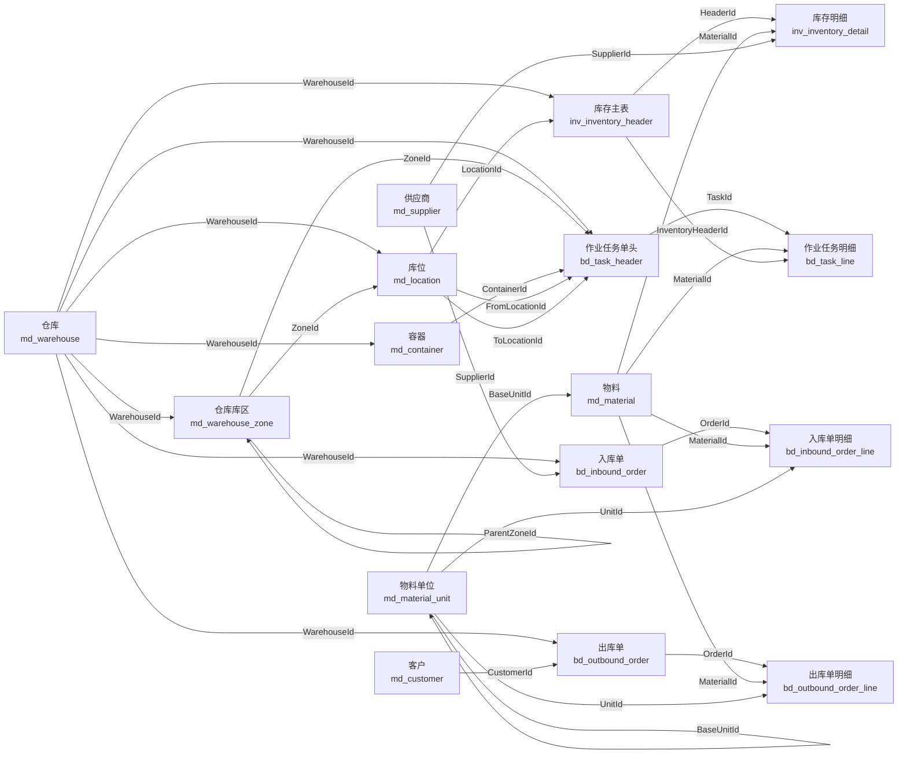

### 5.2 基础资料

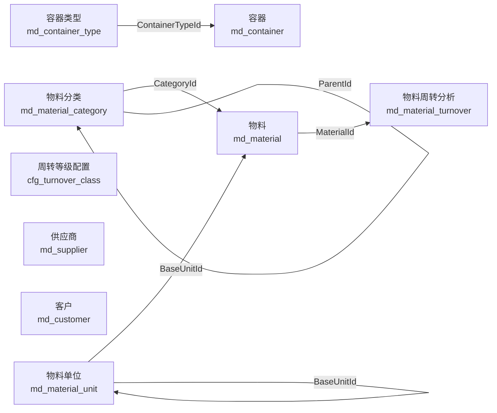

### 5.3 仓库建模

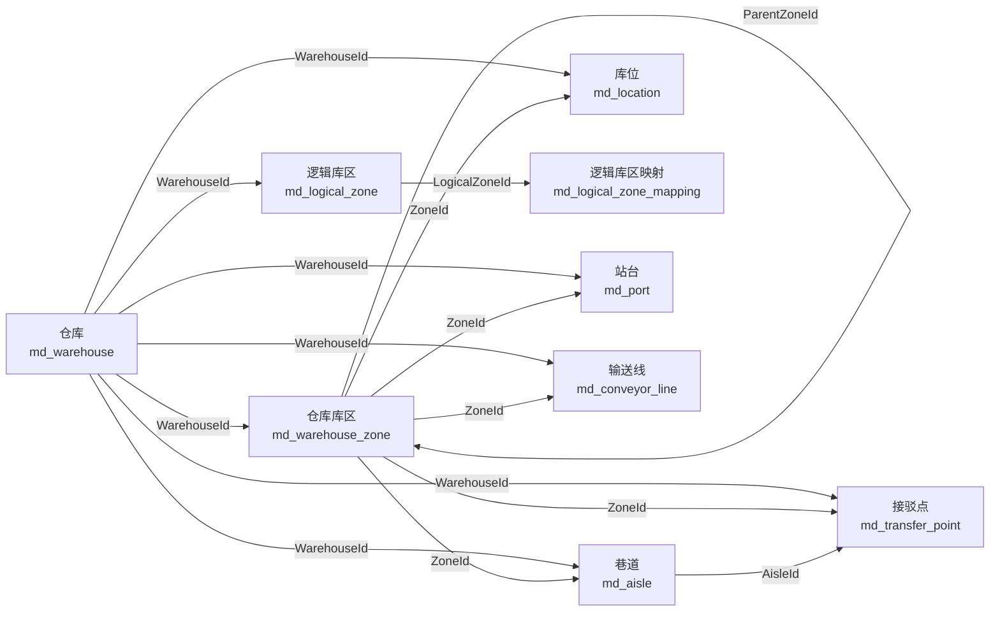

### 5.4 入库业务

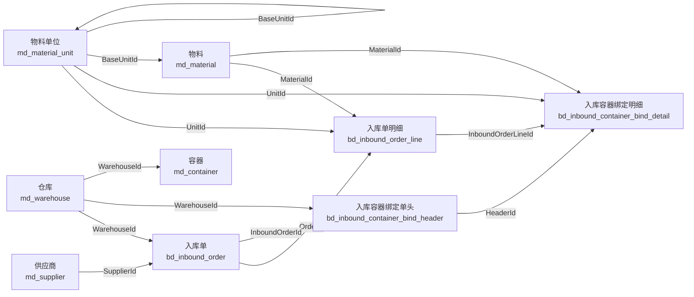

### 5.5 出库业务

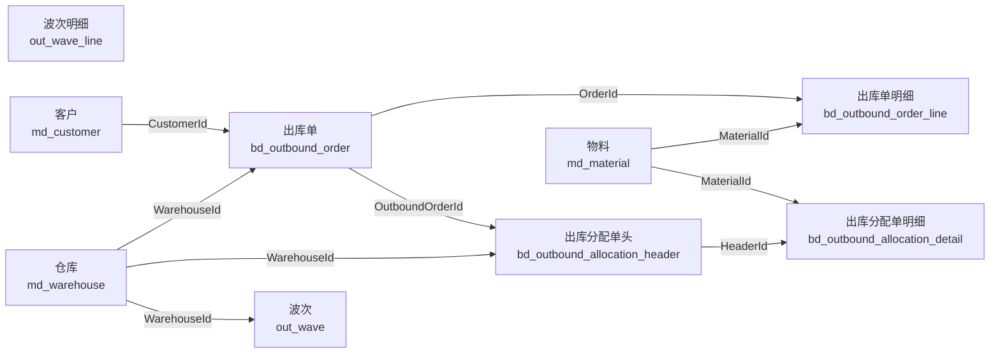

### 5.6 库存业务

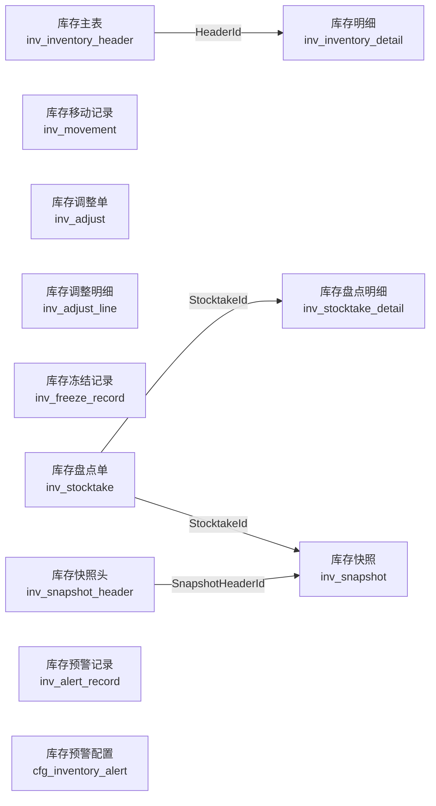

### 5.7 任务与搬运

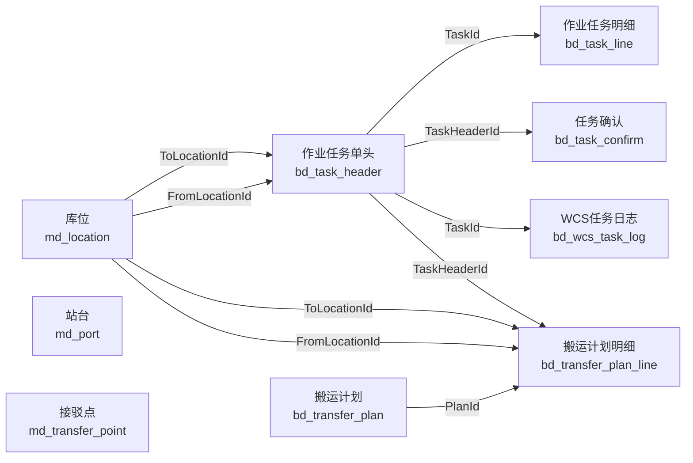

### 5.8 系统权限

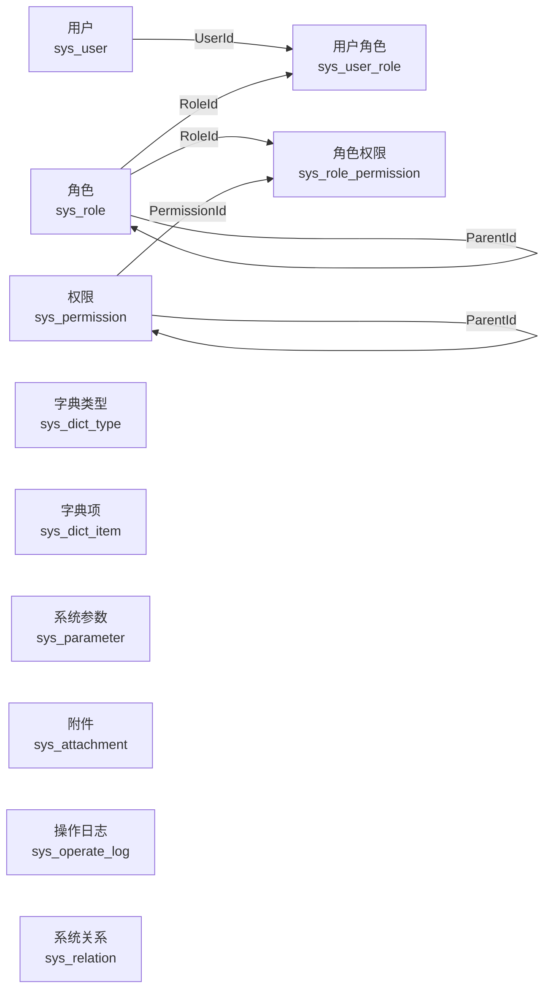

### 5.9 配置与策略

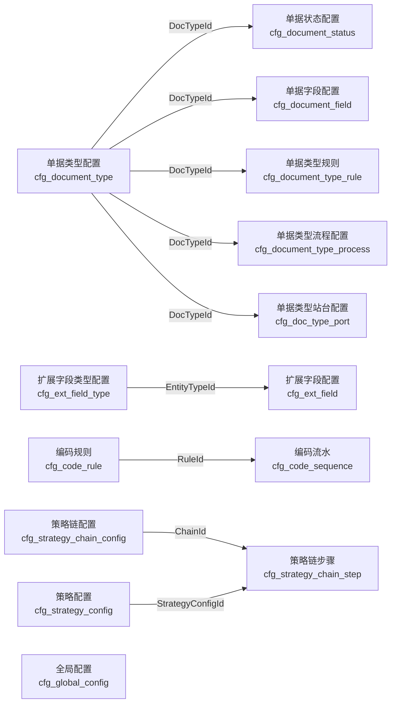

### 5.10 接口与日志

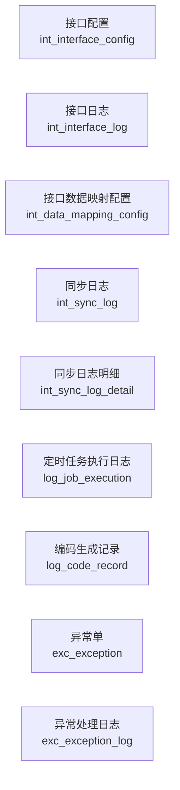

## 6 UML 类图（按业务域拆分）

> UML 图按业务域拆分，并只展示 Id 与外键字段，避免把普通业务字段全部画进图里导致缩放后不可读。

### 6.1 核心业务链路

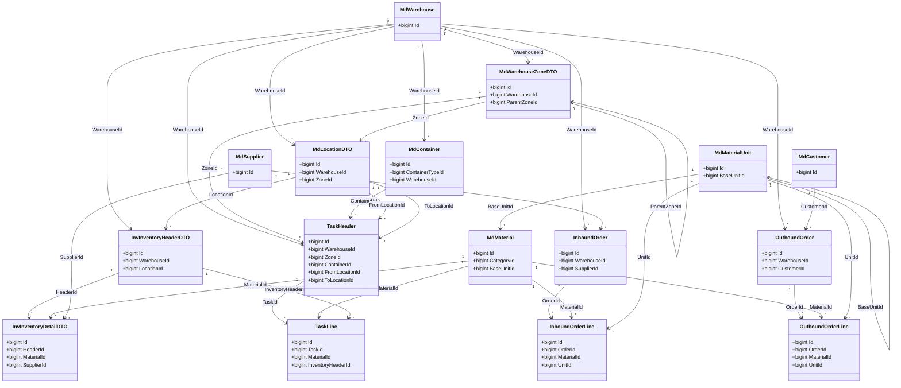

### 6.2 基础资料

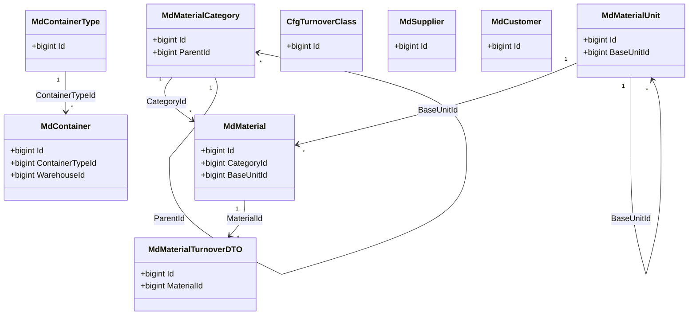

### 6.3 仓库建模

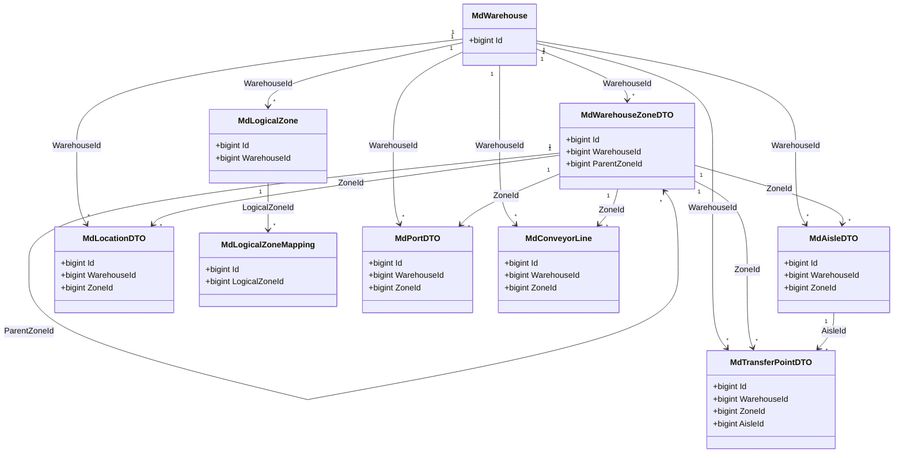

### 6.4 入库业务

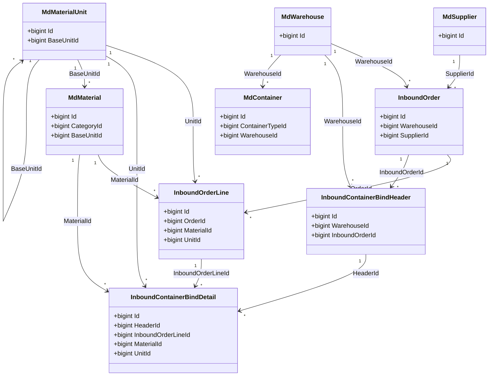

### 6.5 出库业务

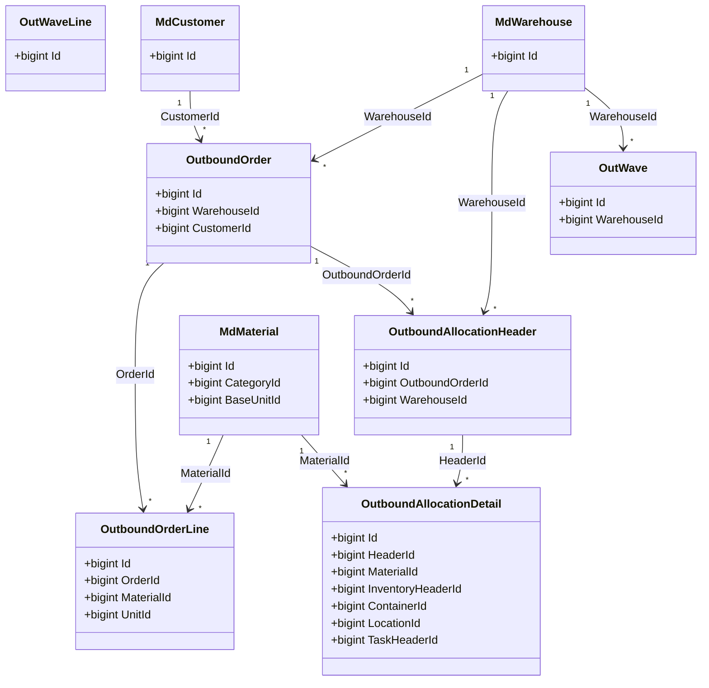

### 6.6 库存业务

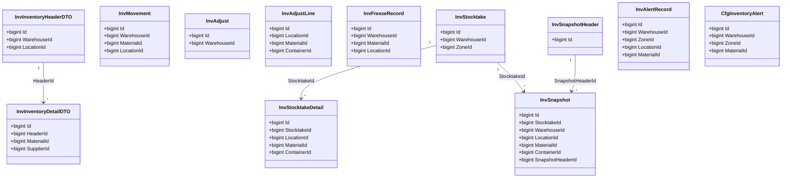

### 6.7 任务与搬运

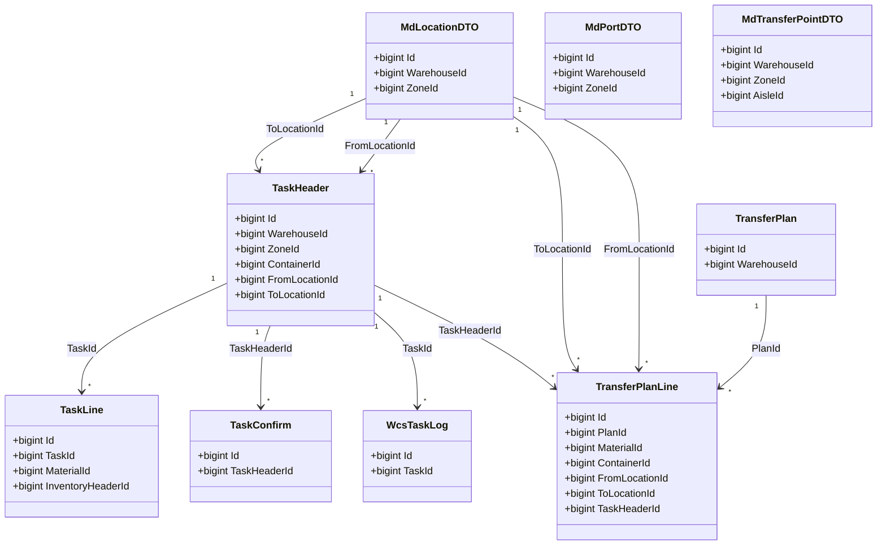

### 6.8 系统权限

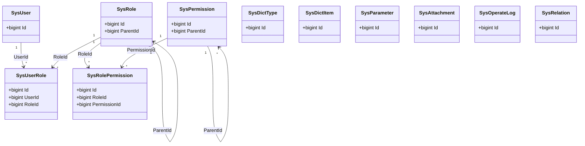

### 6.9 配置与策略

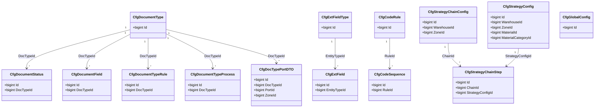

### 6.10 接口与日志

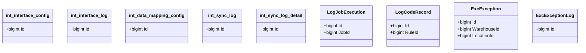
