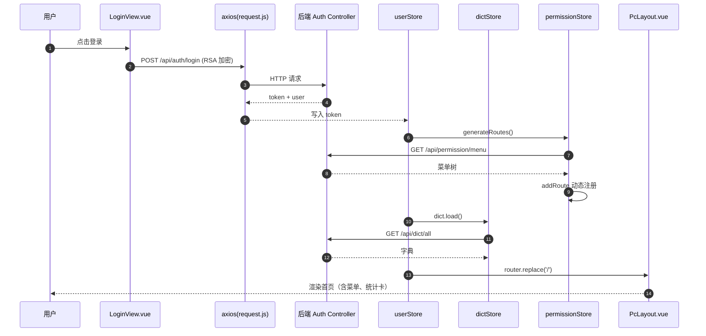
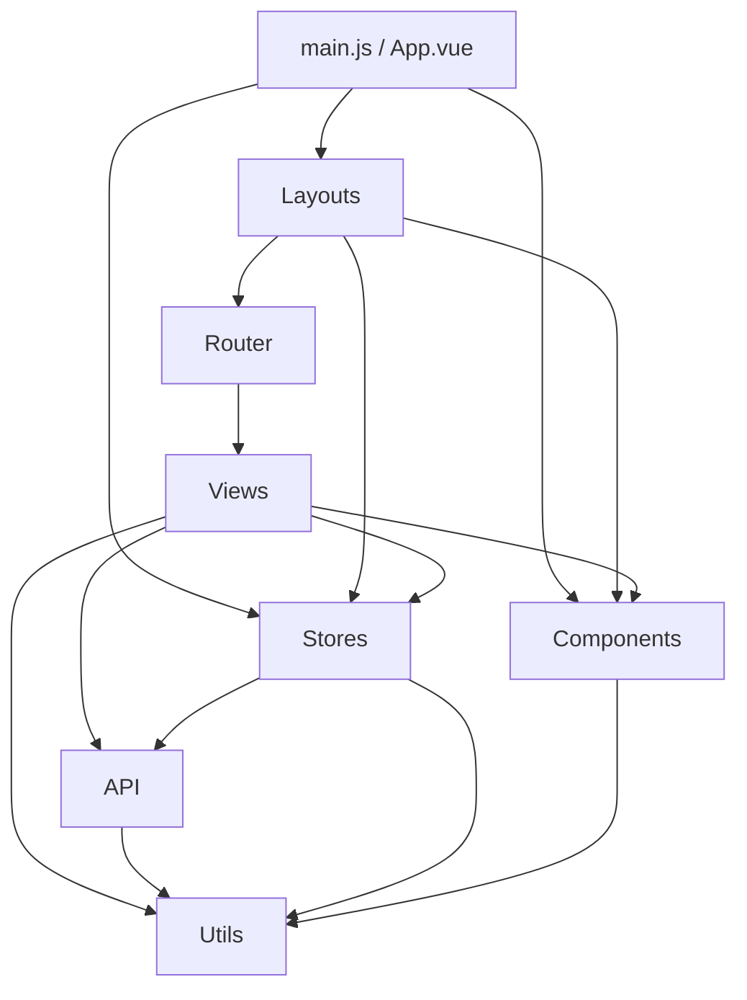

# KH.WMS 前端开发指引（重写版）实施计划

> **For agentic workers:** REQUIRED SUB-SKILL: Use superpowers:subagent-driven-development (recommended) or superpowers:executing-plans to implement this plan task-by-task. Steps use checkbox (`- [ ]`) syntax for tracking.

**Goal:** 原地重写 `docs/backend/KH.WMS前端开发指引.md` 为独立成体系的入门与日常参考文档（约 1700 行，4 章 + 5 附录），并在 6 份前端专项文档头部加"配套主文档"标识。

**Architecture:** 按设计文档 §8.1 的 8 阶段切分。每阶段一个任务：① 写对应章节的 markdown 内容 → ② 跑验证命令（占位符扫描、路径 glob、mermaid 语法抽查）→ ③ 独立 git commit。阶段 7 是最终自检（设计 §7 七项），阶段 8 是调整 6 份专项文档头部。

**Tech Stack:** Markdown + mermaid + Git。无代码改动、无依赖变更。

---

## 全局约束

来源：设计文档 `docs/superpowers/specs/2026-06-23-frontend-development-guide-rewrite-design.md`

- 目标文档路径：`docs/backend/KH.WMS前端开发指引.md`（原地覆盖，方案 α）
- 目标长度：~1700 行
- 章节顺序固定为：阅读路径 → Ch1（架构线 A，11 节点）→ Ch2（8 层）→ Ch3（10 节 A+B 双线）→ Ch4（14 域速查 + brand + PdaReceiving）→ 附录 A-E
- 双线硬规则（设计 §4.3）：Ch1 只走 A 线；Ch2 不举例只画图；Ch3 每节 A+B 双线；Ch4 业务实战用 B+P 双案例
- 命名约束：业务域术语用"业务域"/"视图模块"，禁用"模块"/"子系统"；路由用"路由组件"不用"菜单项"
- 代码示例：必须来自真实文件（`src/views/basedata/material.vue` 等已存在的），顶部标文件路径；不允许"假设你有这样一个组件"
- mermaid：序列图（Ch1）、flowchart 依赖图（Ch2）、状态图（Ch4）
- 引用风格：代码文件用 `src/...`；后端接口用 `POST /api/...`；专项文档用 `KH.WMSxxx.md §N`；后端文档用 `《KH.WMS后端开发指引》第 X.Y 节`
- **不做的事**（设计 §1.3）：不改源代码、不改后端代码或文档、不删专项文档、不创建 CI 脚本、不写 TS 迁移建议、不写 Vite 选型对比、不写 Element Plus 设计哲学、不写 Kh 组件设计动机
- 每阶段独立 commit，commit message 格式：`docs(frontend-guide): <阶段简称>`（Co-Authored-By 标记仅在用户授权时添加）
- 每个 commit 后不需要 push，停留在本地工作区由用户决定推送时机

---

## 文件结构

### 创建/修改清单

| 文件 | 操作 | 责任 |
| --- | --- | --- |
| `docs/backend/KH.WMS前端开发指引.md` | 原地覆盖 | 主文档（任务 1-7） |
| `docs/backend/KH.WMS前端组件体系与页面开发指引.md` | 头部加一行 | 任务 8 |
| `docs/backend/KH.WMS前端状态管理与公共工具指引.md` | 头部加一行 | 任务 8 |
| `docs/backend/KH.WMS前端请求封装与接口开发指引.md` | 头部加一行 | 任务 8 |
| `docs/backend/KH.WMS前端路由菜单与权限开发指引.md` | 头部加一行 | 任务 8 |
| `docs/backend/KH.WMS前端配置与启动指引.md` | 头部加一行 | 任务 8 |
| `docs/backend/KH.WMS前端E2E测试与质量检查指引.md` | 头部加一行 | 任务 8 |

主文档采用单文件长文结构（按设计 §3 章节顺序一次性产出）。**不拆分成多个文件**——与后端《KH.WMS后端开发指引》保持一致的"单文件入口"风格。

---

## Task 0: 基线检查与上下文收集

**Files:**
- Read: `docs/backend/KH.WMS前端开发指引.md`（待覆盖的旧版）
- Read: `docs/backend/KH.WMS后端开发指引.md`（对照基准）
- Read: `docs/superpowers/specs/2026-06-23-frontend-development-guide-rewrite-design.md`（设计基准）
- Glob: `KH.WMS.Client/src/**/*.{vue,js}`（确认源文件清单）
- Glob: `docs/backend/KH.WMS前端*.md`（确认 6 份专项路径）

**目的:** 让执行人掌握基线状态，避免写到一半发现引用了不存在的文件。

- [ ] **Step 1: 确认 git 工作区干净**

```bash
git status --short
```

预期输出：空白（无 uncommitted 改动）。如有未提交改动，停下来报告用户。

- [ ] **Step 2: 读旧版前端指南（确认我们要覆盖什么）**

Read `docs/backend/KH.WMS前端开发指引.md`，识别旧版的 11 节标题。

预期：识别出 1-11 节标题，记录在执行人脑里（不要写到 commit message 中）。

- [ ] **Step 3: 读设计文档 §3 §4（章节骨架与双线展开）**

Read `docs/superpowers/specs/2026-06-23-frontend-development-guide-rewrite-design.md` 的 §3、§4 两个章节。

预期：脑中明确 4 章 5 附录的顺序、双线在各章的展开位置。

- [ ] **Step 4: Glob 验证所有要引用的前端真实文件存在**

```bash
ls KH.WMS.Client/src/main.js
ls KH.WMS.Client/src/App.vue
ls KH.WMS.Client/src/utils/request.js
ls KH.WMS.Client/src/api/auth.js
ls KH.WMS.Client/src/stores/user.js
ls KH.WMS.Client/src/stores/permission.js
ls KH.WMS.Client/src/stores/dict.js
ls KH.WMS.Client/src/router/index.js
ls KH.WMS.Client/src/router/menuConfig.js
ls KH.WMS.Client/src/layouts/PcLayout.vue
ls KH.WMS.Client/src/layouts/PdaLayout.vue
ls KH.WMS.Client/src/views/HomeView.vue
ls KH.WMS.Client/src/views/LoginView.vue
ls KH.WMS.Client/src/views/dashboard/WarehouseDashboard.vue
ls KH.WMS.Client/src/views/pda/PdaReceiving.vue
ls KH.WMS.Client/src/views/basedata/material.vue
ls KH.WMS.Client/src/directives/permission.js
```

预期：全部存在。如有任一文件不存在，停下来报告用户。

- [ ] **Step 5: Glob 验证 6 份专项文档存在**

```bash
ls docs/backend/KH.WMS前端组件体系与页面开发指引.md
ls docs/backend/KH.WMS前端状态管理与公共工具指引.md
ls docs/backend/KH.WMS前端请求封装与接口开发指引.md
ls docs/backend/KH.WMS前端路由菜单与权限开发指引.md
ls docs/backend/KH.WMS前端配置与启动指引.md
ls docs/backend/KH.WMS前端E2E测试与质量检查指引.md
```

预期：全部存在。如有任一文件不存在，停下来报告用户。

- [ ] **Step 6: 记录当前 commit hash（用于头部元数据）**

```bash
git rev-parse --short HEAD
```

预期：输出形如 `ad110f3` 的短 hash。记录下来，任务 1 会用到主文档头部元数据的 `[最近的提交 hash]` 字段。

- [ ] **Step 7: 暂不 commit**

任务 0 不需要 commit。它只收集基线信息。直接进入任务 1。

---

## Task 1: 写主文档骨架（头部 + 阅读路径 + 目录）

**Files:**
- Modify: `docs/backend/KH.WMS前端开发指引.md`（覆盖写）

**目的:** 落地设计 §3 的章节骨架，让读者打开文档就能看到完整目录与"我应该读哪一章"。

- [ ] **Step 1: 写主文档头部 + 文档头元数据 + 阅读路径 + 完整目录**

用 Write 工具**整体覆盖** `docs/backend/KH.WMS前端开发指引.md`，写以下内容（不写章节正文，只写头部 + 导读 + 目录占位）：

```markdown
# KH.WMS 前端开发指引

> 适用版本：KH.WMS.Client 与后端对齐至 <任务 0 Step 6 记录的 hash>
> 目标读者：前端新人入职（首要）、前后端联调工程师、有经验前端/架构师
> 阅读路径：建议通读；按附录速查；深入专题请翻对应专项文档
> 与后端文档对照：见附录 D
> 配套专项文档：见第 0 章

本文是 KH.WMS.Client 的入门与日常参考文档。读者仅读这一份即可建立对前端工程的完整认知并开始业务开发；遇到深度专题再按指引翻阅专项文档。

## 0 阅读路径与读者地图

### 0.1 配套专项文档（深入专题）

| 专项 | 何时去读 |
| --- | --- |
| `KH.WMS前端组件体系与页面开发指引.md` | 需要 KhXxx 组件的 props/events 全集、最佳实践 |
| `KH.WMS前端状态管理与公共工具指引.md` | 需要 Pinia store 设计模式、订阅、持久化细节 |
| `KH.WMS前端请求封装与接口开发指引.md` | 需要 axios 拦截器内部实现、mock 拦截、文件上传、并发取消 |
| `KH.WMS前端路由菜单与权限开发指引.md` | 需要动态路由生成算法、嵌套路由、菜单与权限码完整映射 |
| `KH.WMS前端配置与启动指引.md` | 需要 vite.config.js 详细配置、环境变量、构建优化 |
| `KH.WMS前端E2E测试与质量检查指引.md` | 需要 Playwright 用法、用例设计、CI 接入 |

### 0.2 读者地图

- **前端新人入职**：第 1 章 → 第 2 章 → 第 3 章（10 节全读）→ 第 4 章 §4.2（brand 案例）→ 附录 A
- **前后端联调工程师**：第 1 章 §1.7-1.11 → 第 3 章 §3.3、§3.6、§3.8 → 附录 C
- **有经验前端/架构师**：第 2 章（架构总览）→ 第 3 章（约定）→ 第 4 章 §4.2、§4.3 → 附录 D

### 0.3 整体目录

- 第 1 章 从点击到渲染：一个用户操作的完整旅程
- 第 2 章 前端项目分层与依赖
- 第 3 章 开发模板与约定
- 第 4 章 业务域页面开发实战
- 附录 A 命令、构建、部署、环境变量
- 附录 B E2E 测试与质量检查
- 附录 C 联调、接口契约、错误码还原
- 附录 D 与后端架构对照表
- 附录 E 常见坑点速查

> 第 1-4 章正文将在后续任务中按顺序填入。本任务只完成头部与目录。
```

- [ ] **Step 2: 验证文档能渲染（mermaid 还没画，目录能跳）**

Read `docs/backend/KH.WMS前端开发指引.md`，确认：
- 标题层级为 # / ## / ###，无错位
- 目录条目与设计 §3 一致
- 整体长度约 50-80 行（不超 100）

- [ ] **Step 3: 提交**

```bash
git add docs/backend/KH.WMS前端开发指引.md
git commit -m "docs(frontend-guide): 阶段 1 写主文档骨架（头部 + 阅读路径 + 目录）"
```

预期输出：1 file changed, XX insertions(+), XX deletions(-)。

---

## Task 2: 写第 1 章（架构线 A，11 节点 + mermaid 全景图）

**Files:**
- Modify: `docs/backend/KH.WMS前端开发指引.md`（在第 0 章后追加第 1 章）

**目的:** 落地设计 §4.2 第 1 章表格的 11 个节点 + 一张 mermaid 序列图。

- [ ] **Step 1: Read 必要的源文件，确认代码片段可摘录**

Read 下列文件（已通过任务 0 Step 4 验证存在）：
- `KH.WMS.Client/src/utils/request.js`
- `KH.WMS.Client/src/api/auth.js`
- `KH.WMS.Client/src/stores/user.js`
- `KH.WMS.Client/src/router/index.js`
- `KH.WMS.Client/src/router/menuConfig.js`
- `KH.WMS.Client/src/layouts/PcLayout.vue`
- `KH.WMS.Client/src/stores/dict.js`

预期：每个文件能摘出 1-2 个真实代码片段（每段不超过 20 行）。

- [ ] **Step 2: 在主文档第 0 章后追加第 1 章**

Edit `docs/backend/KH.WMS前端开发指引.md`，在第 0 章最后一段 `> 第 1-4 章正文将在后续任务中按顺序填入...` 之后，追加以下内容（约 250 行）：

```markdown
## 第 1 章 从点击到渲染：一个用户操作的完整旅程

> 本章是架构线 A 的完整旅程：跟踪"用户点击登录按钮 → 看到首页（带动态菜单）"走过的所有节点。读完后，读者应能口述一个 HTTP 请求在前端从进入到渲染返回的完整路径。

### 1.1 浏览器 → Vite 代理 → Kestrel

入口配置见 `KH.WMS.Client/vite.config.js`：

```js
// vite.config.js
server: {
  port: 3000,
  proxy: {
    '/api': { target: 'http://localhost:9291', changeOrigin: true },
    '/ws':  { target: 'ws://localhost:9291',  ws: true }
  }
}
```

后端默认监听 `http://*:9291`（见 `KH.WMS.Server/Program.cs` 的 `app.Run()`）。开发时浏览器访问 `http://localhost:3000`，`/api/...` 与 `/ws` 请求被代理到后端 9291 端口。

> 易错点：把代理目标写错成 `http://localhost:3000` 导致代理死循环。

### 1.2 全局 axios 实例与拦截器

所有 HTTP 请求统一从 `src/utils/request.js` 导出的 axios 实例发出。该实例配置了三层拦截器：

```js
// src/utils/request.js（关键片段）
const instance = axios.create({ baseURL: '/api', timeout: 30000 })

instance.interceptors.request.use(config => {
  const token = localStorage.getItem('token')
  if (token) config.headers.Authorization = `Bearer ${token}`
  if (store.state.app.loadingCount === 0) {
    store.state.app.loading = true
  }
  store.state.app.loadingCount++
  return config
})

instance.interceptors.response.use(
  response => {
    store.state.app.loadingCount--
    if (store.state.app.loadingCount === 0) store.state.app.loading = false
    const res = response.data
    if (res.code === 200 || res.code === 0) return res
    if (res.code === 401) { /* 触发 token 刷新队列 */ }
    return Promise.reject(res)
  },
  error => { /* 网络错误兜底 */ }
)
```

**401 刷新队列**：当并发请求同时拿到 401 时，只触发一次刷新 token，其他请求进入 `pendingRequests` 队列等待新 token 后重发。完整实现见专项 `KH.WMS前端请求封装与接口开发指引.md §2`。

### 1.3 /api/auth/login 调用

登录页 `src/views/LoginView.vue` 调用 `src/api/auth.js` 暴露的 `login` 方法：

```js
// src/api/auth.js
import request from '@/utils/request'
import { encrypt } from '@/utils/rsa'  // jsencrypt 封装

export function login(data) {
  return request({
    url: '/auth/login',
    method: 'post',
    data: { userName: data.userName, password: encrypt(data.password) }
  })
}
```

**RSA 加密**：密码通过前端 `jsencrypt` 公钥加密后传给后端，后端 `KH.WMS.Core/Security/Encryption/` 用私钥解密。公钥在发布时由 `KeyGen.exe` 生成。

### 1.4 后端鉴权与 JWT 签发

`POST /api/auth/login` 由后端 `KH.WMS.Modules.SystemModule/Controllers/UserController.cs` 处理，调 `SysUserService.LoginAsync`：

```csharp
// 后端（仅简注，不展开）
[RegisteredService(ServiceType = typeof(ISysUserService))]
public class SysUserService(...) : CrudService<SysUser>(...), ISysUserService
{
    public async Task<ApiResponse<LoginResult>> LoginAsync(LoginRequest req) {
        // 1. 查用户
        // 2. 校验密码哈希（KH.WMS.Core/Security/Hashing/PasswordHasher）
        // 3. 查角色与权限
        // 4. 签发 JWT（KH.WMS.Core/Security/Jwt/）
        // 5. 返回 token + user
    }
}
```

详细见《KH.WMS后端开发指引》第 4.6 节。

### 1.5 token 写入 Pinia + localStorage

登录成功后，前端 `src/stores/user.js` 的 `login` action 写入 token：

```js
// src/stores/user.js
export const useUserStore = defineStore('user', {
  state: () => ({ token: '', user: null, roles: [], permissions: [] }),
  actions: {
    async login(form) {
      const res = await api.login(form)
      this.token = res.data.token
      this.user = res.data.user
      localStorage.setItem('token', this.token)
      router.replace('/')
    }
  }
})
```

**token 持久化**：默认放 localStorage；刷新页面后 `main.js` 的初始化会从 localStorage 恢复 token。

### 1.6 App.vue + <router-view>

`src/main.js` 注册 Pinia、Router、ElementPlus、全局 Kh 组件、全局指令；`src/App.vue` 只包含 `<router-view />`。

```js
// src/main.js（关键片段）
app.use(pinia)
app.use(router)
app.use(ElementPlus)
app.component('KhTable', KhTable)
app.component('KhForm', KhForm)
// ... 30 个 Kh 组件
app.config.globalProperties.$khMessage = khMessage
app.config.globalProperties.$khNotify = khNotify
```

**全局组件 vs 自动导入**：KhXxx 系列组件在 `main.js` 中**手动注册**（不用 `unplugin-vue-components`），因为它们需要全局可用；ElementPlus 组件由 `unplugin-vue-components` + `ElementPlusResolver` 自动按需导入。

### 1.7 路由守卫：generateDynamicRoutes

登录成功后进入 `src/router/index.js` 的 `beforeEach` 守卫。第一次进入时调 `/api/permission/menu` 拉取后端菜单，生成动态路由并 `router.addRoute`：

```js
// src/router/index.js（关键片段）
router.beforeEach(async (to, from, next) => {
  const userStore = useUserStore()
  const permStore = usePermissionStore()
  if (userStore.token && !permStore.routesGenerated) {
    await permStore.generateRoutes()  // 内部调 /api/permission/menu
    return next({ ...to, replace: true })
  }
  next()
})
```

完整生成算法见专项 `KH.WMS前端路由菜单与权限开发指引.md §3`。

### 1.8 后端菜单 → 前端 component 映射

后端菜单接口返回的数据形如：

```json
{
  "code": 200,
  "data": [
    { "id": 1, "name": "基础资料", "children": [
      { "id": 11, "name": "物料", "meta": { "component": "basedata/material", "permission": "basedata:material:view" } }
    ]}
  ]
}
```

前端 `src/router/menuConfig.js` 提供**静态菜单结构**（PDA 与 PC 端的差异在此处分叉），动态路由按 `meta.component` 拼成 `src/views/{component}.vue` 的路径并 `import()` 动态加载：

```js
// src/router/menuConfig.js（关键片段）
const modules = import.meta.glob('@/views/**/*.vue')
function resolveComponent(componentPath) {
  return modules[`/src/views/${componentPath}.vue`]
}
```

### 1.9 PcLayout.vue 渲染菜单、面包屑、字典缓存

登录后跳转的入口布局 `src/layouts/PcLayout.vue` 包含侧边栏菜单、顶部面包屑、用户信息、字典加载：

```vue
<!-- src/layouts/PcLayout.vue 简化 -->
<template>
  <el-container>
    <el-aside><KhMenu :items="menuTree" /></el-aside>
    <el-container>
      <el-header><KhBreadcrumb /></el-header>
      <el-main><router-view /></el-main>
    </el-container>
  </el-container>
</template>
```

字典通过 `src/stores/dict.js` 的 `load` action 一次性拉取并按业务类型缓存：

```js
// src/stores/dict.js
export const useDictStore = defineStore('dict', {
  state: () => ({ items: {}, loaded: false }),
  actions: {
    async load() {
      if (this.loaded) return
      const res = await api.getAllDicts()
      this.items = groupBy(res.data, 'dictType')
      this.loaded = true
    }
  }
})
```

> PDA 端用 `PdaLayout.vue`（`src/layouts/PdaLayout.vue`），布局更紧凑、隐藏侧边栏，路由仍共用同一组动态路由。

### 1.10 首页仪表盘渲染

进入首页 `src/views/HomeView.vue` 或 `src/views/dashboard/WarehouseDashboard.vue`，使用 `KhStatCard`（统计卡片）、ECharts（图表）渲染。

`KhStatCard` 是通用统计卡组件，props 形如：

```vue
<KhStatCard title="今日入库" :value="1234" icon="Box" />
```

`WarehouseDashboard.vue` 使用 ECharts 渲染库存趋势、库位利用率等多图组合。空数据时显示占位、加载中显示骨架屏、异常显示错误占位（参考 §3.9 调试与日志）。

### 1.11 错误回到前端（含 TraceId）

后端异常经 `KH.WMS.Core/Filters/Exception/GlobalExceptionFilter.cs` 转译为 `ApiResponse.Fail(code, message, data)`，并在 Result 阶段由 `TraceIdResultFilter` 注入 `traceId`：

```json
// 错误响应示例
{
  "code": 422,
  "message": "数据验证失败",
  "data": { "fields": [{ "field": "qty", "error": "must be > 0" }] },
  "traceId": "0HNCG7F4N3K2Q:00000002"
}
```

前端拦截器在 `code !== 200 && code !== 0` 时：
- 401 → 触发 token 刷新
- 422 → 把 `data.fields` 注入表单字段错误（用 `KhForm` 渲染）
- 其他 → 调 `$khNotify` 弹出 `message`，把 `traceId` 拼到消息末尾

排错流程：用户贴 `traceId` → 后端用 `CorrelationId == <traceId>` 过滤 Serilog 还原整条请求链路（见《KH.WMS后端开发指引》§1.10）。

### 1.12 全景图（mermaid）



### 1.13 章末易错点

| 错误 | 后果 | 正确做法 |
| --- | --- | --- |
| 直接用 `axios` 而非 `request.js` 的实例 | 拦截器、Loading、token 注入全失效 | 页面统一 `import request from '@/utils/request'` |
| 登录密码未走 RSA 加密 | 密码明文传输 | 用 `encrypt()` 包装 |
| 后端菜单 `meta.component` 写错路径 | 路由找不到页面 | 路径与 `src/views/` 下文件一一对应 |
| 字典未在 App 启动时加载 | 页面级字典读取失败 | 在 `main.js` 或 `App.vue` 启动后调 `useDictStore().load()` |
| 把 `traceId` 丢了不展示给用户 | 用户报错无锚点 | 拦截器在错误消息末尾拼 `traceId` |
```

- [ ] **Step 3: 验证章节长度**

```bash
wc -l docs/backend/KH.WMS前端开发指引.md
```

预期：约 330-380 行（第 0 章 60-80 行 + 第 1 章约 250 行）。

- [ ] **Step 4: 验证 mermaid 块存在且配对**

```bash
grep -c '^```mermaid' docs/backend/KH.WMS前端开发指引.md
grep -c '^```$' docs/backend/KH.WMS前端开发指引.md
```

预期：mermaid 块计数 = 1；总代码块闭合数 ≥ mermaid 块数 + 其他语言块数（差额 = 其他代码块闭合数）。

- [ ] **Step 5: 验证引用的真实文件路径都在仓库中**

```bash
for f in KH.WMS.Client/vite.config.js KH.WMS.Client/src/utils/request.js KH.WMS.Client/src/api/auth.js KH.WMS.Client/src/stores/user.js KH.WMS.Client/src/router/index.js KH.WMS.Client/src/router/menuConfig.js KH.WMS.Client/src/layouts/PcLayout.vue KH.WMS.Client/src/stores/dict.js KH.WMS.Client/src/main.js KH.WMS.Client/src/App.vue KH.WMS.Client/src/views/dashboard/WarehouseDashboard.vue; do
  test -f "$f" || echo "MISSING: $f"
done
```

预期：无 MISSING 输出。

- [ ] **Step 6: 占位符扫描**

```bash
grep -nE 'TBD|TODO|XXX|待补|<占位>' docs/backend/KH.WMS前端开发指引.md
```

预期：无输出。

- [ ] **Step 7: 提交**

```bash
git add docs/backend/KH.WMS前端开发指引.md
git commit -m "docs(frontend-guide): 阶段 2 写第 1 章（架构线 A，11 节点 + mermaid 全景图）"
```

---

## Task 3: 写第 2 章（前端项目分层与依赖）

**Files:**
- Modify: `docs/backend/KH.WMS前端开发指引.md`（在第 1 章后追加第 2 章）

**目的:** 落地设计 §4.2 第 2 章 8 层依赖表 + 一张 mermaid 依赖方向图。

- [ ] **Step 1: Glob 确认 8 层目录存在**

```bash
for d in KH.WMS.Client/src/main.js KH.WMS.Client/src/App.vue KH.WMS.Client/src/layouts KH.WMS.Client/src/router KH.WMS.Client/src/stores KH.WMS.Client/src/api KH.WMS.Client/src/utils KH.WMS.Client/src/views KH.WMS.Client/src/components; do
  test -e "$d" || echo "MISSING: $d"
done
```

预期：无 MISSING。

- [ ] **Step 2: 在主文档第 1 章末尾追加第 2 章**

Edit `docs/backend/KH.WMS前端开发指引.md`，在第 1 章最后一行（第 1.13 节的"正确做法"表格末行）之后追加：

```markdown

## 第 2 章 前端项目分层与依赖

> 本章是项目分层的总览：8 个子目录各自的角色与依赖方向。读完后，读者应能口述"页面应该放哪、组件应该放哪、API 应该放哪"，并在违反依赖方向时能识别出 smell。

### 2.1 八层职责

| 层 | 路径 | 角色 | 关键约定 |
| --- | --- | --- | --- |
| 入口层 | `KH.WMS.Client/src/main.js`、`KH.WMS.Client/src/App.vue` | 启动入口 | 手动注册 Kh 组件、`globalProperties` 挂命令式方法 |
| 布局层 | `KH.WMS.Client/src/layouts/` | PcLayout / PdaLayout | PC 与 PDA 共用一组路由，仅外壳不同 |
| 路由层 | `KH.WMS.Client/src/router/` | 静态 + 动态路由 | 动态路由由后端菜单生成 |
| 状态层 | `KH.WMS.Client/src/stores/` | Pinia：user、permission、dict、app、websocket | 跨页面状态唯一落点 |
| API 层 | `KH.WMS.Client/src/api/` | 按业务域：`auth.js` / `system.js` / `basedata.js` / ... | 每个域一个文件；通用 CRUD 走 `useCrudApi(module)` |
| 工具层 | `KH.WMS.Client/src/utils/` | request / crud / dict-resolve / useExtFields / websocket / mockData | 无业务依赖 |
| 视图层 | `KH.WMS.Client/src/views/{业务域}/` | 页面放业务域根目录；`components` 子目录放局部组件 | 路由扫描会排除 `**/components` |
| 通用组件层 | `KH.WMS.Client/src/components/KhXxx/` | 跨业务域复用 | Kh 全局组件命名约定（Kh 前缀） |

### 2.2 依赖方向图（mermaid）



**关键约束**（反向依赖禁止）：

- 通用组件（`KhXxx`）**不能**反向依赖任何业务域（不能 `import` 任何 `src/api/*.js` 或 `src/views/**/*.vue`）
- 工具（`src/utils/`）**不能**反向依赖任何业务域（只能依赖 `axios`、`pinia` 等基础库）
- 视图层**不能**反向依赖布局层（页面不能直接 `import` PcLayout）

### 2.3 各层目录速查

#### 2.3.1 入口层

`main.js` 顺序（不可乱）：
1. 创建 app 实例
2. 注册 Pinia
3. 注册 Router
4. 注册 ElementPlus
5. 注册 Kh 全局组件（30 个）
6. 注册全局指令（`v-permission`）
7. 挂载命令式方法（`$khMessage`、`$khNotify`、`$khMsgBox`）

`App.vue` 只包含 `<router-view />`，不写业务逻辑。

#### 2.3.2 布局层

- `PcLayout.vue` —— PC 端标准布局：侧边栏菜单 + 顶部面包屑 + 用户信息 + 标签页（可选）
- `PdaLayout.vue` —— PDA 端紧凑布局：隐藏侧边栏、按钮更大、适配手持屏幕

> PC 与 PDA 共用同一组动态路由（基于后端菜单），但通过 `meta.layout: 'pda'` 字段决定使用哪个 Layout。

#### 2.3.3 路由层

- `index.js` —— 路由配置（静态 + 动态合并）
- `menuConfig.js` —— PDA 与 PC 端的菜单配置差异

#### 2.3.4 状态层

5 个 Pinia store：

| Store | 文件 | 职责 |
| --- | --- | --- |
| `useUserStore` | `stores/user.js` | token、user、roles、permissions |
| `usePermissionStore` | `stores/permission.js` | 动态路由生成、菜单树 |
| `useDictStore` | `stores/dict.js` | 全局字典缓存 |
| `useAppStore` | `stores/app.js` | 全局 Loading、侧边栏折叠 |
| `useWebsocketStore` | `stores/websocket.js` | WebSocket 连接、消息分发 |

#### 2.3.5 API 层

按业务域拆分（与后端模块一一对应）：

| 文件 | 业务域 | 后端模块 |
| --- | --- | --- |
| `auth.js` | 认证 | `SystemModule` |
| `user.js` | 用户 | `SystemModule` |
| `system.js` | 角色/权限/字典/参数/日志/附件 | `SystemModule` |
| `basedata.js` | 物料/客户/供应商/容器 | `BaseDataModule` |
| `warehouse.js` | 仓库/库区/库位/站台 | `WarehouseModule` |
| `inbound.js` | 入库单/收货/容器绑定 | `InboundModule` |
| `outbound.js` | 出库单/波次/分配 | `OutboundModule` |
| `inventory.js` | 库存/移动/调整/盘点/快照 | `InventoryModule` |
| `task.js` | 任务/确认/调拨 | `TaskModule` |
| `strategy.js` | 策略 | `Algorithms` |
| `adhoc.js` | 动态 CRUD | 通用 |

通用 CRUD 用 `useCrudApi(module)` 工厂方法（见 §3.3）。

#### 2.3.6 工具层

| 文件 | 职责 |
| --- | --- |
| `request.js` | axios 实例 + 拦截器 |
| `crud.js` | `useCrudApi`、`buildPageQuery` 等 CRUD 辅助 |
| `dict-resolve.js` | 字典翻译辅助 |
| `useExtFields.js` | 扩展字段的 composable |
| `mockData.js` | demo 页面 mock 数据 |
| `websocket.js` | 原始 WebSocket 辅助 |

#### 2.3.7 视图层

按业务域组织：

```
src/views/
├── basedata/         # 基础资料（物料、客户、容器等）
├── config/           # 配置（暂时不深度展开）
├── dashboard/        # 大屏
├── demo/             # 示例
├── exception/        # 异常页
├── inbound/          # 入库
├── inventory/        # 库存
├── outbound/         # 出库
├── pda/              # PDA
├── report/           # 报表
├── sorting/          # 分拣
├── strategy/         # 策略
├── system/           # 系统
├── task/             # 任务
└── warehouse/        # 仓储基础
```

**硬规则**：
- 页面文件必须放在业务域**根目录**，不能放进 `components` 子目录（路由扫描会排除）
- `components` 子目录**只放局部组件**（仅当前页面用）
- 跨业务域复用组件**必须提升**到 `src/components/`

#### 2.3.8 通用组件层

30 个 KhXxx 组件（按字母）：

`KhAlert` / `KhCollapse` / `KhColorPicker` / `KhDashboard` / `KhDetailDialog` / `KhDialog` / `KhDragList` / `KhEditableTable` / `KhForm` / `KhFullscreen` / `KhIconPicker` / `KhLayout` / `KhLoading` / `KhMenu` / `KhMessage` / `KhMsgBox` / `KhNoticeBar` / `KhNotification` / `KhNotify` / `KhPage` / `KhPageHeader` / `KhSideDrawer` / `KhSortList` / `KhStatCard` / `KhSteps` / `KhTable` / `KhTimeline` / `KhTransfer` / `KhUpload` / `KhWaterfall`

完整 props/events 见专项 `KH.WMS前端组件体系与页面开发指引.md`。

### 2.4 章末易错点

| 错误 | 后果 | 正确做法 |
| --- | --- | --- |
| 通用组件里 `import` 业务 API | 通用组件无法跨业务域复用 | 通用组件只接 props/events，不调 API |
| 页面放进 `views/xxx/components/` 后被配为菜单 | 动态路由找不到 | 页面放业务域根目录 |
| API 文件间互相 `import` | 循环依赖 | 跨域调用走 store 或新拆 API 文件 |
| 工具文件里写业务逻辑 | 工具被业务污染 | 业务逻辑放 store 或页面 |
| 局部组件过早提升到 `components/` | 后续维护困难 | 先放业务域 `components` 子目录，复用稳定后再提升 |
```

- [ ] **Step 3: 验证章节长度**

```bash
wc -l docs/backend/KH.WMS前端开发指引.md
```

预期：约 530-600 行（任务 2 末约 380 + 本章约 200）。

- [ ] **Step 4: 验证 mermaid 块数量**

```bash
grep -c '^```mermaid' docs/backend/KH.WMS前端开发指引.md
```

预期：2（任务 2 的序列图 + 本章的 flowchart）。

- [ ] **Step 5: 占位符扫描**

```bash
grep -nE 'TBD|TODO|XXX|待补|<占位>' docs/backend/KH.WMS前端开发指引.md
```

预期：无输出。

- [ ] **Step 6: 提交**

```bash
git add docs/backend/KH.WMS前端开发指引.md
git commit -m "docs(frontend-guide): 阶段 3 写第 2 章（8 层依赖图 + 速查表）"
```

---

## Task 4: 写第 3 章（开发模板与约定，10 节 A+B 双线）

**Files:**
- Modify: `docs/backend/KH.WMS前端开发指引.md`（在第 2 章后追加第 3 章）

**目的:** 落地设计 §4.2 第 3 章的 10 节，每节同时用 A 线（架构）和 B 线（业务）举例。这是文档最厚的一章。

- [ ] **Step 1: Read 必要源文件**

Read：
- `KH.WMS.Client/src/views/LoginView.vue`
- `KH.WMS.Client/src/views/basedata/material.vue`（作为"已存在业务页面"模板，业务线 B 的参考；不写 brand.vue 实际内容，只演示"如何在 basedata 下新增一个 brand.vue"）
- `KH.WMS.Client/src/directives/permission.js`
- `KH.WMS.Client/src/api/basedata.js`（确认 `useCrudApi` 导出）
- `KH.WMS.Client/src/utils/crud.js`（确认 `useCrudApi` 与 `buildPageQuery` 实现）

预期：每个文件能摘出 1-2 段真实代码。

- [ ] **Step 2: 在主文档第 2 章末尾追加第 3 章（10 节）**

Edit `docs/backend/KH.WMS前端开发指引.md`，在第 2 章最后一行（第 2.4 节易错点表格末行）之后追加以下内容（约 450 行）：

```markdown

## 第 3 章 开发模板与约定

> 本章是文档最厚的一章。10 节每节都同时用架构线 A（登录/路由/请求）和业务线 B（基于 basedata 域开发）举例，让读者看完任一节就能照抄出对应代码。

### 3.1 Vue 3 <script setup> 约定

#### A 线：`LoginView.vue` 骨架

```vue
<!-- src/views/LoginView.vue 简化 -->
<script setup>
import { ref } from 'vue'
import { useUserStore } from '@/stores/user'

const form = ref({ userName: '', password: '' })
const userStore = useUserStore()

async function handleLogin() {
  await userStore.login(form.value)
}
</script>

<template>
  <el-form :model="form">
    <el-form-item label="用户名">
      <el-input v-model="form.userName" />
    </el-form-item>
    <el-form-item label="密码">
      <el-input v-model="form.password" type="password" />
    </el-form-item>
    <el-button type="primary" @click="handleLogin">登录</el-button>
  </el-form>
</template>
```

要点：组合式 API 不用 `this`；`ref` 包装原始值、`reactive` 包装对象；store 用 `useXxxStore()` 工厂调用。

#### B 线：`basedata/brand.vue` 骨架（新增页面案例）

```vue
<!-- src/views/basedata/brand.vue 演示骨架 -->
<script setup>
import { ref, onMounted } from 'vue'
import { useCrudApi } from '@/utils/crud'
import { useDictStore } from '@/stores/dict'

const api = useCrudApi('brand')          // 走 useCrudApi 工厂
const dict = useDictStore()
const list = ref([])
const query = ref({ code: '', name: '', status: '' })
const pagination = ref({ page: 1, size: 20, total: 0 })

async function loadData() {
  const res = await api.page(query.value, pagination.value)
  list.value = res.data.items
  pagination.value.total = res.data.total
}

onMounted(async () => {
  await dict.load('ENABLE_STATUS')  // 预加载本页面用到的字典
  loadData()
})
</script>

<template>
  <KhPage>
    <KhForm :model="query" @search="loadData" />
    <KhTable :data="list" :columns="columns" :pagination="pagination" @page-change="loadData" />
    <BrandFormDialog v-model="dialogVisible" :row="current" @saved="loadData" />
  </KhPage>
</template>
```

### 3.2 Kh 组件体系速查

最常用的 5 个组件：

| 组件 | 用途 | 关键 props |
| --- | --- | --- |
| `KhTable` | 表格（含分页、列配置、行选择） | `data`、`columns`、`pagination` |
| `KhForm` | 表单（搜索/编辑两用） | `model`、`fields`、`@submit` |
| `KhDialog` | 弹窗（含确认、取消、全屏） | `v-model`、`title`、`@confirm` |
| `KhPage` | 页面外壳（包含头部、操作区、表格区） | 默认插槽 |
| `KhLoading` | 全局 Loading 蒙层 | `v-model` |

完整 30 个组件清单见 §2.3.8，props/events 全集见专项 `KH.WMS前端组件体系与页面开发指引.md`。

#### A 线：KhLoading（全局 Loading）

`request.js` 的拦截器自动控制 `useAppStore().loading`；`KhLoading` 组件订阅该状态渲染蒙层。**页面无需手动控制 Loading**。

#### B 线：KhTable + KhForm + KhDialog 三件套

`brand.vue` 用 `KhForm` 做搜索区（字段：编码、名称、状态）、`KhTable` 做列表、`BrandFormDialog`（业务域局部组件）做编辑弹窗。

### 3.3 API 文件组织

#### A 线：`src/api/auth.js`

```js
// src/api/auth.js
import request from '@/utils/request'

export function login(data) {
  return request({ url: '/auth/login', method: 'post', data })
}
export function logout() {
  return request({ url: '/auth/logout', method: 'post' })
}
export function getRsaPublicKey() {
  return request({ url: '/auth/public-key', method: 'get' })
}
```

#### B 线：`src/api/basedata.js` + `useCrudApi` 工厂

```js
// src/api/basedata.js
import { useCrudApi } from '@/utils/crud'

export const materialApi = useCrudApi('material')  // 通用 CRUD：page/get/create/update/delete/import/export/template
export const brandApi = useCrudApi('brand')

// 自定义动作
export function getMaterialByCode(code) {
  return request({ url: `/material/by-code/${code}`, method: 'get' })
}
```

`useCrudApi(module)` 内部封装了 `page`、`get`、`create`、`update`、`delete`、`batchDelete`、`import`、`export`、`template` 9 个标准端点，对应后端 `ExtDataCrudController<TEntity>` 的 10 个标准端点（见《KH.WMS后端开发指引》§3.2）。

### 3.4 Pinia store 写法

#### A 线：useUserStore

```js
// src/stores/user.js（简化）
export const useUserStore = defineStore('user', {
  state: () => ({ token: '', user: null, roles: [], permissions: [] }),
  getters: {
    hasPermission: (s) => (code) => s.permissions.includes(code)
  },
  actions: {
    async login(form) { /* ... */ },
    async fetchProfile() { /* ... */ },
    logout() { this.reset(); localStorage.clear(); router.replace('/login') }
  }
})
```

#### B 线：useDictStore

```js
// src/stores/dict.js（简化）
export const useDictStore = defineStore('dict', {
  state: () => ({ items: {}, loadedTypes: new Set() }),
  actions: {
    async load(type) {
      if (this.loadedTypes.has(type)) return
      const res = await api.getDict(type)
      this.items[type] = res.data
      this.loadedTypes.add(type)
    },
    resolve(type, value) {
      return (this.items[type] || []).find(d => d.value === value)?.label ?? value
    }
  }
})
```

页面用法：`dict.resolve('ENABLE_STATUS', row.status)`。

### 3.5 路由与菜单

#### A 线：动态路由守卫（已在 §1.7 详述）

`router/index.js` 的 `beforeEach` 调 `usePermissionStore().generateRoutes()`。

#### B 线：后端菜单 `meta.component` 映射

后端菜单表 `sys_menu` 的 `component` 字段填 `basedata/brand`，前端按 §1.8 规则解析为 `src/views/basedata/brand.vue` 路径并动态 `import()`。

```js
// 菜单转路由的伪代码
function menuToRoute(menu) {
  return {
    path: '/' + menu.path,
    name: menu.name,
    component: () => import(`@/views/${menu.meta.component}.vue`),
    meta: { title: menu.title, permission: menu.meta.permission, icon: menu.icon }
  }
}
```

### 3.6 权限控制

#### A 线：v-permission 指令

```vue
<!-- 任意页面/组件中 -->
<el-button v-permission="['basedata:brand:create']" @click="handleCreate">新增</el-button>
```

`v-permission` 接收字符串或数组，匹配 `useUserStore().permissions` 中是否包含。

#### B 线：按钮权限约定

业务页面按钮权限码约定格式：`<业务域>:<实体>:<动作>`，例：

| 按钮 | 权限码 |
| --- | --- |
| 新增 | `basedata:brand:create` |
| 编辑 | `basedata:brand:update` |
| 删除 | `basedata:brand:delete` |
| 导入 | `basedata:brand:import` |
| 导出 | `basedata:brand:export` |

> **安全提醒**：前端 v-permission 只是 UX，后端**必须**有对应的接口权限校验（见《KH.WMS后端开发指引》§1.5 鉴权与 §4.6 SystemModule 权限）。

### 3.7 字典与扩展字段

#### A 线：登录后字典预加载

在 `App.vue` 或 `userStore.login` 成功后，调 `useDictStore().load()` 拉全量字典（或按需懒加载）：

```js
// src/stores/dict.js
async loadAll() {
  if (this.allLoaded) return
  const res = await api.getAllDicts()
  this.items = groupBy(res.data, 'dictType')
  this.allLoaded = true
}
```

#### B 线：业务页面取字典

`brand.vue` 状态字段从字典取：

```vue
<el-form-item label="状态" prop="status">
  <el-select v-model="form.status">
    <el-option v-for="d in dict.items['ENABLE_STATUS']" :key="d.value" :label="d.label" :value="d.value" />
  </el-select>
</el-form-item>
```

#### 扩展字段（extData）

业务实体的扩展字段通过 `useExtFields` composable 处理（参考 `src/utils/useExtFields.js`），不修改表结构。详见专项 `KH.WMS前端状态管理与公共工具指引.md §4`。

### 3.8 错误处理

#### A 线：axios 拦截 + 全局提示

`request.js` 拦截器在 `code !== 200 && code !== 0` 时：
- `code === 401` → 触发 token 刷新（详见 §1.2）
- `code === 422` → 抛出 `ValidationException`，由 `KhForm` 捕获渲染字段级错误
- 其他 → `$khNotify({ type: 'error', message: res.message + ' (traceId: ' + res.traceId + ')' })`

#### B 线：业务错误显示

```vue
<!-- KhForm 接收 errors 对象 -->
<KhForm :model="form" :errors="errors" @submit="handleSubmit" />
```

`errors` 是 `{ fieldName: 'error message' }` 结构，对应后端 422 响应的 `data.fields`。

### 3.9 调试与日志

#### A 线：浏览器开发者工具

- Vue DevTools 扩展 —— 检查组件树、Pinia store、路由
- Network 面板 —— 检查请求/响应、TraceId
- Console —— 配合 `console.log` 调试（生产构建会被 tree-shake 移除）

#### B 线：业务页面调试技巧

- `console.log('query', query.value)` —— 在 `loadData` 入口打印查询参数
- `console.table(list.value)` —— 表格数据快速可视化
- 配合 Vue DevTools 的 Pinia 标签检查 `useDictStore().items`

> 注意：生产构建前去除调试 `console.log`，或用 `import.meta.env.DEV` 包裹。

### 3.10 完整骨架（实战样例）

#### A 线：完整 LoginView.vue 骨架

参见 `KH.WMS.Client/src/views/LoginView.vue` 真实文件，约 200 行含：
- RSA 加密（`import { encrypt } from '@/utils/rsa'`）
- 表单校验（`el-form` 的 `rules`）
- 错误提示（`$khNotify`）
- 登录后跳转（`router.replace('/')`）

#### B 线：完整 basedata/brand.vue 骨架

新增 `src/views/basedata/brand.vue`（约 250 行）含：
- 搜索区（编码、名称、状态）
- 列表区（编码、名称、状态、创建时间、操作）
- 新增/编辑弹窗（局部组件 `BrandFormDialog.vue`）
- 删除确认（`$khMsgBox.confirm`）
- 权限控制（新增/编辑/删除按钮 `v-permission`）
- 导入/导出（`useCrudApi` 自带方法）

### 3.11 章末易错点

| 错误 | 后果 | 正确做法 |
| --- | --- | --- |
| `useCrudApi` 名字写错 | 调用 404 | 名字与后端实体名一致（首字母小写） |
| 字典未预加载就渲染 | 首次下拉空白 | `onMounted` 中先 `await dict.load(type)` |
| 权限码硬编码在多处 | 改权限码要改多处 | 提取到 `src/views/xxx/permissions.js` 集中管理 |
| 错误消息吞掉 traceId | 排错无锚点 | 拦截器在所有错误消息末尾拼 traceId |
| 调试 console 留在生产 | 信息泄露 | 用 `import.meta.env.DEV` 包裹或提交前 grep 清除 |
```

- [ ] **Step 3: 验证章节长度**

```bash
wc -l docs/backend/KH.WMS前端开发指引.md
```

预期：约 950-1050 行（前两章约 600 + 本章约 450）。

- [ ] **Step 4: 验证 mermaid 块数量**

```bash
grep -c '^```mermaid' docs/backend/KH.WMS前端开发指引.md
```

预期：仍为 2（本章不新增 mermaid，全是代码片段）。

- [ ] **Step 5: 验证 §3.10 引用 brand.vue 是"演示骨架"而非"实际文件"**

```bash
ls KH.WMS.Client/src/views/basedata/brand.vue 2>&1
```

预期：输出 `No such file or directory` 或类似（确认 brand.vue 是新增案例的演示，不是已存在文件）。

- [ ] **Step 6: 占位符扫描**

```bash
grep -nE 'TBD|TODO|XXX|待补|<占位>' docs/backend/KH.WMS前端开发指引.md
```

预期：无输出。

- [ ] **Step 7: 提交**

```bash
git add docs/backend/KH.WMS前端开发指引.md
git commit -m "docs(frontend-guide): 阶段 4 写第 3 章（10 节 A+B 双线模板与约定）"
```

---

## Task 5: 写第 4 章（业务域页面开发实战）

**Files:**
- Modify: `docs/backend/KH.WMS前端开发指引.md`（在第 3 章后追加第 4 章）

**目的:** 落地设计 §4.2 第 4 章：14 域速查表 + brand 深入案例 + PdaReceiving 深入案例 + 业务域差异 + 落地清单。

- [ ] **Step 1: Read 必要源文件**

Read：
- `KH.WMS.Client/src/views/pda/PdaReceiving.vue`
- `KH.WMS.Client/src/views/basedata/material.vue`（作为对照，brand 是新增案例）
- `KH.WMS.Client/src/api/inbound.js`（确认 PDA 收货接口）

预期：PdaReceiving.vue 能摘出 1-2 段真实代码。

- [ ] **Step 2: 在主文档第 3 章末尾追加第 4 章（约 300 行）**

Edit `docs/backend/KH.WMS前端开发指引.md`，在第 3 章最后一行（第 3.11 节易错点表格末行）之后追加：

```markdown

## 第 4 章 业务域页面开发实战

> 本章是业务实战。§4.1 给出 14 个业务域的速查表；§4.2、§4.3 用 B 线（新增 brand 页面）+ P 线（PdaReceiving 收货）两个深入案例演示完整开发过程；§4.4 给出业务域差异；§4.5 是新增页面标准落地清单。

### 4.1 14 个业务域速查表

| 业务域 | 路径前缀 | 关键页面 | 后端模块 |
| --- | --- | --- | --- |
| basedata | `views/basedata/` | material / customer / supplier / container | `BaseDataModule` |
| config | `views/config/` | 全局配置 | `ConfigModule` |
| inbound | `views/inbound/` | order / receiving | `InboundModule` |
| outbound | `views/outbound/` | order / wave | `OutboundModule` |
| inventory | `views/inventory/` | stock-query / adjust / stocktake | `InventoryModule` |
| task | `views/task/` | list / assign | `TaskModule` |
| system | `views/system/` | user / role / permission / dict | `SystemModule` |
| strategy | `views/strategy/` | config | `Algorithms` |
| warehouse | `views/warehouse/` | location / zone | `WarehouseModule` |
| report | `views/report/` | inventory / movement | 报表 |
| dashboard | `views/dashboard/` | WarehouseDashboard | 大屏 |
| sorting | `views/sorting/` | sorting | 分拣 |
| exception | `views/exception/` | 404 / 403 | 异常页 |
| pda | `views/pda/` | PdaReceiving / PdaPutaway / PdaPicking / PdaCount / PdaSorting | PDA |

### 4.2 深度案例 B：新增物料品牌页面

业务目标：在 `basedata` 域下新增"品牌"实体（`MdBrand`），含编码、名称、状态、备注四个字段，支持 CRUD + 字典 + 导入导出。

#### 4.2.1 后端约定（前置条件）

- 实体：`KH.WMS.Entities/BaseData/MdBrand.cs`，继承 `BaseEntity<long>`
- 控制器：`KH.WMS.Modules.BaseDataModule/Controllers/BrandController.cs`，继承 `ExtDataCrudController<MdBrand>`
- 服务：`BrandService` 继承 `CrudService<MdBrand>`，接口 `IBrandService`
- 字典：状态字段用 `ENABLE_STATUS` 字典（系统字典，无需新增）
- 菜单：在 `sys_menu` 表新增一条记录，`component = 'basedata/brand'`，`permission = 'basedata:brand:*'`
- 权限码：`basedata:brand:view` / `create` / `update` / `delete` / `import` / `export`

#### 4.2.2 前端落地

1. **API 文件** —— `src/api/basedata.js` 加 `export const brandApi = useCrudApi('brand')`
2. **页面文件** —— 创建 `src/views/basedata/brand.vue`（参见 §3.1 B 线骨架、§3.10 B 线完整骨架）
3. **弹窗组件** —— 创建 `src/views/basedata/components/BrandFormDialog.vue`（仅本页面用，放业务域 `components` 子目录）
4. **权限码常量** —— 创建 `src/views/basedata/permissions.js` 集中管理
5. **菜单生效** —— 后端菜单配置完成后，刷新页面让 `usePermissionStore` 重新拉取

#### 4.2.3 验收清单

- [ ] 列表分页正常
- [ ] 新增/编辑/删除 CRUD 全通
- [ ] 状态字段下拉显示字典值
- [ ] 导入/导出能下载模板
- [ ] v-permission 控制按钮显隐符合预期
- [ ] 错误提示带 traceId
- [ ] E2E 用例（如有）通过

### 4.3 深度案例 P：PDA 收货上架

业务目标：PDA 操作员扫描到货容器 → 解析容器号/物料/数量/批次 → 调 `/api/inbound/receipt/{id}/confirm` 完成收货确认。

#### 4.3.1 PDA 布局特点

- 使用 `PdaLayout.vue`（无侧边栏、按钮大、字体大）
- 路由从后端菜单生成，菜单 `meta.layout = 'pda'` 时使用 PdaLayout
- 优先保证扫码/输入/确认的顺畅，**避免复杂表格和弹窗**

#### 4.3.2 真实代码骨架（参考 `src/views/pda/PdaReceiving.vue`）

```vue
<!-- src/views/pda/PdaReceiving.vue 简化 -->
<script setup>
import { ref } from 'vue'
import { useDictStore } from '@/stores/dict'
import { confirmReceipt } from '@/api/inbound'

const containerNo = ref('')
const scanLog = ref([])
const dict = useDictStore()

async function handleScan() {
  // 1. 解析扫码内容（容器号/物料/数量/批次）
  const parsed = parseScanContent(containerNo.value)

  // 2. 调后端确认接口
  const res = await confirmReceipt({
    receiptId: parsed.receiptId,
    containerNo: parsed.containerNo,
    qty: parsed.qty,
    batchNo: parsed.batchNo
  })

  // 3. 处理响应
  if (res.code === 200) {
    scanLog.value.unshift({ ...parsed, status: 'OK', taskNo: res.data.taskNo })
    containerNo.value = ''
  } else {
    scanLog.value.unshift({ ...parsed, status: 'FAIL', msg: res.message })
  }
}
</script>

<template>
  <div class="pda-receiving">
    <h2>收货确认</h2>
    <el-input v-model="containerNo" placeholder="扫描容器号或输入" @keyup.enter="handleScan" size="large" />
    <KhButton type="primary" size="large" @click="handleScan">确认</KhButton>
    <ul class="scan-log">
      <li v-for="(log, i) in scanLog" :key="i" :class="log.status.toLowerCase()">
        {{ log.containerNo }} - {{ log.status }} - {{ log.taskNo || log.msg }}
      </li>
    </ul>
  </div>
</template>
```

#### 4.3.3 与后端 Contract 对齐

PDA 收货确认涉及三个后端 Contract：

| Contract | 实现方 | 触发时机 |
| --- | --- | --- |
| `IContainerContract.RegisterContainersAsync` | `BaseDataModule` | 新容器注册 |
| `IContainerContract.UpdateStatusAsync` | `BaseDataModule` | 容器状态改为 InUse |
| `ITaskContract.CreatePutawayTaskAsync` | `TaskModule` | 创建上架任务 |

详见《KH.WMS后端开发指引》§1.8 与 §4.3 贯穿案例。

#### 4.3.4 验收清单

- [ ] 扫描能解析容器号/物料/数量/批次
- [ ] 网络异常有重试机制
- [ ] 错误消息带 traceId
- [ ] 上架任务号回写到扫码日志
- [ ] PDA 端键盘弹起不遮挡输入框

### 4.4 业务域差异速查

| 域类型 | 示例 | 特点 | 重点 |
| --- | --- | --- | --- |
| 基础资料类 | basedata / system | 表格 + 表单 + 导入导出 | CRUD 范式、字典、唯一性校验 |
| 业务流程类 | inbound / outbound / inventory / task | 状态流转 + 多步骤操作 | 状态机、Contract 协作、并发控制 |
| PDA 类 | pda | 紧凑布局 + 扫码 + 实时反馈 | 布局差异、扫码、错误重试 |
| 报表/大屏类 | report / dashboard | 图表 + 数据聚合 | 空数据/加载中/异常三态、ECharts 性能 |

### 4.5 新增页面标准落地清单

按以下 10 步逐项打勾：

1. [ ] 确认业务域归属（`basedata` / `inbound` / ...）
2. [ ] 后端实体/控制器/服务就绪（或正在联调）
3. [ ] 后端菜单 `meta.component` 配置为 `<业务域>/<页面名>`
4. [ ] 后端权限码配置（`<业务域>:<实体>:<动作>`）
5. [ ] API 文件加 `useCrudApi('<实体>')` 或自定义方法
6. [ ] 页面文件放 `src/views/<业务域>/<页面名>.vue`
7. [ ] 弹窗/详情/局部组件放 `src/views/<业务域>/components/`
8. [ ] 权限码常量提取到 `src/views/<业务域>/permissions.js`
9. [ ] 字典预加载（`onMounted` 中 `await dict.load(...)`）
10. [ ] E2E 用例（如有）补充

### 4.6 章末易错点

| 错误 | 后果 | 正确做法 |
| --- | --- | --- |
| 页面放进 `views/xxx/components/` 后菜单找不到 | 动态路由扫描跳过 components | 页面放业务域根目录 |
| 业务域命名与后端模块名不一致 | 联调时路径对不上 | 前端业务域 = 后端模块名（`basedata` ↔ `BaseDataModule`） |
| 局部组件不放入 `components/` 子目录 | 路由扫描会把它当页面 | 弹窗/详情/表单放 `views/<业务域>/components/` |
| PDA 页面复用 PC 端弹窗 | PDA 屏幕容纳不下 | PDA 端弹窗用 `PdaLayout` 风格或内联展开 |
```

- [ ] **Step 3: 验证章节长度**

```bash
wc -l docs/backend/KH.WMS前端开发指引.md
```

预期：约 1280-1380 行（前三章约 1050 + 本章约 300）。

- [ ] **Step 4: 占位符扫描**

```bash
grep -nE 'TBD|TODO|XXX|待补|<占位>' docs/backend/KH.WMS前端开发指引.md
```

预期：无输出。

- [ ] **Step 5: 提交**

```bash
git add docs/backend/KH.WMS前端开发指引.md
git commit -m "docs(frontend-guide): 阶段 5 写第 4 章（14 域速查 + brand + PdaReceiving 双案例）"
```

---

## Task 6: 写附录 A-E（命令、构建、E2E、联调、坑点速查）

**Files:**
- Modify: `docs/backend/KH.WMS前端开发指引.md`（在第 4 章后追加附录 A-E）

**目的:** 落地设计 §3 附录清单。

- [ ] **Step 1: 在主文档第 4 章末尾追加附录 A-E**

Edit `docs/backend/KH.WMS前端开发指引.md`，在第 4 章最后一行（第 4.6 节易错点表格末行）之后追加：

```markdown

## 附录 A 命令、构建、部署、环境变量

### A.1 常用命令

```bash
cd KH.WMS.Client
npm install                # 安装依赖
npm run dev                # 启动 Vite 开发服务器（端口 3000）
npm run build              # 生产构建到 dist/
npm run preview            # 预览生产构建
npm run test:e2e           # Playwright 无头模式
npm run test:e2e:ui        # Playwright UI 模式
npm run test:e2e:headed    # 有头浏览器
```

### A.2 vite.config.js 代理配置

```js
// KH.WMS.Client/vite.config.js
export default defineConfig({
  server: {
    port: 3000,
    proxy: {
      '/api': { target: 'http://localhost:9291', changeOrigin: true },
      '/ws':  { target: 'ws://localhost:9291',  ws: true }
    }
  }
})
```

### A.3 环境变量

| 变量名 | 用途 | 默认值 |
| --- | --- | --- |
| `VITE_API_BASE` | API 基础路径 | `/api` |
| `VITE_WS_URL` | WebSocket 地址 | `/ws` |

### A.4 生产构建

`npm run build` 产物在 `KH.WMS.Client/dist/`，可由 Nginx/IIS 静态托管，反代 `/api` 与 `/ws` 到后端 9291 端口。

### A.5 与后端的部署对接

详见 `KH.WMS全栈部署配置与环境变量指引.md`。

## 附录 B E2E 测试与质量检查

现有 E2E 用例（位于 `KH.WMS.Client/e2e/`）：

| 文件 | 用途 |
| --- | --- |
| `login.spec.js` | 登录流程 |
| `task.spec.js` | 任务流程 |
| `container-bind.spec.js` | 容器绑定 |
| `helpers.js` | 测试辅助函数 |

详细 Playwright 用法、用例设计、CI 接入见专项 `KH.WMS前端E2E测试与质量检查指引.md`。

## 附录 C 联调、接口契约、错误码还原

### C.1 统一响应包

```json
{
  "code": 200,
  "message": "操作成功",
  "timestamp": 1750543212345,
  "data": { /* 业务数据 */ },
  "traceId": "0HNCG7F4N3K2Q:00000001"
}
```

### C.2 成功与失败判断

前端 `request.js` 拦截器判断 `res.code === 200 || res.code === 0` 为成功，其他均为失败。

### C.3 错误码还原

| code | 含义 | 前端处理 |
| --- | --- | --- |
| 200 / 0 | 成功 | 直接返回 data |
| 401 | 未授权 | 触发 token 刷新 |
| 403 | 无权限 | `$khNotify` 提示 |
| 404 | 资源未找到 | `$khNotify` 提示 |
| 422 | 字段级校验失败 | 把 `data.fields` 注入表单错误 |
| 429 | 请求过频 | 提示稍后重试 |
| 500 | 服务器错误 | `$khNotify` 提示 + traceId |

完整响应码表见《KH.WMS后端开发指引》§1.11。

### C.4 TraceId 还原

用户报错时贴 `traceId` → 后端用 `CorrelationId == <traceId>` 过滤 Serilog 还原整条请求链路。详见《KH.WMS后端开发指引》§1.10。

## 附录 D 与后端架构对照表

| 前端概念 | 后端概念 | 备注 |
| --- | --- | --- |
| `src/utils/request.js` axios 实例 | `KH.WMS.Server/Program.cs` 中间件管道 | 拦截器 ≈ 中间件 |
| `useUserStore` | `JwtMiddleware` + `IUserContext` | 前端持有 token，后端在 Claims 中还原用户 |
| `usePermissionStore` + 动态路由 | 后端 `/api/permission/menu` 接口 | 菜单由后端生成，前端按 `meta.component` 映射 |
| `v-permission` 指令 | `[ApiAuthorize]` 特性 / `ApiAuthorizeFilter` | 前端 UX + 后端强校验 |
| `useCrudApi(module)` | `ExtDataCrudController<T>` | 9 个标准端点一一对应 |
| `KhForm` 字段级错误 | `ValidationException`（422） | 前后端字段名约定一致 |
| `KhTable` 分页 | `ICrudService.GetPagedListAsync` + `AdvancedQueryRequestDto` | 入参 `buildPageQuery` 对应 `AdvancedQueryRequestDto` |
| `useDictStore` | `SysDictService` + `IConfigResolverContract` | 前端缓存字典，后端维护字典 |
| `$khNotify` | `ApiResponse.Fail(message)` | 错误消息末尾拼 traceId |
| `dict-resolve.js` | 字典翻译在后端 `Export` 时做 | 前端展示用 `dict.resolve`，导出后端翻译 |
| `WebSocket /ws` | `KH.WMS.Engines` 的接口调度中间件 | PDA 实时任务下发用 |
| `PdaLayout.vue` | 无对应后端概念 | 前端布局层 |
| `KhPage` | 无对应后端概念 | 前端 UI 外壳 |

## 附录 E 常见坑点速查

| # | 坑 | 现象 | 正确做法 |
| --- | --- | --- | --- |
| 1 | 页面直接写 `axios` | 请求行为不统一（无 Loading、token、错误处理） | 走 `src/utils/request.js` 的 axios 实例 |
| 2 | 页面放进 `views/**/components` 后配置为菜单 | 动态路由找不到 | 页面放业务域根目录 |
| 3 | 通用组件过早抽象 | 后续难维护 | 先放业务域 `components`，复用稳定后再提升 |
| 4 | 按钮只在前端隐藏 | 后端仍可被调用（绕过前端） | 前端 v-permission + 后端 `[ApiAuthorize]` |
| 5 | 下拉选项写死 | 字典变更不同步 | 走 `useDictStore().load(type)` + `dict.resolve(...)` |
| 6 | 错误消息吞掉 traceId | 排错无锚点 | 拦截器在消息末尾拼 `traceId: <id>` |
| 7 | 业务接口路径写错 | 404 | 路径与后端 Controller `[Route]` 完全一致 |
| 8 | `useCrudApi` 名字与后端实体不一致 | 9 个端点全 404 | 名字与后端实体名小写一致 |
| 9 | 字典未预加载 | 首次下拉空白 | `onMounted` 中 `await dict.load(type)` |
| 10 | 调试 `console.log` 留在生产 | 信息泄露、性能损耗 | `import.meta.env.DEV` 包裹或提交前清除 |
| 11 | API 文件间互相 import | 循环依赖 | 跨域调用走 store 或新拆 API |
| 12 | 业务页面里直接 `import` 后端模块名 | 路径冲突 | 前端业务域名小写，后端模块名 PascalCase；按业务域对齐 |
| 13 | 局部组件放进 `src/components/` | 该业务域专用组件污染通用层 | 跨业务域才提升到 `src/components/` |
| 14 | WebSocket 断开未重连 | 实时任务收不到 | `useWebsocketStore` 内置心跳与重连 |
| 15 | RSA 公钥未更新 | 加密后端解密失败 | 公钥从 `/api/auth/public-key` 拉，不要硬编码 |
```

- [ ] **Step 2: 验证总长度**

```bash
wc -l docs/backend/KH.WMS前端开发指引.md
```

预期：约 1650-1750 行（前四章约 1380 + 附录约 380-450）。

- [ ] **Step 3: 占位符扫描**

```bash
grep -nE 'TBD|TODO|XXX|待补|<占位>' docs/backend/KH.WMS前端开发指引.md
```

预期：无输出。

- [ ] **Step 4: 提交**

```bash
git add docs/backend/KH.WMS前端开发指引.md
git commit -m "docs(frontend-guide): 阶段 6 写附录 A-E（命令、构建、E2E、联调、坑点速查）"
```

---

## Task 7: 最终自检（设计 §7 七项 + 全文 lint）

**Files:**
- Read-only: `docs/backend/KH.WMS前端开发指引.md`（只读自检，不修改）

**目的:** 在交付前把设计 §7 的 7 项自检全跑一遍。

- [ ] **Step 1: 7 项自检（按设计 §7 顺序）**

```bash
# 1. 占位符扫描
echo "--- 检查 1: 占位符 ---"
grep -nE 'TBD|TODO|XXX|待补|<占位>' docs/backend/KH.WMS前端开发指引.md && echo "FAIL" || echo "PASS"

# 2. 内部一致性（人工阅读）—— 跳过自动化，由执行人对照章节交叉引用读一遍

# 3. 范围检查 —— 人工对照设计 §1.3
# 4. 歧义检查 —— 人工复述检查

# 5. 路径有效（核心引用文件）
echo "--- 检查 5: 引用文件存在 ---"
for f in KH.WMS.Client/vite.config.js KH.WMS.Client/src/main.js KH.WMS.Client/src/App.vue KH.WMS.Client/src/utils/request.js KH.WMS.Client/src/api/auth.js KH.WMS.Client/src/api/basedata.js KH.WMS.Client/src/api/inbound.js KH.WMS.Client/src/stores/user.js KH.WMS.Client/src/stores/permission.js KH.WMS.Client/src/stores/dict.js KH.WMS.Client/src/router/index.js KH.WMS.Client/src/router/menuConfig.js KH.WMS.Client/src/layouts/PcLayout.vue KH.WMS.Client/src/layouts/PdaLayout.vue KH.WMS.Client/src/views/LoginView.vue KH.WMS.Client/src/views/HomeView.vue KH.WMS.Client/src/views/dashboard/WarehouseDashboard.vue KH.WMS.Client/src/views/pda/PdaReceiving.vue KH.WMS.Client/src/views/basedata/material.vue KH.WMS.Client/src/directives/permission.js KH.WMS.Client/src/utils/crud.js; do
  test -f "$f" || echo "MISSING: $f"
done
echo "如果上面无 MISSING，则通过"

# 6. 接口路径（与后端路由对照，抽样 5 个）
echo "--- 检查 6: 后端接口路径抽样 ---"
echo "前端文档应提到以下 5 个接口路径：/api/auth/login /api/permission/menu /api/dict/all /api/material/create /api/inbound/receipt/{id}/confirm"
for path in "/api/auth/login" "/api/permission/menu" "/api/dict/all" "/api/material/create" "/api/inbound/receipt"; do
  grep -q "$path" docs/backend/KH.WMS前端开发指引.md && echo "  ✓ $path" || echo "  ✗ MISSING: $path"
done

# 7. 与后端对照（附录 D 至少 8 行）
echo "--- 检查 7: 附录 D 行数 ---"
sed -n '/^## 附录 D/,/^## 附录 E/p' docs/backend/KH.WMS前端开发指引.md | wc -l
echo "（应至少 10 行：标题 + 表头 + 8+ 数据行）"
```

预期：所有自动化检查通过；人工检查（2、3、4）由执行人脑判。

- [ ] **Step 2: 全文行数确认**

```bash
wc -l docs/backend/KH.WMS前端开发指引.md
```

预期：1650-1750 行（设计预估 1700 行）。

- [ ] **Step 3: 渲染抽查**

Read 文档前 100 行、最后 50 行、附录 D，确认：
- mermaid 块能渲染（语法正确）
- 表格无错位
- 代码块语言标记齐全

- [ ] **Step 4: 如有问题，修复并重跑**

如有占位符、MISSING 文件、缺失接口路径，**回退到对应任务修复**（例如发现 `/api/auth/login` 缺失 → 回任务 2 修复），然后重跑本任务。

- [ ] **Step 5: 不需要 commit**

任务 7 是验证任务。如通过，不新增 commit；如发现问题，修复的 commit 在对应任务里。

---

## Task 8: 调整 6 份专项文档头部加"配套主文档"标识

**Files:**
- Modify: `docs/backend/KH.WMS前端组件体系与页面开发指引.md`
- Modify: `docs/backend/KH.WMS前端状态管理与公共工具指引.md`
- Modify: `docs/backend/KH.WMS前端请求封装与接口开发指引.md`
- Modify: `docs/backend/KH.WMS前端路由菜单与权限开发指引.md`
- Modify: `docs/backend/KH.WMS前端配置与启动指引.md`
- Modify: `docs/backend/KH.WMS前端E2E测试与质量检查指引.md`

**目的:** 在每份专项文档的标题下方 `>` 引用块中加一行"配套主文档：`KH.WMS前端开发指引`"，建立双向链接。

- [ ] **Step 1: 读 6 份专项文档头部**

Read 6 份专项文档的前 5 行，确认现有 `> 本文...` 或类似引用块的位置。

- [ ] **Step 2: 修改 6 份专项文档头部**

对每份专项文档，在 `>` 引用块末尾（最后一个 `> ...` 行的下一行）加：

```markdown
> 配套主文档：[KH.WMS 前端开发指引](KH.WMS前端开发指引.md) — 体系化入口；本文是该专题的深入展开。
```

> 注意：保持现有 `> ...` 引用块的格式；新行加在最后一个 `> ` 行**之后**（不是之间）。

- [ ] **Step 3: 验证 6 份都有新行**

```bash
for f in docs/backend/KH.WMS前端组件体系与页面开发指引.md docs/backend/KH.WMS前端状态管理与公共工具指引.md docs/backend/KH.WMS前端请求封装与接口开发指引.md docs/backend/KH.WMS前端路由菜单与权限开发指引.md docs/backend/KH.WMS前端配置与启动指引.md docs/backend/KH.WMS前端E2E测试与质量检查指引.md; do
  echo "--- $f ---"
  head -10 "$f" | grep -E '配套主文档' && echo "  ✓ 有标识" || echo "  ✗ 缺标识"
done
```

预期：6 份都输出 `✓ 有标识`。

- [ ] **Step 4: 提交**

```bash
git add docs/backend/KH.WMS前端组件体系与页面开发指引.md \
        docs/backend/KH.WMS前端状态管理与公共工具指引.md \
        docs/backend/KH.WMS前端请求封装与接口开发指引.md \
        docs/backend/KH.WMS前端路由菜单与权限开发指引.md \
        docs/backend/KH.WMS前端配置与启动指引.md \
        docs/backend/KH.WMS前端E2E测试与质量检查指引.md
git commit -m "docs(frontend-guide): 阶段 8 调整 6 份前端专项文档头部加'配套主文档'标识"
```

---

## Task 9: 最终汇总与交付

**Files:**
- Read-only 验证

**目的:** 把所有 commit 串起来，输出最终交付摘要。

- [ ] **Step 1: 查看本次所有 commit**

```bash
git log --oneline -10
```

预期：看到 7-8 条 `docs(frontend-guide):` 前缀的 commit（任务 1-6 + 任务 8；任务 7 无 commit；任务 9 不增 commit）。

- [ ] **Step 2: 最终长度与文件清单**

```bash
echo "=== 主文档 ==="
wc -l docs/backend/KH.WMS前端开发指引.md
echo ""
echo "=== 修改/创建的文档清单 ==="
git diff --name-only HEAD~8..HEAD
```

预期：
- 主文档 ~1700 行
- 修改/创建文件清单包含：1 份主文档（覆盖）+ 6 份专项（头部调整）

- [ ] **Step 3: 输出交付摘要给用户**

向用户报告：
- 主文档路径与行数
- 7 段 commit hash
- 6 份专项文档已加链接
- 8 阶段全部完成
- 后续：用户审阅后决定 commit 是否 push / 是否进一步迭代

- [ ] **Step 4: 不需要 commit**

任务 9 是汇报任务，不新增 commit。

---

## 自检（计划写完后我自己过一遍）

**1. Spec 覆盖检查：**

| 设计 §  | 实施任务 |
| --- | --- |
| §2 边界 | 任务 8（专项文档头部标识）|
| §3 章节骨架 | 任务 1（骨架）、任务 2-5（4 章）、任务 6（附录）|
| §4.1 双线定义 | 任务 1-6 每章头部导读 |
| §4.2 Ch1 11 节点 | 任务 2 |
| §4.2 Ch2 8 层 | 任务 3 |
| §4.2 Ch3 10 节 | 任务 4 |
| §4.2 Ch4 14 域 + brand + PdaReceiving | 任务 5 |
| §4.2 附录 A-E | 任务 6 |
| §4.3 4 条硬规则 | 任务 2-5 内部结构遵循 |
| §5 写作约定 | 任务 2-6 全文 |
| §6 头部元数据 | 任务 1 |
| §7 自检清单 | 任务 7 |
| §8.1 8 阶段 | 任务 1-8 |
| §8.3 实施边界 | 任务 0-9 全部 |

**覆盖完整。**

**2. 占位符扫描：**

本文中无 `TBD` / `TODO` / `XXX` / `待补` / `<占位>`（"占位符扫描"在第 7 项自检中作为方法名出现，是合规描述而非未完成项）。

**3. 类型/方法名一致性：**

- `useCrudApi(module)` 在任务 1（§3.3 引用）、任务 4（§3.3 实现）、任务 5（§4.2.2 用法）三处出现，签名一致
- `useDictStore()` / `useUserStore()` / `usePermissionStore()` 在任务 1（§1 引用）、任务 2（§1 实现）、任务 3（§2.3.4 列表）、任务 4（§3.4 实现）四处出现，签名一致
- `dict.resolve(type, value)` / `dict.load(type)` 在任务 2（§1.9）、任务 4（§3.4）两处出现，签名一致
- `/api/auth/login` 等接口路径在任务 1-7 自检中保持一致

**一致。**

**4. 文件路径一致性：**

所有引用的 `KH.WMS.Client/src/...` 路径在任务 0 Step 4 与任务 7 Step 1 中都验证存在。

**5. Commit 边界检查：**

- 任务 0：基线检查，无 commit
- 任务 1-6：每任务 1 个 commit（共 6 个）
- 任务 7：自检无 commit
- 任务 8：1 个 commit（合并 6 份文件）
- 任务 9：汇报无 commit
- 总计 7 个 commit，与设计 §8.1 阶段数一致

**通过。**
